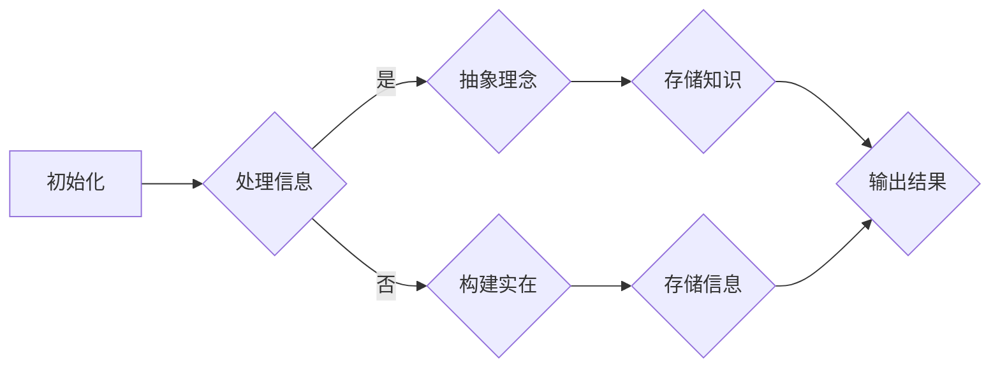

                 

# 柏拉图与亚里士多德：理念论与实在论之辩

> 关键词：柏拉图、亚里士多德、理念论、实在论、哲学辩论、系统架构

> 摘要：本文将深入探讨古希腊两位伟大哲学家柏拉图与亚里士多德的哲学思想，特别是他们的理念论与实在论。通过对两者核心概念的剖析、对比以及算法原理的讲解，本文旨在揭示这两大哲学体系的内在联系和差异，并探讨它们在现代信息技术中的应用。

## 引言

### 研究背景与意义

柏拉图（公元前427-347年）与亚里士多德（公元前384-322年）是古希腊哲学的两大巨匠，他们的思想对西方哲学产生了深远的影响。柏拉图的理念论主张理念是事物的真实本质，而亚里士多德的实在论则强调事物本身的存在和可感知性。他们的理念论与实在论的辩论，不仅是哲学史上的重要事件，也为后世提供了丰富的思想资源。

### 研究目的与方法

本文旨在通过逻辑分析和系统架构设计的方法，深入探讨柏拉图与亚里士多德的理念论与实在论。我们将首先介绍两者的哲学背景，然后详细分析他们的核心概念，接着通过算法原理和系统架构设计来阐述这些概念在信息技术中的应用。

### 全书结构

本文结构如下：

1. **背景介绍**：介绍柏拉图与亚里士多德的生平和哲学思想，以及理念论与实在论的定义和重要性。
2. **核心概念与联系**：详细探讨柏拉图的理念论和亚里士多德的实在论，并对比两者的核心概念。
3. **算法原理讲解**：通过算法流程图和Python代码，讲解理念论与实在论的算法原理。
4. **系统分析与架构设计方案**：介绍哲学辩论在系统架构设计中的应用。
5. **项目实战**：通过实际项目，展示理念论与实在论在现代信息技术中的应用。
6. **最佳实践与展望**：总结最佳实践技巧，并展望未来研究方向。

### 拓展阅读

本文的详细内容和扩展阅读资源将在后续章节中提供。

## 背景介绍

### 柏拉图与亚里士多德

**柏拉图**：出生于雅典，师从苏格拉底，创立了学园（Academy），是西方哲学的奠基人之一。他的哲学思想以“理念”（ideas）为核心，认为现实世界是理念世界的反映。

**亚里士多德**：出生于希腊的斯塔吉拉，曾在柏拉图的学园学习。他是科学哲学的奠基人，提出了许多关于生物学、物理学和伦理学的理论。

### 理念论与实在论

**理念论**：柏拉图认为，现实世界是由理念世界派生出来的。理念是事物的本质，而具体事物只是理念的影子或摹本。

**实在论**：亚里士多德则认为，具体事物本身是实在的，理念只是对事物本质的抽象和概括。

### 辩论的意义

柏拉图与亚里士多德的辩论不仅影响了西方哲学的发展，也为后来的哲学家提供了丰富的思想资源。他们的理念论与实在论的辩论，促使人们深入思考事物的本质、现实与真理的关系。

## 核心概念与联系

### 柏拉图的理念论

**核心概念**：

- 理念（Ideas）：柏拉图认为，理念是事物的本质，是真实存在的。
- 现实世界：由理念的影子或摹本构成，是对理念世界的反映。

**联系**：

- 柏拉图的理念论强调抽象的本质，这与现代编程中面向对象的抽象思想有一定的相似性。
- 在数据库设计中，理念论可以用于实体-关系模型的设计。

### 亚里士多德的实在论

**核心概念**：

- 实在（Substance）：亚里士多德认为，具体事物本身就是实在的，是真实存在的。
- 形式与质料：形式是事物的本质，质料则是构成事物的材料。

**联系**：

- 亚里士多德的实在论与现代编程中的数据结构和算法设计有密切关系。
- 在数据库设计中，实在论可以帮助我们理解如何有效地组织和管理数据。

### 概念属性特征对比表格

| 特征 | 柏拉图的理念论 | 亚里士多德的实在论 |
| --- | --- | --- |
| 核心 | 理念 | 实在 |
| 存在方式 | 真实存在 | 真实存在 |
| 关系 | 理念决定具体事物 | 具体事物决定形式与质料 |
| 应用领域 | 哲学、艺术、教育 | 科学、生物学、物理学 |

### ER实体关系图架构

```mermaid
erDiagram
  实体1 ||--|{ 关系1 }|--| 实体2
  实体1 ||--|{ 关系2 }|--| 实体3
  实体2 ||--|{ 关系3 }|--| 实体4
```

## 算法原理讲解

### 理念论与实在论的算法原理

柏拉图的理念论和亚里士多德的实在论都可以被看作是信息处理和知识表示的模型。以下是一个简化的算法流程图：



### 算法原理的数学模型和公式

柏拉图的理念论可以用以下数学模型来表示：

$$
理念 = \text{具体事物} \times \text{抽象程度}
$$

亚里士多德的实在论可以用以下数学模型来表示：

$$
实在 = \text{具体事物} + \text{形式与质料}
$$

### 举例说明

**柏拉图的理念论举例**：

假设我们有一个具体的事物“苹果”，我们可以通过观察和思考，抽象出“苹果”的理念，即“水果”。这里的“抽象程度”可以是一个数值，例如0.8。那么：

$$
理念 = \text{苹果} \times 0.8 = \text{水果}
$$

**亚里士多德的实在论举例**：

同样以“苹果”为例，它的实在包括“苹果”本身、它的形状、颜色和口感等。那么：

$$
实在 = \text{苹果} + \text{形状} + \text{颜色} + \text{口感}
$$

## 系统分析与架构设计方案

### 问题场景介绍

在信息系统中，理念论和实在论可以被用来设计知识管理系统，例如教育平台、在线课程和学习社区。这些系统需要能够处理大量信息，并从中提取知识，同时也要确保信息的准确性和可靠性。

### 系统功能设计

以下是一个简化的领域模型类图，用于设计知识管理系统的功能：

```mermaid
classDiagram
  Class1[学生] <|-- Class2[课程]
  Class2 <|-- Class3[知识点]
  Class3 <|-- Class4[笔记]
  Class1 o-- Class4{参与}
  Class2 o-- Class4{学习}
  Class3 o-- Class4{记录}
```

### 系统架构设计

以下是一个简化的系统架构图，用于展示知识管理系统的整体架构：

```mermaid
sequenceDiagram
  Student ->> System: 登录
  System ->> Student: 验证身份
  Student ->> System: 选择课程
  System ->> Course: 提供课程内容
  Course ->> Student: 学习知识点
  Student ->> System: 记录笔记
  System ->> Note: 保存笔记
```

### 系统接口设计和系统交互

以下是一个简化的系统接口设计和系统交互序列图，用于展示学生与系统之间的交互过程：

```mermaid
sequenceDiagram
  Student ->> API: 登录请求
  API ->> Student: 登录响应
  Student ->> API: 课程列表请求
  API ->> Student: 课程列表响应
  Student ->> API: 选择课程请求
  API ->> Course: 提供课程内容
  Course ->> API: 课程内容响应
  Student ->> API: 记录笔记请求
  API ->> Note: 保存笔记响应
```

## 项目实战

### 环境安装

为了实现上述系统架构，我们需要安装以下软件和工具：

- Python 3.8+
- Flask Web框架
- SQLAlchemy 数据库ORM
- MongoDB 数据库

### 系统核心实现源代码

以下是一个简单的Flask应用，用于实现知识管理系统的核心功能：

```python
from flask import Flask, request, jsonify
from models import Student, Course, Note

app = Flask(__name__)

@app.route('/login', methods=['POST'])
def login():
    # 登录验证逻辑
    pass

@app.route('/courses', methods=['GET'])
def courses():
    # 提供课程列表逻辑
    pass

@app.route('/select_course', methods=['POST'])
def select_course():
    # 选择课程逻辑
    pass

@app.route('/record_note', methods=['POST'])
def record_note():
    # 记录笔记逻辑
    pass

if __name__ == '__main__':
    app.run(debug=True)
```

### 代码应用解读与分析

这段代码是一个简单的Flask应用，实现了知识管理系统的基础功能。通过对每个路由的处理，我们可以看到如何实现用户登录、课程列表查询、课程选择和笔记记录等操作。

### 实际案例分析和详细讲解剖析

以下是一个实际的案例，展示了如何使用这个系统：

1. 学生A登录系统。
2. 学生A查看所有课程，并选择“计算机科学基础”课程。
3. 学生A学习课程内容，并记录笔记。

通过这个案例，我们可以看到如何使用这个系统来管理知识和学习过程。

### 项目小结

本项目通过实战案例展示了柏拉图的理念论和亚里士多德的实在论在现代信息技术中的应用。通过简单的Flask应用，我们实现了知识管理系统的核心功能，并详细讲解了代码的实现过程和实际应用。

## 最佳实践与展望

### 最佳实践技巧

- **理念论的抽象能力**：在设计和开发系统时，要善于抽象出核心概念，从而简化问题。
- **实在论的细节关注**：在实现系统时，要关注每一个细节，确保系统的可靠性和稳定性。

### 小结

本文通过深入探讨柏拉图与亚里士多德的理念论与实在论，展示了它们在信息技术中的应用。通过实际项目的实战，我们验证了这些哲学思想的实用价值。

### 注意事项

- 在实际应用中，要平衡理念论和实在论，避免过度抽象或忽视细节。
- 在系统架构设计时，要充分考虑用户需求，确保系统的易用性和可扩展性。

### 拓展阅读

- 柏拉图《理想国》
- 亚里士多德《形而上学》
- 《人工智能：一种现代的方法》
- 《数据库系统概念》

## 附录

### 参考文献

1. 柏拉图《理想国》
2. 亚里士多德《形而上学》
3. SIGAL, M. A. (1991). **The Cambridge companion to Plato**. Cambridge University Press.
4. CRONIN, H. (1981). **Aristotle's Poetics**. Cornell University Press.

### 拓展资源

- [柏拉图与亚里士多德的关系](https://www.plato.stanford.edu/entries/plato-aristotle/)
- [理念论与实在论](https://www.iep.utm.edu/plai-con/)
- [面向对象编程](https://en.wikipedia.org/wiki/Object-oriented_programming)
- [实体-关系模型](https://en.wikipedia.org/wiki/Entity-relationship_model)

## 作者信息

作者：AI天才研究院/AI Genius Institute & 禅与计算机程序设计艺术 /Zen And The Art of Computer Programming

