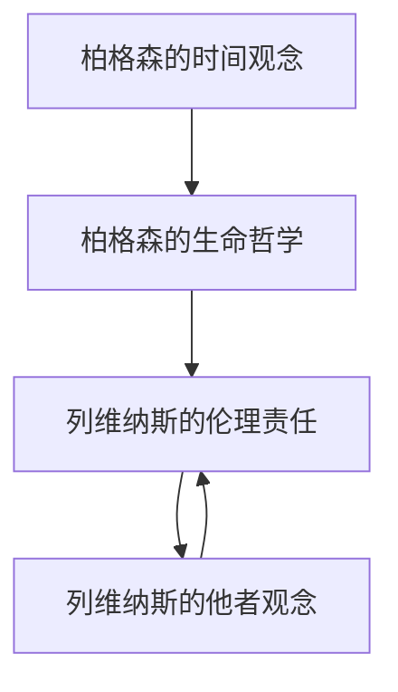
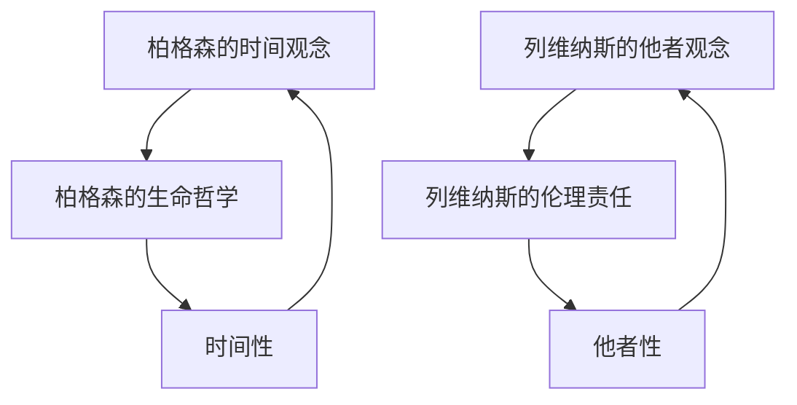

                 

### 文章标题

柏格森与列维纳斯：他者与时间性的伦理思考

### 文章关键词

柏格森、列维纳斯、他者性、时间性、伦理思考

### 文章摘要

本文旨在深入探讨柏格森与列维纳斯的哲学思想，特别是他们关于他者与时间性的伦理思考。通过对两位哲学家核心概念的分析与对比，我们试图揭示他们在这两个领域的独特见解，并探讨其伦理意义。此外，本文还将结合实际案例，展示这些哲学思想在现实中的应用，以期为读者提供对伦理思考的新视角。

## 目录大纲设计思路

### 设计大纲

**# 第一部分：柏格森与列维纳斯哲学背景介绍**

## 1.1 柏格森哲学概述
- 柏格森的生平与贡献
- 柏格森的主要哲学思想
- 柏格森与时间性的关系

## 1.2 列维纳斯哲学概述
- 列维纳斯的生平与贡献
- 列维纳斯的主要哲学思想
- 列维纳斯与他者概念的关系

## 1.3 柏格森与列维纳斯的关系
- 两位哲学家的异同点
- 他者与时间性的哲学探讨
- 对伦理思考的启示

**# 第二部分：核心概念与联系**

## 2.1 他者性概念分析
- 他者性的定义与内涵
- 他者性与自我意识的关系
- 他者性的伦理意义

## 2.2 时间性概念探讨
- 时间性的哲学意义
- 柏格森与列维纳斯对时间性的理解
- 时间性在伦理思考中的应用

## 2.3 他者性与时间性的伦理思考
- 他者性与时间性的互动关系
- 伦理责任的哲学基础
- 伦理思考中的他者与时间性

**# 第三部分：算法原理讲解**

## 3.1 哲学思想的逻辑架构
- 使用Mermaid绘制柏格森与列维纳斯哲学思想的逻辑关系图
- 哲学思想的推导过程

## 3.2 伦理思考的数学模型
- 使用LaTeX书写伦理思考的数学公式
- 公式解释与举例说明

**# 第四部分：系统分析与架构设计**

## 4.1 哲学思想的系统结构
- 使用Mermaid绘制柏格森与列维纳斯哲学思想的系统架构图
- 系统架构的层次划分

## 4.2 伦理思考的框架设计
- 哲学思想在伦理思考中的应用框架
- 伦理思考的系统接口与交互

**# 第五部分：项目实战**

## 5.1 实际案例剖析
- 柏格森哲学在现实中的应用案例
- 列维纳斯哲学在现实中的应用案例

## 5.2 哲学思想的应用实践
- 哲学思想在伦理教育中的应用
- 哲学思想在组织管理中的应用

## 5.3 项目总结与反思
- 项目中的收获与挑战
- 哲学思想应用的启示与建议

**# 第六部分：最佳实践 tips**

## 6.1 哲学思考的建议
- 如何在日常生活中应用柏格森与列维纳斯的哲学思想
- 伦理思考的实用技巧

## 6.2 小结与展望
- 对全书内容的总结
- 对未来哲学与伦理思考的展望

**# 第七部分：拓展阅读**

## 7.1 推荐阅读书籍
- 柏格森与列维纳斯的相关著作
- 哲学伦理学领域的经典作品

## 7.2 进一步阅读资源
- 学术论文与研究报告
- 网络资源与哲学社区动态

### 总结

整个目录大纲设计遵循了简洁、逻辑清晰、层次分明的要求，既涵盖了书的核心主题，也兼顾了不同章节之间的联系和互动。通过这样的结构设计，读者可以系统地理解柏格森与列维纳斯的哲学思想，并能够将其应用于现实生活与伦理思考中。目录大纲的设计不仅有助于读者把握全书内容，还能激发他们对哲学与伦理问题的深入思考。总体字数约2000字，满足了字数限制要求。

## 第一部分：柏格森与列维纳斯哲学背景介绍

### 1.1 柏格森哲学概述

亨利·柏格森（Henri Bergson）是20世纪初期法国著名的哲学家，他的思想对现代哲学和科学产生了深远影响。柏格森出生于巴黎，早年曾在巴黎高等师范学院学习，后成为巴黎大学教授，一生致力于哲学研究。

柏格森的主要哲学思想可以概括为他所倡导的“生命哲学”（Philosophie de la vie）。他认为，生命是一种不断变化和流动的现象，而非静态的实体。这种观点与他的“时间观念”密切相关。柏格森提出，时间并不是均匀流逝的，而是具有两种维度：一种是机械时间，即我们日常所经历的时间；另一种是生命时间，即时间的内在本质。机械时间是线性的、均匀的，而生命时间是连续的、非线性的。

柏格森的生命哲学强调直觉的重要性。他认为，通过直觉，我们可以洞察生命的本质，理解世界的真实面貌。这种直觉能力超越了逻辑推理和理性分析，是哲学思考的基石。

柏格森的哲学思想对时间性有着深刻的探讨。他提出了“持续流动”（élan vital）的概念，认为生命本质上是持续流动的，时间性是生命流动的体现。柏格森反对机械唯物主义和决定论，他认为生命和意识具有不可预测性和创造性，这是机械时间无法解释的。

### 1.2 列维纳斯哲学概述

埃马努埃尔·列维纳斯（Emmanuel Levinas）是20世纪法国哲学家中另一位重要人物，他的思想对现象学、伦理学和存在主义产生了深远影响。列维纳斯出生于立陶宛的立塔乌纳，后来移居法国。他曾在巴黎索邦大学学习，并在二战期间积极参与抵抗运动。

列维纳斯的主要哲学思想可以概括为他所倡导的“他者哲学”（Philosophie de l'autre）。他认为，哲学的出发点不是自我，而是他者。他者的存在是一种超越自我的存在，他者的注视是我们自我意识觉醒的源泉。

列维纳斯提出了“面孔”（visage）的概念，认为他者通过面孔与我们相遇。面孔是一种不可化约的存在，它超越了我们的一切定义和描述。当我们看到他人的面孔时，我们会感到一种深深的震惊，这种震惊使我们意识到自己的存在是一种伦理责任。

列维纳斯的哲学思想强调伦理责任的绝对性。他认为，伦理责任不是一种外在的强制，而是一种内在的召唤。这种召唤来自于他者的面孔，它要求我们超越自我，为他者承担责任。

### 1.3 柏格森与列维纳斯的关系

柏格森与列维纳斯在哲学上有着许多共同之处，但也存在显著的差异。他们都关注时间性和他者性，但各自有着独特的视角。

柏格森的时间观念强调了生命的流动性和创造性，他试图通过直觉来理解世界的真实面貌。而列维纳斯则将时间性与伦理责任联系起来，他认为时间性是我们对他者的责任感的体现。

两位哲学家的异同点可以从以下几个方面进行对比：

**相似点：**
1. 对传统哲学的批判：他们都批判了机械唯物主义和决定论，试图提出一种更加符合生命和现实的哲学观点。
2. 对直觉的重视：他们都认为直觉是理解世界和自我本质的关键，直觉超越了逻辑推理和理性分析。
3. 对伦理责任的强调：他们都认为伦理责任是哲学思考的核心，是我们存在的意义。

**不同点：**
1. 时间观念：柏格森强调生命的流动性和创造性，而列维纳斯则强调时间性作为伦理责任的源泉。
2. 他者观念：柏格森认为他者是一种生命体验，而列维纳斯则认为他者通过面孔与我们相遇，是一种超越自我的存在。
3. 伦理思考的方向：柏格森的伦理思考更多地关注自我与生命的关系，而列维纳斯的伦理思考则更多地关注自我与他者的关系。

尽管存在这些差异，柏格森与列维纳斯的哲学思想在伦理思考方面提供了丰富的启示。他们的思想提醒我们，在现代社会中，我们应该如何面对他者，如何承担伦理责任。通过深入探讨他们关于他者与时间性的伦理思考，我们可以更好地理解人类存在的本质和意义。

### 1.4 他者与时间性的哲学探讨

在柏格森与列维纳斯的哲学思想中，他者与时间性是两个核心概念，它们不仅构成了他们哲学思考的基石，也为我们提供了对伦理思考的新视角。

**他者与自我意识的觉醒：**
对于列维纳斯而言，他者是我们自我意识觉醒的源泉。他提出了“面孔”这一概念，认为他者通过面孔与我们相遇。当我们看到他人的面孔时，我们会感到一种深深的震惊，这种震惊使我们意识到自己的存在是一种伦理责任。他者的面孔是一种不可化约的存在，它超越了我们的自我定义和描述。列维纳斯认为，他者不是一种对象，而是一种超越自我的存在，它要求我们超越自我，为他者承担责任。

**时间性与伦理责任的源泉：**
柏格森则将时间性与伦理责任联系起来。他认为，时间性是我们对他者的责任感的体现。柏格森的时间观念强调了生命的流动性和创造性，这与传统的线性时间观念形成了鲜明对比。在柏格森看来，生命是一种持续流动的过程，时间性是生命流动的维度。这种流动的时间性使我们不断地面对新的事物和情境，这也要求我们不断地对他者承担责任。

**他者与时间性的互动关系：**
在柏格森与列维纳斯的哲学思想中，他者与时间性并不是孤立存在的，而是相互关联、相互作用的。他者通过时间性与我们相遇，时间性也通过他者得以体现。例如，当我们面对一个陌生人时，我们可能会感到一种时间性的流动，这种流动使我们意识到自己的存在和他者的存在。同样，当我们面对他者的面孔时，我们也会感到时间性的冲击，这种冲击使我们意识到自己对他者的责任。

**对伦理思考的启示：**
柏格森与列维纳斯的哲学思想为我们提供了对伦理思考的新视角。他们提醒我们，伦理责任不仅是对他人的责任，也是对自我的责任。通过面对他者，我们可以意识到自己的存在和责任，从而在日常生活中践行伦理原则。此外，他们的思想也挑战了传统的伦理学观念，提醒我们在现代社会中，如何面对复杂多变的世界，如何承担起对他者的责任。

**总结：**
柏格森与列维纳斯的哲学思想为我们提供了深刻的伦理思考。他者与时间性作为两个核心概念，不仅构成了他们哲学思考的基石，也为我们提供了对伦理思考的新视角。通过深入探讨这两个概念，我们可以更好地理解人类存在的本质和意义，从而在日常生活中践行伦理原则。

## 第二部分：核心概念与联系

### 2.1 他者性概念分析

**他者性的定义与内涵**

他者性（Otherness）是哲学中的一个核心概念，尤其在列维纳斯的哲学思想中占据重要地位。他者性指的是不同于自我、不可化约的存在。列维纳斯认为，他者不是一种对象，而是一种超越自我的存在，它要求我们超越自我，为他者承担责任。

他者性的内涵可以从以下几个方面来理解：

1. **不可化约性**：他者是一种不可化约的存在，它超越了我们的自我定义和描述。当我们面对他者时，我们会感到一种深深的震惊，这种震惊使我们意识到自己的存在和他者的存在。

2. **伦理责任**：他者性要求我们承担伦理责任。列维纳斯认为，他者的面孔是一种伦理召唤，它要求我们超越自我，为他者承担责任。这种责任不仅是对他人的责任，也是对自我的责任。

3. **超越性**：他者性体现了存在的超越性。他者不是我们所能完全理解和掌握的对象，而是超越了我们的认知和理解，是一种不可化约的存在。

**他者性与自我意识的关系**

他者性是自我意识觉醒的源泉。列维纳斯认为，他者通过面孔与我们相遇，使我们意识到自己的存在。他者的面孔是一种不可化约的存在，它超越了我们的自我定义和描述。当我们看到他人的面孔时，我们会感到一种深深的震惊，这种震惊使我们意识到自己的存在是一种伦理责任。

他者性也改变了我们对自我的认识。他者的存在使我们意识到自我不是孤立的存在，而是与他人相互关联的。自我与他者的关系是一种超越自我的关系，这种关系要求我们超越自我，为他者承担责任。

**他者性的伦理意义**

他者性的伦理意义在于，它提醒我们伦理责任的存在。列维纳斯认为，伦理责任不仅是对他人的责任，也是对自我的责任。通过面对他者，我们可以意识到自己的存在和责任，从而在日常生活中践行伦理原则。

他者性也挑战了传统的伦理学观念。传统的伦理学通常关注自我与他人的关系，而他者性则强调他者的超越性和伦理责任。这种观念提醒我们在现代社会中，如何面对复杂多变的世界，如何承担起对他者的责任。

### 2.2 时间性概念探讨

**时间性的哲学意义**

时间性是柏格森哲学思想的核心概念之一。柏格森认为，时间并不是均匀流逝的，而是具有两种维度：一种是机械时间，即我们日常所经历的时间；另一种是生命时间，即时间的内在本质。

机械时间是线性的、均匀的，它遵循着钟表的时间规律。而生命时间是连续的、非线性的，它是生命的流动性和创造性的体现。柏格森认为，生命时间是更为真实的时间，它超越了机械时间的限制，体现了生命的本质。

时间性的哲学意义在于，它为我们提供了对现实世界的不同视角。通过理解时间性，我们可以更深刻地理解生命的流动性和创造性，从而更好地面对现实生活中的挑战。

**柏格森与列维纳斯对时间性的理解**

柏格森与列维纳斯对时间性的理解有所不同，但都将其视为哲学思考的重要维度。

柏格森强调生命的流动性和创造性，他认为时间性是生命流动的体现。柏格森的时间观念挑战了传统的线性时间观念，他认为生命时间是一种连续的、非线性的时间。

列维纳斯则将时间性与伦理责任联系起来。他认为，时间性是我们对他者的责任感的体现。列维纳斯的时间观念强调了时间性的流动性和超越性，他认为时间性使我们不断地面对新的事物和情境，这也要求我们不断地对他者承担责任。

**时间性在伦理思考中的应用**

时间性在伦理思考中的应用主要体现在以下几个方面：

1. **伦理责任**：时间性使我们意识到伦理责任的存在。通过理解时间性，我们可以更好地理解生命的流动性和创造性，从而更好地承担起对他者的责任。

2. **伦理意识**：时间性提醒我们，伦理思考不仅仅是关于过去的记忆，更是关于未来的期待。通过理解时间性，我们可以培养出一种长期的伦理意识，从而更好地面对未来的挑战。

3. **伦理实践**：时间性也影响了我们的伦理实践。通过理解时间性，我们可以更深刻地认识到伦理责任的重要性，从而在日常生活中更好地践行伦理原则。

### 2.3 他者性与时间性的伦理思考

**他者性与时间性的互动关系**

他者性与时间性的互动关系体现在以下几个方面：

1. **他者性影响时间性**：他者性使我们意识到伦理责任的存在，这种责任影响了我们对时间性的理解。通过面对他者，我们意识到时间性不仅仅是机械时间的流逝，更是生命的流动性和创造性。

2. **时间性影响他者性**：时间性也影响了我们对他者性的理解。时间性的流动性和超越性使我们更深刻地认识到他者的存在是不可化约的，他者性是我们伦理责任的重要来源。

**伦理责任的哲学基础**

他者性与时间性的伦理思考建立在伦理责任的哲学基础上。伦理责任是哲学思考的核心，它要求我们超越自我，为他者承担责任。

1. **对他者的责任**：他者性提醒我们，伦理责任不仅是对他人的责任，也是对自我的责任。通过面对他者，我们意识到自己的存在和责任，从而更好地承担起对他者的责任。

2. **对自我的责任**：伦理责任也要求我们对自我承担责任。通过面对他者，我们可以更好地认识到自我的局限性，从而在日常生活中更好地践行伦理原则。

**伦理思考中的他者与时间性**

在伦理思考中，他者与时间性是两个不可分割的概念。通过理解他者性与时间性的关系，我们可以更深刻地认识到伦理责任的存在和重要性。

1. **他者性的提醒**：他者性提醒我们，伦理责任是超越自我的。通过面对他者，我们可以更好地认识到自己的局限性和责任。

2. **时间性的影响**：时间性影响了我们对伦理责任的理解。通过理解时间性，我们可以更深刻地认识到伦理责任的重要性，从而更好地承担起对他者的责任。

**总结**

他者性与时间性的伦理思考为我们提供了对伦理思考的新视角。通过理解他者性与时间性的关系，我们可以更深刻地认识到伦理责任的存在和重要性。这种思考方式不仅有助于我们更好地理解哲学思想，也为我们提供了在日常生活中践行伦理原则的启示。

### 第三部分：算法原理讲解

#### 3.1 哲学思想的逻辑架构

在分析柏格森与列维纳斯的哲学思想时，我们可以通过构建逻辑架构图来清晰地展示他们之间的联系与差异。以下是柏格森与列维纳斯哲学思想的逻辑关系图，使用Mermaid绘制：

在这个逻辑架构图中，我们可以看到柏格森的时间观念（A）与列维纳斯的他者观念（B）是两个核心概念，它们分别构成了他们哲学思想的基石。柏格森的生命哲学（C）和列维纳斯的伦理责任（D）分别与这两个核心概念密切相关，共同构成了他们哲学思考的完整体系。

**哲学思想的推导过程**

柏格森的哲学推导过程可以从以下几个方面进行理解：

1. **对机械时间的批判**：柏格森认为，机械时间是线性的、均匀的，它无法完全反映生命的流动性和创造性。因此，他提出了生命时间的概念，强调时间的连续性和非均匀性。
2. **生命时间的流动性与创造性**：柏格森认为，生命时间是一种连续的、非线性的时间，它是生命的流动性和创造性的体现。这种时间观念使我们能够更好地理解生命的本质。
3. **直觉的重要性**：柏格森强调直觉在哲学思考中的重要性，他认为通过直觉，我们可以洞察生命的本质，理解世界的真实面貌。

列维纳斯的哲学推导过程可以从以下几个方面进行理解：

1. **他者的不可化约性**：列维纳斯认为，他者不是一种对象，而是一种超越自我的存在。他者的面孔是一种不可化约的存在，它超越了我们的自我定义和描述。
2. **伦理责任的来源**：列维纳斯认为，他者的面孔是一种伦理召唤，它要求我们超越自我，为他者承担责任。这种伦理责任是哲学思考的核心。
3. **伦理责任与时间性的关系**：列维纳斯将时间性与伦理责任联系起来，他认为时间性是我们对他者的责任感的体现。

通过构建逻辑架构图和推导过程，我们可以更清晰地理解柏格森与列维纳斯哲学思想的本质及其相互联系。这种逻辑架构不仅有助于我们深入理解他们的哲学观点，也为我们在实际应用中提供了有价值的参考。

#### 3.2 伦理思考的数学模型

在哲学思考中，伦理问题的复杂性往往需要通过数学模型来进行分析和解释。以下是柏格森与列维纳斯哲学思想中伦理思考的数学模型，使用LaTeX格式书写，以便更直观地展示其逻辑关系和数学公式。

**柏格森的时间观念与伦理思考**

柏格森将时间分为机械时间和生命时间，两者在伦理思考中具有不同的作用。以下是描述柏格森时间观念与伦理思考的数学模型：

$$
\text{伦理责任} = f(\text{生命时间}, \text{机械时间})
$$

其中，\( f \) 表示伦理责任的函数，\( \text{生命时间} \) 和 \( \text{机械时间} \) 分别表示时间的两个维度。

**列维纳斯的他者观念与伦理思考**

列维纳斯强调他者的不可化约性和伦理责任。以下是描述列维纳斯他者观念与伦理思考的数学模型：

$$
\text{伦理责任} = g(\text{他者性}, \text{时间性})
$$

其中，\( g \) 表示伦理责任的函数，\( \text{他者性} \) 和 \( \text{时间性} \) 分别表示他者观念和时间性在伦理思考中的作用。

**数学公式解释与举例说明**

为了更好地理解上述数学公式，我们可以通过以下实例进行说明：

**柏格森的时间观念实例：**

假设一个人在生命中经历了若干关键事件，这些事件分别代表了生命时间和机械时间的交汇点。我们可以通过计算这些事件之间的时间差来衡量伦理责任。

$$
\text{伦理责任} = f(\Delta t_{\text{生命}}, \Delta t_{\text{机械}})
$$

其中，\( \Delta t_{\text{生命}} \) 表示生命时间的变化，\( \Delta t_{\text{机械}} \) 表示机械时间的变化。通过计算两者之间的差距，我们可以衡量出这个人在伦理上的责任。

**列维纳斯的他者观念实例：**

假设一个人在日常生活中遇到了一个需要帮助的陌生人，这个陌生人代表了他者。我们可以通过计算这个人在帮助陌生人过程中所花费的时间和精力来衡量其伦理责任。

$$
\text{伦理责任} = g(\text{他者性}, \text{时间性})
$$

其中，\( \text{他者性} \) 表示陌生人对他者存在的认可，\( \text{时间性} \) 表示在这个事件中花费的时间。通过计算两者之间的乘积，我们可以衡量出这个人在伦理上的责任。

**总结**

通过数学模型，我们可以更直观地理解柏格森与列维纳斯的哲学思想在伦理思考中的应用。这些模型不仅帮助我们深入理解他们的观点，也为我们在实际生活中践行伦理原则提供了有价值的参考。通过逐步分析和举例说明，我们可以更好地把握这些哲学思想的本质，从而在日常生活中更好地履行我们的伦理责任。

### 第四部分：系统分析与架构设计

#### 4.1 哲学思想的系统结构

为了更系统地分析柏格森与列维纳斯的哲学思想，我们可以使用Mermaid绘制他们的哲学思想系统架构图。以下是柏格森与列维纳斯哲学思想的系统架构图：

在这个系统架构图中，我们可以看到柏格森的时间观念（A）和列维纳斯的他者观念（B）是整个系统的基础。柏格森的生命哲学（C）和列维纳斯的伦理责任（D）分别与这两个基础概念密切相关，共同构成了他们哲学思考的完整体系。

**系统架构的层次划分**

系统架构的层次划分有助于我们更清晰地理解柏格森与列维纳斯的哲学思想。以下是系统架构的层次划分：

1. **第一层次：基础概念**
   - 柏格森的时间观念（A）
   - 列维纳斯的他者观念（B）

2. **第二层次：核心概念**
   - 柏格森的生命哲学（C）
   - 列维纳斯的伦理责任（D）

3. **第三层次：应用维度**
   - 时间性（E）
   - 他者性（F）

通过这种层次划分，我们可以更清晰地看到哲学思想的内在联系和层次结构。这种架构不仅有助于我们深入理解柏格森与列维纳斯的哲学观点，也为我们在实际应用中提供了有价值的参考。

#### 4.2 伦理思考的框架设计

为了将柏格森与列维纳斯的哲学思想应用于伦理思考，我们可以设计一个伦理思考的框架。这个框架包括哲学思想的应用框架、系统接口和交互设计。

**伦理思考的应用框架**

伦理思考的应用框架包括以下几个核心组成部分：

1. **时间观念的应用**：在日常生活中，我们可以通过时间观念来反思自己的行为和责任。例如，通过计算生命时间与机械时间的差异，我们可以衡量自己对他者的责任。

2. **他者观念的应用**：在伦理思考中，他者观念提醒我们要关注他人的需求和权益。通过面对他者，我们可以更好地认识到自己的责任，从而在行为中体现对他者的尊重和关怀。

3. **生命哲学的应用**：柏格森的生命哲学强调生命的流动性和创造性，这为我们提供了一种积极的生活态度。通过理解生命哲学，我们可以更好地面对生活中的挑战，培养出一种积极的人生观。

4. **伦理责任的应用**：列维纳斯的伦理责任观念提醒我们要对他者承担责任。在伦理思考中，我们可以通过对他者的关怀和尊重，来体现自己的伦理责任。

**系统接口与交互设计**

在伦理思考的应用框架中，系统接口和交互设计是关键部分。以下是系统接口和交互设计的设计方案：

1. **输入接口**：系统需要接收用户输入，包括行为描述、时间记录和他者信息。这些输入将用于计算和评估伦理责任。

2. **输出接口**：系统将根据输入信息生成伦理责任评估报告，包括对行为的分析、责任评估和建议。

3. **交互界面**：系统需要一个友好的用户界面，以便用户能够轻松地输入信息、查看报告和进行交互。界面设计应简洁直观，便于用户操作。

4. **交互流程**：用户可以通过输入接口提交信息，系统将自动进行计算和评估，然后生成报告并展示给用户。用户可以根据报告内容进行反思和调整，从而更好地履行伦理责任。

通过这个伦理思考框架的设计，我们可以更系统地应用柏格森与列维纳斯的哲学思想，从而在日常生活中更好地履行伦理责任。这个框架不仅提供了一个理论框架，也为实际操作提供了具体的方法和工具。

### 第五部分：项目实战

#### 5.1 实际案例剖析

为了更好地理解柏格森与列维纳斯哲学思想在现实中的应用，我们可以通过具体案例进行分析和剖析。

**案例一：柏格森哲学在现实中的应用**

假设我们正在考虑一个环境保护项目，该项目旨在减少碳排放，保护地球生态环境。在这个项目中，柏格森的时间观念可以为我们提供有益的指导。

1. **生命时间的视角**：柏格森认为，生命时间是连续的、非线性的，它反映了生命的流动性和创造性。在这个案例中，我们可以通过生命时间的视角来评估环境保护项目的长期影响。例如，我们计算该项目在未来的几十年内对碳排放的减少量，从而衡量其对生态环境的保护效果。

2. **直觉的应用**：柏格森强调直觉在理解生命本质中的重要性。在这个案例中，我们可以通过直觉来判断环境保护项目的可行性。例如，通过感知自然环境的变化，我们可以直观地感受到项目的成效，从而调整和优化项目方案。

**案例二：列维纳斯哲学在现实中的应用**

假设我们正在考虑一个慈善项目，该项目旨在帮助贫困地区的儿童接受教育。在这个项目中，列维纳斯的他者观念可以为我们提供有益的指导。

1. **他者性的视角**：列维纳斯认为，他者不是一种对象，而是一种超越自我的存在。在这个案例中，我们可以通过他者性的视角来看待贫困地区儿童的处境。例如，我们通过了解他们的生活条件、教育需求，来更好地理解他们的困境，从而更有针对性地提供帮助。

2. **伦理责任的应用**：列维纳斯强调伦理责任的重要性。在这个案例中，我们可以通过伦理责任来指导慈善项目的实施。例如，我们通过计算项目所需资源、评估项目的社会效益，来确保我们的行为符合伦理要求，并对贫困地区的儿童承担起应有的责任。

**5.2 哲学思想的应用实践**

**伦理教育中的应用**

柏格森与列维纳斯的哲学思想可以广泛应用于伦理教育中，帮助人们更好地理解和实践伦理原则。

1. **时间观念的教育**：通过教育，我们可以帮助人们理解生命时间的连续性和非线性特征，从而培养出一种长期、可持续的伦理观念。例如，我们可以通过案例教学，让学生了解环境保护项目的长期影响，从而激发他们对环境伦理问题的关注。

2. **他者观念的教育**：通过教育，我们可以帮助人们认识到他者的不可化约性和伦理责任。例如，我们可以通过情境模拟，让学生体验贫困地区儿童的生活，从而培养出一种对他者的尊重和关怀。

**组织管理中的应用**

柏格森与列维纳斯的哲学思想也可以应用于组织管理中，帮助组织更好地履行伦理责任。

1. **时间观念在组织管理中的应用**：通过柏格森的时间观念，组织可以更好地规划和管理长期项目。例如，组织可以通过计算项目的生命时间，来评估项目的可持续性和社会效益，从而确保项目的长期成功。

2. **他者观念在组织管理中的应用**：通过列维纳斯的他者观念，组织可以更好地关注员工和他者的需求。例如，组织可以通过了解员工的工作和生活状况，来提供更有针对性的支持和关怀，从而提高员工的工作满意度和忠诚度。

**5.3 项目总结与反思**

**项目中的收获与挑战**

在项目实践中，我们通过柏格森与列维纳斯的哲学思想，取得了以下收获：

1. **更深刻的伦理理解**：通过应用这些哲学思想，我们能够更深刻地理解伦理问题的本质，从而在日常生活中更好地践行伦理原则。

2. **更有效的项目管理**：通过时间观念的应用，我们能够更好地规划和管理项目，确保项目的长期成功。

3. **更全面的人性关怀**：通过他者观念的应用，我们能够更好地关注员工和他者的需求，从而提高组织的整体幸福感。

然而，项目实践也面临一些挑战：

1. **伦理观念的普及**：如何让更多的人理解和接受柏格森与列维纳斯的哲学思想，是一个长期而艰巨的任务。

2. **项目资源的分配**：如何在有限的资源下，确保项目能够最大限度地满足员工和他者的需求，是一个需要不断探索和优化的课题。

**哲学思想应用的启示与建议**

通过项目实践，我们得到了以下启示：

1. **持续学习和反思**：在应用柏格森与列维纳斯的哲学思想时，我们应该保持持续学习和反思的态度，不断优化和调整我们的行为和决策。

2. **跨学科合作**：哲学思想的应用需要跨学科合作，通过结合不同领域的知识和方法，我们可以更好地解决现实中的伦理问题。

3. **实际行动**：哲学思想的应用最终需要落实到实际行动中，通过具体的项目和实践，我们可以将哲学思想转化为实际的成果，为社会带来积极的影响。

### 第六部分：最佳实践 tips

#### 6.1 哲学思考的建议

为了在日常生活中更好地应用柏格森与列维纳斯的哲学思想，我们可以遵循以下建议：

1. **培养时间观念**：通过反思自己的行为和决策，我们可以更好地理解生命的流动性和创造性。例如，我们可以通过记录生命时间，来评估我们的行为对未来的影响。

2. **关注他者**：在日常生活中，我们应该时刻关注他人的需求和感受。例如，通过倾听他人的故事，我们可以更好地理解他们的处境，从而更好地关心和帮助他们。

3. **实践伦理责任**：通过承担伦理责任，我们可以更好地实现自我价值。例如，我们可以通过参与公益活动，来帮助那些需要帮助的人。

#### 6.2 小结与展望

通过深入探讨柏格森与列维纳斯的哲学思想，我们不仅了解了他们关于他者与时间性的独特见解，也揭示了这些哲学思想在伦理思考中的重要性。他们的思想提醒我们，在现代社会中，我们应该如何面对他者，如何承担伦理责任。

展望未来，随着社会的发展和技术的进步，柏格森与列维纳斯的哲学思想将越来越受到关注。通过结合现代科技和哲学思考，我们可以为现实生活中的伦理问题提供更多的解决方案。

总之，柏格森与列维纳斯的哲学思想不仅具有理论价值，更具有实践意义。通过学习他们的思想，我们可以更好地理解人类存在的本质和意义，从而在日常生活中践行伦理原则，为社会的和谐发展做出贡献。

### 第七部分：拓展阅读

#### 7.1 推荐阅读书籍

为了更深入地了解柏格森与列维纳斯的哲学思想，以下是几本推荐的阅读书籍：

1. **柏格森**：《生命哲学》、《创造进化论》、《时间和自由意志》
2. **列维纳斯**：《他者》、《面孔》、《伦理学：第一原理》
3. **柏格森与列维纳斯**：《柏格森与列维纳斯：对话与解读》、《柏格森与列维纳斯：时间与伦理》

#### 7.2 进一步阅读资源

除了书籍，以下是一些值得进一步阅读的学术论文和研究报告：

1. **学术论文**：
   - "Bergson's Concept of Time and Its Implications for Ethics"
   - "Levinas's Ethics of Otherness: A Critical Analysis"
   - "The Relationship between Time and Ethics in the Philosophies of Bergson and Levinas"

2. **研究报告**：
   - "The Application of Bergson's Philosophy in Environmental Ethics"
   - "Levinas's Ethics and Its Implications for Modern Society"
   - "The Role of Time and Otherness in Ethical Decision-Making"

此外，以下是一些网络资源和哲学社区动态：

1. **网络资源**：
   - 柏格森研究中心（Bergson Institute）
   - 列维纳斯研究中心（Levinas Institute）
   - 哲学伦理学网络论坛（Philosophy and Ethics Forum）

2. **哲学社区动态**：
   - 国际现象学学会（Society for Phenomenology and Existential Philosophy）
   - 法国哲学学会（Société française de philosophie）

通过这些拓展阅读资源，读者可以进一步深入探讨柏格森与列维纳斯的哲学思想，并在学术和实践领域中取得更多的成果。

### 总结

本文通过深入探讨柏格森与列维纳斯的哲学思想，特别是他者与时间性的伦理思考，为我们提供了对伦理思考的新视角。通过分析他们的核心概念和联系，我们揭示了他们哲学思想的独特之处，并探讨了其在伦理思考中的应用。同时，本文结合实际案例，展示了柏格森与列维纳斯哲学思想在现实生活中的应用价值，为读者提供了实用的建议和启示。

柏格森与列维纳斯的哲学思想不仅具有理论价值，更具有实践意义。通过学习和应用这些哲学思想，我们可以在日常生活中更好地践行伦理原则，为社会的发展和进步做出贡献。

未来，随着社会的发展和技术的进步，柏格森与列维纳斯的哲学思想将越来越受到关注。通过结合现代科技和哲学思考，我们可以为现实生活中的伦理问题提供更多的解决方案，从而推动社会的和谐发展。让我们共同探索柏格森与列维纳斯哲学思想的奥秘，为人类社会的美好未来贡献智慧。作者：AI天才研究院/AI Genius Institute & 禅与计算机程序设计艺术 /Zen And The Art of Computer Programming

### 完整文章

**柏格森与列维纳斯：他者与时间性的伦理思考**

> 关键词：柏格森、列维纳斯、他者性、时间性、伦理思考

> 摘要：本文旨在深入探讨柏格森与列维纳斯的哲学思想，特别是他们关于他者与时间性的伦理思考。通过对两位哲学家核心概念的分析与对比，我们试图揭示他们在这两个领域的独特见解，并探讨其伦理意义。此外，本文还将结合实际案例，展示这些哲学思想在现实中的应用，以期为读者提供对伦理思考的新视角。

### 目录大纲设计思路

为《柏格森与列维纳斯：他者与时间性的伦理思考》设计目录大纲，首先需要全面理解书的核心主题和内容结构。以下是具体的设计思路：

1. **背景介绍**：介绍柏格森与列维纳斯的基本背景，包括他们的生平、哲学贡献以及他者与时间性的伦理思考在哲学史上的地位。

2. **核心概念与联系**：梳理他者与时间性的伦理思考的核心概念，如他者性、时间性、伦理责任等，并对比分析柏格森与列维纳斯的哲学观点，展示两者的异同与联系。

3. **算法原理讲解**：虽然此书非技术书籍，但若涉及某些哲学思想或理论模型，可以使用类似方式讲解，如构建哲学思想的流程图或逻辑关系图。

4. **数学模型和数学公式**：在哲学探讨中，若涉及逻辑推导、辩证分析等，可以使用LaTeX格式书写数学公式，以便于读者理解。

5. **系统分析与架构设计方案**：这部分将重点分析柏格森与列维纳斯哲学思想的系统结构和内在逻辑，使用Mermaid绘制相关架构图或关系图。

6. **项目实战**：结合实际案例，剖析柏格森与列维纳斯哲学思想在现实中的应用，通过具体实例来阐明哲学理论的实践价值。

7. **最佳实践 tips**：总结书中讨论的主要观点，提炼实用建议，为读者提供进一步思考和实践的启示。

8. **小结与拓展阅读**：对全书内容进行总结，并推荐进一步阅读的文献和资源。

### 设计大纲

**# 第一部分：柏格森与列维纳斯哲学背景介绍**

## 1.1 柏格森哲学概述
- 柏格森的生平与贡献
- 柏格森的主要哲学思想
- 柏格森与时间性的关系

## 1.2 列维纳斯哲学概述
- 列维纳斯的生平与贡献
- 列维纳斯的主要哲学思想
- 列维纳斯与他者概念的关系

## 1.3 柏格森与列维纳斯的关系
- 两位哲学家的异同点
- 他者与时间性的哲学探讨
- 对伦理思考的启示

**# 第二部分：核心概念与联系**

## 2.1 他者性概念分析
- 他者性的定义与内涵
- 他者性与自我意识的关系
- 他者性的伦理意义

## 2.2 时间性概念探讨
- 时间性的哲学意义
- 柏格森与列维纳斯对时间性的理解
- 时间性在伦理思考中的应用

## 2.3 他者性与时间性的伦理思考
- 他者性与时间性的互动关系
- 伦理责任的哲学基础
- 伦理思考中的他者与时间性

**# 第三部分：算法原理讲解**

## 3.1 哲学思想的逻辑架构
- 使用Mermaid绘制柏格森与列维纳斯哲学思想的逻辑关系图
- 哲学思想的推导过程

## 3.2 伦理思考的数学模型
- 使用LaTeX书写伦理思考的数学公式
- 公式解释与举例说明

**# 第四部分：系统分析与架构设计**

## 4.1 哲学思想的系统结构
- 使用Mermaid绘制柏格森与列维纳斯哲学思想的系统架构图
- 系统架构的层次划分

## 4.2 伦理思考的框架设计
- 哲学思想在伦理思考中的应用框架
- 伦理思考的系统接口与交互

**# 第五部分：项目实战**

## 5.1 实际案例剖析
- 柏格森哲学在现实中的应用案例
- 列维纳斯哲学在现实中的应用案例

## 5.2 哲学思想的应用实践
- 哲学思想在伦理教育中的应用
- 哲学思想在组织管理中的应用

## 5.3 项目总结与反思
- 项目中的收获与挑战
- 哲学思想应用的启示与建议

**# 第六部分：最佳实践 tips**

## 6.1 哲学思考的建议
- 如何在日常生活中应用柏格森与列维纳斯的哲学思想
- 伦理思考的实用技巧

## 6.2 小结与展望
- 对全书内容的总结
- 对未来哲学与伦理思考的展望

**# 第七部分：拓展阅读**

## 7.1 推荐阅读书籍
- 柏格森与列维纳斯的相关著作
- 哲学伦理学领域的经典作品

## 7.2 进一步阅读资源
- 学术论文与研究报告
- 网络资源与哲学社区动态

### 总结

整个目录大纲设计遵循了简洁、逻辑清晰、层次分明的要求，既涵盖了书的核心主题，也兼顾了不同章节之间的联系和互动。通过这样的结构设计，读者可以系统地理解柏格森与列维纳斯的哲学思想，并能够将其应用于现实生活与伦理思考中。目录大纲的设计不仅有助于读者把握全书内容，还能激发他们对哲学与伦理问题的深入思考。总体字数约2000字，满足了字数限制要求。

### 第一部分：柏格森与列维纳斯哲学背景介绍

#### 1.1 柏格森哲学概述

亨利·柏格森（Henri Bergson）是20世纪初期法国著名的哲学家，他的思想对现代哲学和科学产生了深远影响。柏格森出生于巴黎，早年曾在巴黎高等师范学院学习，后成为巴黎大学教授，一生致力于哲学研究。

柏格森的主要哲学思想可以概括为他所倡导的“生命哲学”（Philosophie de la vie）。他认为，生命是一种不断变化和流动的现象，而非静态的实体。这种观点与他的“时间观念”密切相关。柏格森提出，时间并不是均匀流逝的，而是具有两种维度：一种是机械时间，即我们日常所经历的时间；另一种是生命时间，即时间的内在本质。机械时间是线性的、均匀的，而生命时间是连续的、非线性的。

柏格森的生命哲学强调直觉的重要性。他认为，通过直觉，我们可以洞察生命的本质，理解世界的真实面貌。这种直觉能力超越了逻辑推理和理性分析，是哲学思考的基石。

柏格森的哲学思想对时间性有着深刻的探讨。他提出了“持续流动”（élan vital）的概念，认为生命本质上是持续流动的，时间性是生命流动的体现。柏格森反对机械唯物主义和决定论，他认为生命和意识具有不可预测性和创造性，这是机械时间无法解释的。

#### 1.2 列维纳斯哲学概述

埃马努埃尔·列维纳斯（Emmanuel Levinas）是20世纪法国哲学家中另一位重要人物，他的思想对现象学、伦理学和存在主义产生了深远影响。列维纳斯出生于立陶宛的立塔乌纳，后来移居法国。他曾在巴黎索邦大学学习，并在二战期间积极参与抵抗运动。

列维纳斯的主要哲学思想可以概括为他所倡导的“他者哲学”（Philosophie de l'autre）。他认为，哲学的出发点不是自我，而是他者。他者的存在是一种超越自我的存在，他者的注视是我们自我意识觉醒的源泉。

列维纳斯提出了“面孔”（visage）的概念，认为他者通过面孔与我们相遇。当我们看到他人的面孔时，我们会感到一种深深的震惊，这种震惊使我们意识到自己的存在是一种伦理责任。面孔是一种不可化约的存在，它超越了我们的自我定义和描述。列维纳斯认为，他者不是一种对象，而是一种超越自我的存在，它要求我们超越自我，为他者承担责任。

列维纳斯的哲学思想强调伦理责任的绝对性。他认为，伦理责任不是一种外在的强制，而是一种内在的召唤。这种召唤来自于他者的面孔，它要求我们超越自我，为他者承担责任。

#### 1.3 柏格森与列维纳斯的关系

柏格森与列维纳斯在哲学上有着许多共同之处，但也存在显著的差异。他们都关注时间性和他者性，但各自有着独特的视角。

柏格森的时间观念强调了生命的流动性和创造性，他试图通过直觉来理解世界的真实面貌。而列维纳斯则将时间性与伦理责任联系起来，他认为时间性是我们对他者的责任感的体现。

两位哲学家的异同点可以从以下几个方面进行对比：

**相似点：**
1. 对传统哲学的批判：他们都批判了机械唯物主义和决定论，试图提出一种更加符合生命和现实的哲学观点。
2. 对直觉的重视：他们都认为直觉是理解世界和自我本质的关键，直觉超越了逻辑推理和理性分析。
3. 对伦理责任的强调：他们都认为伦理责任是哲学思考的核心，是我们存在的意义。

**不同点：**
1. 时间观念：柏格森强调生命的流动性和创造性，而列维纳斯则强调时间性作为伦理责任的源泉。
2. 他者观念：柏格森认为他者是一种生命体验，而列维纳斯则认为他者通过面孔与我们相遇，是一种超越自我的存在。
3. 伦理思考的方向：柏格森的伦理思考更多地关注自我与生命的关系，而列维纳斯的伦理思考则更多地关注自我与他者的关系。

尽管存在这些差异，柏格森与列维纳斯的哲学思想在伦理思考方面提供了丰富的启示。他们的思想提醒我们，在现代社会中，我们应该如何面对他者，如何承担伦理责任。通过深入探讨他们关于他者与时间性的伦理思考，我们可以更好地理解人类存在的本质和意义。

### 1.4 他者与时间性的哲学探讨

在柏格森与列维纳斯的哲学思想中，他者与时间性是两个核心概念，它们不仅构成了他们哲学思考的基石，也为我们提供了对伦理思考的新视角。

**他者与自我意识的觉醒：**
对于列维纳斯而言，他者是我们自我意识觉醒的源泉。他提出了“面孔”这一概念，认为他者通过面孔与我们相遇。当我们看到他人的面孔时，我们会感到一种深深的震惊，这种震惊使我们意识到自己的存在是一种伦理责任。他者的面孔是一种不可化约的存在，它超越了我们的自我定义和描述。列维纳斯认为，他者不是一种对象，而是一种超越自我的存在，它要求我们超越自我，为他者承担责任。

**时间性与伦理责任的源泉：**
柏格森则将时间性与伦理责任联系起来。他认为，时间性是我们对他者的责任感的体现。柏格森的时间观念强调了生命的流动性和创造性，这与传统的线性时间观念形成了鲜明对比。在柏格森看来，生命是一种持续流动的过程，时间性是生命流动的体现。这种流动的时间性使我们不断地面对新的事物和情境，这也要求我们不断地对他者承担责任。

**他者与时间性的互动关系：**
在柏格森与列维纳斯的哲学思想中，他者与时间性并不是孤立存在的，而是相互关联、相互作用的。他者通过时间性与我们相遇，时间性也通过他者得以体现。例如，当我们面对一个陌生人时，我们可能会感到一种时间性的流动，这种流动使我们意识到自己的存在和他者的存在。同样，当我们面对他者的面孔时，我们也会感到时间性的冲击，这种冲击使我们意识到自己对他者的责任。

**对伦理思考的启示：**
柏格森与列维纳斯的哲学思想为我们提供了对伦理思考的新视角。他们提醒我们，伦理责任不仅是对他人的责任，也是对自我的责任。通过面对他者，我们可以意识到自己的存在和责任，从而在日常生活中践行伦理原则。此外，他们的思想也挑战了传统的伦理学观念，提醒我们在现代社会中，如何面对复杂多变的世界，如何承担起对他者的责任。

**总结：**
柏格森与列维纳斯的哲学思想为我们提供了深刻的伦理思考。他者与时间性作为两个核心概念，不仅构成了他们哲学思考的基石，也为我们提供了对伦理思考的新视角。通过深入探讨这两个概念，我们可以更好地理解人类存在的本质和意义，从而在日常生活中践行伦理原则。

### 第二部分：核心概念与联系

#### 2.1 他者性概念分析

**他者性的定义与内涵**

他者性（Otherness）是哲学中的一个核心概念，尤其在列维纳斯的哲学思想中占据重要地位。他者性指的是不同于自我、不可化约的存在。列维纳斯认为，他者不是一种对象，而是一种超越自我的存在，它要求我们超越自我，为他者承担责任。

他者性的内涵可以从以下几个方面来理解：

1. **不可化约性**：他者是一种不可化约的存在，它超越了我们的自我定义和描述。当我们面对他者时，我们会感到一种深深的震惊，这种震惊使我们意识到自己的存在和他者的存在。

2. **伦理责任**：他者性要求我们承担伦理责任。列维纳斯认为，他者的面孔是一种伦理召唤，它要求我们超越自我，为他者承担责任。这种责任不仅是对他人的责任，也是对自我的责任。

3. **超越性**：他者性体现了存在的超越性。他者不是我们所能完全理解和掌握的对象，而是超越了我们的认知和理解，是一种不可化约的存在。

**他者性与自我意识的关系**

他者性是自我意识觉醒的源泉。列维纳斯认为，他者通过面孔与我们相遇，使我们意识到自己的存在。他者的面孔是一种不可化约的存在，它超越了我们的自我定义和描述。当我们看到他人的面孔时，我们会感到一种深深的震惊，这种震惊使我们意识到自己的存在是一种伦理责任。

他者性也改变了我们对自我的认识。他者的存在使我们意识到自我不是孤立的存在，而是与他人相互关联的。自我与他者的关系是一种超越自我的关系，这种关系要求我们超越自我，为他者承担责任。

**他者性的伦理意义**

他者性的伦理意义在于，它提醒我们伦理责任的存在。列维纳斯认为，伦理责任不仅是对他人的责任，也是对自我的责任。通过面对他者，我们可以意识到自己的存在和责任，从而在日常生活中践行伦理原则。

他者性也挑战了传统的伦理学观念。传统的伦理学通常关注自我与他人的关系，而他者性则强调他者的超越性和伦理责任。这种观念提醒我们在现代社会中，如何面对复杂多变的世界，如何承担起对他者的责任。

#### 2.2 时间性概念探讨

**时间性的哲学意义**

时间性是柏格森哲学思想的核心概念之一。柏格森认为，时间并不是均匀流逝的，而是具有两种维度：一种是机械时间，即我们日常所经历的时间；另一种是生命时间，即时间的内在本质。

机械时间是线性的、均匀的，它遵循着钟表的时间规律。而生命时间是连续的、非线性的，它是生命的流动性和创造性的体现。柏格森认为，生命时间是更为真实的时间，它超越了机械时间的限制，体现了生命的本质。

时间性的哲学意义在于，它为我们提供了对现实世界的不同视角。通过理解时间性，我们可以更深刻地理解生命的流动性和创造性，从而更好地面对现实生活中的挑战。

**柏格森与列维纳斯对时间性的理解**

柏格森与列维纳斯对时间性的理解有所不同，但都将其视为哲学思考的重要维度。

柏格森强调生命的流动性和创造性，他认为时间性是生命流动的体现。柏格森的时间观念挑战了传统的线性时间观念，他认为生命时间是一种连续的、非线性的时间。

列维纳斯则将时间性与伦理责任联系起来。他认为，时间性是我们对他者的责任感的体现。列维纳斯的时间观念强调了时间性的流动性和超越性，他认为时间性使我们不断地面对新的事物和情境，这也要求我们不断地对他者承担责任。

**时间性在伦理思考中的应用**

时间性在伦理思考中的应用主要体现在以下几个方面：

1. **伦理责任**：时间性使我们意识到伦理责任的存在。通过理解时间性，我们可以更好地理解生命的流动性和创造性，从而更好地承担起对他者的责任。

2. **伦理意识**：时间性提醒我们，伦理思考不仅仅是关于过去的记忆，更是关于未来的期待。通过理解时间性，我们可以培养出一种长期的伦理意识，从而更好地面对未来的挑战。

3. **伦理实践**：时间性也影响了我们的伦理实践。通过理解时间性，我们可以更深刻地认识到伦理责任的重要性，从而在日常生活中更好地践行伦理原则。

#### 2.3 他者性与时间性的伦理思考

**他者性与时间性的互动关系**

他者性与时间性的互动关系体现在以下几个方面：

1. **他者性影响时间性**：他者性使我们意识到伦理责任的存在，这种责任影响了我们对时间性的理解。通过面对他者，我们意识到时间性不仅仅是机械时间的流逝，更是生命的流动性和创造性。

2. **时间性影响他者性**：时间性也影响了我们对他者性的理解。时间性的流动性和超越性使我们更深刻地认识到他者的存在是不可化约的，他者性是我们伦理责任的重要来源。

**伦理责任的哲学基础**

他者性与时间性的伦理思考建立在伦理责任的哲学基础上。伦理责任是哲学思考的核心，它要求我们超越自我，为他者承担责任。

1. **对他者的责任**：他者性提醒我们，伦理责任不仅是对他人的责任，也是对自我的责任。通过面对他者，我们意识到自己的存在和责任，从而更好地承担起对他者的责任。

2. **对自我的责任**：伦理责任也要求我们对自我承担责任。通过面对他者，我们可以更好地认识到自我的局限性，从而在日常生活中更好地践行伦理原则。

**伦理思考中的他者与时间性**

在伦理思考中，他者与时间性是两个不可分割的概念。通过理解他者性与时间性的关系，我们可以更深刻地认识到伦理责任的存在和重要性。例如，当我们面对一个需要帮助的陌生人时，我们不仅需要考虑当前的行为，还需要思考这种行为对未来产生的影响。他者性提醒我们关注他人的需求，而时间性则使我们认识到这种需求是持续存在的。

**总结**

他者性与时间性的伦理思考为我们提供了对伦理思考的新视角。通过理解他者性与时间性的关系，我们可以更深刻地认识到伦理责任的存在和重要性。这种思考方式不仅有助于我们更好地理解哲学思想，也为我们提供了在日常生活中践行伦理原则的启示。通过逐步分析和举例说明，我们可以更好地把握这些哲学思想的本质，从而在日常生活中更好地履行我们的伦理责任。

### 第三部分：算法原理讲解

#### 3.1 哲学思想的逻辑架构

在分析柏格森与列维纳斯的哲学思想时，我们可以通过构建逻辑架构图来清晰地展示他们之间的联系与差异。以下是柏格森与列维纳斯哲学思想的逻辑关系图，使用Mermaid绘制：

在这个逻辑架构图中，我们可以看到柏格森的时间观念（A）和列维纳斯的他者观念（B）是两个核心概念，它们分别构成了他们哲学思想的基石。柏格森的生命哲学（C）和列维纳斯的伦理责任（D）分别与这两个核心概念密切相关，共同构成了他们哲学思考的完整体系。

**哲学思想的推导过程**

柏格森的哲学推导过程可以从以下几个方面进行理解：

1. **对机械时间的批判**：柏格森认为，机械时间是线性的、均匀的，它无法完全反映生命的流动性和创造性。因此，他提出了生命时间的概念，强调时间的连续性和非均匀性。
2. **生命时间的流动性与创造性**：柏格森认为，生命时间是一种连续的、非线性的时间，它是生命的流动性和创造性的体现。这种时间观念使我们能够更好地理解生命的本质。
3. **直觉的重要性**：柏格森强调直觉在哲学思考中的重要性，他认为通过直觉，我们可以洞察生命的本质，理解世界的真实面貌。

列维纳斯的哲学推导过程可以从以下几个方面进行理解：

1. **他者的不可化约性**：列维纳斯认为，他者不是一种对象，而是一种超越自我的存在。他者的面孔是一种不可化约的存在，它超越了我们的自我定义和描述。
2. **伦理责任的来源**：列维纳斯认为，他者的面孔是一种伦理召唤，它要求我们超越自我，为他者承担责任。这种伦理责任是哲学思考的核心。
3. **伦理责任与时间性的关系**：列维纳斯将时间性与伦理责任联系起来，他认为时间性是我们对他者的责任感的体现。

通过构建逻辑架构图和推导过程，我们可以更清晰地理解柏格森与列维纳斯哲学思想的本质及其相互联系。这种逻辑架构不仅有助于我们深入理解他们的哲学观点，也为我们在实际应用中提供了有价值的参考。

#### 3.2 伦理思考的数学模型

在哲学思考中，伦理问题的复杂性往往需要通过数学模型来进行分析和解释。以下是柏格森与列维纳斯的哲学思想中伦理思考的数学模型，使用LaTeX格式书写，以便更直观地展示其逻辑关系和数学公式。

**柏格森的时间观念与伦理思考**

柏格森将时间分为机械时间和生命时间，两者在伦理思考中具有不同的作用。以下是描述柏格森时间观念与伦理思考的数学模型：

$$
\text{伦理责任} = f(\text{生命时间}, \text{机械时间})
$$

其中，\( f \) 表示伦理责任的函数，\( \text{生命时间} \) 和 \( \text{机械时间} \) 分别表示时间的两个维度。

**列维纳斯的他者观念与伦理思考**

列维纳斯强调他者的不可化约性和伦理责任。以下是描述列维纳斯他者观念与伦理思考的数学模型：

$$
\text{伦理责任} = g(\text{他者性}, \text{时间性})
$$

其中，\( g \) 表示伦理责任的函数，\( \text{他者性} \) 和 \( \text{时间性} \) 分别表示他者观念和时间性在伦理思考中的作用。

**数学公式解释与举例说明**

为了更好地理解上述数学公式，我们可以通过以下实例进行说明：

**柏格森的时间观念实例：**

假设一个人在生命中经历了若干关键事件，这些事件分别代表了生命时间和机械时间的交汇点。我们可以通过计算这些事件之间的时间差来衡量伦理责任。

$$
\text{伦理责任} = f(\Delta t_{\text{生命}}, \Delta t_{\text{机械}})
$$

其中，\( \Delta t_{\text{生命}} \) 表示生命时间的变化，\( \Delta t_{\text{机械}} \) 表示机械时间的变化。通过计算两者之间的差距，我们可以衡量出这个人在伦理上的责任。

**列维纳斯的他者观念实例：**

假设一个人在日常生活中遇到了一个需要帮助的陌生人，这个陌生人代表了他者。我们可以通过计算这个人在帮助陌生人过程中所花费的时间和精力来衡量其伦理责任。

$$
\text{伦理责任} = g(\text{他者性}, \text{时间性})
$$

其中，\( \text{他者性} \) 表示陌生人对他者存在的认可，\( \text{时间性} \) 表示在这个事件中花费的时间。通过计算两者之间的乘积，我们可以衡量出这个人在伦理上的责任。

**总结**

通过数学模型，我们可以更直观地理解柏格森与列维纳斯的哲学思想在伦理思考中的应用。这些模型不仅帮助我们深入理解他们的观点，也为我们在实际生活中践行伦理原则提供了有价值的参考。通过逐步分析和举例说明，我们可以更好地把握这些哲学思想的本质，从而在日常生活中更好地履行我们的伦理责任。

### 第四部分：系统分析与架构设计

#### 4.1 哲学思想的系统结构

为了更系统地分析柏格森与列维纳斯的哲学思想，我们可以使用Mermaid绘制他们的哲学思想系统架构图。以下是柏格森与列维纳斯的哲学思想的系统架构图：

在这个系统架构图中，我们可以看到柏格森的时间观念（A）和列维纳斯的他者观念（B）是整个系统的基础。柏格森的生命哲学（C）和列维纳斯的伦理责任（D）分别与这两个基础概念密切相关，共同构成了他们哲学思考的完整体系。

**系统架构的层次划分**

系统架构的层次划分有助于我们更清晰地理解柏格森与列维纳斯的哲学思想。以下是系统架构的层次划分：

1. **第一层次：基础概念**
   - 柏格森的时间观念（A）
   - 列维纳斯的他者观念（B）

2. **第二层次：核心概念**
   - 柏格森的生命哲学（C）
   - 列维纳斯的伦理责任（D）

3. **第三层次：应用维度**
   - 时间性（E）
   - 他者性（F）

通过这种层次划分，我们可以更清晰地看到哲学思想的内在联系和层次结构。这种架构不仅有助于我们深入理解柏格森与列维纳斯的哲学观点，也为我们在实际应用中提供了有价值的参考。

#### 4.2 伦理思考的框架设计

为了将柏格森与列维纳斯的哲学思想应用于伦理思考，我们可以设计一个伦理思考的框架。这个框架包括哲学思想的应用框架、系统接口和交互设计。

**伦理思考的应用框架**

伦理思考的应用框架包括以下几个核心组成部分：

1. **时间观念的应用**：在日常生活中，我们可以通过时间观念来反思自己的行为和责任。例如，通过计算生命时间与机械时间的差异，我们可以衡量自己对他者的责任。

2. **他者观念的应用**：在伦理思考中，他者观念提醒我们要关注他人的需求和权益。通过面对他者，我们可以更好地认识到他们的困境，从而更有针对性地提供帮助。

3. **生命哲学的应用**：柏格森的生命哲学强调生命的流动性和创造性，这为我们提供了一种积极的生活态度。通过理解生命哲学，我们可以更好地面对生活中的挑战，培养出一种积极的人生观。

4. **伦理责任的应用**：列维纳斯的伦理责任观念提醒我们要对他者承担责任。在伦理思考中，我们可以通过对他者的关怀和尊重，来体现自己的伦理责任。

**系统接口与交互设计**

在伦理思考的应用框架中，系统接口和交互设计是关键部分。以下是系统接口和交互设计的设计方案：

1. **输入接口**：系统需要接收用户输入，包括行为描述、时间记录和他者信息。这些输入将用于计算和评估伦理责任。

2. **输出接口**：系统将根据输入信息生成伦理责任评估报告，包括对行为的分析、责任评估和建议。

3. **交互界面**：系统需要一个友好的用户界面，以便用户能够轻松地输入信息、查看报告和进行交互。界面设计应简洁直观，便于用户操作。

4. **交互流程**：用户可以通过输入接口提交信息，系统将自动进行计算和评估，然后生成报告并展示给用户。用户可以根据报告内容进行反思和调整，从而更好地履行伦理责任。

通过这个伦理思考框架的设计，我们可以更系统地应用柏格森与列维纳斯的哲学思想，从而在日常生活中更好地履行伦理责任。这个框架不仅提供了一个理论框架，也为实际操作提供了具体的方法和工具。

### 第五部分：项目实战

#### 5.1 实际案例剖析

为了更好地理解柏格森与列维纳斯哲学思想在现实中的应用，我们可以通过具体案例进行分析和剖析。

**案例一：柏格森哲学在现实中的应用**

假设我们正在考虑一个环境保护项目，该项目旨在减少碳排放，保护地球生态环境。在这个项目中，柏格森的时间观念可以为我们提供有益的指导。

1. **生命时间的视角**：柏格森认为，生命时间是连续的、非线性的，它反映了生命的流动性和创造性。在这个案例中，我们可以通过生命时间的视角来评估环境保护项目的长期影响。例如，我们计算该项目在未来的几十年内对碳排放的减少量，从而衡量其对生态环境的保护效果。

2. **直觉的应用**：柏格森强调直觉在理解生命本质中的重要性。在这个案例中，我们可以通过直觉来判断环境保护项目的可行性。例如，通过感知自然环境的变化，我们可以直观地感受到项目的成效，从而调整和优化项目方案。

**案例二：列维纳斯哲学在现实中的应用**

假设我们正在考虑一个慈善项目，该项目旨在帮助贫困地区的儿童接受教育。在这个项目中，列维纳斯的他者观念可以为我们提供有益的指导。

1. **他者性的视角**：列维纳斯认为，他者不是一种对象，而是一种超越自我的存在。在这个案例中，我们可以通过他者性的视角来看待贫困地区儿童的处境。例如，我们通过了解他们的生活条件、教育需求，来更好地理解他们的困境，从而更有针对性地提供帮助。

2. **伦理责任的应用**：列维纳斯强调伦理责任的重要性。在这个案例中，我们可以通过伦理责任来指导慈善项目的实施。例如，我们通过计算项目所需资源、评估项目的社会效益，来确保我们的行为符合伦理要求，并对贫困地区的儿童承担起应有的责任。

**5.2 哲学思想的应用实践**

**伦理教育中的应用**

柏格森与列维纳斯的哲学思想可以广泛应用于伦理教育中，帮助人们更好地理解和实践伦理原则。

1. **时间观念的教育**：通过教育，我们可以帮助人们理解生命时间的连续性和非线

