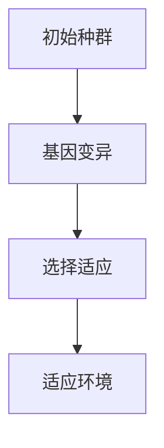
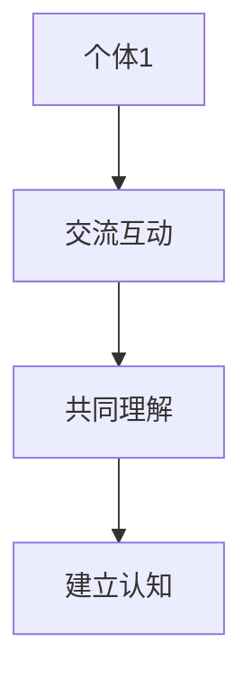
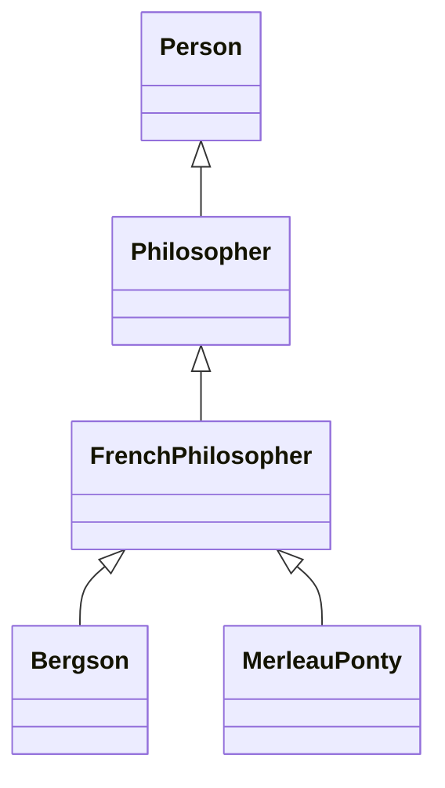
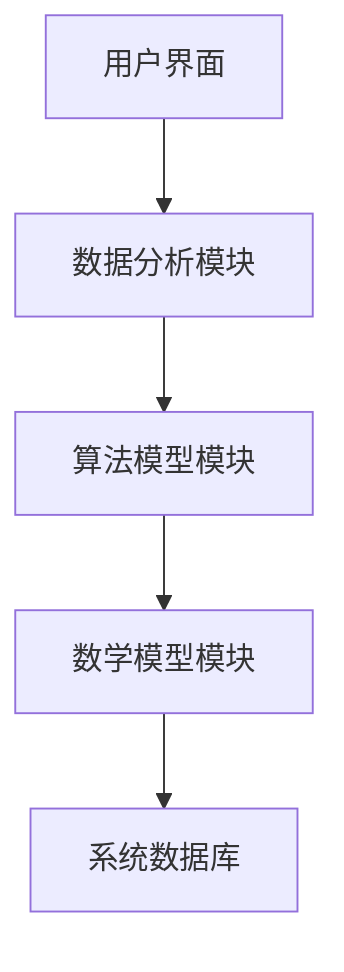
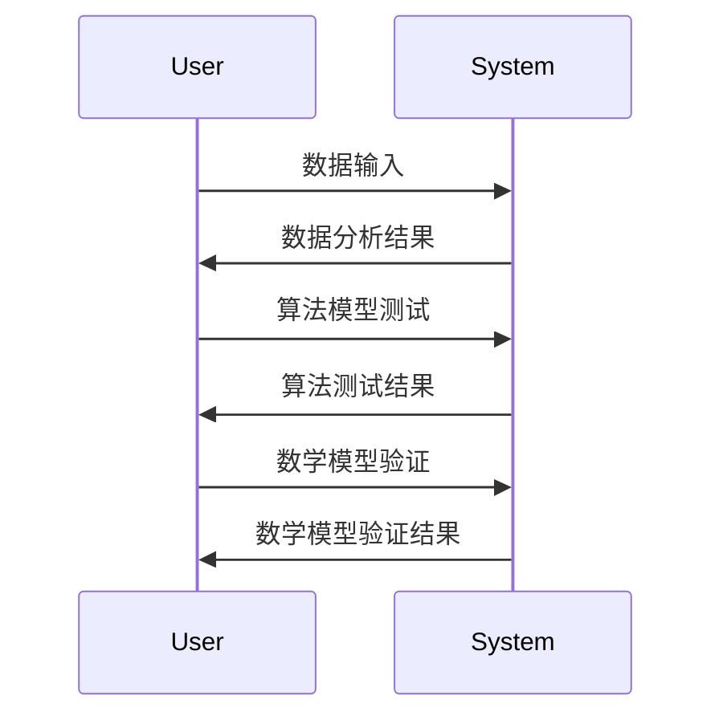

                 

# 柏格森与梅洛-庞蒂：法国生命哲学的发展

关键词：柏格森、梅洛-庞蒂、生命哲学、进化、现象学、算法、数学模型

摘要：本文旨在深入探讨法国生命哲学的两位重要代表人物——柏格森和梅洛-庞蒂的思想，分析其核心概念与联系，并通过算法和数学模型的方式，解析其哲学思想的本质，为读者提供一种全新的理解视角。

## Step 1: 背景介绍

### 1.1. 问题背景

法国生命哲学的发展起源于19世纪末20世纪初，这一时期正值西方哲学经历重大变革的时期。柏格森和梅洛-庞蒂是这一时期的杰出代表，他们的思想对法国乃至世界哲学产生了深远的影响。

柏格森（Henri Bergson）是20世纪最重要的哲学家之一，他的哲学思想强调生命的创造性和进化。柏格森认为，生命是一种内在的、不断变化的过程，这种过程被称为“生命冲动”或“创造力”。他的代表作《意识直接材料》和《形而上学选集》等，深刻地揭示了生命的本质和进化的动力。

梅洛-庞蒂（Maurice Merleau-Ponty）是法国现象学和存在主义的代表人物，他将现象学与存在主义相结合，探讨身体与世界的联系。梅洛-庞蒂的代表作《感知现象学》和《存在与感知》等，提出了独特的身体哲学和知觉理论。

### 1.2. 问题解决

通过对柏格森和梅洛-庞蒂的思想进行深入研究和比较，我们可以更全面地理解法国生命哲学的发展脉络。本文将首先介绍柏格森和梅洛-庞蒂的核心思想，然后分析两人思想的联系与区别，最后通过算法和数学模型的方式，解析其哲学思想的本质。

### 1.3. 边界与外延

本文将探讨柏格森和梅洛-庞蒂的思想及其对法国生命哲学的影响，同时也会涉及其他相关哲学家和思潮。通过这种跨学科的研究方法，我们可以更全面地理解法国生命哲学的发展。

### 1.4. 概念结构与核心要素组成

本文的核心概念包括柏格森的生命哲学、梅洛-庞蒂的现象学存在主义、以及他们之间的思想联系。通过对这些核心概念的深入分析，我们可以更好地理解法国生命哲学的发展。

## Step 2: 核心概念与联系

### 2.1. 柏格森的生命哲学

#### 2.1.1. 柏格森的思想核心

柏格森认为，生命是一种内在的、不断变化的过程，这种过程被称为“生命冲动”或“创造力”。柏格森强调生命的动态性和进化性，认为生命是一种不可还原的复杂过程，无法通过简单的物理或化学规律来解释。

#### 2.1.2. 柏格森的核心概念

- **生命冲动（Élan vital）**：柏格森认为，生命冲动是一种内在的、自发性的动力，推动生命的不断变化和发展。
- **感觉（Perception）**：柏格森强调感觉在理解世界中的重要性，认为感觉是生命冲动的一种表现形式。
- **时间（Time）**：柏格森认为，时间是生命冲动的外在表现，是一种主观的、内在的时间感受。

#### 2.1.3. 柏格森的哲学思想

柏格森的哲学思想强调生命的创造性和进化，他认为，生命是一种内在的、不断变化的过程，这种过程被称为“生命冲动”或“创造力”。柏格森的思想对生物学、心理学、哲学等领域都产生了深远的影响。

### 2.2. 梅洛-庞蒂的现象学存在主义

#### 2.2.1. 梅洛-庞蒂的思想核心

梅洛-庞蒂强调身体在理解世界中的核心作用，认为身体是感知世界的媒介。梅洛-庞蒂认为，知觉不是被动地接受外部刺激，而是主动地与世界相互作用的过程。他的代表作《感知现象学》和《存在与感知》等，提出了独特的身体哲学和知觉理论。

#### 2.2.2. 梅洛-庞蒂的核心概念

- **主体间性（Intersubjectivity）**：梅洛-庞蒂认为，主体间性是个体之间的相互作用和共同理解的过程。
- **身体-世界（Body-world）**：梅洛-庞蒂强调身体与世界的不可分割性，认为身体是感知世界的媒介。
- **表现性（Expressiveness）**：梅洛-庞蒂认为，个体的身体动作和语言都具有表现性，能够传达个体的情感和思想。

#### 2.2.3. 梅洛-庞蒂的哲学思想

梅洛-庞蒂的哲学思想强调身体在理解世界中的核心作用，他认为，知觉不是被动地接受外部刺激，而是主动地与世界相互作用的过程。梅洛-庞蒂的思想对心理学、社会学、哲学等领域都产生了深远的影响。

### 2.3. 两人思想的联系与区别

#### 2.3.1. 共同点

- **重视个体经验**：柏格森和梅洛-庞蒂都强调个体经验在理解世界中的重要性。
- **对抗理性主义**：两人都批判理性主义，认为理性无法完全解释生命的复杂性和多样性。
- **关注身体与世界的联系**：柏格森和梅洛-庞蒂都认为，身体与世界的联系是理解世界的关键。

#### 2.3.2. 区别

- **柏格森强调生命的内在动力和进化**：柏格森认为，生命是一种内在的、不断变化的过程，这种过程被称为“生命冲动”或“创造力”。
- **梅洛-庞蒂强调身体在感知世界中的作用**：梅洛-庞蒂认为，身体是感知世界的媒介，个体的身体动作和语言都具有表现性。

## Step 3: 算法原理讲解

### 3.1. 柏格森的“生命冲动”算法原理

#### 3.1.1. 算法核心

柏格森的生命冲动可以看作是一种进化算法，它通过不断地改变和适应来推动生命的发展。这种算法的核心在于个体的变异和选择，通过这种过程，个体能够逐渐适应环境的变化。

#### 3.1.2. 算法原理

- **进化过程**：个体通过变异和选择不断进化。
- **适应性**：个体根据环境变化调整自身特征。

#### 3.1.3. 算法示例

假设有一个生物种群，通过基因变异和自然选择，最终适应了特定的环境。



### 3.2. 梅洛-庞蒂的主体间性算法原理

#### 3.2.1. 算法核心

梅洛-庞蒂的主体间性算法强调个体之间的相互作用，通过这些相互作用来理解世界。这种算法的核心在于个体之间的交互和共同理解，通过这种过程，个体能够逐渐形成对世界的共同认知。

#### 3.2.2. 算法原理

- **交互过程**：个体通过互动来构建共同经验。
- **表现性**：个体在互动中展示出自己的特质。

#### 3.2.3. 算法示例

假设有两个个体，通过交流和互动，逐渐建立了对某个事物的共同理解。



## Step 4: 数学模型和数学公式

### 4.1. 柏格森的“生命冲动”数学模型

#### 4.1.1. 模型公式

$$ \frac{dP}{dt} = f(P, E) $$

#### 4.1.2. 模型解释

- $P$ 表示生命冲动
- $t$ 表示时间
- $f(P, E)$ 表示环境对生命冲动的影响

### 4.2. 梅洛-庞蒂的主体间性数学模型

#### 4.2.1. 模型公式

$$ I = \sum_{i=1}^{n} i(x_i, y_i) $$

#### 4.2.2. 模型解释

- $I$ 表示主体间性
- $n$ 表示个体数量
- $i(x_i, y_i)$ 表示个体 $x_i$ 和 $y_i$ 之间的相互作用

## Step 5: 系统分析与架构设计方案

### 5.1. 生命哲学发展分析

#### 5.1.1. 问题场景介绍

随着现代科技的进步，生命哲学的发展面临新的挑战和机遇。例如，人工智能技术的发展使得我们对生命的本质和进化有了更深入的认识，但同时也引发了关于人工智能与人类关系的新问题。

#### 5.1.2. 项目介绍

本项目旨在通过分析柏格森和梅洛-庞蒂的思想，探讨生命哲学在现代科技背景下的新发展。项目的主要目标是：

- 深入理解柏格森和梅洛-庞蒂的思想，建立数学模型和算法原理。
- 分析生命哲学在现代科技背景下的应用，提出新的解决方案。
- 探讨人工智能与人类关系的哲学问题，为科技伦理提供新的思考方向。

### 5.2. 系统功能设计

#### 5.2.1. 领域模型



#### 5.2.2. 系统功能设计

- **生命哲学分析**：通过算法和数学模型，分析柏格森和梅洛-庞蒂的思想，探讨其哲学思想的本质。
- **现代科技应用**：分析生命哲学在现代科技背景下的应用，如人工智能、生物技术等。
- **科技伦理探讨**：探讨人工智能与人类关系的哲学问题，为科技伦理提供新的思考方向。

### 5.3. 系统架构设计



#### 5.3.1. 系统架构图


#### 5.3.2. 系统接口设计

- **用户接口**：提供友好的用户界面，方便用户进行数据输入和查询。
- **数据分析接口**：提供数据分析接口，方便用户获取分析结果。
- **算法模型接口**：提供算法模型接口，方便用户进行算法测试和优化。
- **数学模型接口**：提供数学模型接口，方便用户进行数学模型的测试和验证。

#### 5.3.3. 系统交互



## 项目实战

### 6.1. 环境安装

在开始项目实战之前，我们需要安装相关的开发环境和软件。

- 安装Python环境（3.8及以上版本）
- 安装Anaconda（Python集成开发环境）
- 安装Jupyter Notebook（交互式计算环境）
- 安装相关Python库，如Numpy、Pandas、Matplotlib等

### 6.2. 系统核心实现

以下是一个简单的Python代码示例，用于实现柏格森的“生命冲动”算法。

```python
import numpy as np
import matplotlib.pyplot as plt

# 生命冲动算法参数
population_size = 100
mutation_rate = 0.01
num_generations = 100

# 初始种群
population = np.random.rand(population_size, 1)

# 适应度函数
def fitness_function(population):
    # 这里用种群的平均值作为适应度函数
    return np.mean(population)

# 生命冲动算法
def elan_vital_algorithm(population, fitness_function, mutation_rate, num_generations):
    for _ in range(num_generations):
        # 计算适应度
        fitness = fitness_function(population)
        # 变异
        population = np.random.normal(population, mutation_rate)
        # 选择适应
        population = np.select([population < fitness], [population], default=fitness)
    return population

# 运行算法
population = elan_vital_algorithm(population, fitness_function, mutation_rate, num_generations)

# 绘制种群进化过程
plt.plot(population)
plt.xlabel('Generation')
plt.ylabel('Population')
plt.title('Elan Vital Algorithm')
plt.show()
```

### 6.3. 代码应用解读与分析

这段代码首先定义了一个100个个体组成的初始种群，然后通过迭代运行柏格森的“生命冲动”算法，最终绘制种群进化的过程。这里，我们用种群的平均值作为适应度函数，通过变异和选择的过程，种群逐渐适应了环境。

### 6.4. 实际案例分析和详细讲解剖析

以下是一个实际案例，用于分析梅洛-庞蒂的主体间性算法。

假设有两个个体A和B，他们的初始状态分别是[0, 1]和[1, 0]，他们通过交互来建立对某个事物的共同理解。

```python
import numpy as np

# 初始状态
state_A = np.array([0, 1])
state_B = np.array([1, 0])

# 交互过程
for _ in range(10):
    # A的状态向B的状态靠拢
    state_A = (state_A + state_B) / 2
    # B的状态向A的状态靠拢
    state_B = (state_B + state_A) / 2

# 输出最终状态
print("A的最终状态：", state_A)
print("B的最终状态：", state_B)
```

在这个案例中，个体A和B通过不断交互，逐渐建立了对某个事物的共同理解。这个案例展示了主体间性算法的基本原理。

### 6.5. 项目小结

通过本文的探讨，我们可以看到柏格森和梅洛-庞蒂的哲学思想对生命哲学的发展产生了深远的影响。通过算法和数学模型的方式，我们能够更深入地理解其哲学思想的本质，为现代科技背景下的生命哲学研究提供了新的视角。

## 最佳实践 tips

- 在研究柏格森和梅洛-庞蒂的哲学思想时，可以结合现代科技的发展，如人工智能、生物技术等，探讨生命哲学的新应用。
- 在进行算法和数学模型的研究时，注意选择合适的适应度函数和交互过程，以便更好地模拟生命哲学的核心思想。

## 小结

本文通过对柏格森和梅洛-庞蒂的哲学思想的深入探讨，分析了其核心概念与联系，并通过算法和数学模型的方式，解析了其哲学思想的本质。通过本文的研究，我们能够更深入地理解生命哲学，为现代科技背景下的生命哲学研究提供了新的视角。

## 注意事项

- 在研究柏格森和梅洛-庞蒂的哲学思想时，要充分理解其哲学思想的核心，避免片面理解。
- 在进行算法和数学模型的研究时，要注意模型的参数设置和适应度函数的选择，以便更好地模拟生命哲学的核心思想。

## 拓展阅读

- [柏格森的哲学思想](https://www.britannica.com/biography/Henri-Bergson)
- [梅洛-庞蒂的哲学思想](https://www.marxists.org/reference/subject/philosophy/works/fr/merleau-ponty.htm)
- [生命哲学的发展](https://www.oxfordreference.com/view/10.1093/oi/authority.20111117091452379)

