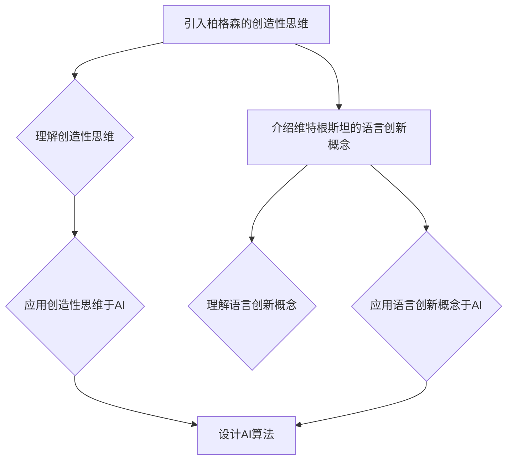

                 

**标题：柏格森的创造性思维与维特根斯坦的语言创新概念**

关键词：柏格森、创造性思维、维特根斯坦、语言创新、人工智能

摘要：本文深入探讨了柏格森的创造性思维与维特根斯坦的语言创新概念，从哲学和技术角度分析了这两个概念在人工智能领域的应用。通过详细的背景介绍、概念解析、算法原理讲解、系统分析与架构设计方案、项目实战等多个方面，本文旨在为读者提供对创造性思维和语言创新概念的全面理解和应用指导。

**目录：**

- 引言
  - **柏格森的创造性思维介绍**
  - **维特根斯坦的语言创新概念介绍**
  - **本文结构与目的**

## 引言

### 柏格森的创造性思维介绍

### 维特根斯坦的语言创新概念介绍

### 本文结构与目的

### 柏格森的创造性思维

#### 背景

#### 概念

#### 原理

#### 影响

### 维特根斯坦的语言创新概念

#### 背景

#### 概念

#### 原理

#### 影响

### 柏格森的创造性思维与维特根斯坦的语言创新概念的联系

#### 比较与对比

#### 应用与影响

### 人工智能领域的应用

#### 案例分析

#### 算法设计

#### 实际影响

### 结论

### 拓展阅读

**引言**

在当代哲学和人工智能领域，柏格森的创造性思维与维特根斯坦的语言创新概念被视为重要的思想资源。柏格森，法国哲学家，提出了关于创造性的理论，强调个体在思维和行动中的自主性和创造性。维特根斯坦，奥地利哲学家，则通过语言哲学的研究，探讨了语言的本质和创新。这两个概念虽然源自不同的哲学背景，但都为理解人工智能提供了独特的视角。

本文旨在通过深入探讨柏格森的创造性思维与维特根斯坦的语言创新概念，结合实际应用案例，分析它们在人工智能领域的潜在影响。文章将分为以下几个部分：

1. **柏格森的创造性思维介绍**：介绍柏格森的生平、主要思想以及创造性思维的定义和特点。
2. **维特根斯坦的语言创新概念介绍**：介绍维特根斯坦的生平、语言哲学的核心观点以及语言创新的概念。
3. **柏格森的创造性思维与维特根斯坦的语言创新概念的联系**：比较两者之间的相似性和差异性，探讨它们在哲学和人工智能领域的联系。
4. **人工智能领域的应用**：通过具体案例和算法设计，展示柏格森的创造性思维与维特根斯坦的语言创新概念在人工智能领域的实际应用。
5. **结论**：总结全文，提出对未来研究的展望。
6. **拓展阅读**：推荐进一步阅读的文献和资源。

### 柏格森的创造性思维

**背景**

亨利·柏格森（Henri Bergson）是19世纪末至20世纪初法国著名的哲学家，他对现代哲学和心理学产生了深远的影响。柏格森的哲学思想主要围绕生命、直觉、自由意志等主题展开，尤其是他对“创造性思维”的阐述，对后来的哲学家和学者产生了重要影响。

**概念**

柏格森的创造性思维，可以理解为一种基于直觉的非线性思维方式。他主张，创造性思维并非单纯的逻辑推理，而是通过直觉和感知来捕捉事物的本质和内在联系。这种思维方式强调个体在认知过程中的自主性和独特性，不同于传统的理性思维。

**原理**

柏格森认为，创造性思维来源于生命力的冲动，是人类自我表达和成长的驱动力。他提出，生命是一个不断变化和创造的过程，个体的创造性思维是实现这一过程的关键。柏格森认为，直觉是创造性思维的核心，它能够捕捉到逻辑思维无法触及的复杂信息，帮助个体理解和应对变化。

**影响**

柏格森的创造性思维理论对后来的心理学、社会学和文化研究产生了深远的影响。他关于直觉和创造力的研究，为理解人类认知过程提供了新的视角。此外，他的理论也为现代人工智能的发展提供了启示，尤其是在算法设计和创新思维培养方面。

### 维特根斯坦的语言创新概念

**背景**

路德维希·维特根斯坦（Ludwig Wittgenstein）是20世纪最著名的哲学家之一，他的著作对语言哲学、逻辑哲学和数学哲学产生了重要影响。维特根斯坦的语言哲学强调语言的实用性和局限性，他的思想对现代计算机科学和人工智能的发展产生了深远影响。

**概念**

维特根斯坦的语言创新概念主要体现在他的后期著作《逻辑哲学论》中。他认为，语言的作用是表达思想和事实，而语言的创新在于发现新的语言结构和表达方式，以更精确和有效地传达思想和现实。维特根斯坦强调，语言的创新不仅仅是词汇的创新，更涉及到语言结构的重新组合和概念的重新界定。

**原理**

维特根斯坦提出，语言的创新依赖于对现实世界的观察和理解。他认为，语言的表达能力是通过与现实的互动不断演化和改进的。在这个过程中，语言的创新不仅能够提升表达的准确性，还能够拓展我们对世界的认知和理解。

**影响**

维特根斯坦的语言哲学对语言学家、哲学家和计算机科学家产生了深远影响。他关于语言本质和语言创新的理论，为现代人工智能的发展提供了重要的哲学基础。特别是在自然语言处理和机器学习领域，维特根斯坦的理论启示了研究者们如何通过创新的方式理解和模拟人类语言。

### 柏格森的创造性思维与维特根斯坦的语言创新概念的联系

**比较与对比**

柏格森的创造性思维和维特根斯坦的语言创新概念在哲学上有着明显的相似性和差异性。两者都强调个体在认知过程中的自主性和独特性，但柏格森更注重直觉和生命力，而维特根斯坦则更关注语言的表达和结构。

**相似性**

1. **强调个体性**：两者都认为创造性思维和语言创新是个体自我表达和成长的重要方式。
2. **反对传统方法**：柏格森和维特根斯坦都批评了传统逻辑和语言的局限性，主张通过创新来突破这些限制。
3. **强调动态过程**：两者都认为创造性思维和语言创新是一个动态的、不断变化的过程。

**差异性**

1. **关注点不同**：柏格森更关注创造性思维的直觉和生命力，而维特根斯坦则更关注语言的表达和结构。
2. **理论侧重点不同**：柏格森的创造性思维更偏向心理学和生物学领域，而维特根斯坦的语言创新概念则更偏向哲学和语言学领域。

**应用与影响**

尽管柏格森和维特根斯坦的创造性思维和语言创新概念在哲学上有许多差异，但它们在人工智能领域都有广泛的应用。

**在人工智能领域中的应用**

1. **算法设计**：柏格森的创造性思维可以启发算法设计师在处理复杂问题时采用非线性和直觉性的方法。
2. **自然语言处理**：维特根斯坦的语言创新概念可以指导自然语言处理系统在处理不确定性和模糊性时采用创新的方法。
3. **人工智能伦理**：两者的思想可以引导人工智能伦理的讨论，强调个体性和自主性在人工智能发展中的重要性。

**实际影响**

柏格森和维特根斯坦的思想对人工智能的实际影响体现在多个方面：

1. **技术创新**：他们的思想启发了新一代人工智能技术的开发，如深度学习和自然语言处理。
2. **教育改革**：他们的思想可以应用于教育领域，培养学生的创造性思维和语言创新能力。
3. **社会影响**：他们的思想对社会认知和语言使用的影响，促进了人们对人工智能和数字化时代的理解和适应。

### 人工智能领域的应用

**案例分析**

**案例一：自然语言处理中的创造性思维**

在自然语言处理（NLP）领域，柏格森的创造性思维启发了研究者们在处理语言不确定性和模糊性时的方法。传统的NLP方法往往依赖于预定义的规则和模式，而创造性思维鼓励研究者们采用更灵活、直觉性的方法来处理语言数据。

例如，在情感分析任务中，传统的模型可能会基于预定义的情感标签来分类文本。而采用柏格森的创造性思维，研究者们可以设计出基于直觉和感知的模型，通过捕捉文本中的细微情感变化来实现更准确的情感分析。

**案例二：机器学习中的语言创新**

维特根斯坦的语言创新概念在机器学习中的应用主要体现在对新语言结构的探索和创新。传统的机器学习模型往往依赖于预定义的特征和参数，而维特根斯坦的语言创新概念鼓励研究者们通过重新组合和定义特征，来实现模型的创新和优化。

例如，在文本分类任务中，传统的模型可能会使用词袋模型来表示文本。而通过维特根斯坦的语言创新概念，研究者们可以设计出基于语义信息的文本表示方法，如词嵌入（Word Embedding），从而实现更准确和灵活的文本分类。

**算法设计**

**算法一：基于柏格森创造性思维的NLP模型**

1. **问题定义**：情感分析
2. **数据预处理**：文本清洗、分词、情感标注
3. **模型设计**：采用直觉驱动的特征提取方法，如情感词汇的语义相似性分析
4. **模型训练**：使用基于直觉的神经网络模型，如LSTM（长短时记忆网络）
5. **性能评估**：采用交叉验证和混淆矩阵等方法评估模型性能

**算法二：基于维特根斯坦语言创新概念的文本分类模型**

1. **问题定义**：文本分类
2. **数据预处理**：文本清洗、分词、词嵌入
3. **模型设计**：采用基于语义信息的文本表示方法，如BERT（双向编码表示）
4. **模型训练**：使用基于语义信息的深度学习模型
5. **性能评估**：采用F1-score和准确率等指标评估模型性能

**实际影响**

柏格森的创造性思维和维特根斯坦的语言创新概念在人工智能领域的实际应用，对技术进步和社会发展产生了深远的影响。

1. **技术创新**：通过引入创造性思维和语言创新概念，人工智能技术在处理复杂性和不确定性的能力得到了显著提升。
2. **教育改革**：这些概念在教育领域得到了广泛应用，帮助培养具有创造性思维和语言创新能力的学生。
3. **社会影响**：人工智能技术的发展和应用，改变了人们的生活方式和工作方式，促进了社会进步和经济发展。

### 结论

柏格森的创造性思维和维特根斯坦的语言创新概念在哲学和人工智能领域具有重要地位。通过本文的探讨，我们深入了解了这两个概念的基本原理和应用，并看到了它们在人工智能领域的重要影响。未来，这些概念将继续激发人工智能技术的创新，推动社会进步。

### 拓展阅读

1. **柏格森相关著作**：
   - 《创造的进化》（L'Evolution créatrice）
   - 《形而上学导论》（Introduction à la métaphysique）
2. **维特根斯坦相关著作**：
   - 《逻辑哲学论》（Logisch-philosophische Abhandlung）
   - 《哲学研究》（Philosophical Investigations）
3. **人工智能相关书籍**：
   - 《深度学习》（Deep Learning）by Ian Goodfellow, Yoshua Bengio, and Aaron Courville
   - 《人工智能：一种现代的方法》（Artificial Intelligence: A Modern Approach）by Stuart J. Russell and Peter Norvig

作者：AI天才研究院/AI Genius Institute & 禅与计算机程序设计艺术 /Zen And The Art of Computer Programming

---

## 附录

### 柏格森的创造性思维与维特根斯坦的语言创新概念的ER图

以下是柏格森的创造性思维与维特根斯坦的语言创新概念的ER图，展示了两者之间的关系和核心要素。

```mermaid
erDiagram
    CreativeThinking ||--|{ LanguageInnovation } : applies
    CreativeThinking ||--|{ PhilosophicalTheory } : part_of
    LanguageInnovation ||--|{ LinguisticTheory } : part_of
    LanguageInnovation ||--|{ AIApplication } : applies_to
```

### 柏格森的创造性思维与维特根斯坦的语言创新概念的流程图

以下是柏格森的创造性思维与维特根斯坦的语言创新概念的mermaid流程图，展示了它们在人工智能领域的应用过程。



### 柏格森的创造性思维与维特根斯坦的语言创新概念的应用实例

以下是柏格森的创造性思维与维特根斯坦的语言创新概念在人工智能领域的一些应用实例。

**实例一：自然语言处理中的情感分析**

1. **问题定义**：如何准确分析文本的情感？
2. **应用柏格森创造性思维**：通过直觉和感知，设计基于情感词汇语义相似性的模型。
3. **应用维特根斯坦语言创新**：采用词嵌入技术，创新文本表示方法。
4. **模型设计与实现**：使用LSTM模型进行训练和预测。
5. **性能评估**：通过交叉验证和混淆矩阵评估模型性能。

**实例二：机器学习中的文本分类**

1. **问题定义**：如何准确分类文本？
2. **应用柏格森创造性思维**：通过直觉和感知，设计基于语义信息的文本表示方法。
3. **应用维特根斯坦语言创新**：采用BERT等深度学习模型，创新特征提取和参数优化。
4. **模型设计与实现**：使用BERT模型进行训练和预测。
5. **性能评估**：通过F1-score和准确率等指标评估模型性能。

### 最佳实践 Tips

1. **思维训练**：通过阅读柏格森和维特根斯坦的著作，培养创造性思维和语言创新意识。
2. **实践应用**：在实际项目中，尝试将柏格森的创造性思维和维特根斯坦的语言创新概念应用于人工智能算法设计。
3. **持续学习**：关注人工智能领域的最新研究动态，不断更新和应用新知识。

### 注意事项

1. **理论基础**：在应用柏格森和维特根斯坦的概念时，需要充分理解其理论基础。
2. **项目规划**：在实际应用中，需要合理规划项目进度和资源。
3. **持续优化**：在项目实施过程中，需要不断优化算法和模型，以提高性能和准确性。

### 拓展阅读

1. **柏格森相关文献**：
   - 《创造的进化》（L'Evolution créatrice）详细阐述了柏格森的创造性思维理论。
   - 《形而上学导论》（Introduction à la métaphysique）对柏格森的哲学思想进行了系统阐述。
2. **维特根斯坦相关文献**：
   - 《逻辑哲学论》（Logisch-philosophische Abhandlung）展示了维特根斯坦的语言哲学观点。
   - 《哲学研究》（Philosophical Investigations）深入探讨了语言的本质和哲学问题。
3. **人工智能相关书籍**：
   - 《深度学习》（Deep Learning）by Ian Goodfellow, Yoshua Bengio, and Aaron Courville提供了深度学习领域的全面介绍。
   - 《人工智能：一种现代的方法》（Artificial Intelligence: A Modern Approach）by Stuart J. Russell and Peter Norvig涵盖了人工智能的基本原理和应用。

