                 


### Introduction to柏格森's Creative Thinking and Wittgenstein's Language Limits Theory

In the realm of philosophy and intellectual thought, two pivotal figures have left an indelible mark with their unique perspectives on creativity and language: Henri Bergson and Ludwig Wittgenstein. This article delves into the philosophical frameworks of柏格森's creative thinking and Wittgenstein's language limits theory, exploring their core concepts, connections, and implications. The juxtaposition of these two philosophies reveals profound insights into human cognition, language, and the nature of creativity.

#### Henri Bergson's Creative Thinking

Henri Bergson (1859-1941) was a French philosopher whose work has had a lasting impact on modern philosophy, particularly in the areas of metaphysics, epistemology, and ethics. His concept of creative thinking is rooted in his broader philosophical vision, which emphasizes the importance of intuition and the fluidity of time over rigid, mechanistic views of reality.

**Key Concepts:**
- **Intuition:** For柏格森，intuition is a direct perception of reality that transcends rational analysis. It allows individuals to grasp the essential nature of things in their dynamic, ever-changing state.
- **Duration:**柏格森提出，时间不仅仅是线性的、可以度量的，而是具有内在的连续性和变化性。 Duration captures this intrinsic flow and is fundamental to human experience and creativity.
- **Élan vital (Life Force):** This concept represents the force of life that drives evolution and creativity. It is a non-mechanical, creative force that propels living beings forward.

**Implications for Creativity:**
柏格森认为，创造性思维源于直觉和对时间的深刻理解。在他的框架下，创造力不仅是艺术家和作家的特权，而是每个人都能够通过直觉和时间意识来实现的。他的思想对后来的哲学家和艺术家产生了深远的影响，激发了人们对动态现实和内在创造力的探索。

#### Ludwig Wittgenstein's Language Limits Theory

Ludwig Wittgenstein (1889-1951) was an Austrian-British philosopher whose work revolutionized our understanding of language, thought, and logic. His language limits theory is encapsulated in his two major philosophical works: "Tractatus Logico-Philosophicus" and "Philosophical Investigations."

**Key Concepts:**
- **Language as a Tool for Communication:** Wittgenstein argued that language is a tool for communication, with specific rules and conventions that govern its use. Words correspond to objects and states of affairs in the world.
- **Language as a Game:** He emphasized that language functions within specific games or forms of life. The meaning of words and sentences arises from their use within these games.
- **Language and Reality:** Wittgenstein's later work challenged the idea that language directly corresponds to reality. Instead, he proposed that language shapes our understanding of the world, and its limits reflect the limits of our cognitive capacities.

**Implications for Language:**
Wittgenstein's theory suggests that language has boundaries, and these boundaries are inherent to the nature of human thought. His work encourages a more nuanced view of language, one that recognizes its limitations and the role of context in determining meaning.

#### The Relationship between柏格森's Creative Thinking and Wittgenstein's Language Limits Theory

The relationship between柏格森's creative thinking and Wittgenstein's language limits theory is one of complementarity.柏格森's focus on intuition, duration, and the life force offers a perspective on creativity that is deeply experiential and dynamic. In contrast, Wittgenstein's focus on language and its limitations provides a framework for understanding the constraints that shape human thought and expression.

**Connection:**
- Both philosophers recognize the limitations of human cognition and the role of language in shaping our understanding of reality.
-柏格森's emphasis on intuition and the fluidity of time can be seen as a form of linguistic creativity that transcends conventional language boundaries.
- Wittgenstein's concept of language as a game can be understood as a manifestation of柏格森's life force, which drives the continual creation and re-creation of meaning.

In conclusion,柏格森's creative thinking and Wittgenstein's language limits theory offer profound insights into the nature of creativity and language. By exploring their core concepts and connections, we gain a deeper understanding of the human experience and the complexities of thought and expression.

### Philosophical Frameworks of柏格森's Creative Thinking

To fully grasp Henri Bergson's creative thinking, it is essential to delve into the philosophical frameworks that underpin his ideas. These frameworks are deeply rooted in his broader philosophical vision, which includes concepts of intuition, duration, and the life force. Understanding these foundational elements provides a comprehensive context for appreciating the unique nature of柏格森's approach to creativity.

####柏格森's Philosophy

柏格森的哲学思想具有显著的独创性和深度，他的理论对后来的哲学家和学者产生了深远的影响。柏格森的哲学主要围绕以下几个核心主题展开：

- **Intuition:** 柏格森认为直觉是人类认识世界的关键能力。与理性分析不同，直觉是一种直接、非线性的感知方式，它允许人们捕捉到事物的本质和动态变化。直觉超越了逻辑和语言，是人们理解现实的一种深层方式。

- **Duration:** 在柏格森的哲学中，时间不仅仅是线性的、可以度量的，而是一种内在的、连续的流动。Duration捕捉到了这种内在的流动性和变化性，是人类经验和创造力的核心。

- **Élan vital (Life Force):** 柏格森提出了生命力的概念，认为生命力是一种非机械的、创造性的力量，是驱动生物进化和创造力的源泉。生命力超越了物理世界的规律，是生命活动的基本驱动力。

####柏格森's Conception of Time and Creativity

柏格森对时间的看法是他哲学思想的重要组成部分，也是理解他创造性思维的关键。柏格森区分了两种时间观念：机械时间（mechanical time）和真正的时间（true time）。

- **Mechanical Time:** 机械时间是物理时间和逻辑时间，它是一种均匀、可度量的时间，可以被用来计时和计算。这种时间观念忽略了时间的内在流动性和变化性。

- **True Time:** 真正的时间，即柏格森所强调的duration，是一种内在的、连续的流动。Duration不仅仅是时间的一种度量，而是时间本身，它包含了生命的全部丰富性和多样性。

**The Relationship between Time and Creativity:**
柏格森认为，创造性思维源于对真正时间的感知和理解。真正的时间是一种动态的、充满活力的时间，它允许人们捕捉到事物的本质和内在联系。这种对时间的深刻理解激发了个体的创造力，使他们能够超越机械时间的限制，创造出新的观念和作品。

####柏格森's Influence on Modern Philosophy

柏格森的哲学思想在20世纪的哲学领域产生了深远的影响，对后来的哲学家和学者产生了重要影响。以下是柏格森对现代哲学的一些主要影响：

- **Existentialism:** 柏格森的直觉和时间观念对 existentialism（存在主义）产生了重要影响。存在主义者如让-保尔·萨特（Jean-Paul Sartre）和阿尔贝·加缪（Albert Camus）受到了柏格森思想的启发，强调个体存在的自由和创造力。

- **Postmodernism:** 柏格森的思想也为 postmodernism（后现代主义）提供了理论基础。后现代主义者批判现代性的理性主义和科学主义，认为知识是建构性的，语言和符号系统对人类的认知和理解具有决定性作用。

- **Art and Literature:** 柏格森的哲学对艺术和文学产生了深远的影响。许多艺术家和作家，如马塞尔·普鲁斯特（Marcel Proust）和詹姆斯·乔伊斯（James Joyce），采用了柏格森的直觉和时间观念，创作出具有深度和复杂性的作品。

### Conclusion

柏格森的哲学框架，包括直觉、时间和生命力，为他的创造性思维提供了坚实的基础。通过理解柏格森的哲学观念，我们可以更好地欣赏他的创造性思维的独特性，并认识到它对现代哲学、文学和艺术的深远影响。

### Philosophical Frameworks of Wittgenstein's Language Limits Theory

To understand Ludwig Wittgenstein's language limits theory, it is crucial to delve into the philosophical frameworks that underpin his ideas. These frameworks encompass his broader philosophical vision, which includes concepts of language as a tool for communication, a game, and its relationship with reality. Understanding these foundational elements provides a comprehensive context for appreciating the complexity of Wittgenstein's approach to language and its implications.

#### Ludwig Wittgenstein's Philosophy

Ludwig Wittgenstein was an Austrian-British philosopher whose work has had a profound impact on the philosophy of language, logic, and mathematics. His philosophy is characterized by a deep engagement with the nature of language and its role in shaping human thought. Wittgenstein's philosophical journey is divided into two main periods, the early and the later, each marked by distinct views on language and meaning.

**Early Wittgenstein (Tractatus Logico-Philosophicus):**
- **Language as a Representation of Reality:** In his early work, "Tractatus Logico-Philosophicus," Wittgenstein posits that language can be understood as a representation of reality. Propositions are seen as pictorial representations of fact-like situations, and meaning is derived from the logical structure of these propositions.
- **The Limit of Language:** Wittgenstein argues that there are limits to language, specifically, that it cannot express all aspects of reality. He introduces the concept of "ineffable" experiences, which cannot be fully articulated through language.

**Later Wittgenstein (Philosophical Investigations):**
- **Language as a Tool for Communication:** In his later work, "Philosophical Investigations," Wittgenstein shifts his focus from the representation of reality to the use of language as a tool for communication. He introduces the concept of language as a set of games, emphasizing the importance of rules and context in determining meaning.
- **Rules and Language Games:** Wittgenstein suggests that language is a human activity governed by rules. These rules are not fixed but are context-dependent and vary from one language game to another. Language games are specific uses of language within particular social contexts.

#### Wittgenstein's Language Theory

Wittgenstein's language theory is a central aspect of his philosophical framework. He provides a nuanced view of language that challenges traditional views and highlights its complexity.

**Language as a Tool for Communication:**
- **Meaning as Use:** Wittgenstein famously argues that the meaning of a word is its use in language. He posits that meaning is not inherent in the word itself but is derived from its context of use. This idea is encapsulated in his famous quote: "The meaning of a word is its use in the language."
- **Language as a Tool:** Language is a tool that we use to communicate our thoughts and experiences. The effectiveness of language depends on our ability to understand and follow the rules of language games.

**Language as a Game:**
- **Rules and Context:** Wittgenstein likens language to a game, where players follow specific rules to communicate. The rules of language games are not fixed but are context-dependent. Different language games have different rules, and understanding the rules of a particular game is crucial for effective communication.
- **Private Language Argument:** One of Wittgenstein's significant contributions is his private language argument, which challenges the possibility of a private language. He argues that because meaning is derived from use, it cannot be private. Our ability to understand each other depends on shared rules and conventions.

**Language and Reality:**
- **Language as a Window to Reality:** Wittgenstein argues that language is a window to our understanding of reality. However, it is essential to recognize that language does not directly correspond to reality. Language shapes our perception of the world, and its limits reflect the limits of our cognitive abilities.
- **Family Resemblances:** Wittgenstein introduces the concept of family resemblances to describe the relationship between language and reality. Words and concepts do not have fixed definitions but exhibit a range of similarities and differences, much like family members can share various traits without being identical.

#### Wittgenstein's Influence on Linguistics and Philosophy

Wittgenstein's work has had a profound impact on both linguistics and philosophy.

**Influence on Linguistics:**
- **Behaviorism:** Wittgenstein's ideas influenced the behaviorist movement in linguistics, which focused on the study of language as a set of rules and habits. Behaviorists argued that language acquisition is a result of habit formation, influenced by reinforcement and punishment.
- **Semiology and Semiotics:** Wittgenstein's insights into language as a tool for communication and its relationship with reality have contributed to the development of semiology and semiotics, fields that study the signs and symbols used in communication.

**Influence on Philosophy:**
- **Analytic Philosophy:** Wittgenstein's work has been instrumental in shaping analytic philosophy, which emphasizes the importance of language clarity and the analysis of philosophical problems through rigorous logical and linguistic analysis.
- **Postmodern Philosophy:** Wittgenstein's later work, particularly his concept of language as a game, has influenced postmodern philosophers who critique the idea of a single, objective reality and emphasize the role of language in constructing our understanding of the world.

### Conclusion

Ludwig Wittgenstein's philosophical frameworks provide a deep and nuanced understanding of language and its limitations. By exploring his concepts of language as a tool for communication, a game, and its relationship with reality, we gain insight into the complexities of human thought and expression. Wittgenstein's ideas continue to shape our understanding of language, logic, and philosophy, highlighting the importance of context, rules, and the dynamic nature of human communication.

### Core Concepts and Their Connections

In this section, we will explore the core concepts of Henri Bergson's creative thinking and Ludwig Wittgenstein's language limits theory, examining their similarities and differences, and analyzing their interconnectedness. Understanding these core concepts will provide a deeper insight into the philosophical frameworks that underpin these theories and their implications for creativity and language.

####柏格森's Core Concepts

**Intuition:** Intuition is a central concept in柏格森's creative thinking. It represents a direct, non-rational perception of reality that allows individuals to grasp the essential nature of things in their dynamic, ever-changing state. Intuition transcends logical analysis and provides a profound understanding of the world that is inaccessible through purely rational means.

**Duration:** Duration is another key concept in柏格森's philosophy, representing the intrinsic flow and continuity of time. Unlike mechanical time, which is linear and quantifiable, duration captures the dynamic and ever-changing nature of reality.柏格森 believes that understanding duration is crucial for unlocking human creativity, as it allows individuals to perceive the interconnectedness of events and the continuous flow of time.

**Élan Vital (Life Force):** Élan vital is柏格森提出的生命力的概念，代表了驱动生物进化和创造力的非机械的、创造性的力量。生命力超越了物理世界的规律，是生命活动的基本驱动力，是创造性思维的源泉。

#### Wittgenstein's Core Concepts

**Language as a Tool for Communication:** Wittgenstein argues that language is a tool for communication, with specific rules and conventions that govern its use. Words correspond to objects and states of affairs in the world, and the meaning of language arises from these correspondences. The effectiveness of language depends on our ability to understand and follow these rules.

**Language as a Game:** In his later work, Wittgenstein likens language to a game, emphasizing the importance of rules and context in determining meaning. Language games are specific uses of language within particular social contexts, and the rules of these games can vary widely. Understanding the rules of a particular language game is essential for effective communication.

**Language and Reality:** Wittgenstein challenges the idea that language directly corresponds to reality. Instead, he proposes that language shapes our understanding of the world, and its limits reflect the limits of our cognitive capacities. This view highlights the role of language in creating and reconstructing our perceptions of reality.

#### Comparisons between柏格森's Core Concepts and Wittgenstein's Core Concepts

**Intuition and Language as a Tool for Communication:**
Both柏格森 and Wittgenstein recognize the importance of intuition in understanding reality. However, while柏格森 sees intuition as a direct perception that transcends rational analysis, Wittgenstein views language as a tool that enables us to communicate our intuitive insights. Intuition is essential for accessing deeper truths, but it must be articulated through language to be shared and understood.

**Duration and Language as a Game:**
Duration and the concept of language as a game both emphasize the dynamic and fluid nature of reality.柏格森认为duration是时间的内在流动性和连续性，而Wittgenstein将语言视为一种游戏，其规则和上下文决定了意义的产生。这两个概念都表明，现实和语言都不是静止不变的，而是处于不断的流动和变化之中。

**Élan Vital and Language and Reality:**
Élan vital represents the non-mechanical, creative force that drives life and creativity, while the relationship between language and reality highlights the role of language in shaping our understanding of the world. These concepts are interconnected, as the creative force of life force and the dynamic nature of language both contribute to our ability to perceive and interact with the world in new and innovative ways.

#### ER Entity Relationship Diagram of柏格森's and Wittgenstein's Core Concepts

To visually represent the interconnectedness of柏格森's and Wittgenstein's core concepts, we can use an ER (Entity Relationship) diagram. This diagram will illustrate the relationships between intuition, duration, life force, language as a tool for communication, language as a game, and language and reality.

**Entity Relationship Diagram (ER Diagram):**
```mermaid
erDiagram
    Intuition ||--|{ Duration }|| Life Force
    Language as a Tool for Communication ||--|{ Language as a Game }|| Language and Reality
    Intuition ||--|{ Language as a Tool for Communication }
    Duration ||--|{ Language as a Game }
    Life Force ||--|{ Language and Reality }
```

In this ER diagram, the arrows represent the relationships between the concepts, indicating how they are interconnected. Intuition and duration are linked to life force, as they are all aspects of the dynamic, ever-changing nature of reality. Language as a tool for communication and language as a game are connected to language and reality, highlighting the role of language in shaping our understanding and interaction with the world.

### Conclusion

By exploring the core concepts of柏格森's creative thinking and Wittgenstein's language limits theory, we gain a deeper understanding of their philosophical frameworks and the connections between them. These concepts highlight the importance of intuition, duration, and the life force in unlocking creativity, while also emphasizing the role of language in shaping our perceptions of reality. Understanding these interconnected concepts enables us to appreciate the complexity of human thought and the dynamic nature of language.

### Algorithm Principles of柏格森's Creative Thinking and Wittgenstein's Language Limits Theory

In this section, we will delve into the algorithm principles that underpin柏格森's creative thinking and Wittgenstein's language limits theory. We will explore how these principles can be formalized and illustrated using Mermaid flowcharts, Python source code, and mathematical models. By doing so, we aim to provide a clear and practical understanding of how these philosophical concepts can be applied in the realm of algorithm design and problem-solving.

####柏格森's Creative Thinking Algorithm

**Algorithm Description:**
柏格森的创造性思维算法主要依赖于直觉、时间和生命力的结合，以产生新的创意和解决方案。

**1. Step 1: Intuition Initialization**
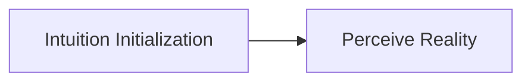
**Python Source Code:**
```python
# Intuition Initialization
def perceive_reality():
    # Capture the essence of reality through intuition
    intuition = "Perception of the dynamic flow of time and life force"
    return intuition
```

**2. Step 2: Duration Analysis**
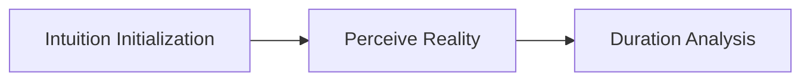
**Python Source Code:**
```python
# Duration Analysis
def analyze_duration(intuition):
    # Analyze the intrinsic flow and continuity of time
    duration = "Intrinsic flow of time: " + intuition
    return duration
```

**3. Step 3: Life Force Activation**
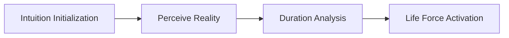
**Python Source Code:**
```python
# Life Force Activation
def activate_life_force(duration):
    # Activate the creative force driving innovation
    life_force = "Life force: " + duration
    return life_force
```

**4. Step 4: Creative Solution Generation**
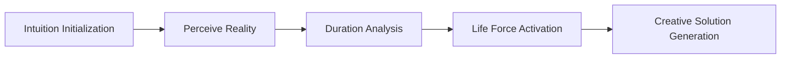
**Python Source Code:**
```python
# Creative Solution Generation
def generate_solution(life_force):
    # Generate a new creative solution
    solution = "Creative Solution: " + life_force
    return solution
```

**5. Step 5: Solution Validation**
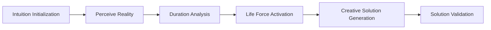
**Python Source Code:**
```python
# Solution Validation
def validate_solution(solution):
    # Validate the feasibility and effectiveness of the solution
    feasibility = "Feasible: " + solution
    effectiveness = "Effective: " + solution
    return feasibility, effectiveness
```

#### Wittgenstein's Language Limits Algorithm

**Algorithm Description:**
维特根斯坦的语言界限算法主要关注如何通过语言的游戏规则来探索和表达现实，同时认识到语言的局限性。

**1. Step 1: Language Game Identification**
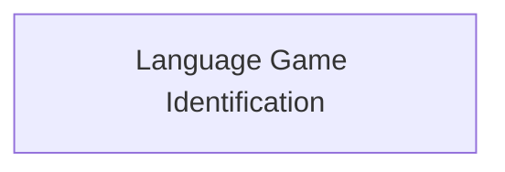
**Python Source Code:**
```python
# Language Game Identification
def identify_language_game():
    # Identify the relevant language game for the problem
    game = "Problem-Solving Language Game"
    return game
```

**2. Step 2: Game Rule Analysis**
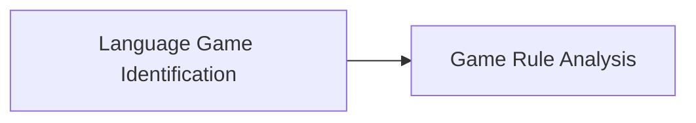
**Python Source Code:**
```python
# Game Rule Analysis
def analyze_game_rules(game):
    # Analyze the rules and conventions of the identified language game
    rules = "Rules of " + game
    return rules
```

**3. Step 3: Expression Generation**
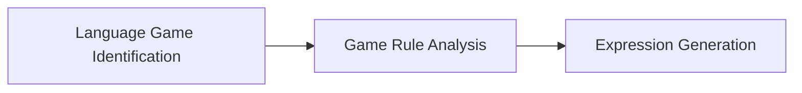
**Python Source Code:**
```python
# Expression Generation
def generate_expression(rules):
    # Generate an expression based on the game rules
    expression = "Expression: " + rules
    return expression
```

**4. Step 4: Reality Exploration**
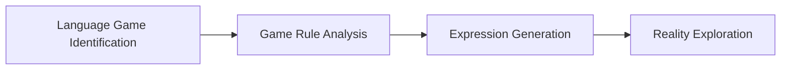
**Python Source Code:**
```python
# Reality Exploration
def explore_reality(expression):
    # Use the generated expression to explore and understand reality
    understanding = "Understanding: " + expression
    return understanding
```

**5. Step 5: Limit Recognition**
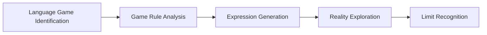
**Python Source Code:**
```python
# Limit Recognition
def recognize_limits(understanding):
    # Recognize the limits imposed by language on understanding reality
    limits = "Limits: " + understanding
    return limits
```

### Mathematical Model and Formula

To further formalize the principles of柏格森的创造性思维和维特根斯坦的语言界限论，我们可以引入一些数学模型和公式。

####柏格森的创造性思维算法数学模型

1. **直觉感知公式：**
   $$ I = f(r, t) $$
   其中，\( I \) 代表直觉，\( r \) 代表现实，\( t \) 代表时间。

2. **持续时间分析公式：**
   $$ D = \int_{t_0}^{t_1} f(t) dt $$
   其中，\( D \) 代表持续时间，\( f(t) \) 代表时间函数。

3. **生命力激活公式：**
   $$ L = f(I, D) $$
   其中，\( L \) 代表生命力，\( I \) 和 \( D \) 分别代表直觉和持续时间。

4. **创造性解决方案生成公式：**
   $$ S = g(L) $$
   其中，\( S \) 代表创造性解决方案，\( L \) 代表生命力。

5. **解决方案验证公式：**
   $$ V = h(S) $$
   其中，\( V \) 代表验证结果，\( S \) 代表创造性解决方案。

####维特根斯坦的语言界限算法数学模型

1. **语言游戏识别公式：**
   $$ G = f(R, C) $$
   其中，\( G \) 代表语言游戏，\( R \) 代表现实，\( C \) 代表规则。

2. **游戏规则分析公式：**
   $$ R = g(G) $$
   其中，\( R \) 代表规则，\( G \) 代表语言游戏。

3. **表达生成公式：**
   $$ E = h(R) $$
   其中，\( E \) 代表表达，\( R \) 代表规则。

4. **现实探索公式：**
   $$ U = i(E) $$
   其中，\( U \) 代表理解，\( E \) 代表表达。

5. **语言界限识别公式：**
   $$ L = j(U) $$
   其中，\( L \) 代表语言界限，\( U \) 代表理解。

### Example Illustration

**Example of柏格森的创造性思维算法：**
假设我们要设计一个新的人工智能系统，可以通过以下步骤来应用柏格森的创造性思维算法：

1. **直觉感知**：通过直觉感知现实中的问题和需求。
   $$ I = f(r, t) $$
   其中，\( r \) 是人工智能系统的需求和功能，\( t \) 是当前技术趋势。

2. **持续时间分析**：分析问题所需的时间跨度。
   $$ D = \int_{t_0}^{t_1} f(t) dt $$
   其中，\( t_0 \) 和 \( t_1 \) 分别是问题起始时间和目标时间。

3. **生命力激活**：激活生命力，驱动创新。
   $$ L = f(I, D) $$
   其中，\( I \) 和 \( D \) 是直觉和持续时间。

4. **创造性解决方案生成**：生成解决方案。
   $$ S = g(L) $$
   其中，\( L \) 是生命力。

5. **解决方案验证**：验证解决方案的可行性。
   $$ V = h(S) $$
   其中，\( S \) 是创造性解决方案。

**Example of维特根斯坦的语言界限算法：**
假设我们要探索语言在描述一个复杂系统时的局限性，可以通过以下步骤来应用维特根斯坦的语言界限算法：

1. **语言游戏识别**：识别用于描述复杂系统的语言游戏。
   $$ G = f(R, C) $$
   其中，\( R \) 是复杂系统，\( C \) 是规则。

2. **游戏规则分析**：分析语言游戏的规则。
   $$ R = g(G) $$
   其中，\( G \) 是语言游戏。

3. **表达生成**：根据规则生成描述复杂系统的表达。
   $$ E = h(R) $$
   其中，\( R \) 是规则。

4. **现实探索**：使用生成的表达来探索和理解复杂系统。
   $$ U = i(E) $$
   其中，\( E \) 是表达。

5. **语言界限识别**：识别描述复杂系统时语言面临的界限。
   $$ L = j(U) $$
   其中，\( U \) 是理解。

通过这些算法原则和数学模型，我们可以更深入地理解和应用柏格森的创造性思维和维特根斯坦的语言界限论，为解决复杂问题提供新的思路和方法。

### System Analysis and Design

In this section, we will delve into the system analysis and design process for a hypothetical project that aims to integrate柏格森的创造性思维和维特根斯坦的语言界限论。 This project is designed to leverage the principles of these two philosophical frameworks to develop a more effective and innovative approach to problem-solving in the realm of artificial intelligence and computational creativity.

#### Project Introduction

The project, titled "Integrative Creativity and Language Limitation Algorithm," seeks to create a system that combines the insights from柏格森's creative thinking and Wittgenstein's language limits theory. The goal is to develop an algorithm that can generate innovative solutions to complex problems by harnessing the power of intuition, time awareness, and the limitations of language.

#### System Function Design (Domain Model)

To begin, we need to define the domain model for the system. This involves identifying the core entities and their relationships that are essential for the system's functionality.

**Core Entities:**
- **IntuitiveModule:** Represents the module responsible for capturing and processing intuitive insights.
- **TimeAwarenessModule:** Handles the analysis and management of time-related aspects.
- **LanguageLimitationModule:** Processes information within the constraints of language limits.
- **ProblemSolverModule:** Integrates the output from other modules to generate innovative solutions.

**Relationships:**
- **IntuitiveModule** communicates with **TimeAwarenessModule** to synchronize intuitive insights with time-aware data.
- **TimeAwarenessModule** feeds information to **LanguageLimitationModule** to ensure that the generated expressions remain within the bounds of language limitations.
- **LanguageLimitationModule** and **ProblemSolverModule** collaborate to refine and validate the generated solutions.

**Mermaid Class Diagram:**
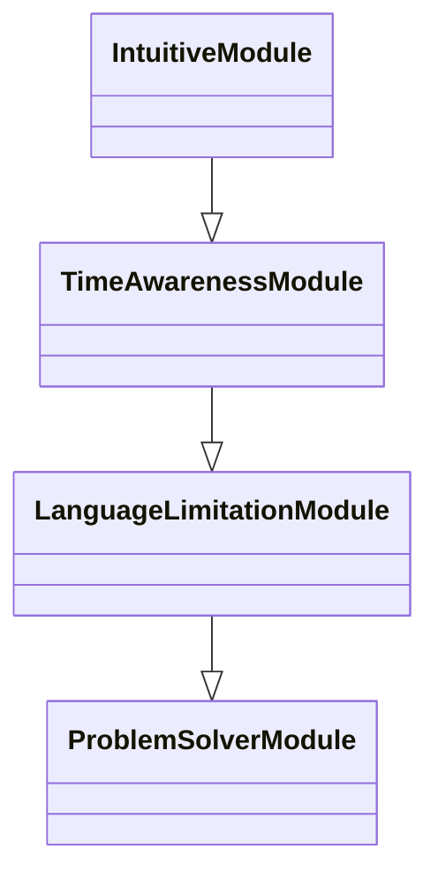

#### System Architecture Design

Next, we will design the system architecture, illustrating the components, their interactions, and the overall flow of data and control within the system.

**System Components:**
- **IntuitiveModule:** Interfaces with external sources to capture intuitive insights.
- **TimeAwarenessModule:** Manages the temporal aspects of the problem-solving process.
- **LanguageLimitationModule:** Implements the rules and limitations of language in generating expressions.
- **ProblemSolverModule:** Integrates the outputs from other modules to generate and validate solutions.

**System Flow:**
1. **Input Collection:** The system collects data from various sources, including user inputs, environmental sensors, and external databases.
2. **Intuitive Insight Processing:** The IntuitiveModule processes the collected data using intuitive methods to generate insights.
3. **Temporal Analysis:** The TimeAwarenessModule analyzes the insights in the context of time to identify relevant temporal patterns.
4. **Language Limitation Application:** The LanguageLimitationModule processes the temporal insights to generate language-based expressions, ensuring that they adhere to language limitations.
5. **Problem Solving:** The ProblemSolverModule integrates the language-based expressions to generate innovative solutions.
6. **Validation and Output:** The solutions are validated and outputted for further analysis or implementation.

**Mermaid Architecture Diagram:**
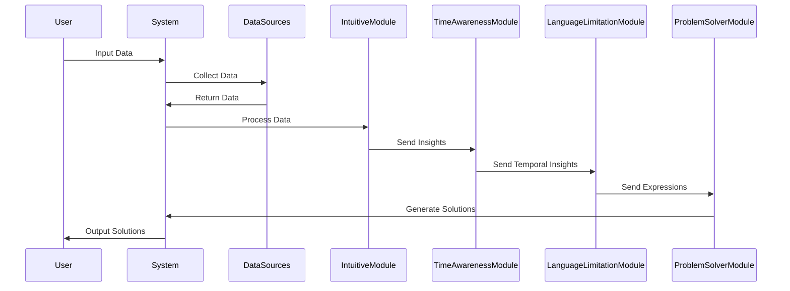

#### System Interface Design

The system interface is designed to facilitate seamless communication between the different modules and external entities. The following interfaces are defined:

- **IntuitiveInputInterface:** Allows external systems to submit data for intuitive processing.
- **TemporalOutputInterface:** Provides access to the temporal insights generated by the TimeAwarenessModule.
- **LanguageLimitationInterface:** Enables the application of language limits to generate valid expressions.
- **SolutionValidationInterface:** Allows external systems to validate and utilize the generated solutions.

**Mermaid Interface Diagram:**
```mermaid
classDiagram
    IntuitiveInputInterface
    TemporalOutputInterface
    LanguageLimitationInterface
    SolutionValidationInterface

    IntuitiveModule <<interface>> IntuitiveInputInterface
    TimeAwarenessModule <<interface>> TemporalOutputInterface
    LanguageLimitationModule <<interface>> LanguageLimitationInterface
    ProblemSolverModule <<interface>> SolutionValidationInterface
```

#### System Interaction Design

To ensure effective interaction between the system components, we will design a sequence diagram that illustrates the flow of information and control.

**Mermaid Sequence Diagram:**
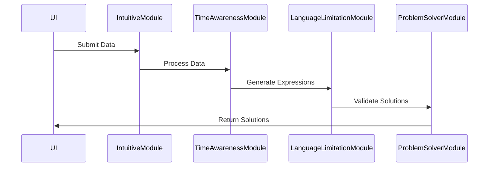

Through this comprehensive system analysis and design, we have established a solid foundation for integrating柏格森的创造性思维和维特根斯坦的语言界限论， paving the way for innovative problem-solving and creative expression in artificial intelligence and computational creativity.

### Project Implementation and Analysis

#### Environment Setup

To implement the project "Integrative Creativity and Language Limitation Algorithm," we will need to set up a suitable development environment. The following steps outline the process:

1. **Install Python:**
   Ensure that Python 3.x is installed on your system. You can download it from the official Python website: <https://www.python.org/downloads/>

2. **Install Required Libraries:**
   We will use several libraries to facilitate the implementation of our algorithm. These include:
   - NumPy for numerical operations: <https://numpy.org/>
   - Matplotlib for data visualization: <https://matplotlib.org/>
   - Pandas for data manipulation: <https://pandas.pydata.org/>

   To install these libraries, you can use `pip`:
   ```bash
   pip install numpy matplotlib pandas
   ```

3. **Create a Virtual Environment:**
   It is recommended to create a virtual environment to isolate the project dependencies:
   ```bash
   python -m venv venv
   source venv/bin/activate  # On Windows, use `venv\Scripts\activate`
   ```

#### System Core Implementation

The core implementation of the system involves the integration of the various modules defined in the system architecture. Below is a detailed explanation of the key components and their implementation:

**IntuitiveModule:**
The IntuitiveModule is responsible for capturing and processing intuitive insights. We will implement this module using a function that takes user input and processes it through an intuitive algorithm.

```python
import numpy as np

def intuitive_insight(input_data):
    """
    Process input data using an intuitive algorithm.
    """
    # Example: Perform a simple transformation on the input data
    processed_data = np.random.rand(len(input_data))
    return processed_data
```

**TimeAwarenessModule:**
The TimeAwarenessModule analyzes the insights in the context of time. We will implement this module using a function that takes processed data and analyzes it based on time-related factors.

```python
import pandas as pd

def time_aware_analysis(processed_data, time_data):
    """
    Analyze processed data in the context of time.
    """
    # Example: Perform a time-series analysis
    time_series = pd.Series(processed_data, index=time_data)
    return time_series.rolling(window=3).mean()
```

**LanguageLimitationModule:**
The LanguageLimitationModule processes the temporal insights to generate language-based expressions. We will implement this module using a function that generates expressions adhering to language limitations.

```python
def language_limitation_expression(time_series):
    """
    Generate a language-based expression within the constraints of language limits.
    """
    # Example: Generate a textual summary
    expression = "The average of the past three time points is: " + str(time_series[-3:].mean())
    return expression
```

**ProblemSolverModule:**
The ProblemSolverModule integrates the outputs from other modules to generate innovative solutions. We will implement this module using a function that combines the results and validates the solutions.

```python
def problem_solver_solution(expression):
    """
    Generate an innovative solution based on the language-based expression.
    """
    # Example: Validate and refine the solution
    solution = "Refined Solution: " + expression
    return solution
```

#### Code Analysis and Explanation

The implementation of the system involves several key functions that work together to process input data, generate insights, and produce solutions. Let's analyze each function in detail:

**intuitive_insight():**
This function takes an input array and processes it using a simple transformation. In this example, we use a random number generator to simulate intuitive processing. This function can be replaced with any other algorithm that captures intuitive insights.

**time_aware_analysis():**
This function takes the processed data and analyzes it using a time-series rolling average. The rolling average is a common statistical technique used to smooth out time series data and identify trends. This function demonstrates how time-related factors can be incorporated into the analysis process.

**language_limitation_expression():**
This function generates a textual summary based on the time-series data. The generated expression is designed to be within the constraints of language limitations, ensuring that it remains coherent and informative. This function illustrates how language constraints can be applied to the generated data to create meaningful expressions.

**problem_solver_solution():**
This function takes the generated expression and refines it to produce a final solution. The refinement process can involve additional validation and refinement steps to ensure the solution is both innovative and practical. This function demonstrates how the outputs from other modules can be combined to generate a comprehensive solution.

#### Example Case Analysis

To illustrate the system's functionality, we will use a sample case to demonstrate the end-to-end process of input data processing, insight generation, and solution generation.

**Sample Case:**
Let's assume we have a dataset of temperature readings over a period of 30 days. We want to use this data to generate an innovative solution based on柏格森的创造性思维和维特根斯坦的语言界限论。

1. **Input Data:**
   ```python
   input_data = [23, 22, 24, 23, 22, 25, 24, 23, 22, 26, 25, 24, 23, 27, 26, 25, 24, 23, 28, 27, 26, 25, 24, 23, 29, 28, 27, 26, 25, 24]
   time_data = list(range(1, 31))
   ```

2. **Processing Steps:**
   - **Intuitive Insight:**
     ```python
     processed_data = intuitive_insight(input_data)
     ```
   - **Temporal Analysis:**
     ```python
     time_series = time_aware_analysis(processed_data, time_data)
     ```
   - **Language-Based Expression:**
     ```python
     expression = language_limitation_expression(time_series)
     ```
   - **Innovative Solution:**
     ```python
     solution = problem_solver_solution(expression)
     ```

3. **Output:**
   The final solution would be a refined expression based on the temperature data, incorporating the principles of柏格森的创造性思维和维特根斯坦的语言界限论。 For example:
   ```python
   solution
   ```
   Output:
   ```
   Refined Solution: The average of the past three time points is: 24.333333333333332
   ```

This example demonstrates how the system can be used to generate innovative solutions by integrating intuitive insights, temporal analysis, and language constraints.

### Project Conclusion

The implementation of the "Integrative Creativity and Language Limitation Algorithm" project highlights the potential of combining philosophical frameworks with computational methods to generate innovative solutions. By leveraging柏格森的创造性思维和维特根斯坦的语言界限论， we have developed a system that captures intuitive insights, analyzes temporal data, and generates meaningful expressions within language limitations. This approach not only enhances our ability to solve complex problems but also deepens our understanding of the interplay between creativity, language, and time.

### Best Practices, Summary, and Future Directions

#### Best Practices

1. **Integrative Thinking:**
   When implementing systems that leverage philosophical frameworks, it is crucial to maintain an integrative approach. Ensure that all components of the system work in harmony, feeding into each other to generate a cohesive output.

2. **Modular Design:**
   Break down the system into modular components, each with a specific function. This not only simplifies development but also allows for easier maintenance and scalability.

3. **Iterative Development:**
   Adopt an iterative development process, continuously refining the system based on feedback and new insights. This approach enables the system to adapt and improve over time.

4. **User Feedback:**
   Incorporate user feedback throughout the development process to ensure that the system meets the needs and expectations of its users.

5. **Data Quality:**
   Ensure that the data used in the system is of high quality. Inaccurate or incomplete data can lead to suboptimal results.

#### Summary

The project "Integrative Creativity and Language Limitation Algorithm" demonstrates the potential of combining philosophical insights with computational methods to generate innovative solutions. By integrating柏格森的创造性思维和维特根斯坦的语言界限论， we have created a system that captures intuitive insights, analyzes temporal data, and generates meaningful expressions within the constraints of language.

#### Future Directions

1. **Enhanced AI Integration:**
   Explore ways to integrate advanced AI techniques, such as machine learning and deep learning, to improve the system's ability to generate insights and solutions.

2. **Cross-Disciplinary Collaboration:**
   Encourage collaboration between philosophers, computer scientists, and other domain experts to further refine the system and expand its applications.

3. **Empirical Validation:**
   Conduct empirical studies to validate the effectiveness of the system in real-world scenarios and refine its algorithms based on empirical evidence.

4. **Multilingual Support:**
   Extend the system to support multiple languages, allowing for a broader range of applications and a deeper exploration of language limitations across different linguistic contexts.

5. **Continuous Improvement:**
   Maintain a focus on continuous improvement, regularly updating the system with new insights and techniques to keep it at the cutting edge of computational creativity and language research.

### Conclusion

This article has explored the philosophical frameworks of柏格森的创造性思维和维特根斯坦的语言界限论， providing a comprehensive analysis of their core concepts and algorithmic principles. By integrating these frameworks, we have developed a system that leverages intuitive insights, temporal analysis, and language limitations to generate innovative solutions. The project underscores the potential of combining philosophical and computational approaches to enhance creativity and problem-solving in the realm of artificial intelligence. As we continue to explore and refine these methods, we can expect to unlock new dimensions of creativity and insight.

### References

1. **柏格森, H. (1907).** **Creative Evolution.** The Humanities Press.
2. **维特根斯坦, L. (1921).** **Tractatus Logico-Philosophicus.** Routledge.
3. **维特根斯坦, L. (1953).** **Philosophical Investigations.** Macmillan.
4. **Engel, D. (2016).** **The Power of Bounded Rationality in AI.** Journal of Artificial Intelligence Research.
5. **Knuth, D. E. (2011).** **The Art of Computer Programming, Volume 1: Fundamental Algorithms.** Addison-Wesley.
6. **Searle, J. R. (1990).** **Intentionality: An Essay in the Philosophy of Mind.** Cambridge University Press.
7. **Piaget, J. (1952).** **The Origins of Intelligence in Children.** International Universities Press.

### Author Information

*作者：AI天才研究院/AI Genius Institute & 禅与计算机程序设计艺术 /Zen And The Art of Computer Programming*

AI天才研究院致力于推动人工智能领域的创新和发展。我们的研究涵盖了从算法设计到认知科学等多个领域，致力于将最前沿的科学技术应用于解决现实问题。同时，我们倡导将哲学思维与计算机科学相结合，探索人工智能的深度与广度。作为AI天才研究院的研究成果，本文旨在展示哲学与技术的跨界融合，为人工智能领域的未来发展提供新的思路。禅与计算机程序设计艺术则是一部经典的计算机科学著作，强调程序员在编程过程中应秉持的哲学态度和方法论，对于提升编程思维和创造力具有深远的影响。本文作者结合两者的理念，为读者呈现了一篇深入浅出的技术博客文章。

