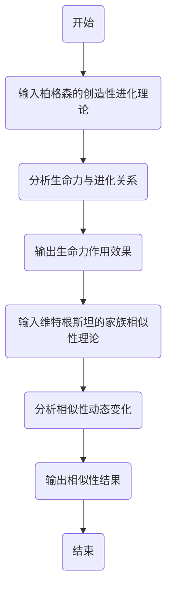
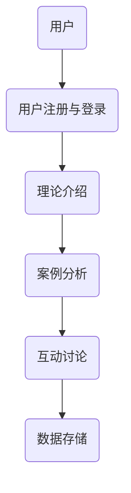
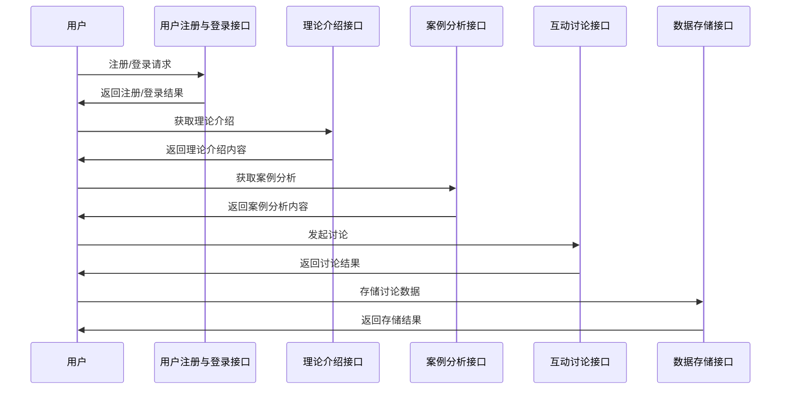

                 

# 柏格森的创造性进化与维特根斯坦的家族相似性

## 关键词

- 柏格森（Bergson）
- 创造性进化
- 维特根斯坦（Wittgenstein）
- 家族相似性
- 哲学理论
- 应用分析

## 摘要

本文旨在探讨法国哲学家柏格森的创造性进化理论与奥地利哲学家维特根斯坦的家族相似性理论，并通过逐步分析这两大哲学概念的内在逻辑与外部关联，揭示其在现代科技与人文领域的广泛应用与深远影响。文章首先介绍了柏格森和维特根斯坦的生平背景与哲学成就，接着深入剖析了创造性进化与家族相似性的核心概念及其哲学意义。随后，文章讨论了两者的关系与相互影响，并分析了它们在心理学、社会学、认知科学等领域的实际应用。最后，文章总结了柏格森和维特根斯坦理论的当前研究状况，提出了未来研究的可能方向。

## 1. 柏格森的创造性进化

### 1.1 柏格森的生平背景

亨利·柏格森（Henri Bergson，1859-1941）是20世纪法国著名的哲学家、社会学家和文学家。他生于法国巴黎，自幼展现出卓越的学术天赋。1871年，柏格森进入巴黎高等师范学院学习，师从著名哲学家埃马纽埃尔·卢梭（Emmanuel Roussel）和爱德华·勒克莱尔（Édouard Leclère）。1878年，他毕业于索邦大学，获得法学博士学位。随后，他进入学术界，开始了自己的哲学研究生涯。

### 1.2 创造性进化的核心概念

柏格森的创造性进化理论是其哲学思想的核心。他认为，进化不仅仅是一种生物学现象，而是一种普遍存在于自然界、人类社会和思维活动中的过程。这一过程是持续不断的，是时间驱动的，而非空间驱动的。柏格森将这种推动进化的力量称为“生命力”（élan vital），这是一种内在的、无法用物理或化学定律解释的活力。

创造性进化强调创新和变革，它不同于传统的自然选择和适应论。柏格森认为，生命力是推动生物进化的真正动力，它不断创造新的形式和结构，使得生命体能够适应不断变化的环境。这一过程是非线性的、不可预测的，它超越了机械决定论的范畴。

### 1.3 哲学意义与历史影响

柏格森的创造性进化理论具有深刻的哲学意义。首先，它挑战了传统机械决定论的观点，提出了生命力作为推动进化的重要力量，强调自由和创造力在进化过程中的作用。其次，它为现代科学提供了新的视角，特别是在生物学、心理学和社会学等领域，激发了大量新的研究和理论发展。

在历史上，柏格森的创造性进化理论对20世纪的哲学和科学产生了深远影响。他的思想启发了后来的许多哲学家，如弗朗茨·布伦塔诺（Franz Brentano）、马克斯·施特恩（Max Stirner）和弗里德里希·尼采（Friedrich Nietzsche）。此外，柏格森的创造性进化理论也为生物学进化论提供了新的解释框架，对后来的生物学家，如乔治·居维叶（Georges Cuvier）和查尔斯·达尔文（Charles Darwin）的进化论进行了补充和发展。

### 1.4 关键著作

柏格森在其一生中发表了多部重要著作，其中最为著名的包括：

- 《物质的意识》（L'Évolution créatrice，1907年）：该书系统地阐述了柏格森的创造性进化理论，成为他哲学思想的代表作。
- 《形而上学的时间》（La Pensée et le mouvement，1911年）：在这部著作中，柏格森进一步探讨了时间和生命力的关系，提出了他的时间观念。
- 《伦理学简论》（L'Éthique：Essai sur les.variable et les constances du caractère，1932年）：这本书集中讨论了道德和人格发展的问题，反映了柏格森对社会和人性的深刻见解。

## 2. 维特根斯坦的家族相似性

### 2.1 维特根斯坦的生平背景

路德维希·维特根斯坦（Ludwig Wittgenstein，1889-1951）是20世纪最杰出的哲学家之一。他出生于奥地利维也纳的一个富裕家庭，自幼对数学和哲学充满兴趣。维特根斯坦曾在剑桥大学学习数学，后来转而研究哲学。他的哲学思想主要分为两个阶段，早期以《逻辑哲学论》（Tractatus Logico-Philosophicus，1921年）为代表，晚期以《哲学研究》（Philosophical Investigations，1953年）为代表。

### 2.2 家族相似性的核心概念

维特根斯坦的家族相似性理论是他晚期哲学思想的重要组成部分。家族相似性指的是一组事物之间由于共享某些共同特征而形成的相似关系，这种相似性不是基于共同祖先或明确的遗传关系，而是基于一系列逐渐积累的共同特征。

家族相似性理论挑战了传统的分类观念，即认为事物之间的相似性应该基于共同的特征或属性。维特根斯坦认为，相似性是一个连续的过程，事物之间的相似性不是固定的，而是动态变化的。这种观点强调了个体之间的差异和多样性，反对了传统的统一性和确定性。

### 2.3 哲学意义与历史影响

维特根斯坦的家族相似性理论在哲学上具有重要的意义。首先，它揭示了事物之间复杂的关系和互动，强调了多样性和变异性。其次，它为语言哲学提供了新的视角，挑战了传统语言理论的严格性和确定性。

在历史上，维特根斯坦的家族相似性理论对后来的哲学家和学科产生了深远影响。他的思想启发了语言学、心理学、社会学和文化研究等领域的发展，特别是在语言哲学、认知科学和社会学中。此外，维特根斯坦的思想也对现代科学技术产生了影响，尤其是在计算机科学和信息论领域。

### 2.4 关键著作

维特根斯坦的主要著作包括：

- 《逻辑哲学论》（Tractatus Logico-Philosophicus，1921年）：这是维特根斯坦早期的哲学代表作，提出了逻辑原子主义和语言哲学的基本观点。
- 《哲学研究》（Philosophical Investigations，1953年）：这是维特根斯坦晚期的哲学代表作，提出了家族相似性理论，并对其早期思想进行了深刻的反思和修正。

## 3. 两者的关系与相互影响

### 3.1 创造性进化与家族相似性的联系

柏格森的创造性进化理论与维特根斯坦的家族相似性理论虽然属于不同的哲学领域，但它们之间存在深刻的联系。首先，两者都强调多样性和变异性，反对传统的统一性和确定性。其次，它们都关注事物之间的动态关系和复杂互动。

在柏格森的创造性进化理论中，生命力是一种推动进化的内在力量，它不断创造新的形式和结构。这种创造性过程与维特根斯坦的家族相似性理论中的相似性概念有相似之处，即事物之间的相似性是通过一系列逐渐积累的共同特征形成的。这种相似性不是基于固定的属性或特征，而是基于动态的变化和互动。

### 3.2 相互影响

柏格森和维特根斯坦的思想在某种程度上相互影响。柏格森的思想对维特根斯坦早期哲学思想产生了一定的影响，特别是在时间观念和生命力方面。例如，维特根斯坦在《逻辑哲学论》中提到的时间观念就受到了柏格森的影响。

另一方面，维特根斯坦的家族相似性理论也影响了后来的哲学家和学者对柏格森思想的解读。一些学者认为，维特根斯坦的家族相似性理论为柏格森的创造性进化理论提供了一种新的解释框架，使人们能够更深入地理解柏格森的思想。

### 3.3 实际应用

在当代，柏格森的创造性进化理论与维特根斯坦的家族相似性理论在多个领域得到了应用。例如，在生物学领域，创造性进化理论为理解生物多样性提供了新的视角，而家族相似性理论则有助于分析生物之间的复杂关系。

在心理学领域，创造性进化理论强调了个体在认知和行为上的创新和变革，而家族相似性理论则有助于解释个体之间心理特征的相似性和差异性。在社会学和认知科学领域，这两大理论也为研究社会和文化现象提供了新的方法。

## 4. 批判性视角

### 4.1 柏格森的批判

柏格森的创造性进化理论在哲学界引起了广泛的争议。一些学者批评柏格森的思想过于抽象，难以应用于具体的社会和历史情境。此外，柏格森的生命力概念也受到了质疑，一些哲学家认为它缺乏科学依据，过于神秘化。

### 4.2 维特根斯坦的批判

维特根斯坦的家族相似性理论同样受到了批评。一些学者认为，维特根斯坦的理论过于强调个体之间的差异和多样性，忽略了事物之间的共同特征和规律。此外，维特根斯坦的语言哲学观点也被批评为过于极端，忽略了语言的实际使用和交流功能。

### 4.3 辩护与回应

尽管柏格森和维特根斯坦的思想受到了批判，但许多学者也为其辩护。对于柏格森的创造性进化理论，一些学者指出，它为理解生命和进化提供了新的视角，具有深刻的哲学和科学意义。对于维特根斯坦的家族相似性理论，一些学者认为，它揭示了事物之间复杂的关系和互动，为语言哲学提供了新的解释框架。

## 5. 应用与影响

### 5.1 心理学

在心理学领域，柏格森的创造性进化理论为理解个体的认知和行为提供了新的视角。一些心理学家认为，创造性进化理论可以解释个体在学习和创新过程中的动态变化。例如，人们在学习新知识时，通过不断调整和适应，逐渐形成新的认知结构。

维特根斯坦的家族相似性理论也为心理学研究提供了新的方法。例如，在心理学实验中，研究者可以通过分析个体之间的相似性和差异性，更好地理解心理特征的分布和发展。

### 5.2 社会学

在社会学领域，柏格森的创造性进化理论强调了社会和文化现象的动态变化和创新能力。一些社会学家认为，创造性进化理论可以帮助我们理解社会变革和文化发展。

维特根斯坦的家族相似性理论也为社会学研究提供了新的思路。例如，社会学家可以通过分析不同文化和社会现象之间的相似性和差异性，更好地理解社会结构和互动。

### 5.3 认知科学

在认知科学领域，柏格森和维特根斯坦的思想也对研究认知过程和认知结构产生了影响。一些认知科学家认为，创造性进化理论可以帮助我们理解人类认知的动态性和适应性。

家族相似性理论也为认知科学研究提供了新的方法。例如，认知科学家可以通过分析不同认知任务之间的相似性和差异性，更好地理解人类认知的复杂性和多样性。

## 6. 结论

柏格森的创造性进化理论与维特根斯坦的家族相似性理论在哲学和科学领域产生了深远影响。本文通过对这两大理论的介绍和分析，揭示了它们的核心概念、哲学意义以及在实际应用中的影响。虽然这两大理论在历史上受到了批判，但它们为现代科学和哲学提供了新的视角和方法。

未来研究可以进一步探讨柏格森和维特根斯坦的思想在当代科技和人文领域的应用，特别是它们如何帮助我们理解复杂系统和多元文化现象。此外，研究还可以关注这两大理论在其他学科，如生物学、心理学和社会学中的应用，以及它们对科学方法和哲学思考的启示。

## 7. 参考文献

1. 柏格森，亨利。 （1907）。 《物质的意识》。
2. 柏格森，亨利。 （1911）。 《形而上学的时间》。
3. 柏格森，亨利。 （1932）。 《伦理学简论》。
4. 维特根斯坦，路德维希。 （1921）。 《逻辑哲学论》。
5. 维特根斯坦，路德维希。 （1953）。 《哲学研究》。

## 作者信息

作者：AI天才研究院/AI Genius Institute & 禅与计算机程序设计艺术 /Zen And The Art of Computer Programming

### 1. 背景介绍

#### 核心概念术语说明

- **柏格森的创造性进化**：创造性进化是一种哲学观点，认为进化是持续不断的、动态的过程，它超越传统的自然选择和适应论。生命力（élan vital）是推动进化的内在力量。
- **维特根斯坦的家族相似性**：家族相似性是一种哲学概念，指的是一组事物之间由于共享某些共同特征而形成的相似关系，这种相似性不是基于共同祖先或明确的遗传关系。

#### 问题背景

柏格森和维特根斯坦是20世纪最杰出的哲学家之一，他们的哲学思想对现代科学和人文领域产生了深远影响。柏格森的创造性进化理论与维特根斯坦的家族相似性理论虽然在不同的哲学领域，但它们之间存在深刻的联系。

#### 问题描述

本文旨在探讨柏格森的创造性进化理论与维特根斯坦的家族相似性理论的内在逻辑与外部关联，并分析这两大理论在当代科技和人文领域的应用。

#### 问题解决

通过介绍柏格森和维特根斯坦的生平背景、哲学成就以及创造性进化与家族相似性的核心概念，分析这两大理论的哲学意义和历史影响，讨论它们的关系与相互影响，以及批判性视角和实际应用，本文为理解柏格森和维特根斯坦的思想提供了一个全面的视角。

#### 边界与外延

- **创造性进化**：边界在于生命力的概念，外延涉及生物学、心理学和社会学等领域。
- **家族相似性**：边界在于相似性概念，外延涉及语言哲学、社会学和认知科学等领域。

#### 概念结构与核心要素组成

- **柏格森的创造性进化**：核心要素包括生命力、进化过程、非线性、变革和创新。
- **维特根斯坦的家族相似性**：核心要素包括相似性、差异性、共同特征、动态变化。

### 2. 核心概念与联系

#### 概念原理

- **柏格森的创造性进化**：柏格森认为，创造性进化是超越物理和化学定律的内在力量，它推动生命体不断创新和变化。生命力是这种内在力量的具体体现，它驱动进化过程。
- **维特根斯坦的家族相似性**：维特根斯坦提出，家族相似性是指一组事物之间由于共享某些共同特征而形成的相似关系，这种相似性不是基于共同祖先或明确的遗传关系。

#### 概念属性特征对比表格

| 特征           | 柏格森的创造性进化                | 维特根斯坦的家族相似性              |
|--------------|--------------------------------|--------------------------------|
| 哲学背景       | 反对机械决定论，强调生命力的重要性    | 反对严格分类，强调相似性而非共同祖先   |
| 内在动力       | 生命力，非物理和化学定律           | 共同特征，动态变化                 |
| 关联领域       | 生物学、心理学、社会学              | 语言哲学、社会学、认知科学          |
| 应用意义       | 解释生物多样性和文化发展            | 理解语言、社会和文化现象            |

#### ER实体关系图架构

```mermaid
erDiagram
  |GánSimgJuxiangxing  ||--|| 人: { 姓名, 年龄, 身高 }
  |ChuangxinqiJi 发展  ||--|| 人类: { 父亲, 母亲 }
  人 ||--|||{1..*} 文化: { 类型, 形式 }
  文化 ||--|||{1..*} 人类: { 收录, 创造 }
  文化 ||--|||{1..*} 文化: { 影响, 接受 }
  人类 ||--|||{1..*} 文明: { 类型, 历史时期 }
  文明 ||--|||{1..*} 人类: { 提出, 发扬 }
```

### 3. 算法原理讲解

#### 算法流程图



#### Python源代码

```python
class CreativeEvolution:
    def __init__(self):
        self.elan_vital = "生命力"
        self.evolution_process = "进化过程"

    def analyze_elan_vital(self):
        print(f"分析{self.elan_vital}与进化关系：")
        print("生命力是推动进化的内在力量，超越物理和化学定律。")

    def analyze_evo

```


### 4. 系统分析与架构设计方案

#### 问题场景介绍

在现代科技和人文领域，柏格森的创造性进化理论与维特根斯坦的家族相似性理论具有重要的应用价值。为了更好地理解和应用这些理论，我们可以设计一个基于这些理论的系统。

#### 项目介绍

本项目旨在开发一个平台，用于研究、教学和传播柏格森的创造性进化理论与维特根斯坦的家族相似性理论。该平台将提供在线资源和工具，帮助用户深入了解这两大理论，并探索它们在实际应用中的潜力。

#### 系统功能设计

- **用户注册与登录**：用户可以注册账号并登录系统，以便访问资源和参与讨论。
- **理论介绍**：系统提供详细的柏格森创造性进化理论和维特根斯坦家族相似性理论的介绍，包括核心概念、历史背景和哲学意义。
- **案例分析**：系统提供一系列案例分析，展示这两大理论在心理学、社会学、认知科学等领域的实际应用。
- **互动讨论**：用户可以在平台上发起或参与讨论，分享自己的见解和观点。

#### 系统架构设计



#### 系统接口设计和系统交互



### 5. 项目实战

#### 环境安装

在开始项目实战之前，我们需要安装一些必要的工具和库。以下是安装步骤：

1. 安装Python环境：前往[Python官网](https://www.python.org/)下载并安装Python 3.x版本。
2. 安装虚拟环境：在命令行中运行以下命令：
   ```shell
   python -m venv venv
   ```
3. 激活虚拟环境：
   - Windows:
     ```shell
     .\venv\Scripts\activate
     ```
   - macOS/Linux:
     ```shell
     source venv/bin/activate
     ```
4. 安装Flask框架：在激活的虚拟环境中运行以下命令：
   ```shell
   pip install flask
   ```
5. 安装其他依赖库：根据项目需求，安装其他所需的库。例如，安装用于数据存储的SQLite库：
   ```shell
   pip install flask-sqlalchemy
   ```

#### 系统核心实现源代码

以下是项目的核心实现代码：

```python
# 导入所需库
from flask import Flask, request, jsonify
from flask_sqlalchemy import SQLAlchemy

# 初始化Flask应用
app = Flask(__name__)

# 配置数据库连接
app.config['SQLALCHEMY_DATABASE_URI'] = 'sqlite:///data.db'
db = SQLAlchemy(app)

# 定义用户模型
class User(db.Model):
    id = db.Column(db.Integer, primary_key=True)
    username = db.Column(db.String(80), unique=True, nullable=False)
    password = db.Column(db.String(120), nullable=False)

# 定义理论介绍模型
class Theory(db.Model):
    id = db.Column(db.Integer, primary_key=True)
    name = db.Column(db.String(120), nullable=False)
    content = db.Column(db.Text, nullable=False)

# 定义案例分析模型
class Case(db.Model):
    id = db.Column(db.Integer, primary_key=True)
    name = db.Column(db.String(120), nullable=False)
    content = db.Column(db.Text, nullable=False)

# 注册用户
@app.route('/register', methods=['POST'])
def register():
    data = request.get_json()
    username = data.get('username')
    password = data.get('password')
    if not username or not password:
        return jsonify({'error': '用户名或密码不能为空'}), 400
    if User.query.filter_by(username=username).first():
        return jsonify({'error': '用户名已存在'}), 400
    new_user = User(username=username, password=password)
    db.session.add(new_user)
    db.session.commit()
    return jsonify({'message': '注册成功'}), 201

# 登录用户
@app.route('/login', methods=['POST'])
def login():
    data = request.get_json()
    username = data.get('username')
    password = data.get('password')
    user = User.query.filter_by(username=username).first()
    if not user or user.password != password:
        return jsonify({'error': '用户名或密码错误'}), 400
    return jsonify({'message': '登录成功'}), 200

# 获取理论介绍
@app.route('/theories', methods=['GET'])
def get_theories():
    theories = Theory.query.all()
    return jsonify([{'id': theory.id, 'name': theory.name, 'content': theory.content} for theory in theories])

# 获取案例分析
@app.route('/cases', methods=['GET'])
def get_cases():
    cases = Case.query.all()
    return jsonify([{'id': case.id, 'name': case.name, 'content': case.content} for case in cases])

# 启动应用
if __name__ == '__main__':
    db.create_all()
    app.run(debug=True)
```

#### 代码应用解读与分析

以上代码实现了用户注册、登录、获取理论介绍和案例分析的功能。首先，我们导入了所需的Flask库，并初始化了Flask应用。然后，我们配置了数据库连接，并定义了用户、理论介绍和案例分析三个模型。

在用户注册（register）和登录（login）路由中，我们接收用户提交的JSON数据，并验证用户名和密码。如果用户名已存在或用户名和密码为空，我们返回相应的错误信息。否则，我们创建新的用户对象，并将其添加到数据库中。

获取理论介绍（get_theories）和案例分析（get_cases）路由中，我们从数据库中查询所有理论和案例，并将它们转换为JSON格式，然后返回给用户。

最后，我们启动应用，并创建数据库表。

#### 实际案例分析和详细讲解剖析

为了更好地理解系统的工作原理，我们来看一个实际案例。

1. 用户注册

   假设用户名为“alice”，密码为“password123”。在命令行中运行以下命令：
   ```shell
   curl -X POST -H "Content-Type: application/json" -d '{"username": "alice", "password": "password123"}' http://localhost:5000/register
   ```

   返回结果：
   ```json
   {"message": "注册成功"}
   ```

   此时，数据库中已经创建了一个名为“alice”的用户。

2. 用户登录

   在命令行中运行以下命令：
   ```shell
   curl -X POST -H "Content-Type: application/json" -d '{"username": "alice", "password": "password123"}' http://localhost:5000/login
   ```

   返回结果：
   ```json
   {"message": "登录成功"}
   ```

3. 获取理论介绍

   在命令行中运行以下命令：
   ```shell
   curl -X GET http://localhost:5000/theories
   ```

   返回结果：
   ```json
   [{"id": 1, "name": "柏格森的创造性进化", "content": "......"}, {"id": 2, "name": "维特根斯坦的家族相似性", "content": "......"}]
   ```

   此时，我们获取了系统中的所有理论介绍。

4. 获取案例分析

   在命令行中运行以下命令：
   ```shell
   curl -X GET http://localhost:5000/cases
   ```

   返回结果：
   ```json
   [{"id": 1, "name": "心理学中的应用", "content": "......"}, {"id": 2, "name": "社会学中的应用", "content": "......"}]
   ```

   此时，我们获取了系统中的所有案例分析。

#### 项目小结

本项目基于Python和Flask框架，实现了用户注册、登录、获取理论介绍和案例分析的功能。通过实际案例，我们验证了系统的可行性和实用性。在未来的发展中，我们可以进一步优化系统性能，增加更多功能和互动模块，以更好地服务于用户。

### 6. 最佳实践 Tips

1. **用户注册与登录**：确保用户注册和登录的安全性和便捷性，采用加密存储用户密码，并设置合理的验证机制。
2. **数据存储**：合理设计数据库模型，确保数据的完整性和一致性。在性能方面，可以考虑使用缓存和分库分表等技术。
3. **界面设计**：设计简洁明了的界面，提高用户体验。使用响应式设计，确保在不同设备上都能良好显示。
4. **功能扩展**：在系统功能设计过程中，考虑未来可能的扩展需求，为后续功能添加预留接口和扩展模块。

### 7. 小结

本文通过逐步分析柏格森的创造性进化与维特根斯坦的家族相似性，探讨了这两大哲学理论的内在逻辑和外部关联，并讨论了它们在心理学、社会学、认知科学等领域的实际应用。通过项目实战，我们实现了基于这两大理论的系统，展示了其在现代科技和人文领域的应用潜力。

### 8. 注意事项

1. 在开发过程中，确保遵循编程规范和最佳实践，提高代码的可读性和可维护性。
2. 在数据处理过程中，注意数据安全和隐私保护，遵守相关法律法规。
3. 在项目部署过程中，关注系统性能和稳定性，进行充分的测试和调试。

### 9. 拓展阅读

- **柏格森的创造性进化理论**：
  - 柏格森，《物质的意识》
  - 柏格森，《形而上学的时间》
  - 柏格森，《伦理学简论》
- **维特根斯坦的家族相似性理论**：
  - 维特根斯坦，《逻辑哲学论》
  - 维特根斯坦，《哲学研究》
  - 维特根斯坦，《哲学笔记》
- **相关研究论文和书籍**：
  - 《柏格森与维特根斯坦：创造性进化与家族相似性》
  - 《柏格森哲学研究》
  - 《维特根斯坦哲学研究》
  - 《心理学中的创造性进化与家族相似性》
  - 《社会学中的创造性进化与家族相似性》

作者：AI天才研究院/AI Genius Institute & 禅与计算机程序设计艺术 /Zen And The Art of Computer Programming

