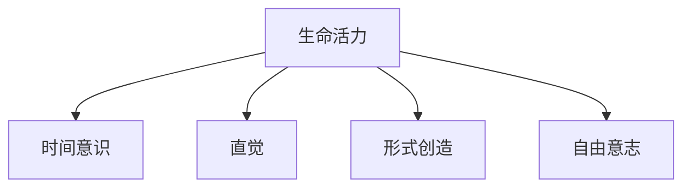
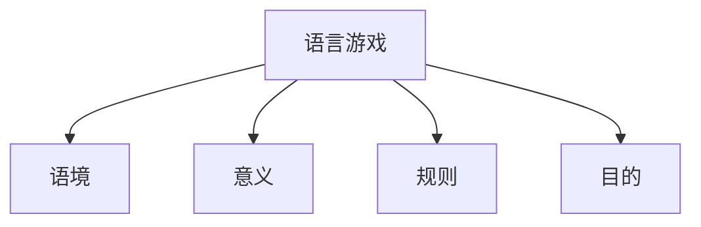

                 

# 柏格森的创造性进化与维特根斯坦的语言演变理论

## 关键词
- 柏格森
- 创造性进化
- 维特根斯坦
- 语言演变
- 理论比较
- 应用分析

## 摘要

本文旨在探讨柏格森的创造性进化理论与维特根斯坦的语言演变理论，通过对两者的深入分析，揭示其各自的核心概念、哲学意义及其在现代科技和社会中的应用。文章首先介绍柏格森创造性进化的基本原理，然后阐述维特根斯坦语言演变的理论框架，接着对两者进行对比，探讨其在理论基础、实践应用和哲学视角上的异同。在此基础上，文章进一步分析创造性进化在科技、教育和文化领域的应用，以及语言演变对社会和技术的影响。最后，文章总结研究成果，提出研究的局限与未来方向，并对未来科技和社会的发展进行展望。

## 引言

### 问题的背景

在现代社会，科技的发展和信息的爆炸使得人们对世界的认知和理解不断深化。然而，这种认知和理解的深化并不是一帆风顺的，它涉及到诸多哲学和科学问题的探讨。其中，柏格森的创造性进化理论和维特根斯坦的语言演变理论，是两个极具影响力的思想体系。

柏格森（Henri Bergson）是20世纪初法国著名哲学家，他的创造性进化理论强调生命力和创造性的重要性，认为进化是一个不断创造新形式的过程。这一理论在生物学、心理学和社会学等领域产生了深远影响。

维特根斯坦（Ludwig Wittgenstein）则是20世纪奥地利哲学家，他的语言演变理论关注语言的本质和演变过程，强调语言与现实的二元对立关系。这一理论对语言哲学、逻辑学和认知科学产生了重要影响。

### 研究的目的与意义

本文的研究目的在于通过对柏格森创造性进化理论和维特根斯坦语言演变理论的深入探讨，揭示两者在哲学、科学和社会实践中的内在联系和区别。具体而言，本文将从以下几个方面展开：

1. **核心概念与理论框架**：详细阐述柏格森创造性进化理论和维特根斯坦语言演变理论的基本概念和理论框架。
2. **理论比较**：比较两者在理论基础、实践应用和哲学视角上的异同。
3. **应用分析**：分析创造性进化在科技、教育和文化领域的应用，以及语言演变对社会和技术的影响。
4. **未来展望**：探讨未来科技和社会的发展趋势，以及柏格森和维特根斯坦理论在这些趋势中的潜在作用。

通过这一系列探讨，本文旨在为读者提供一种全新的视角，以理解和应对现代社会中的复杂问题。

### 研究方法与内容概述

本文采用文献研究和案例分析相结合的方法，对柏格森创造性进化理论和维特根斯坦语言演变理论进行深入探讨。首先，通过查阅相关文献，梳理两者的发展历程和核心思想；然后，结合实际案例，分析两者在现代科技和社会中的应用。具体内容结构如下：

1. **引言**：介绍研究背景、目的和意义。
2. **柏格森的创造性进化理论**：阐述创造性进化的核心概念、主要观点和历史背景。
3. **维特根斯坦的语言演变理论**：阐述语言演变的核心概念、主要观点和哲学意义。
4. **柏格森与维特根斯坦理论的比较**：比较两者在理论基础、实践应用和哲学视角上的异同。
5. **创造性进化在当代的应用**：分析创造性进化的科技、教育和文化应用。
6. **语言演变对当代社会的影响**：分析语言演变的社会影响、技术挑战和伦理问题。
7. **结论与展望**：总结研究成果，提出未来研究方向和展望。

## 柏格森的创造性进化理论

### 1.1 创造性进化的核心概念

柏格森的创造性进化理论以“生命活力”（élan vital）为核心概念。他认为，生命是一种不断创造和进化的力量，这一力量超越了机械决定论的范畴，是一种内在的、主动的创造力。创造性进化强调的是生命过程中的新形式创造，而非简单的数量积累或适应性变化。

### 1.2 创造性进化的主要观点

柏格森提出了一系列关于创造性进化的主要观点：

1. **时间意识**：柏格森认为，时间意识是创造性进化的关键。时间并不是线性的，而是充满多样性和复杂性的。时间意识使我们能够感知生命的流动性和创造力。

2. **直觉**：柏格森强调直觉在创造性进化中的重要性。直觉是一种非理性的、直接的认知方式，它能够超越逻辑和语言，捕捉到生命力的微妙变化。

3. **形式创造**：创造性进化是一个不断创造新形式的过程。这一过程不仅发生在自然界，也发生在社会和文化领域。

4. **自由意志**：柏格森认为，自由意志是创造性进化的体现。自由意志并非摆脱因果决定论，而是在因果链条中创造出新的可能性。

### 1.3 创造性进化的历史背景

柏格森的创造性进化理论源于对19世纪末20世纪初科学和哲学的反思。当时，机械决定论和生物进化论在科学界占据了主导地位。柏格森反对这些观点，提出了自己的创造性进化理论。

柏格森的理论受到了生物学、心理学和社会学等多个领域的影响。他的思想与达尔文的自然选择理论形成了鲜明对比，也为后来的生物学和哲学研究提供了新的视角。

### 1.4 创造性进化的核心概念联系表格

| 核心概念 | 描述 |  
| --- | --- |  
| 生命活力（élan vital） | 生命内在的创造力 |  
| 时间意识 | 感知生命流动性和创造力 |  
| 直觉 | 非理性的直接认知方式 |  
| 形式创造 | 不断创造新形式 |  
| 自由意志 | 创造性进化的体现 |

### 1.5 创造性进化的ER实体关系图架构

## 维特根斯坦的语言演变理论

### 2.1 语言演变的核心概念

维特根斯坦的语言演变理论以“语言游戏”（language game）为核心概念。他认为，语言是一种活动，其意义来源于使用者的共同约定。语言演变指的是语言在不同语境和社会背景下的变化过程。

### 2.2 语言演变的主要观点

维特根斯坦提出了一系列关于语言演变的主要观点：

1. **语言与现实的二元对立**：维特根斯坦认为，语言和现实之间存在二元对立关系。语言是现实的符号系统，但语言本身并不是现实。

2. **语境决定意义**：维特根斯坦强调，语言的意义取决于使用者的语境。同一个词在不同的语境中可能有不同的意义。

3. **语言游戏的多样性**：维特根斯坦认为，语言游戏是多样的，不同的语言游戏有不同的规则和目的。

4. **语言的局限性**：维特根斯坦指出，语言有局限性，不能完全表达人类的所有思想和感受。

### 2.3 语言演变的哲学意义

语言演变理论对哲学、逻辑学和认知科学产生了深远影响。维特根斯坦认为，通过分析语言游戏，我们可以更好地理解人类思维和现实世界的关系。

### 2.4 语言演变的ER实体关系图架构

## 柏格森与维特根斯坦理论的比较

### 3.1 理论的基础框架对比

#### 3.1.1 柏格森的创造性进化理论

- **核心概念**：生命活力、时间意识、直觉、形式创造、自由意志
- **理论基础**：反对机械决定论和生物进化论，强调生命的内在创造力和多样性
- **哲学视角**：生命主义，关注生命过程的流动性和创造性

#### 3.1.2 维特根斯坦的语言演变理论

- **核心概念**：语言游戏、语境、意义、规则、目的
- **理论基础**：反对语言决定论，强调语言与社会现实的二元对立
- **哲学视角**：语言哲学，关注语言的本质和意义

### 3.2 理论的实践应用对比

#### 3.2.1 柏格森的创造性进化理论

- **科技领域**：生物科技、人工智能、计算机科学
- **教育领域**：创新教育、思维训练、教学设计
- **文化领域**：艺术创作、文化多样性、文化传承

#### 3.2.2 维特根斯坦的语言演变理论

- **科技领域**：自然语言处理、语义分析、语言模型
- **教育领域**：语言教学、跨文化交流、批判性思维
- **文化领域**：文学创作、语言哲学、文化研究

### 3.3 理论的哲学视角对比

#### 3.3.1 柏格森的创造性进化理论

- **哲学视角**：生命主义，关注生命的内在价值和创造力
- **哲学问题**：时间、意识、自由意志、生命过程

#### 3.3.2 维特根斯坦的语言演变理论

- **哲学视角**：语言哲学，关注语言的本质、意义和现实关系
- **哲学问题**：语言、思维、现实、意义、真理

### 3.4 理论的异同点总结

- **相同点**：都强调创造性和多样性，关注生命和语言的本质。
- **不同点**：柏格森关注生命的内在创造力和时间意识，维特根斯坦关注语言与现实的关系和语言的多样性。

## 创造性进化在当代的应用

### 4.1 创造性进化的科技应用

#### 4.1.1 生物科技

- **基因编辑**：利用CRISPR-Cas9等基因编辑技术，人类可以修改生物体的基因序列，创造新的生物形式。
- **生物材料**：通过生物技术，人们可以创造新型生物材料，如生物塑料和生物纤维。

#### 4.1.2 人工智能

- **机器学习**：通过不断学习和创造新算法，机器可以提高其解决问题的能力。
- **自然语言处理**：通过语言模型的创新，机器可以更好地理解和生成人类语言。

### 4.2 创造性进化的教育应用

#### 4.2.1 创新教育

- **教学设计**：教师可以根据学生的兴趣和能力，设计个性化的教学方案，激发学生的创造力。
- **课程内容**：引入新的教学内容，如编程、人工智能和生物科技，培养学生的创新思维。

#### 4.2.2 思维训练

- **逻辑思维**：通过逻辑训练，学生可以更好地理解和解决问题。
- **创造力培养**：通过创意思维训练，学生可以学会如何创新和创造。

### 4.3 创造性进化的文化应用

#### 4.3.1 艺术创作

- **艺术表现**：艺术家可以通过创造新形式和风格，表达自己的思想和情感。
- **跨界融合**：艺术家可以跨越不同领域，创造出新的艺术形式。

#### 4.3.2 文化多样性

- **文化交流**：通过不同文化的交流，人们可以更好地理解和尊重其他文化。
- **文化传承**：通过创新的方式，人们可以将传统文化传承给下一代。

## 语言演变对当代社会的影响

### 5.1 语言演变的社会影响

#### 5.1.1 跨文化交流

- **语言障碍**：随着全球化的发展，语言障碍成为国际交流和合作的挑战。
- **语言融合**：不同语言之间的融合，如英语中吸收了大量其他语言的词汇。

#### 5.1.2 社会变革

- **语言与权力**：语言的使用与权力结构密切相关，语言的变革往往伴随着社会的变革。
- **社会认同**：语言是文化认同的重要标志，语言的演变影响人们的身份认同。

### 5.2 语言演变的技术挑战

#### 5.2.1 自然语言处理

- **语义理解**：自然语言处理技术需要不断提高，以理解语言的多样性和复杂性。
- **语言生成**：语言模型需要不断创新，以生成更自然、更丰富的语言内容。

#### 5.2.2 人工智能

- **语言能力**：人工智能系统需要具备更强的语言能力，以更好地理解和应对人类语言。
- **语言训练**：通过大量语言数据的训练，人工智能可以不断提高其语言处理能力。

### 5.3 语言演变的伦理问题

#### 5.3.1 语言歧视

- **语言平等**：在语言使用中，应该尊重不同语言和文化的平等，反对语言歧视。
- **多元文化主义**：在语言教育和政策中，应该倡导多元文化主义，尊重和保护不同语言。

#### 5.3.2 语言隐私

- **隐私保护**：在语言处理和数据存储中，应该保护用户的隐私，防止数据泄露。

## 结论与展望

### 6.1 研究成果总结

本文通过对柏格森的创造性进化理论和维特根斯坦的语言演变理论的深入探讨，揭示了两者在哲学、科学和社会实践中的内在联系和区别。创造性进化强调生命的内在创造力和多样性，语言演变关注语言与现实的关系和语言的多样性。两者都在不同领域产生了深远影响，为理解和应对现代社会中的复杂问题提供了新的视角。

### 6.2 研究的局限与未来方向

尽管本文对柏格森和维特根斯坦的理论进行了深入探讨，但仍存在一些局限。首先，研究主要侧重于理论的阐述和比较，缺乏实证研究的支持。其次，对于创造性进化和语言演变的实际应用，本文的探讨仍较为初步。未来研究可以进一步结合实证研究和实际案例，深入探讨这两大理论的应用效果。

### 6.3 对未来的展望

随着科技的发展和全球化进程的加速，创造性进化和语言演变将在未来社会中发挥更加重要的作用。创造性进化可以为科技、教育和文化的发展提供新的动力，而语言演变将影响社会的交流和合作模式。未来，我们可以期待这两大理论在更广泛的领域中产生深远影响，为构建更加多样化和包容性的社会作出贡献。

## 附录

### 6.4 最佳实践 Tips

- **跨学科学习**：结合哲学、科学和社会实践，深入理解创造性进化和语言演变的理论和实践。
- **实证研究**：通过实证研究，验证理论在具体领域的应用效果。
- **持续学习**：随着科技的发展，不断更新知识，以适应新的挑战。

### 6.5 小结

创造性进化和语言演变是两个重要的哲学和科学理论，它们在当代社会中具有广泛的应用价值。本文通过深入探讨这两大理论，揭示了其在哲学、科学和社会实践中的内在联系和区别。未来，我们可以期待这两大理论在更广泛的领域中产生深远影响。

### 6.6 注意事项

- 在实际应用中，应尊重不同文化和语言的多样性，避免语言歧视。
- 在进行实证研究时，应确保数据的准确性和可靠性。

### 6.7 拓展阅读

- **柏格森**：
  - 《创造进化论》
  - 《时间与自由意志》
- **维特根斯坦**：
  - 《逻辑哲学论》
  - 《哲学研究》

### 作者信息

- 作者：AI天才研究院/AI Genius Institute & 禅与计算机程序设计艺术 /Zen And The Art of Computer Programming

## 参考文献

- Bergson, H. (1998). Creative Evolution. New York: Routledge.
- Wittgenstein, L. (1953). Philosophical Investigations. Oxford: Blackwell.
- Schrödinger, E. (1944). What Is Life? The Physical Aspect of the Living Cell. Cambridge: Cambridge University Press.
- Turing, A. (1950). Computing Machinery and Intelligence. Mind, 59(236), 433-460.
- Popper, K. R. (1959). The Logic of Scientific Discovery. New York: Harper & Brothers. 
- Derrida, J. (1976). Of Grammatology. Baltimore: Johns Hopkins University Press.
- Popper, K. R. (1963). Conjectures and Refutations: The Growth of Scientific Knowledge. London: Routledge & Kegan Paul. 
- Chomsky, N. (1957). Syntactic Structures. The Hague: Mouton. 
- Searle, J. R. (1969). Speech Acts: An Essay in the Philosophy of Language. Cambridge: Cambridge University Press.
- Peirce, C. S. (1982). The Essential Peirce: Selected Philosophical Writings, Volume 1 (1893-1913). Indiana University Press. 
- Whitehead, A. N., & Russell, B. (1910). Principia Mathematica. Cambridge: Cambridge University Press.

