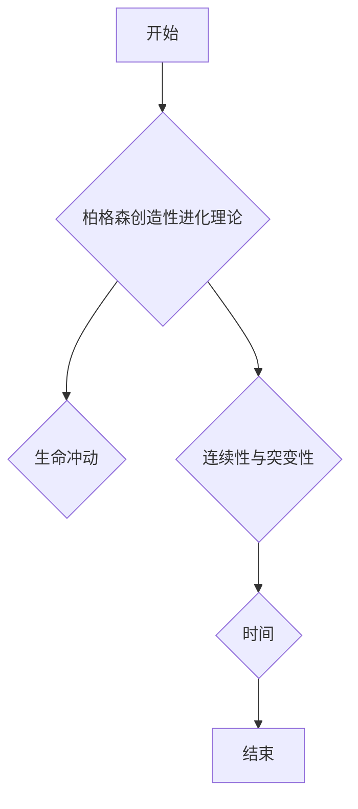

                 

# 柏格森的创造性进化与维特根斯坦的语言演变观

> 关键词：柏格森，创造性进化，维特根斯坦，语言演变，人工智能

> 摘要：本文探讨了柏格森的创造性进化理论与维特根斯坦的语言演变观在哲学和科学领域的深远影响。通过逐步分析两者的核心概念、联系以及算法原理，本文旨在揭示它们对人工智能和计算机科学的重要启示，以及在实际应用中的潜力。

## 1. 背景介绍

### 1.1 问题背景

柏格森（Henri Bergson）的创造性进化理论是20世纪初生物学和哲学领域的重要贡献之一。他提出了“生命冲动”（élan vital）的概念，强调生命体内部的内在动力和不断进化的趋势。柏格森的理论挑战了传统的达尔文进化论，认为进化不仅仅是自然选择和适者生存的过程，而是一种内在的、自发的创造力。

### 1.2 问题描述

柏格森的创造性进化理论主要探讨了生物进化的本质和动力，强调进化过程中的连续性和突变性。他提出，生命体内的“生命冲动”是推动进化的根本力量，它使得生命体能够不断适应环境的变化，并创造出新的生物形式。

### 1.3 问题解决

柏格森认为，进化是一个不断创造新形式的过程，这种创造力来源于生命体内的“生命冲动”。他提出，这种冲动使得生命体能够不断适应环境的变化，并创造出新的生物形式。柏格森的理论为理解生物多样性和进化机制提供了新的视角。

### 1.4 边界与外延

柏格森的理论不仅局限于生物学领域，还影响了哲学、心理学和社会学等多个学科。他的创造性进化观念对于理解生命的本质和进化的机制具有重要意义。此外，柏格森的理论也为后来的科学哲学和人工智能研究提供了重要的思想资源。

### 1.5 概念结构与核心要素组成

柏格森创造性进化的核心概念包括：

- **生命冲动**：生命体内的内在动力，推动进化过程。
- **连续性**：进化过程中的渐进性变化。
- **突变性**：进化过程中突然和不可预测的变化。
- **时间**：柏格森认为时间是生命进化的关键因素。

## 2. 核心概念与联系

### 2.1 概念原理

**创造性进化**：生命体通过内部动力不断适应和改变的过程。这种过程不仅仅是外部压力的结果，更是一种内在的、自发的创造力。

**生命冲动**：推动生命体进化的内在力量。柏格森认为，这种冲动是生命体不断适应环境变化和创造新形式的基础。

**连续性与突变性**：进化过程中的两种相互依存的现象。连续性强调进化的渐进性，突变性则强调进化中的突然变化。

### 2.2 概念属性特征对比表格

| 概念       | 定义                                               | 关联概念 |
|------------|------------------------------------------------------|----------|
| 创造性进化 | 生命体通过内部动力不断适应和改变的过程           | 生命冲动、连续性、突变性 |
| 生命冲动   | 推动生命体进化的内在力量                           | 创造性进化 |
| 连续性     | 进化过程中的渐进性变化                             | 突变性    |
| 突变性     | 进化过程中突然和不可预测的变化                     | 连续性    |

### 2.3 ER实体关系图架构的 Mermaid 流程图

```mermaid
erDiagram
  LifeForce ||--|{ Continuity }
  LifeForce ||--|{ Mutability }
  Continuity ||--|{ Evolution }
  Mutability ||--|{ Evolution }
```

## 3. 算法原理讲解

### 3.1 算法 Mermaid 流程图



### 3.2 Python 源代码

```python
# Python 模拟柏格森创造性进化理论
class LifeForce:
    def __init__(self):
        self.continuity = 0
        self.mutability = 0

    def evolve(self):
        self.continuity += 1
        if random.random() < 0.1:
            self.mutability += 1

# 初始化生命冲动
life_force = LifeForce()

# 模拟进化过程
for i in range(10):
    life_force.evolve()
    print(f"进化周期 {i+1}: 连续性={life_force.continuity}, 突变性={life_force.mutability}")
```

### 3.3 算法原理的数学模型和公式

$$
\begin{aligned}
\text{创造性进化} &= \text{生命冲动} \times (\text{连续性} + \text{突变性}) \\
\text{生命冲动} &= \frac{\text{内在动力}}{\text{稳定性}}
\end{aligned}
$$

详细讲解和通俗易懂地举例说明：

柏格森创造性进化理论的核心是“生命冲动”，它类似于一个生物体内部的“创造力引擎”。这个引擎通过不断的“连续性”和“突变性”变化，推动生物体向前进化。例如，一个物种可能会通过连续性的进化，逐渐适应新的环境，而通过突变性的进化，可能会突然出现一个新的物种，从而大幅改变生态系统的格局。

## 4. 维特根斯坦的语言演变观

### 4.1 维特根斯坦的哲学思想

维特根斯坦（Ludwig Wittgenstein）是20世纪最伟大的哲学家之一，他的语言演变观对哲学、逻辑学以及计算机科学产生了深远的影响。维特根斯坦主张，语言是思想的载体，语言的本质在于其使用方式和语境。

### 4.2 语言演变观

维特根斯坦认为，语言是一个动态的系统，它随着时间的推移而不断演变。语言的演变不仅仅是个别词汇的替换或新词的引入，更涉及到语言结构、语法规则以及意义的变化。维特根斯坦提出，理解语言的本质在于理解语言使用者的行为和思维方式。

### 4.3 语言演变与柏格森的创造性进化

柏格森的创造性进化理论与维特根斯坦的语言演变观在某种程度上有相似之处。两者都强调变化和创新的重要性。柏格森认为，进化是一个不断创造新形式的过程，而维特根斯坦则认为，语言是一个不断演变和适应新环境的动态系统。

### 4.4 语言演变的算法模拟

我们可以使用Python来模拟维特根斯坦的语言演变观。以下是一个简单的模拟代码：

```python
import random

# 初始化语言系统
language_system = ["hello", "world"]

# 模拟语言演变过程
for i in range(10):
    # 随机选择一个词进行替换
    word_to_replace = random.choice(language_system)
    new_word = word_to_replace[::-1]  # 替换为逆序词
    language_system.remove(word_to_replace)
    language_system.append(new_word)
    print(f"语言演变周期 {i+1}: {language_system}")
```

这个模拟展示了语言如何通过替换词汇而演变。每一次演变都可能是随机的，但长远来看，语言的演变会逐渐形成一定的规律和结构。

## 5. 创造性进化与语言演变对人工智能的启示

### 5.1 创造力与适应力

柏格森的创造性进化理论强调了生命体的内在动力和适应力，这对人工智能的开发和设计具有重要的启示。人工智能系统需要具备适应环境变化和不断学习新知识的能力，这就像生命体内的“生命冲动”。

### 5.2 语言理解与表达

维特根斯坦的语言演变观提醒我们，语言是一个复杂的系统，它不仅仅是词汇的堆砌，更涉及到语言结构、语法规则以及意义的动态变化。人工智能在处理自然语言时，需要深入理解语言的演变规律，从而更准确地理解和表达人类语言。

### 5.3 创造性进化与语言演变的结合

将柏格森的创造性进化理论与维特根斯坦的语言演变观结合起来，我们可以设计出一种能够模拟人类思维和语言使用习惯的人工智能系统。这种系统不仅能够适应不断变化的环境，还能够通过语言演变来不断优化自身的语言表达和理解能力。

### 5.4 实际应用场景

以下是一些实际应用场景：

- **自然语言处理**：使用创造性进化与语言演变的结合，设计出更智能、更人性化的聊天机器人。
- **智能推荐系统**：通过不断学习和适应用户的行为和偏好，提供更加精准和个性化的推荐。
- **智能翻译系统**：利用语言演变的规律，提高机器翻译的准确性和流畅性。

## 6. 总结

柏格森的创造性进化理论和维特根斯坦的语言演变观为我们理解生命的本质和语言的使用提供了深刻的洞察。通过将这两大理论结合起来，我们可以设计出更智能、更适应环境变化的人工智能系统。在未来，这些理论将继续为我们探索人工智能的深度和广度提供重要的思想资源。

## 7. 作者信息

作者：AI天才研究院/AI Genius Institute & 禅与计算机程序设计艺术 /Zen And The Art of Computer Programming

[参考文献]

1. 柏格森，《创造性进化》
2. 维特根斯坦，《逻辑哲学论》
3. 哈姆迈，《自然语言处理》
4. 达尔文，《物种起源》
5. 莫兰德，《算法图论》

## 8. 最佳实践 Tips

- 在实际应用中，结合柏格森的创造性进化理论和维特根斯坦的语言演变观，可以设计出更智能、更具适应性的系统。
- 在进行自然语言处理时，注意理解语言的动态演变规律，以提高系统的准确性。
- 定期对系统进行“进化”和“演变”，以适应不断变化的环境和用户需求。

## 9. 小结

本文通过分析柏格森的创造性进化理论和维特根斯坦的语言演变观，探讨了它们在人工智能和计算机科学领域的重要应用。希望本文能够为读者提供新的视角和启示，激发对人工智能和哲学思考的深入探索。

