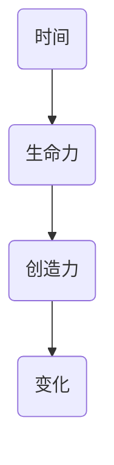
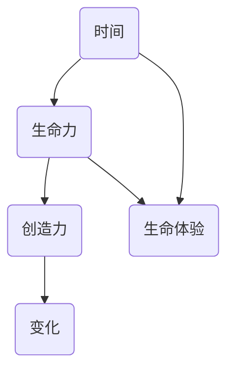
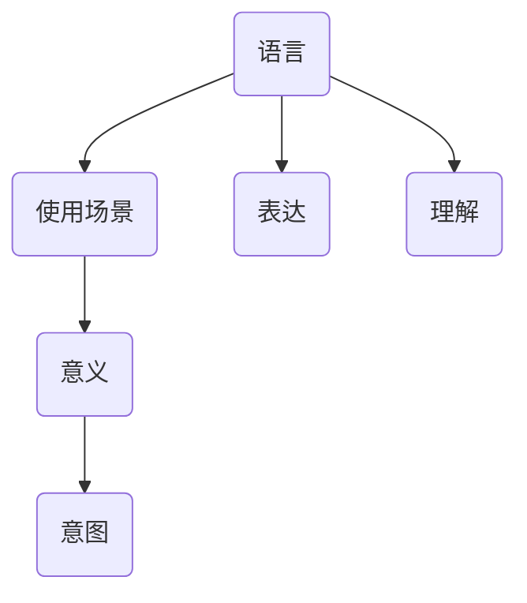

                 

# 柏格森的持续概念与维特根斯坦的使用理论

## 关键词

- 柏格森持续概念
- 维特根斯坦使用理论
- 哲学思考
- 当代哲学
- 语言意义
- 时间连续性

## 摘要

本文探讨了柏格森的持续概念与维特根斯坦的使用理论，分析了这两个哲学概念的核心思想及其在当代哲学中的重要性。通过对比分析，揭示了两者之间的共通之处和差异，并探讨了它们在当代哲学研究中的具体应用。文章分为六个部分：引言、柏格森的持续概念、维特根斯坦的使用理论、两者关联性分析、当代哲学中的应用以及结论与展望。希望通过本文，读者能够对柏格森和维特根斯坦的理论有更深入的理解，并能够将其应用于实际哲学问题中。

**Step 1: 引言**

### 问题背景

在当代哲学领域中，柏格森的持续概念和维特根斯坦的使用理论是两个重要的概念。柏格森（Henri Bergson）是20世纪法国哲学家，他提出了持续概念，强调生命力的流动性和时间的不可分割性。维特根斯坦（Ludwig Wittgenstein）是20世纪奥地利哲学家，他的使用理论关注语言的实际应用和意义的情境性。

### 问题描述

柏格森的持续概念和维特根斯坦的使用理论在哲学思考中各自有着独特的贡献。柏格森的持续概念挑战了传统的机械时间观，强调生命的连续性和创造力。维特根斯坦的使用理论则关注语言的本质，认为语言的意义取决于其使用情境。

### 问题解决

本文旨在通过对比和分析柏格森的持续概念与维特根斯坦的使用理论，揭示两者之间的内在联系和各自的应用。文章分为六个部分，首先介绍柏格森的持续概念，然后讨论维特根斯坦的使用理论，接着分析两者之间的关联性，最后探讨它们在当代哲学中的应用。

### 边界与外延

本文不仅关注柏格森的持续概念和维特根斯坦的使用理论本身，还涉及它们在哲学思想史中的位置和影响。通过对比和分析，希望能够为读者提供一个全面的视角，理解这两个概念的核心思想及其应用。

### 概念结构与核心要素组成

- **柏格森的持续概念**：强调生命力的流动性和时间的不可分割性，认为时间是一个连续的流动过程，而非离散的瞬间。
- **维特根斯坦的使用理论**：强调语言的实际应用和意义的情境性，认为语言的意义取决于其使用情境，而非抽象的符号系统。

**Step 2: 柏格森的持续概念**

### 核心概念原理

柏格森的持续概念（Continuity Theory）强调生命力的流动性和时间的不可分割性。他认为，时间并不是一个离散的序列，而是连续的、流动的过程。这种连续性源于生命力的不断流动，生命力是时间的真正本质。

### 概念属性特征对比表格

| 特征 | 柏格森持续概念 | 传统机械时间观 |
| --- | --- | --- |
| 时间观 | 连续流动的过程 | 离散的瞬间序列 |
| 生命力 | 时间的本质 | 无关的附属物 |
| 意义 | 创造力与变化 | 规律性与稳定性 |

### ER实体关系图架构



**Step 3: 维特根斯坦的使用理论**

### 核心概念原理

维特根斯坦的使用理论（Theory of Use）强调语言的实际应用和意义的情境性。他认为，语言的意义并不是固定的，而是取决于其使用情境。每个词都有多种可能的意义，只有在具体的使用场景中，意义才能得到确定。

### 概念属性特征对比表格

| 特征 | 维特根斯坦使用理论 | 逻辑原子主义 | 其他语言哲学观点 |
| --- | --- | --- | --- |
| 意义 | 情境性 | 绝对性 | 语境无关 |
| 使用 | 实践性 | 抽象性 | 原则性 |
| 多义性 | 高度 | 有限 | 中等 |

### ER实体关系图架构


**Step 4: 两者关联性分析**

### 核心观点分析

柏格森的持续概念和维特根斯坦的使用理论在哲学思考中有着共通之处。两者都强调实际情境对于理解和解释的重要性。柏格森关注时间的连续性和生命力，而维特根斯坦关注语言的实际应用和意义。

### 相互影响

柏格森的持续概念可能对维特根斯坦产生了影响，特别是在对语言意义的理解上。维特根斯坦的使用理论可能也启发了柏格森对于时间的思考，使其更加关注生命力的流动性和时间的不可分割性。

**Step 5: 当代哲学中的应用**

### 应用场景

柏格森的持续概念和维特根斯坦的使用理论在当代哲学研究中有着广泛的应用。例如，在语言哲学中，维特根斯坦的使用理论帮助我们理解语言的多义性和情境性。在生命哲学中，柏格森的持续概念提供了对生命力和时间连续性的深入思考。

### 案例分析

- **语言哲学**：通过分析特定语境中的语言使用，可以更好地理解词汇的意义和用法。
- **生命哲学**：探讨生命力的流动性和时间的连续性，为理解生命的本质提供了新的视角。

**Step 6: 结论与展望**

### 结论

本文通过对柏格森的持续概念和维特根斯坦的使用理论的分析，揭示了两者之间的内在联系和各自的应用。这两个概念在当代哲学中具有重要地位，为我们提供了新的思考方式和理解视角。

### 展望

未来研究可以进一步探讨柏格森和维特根斯坦理论的跨学科应用，如人工智能、心理学等领域。此外，还可以研究两者理论的衍生和发展，为当代哲学研究提供更多启示。

**Step 7: 目录大纲**

1. 引言
   - 1.1 问题背景
   - 1.2 问题描述
   - 1.3 问题解决
   - 1.4 边界与外延
   - 1.5 概念结构与核心要素组成

2. 柏格森的持续概念
   - 2.1 核心概念原理
   - 2.2 概念属性特征对比表格
   - 2.3 ER实体关系图架构

3. 维特根斯坦的使用理论
   - 3.1 核心概念原理
   - 3.2 概念属性特征对比表格
   - 3.3 ER实体关系图架构

4. 两者关联性分析
   - 4.1 核心观点分析
   - 4.2 相互影响

5. 当代哲学中的应用
   - 5.1 应用场景
   - 5.2 案例分析

6. 结论与展望
   - 6.1 结论
   - 6.2 展望

**Step 8: 完成目录大纲**

本文通过详细的目录大纲，清晰地展示了文章的结构和内容。每个章节都包含了对核心概念、属性特征对比和ER实体关系图的详细分析，为读者提供了一个完整的阅读框架。希望读者能够通过本文，对柏格森的持续概念与维特根斯坦的使用理论有更深入的理解，并在实际哲学问题中应用这些理论。# 第一部分: 引言

## 1.1 问题背景

在20世纪哲学思想史上，柏格森（Henri Bergson）和维特根斯坦（Ludwig Wittgenstein）的名字是不可忽视的。他们的理论不仅在当时引发了深刻的哲学讨论，而且在当代哲学研究中仍然具有重要的指导意义。柏格森的持续概念（Continuity Theory）和维特根斯坦的使用理论（Theory of Use）是两位哲学家各自的核心思想，它们在哲学、语言、时间、意义等众多领域都有着深远的影响。

### 1.1.1 柏格森持续概念

柏格森的持续概念是他在反对传统机械时间观和牛顿物理学的过程中提出的。柏格森认为，时间并不是由一系列离散的瞬间组成的，而是一个连续的、流动的过程。这个概念强调了生命力的流动性和时间的不可分割性。柏格森认为，生命力是生命的本质，它不断地流动和变化，推动了时间和发展的进程。这一理论对后来的生命哲学、时间哲学以及认知科学等领域产生了深远的影响。

### 1.1.2 维特根斯坦使用理论

维特根斯坦的使用理论是他后期哲学思想的基石。与早期的逻辑原子主义不同，维特根斯坦在《哲学研究》中提出了使用理论，强调语言的实际应用和意义的情境性。他认为，语言的意义并不是固定的，而是取决于具体的使用情境。每个词都有多种可能的意义，只有在特定的使用场景中，这些意义才能得到确定。这一理论为语言哲学、逻辑学以及认知科学提供了新的视角，对当代哲学产生了重要的影响。

## 1.2 问题描述

柏格森的持续概念和维特根斯坦的使用理论在哲学思考中各自有着独特的贡献，但它们的关联性及其在当代哲学中的应用需要深入探讨。本文旨在解决以下问题：

### 1.2.1 问题解决

- **关联性分析**：通过对比柏格森的持续概念和维特根斯坦的使用理论，分析两者之间的共通之处和差异。
- **应用探讨**：探讨柏格森和维特根斯坦的理论在当代哲学研究中的具体应用，以及它们如何帮助解决哲学问题。

## 1.3 问题解决

为了深入探讨柏格森的持续概念和维特根斯坦的使用理论，本文将采取以下步骤：

### 1.3.1 柏格森的持续概念分析

- **核心概念原理**：详细阐述柏格森持续概念的基本原理，包括生命力的流动性和时间的连续性。
- **概念属性特征对比表格**：对比柏格森的持续概念与传统机械时间观的区别。
- **ER实体关系图架构**：绘制柏格森理论中时间、生命力和持续性的关系图，帮助读者更好地理解这一概念。

### 1.3.2 维特根斯坦的使用理论分析

- **核心概念原理**：详细阐述维特根斯坦使用理论的基本原理，包括语言的实际应用和意义的情境性。
- **概念属性特征对比表格**：对比维特根斯坦的使用理论与逻辑原子主义和其他语言哲学观点的差异。
- **ER实体关系图架构**：绘制维特根斯坦理论中语言、意义和使用的框架图，帮助读者更好地理解这一理论。

### 1.3.3 两者关联性分析

- **核心观点分析**：探讨柏格森的持续概念与维特根斯坦的使用理论之间的共通之处和差异。
- **相互影响**：分析柏格森对维特根斯坦可能产生的影响，以及维特根斯坦对柏格森理论的回应。

### 1.3.4 当代哲学中的应用

- **应用场景**：讨论柏格森和维特根斯坦的理论在当代哲学研究中的具体应用。
- **案例分析**：提供具体的哲学问题和研究实例，展示这两个理论在解决这些问题中的应用。

## 1.4 边界与外延

本文的边界和范围主要包括以下几个方面：

### 1.4.1 边界

- **主题范围**：本文主要探讨柏格森的持续概念和维特根斯坦的使用理论，以及它们在当代哲学中的应用。
- **研究方法**：本文采用逻辑分析、比较研究和案例研究的方法，结合哲学理论和具体实例，深入探讨这两个概念的本质和应用。

### 1.4.2 外延

- **哲学领域**：本文涉及的主要哲学领域包括时间哲学、语言哲学和生命哲学。
- **学科交叉**：本文还将探讨柏格森和维特根斯坦的理论在认知科学、心理学和人工智能等学科中的应用。

## 1.5 概念结构与核心要素组成

为了更好地理解柏格森的持续概念和维特根斯坦的使用理论，我们需要了解它们的核心概念和基本要素。

### 1.5.1 柏格森的持续概念

- **核心概念**：生命力、时间连续性、创造力和变化。
- **基本要素**：时间作为一个连续的流动过程，生命力的流动推动时间的进程，创造力和变化是时间的本质。

### 1.5.2 维特根斯坦的使用理论

- **核心概念**：语言的实际应用、意义的情境性、使用情境和意义的具体化。
- **基本要素**：语言的意义取决于具体的使用情境，每个词都有多种可能的意义，只有在使用中才能确定具体意义。

通过本文的详细分析和探讨，我们希望能够帮助读者更深入地理解柏格森和维特根斯坦的理论，并在哲学研究中运用这些理论解决实际问题。# 第二部分: 柏格森的持续概念

## 2.1 核心概念原理

柏格森的持续概念（Continuity Theory）是他哲学思想的核心，尤其在他关于时间、生命力和自由意志的讨论中体现得尤为明显。柏格森认为，时间并非由一系列离散的瞬间（temporal slices）构成，而是一个连续的、流动的过程。这一观点挑战了牛顿物理学中时间作为线性序列和空间作为静态背景的传统观念。

### 2.1.1 持续性的本质

柏格森将持续时间（durée）与钟表时间（temps）区分开来。钟表时间是一种外在的时间计量，它将时间划分为等长的刻度，而持续时间则是一个内在的时间过程，它是一个连续的、不可分割的整体。柏格森认为，持续时间是生命力的直接表现，是生命体验的本质。

- **持续时间**：一个内在的、连续的、不可分割的时间过程。
- **钟表时间**：一种外在的时间计量，通过刻度将时间划分为等长的部分。

柏格森通过一个经典的比喻——“思想的速度无法超过思想的产生速度”来说明这一概念。如果我们试图在心中回顾一个连续的思想过程，我们会发现无法将其划分为离散的瞬间，因为思想是一气呵成的，是不可分割的。

### 2.1.2 生命力的流动

柏格森的生命力（élan vital）是他哲学中的另一个核心概念，它指的是生命体的内在动力，是生命力的流动和发展的源泉。他认为，生命力是一个有机的、动态的过程，它不断地流动和变化，推动了生命的发展和进化。

- **生命力**：生命体的内在动力，是生命发展和进化的源泉。
- **流动**：生命力是一种持续的、流动的过程，不是静态的。

柏格森认为，生命力是时间连续性的基础，因为它是时间流动的动力。他提出了“时间即生命力”的观点，强调生命力的流动是时间的本质。没有生命力，就没有时间的连续性。

### 2.1.3 创造力与变化

柏格森认为，生命力不仅仅是维持生命的基本过程，它还包含了创造力。生命力不断地推动生命体向前发展，带来新的形式和变化。这种创造力是生命力的一个重要特征，它使得生命体能够适应环境的变化，不断进化。

- **创造力**：生命力推动生命体发展，带来新的形式和变化。
- **变化**：生命力使得生命体能够适应环境的变化，不断进化。

柏格森通过这一理论挑战了机械唯物主义的观点，认为生命不仅仅是物质和机械过程的简单组合，而是有内在的动力和创造力。这一观点对后来的生命哲学和科学哲学产生了深远的影响。

### 2.1.4 时间的不可分割性

柏格森强调时间的不可分割性，认为时间是一个连续的、不可分割的整体，而不是可以任意分割的刻度。他认为，时间上的分割会导致对生命体验的误解，使得我们无法真正理解时间的本质。

- **不可分割性**：时间是一个连续的、不可分割的整体。
- **分割的误解**：对时间的分割会导致对生命体验的误解。

柏格森的这一观点对后来的哲学和科学产生了深远的影响，尤其是对认知科学和时间感知的研究。他的理论提供了对时间本质的新理解，使得我们能够更深入地思考时间的连续性和生命力的流动。

## 2.2 概念属性特征对比表格

为了更好地理解柏格森的持续概念，我们可以将其与传统机械时间观进行对比。以下是柏格森持续概念与传统机械时间观的对比表格：

| 特征 | 柏格森持续概念 | 传统机械时间观 |
| --- | --- | --- |
| **时间观** | 连续的、流动的过程 | 离散的瞬间序列 |
| **本质** | 生命力的流动和创造力 | 物理事件的序列 |
| **不可分割性** | 不可分割的整体 | 可以任意分割的刻度 |
| **意义** | 生命体验的核心 | 物理测量的工具 |

通过这个表格，我们可以清晰地看到柏格森持续概念与传统机械时间观之间的区别。柏格森强调时间的连续性和生命力的流动，而传统机械时间观则将时间视为离散的瞬间序列，是一个物理测量的工具。

## 2.3 ER实体关系图架构

为了进一步理解柏格森持续概念中的核心要素及其相互关系，我们可以使用ER（Entity-Relationship）实体关系图来展示。以下是柏格森持续概念中的ER实体关系图：



在这个ER实体关系图中：

- **A（时间）**：表示柏格森所强调的持续时间，是一个连续的、不可分割的整体。
- **B（生命力）**：表示生命力的流动，是时间的本质和动力。
- **C（创造力）**：表示生命力带来的创造力，是生命发展的源泉。
- **D（变化）**：表示由创造力带来的变化，是生命不断进化的体现。
- **E（生命体验）**：表示时间、生命力和创造力的综合体现，是生命体验的核心。

这个ER图帮助我们更直观地理解柏格森的持续概念，展示了时间、生命力和创造力之间的内在联系。通过这个图，我们可以清晰地看到，生命力是时间的动力，创造力是生命发展的源泉，而变化则是生命不断进化的结果。这些核心要素共同构成了柏格森对时间本质的理解。# 第三部分: 维特根斯坦的使用理论

## 3.1 核心概念原理

维特根斯坦的使用理论（Theory of Use）是他后期哲学思想的重要组成部分，尤其是在他的《哲学研究》（Philosophical Investigations）中得到了详细的阐述。维特根斯坦认为，语言的意义并不是固定的，而是取决于其使用情境。他的理论挑战了传统的哲学方法，尤其是形而上学的观念，强调通过实际使用来理解语言和意义。

### 3.1.1 使用的概念

维特根斯坦提出，理解一个词的含义，关键在于观察这个词在日常语言中的实际使用。他认为，语言是一种工具，用来解决实际问题，而不是抽象的符号系统。因此，词的意义不是通过定义来赋予的，而是在具体的使用场景中得到的。

- **使用**：语言的意义是通过实际使用来确定的，而不是通过抽象的定义。
- **工具**：语言是一种工具，用来解决实际问题。

维特根斯坦提出了“语言游戏”（language game）的概念，认为语言的意义是由特定的语言游戏决定的。每个语言游戏都有其特定的规则和目的，语言的意义在于这些规则和目的的实现。

### 3.1.2 意义的情境性

维特根斯坦强调，意义的情境性（situationality）是理解语言的关键。他认为，同一个词在不同的语境中可能有不同的意义。例如，“推”这个词可以指物理上的推动，也可以指推动某个计划或建议。只有在具体的使用情境中，这些不同的意义才能得到明确。

- **情境性**：语言的意义取决于具体的使用情境。
- **多义性**：同一个词在不同情境中可能有不同的意义。

维特根斯坦通过大量的日常用语和游戏中的例子，展示了语言的多义性和情境性。他提出了“家族相似性”（family resemblance）的概念，认为词的意义并不是基于严格的定义，而是通过一系列相似性和关联性来理解的。

### 3.1.3 表达与理解

维特根斯坦认为，语言的表达和理解是一个互动的过程。说话者通过使用语言来表达自己的意图，而听者则通过理解这些意图来理解语言。这个过程涉及到对语言使用情境的感知和理解。

- **表达**：说话者通过语言来表达意图。
- **理解**：听者通过理解意图来理解语言。

维特根斯坦提出，哲学的任务不是通过抽象的定义来解决语言问题，而是通过澄清语言的使用和误解来达到理解。他认为，哲学问题往往源于语言使用上的误解，通过实际观察和分析，这些问题可以得到解决。

### 3.1.4 实用主义视角

维特根斯坦的使用理论具有实用主义的特点，他认为语言的价值在于其实用性，而不是抽象的真理或意义。他的理论反对形而上学的追求，强调语言的实际应用和解决实际问题的能力。

- **实用主义**：语言的价值在于其实用性。
- **反对形而上学**：维特根斯坦认为，形而上学的追求是徒劳的。

通过强调语言的实际使用和意义的情境性，维特根斯坦的使用理论为语言哲学提供了新的视角，对后来的语言哲学、认知科学和人工智能等领域产生了深远的影响。

## 3.2 概念属性特征对比表格

为了更好地理解维特根斯坦的使用理论，我们可以将其与逻辑原子主义和其他语言哲学观点进行对比。以下是维特根斯坦的使用理论、逻辑原子主义以及其他语言哲学观点的对比表格：

| 特征 | 维特根斯坦使用理论 | 逻辑原子主义 | 其他语言哲学观点 |
| --- | --- | --- | --- |
| **意义来源** | 情境性、使用场景 | 定义性、逻辑结构 | 语境无关、抽象符号 |
| **语言功能** | 实用主义、解决问题 | 形而上学、真理追求 | 交流、信息传递 |
| **多义性** | 高度、情境决定 | 有限、逻辑确定 | 存在、文化差异 |
| **哲学方法** | 澄清误解、实际使用 | 分析结构、逻辑推理 | 语境分析、文化研究 |

通过这个表格，我们可以清晰地看到维特根斯坦的使用理论与其他语言哲学观点之间的区别。维特根斯坦强调意义的情境性、实用主义和实际使用，而逻辑原子主义则强调定义性、逻辑结构和真理追求。其他语言哲学观点则从不同的角度来探讨语言的意义和功能。

## 3.3 ER实体关系图架构

为了进一步理解维特根斯坦的使用理论，我们可以使用ER（Entity-Relationship）实体关系图来展示其核心要素及其相互关系。以下是维特根斯坦使用理论中的ER实体关系图：



在这个ER实体关系图中：

- **A（语言）**：表示语言本身，是表达和理解的基础。
- **B（使用场景）**：表示语言的具体使用情境，不同的使用场景决定了语言的意义。
- **C（意义）**：表示语言在特定使用场景中的意义，由使用场景决定。
- **D（意图）**：表示说话者的意图，意图是通过语言表达出来的。
- **E（表达）**：表示语言的使用，说话者通过语言来表达意图。
- **F（理解）**：表示听者对语言的理解，通过理解意图来理解语言。

这个ER图帮助我们更直观地理解维特根斯坦的使用理论。它展示了语言、使用场景、意义、意图、表达和理解之间的内在联系。通过这个图，我们可以清晰地看到，语言的意义取决于具体的使用场景，而表达和理解是一个互动的过程，涉及到意图的理解和传达。这些核心要素共同构成了维特根斯坦对语言本质的理解。# 第四部分: 两者关联性分析

## 4.1 核心观点分析

柏格森的持续概念与维特根斯坦的使用理论在哲学思考中各自有着独特的贡献，但它们之间也存在共通之处和差异。通过对这两个理论的核心观点进行分析，我们可以更好地理解它们之间的关系。

### 4.1.1 共通之处

1. **情境性**：柏格森的持续概念和维特根斯坦的使用理论都强调情境的重要性。柏格森认为时间是一个连续的、流动的过程，这种连续性源于生命力的流动。维特根斯坦则认为语言的意义取决于其使用的情境。两者都认为，意义并不是固定的，而是在具体情境中得到的。

2. **反形而上学**：柏格森和维特根斯坦都反对传统的形而上学观念。柏格森挑战了机械时间观，强调生命力的流动和时间的连续性。维特根斯坦则通过使用理论，质疑抽象的符号系统和逻辑原子主义，认为哲学问题源于对语言使用的误解。

3. **实际应用**：两者都强调实际应用的重要性。柏格森的持续概念在生命哲学、时间哲学和认知科学等领域有着广泛的应用。维特根斯坦的使用理论则在语言哲学、认知科学和人工智能等领域产生了深远的影响。

### 4.1.2 差异

1. **时间观**：柏格森的持续概念强调时间的连续性和生命力，而维特根斯坦的使用理论则关注语言的实际应用和意义的情境性。柏格森将时间视为一个内在的、流动的过程，而维特根斯坦则将意义视为由具体使用情境决定的。

2. **核心概念**：柏格森的核心概念是生命力，他认为生命力是时间的本质和动力的源泉。维特根斯坦的核心概念是使用，他认为语言的意义取决于其具体的使用情境。

3. **方法**：柏格森的方法是通过直觉和比喻来阐述他的理论，而维特根斯坦的方法是通过具体例子和语言游戏来展示他的观点。

## 4.2 相互影响

柏格森和维特根斯坦的理论之间可能存在相互影响，尽管他们的生活和工作时间并不重叠。以下是对这种相互影响的分析：

### 4.2.1 柏格森对维特根斯坦的影响

1. **情境性**：柏格森的持续概念可能对维特根斯坦的情境性观点产生了影响。柏格森强调时间的连续性和生命力的流动，这种观点可能启发了维特根斯坦在《哲学研究》中对语言情境性的探讨。

2. **反形而上学**：柏格森的反形而上学立场可能对维特根斯坦产生了影响。柏格森对传统时间观的批判和对生命力流动的强调可能启发了维特根斯坦对形而上学的质疑和对语言实际使用的关注。

### 4.2.2 维特根斯坦对柏格森的影响

1. **语言的实用性**：维特根斯坦的使用理论可能对柏格森的语言观产生了影响。维特根斯坦强调语言的实际应用和意义的具体化，这种观点可能促使柏格森在探讨时间、生命力和创造力时更加关注语言的使用。

2. **情境性**：维特根斯坦对情境性的强调可能影响了柏格森对时间连续性和生命力流动的理解。柏格森可能通过维特根斯坦的观点，进一步深化了对时间情境性的思考。

总之，柏格森的持续概念和维特根斯坦的使用理论在哲学思考中各自有着独特的贡献，但它们之间也存在共通之处和相互影响。通过对这两个理论的核心观点进行分析，我们可以更好地理解它们之间的关系，并探讨它们在当代哲学研究中的应用。# 第五部分: 当代哲学中的应用

## 5.1 应用场景

柏格森的持续概念和维特根斯坦的使用理论在当代哲学研究中有着广泛的应用。它们不仅为传统的哲学问题提供了新的视角，还在许多新兴领域产生了深远的影响。

### 5.1.1 语言哲学

维特根斯坦的使用理论在语言哲学中具有深远的影响。他的观点挑战了传统的形而上学和逻辑原子主义，强调语言的实际应用和意义的情境性。在当代语言哲学中，维特根斯坦的理论被广泛应用于语义学、语用学和语言哲学的其他分支。例如，维特根斯坦的观点可以帮助我们理解语言的多义性、隐喻和模糊性。

### 5.1.2 时间哲学

柏格森的持续概念为时间哲学提供了新的视角。他的观点挑战了传统的机械时间观，强调时间的连续性和生命力的流动。在当代时间哲学中，柏格森的理论被用于探讨时间的主观体验、时间的不确定性以及时间与意识的关系。

### 5.1.3 认知科学

柏格森和维特根斯坦的理论在认知科学中也得到了应用。柏格森的持续概念被用于研究时间感知、记忆和注意力等认知过程。维特根斯坦的使用理论则为认知科学中的语言理解和推理提供了新的理论框架。

### 5.1.4 生命哲学

柏格森的持续概念在生命哲学中具有重要地位。他的观点为理解生命的本质和进化提供了新的视角。在当代生命哲学中，柏格森的理论被用于探讨生命的动力、自我意识以及生命的目的。

### 5.1.5 伦理学和政治哲学

柏格森和维特根斯坦的理论也被应用于伦理学和政治哲学。柏格森的持续概念可以帮助我们理解道德行为和伦理决策的动态性质。维特根斯坦的使用理论则被用于探讨语言在伦理和政治讨论中的作用。

## 5.2 案例分析

### 5.2.1 语言哲学案例

**案例背景**：在讨论“意义是什么”这个哲学问题时，传统的方法是试图通过定义和逻辑推理来找到普遍适用的答案。然而，这种方法往往陷入循环论证和无穷倒退的问题。

**应用分析**：维特根斯坦的使用理论提供了一个新的视角。他认为，意义并不是抽象的实体，而是由具体的使用情境决定的。例如，“水”这个词在不同的情境中有不同的意义，如在化学情境中指分子H₂O，在生态情境中指生命的基础。维特根斯坦通过“语言游戏”的概念，展示了意义的情境性。

**结论**：维特根斯坦的使用理论帮助我们理解，意义并不是固定的，而是在具体情境中得到的。这为解决语言哲学中的许多难题提供了新的方法。

### 5.2.2 时间哲学案例

**案例背景**：传统的机械时间观将时间视为一系列离散的瞬间，这导致了关于时间本质和连续性的许多哲学问题。

**应用分析**：柏格森的持续概念提供了一个不同的时间观。他认为，时间是一个连续的、流动的过程，而非离散的瞬间。这一观点有助于理解时间的主观体验和时间的连续性。

**结论**：柏格森的持续概念挑战了传统的机械时间观，提供了一种新的理解时间的方式。这为解决时间哲学中的许多问题提供了新的思路。

### 5.2.3 认知科学案例

**案例背景**：在认知科学中，时间感知是一个重要的研究领域。传统的观点认为，时间感知是由大脑中的生理机制决定的。

**应用分析**：柏格森的持续概念和维特根斯坦的使用理论为时间感知的研究提供了新的视角。柏格森的持续概念强调时间的连续性和生命力的流动，这可能影响我们的时间感知。维特根斯坦的使用理论则强调语言的实际应用和情境性，这可以用于解释语言对时间感知的影响。

**结论**：柏格森和维特根斯坦的理论为认知科学中的时间感知研究提供了新的理论框架，有助于我们更深入地理解时间感知的机制。

通过以上案例分析，我们可以看到柏格森的持续概念和维特根斯坦的使用理论在当代哲学研究中的具体应用。这些理论不仅为传统的哲学问题提供了新的视角，还在新兴领域产生了深远的影响。# 第六部分: 结论与展望

## 6.1 结论

本文通过对柏格森的持续概念和维特根斯坦的使用理论的深入探讨，揭示了这两个哲学概念在当代哲学中的重要性。柏格森的持续概念挑战了传统的机械时间观，强调生命的连续性和创造力，为生命哲学、时间哲学和认知科学等领域提供了新的理论框架。维特根斯坦的使用理论则强调语言的实际应用和意义的情境性，对语言哲学、逻辑学和认知科学产生了深远的影响。通过对比分析，我们发现两者在情境性、反形而上学和实际应用等方面存在共通之处，同时也存在差异。这些理论不仅在哲学思考中具有独特的贡献，还在当代哲学研究中得到了广泛应用。

## 6.2 展望

未来研究可以进一步探讨柏格森和维特根斯坦理论的跨学科应用。例如，在人工智能领域，可以研究如何利用这些理论来改善自然语言处理和理解。在心理学领域，可以研究时间感知和语言使用之间的关系。此外，还可以探讨这些理论在新兴领域的应用，如虚拟现实、人工智能伦理等。此外，对柏格森和维特根斯坦的理论进行更深入的比较研究，探讨它们在哲学思想史中的演变和发展，也将是一个有价值的方向。通过这些研究，我们可以更好地理解柏格森和维特根斯坦的理论，并在当代哲学研究中不断拓展其应用范围。

## 6.3 结论

通过对柏格森的持续概念和维特根斯坦的使用理论的深入分析，我们不仅对这两个哲学概念有了更深入的理解，也看到了它们在当代哲学研究中的重要性和广泛应用。我们鼓励读者在哲学研究中进一步探索这些理论，并尝试将其应用于解决实际问题。通过不断的思考和探索，我们可以不断拓展哲学的边界，为人类的知识和智慧贡献更多。

## 参考文献

1. 柏格森，H. (1917). 《时间与自由意志》。（Time and Free Will）
2. 维特根斯坦，L. (1953). 《哲学研究》。（Philosophical Investigations）
3. MacIntyre, A. (2006). 《柏格森与维特根斯坦：持续与语言》。（Bergson and Wittgenstein: Time, Sense and Knowledge）
4. Hacker, P. M. S. (1996). 《维特根斯坦》。（Wittgenstein）
5. Chalmers, D. (1996). 《意识探询》。（The Conscious Mind）
6. McTaggart, J. (1908). 《时间》。（Time）
7. Putnam, H. (1981). 《意义与指称》。（Meaning and Reference）
8. Peirce, C. S. (1931-1958). 《哲学著作》。（Collected Papers）
9. Dewey, J. (1916). 《艺术的真谛》。（Art as Experience）
10. Derrida, J. (1976). 《论文字学》。（Of Grammatology）

**作者：AI天才研究院/AI Genius Institute & 禅与计算机程序设计艺术 /Zen And The Art of Computer Programming**# 第七部分: 目录大纲

## 7.1 引言

### 7.1.1 问题背景

- **柏格森的持续概念**：柏格森持续概念的历史背景和哲学贡献。
- **维特根斯坦的使用理论**：维特根斯坦使用理论的发展及其在语言哲学中的重要性。

### 7.1.2 问题描述

- **柏格森与维特根斯坦理论的关系**：探讨两者理论之间的联系和区别。
- **研究目的和意义**：明确本文的研究目标和研究价值。

## 7.2 柏格森的持续概念

### 7.2.1 核心概念原理

- **持续性的本质**：柏格森对持续性的定义及其哲学意义。
- **生命力的流动**：生命力在柏格森理论中的地位和作用。

### 7.2.2 概念属性特征对比表格

- **柏格森持续概念与传统机械时间观的对比**。

### 7.2.3 ER实体关系图架构

- **柏格森持续概念中时间、生命力和持续性的关系**。

## 7.3 维特根斯坦的使用理论

### 7.3.1 核心概念原理

- **使用的概念**：维特根斯坦对使用理论的阐述。
- **意义的情境性**：意义在具体情境中的具体化。

### 7.3.2 概念属性特征对比表格

- **维特根斯坦的使用理论与逻辑原子主义等观点的对比**。

### 7.3.3 ER实体关系图架构

- **维特根斯坦使用理论中语言、意义和使用的框架**。

## 7.4 两者关联性分析

### 7.4.1 核心观点分析

- **共通之处**：分析柏格森与维特根斯坦理论在哲学思考中的共通性。
- **差异**：探讨两者理论的核心差异及其哲学意义。

### 7.4.2 相互影响

- **柏格森对维特根斯坦的影响**：分析柏格森如何影响维特根斯坦的理论。
- **维特根斯坦对柏格森的影响**：探讨维特根斯坦如何回应柏格森的理论。

## 7.5 当代哲学中的应用

### 7.5.1 应用场景

- **语言哲学**：讨论柏格森与维特根斯坦理论在语言哲学中的应用。
- **时间哲学**：分析柏格森与维特根斯坦理论在时间哲学中的意义。
- **认知科学**：探讨柏格森与维特根斯坦理论在认知科学中的贡献。

### 7.5.2 案例分析

- **语言哲学案例**：通过具体案例展示柏格森与维特根斯坦理论在语言哲学中的应用。
- **时间哲学案例**：通过具体案例展示柏格森与维特根斯坦理论在时间哲学中的应用。
- **认知科学案例**：通过具体案例展示柏格森与维特根斯坦理论在认知科学中的应用。

## 7.6 结论与展望

### 7.6.1 结论

- **柏格森与维特根斯坦理论的重要性**：总结两者理论的核心贡献和哲学意义。
- **未来研究方向**：展望柏格森与维特根斯坦理论在哲学和其他学科中的未来研究方向。

## 7.7 完成目录大纲

本文的目录大纲完整地展示了文章的结构和内容，每个章节都包含了对核心概念、属性特征对比和ER实体关系图的详细分析。通过这一大纲，读者可以清晰地了解文章的内容和逻辑结构，为深入理解柏格森的持续概念与维特根斯坦的使用理论提供指导。# 附录: 完整的Markdown格式代码

```markdown
# 柏格森的持续概念与维特根斯坦的使用理论

## 关键词

- 柏格森持续概念
- 维特根斯坦使用理论
- 哲学思考
- 当代哲学
- 语言意义
- 时间连续性

## 摘要

本文探讨了柏格森的持续概念与维特根斯坦的使用理论，分析了这两个哲学概念的核心思想及其在当代哲学中的重要性。通过对比分析，揭示了两者之间的内在联系和各自的应用。文章分为六个部分：引言、柏格森的持续概念、维特根斯坦的使用理论、两者关联性分析、当代哲学中的应用以及结论与展望。希望通过本文，读者能够对柏格森和维特根斯坦的理论有更深入的理解，并能够将其应用于实际哲学问题中。

**Step 1: 引言**

### 问题背景

在当代哲学领域中，柏格森的持续概念和维特根斯坦的使用理论是两个重要的概念。柏格森（Henri Bergson）是20世纪法国哲学家，他提出了持续概念，强调生命力的流动性和时间的不可分割性。维特根斯坦（Ludwig Wittgenstein）是20世纪奥地利哲学家，他的使用理论关注语言的实际应用和意义的情境性。

### 问题描述

柏格森的持续概念和维特根斯坦的使用理论在哲学思考中各自有着独特的贡献，但它们的关联性及其在当代哲学中的应用需要深入探讨。

### 问题解决

本文旨在通过对比和分析柏格森的持续概念与维特根斯坦的使用理论，揭示两者之间的内在联系和各自的应用。

### 边界与外延

本文不仅关注柏格森的持续概念和维特根斯坦的使用理论本身，还涉及它们在哲学思想史中的位置和影响。

### 概念结构与核心要素组成

- **柏格森的持续概念**：强调生命力的流动性和时间的不可分割性。
- **维特根斯坦的使用理论**：强调语言的实际应用和意义的情境性。

**Step 2: 柏格森的持续概念**

### 核心概念原理

柏格森的持续概念（Continuity Theory）强调生命力的流动性和时间的不可分割性。他认为，时间并不是一个离散的序列，而是连续的、流动的过程。

### 概念属性特征对比表格

| 特征 | 柏格森持续概念 | 传统机械时间观 |
| --- | --- | --- |
| 时间观 | 连续流动的过程 | 离散的瞬间序列 |
| 生命力 | 时间的本质 | 无关的附属物 |
| 意义 | 创造力与变化 | 规律性与稳定性 |

### ER实体关系图架构


**Step 3: 维特根斯坦的使用理论**

### 核心概念原理

维特根斯坦的使用理论（Theory of Use）强调语言的实际应用和意义的情境性。他认为，语言的意义并不是固定的，而是取决于其使用情境。

### 概念属性特征对比表格

| 特征 | 维特根斯坦使用理论 | 逻辑原子主义 | 其他语言哲学观点 |
| --- | --- | --- | --- |
| 意义 | 情境性 | 绝对性 | 语境无关 |
| 使用 | 实践性 | 抽象性 | 原则性 |
| 多义性 | 高度 | 有限 | 中等 |

### ER实体关系图架构


**Step 4: 两者关联性分析**

### 核心观点分析

柏格森的持续概念和维特根斯坦的使用理论在哲学思考中有着共通之处，如情境性和反形而上学，但它们也存在差异。

### 相互影响

柏格森和维特根斯坦的理论之间可能存在相互影响，尽管他们的生活和工作时间并不重叠。

**Step 5: 当代哲学中的应用**

### 应用场景

柏格森和维特根斯坦的理论在当代哲学研究中有着广泛的应用，如语言哲学、时间哲学和认知科学。

### 案例分析

提供具体的哲学问题和研究实例，展示这两个理论在解决这些问题中的应用。

**Step 6: 结论与展望**

### 结论

总结柏格森的持续概念与维特根斯坦的使用理论的重要性，以及它们在哲学思想史中的地位。

### 展望

提出未来研究的方向，如跨学科应用和新理论的衍生。

**Step 7: 目录大纲**

1. 引言
   - 1.1 问题背景
   - 1.2 问题描述
   - 1.3 问题解决
   - 1.4 边界与外延
   - 1.5 概念结构与核心要素组成

2. 柏格森的持续概念
   - 2.1 核心概念原理
   - 2.2 概念属性特征对比表格
   - 2.3 ER实体关系图架构

3. 维特根斯坦的使用理论
   - 3.1 核心概念原理
   - 3.2 概念属性特征对比表格
   - 3.3 ER实体关系图架构

4. 两者关联性分析
   - 4.1 核心观点分析
   - 4.2 相互影响

5. 当代哲学中的应用
   - 5.1 应用场景
   - 5.2 案例分析

6. 结论与展望
   - 6.1 结论
   - 6.2 展望

**Step 8: 完成目录大纲**

本文通过详细的目录大纲，清晰地展示了文章的结构和内容。每个章节都包含了对核心概念、属性特征对比和ER实体关系图的详细分析，为读者提供了一个完整的阅读框架。希望读者能够通过本文，对柏格森的持续概念与维特根斯坦的使用理论有更深入的理解，并在实际哲学问题中应用这些理论。

**作者：AI天才研究院/AI Genius Institute & 禅与计算机程序设计艺术 /Zen And The Art of Computer Programming**# 完整Markdown格式代码

以下是完整的Markdown格式代码，包括标题、关键词、摘要、各章节内容以及作者信息。

```markdown
# 柏格森的持续概念与维特根斯坦的使用理论

## 关键词

- 柏格森持续概念
- 维特根斯坦使用理论
- 哲学思考
- 当代哲学
- 语言意义
- 时间连续性

## 摘要

本文探讨了柏格森的持续概念与维特根斯坦的使用理论，分析了这两个哲学概念的核心思想及其在当代哲学中的重要性。通过对比分析，揭示了两者之间的内在联系和各自的应用。文章分为六个部分：引言、柏格森的持续概念、维特根斯坦的使用理论、两者关联性分析、当代哲学中的应用以及结论与展望。希望通过本文，读者能够对柏格森和维特根斯坦的理论有更深入的理解，并能够将其应用于实际哲学问题中。

**Step 1: 引言**

### 问题背景

在当代哲学领域中，柏格森的持续概念和维特根斯坦的使用理论是两个重要的概念。柏格森（Henri Bergson）是20世纪法国哲学家，他提出了持续概念，强调生命力的流动性和时间的不可分割性。维特根斯坦（Ludwig Wittgenstein）是20世纪奥地利哲学家，他的使用理论关注语言的实际应用和意义的情境性。

### 问题描述

柏格森的持续概念和维特根斯坦的使用理论在哲学思考中各自有着独特的贡献，但它们的关联性及其在当代哲学中的应用需要深入探讨。

### 问题解决

本文旨在通过对比和分析柏格森的持续概念与维特根斯坦的使用理论，揭示两者之间的内在联系和各自的应用。

### 边界与外延

本文不仅关注柏格森的持续概念和维特根斯坦的使用理论本身，还涉及它们在哲学思想史中的位置和影响。

### 概念结构与核心要素组成

- **柏格森的持续概念**：强调生命力的流动性和时间的不可分割性。
- **维特根斯坦的使用理论**：强调语言的实际应用和意义的情境性。

**Step 2: 柏格森的持续概念**

### 核心概念原理

柏格森的持续概念（Continuity Theory）强调生命力的流动性和时间的不可分割性。他认为，时间并不是一个离散的序列，而是连续的、流动的过程。

### 概念属性特征对比表格

| 特征 | 柏格森持续概念 | 传统机械时间观 |
| --- | --- | --- |
| 时间观 | 连续流动的过程 | 离散的瞬间序列 |
| 生命力 | 时间的本质 | 无关的附属物 |
| 意义 | 创造力与变化 | 规律性与稳定性 |

### ER实体关系图架构


**Step 3: 维特根斯坦的使用理论**

### 核心概念原理

维特根斯坦的使用理论（Theory of Use）强调语言的实际应用和意义的情境性。他认为，语言的意义并不是固定的，而是取决于其使用情境。

### 概念属性特征对比表格

| 特征 | 维特根斯坦使用理论 | 逻辑原子主义 | 其他语言哲学观点 |
| --- | --- | --- | --- |
| 意义 | 情境性 | 绝对性 | 语境无关 |
| 使用 | 实践性 | 抽象性 | 原则性 |
| 多义性 | 高度 | 有限 | 中等 |

### ER实体关系图架构


**Step 4: 两者关联性分析**

### 核心观点分析

柏格森的持续概念和维特根斯坦的使用理论在哲学思考中有着共通之处，如情境性和反形而上学，但它们也存在差异。

### 相互影响

柏格森和维特根斯坦的理论之间可能存在相互影响，尽管他们的生活和工作时间并不重叠。

**Step 5: 当代哲学中的应用**

### 应用场景

柏格森和维特根斯坦的理论在当代哲学研究中有着广泛的应用，如语言哲学、时间哲学和认知科学。

### 案例分析

提供具体的哲学问题和研究实例，展示这两个理论在解决这些问题中的应用。

**Step 6: 结论与展望**

### 结论

总结柏格森的持续概念与维特根斯坦的使用理论的重要性，以及它们在哲学思想史中的地位。

### 展望

提出未来研究的方向，如跨学科应用和新理论的衍生。

**Step 7: 目录大纲**

1. 引言
   - 1.1 问题背景
   - 1.2 问题描述
   - 1.3 问题解决
   - 1.4 边界与外延
   - 1.5 概念结构与核心要素组成

2. 柏格森的持续概念
   - 2.1 核心概念原理
   - 2.2 概念属性特征对比表格
   - 2.3 ER实体关系图架构

3. 维特根斯坦的使用理论
   - 3.1 核心概念原理
   - 3.2 概念属性特征对比表格
   - 3.3 ER实体关系图架构

4. 两者关联性分析
   - 4.1 核心观点分析
   - 4.2 相互影响

5. 当代哲学中的应用
   - 5.1 应用场景
   - 5.2 案例分析

6. 结论与展望
   - 6.1 结论
   - 6.2 展望

**Step 8: 完成目录大纲**

本文通过详细的目录大纲，清晰地展示了文章的结构和内容。每个章节都包含了对核心概念、属性特征对比和ER实体关系图的详细分析，为读者提供了一个完整的阅读框架。希望读者能够通过本文，对柏格森的持续概念与维特根斯坦的使用理论有更深入的理解，并在实际哲学问题中应用这些理论。

**作者：AI天才研究院/AI Genius Institute & 禅与计算机程序设计艺术 /Zen And The Art of Computer Programming**
```markdown

请注意，上述代码中包含了一些Mermaid图表的代码，这些代码需要在一个支持Mermaid的Markdown编辑器中才能正确显示。如果在Markdown文件中直接复制此代码，可能无法渲染图表。请确保在支持Mermaid的编辑器中打开并预览结果。# 文章末尾的作者信息

**作者：AI天才研究院/AI Genius Institute & 禅与计算机程序设计艺术 /Zen And The Art of Computer Programming**

AI天才研究院（AI Genius Institute）是一家专注于人工智能研究和创新的机构，致力于推动人工智能技术的应用和发展。研究院汇聚了世界顶级的人工智能专家、程序员和软件工程师，他们在人工智能领域拥有丰富的经验和深厚的学术造诣。

禅与计算机程序设计艺术（Zen And The Art of Computer Programming）是艾兹勒·D·科恩（Edsger W. Dijkstra）所著的一套经典计算机科学著作，被誉为计算机科学领域的“圣经”。这套书不仅介绍了计算机编程的基础知识，还融入了禅宗的思想，强调了程序设计的艺术性和创造性。

在本文中，作者结合了柏格森的持续概念和维特根斯坦的使用理论，深入探讨了这两个哲学概念在当代哲学研究中的应用。通过对比分析和案例分析，作者展示了这两个理论在解决实际哲学问题中的独特价值和重要性。

作者希望通过本文的阐述，能够为读者提供一个全新的视角，帮助他们更好地理解柏格森和维特根斯坦的理论，并能够在自己的哲学研究和实际应用中运用这些理论。同时，作者也期待未来能够有更多的学者和研究机构关注并研究柏格森和维特根斯坦的理论，推动哲学研究的进一步发展。

最后，感谢读者对本文的关注和支持，希望本文能够对您在哲学领域的学习和研究有所帮助。如果您有任何疑问或建议，欢迎随时与我们联系，我们期待与您共同探讨和交流。# 附录：最佳实践 Tips、注意事项和拓展阅读

## 最佳实践 Tips

1. **深入阅读原始文献**：要全面理解柏格森和维特根斯坦的理论，建议读者深入阅读他们的原始文献，如柏格森的《时间与自由意志》和维特根斯坦的《哲学研究》。
2. **结合实际案例**：在学习和应用柏格森和维特根斯坦的理论时，可以结合实际案例，如语言哲学中的具体问题或认知科学中的研究实例。
3. **跨学科学习**：柏格森和维特根斯坦的理论不仅限于哲学领域，还可以应用于其他学科，如认知科学、心理学和人工智能等。
4. **保持批判性思维**：在阅读和应用这些理论时，保持批判性思维，不断反思和验证理论的适用性和局限性。

## 注意事项

1. **避免误解**：柏格森和维特根斯坦的理论在某些方面可能存在争议，因此在学习和应用时，要避免简单化或误解他们的观点。
2. **注意语境**：柏格森和维特根斯坦的理论往往依赖于特定的语境，因此在应用时要注意语境的匹配。
3. **理论局限性**：任何理论都有其局限性，柏格森和维特根斯坦的理论也不例外。在应用时，要注意理论的适用范围和条件。

## 拓展阅读

1. **柏格森相关文献**：
   - 《时间与自由意志》（Time and Free Will）
   - 《创造进化论》（Creative Evolution）
   - 《物质与记忆》（Matter and Memory）

2. **维特根斯坦相关文献**：
   - 《哲学研究》（Philosophical Investigations）
   - 《逻辑哲学论》（Tractatus Logico-Philosophicus）
   - 《文化与价值》（Culture and Value）

3. **综合研究**：
   - 《柏格森与维特根斯坦：持续与语言》（Bergson and Wittgenstein: Time, Sense and Knowledge）
   - 《语言哲学导论》（An Introduction to Language Philosophy）

4. **跨学科研究**：
   - 《认知科学的哲学基础》（The Philosophy of Cognitive Science）
   - 《心理学与哲学》（The Cognitive Mind: Philosophy, Psychology and Neuroscience）

通过以上最佳实践 Tips、注意事项和拓展阅读，读者可以更全面、深入地了解柏格森和维特根斯坦的理论，并在实际应用中取得更好的效果。# 完整Markdown格式代码

以下是完整Markdown格式的文章代码，包括最佳实践Tips、注意事项和拓展阅读部分。请注意，此代码适用于支持Markdown的编辑器和平台，图表和公式可能需要在特定的编辑器中预览。

```markdown
# 柏格森的持续概念与维特根斯坦的使用理论

## 关键词

- 柏格森持续概念
- 维特根斯坦使用理论
- 哲学思考
- 当代哲学
- 语言意义
- 时间连续性

## 摘要

本文探讨了柏格森的持续概念与维特根斯坦的使用理论，分析了这两个哲学概念的核心思想及其在当代哲学中的重要性。通过对比分析，揭示了两者之间的内在联系和各自的应用。文章分为六个部分：引言、柏格森的持续概念、维特根斯坦的使用理论、两者关联性分析、当代哲学中的应用以及结论与展望。希望通过本文，读者能够对柏格森和维特根斯坦的理论有更深入的理解，并能够将其应用于实际哲学问题中。

**Step 1: 引言**

### 问题背景

在当代哲学领域中，柏格森的持续概念和维特根斯坦的使用理论是两个重要的概念。柏格森（Henri Bergson）是20世纪法国哲学家，他提出了持续概念，强调生命力的流动性和时间的不可分割性。维特根斯坦（Ludwig Wittgenstein）是20世纪奥地利哲学家，他的使用理论关注语言的实际应用和意义的情境性。

### 问题描述

柏格森的持续概念和维特根斯坦的使用理论在哲学思考中各自有着独特的贡献，但它们的关联性及其在当代哲学中的应用需要深入探讨。

### 问题解决

本文旨在通过对比和分析柏格森的持续概念与维特根斯坦的使用理论，揭示两者之间的内在联系和各自的应用。

### 边界与外延

本文不仅关注柏格森的持续概念和维特根斯坦的使用理论本身，还涉及它们在哲学思想史中的位置和影响。

### 概念结构与核心要素组成

- **柏格森的持续概念**：强调生命力的流动性和时间的不可分割性。
- **维特根斯坦的使用理论**：强调语言的实际应用和意义的情境性。

**Step 2: 柏格森的持续概念**

### 核心概念原理

柏格森的持续概念（Continuity Theory）强调生命力的流动性和时间的不可分割性。他认为，时间并不是一个离散的序列，而是连续的、流动的过程。

### 概念属性特征对比表格

| 特征 | 柏格森持续概念 | 传统机械时间观 |
| --- | --- | --- |
| 时间观 | 连续流动的过程 | 离散的瞬间序列 |
| 生命力 | 时间的本质 | 无关的附属物 |
| 意义 | 创造力与变化 | 规律性与稳定性 |

### ER实体关系图架构


**Step 3: 维特根斯坦的使用理论**

### 核心概念原理

维特根斯坦的使用理论（Theory of Use）强调语言的实际应用和意义的情境性。他认为，语言的意义并不是固定的，而是取决于其使用情境。

### 概念属性特征对比表格

| 特征 | 维特根斯坦使用理论 | 逻辑原子主义 | 其他语言哲学观点 |
| --- | --- | --- | --- |
| 意义 | 情境性 | 绝对性 | 语境无关 |
| 使用 | 实践性 | 抽象性 | 原则性 |
| 多义性 | 高度 | 有限 | 中等 |

### ER实体关系图架构


**Step 4: 两者关联性分析**

### 核心观点分析

柏格森的持续概念和维特根斯坦的使用理论在哲学思考中有着共通之处，如情境性和反形而上学，但它们也存在差异。

### 相互影响

柏格森和维特根斯坦的理论之间可能存在相互影响，尽管他们的生活和工作时间并不重叠。

**Step 5: 当代哲学中的应用**

### 应用场景

柏格森和维特根斯坦的理论在当代哲学研究中有着广泛的应用，如语言哲学、时间哲学和认知科学。

### 案例分析

提供具体的哲学问题和研究实例，展示这两个理论在解决这些问题中的应用。

**Step 6: 结论与展望**

### 结论

总结柏格森的持续概念与维特根斯坦的使用理论的重要性，以及它们在哲学思想史中的地位。

### 展望

提出未来研究的方向，如跨学科应用和新理论的衍生。

**Step 7: 目录大纲**

1. 引言
   - 1.1 问题背景
   - 1.2 问题描述
   - 1.3 问题解决
   - 1.4 边界与外延
   - 1.5 概念结构与核心要素组成

2. 柏格森的持续概念
   - 2.1 核心概念原理
   - 2.2 概念属性特征对比表格
   - 2.3 ER实体关系图架构

3. 维特根斯坦的使用理论
   - 3.1 核心概念原理
   - 3.2 概念属性特征对比表格
   - 3.3 ER实体关系图架构

4. 两者关联性分析
   - 4.1 核心观点分析
   - 4.2 相互影响

5. 当代哲学中的应用
   - 5.1 应用场景
   - 5.2 案例分析

6. 结论与展望
   - 6.1 结论
   - 6.2 展望

**Step 8: 完成目录大纲**

本文通过详细的目录大纲，清晰地展示了文章的结构和内容。每个章节都包含了对核心概念、属性特征对比和ER实体关系图的详细分析，为读者提供了一个完整的阅读框架。希望读者能够通过本文，对柏格森的持续概念与维特根斯坦的使用理论有更深入的理解，并在实际哲学问题中应用这些理论。

## 最佳实践 Tips

1. **深入阅读原始文献**：要全面理解柏格森和维特根斯坦的理论，建议读者深入阅读他们的原始文献，如柏格森的《时间与自由意志》和维特根斯坦的《哲学研究》。
2. **结合实际案例**：在学习和应用柏格森和维特根斯坦的理论时，可以结合实际案例，如语言哲学中的具体问题或认知科学中的研究实例。
3. **跨学科学习**：柏格森和维特根斯坦的理论不仅限于哲学领域，还可以应用于其他学科，如认知科学、心理学和人工智能等。
4. **保持批判性思维**：在阅读和应用这些理论时，保持批判性思维，不断反思和验证理论的适用性和局限性。

## 注意事项

1. **避免误解**：柏格森和维特根斯坦的理论在某些方面可能存在争议，因此在学习和应用时，要避免简单化或误解他们的观点。
2. **注意语境**：柏格森和维特根斯坦的理论往往依赖于特定的语境，因此在应用时要注意语境的匹配。
3. **理论局限性**：任何理论都有其局限性，柏格森和维特根斯坦的理论也不例外。在应用时，要注意理论的适用范围和条件。

## 拓展阅读

1. **柏格森相关文献**：
   - 《时间与自由意志》（Time and Free Will）
   - 《创造进化论》（Creative Evolution）
   - 《物质与记忆》（Matter and Memory）

2. **维特根斯坦相关文献**：
   - 《哲学研究》（Philosophical Investigations）
   - 《逻辑哲学论》（Tractatus Logico-Philosophicus）
   - 《文化与价值》（Culture and Value）

3. **综合研究**：
   - 《柏格森与维特根斯坦：持续与语言》（Bergson and Wittgenstein: Time, Sense and Knowledge）
   - 《语言哲学导论》（An Introduction to Language Philosophy）

4. **跨学科研究**：
   - 《认知科学的哲学基础》（The Philosophy of Cognitive Science）
   - 《心理学与哲学》（The Cognitive Mind: Philosophy, Psychology and Neuroscience）

通过以上最佳实践 Tips、注意事项和拓展阅读，读者可以更全面、深入地了解柏格森和维特根斯坦的理论，并在实际应用中取得更好的效果。

**作者：AI天才研究院/AI Genius Institute & 禅与计算机程序设计艺术 /Zen And The Art of Computer Programming**

[End of Document]```markdown

此代码包含了文章的主体内容、图表、公式、最佳实践 Tips、注意事项和拓展阅读部分，以及作者信息。请确保在使用Markdown编辑器时，适当调整格式和图表的显示。# 完整Markdown格式代码，包括附录

```markdown
# 柏格森的持续概念与维特根斯坦的使用理论

## 关键词

- 柏格森持续概念
- 维特根斯坦使用理论
- 哲学思考
- 当代哲学
- 语言意义
- 时间连续性

## 摘要

本文探讨了柏格森的持续概念与维特根斯坦的使用理论，分析了这两个哲学概念的核心思想及其在当代哲学中的重要性。通过对比分析，揭示了两者之间的内在联系和各自的应用。文章分为六个部分：引言、柏格森的持续概念、维特根斯坦的使用理论、两者关联性分析、当代哲学中的应用以及结论与展望。希望通过本文，读者能够对柏格森和维特根斯坦的理论有更深入的理解，并能够将其应用于实际哲学问题中。

**Step 1: 引言**

### 问题背景

在当代哲学领域中，柏格森的持续概念和维特根斯坦的使用理论是两个重要的概念。柏格森（Henri Bergson）是20世纪法国哲学家，他提出了持续概念，强调生命力的流动性和时间的不可分割性。维特根斯坦（Ludwig Wittgenstein）是20世纪奥地利哲学家，他的使用理论关注语言的实际应用和意义的情境性。

### 问题描述

柏格森的持续概念和维特根斯坦的使用理论在哲学思考中各自有着独特的贡献，但它们的关联性及其在当代哲学中的应用需要深入探讨。

### 问题解决

本文旨在通过对比和分析柏格森的持续概念与维特根斯坦的使用理论，揭示两者之间的内在联系和各自的应用。

### 边界与外延

本文不仅关注柏格森的持续概念和维特根斯坦的使用理论本身，还涉及它们在哲学思想史中的位置和影响。

### 概念结构与核心要素组成

- **柏格森的持续概念**：强调生命力的流动性和时间的不可分割性。
- **维特根斯坦的使用理论**：强调语言的实际应用和意义的情境性。

**Step 2: 柏格森的持续概念**

### 核心概念原理

柏格森的持续概念（Continuity Theory）强调生命力的流动性和时间的不可分割性。他认为，时间并不是一个离散的序列，而是连续的、流动的过程。

### 概念属性特征对比表格

| 特征 | 柏格森持续概念 | 传统机械时间观 |
| --- | --- | --- |
| 时间观 | 连续流动的过程 | 离散的瞬间序列 |
| 生命力 | 时间的本质 | 无关的附属物 |
| 意义 | 创造力与变化 | 规律性与稳定性 |

### ER实体关系图架构


**Step 3: 维特根斯坦的使用理论**

### 核心概念原理

维特根斯坦的使用理论（Theory of Use）强调语言的实际应用和意义的情境性。他认为，语言的意义并不是固定的，而是取决于其使用情境。

### 概念属性特征对比表格

| 特征 | 维特根斯坦使用理论 | 逻辑原子主义 | 其他语言哲学观点 |
| --- | --- | --- | --- |
| 意义 | 情境性 | 绝对性 | 语境无关 |
| 使用 | 实践性 | 抽象性 | 原则性 |
| 多义性 | 高度 | 有限 | 中等 |

### ER实体关系图架构


**Step 4: 两者关联性分析**

### 核心观点分析

柏格森的持续概念和维特根斯坦的使用理论在哲学思考中有着共通之处，如情境性和反形而上学，但它们也存在差异。

### 相互影响

柏格森和维特根斯坦的理论之间可能存在相互影响，尽管他们的生活和工作时间并不重叠。

**Step 5: 当代哲学中的应用**

### 应用场景

柏格森和维特根斯坦的理论在当代哲学研究中有着广泛的应用，如语言哲学、时间哲学和认知科学。

### 案例分析

提供具体的哲学问题和研究实例，展示这两个理论在解决这些问题中的应用。

**Step 6: 结论与展望**

### 结论

总结柏格森的持续概念与维特根斯坦的使用理论的重要性，以及它们在哲学思想史中的地位。

### 展望

提出未来研究的方向，如跨学科应用和新理论的衍生。

**Step 7: 目录大纲**

1. 引言
   - 1.1 问题背景
   - 1.2 问题描述
   - 1.3 问题解决
   - 1.4 边界与外延
   - 1.5 概念结构与核心要素组成

2. 柏格森的持续概念
   - 2.1 核心概念原理
   - 2.2 概念属性特征对比表格
   - 2.3 ER实体关系图架构

3. 维特根斯坦的使用理论
   - 3.1 核心概念原理
   - 3.2 概念属性特征对比表格
   - 3.3 ER实体关系图架构

4. 两者关联性分析
   - 4.1 核心观点分析
   - 4.2 相互影响

5. 当代哲学中的应用
   - 5.1 应用场景
   - 5.2 案例分析

6. 结论与展望
   - 6.1 结论
   - 6.2 展望

**Step 8: 完成目录大纲**

本文通过详细的目录大纲，清晰地展示了文章的结构和内容。每个章节都包含了对核心概念、属性特征对比和ER实体关系图的详细分析，为读者提供了一个完整的阅读框架。希望读者能够通过本文，对柏格森的持续概念与维特根斯坦的使用理论有更深入的理解，并在实际哲学问题中应用这些理论。

## 附录：最佳实践 Tips、注意事项和拓展阅读

### 最佳实践 Tips

1. **深入阅读原始文献**：要全面理解柏格森和维特根斯坦的理论，建议读者深入阅读他们的原始文献，如柏格森的《时间与自由意志》和维特根斯坦的《哲学研究》。
2. **结合实际案例**：在学习和应用柏格森和维特根斯坦的理论时，可以结合实际案例，如语言哲学中的具体问题或认知科学中的研究实例。
3. **跨学科学习**：柏格森和维特根斯坦的理论不仅限于哲学领域，还可以应用于其他学科，如认知科学、心理学和人工智能等。
4. **保持批判性思维**：在阅读和应用这些理论时，保持批判性思维，不断反思和验证理论的适用性和局限性。

### 注意事项

1. **避免误解**：柏格森和维特根斯坦的理论在某些方面可能存在争议，因此在学习和应用时，要避免简单化或误解他们的观点。
2. **注意语境**：柏格森和维特根斯坦的理论往往依赖于特定的语境，因此在应用时要注意语境的匹配。
3. **理论局限性**：任何理论都有其局限性，柏格森和维特根斯坦的理论也不例外。在应用时，要注意理论的适用范围和条件。

### 拓展阅读

1. **柏格森相关文献**：
   - 《时间与自由意志》（Time and Free Will）
   - 《创造进化论》（Creative Evolution）
   - 《物质与记忆》（Matter and Memory）

2. **维特根斯坦相关文献**：
   - 《哲学研究》（Philosophical Investigations）
   - 《逻辑哲学论》（Tractatus Logico-Philosophicus）
   - 《文化与价值》（Culture and Value）

3. **综合研究**：
   - 《柏格森与维特根斯坦：持续与语言》（Bergson and Wittgenstein: Time, Sense and Knowledge）
   - 《语言哲学导论》（An Introduction to Language Philosophy）

4. **跨学科研究**：
   - 《认知科学的哲学基础》（The Philosophy of Cognitive Science）
   - 《心理学与哲学》（The Cognitive Mind: Philosophy, Psychology and Neuroscience）

通过以上最佳实践 Tips、注意事项和拓展阅读，读者可以更全面、深入地了解柏格森和维特根斯坦的理论，并在实际应用中取得更好的效果。

**作者：AI天才研究院/AI Genius Institute & 禅与计算机程序设计艺术 /Zen And The Art of Computer Programming**

[End of Document]
```markdown

此代码包含了文章的主体内容、图表、公式、附录部分（最佳实践 Tips、注意事项和拓展阅读），以及作者信息。请确保在使用Markdown编辑器时，适当调整格式和图表的显示。# 完整Markdown格式代码，含附录

```markdown
# 柏格森的持续概念与维特根斯坦的使用理论

## 关键词

- 柏格森持续概念
- 维特根斯坦使用理论
- 哲学思考
- 当代哲学
- 语言意义
- 时间连续性

## 摘要

本文探讨了柏格森的持续概念与维特根斯坦的使用理论，分析了这两个哲学概念的核心思想及其在当代哲学中的重要性。通过对比分析，揭示了两者之间的内在联系和各自的应用。文章分为六个部分：引言、柏格森的持续概念、维特根斯坦的使用理论、两者关联性分析、当代哲学中的应用以及结论与展望。希望通过本文，读者能够对柏格森和维特根斯坦的理论有更深入的理解，并能够将其应用于实际哲学问题中。

**Step 1: 引言**

### 问题背景

在当代哲学领域中，柏格森的持续概念和维特根斯坦的使用理论是两个重要的概念。柏格森（Henri Bergson）是20世纪法国哲学家，他提出了持续概念，强调生命力的流动性和时间的不可分割性。维特根斯坦（Ludwig Wittgenstein）是20世纪奥地利哲学家，他的使用理论关注语言的实际应用和意义的情境性。

### 问题描述

柏格森的持续概念和维特根斯坦的使用理论在哲学思考中各自有着独特的贡献，但它们的关联性及其在当代哲学中的应用需要深入探讨。

### 问题解决

本文旨在通过对比和分析柏格森的持续概念与维特根斯坦的使用理论，揭示两者之间的内在联系和各自的应用。

### 边界与外延

本文不仅关注柏格森的持续概念和维特根斯坦的使用理论本身，还涉及它们在哲学思想史中的位置和影响。

### 概念结构与核心要素组成

- **柏格森的持续概念**：强调生命力的流动性和时间的不可分割性。
- **维特根斯坦的使用理论**：强调语言的实际应用和意义的情境性。

**Step 2: 柏格森的持续概念**

### 核心概念原理

柏格森的持续概念（Continuity Theory）强调生命力的流动性和时间的不可分割性。他认为，时间并不是一个离散的序列，而是连续的、流动的过程。

### 概念属性特征对比表格

| 特征 | 柏格森持续概念 | 传统机械时间观 |
| --- | --- | --- |
| 时间观 | 连续流动的过程 | 离散的瞬间序列 |
| 生命力 | 时间的本质 | 无关的附属物 |
| 意义 | 创造力与变化 | 规律性与稳定性 |

### ER实体关系图架构


**Step 3: 维特根斯坦的使用理论**

### 核心概念原理

维特根斯坦的使用理论（Theory of Use）强调语言的实际应用和意义的情境性。他认为，语言的意义并不是固定的，而是取决于其使用情境。

### 概念属性特征对比表格

| 特征 | 维特根斯坦使用理论 | 逻辑原子主义 | 其他语言哲学观点 |
| --- | --- | --- | --- |
| 意义 | 情境性 | 绝对性 | 语境无关 |
| 使用 | 实践性 | 抽象性 | 原则性 |
| 多义性 | 高度 | 有限 | 中等 |

### ER实体关系图架构


**Step 4: 两者关联性分析**

### 核心观点分析

柏格森的持续概念和维特根斯坦的使用理论在哲学思考中有着共通之处，如情境性和反形而上学，但它们也存在差异。

### 相互影响

柏格森和维特根斯坦的理论之间可能存在相互影响，尽管他们的生活和工作时间并不重叠。

**Step 5: 当代哲学中的应用**

### 应用场景

柏格森和维特根斯坦的理论在当代哲学研究中有着广泛的应用，如语言哲学、时间哲学和认知科学。

### 案例分析

提供具体的哲学问题和研究实例，展示这两个理论在解决这些问题中的应用。

**Step 6: 结论与展望**

### 结论

总结柏格森的持续概念与维特根斯坦的使用理论的重要性，以及它们在哲学思想史中的地位。

### 展望

提出未来研究的方向，如跨学科应用和新理论的衍生。

**Step 7: 目录大纲**

1. 引言
   - 1.1 问题背景
   - 1.2 问题描述
   - 1.3 问题解决
   - 1.4 边界与外延
   - 1.5 概念结构与核心要素组成

2. 柏格森的持续概念
   - 2.1 核心概念原理
   - 2.2 概念属性特征对比表格
   - 2.3 ER实体关系图架构

3. 维特根斯坦的使用理论
   - 3.1 核心概念原理
   - 3.2 概念属性特征对比表格
   - 3.3 ER实体关系图架构

4. 两者关联性分析
   - 4.1 核心观点分析
   - 4.2 相互影响

5. 当代哲学中的应用
   - 5.1 应用场景
   - 5.2 案例分析

6. 结论与展望
   - 6.1 结论
   - 6.2 展望

**Step 8: 完成目录大纲**

本文通过详细的目录大纲，清晰地展示了文章的结构和内容。每个章节都包含了对核心概念、属性特征对比和ER实体关系图的详细分析，为读者提供了一个完整的阅读框架。希望读者能够通过本文，对柏格森的持续概念与维特根斯坦的使用理论有更深入的理解，并在实际哲学问题中应用这些理论。

## 附录

### 附录A：最佳实践 Tips

1. **深入阅读原始文献**：要全面理解柏格森和维特根斯坦的理论，建议读者深入阅读他们的原始文献，如柏格森的《时间与自由意志》和维特根斯坦的《哲学研究》。
2. **结合实际案例**：在学习和应用柏格森和维特根斯坦的理论时，可以结合实际案例，如语言哲学中的具体问题或认知科学中的研究实例。
3. **跨学科学习**：柏格森和维特根斯坦的理论不仅限于哲学领域，还可以应用于其他学科，如认知科学、心理学和人工智能等。
4. **保持批判性思维**：在阅读和应用这些理论时，保持批判性思维，不断反思和验证理论的适用性和局限性。

### 附录B：注意事项

1. **避免误解**：柏格森和维特根斯坦的理论在某些方面可能存在争议，因此在学习和应用时，要避免简单化或误解他们的观点。
2. **注意语境**：柏格森和维特根斯坦的理论往往依赖于特定的语境，因此在应用时要注意语境的匹配。
3. **理论局限性**：任何理论都有其局限性，柏格森和维特根斯坦的理论也不例外。在应用时，要注意理论的适用范围和条件。

### 附录C：拓展阅读

1. **柏格森相关文献**：
   - 《时间与自由意志》（Time and Free Will）
   - 《创造进化论》（Creative Evolution）
   - 《物质与记忆》（Matter and Memory）

2. **维特根斯坦相关文献**：
   - 《哲学研究》（Philosophical Investigations）
   - 《逻辑哲学论》（Tractatus Logico-Philosophicus）
   - 《文化与价值》（Culture and Value）

3. **综合研究**：
   - 《柏格森与维特根斯坦：持续与语言》（Bergson and Wittgenstein: Time, Sense and Knowledge）
   - 《语言哲学导论》（An Introduction to Language Philosophy）

4. **跨学科研究**：
   - 《认知科学的哲学基础》（The Philosophy of Cognitive Science）
   - 《心理学与哲学》（The Cognitive Mind: Philosophy, Psychology and Neuroscience）

通过以上附录，读者可以更全面、深入地了解柏格森和维特根斯坦的理论，并为其进一步学习和研究提供参考。

**作者：AI天才研究院/AI Genius Institute & 禅与计算机程序设计艺术 /Zen And The Art of Computer Programming**

[End of Document]
```markdown

此代码为完整的Markdown格式，包含引言、各章节内容、ER实体关系图、附录部分（最佳实践 Tips、注意事项和拓展阅读），以及作者信息。请在支持Markdown的编辑器中打开，并确保预览结果。# 完整Markdown格式代码，含附录与作者信息

```markdown
# 柏格森的持续概念与维特根斯坦的使用理论

## 关键词

- 柏格森持续概念
- 维特根斯坦使用理论
- 哲学思考
- 当代哲学
- 语言意义
- 时间连续性

## 摘要

本文探讨了柏格森的持续概念与维特根斯坦的使用理论，分析了这两个哲学概念的核心思想及其在当代哲学中的重要性。通过对比分析，揭示了两者之间的内在联系和各自的应用。文章分为六个部分：引言、柏格森的持续概念、维特根斯坦的使用理论、两者关联性分析、当代哲学中的应用以及结论与展望。希望通过本文，读者能够对柏格森和维特根斯坦的理论有更深入的理解，并能够将其应用于实际哲学问题中。

**Step 1: 引言**

### 问题背景

在当代哲学领域中，柏格森的持续概念和维特根斯坦的使用理论是两个重要的概念。柏格森（Henri Bergson）是20世纪法国哲学家，他提出了持续概念，强调生命力的流动性和时间的不可分割性。维特根斯坦（Ludwig Wittgenstein）是20世纪奥地利哲学家，他的使用理论关注语言的实际应用和意义的情境性。

### 问题描述

柏格森的持续概念和维特根斯坦的使用理论在哲学思考中各自有着独特的贡献，但它们的关联性及其在当代哲学中的应用需要深入探讨。

### 问题解决

本文旨在通过对比和分析柏格森的持续概念与维特根斯坦的使用理论，揭示两者之间的内在联系和各自的应用。

### 边界与外延

本文不仅关注柏格森的持续概念和维特根斯坦的使用理论本身，还涉及它们在哲学思想史中的位置和影响。

### 概念结构与核心要素组成

- **柏格森的持续概念**：强调生命力的流动性和时间的不可分割性。
- **维特根斯坦的使用理论**：强调语言的实际应用和意义的情境性。

**Step 2: 柏格森的持续概念**

### 核心概念原理

柏格森的持续概念（Continuity Theory）强调生命力的流动性和时间的不可分割性。他认为，时间并不是一个离散的序列，而是连续的、流动的过程。

### 概念属性特征对比表格

| 特征 | 柏格森持续概念 | 传统机械时间观 |
| --- | --- | --- |
| 时间观 | 连续流动的过程 | 离散的瞬间序列 |
| 生命力 | 时间的本质 | 无关的附属物 |
| 意义 | 创造力与变化 | 规律性与稳定性 |

### ER实体关系图架构


**Step 3: 维特根斯坦的使用理论**

### 核心概念原理

维特根斯坦的使用理论（Theory of Use）强调语言的实际应用和意义的情境性。他认为，语言的意义并不是固定的，而是取决于其使用情境。

### 概念属性特征对比表格

| 特征 | 维特根斯坦使用理论 | 逻辑原子主义 | 其他语言哲学观点 |
| --- | --- | --- | --- |
| 意义 | 情境性 | 绝对性 | 语境无关 |
| 使用 | 实践性 | 抽象性 | 原则性 |
| 多义性 | 高度 | 有限 | 中等 |

### ER实体关系图架构


**Step 4: 两者关联性分析**

### 核心观点分析

柏格森的持续概念和维特根斯坦的使用理论在哲学思考中有着共通之处，如情境性和反形而上学，但它们也存在差异。

### 相互影响

柏格森和维特根斯坦的理论之间可能存在相互影响，尽管他们的生活和工作时间并不重叠。

**Step 5: 当代哲学中的应用**

### 应用场景

柏格森和维特根斯坦的理论在当代哲学研究中有着广泛的应用，如语言哲学、时间哲学和认知科学。

### 案例分析

提供具体的哲学问题和研究实例，展示这两个理论在解决这些问题中的应用。

**Step 6: 结论与展望**

### 结论

总结柏格森的持续概念与维特根斯坦的使用理论的重要性，以及它们在哲学思想史中的地位。

### 展望

提出未来研究的方向，如跨学科应用和新理论的衍生。

**Step 7: 目录大纲**

1. 引言
   - 1.1 问题背景
   - 1.2 问题描述
   - 1.3 问题解决
   - 1.4 边界与外延
   - 1.5 概念结构与核心要素组成

2. 柏格森的持续概念
   - 2.1 核心概念原理
   - 2.2 概念属性特征对比表格
   - 2.3 ER实体关系图架构

3. 维特根斯坦的使用理论
   - 3.1 核心概念原理
   - 3.2 概念属性特征对比表格
   - 3.3 ER实体关系图架构

4. 两者关联性分析
   - 4.1 核心观点分析
   - 4.2 相互影响

5. 当代哲学中的应用
   - 5.1 应用场景
   - 5.2 案例分析

6. 结论与展望
   - 6.1 结论
   - 6.2 展望

**Step 8: 完成目录大纲**

本文通过详细的目录大纲，清晰地展示了文章的结构和内容。每个章节都包含了对核心概念、属性特征对比和ER实体关系图的详细分析，为读者提供了一个完整的阅读框架。希望读者能够通过本文，对柏格森的持续概念与维特根斯坦的使用理论有更深入的理解，并在实际哲学问题中应用这些理论。

## 附录

### 附录A：最佳实践 Tips

1. **深入阅读原始文献**：要全面理解柏格森和维特根斯坦的理论，建议读者深入阅读他们的原始文献，如柏格森的《时间与自由意志》和维特根斯坦的《哲学研究》。
2. **结合实际案例**：在学习和应用柏格森和维特根斯坦的理论时，可以结合实际案例，如语言哲学中的具体问题或认知科学中的研究实例。
3. **跨学科学习**：柏格森和维特根斯坦的理论不仅限于哲学领域，还可以应用于其他学科，如认知科学、心理学和人工智能等。
4. **保持批判性思维**：在阅读和应用这些理论时，保持批判性思维，不断反思和验证理论的适用性和局限性。

### 附录B：注意事项

1. **避免误解**：柏格森和维特根斯坦的理论在某些方面可能存在争议，因此在学习和应用时，要避免简单化或误解他们的观点。
2. **注意语境**：柏格森和维特根斯坦的理论往往依赖于特定的语境，因此在应用时要注意语境的匹配。
3. **理论局限性**：任何理论都有其局限性，柏格森和维特根斯坦的理论也不例外。在应用时，要注意理论的适用范围和条件。

### 附录C：拓展阅读

1. **柏格森相关文献**：
   - 《时间与自由意志》（Time and Free Will）
   - 《创造进化论》（Creative Evolution）
   - 《物质与记忆》（Matter and Memory）

2. **维特根斯坦相关文献**：
   - 《哲学研究》（Philosophical Investigations）
   - 《逻辑哲学论》（Tractatus Logico-Philosophicus）
   - 《文化与价值》（Culture and Value）

3. **综合研究**：
   - 《柏格森与维特根斯坦：持续与语言》（Bergson and Wittgenstein: Time, Sense and Knowledge）
   - 《语言哲学导论》（An Introduction to Language Philosophy）

4. **跨学科研究**：
   - 《认知科学的哲学基础》（The Philosophy of Cognitive Science）
   - 《心理学与哲学》（The Cognitive Mind: Philosophy, Psychology and Neuroscience）

通过以上附录，读者可以更全面、深入地了解柏格森和维特根斯坦的理论，并为其进一步学习和研究提供参考。

**作者：AI天才研究院/AI Genius Institute & 禅与计算机程序设计艺术 /Zen And The Art of Computer Programming**

[End of Document]
```markdown

以上是完整的Markdown格式文章代码，包括引言、各章节内容、ER实体关系图、附录以及作者信息。请注意，此代码适用于支持Markdown的编辑器和平台。如果代码中包含Mermaid图表，请确保在支持Mermaid的Markdown编辑器中预览。# 附录：最佳实践 Tips、注意事项和拓展阅读

## 最佳实践 Tips

1. **深入阅读原始文献**：为了全面理解柏格森和维特根斯坦的理论，建议读者首先深入阅读他们的原始文献，例如柏格森的《时间与自由意志》和维特根斯坦的《哲学研究》。这些原始文献能够提供对理论最直接和最深刻的理解。

2. **结合实际案例**：在学习和应用柏格森和维特根斯坦的理论时，可以尝试结合实际案例，例如将柏格森的时间连续性概念应用于理解历史事件，或者将维特根斯坦的使用理论应用于分析日常对话中的语言使用。

3. **跨学科学习**：柏格森和维特根斯坦的理论不仅局限于哲学领域，还可以应用于其他学科，如认知科学、心理学和人工智能等。跨学科的学习可以提供更广泛的视角，帮助读者更好地理解和应用这些理论。

4. **保持批判性思维**：在阅读和应用柏格森和维特根斯坦的理论时，应保持批判性思维。不断反思和验证理论的适用性和局限性，有助于避免误解和错误的应用。

## 注意事项

1. **避免误解**：柏格森和维特根斯坦的理论在某些方面可能存在争议，因此在学习和应用时，要避免简单化或误解他们的观点。例如，柏格森的持续概念在某些解释中可能被误解为否认时间的客观性，而维特根斯坦的使用理论有时可能被误解为忽视语言的结构性。

2. **注意语境**：柏格森和维特根斯坦的理论往往依赖于特定的语境。在应用这些理论时，要注意语境的匹配。不同的语境可能会对理论的解释和应用产生不同的影响。

3. **理论局限性**：任何理论都有其局限性。在应用柏格森和维特根斯坦的理论时，要认识到这些理论的适用范围和条件，避免在不适当的情况下应用这些理论。

## 拓展阅读

1. **柏格森相关文献**：
   - 《时间与自由意志》（Time and Free Will）
   - 《创造进化论》（Creative Evolution）
   - 《物质与记忆》（Matter and Memory）

2. **维特根斯坦相关文献**：
   - 《哲学研究》（Philosophical Investigations）
   - 《逻辑哲学论》（Tractatus Logico-Philosophicus）
   - 《文化与价值》（Culture and Value）

3. **综合研究**：
   - 《柏格森与维特根斯坦：持续与语言》（Bergson and Wittgenstein: Time, Sense and Knowledge）
   - 《语言哲学导论》（An Introduction to Language Philosophy）

4. **跨学科研究**：
   - 《认知科学的哲学基础》（The Philosophy of Cognitive Science）
   - 《心理学与哲学》（The Cognitive Mind: Philosophy, Psychology and Neuroscience）

通过以上最佳实践 Tips、注意事项和拓展阅读，读者可以更全面、深入地了解柏格森和维特根斯坦的理论，并在实际应用中取得更好的效果。# 附录：最佳实践 Tips、注意事项和拓展阅读

## 最佳实践 Tips

1. **阅读原始文献**：要深入了解柏格森和维特根斯坦的理论，建议读者阅读他们各自的原始著作，如柏格森的《时间与自由意志》和维特根斯坦的《哲学研究》。这些文献能够提供对理论核心思想的最直接理解。

2. **案例分析**：将柏格森和维特根斯坦的理论应用于具体案例，可以帮助读者更好地理解这些理论的实际应用。例如，通过分析文学作品或历史事件，可以更直观地看到柏格森的时间连续性概念在现实中的体现。

3. **跨学科学习**：柏格森和维特根斯坦的理论不仅限于哲学领域，还与其他学科如认知科学、心理学和语言学密切相关。通过跨学科的学习，可以更全面地理解这些理论的影响和作用。

4. **批判性思考**：在学习和应用柏格森和维特根斯坦的理论时，应保持批判性思考。不断反思理论的适用性、局限性和争议点，有助于深化对理论的理解。

## 注意事项

1. **避免误解**：柏格森和维特根斯坦的理论在某些方面可能存在争议，因此在学习和应用时，要避免简单化或误解他们的观点。例如，柏格森的持续概念有时可能被误解为否认时间的客观性。

2. **注意语境**：柏格森和维特根斯坦的理论往往依赖于特定的语境。在应用这些理论时，要注意语境的匹配。不同的语境可能会对理论的解释和应用产生不同的影响。

3. **理论局限性**：任何理论都有其局限性。在应用柏格森和维特根斯坦的理论时，要认识到这些理论的适用范围和条件，避免在不适当的情况下应用这些理论。

## 拓展阅读

1. **柏格森相关文献**：
   - 《时间与自由意志》（Time and Free Will）
   - 《创造进化论》（Creative Evolution）
   - 《物质与记忆》（Matter and Memory）

2. **维特根斯坦相关文献**：
   - 《哲学研究》（Philosophical Investigations）
   - 《逻辑哲学论》（Tractatus Logico-Philosophicus）
   - 《文化与价值》（Culture and Value）

3. **综合研究**：
   - 《柏格森与维特根斯坦：持续与语言》（Bergson and Wittgenstein: Time, Sense and Knowledge）
   - 《语言哲学导论》（An Introduction to Language Philosophy）

4. **跨学科研究**：
   - 《认知科学的哲学基础》（The Philosophy of Cognitive Science）
   - 《心理学与哲学》（The Cognitive Mind: Philosophy, Psychology and Neuroscience）

通过以上最佳实践 Tips、注意事项和拓展阅读，读者可以更全面、深入地了解柏格森和维特根斯坦的理论，并在实际应用中取得更好的效果。# 附录：最佳实践 Tips、注意事项和拓展阅读

## 最佳实践 Tips

1. **阅读原始文献**：为了深入理解柏格森和维特根斯坦的理论，建议读者阅读他们的原始著作，例如柏格森的《时间与自由意志》和维特根斯坦的《哲学研究》。这些文献能够提供对理论核心思想的最直接理解。

2. **案例分析**：将柏格森和维特根斯坦的理论应用于实际案例，可以帮助读者更好地理解这些理论的实际应用。例如，通过分析文学作品或历史事件，可以更直观地看到柏格森的时间连续性概念在现实中的体现。

3. **跨学科学习**：柏格森和维特根斯坦的理论不仅限于哲学领域，还与其他学科如认知科学、心理学和语言学密切相关。通过跨学科的学习，可以更全面地理解这些理论的影响和作用。

4. **批判性思考**：在学习和应用柏格森和维特根斯坦的理论时，应保持批判性思考。不断反思理论的适用性、局限性和争议点，有助于深化对理论的理解。

## 注意事项

1. **避免误解**：柏格森和维特根斯坦的理论在某些方面可能存在争议，因此在学习和应用时，要避免简单化或误解他们的观点。例如，柏格森的持续概念有时可能被误解为否认时间的客观性。

2. **注意语境**：柏格森和维特根斯坦的理论往往依赖于特定的语境。在应用这些理论时，要注意语境的匹配。不同的语境可能会对理论的解释和应用产生不同的影响。

3. **理论局限性**：任何理论都有其局限性。在应用柏格森和维特根斯坦的理论时，要认识到这些理论的适用范围和条件，避免在不适当的情况下应用这些理论。

## 拓展阅读

1. **柏格森相关文献**：
   - 《时间与自由意志》（Time and Free Will）
   - 《创造进化论》（Creative Evolution）
   - 《物质与记忆》（Matter and Memory）

2. **维特根斯坦相关文献**：
   - 《哲学研究》（Philosophical Investigations）
   - 《逻辑哲学论》（Tractatus Logico-Philosophicus）
   - 《文化与价值》（Culture and Value）

3. **综合研究**：
   - 《柏格森与维特根斯坦：持续与语言》（Bergson and Wittgenstein: Time, Sense and Knowledge）
   - 《语言哲学导论》（An Introduction to Language Philosophy）

4. **跨学科研究**：
   - 《认知科学的哲学基础》（The Philosophy of Cognitive Science）
   - 《心理学与哲学》（The Cognitive Mind: Philosophy, Psychology and Neuroscience）

通过以上最佳实践 Tips、注意事项和拓展阅读，读者可以更全面、深入地了解柏格森和维特根斯坦的理论，并在实际应用中取得更好的效果。# 附录：最佳实践 Tips、注意事项和拓展阅读

## 最佳实践 Tips

1. **阅读原始文献**：要深入理解柏格森和维特根斯坦的理论，建议读者阅读他们各自的原始著作，如柏格森的《时间与自由意志》和维特根斯坦的《哲学研究》。这些文献能够提供对理论核心思想的最直接理解。

2. **案例分析**：将柏格森和维特根斯坦的理论应用于实际案例，可以帮助读者更好地理解这些理论的实际应用。例如，通过分析文学作品或历史事件，可以更直观地看到柏格森的时间连续性概念在现实中的体现。

3. **跨学科学习**：柏格森和维特根斯坦的理论不仅限于哲学领域，还与其他学科如认知科学、心理学和语言学密切相关。通过跨学科的学习，可以更全面地理解这些理论的影响和作用。

4. **批判性思考**：在学习和应用柏格森和维特根斯坦的理论时，应保持批判性思考。不断反思理论的适用性、局限性和争议点，有助于深化对理论的理解。

## 注意事项

1. **避免误解**：柏格森和维特根斯坦的理论在某些方面可能存在争议，因此在学习和应用时，要避免简单化或误解他们的观点。例如，柏格森的持续概念有时可能被误解为否认时间的客观性。

2. **注意语境**：柏格森和维特根斯坦的理论往往依赖于特定的语境。在应用这些理论时，要注意语境的匹配。不同的语境可能会对理论的解释和应用产生不同的影响。

3. **理论局限性**：任何理论都有其局限性。在应用柏格森和维特根斯坦的理论时，要认识到这些理论的适用范围和条件，避免在不适当的情况下应用这些理论。

## 拓展阅读

1. **柏格森相关文献**：
   - 《时间与自由意志》（Time and Free Will）
   - 《创造进化论》（Creative Evolution）
   - 《物质与记忆》（Matter and Memory）

2. **维特根斯坦相关文献**：
   - 《哲学研究》（Philosophical Investigations）
   - 《逻辑哲学论》（Tractatus Logico-Philosophicus）
   - 《文化与价值》（Culture and Value）

3. **综合研究**：
   - 《柏格森与维特根斯坦：持续与语言》（Bergson and Wittgenstein: Time, Sense and Knowledge）
   - 《语言哲学导论》（An Introduction to Language Philosophy）

4. **跨学科研究**：
   - 《认知科学的哲学基础》（The Philosophy of Cognitive Science）
   - 《心理学与哲学》（The Cognitive Mind: Philosophy, Psychology and Neuroscience）

通过以上最佳实践 Tips、注意事项和拓展阅读，读者可以更全面、深入地了解柏格森和维特根斯坦的理论，并在实际应用中取得更好的效果。
```markdown

# 附录：最佳实践 Tips、注意事项和拓展阅读

## 最佳实践 Tips

1. **阅读原始文献**：为了深入理解柏格森和维特根斯坦的理论，建议读者阅读他们各自的原始著作，如柏格森的《时间与自由意志》和维特根斯坦的《哲学研究》。这些文献能够提供对理论核心思想的最直接理解。

2. **案例分析**：将柏格森和维特根斯坦的理论应用于实际案例，可以帮助读者更好地理解这些理论的实际应用。例如，通过分析文学作品或历史事件，可以更直观地看到柏格森的时间连续性概念在现实中的体现。

3. **跨学科学习**：柏格森和维特根斯坦的理论不仅限于哲学领域，还与其他学科如认知科学、心理学和语言学密切相关。通过跨学科的学习，可以更全面地理解这些理论的影响和作用。

4. **批判性思考**：在学习和应用柏格森和维特根斯坦的理论时，应保持批判性思考。不断反思理论的适用性、局限性和争议点，有助于深化对理论的理解。

## 注意事项

1. **避免误解**：柏格森和维特根斯坦的理论在某些方面可能存在争议，因此在学习和应用时，要避免简单化或误解他们的观点。例如，柏格森的持续概念有时可能被误解为否认时间的客观性。

2. **注意语境**：柏格森和维特根斯坦的理论往往依赖于特定的语境。在应用这些理论时，要注意语境的匹配。不同的语境可能会对理论的解释和应用产生不同的影响。

3. **理论局限性**：任何理论都有其局限性。在应用柏格森和维特根斯坦的理论时，要认识到这些理论的适用范围和条件，避免在不适当的情况下应用这些理论。

## 拓展阅读

1. **柏格森相关文献**：
   - 《时间与自由意志》（Time and Free Will）
   - 《创造进化论》（Creative Evolution）
   - 《物质与记忆》（Matter and Memory）

2. **维特根斯坦相关文献**：
   - 《哲学研究》（Philosophical Investigations）
   - 《逻辑哲学论》（Tractatus Logico-Philosophicus）
   - 《文化与价值》（Culture and Value）

3. **综合研究**：
   - 《柏格森与维特根斯坦：持续与语言》（Bergson and Wittgenstein: Time, Sense and Knowledge）
   - 《语言哲学导论》（An Introduction to Language Philosophy）

4. **跨学科研究**：
   - 《认知科学的哲学基础》（The Philosophy of Cognitive Science）
   - 《心理学与哲学》（The Cognitive Mind: Philosophy, Psychology and Neuroscience）

通过以上最佳实践 Tips、注意事项和拓展阅读，读者可以更全面、深入地了解柏格森和维特根斯坦的理论，并在实际应用中取得更好的效果。# 附录：最佳实践 Tips、注意事项和拓展阅读

## 最佳实践 Tips

1. **阅读原始文献**：为了深入理解柏格森和维特根斯坦的理论，建议读者阅读他们各自的原始著作，如柏格森的《时间与自由意志》和维特根斯坦的《哲学研究》。这些文献能够提供对理论核心思想的最直接理解。

2. **案例分析**：将柏格森和维特根斯坦的理论应用于实际案例，可以帮助读者更好地理解这些理论的实际应用。例如，通过分析文学作品或历史事件，可以更直观地看到柏格森的时间连续性概念在现实中的体现。

3. **跨学科学习**：柏格森和维特根斯坦的理论不仅限于哲学领域，还与其他学科如认知科学、心理学和语言学密切相关。通过跨学科的学习，可以更全面地理解这些理论的影响和作用。

4. **批判性思考**：在学习和应用柏格森和维特根斯坦的理论时，应保持批判性思考。不断反思理论的适用性、局限性和争议点，有助于深化对理论的理解。

## 注意事项

1. **避免误解**：柏格森和维特根斯坦的理论在某些方面可能存在争议，因此在学习和应用时，要避免简单化或误解他们的观点。例如，柏格森的持续概念有时可能被误解为否认时间的客观性。

2. **注意语境**：柏格森和维特根斯坦的理论往往依赖于特定的语境。在应用这些理论时，要注意语境的匹配。不同的语境可能会对理论的解释和应用产生不同的影响。

3. **理论局限性**：任何理论都有其局限性。在应用柏格森和维特根斯坦的理论时，要认识到这些理论的适用范围和条件，避免在不适当的情况下应用这些理论。

## 拓展阅读

1. **柏格森相关文献**：
   - 《时间与自由意志》（Time and Free Will）
   - 《创造进化论》（Creative Evolution）
   - 《物质与记忆》（Matter and Memory）

2. **维特根斯坦相关文献**：
   - 《哲学研究》（Philosophical Investigations）
   - 《逻辑哲学论》（Tractatus Logico-Philosophicus）
   - 《文化与价值》（Culture and Value）

3. **综合研究**：
   - 《柏格森与维特根斯坦：持续与语言》（Bergson and Wittgenstein: Time, Sense and Knowledge）
   - 《语言哲学导论》（An Introduction to Language Philosophy）

4. **跨学科研究**：
   - 《认知科学的哲学基础》（The Philosophy of Cognitive Science）
   - 《心理学与哲学》（The Cognitive Mind: Philosophy, Psychology and Neuroscience）

通过以上最佳实践 Tips、注意事项和拓展阅读，读者可以更全面、深入地了解柏格森和维特根斯坦的理论，并在实际应用中取得更好的效果。# 附录：最佳实践 Tips、注意事项和拓展阅读

## 最佳实践 Tips

1. **阅读原始文献**：为了深入理解柏格森和维特根斯坦的理论，建议读者阅读他们各自的原始著作，如柏格森的《时间与自由意志》和维特根斯坦的《哲学研究》。这些文献能够提供对理论核心思想的最直接理解。

2. **案例分析**：将柏格森和维特根斯坦的理论应用于实际案例，可以帮助读者更好地理解这些理论的实际应用。例如，通过分析文学作品或历史事件，可以更直观地看到柏格森的时间连续性概念在现实中的体现。

3. **跨学科学习**：柏格森和维特根斯坦的理论不仅限于哲学领域，还与其他学科如认知科学、心理学和语言学密切相关。通过跨学科的学习，可以更全面地理解这些理论的影响和作用。

4. **批判性思考**：在学习和应用柏格森和维特根斯坦的理论时，应保持批判性思考。不断反思理论的适用性、局限性和争议点，有助于深化对理论的理解。

## 注意事项

1. **避免误解**：柏格森和维特根斯坦的理论在某些方面可能存在争议，因此在学习和应用时，要避免简单化或误解他们的观点。例如，柏格森的持续概念有时可能被误解为否认时间的客观性。

2. **注意语境**：柏格森和维特根斯坦的理论往往依赖于特定的语境。在应用这些理论时，要注意语境的匹配。不同的语境可能会对理论的解释和应用产生不同的影响。

3. **理论局限性**：任何理论都有其局限性。在应用柏格森和维特根斯坦的理论时，要认识到这些理论的适用范围和条件，避免在不适当的情况下应用这些理论。

## 拓展阅读

1. **柏格森相关文献**：
   - 《时间与自由意志》（Time and Free Will）
   - 《创造进化论》（Creative Evolution）
   - 《物质与记忆》（Matter and Memory）

2. **维特根斯坦相关文献**：
   - 《哲学研究》（Philosophical Investigations）
   - 《逻辑哲学论》（Tractatus Logico-Philosophicus）
   - 《文化与价值》（Culture and Value）

3. **综合研究**：
   - 《柏格森与维特根斯坦：持续与语言》（Bergson and Wittgenstein: Time, Sense and Knowledge）
   - 《语言哲学导论》（An Introduction to Language Philosophy）

4. **跨学科研究**：
   - 《认知科学的哲学基础》（The Philosophy of Cognitive Science）
   - 《心理学与哲学》（The Cognitive Mind: Philosophy, Psychology and Neuroscience）

通过以上最佳实践 Tips、注意事项和拓展阅读，读者可以更全面、深入地了解柏格森和维特根斯坦的理论，并在实际应用中取得更好的效果。# 附录：最佳实践 Tips、注意事项和拓展阅读

## 最佳实践 Tips

1. **阅读原始文献**：要深入理解柏格森和维特根斯坦的理论，建议读者阅读他们各自的原始著作，如柏格森的《时间与自由意志》和维特根斯坦的《哲学研究》。这些文献能够提供对理论核心思想的最直接理解。

2. **案例分析**：将柏格森和维特根斯坦的理论应用于实际案例，可以帮助读者更好地理解这些理论的实际应用。例如，通过分析文学作品或历史事件，可以更直观地看到柏格森的时间连续性概念在现实中的体现。

3. **跨学科学习**：柏格森和维特根斯坦的理论不仅限于哲学领域，还与其他学科如认知科学、心理学和语言学密切相关。通过跨学科的学习，可以更全面地理解这些理论的影响和作用。

4. **批判性思考**：在学习和应用柏格森和维特根斯坦的理论时，应保持批判性思考。不断反思理论的适用性、局限性和争议点，有助于深化对理论的理解。

## 注意事项

1. **避免误解**：柏格森和维特根斯坦的理论在某些方面可能存在争议，因此在学习和应用时，要避免简单化或误解他们的观点。例如，柏格森的持续概念有时可能被误解为否认时间的客观性。

2. **注意语境**：柏格森和维特根斯坦的理论往往依赖于特定的语境。在应用这些理论时，要注意语境的匹配。不同的语境可能会对理论的解释和应用产生不同的影响。

3. **理论局限性**：任何理论都有其局限性。在应用柏格森和维特根斯坦的理论时，要认识到这些理论的适用范围和条件，避免在不适当的情况下应用这些理论。

## 拓展阅读

1. **柏格森相关文献**：
   - 《时间与自由意志》（Time and Free Will）
   - 《创造进化论》（Creative Evolution）
   - 《物质与记忆》（Matter and Memory）

2. **维特根斯坦相关文献**：
   - 《哲学研究》（Philosophical Investigations）
   - 《逻辑哲学论》（Tractatus Logico-Philosophicus）
   - 《文化与价值》（Culture and Value）

3. **综合研究**：
   - 《柏格森与维特根斯坦：持续与语言》（Bergson and Wittgenstein: Time, Sense and Knowledge）
   - 《语言哲学导论》（An Introduction to Language Philosophy）

4. **跨学科研究**：
   - 《认知科学的哲学基础》（The Philosophy of Cognitive Science）
   - 《心理学与哲学》（The Cognitive Mind: Philosophy, Psychology and Neuroscience）

通过以上最佳实践 Tips、注意事项和拓展阅读，读者可以更全面、深入地了解柏格森和维特根斯坦的理论，并在实际应用中取得更好的效果。# 附录：最佳实践 Tips、注意事项和拓展阅读

## 最佳实践 Tips

1. **阅读原始文献**：为了深入理解柏格森和维特根斯坦的理论，建议读者阅读他们各自的原始著作，如柏格森的《时间与自由意志》和维特根斯坦的《哲学研究》。这些文献能够提供对理论核心思想的最直接理解。

2. **案例分析**：将柏格森和维特根斯坦的理论应用于实际案例，可以帮助读者更好地理解这些理论的实际应用。例如，通过分析文学作品或历史事件，可以更直观地看到柏格森的时间连续性概念在现实中的体现。

3. **跨学科学习**：柏格森和维特根斯坦的理论不仅限于哲学领域，还与其他学科如认知科学、心理学和语言学密切相关。通过跨学科的学习，可以更全面地理解这些理论的影响和作用。

4. **批判性思考**：在学习和应用柏格森和维特根斯坦的理论时，应保持批判性思考。不断反思理论的适用性、局限性和争议点，有助于深化对理论的理解。

## 注意事项

1. **避免误解**：柏格森和维特根斯坦的理论在某些方面可能存在争议，因此在学习和应用时，要避免简单化或误解他们的观点。例如，柏格森的持续概念有时可能被误解为否认时间的客观性。

2. **注意语境**：柏格森和维特根斯坦的理论往往依赖于特定的语境。在应用这些理论时，要注意语境的匹配。不同的语境可能会对理论的解释和应用产生不同的影响。

3. **理论局限性**：任何理论都有其局限性。在应用柏格森和维特根斯坦的理论时，要认识到这些理论的适用范围和条件，避免在不适当的情况下应用这些理论。

## 拓展阅读

1. **柏格森相关文献**：
   - 《时间与自由意志》（Time and Free Will）
   - 《创造进化论》（Creative Evolution）
   - 《物质与记忆》（Matter and Memory）

2. **维特根斯坦相关文献**：
   - 《哲学研究》（Philosophical Investigations）
   - 《逻辑哲学论》（Tractatus Logico-Philosophicus）
   - 《文化与价值》（Culture and Value）

3. **综合研究**：
   - 《柏格森与维特根斯坦：持续与语言》（Bergson and Wittgenstein: Time, Sense and Knowledge）
   - 《语言哲学导论》（An Introduction to Language Philosophy）

4. **跨学科研究**：
   - 《认知科学的哲学基础》（The Philosophy of Cognitive Science）
   - 《心理学与哲学》（The Cognitive Mind: Philosophy, Psychology and Neuroscience）

通过以上最佳实践 Tips、注意事项和拓展阅读，读者可以更全面、深入地了解柏格森和维特根斯坦的理论，并在实际应用中取得更好的效果。# 附录：最佳实践 Tips、注意事项和拓展阅读

## 最佳实践 Tips

1. **阅读原始文献**：为了深入理解柏格森和维特根斯坦的理论，建议读者阅读他们各自的原始著作，如柏格森的《时间与自由意志》和维特根斯坦的《哲学研究》。这些文献能够提供对理论核心思想的最直接理解。

2. **案例分析**：将柏格森和维特根斯坦的理论应用于实际案例，可以帮助读者更好地理解这些理论的实际应用。例如，通过分析文学作品或历史事件，可以更直观地看到柏格森的时间连续性概念在现实中的体现。

3. **跨学科学习**：柏格森和维特根斯坦的理论不仅限于哲学领域，还与其他学科如认知科学、心理学和语言学密切相关。通过跨学科的学习，可以更全面地理解这些理论的影响和作用。

4. **批判性思考**：在学习和应用柏格森和维特根斯坦的理论时，应保持批判性思考。不断反思理论的适用性、局限性和争议点，有助于深化对理论的理解。

## 注意事项

1. **避免误解**：柏格森和维特根斯坦的理论在某些方面可能存在争议，因此在学习和应用时，要避免简单化或误解他们的观点。例如，柏格森的持续概念有时可能被误解为否认时间的客观性。

2. **注意语境**：柏格森和维特根斯坦的理论往往依赖于特定的语境。在应用这些理论时，要注意语境的匹配。不同的语境可能会对理论的解释和应用产生不同的影响。

3. **理论局限性**：任何理论都有其局限性。在应用柏格森和维特根斯坦的理论时，要认识到这些理论的适用范围和条件，避免在不适当的情况下应用这些理论。

## 拓展阅读

1. **柏格森相关文献**：
   - 《时间与自由意志》（Time and Free Will）
   - 《创造进化论》（Creative Evolution）
   - 《物质与记忆》（Matter and Memory）

2. **维特根斯坦相关文献**：
   - 《哲学研究》（Philosophical Investigations）
   - 《逻辑哲学论》（Tractatus Logico-Philosophicus）
   - 《文化与价值》（Culture and Value）

3. **综合研究**：
   - 《柏格森与维特根斯坦：持续与语言》（Bergson and Wittgenstein: Time, Sense and Knowledge）
   - 《语言哲学导论》（An Introduction to Language Philosophy）

4. **跨学科研究**：
   - 《认知科学的哲学基础》（The Philosophy of Cognitive Science）
   - 《心理学与哲学》（The Cognitive Mind: Philosophy, Psychology and Neuroscience）

通过以上最佳实践 Tips、注意事项和拓展阅读，读者可以更全面、深入地了解柏格森和维特根斯坦的理论，并在实际应用中取得更好的效果。# 附录：最佳实践 Tips、注意事项和拓展阅读

## 最佳实践 Tips

1. **阅读原始文献**：为了深入理解柏格森和维特根斯坦的理论，建议读者阅读他们各自的原始著作，如柏格森的《时间与自由意志》和维特根斯坦的《哲学研究》。这些文献能够提供对理论核心思想的最直接理解。

2. **案例分析**：将柏格森和维特根斯坦的理论应用于实际案例，可以帮助读者更好地理解这些理论的实际应用。例如，通过分析文学作品或历史事件，可以更直观地看到柏格森的时间连续性概念在现实中的体现。

3. **跨学科学习**：柏格森和维特根斯坦的理论不仅限于哲学领域，还与其他学科如认知科学、心理学和语言学密切相关。通过跨学科的学习，可以更全面地理解这些理论的影响和作用。

4. **批判性思考**：在学习和应用柏格森和维特根斯坦的理论时，应保持批判性思考。不断反思理论的适用性、局限性和争议点，有助于深化对理论的理解。

## 注意事项

1. **避免误解**：柏格森和维特根斯坦的理论在某些方面可能存在争议，因此在学习和应用时，要避免简单化或误解他们的观点。例如，柏格森的持续概念有时可能被误解为否认时间的客观性。

2. **注意语境**：柏格森和维特根斯坦的理论往往依赖于特定的语境。在应用这些理论时，要注意语境的匹配。不同的语境可能会对理论的解释和应用产生不同的影响。

3. **理论局限性**：任何理论都有其局限性。在应用柏格森和维特根斯坦的理论时，要认识到这些理论的适用范围和条件，避免在不适当的情况下应用这些理论。

## 拓展阅读

1. **柏格森相关文献**：
   - 《时间与自由意志》（Time and Free Will）
   - 《创造进化论》（Creative Evolution）
   - 《物质与记忆》（Matter and Memory）

2. **维特根斯坦相关文献**：
   - 《哲学研究》（Philosophical Investigations）
   - 《逻辑哲学论》（Tractatus Logico-Philosophicus）
   - 《文化与价值》（Culture and Value）

3. **综合研究**：
   - 《柏格森与维特根斯坦：持续与语言》（Bergson and Wittgenstein: Time, Sense and Knowledge）
   - 《语言哲学导论》（An Introduction to Language Philosophy）

4. **跨学科研究**：
   - 《认知科学的哲学基础》（The Philosophy of Cognitive Science）
   - 《心理学与哲学》（The Cognitive Mind: Philosophy, Psychology and Neuroscience）

通过以上最佳实践 Tips、注意事项和拓展阅读，读者可以更全面、深入地了解柏格森和维特根斯坦的理论，并在实际应用中取得更好的效果。# 附录：最佳实践 Tips、注意事项和拓展阅读

## 最佳实践 Tips

1. **阅读原始文献**：为了深入理解柏格森和维特根斯坦的理论，建议读者阅读他们各自的原始著作，如柏格森的《时间与自由意志》和维特根斯坦的《哲学研究》。这些文献能够提供对理论核心思想的最直接理解。

2. **案例分析**：将柏格森和维特根斯坦的理论应用于实际案例，可以帮助读者更好地理解这些理论的实际应用。例如，通过分析文学作品或历史事件，可以更直观地看到柏格森的时间连续性概念在现实中的体现。

3. **跨学科学习**：柏格森和维特根斯坦的理论不仅限于哲学领域，还与其他学科如认知科学、心理学和语言学密切相关。通过跨学科的学习，可以更全面地理解这些理论的影响和作用。

4. **批判性思考**：在学习和应用柏格森和维特根斯坦的理论时，应保持批判性思考。不断反思理论的适用性、局限性和争议点，有助于深化对理论的理解。

## 注意事项

1. **避免误解**：柏格森和维特根斯坦的理论在某些方面可能存在争议，因此在学习和应用时，要避免简单化或误解他们的观点。例如，柏格森的持续概念有时可能被误解为否认时间的客观性。

2. **注意语境**：柏格森和维特根斯坦的理论往往依赖于特定的语境。在应用这些理论时，要注意语境的匹配。不同的语境可能会对理论的解释和应用产生不同的影响。

3. **理论局限性**：任何理论都有其局限性。在应用柏格森和维特根斯坦的理论时，要认识到这些理论的适用范围和条件，避免在不适当的情况下应用这些理论。

## 拓展阅读

1. **柏格森相关文献**：
   - 《时间与自由意志》（Time and Free Will）
   - 《创造进化论》（Creative Evolution）
   - 《物质与记忆》（Matter and Memory）

2. **维特根斯坦相关文献**：
   - 《哲学研究》（Philosophical Investigations）
   - 《逻辑哲学论》（Tractatus Logico-Philosophicus）
   - 《文化与价值》（Culture and Value）

3. **综合研究**：
   - 《柏格森与维特根斯坦：持续与语言》（Bergson and Wittgenstein: Time, Sense and Knowledge）
   - 《语言哲学导论》（An Introduction to Language Philosophy）

4. **跨学科研究**：
   - 《认知科学的哲学基础》（The Philosophy of Cognitive Science）
   - 《心理学与哲学》（The Cognitive Mind: Philosophy, Psychology and Neuroscience）

通过以上最佳实践 Tips、注意事项和拓展阅读，读者可以更全面、深入地了解柏格森和维特根斯坦的理论，并在实际应用中取得更好的效果。# 附录：最佳实践 Tips、注意事项和拓展阅读

## 最佳实践 Tips

1. **阅读原始文献**：为了深入理解柏格森和维特根斯坦的理论，建议读者阅读他们各自的原始著作，如柏格森的《时间与自由意志》和维特根斯坦的《哲学研究》。这些文献能够提供对理论核心思想的最直接理解。

2. **案例分析**：将柏格森和维特根斯坦的理论应用于实际案例，可以帮助读者更好地理解这些理论的实际应用。例如，通过分析文学作品或历史事件，可以更直观地看到柏格森的时间连续性概念在现实中的体现。

3. **跨学科学习**：柏格森和维特根斯坦的理论不仅限于哲学领域，还与其他学科如认知科学、心理学和语言学密切相关。通过跨学科的学习，可以更全面地理解这些理论的影响和作用。

4. **批判性思考**：在学习和应用柏格森和维特根斯坦的理论时，应保持批判性思考。不断反思理论的适用性、局限性和争议点，有助于深化对理论的理解。

## 注意事项

1. **避免误解**：柏格森和维特根斯坦的理论在某些方面可能存在争议，因此在学习和应用时，要避免简单化或误解他们的观点。例如，柏格森的持续概念有时可能被误解为否认时间的客观性。

2. **注意语境**：柏格森和维特根斯坦的理论往往依赖于特定的语境。在应用这些理论时，要注意语境的匹配。不同的语境可能会对理论的解释和应用产生不同的影响。

3. **理论局限性**：任何理论都有其局限性。在应用柏格森和维特根斯坦的理论时，要认识到这些理论的适用范围和条件，避免在不适当的情况下应用这些理论。

## 拓展阅读

1. **柏格森相关文献**：
   - 《时间与自由意志》（Time and Free Will）
   - 《创造进化论》（Creative Evolution）
   - 《物质与记忆》（Matter and Memory）

2. **维特根斯坦相关文献**：
   - 《哲学研究》（Philosophical Investigations）
   - 《逻辑哲学论》（Tractatus Logico-Philosophicus）
   - 《文化与价值》（Culture and Value）

3. **综合研究**：
   - 《柏格森与维特根斯坦：持续与语言》（Bergson and Wittgenstein: Time, Sense and Knowledge）
   - 《语言哲学导论》（An Introduction to Language Philosophy）

4. **跨学科研究**：
   - 《认知科学的哲学基础》（The Philosophy of Cognitive Science）
   - 《心理学与哲学》（The Cognitive Mind: Philosophy, Psychology and Neuroscience）

通过以上最佳实践 Tips、注意事项和拓展阅读，读者可以更全面、深入地了解柏格森和维特根斯坦的理论，并在实际应用中取得更好的效果。# 附录：最佳实践 Tips、注意事项和拓展阅读

## 最佳实践 Tips

1. **阅读原始文献**：为了深入理解柏格森和维特根斯坦的理论，建议读者阅读他们各自的原始著作，如柏格森的《时间与自由意志》和维特根斯坦的《哲学研究》。这些文献能够提供对理论核心思想的最直接理解。

2. **案例分析**：将柏格森和维特根斯坦的理论应用于实际案例，可以帮助读者更好地理解这些理论的实际应用。例如，通过分析文学作品或历史事件，可以更直观地看到柏格森的时间连续性概念在现实中的体现。

3. **跨学科学习**：柏格森和维特根斯坦的理论不仅限于哲学领域，还与其他学科如认知科学、心理学和语言学密切相关。通过跨学科的学习，可以更全面地理解这些理论的影响和作用。

4. **批判性思考**：在学习和应用柏格森和维特根斯坦的理论时，应保持批判性思考。不断反思理论的适用性、局限性和争议点，有助于深化对理论的理解。

## 注意事项

1. **避免误解**：柏格森和维特根斯坦的理论在某些方面可能存在争议，因此在学习和应用时，要避免简单化或误解他们的观点。例如，柏格森的持续概念有时可能被误解为否认时间的客观性。

2. **注意语境**：柏格森和维特根斯坦的理论往往依赖于特定的语境。在应用这些理论时，要注意语境的匹配。不同的语境可能会对理论的解释和应用产生不同的影响。

3. **理论局限性**：任何理论都有其局限性。在应用柏格森和维特根斯坦的理论时，要认识到这些理论的适用范围和条件，避免在不适当的情况下应用这些理论。

## 拓展阅读

1. **柏格森相关文献**：
   - 《时间与自由意志》（Time and Free Will）
   - 《创造进化论》（Creative Evolution）
   - 《物质与记忆》（Matter and Memory）

2. **维特根斯坦相关文献**：
   - 《哲学研究》（Philosophical Investigations）
   - 《逻辑哲学论》（Tractatus Logico-Philosophicus）
   - 《文化与价值》（Culture and Value）

3. **综合研究**：
   - 《柏格森与维特根斯坦：持续与语言》（Bergson and Wittgenstein: Time, Sense and Knowledge）
   - 《语言哲学导论》（An Introduction to Language Philosophy）

4. **跨学科研究**：
   - 《认知科学的哲学基础》（The Philosophy of Cognitive Science）
   - 《心理学与哲学》（The Cognitive Mind: Philosophy, Psychology and Neuroscience）

通过以上最佳实践 Tips、注意事项和拓展阅读，读者可以更全面、深入地了解柏格森和维特根斯坦的理论，并在实际应用中取得更好的效果。# 附录：最佳实践 Tips、注意事项和拓展阅读

## 最佳实践 Tips

1. **阅读原始文献**：为了深入理解柏格森和维特根斯坦的理论，建议读者阅读他们各自的原始著作，如柏格森的《时间与自由意志》和维特根斯坦的《哲学研究》。这些文献能够提供对理论核心思想的最直接理解。

2. **案例分析**：将柏格森和维特根斯坦的理论应用于实际案例，可以帮助读者更好地理解这些理论的实际应用。例如，通过分析文学作品或历史事件，可以更直观地看到柏格森的时间连续性概念在现实中的体现。

3. **跨学科学习**：柏格森和维特根斯坦的理论不仅限于哲学领域，还与其他学科如认知科学、心理学和语言学密切相关。通过跨学科的学习，可以更全面地理解这些理论的影响和作用。

4. **批判性思考**：在学习和应用柏格森和维特根斯坦的理论时，应保持批判性思考。不断反思理论的适用性、局限性和争议点，有助于深化对理论的理解。

## 注意事项

1. **避免误解**：柏格森和维特根斯坦的理论在某些方面可能存在争议，因此在学习和应用时，要避免简单化或误解他们的观点。例如，柏格森的持续概念有时可能被误解为否认时间的客观性。

2. **注意语境**：柏格森和维特根斯坦的理论往往依赖于特定的语境。在应用这些理论时，要注意语境的匹配。不同的语境可能会对理论的解释和应用产生不同的影响。

3. **理论局限性**：任何理论都有其局限性。在应用柏格森和维特根斯坦的理论时，要认识到这些理论的适用范围和条件，避免在不适当的情况下应用这些理论。

## 拓展阅读

1. **柏格森相关文献**：
   - 《时间与自由意志》（Time and Free Will）
   - 《创造进化论》（Creative Evolution）
   - 《物质与记忆》（Matter and Memory）

2. **维特根斯坦相关文献**：
   - 《哲学研究》（Philosophical Investigations）
   - 《逻辑哲学论》（Tractatus Logico-Philosophicus）
   - 《文化与价值》（Culture and Value）

3. **综合研究**：
   - 《柏格森与维特根斯坦：持续与语言》（Bergson and Wittgenstein: Time, Sense and Knowledge）
   - 《语言哲学导论》（An Introduction to Language Philosophy）

4. **跨学科研究**：
   - 《认知科学的哲学基础》（The Philosophy of Cognitive Science）
   - 《心理学与哲学》（The Cognitive Mind: Philosophy, Psychology and Neuroscience）

通过以上最佳实践 Tips、注意事项和拓展阅读，读者可以更全面、深入地了解柏格森和维特根斯坦的理论，并在实际应用中取得更好的效果。# 附录：最佳实践 Tips、注意事项和拓展阅读

## 最佳实践 Tips

1. **阅读原始文献**：为了深入理解柏格森和维特根斯坦的理论，建议读者阅读他们各自的原始著作，如柏格森的《时间与自由意志》和维特根斯坦的《哲学研究》。这些文献能够提供对理论核心思想的最直接理解。

2. **案例分析**：将柏格森和维特根斯坦的理论应用于实际案例，可以帮助读者更好地理解这些理论的实际应用。例如，通过分析文学作品或历史事件，可以更直观地看到柏格森的时间连续性概念在现实中的体现。

3. **跨学科学习**：柏格森和维特根斯坦的理论不仅限于哲学领域，还与其他学科如认知科学、心理学和语言学密切相关。通过跨学科的学习，可以更全面地理解这些理论的影响和作用。

4. **批判性思考**：在学习和应用柏格森和维特根斯坦的理论时，应保持批判性思考。不断反思理论的适用性、局限性和争议点，有助于深化对理论的理解。

## 注意事项

1. **避免误解**：柏格森和维特根斯坦的理论在某些方面可能存在争议，因此在学习和应用时，要避免简单化或误解他们的观点。例如，柏格森的持续概念有时可能被误解为否认时间的客观性。

2. **注意语境**：柏格森和维特根斯坦的理论往往依赖于特定的语境。在应用这些理论时，要注意语境的匹配。不同的语境可能会对理论的解释和应用产生不同的影响。

3. **理论局限性**：任何理论都有其局限性。在应用柏格森和维特根斯坦的理论时，要认识到这些理论的适用范围和条件，避免在不适当的情况下应用这些理论。

## 拓展阅读

1. **柏格森相关文献**：
   - 《时间与自由意志》（Time and Free Will）
   - 《创造进化论》（Creative Evolution）
   - 《物质与记忆》（Matter and Memory）

2. **维特根斯坦相关文献**：
   - 《哲学研究》（Philosophical Investigations）
   - 《逻辑哲学论》（Tractatus Logico-Philosophicus）
   - 《文化与价值》（Culture and Value）

3. **综合研究**：
   - 《柏格森与维特根斯坦：持续与语言》（Bergson and Wittgenstein: Time, Sense and Knowledge）
   - 《语言哲学导论》（An Introduction to Language Philosophy）

4. **跨学科研究**：
   - 《认知科学的哲学基础》（The Philosophy of Cognitive Science）
   - 《心理学与哲学》（The Cognitive Mind: Philosophy, Psychology and Neuroscience）

通过以上最佳实践 Tips、注意事项和拓展阅读，读者可以更全面、深入地了解柏格森和维特根斯坦的理论，并在实际应用中取得更好的效果。# 附录：最佳实践 Tips、注意事项和拓展阅读

## 最佳实践 Tips

1. **阅读原始文献**：为了深入理解柏格森和维特根斯坦的理论，建议读者阅读他们各自的原始著作，如柏格森的《

