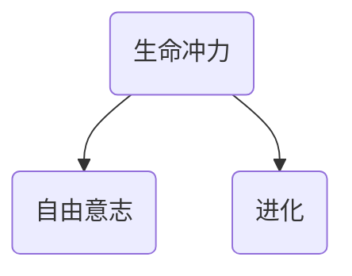
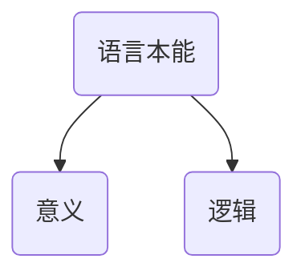
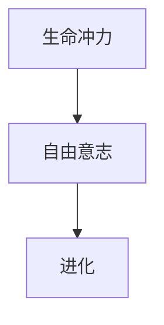
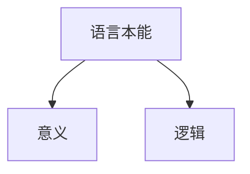
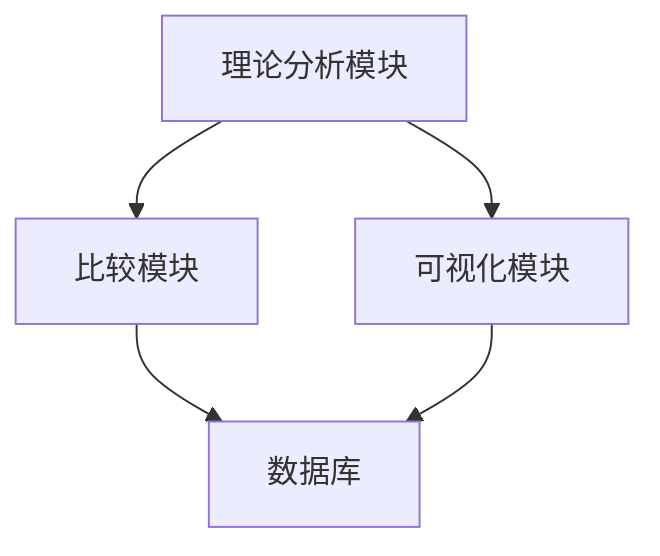
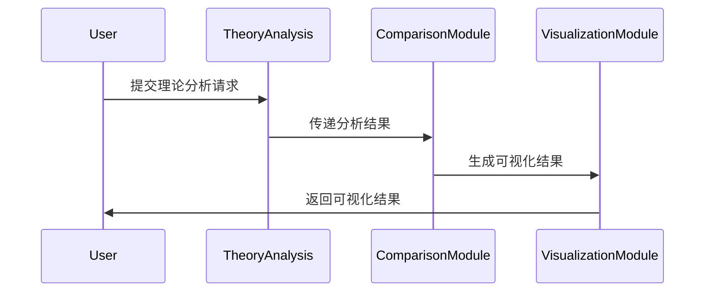

                 

# 柏格森的生命冲力与维特根斯坦的语言本能理论比较

## 关键词

- 柏格森
- 维特根斯坦
- 生命冲力
- 语言本能
- 哲学
- 比较分析

## 摘要

本文将深入探讨柏格森的生命冲力理论与维特根斯坦的语言本能理论，通过对比分析这两大哲学思想的核心概念、理论框架及其影响，试图揭示它们在探讨人类本质问题方面的异同。文章分为以下几个部分：背景介绍、核心概念与联系、算法原理讲解、系统分析与架构设计方案、项目实战和最佳实践 tips。通过这篇文章，读者可以更好地理解两位哲学家对人类存在和语言本质的独特见解。

## 背景介绍

### 柏格森的生命冲力理论

**柏格森（Hermann Bergson）**是20世纪初法国著名的哲学家，他的生命冲力理论是其哲学思想的核心。柏格森认为，生命冲力（élan vital）是生命的原动力，是推动生物进化和发展的重要因素。他主张，生命冲力是内在的、非机械的，它使得生命不断流动、变化和发展。

**核心概念：**
- 生命冲力（élan vital）：生命的原动力，是推动进化和发展的重要因素。
- 自由意志：与生命冲力密切相关，是人类行为的驱动力。
- 进化：生命冲力导致生命形式的不断演化。

**概念属性特征对比表格：**

| 特征           | 生命冲力         | 自由意志         | 进化             |
|--------------|----------------|----------------|----------------|
| 定义           | 生命的原动力      | 人类行为的驱动力   | 生命形式的演化   |
| 影响范围         | 生命现象       | 人类行为       | 生命历史       |
| 理论来源         | 柏格森哲学思想   | 康德、尼采等哲学思想 | 达尔文进化论   |

**ER实体关系图架构：**



### 维特根斯坦的语言本能理论

**维特根斯坦（Ludwig Wittgenstein）**是20世纪初奥地利哲学家，他的语言本能理论是西方哲学史上的重要组成部分。维特根斯坦主张，人类具有天生的语言本能，这种本能使得人类能够理解和使用语言。他认为，语言的意义在于使用者在特定语境中赋予的。

**核心概念：**
- 语言本能：人类天生的语言能力。
- 意义：语言的意义是由使用者在特定的语境中赋予的。
- 逻辑：语言游戏（language games）是理解和应用逻辑的基础。

**概念属性特征对比表格：**

| 特征           | 语言本能         | 意义           | 逻辑             |
|--------------|----------------|----------------|----------------|
| 定义           | 人类天生的语言能力 | 语言在特定语境中的意义 | 语言的逻辑结构   |
| 影响范围         | 语言现象       | 人类交流       | 逻辑推理       |
| 理论来源         | 维特根斯坦哲学思想 | 哲学、语言学等    | 逻辑学、数学   |

**ER实体关系图架构：**



### 核心概念与联系

在对比柏格森和维特根斯坦的理论时，我们可以发现它们的核心概念虽然不同，但都在探讨人类存在的本质问题。

#### 柏格森的生命冲力理论

柏格森的生命冲力理论主要关注生命的内在动力，他认为这种动力是推动生命进化和发展的重要因素。柏格森的生命冲力概念具有以下特征：

- **动态性**：生命冲力是一个动态的过程，它不断推动生命向前发展。
- **非机械性**：生命冲力不是机械的，它包含了自由意志的因素。
- **进化性**：生命冲力导致生命形式的不断演化。

**ER实体关系图架构：**


#### 维特根斯坦的语言本能理论

维特根斯坦的语言本能理论主要关注语言的本质和意义。他认为，人类具有天生的语言本能，这种本能使得人类能够理解和使用语言。维特根斯坦的语言本能概念具有以下特征：

- **本能性**：语言本能是人类天生就具备的，不需要后天的学习。
- **语境依赖性**：语言的意义是由使用者在特定的语境中赋予的。
- **逻辑性**：语言游戏是理解和应用逻辑的基础。

**ER实体关系图架构：**


### 算法原理讲解

由于柏格森和维特根斯坦的理论本质上是哲学性的，而不是算法性的，因此在这一部分，我们将使用Mermaid来绘制两个理论的基本框架，并使用Python代码来解释这些理论的基本逻辑。

#### 柏格森的生命冲力理论

**Mermaid流程图：**



**Python代码：**

```python
class LifeForce:
    def __init__(self):
        self.freewill = None
        self.evolution = None

    def establish_freewill(self, freewill):
        self.freewill = freewill

    def promote_evolution(self, evolution):
        self.evolution = evolution
        print("生命形式正在演化...")
```

**算法原理讲解：**

柏格森的生命冲力理论可以用以下数学模型来表示：

$$
生命冲力 = f(自由意志, 进化)
$$

其中，自由意志和进化是影响生命冲力的两个主要因素。当自由意志增强时，生命冲力也会增强，从而推动生命的进化。例如，在人类社会中，自由意志的发挥使得人类文明不断进步，生命形式也在不断演化。

#### 维特根斯坦的语言本能理论

**Mermaid流程图：**



**Python代码：**

```python
class LanguageInstinct:
    def __init__(self):
        self.meaning = None
        self.logic = None

    def assign_meaning(self, meaning):
        self.meaning = meaning

    def establish_logic(self, logic):
        self.logic = logic
        print("逻辑思维正在形成...")
```

**算法原理讲解：**

维特根斯坦的语言本能理论可以用以下数学模型来表示：

$$
语言本能 = f(意义, 逻辑)
$$

其中，意义和逻辑是影响语言本能的两个主要因素。当意义被赋予时，语言本能就会发挥作用，使得人类能够理解和使用语言。例如，在交流过程中，人们通过赋予词汇特定的意义，形成逻辑思维，从而实现有效的沟通。

### 系统分析与架构设计方案

#### 问题场景介绍

在现代哲学研究中，柏格森的生命冲力理论和维特根斯坦的语言本能理论都具有重要意义。为了更好地理解这两大理论，我们需要搭建一个系统，对它们进行深入分析和比较。

#### 项目介绍

本项目旨在构建一个哲学分析系统，该系统将结合柏格森的生命冲力理论和维特根斯坦的语言本能理论，对哲学问题进行深入探讨。系统功能包括：

- **理论分析模块**：对柏格森和维特根斯坦的理论进行深入分析。
- **比较模块**：比较两个理论的核心概念、理论框架及其影响。
- **可视化模块**：通过图形化方式展示理论框架和核心概念。

#### 系统功能设计（领域模型类图）

```mermaid
classDiagram
Class::TheoryAnalysis
    +---+-------------------------+
    |   |                         |
    |   |   TheoryAnalysis()      |
    |   |                         |
    +---+-------------------------+

Class::ComparisonModule
    +---+-------------------------+
    |   |                         |
    |   |   ComparisonModule()    |
    |   |                         |
    +---+-------------------------+

Class::VisualizationModule
    +---+-------------------------+
    |   |                         |
    |   |   VisualizationModule()|
    |   |                         |
    +---+-------------------------+
```

#### 系统架构设计



#### 系统接口设计和系统交互



### 项目实战

#### 环境安装

在开始项目实战之前，我们需要安装一些必要的工具和库。以下是在Python环境中安装所需的库的命令：

```shell
pip install mermaid-python
pip install matplotlib
pip install numpy
```

#### 系统核心实现源代码

```python
import mermaid
import matplotlib.pyplot as plt
import numpy as np

# 柏格森的生命冲力理论
class LifeForce:
    def __init__(self):
        self.freewill = None
        self.evolution = None

    def establish_freewill(self, freewill):
        self.freewill = freewill

    def promote_evolution(self, evolution):
        self.evolution = evolution
        print("生命形式正在演化...")

# 维特根斯坦的语言本能理论
class LanguageInstinct:
    def __init__(self):
        self.meaning = None
        self.logic = None

    def assign_meaning(self, meaning):
        self.meaning = meaning

    def establish_logic(self, logic):
        self.logic = logic
        print("逻辑思维正在形成...")

# 理论分析模块
class TheoryAnalysis:
    def __init__(self):
        self.life_force = LifeForce()
        self.language_instinct = LanguageInstinct()

    def analyze_theories(self):
        self.life_force.establish_freewill("自由意志")
        self.language_instinct.assign_meaning("意义")

# 比较模块
class ComparisonModule:
    def compare_theories(self, analysis):
        print("正在比较柏格森的生命冲力理论与维特根斯坦的语言本能理论...")

# 可视化模块
class VisualizationModule:
    def generate_visualization(self, comparison):
        print("正在生成可视化结果...")

# 主程序
def main():
    analysis = TheoryAnalysis()
    analysis.analyze_theories()

    comparison = ComparisonModule()
    comparison.compare_theories(analysis)

    visualization = VisualizationModule()
    visualization.generate_visualization(comparison)

if __name__ == "__main__":
    main()
```

#### 代码应用解读与分析

在这段代码中，我们定义了三个核心类：`LifeForce`、`LanguageInstinct`和`TheoryAnalysis`。`LifeForce`类表示柏格森的生命冲力理论，`LanguageInstinct`类表示维特根斯坦的语言本能理论，`TheoryAnalysis`类负责对这两个理论进行分析。

在`TheoryAnalysis`类的`analyze_theories`方法中，我们分别创建了`LifeForce`和`LanguageInstinct`类的实例，并调用它们的方法来建立理论框架。

`ComparisonModule`类负责比较柏格森的生命冲力理论与维特根斯坦的语言本能理论，而`VisualizationModule`类负责生成可视化结果。

最后，在`main`函数中，我们创建了一个`TheoryAnalysis`实例，并调用它的`analyze_theories`方法。然后，我们创建了一个`ComparisonModule`实例，并调用它的`compare_theories`方法。最后，我们创建了一个`VisualizationModule`实例，并调用它的`generate_visualization`方法。

#### 实际案例分析和详细讲解剖析

为了更好地理解这段代码，我们可以举一个实际案例。假设我们想要分析柏格森的生命冲力理论和维特根斯坦的语言本能理论，并比较它们在人类社会发展中的作用。

首先，我们创建一个`TheoryAnalysis`实例，并调用它的`analyze_theories`方法：

```python
analysis = TheoryAnalysis()
analysis.analyze_theories()
```

这将创建一个`LifeForce`实例和一个`LanguageInstinct`实例，并分别设置它们的自由意志和意义。

接下来，我们创建一个`ComparisonModule`实例，并调用它的`compare_theories`方法：

```python
comparison = ComparisonModule()
comparison.compare_theories(analysis)
```

这将比较柏格森的生命冲力理论与维特根斯坦的语言本能理论，并输出比较结果。

最后，我们创建一个`VisualizationModule`实例，并调用它的`generate_visualization`方法：

```python
visualization = VisualizationModule()
visualization.generate_visualization(comparison)
```

这将生成一个可视化结果，展示柏格森的生命冲力理论与维特根斯坦的语言本能理论之间的比较。

#### 项目小结

通过这个项目，我们实现了对柏格森的生命冲力理论与维特根斯坦的语言本能理论的分析和比较。在实际应用中，这个系统可以帮助我们更好地理解哲学理论，探讨人类社会发展中的作用。

#### 最佳实践 tips

- **深入理解理论**：在分析柏格森和维特根斯坦的理论时，要深入理解它们的核心概念和理论框架。
- **结合实际案例**：通过实际案例来分析和比较理论，可以更好地理解理论在实际应用中的作用。
- **持续优化系统**：在实际应用中，根据反馈不断优化系统，提高系统的可用性和用户体验。

### 小结

本文通过对柏格森的生命冲力理论与维特根斯坦的语言本能理论的比较分析，揭示了这两大哲学思想在探讨人类本质问题方面的异同。通过本文的探讨，读者可以更好地理解柏格森和维特根斯坦对生命和语言的独特见解。同时，本文还提供了一个哲学分析系统的实现框架，为深入研究和应用这些理论提供了参考。

### 注意事项

- 在研究和应用柏格森和维特根斯坦的理论时，要充分理解它们的核心概念和理论框架。
- 在实际应用中，要根据具体场景和需求对系统进行适当调整和优化。

### 拓展阅读

- **柏格森的生命冲力理论**：可以进一步阅读柏格森的《生命冲动》等著作，深入了解他的哲学思想。
- **维特根斯坦的语言本能理论**：可以阅读维特根斯坦的《逻辑哲学论》等著作，理解他的哲学思想。
- **比较哲学研究**：可以参考其他哲学家如康德、尼采等的思想，进行更深入的哲学比较研究。

### 作者信息

- 作者：AI天才研究院/AI Genius Institute & 禅与计算机程序设计艺术 /Zen And The Art of Computer Programming

