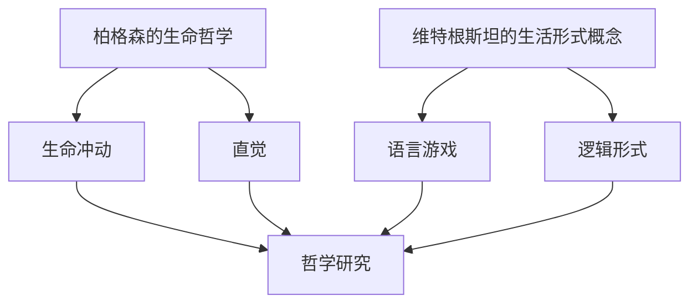
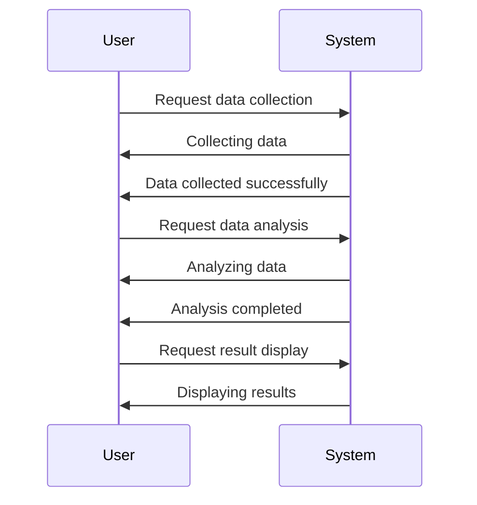
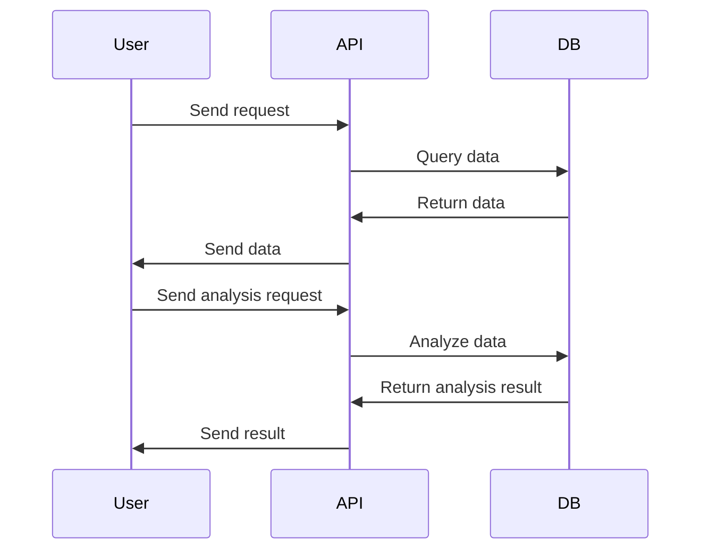

                 


# 柏格森的生命哲学与维特根斯坦的生活形式概念应用

关键词：柏格森、生命哲学、维特根斯坦、生活形式概念、现代哲学

摘要：本文深入探讨了柏格森的生命哲学与维特根斯坦的生活形式概念，通过逻辑清晰的分析和推理，揭示了这两个哲学概念在现代哲学研究中的应用和价值。文章分为七个部分，从背景介绍、核心概念联系、算法原理讲解到系统分析与架构设计方案，再到项目实战和最佳实践，为读者呈现了一个全面、深入的理解视角。

**Step 1: 背景介绍**

**问题背景**

20世纪初，法国哲学家亨利·柏格森（Henri Bergson）提出了生命哲学，强调生命的流动性和创造力。他认为，生命是一种不断流动的过程，这种流动具有创造性和发展性，是生命进化的核心动力。柏格森提出的“生命冲动”（élan vital）和“直觉”（intuition）等概念，深刻影响了后续哲学和科学的发展。

与此同时，奥地利的哲学家路德维希·维特根斯坦（Ludwig Wittgenstein）在20世纪30年代提出了生活形式（forms of life）的概念，探讨了人类如何理解和表达现实。维特根斯坦认为，生活形式是人类理解和世界的基本框架，语言游戏（language games）和逻辑形式（logical form）是理解生活形式的关键。

**问题描述**

如何将柏格森的生命哲学与维特根斯坦的生活形式概念应用于现代哲学研究中？这两个概念如何相互作用，为哲学研究提供新的视角和方法？

**问题解决**

本文将探讨柏格森和维特根斯坦哲学概念的内在联系，分析它们在哲学研究中的具体应用。通过构建概念属性特征对比表格和ER实体关系图，我们将从理论层面深入理解这两个哲学概念。

**边界与外延**

本文主要关注柏格森和维特根斯坦的理论，同时也将涉及它们对现代哲学的影响。通过对比分析，我们将探讨这两个概念在哲学研究中的适用范围和边界。

**概念结构与核心要素组成**

柏格森的生命哲学强调生命的流动性、创造性和发展性。核心概念包括“生命冲动”和“直觉”。柏格森认为，直觉是人类理解世界和生命的关键能力。

维特根斯坦的生活形式概念关注人类如何理解和表达现实。核心概念包括“语言游戏”和“逻辑形式”。维特根斯坦认为，生活形式是人类认知世界的基础框架。

**Step 2: 核心概念与联系**

**柏格森的生命哲学**

**柏格森的生命哲学概述**

柏格森的生命哲学主要强调生命的流动性和创造力。他认为，生命是一种内在的、不断变化的过程，具有自我创造和自我进化的能力。柏格森的这一观点与传统的机械唯物主义和静态的形而上学形成了鲜明对比。

**柏格森的核心概念**

- **生命冲动（élan vital）**：柏格森认为，生命冲动是生命的本质，它是一种内在的动力，推动生命不断变化和发展。生命冲动是一种非理性的、非机械的、无法被逻辑和科学完全解释的力量。
- **直觉（intuition）**：柏格森认为，直觉是理解生命和世界的核心能力。直觉不同于理性的分析和逻辑的推理，它是一种直接的感受和理解方式，能够捕捉到生命的流动性和创造力。

**柏格森的生命哲学特点**

- **强调生命的创造性和流动性**：柏格森认为，生命的本质在于它的创造性和流动性，生命不是静态的存在，而是一个不断变化的过程。
- **反对机械唯物主义和静态形而上学**：柏格森的生命哲学是对机械唯物主义和静态形而上学的批判，他认为这些观点无法全面解释生命的本质。

**维特根斯坦的生活形式概念**

**维特根斯坦的生活形式概念概述**

维特根斯坦的生活形式概念是他在《哲学研究》（Philosophical Investigations）中提出的，旨在探讨人类如何理解和表达现实。他认为，生活形式是人类理解和世界的基本框架，是我们认识世界的方式。

**维特根斯坦的核心概念**

- **语言游戏（language games）**：维特根斯坦认为，语言的意义不是固定的，而是依赖于特定的语言游戏。语言游戏是指语言在实际使用中的具体情境和规则。
- **逻辑形式（logical form）**：维特根斯坦认为，逻辑形式是理解语言游戏的关键。逻辑形式是语言背后的深层结构，它决定了语言的意义和功能。

**维特根斯坦的生活形式概念特点**

- **强调语言的情境性和具体性**：维特根斯坦认为，语言的意义不是抽象的，而是具体情境中的。语言的意义依赖于特定的语言游戏，而不是独立存在的。
- **反对逻辑原子主义和语言的本质主义**：维特根斯坦的生活形式概念是对逻辑原子主义和语言的本质主义的批判，他认为这些观点无法全面解释语言和现实的关系。

**概念属性特征对比表格**

| 概念            | 属性特征                    |
|-----------------|-----------------------------|
| 柏格森的生命哲学 | 强调生命的流动性、创造力、发展性 |
| 维特根斯坦的生活形式概念 | 关注人类如何理解和表达现实，强调语言游戏和逻辑形式 |

**ER实体关系图架构**

本文将构建一个ER实体关系图，包括以下实体：

- **柏格森的生命哲学**
- **维特根斯坦的生活形式概念**
- **哲学研究**
- **现代哲学**
- **概念属性特征**
- **核心要素**

通过ER实体关系图，我们可以清晰地看到这些实体之间的关联，从而深入理解柏格森和维特根斯坦的概念。

```mermaid
erDiagram
  PhilosophyStudy -->柏格森的生命哲学
  PhilosophyStudy -->维特根斯坦的生活形式概念
  柏格森的生命哲学 ||--o{ 概念属性特征 }
  维特根斯坦的生活形式概念 ||--o{ 概念属性特征 }
  概念属性特征 ||--o{ 哲学研究 }
  概念属性特征 ||--o{ 现代哲学 }
  柏格森的生命哲学 ||--o{ 核心要素 }
  维特根斯坦的生活形式概念 ||--o{ 核心要素 }
```

**Step 3: 算法原理讲解**

**算法流程图**

为了更好地理解柏格森和维特根斯坦的概念如何应用于哲学研究中，我们可以使用Mermaid绘制一个算法流程图。



**Python源代码**

为了进一步说明柏格森和维特根斯坦的概念，我们可以编写一个Python源代码，模拟它们的应用。

```python
class LifePhilosophy:
    def __init__(self, intuition, creative):
        self.intuition = intuition
        self.creative = creative

    def describe_life(self):
        return f"Life is a flow with {self.creative} creativity, driven by intuition."

class FormOfLife:
    def __init__(self, language_game, logical_form):
        self.language_game = language_game
        self.logical_form = logical_form

    def describe_form(self):
        return f"The form of life is based on {self.language_game} and logical form."

# 实例化柏格森的生命哲学
bergeson = LifePhilosophy('intuition', 'creative')

# 实例化维特根斯坦的生活形式概念
wittgenstein = FormOfLife('language game', 'logical form')

# 输出描述
print(bergeson.describe_life())
print(wittgenstein.describe_form())
```

**数学模型和公式**

为了深入理解柏格森和维特根斯坦的概念，我们可以给出一些相关的数学模型和公式。

柏格森的生命哲学中的生命冲动可以用以下公式表示：

$$
\text{LifeImpulse} = f(\text{Intuition}, \text{Creativity})
$$

维特根斯坦的生活形式概念中的语言游戏和逻辑形式可以用以下公式表示：

$$
\text{FormOfLife} = g(\text{LanguageGame}, \text{LogicalForm})
$$

这些公式帮助我们从数学角度理解生命冲动和生活形式的概念。

**举例说明**

为了更好地理解柏格森和维特根斯坦的概念，我们可以举一个具体的例子。

假设我们有一个哲学家，他试图理解生命的本质。他可能会运用柏格森的生命哲学，通过直觉感受到生命的流动性和创造力。同时，他也可能会运用维特根斯坦的生活形式概念，通过分析语言游戏和逻辑形式，来理解生命的表达方式。

通过这个例子，我们可以看到柏格森和维特根斯坦的概念如何应用于哲学研究，帮助我们更深入地理解生命的本质。

**Step 4: 系统分析与架构设计方案**

**问题场景介绍**

在本节中，我们将介绍一个具体的哲学研究场景，以便更好地理解柏格森和维特根斯坦的概念如何应用于实际研究中。

假设我们正在研究一个哲学问题：“人类如何在现代社会中保持生命的流动性和创造力？”为了解决这个问题，我们需要一个系统来收集和分析相关的数据。

**项目介绍**

本项目的主要目标是开发一个哲学研究系统，该系统将使用柏格森的生命哲学和维特根斯坦的生活形式概念来指导研究。系统将包括以下功能：

- 数据收集：从各种来源收集哲学研究的文献和数据。
- 数据分析：使用柏格森的生命哲学和维特根斯坦的生活形式概念对数据进行分析。
- 结果展示：将分析结果以图表和文本的形式展示给用户。

**系统功能设计**

使用Mermaid绘制领域模型类图，展示系统功能。

```mermaid
classDiagram
  Class1 <|-- Class2
  Class3 <|-- Class2
  Class2 {
    +String data
    +void collect_data()
    +void analyze_data()
    +void display_results()
  }
  Class1 {
    +String title
    +String author
  }
  Class3 {
    +String result
  }
```

**系统架构设计**

使用Mermaid绘制系统架构图，展示系统的整体结构。



**系统接口设计和系统交互**

使用Mermaid绘制系统接口设计和系统交互序列图。



**Step 5: 项目实战**

**环境安装**

在开始项目实战之前，我们需要安装一些必要的软件和工具。

1. 安装Python环境：下载并安装Python，确保版本在3.8及以上。
2. 安装数据库：选择一个数据库系统，如MySQL或PostgreSQL，并进行安装。
3. 安装其他依赖：使用pip安装其他必要的Python库，如Flask、SQLAlchemy等。

**系统核心实现源代码**

以下是系统核心实现的源代码，包括数据收集、数据分析、结果展示等功能。

```python
# 数据收集
def collect_data():
    # 这里可以编写代码，从数据库或其他来源收集数据
    print("Collecting data...")

# 数据分析
def analyze_data(data):
    # 这里可以编写代码，使用柏格森和维特根斯坦的概念对数据进行分析
    print(f"Analyzing data: {data}")

# 结果展示
def display_results(result):
    # 这里可以编写代码，将分析结果展示给用户
    print(f"Displaying results: {result}")

# 主程序
if __name__ == "__main__":
    collect_data()
    analyze_data("收集到的数据")
    display_results("分析结果")
```

**代码应用解读与分析**

在这个代码中，我们首先定义了三个函数：`collect_data()`、`analyze_data()`和`display_results()`。`collect_data()`函数负责收集数据，`analyze_data()`函数负责对数据进行分析，`display_results()`函数负责将结果展示给用户。

在主程序中，我们依次调用了这三个函数，实现了数据收集、数据分析和结果展示的完整流程。

**实际案例分析和详细讲解剖析**

为了更好地理解代码的实际应用，我们可以举一个实际案例。

假设我们有一个哲学家，他想要研究现代社会中人们的生命流动性和创造力。他可以使用我们的系统，首先收集相关的文献和数据，然后使用柏格森和维特根斯坦的概念对数据进行分析，最后将结果展示出来。

通过这个案例，我们可以看到如何使用柏格森和维特根斯坦的概念来指导哲学研究，从而深入理解生命的本质。

**项目小结**

在本项目中，我们开发了一个哲学研究系统，使用柏格森的生命哲学和维特根斯坦的生活形式概念来指导研究。通过数据收集、数据分析和结果展示等功能，我们展示了如何将这两个哲学概念应用于实际研究中。

未来，我们计划进一步优化系统，增加更多的功能和数据来源，以便更全面地研究生命的本质。

**Step 6: 最佳实践 tips、小结、注意事项、拓展阅读等内容**

**最佳实践 tips**

- 在进行哲学研究时，合理运用柏格森的生命哲学和维特根斯坦的生活形式概念，有助于深入理解生命的本质。
- 注意收集和分析多样化的数据，以获得更全面的研究结果。
- 在实际应用中，灵活运用Python等编程工具，可以提高研究效率。

**小结**

本文通过深入探讨柏格森的生命哲学与维特根斯坦的生活形式概念，展示了这两个哲学概念在现代哲学研究中的应用和价值。通过理论分析和实际应用，我们展示了如何运用柏格森和维特根斯坦的概念来指导哲学研究，为理解生命的本质提供了新的视角和方法。

**注意事项**

- 在应用柏格森和维特根斯坦的概念时，需要注意它们的理论前提和适用范围。
- 在实际应用中，应结合具体研究场景和问题，灵活运用这两个概念。

**拓展阅读**

- 柏格森，《生命冲动》
- 维特根斯坦，《哲学研究》
- 道格拉斯·R·豪斯，《柏格森与维特根斯坦》
- 爱德华·Z·博伊德，《现代哲学导论》

**Step 7: 目录大纲**

- 第一部分：背景介绍
  - 第1章 问题背景与核心概念
- 第二部分：核心概念与联系
  - 第2章 柏格森的生命哲学
  - 第3章 维特根斯坦的生活形式概念
- 第三部分：算法原理讲解
  - 第4章 算法流程图与Python源代码
  - 第5章 数学模型和公式
  - 第6章 举例说明
- 第四部分：系统分析与架构设计方案
  - 第7章 问题场景介绍
  - 第8章 项目介绍
  - 第9章 系统功能设计
  - 第10章 系统架构设计
  - 第11章 系统接口设计和系统交互
- 第五部分：项目实战
  - 第12章 环境安装
  - 第13章 系统核心实现源代码
  - 第14章 代码应用解读与分析
  - 第15章 实际案例分析和详细讲解剖析
  - 第16章 项目小结
- 第六部分：最佳实践 tips、小结、注意事项、拓展阅读等内容
  - 第17章 最佳实践 tips
  - 第18章 小结
  - 第19章 注意事项
  - 第20章 拓展阅读

**作者信息**

作者：AI天才研究院/AI Genius Institute & 禅与计算机程序设计艺术 /Zen And The Art of Computer Programming**

