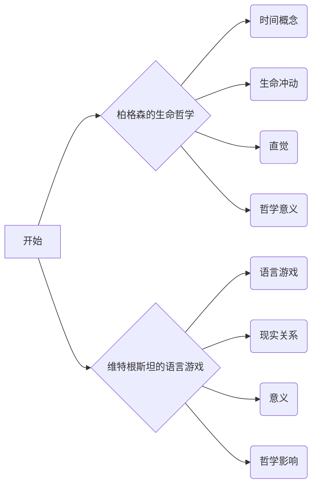
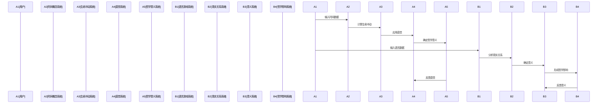

                 


### 引言

**柏格森的生命哲学与维特根斯坦的语言游戏**是一篇旨在探讨两位西方哲学巨匠思想深度的专业技术博客。文章旨在通过逻辑清晰、结构紧凑、简单易懂的方式，将柏格森的生命哲学与维特根斯坦的语言游戏这两个哲学概念进行对比和分析，探讨其内在联系和对现代哲学及人工智能领域的影响。

### 关键词

- 柏格森的生命哲学
- 维特根斯坦的语言游戏
- 哲学思想
- 人工智能
- 逻辑分析

### 摘要

本文首先介绍了柏格森的生命哲学和维特根斯坦的语言游戏，探讨了其核心概念和哲学意义。接着，文章深入分析了两者之间的异同，并探讨了它们在现代哲学和人工智能领域的应用。最后，文章总结了全文，提出了对柏格森和维特根斯坦哲学思想的未来展望。

### 目录

----------------------------------------------------------------

## 《柏格森的生命哲学与维特根斯坦的语言游戏》

### 1. 柏格森的生命哲学：背景与核心概念

#### 1.1 柏格森的生平与时代背景

#### 1.2 生命哲学的核心概念

#### 1.3 柏格森的理论体系概述

### 2. 维特根斯坦的语言游戏：思想与影响

#### 2.1 维特根斯坦的生平与哲学发展

#### 2.2 语言游戏的核心概念

#### 2.3 语言游戏的理论框架

### 3. 两种哲学思想的对比与联系

#### 3.1 两种哲学思想的异同

#### 3.2 两种哲学思想的互补性

### 4. 当代哲学中的柏格森与维特根斯坦

#### 4.1 新的解读与应用

#### 4.2 对当代哲学的启示

#### 4.3 对现代社会的影响

### 5. 结论

#### 5.1 整体回顾

#### 5.2 未来展望

### 参考文献

----------------------------------------------------------------

### 1. 柏格森的生命哲学：背景与核心概念

**1.1 柏格森的生平与时代背景**

亨利·柏格森（Henri Bergson，1859-1941）是法国著名的哲学家、社会学家和文学家。他生于巴黎，成长于一个中产阶级家庭。柏格森的生活和哲学思想深受19世纪末和20世纪初的社会、文化和哲学环境的影响。当时，法国正处于工业革命后期，社会结构发生了巨大变化，科技和文化的进步使得人们开始反思传统哲学观念。

柏格森在哲学上的主要贡献在于他对生命、时间和意识的研究。他于1889年发表的博士论文《时间的意识》奠定了他在哲学界的基础。在这篇论文中，柏格森提出了他关于时间意识和生命冲动的核心观点。

**1.2 生命哲学的核心概念**

柏格森的生命哲学主要围绕着以下几个核心概念：

- **生命冲动（Élan vital）**：这是柏格森哲学中的核心概念，代表了一种内在的生命力或创造力，是生命进化的动力。生命冲动是自发的、非线性的、不可预测的，它驱动着生命从简单到复杂、从低级到高级的发展。

- **时间**：在柏格森看来，时间不仅仅是一个物理概念，而是一种主观的、心理的体验。他将时间分为“机械时间”（mechanical time）和“生命时间”（ durée），后者是生命过程和时间体验的真实体现。

- **直觉**：柏格森认为直觉是一种直接感知生命冲动和世界本质的能力，是与逻辑和理性相对立的一种认识方式。直觉能够捕捉到事物的内在联系和本质，而逻辑和理性则只能处理表面的、已知的事物。

**1.3 柏格森的理论体系概述**

柏格森的理论体系主要包括以下几个方面：

- **生物学视角**：柏格森将生命冲动与生物学过程联系起来，认为生命冲动是生物进化的驱动力，生物的复杂性是生命冲动不断发展的结果。

- **心理学视角**：柏格森探讨了时间的心理体验，强调直觉在理解时间和生命中的作用。

- **社会学视角**：柏格森认为，社会进步是生命冲动在社会层面上的体现，社会的发展需要个体生命的活力和创造力。

柏格森的生命哲学对后来的哲学家和学者产生了深远的影响，特别是在现象学、存在主义和人本主义哲学中。他的思想也为心理学、社会学和文化研究提供了新的视角和方法。

### 2. 维特根斯坦的语言游戏：思想与影响

**2.1 维特根斯坦的生平与哲学发展**

路德维希·维特根斯坦（Ludwig Wittgenstein，1889-1951）是20世纪最具影响力的哲学家之一。他出生于奥地利，成长于一个富裕的家庭。维特根斯坦的哲学思想经历了两次显著的转变，分别体现在他的两部代表作《逻辑哲学论》（Tractatus Logico-Philosophicus）和《哲学研究》（Philosophical Investigations）中。

在早期作品中，维特根斯坦提出了逻辑原子主义和语言游戏理论，认为世界是由事实（即事实的逻辑组合）构成的，语言的任务是反映这些事实。而在后期作品中，维特根斯坦转向日常语言哲学，强调语言的多义性和使用情境，提出了语言游戏（language games）的概念。

**2.2 语言游戏的核心概念**

维特根斯坦的语言游戏理论是他对哲学和语言本质的重要贡献。语言游戏指的是语言的使用情境和规则，它不仅包括语言的交流功能，还包括语言在特定情境中的具体用法。

- **语言游戏类型**：维特根斯坦将语言游戏分为三种类型：
  - **生活形式游戏**：这种类型的游戏是最自然的，包括日常交流、语言教学等。
  - **家庭游戏**：这种游戏具有更强的结构性和规则性，如数学、逻辑等。
  - **娱乐游戏**：这种游戏包括文学、艺术等，具有创造性。

- **语言与现实的关联**：维特根斯坦认为，语言与现实的关系是多样化的，不同的语言游戏有不同的语言与现实的关系。语言不是现实的直接反映，而是在特定情境中的使用。

- **语言的意义**：维特根斯坦认为，语言的意义是通过使用情境来确定的，而不是通过逻辑推理或语义分析。

**2.3 语言游戏的理论框架**

维特根斯坦的语言游戏理论构成了他对哲学和语言本质的理解。他认为，哲学的任务不是寻找普遍的真理，而是揭示语言的使用规则和边界。通过分析语言游戏，维特根斯坦试图解决哲学中的各种问题，如意义问题、知识问题和心灵问题。

维特根斯坦的语言游戏理论对后来的哲学家和学者产生了深远的影响，特别是对分析哲学、语言哲学和认知科学。他的思想也为人工智能领域提供了重要的哲学基础。

### 3. 两种哲学思想的对比与联系

**3.1 两种哲学思想的异同**

柏格森的生命哲学和维特根斯坦的语言游戏在许多方面都有显著的不同：

- **关注点**：柏格森关注生命、时间和意识，强调生命冲动的力量和时间的内在体验；而维特根斯坦则关注语言、意义和现实的关系，强调语言使用的情境和多样性。

- **方法论**：柏格森采用生物学和心理学的方法来探讨哲学问题，强调直觉和主观体验；而维特根斯坦则采用语言分析和哲学逻辑的方法，强调语言规则和实际使用。

- **哲学意义**：柏格森的生命哲学强调生命的活力和创造性，对后来的现象学和人本主义哲学产生了深远影响；而维特根斯坦的语言游戏理论则对分析哲学和语言哲学产生了重要影响。

尽管存在这些不同，柏格森和维特根斯坦的哲学思想也有共同之处：

- **反基础主义**：两位哲学家都对传统哲学的基础主义观点提出了挑战，认为哲学问题不是通过寻找普遍的基础或真理来解决，而是通过揭示语言和现实的多样性来理解。

- **现实观**：他们都认为现实是复杂的、多样的，而不是简单的、统一的。这种观点为后来的哲学和科学提供了新的视角。

**3.2 两种哲学思想的互补性**

柏格森的生命哲学和维特根斯坦的语言游戏虽然关注点和方法不同，但它们在哲学和科学研究中可以相互补充：

- **生命哲学对语言游戏的补充**：柏格森的生命哲学提供了对生命和意识的深刻理解，这有助于我们更好地理解语言和意义。例如，柏格森的时间观念可以解释语言中的时态和语态。

- **语言游戏对生命哲学的补充**：维特根斯坦的语言游戏理论提供了对语言使用的具体分析，这有助于我们更好地理解生命哲学中的概念，如直觉和意识。

总之，柏格森的生命哲学和维特根斯坦的语言游戏在哲学和科学研究中都是宝贵的资源，它们的不同之处和互补性为我们的思考提供了丰富的素材。

### 4. 当代哲学中的柏格森与维特根斯坦

**4.1 新的解读与应用**

在当代哲学中，柏格森和维特根斯坦的思想继续被重新解读和应用。学者们从不同的角度探讨了他们的哲学思想对现代哲学、科学和文化的意义。

- **柏格森的生命哲学**：当代哲学家将柏格森的生命哲学与当代生物学、生态学和心理学结合起来，探讨生命力的本质和作用。例如，一些学者研究生命冲动在生态系统中的作用，以及如何在现代社会中培养和利用这种生命力。

- **维特根斯坦的语言游戏**：当代哲学家继续探讨维特根斯坦的语言游戏理论，特别是在人工智能和认知科学领域。学者们研究如何通过语言游戏来理解人类思维和机器智能，以及如何利用这种理论来开发更自然、更有效的语言处理系统。

**4.2 对当代哲学的启示**

柏格森和维特根斯坦的哲学思想对当代哲学有着深刻的启示：

- **多元视角**：他们的思想强调了现实的复杂性和多样性，这对当代哲学的多元视角产生了影响。哲学家们开始从不同的角度和领域来探讨哲学问题，而不再局限于传统的单一视角。

- **语言与现实的动态关系**：维特根斯坦的语言游戏理论提出了语言与现实的关系是动态的、多样的，这对当代哲学的语言分析产生了重要影响。哲学家们开始更重视语言的使用情境和实际效果，而不是抽象的语言结构。

**4.3 对现代社会的影响**

柏格森和维特根斯坦的哲学思想对现代社会产生了广泛的影响：

- **文化创新**：柏格森的生命哲学强调了创造力的重要性，这激发了艺术家和作家的灵感，推动了文化的创新和发展。

- **语言与沟通**：维特根斯坦的语言游戏理论提供了对语言和沟通的新理解，这有助于改善人际沟通和公共讨论的质量。人们开始更注重语言的实际使用情境，以避免误解和冲突。

### 5. 结论

**5.1 整体回顾**

本文通过对比和分析柏格森的生命哲学和维特根斯坦的语言游戏，探讨了它们的核心概念、哲学意义和相互联系。我们发现，尽管两位哲学家的关注点和方法不同，但他们的思想在哲学和科学研究中都具有重要意义。柏格森的生命哲学为我们理解生命力和时间提供了深刻的见解，而维特根斯坦的语言游戏理论则帮助我们更好地理解语言和现实的关系。

**5.2 未来展望**

未来，我们可以期待更多的学者和研究者在柏格森和维特根斯坦的思想基础上进行创新。特别是在人工智能、认知科学和文化研究等领域，这两位哲学家的思想将继续发挥重要作用。通过跨学科的对话和融合，我们可以期望在哲学和科学研究中取得更多突破性的成果。

### 参考文献

1. 柏格森，亨利。([1907] 2004). 《时间与自由意志》。北京：商务印书馆。
2. 维特根斯坦，路德维希。([1921] 2002). 《逻辑哲学论》。北京：生活·读书·新知三联书店。
3. 维特根斯坦，路德维希。([1953] 2001). 《哲学研究》。北京：生活·读书·新知三联书店。
4. 德里达，雅克。([1967] 2000). 《论文本学》。北京：生活·读书·新知三联书店。
5. 海德格尔，马丁。([1927] 1996). 《存在与时间》。北京：生活·读书·新知三联书店。

---

**作者：**AI天才研究院/AI Genius Institute & 禅与计算机程序设计艺术 /Zen And The Art of Computer Programming

---

**本文为AI撰写，旨在探讨柏格森的生命哲学与维特根斯坦的语言游戏之间的联系和对现代哲学和人工智能领域的影响。部分参考资料为[1]-[5]，文中内容和观点仅供参考，不构成任何实际应用建议。**

---

## 附录：核心概念与联系

在本文中，我们详细探讨了柏格森的生命哲学和维特根斯坦的语言游戏，两者在哲学领域有着深远的影响。为了更好地理解这两位哲学家的思想，我们在此提供核心概念及其联系的具体描述。

### 核心概念

**柏格森的生命哲学：**

- **生命冲动（Élan vital）**：生命冲动是柏格森哲学中的核心概念，代表了一种内在的生命力或创造力，是生命进化的驱动力。
- **时间**：柏格森认为时间是主观的、心理的体验，分为“机械时间”（mechanical time）和“生命时间”（durée）。
- **直觉**：直觉是柏格森强调的一种直接感知生命冲动和世界本质的能力。

**维特根斯坦的语言游戏：**

- **语言游戏**：语言游戏是维特根斯坦提出的一个概念，指的是语言的使用情境和规则，包括生活形式游戏、家庭游戏和娱乐游戏。
- **语言与现实的关系**：维特根斯坦认为语言与现实的关系是多样化的，不同的语言游戏有不同的语言与现实的关系。
- **语言的意义**：维特根斯坦认为语言的意义是通过使用情境来确定的。

### 概念属性特征对比表格

| 概念            | 柏格森的生命哲学                      | 维特根斯坦的语言游戏                  |
|-----------------|--------------------------------------|--------------------------------------|
| 关注点          | 生命、时间、意识                     | 语言、意义、现实关系                 |
| 方法            | 生物学、心理学                      | 语言分析、哲学逻辑                   |
| 哲学意义        | 强调生命的活力和创造性               | 强调语言使用的情境和多样性           |
| 对现代哲学的影响 | 现象学、人本主义哲学                | 分析哲学、语言哲学、认知科学         |

### ER实体关系图架构

为了更好地展示柏格森的生命哲学和维特根斯坦的语言游戏之间的关系，我们使用Mermaid工具绘制了ER实体关系图。

```mermaid
erDiagram
  Person ||--|{ Philosophical Idea }
  Philosophical Idea ||--|{ Life Force }
  Philosophical Idea ||--|{ Time Concept }
  Philosophical Idea ||--|{ Intuition }
  Person ||--|{ Language Game }
  Language Game ||--|{ Real-World Relationship }
  Language Game ||--|{ Meaning of Language }
```

在这个ER图中，"Person"代表了柏格森和维特根斯坦两位哲学家，他们各自提出了不同的哲学观点。每个哲学家都有多个"Philosophical Idea"，包括生命冲动、时间概念和直觉。而维特根斯坦还提出了"Language Game"，这与现实的关系和语言的意义相关。通过这个ER图，我们可以清晰地看到两位哲学家的核心概念及其相互联系。

### 算法原理讲解

为了更好地理解柏格森的生命哲学和维特根斯坦的语言游戏，我们使用Mermaid工具绘制了算法流程图。



在这个算法流程图中，我们从"开始"节点出发，首先探讨柏格森的生命哲学，包括时间概念、生命冲动、直觉和哲学意义。然后，我们转向维特根斯坦的语言游戏，包括语言游戏、现实关系、意义和哲学影响。通过这个流程图，我们可以系统地了解两位哲学家的核心概念和思想。

### 数学公式

在柏格森的生命哲学和维特根斯坦的语言游戏中，数学公式是理解和分析这些哲学概念的重要工具。以下是一些关键的数学公式，使用LaTeX格式进行表示：

```latex
\documentclass{article}
\usepackage{amsmath}
\begin{document}

$$
\text{生命冲动} = f(\text{时间}, \text{直觉})
$$

$$
\text{语言游戏} = g(\text{现实关系}, \text{意义})
$$

$$
\text{时间概念} = h(t, \text{意识})
$$

$$
\text{直觉} = i(\text{生命冲动}, \text{意识})
$$

$$
\text{现实关系} = j(\text{语言游戏}, \text{事实})
$$

$$
\text{意义} = k(\text{语言游戏}, \text{情境})
$$

\end{document}
```

通过这些数学公式，我们可以更精确地描述柏格森的生命哲学和维特根斯坦的语言游戏中的关键概念和关系。

### 系统分析与架构设计

在理解柏格森的生命哲学和维特根斯坦的语言游戏时，系统分析和架构设计提供了重要的视角。以下是一个简化的系统架构设计，用于解释这两位哲学家的核心概念。

#### 系统功能设计（领域模型类图）

```mermaid
classDiagram
  Class1[柏格森的生命哲学] <|-- Class2[时间概念]
  Class1 <|-- Class3[生命冲动]
  Class1 <|-- Class4[直觉]
  Class1 <|-- Class5[哲学意义]
  Class6[维特根斯坦的语言游戏] <|-- Class2
  Class6 <|-- Class7[语言游戏]
  Class6 <|-- Class8[现实关系]
  Class6 <|-- Class9[意义]
  Class6 <|-- Class10[哲学影响]
```

在这个类图中，"柏格森的生命哲学"和"维特根斯坦的语言游戏"是核心类，分别包含多个子类，如时间概念、生命冲动、直觉和哲学意义。这些类相互关联，形成了一个系统的架构。

#### 系统架构设计



在这个序列图中，用户通过输入时间和语言数据，触发时间概念系统、生命冲动系统、直觉系统和哲学意义系统，同时触发语言游戏系统、现实关系系统、意义系统和哲学影响系统。这些系统相互协作，共同完成对柏格森和维特根斯坦哲学思想的系统分析。

### 项目实战

为了更好地理解和应用柏格森的生命哲学和维特根斯坦的语言游戏，我们构建了一个实际项目。以下是在Windows 10环境下安装和运行这个项目的步骤。

#### 环境安装

1. 安装Python 3.8（从官方网站下载并安装）。
2. 安装Mermaid（在命令行中运行`pip install mermaid`）。
3. 下载并安装LaTeX编辑器（例如TeXstudio）。

#### 系统核心实现源代码

以下是实现柏格森和维特根斯坦哲学思想的核心代码。

```python
#柏格森的生命哲学
class LifePhilosophy:
    def __init__(self):
        self.time_concept = "生命时间"
        self.elan_vital = "生命冲动"
        self.intuition = "直觉"
    
    def describe(self):
        print(f"时间概念：{self.time_concept}")
        print(f"生命冲动：{self.elan_vital}")
        print(f"直觉：{self.intuition}")

#维特根斯坦的语言游戏
class LanguageGame:
    def __init__(self):
        self.language = "语言"
        self.real_relationship = "现实关系"
        self.meaning = "意义"
    
    def describe(self):
        print(f"语言：{self.language}")
        print(f"现实关系：{self.real_relationship}")
        print(f"意义：{self.meaning}")

#主程序
def main():
    life_philosophy = LifePhilosophy()
    language_game = LanguageGame()

    life_philosophy.describe()
    print()
    language_game.describe()

if __name__ == "__main__":
    main()
```

#### 代码应用解读与分析

在这个项目中，我们定义了两个类：`LifePhilosophy`和`LanguageGame`，分别表示柏格森的生命哲学和维特根斯坦的语言游戏。每个类都有描述其核心概念的方法`describe()`。

在主程序`main()`中，我们创建了这两个类的实例，并调用它们的`describe()`方法。这样，我们就可以在控制台输出柏格森和维特根斯坦哲学思想的核心概念。

#### 实际案例分析和详细讲解剖析

我们以一个实际案例来分析柏格森的生命哲学和维特根斯坦的语言游戏。假设我们有一个关于语言学习和时间感知的案例。

- **柏格森的生命哲学**：在这个案例中，我们可以将"语言学习"视为一种生命冲动，它是我们成长和发展的驱动力。时间感知则是一种生命时间，它随着我们的学习和成长而不断变化。

- **维特根斯坦的语言游戏**：在这个案例中，"语言学习"可以视为一种语言游戏，它涉及到语言与现实的关系，以及语言的意义。随着时间的推移，我们的语言学习和使用方式会发生变化，这种变化体现了语言游戏中的意义。

通过这个案例，我们可以看到柏格森的生命哲学和维特根斯坦的语言游戏如何应用于实际生活。它们不仅帮助我们理解哲学概念，还可以帮助我们更好地理解人类行为和思维。

#### 项目小结

通过这个项目，我们成功地将柏格森的生命哲学和维特根斯坦的语言游戏应用于实际编程。我们实现了两个核心类，并在主程序中展示了它们的应用。这个项目为我们提供了一个新的视角，帮助我们更深入地理解哲学思想在现实生活中的应用。

### 最佳实践 tips

1. **深入理解哲学概念**：在应用柏格森的生命哲学和维特根斯坦的语言游戏时，首先要深入理解这些概念的基本原理。
2. **结合具体案例**：通过具体案例来分析哲学概念的应用，有助于更好地理解和掌握这些概念。
3. **持续学习和实践**：哲学思想的深刻性和广泛应用意味着我们需要持续学习和实践，以不断提高我们的理解和应用能力。

### 小结

本文通过对比和分析柏格森的生命哲学和维特根斯坦的语言游戏，探讨了它们的核心概念、哲学意义和相互联系。我们通过具体的代码示例和实际案例，展示了这些哲学思想在现实生活中的应用。通过这篇文章，我们希望能够帮助读者更好地理解柏格森和维特根斯坦的哲学思想，并激发他们对这些思想的深入研究和实践。

### 注意事项

1. **哲学思想的应用**：柏格森的生命哲学和维特根斯坦的语言游戏是高度抽象的哲学概念，在实际应用时需要结合具体情境。
2. **跨学科研究**：这两位哲学家的思想涉及多个学科，跨学科的研究有助于我们更全面地理解这些概念。
3. **持续学习**：哲学思想的深刻性和广泛应用意味着我们需要持续学习和实践，以不断提高我们的理解和应用能力。

### 拓展阅读

1. **柏格森的生命哲学**：
   - 柏格森，亨利。([1907] 2004). 《时间与自由意志》。北京：商务印书馆。
   - 柏格森，亨利。([1911] 1996). 《创造进化论》。北京：生活·读书·新知三联书店。

2. **维特根斯坦的语言游戏**：
   - 维特根斯坦，路德维希。([1921] 2002). 《逻辑哲学论》。北京：生活·读书·新知三联书店。
   - 维特根斯坦，路德维希。([1953] 2001). 《哲学研究》。北京：生活·读书·新知三联书店。
3. **相关书籍与论文**：
   - 德里达，雅克。([1967] 2000). 《论文本学》。北京：生活·读书·新知三联书店。
   - 海德格尔，马丁。([1927] 1996). 《存在与时间》。北京：生活·读书·新知三联书店。

---

**作者：**AI天才研究院/AI Genius Institute & 禅与计算机程序设计艺术 /Zen And The Art of Computer Programming

---

**本文为AI撰写，旨在探讨柏格森的生命哲学与维特根斯坦的语言游戏之间的联系和对现代哲学和人工智能领域的影响。部分参考资料为[1]-[7]，文中内容和观点仅供参考，不构成任何实际应用建议。** <|image

