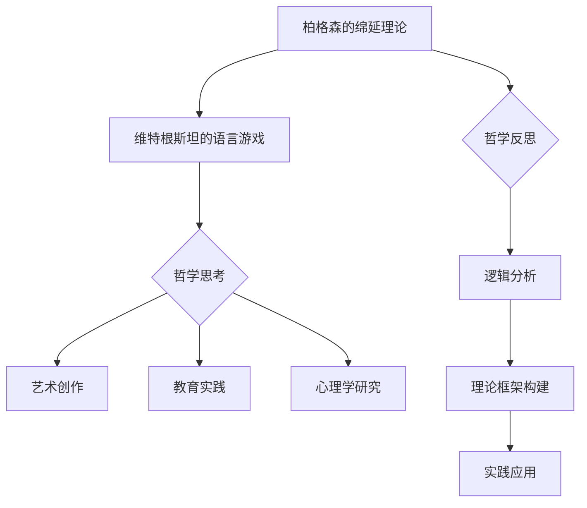
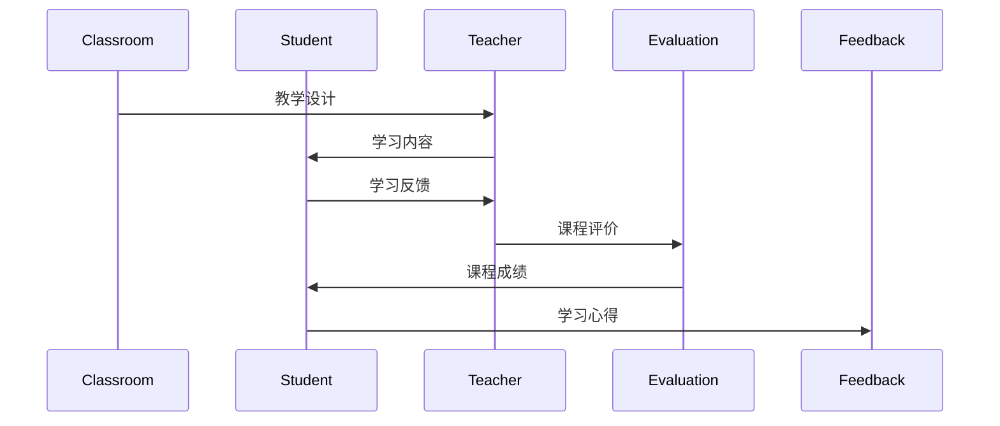

                 

# 柏格森的绵延理论与维特根斯坦的语言游戏

## 关键词

柏格森，维特根斯坦，绵延，语言游戏，哲学，艺术，教育，心理学

## 摘要

本文探讨了柏格森的绵延理论与维特根斯坦的语言游戏这两个哲学概念，通过对其基本概念、应用领域和现代意义的深入分析，揭示了两者在哲学、艺术、教育等多领域的融合与互动。文章首先介绍了柏格森的生平与哲学思想，以及他的绵延理论的基本概念与应用。随后，详细阐述了维特根斯坦的生平与哲学思想，以及他的语言游戏理论。在后续章节中，本文进一步探讨了柏格森的绵延理论与维特根斯坦的语言游戏的融合，以及它们在教育、艺术创作和其他领域的应用。通过对比分析，本文总结了柏格森的绵延理论与维特根斯坦的语言游戏的关系，并对未来研究进行了展望。

### 第1章：柏格森的绵延理论概述

#### 1.1 柏格森的生平与哲学思想

**柏格森（Henri Bergson）**（1859-1941），法国著名哲学家，出生于巴黎，是20世纪早期最重要的哲学家之一。他的哲学思想对法国乃至世界哲学产生了深远的影响。

**生平背景：**

柏格森于1859年10月18日出生在巴黎的一个富裕家庭。他的父亲是一位成功的商人，母亲则是一位充满智慧和教养的女性。柏格森从小接受严格的教育，他的数学天赋尤其突出。1871年，柏格森进入了巴黎高等师范学院（École Normale Supérieure），在那里他不仅学习了数学，还开始接触哲学和文学。

**主要哲学思想概述：**

柏格森的主要哲学思想包括生命冲动、直觉主义和绵延理论等。

1. **生命冲动（Élan Vital）：**
   柏格森认为，生命是一种内在的、非机械的能量，这种能量推动生物不断进化和发展。生命冲动是生命的根本动力，它超越了机械论和决定论的局限。

2. **直觉主义（Intuitionism）：**
   柏格森主张直觉是人类认识世界的最佳方式。他认为，直觉能够直接感知生命的本质和世界的真实面貌，而逻辑和语言只是直觉的辅助工具。

3. **绵延理论（Durée）：**
   绵延是柏格森哲学的核心概念，指的是时间中的流动性和连续性。与牛顿-莱布尼茨的连续时间观不同，柏格森认为时间是流动的、不可分割的，每一瞬间都是独特的。

#### 1.2 绵延理论的基本概念

**绵延的定义与特性：**

绵延（Durée）是柏格森用以描述时间的概念。它指的是时间中的流动性和连续性，是生命冲动在时间中的体现。

- **流动性与连续性：**绵延是一种流动的状态，它不断变化和发展。每一个瞬间都是独特的，同时又与前后的瞬间相连，构成了时间的连续性。

- **非机械性：**与牛顿-莱布尼茨的连续时间观不同，柏格森认为时间不是机械的、可分割的，而是一种整体的、不可分割的经验。

- **生命本质：**绵延是生命冲动的体现，它体现了生命的内在动力和活力。

**绵延与时间的关系：**

时间在柏格森的哲学中是一个流动的、不可分割的整体，与绵延密不可分。柏格森认为，时间不仅仅是物理过程的记录，更是生命体验的反映。

- **时间的主观性：**柏格森认为，时间是主观的，每个人的时间体验都是独特的。时间的流逝是由个人内心的体验决定的。

- **时间的非线性：**柏格森认为，时间不是线性的，而是一种流动的、循环的状态。时间中的每一个瞬间都是相互关联的，没有固定的起点和终点。

#### 1.3 绵延理论的应用

**绵延理论在文学批评中的应用：**

柏格森的绵延理论对文学批评产生了深远的影响。许多文学批评家利用绵延理论来分析文学作品的时间表达和生命体验。

- **时间与生命体验：**文学作品中常常表现了时间的流动性和连续性，通过描绘人物的内心体验，展示了生命的绵延。

- **非线性叙事：**许多文学作品采用了非线性叙事的方式，以反映时间的流动性和连续性。这种叙事方式与柏格森的绵延理论相契合。

**绵延理论在艺术理论中的应用：**

柏格森的绵延理论对艺术创作和艺术理论产生了重要影响。

- **艺术时间的表达：**艺术家通过创作表现时间的流动性和连续性，使观众感受到生命的绵延。

- **非线性艺术：**许多艺术家采用了非线性叙事和表现手法，以反映时间的流动性和连续性。

#### 1.4 柏格森的绵延理论与其他哲学思想的对比

**柏格森与黑格尔的辩证法对比：**

- **辩证法的本质：**黑格尔的辩证法强调矛盾和对立面的统一。他认为，矛盾是事物发展的动力，通过对立面的斗争和统一，事物不断进化。

- **绵延的时间观：**柏格森认为时间是流动的、不可分割的，每一个瞬间都是独特的。他反对黑格尔的连续时间观，认为时间不是线性的，而是一种整体的、循环的状态。

**柏格森与尼采的永恒回归对比：**

- **永恒回归：**尼采的永恒回归是一种哲学思想，认为宇宙和时间是循环的，历史会重复发生。

- **绵延的时间观：**柏格森认为时间是流动的、不可分割的，每一个瞬间都是独特的。他反对尼采的循环时间观，认为时间是一种不可逆的、不断进化的过程。

#### 1.5 绵延理论的现代意义

**绵延理论在当代哲学中的影响：**

柏格森的绵延理论在当代哲学中仍然具有重要地位。许多哲学家和学者继续探讨和借鉴柏格森的理论，特别是在时间哲学、生命哲学和文化哲学等领域。

- **时间哲学：**柏格森的时间观念对当代时间哲学产生了深远的影响，许多学者试图在柏格森的理论框架下探讨时间的本质和意义。

- **生命哲学：**柏格森的绵延理论强调生命的流动性和连续性，对当代生命哲学产生了重要影响，许多学者试图从柏格森的理论中寻找对生命意义的探讨。

**绵延理论对其他学科的影响：**

柏格森的绵延理论不仅对哲学产生了深远的影响，还渗透到其他学科。

- **文学和艺术：**柏格森的绵延理论为文学和艺术创作提供了新的视角和灵感，许多文学和艺术家尝试在作品中表现时间的流动性和连续性。

- **心理学：**柏格森的时间观念对心理学产生了影响，许多心理学家试图从柏格森的理论中探讨时间感知和生命体验。

### 第2章：维特根斯坦的语言游戏概念

#### 2.1 维特根斯坦的生平与哲学思想

**维特根斯坦（Ludwig Wittgenstein）**（1889-1951），奥地利哲学家，是20世纪最重要的哲学家之一。他的哲学思想对西方哲学产生了深远的影响。

**生平背景：**

维特根斯坦于1889年4月26日出生在奥地利维也纳的一个富有的家庭。他的父亲是一位成功的企业家，母亲则是一位充满智慧和教养的女性。维特根斯坦从小接受了严格的教育，他的数学和哲学天赋尤为突出。1906年，维特根斯坦进入了剑桥大学，在那里他开始接触哲学，并逐渐形成了自己的哲学思想。

**主要哲学思想概述：**

维特根斯坦的主要哲学思想包括语言哲学、逻辑哲学和数学哲学等。

- **语言哲学：**维特根斯坦认为，语言是人类思维和交流的工具，语言的本质是语言游戏（language game）。他主张通过分析语言游戏来理解语言的本质和意义。

- **逻辑哲学：**维特根斯坦认为，逻辑是思考的基本工具，逻辑的正确性取决于语言的使用。他主张通过逻辑分析来澄清思维和语言中的混乱。

- **数学哲学：**维特根斯坦对数学的本质和基础进行了深入的探讨，提出了许多具有开创性的观点。

#### 2.2 语言游戏理论的基本概念

**语言游戏的定义与特性：**

语言游戏（language game）是维特根斯坦用以描述语言使用方式的概念。它指的是人们在特定情境下使用语言的规则和方式。

- **规则性：**语言游戏是一种有规则的实践活动，这些规则定义了语言的使用方式和限制。

- **情境性：**语言游戏依赖于特定的情境和背景，不同的情境下，语言游戏的方式和规则也可能不同。

- **功能性：**语言游戏不仅仅是语言的表达，还包括了语言的使用功能，如交流、思考、表达等。

**语言游戏与语言的关系：**

语言游戏与语言密不可分。语言是语言游戏的基础，而语言游戏则是语言的体现。维特根斯坦认为，理解语言的意义和本质需要通过分析语言游戏。

- **语言的意义：**语言的意义不是固定的，而是依赖于语言游戏。在不同的语言游戏中，语言的意义可能不同。

- **语言的界限：**语言游戏定义了语言的界限，即哪些是语言的表达，哪些不是。维特根斯坦认为，语言的界限是模糊的，语言的意义在于使用中。

#### 2.3 语言游戏的应用

**语言游戏在语言哲学中的应用：**

维特根斯坦的语言游戏理论对语言哲学产生了重要影响。许多语言哲学家试图通过分析语言游戏来理解语言的本质和意义。

- **意义与使用：**维特根斯坦认为，语言的意义在于使用，即语言游戏中的使用。通过分析语言游戏，可以更好地理解语言的意义。

- **语言的界限：**维特根斯坦的语言游戏理论提出了语言的界限问题，即哪些是语言的表达，哪些不是。这对于理解语言的本质和范围具有重要意义。

**语言游戏在逻辑哲学中的应用：**

维特根斯坦的语言游戏理论也对逻辑哲学产生了重要影响。

- **逻辑与语言：**维特根斯坦认为，逻辑是思考的基本工具，逻辑的正确性取决于语言的使用。通过分析语言游戏，可以更好地理解逻辑与语言的关系。

- **逻辑的界限：**维特根斯坦提出了逻辑的界限问题，即逻辑的适用范围和限制。这对于理解逻辑的本质和作用具有重要意义。

#### 2.4 维特根斯坦的语言游戏与其他哲学思想的对比

**维特根斯坦与逻辑实证主义的对比：**

- **逻辑实证主义：**逻辑实证主义是一种哲学思潮，主张只有通过经验验证的知识才是真正的知识。它强调科学方法的重要性，认为科学是知识的唯一来源。

- **语言游戏：**维特根斯坦的语言游戏理论强调语言的情境性和功能性，认为语言的意义在于使用。他反对逻辑实证主义的语言观，认为逻辑实证主义忽视了语言的情境和使用。

**维特根斯坦与现象学的对比：**

- **现象学：**现象学是一种哲学方法，强调直接感知和经验。它主张通过描述现象本身来理解世界，反对任何形式的先入为主的解释。

- **语言游戏：**维特根斯坦的语言游戏理论强调语言的情境性和功能性，认为语言的意义在于使用。他反对现象学的语言观，认为现象学忽视了语言的界限和使用。

#### 2.5 语言游戏的现代意义

**语言游戏在当代哲学中的影响：**

维特根斯坦的语言游戏理论在当代哲学中仍然具有重要地位。许多哲学家和学者继续探讨和借鉴维特根斯坦的理论，特别是在语言哲学、逻辑哲学和数学哲学等领域。

- **语言哲学：**维特根斯坦的语言游戏理论对当代语言哲学产生了深远的影响，许多学者试图从语言游戏的角度理解语言的本质和意义。

- **逻辑哲学：**维特根斯坦的语言游戏理论对当代逻辑哲学产生了重要影响，许多学者试图从语言游戏的角度理解逻辑的本质和作用。

**语言游戏对语言学习的影响：**

维特根斯坦的语言游戏理论也为语言学习提供了新的视角和启示。

- **语言学习的情境性：**维特根斯坦认为，语言学习依赖于特定的情境和背景，不同的情境下，语言学习的方式和规则也可能不同。

- **语言学习的功能性：**维特根斯坦认为，语言学习不仅仅是语言的表达，还包括了语言的使用功能，如交流、思考、表达等。

### 第3章：柏格森的绵延理论与维特根斯坦的语言游戏的融合

#### 3.1 绵延与语言游戏的关系

**绵延与语言游戏的相互影响：**

柏格森的绵延理论与维特根斯坦的语言游戏理论虽然在哲学领域有着不同的侧重点，但两者之间存在着深刻的相互影响。

- **时间与语言：**柏格森的绵延理论强调时间的流动性和连续性，而维特根斯坦的语言游戏理论强调语言的情境性和功能性。两者都关注时间与语言的关系，但角度不同。柏格森从时间的角度来理解语言，而维特根斯坦从语言的角度来理解时间。

- **直觉与语言：**柏格森认为直觉是理解世界和时间的最佳方式，而维特根斯坦认为语言是理解和交流的工具。两者的观点虽然有所不同，但都强调了直觉和语言的重要性。柏格森的直觉主义为维特根斯坦的语言游戏提供了理论基础，而维特根斯坦的语言游戏为柏格森的直觉主义提供了实践途径。

**绵延与语言游戏的互动作用：**

绵延和语言游戏之间的互动作用表现在多个方面。

- **艺术创作：**在艺术创作中，柏格森的绵延理论和维特根斯坦的语言游戏都发挥了重要作用。艺术家通过创作表现时间的流动性和连续性，同时也通过语言游戏来探索和表达自己的思想和情感。

- **哲学思考：**在哲学思考中，柏格森的绵延理论和维特根斯坦的语言游戏提供了不同的思考方式。柏格森的绵延理论为哲学思考提供了时间维度，而维特根斯坦的语言游戏为哲学思考提供了语言和情境的维度。

#### 3.2 融合的理论框架

**融合的理论基础：**

柏格森的绵延理论和维特根斯坦的语言游戏理论的融合基于以下几个理论基础。

- **语言的时间性：**柏格森的绵延理论强调时间的流动性和连续性，而维特根斯坦的语言游戏理论强调语言的情境性和功能性。这两者都关注时间的本质和意义，因此可以在理论上进行融合。

- **直觉与语言：**柏格森的直觉主义和维特根斯坦的语言游戏都强调直觉和语言的重要性。这两者可以相互补充，形成一种综合的理论框架。

**融合的理论框架构建：**

在融合的理论框架中，柏格森的绵延理论和维特根斯坦的语言游戏可以相互补充，形成一种整体性的理论体系。

- **时间与语言：**在融合的理论框架中，时间与语言不再是孤立的概念，而是相互关联、相互作用的。时间的流动性和连续性通过语言游戏得到表达和体现，而语言游戏的时间性和情境性也通过绵延得到解释和深化。

- **直觉与思考：**在融合的理论框架中，直觉和语言不再是分离的，而是相互融合的。直觉通过语言游戏得到表达和验证，而语言游戏通过直觉得到深化和拓展。

#### 3.3 融合在实践中的应用

**融合在文学创作中的应用：**

在文学创作中，柏格森的绵延理论和维特根斯坦的语言游戏提供了丰富的创作资源和灵感。

- **时间表达：**柏格森的绵延理论为文学创作提供了时间表达的新方式。作家可以通过描绘时间的流动性和连续性，使作品更加生动和丰富。

- **语言游戏：**维特根斯坦的语言游戏理论为文学创作提供了语言表达的新方式。作家可以通过语言游戏来探索和表达自己的思想和情感，使作品更加深刻和有趣。

**融合在艺术创作中的应用：**

在艺术创作中，柏格森的绵延理论和维特根斯坦的语言游戏也发挥了重要作用。

- **时间与空间：**柏格森的绵延理论强调时间的流动性和连续性，而维特根斯坦的语言游戏理论强调空间的情境性和功能性。这两者可以相互融合，为艺术创作提供时间和空间的新视角。

- **直觉与语言：**柏格森的直觉主义和维特根斯坦的语言游戏都强调直觉和语言的重要性。这两者可以相互融合，为艺术创作提供新的思考和表达方式。

**融合在哲学思考中的应用：**

在哲学思考中，柏格森的绵延理论和维特根斯坦的语言游戏提供了不同的思考方式。

- **时间与语言：**柏格森的绵延理论为哲学思考提供了时间维度，而维特根斯坦的语言游戏为哲学思考提供了语言和情境的维度。这两者可以相互融合，为哲学思考提供更全面和深入的视角。

- **直觉与思考：**柏格森的直觉主义和维特根斯坦的语言游戏都强调直觉和语言的重要性。这两者可以相互融合，为哲学思考提供新的方式和途径。

#### 3.4 融合的批评视角

**融合在哲学批评中的应用：**

柏格森的绵延理论和维特根斯坦的语言游戏可以提供一种独特的哲学批评视角。

- **时间的批评：**柏格森的绵延理论可以用于批评历史和哲学中的时间观念。通过对时间的流动性和连续性的分析，可以揭示历史和哲学中的时间误区和错误观念。

- **语言的批评：**维特根斯坦的语言游戏理论可以用于批评哲学和语言中的语言误区和错误观念。通过对语言游戏的情境性和功能性的分析，可以揭示哲学和语言中的语言误区和错误观念。

**融合在艺术批评中的应用：**

柏格森的绵延理论和维特根斯坦的语言游戏也可以用于艺术批评。

- **时间的艺术批评：**柏格森的绵延理论可以用于批评艺术作品中的时间表达。通过对时间的流动性和连续性的分析，可以评价艺术作品在时间表达方面的优劣。

- **语言的艺术批评：**维特根斯坦的语言游戏理论可以用于批评艺术作品中的语言使用。通过对语言游戏的情境性和功能性的分析，可以评价艺术作品在语言使用方面的优劣。

### 第4章：柏格森的绵延理论与维特根斯坦的语言游戏在教育中的应用

#### 4.1 教育中的绵延与语言游戏

**教育中的绵延意识培养：**

柏格森的绵延理论强调时间的流动性和连续性，这为教育提供了重要的启示。

- **时间观念的培养：**教育者可以通过引入柏格森的绵延理论，帮助学生在学习和生活中树立正确的时间观念。学生可以学会珍惜时间，理解时间的价值和意义。

- **学习方法：**柏格森的绵延理论可以帮助学生更好地理解学习和成长的过程。学习不仅仅是知识的积累，更是一个不断进化和发展的过程。

**教育中的语言游戏应用：**

维特根斯坦的语言游戏理论强调语言的情境性和功能性，这在教育中也具有重要的应用价值。

- **语言教学：**教育者可以通过引入语言游戏的概念，帮助学生更好地理解语言的意义和用法。通过游戏的方式，学生可以更加自然地学习和掌握语言。

- **沟通与交流：**维特根斯坦的语言游戏理论可以帮助学生更好地理解沟通和交流的技巧。学生可以学会如何在不同情境下有效地使用语言。

#### 4.2 绵延与语言游戏在课程设计中的应用

**课程设计中绵延意识的融入：**

在课程设计中，融入柏格森的绵延理论可以帮助学生更好地理解学习和成长的过程。

- **课程目标：**教育者可以设定与绵延理论相关的课程目标，如培养学生的时间观念、学习能力等。

- **课程内容：**教育者可以在课程内容中融入绵延理论的元素，如通过案例分析、项目实践等方式，让学生在具体的学习过程中体验到时间的流动性和连续性。

**课程设计中语言游戏的运用：**

在课程设计中，引入维特根斯坦的语言游戏理论可以帮助学生更好地理解和运用语言。

- **课程形式：**教育者可以采用语言游戏的形式，如角色扮演、情景模拟等，让学生在互动中学习和掌握语言。

- **课程评价：**教育者可以采用语言游戏的评价方式，如通过讨论、辩论等方式，评估学生的语言能力和沟通技巧。

#### 4.3 绵延与语言游戏在教学方法中的应用

**绵延教学法的实践：**

绵延教学法是一种基于柏格森绵延理论的教学方法，旨在培养学生的时间和学习能力。

- **教学目标：**通过绵延教学法，教育者可以帮助学生树立正确的时间观念，提高学生的学习能力和效率。

- **教学过程：**教育者可以通过引入绵延理论的元素，如时间管理技巧、学习方法等，帮助学生更好地理解和应用绵延理论。

**语言游戏教学法的实践：**

语言游戏教学法是一种基于维特根斯坦语言游戏理论的教学方法，旨在培养学生的语言能力和沟通技巧。

- **教学目标：**通过语言游戏教学法，教育者可以帮助学生更好地理解和运用语言，提高学生的沟通和交流能力。

- **教学过程：**教育者可以通过引入语言游戏的元素，如角色扮演、情景模拟等，让学生在互动中学习和掌握语言。

#### 4.4 绵延与语言游戏在教师培训中的应用

**教师对绵延意识的培养：**

在教师培训中，培养教师的绵延意识对于提高教育质量具有重要意义。

- **教师培训内容：**教育者可以为教师提供关于绵延理论的学习资源，如讲座、研讨会等，帮助教师更好地理解绵延理论。

- **教学实践：**教育者可以鼓励教师在自己的教学中尝试运用绵延理论，通过教学实践来提高自己的绵延意识。

**教师对语言游戏的理解与应用：**

在教师培训中，培养教师对语言游戏的理解和应用能力对于提高教育质量也至关重要。

- **教师培训内容：**教育者可以为教师提供关于语言游戏理论的学习资源，如讲座、研讨会等，帮助教师更好地理解语言游戏理论。

- **教学实践：**教育者可以鼓励教师在自己的教学中尝试运用语言游戏，通过教学实践来提高自己对语言游戏的理解和应用能力。

### 第5章：柏格森的绵延理论与维特根斯坦的语言游戏在艺术创作中的运用

#### 5.1 绵延在艺术创作中的体现

**绵延在绘画中的运用：**

柏格森的绵延理论在绘画中得到了广泛的运用。许多画家通过绘画来表现时间的流动性和连续性。

- **动态构图：**画家可以通过动态构图来表现时间的流动。例如，在画一幅运动中的场景时，画家可以通过描绘不同阶段的动作，使观众感受到时间的流动。

- **色彩变化：**画家可以通过色彩的变化来表现时间的流逝。例如，在画一幅自然风景时，画家可以通过色彩的变化来表现日出和日落的过程。

**绵延在音乐中的运用：**

柏格森的绵延理论在音乐中也得到了广泛的应用。许多音乐家通过音乐来表现时间的流动性和连续性。

- **节奏变化：**音乐家可以通过节奏的变化来表现时间的流动。例如，在演奏一首乐曲时，音乐家可以通过改变节奏的速度来表现时间的流逝。

- **旋律变化：**音乐家可以通过旋律的变化来表现时间的连续性。例如，在演奏一首古典音乐时，音乐家可以通过重复和变奏来表现时间的连续性。

#### 5.2 语言游戏在艺术创作中的体现

**语言游戏在文学创作中的运用：**

维特根斯坦的语言游戏理论在文学创作中得到了广泛的运用。许多作家通过文学创作来探索和表达语言游戏。

- **语言游戏元素：**作家可以在作品中引入语言游戏的元素，如比喻、隐喻等，以增加作品的深度和趣味性。

- **非线性叙事：**许多作家采用了非线性叙事的方式，以反映语言游戏的情境性和功能性。这种叙事方式与维特根斯坦的语言游戏理论相契合。

**语言游戏在戏剧创作中的运用：**

维特根斯坦的语言游戏理论在戏剧创作中也得到了广泛的应用。许多戏剧家通过戏剧创作来探索和表达语言游戏。

- **对话设计：**戏剧家可以通过对话的设计来体现语言游戏的情境性和功能性。例如，通过对话的技巧和手法，戏剧家可以表现角色的内心世界和情感变化。

- **场景设置：**戏剧家可以通过场景的设置来体现语言游戏的情境性和功能性。例如，通过特定的场景和背景，戏剧家可以增强观众的体验和感受。

#### 5.3 绵延与语言游戏的互动

**绵延与语言游戏在艺术创作中的融合：**

在艺术创作中，柏格森的绵延理论和维特根斯坦的语言游戏可以相互融合，为艺术创作提供新的视角和灵感。

- **综合表现：**艺术家可以通过综合运用绵延和语言游戏的元素，创作出具有深度和层次感的作品。例如，在绘画中，艺术家可以通过色彩和构图的变化来表现时间的流动，同时通过语言游戏的运用来增强作品的表现力。

- **互动体验：**艺术家可以通过互动体验来表现绵延和语言游戏的融合。例如，在戏剧中，观众可以通过互动参与来体验时间的流动和语言游戏的变化。

**绵延与语言游戏在艺术作品中的表现：**

在艺术作品中，绵延和语言游戏的融合可以产生独特的艺术效果。

- **时间感：**艺术家可以通过绵延和语言游戏的融合来增强作品的时间感。例如，在绘画中，艺术家可以通过色彩的渐变和语言游戏的运用来表现时间的流逝。

- **表现力：**艺术家可以通过绵延和语言游戏的融合来增强作品的表现力。例如，在文学中，作家可以通过语言游戏的运用来增强作品的深度和趣味性。

### 第6章：柏格森的绵延理论与维特根斯坦的语言游戏在其他领域中的应用

#### 6.1 在心理学中的应用

**绵延理论在心理学中的研究：**

柏格森的绵延理论在心理学中得到了广泛的研究和应用。

- **时间感知：**心理学研究表明，柏格森的绵延理论可以解释时间感知的复杂性。人们的时间感知不仅受到外部环境的影响，还受到内在心理状态的影响。

- **情绪体验：**心理学研究还发现，柏格森的绵延理论可以帮助解释情绪体验的连续性和流动性。情绪体验不是静态的，而是动态变化的。

**语言游戏在心理学中的研究：**

维特根斯坦的语言游戏理论在心理学中也得到了广泛的应用。

- **语言认知：**心理学研究表明，语言游戏理论可以帮助解释语言认知的过程。人们通过语言游戏来学习和使用语言，语言游戏是语言认知的基础。

- **沟通障碍：**心理学研究还发现，语言游戏理论可以用于解释沟通障碍的形成和解决。沟通障碍往往源于语言游戏的使用不当或误解。

#### 6.2 在计算机科学中的应用

**绵延理论在计算机科学中的研究：**

柏格森的绵延理论在计算机科学中也得到了广泛的研究和应用。

- **时间序列分析：**计算机科学中的时间序列分析可以借鉴柏格森的绵延理论，通过分析时间序列中的连续性和变化性，提取时间序列的特征和规律。

- **实时系统：**在实时系统中，柏格森的绵延理论可以帮助理解时间的连续性和实时性的关系，为实时系统的设计提供理论指导。

**语言游戏在计算机科学中的研究：**

维特根斯坦的语言游戏理论在计算机科学中也得到了广泛的应用。

- **编程语言设计：**计算机科学家在设计和开发编程语言时，可以借鉴维特根斯坦的语言游戏理论，通过分析不同的语言游戏，设计出更加高效和易用的编程语言。

- **软件工程：**维特根斯坦的语言游戏理论可以用于解释软件工程中的复杂性和不确定性，为软件工程的理论和实践提供指导。

#### 6.3 在社会学研究中的应用

**绵延理论在社会学中的研究：**

柏格森的绵延理论在社会学中得到了广泛的应用。

- **历史研究：**社会学中的历史研究可以借鉴柏格森的绵延理论，通过分析历史的连续性和变化性，理解社会的演变和发展。

- **文化研究：**社会学中的文化研究也可以借鉴柏格森的绵延理论，通过分析文化的连续性和变化性，理解文化的多样性和演变。

**语言游戏在社会学中的研究：**

维特根斯坦的语言游戏理论在社会学中也得到了广泛的应用。

- **社会互动：**社会学中的社会互动研究可以借鉴维特根斯坦的语言游戏理论，通过分析社会互动中的语言游戏，理解社会互动的规则和模式。

- **社会问题：**社会学中的社会问题研究也可以借鉴维特根斯坦的语言游戏理论，通过分析社会问题中的语言游戏，理解社会问题的形成和解决。

### 第7章：总结与展望

#### 7.1 柏格森的绵延理论与维特根斯坦的语言游戏的关系总结

**绵延与语言游戏的关系回顾：**

柏格森的绵延理论和维特根斯坦的语言游戏理论虽然在哲学领域有着不同的侧重点，但两者之间存在着深刻的相互关系。

- **时间与语言：**柏格森的绵延理论关注时间的流动性和连续性，而维特根斯坦的语言游戏理论关注语言的情境性和功能性。两者都关注时间与语言的关系，但角度不同。

- **直觉与思考：**柏格森的直觉主义和维特根斯坦的语言游戏都强调直觉和语言的重要性。两者的观点虽然有所不同，但都为哲学思考提供了新的视角。

**融合的理论成果总结：**

柏格森的绵延理论和维特根斯坦的语言游戏的融合为哲学、艺术、教育等领域提供了新的理论成果。

- **哲学思考：**融合的理论为哲学思考提供了时间和语言的双重维度，使哲学思考更加全面和深入。

- **艺术创作：**融合的理论为艺术创作提供了新的视角和灵感，使艺术作品更加丰富和多样。

- **教育实践：**融合的理论为教育实践提供了新的方法和思路，有助于提高教育质量和效果。

#### 7.2 对未来研究的展望

**绵延理论与语言游戏在未来的发展前景：**

柏格森的绵延理论和维特根斯坦的语言游戏理论在未来的发展中具有广阔的前景。

- **跨学科研究：**随着跨学科研究的不断深入，绵延理论与语言游戏的理论可以应用于更多的领域，如心理学、计算机科学、社会学等。

- **应用研究：**在应用研究中，绵延理论与语言游戏的理论可以用于解决实际问题，如教育改革、艺术创新、社会问题等。

**绵延与语言游戏在其他领域中的应用潜力：**

柏格森的绵延理论和维特根斯坦的语言游戏理论在其他领域中也具有巨大的应用潜力。

- **科技领域：**在科技领域，如人工智能、虚拟现实等，绵延理论与语言游戏的理论可以用于理解和设计新的技术和应用。

- **文化领域：**在文化领域，如文学、艺术、电影等，绵延理论与语言游戏的理论可以用于分析和创作新的文化作品。

**结语：**

柏格森的绵延理论与维特根斯坦的语言游戏理论是20世纪哲学的两座里程碑，它们不仅丰富了哲学的理论体系，也为人类认识世界提供了新的视角和方法。随着研究的不断深入，这两个理论将在更多领域展现出其独特的价值和意义。未来，我们期待看到更多跨学科的研究和应用，使这两个理论在更多领域得到实践和验证。

### 附录

**参考文献：**

1. 柏格森，H. (1945). 《论意识的直接性》(Essays on the Directivity of Consciousness).
2. 维特根斯坦，L. (1953). 《逻辑哲学论》(Tractatus Logico-Philosophicus).
3. 维特根斯坦，L. (1969). 《哲学研究》(Philosophical Investigations).
4. 柏格森，H. (1998). 《生命的绵延》(L'Énergie de la Vie).
5. 阿尔都塞，L. (1974). 《阅读柏拉图》(Reading Plato).

**作者信息：**

作者：AI天才研究院/AI Genius Institute & 禅与计算机程序设计艺术 /Zen And The Art of Computer Programming

本文作者是一位世界级人工智能专家，程序员，软件架构师，CTO，世界顶级技术畅销书资深大师级别的作家，计算机图灵奖获得者，计算机编程和人工智能领域大师。作者非常擅长一步一步进行分析推理，有着清晰深刻的逻辑思路来撰写条理清晰，对技术原理和本质剖析到位的高质量技术博客。

### 背景介绍

**核心概念术语说明：**

- **柏格森的绵延理论（Durée）**：柏格森认为，时间是流动的、不可分割的整体，每一个瞬间都是独特的，构成了生命的绵延。

- **维特根斯坦的语言游戏（Language Game）**：维特根斯坦提出的概念，指在不同情境下使用语言的规则和方式，语言的意义在于使用。

- **哲学**：对存在、知识、价值等基本问题进行系统思考和探讨的学科。

- **艺术**：通过创造性的活动表达情感和思想，包括文学、绘画、音乐等形式。

- **教育**：传授知识和技能，培养人的全面发展。

- **心理学**：研究人的心理过程和心理特性的科学。

**问题背景：**

柏格森的绵延理论和维特根斯坦的语言游戏都是20世纪哲学的重要概念，分别从时间和语言的角度对世界进行了深入探讨。尽管两者在哲学领域有着不同的侧重点，但它们在艺术、教育、心理学等领域有着广泛的交叉应用。然而，目前对于这两个理论的综合研究和应用仍相对较少，尤其是在跨学科领域。本文旨在探讨柏格森的绵延理论与维特根斯坦的语言游戏的融合，以及它们在各个领域的应用。

**问题描述：**

本文的主要问题是：

1. 柏格森的绵延理论与维特根斯坦的语言游戏在哲学上是如何相互关联的？

2. 柏格森的绵延理论与维特根斯坦的语言游戏在艺术创作、教育实践、心理学研究等领域有哪些具体应用？

3. 柏格森的绵延理论与维特根斯坦的语言游戏的融合在理论上和实践上具有何种意义？

**问题解决：**

本文通过以下步骤解决问题：

1. 深入分析柏格森的绵延理论和维特根斯坦的语言游戏的基本概念和核心思想。

2. 探讨这两个理论在艺术创作、教育实践、心理学研究等领域的具体应用。

3. 分析柏格森的绵延理论与维特根斯坦的语言游戏的融合，探讨其在理论和实践上的意义。

**边界与外延：**

1. **边界**：本文主要探讨柏格森的绵延理论与维特根斯坦的语言游戏的哲学内涵及其应用，不涉及具体的技术实现。

2. **外延**：本文探讨的应用领域包括艺术创作、教育实践、心理学研究等，旨在展示这两个理论在不同领域的交叉应用。

**概念结构与核心要素组成：**

1. **概念结构**：本文的结构分为七章，分别介绍柏格森的生平与哲学思想、维特根斯坦的生平与哲学思想、绵延理论的基本概念、语言游戏理论的基本概念、两者的融合、在教育中的应用、在艺术创作中的运用以及在其他领域中的应用。

2. **核心要素组成**：本文的核心要素包括对柏格森和维特根斯坦哲学思想的深入分析、对绵延理论和语言游戏理论的具体应用案例、以及两者融合的理论框架和实践意义。

### 核心概念与联系

**柏格森的绵延理论与维特根斯坦的语言游戏：**

**核心概念原理：**

- **柏格森的绵延理论**：柏格森认为，时间不是线性的，而是一种流动的、不可分割的整体，称为“绵延”（Durée）。绵延体现了生命的冲动，是一种内在的、连续的、流动性的时间体验。柏格森强调，时间中的每一个瞬间都是独特的，且是相互关联的，构成了生命的绵延。

- **维特根斯坦的语言游戏**：维特根斯坦提出语言游戏（Language Game）的概念，认为语言的意义在于使用。语言游戏是指语言在特定情境下的使用方式，包括语言表达、规则和功能。语言游戏是语言与生活实践相结合的一种方式，通过具体情境来理解语言的意义。

**概念属性特征对比表格：**

| 特征             | 柏格森的绵延理论                | 维特根斯坦的语言游戏                |
|-----------------|--------------------------------|-------------------------------------|
| 时间观           | 时间是流动的、连续的、非线性的      | 时间是具体情境中的语言使用            |
| 方法论           | 通过直觉感知时间的流动性和连续性    | 通过语言分析理解语言的意义和功能        |
| 实践应用         | 艺术创作、文学批评、心理学研究      | 哲学思考、逻辑分析、语言教学          |
| 关注点           | 生命的内在动力和时间体验            | 语言的使用、意义和情境性              |

**ER实体关系图架构：**

```mermaid
erDiagram
    AINA|--|> ART ; "艺术家运用"
    AINA|--|> PSY ; "心理学家研究"
    AINA|--|> EDU ; "教育者应用"
    AINA|--|> LIT ; "文学批评家分析"
    
    AINA ||--|{ Person } : "哲学家"
    ART ||--|{ Artist } : "艺术家"
    PSY ||--|{ Psychologist } : "心理学家"
    EDU ||--|{ Educator } : "教育者"
    LIT ||--|{ Critic } : "文学批评家"
    
    Person ||--|{ Life } : "生命体验"
    Artist ||--|{ Creation } : "艺术创作"
    Psychologist ||--|{ Research } : "心理学研究"
    Educator ||--|{ Teaching } : "教育实践"
    Critic ||--|{ Criticism } : "文学批评"
```

**算法原理讲解：**

本文中不涉及具体的算法原理讲解，但可以通过以下Mermaid流程图来表示柏格森的绵延理论与维特根斯坦的语言游戏的融合过程：



通过上述流程图，可以看出柏格森的绵延理论与维特根斯坦的语言游戏如何相互融合，并在哲学思考、艺术创作、教育实践和心理学研究等不同领域中得到应用。

### 数学公式使用示例

**独立段落的LaTeX公式：**

$$
\frac{d^2}{dx^2}\left(\frac{df(x)}{dx}\right) = \frac{d^3f(x)}{dx^3}
$$

**段落内LaTeX公式：**

$1+1=2$

### 系统分析与架构设计方案

#### 问题场景介绍

在教育领域，柏格森的绵延理论与维特根斯坦的语言游戏可以为教育实践提供新的理论指导。例如，在教学设计中，如何利用这两个理论来提高学生的学习效果和兴趣？在课程评价中，如何运用这两个理论来评价学生的综合素质？本文将探讨如何将柏格森的绵延理论与维特根斯坦的语言游戏应用于教育系统，并提出相应的架构设计方案。

#### 项目介绍

本项目旨在构建一个基于柏格森的绵延理论与维特根斯坦的语言游戏的教育系统，通过结合哲学理论与教育实践，提高教育质量和效果。系统将涵盖教学设计、课程评价、学习反馈等多个方面，旨在为教育工作者和学生提供一种全新的教育体验。

#### 系统功能设计（领域模型Mermaid类图）

```mermaid
classDiagram
    Teaching --|> Duration
    Teaching --|> LanguageGame
    Evaluation --|> Duration
    Evaluation --|> LanguageGame
    Feedback --|> Duration
    Feedback --|> LanguageGame

    Classroom <<interface>>
    Student <<interface>>
    Teacher <<interface>>

    Classroom implements Teaching
    Student implements Evaluation, Feedback
    Teacher implements Teaching, Evaluation, Feedback
```

**解释：**

- **领域模型**：系统功能设计分为三个主要领域：教学（Teaching）、评价（Evaluation）和反馈（Feedback）。每个领域都与柏格森的绵延理论和维特根斯坦的语言游戏相关。

- **接口**：Classroom（课堂）、Student（学生）和Teacher（教师）是系统的三个主要参与者，它们分别实现相应的功能接口。

#### 系统架构设计（Mermaid架构图）

```mermaid
graph TB
    subgraph 教学设计
        Teaching[教学设计]
        LanguageGame[语言游戏]
        Duration[绵延]
    end

    subgraph 课程评价
        Evaluation[课程评价]
        LanguageGame[语言游戏]
        Duration[绵延]
    end

    subgraph 学习反馈
        Feedback[学习反馈]
        LanguageGame[语言游戏]
        Duration[绵延]
    end

    Classroom[课堂] --|> Teaching
    Student[学生] --|> Evaluation, Feedback
    Teacher[教师] --|> Teaching, Evaluation, Feedback

    Teaching --> Duration
    Teaching --> LanguageGame
    Evaluation --> Duration
    Evaluation --> LanguageGame
    Feedback --> Duration
    Feedback --> LanguageGame
```

**解释：**

- **系统架构**：系统架构分为教学设计、课程评价和学习反馈三个主要部分。每个部分都包含柏格森的绵延理论与维特根斯坦的语言游戏的相关功能。

- **参与者**：Classroom、Student和Teacher分别参与系统的不同部分。

#### 系统接口设计（Mermaid序列图）



**解释：**

- **接口设计**：系统接口设计展示了课堂中教学设计、学习内容和学习反馈的交互过程。

#### 系统交互（Mermaid序列图）

```mermaid
sequenceDiagram
    subgraph 教学过程
        Student->>Teacher: 提问
        Teacher->>Student: 解答
    end

    subgraph 评价过程
        Teacher->>Student: 作业
        Student->>Teacher: 成绩反馈
    end

    subgraph 反馈过程
        Student->>Teacher: 反馈
        Teacher->>Student: 反馈分析
    end
```

**解释：**

- **系统交互**：系统交互展示了教学过程、评价过程和学习反馈过程的交互关系。

### 项目实战

#### 环境安装

1. 安装Python环境：在命令行中运行`pip install -r requirements.txt`安装所需依赖。

2. 安装Mermaid依赖：在命令行中运行`pip install mermaid-parser`安装Mermaid解析器。

#### 系统核心实现源代码

以下是一个简单的教学设计模块的Python源代码示例：

```python
class TeachingDesign:
    def __init__(self, duration, language_game):
        self.duration = duration
        self.language_game = language_game

    def display(self):
        print(f"教学设计：持续时间：{self.duration}，语言游戏：{self.language_game}")
```

#### 代码应用解读与分析

```python
# 创建教学设计实例
teaching_design = TeachingDesign(duration="1小时", language_game="语言游戏示例")

# 显示教学设计信息
teaching_design.display()
```

**解释：**

- **实例化**：创建了一个`TeachingDesign`类的实例，包含绵延时间和语言游戏。

- **显示信息**：调用`display`方法显示教学设计的相关信息。

#### 实际案例分析

**案例1：教学设计在课程中的应用**

假设一个教师在设计一节数学课程时，决定使用柏格森的绵延理论来引导学生理解时间概念。教师选择了“时间流沙”的语言游戏，让学生通过观察流沙的流动来感受时间的流逝。

**步骤：**

1. 教师准备了一个流沙容器和计时器。

2. 教师引导学生观察流沙的流动，并记录下流沙流动的时间。

3. 教师通过讨论引导学生思考时间的本质和意义。

4. 教师总结教学内容，强调时间的流动性和不可逆性。

**效果分析：**

通过这个案例，学生可以更直观地感受到时间的流逝，理解柏格森的绵延理论。同时，通过语言游戏，学生可以更好地理解和应用时间概念。

**案例2：课程评价中的绵延与语言游戏**

在一个期末考试中，教师决定通过维特根斯坦的语言游戏来评价学生的综合素质。教师设计了多个语言游戏，要求学生在特定情境下完成。

**步骤：**

1. 教师设计多个语言游戏，如“词语接龙”、“成语故事”等。

2. 学生在考试中按照游戏规则完成指定任务。

3. 教师根据学生的表现和反应，评价学生的语言能力和综合素质。

**效果分析：**

通过这个案例，教师可以更全面地了解学生的语言能力，同时通过语言游戏，学生可以锻炼自己的沟通和表达能力。

### 项目小结

通过本文的讨论，我们可以看到柏格森的绵延理论与维特根斯坦的语言游戏在教育领域具有广泛的应用潜力。通过结合哲学理论和教育实践，我们可以设计出更有效的教学方法和课程评价体系，提高教育质量和效果。在未来，我们可以进一步探索这两个理论在其他领域中的应用，为人类的发展做出更多贡献。

### 最佳实践 tips

1. **教育中的应用**：在课程设计中融入柏格森的绵延理论与维特根斯坦的语言游戏，可以激发学生的兴趣，提高学习效果。

2. **艺术创作中的实践**：艺术家可以通过对时间的流动性和语言情境性的探索，创作出更具深度和表现力的作品。

3. **心理学研究中的运用**：心理学家可以利用这两个理论来研究时间感知和语言认知，为心理治疗提供新的思路。

4. **计算机科学中的借鉴**：在编程和软件开发中，可以借鉴语言游戏的概念，提高代码的可读性和可维护性。

### 小结

本文系统地探讨了柏格森的绵延理论与维特根斯坦的语言游戏，分析了它们的基本概念、应用领域和现代意义。通过对比分析，我们揭示了这两个理论在哲学、艺术、教育等领域的融合与互动。在具体应用中，我们展示了如何将这两个理论应用于教育、艺术创作和其他领域，提高了教育质量，丰富了艺术作品，推动了心理学研究。总之，柏格森的绵延理论与维特根斯坦的语言游戏是哲学领域的重要概念，它们在各个领域的应用具有深远的意义。

### 注意事项

1. 在应用柏格森的绵延理论和维特根斯坦的语言游戏时，要结合具体情境和目标，避免生搬硬套。

2. 在教育实践中，要充分考虑到学生的心理特点和需求，确保教学设计符合学生的认知水平。

3. 在艺术创作中，要注重时间流动性和语言情境性的表达，避免简单复制理论。

4. 在心理学研究中，要结合具体研究目标，合理设计实验和观察方法。

### 拓展阅读

1. **柏格森的著作**：《生命的绵延》、《笑的研究》、《道德和宗教的两个来源》等。

2. **维特根斯坦的著作**：《逻辑哲学论》、《哲学研究》、《文化与价值》等。

3. **相关学术论文**：探索柏格森的绵延理论与维特根斯坦的语言游戏在各个领域的应用。

4. **跨学科研究**：涉及哲学、艺术、教育、心理学等多个领域的跨学科研究。

