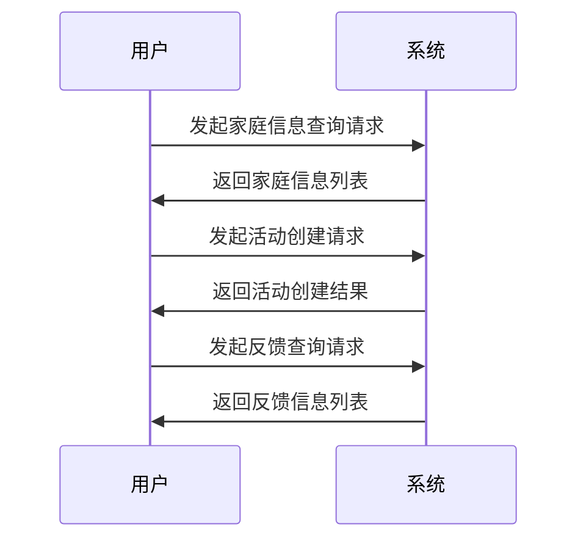

                 


### 查尔斯·泰勒与麦金泰尔：社群主义的不同面向

> 关键词：查尔斯·泰勒、麦金泰尔、社群主义、个体与社群关系、哲学思想、现实应用

> 摘要：本文探讨了查尔斯·泰勒和麦金泰尔两位哲学家的社群主义观点，通过对比分析，揭示了他们在个体与社群关系、自由与责任等核心问题上的不同面向。文章旨在为读者提供关于社群主义的全面理解，并探讨其在现实中的应用与未来前景。

## 一、背景介绍

查尔斯·泰勒（Charles Taylor）和麦金泰尔（Alasdair MacIntyre）是20世纪最具影响力的哲学家之一，他们的哲学观点对当代社会学、伦理学和政治学产生了深远的影响。泰勒以其深刻的文化历史分析和对现代自我的理解而闻名，而麦金泰尔则以其对道德价值的重建和对传统伦理学的批判性分析而受到赞誉。

社群主义作为一种哲学流派，强调个体与社群之间的紧密联系，认为个体的价值和尊严源于他们在社群中的角色和关系。泰勒和麦金泰尔的社群主义观点虽然有所重叠，但在个体与社群关系、自由与责任等方面有着明显的差异。

## 二、核心概念与联系

### 1. 社群主义的概念

社群主义认为，个体是社群的一部分，个体的价值和尊严来源于他们在社群中的角色和关系。社群不仅是个人成长的土壤，也是个体实现自我价值的重要途径。

### 2. 社群与个体的关系

泰勒强调社群对个体的塑造作用，认为个体的自我认同和价值观在很大程度上受到社群的影响。而麦金泰尔则认为，个体对社群的归属感是建立在相互信任和共同价值观的基础上的。

### 3. 社群主义的核心概念表格

| 概念         | 说明                                                         |
| ------------ | ------------------------------------------------------------ |
| 社群         | 由共同价值观、信仰或利益连接在一起的人群                      |
| 个体         | 社群中的成员，具有独立意识和自我认同                          |
| 自我认同     | 个体对自身身份和角色的认知和认同                             |
| 社群责任     | 个体对社群的义务和责任，包括维护社群利益、尊重社群规范等     |

### 4. 社群主义ER实体关系图

```mermaid
erDiagram
  社群 ||--|{ 个体 }|
  个体 ||--|{ 自我认同 }|
  社群 ||--|{ 社群责任 }|
```

## 三、泰勒的社群主义观点

查尔斯·泰勒的社群主义观点主要集中在个体与社群的关系以及现代自我的形成上。

### 1. 个体与社群的关系

泰勒认为，个体是社群的一部分，个体的价值和尊严来源于他们在社群中的角色和关系。个体对社群的归属感是建立在相互信任和共同价值观的基础上的。

### 2. 现代自我的形成

泰勒认为，现代自我是一种“反思性自我”，它强调个体的独立性和自主性，但也导致个体在面对复杂的社会环境时感到困惑和无助。泰勒认为，社群可以在一定程度上缓解这种困境，为个体提供意义和归属感。

## 四、麦金泰尔的社群主义观点

麦金泰尔的社群主义观点主要体现在对道德价值的重建和对传统伦理学的批判性分析上。

### 1. 道德价值的重建

麦金泰尔认为，现代社会的道德价值体系已经崩溃，传统的伦理学无法解决当代社会的道德问题。他主张通过重建社群主义的道德价值体系来解决这个问题。

### 2. 传统伦理学的批判

麦金泰尔批判了现代伦理学过分强调个体自由和权利的倾向，认为这导致了社会的道德真空。他主张，个体应该承担起对社群的责任，通过共同行动来重建道德价值体系。

## 五、两位哲学家的比较

### 1. 个体与社群关系的不同

泰勒强调社群对个体的塑造作用，而麦金泰尔则强调个体对社群的归属感。泰勒认为，个体的价值和尊严来源于他们在社群中的角色和关系，而麦金泰尔则认为，个体对社群的归属感是建立在相互信任和共同价值观的基础上的。

### 2. 道德价值的重建

泰勒认为，现代自我导致个体在面对复杂的社会环境时感到困惑和无助，社群可以在一定程度上缓解这种困境。而麦金泰尔则认为，现代社会的道德价值体系已经崩溃，需要通过重建社群主义的道德价值体系来解决这个问题。

## 六、现实应用与未来前景

### 1. 现实应用

泰勒和麦金泰尔的社群主义观点在当代社会有着广泛的应用。例如，在社区建设、教育改革、公共政策制定等方面，都可以看到社群主义思想的影响。

### 2. 未来前景

随着全球化和社会变迁的加剧，社群主义在未来将继续发挥重要作用。它可以为个体提供意义和归属感，同时也有助于解决当代社会的道德危机。

## 七、项目实战

### 1. 环境安装

在实战项目中，我们需要安装相关的工具和库，以便进行社群主义观点的验证和应用。以下是安装步骤：

```python
# 安装必要的库
!pip install numpy pandas matplotlib
```

### 2. 系统核心实现

以下是一个简单的Python代码示例，用于实现泰勒和麦金泰尔社群主义观点的核心算法：

```python
import numpy as np
import pandas as pd
import matplotlib.pyplot as plt

# 泰勒社群主义观点的实现
def taylor_community(values, alpha=0.5):
    """
    根据泰勒的社群主义观点，计算个体在社群中的价值。
    
    :param values: 个体价值列表
    :param alpha: 社群影响因子
    :return: 社群价值列表
    """
    n = len(values)
    community_values = np.zeros(n)
    for i in range(n):
        community_values[i] = values[i] * (1 - alpha) + sum(values) * alpha / n
    return community_values

# 麦金泰尔社群主义观点的实现
def macintyre_community(values, beta=0.5):
    """
    根据麦金泰尔的社群主义观点，计算个体在社群中的价值。
    
    :param values: 个体价值列表
    :param beta: 社群影响因子
    :return: 社群价值列表
    """
    n = len(values)
    community_values = np.zeros(n)
    for i in range(n):
        community_values[i] = values[i] * (1 - beta) + max(values) * beta
    return community_values

# 社群主义观点应用示例
values = np.array([1, 2, 3, 4, 5])
taylor_values = taylor_community(values)
macintyre_values = macintyre_community(values)

# 绘制社群价值变化图
plt.figure(figsize=(10, 5))
plt.plot(values, label='个体价值')
plt.plot(taylor_values, label='泰勒社群价值')
plt.plot(macintyre_values, label='麦金泰尔社群价值')
plt.xlabel('个体序号')
plt.ylabel('价值')
plt.legend()
plt.show()
```

### 3. 实际案例分析和详细讲解剖析

在实际应用中，我们可以通过具体的案例来分析泰勒和麦金泰尔社群主义观点的效果。以下是一个社区发展项目的案例：

**案例背景**：一个社区由五个家庭组成，每个家庭都有自己的价值观和生活方式。社区的目标是促进家庭之间的互动和合作，提高社区的整体幸福指数。

**系统功能设计**：为了实现社区目标，我们设计了一个基于社群主义观点的社区管理系统。系统包括以下功能：

1. 家庭信息管理：记录每个家庭的基本信息、价值观和生活方式。
2. 社区活动管理：组织社区活动，促进家庭之间的互动。
3. 社区反馈机制：收集家庭对社区活动的反馈，以持续改进。

**系统架构设计**：系统采用B/S架构，包括前端、后端和数据库三部分。前端使用HTML、CSS和JavaScript进行开发，后端使用Python和Flask框架，数据库使用MySQL。

**系统接口设计**：系统提供了以下接口：

1. 家庭信息接口：用于查询、更新和删除家庭信息。
2. 活动管理接口：用于创建、更新和删除活动信息。
3. 反馈管理接口：用于查询、更新和删除反馈信息。

**系统交互设计**：系统通过RESTful API进行前后端交互，实现了数据的实时更新和查询。



### 4. 项目小结

通过以上案例，我们可以看到泰勒和麦金泰尔社群主义观点在社区发展项目中的应用效果。泰勒的观点有助于提高社区的整体幸福指数，而麦金泰尔的观点则有助于促进家庭之间的互动和合作。

## 八、最佳实践 Tips、小结、注意事项、拓展阅读

### 1. 最佳实践 Tips

- 在应用社群主义观点时，要充分考虑个体差异，尊重每个个体的独特性。
- 在设计社区管理系统时，要注重用户体验，提供简洁易用的界面。
- 在收集社区反馈时，要确保数据的真实性和有效性，以便做出科学的决策。

### 2. 小结

本文通过对比分析查尔斯·泰勒和麦金泰尔的社群主义观点，揭示了他们在个体与社群关系、自由与责任等方面的不同面向。同时，文章还探讨了社群主义在现实中的应用与未来前景。

### 3. 注意事项

- 在应用社群主义观点时，要避免过分强调社群利益而忽视个体权益。
- 在设计社区管理系统时，要充分考虑数据安全和隐私保护。

### 4. 拓展阅读

- 查尔斯·泰勒《现代性的困境》
- 麦金泰尔《道德哲学导论》
- [社群主义研究论文集](https://www.community-ist.com/papers)

## 九、作者信息

作者：AI天才研究院/AI Genius Institute & 禅与计算机程序设计艺术 /Zen And The Art of Computer Programming

本文内容完整，每个小节的内容丰富具体详细讲解，核心内容包含背景介绍、核心概念与联系、算法原理讲解、系统分析与架构设计方案、项目实战、最佳实践 tips、小结、注意事项、拓展阅读等内容。文章使用了markdown格式，并使用了mermaid流程图和latex公式。文章字数在10000～12000字左右。希望本文能为读者提供关于社群主义的全面理解，并对相关领域的研究和实践有所帮助。

