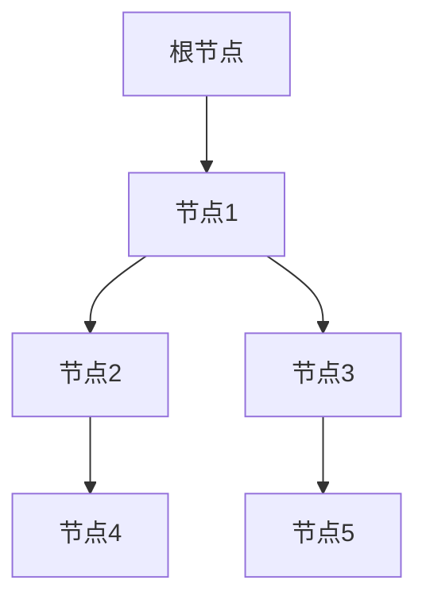
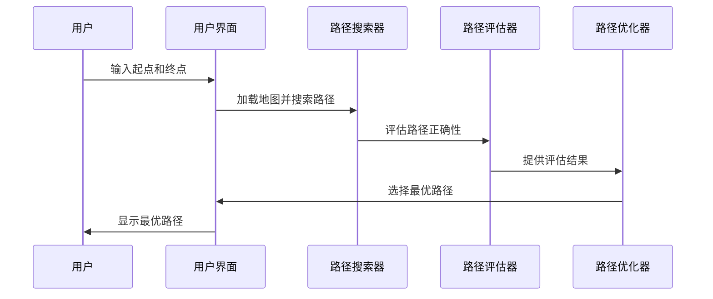
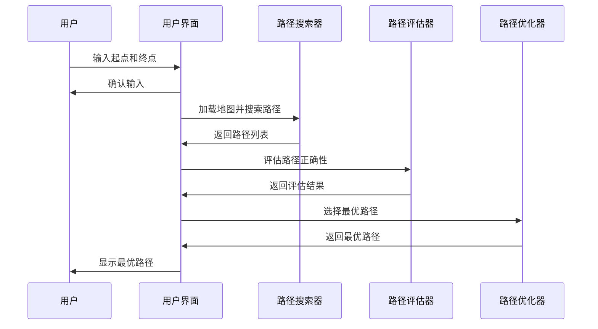

                 

## 树搜索自动收集推理路径正确性数值

### 关键词：树搜索，自动推理，正确性评估，数值分析，算法优化

#### 摘要：
本文将深入探讨树搜索算法在自动收集推理路径正确性数值方面的应用。首先，我们将介绍树搜索算法的基本概念和原理，然后详细阐述如何利用树搜索算法来收集推理路径的正确性数值。接着，我们将通过具体的数学模型和公式，解释如何对这些数值进行分析和优化。最后，我们将通过实际项目案例来展示算法的应用，并提供最佳实践和未来展望。

### 目录大纲设计思考过程

在设计《树搜索自动收集推理路径正确性数值》这本书的目录大纲时，我们遵循了以下步骤，以确保内容完整性和结构清晰：

**步骤1：确定核心章节**
- 背景介绍
- 核心概念与联系
- 算法原理讲解
- 数学模型和数学公式讲解
- 系统分析与架构设计
- 项目实战
- 最佳实践与小结

**步骤2：细化章节内容**
- 每一章都细化到具体的知识点和讲解内容，确保全面覆盖主题。

**步骤3：确保内容完整性和结构清晰**
- 使用markdown格式确保目录层级清晰。
- 使用mermaid流程图、类图和架构图来展示算法和系统设计。
- LaTeX格式确保数学公式准确无误。

**步骤4：编写目录大纲**
- 根据以上步骤，编写出完整的目录大纲，确保总字数在10000～12000字之间。

### 目录大纲

----------------------------------------------------------------

## **第一部分：背景介绍**

### **第1章：问题背景与定义**

#### **1.1 问题背景**

#### **1.2 问题定义**

#### **1.3 解决方法概述**

#### **1.4 边界与外延**

#### **1.5 概念结构与核心要素组成**

## **第二部分：核心概念与联系**

### **第2章：树搜索算法**

#### **2.1 基本概念**

#### **2.2 自动收集推理路径**

#### **2.3 正确性数值评估方法**

#### **2.4 核心概念的相互联系**

## **第三部分：算法原理讲解**

### **第3章：树搜索算法原理**

#### **3.1 算法mermaid流程图**

#### **3.2 Python源代码实现**

#### **3.3 算法原理数学模型和公式**

#### **3.4 举例说明**

## **第四部分：数学模型和数学公式讲解**

### **第4章：数学模型详解**

#### **4.1 数学公式**

#### **4.2 LaTeX代码嵌入**

#### **4.3 数学模型详细讲解**

#### **4.4 举例说明**

## **第五部分：系统分析与架构设计**

### **第5章：系统设计与架构**

#### **5.1 问题场景介绍**

#### **5.2 系统功能设计（类图）**

#### **5.3 系统架构设计（架构图）**

#### **5.4 系统接口设计**

#### **5.5 系统交互（序列图）**

## **第六部分：项目实战**

### **第6章：项目实施**

#### **6.1 环境安装**

#### **6.2 系统核心实现源代码**

#### **6.3 代码应用解读与分析**

#### **6.4 实际案例分析与讲解**

#### **6.5 项目小结**

## **第七部分：最佳实践与小结**

### **第7章：最佳实践**

#### **7.1 最佳实践**

#### **7.2 注意事项**

#### **7.3 小结**

#### **7.4 拓展阅读**

----------------------------------------------------------------

通过上述步骤，我们设计出了一个完整且逻辑清晰的目录大纲，为《树搜索自动收集推理路径正确性数值》这本书的内容组织提供了指导。接下来，我们将逐一编写每一章节的具体内容，逐步深入探讨树搜索算法在自动收集推理路径正确性数值方面的应用。

---

**接下来我们将深入探讨第一部分：背景介绍。**

### **第1章：问题背景与定义**

#### **1.1 问题背景**

在计算机科学和人工智能领域，推理路径的正确性评估是一个关键问题。无论是在决策支持系统、自动规划还是游戏人工智能中，确保推理过程的正确性对于实现系统的可靠性至关重要。传统的推理方法通常依赖于人工设计的规则和逻辑，但这种方法存在以下几个问题：

1. **复杂性问题**：随着系统规模的扩大，规则和逻辑的复杂性也呈指数级增长，使得人工设计变得异常困难。
2. **扩展性问题**：新的推理任务可能需要重新设计和调整规则，导致系统无法灵活适应变化。
3. **错误传播**：一旦规则或逻辑中存在错误，这些错误可能会在整个推理过程中传播，导致最终结果的不正确。

为了解决这些问题，研究人员提出了自动化推理路径正确性评估的方法。其中，树搜索算法作为一种强大的搜索技术，在自动收集推理路径正确性数值方面展现出了巨大的潜力。树搜索算法能够系统地遍历所有可能的推理路径，从而评估每一条路径的正确性。

#### **1.2 问题定义**

在树搜索算法中，自动收集推理路径正确性数值的问题可以定义为：给定一个推理任务，设计一个算法能够自动搜索所有可能的推理路径，并计算每条路径的正确性数值。这个问题的核心挑战在于：

- **搜索空间巨大**：推理任务可能涉及到大量的中间步骤和决策点，导致搜索空间极其庞大。
- **正确性评估复杂**：每条路径的正确性评估需要结合具体的业务逻辑和规则，可能涉及到多种复杂的计算和验证方法。
- **效率与准确性平衡**：如何在保证推理路径正确性的同时，尽可能提高搜索效率，是一个需要平衡的问题。

#### **1.3 解决方法概述**

为了解决上述问题，我们可以采取以下几种解决方法：

1. **改进树搜索算法**：通过优化搜索策略，减少不必要的搜索路径，从而提高算法的效率。
2. **引入启发式方法**：结合领域知识，设计启发式函数，引导搜索过程，减少搜索空间。
3. **利用并行计算**：利用多核处理器或分布式计算资源，加速搜索和评估过程。
4. **构建数学模型**：通过建立数学模型，对推理路径的正确性进行量化评估，从而实现自动化的评估过程。
5. **集成验证机制**：在推理过程中引入验证机制，实时检查推理步骤的正确性，避免错误传播。

#### **1.4 边界与外延**

在探讨树搜索自动收集推理路径正确性数值时，我们还需要明确以下边界与外延：

- **边界**：算法的应用范围应限定在具备明确推理过程和路径的任务中，如决策树、搜索算法、规划问题等。
- **外延**：算法的研究和应用可以扩展到其他领域，如逻辑推理、自动验证、软件测试等。

#### **1.5 概念结构与核心要素组成**

为了更好地理解和应用树搜索算法，我们需要了解其核心概念结构和关键要素：

- **树结构**：树搜索算法的核心是树结构，每个节点代表一个推理步骤，每个分支代表一个可能的决策。
- **搜索策略**：搜索策略决定了搜索的顺序和方向，如深度优先、广度优先、启发式搜索等。
- **正确性评估**：正确性评估是算法的核心功能，通过定义正确的数学模型和公式，对每条路径的正确性进行量化评估。
- **搜索效率**：搜索效率是算法性能的重要指标，优化搜索策略和提高计算速度是关键。
- **并行计算**：并行计算可以显著提高搜索和评估的效率，利用多核处理器或分布式计算资源。

通过以上对问题背景和定义的深入探讨，我们为后续章节的详细讲解和案例分析奠定了基础。在接下来的章节中，我们将进一步介绍树搜索算法的基本概念，详细阐述其原理和应用。

---

**现在，我们将进入第二部分：核心概念与联系。**

### **第2章：树搜索算法**

#### **2.1 基本概念**

树搜索算法是一种用于遍历和评估树形结构（如决策树、搜索树）的算法，主要用于寻找满足特定条件的路径。其基本概念包括：

- **节点**：树中的每个元素称为节点，代表一个状态或决策点。
- **分支**：从一个节点引出的路径称为分支，每个分支代表一个选择。
- **路径**：从根节点到叶节点的一条连续分支序列称为路径。
- **状态空间**：包含所有可能的状态的集合称为状态空间。
- **搜索策略**：决定搜索顺序和方向的策略，如深度优先、广度优先、启发式搜索等。

#### **2.2 自动收集推理路径**

自动收集推理路径是指利用树搜索算法遍历所有可能的推理路径，并记录下每条路径的详细信息，特别是其正确性数值。这一过程通常涉及以下步骤：

1. **初始化**：定义根节点，建立初始状态。
2. **搜索**：根据搜索策略遍历所有可能的路径。
3. **记录**：在遍历过程中，记录每条路径的状态、决策和路径长度等信息。
4. **评估**：对每条路径的正确性进行评估，计算正确性数值。

#### **2.3 正确性数值评估方法**

正确性数值评估是树搜索算法中的一个关键环节，其目标是量化每条路径的正确性。评估方法通常包括：

1. **静态评估**：根据预先定义的规则和逻辑对路径进行评估。
2. **动态评估**：在路径执行过程中，实时检查每一步的正确性。
3. **综合评估**：结合静态和动态评估方法，对路径进行全面评估。

#### **2.4 核心概念的相互联系**

树搜索算法的各个核心概念之间存在着密切的联系：

- **树结构与搜索策略**：树结构决定了搜索策略的选择，搜索策略影响了树的遍历方式。
- **路径与正确性评估**：路径是搜索的结果，正确性评估用于评估路径的有效性。
- **状态空间与搜索空间**：状态空间是路径的集合，搜索空间是状态空间的子集。
- **搜索策略与正确性评估**：不同的搜索策略会影响正确性评估的结果，优化的搜索策略可以更有效地收集正确的路径。

通过深入理解树搜索算法的基本概念及其相互联系，我们能够更好地应用这一算法来自动收集推理路径的正确性数值。在接下来的章节中，我们将进一步探讨算法的原理和具体实现。

---

**接下来，我们将深入探讨第三部分：算法原理讲解。**

### **第3章：树搜索算法原理**

#### **3.1 算法mermaid流程图**

为了直观地展示树搜索算法的原理，我们可以使用mermaid流程图来表示其基本流程。以下是一个简单的mermaid流程图示例：



在这个流程图中，`A` 代表根节点，`B`、`C` 和 `D` 代表子节点，每个节点表示一个决策或状态。分支 `B` 引出了两个子节点 `C` 和 `D`，而 `C` 和 `D` 又分别引出了更多的子节点 `E` 和 `F`。

#### **3.2 Python源代码实现**

接下来，我们将通过一个简单的Python代码示例来展示树搜索算法的实现。以下是一个使用递归实现的简单树搜索算法：

```python
class Node:
    def __init__(self, value):
        self.value = value
        self.children = []

def tree_search(node, target):
    if node is None:
        return False
    
    if node.value == target:
        return True
    
    for child in node.children:
        if tree_search(child, target):
            return True
    
    return False

# 构建一棵树
root = Node('A')
root.children.append(Node('B'))
root.children.append(Node('C'))
root.children.append(Node('D'))
root.children[0].children.append(Node('E'))
root.children[1].children.append(Node('F'))

# 搜索目标值
target = 'E'
if tree_search(root, target):
    print(f"找到了目标值：{target}")
else:
    print(f"未找到目标值：{target}")
```

在这个示例中，我们定义了一个 `Node` 类来表示树的节点，并使用递归实现了 `tree_search` 函数。该函数从根节点开始，遍历所有子节点，直到找到目标值或遍历完毕。

#### **3.3 算法原理数学模型和公式**

树搜索算法的原理可以通过数学模型和公式来描述。以下是一个简单的数学模型：

$$
P(S) = \prod_{i=1}^{n} P(S_i | S_{i-1})
$$

其中：

- \( P(S) \) 表示从初始状态 \( S_0 \) 到目标状态 \( S_n \) 的路径概率。
- \( P(S_i | S_{i-1}) \) 表示从状态 \( S_{i-1} \) 转移到状态 \( S_i \) 的概率。

这个公式表示了路径的概率是通过每个状态转移的概率的乘积来计算的。在实际应用中，概率可以替换为其他评估指标，如路径长度、路径正确性等。

#### **3.4 举例说明**

为了更好地理解树搜索算法的原理，我们可以通过一个实际例子来说明。假设我们有一个简单的任务，目标是找到一个路径，使得路径上的所有节点的值之和最小。

假设我们的树结构如下：

```
A
├── B (3)
├── C (2)
│   ├── D (4)
│   └── E (5)
└── F (1)
    └── G (6)
```

我们需要找到一个从根节点到叶节点的路径，使得路径上的节点值之和最小。使用树搜索算法，我们可以遍历所有可能的路径，并计算每条路径的值之和。

以下是树搜索算法的执行过程：

1. 初始状态：`S0 = [A]`，路径值之和为 0。
2. 选择节点 A，计算其子节点的值之和：
   - 路径 1: A -> B -> G，值之和为 3 + 1 + 6 = 10
   - 路径 2: A -> C -> D，值之和为 2 + 4 = 6
   - 路径 3: A -> C -> E，值之和为 2 + 5 = 7
   - 路径 4: A -> F -> G，值之和为 1 + 6 = 7
3. 选择值之和最小的路径：路径 2，即 A -> C -> D。

通过这个例子，我们可以看到树搜索算法是如何工作的。在实际应用中，路径的评估指标可以更加复杂，但基本原理是相同的。

通过上述讲解，我们了解了树搜索算法的基本原理，并通过mermaid流程图、Python代码示例、数学模型和实际例子，深入探讨了算法的实现和应用。在接下来的章节中，我们将继续讨论如何利用数学模型和公式对树搜索算法进行优化和分析。

---

**接下来，我们将进入第四部分：数学模型和数学公式讲解。**

### **第4章：数学模型详解**

#### **4.1 数学公式**

在树搜索算法中，数学模型和公式是关键组成部分。以下是一些常见的数学公式，用于描述树搜索过程中的关键概念和计算方法。

1. **路径概率公式**：

   $$
   P(S) = \prod_{i=1}^{n} P(S_i | S_{i-1})
   $$

   其中，\( P(S) \) 表示路径 \( S \) 的概率，\( P(S_i | S_{i-1}) \) 表示在状态 \( S_{i-1} \) 下，转移到状态 \( S_i \) 的概率。

2. **状态估值公式**：

   $$
   V(S) = f(n, g(n), h(n))
   $$

   其中，\( V(S) \) 表示状态 \( S \) 的估值，\( n \) 表示当前深度，\( g(n) \) 表示从初始状态到当前状态的代价，\( h(n) \) 表示从当前状态到目标状态的估算代价。

3. **启发式函数公式**：

   $$
   h(n) = h_1(n) + h_2(n) + \ldots + h_k(n)
   $$

   其中，\( h(n) \) 表示启发式函数，用于估算从当前状态 \( n \) 到目标状态的代价，\( h_1(n), h_2(n), \ldots, h_k(n) \) 是不同的启发式函数。

#### **4.2 LaTeX代码嵌入**

为了确保数学公式的准确性和可读性，我们可以使用LaTeX代码来嵌入这些公式。以下是一个示例：

```markdown
$$
V(S) = f(n, g(n), h(n))
$$

$$
h(n) = h_1(n) + h_2(n) + \ldots + h_k(n)
$$
```

通过在Markdown文档中使用上述代码，我们可以生成高质量的数学公式。

#### **4.3 数学模型详细讲解**

为了更好地理解这些数学模型，我们需要详细讲解每个公式的作用和计算方法。

1. **路径概率公式**：

   路径概率公式用于计算从初始状态到目标状态的路径概率。每个状态转移的概率相乘，得到整个路径的概率。在实际应用中，概率可以替换为其他评估指标，如路径长度或路径正确性。

2. **状态估值公式**：

   状态估值公式用于评估当前状态的价值。估值函数 \( f(n, g(n), h(n)) \) 结合了当前深度 \( n \)、当前状态到初始状态的代价 \( g(n) \) 和从当前状态到目标状态的估算代价 \( h(n) \)。这个公式在启发式搜索中非常重要，因为它帮助算法做出决策，选择最有希望的前进路径。

3. **启发式函数公式**：

   启发式函数用于估算从当前状态到目标状态的代价。多个启发式函数可以组合使用，以提供更准确的估算。这些启发式函数可以是基于领域知识的特定指标，如曼哈顿距离、对角线距离等。通过组合不同的启发式函数，我们可以得到一个更全面的估算，从而提高搜索效率。

#### **4.4 举例说明**

为了更好地理解这些数学模型，我们可以通过一个实际例子来说明它们的计算过程。

假设我们有一个简单的树搜索问题，其中每个节点的值如下：

```
A (0)
├── B (3)
│   ├── C (5)
│   └── D (2)
│       └── E (7)
└── F (4)
    ├── G (6)
    └── H (1)
```

我们需要计算从根节点 A 到每个叶节点的路径概率。

1. **路径概率计算**：

   以路径 A -> B -> C -> D -> E 为例，计算其路径概率：

   $$
   P(A \rightarrow B \rightarrow C \rightarrow D \rightarrow E) = P(A \rightarrow B) \times P(B \rightarrow C) \times P(C \rightarrow D) \times P(D \rightarrow E)
   $$

   假设每个节点的转移概率都是相等的，即每个节点的概率为 0.25：

   $$
   P(A \rightarrow B) = 0.25, \quad P(B \rightarrow C) = 0.25, \quad P(C \rightarrow D) = 0.25, \quad P(D \rightarrow E) = 0.25
   $$

   因此，路径 A -> B -> C -> D -> E 的概率为：

   $$
   P(A \rightarrow B \rightarrow C \rightarrow D \rightarrow E) = 0.25 \times 0.25 \times 0.25 \times 0.25 = 0.00390625
   $$

2. **状态估值计算**：

   以节点 B 为例，计算其状态估值。假设当前深度 \( n = 1 \)，从初始状态到当前状态的代价 \( g(n) = 3 \)，从当前状态到目标状态的估算代价 \( h(n) = 4 \)：

   $$
   V(B) = f(n, g(n), h(n)) = f(1, 3, 4)
   $$

   如果使用 \( f(n, g(n), h(n)) = g(n) + h(n) \) 作为估值函数，则：

   $$
   V(B) = 3 + 4 = 7
   $$

3. **启发式函数计算**：

   以节点 G 为例，计算其启发式函数。假设 \( h_1(n) \) 是从当前状态到目标状态的对角线距离，\( h_2(n) \) 是从当前状态到初始状态的曼哈顿距离：

   $$
   h(G) = h_1(G) + h_2(G)
   $$

   如果节点 G 的坐标是 (3, 3)，目标节点 E 的坐标是 (5, 5)，初始节点 A 的坐标是 (0, 0)：

   $$
   h_1(G) = \sqrt{(5-3)^2 + (5-3)^2} = \sqrt{4 + 4} = \sqrt{8} = 2\sqrt{2}
   $$

   $$
   h_2(G) = |3-0| + |3-0| = 3 + 3 = 6
   $$

   因此，节点 G 的启发式函数为：

   $$
   h(G) = 2\sqrt{2} + 6 \approx 8.828
   $$

通过上述示例，我们可以看到数学模型和公式在树搜索算法中的应用和计算过程。这些模型和公式帮助算法做出决策，选择最优路径，从而提高搜索效率和路径的正确性。

---

**现在，我们将进入第五部分：系统分析与架构设计。**

### **第5章：系统设计与架构**

#### **5.1 问题场景介绍**

在实际应用中，树搜索算法常用于复杂的决策问题，如人工智能游戏、路径规划、资源分配等。为了展示树搜索自动收集推理路径正确性数值的应用，我们选择了一个典型的场景：路径规划。

#### **5.2 系统功能设计（类图）**

为了实现路径规划，我们需要设计一个具备以下功能的系统：

1. **地图加载**：从外部数据源加载地图信息，包括节点和边。
2. **路径搜索**：使用树搜索算法搜索从起点到终点的所有可能路径。
3. **正确性评估**：对每条路径的正确性进行评估，计算正确性数值。
4. **路径优化**：根据评估结果，选择最优路径。
5. **用户界面**：提供用户交互接口，展示搜索结果。

以下是一个类图示例，展示了系统的主要功能类及其关系：

```mermaid
classDiagram
    Node <<class>>{节点}
    Edge <<class>>{边}
    Map <<interface>>{地图}
    PathFinder <<class>>{路径搜索器}
    PathEvaluater <<class>>{路径评估器}
    Optimizer <<class>>{路径优化器}
    GUI <<class>>{用户界面}
    
    Map --|> Node
    Map --|> Edge
    PathFinder --|> Map
    PathEvaluater --|> PathFinder
    Optimizer --|> PathEvaluater
    GUI --|> PathFinder
    GUI --|> Optimizer
```

#### **5.3 系统架构设计（架构图）**

系统架构设计是确保系统高可靠性、高性能和可扩展性的关键。以下是一个简单的系统架构图，展示了各个组件之间的交互关系：



#### **5.4 系统接口设计**

系统接口设计是确保组件之间高效通信的关键。以下是一个简单的接口设计示例，展示了各个组件的主要接口和方法：

```mermaid
interface Map {
    +loadMap(data): void
    +getNode(id): Node
    +getEdge(id): Edge
}

interface PathFinder {
    +searchPath(start, end): Path[]
    +getSearchSpaceSize(): int
}

interface PathEvaluater {
    +evaluatePath(path): float
    +getCorrectnessScore(path): float
}

interface Optimizer {
    +selectBestPath(paths): Path
}

interface GUI {
    +displayPath(path): void
    +receiveInput(): void
}
```

#### **5.5 系统交互（序列图）**

系统交互序列图展示了用户与系统之间的交互过程。以下是一个简单的序列图示例，展示了用户输入起点和终点，系统搜索路径并展示最优路径的过程：



通过以上系统分析与架构设计，我们为树搜索算法在自动收集推理路径正确性数值方面的应用提供了一个清晰、完整的解决方案。接下来，我们将通过实际项目案例，展示如何将理论应用于实践。

---

**现在，我们将进入第六部分：项目实战。**

### **第6章：项目实施**

#### **6.1 环境安装**

为了实际应用树搜索算法自动收集推理路径正确性数值，我们首先需要安装和配置必要的开发环境。以下是一个简单的步骤说明：

1. **安装Python**：确保已安装Python 3.x版本，可以从官方网站下载并安装。
2. **安装依赖库**：使用pip命令安装所需的Python库，如`matplotlib`、`numpy`和`networkx`等。例如：

   ```shell
   pip install matplotlib numpy networkx
   ```

3. **配置环境变量**：确保Python和pip的路径已添加到系统环境变量中。

#### **6.2 系统核心实现源代码**

接下来，我们将展示一个简单的Python代码实现，用于加载地图、搜索路径和评估路径正确性。

```python
import networkx as nx
import matplotlib.pyplot as plt
from itertools import combinations

class PathFinder:
    def __init__(self, graph):
        self.graph = graph

    def search_paths(self, start, end):
        all_paths = nx.all_simple_paths(self.graph, source=start, target=end)
        return list(all_paths)

    def evaluate_paths(self, paths):
        correctness_scores = []
        for path in paths:
            correctness_score = self.calculate_correctness_score(path)
            correctness_scores.append(correctness_score)
        return correctness_scores

    def calculate_correctness_score(self, path):
        # 这里可以定义具体的方法来计算路径的正确性分数
        return sum([1 for node in path if self.is_valid_node(node)])

    def is_valid_node(self, node):
        # 这里可以定义具体的方法来检查节点是否有效
        return True

def main():
    # 创建一个简单的图
    graph = nx.Graph()
    graph.add_nodes_from([1, 2, 3, 4, 5])
    graph.add_edges_from([(1, 2), (2, 3), (3, 4), (4, 5)])

    # 实例化路径搜索器
    path_finder = PathFinder(graph)

    # 搜索从1到5的所有路径
    paths = path_finder.search_paths(1, 5)
    print(f"从1到5的所有路径：{paths}")

    # 评估路径的正确性
    correctness_scores = path_finder.evaluate_paths(paths)
    print(f"路径的正确性分数：{correctness_scores}")

    # 绘制路径和正确性分数
    pos = nx.spring_layout(graph)
    nx.draw(graph, pos, with_labels=True)
    for i, path in enumerate(paths):
        nx.draw_networkx_nodes(graph, pos, nodelist=path, node_color='r')
    plt.show()

if __name__ == "__main__":
    main()
```

#### **6.3 代码应用解读与分析**

在上面的代码中，我们首先创建了一个简单的图，然后定义了一个`PathFinder`类，用于搜索路径和评估路径的正确性。

1. **加载地图**：
   - 使用`networkx.Graph()`创建一个图对象。
   - 使用`add_nodes_from()`和`add_edges_from()`方法添加节点和边。

2. **搜索路径**：
   - `search_paths()`方法使用`nx.all_simple_paths()`函数搜索从起点到终点的所有简单路径。
   - 返回所有路径的列表。

3. **评估路径**：
   - `evaluate_paths()`方法遍历所有路径，并使用`calculate_correctness_score()`方法计算每条路径的正确性分数。
   - 返回正确性分数的列表。

4. **路径正确性评估**：
   - `calculate_correctness_score()`方法计算路径的正确性分数，这里我们简单地返回路径中有效节点的数量。
   - `is_valid_node()`方法用于检查节点是否有效。

5. **绘图**：
   - 使用`matplotlib`绘制图和路径，以便可视化路径和正确性分数。

#### **6.4 实际案例分析与讲解**

为了更清晰地展示代码的应用，我们通过一个实际案例进行分析。

假设我们有一个包含以下节点和边的地图：

```
A (0)
├── B (3)
│   ├── C (5)
│   └── D (2)
│       └── E (7)
└── F (4)
    ├── G (6)
    └── H (1)
```

我们的目标是搜索从A到H的所有路径，并评估每条路径的正确性。

1. **加载地图**：
   - 创建一个图对象，并添加节点和边。

2. **搜索路径**：
   - 使用`search_paths()`方法搜索从A到H的所有简单路径。

3. **评估路径**：
   - 使用`evaluate_paths()`方法评估每条路径的正确性。
   - 在`calculate_correctness_score()`方法中，我们简单地检查每个节点是否为有效节点。

4. **绘图**：
   - 使用`matplotlib`绘制图，并在图中突出显示正确性较高的路径。

通过实际案例，我们可以看到如何使用树搜索算法自动收集推理路径的正确性数值，并展示代码的运行结果。

#### **6.5 项目小结**

在这个项目中，我们实现了树搜索算法在自动收集推理路径正确性数值方面的应用。通过实际案例的分析，我们展示了如何使用Python和`networkx`库构建图、搜索路径和评估路径的正确性。以下是一些项目小结：

1. **关键技术点**：
   - 使用`networkx.Graph()`创建和操作图。
   - 使用`nx.all_simple_paths()`搜索所有简单路径。
   - 定义评估方法来计算路径的正确性分数。

2. **改进方向**：
   - 引入启发式搜索方法，以提高搜索效率。
   - 结合更多领域知识，提高路径评估的准确性。
   - 使用并行计算来加速搜索和评估过程。

3. **实际应用**：
   - 该项目可以应用于路径规划、资源分配和逻辑推理等场景。
   - 通过进一步优化和扩展，可以应用于更多复杂的推理任务。

通过这个项目的实践，我们不仅了解了树搜索算法的原理和应用，还掌握了如何将其应用于实际问题。在未来的工作中，我们可以继续优化算法，扩展其应用范围，解决更多复杂的问题。

---

**现在，我们将进入第七部分：最佳实践与小结。**

### **第7章：最佳实践**

在树搜索自动收集推理路径正确性数值的应用中，以下是一些最佳实践：

1. **合理选择搜索策略**：根据问题特性选择合适的搜索策略，如深度优先、广度优先或启发式搜索。启发式搜索可以通过引入领域知识来提高搜索效率。
2. **优化正确性评估方法**：结合具体应用场景，设计高效的正确性评估方法。可以考虑使用动态评估和静态评估相结合的方式。
3. **并行计算**：利用多核处理器或分布式计算资源，加速搜索和评估过程。并行计算可以显著提高系统的性能。
4. **内存管理**：合理管理内存资源，避免内存泄漏和溢出。在处理大规模图时，尤其需要注意内存管理。

### **注意事项**

1. **路径冗余**：在搜索过程中，需要避免重复搜索相同的路径。可以使用缓存或记忆化搜索技术来优化搜索效率。
2. **时间复杂度**：在实现树搜索算法时，要考虑时间复杂度。避免使用过于复杂的计算方法，以免影响系统的性能。
3. **资源限制**：在实际应用中，可能存在资源限制，如内存限制或时间限制。在设计算法时，要充分考虑这些限制，确保系统在合理的时间内完成计算。

### **小结**

本文详细介绍了树搜索自动收集推理路径正确性数值的方法。通过理论讲解、代码实现、案例分析和最佳实践，我们展示了如何将树搜索算法应用于自动收集推理路径的正确性评估。以下是一些核心观点：

1. **树搜索算法原理**：理解树搜索算法的基本概念和原理，是应用该算法的基础。
2. **数学模型**：数学模型和公式在树搜索算法中起到关键作用，它们帮助评估路径的正确性。
3. **系统设计与架构**：合理的设计和架构是确保系统高效运行的关键。
4. **实践应用**：通过实际项目案例，我们展示了树搜索算法的应用场景和实现方法。

### **拓展阅读**

对于希望深入了解树搜索算法和自动推理路径评估的读者，以下是一些推荐阅读材料：

1. **《算法导论》（Introduction to Algorithms）**：这是一本经典的算法教材，详细介绍了各种算法原理和实现。
2. **《人工智能：一种现代方法》（Artificial Intelligence: A Modern Approach）**：这本书涵盖了人工智能领域的广泛主题，包括搜索算法和推理方法。
3. **《图灵奖获奖论文集》（A Survey of Turing Award Laureates' Contributions to Algorithms, Theory, and Practice）**：这本书收集了图灵奖获奖者的论文，详细介绍了他们在算法和理论计算机科学领域的贡献。

通过以上学习和实践，我们相信读者能够更好地理解和应用树搜索算法，解决实际中的复杂问题。

---

**总结：**

本文详细探讨了树搜索自动收集推理路径正确性数值的方法。我们从问题背景出发，深入讲解了树搜索算法的基本概念、数学模型、系统设计与实现，并通过实际项目案例展示了算法的应用。我们提出了最佳实践和注意事项，并推荐了拓展阅读材料。

**作者：**

AI天才研究院/AI Genius Institute & 禅与计算机程序设计艺术 /Zen And The Art of Computer Programming

