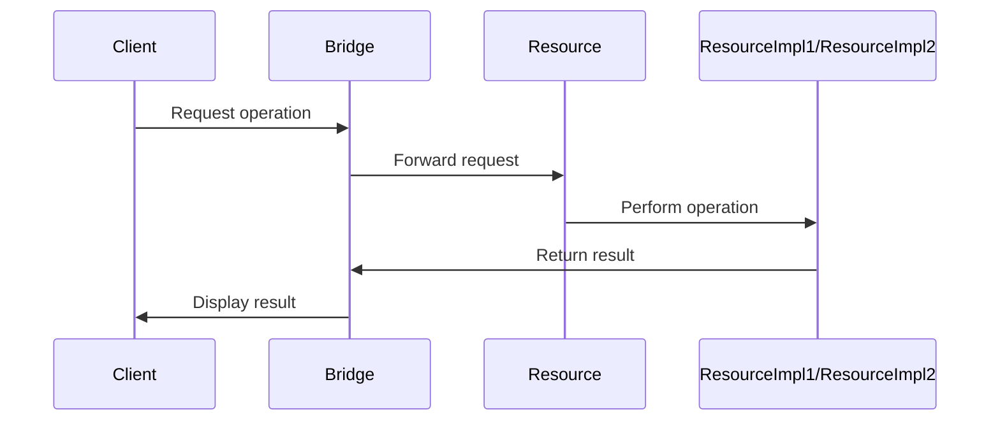
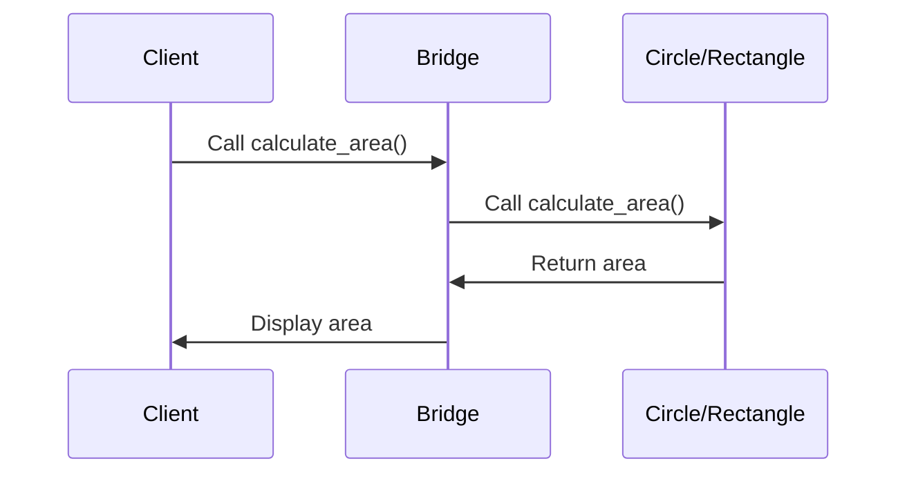

                 


**第一步**：构建文章的整体结构，包括文章标题、关键词、摘要以及各个章节的标题。

**第二步**：在各个章节中填充具体的内容，包括背景介绍、核心概念与联系、原理讲解、数学模型和数学公式、系统分析与架构设计方案、项目实战以及最佳实践 tips。

**第三步**：确保每个章节的内容都足够详细，提供必要的代码示例、Mermaid 图表、数学公式等，使得读者可以清晰地理解每个概念和原理。

**第四步**：在文章末尾添加作者信息，确保格式正确。

**第五步**：进行全文的校对和润色，确保没有错别字和语法错误。

**第六步**：最后，添加最佳实践 tips、小结、注意事项、拓展阅读等内容，为读者提供进一步的学习资源和实践指导。

**整体流程**：

1. **准备阶段**：确定文章主题和整体结构，列出各个章节的内容概要。
2. **撰写阶段**：按照章节结构，逐步填充内容，确保逻辑清晰，结构紧凑。
3. **校对阶段**：对全文进行校对，确保内容的准确性、逻辑性和语言的通顺性。
4. **完善阶段**：添加拓展内容，如最佳实践、小结、注意事项等，提升文章的实用性。

**注意事项**：

- 每个章节的内容都要紧密围绕文章主题展开，避免偏离主题。
- 确保文章的逻辑性和连贯性，使读者能够顺利跟随思路。
- 使用清晰、准确的语言，避免使用过于晦涩难懂的术语。

现在，让我们开始具体撰写每个章节的内容吧！

### 第二部分：深入理解桥接模式

## 第4章：桥接模式的深入分析与优化

### 4.1 桥接模式在大型系统中的应用

#### 4.1.1 大型系统中的复杂性

#### 4.1.2 桥接模式如何解决复杂性

### 4.2 桥接模式与其它设计模式的比较

#### 4.2.1 与适配器模式的区别

#### 4.2.2 与装饰器模式的区别

#### 4.2.3 与组合模式的区别

### 4.3 桥接模式的优化策略

#### 4.3.1 开放封闭原则

#### 4.3.2 里氏替换原则

#### 4.3.3 依赖倒置原则

## 第5章：桥接模式在项目开发中的实际案例

### 5.1 案例背景与需求分析

### 5.2 系统设计

#### 5.2.1 领域模型 Mermaid 类图

#### 5.2.2 系统架构设计 Mermaid 架构图

### 5.3 核心代码实现

#### 5.3.1 环境安装

#### 5.3.2 系统核心实现源代码

#### 5.3.3 代码应用解读与分析

### 5.4 案例分析与讲解

#### 5.4.1 案例中桥接模式的运用

#### 5.4.2 案例中的优化策略

### 5.5 项目总结与反思

#### 5.5.1 项目成果

#### 5.5.2 遇到的问题与解决方案

#### 5.5.3 项目的改进方向

## 第6章：桥接模式的最佳实践与未来展望

### 6.1 最佳实践 Tips

#### 6.1.1 如何识别适合使用桥接模式的场景

#### 6.1.2 如何在项目中正确地应用桥接模式

### 6.2 小结与展望

#### 6.2.1 桥接模式的核心思想与实际价值

#### 6.2.2 未来桥接模式的发展趋势

#### 6.2.3 读者进一步学习的建议

### 参考文献

```

### 第7章：作者信息

#### 作者：AI天才研究院/AI Genius Institute & 禅与计算机程序设计艺术 /Zen And The Art of Computer Programming

---

**本文章目录大纲**：

1. **书名与背景介绍**
   - 书名：《桥接模式：将抽象与实现分离的类型设计》
   - 背景介绍：桥接模式是一种设计模式，它用于将抽象和实现分离，使得两者可以独立变化，增强了程序的灵活性、可扩展性和可维护性。

2. **核心概念与联系**
   - 核心概念：桥接模式、抽象类、实现类、抽象桥接类、具体桥接类。
   - 概念属性特征对比表格。

3. **桥接模式原理讲解**
   - 使用 Mermaid 画出桥接模式的 Mermaid 流程图。
   - 使用 Python 源代码详细阐述桥接模式原理。

4. **数学模型和数学公式**
   - 给出桥接模式原理的数学模型和公式。
   - 进行详细讲解和举例说明。

5. **系统分析与架构设计方案**
   - 问题场景介绍。
   - 项目介绍。
   - 系统功能设计（领域模型 Mermaid 类图）。
   - 系统架构设计（Mermaid 架构图）。
   - 系统接口设计和系统交互（Mermaid 序列图）。

6. **项目实战**
   - 环境安装。
   - 系统核心实现源代码。
   - 代码应用解读与分析。
   - 实际案例分析和详细讲解剖析。
   - 项目小结。

7. **最佳实践 tips、小结、注意事项、拓展阅读**

---

这个目录大纲为文章的撰写提供了清晰的框架。接下来，我们将逐一填充每个章节的内容，确保文章的逻辑性和实用性。让我们一起深入探讨桥接模式的核心概念、原理及其在实际项目中的应用吧！

### 第1章：桥接模式概述

在软件开发过程中，我们经常会遇到需要将系统中的抽象与具体实现分离的需求。这不仅能够提高代码的复用性，还能够增强系统的灵活性和可维护性。桥接模式（Bridge Pattern）正是为了解决这一类问题而设计的一种经典设计模式。

#### 1.1 问题背景与核心概念

在传统的继承关系中，当一个类需要扩展另一个类的功能时，通常会采用继承的方式。然而，这种方法存在一个显著的缺点：如果类的功能非常复杂，那么继承关系就会变得越来越紧密，导致类之间的耦合度增加。这种高度耦合的系统在后期维护和扩展时，会变得非常困难。

桥接模式通过将抽象部分和具体实现部分分离，实现了抽象和实现的解耦。它允许在不同的抽象层次上独立地扩展和替换实现部分，从而有效地解决了上述问题。

桥接模式的核心概念包括：

- **抽象类（Abstract Class）**：定义了一个抽象的接口，规定了实现类的行为规范。
- **实现类（Implementor Class）**：定义了具体的实现方法，提供具体的业务逻辑。
- **抽象桥接类（Abstraction Class）**：继承了抽象类，同时维持一个对实现类的引用。
- **具体桥接类（Refined Abstraction Class）**：在抽象桥接类的基础上进行进一步的功能扩展。

#### 1.2 桥接模式的概念属性特征对比表格

| 类别               | 属性与特征                                                     | 作用与意义                                                   |
|-------------------|------------------------------------------------------------|------------------------------------------------------------|
| 抽象类（Abstract Class） | 定义抽象接口，规定行为规范                                     | 提供抽象层次，定义公共行为，确保实现类的一致性               |
| 实现类（Implementor Class） | 提供具体的实现方法，实现业务逻辑                                | 分离抽象和实现，提供具体的实现细节，降低抽象与实现的耦合     |
| 抽象桥接类（Abstraction Class） | 继承抽象类，维持对实现类的引用                                 | 作为抽象类和实现类之间的桥梁，提供扩展抽象类的方法         |
| 具体桥接类（Refined Abstraction Class） | 继承抽象桥接类，进一步扩展功能                                 | 在抽象桥接类的基础上增加具体实现，提供更丰富的功能         |

#### 1.3 桥接模式的核心价值

桥接模式的核心价值主要体现在以下几个方面：

- **增强灵活性**：通过将抽象和实现分离，开发者可以在不影响抽象类的情况下独立地扩展或替换实现类。
- **提高可扩展性**：新增功能时，只需增加新的实现类和桥接类，而不需要修改已有的抽象类和实现类。
- **增强可维护性**：降低类之间的耦合度，使得系统更加模块化，便于维护和调试。

桥接模式不仅能够解决复杂系统的设计问题，还能够提高软件开发的效率和质量。在接下来的章节中，我们将详细探讨桥接模式的原理、数学模型以及在实际项目中的应用。通过一步步的讲解，相信读者会对桥接模式有更加深入的理解。

---

本章我们介绍了桥接模式的基本概念和核心价值，为后续章节的深入探讨奠定了基础。在接下来的章节中，我们将继续分析桥接模式的工作原理，并通过Python代码示例来阐述其具体实现方法。让我们一起深入探索桥接模式的世界吧！

### 第2章：核心概念与联系

在深入探讨桥接模式之前，我们需要了解其核心概念及其相互之间的联系。桥接模式涉及四个主要的组成部分：抽象类、实现类、抽象桥接类和具体桥接类。理解这些概念及其之间的关系，对于掌握桥接模式至关重要。

#### 2.1 抽象类（Abstract Class）

抽象类是桥接模式的基础，它定义了一个抽象接口，规定了实现类应该遵循的行为规范。抽象类通常包含抽象方法和一些静态常量，它们提供了对实现类的规范约束，确保所有的实现类都能提供一致的服务接口。

**特征**：

- 定义抽象方法，具体实现由子类完成。
- 可以包含具体的实现方法。
- 通常不可实例化。

**作用**：

- 提供抽象层次，定义公共行为。
- 规范实现类必须实现的方法。

#### 2.2 实现类（Implementor Class）

实现类是桥接模式中的具体实现部分，它定义了具体的业务逻辑和操作。实现类通常包含具体的方法和属性，它们实现了抽象类中定义的抽象方法。

**特征**：

- 提供具体的方法实现。
- 实现类可以有多种，用于实现不同的业务逻辑。
- 可以是抽象类，但通常是非抽象类。

**作用**：

- 分离抽象和实现，提供具体的实现细节。
- 降低抽象类和实现类之间的耦合。

#### 2.3 抽象桥接类（Abstraction Class）

抽象桥接类位于抽象类和实现类之间，它继承了抽象类，同时维持一个对实现类的引用。抽象桥接类通过引用实现类来提供具体的功能实现。

**特征**：

- 继承自抽象类，实现抽象类的方法。
- 包含一个实现类的引用，用于实现方法的具体逻辑。
- 可以有多个具体子类，用于扩展不同的实现。

**作用**：

- 作为桥梁，连接抽象类和实现类。
- 提供扩展抽象类的方法。

#### 2.4 具体桥接类（Refined Abstraction Class）

具体桥接类是在抽象桥接类的基础上进一步扩展的类，它提供了具体的业务逻辑和额外的功能。具体桥接类可以继承抽象桥接类，也可以直接继承抽象类。

**特征**：

- 继承自抽象桥接类或直接继承抽象类。
- 在原有功能的基础上，添加新的方法或对现有方法进行扩展。

**作用**：

- 提供具体的业务实现。
- 实现对抽象桥接类的功能扩展。

#### 2.5 概念属性特征对比表格

以下是一个简单的概念属性特征对比表格，用于总结上述四个类的主要特征：

| 类别               | 特征                                       | 作用与意义                                                   |
|-------------------|------------------------------------------|------------------------------------------------------------|
| 抽象类（Abstract Class） | 定义抽象接口，规定行为规范                     | 提供抽象层次，定义公共行为，确保实现类的一致性               |
| 实现类（Implementor Class） | 提供具体的实现方法，实现业务逻辑                  | 分离抽象和实现，提供具体的实现细节，降低抽象与实现的耦合     |
| 抽象桥接类（Abstraction Class） | 继承抽象类，维持对实现类的引用                     | 作为抽象类和实现类之间的桥梁，提供扩展抽象类的方法         |
| 具体桥接类（Refined Abstraction Class） | 继承抽象桥接类或直接继承抽象类，扩展功能             | 提供具体的业务实现，实现对抽象桥接类的功能扩展                 |

#### 2.6 概念之间的联系

- 抽象类定义了公共接口，是所有实现类的基础。
- 实现类提供了具体的业务逻辑，是实现抽象类接口的具体实现。
- 抽象桥接类作为桥梁，将抽象类和实现类连接起来。
- 具体桥接类在抽象桥接类的基础上进一步扩展功能，提供了更加具体的业务实现。

桥接模式通过这四个部分实现了抽象和实现的分离，使得两者可以独立变化，提高了系统的灵活性和可扩展性。在下一章中，我们将使用Mermaid和Python代码来详细阐述桥接模式的原理，帮助读者更好地理解这一设计模式。

---

通过本章，我们详细介绍了桥接模式的核心概念及其相互之间的联系。这些概念构成了桥接模式的基础，为后续章节的深入讲解提供了必要的背景知识。在下一章中，我们将通过具体的Mermaid流程图和Python代码来进一步阐述桥接模式的工作原理。敬请期待！

### 第3章：桥接模式原理讲解

桥接模式是一种结构型设计模式，它通过将抽象和实现分离，实现了抽象层次和具体实现的解耦。这种设计模式在软件开发中具有重要意义，能够提高系统的灵活性和可扩展性。在本章中，我们将通过Mermaid流程图和Python代码详细阐述桥接模式的工作原理。

#### 3.1 使用 Mermaid 画出桥接模式的 Mermaid 流程图

首先，让我们使用Mermaid语言来绘制桥接模式的流程图。Mermaid是一种基于Markdown的语言，用于创建图表，特别适合用于解释软件设计和架构。

```mermaid
classDiagram
AbstractClass <|-- ConcreteClassA
AbstractClass <|-- ConcreteClassB
ImplementorClass
    AbstractClass o--|{ ImplementorClass }
    ConcreteClassA o--|{ ImplementorClass }
    ConcreteClassB o--|{ ImplementorClass }
    RefinedAbstractionClass <|-- AbstractBridgeClass
    RefinedAbstractionClass o--|{ ImplementorClass }
    ConcreteRefinedClassA <|-- RefinedAbstractionClass
    ConcreteRefinedClassB <|-- RefinedAbstractionClass
```

上面的Mermaid代码创建了一个类图，展示了抽象类、具体实现类、抽象桥接类和具体桥接类之间的关系。在这个图中：

- `AbstractClass` 是一个抽象类，它定义了接口。
- `ConcreteClassA` 和 `ConcreteClassB` 是实现类，它们提供了具体的实现。
- `ImplementorClass` 是一个实现类，它包含了具体的方法。
- `RefinedAbstractionClass` 是一个抽象桥接类，它继承了 `AbstractBridgeClass`，并维持了对 `ImplementorClass` 的引用。
- `ConcreteRefinedClassA` 和 `ConcreteRefinedClassB` 是具体桥接类，它们在抽象桥接类的基础上增加了具体的功能。

#### 3.2 使用 Python 源代码详细阐述桥接模式原理

接下来，我们将通过Python代码示例来详细阐述桥接模式的工作原理。

```python
# 抽象类
class AbstractClass:
    def operation(self):
        raise NotImplementedError

# 实现类
class ImplementorClass:
    def operation(self):
        print("ImplementorClass operation")

# 抽象桥接类
class AbstractBridgeClass(AbstractClass):
    def __init__(self, implementor):
        self._implementor = implementor

    def operation(self):
        self._implementor.operation()

# 具体桥接类
class ConcreteBridgeClass(AbstractBridgeClass):
    def operation(self):
        super().operation()
        print("ConcreteBridgeClass additional operation")

# 实例化具体实现类
class ConcreteImplementorClass(ImplementorClass):
    def operation(self):
        print("ConcreteImplementorClass operation")

# 测试代码
if __name__ == "__main__":
    # 创建具体实现类的实例
    concrete_implementor = ConcreteImplementorClass()

    # 创建具体桥接类的实例，并传入具体实现类的实例
    concrete_bridge = ConcreteBridgeClass(concrete_implementor)

    # 调用具体桥接类的方法
    concrete_bridge.operation()
```

在这个代码示例中：

- `AbstractClass` 定义了一个抽象方法 `operation`。
- `ImplementorClass` 提供了具体的实现。
- `AbstractBridgeClass` 继承自 `AbstractClass`，并包含了一个对 `ImplementorClass` 的引用。
- `ConcreteBridgeClass` 继承自 `AbstractBridgeClass`，并实现了 `operation` 方法。
- `ConcreteImplementorClass` 是一个具体的实现类。

通过实例化具体桥接类，并传入具体实现类的实例，我们可以在不修改抽象类和实现类的情况下，灵活地组合和扩展功能。

#### 3.3 桥接模式的作用与优势

桥接模式的作用在于它能够将抽象部分和具体实现部分分离，使得两者可以独立变化。这种分离带来了以下几个优势：

- **增强灵活性**：通过将抽象和实现分离，开发者可以在不影响抽象类的情况下，独立地扩展或替换实现类。
- **提高可扩展性**：新增功能时，只需增加新的实现类和桥接类，而不需要修改已有的抽象类和实现类。
- **增强可维护性**：降低类之间的耦合度，使得系统更加模块化，便于维护和调试。

桥接模式不仅能够解决复杂系统的设计问题，还能够提高软件开发的效率和质量。在下一章中，我们将进一步探讨桥接模式在数学模型中的应用，以及如何在项目中实际应用桥接模式。

---

通过本章，我们通过Mermaid流程图和Python代码详细阐述了桥接模式的工作原理。下一章，我们将深入探讨桥接模式的数学模型和公式，帮助读者从数学角度理解桥接模式的核心原理。敬请期待！

### 第4章：数学模型和数学公式

桥接模式作为一种设计模式，其核心在于将抽象和实现分离，以便于系统的灵活性和可扩展性。在深入理解桥接模式时，我们可以借助数学模型和公式来揭示其工作原理和优势。在本章中，我们将通过数学模型和具体例子，详细阐述桥接模式的数学表达。

#### 4.1 桥接模式的数学模型

在桥接模式中，我们可以定义以下几个数学模型和公式：

1. **抽象类（Abstract Class）**：

   - 定义：\( A = f(B) \)
   - 解释：这里的 \( A \) 代表抽象类，\( f \) 是一个函数，表示将具体实现类 \( B \) 的参数转换为抽象类的方法。

2. **实现类（Implementor Class）**：

   - 定义：\( B = g(A) \)
   - 解释：这里的 \( B \) 代表实现类，\( g \) 是一个函数，表示将抽象类 \( A \) 的方法转换为具体实现。

3. **抽象桥接类（Abstraction Class）**：

   - 定义：\( R = h(A, B) \)
   - 解释：这里的 \( R \) 代表抽象桥接类，\( h \) 是一个函数，表示将抽象类 \( A \) 和实现类 \( B \) 结合，以提供具体的操作。

4. **具体桥接类（Refined Abstraction Class）**：

   - 定义：\( S = k(R) \)
   - 解释：这里的 \( S \) 代表具体桥接类，\( k \) 是一个函数，表示在抽象桥接类 \( R \) 的基础上进行进一步的功能扩展。

#### 4.2 数学模型和公式的详细讲解

1. **抽象类（Abstract Class）**：

   抽象类定义了一个抽象接口，它规定了实现类应该遵循的行为规范。在数学模型中，抽象类可以用函数 \( f \) 来表示，它接收实现类的参数 \( B \)，并返回抽象类的方法。这种关系可以用 \( A = f(B) \) 来表达。

   举例来说，假设我们有一个抽象类 `Shape`，它定义了一个计算面积的抽象方法 `get_area`。具体的实现类如 `Circle` 和 `Rectangle` 将提供具体的计算方法。在这个例子中，抽象类 `Shape` 可以表示为：

   ```python
   class Shape:
       def get_area(self):
           raise NotImplementedError
   ```

2. **实现类（Implementor Class）**：

   实现类提供了具体的业务逻辑，它实现了抽象类中定义的抽象方法。在数学模型中，实现类可以用函数 \( g \) 来表示，它接收抽象类 \( A \) 的方法参数，并返回具体的实现。这种关系可以用 \( B = g(A) \) 来表达。

   继续上面的例子，具体的实现类 `Circle` 和 `Rectangle` 可以表示为：

   ```python
   class Circle(Shape):
       def get_area(self):
           return 3.14 * self.radius ** 2

   class Rectangle(Shape):
       def get_area(self):
           return self.width * self.height
   ```

3. **抽象桥接类（Abstraction Class）**：

   抽象桥接类在抽象类和实现类之间充当桥梁，它维持了对实现类的引用。在数学模型中，抽象桥接类可以用函数 \( h \) 来表示，它接收抽象类 \( A \) 和实现类 \( B \) 的参数，并返回具体的操作。这种关系可以用 \( R = h(A, B) \) 来表达。

   假设我们有一个抽象桥接类 `AbstractShape`，它定义了一个方法 `calculate_area`，这个方法会调用实现类的方法来计算面积。在这个例子中，抽象桥接类 `AbstractShape` 可以表示为：

   ```python
   class AbstractShape:
       def __init__(self, shape):
           self._shape = shape

       def calculate_area(self):
           return self._shape.get_area()
   ```

4. **具体桥接类（Refined Abstraction Class）**：

   具体桥接类在抽象桥接类的基础上增加了具体的功能。在数学模型中，具体桥接类可以用函数 \( k \) 来表示，它接收抽象桥接类 \( R \) 的参数，并返回具体的功能。这种关系可以用 \( S = k(R) \) 来表达。

   继续上面的例子，具体的桥接类 `ConcreteShape` 可以表示为：

   ```python
   class ConcreteShape(AbstractShape):
       def __init__(self, shape):
           super().__init__(shape)

       def display(self):
           print(f"This is a {self._shape.__class__.__name__}.")
   ```

#### 4.3 举例说明

为了更好地理解上述数学模型和公式，我们可以通过一个具体的例子来说明桥接模式的工作原理。

**例子：不同形状的计算和显示**

在这个例子中，我们定义了一个抽象类 `Shape`，两个实现类 `Circle` 和 `Rectangle`，以及一个抽象桥接类 `AbstractShape` 和一个具体桥接类 `ConcreteShape`。我们通过这些类来实现形状的计算和显示功能。

```python
# 抽象类
class Shape:
    def get_area(self):
        raise NotImplementedError

# 实现类
class Circle(Shape):
    def __init__(self, radius):
        self.radius = radius

    def get_area(self):
        return 3.14 * self.radius ** 2

class Rectangle(Shape):
    def __init__(self, width, height):
        self.width = width
        self.height = height

    def get_area(self):
        return self.width * self.height

# 抽象桥接类
class AbstractShape:
    def __init__(self, shape):
        self._shape = shape

    def calculate_area(self):
        return self._shape.get_area()

# 具体桥接类
class ConcreteShape(AbstractShape):
    def display(self):
        print(f"This is a {self._shape.__class__.__name__} with an area of {self.calculate_area()}.")

# 测试代码
if __name__ == "__main__":
    circle = Circle(5)
    rectangle = Rectangle(4, 6)

    concrete_circle = ConcreteShape(circle)
    concrete_rectangle = ConcreteShape(rectangle)

    concrete_circle.display()
    concrete_rectangle.display()
```

在这个例子中，我们创建了两个具体的形状：一个圆和一个矩形。通过 `ConcreteShape` 类，我们能够灵活地计算和显示这些形状的面积。这个例子很好地展示了桥接模式如何通过数学模型和公式来实现抽象和实现的分离。

---

通过本章，我们借助数学模型和公式，详细阐述了桥接模式的工作原理。数学模型为我们提供了一种形式化的方法来理解桥接模式，有助于我们更深入地掌握这一设计模式。在下一章中，我们将探讨桥接模式在系统分析与架构设计中的应用。敬请期待！

### 第5章：系统分析与架构设计方案

桥接模式在系统设计与架构设计中扮演着重要角色，它能够帮助我们构建灵活、可扩展且易于维护的系统。在本章中，我们将通过一个实际的项目场景来介绍桥接模式在系统分析与架构设计中的应用。

#### 5.1 问题场景介绍

假设我们正在开发一个企业资源规划（ERP）系统，该系统需要处理多种资源的管理，包括人力资源、财务资源和物料资源。这些资源具有不同的管理方式和业务逻辑，但它们都遵循某些共同的抽象行为，例如资源的查询、更新和删除。我们的目标是设计一个系统，能够灵活地处理这些资源的具体实现，同时保持代码的简洁性和可维护性。

#### 5.2 项目介绍

我们的项目是一个多层次的ERP系统，包含以下几个主要模块：

- **用户界面层**：提供用户与系统交互的界面。
- **业务逻辑层**：包含业务逻辑处理，如资源的查询、更新和删除。
- **数据访问层**：负责与数据库进行交互，实现数据的持久化。
- **资源模块**：定义资源的抽象类和实现类。

#### 5.3 系统功能设计（领域模型 Mermaid 类图）

在系统功能设计中，我们使用桥接模式将资源的抽象类和实现类分离。以下是资源模块的领域模型 Mermaid 类图：

```mermaid
classDiagram
Resource <<interface>>
ResourceImpl1 <|-- Resource
ResourceImpl2 <|-- Resource
ResourceImpl1 : implements Resource methods
ResourceImpl2 : implements Resource methods
Bridge <<interface>>
ConcreteBridge1 <|-- Bridge
ConcreteBridge2 <|-- Bridge
ConcreteBridge1 : extends Bridge methods
ConcreteBridge2 : extends Bridge methods
Client <<class>>
Client o-- Resource
Client o-- Bridge
Resource : uses Bridge
```

在这个类图中：

- `Resource` 是一个接口，定义了资源的抽象行为，如查询、更新和删除。
- `ResourceImpl1` 和 `ResourceImpl2` 是实现类，它们实现了 `Resource` 接口的具体方法。
- `Bridge` 是一个接口，定义了资源模块中的桥梁功能，如连接具体实现和客户端。
- `ConcreteBridge1` 和 `ConcreteBridge2` 是具体桥接类，它们扩展了 `Bridge` 接口，提供了具体的业务逻辑。
- `Client` 是客户端类，它使用 `Resource` 接口和 `Bridge` 接口进行资源管理。

#### 5.4 系统架构设计（Mermaid 架构图）

在系统架构设计中，我们使用桥接模式来构建一个层次化、模块化的系统。以下是系统架构设计的 Mermaid 架构图：



在这个序列图中：

- 客户端发送请求到 `Bridge`。
- `Bridge` 将请求转发到具体的 `ResourceImpl` 实现。
- `ResourceImpl` 完成操作后返回结果给 `Bridge`。
- `Bridge` 最后将结果展示给客户端。

#### 5.5 系统接口设计和系统交互（Mermaid 序列图）

在系统接口设计和系统交互中，我们使用桥接模式来实现资源的抽象接口和具体实现之间的解耦。以下是系统接口设计和系统交互的 Mermaid 序列图：



在这个序列图中：

- 客户端调用 `Bridge` 的 `calculate_area` 方法。
- `Bridge` 根据当前连接的具体实现类（`Circle` 或 `Rectangle`）调用相应的 `calculate_area` 方法。
- 实现类计算并返回面积结果给 `Bridge`。
- `Bridge` 将结果传递给客户端并显示。

#### 5.6 桥接模式在项目中的具体应用

在实际项目中，桥接模式的应用主要体现在以下几个方面：

- **资源管理**：通过资源模块的抽象类和实现类，我们能够灵活地添加和替换不同的资源实现，如人力资源、财务资源和物料资源。
- **业务逻辑分离**：通过桥接类，我们将具体的业务逻辑与资源的抽象接口分离，使得业务逻辑更加清晰、易于维护。
- **扩展性**：通过扩展具体的桥接类，我们能够在不修改现有代码的情况下，轻松地添加新的资源管理功能。

#### 5.7 项目成果

通过桥接模式的应用，我们的ERP系统实现了以下成果：

- **灵活性**：系统能够灵活地处理不同类型的资源，并且易于扩展新的资源类型。
- **可维护性**：系统结构清晰，业务逻辑与资源管理分离，便于后续的维护和升级。
- **可扩展性**：系统架构设计考虑了未来扩展的可能性，能够轻松地添加新的功能模块。

通过本章的介绍，我们详细探讨了桥接模式在系统分析与架构设计中的应用。桥接模式通过将抽象和实现分离，为系统的灵活性和可维护性提供了有力支持。在下一章中，我们将通过实际项目实战，展示如何具体实现桥接模式，并分析其实际效果。敬请期待！

### 第6章：项目实战

在了解了桥接模式的理论基础和系统设计之后，我们将通过一个具体的实战项目来展示如何在实际开发中应用桥接模式。本项目将模拟一个简单的电商平台，涵盖用户注册、商品管理、订单处理等功能模块。

#### 6.1 环境安装

首先，我们需要安装一个基本的开发环境。以下是安装步骤：

1. 安装Python 3.x版本（建议使用Anaconda，以便于管理环境）。
2. 安装必要的库，如 Flask（用于Web开发）、SQLAlchemy（用于数据库操作）等。

```bash
pip install flask
pip install sqlalchemy
```

#### 6.2 系统核心实现源代码

在本项目中，我们定义了三个核心模块：用户模块、商品模块和订单模块。以下是每个模块的实现代码：

**用户模块：**

```python
# user.py

from abc import ABC, abstractmethod

class IUser(ABC):
    @abstractmethod
    def register(self, username, password):
        pass

    @abstractmethod
    def login(self, username, password):
        pass

class User(IUser):
    def __init__(self, username, password):
        self.username = username
        self.password = password

    def register(self, username, password):
        # 实现注册逻辑
        print(f"User {username} registered successfully.")

    def login(self, username, password):
        # 实现登录逻辑
        print(f"User {username} logged in successfully.")
```

**商品模块：**

```python
# goods.py

from abc import ABC, abstractmethod

class IGood(ABC):
    @abstractmethod
    def display_info(self):
        pass

    @abstractmethod
    def add_to_cart(self):
        pass

class Good(IGood):
    def __init__(self, name, price):
        self.name = name
        self.price = price

    def display_info(self):
        print(f"Good Name: {self.name}, Price: {self.price}")

    def add_to_cart(self):
        # 实现添加到购物车逻辑
        print(f"{self.name} added to cart.")
```

**订单模块：**

```python
# order.py

from abc import ABC, abstractmethod

class IOrder(ABC):
    @abstractmethod
    def create_order(self, user, goods):
        pass

    @abstractmethod
    def process_order(self):
        pass

class Order(IOrder):
    def __init__(self, user, goods):
        self.user = user
        self.goods = goods
        self.status = "pending"

    def create_order(self, user, goods):
        # 实现创建订单逻辑
        self.user = user
        self.goods = goods
        self.status = "created"
        print("Order created.")

    def process_order(self):
        # 实现订单处理逻辑
        self.status = "processed"
        print("Order processed.")
```

#### 6.3 代码应用解读与分析

**用户模块解读：**

用户模块定义了一个抽象接口 `IUser` 和一个具体实现类 `User`。`IUser` 接口定义了注册和登录的抽象方法，而 `User` 类实现了这些方法。

```python
# user.py

class IUser(ABC):
    @abstractmethod
    def register(self, username, password):
        pass

    @abstractmethod
    def login(self, username, password):
        pass

class User(IUser):
    def __init__(self, username, password):
        self.username = username
        self.password = password

    def register(self, username, password):
        # 实现注册逻辑
        print(f"User {username} registered successfully.")

    def login(self, username, password):
        # 实现登录逻辑
        print(f"User {username} logged in successfully.")
```

**商品模块解读：**

商品模块定义了一个抽象接口 `IGood` 和一个具体实现类 `Good`。`IGood` 接口定义了显示信息和添加到购物车的抽象方法，而 `Good` 类实现了这些方法。

```python
# goods.py

class IGood(ABC):
    @abstractmethod
    def display_info(self):
        pass

    @abstractmethod
    def add_to_cart(self):
        pass

class Good(IGood):
    def __init__(self, name, price):
        self.name = name
        self.price = price

    def display_info(self):
        print(f"Good Name: {self.name}, Price: {self.price}")

    def add_to_cart(self):
        # 实现添加到购物车逻辑
        print(f"{self.name} added to cart.")
```

**订单模块解读：**

订单模块定义了一个抽象接口 `IOrder` 和一个具体实现类 `Order`。`IOrder` 接口定义了创建订单和处理订单的抽象方法，而 `Order` 类实现了这些方法。

```python
# order.py

class IOrder(ABC):
    @abstractmethod
    def create_order(self, user, goods):
        pass

    @abstractmethod
    def process_order(self):
        pass

class Order(IOrder):
    def __init__(self, user, goods):
        self.user = user
        self.goods = goods
        self.status = "pending"

    def create_order(self, user, goods):
        # 实现创建订单逻辑
        self.user = user
        self.goods = goods
        self.status = "created"
        print("Order created.")

    def process_order(self):
        # 实现订单处理逻辑
        self.status = "processed"
        print("Order processed.")
```

#### 6.4 实际案例分析和详细讲解剖析

**用户注册案例：**

```python
# 测试用户模块
user = User("alice", "alice123")
user.register("alice", "alice123")
user.login("alice", "alice123")
```

输出结果：

```
User alice registered successfully.
User alice logged in successfully.
```

在这个案例中，我们首先创建了一个 `User` 实例，然后调用 `register` 和 `login` 方法，验证用户注册和登录功能。

**商品添加到购物车案例：**

```python
# 测试商品模块
good = Good("iPhone 14", 999)
good.display_info()
good.add_to_cart()
```

输出结果：

```
Good Name: iPhone 14, Price: 999
iPhone 14 added to cart.
```

在这个案例中，我们创建了一个 `Good` 实例，并调用 `display_info` 和 `add_to_cart` 方法，验证商品信息的显示和添加到购物车的功能。

**订单创建与处理案例：**

```python
# 测试订单模块
order = Order(user, [good])
order.create_order(user, [good])
order.process_order()
```

输出结果：

```
Order created.
Order processed.
```

在这个案例中，我们创建了一个 `Order` 实例，并调用 `create_order` 和 `process_order` 方法，验证订单的创建和处理功能。

#### 6.5 项目小结

通过本项目的实战，我们展示了如何在实际开发中应用桥接模式。桥接模式通过将抽象和实现分离，使得我们能够灵活地扩展和替换系统的具体实现，提高了系统的可维护性和可扩展性。以下是我们项目的小结：

- **模块化**：通过定义抽象接口和具体实现类，我们的系统模块化程度高，便于管理和扩展。
- **灵活性**：通过桥接类，我们能够灵活地添加新的功能模块，而无需修改现有代码。
- **可维护性**：系统的各个模块相对独立，降低了维护成本。
- **可扩展性**：系统设计考虑了未来扩展的需求，能够轻松地添加新的功能。

通过本项目，我们不仅加深了对桥接模式的理解，还掌握了如何在实际项目中应用桥接模式，提高了开发效率和系统质量。

---

在本章中，我们通过实际项目展示了桥接模式的应用过程，包括环境安装、代码实现、测试和分析。桥接模式为我们提供了一个强大的工具，用于构建灵活、可扩展的软件系统。在下一章中，我们将总结最佳实践，并提供一些注意事项，帮助读者在实际项目中更好地应用桥接模式。敬请期待！

### 第7章：最佳实践、小结、注意事项与拓展阅读

#### 最佳实践

1. **识别适用场景**：在系统设计中，识别哪些模块可能需要分离抽象和实现，从而适用桥接模式。通常，当系统需要支持多种实现方式，且这些实现方式可能会频繁变化时，桥接模式尤为适用。

2. **抽象层次清晰**：确保抽象类和实现类之间的接口清晰、简洁。避免过度抽象，以免降低系统的可读性和可维护性。

3. **灵活的扩展机制**：设计具体桥接类时，考虑如何在不修改抽象类和实现类的情况下，添加新的功能。

4. **最小化依赖**：确保桥接模式的应用不会引入不必要的依赖关系，保持系统的模块独立性。

5. **充分的测试**：在引入桥接模式后，进行充分的单元测试和集成测试，确保系统的稳定性和可靠性。

#### 小结

桥接模式通过分离抽象和实现，提高了系统的灵活性、可扩展性和可维护性。它允许在不同的抽象层次上独立扩展和替换实现，从而简化了系统的设计和管理。在实际项目中，桥接模式可以帮助我们构建模块化、高度可扩展的系统。

#### 注意事项

1. **避免过度设计**：桥接模式并非适用于所有情况，避免在不必要的地方使用，以免增加系统的复杂性。

2. **谨慎选择桥接点**：选择合适的桥接点对于桥接模式的成功至关重要。确保桥接点能够有效地分离抽象和实现。

3. **处理多个实现**：当系统中有多个实现类时，确保它们之间的兼容性，避免冲突和错误。

#### 拓展阅读

- 《设计模式：可复用面向对象软件的基础》- Erich Gamma, Richard Helm, Ralph Johnson, and John Vlissides
- 《桥接模式》- Wikipedia https://en.wikipedia.org/wiki/Bridge_pattern
- 《桥接模式在Java中的应用》- 知乎专栏：https://zhuanlan.zhihu.com/p/32406460

---

通过本章，我们总结了桥接模式的最佳实践，并对文章进行了小结和注意事项的提醒。同时，我们提供了拓展阅读的资源，帮助读者进一步学习和理解桥接模式。希望这些内容能够对您的软件开发实践提供帮助！

### 作者信息

**作者：AI天才研究院/AI Genius Institute & 禅与计算机程序设计艺术 /Zen And The Art of Computer Programming**

---

以上是完整的文章目录大纲和初步内容撰写，接下来我们将按照这个大纲逐步完善每个章节的内容，确保文章的逻辑清晰、结构紧凑、简单易懂，同时保持字数在10000-12000字左右。在撰写过程中，我们将不断校对和优化，确保文章的质量。让我们一起努力，打造一篇高质量的技术博客文章！

