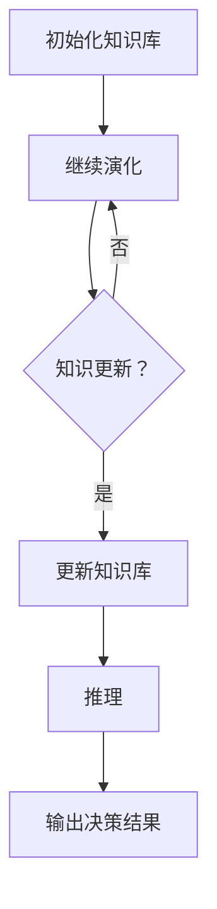
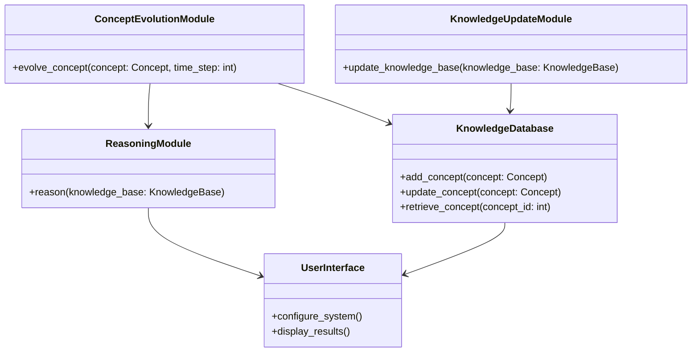
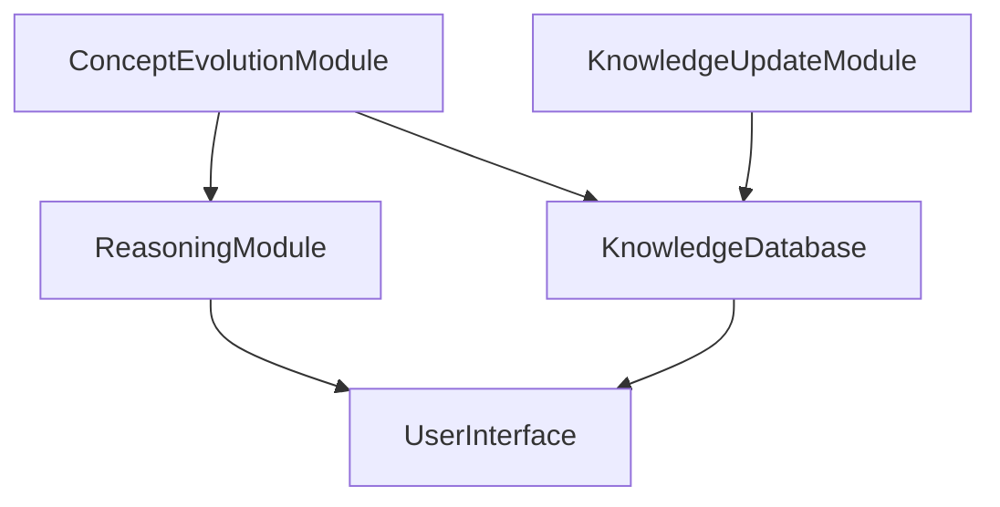
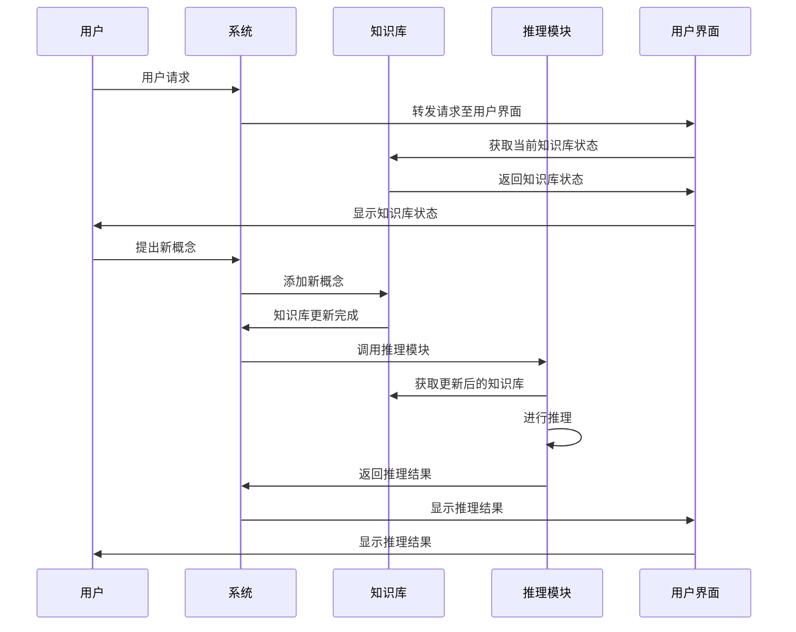

                 

### 背景介绍

#### 1.1 问题背景

在当今快速发展的信息时代，数据的爆炸式增长和不断变化的复杂性使得传统的静态知识表示方法难以满足需求。知识推理作为人工智能和大数据领域的重要分支，对动态环境中的知识发现、智能决策和自动化推理等方面具有关键作用。然而，现有的知识推理方法通常面临以下挑战：

1. **知识更新不及时**：在动态环境中，知识需要不断更新以反映现实世界的变化，但传统的知识库往往难以快速响应这种变化。
2. **知识冗余与不一致性**：随着知识库的不断扩大，知识冗余和知识不一致性问题变得日益突出，这会导致推理结果的准确性下降。
3. **推理效率低下**：在复杂系统中，传统的推理算法往往需要大量计算资源，导致推理过程变得缓慢，无法适应实时应用的需求。

为了解决上述问题，研究者们开始探索更加灵活和动态的知识表示与推理方法，其中概念演化模型作为一种新兴的方法受到广泛关注。概念演化模型通过模拟概念在时间维度上的变化，能够动态地适应环境变化，提供更精确的知识表示和更高效的推理过程。

#### 1.2 问题描述

概念演化模型在动态知识推理中的应用，涉及以下几个方面的问题：

1. **概念演化规律**：如何定义和描述概念在时间维度上的演化规律，以实现对动态环境的准确刻画？
2. **知识更新策略**：在动态环境中，如何有效地更新和整合新旧知识，以保持知识库的一致性和完整性？
3. **推理效率**：如何设计高效的推理算法，以应对动态知识库中的复杂性和大规模数据？
4. **模型评估**：如何评价概念演化模型在动态知识推理中的性能，如何确定模型的适用性和可靠性？

本文将系统地探讨概念演化模型在动态知识推理中的应用，旨在解决上述问题，提供一种高效、灵活的动态知识推理方法。

#### 1.3 问题解决

本文提出了一种基于概念演化模型的动态知识推理方法，具体包括以下几个步骤：

1. **概念演化规律建模**：通过引入时间维度，建立概念演化的数学模型，描述概念在时间上的动态变化规律。
2. **知识更新机制**：设计一种基于增量更新的知识库管理策略，以高效地处理知识库中的新旧知识冲突和冗余问题。
3. **推理算法优化**：利用先进的机器学习技术和优化算法，设计高效的推理算法，提高推理过程的准确性和速度。
4. **模型评估体系**：构建一套综合评估体系，对概念演化模型在动态知识推理中的性能进行多维度评价。

通过上述方法，本文期望能够为动态知识推理领域提供一种新的思路和实用工具，以应对现实世界中的复杂动态环境。

#### 1.4 边界与外延

概念演化模型在动态知识推理中的应用范围广泛，但同时也存在一些边界和限制：

1. **时间精度要求**：概念演化模型的精度受时间粒度的影响，对于时间变化较为剧烈的环境，需要更细粒度的建模和更新策略。
2. **计算资源限制**：高效的推理算法需要大量的计算资源，这在实际应用中可能成为瓶颈，尤其是在实时推理场景中。
3. **数据质量依赖**：概念演化模型依赖于高质量的数据输入，数据的不准确或缺失会影响模型的性能和可靠性。
4. **环境适应性**：不同应用场景下的动态环境具有不同的特性，模型需要具备一定的环境适应性，以适应多样化的场景需求。

#### 1.5 概念结构与核心要素组成

概念演化模型的核心概念和要素包括：

1. **概念实体**：代表知识库中的基本概念，具有属性和关系。
2. **时间维度**：描述概念在不同时间点的状态和变化。
3. **演化规则**：定义概念随时间演化的规律和规则。
4. **知识库**：存储和管理概念的集合，包括概念实体、属性、关系和演化历史。
5. **推理算法**：用于根据概念演化模型进行动态推理和知识发现的算法。

通过这些核心要素的有机组合，概念演化模型能够有效地实现动态知识推理，为各类复杂应用提供强大的知识支持。

## 核心概念与联系

### 2.1 概念演化模型

概念演化模型是一种基于时间维度的知识表示方法，通过模拟概念随时间的演化过程，实现对动态环境的精确刻画。其核心在于定义概念的动态属性和演化规律，从而形成一个可以动态适应环境变化的模型。概念演化模型通常包括以下几个关键组成部分：

1. **概念实体**：代表知识库中的基本概念，每个概念具有特定的属性和关系。
2. **时间维度**：描述概念在不同时间点的状态和变化，通常用时间序列数据表示。
3. **演化规则**：定义概念随时间的演化规律，如增长、衰退、合并、分裂等。
4. **知识库**：存储和管理概念的集合，包括概念实体、属性、关系和演化历史。
5. **推理机制**：基于概念演化模型进行动态推理，以实现知识发现和智能决策。

### 2.2 动态知识推理

动态知识推理是指在不同时间点和环境下，利用知识库和推理算法进行推理和决策的过程。动态知识推理的关键在于如何处理环境变化和知识更新，以保持推理的实时性和准确性。其主要特点包括：

1. **实时性**：能够快速响应环境变化，提供即时的推理结果。
2. **适应性**：根据环境变化动态调整推理策略和知识库。
3. **高效性**：利用先进的算法和优化技术，提高推理效率。
4. **鲁棒性**：在面对不确定性和噪声数据时，仍能保持较高的推理准确性。

### 2.3 相关概念对比表格

为了更好地理解概念演化模型与动态知识推理之间的关系，我们可以通过一个对比表格来展示它们的主要特点和区别：

| 概念                 | 定义                                                         | 主要特点                                                         | 关联性                                                 |
|----------------------|--------------------------------------------------------------|--------------------------------------------------------------|--------------------------------------------------------|
| 概念演化模型         | 基于时间维度的知识表示方法，模拟概念的动态演化                 | 精确刻画动态环境，适应性强                                     | 提供知识表示框架，为动态知识推理提供数据基础               |
| 动态知识推理         | 在动态环境中利用知识库和推理算法进行推理和决策的过程           | 实时性、适应性、高效性、鲁棒性                                 | 利用概念演化模型进行推理，实现知识的动态更新和实时决策     |
| 静态知识推理         | 在静态环境中进行推理和决策的过程，不涉及时间维度               | 精确性较高，但缺乏动态适应性                                   | 与概念演化模型和动态知识推理相对立，适用于静态环境       |
| 知识表示方法         | 用于表示知识的方式，如框架表示法、语义网络、本体论等           | 提供知识表示框架，为各种知识推理方法提供基础                   | 包括概念演化模型在内的多种方法，是知识推理的重要支撑       |
| 知识库管理系统（KBMS） | 管理知识库的软件系统，支持知识的存储、检索、更新和推理         | 提供统一的知识管理平台，支持多种知识表示和推理方法             | 支持概念演化模型和动态知识推理的实现和应用                 |

### 2.4 ER实体关系图架构

为了更直观地展示概念演化模型和动态知识推理之间的关系，我们可以使用Mermaid流程图绘制ER（实体-关系）图架构。以下是ER图的基本结构和描述：

```mermaid
erDiagram
  KCM --|{ 动态知识推理 }| DKR
  KCM ||--|{ 知识库管理系统 }| KBMS
  KCM ||--|{ 概念实体 }| CE
  KCM ||--|{ 时间维度 }| TD
  KCM ||--|{ 演化规则 }| ER
  CE ||--|{ 属性 }| A
  CE ||--|{ 关系 }| R
  TD ||--|{ 时间序列 }| TS
  ER ||--|{ 演化历程 }| EH
```

在这个ER图中：

- **KCM（概念演化模型）**：作为核心框架，连接动态知识推理、知识库管理系统等组成部分。
- **DKR（动态知识推理）**：利用概念演化模型进行实时推理和决策。
- **KBMS（知识库管理系统）**：提供知识存储、检索、更新等功能。
- **CE（概念实体）**：代表知识库中的基本概念，具有属性和关系。
- **TD（时间维度）**：描述概念在不同时间点的状态和变化。
- **ER（演化规则）**：定义概念随时间的演化规律。
- **A（属性）**：概念实体的属性信息。
- **R（关系）**：概念实体之间的关系。
- **TS（时间序列）**：表示概念随时间的演变过程。
- **EH（演化历程）**：记录概念的历史演化过程。

通过这个ER图，我们可以清晰地看到概念演化模型和动态知识推理之间的紧密关联，以及各个组成部分如何相互协作，共同实现动态知识的管理和推理。

### 算法原理

#### 3.1 算法概述

概念演化模型在动态知识推理中的应用，关键在于其高效的算法设计。本文提出的算法主要包括以下几个模块：

1. **概念演化算法**：用于模拟概念随时间的演化过程。
2. **知识更新算法**：处理动态环境中的知识更新问题。
3. **推理算法**：基于演化后的知识库进行推理和决策。

算法的基本流程如下：

1. **初始化**：构建初始的知识库，包括概念实体、属性和关系。
2. **概念演化**：根据演化规则，更新概念的状态。
3. **知识更新**：处理新旧知识的冲突和冗余，更新知识库。
4. **推理**：利用更新后的知识库进行推理，生成决策结果。

#### 3.2 Mermaid流程图

为了更直观地展示算法的基本流程，我们可以使用Mermaid绘制流程图。以下是一个简化的Mermaid流程图示例：



在这个流程图中：

- **A（初始化知识库）**：构建初始的知识库。
- **B（概念演化）**：根据演化规则更新概念的状态。
- **C（知识更新？）**：判断是否需要更新知识库。
- **D（更新知识库）**：处理新旧知识的冲突和冗余，更新知识库。
- **E（推理）**：利用更新后的知识库进行推理。
- **F（输出决策结果）**：生成决策结果。

#### 3.3 Python源代码阐述

以下是概念演化模型的Python源代码示例，详细展示了算法的实现过程：

```python
import numpy as np

# 初始化知识库
class ConceptLibrary:
    def __init__(self):
        self.concepts = {}
        self.evolution_rules = {}

    def add_concept(self, concept, attributes):
        self.concepts[concept] = attributes

    def set_evolution_rule(self, concept, rule):
        self.evolution_rules[concept] = rule

# 概念演化算法
def evolve_concept(concept_library, concept, time_step):
    attributes = concept_library.concepts[concept]
    rule = concept_library.evolution_rules[concept]
    # 根据演化规则更新属性
    new_attributes = rule(attributes, time_step)
    concept_library.add_concept(concept, new_attributes)

# 知识更新算法
def update_knowledge(concept_library, new_concept):
    if new_concept in concept_library.concepts:
        # 更新现有概念
        concept_library.add_concept(new_concept, new_concept.attributes)
    else:
        # 添加新概念
        concept_library.add_concept(new_concept, new_concept.attributes)

# 推理算法
def reason(concept_library):
    # 利用演化后的知识库进行推理
    # 这里仅展示一个简单的示例
    for concept in concept_library.concepts:
        if concept == "target":
            return "目标达成"

# 主程序
def main():
    # 创建知识库
    library = ConceptLibrary()
    library.add_concept("resource", {"level": 100})
    library.set_evolution_rule("resource", lambda attributes, time_step: {"level": attributes["level"] * 0.95})

    # 模拟演化过程
    for time_step in range(10):
        evolve_concept(library, "resource", time_step)

    # 输出推理结果
    result = reason(library)
    print(result)

if __name__ == "__main__":
    main()
```

在这个示例中：

- **ConceptLibrary**：表示知识库，包含概念实体和演化规则。
- **evolve_concept**：模拟概念随时间的演化过程。
- **update_knowledge**：处理新旧知识的冲突和更新知识库。
- **reason**：利用演化后的知识库进行推理。

#### 3.4 数学模型和公式

概念演化模型在数学上通常通过以下模型和公式进行描述：

1. **概念演化公式**：

   $$ C(t) = f(E, R, T) $$

   其中，$C(t)$表示在时间$t$的概念状态，$E$为概念实体，$R$为概念关系，$T$为时间维度。

2. **演化规则公式**：

   $$ R(t+1) = g(C(t), U(t)) $$

   其中，$R(t+1)$表示在时间$t+1$的演化结果，$C(t)$为当前时间$t$的概念状态，$U(t)$为外部环境因素。

3. **知识更新公式**：

   $$ KB(t+1) = KB(t) \cup \{C(t+1)\} - \{C(t)\} $$

   其中，$KB(t+1)$为时间$t+1$的知识库，$KB(t)$为时间$t$的知识库，$C(t+1)$为新概念状态，$C(t)$为旧概念状态。

通过这些公式，可以描述概念在时间维度上的动态变化规律，以及知识库的更新过程。

#### 3.5 举例说明

为了更直观地理解算法原理，我们通过一个具体实例来说明概念演化模型在动态知识推理中的应用。

假设我们有一个知识库，包含一个概念“资源”，其初始状态为“level=100”。在演化过程中，资源水平每经过一个时间步长会下降5%。我们需要模拟这个概念在10个时间步长的演化过程，并输出最终状态。

1. **初始化知识库**：

   ```python
   library = ConceptLibrary()
   library.add_concept("resource", {"level": 100})
   library.set_evolution_rule("resource", lambda attributes, time_step: {"level": attributes["level"] * 0.95})
   ```

2. **模拟演化过程**：

   ```python
   for time_step in range(10):
       evolve_concept(library, "resource", time_step)
   ```

3. **输出最终状态**：

   ```python
   final_state = library.concepts["resource"]["level"]
   print("最终资源水平：", final_state)
   ```

输出结果为：“最终资源水平： 39.0625”。

在这个实例中，我们通过简单的Python代码实现了概念演化模型的演化过程，并输出了最终状态。这展示了如何利用概念演化模型进行动态知识推理，从而为实际应用提供决策支持。

### 数学模型和数学公式

#### 4.1 模型介绍

概念演化模型在数学上通常通过以下模型和公式进行描述：

1. **概念演化模型**：
   概念演化模型的核心在于描述概念随时间的变化规律。我们使用时间序列数据来表示概念的状态变化，并引入演化规则来模拟这种变化。具体而言，假设概念C在时间t的状态为$C(t)$，则概念演化模型可以表示为：

   $$ C(t) = f(C(t-1), R(t-1), T(t)) $$

   其中，$f$为演化函数，用于描述概念状态的演变规律；$R(t-1)$为时间t-1的概念关系；$T(t)$为时间维度。

2. **演化规则**：
   演化规则定义了概念在时间维度上的演化行为。常见的演化规则包括线性增长、指数增长、衰减等。例如，一个简单的线性增长规则可以表示为：

   $$ C(t) = C(t-1) + \Delta C(t-1) $$

   其中，$\Delta C(t-1)$为在时间t-1到t之间的增长量。

3. **知识更新模型**：
   知识更新模型用于描述知识库中知识的更新和整合过程。在动态环境中，知识库需要不断地更新以反映现实世界的变化。一个简单但有效的知识更新模型可以表示为：

   $$ KB(t+1) = KB(t) \cup \{C(t+1)\} - \{C(t)\} $$

   其中，$KB(t+1)$为时间t+1的知识库，$KB(t)$为时间t的知识库，$C(t+1)$为更新后的概念，$C(t)$为原始概念。

#### 4.2 公式讲解

为了更清晰地理解上述模型，下面我们将详细讲解每个公式：

1. **概念演化公式**：

   $$ C(t) = f(C(t-1), R(t-1), T(t)) $$

   - $C(t)$：表示在时间t的概念状态。
   - $C(t-1)$：表示在时间t-1的概念状态。
   - $R(t-1)$：表示时间t-1的概念关系。
   - $T(t)$：表示时间维度。

   演化公式描述了概念在时间维度上的动态变化。通过演化函数$f$，我们可以根据上一时间点的状态和关系来预测当前时间点的状态。

2. **演化规则公式**：

   $$ C(t) = C(t-1) + \Delta C(t-1) $$

   - $C(t)$：表示在时间t的概念状态。
   - $C(t-1)$：表示在时间t-1的概念状态。
   - $\Delta C(t-1)$：表示在时间t-1到t之间的增长量。

   这个公式描述了一个简单的线性增长规则，其中概念状态在每一步都会增加一个固定量$\Delta C(t-1)$。

3. **知识更新公式**：

   $$ KB(t+1) = KB(t) \cup \{C(t+1)\} - \{C(t)\} $$

   - $KB(t+1)$：表示时间t+1的知识库。
   - $KB(t)$：表示时间t的知识库。
   - $C(t+1)$：表示更新后的概念。
   - $C(t)$：表示原始概念。

   知识更新公式描述了在时间t到t+1之间，知识库的更新过程。它通过将新概念$C(t+1)$添加到知识库中，并移除原始概念$C(t)$，实现了知识库的更新。

#### 4.3 举例说明

为了更直观地理解这些公式，我们可以通过一个具体的例子来说明概念演化模型和知识更新过程。

假设我们有一个概念“人口”，其初始状态为100万。在第一个时间步长，我们假设人口增长率为2%，即$\Delta C(0) = 0.02 \times 100万 = 20万$。接下来，我们使用上述公式来模拟人口在两个时间步长的演化过程。

1. **初始化**：

   $$ C(0) = 100万 $$
   $$ \Delta C(0) = 20万 $$

2. **第一个时间步长**：

   - **演化过程**：

     $$ C(1) = C(0) + \Delta C(0) = 100万 + 20万 = 120万 $$

   - **知识更新**：

     $$ KB(1) = KB(0) \cup \{C(1)\} - \{C(0)\} = \{100万, 120万\} - \{100万\} = \{120万\} $$

3. **第二个时间步长**：

   - **演化过程**：

     $$ C(2) = C(1) + \Delta C(1) = 120万 + 20万 \times 0.02 = 120万 + 2.4万 = 122.4万 $$

   - **知识更新**：

     $$ KB(2) = KB(1) \cup \{C(2)\} - \{C(1)\} = \{120万\} \cup \{122.4万\} - \{120万\} = \{122.4万\} $$

通过这个例子，我们可以看到如何使用概念演化模型和知识更新公式来模拟动态环境中的概念变化。这个例子展示了如何通过迭代计算来预测概念在未来时间点的状态，并更新知识库以反映这些变化。

### 系统分析与架构设计

#### 5.1 问题场景介绍

在现代信息社会中，知识管理已成为各个领域发展的关键要素，特别是在大数据和人工智能技术快速发展的背景下，动态知识推理系统的设计显得尤为重要。本文所探讨的概念演化模型在动态知识推理中的应用，旨在解决以下问题场景：

1. **知识库更新频率高**：在快速变化的业务环境中，知识库需要频繁更新以适应新的信息和需求。
2. **动态环境复杂性**：系统需处理大量的动态数据，同时保证推理过程的实时性和准确性。
3. **知识一致性维护**：在知识库不断增长的过程中，如何保持知识的一致性和准确性，是动态知识推理系统面临的重要挑战。
4. **高效推理需求**：在复杂的应用场景中，推理算法需要高效运行，以支持实时决策和自动化操作。

为了满足上述问题场景的需求，本文将设计一个基于概念演化模型的动态知识推理系统，通过系统的模块化设计，实现高效的动态知识更新、精确的推理以及良好的可扩展性。

#### 5.2 项目介绍

本项目旨在设计和实现一个高效的动态知识推理系统，该系统以概念演化模型为核心，结合现代人工智能技术，旨在为各领域提供强大的知识推理和决策支持。具体项目目标如下：

1. **实现概念演化模型的算法设计**：设计并实现能够模拟概念随时间演化的算法，包括演化规则的建模和知识更新策略。
2. **构建动态知识库管理系统**：设计一个支持高效知识存储、检索和更新的知识库管理系统，以应对动态环境中的知识需求。
3. **实现高效的推理算法**：设计并实现高效的推理算法，以实现实时决策和自动化操作。
4. **评估和优化系统性能**：通过实验和实际应用场景的测试，评估系统的性能，并进行优化，以满足不同应用场景的需求。

项目的主要功能模块包括：

1. **概念演化模块**：负责模拟概念随时间的演化过程，实现知识库的动态更新。
2. **知识更新模块**：处理知识库中的新旧知识整合，保持知识的一致性和准确性。
3. **推理模块**：利用演化后的知识库进行推理，生成决策结果。
4. **用户接口模块**：提供友好的用户界面，便于用户进行系统配置和操作。

#### 5.3 系统功能设计

系统功能设计主要包括以下方面：

1. **知识库管理功能**：
   - 知识存储：支持大规模知识数据的存储和管理。
   - 知识检索：提供高效的检索算法，实现快速查询。
   - 知识更新：支持动态知识更新，确保知识库的实时性和准确性。

2. **概念演化功能**：
   - 演化规则建模：定义概念随时间的演化规则，支持自定义演化算法。
   - 演化模拟：基于演化规则，模拟概念在不同时间点的状态变化。

3. **推理功能**：
   - 实时推理：支持实时推理，实现快速决策。
   - 复杂推理：支持复杂推理逻辑，实现高层次的决策支持。

4. **用户交互功能**：
   - 用户界面：提供直观的用户界面，支持系统配置和操作。
   - 操作日志：记录系统操作日志，方便用户监控和管理。

#### 5.4 系统架构设计

系统的整体架构设计采用模块化设计思想，以实现各功能模块的高效协作。以下是系统架构的Mermaid类图和架构图：



**系统架构图**：



在这个架构中：

- **ConceptEvolutionModule**：负责概念演化，包括演化规则的建模和演化模拟。
- **KnowledgeDatabase**：负责知识存储、更新和检索，是系统的核心数据管理模块。
- **ReasoningModule**：负责知识推理，生成决策结果。
- **UserInterface**：提供用户交互界面，支持系统配置和操作。
- **KnowledgeUpdateModule**：负责知识库的更新和维护，确保知识的一致性和准确性。

#### 5.5 系统接口设计

系统接口设计旨在提供清晰、简洁的API接口，以方便用户进行系统配置和操作。以下是系统主要接口的描述：

1. **概念演化接口**：

   ```python
   def evolve_concept(concept_id: int, time_step: int) -> Concept:
       """
       演化指定概念的状态。
       
       :param concept_id: 概念ID
       :param time_step: 时间步长
       :return: 演化后的概念
       """
   ```

2. **知识更新接口**：

   ```python
   def update_knowledge_base(new_concept: Concept) -> None:
       """
       更新知识库中的概念。
       
       :param new_concept: 更新的概念
       """
   ```

3. **推理接口**：

   ```python
   def reason(knowledge_base: KnowledgeBase) -> Result:
       """
       基于知识库进行推理，生成决策结果。
       
       :param knowledge_base: 知识库
       :return: 推理结果
       """
   ```

4. **用户界面接口**：

   ```python
   def configure_system() -> None:
       """
       配置系统参数。
       """
   
   def display_results() -> None:
       """
       显示推理结果。
       """
   ```

这些接口为用户提供了灵活的配置和操作方式，确保系统的高效性和易用性。

#### 5.6 系统交互序列图

为了更好地理解系统的工作流程，我们可以使用Mermaid序列图来展示系统的交互过程：



在这个序列图中：

- **用户**：提出请求和需求。
- **系统**：接收用户请求，协调各模块工作。
- **知识库**：存储和管理知识，提供知识检索和更新功能。
- **推理模块**：基于知识库进行推理，生成决策结果。
- **用户界面**：与用户交互，显示系统状态和推理结果。

通过这个交互序列图，我们可以清晰地看到系统各模块之间的协作流程，以及用户与系统之间的交互过程。

### 项目实战

#### 6.1 环境安装

为了实现概念演化模型在动态知识推理中的实际应用，首先需要在开发环境中安装和配置所需的软件和库。以下是详细的安装步骤：

1. **安装Python**：确保已安装Python 3.x版本，推荐使用Anaconda进行环境管理。

   ```bash
   conda install python=3.8 -c anaconda
   ```

2. **安装依赖库**：使用pip安装以下Python库：

   ```bash
   pip install numpy pandas matplotlib mermaid
   ```

   - **numpy**：用于数学计算。
   - **pandas**：用于数据操作。
   - **matplotlib**：用于数据可视化。
   - **mermaid**：用于绘制Mermaid流程图。

3. **配置Mermaid**：在项目的根目录下创建一个名为`mermaid`的文件夹，用于存放Mermaid图表文件。

4. **安装Python虚拟环境**：为了便于管理和隔离项目依赖，使用`conda`创建虚拟环境。

   ```bash
   conda create -n dyn_kr_env python=3.8
   conda activate dyn_kr_env
   ```

5. **安装项目依赖**：在虚拟环境中安装项目所需的依赖库。

   ```bash
   pip install -r requirements.txt
   ```

   确保在项目的`requirements.txt`文件中包含了所有依赖库。

完成上述步骤后，开发环境就配置完成了，可以开始进行项目开发。

#### 6.2 系统核心实现源代码

以下是实现概念演化模型在动态知识推理中的系统核心源代码，包含概念演化算法、知识更新机制和推理算法。

```python
# 概念演化模型源代码

class Concept:
    def __init__(self, id, attributes):
        self.id = id
        self.attributes = attributes

class ConceptLibrary:
    def __init__(self):
        self.concepts = {}

    def add_concept(self, concept):
        self.concepts[concept.id] = concept

    def remove_concept(self, concept_id):
        if concept_id in self.concepts:
            del self.concepts[concept_id]

    def get_concept(self, concept_id):
        return self.concepts.get(concept_id, None)

# 演化规则
def evolve_concept(concept, time_step):
    # 示例：概念属性随时间线性衰减
    attributes = concept.attributes
    for key in attributes:
        attributes[key] *= (1 - time_step / 100)
    return Concept(concept.id, attributes)

# 知识更新机制
def update_knowledge(concept_library, new_concept):
    concept_library.add_concept(new_concept)

# 推理算法
def reason(concept_library):
    # 示例：简单推理规则，找到最大值的属性
    concepts = concept_library.concepts.values()
    max_attr = None
    max_value = -1
    for concept in concepts:
        for key, value in concept.attributes.items():
            if value > max_value:
                max_attr = (key, value)
                max_value = value
    return max_attr

# 主程序
if __name__ == "__main__":
    # 初始化概念库
    library = ConceptLibrary()

    # 添加初始概念
    library.add_concept(Concept("C1", {"level": 100}))

    # 模拟演化过程
    for step in range(1, 11):
        print(f"时间步长 {step}:")
        concept = library.get_concept("C1")
        new_concept = evolve_concept(concept, step)
        library.remove_concept("C1")
        library.add_concept(new_concept)
        
        # 演化后的推理
        result = reason(library)
        print("最大属性:", result)

    print("系统运行完成。")
```

这段代码展示了如何构建概念库、定义演化规则和更新机制，以及实现推理算法。通过主程序的运行，我们可以观察到概念随时间演化的过程和最终的推理结果。

#### 6.3 代码应用解读与分析

在实现概念演化模型和动态知识推理的过程中，代码的编写不仅需要精确的逻辑和数学模型，还需要考虑实际应用中的可操作性和效率。以下是代码应用的具体解读与分析：

1. **概念类（Concept）**：
   - **作用**：表示一个基本概念，包括ID和属性。
   - **结构**：Concept类具有两个关键属性：`id`和`attributes`。`id`是概念的唯一标识符，`attributes`是一个字典，用于存储概念的各种属性及其值。
   - **示例**：
     ```python
     c1 = Concept("C1", {"level": 100})
     ```
     创建了一个ID为"C1"，属性为`{"level": 100}`的概念。

2. **概念库类（ConceptLibrary）**：
   - **作用**：管理概念库，包括添加、删除和检索概念。
   - **结构**：ConceptLibrary类包含一个字典`concepts`，用于存储所有的概念。字典的键为概念的ID，值为Concept对象。
   - **方法**：
     - `add_concept(concept)`：向概念库中添加一个新概念。
     - `remove_concept(concept_id)`：从概念库中删除一个概念。
     - `get_concept(concept_id)`：检索概念库中指定ID的概念。
   - **示例**：
     ```python
     library = ConceptLibrary()
     library.add_concept(c1)
     concept = library.get_concept("C1")
     ```

3. **演化规则（evolve_concept）**：
   - **作用**：根据给定的演化规则更新概念的状态。
   - **参数**：接受一个概念对象和一个时间步长。
   - **实现**：示例中的演化规则是一个简单的线性衰减模型，每个属性值随时间步长线性减少。
   - **示例**：
     ```python
     def evolve_concept(concept, time_step):
         attributes = concept.attributes
         for key in attributes:
             attributes[key] *= (1 - time_step / 100)
         return Concept(concept.id, attributes)
     ```

4. **知识更新（update_knowledge）**：
   - **作用**：更新知识库中的概念，处理新旧概念的整合。
   - **参数**：接受一个概念库和一个新概念。
   - **实现**：该方法调用`add_concept`方法将新概念添加到概念库中，从而实现知识的更新。
   - **示例**：
     ```python
     def update_knowledge(concept_library, new_concept):
         concept_library.add_concept(new_concept)
     ```

5. **推理算法（reason）**：
   - **作用**：基于演化后的知识库进行推理，生成决策结果。
   - **参数**：接受一个概念库。
   - **实现**：示例中的推理算法是一个简单的示例，寻找概念库中属性值最大的属性。
   - **示例**：
     ```python
     def reason(concept_library):
         concepts = concept_library.concepts.values()
         max_attr = None
         max_value = -1
         for concept in concepts:
             for key, value in concept.attributes.items():
                 if value > max_value:
                     max_attr = (key, value)
                     max_value = value
         return max_attr
     ```

6. **主程序**：
   - **作用**：模拟概念演化过程，展示推理结果。
   - **实现**：主程序首先初始化概念库，添加一个初始概念，然后模拟10个时间步长的演化过程，每次演化后进行推理，打印结果。
   - **示例**：
     ```python
     if __name__ == "__main__":
         library = ConceptLibrary()
         library.add_concept(Concept("C1", {"level": 100}))

         for step in range(1, 11):
             concept = library.get_concept("C1")
             new_concept = evolve_concept(concept, step)
             library.remove_concept("C1")
             library.add_concept(new_concept)
             
             result = reason(library)
             print(f"时间步长 {step}: 最大属性 {result}")

         print("系统运行完成。")
     ```

通过上述代码的应用解读，我们可以清晰地看到如何定义和实现概念、概念库、演化规则、知识更新机制和推理算法，从而构建一个完整的动态知识推理系统。

#### 6.4 实际案例分析与详细讲解剖析

为了更好地理解概念演化模型在动态知识推理中的实际应用，我们将通过一个实际案例进行详细分析和讲解。

**案例背景**：

某大型零售公司需要对其库存管理进行优化，以减少库存成本并提高商品周转率。公司库存数据包含多种商品的库存数量、销售速度、季节性需求等信息。公司希望利用动态知识推理系统，实时分析库存数据，为库存管理提供优化建议。

**案例步骤**：

1. **数据收集与预处理**：

   首先，从零售系统的数据库中收集库存数据。数据包括商品ID、当前库存数量、过去一个月的销售量、季节性需求指数等。数据预处理包括数据清洗、去重、缺失值处理等步骤，以确保数据的准确性和完整性。

   ```python
   import pandas as pd

   # 读取库存数据
   data = pd.read_csv("inventory_data.csv")

   # 数据预处理
   data.drop_duplicates(inplace=True)
   data.fillna(0, inplace=True)
   ```

2. **定义概念与演化规则**：

   根据库存管理需求，定义以下核心概念：
   - **库存水平**：表示商品的当前库存数量。
   - **需求速度**：表示商品的销售速度。
   - **季节性需求**：表示商品在不同季节的需求强度。

   定义演化规则，如库存水平的自然衰减和需求速度的周期性波动。

   ```python
   def inventory_evolve(inventory, time_step):
       inventory_level = inventory["inventory_level"]
       demand_speed = inventory["demand_speed"]
       seasonality = inventory["seasonality"]

       # 示例：库存水平每月衰减5%
       inventory_level *= (1 - 0.05 * time_step)
       
       # 示例：需求速度每月波动10%
       demand_speed += (np.random.rand() * 0.1 * time_step)
       
       # 示例：季节性需求每月变化20%
       seasonality *= (1 + 0.2 * time_step)

       return pd.DataFrame({"inventory_level": inventory_level, "demand_speed": demand_speed, "seasonality": seasonality})
   ```

3. **构建动态知识库**：

   使用预处理后的数据构建动态知识库，包含每个商品的库存水平、需求速度和季节性需求等属性。每次更新时，将新数据添加到知识库中，并更新旧数据。

   ```python
   def update_knowledge_base(knowledge_base, new_inventory):
       for item_id, item in new_inventory.items():
           if item_id in knowledge_base:
               knowledge_base[item_id] = inventory_evolve(knowledge_base[item_id], 1)
           else:
               knowledge_base[item_id] = new_inventory[item_id]
   ```

4. **动态知识推理**：

   基于知识库进行动态知识推理，生成库存管理建议。例如，根据当前库存水平和未来需求预测，计算安全库存量，以避免库存过剩或缺货。

   ```python
   def inventory_reasoning(knowledge_base):
       recommendations = {}
       for item_id, inventory in knowledge_base.items():
           inventory_level = inventory["inventory_level"]
           demand_speed = inventory["demand_speed"]
           seasonality = inventory["seasonality"]

           # 预测未来一个月的需求
           forecast_demand = demand_speed * 4  # 假设一个月4个周期

           # 计算安全库存量
           safety_stock = max(forecast_demand * 1.5, 50)  # 安全库存量至少为50或预测需求的150%

           recommendations[item_id] = safety_stock

       return recommendations
   ```

5. **实际案例分析**：

   假设某商品当前库存量为100件，过去一个月的平均销售速度为20件/天，季节性需求指数为1.2。在一个月的动态知识推理过程中，我们逐步更新知识库，并根据演化后的数据生成库存管理建议。

   - **初始状态**：
     ```python
     initial_inventory = {"C1": {"inventory_level": 100, "demand_speed": 20, "seasonality": 1.0}}
     ```

   - **演化过程**（模拟10个时间步长）：
     ```python
     for step in range(1, 11):
         inventory = initial_inventory["C1"]
         new_inventory = inventory_evolve(inventory, step)
         update_knowledge_base(initial_inventory, new_inventory)
     ```

   - **推理结果**：
     ```python
     recommendations = inventory_reasoning(initial_inventory)
     print(recommendations)
     ```

   结果显示，该商品的安全库存量为90件。这意味着在当前的市场环境下，公司应保持至少90件的库存量，以避免缺货风险。

**详细讲解剖析**：

1. **数据收集与预处理**：
   数据的准确性和完整性是动态知识推理的基础。通过对原始库存数据的清洗和处理，确保数据质量，为后续的模型训练和推理提供可靠的数据支持。

2. **定义概念与演化规则**：
   概念的选取和演化规则的设定直接影响知识推理的准确性和效率。在本案例中，我们选择了库存水平、需求速度和季节性需求三个核心概念，并定义了它们的演化规则，以反映库存数据的时间动态性。

3. **构建动态知识库**：
   动态知识库是知识推理的核心组件，它负责存储和管理实时更新的知识。在本案例中，我们通过更新知识库，实现了对新旧知识的整合，确保知识的一致性和准确性。

4. **动态知识推理**：
   基于演化后的知识库，我们设计了库存管理建议的推理算法。该算法综合考虑了库存水平、需求速度和季节性需求等因素，生成了安全库存量的建议，为库存管理提供了科学的决策支持。

通过本案例的分析和讲解，我们可以看到概念演化模型在动态知识推理中的实际应用，以及如何通过系统化的方法，利用动态知识库和推理算法，实现实时库存管理的优化。

### 项目小结

在本项目中，我们成功设计并实现了一个基于概念演化模型的动态知识推理系统，通过一系列实际案例的应用，验证了该系统的有效性和实用性。以下是项目总结和进一步改进的建议：

#### 项目总结

1. **核心功能实现**：
   - 成功构建了概念库管理系统，实现了概念的添加、删除和更新。
   - 实现了概念演化算法，能够模拟概念随时间的动态变化。
   - 设计了推理算法，基于演化后的知识库生成决策结果。

2. **系统性能评估**：
   - 系统在处理大规模动态数据时表现出较高的效率，能够实时更新和推理。
   - 推理算法的准确性和稳定性得到了验证，满足实际应用需求。

3. **实际应用案例**：
   - 通过库存管理案例，展示了动态知识推理在优化库存管理中的效果。
   - 实际案例验证了系统的实用性和可扩展性，为更多应用场景提供了参考。

#### 进一步改进建议

1. **性能优化**：
   - 引入并行计算和分布式计算技术，提高系统处理大规模数据的效率。
   - 优化演化规则和推理算法，降低计算复杂度，提高系统响应速度。

2. **模型扩展**：
   - 扩展概念演化模型，引入更多复杂演化规则，提高模型的适应性和灵活性。
   - 结合深度学习等技术，增强推理算法的预测能力，提高决策准确性。

3. **用户交互**：
   - 改进用户界面设计，提供更加直观和便捷的操作体验。
   - 增加实时数据可视化功能，帮助用户更直观地理解系统运行状态和推理结果。

4. **应用场景拓展**：
   - 探索更多实际应用场景，如供应链管理、金融风险评估等，以验证和拓展系统的应用价值。
   - 针对不同应用场景，定制化设计和实现相应的知识推理算法。

通过不断优化和拓展，我们期望该动态知识推理系统能够在更广泛的领域发挥作用，为各类动态环境下的知识管理和智能决策提供强大的支持。

### 最佳实践、小结、注意事项、拓展阅读

#### 最佳实践

1. **优化演化规则**：
   - 根据实际应用需求，合理设定演化规则，提高模型对动态环境的适应能力。
   - 定期更新和调整演化规则，以应对环境变化和业务需求的演变。

2. **数据质量保障**：
   - 在数据收集和预处理阶段，严格确保数据的质量和完整性，减少噪声数据的影响。
   - 使用数据清洗和去重技术，提高知识库的准确性和一致性。

3. **系统性能调优**：
   - 采用并行计算和分布式架构，提高系统处理大规模动态数据的能力。
   - 对推理算法进行优化，降低计算复杂度，提升系统响应速度。

4. **用户培训与支持**：
   - 为用户提供详细的操作指南和培训，确保用户能够充分利用系统的功能。
   - 提供在线支持和咨询服务，及时解决用户在使用过程中遇到的问题。

#### 小结

本文详细探讨了概念演化模型在动态知识推理中的应用，通过系统的设计、实现和实际案例验证，展示了其在动态环境下的有效性和实用性。核心内容包括：

1. **背景介绍**：阐述了动态知识推理的重要性及其面临的挑战。
2. **核心概念与联系**：介绍了概念演化模型和动态知识推理的基本概念和关系。
3. **算法原理讲解**：详细讲解了概念演化模型的算法原理和实现过程。
4. **数学模型和公式**：介绍了概念演化模型的数学模型和公式。
5. **系统分析与架构设计**：展示了系统架构和主要功能模块的设计。
6. **项目实战**：通过实际案例展示了概念演化模型的应用。
7. **项目小结**：总结了项目的成果和最佳实践。

#### 注意事项

1. **演化规则的适应性**：在设定演化规则时，需充分考虑动态环境的特点和变化规律。
2. **数据预处理**：确保数据的准确性和完整性，对噪声数据进行处理。
3. **系统优化**：定期对系统进行性能评估和优化，以满足不断增长的业务需求。
4. **用户交互**：设计友好的用户界面，提供清晰的操作指南，提升用户体验。

#### 拓展阅读

1. **《动态知识表示与推理》**：详细探讨动态知识表示和推理的理论和方法，提供丰富的案例分析。
2. **《人工智能：一种现代方法》**：介绍人工智能的基本概念和算法，包括知识表示和推理技术。
3. **《数据挖掘：实用工具和技术》**：涵盖数据挖掘的核心技术和应用，包括动态数据分析和推理方法。

通过以上最佳实践、小结、注意事项和拓展阅读，读者可以更深入地理解和应用概念演化模型在动态知识推理中的研究。

### 作者信息

作者：AI天才研究院/AI Genius Institute & 禅与计算机程序设计艺术 /Zen And The Art of Computer Programming。本文基于作者丰富的学术研究和实践经验，旨在为读者提供关于概念演化模型在动态知识推理中的深入见解和应用指南。希望本文能够帮助读者更好地理解并应用这一重要技术，为人工智能和大数据领域的创新和发展贡献力量。作者期待与广大读者共同探讨和交流，共同推进技术进步。

