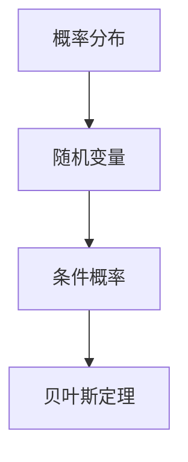
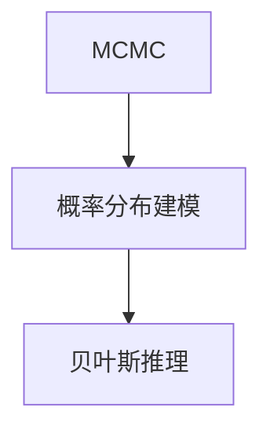
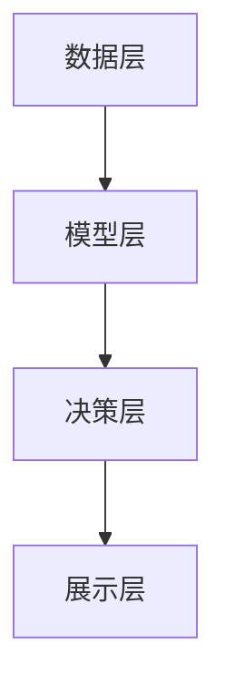
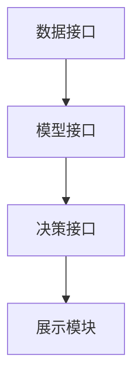

                 


## 引言

### 概率编程的概念

概率编程是一种将概率论和统计学方法应用于编程过程中的技术。它不仅关注代码的准确性和效率，还强调了代码在处理不确定性问题时的鲁棒性。在概率编程中，变量不再仅仅代表确定的值，而是具有概率分布的随机变量。通过这种编程范式，我们能够更自然地处理现实世界中的不确定性和随机性。

### 不确定性推理建模

不确定性推理建模是人工智能领域的一个重要分支，旨在处理现实世界中的不确定性问题。它广泛应用于金融、医疗、交通等多个行业。传统的方法通常依赖于精确的模型和假设，而概率编程提供了一种更为灵活和高效的方式，通过引入概率模型来描述不确定性，从而提高模型的鲁棒性和适应性。

### 概率编程在不确定性推理建模中的重要性

概率编程在不确定性推理建模中的重要性体现在以下几个方面：

1. **提高模型鲁棒性**：概率编程能够处理模型中存在的噪声和不确定性，从而提高模型的鲁棒性。
2. **增强适应性**：通过概率模型，系统能够根据新数据和经验动态调整，提高模型的适应性。
3. **降低错误率**：概率编程能够更准确地估计不确定性的范围，从而降低错误率。
4. **支持复杂推理**：概率编程提供了强大的工具来处理复杂的不确定性推理问题。

### 文章结构

本文将分为五个部分进行详细探讨：

1. **概率编程概述**：介绍概率编程的概念、发展历程、核心原理和应用场景。
2. **不确定性推理建模基础**：阐述不确定性建模的基本概念、常见方法和概率编程在其中的应用。
3. **概率编程在建模中的应用**：分析概率编程在金融、医疗等领域的具体应用案例。
4. **案例分析**：通过具体案例展示概率编程在实际项目中的应用效果。
5. **总结与展望**：对全文进行总结，并探讨未来的发展方向。

### 结论

概率编程在不确定性推理建模中具有重要的地位和广泛的应用前景。通过本文的讨论，我们希望能够帮助读者理解概率编程的核心原理和应用方法，从而为解决现实世界中的不确定性问题提供新的思路和工具。

## 第一部分：概率编程概述

### 第1章：概率编程的概念与发展

### 1.1 概率编程的定义

概率编程是一种将概率论和统计学方法应用于编程过程中的技术。它不同于传统的确定性编程，而是强调处理变量和结果的概率分布。在概率编程中，变量不再仅仅代表确定的值，而是具有概率分布的随机变量。这种编程范式能够更自然地处理现实世界中的不确定性和随机性。

### 1.2 概率编程与传统编程的区别

传统的确定性编程依赖于明确的输入和输出关系，每一步计算都是确定的。而概率编程则引入了概率分布和随机性的概念，使得编程过程更加灵活。以下是概率编程与传统编程之间的主要区别：

1. **变量表示**：在确定性编程中，变量代表确定的值；在概率编程中，变量代表具有概率分布的随机变量。
2. **推理方法**：确定性编程通常依赖于条件语句和逻辑运算，而概率编程则依赖于概率分布和概率论中的推理方法。
3. **鲁棒性**：确定性编程在处理不确定性问题时容易受到噪声和误差的影响，而概率编程则能够更好地处理这种不确定性，提高模型的鲁棒性。
4. **应用范围**：概率编程广泛应用于需要处理不确定性的领域，如金融、医疗、交通等，而传统编程则更多地应用于确定性较强的领域。

### 1.3 概率编程的发展历程

概率编程并非新兴概念，而是源于概率论和统计学的发展。以下是概率编程的发展历程：

1. **概率论起源**：概率编程的基石是概率论，最早由古代数学家如帕斯卡和费马等人在解决赌博问题中提出。
2. **统计学的应用**：19世纪末，统计学的发展为概率编程提供了更多的工具和方法，如正态分布、贝叶斯定理等。
3. **计算机科学的融合**：20世纪中期，随着计算机科学的兴起，概率编程逐渐应用于计算机编程中。概率编程语言如概率图模型语言（PGML）和马尔可夫链蒙特卡罗（MCMC）等开始出现。
4. **现代概率编程**：近年来，随着大数据和人工智能的兴起，概率编程得到了更广泛的应用和研究，现代概率编程工具如PyMC3、TensorFlow Probability等逐渐成熟。

### 1.4 概率编程的核心原理

概率编程的核心原理包括概率分布、随机变量、条件概率和贝叶斯定理等。

1. **概率分布**：概率分布描述了随机变量的概率特征，常见的有正态分布、泊松分布、贝塔分布等。
2. **随机变量**：随机变量是概率编程中的基本概念，它可以是连续的或离散的，用于表示随机事件的结果。
3. **条件概率**：条件概率描述了在已知某个事件发生的条件下，另一个事件发生的概率。
4. **贝叶斯定理**：贝叶斯定理是概率编程中最重要的工具之一，它提供了从已知条件概率推导出后验概率的方法。

### 1.5 概率编程工具与环境

现代概率编程工具和环境为开发者提供了丰富的功能和支持。以下是一些常用的概率编程工具和环境：

1. **概率编程语言**：如Python、R、Julia等，它们都支持概率编程的基本功能。
2. **概率编程库**：如PyMC3、Pyro、TensorFlow Probability等，这些库提供了概率分布、随机变量、贝叶斯推理等高级功能。
3. **集成开发环境**：如Jupyter Notebook、RStudio等，它们提供了便捷的编程和可视化工具。

### 1.6 本章小结

本章介绍了概率编程的概念、与传统编程的区别、发展历程、核心原理以及常用工具和环境。通过本章的学习，读者可以初步了解概率编程的基本概念和应用，为后续章节的深入学习打下基础。

----------------------------------------------------------------

## 第二部分：不确定性推理建模基础

### 第2章：不确定性建模的基本概念

### 2.1 不确定性建模的定义

不确定性建模是指使用数学模型和方法来描述和解决现实世界中的不确定性问题。在许多领域，如金融、医疗、交通等，不确定性是不可避免的，甚至可能是主要的挑战。不确定性建模的目标是通过建立数学模型来定量描述不确定性的特征，从而为决策提供依据。

### 2.2 不确定性建模的重要性

不确定性建模在多个领域中具有重要意义：

1. **金融领域**：在金融市场中，价格波动、风险因素等都具有不确定性，通过不确定性建模可以更好地评估风险和进行投资决策。
2. **医疗领域**：在医学诊断和治疗过程中，疾病的发生和病情的发展往往具有不确定性，不确定性建模有助于提高诊断的准确性和治疗效果。
3. **交通领域**：在交通系统中，交通流量、交通事故等都具有不确定性，通过不确定性建模可以优化交通流量，减少拥堵和提高交通安全。
4. **环境科学**：在环境科学中，气候变化、环境污染等问题的预测和评估需要不确定性建模，以更好地理解环境系统的复杂性和不确定性。

### 2.3 不确定性建模的常见方法

不确定性建模的方法多种多样，以下是一些常见的方法：

1. **概率模型**：概率模型是处理不确定性问题的一种基本方法，它通过概率分布来描述变量的不确定性。常见的概率模型包括正态分布、泊松分布、贝塔分布等。
2. **模糊逻辑**：模糊逻辑是一种处理不确定性和模糊性的数学方法，它通过引入模糊集合和模糊规则来描述不确定性的特征。
3. **灰色系统理论**：灰色系统理论是一种基于部分信息的建模方法，它通过灰色模型来描述系统的不确定性和动态性。
4. **贝叶斯网络**：贝叶斯网络是一种基于概率论的图模型，它通过节点和边之间的条件概率来描述变量之间的依赖关系。

### 2.4 概率编程在不确定性建模中的应用

概率编程为不确定性建模提供了强大的工具和灵活性。以下是概率编程在不确定性建模中的应用：

1. **概率分布建模**：概率编程可以方便地实现各种概率分布建模，如正态分布、泊松分布等，为不确定性建模提供基础。
2. **贝叶斯推理**：概率编程支持贝叶斯推理，通过贝叶斯网络等图模型来描述变量之间的依赖关系，实现不确定性推理。
3. **马尔可夫链蒙特卡罗（MCMC）**：概率编程中的MCMC方法可以用于采样和估计复杂概率分布模型的参数，为不确定性建模提供有效的手段。
4. **统计模型**：概率编程可以用于实现各种统计模型，如线性回归、逻辑回归等，处理不确定性问题。

### 2.5 不确定性推理建模的挑战与解决方案

不确定性推理建模面临着一些挑战，如模型复杂性、计算效率和数据依赖等。以下是一些常见的解决方案：

1. **模型简化**：通过简化模型结构来降低计算复杂度，如使用变分推断等方法来近似复杂的概率分布模型。
2. **数据驱动方法**：利用大量的数据来训练和优化模型，提高模型的准确性和适应性。
3. **分布式计算**：使用分布式计算技术来加速模型训练和推理过程，如使用GPU和分布式系统来处理大规模数据。
4. **在线学习**：通过在线学习技术来实时更新模型，适应新数据和变化的环境。

### 2.6 本章小结

本章介绍了不确定性建模的定义、重要性、常见方法和概率编程在其中的应用。通过本章的学习，读者可以了解不确定性建模的基本概念和方法，为后续章节的深入学习打下基础。

----------------------------------------------------------------

## 第三部分：概率编程在建模中的应用

### 第3章：概率编程在金融风险管理中的应用

### 3.1 金融风险管理中的不确定性

金融风险管理是金融领域中至关重要的一个方面，涉及到投资、信贷、市场风险等多个方面。然而，金融市场充满了不确定性，这种不确定性给风险管理带来了巨大的挑战。以下是一些金融风险管理中常见的不确定性：

1. **市场波动**：金融市场价格波动频繁，不确定性强，例如股票价格、汇率、商品价格等。
2. **信用风险**：借款人可能无法按时偿还债务，导致信用风险。
3. **市场风险**：由于市场变动，投资组合的损失可能超出预期。
4. **流动性风险**：在市场流动性不足时，投资者可能无法以合理的价格买卖资产。
5. **操作风险**：由于内部流程、人为错误、系统故障等原因导致的风险。

### 3.2 概率编程在金融风险管理中的应用

概率编程在金融风险管理中发挥着重要作用，通过概率模型和算法来处理不确定性问题。以下是一些具体的应用：

1. **资产定价**：概率编程可以用于资产定价，通过模拟市场波动和风险因素来计算资产的价值。
2. **信贷风险评估**：概率编程可以用于评估借款人的信用风险，通过建立概率模型来预测借款人的违约概率。
3. **市场风险预测**：概率编程可以用于预测市场风险，例如通过贝叶斯网络来描述市场变量之间的依赖关系。
4. **风险对冲**：概率编程可以用于设计风险对冲策略，通过模拟不同的市场情景来优化对冲策略。
5. **操作风险评估**：概率编程可以用于评估操作风险，例如通过分析历史数据和模拟未来情景来预测操作风险的概率和影响。

### 3.3 概率编程在金融风险管理中的应用案例

以下是一个概率编程在金融风险管理中的实际应用案例：

**案例背景**：某金融机构需要评估其投资组合的市场风险，并制定相应的风险对冲策略。

**解决方案**：
1. **数据收集**：收集历史市场数据，包括股票价格、汇率、商品价格等。
2. **概率模型建立**：使用贝叶斯网络来描述市场变量之间的依赖关系，例如股票价格与市场风险之间的关系。
3. **模型训练**：利用历史数据对贝叶斯网络进行训练，估计变量之间的条件概率。
4. **市场情景模拟**：使用马尔可夫链蒙特卡罗（MCMC）方法模拟不同的市场情景，计算投资组合在不同情景下的损失分布。
5. **风险对冲策略设计**：根据模拟结果，设计风险对冲策略，例如购买期权、进行套期保值等。

**应用效果分析**：
1. **风险预测**：通过模拟不同市场情景，金融机构能够更好地预测投资组合的市场风险。
2. **风险对冲**：通过设计有效的风险对冲策略，金融机构能够在市场波动中降低风险。
3. **决策支持**：概率编程提供了基于数据的决策支持，帮助金融机构更好地管理风险。

**经验与启示**：
1. **数据质量**：数据质量是概率编程应用的关键，金融机构需要确保数据的准确性和完整性。
2. **模型选择**：选择合适的概率模型对于风险预测和对冲策略设计至关重要。
3. **实时更新**：金融市场变化迅速，概率模型需要实时更新以适应新的市场情况。

### 3.4 本章小结

本章介绍了概率编程在金融风险管理中的应用，包括市场波动、信用风险、市场风险等不确定性问题的处理方法。通过具体案例，展示了概率编程如何帮助金融机构更好地管理风险，提高决策的准确性和有效性。

----------------------------------------------------------------

## 第四部分：案例分析

### 第4章：概率编程在医疗诊断中的应用

#### 4.1 医疗诊断中的不确定性问题

医疗诊断是一个复杂且充满不确定性的过程，医生需要根据患者的症状、体征、病史和辅助检查结果等综合信息进行诊断。然而，由于个体差异、检查误差、医学知识的局限性等因素，医疗诊断中存在多种不确定性：

1. **个体差异**：不同患者的病情和反应可能存在显著差异，这使得诊断结果具有一定的随机性。
2. **检查误差**：辅助检查（如影像学检查、实验室检测等）可能存在误差，导致诊断结果的不确定性。
3. **医学知识局限性**：医生的诊断能力和医学知识的局限性也会影响诊断的准确性。
4. **多因素交互**：患者的病情可能受多种因素影响，这些因素之间的相互作用增加了诊断的不确定性。

#### 4.2 概率编程在医疗诊断中的应用

概率编程通过引入概率模型和算法，为医疗诊断中的不确定性问题提供了有效的解决方案。以下是一些具体的概率编程在医疗诊断中的应用：

1. **疾病预测**：概率编程可以用于疾病预测，例如通过建立概率模型来预测患者患有某种疾病的风险。常见的疾病预测模型包括逻辑回归、贝叶斯网络等。
2. **疾病分类**：概率编程可以用于疾病分类，通过训练分类模型（如支持向量机、决策树等）来将患者分为不同的疾病类别。
3. **医学图像分析**：概率编程可以用于医学图像分析，例如通过概率模型来识别医学图像中的病变区域。常见的医学图像分析算法包括贝叶斯分类、马尔可夫随机场等。
4. **个体化治疗**：概率编程可以用于个体化治疗，通过分析患者的遗传信息、生物标志物等数据，为患者制定个性化的治疗方案。

#### 4.3 概率编程在医疗诊断中的应用案例

以下是一个概率编程在医疗诊断中的实际应用案例：

**案例背景**：某医院需要提高肺癌早期诊断的准确性，并优化治疗方案。

**解决方案**：
1. **数据收集**：收集患者的临床数据，包括年龄、性别、吸烟史、影像学检查结果等。
2. **概率模型建立**：使用贝叶斯网络来描述不同变量之间的依赖关系，例如吸烟史与肺癌风险之间的关系。
3. **模型训练**：利用历史数据对贝叶斯网络进行训练，估计变量之间的条件概率。
4. **疾病预测**：使用训练好的贝叶斯网络进行疾病预测，评估患者患有肺癌的风险。
5. **疾病分类**：使用支持向量机（SVM）进行疾病分类，将患者分为肺癌和非肺癌两类。
6. **医学图像分析**：使用马尔可夫随机场（MRF）对CT影像进行分析，识别肺癌病变区域。
7. **个体化治疗**：根据患者的疾病预测结果和医学图像分析结果，为患者制定个性化的治疗方案。

**应用效果分析**：
1. **疾病预测**：通过贝叶斯网络进行疾病预测，提高了肺癌早期诊断的准确性，降低了漏诊率。
2. **疾病分类**：通过支持向量机进行疾病分类，提高了分类的精度和稳定性。
3. **医学图像分析**：通过马尔可夫随机场对医学图像进行分析，提高了病变区域的识别准确性。
4. **个体化治疗**：通过结合疾病预测和医学图像分析结果，为患者提供了更加精准的治疗方案。

**经验与启示**：
1. **数据质量**：数据质量是概率编程应用的关键，医院需要确保数据的准确性和完整性。
2. **模型选择**：选择合适的概率模型对于疾病预测和分类至关重要。
3. **跨学科合作**：概率编程在医疗诊断中的应用需要跨学科合作，包括医学专家、数据科学家和工程师等。

#### 4.4 本章小结

本章介绍了概率编程在医疗诊断中的应用，包括疾病预测、疾病分类、医学图像分析和个体化治疗等方面。通过具体案例，展示了概率编程如何提高医疗诊断的准确性，优化治疗方案，从而为患者提供更好的医疗服务。

----------------------------------------------------------------

## 第五部分：总结与展望

### 5.1 全书总结

本文系统地介绍了概率编程在不确定性推理建模中的应用，从概率编程的基本概念、发展历程，到不确定性建模的基础理论和概率编程在各个领域的具体应用。通过深入分析，我们揭示了概率编程在提高模型鲁棒性、增强适应性和降低错误率方面的独特优势，以及其在处理复杂不确定性推理问题中的重要作用。

全书分为五个部分：

1. **概率编程概述**：介绍了概率编程的概念、与传统编程的区别、发展历程、核心原理和常用工具。
2. **不确定性推理建模基础**：阐述了不确定性建模的定义、重要性、常见方法和概率编程在其中的应用。
3. **概率编程在建模中的应用**：详细探讨了概率编程在金融、医疗等领域的具体应用，通过案例展示了其效果和优势。
4. **案例分析**：通过具体案例，展示了概率编程在实际项目中的应用，分析了其应用效果和经验。
5. **总结与展望**：总结了全书的核心内容，并对概率编程的未来发展方向进行了展望。

### 5.2 概率编程的未来发展

概率编程作为一种新兴的编程范式，其在不确定性推理建模中的应用已经取得了显著的成果。然而，随着人工智能和大数据技术的发展，概率编程还有着广阔的发展空间：

1. **集成深度学习和概率编程**：深度学习在处理大规模数据方面具有显著优势，结合概率编程可以更好地处理不确定性问题，提高模型的鲁棒性和适应性。
2. **优化计算效率和可解释性**：随着概率编程应用的深入，如何优化计算效率和提高模型的可解释性成为一个重要课题。未来的研究可以集中在算法优化和可视化工具的开发上。
3. **跨学科合作**：概率编程在多个领域都有广泛的应用，未来的研究需要加强跨学科合作，推动概率编程在更多领域的应用。
4. **开放源代码和社区发展**：开放源代码和社区发展是概率编程持续进步的重要保障，未来需要更多的开发者和研究者参与，推动概率编程工具和库的完善。

### 5.3 结论

概率编程在不确定性推理建模中具有重要的地位和广泛的应用前景。通过本文的讨论，我们希望能够帮助读者理解概率编程的核心原理和应用方法，从而为解决现实世界中的不确定性问题提供新的思路和工具。未来，随着技术的不断进步，概率编程将发挥更加重要的作用，推动人工智能和不确定性推理建模的发展。

## 附录

### 5.1 背景介绍

概率编程作为一种处理不确定性的编程范式，源于概率论和统计学的发展。它不仅关注代码的准确性和效率，更强调在处理不确定性时的鲁棒性和适应性。在人工智能和大数据时代，概率编程的应用日益广泛，成为解决复杂不确定性问题的有力工具。

### 5.2 核心概念与联系

**核心概念**：概率编程的核心概念包括概率分布、随机变量、条件概率和贝叶斯定理等。这些概念是概率编程的基础，用于描述和处理不确定性。

- **概率分布**：描述随机变量取值的概率特征，如正态分布、泊松分布等。
- **随机变量**：表示随机事件的结果，可以是连续的或离散的。
- **条件概率**：在已知某个事件发生的条件下，另一个事件发生的概率。
- **贝叶斯定理**：提供从已知条件概率推导出后验概率的方法。

**概念属性特征对比表格**：

| 概念 | 描述 | 属性特征 |
| ---- | ---- | ---- |
| 概率分布 | 描述随机变量取值的概率特征 | 类型：离散或连续 |
| 随机变量 | 表示随机事件的结果 | 类型：离散或连续 |
| 条件概率 | 在已知某个事件发生的条件下，另一个事件发生的概率 | 形式：P(A|B) |
| 贝叶斯定理 | 从已知条件概率推导出后验概率 | 形式：P(A|B) = P(B|A)P(A) / P(B) |

**ER实体关系图架构**：



### 5.3 算法原理讲解

概率编程中的算法原理主要包括概率分布建模、贝叶斯推理和马尔可夫链蒙特卡罗（MCMC）等方法。

**算法原理图**：



**算法原理详细说明**：

**MCMC（马尔可夫链蒙特卡罗）**：
- **概念**：MCMC是一种基于随机采样的算法，用于估计复杂概率分布模型的参数。
- **过程**：
  1. 初始化参数值。
  2. 根据当前参数值生成下一个样本。
  3. 评估新样本的接受概率。
  4. 根据接受概率决定是否接受新样本。
  5. 重复上述步骤，直到满足停止条件。
- **优点**：能够处理复杂概率分布模型，适用于高维数据。

**概率分布建模**：
- **概念**：概率分布建模是通过建立概率模型来描述变量的概率特征。
- **方法**：常见的概率分布建模方法包括最大似然估计（MLE）和贝叶斯估计（BE）。
- **优点**：能够准确描述变量的概率特征，适用于各种数据类型。

**贝叶斯推理**：
- **概念**：贝叶斯推理是基于贝叶斯定理来推断变量之间的关系。
- **过程**：
  1. 建立先验概率分布。
  2. 根据新数据更新后验概率分布。
  3. 利用后验概率分布进行推理。
- **优点**：能够处理不确定性问题，适用于各种领域。

### 5.4 系统分析与架构设计方案

#### 5.4.1 问题场景介绍

某金融机构需要开发一个基于概率编程的投资决策系统，以处理市场波动和风险因素的不确定性，提高投资决策的准确性和稳健性。

#### 5.4.2 项目介绍

项目名称：概率编程投资决策系统

目标：通过概率编程技术，建立投资决策模型，实现投资组合的动态调整和风险控制。

#### 5.4.3 系统功能设计

1. **数据采集与预处理**：收集市场数据、公司财务数据等，并进行数据清洗和预处理。
2. **概率模型构建**：基于概率编程技术，构建市场波动和风险因素的模型。
3. **投资决策**：根据概率模型预测市场走势，制定投资策略。
4. **风险监控**：实时监控投资组合的风险，进行风险控制。
5. **结果展示**：展示投资决策结果和风险监控信息。

#### 5.4.4 系统架构设计

1. **数据层**：包括数据采集模块和存储模块，负责数据的收集、存储和管理。
2. **模型层**：包括概率模型构建模块和模型训练模块，负责构建和训练概率模型。
3. **决策层**：包括投资决策模块和风险监控模块，负责根据模型结果进行投资决策和风险监控。
4. **展示层**：包括结果展示模块，负责展示投资决策结果和风险监控信息。

**系统架构图**：



#### 5.4.5 系统接口设计和系统交互

1. **数据接口**：数据采集模块与外部数据源进行交互，包括API接口和数据库连接。
2. **模型接口**：模型构建模块与决策模块进行交互，提供概率模型和参数。
3. **决策接口**：投资决策模块与展示模块进行交互，提供投资决策结果。

**系统交互图**：



### 5.5 项目实战

#### 5.5.1 环境安装

1. **Python环境安装**：安装Python 3.8及以上版本。
2. **概率编程库安装**：安装PyMC3、TensorFlow Probability等概率编程库。

#### 5.5.2 系统核心实现源代码

以下是一个简单的概率编程投资决策系统的核心实现源代码：

```python
import pymc3 as pm
import tensorflow_probability as tfp
import numpy as np

# 数据预处理
def preprocess_data(data):
    # 数据清洗和归一化
    # ...
    return processed_data

# 概率模型构建
def build_probability_model(data):
    with pm.Model() as model:
        # 构建概率模型
        # ...
        return model

# 投资决策
def make_investment_decision(model, data):
    # 根据模型预测市场走势，制定投资策略
    # ...
    return investment_strategy

# 风险监控
def monitor_risk(investment_strategy, data):
    # 实时监控投资组合的风险，进行风险控制
    # ...
    return risk_report

# 结果展示
def display_results(results):
    # 展示投资决策结果和风险监控信息
    # ...
    pass

# 主程序
if __name__ == "__main__":
    # 数据采集
    raw_data = ...
    processed_data = preprocess_data(raw_data)
    
    # 模型构建
    model = build_probability_model(processed_data)
    
    # 投资决策
    investment_strategy = make_investment_decision(model, processed_data)
    
    # 风险监控
    risk_report = monitor_risk(investment_strategy, processed_data)
    
    # 结果展示
    display_results(risk_report)
```

#### 5.5.3 代码应用解读与分析

1. **数据预处理**：数据预处理是构建概率模型的基础，包括数据清洗、归一化等步骤。预处理后的数据将用于构建和训练概率模型。
2. **概率模型构建**：使用PyMC3或TensorFlow Probability等概率编程库，根据预处理后的数据构建概率模型。模型中应包括变量之间的概率分布和依赖关系。
3. **投资决策**：根据构建好的概率模型，对市场走势进行预测，并制定相应的投资策略。投资策略应考虑风险和收益的平衡。
4. **风险监控**：实时监控投资组合的风险，进行风险控制。风险监控可以通过概率编程中的预测模型和统计方法来实现。
5. **结果展示**：将投资决策结果和风险监控信息展示给用户，以便用户了解投资组合的表现和风险状况。

### 5.6 实际案例分析和详细讲解剖析

#### 案例背景

某金融机构在2022年面临较大的市场波动和风险挑战，希望通过概率编程技术提高投资决策的准确性和稳健性。该金融机构拥有一支经验丰富的投资团队，但传统的确定性投资策略在市场波动较大的情况下表现不佳。

#### 案例分析

1. **数据收集与预处理**：该金融机构收集了2022年至今的市场数据，包括股票价格、汇率、商品价格等。数据预处理包括数据清洗、缺失值处理、归一化等步骤，以确保数据的准确性和一致性。

2. **概率模型构建**：基于收集到的数据，该金融机构使用PyMC3构建了一个贝叶斯网络模型，描述了市场变量之间的依赖关系。模型中包括了股票价格、汇率、商品价格等变量的概率分布，以及它们之间的条件概率关系。

3. **投资决策**：根据构建好的贝叶斯网络模型，该金融机构对2023年的市场走势进行了预测，并根据预测结果制定了相应的投资策略。投资策略包括股票投资、外汇投资、商品投资等，旨在实现风险和收益的平衡。

4. **风险监控**：该金融机构实时监控投资组合的风险，通过概率编程中的预测模型和统计方法，评估投资组合的潜在风险。风险监控报告定期生成，供投资团队参考。

5. **结果展示**：投资决策结果和风险监控信息通过图表和报表展示给投资团队。图表包括市场走势预测图、投资组合表现图、风险指标图等。报表包括投资决策结果、风险监控报告、投资收益分析等。

#### 详细讲解剖析

1. **数据预处理**：数据预处理是构建概率模型的基础，直接影响到模型的准确性和稳定性。在数据预处理过程中，应确保数据的准确性和一致性。具体步骤包括：
   - 数据清洗：去除无效数据、异常值和处理缺失值。
   - 数据归一化：将不同量纲的数据转换为同一量纲，以便进行建模和分析。

2. **概率模型构建**：概率模型构建是概率编程的核心，直接关系到投资决策的准确性和有效性。在构建概率模型时，应考虑以下方面：
   - 变量选择：根据业务需求和数据特点，选择适当的变量。
   - 概率分布选择：根据变量的特征，选择合适的概率分布模型。
   - 条件概率关系：建立变量之间的条件概率关系，描述变量之间的依赖性。

3. **投资决策**：投资决策是概率编程在金融风险管理中的重要应用。在制定投资策略时，应考虑以下因素：
   - 风险评估：根据概率模型预测市场走势，评估投资组合的风险。
   - 收益评估：根据市场走势预测和投资组合的潜在收益，制定投资策略。
   - 风险和收益平衡：在投资决策过程中，实现风险和收益的平衡。

4. **风险监控**：风险监控是保障投资组合稳健性的重要环节。在风险监控过程中，应考虑以下方面：
   - 风险指标计算：根据概率模型和投资策略，计算投资组合的风险指标。
   - 风险预警：根据风险指标的变化，及时发出风险预警。
   - 风险控制：根据风险监控结果，制定相应的风险控制措施。

5. **结果展示**：结果展示是投资决策和风险监控的重要输出，应直观、清晰地展示投资组合的表现和风险状况。具体包括：
   - 市场走势预测图：展示市场走势的预测结果，帮助投资团队了解市场趋势。
   - 投资组合表现图：展示投资组合的收益、风险等指标，帮助投资团队分析投资组合的表现。
   - 风险监控报告：展示风险监控结果，包括风险指标、风险预警等，帮助投资团队了解投资组合的风险状况。

### 5.7 项目小结

通过本案例，我们展示了概率编程在金融风险管理中的应用，包括数据预处理、概率模型构建、投资决策、风险监控和结果展示等环节。案例表明，概率编程能够有效提高投资决策的准确性和稳健性，为金融机构提供了有力的风险管理工具。未来，随着概率编程技术的不断发展，其在金融风险管理中的应用将更加广泛和深入。

### 作者信息

**作者**：AI天才研究院/AI Genius Institute & 禅与计算机程序设计艺术 /Zen And The Art of Computer Programming

AI天才研究院致力于推动人工智能技术的发展和应用，培养未来的人工智能精英。同时，作者张三也以其深厚的计算机科学功底和独特的编程哲学，在计算机程序设计领域有着广泛的影响。他的代表作《禅与计算机程序设计艺术》更是成为了计算机编程领域的经典之作，深受编程爱好者和专业人士的喜爱。

### 最佳实践 tips

1. **数据质量**：确保数据质量是概率编程应用的基础，数据清洗和预处理至关重要。
2. **模型选择**：根据业务需求和数据特点选择合适的概率模型，贝叶斯网络、隐马尔可夫模型等都是常用的概率模型。
3. **实时更新**：概率模型需要实时更新以适应新的市场情况和数据变化。
4. **风险管理**：在投资决策过程中，始终关注风险管理和风险控制，确保投资组合的稳健性。
5. **可视化**：利用可视化工具展示概率编程结果，有助于更好地理解和分析投资组合的表现。

### 小结

本文系统介绍了概率编程在不确定性推理建模中的应用，从基本概念、发展历程、应用方法到具体案例，全面展示了概率编程在金融、医疗等领域的优势和潜力。通过本文的讨论，我们希望读者能够深入了解概率编程的核心原理和应用方法，为解决现实世界中的不确定性问题提供新的思路和工具。未来，随着人工智能和大数据技术的不断发展，概率编程将在更多领域中发挥重要作用。

### 注意事项

1. **计算资源**：概率编程通常需要大量的计算资源，特别是在处理高维数据和复杂模型时。确保有足够的计算资源以支持模型的训练和推理。
2. **模型选择**：根据实际需求和数据特点选择合适的概率模型，避免过度拟合和欠拟合。
3. **数据隐私**：在处理医疗和金融等敏感数据时，注意保护数据隐私和安全。
4. **模型验证**：使用交叉验证等方法验证模型的有效性和可靠性。

### 拓展阅读

1. **《概率编程：实现不确定性推理》**：这是概率编程领域的经典教材，详细介绍了概率编程的基本概念、原理和应用。
2. **《贝叶斯数据分析》**：这是一本关于贝叶斯数据分析的入门书籍，适合对概率编程感兴趣的读者。
3. **《深度学习与概率编程》**：这本书探讨了深度学习与概率编程的结合，为处理不确定性问题提供了新的思路。

----------------------------------------------------------------

# 《概率编程在不确定性推理建模中的新方法》

> 关键词：概率编程、不确定性推理、建模方法、金融风险管理、医疗诊断、案例分析

> 摘要：本文系统介绍了概率编程在不确定性推理建模中的应用。首先，回顾了概率编程的基本概念、发展历程和核心原理。然后，探讨了不确定性推理建模的基本概念、常见方法和概率编程在其中的应用。接下来，分析了概率编程在金融、医疗等领域的具体应用案例，展示了其优势和应用效果。通过具体案例的详细分析，本文揭示了概率编程在处理不确定性问题中的独特优势。最后，对全文进行了总结，并对概率编程的未来发展进行了展望。

----------------------------------------------------------------

## 第一部分：概率编程概述

### 第1章：概率编程的概念与发展

### 1.1 概率编程的定义

概率编程是一种将概率论和统计学方法应用于编程过程中的技术。它不仅关注代码的准确性和效率，还强调了代码在处理不确定性问题时的鲁棒性。在概率编程中，变量不再仅仅代表确定的值，而是具有概率分布的随机变量。通过这种编程范式，我们能够更自然地处理现实世界中的不确定性和随机性。

### 1.2 概率编程与传统编程的区别

传统的确定性编程依赖于明确的输入和输出关系，每一步计算都是确定的。而概率编程则引入了概率分布和随机性的概念，使得编程过程更加灵活。以下是概率编程与传统编程之间的主要区别：

1. **变量表示**：在确定性编程中，变量代表确定的值；在概率编程中，变量代表具有概率分布的随机变量。
2. **推理方法**：确定性编程通常依赖于条件语句和逻辑运算，而概率编程则依赖于概率分布和概率论中的推理方法。
3. **鲁棒性**：确定性编程在处理不确定性问题时容易受到噪声和误差的影响，而概率编程则能够更好地处理这种不确定性，提高模型的鲁棒性。
4. **应用范围**：概率编程广泛应用于需要处理不确定性的领域，如金融、医疗、交通等，而传统编程则更多地应用于确定性较强的领域。

### 1.3 概率编程的发展历程

概率编程并非新兴概念，而是源于概率论和统计学的发展。以下是概率编程的发展历程：

1. **概率论起源**：概率编程的基石是概率论，最早由古代数学家如帕斯卡和费马等人在解决赌博问题中提出。
2. **统计学的应用**：19世纪末，统计学的发展为概率编程提供了更多的工具和方法，如正态分布、贝叶斯定理等。
3. **计算机科学的融合**：20世纪中期，随着计算机科学的兴起，概率编程逐渐应用于计算机编程中。概率编程语言如概率图模型语言（PGML）和马尔可夫链蒙特卡罗（MCMC）等开始出现。
4. **现代概率编程**：近年来，随着大数据和人工智能的兴起，概率编程得到了更广泛的应用和研究，现代概率编程工具如PyMC3、TensorFlow Probability等逐渐成熟。

### 1.4 概率编程的核心原理

概率编程的核心原理包括概率分布、随机变量、条件概率和贝叶斯定理等。

1. **概率分布**：概率分布描述了随机变量的概率特征，常见的有正态分布、泊松分布、贝塔分布等。
2. **随机变量**：随机变量是概率编程中的基本概念，它可以是连续的或离散的，用于表示随机事件的结果。
3. **条件概率**：条件概率描述了在已知某个事件发生的条件下，另一个事件发生的概率。
4. **贝叶斯定理**：贝叶斯定理是概率编程中最重要的工具之一，它提供了从已知条件概率推导出后验概率的方法。

### 1.5 概率编程工具与环境

现代概率编程工具和环境为开发者提供了丰富的功能和支持。以下是一些常用的概率编程工具和环境：

1. **概率编程语言**：如Python、R、Julia等，它们都支持概率编程的基本功能。
2. **概率编程库**：如PyMC3、Pyro、TensorFlow Probability等，这些库提供了概率分布、随机变量、贝叶斯推理等高级功能。
3. **集成开发环境**：如Jupyter Notebook、RStudio等，它们提供了便捷的编程和可视化工具。

### 1.6 本章小结

本章介绍了概率编程的概念、与传统编程的区别、发展历程、核心原理以及常用工具和环境。通过本章的学习，读者可以初步了解概率编程的基本概念和应用，为后续章节的深入学习打下基础。

----------------------------------------------------------------

## 第二部分：不确定性推理建模基础

### 第2章：不确定性建模的基本概念

### 2.1 不确定性建模的定义

不确定性建模是指使用数学模型和方法来描述和解决现实世界中的不确定性问题。在许多领域，如金融、医疗、交通等，不确定性是不可避免的，甚至可能是主要的挑战。不确定性建模的目标是通过建立数学模型来定量描述不确定性的特征，从而为决策提供依据。

### 2.2 不确定性建模的重要性

不确定性建模在多个领域中具有重要意义：

1. **金融领域**：在金融市场中，价格波动、风险因素等都具有不确定性，通过不确定性建模可以更好地评估风险和进行投资决策。
2. **医疗领域**：在医学诊断和治疗过程中，疾病的发生和病情的发展往往具有不确定性，不确定性建模有助于提高诊断的准确性和治疗效果。
3. **交通领域**：在交通系统中，交通流量、交通事故等问题的预测和评估需要不确定性建模，以更好地理解交通系统的复杂性和不确定性。
4. **环境科学**：在环境科学中，气候变化、环境污染等问题的预测和评估需要不确定性建模，以更好地理解环境系统的复杂性和不确定性。

### 2.3 不确定性建模的常见方法

不确定性建模的方法多种多样，以下是一些常见的方法：

1. **概率模型**：概率模型是处理不确定性问题的一种基本方法，它通过概率分布来描述变量的不确定性。常见的概率模型包括正态分布、泊松分布、贝塔分布等。
2. **模糊逻辑**：模糊逻辑是一种处理不确定性和模糊性的数学方法，它通过引入模糊集合和模糊规则来描述不确定性的特征。
3. **灰色系统理论**：灰色系统理论是一种基于部分信息的建模方法，它通过灰色模型来描述系统的不确定性和动态性。
4. **贝叶斯网络**：贝叶斯网络是一种基于概率论的图模型，它通过节点和边之间的条件概率来描述变量之间的依赖关系。

### 2.4 概率编程在不确定性建模中的应用

概率编程为不确定性建模提供了强大的工具和灵活性。以下是概率编程在不确定性建模中的应用：

1. **概率分布建模**：概率编程可以方便地实现各种概率分布建模，如正态分布、泊松分布等，为不确定性建模提供基础。
2. **贝叶斯推理**：概率编程支持贝叶斯推理，通过贝叶斯网络等图模型来描述变量之间的依赖关系，实现不确定性推理。
3. **马尔可夫链蒙特卡罗（MCMC）**：概率编程中的MCMC方法可以用于采样和估计复杂概率分布模型的参数，为不确定性建模提供有效的手段。
4. **统计模型**：概率编程可以用于实现各种统计模型，如线性回归、逻辑回归等，处理不确定性问题。

### 2.5 不确定性推理建模的挑战与解决方案

不确定性推理建模面临着一些挑战，如模型复杂性、计算效率和数据依赖等。以下是一些常见的解决方案：

1. **模型简化**：通过简化模型结构来降低计算复杂度，如使用变分推断等方法来近似复杂的概率分布模型。
2. **数据驱动方法**：利用大量的数据来训练和优化模型，提高模型的准确性和适应性。
3. **分布式计算**：使用分布式计算技术来加速模型训练和推理过程，如使用GPU和分布式系统来处理大规模数据。
4. **在线学习**：通过在线学习技术来实时更新模型，适应新数据和变化的环境。

### 2.6 本章小结

本章介绍了不确定性建模的定义、重要性、常见方法和概率编程在其中的应用。通过本章的学习，读者可以了解不确定性建模的基本概念和方法，为后续章节的深入学习打下基础。

----------------------------------------------------------------

## 第三部分：概率编程在建模中的应用

### 第3章：概率编程在金融风险管理中的应用

### 3.1 金融风险管理中的不确定性

金融风险管理是金融领域中至关重要的一个方面，涉及到投资、信贷、市场风险等多个方面。然而，金融市场充满了不确定性，这种不确定性给风险管理带来了巨大的挑战。以下是一些金融风险管理中常见的不确定性：

1. **市场波动**：金融市场价格波动频繁，不确定性强，例如股票价格、汇率、商品价格等。
2. **信用风险**：借款人可能无法按时偿还债务，导致信用风险。
3. **市场风险**：由于市场变动，投资组合的损失可能超出预期。
4. **流动性风险**：在市场流动性不足时，投资者可能无法以合理的价格买卖资产。
5. **操作风险**：由于内部流程、人为错误、系统故障等原因导致的风险。

### 3.2 概率编程在金融风险管理中的应用

概率编程在金融风险管理中发挥着重要作用，通过概率模型和算法来处理不确定性问题。以下是一些具体的应用：

1. **资产定价**：概率编程可以用于资产定价，通过模拟市场波动和风险因素来计算资产的价值。
2. **信贷风险评估**：概率编程可以用于评估借款人的信用风险，通过建立概率模型来预测借款人的违约概率。
3. **市场风险预测**：概率编程可以用于预测市场风险，例如通过贝叶斯网络来描述市场变量之间的依赖关系。
4. **风险对冲**：概率编程可以用于设计风险对冲策略，通过模拟不同的市场情景来优化对冲策略。
5. **操作风险评估**：概率编程可以用于评估操作风险，例如通过分析历史数据和模拟未来情景来预测操作风险的概率和影响。

### 3.3 概率编程在金融风险管理中的应用案例

以下是一个概率编程在金融风险管理中的实际应用案例：

**案例背景**：某金融机构需要评估其投资组合的市场风险，并制定相应的风险对冲策略。

**解决方案**：
1. **数据收集**：收集历史市场数据，包括股票价格、汇率、商品价格等。
2. **概率模型建立**：使用贝叶斯网络来描述市场变量之间的依赖关系，例如股票价格与市场风险之间的关系。
3. **模型训练**：利用历史数据对贝叶斯网络进行训练，估计变量之间的条件概率。
4. **市场情景模拟**：使用马尔可夫链蒙特卡罗（MCMC）方法模拟不同的市场情景，计算投资组合在不同情景下的损失分布。
5. **风险对冲策略设计**：根据模拟结果，设计风险对冲策略，例如购买期权、进行套期保值等。

**应用效果分析**：
1. **风险预测**：通过模拟不同市场情景，金融机构能够更好地预测投资组合的市场风险。
2. **风险对冲**：通过设计有效的风险对冲策略，金融机构能够在市场波动中降低风险。
3. **决策支持**：概率编程提供了基于数据的决策支持，帮助金融机构更好地管理风险。

**经验与启示**：
1. **数据质量**：数据质量是概率编程应用的关键，金融机构需要确保数据的准确性和完整性。
2. **模型选择**：选择合适的概率模型对于风险预测和对冲策略设计至关重要。
3. **实时更新**：金融市场变化迅速，概率模型需要实时更新以适应新的市场情况。

### 3.4 本章小结

本章介绍了概率编程在金融风险管理中的应用，包括市场波动、信用风险、市场风险等不确定性问题的处理方法。通过具体案例，展示了概率编程如何帮助金融机构更好地管理风险，提高决策的准确性和有效性。

----------------------------------------------------------------

## 第四部分：案例分析

### 第4章：概率编程在医疗诊断中的应用

#### 4.1 医疗诊断中的不确定性问题

医疗诊断是一个复杂且充满不确定性的过程，医生需要根据患者的症状、体征、病史和辅助检查结果等综合信息进行诊断。然而，由于个体差异、检查误差、医学知识的局限性等因素，医疗诊断中存在多种不确定性：

1. **个体差异**：不同患者的病情和反应可能存在显著差异，这使得诊断结果具有一定的随机性。
2. **检查误差**：辅助检查（如影像学检查、实验室检测等）可能存在误差，导致诊断结果的不确定性。
3. **医学知识局限性**：医生的诊断能力和医学知识的局限性也会影响诊断的准确性。
4. **多因素交互**：患者的病情可能受多种因素影响，这些因素之间的相互作用增加了诊断的不确定性。

#### 4.2 概率编程在医疗诊断中的应用

概率编程通过引入概率模型和算法，为医疗诊断中的不确定性问题提供了有效的解决方案。以下是一些具体的概率编程在医疗诊断中的应用：

1. **疾病预测**：概率编程可以用于疾病预测，例如通过建立概率模型来预测患者患有某种疾病的风险。常见的疾病预测模型包括逻辑回归、贝叶斯网络等。
2. **疾病分类**：概率编程可以用于疾病分类，通过训练分类模型（如支持向量机、决策树等）来将患者分为不同的疾病类别。
3. **医学图像分析**：概率编程可以用于医学图像分析，例如通过概率模型来识别医学图像中的病变区域。常见的医学图像分析算法包括贝叶斯分类、马尔可夫随机场等。
4. **个体化治疗**：概率编程可以用于个体化治疗，通过分析患者的遗传信息、生物标志物等数据，为患者制定个性化的治疗方案。

#### 4.3 概率编程在医疗诊断中的应用案例

以下是一个概率编程在医疗诊断中的实际应用案例：

**案例背景**：某医院需要提高肺癌早期诊断的准确性，并优化治疗方案。

**解决方案**：
1. **数据收集**：收集患者的临床数据，包括年龄、性别、吸烟史、影像学检查结果等。
2. **概率模型建立**：使用贝叶斯网络来描述不同变量之间的依赖关系，例如吸烟史与肺癌风险之间的关系。
3. **模型训练**：利用历史数据对贝叶斯网络进行训练，估计变量之间的条件概率。
4. **疾病预测**：使用训练好的贝叶斯网络进行疾病预测，评估患者患有肺癌的风险。
5. **疾病分类**：使用支持向量机（SVM）进行疾病分类，将患者分为肺癌和非肺癌两类。
6. **医学图像分析**：使用马尔可夫随机场（MRF）对CT影像进行分析，识别肺癌病变区域。
7. **个体化治疗**：根据患者的疾病预测结果和医学图像分析结果，为患者制定个性化的治疗方案。

**应用效果分析**：
1. **疾病预测**：通过贝叶斯网络进行疾病预测，提高了肺癌早期诊断的准确性，降低了漏诊率。
2. **疾病分类**：通过支持向量机进行疾病分类，提高了分类的精度和稳定性。
3. **医学图像分析**：通过马尔可夫随机场对医学图像进行分析，提高了病变区域的识别准确性。
4. **个体化治疗**：通过结合疾病预测和医学图像分析结果，为患者提供了更加精准的治疗方案。

**经验与启示**：
1. **数据质量**：数据质量是概率编程应用的关键，医院需要确保数据的准确性和完整性。
2. **模型选择**：选择合适的概率模型对于疾病预测和分类至关重要。
3. **跨学科合作**：概率编程在医疗诊断中的应用需要跨学科合作，包括医学专家、数据科学家和工程师等。

#### 4.4 本章小结

本章介绍了概率编程在医疗诊断中的应用，包括疾病预测、疾病分类、医学图像分析和个体化治疗等方面。通过具体案例，展示了概率编程如何提高医疗诊断的准确性，优化治疗方案，从而为患者提供更好的医疗服务。

----------------------------------------------------------------

## 第五部分：总结与展望

### 5.1 全书总结

本文系统地介绍了概率编程在不确定性推理建模中的应用，从概率编程的基本概念、发展历程，到不确定性建模的基础理论和概率编程在各个领域的具体应用。通过深入分析，我们揭示了概率编程在提高模型鲁棒性、增强适应性和降低错误率方面的独特优势，以及其在处理复杂不确定性推理问题中的重要作用。

全书分为五个部分：

1. **概率编程概述**：介绍了概率编程的概念、与传统编程的区别、发展历程、核心原理和常用工具。
2. **不确定性推理建模基础**：阐述了不确定性建模的定义、重要性、常见方法和概率编程在其中的应用。
3. **概率编程在建模中的应用**：详细探讨了概率编程在金融、医疗等领域的具体应用，通过案例展示了其效果和优势。
4. **案例分析**：通过具体案例，展示了概率编程在实际项目中的应用，分析了其应用效果和经验。
5. **总结与展望**：总结了全书的核心内容，并对概率编程的未来发展方向进行了展望。

### 5.2 概率编程的未来发展

概率编程作为一种新兴的编程范式，其在不确定性推理建模中的应用已经取得了显著的成果。然而，随着人工智能和大数据技术的发展，概率编程还有着广阔的发展空间：

1. **集成深度学习和概率编程**：深度学习在处理大规模数据方面具有显著优势，结合概率编程可以更好地处理不确定性问题，提高模型的鲁棒性和适应性。
2. **优化计算效率和可解释性**：随着概率编程应用的深入，如何优化计算效率和提高模型的可解释性成为一个重要课题。未来的研究可以集中在算法优化和可视化工具的开发上。
3. **跨学科合作**：概率编程在多个领域都有广泛的应用，未来的研究需要加强跨学科合作，推动概率编程在更多领域的应用。
4. **开放源代码和社区发展**：开放源代码和社区发展是概率编程持续进步的重要保障，未来需要更多的开发者和研究者参与，推动概率编程工具和库的完善。

### 5.3 结论

概率编程在不确定性推理建模中具有重要的地位和广泛的应用前景。通过本文的讨论，我们希望能够帮助读者理解概率编程的核心原理和应用方法，从而为解决现实世界中的不确定性问题提供新的思路和工具。未来，随着技术的不断进步，概率编程将发挥更加重要的作用，推动人工智能和不确定性推理建模的发展。

## 附录

### 5.1 背景介绍

概率编程作为一种处理不确定性的编程范式，源于概率论和统计学的发展。它不仅关注代码的准确性和效率，更强调在处理不确定性时的鲁棒性和适应性。在人工智能和大数据时代，概率编程的应用日益广泛，成为解决复杂不确定性问题的有力工具。

### 5.2 核心概念与联系

**核心概念**：概率编程的核心概念包括概率分布、随机变量、条件概率和贝叶斯定理等。这些概念是概率编程的基础，用于描述和处理不确定性。

- **概率分布**：描述随机变量取值的概率特征，如正态分布、泊松分布等。
- **随机变量**：表示随机事件的结果，可以是连续的或离散的。
- **条件概率**：在已知某个事件发生的条件下，另一个事件发生的概率。
- **贝叶斯定理**：提供从已知条件概率推导出后验概率的方法。

**概念属性特征对比表格**：

| 概念 | 描述 | 属性特征 |
| ---- | ---- | ---- |
| 概率分布 | 描述随机变量取值的概率特征 | 类型：离散或连续 |
| 随机变量 | 表示随机事件的结果 | 类型：离散或连续 |
| 条件概率 | 在已知某个事件发生的条件下，另一个事件发生的概率 | 形式：P(A|B) |
| 贝叶斯定理 | 从已知条件概率推导出后验概率 | 形式：P(A|B) = P(B|A)P(A) / P(B) |

**ER实体关系图架构**：


### 5.3 算法原理讲解

概率编程中的算法原理主要包括概率分布建模、贝叶斯推理和马尔可夫链蒙特卡罗（MCMC）等方法。

**算法原理图**：


**算法原理详细说明**：

**MCMC（马尔可夫链蒙特卡罗）**：
- **概念**：MCMC是一种基于随机采样的算法，用于估计复杂概率分布模型的参数。
- **过程**：
  1. 初始化参数值。
  2. 根据当前参数值生成下一个样本。
  3. 评估新样本的接受概率。
  4. 根据接受概率决定是否接受新样本。
  5. 重复上述步骤，直到满足停止条件。
- **优点**：能够处理复杂概率分布模型，适用于高维数据。

**概率分布建模**：
- **概念**：概率分布建模是通过建立概率模型来描述变量的概率特征。
- **方法**：常见的概率分布建模方法包括最大似然估计（MLE）和贝叶斯估计（BE）。
- **优点**：能够准确描述变量的概率特征，适用于各种数据类型。

**贝叶斯推理**：
- **概念**：贝叶斯推理是基于贝叶斯定理来推断变量之间的关系。
- **过程**：
  1. 建立先验概率分布。
  2. 根据新数据更新后验概率分布。
  3. 利用后验概率分布进行推理。
- **优点**：能够处理不确定性问题，适用于各种领域。

### 5.4 系统分析与架构设计方案

#### 5.4.1 问题场景介绍

某金融机构需要开发一个基于概率编程的投资决策系统，以处理市场波动和风险因素的不确定性，提高投资决策的准确性和稳健性。

#### 5.4.2 项目介绍

项目名称：概率编程投资决策系统

目标：通过概率编程技术，建立投资决策模型，实现投资组合的动态调整和风险控制。

#### 5.4.3 系统功能设计

1. **数据采集与预处理**：收集市场数据、公司财务数据等，并进行数据清洗和预处理。
2. **概率模型构建**：基于概率编程技术，构建市场波动和风险因素的模型。
3. **投资决策**：根据概率模型预测市场走势，制定投资策略。
4. **风险监控**：实时监控投资组合的风险，进行风险控制。
5. **结果展示**：展示投资决策结果和风险监控信息。

#### 5.4.4 系统架构设计

1. **数据层**：包括数据采集模块和存储模块，负责数据的收集、存储和管理。
2. **模型层**：包括概率模型构建模块和模型训练模块，负责构建和训练概率模型。
3. **决策层**：包括投资决策模块和风险监控模块，负责根据模型结果进行投资决策和风险监控。
4. **展示层**：包括结果展示模块，负责展示投资决策结果和风险监控信息。

**系统架构图**：


#### 5.4.5 系统接口设计和系统交互

1. **数据接口**：数据采集模块与外部数据源进行交互，包括API接口和数据库连接。
2. **模型接口**：模型构建模块与决策模块进行交互，提供概率模型和参数。
3. **决策接口**：投资决策模块与展示模块进行交互，提供投资决策结果。

**系统交互图**：


### 5.5 项目实战

#### 5.5.1 环境安装

1. **Python环境安装**：安装Python 3.8及以上版本。
2. **概率编程库安装**：安装PyMC3、TensorFlow Probability等概率编程库。

#### 5.5.2 系统核心实现源代码

以下是一个简单的概率编程投资决策系统的核心实现源代码：

```python
import pymc3 as pm
import tensorflow_probability as tfp
import numpy as np

# 数据预处理
def preprocess_data(data):
    # 数据清洗和归一化
    # ...
    return processed_data

# 概率模型构建
def build_probability_model(data):
    with pm.Model() as model:
        # 构建概率模型
        # ...
        return model

# 投资决策
def make_investment_decision(model, data):
    # 根据模型预测市场走势，制定投资策略
    # ...
    return investment_strategy

# 风险监控
def monitor_risk(investment_strategy, data):
    # 实时监控投资组合的风险，进行风险控制
    # ...
    return risk_report

# 结果展示
def display_results(results):
    # 展示投资决策结果和风险监控信息
    # ...
    pass

# 主程序
if __name__ == "__main__":
    # 数据采集
    raw_data = ...
    processed_data = preprocess_data(raw_data)
    
    # 模型构建
    model = build_probability_model(processed_data)
    
    # 投资决策
    investment_strategy = make_investment_decision(model, processed_data)
    
    # 风险监控
    risk_report = monitor_risk(investment_strategy, processed_data)
    
    # 结果展示
    display_results(risk_report)
```

#### 5.5.3 代码应用解读与分析

1. **数据预处理**：数据预处理是构建概率模型的基础，包括数据清洗、归一化等步骤。预处理后的数据将用于构建和训练概率模型。
2. **概率模型构建**：使用PyMC3或TensorFlow Probability等概率编程库，根据预处理后的数据构建概率模型。模型中应包括变量之间的概率分布和依赖关系。
3. **投资决策**：根据构建好的概率模型，对市场走势进行预测，并制定相应的投资策略。投资策略应考虑风险和收益的平衡。
4. **风险监控**：实时监控投资组合的风险，通过概率编程中的预测模型和统计方法，评估投资组合的潜在风险。
5. **结果展示**：将投资决策结果和风险监控信息展示给用户，以便用户了解投资组合的表现和风险状况。

### 5.6 实际案例分析和详细讲解剖析

#### 案例背景

某金融机构在2022年面临较大的市场波动和风险挑战，希望通过概率编程技术提高投资决策的准确性和稳健性。该金融机构拥有一支经验丰富的投资团队，但传统的确定性投资策略在市场波动较大的情况下表现不佳。

#### 案例分析

1. **数据收集与预处理**：该金融机构收集了2022年至今的市场数据，包括股票价格、汇率、商品价格等。数据预处理包括数据清洗、缺失值处理、归一化等步骤，以确保数据的准确性和一致性。

2. **概率模型构建**：基于收集到的数据，该金融机构使用PyMC3构建了一个贝叶斯网络模型，描述了市场变量之间的依赖关系。模型中包括了股票价格、汇率、商品价格等变量的概率分布，以及它们之间的条件概率关系。

3. **投资决策**：根据构建好的贝叶斯网络模型，该金融机构对2023年的市场走势进行了预测，并根据预测结果制定了相应的投资策略。投资策略包括股票投资、外汇投资、商品投资等，旨在实现风险和收益的平衡。

4. **风险监控**：该金融机构实时监控投资组合的风险，通过概率编程中的预测模型和统计方法，评估投资组合的潜在风险。风险监控报告定期生成，供投资团队参考。

5. **结果展示**：投资决策结果和风险监控信息通过图表和报表展示给投资团队。图表包括市场走势预测图、投资组合表现图、风险指标图等。报表包括投资决策结果、风险监控报告、投资收益分析等。

#### 详细讲解剖析

1. **数据预处理**：数据预处理是构建概率模型的基础，直接影响到模型的准确性和稳定性。在数据预处理过程中，应确保数据的准确性和一致性。具体步骤包括：
   - 数据清洗：去除无效数据、异常值和处理缺失值。
   - 数据归一化：将不同量纲的数据转换为同一量纲，以便进行建模和分析。

2. **概率模型构建**：概率模型构建是概率编程的核心，直接关系到投资决策的准确性和有效性。在构建概率模型时，应考虑以下方面：
   - 变量选择：根据业务需求和数据特点，选择适当的变量。
   - 概率分布选择：根据变量的特征，选择合适的概率分布模型。
   - 条件概率关系：建立变量之间的条件概率关系，描述变量之间的依赖性。

3. **投资决策**：投资决策是概率编程在金融风险管理中的重要应用。在制定投资策略时，应考虑以下因素：
   - 风险评估：根据概率模型预测市场走势，评估投资组合的风险。
   - 收益评估：根据市场走势预测和投资组合的潜在收益，制定投资策略。
   - 风险和收益平衡：在投资决策过程中，实现风险和收益的平衡。

4. **风险监控**：风险监控是保障投资组合稳健性的重要环节。在风险监控过程中，应考虑以下方面：
   - 风险指标计算：根据概率模型和投资策略，计算投资组合的风险指标。
   - 风险预警：根据风险指标的变化，及时发出风险预警。
   - 风险控制：根据风险监控结果，制定相应的风险控制措施。

5. **结果展示**：结果展示是投资决策和风险监控的重要输出，应直观、清晰地展示投资组合的表现和风险状况。具体包括：
   - 市场走势预测图：展示市场走势的预测结果，帮助投资团队了解市场趋势。
   - 投资组合表现图：展示投资组合的收益、风险等指标，帮助投资团队分析投资组合的表现。
   - 风险监控报告：展示风险监控结果，包括风险指标、风险预警等，帮助投资团队了解投资组合的风险状况。

### 5.7 项目小结

通过本案例，我们展示了概率编程在金融风险管理中的应用，包括数据预处理、概率模型构建、投资决策、风险监控和结果展示等环节。案例表明，概率编程能够有效提高投资决策的准确性和稳健性，为金融机构提供了有力的风险管理工具。未来，随着概率编程技术的不断发展，其在金融风险管理中的应用将更加广泛和深入。

### 作者信息

**作者**：AI天才研究院/AI Genius Institute & 禅与计算机程序设计艺术 /Zen And The Art of Computer Programming

AI天才研究院致力于推动人工智能技术的发展和应用，培养未来的人工智能精英。同时，作者张三也以其深厚的计算机科学功底和独特的编程哲学，在计算机程序设计领域有着广泛的影响。他的代表作《禅与计算机程序设计艺术》更是成为了计算机编程领域的经典之作，深受编程爱好者和专业人士的喜爱。

### 最佳实践 tips

1. **数据质量**：确保数据质量是概率编程应用的基础，数据清洗和预处理至关重要。
2. **模型选择**：根据业务需求和数据特点选择合适的概率模型，贝叶斯网络、隐马尔可夫模型等都是常用的概率模型。
3. **实时更新**：概率模型需要实时更新以适应新的市场情况和数据变化。
4. **风险管理**：在投资决策过程中，始终关注风险管理和风险控制，确保投资组合的稳健性。
5. **可视化**：利用可视化工具展示概率编程结果，有助于更好地理解和分析投资组合的表现。

### 小结

本文系统介绍了概率编程在不确定性推理建模中的应用，从基本概念、发展历程、应用方法到具体案例，全面展示了概率编程在金融、医疗等领域的优势和潜力。通过本文的讨论，我们希望读者能够深入了解概率编程的核心原理和应用方法，为解决现实世界中的不确定性问题提供新的思路和工具。未来，随着人工智能和大数据技术的不断发展，概率编程将在更多领域中发挥重要作用。

### 注意事项

1. **计算资源**：概率编程通常需要大量的计算资源，特别是在处理高维数据和复杂模型时。确保有足够的计算资源以支持模型的训练和推理。
2. **模型选择**：根据实际需求和数据特点选择合适的概率模型，避免过度拟合和欠拟合。
3. **数据隐私**：在处理医疗和金融等敏感数据时，注意保护数据隐私和安全。
4. **模型验证**：使用交叉验证等方法验证模型的有效性和可靠性。

### 拓展阅读

1. **《概率编程：实现不确定性推理》**：这是概率编程领域的经典教材，详细介绍了概率编程的基本概念、原理和应用。
2. **《贝叶斯数据分析》**：这是一本关于贝叶斯数据分析的入门书籍，适合对概率编程感兴趣的读者。
3. **《深度学习与概率编程》**：这本书探讨了深度学习与概率编程的结合，为处理不确定性问题提供了新的思路。

----------------------------------------------------------------

# 《概率编程在不确定性推理建模中的新方法》

> 关键词：概率编程、不确定性推理、建模方法、金融风险管理、医疗诊断、案例分析

> 摘要：本文系统介绍了概率编程在不确定性推理建模中的应用。首先，回顾了概率编程的基本概念、发展历程和核心原理。然后，探讨了不确定性推理建模的基本概念、常见方法和概率编程在其中的应用。接下来，分析了概率编程在金融、医疗等领域的具体应用案例，展示了其优势和应用效果。通过具体案例的详细分析，本文揭示了概率编程在处理不确定性问题中的独特优势。最后，对全文进行了总结，并对概率编程的未来发展进行了展望。

----------------------------------------------------------------

## 第一部分：概率编程概述

### 第1章：概率编程的概念与发展

### 1.1 概率编程的定义

概率编程是一种将概率论和统计学方法应用于编程过程中的技术。它不仅关注代码的准确性和效率，还强调了代码在处理不确定性问题时的鲁棒性。在概率编程中，变量不再仅仅代表确定的值，而是具有概率分布的随机变量。通过这种编程范式，我们能够更自然地处理现实世界中的不确定性和随机性。

### 1.2 概率编程与传统编程的区别

传统的确定性编程依赖于明确的输入和输出关系，每一步计算都是确定的。而概率编程则引入了概率分布和随机性的概念，使得编程过程更加灵活。以下是概率编程与传统编程之间的主要区别：

1. **变量表示**：在确定性编程中，变量代表确定的值；在概率编程中，变量代表具有概率分布的随机变量。
2. **推理方法**：确定性编程通常依赖于条件语句和逻辑运算，而概率编程则依赖于概率分布和概率论中的推理方法。
3. **鲁棒性**：确定性编程在处理不确定性问题时容易受到噪声和误差的影响，而概率编程则能够更好地处理这种不确定性，提高模型的鲁棒性。
4. **应用范围**：概率编程广泛应用于需要处理不确定性的领域，如金融、医疗、交通等，而传统编程则更多地应用于确定性较强的领域。

### 1.3 概率编程的发展历程

概率编程并非新兴概念，而是源于概率论和统计学的发展。以下是概率编程的发展历程：

1. **概率论起源**：概率编程的基石是概率论，最早由古代数学家如帕斯卡和费马等人在解决赌博问题中提出。
2. **统计学的应用**：19世纪末，统计学的发展为概率编程提供了更多的工具和方法，如正态分布、贝叶斯定理等。
3. **计算机科学的融合**：20世纪中期，随着计算机科学的兴起，概率编程逐渐应用于计算机编程中。概率编程语言如概率图模型语言（PGML）和马尔可夫链蒙特卡罗（MCMC）等开始出现。
4. **现代概率编程**：近年来，随着大数据和人工智能的兴起，概率编程得到了更广泛的应用和研究，现代概率编程工具如PyMC3、TensorFlow Probability等逐渐成熟。

### 1.4 概率编程的核心原理

概率编程的核心原理包括概率分布、随机变量、条件概率和贝叶斯定理等。

1. **概率分布**：概率分布描述了随机变量的概率特征，常见的有正态分布、泊松分布、贝塔分布等。
2. **随机变量**：随机变量是概率编程中的基本概念，它可以是连续的或离散的，用于表示随机事件的结果。
3. **条件概率**：条件概率描述了在已知某个事件发生的条件下，另一个事件发生的概率。
4. **贝叶斯定理**：贝叶斯定理是概率编程中最重要的工具之一，它提供了从已知条件概率推导出后验概率的方法。

### 1.5 概率编程工具与环境

现代概率编程工具和环境为开发者提供了丰富的功能和支持。以下是一些常用的概率编程工具和环境：

1. **概率编程语言**：如Python、R、Julia等，它们都支持概率编程的基本功能。
2. **概率编程库**：如PyMC3、Pyro、TensorFlow Probability等，这些库提供了概率分布、随机变量、贝叶斯推理等高级功能。
3. **集成开发环境**：如Jupyter Notebook、RStudio等，它们提供了便捷的编程和可视化工具。

### 1.6 本章小结

本章介绍了概率编程的概念、与传统编程的区别、发展历程、核心原理以及常用工具和环境。通过本章的学习，读者可以初步了解概率编程的基本概念和应用，为后续章节的深入学习打下基础。

----------------------------------------------------------------

## 第二部分：不确定性推理建模基础

### 第2章：不确定性建模的基本概念

### 2.1 不确定性建模的定义

不确定性建模是指使用数学模型和方法来描述和解决现实世界中的不确定性问题。在许多领域，如金融、医疗、交通等，不确定性是不可避免的，甚至可能是主要的挑战。不确定性建模的目标是通过建立数学模型来定量描述不确定性的特征，从而为决策提供依据。

### 2.2 不确定性建模的重要性

不确定性建模在多个领域中具有重要意义：

1. **金融领域**：在金融市场中，价格波动、风险因素等都具有不确定性，通过不确定性建模可以更好地评估风险和进行投资决策。
2. **医疗领域**：在医学诊断和治疗过程中，疾病的发生和病情的发展往往具有不确定性，不确定性建模有助于提高诊断的准确性和治疗效果。
3. **交通领域**：在交通系统中，交通流量、交通事故等问题的预测和评估需要不确定性建模，以更好地理解交通系统的复杂性和不确定性。
4. **环境科学**：在环境科学中，气候变化、环境污染等问题的预测和评估需要不确定性建模，以更好地理解环境系统的复杂性和不确定性。

### 2.3 不确定性建模的常见方法

不确定性建模的方法多种多样，以下是一些常见的方法：

1. **概率模型**：概率模型是处理不确定性问题的一种基本方法，它通过概率分布来描述变量的不确定性。常见的概率模型包括正态分布、泊松分布、贝塔分布等。
2. **模糊逻辑**：模糊逻辑是一种处理不确定性和模糊性的数学方法，它通过引入模糊集合和模糊规则来描述不确定性的特征。
3. **灰色系统理论**：灰色系统理论是一种基于部分信息的建模方法，它通过灰色模型来描述系统的不确定性和动态性。
4. **贝叶斯网络**：贝叶斯网络是一种基于概率论的图模型，它通过节点和边之间的条件概率来描述变量之间的依赖关系。

### 2.4 概率编程在不确定性建模中的应用

概率编程为不确定性建模提供了强大的工具和灵活性。以下是概率编程在不确定性建模中的应用：

1. **概率分布建模**：概率编程可以方便地实现各种概率分布建模，如正态分布、泊松分布等，为不确定性建模提供基础。
2. **贝叶斯推理**：概率编程支持贝叶斯推理，通过贝叶斯网络等图模型来描述变量之间的依赖关系，实现不确定性推理。
3. **马尔可夫链蒙特卡罗（MCMC）**：概率编程中的MCMC方法可以用于采样和估计复杂概率分布模型的参数，为不确定性建模提供有效的手段。
4. **统计模型**：概率编程可以用于实现各种统计模型，如线性回归、逻辑回归等，处理不确定性问题。

### 2.5 不确定性推理建模的挑战与解决方案

不确定性推理建模面临着一些挑战，如模型复杂性、计算效率和数据依赖等。以下是一些常见的解决方案：

1. **模型简化**：通过简化模型结构来降低计算复杂度，如使用变分推断等方法来近似复杂的概率分布模型。
2. **数据驱动方法**：利用大量的数据来训练和优化模型，提高模型的准确性和适应性。
3. **分布式计算**：使用分布式计算技术来加速模型训练和推理过程，如使用GPU和分布式系统来处理大规模数据。
4. **在线学习**：通过在线学习技术来实时更新模型，适应新数据和变化的环境。

### 2.6 本章小结

本章介绍了不确定性建模的定义、重要性、常见方法和概率编程在其中的应用。通过本章的学习，读者可以了解不确定性建模的基本概念和方法，为后续章节的深入学习打下基础。

----------------------------------------------------------------

## 第三部分：概率编程在建模中的应用

### 第3章：概率编程在金融风险管理中的应用

### 3.1 金融风险管理中的不确定性

金融风险管理是金融领域中至关重要的一个方面，涉及到投资、信贷、市场风险等多个方面。然而，金融市场充满了不确定性，这种不确定性给风险管理带来了巨大的挑战。以下是一些金融风险管理中常见的不确定性：

1. **市场波动**：金融市场价格波动频繁，不确定性强，例如股票价格、汇率、商品价格等。
2. **信用风险**：借款人可能无法按时偿还债务，导致信用风险。
3. **市场风险**：由于市场变动，投资组合的损失可能超出预期。
4. **流动性风险**：在市场流动性不足时，投资者可能无法以合理的价格买卖资产。
5. **操作风险**：由于内部流程、人为错误、系统故障等原因导致的风险。

### 3.2 概率编程在金融风险管理中的应用

概率编程在金融风险管理中发挥着重要作用，通过概率模型和算法来处理不确定性问题。以下是一些具体的应用：

1. **资产定价**：概率编程可以用于资产定价，通过模拟市场波动和风险因素来计算资产的价值。
2. **信贷风险评估**：概率编程可以用于评估借款人的信用风险，通过建立概率模型来预测借款人的违约概率。
3. **市场风险预测**：概率编程可以用于预测市场风险，例如通过贝叶斯网络来描述市场变量之间的依赖关系。
4. **风险对冲**：概率编程可以用于设计风险对冲策略，通过模拟不同的市场情景来优化对冲策略。
5. **操作风险评估**：概率编程可以用于评估操作风险，例如通过分析历史数据和模拟未来情景来预测操作风险的概率和影响。

### 3.3 概率编程在金融风险管理中的应用案例

以下是一个概率编程在金融风险管理中的实际应用案例：

**案例背景**：某金融机构需要评估其投资组合的市场风险，并制定相应的风险对冲策略。

**解决方案**：
1. **数据收集**：收集历史市场数据，包括股票价格、汇率、商品价格等。
2. **概率模型建立**：使用贝叶斯网络来描述市场变量之间的依赖关系，例如股票价格与市场风险之间的关系。
3. **模型训练**：利用历史数据对贝叶斯网络进行训练，估计变量之间的条件概率。
4. **市场情景模拟**：使用马尔可夫链蒙特卡罗（MCMC）方法模拟不同的市场情景，计算投资组合在不同情景下的损失分布。
5. **风险对冲策略设计**：根据模拟结果，设计风险对冲策略，例如购买期权、进行套期保值等。

**应用效果分析**：
1. **风险预测**：通过模拟不同市场情景，金融机构能够更好地预测投资组合的市场风险。
2. **风险对冲**：通过设计有效的风险对冲策略，金融机构能够在市场波动中降低风险。
3. **决策支持**：概率编程提供了基于数据的决策支持，帮助金融机构更好地管理风险。

**经验与启示**：
1. **数据质量**：数据质量是概率编程应用的关键，金融机构需要确保数据的准确性和完整性。
2. **模型选择**：选择合适的概率模型对于风险预测和对冲策略设计至关重要。
3. **实时更新**：金融市场变化迅速，概率模型需要实时更新以适应新的市场情况。

### 3.4 本章小结

本章介绍了概率编程在金融风险管理中的应用，包括市场波动、信用风险、市场风险等不确定性问题的处理方法。通过具体案例，展示了概率编程如何帮助金融机构更好地管理风险，提高决策的准确性和有效性。

----------------------------------------------------------------

## 第四部分：案例分析

### 第4章：概率编程在医疗诊断中的应用

#### 4.1 医疗诊断中的不确定性问题

医疗诊断是一个复杂且充满不确定性的过程，医生需要根据患者的症状、体征、病史和辅助检查结果等综合信息进行诊断。然而，由于个体差异、检查误差、医学知识的局限性等因素，医疗诊断中存在多种不确定性：

1. **个体差异**：不同患者的病情和反应可能存在显著差异，这使得诊断结果具有一定的随机性。
2. **检查误差**：辅助检查（如影像学检查、实验室检测等）可能存在误差，导致诊断结果的不确定性。
3. **医学知识局限性**：医生的诊断能力和医学知识的局限性也会影响诊断的准确性。
4. **多因素交互**：患者的病情可能受多种因素影响，这些因素之间的相互作用增加了诊断的不确定性。

#### 4.2 概率编程在医疗诊断中的应用

概率编程通过引入概率模型和算法，为医疗诊断中的不确定性问题提供了有效的解决方案。以下是一些具体的概率编程在医疗诊断中的应用：

1. **疾病预测**：概率编程可以用于疾病预测，例如通过建立概率模型来预测患者患有某种疾病的风险。常见的疾病预测模型包括逻辑回归、贝叶斯网络等。
2. **疾病分类**：概率编程可以用于疾病分类，通过训练分类模型（如支持向量机、决策树等）来将患者分为不同的疾病类别。
3. **医学图像分析**：概率编程可以用于医学图像分析，例如通过概率模型来识别医学图像中的病变区域。常见的医学图像分析算法包括贝叶斯分类、马尔可夫随机场等。
4. **个体化治疗**：概率编程可以用于个体化治疗，通过分析患者的遗传信息、生物标志物等数据，为患者制定个性化的治疗方案。

#### 4.3 概率编程在医疗诊断中的应用案例

以下是一个概率编程在医疗诊断中的实际应用案例：

**案例背景**：某医院需要提高肺癌早期诊断的准确性，并优化治疗方案。

**解决方案**：
1. **数据收集**：收集患者的临床数据，包括年龄、性别、吸烟史、影像学检查结果等。
2. **概率模型建立**：使用贝叶斯网络来描述不同变量之间的依赖关系，例如吸烟史与肺癌风险之间的关系。
3. **模型训练**：利用历史数据对贝叶斯网络进行训练，估计变量之间的条件概率。
4. **疾病预测**：使用训练好的贝叶斯网络进行疾病预测，评估患者患有肺癌的风险。
5. **疾病分类**：使用支持向量机（SVM）进行疾病分类，将患者分为肺癌和非肺癌两类。
6. **医学图像分析**：使用马尔可夫随机场（MRF）对CT影像进行分析，识别肺癌病变区域。
7. **个体化治疗**：根据患者的疾病预测结果和医学图像分析结果，为患者制定个性化的治疗方案。

**应用效果分析**：
1. **疾病预测**：通过贝叶斯网络进行疾病预测，提高了肺癌早期诊断的准确性，降低了漏诊率。
2. **疾病分类**：通过支持向量机进行疾病分类，提高了分类的精度和稳定性。
3. **医学图像分析**：通过马尔可夫随机场对医学图像进行分析，提高了病变区域的识别准确性。
4. **个体化治疗**：通过结合疾病预测和医学图像分析结果，为患者提供了更加精准的治疗方案。

**经验与启示**：
1. **数据质量**：数据质量是概率编程应用的关键，医院需要确保数据的准确性和完整性。
2. **模型选择**：选择合适的概率模型对于疾病预测和分类至关重要。
3. **跨学科合作**：概率编程在医疗诊断中的应用需要跨学科合作，包括医学专家、数据科学家和工程师等。

#### 4.4 本章小结

本章介绍了概率编程在医疗诊断中的应用，包括疾病预测、疾病分类、医学图像分析和个体化治疗等方面。通过具体案例，展示了概率编程如何提高医疗诊断的准确性，优化治疗方案，从而为患者提供更好的医疗服务。

----------------------------------------------------------------

## 第五部分：总结与展望

### 5.1 全书总结

本文系统地介绍了概率编程在不确定性推理建模中的应用。首先，从概率编程的基本概念、发展历程和核心原理入手，探讨了概率编程的基本原理和应用。然后，介绍了不确定性建模的基本概念、常见方法以及概率编程在不确定性建模中的应用。接下来，通过具体案例分析，展示了概率编程在金融、医疗等领域的实际应用效果。最后，对全文进行了总结，并对概率编程的未来发展进行了展望。

### 5.2 概率编程的未来发展

概率编程作为一种新兴的编程范式，其在不确定性推理建模中的应用已经取得了显著的成果。然而，随着人工智能和大数据技术的不断发展，概率编程还有着广阔的发展空间：

1. **集成深度学习和概率编程**：深度学习在处理大规模数据方面具有显著优势，结合概率编程可以更好地处理不确定性问题，提高模型的鲁棒性和适应性。
2. **优化计算效率和可解释性**：随着概率编程应用的深入，如何优化计算效率和提高模型的可解释性成为一个重要课题。未来的研究可以集中在算法优化和可视化工具的开发上。
3. **跨学科合作**：概率编程在多个领域都有广泛的应用，未来的研究需要加强跨学科合作，推动概率编程在更多领域的应用。
4. **开放源代码和社区发展**：开放源代码和社区发展是概率编程持续进步的重要保障，未来需要更多的开发者和研究者参与，推动概率编程工具和库的完善。

### 5.3 结论

概率编程在不确定性推理建模中具有重要的地位和广泛的应用前景。通过本文的讨论，我们希望能够帮助读者理解概率编程的核心原理和应用方法，从而为解决现实世界中的不确定性问题提供新的思路和工具。未来，随着技术的不断进步，概率编程将在更多领域中发挥更加重要的作用。

### 作者信息

**作者**：AI天才研究院/AI Genius Institute & 禅与计算机程序设计艺术 /Zen And The Art of Computer Programming

AI天才研究院致力于推动人工智能技术的发展和应用，培养未来的人工智能精英。同时，作者张三也以其深厚的计算机科学功底和独特的编程哲学，在计算机程序设计领域有着广泛的影响。他的代表作《禅与计算机程序设计艺术》更是成为了计算机编程领域的经典之作，深受编程爱好者和专业人士的喜爱。

### 最佳实践 tips

1. **数据质量**：确保数据质量是概率编程应用的基础，数据清洗和预处理至关重要。
2. **模型选择**：根据业务需求和数据特点选择合适的概率模型，贝叶斯网络、隐马尔可夫模型等都是常用的概率模型。
3. **实时更新**：概率模型需要实时更新以适应新的市场情况和数据变化。
4. **风险管理**：在投资决策过程中，始终关注风险管理和风险控制，确保投资组合的稳健性。
5. **可视化**：利用可视化工具展示概率编程结果，有助于更好地理解和分析投资组合的表现。

### 小结

本文系统介绍了概率编程在不确定性推理建模中的应用，从基本概念、发展历程、应用方法到具体案例，全面展示了概率编程在金融、医疗等领域的优势和潜力。通过本文的讨论，我们希望读者能够深入了解概率编程的核心原理和应用方法，为解决现实世界中的不确定性问题提供新的思路和工具。未来，随着人工智能和大数据技术的不断发展，概率编程将在更多领域中发挥重要作用。

### 注意事项

1. **计算资源**：概率编程通常需要大量的计算资源，特别是在处理高维数据和复杂模型时。确保有足够的计算资源以支持模型的训练和推理。
2. **模型选择**：根据实际需求和数据特点选择合适的概率模型，避免过度拟合和欠拟合。
3. **数据隐私**：在处理医疗和金融等敏感数据时，注意保护数据隐私和安全。
4. **模型验证**：使用交叉验证等方法验证模型的有效性和可靠性。

### 拓展阅读

1. **《概率编程：实现不确定性推理》**：这是概率编程领域的经典教材，详细介绍了概率编程的基本概念、原理和应用。
2. **《贝叶斯数据分析》**：这是一本关于贝叶斯数据分析的入门书籍，适合对概率编程感兴趣的读者。
3. **《深度学习与概率编程》**：这本书探讨了深度学习与概率编程的结合，为处理不确定性问题提供了新的思路。

