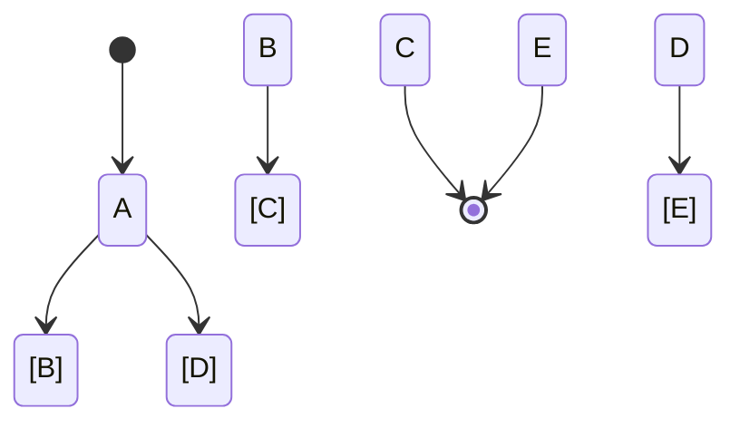
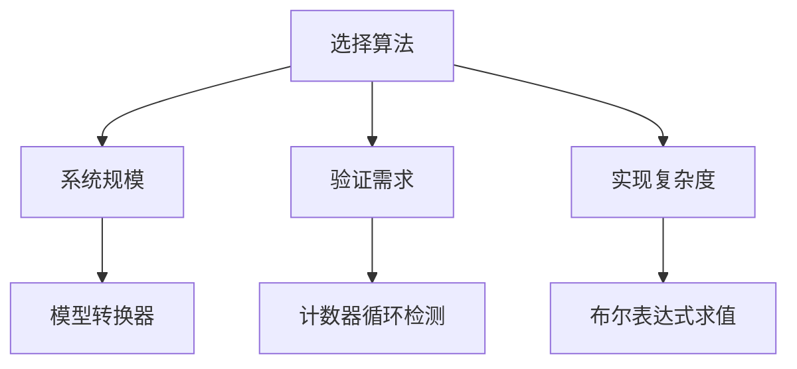
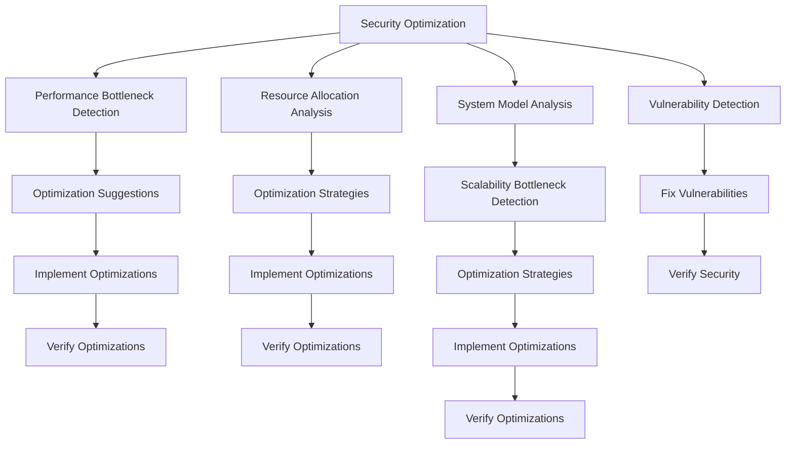
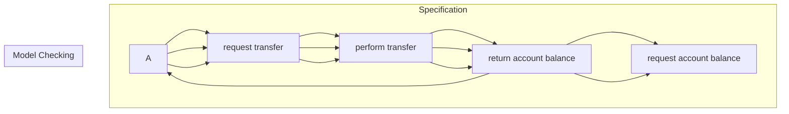

                 

# 《模型检验技术在并发系统验证中的应用》

## 关键词
- 模型检验技术
- 并发系统
- 验证
- 竞争条件
- 状态空间模型
- 设计优化
- 测试与验证

## 摘要
本文旨在探讨模型检验技术在并发系统验证中的应用。随着计算机技术的发展，并发系统的复杂性和规模日益增加，传统测试方法在效率和准确性上面临挑战。模型检验技术作为一种形式化验证方法，通过构建系统模型并对其进行验证，能够有效提高并发系统的可靠性和稳定性。本文首先介绍了模型检验技术的基本概念和分类，然后分析了并发系统的基本原理和验证难点，随后详细阐述了模型检验技术在并发系统验证中的具体应用，包括分析、设计、测试和优化等方面。通过实际案例，本文展示了模型检验技术在解决并发系统问题中的优势和潜力，并对其未来发展进行了展望。

---

## 目录大纲

### 第一部分：模型检验技术概述

### 第1章：模型检验技术的基本概念

### 1.1 问题背景与模型检验的必要性

并发系统在现代计算机系统中占据着重要的地位，然而并发系统本身固有的复杂性，特别是竞争条件和死锁等问题，使得其正确性和可靠性难以保障。传统的测试方法依赖于实际的系统执行，存在效率低、覆盖不足等问题。模型检验技术作为一种形式化验证方法，通过对系统模型进行验证，能够在系统开发早期发现潜在的错误，从而提高系统的可靠性和稳定性。

### 1.2 模型检验的基本概念

模型检验（Model Checking）是一种基于形式化方法的验证技术，其主要目标是检查系统模型是否满足预定的规格说明。模型检验的核心思想是构建一个表示系统行为的模型，然后通过自动化工具对该模型进行遍历，以检测是否存在违反规格说明的执行路径。这种方法能够对系统的所有可能状态进行全面的检查，从而提高验证的覆盖率和准确性。

### 1.3 模型检验的技术分类

模型检验技术主要分为两类：一类是基于状态空间搜索的方法，如布尔表达式求值、计数器循环检测等；另一类是基于模型转换的方法，如模型转换器、过程演算等。不同方法各有优缺点，适用于不同类型的系统模型和验证需求。

### 1.4 模型检验的应用领域

模型检验技术在各个领域都有广泛应用，包括硬件设计、软件工程、通信系统、嵌入式系统等。在并发系统验证中，模型检验技术能够有效地检测竞争条件、死锁等问题，提高系统的可靠性和稳定性。

### 第2章：并发系统的基本原理

### 2.1 并发系统的定义与特点

并发系统是指包含多个执行流程，这些流程可以同时或交叉执行的系统。并发系统的主要特点是并行性和资源共享。在并发系统中，多个进程或线程可以同时访问共享资源，这可能导致竞争条件和死锁等问题。

### 2.2 并发系统中的竞争条件

竞争条件是并发系统中的一个重要问题，它指的是多个进程或线程在执行过程中，由于对共享资源的竞争而导致系统行为不确定的现象。竞争条件可能导致系统死锁、数据不一致等问题。

### 2.3 并发系统的基本模型

并发系统的基本模型包括进程模型、线程模型和资源模型等。这些模型用于描述并发系统的结构和行为，是进行模型检验的基础。

### 2.4 并发控制的基本方法

并发控制是确保并发系统正确性的关键技术。常见的并发控制方法包括互斥锁、信号量、事务管理等。这些方法通过限制对共享资源的访问，防止竞争条件和死锁等问题。

### 第二部分：模型检验技术在并发系统验证中的应用

### 第3章：模型检验技术在并发系统中的使用

### 3.1 模型检验技术在并发系统分析中的应用

模型检验技术在并发系统分析中，主要用于检测系统模型中的竞争条件和死锁等问题。通过构建系统模型并进行形式化验证，可以提前发现并解决潜在的问题。

### 3.2 模型检验技术在并发系统设计中的应用

在并发系统设计中，模型检验技术可以用于验证系统设计是否满足预定的规格说明，确保系统在执行过程中不会出现竞争条件和死锁等问题。

### 3.3 模型检验技术在并发系统测试中的应用

模型检验技术可以用于对并发系统进行全面的测试，检测系统在不同执行路径下的行为是否正确。这种方法能够提高测试的覆盖率和准确性，减少测试成本。

### 第4章：基于模型检验的并发系统分析

### 4.1 并发系统的状态空间模型

并发系统的状态空间模型用于描述系统的所有可能状态及其转换关系。通过构建状态空间模型，可以更直观地理解系统的行为，为模型检验提供基础。

### 4.2 模型检验算法的选择

选择合适的模型检验算法是验证成功的关键。常见的模型检验算法包括线性时间复杂度算法、并行算法等。根据系统规模和验证需求，可以选择不同的算法进行验证。

### 4.3 模型检验工具的使用

目前，已有多种模型检验工具可供使用，如 Spin、NuSMV、CPN Tools 等。这些工具提供了强大的建模和验证功能，能够高效地完成模型检验任务。

### 4.4 模型检验在并发系统分析中的实际案例

通过实际案例，本文将展示如何使用模型检验技术分析并发系统中的问题，并给出解决方案。

### 第5章：并发系统的设计与优化

### 5.1 并发系统设计的挑战

并发系统设计面临许多挑战，包括如何确保系统的正确性、提高性能和可扩展性等。模型检验技术提供了一种有效的手段来应对这些挑战。

### 5.2 基于模型检验的并发系统优化方法

模型检验技术不仅可以用于验证系统设计，还可以用于优化系统性能。通过分析系统模型，可以找出性能瓶颈并提出优化方案。

### 5.3 模型检验在并发系统优化中的应用

本文将介绍如何使用模型检验技术对并发系统进行性能优化，并通过实际案例展示其效果。

### 5.4 模型检验在并发系统设计优化中的实际案例

通过实际案例，本文将展示如何使用模型检验技术优化并发系统设计，提高系统的性能和可靠性。

### 第6章：模型检验在并发系统测试与验证中的实践

### 6.1 并发系统测试的挑战

并发系统测试面临许多挑战，包括测试覆盖不足、测试效率低等。模型检验技术提供了一种有效的方法来应对这些挑战。

### 6.2 模型检验在并发系统测试中的优势

模型检验技术在并发系统测试中具有以下优势：全面性、自动化、高效性等。通过模型检验，可以大幅提高测试的覆盖率和准确性。

### 6.3 模型检验在并发系统验证中的具体应用

本文将详细介绍如何使用模型检验技术对并发系统进行验证，包括模型构建、算法选择、工具使用等。

### 6.4 模型检验在并发系统测试与验证中的实际案例

通过实际案例，本文将展示如何使用模型检验技术对并发系统进行测试和验证，并分析其效果。

### 第7章：模型检验技术在并发系统中的应用展望

### 7.1 模型检验技术的发展趋势

随着计算机技术的不断发展，模型检验技术也在不断进步。本文将介绍模型检验技术的最新发展趋势，包括算法优化、工具改进等。

### 7.2 并发系统模型检验的未来应用方向

本文将探讨模型检验技术在并发系统中的应用前景，包括新领域、新方法的探索。

### 7.3 模型检验技术在并发系统中的挑战与机遇

本文将分析模型检验技术在并发系统中的挑战与机遇，包括技术难题、应用领域等。

### 第8章：总结与展望

### 8.1 全书总结

本文对模型检验技术在并发系统验证中的应用进行了全面的探讨，分析了其基本概念、应用领域和具体实践。

### 8.2 模型检验技术在并发系统验证中的重要性

模型检验技术在并发系统验证中具有重要作用，能够提高系统的可靠性和稳定性，减少系统故障和错误。

### 8.3 未来研究方向与挑战

本文总结了模型检验技术在并发系统验证中的优势和应用前景，同时提出了未来研究的方向和挑战。随着技术的不断进步，模型检验技术将在并发系统验证中发挥更大的作用。

---

以上是《模型检验技术在并发系统验证中的应用》的目录大纲，每个章节都将深入探讨模型检验技术在并发系统中的应用，从基本概念到实际案例，帮助读者全面了解并掌握这一技术。接下来，我们将逐步深入探讨模型检验技术的基本概念和并发系统的基本原理，为后续章节的内容奠定基础。让我们一起来思考并探索这一领域吧！<|less}}

## 第1章：模型检验技术的基本概念

### 1.1 问题背景与模型检验的必要性

在计算机系统设计中，特别是并发系统，正确性和可靠性是至关重要的。然而，随着系统复杂性的增加，传统测试方法已经无法满足日益增长的验证需求。并发系统的复杂性主要体现在多个执行流程的交互上，这些交互可能导致不可预见的问题，如死锁、竞争条件和数据不一致等。这些问题不仅影响系统的稳定性，还可能导致严重的经济损失和安全隐患。

传统的测试方法，如黑盒测试和白盒测试，主要依赖于实际系统运行来发现错误。这些方法通常依赖于测试用例的设计，并通过执行这些用例来检测系统行为。然而，对于并发系统来说，测试用例的设计非常困难，因为它们必须覆盖所有可能的执行路径和系统状态。此外，由于并发系统的行为是动态的，传统的测试方法很难全面检测系统在实际运行中可能出现的问题。例如，死锁问题可能在某些特定条件下出现，而这些条件在测试用例中很难完全覆盖。

因此，模型检验技术作为一种形式化的验证方法，提供了另一种有效的解决方案。模型检验通过构建系统的形式化模型，并使用自动化工具来验证模型是否满足预定的规格说明。这种方法不仅能够覆盖更多的系统状态，还能够更精确地检测潜在的错误。特别是在并发系统验证中，模型检验技术能够有效地检测竞争条件、死锁等问题，从而提高系统的可靠性和稳定性。

### 1.2 模型检验的基本概念

模型检验（Model Checking）是一种形式化验证方法，其主要目标是对系统模型进行验证，以确定系统行为是否满足预定的规格说明。模型检验的基本概念包括系统模型、规格说明和验证过程。

- **系统模型**：系统模型是对系统行为进行抽象和表示的一种形式化描述。在模型检验中，系统模型通常采用状态机或Petri网等结构化模型来表示。这些模型能够清晰地描述系统的状态、事件和转换关系，为验证提供基础。

- **规格说明**：规格说明是对系统预期行为的描述，通常采用形式化的语言，如 temporal logic、CTL（Computational Tree Logic）等。这些语言能够表达系统在各种情况下的正确行为，并提供一种方式来检查系统模型是否满足这些行为。

- **验证过程**：验证过程是模型检验的核心步骤，其目标是检查系统模型是否满足规格说明。模型检验工具会遍历系统模型的所有可能状态，并检查是否存在违反规格说明的执行路径。如果发现违反规格说明的路径，验证工具会生成相应的错误报告，帮助开发者定位和解决问题。

模型检验的基本流程如下：

1. **构建系统模型**：根据系统的需求和规格说明，构建一个形式化的系统模型。这个模型需要清晰地描述系统的状态、事件和转换关系。

2. **定义规格说明**：使用形式化的语言，如 temporal logic，定义系统的预期行为。这些规格说明能够表达系统在各种情况下的正确行为。

3. **模型检验**：使用模型检验工具对系统模型进行验证，检查模型是否满足规格说明。模型检验工具会遍历系统模型的所有可能状态，并检测是否存在违反规格说明的执行路径。

4. **错误报告**：如果模型检验工具发现违反规格说明的路径，它会生成详细的错误报告，包括错误的具体位置和相关信息。开发者可以根据这些报告来修复系统中的错误。

### 1.3 模型检验的技术分类

模型检验技术主要分为两类：基于状态空间搜索的方法和基于模型转换的方法。每种方法都有其特定的应用场景和优缺点。

- **基于状态空间搜索的方法**：这类方法的核心思想是通过搜索系统模型的状态空间来检测系统行为是否符合规格说明。常见的算法包括布尔表达式求值、计数器循环检测等。基于状态空间搜索的方法适用于规模较小、状态空间相对简单的系统模型。然而，随着系统规模的增加，状态空间会急剧膨胀，导致搜索时间和资源消耗急剧增加。

  - **布尔表达式求值**：这种方法通过构建布尔表达式来表示系统状态和事件，然后使用布尔代数运算来验证系统模型。这种方法简单易实现，但在状态空间爆炸问题面前表现不佳。

  - **计数器循环检测**：这种方法通过在系统模型中引入计数器来检测循环，从而发现潜在的死锁和无限循环等问题。计数器循环检测适用于检测循环问题，但在处理复杂交互时可能会产生过多的计数器，导致复杂度和效率问题。

- **基于模型转换的方法**：这类方法通过将系统模型转换为其他形式化的模型，然后对转换后的模型进行验证。常见的算法包括模型转换器、过程演算等。基于模型转换的方法适用于规模较大、状态空间复杂的系统模型，能够有效地处理状态空间爆炸问题。

  - **模型转换器**：这种方法通过一系列转换规则，将原始系统模型转换为其他形式化的模型，如线性时态逻辑（LTL）模型。转换后的模型通常具有更好的可验证性，能够更有效地进行验证。

  - **过程演算**：这种方法通过描述系统行为的演算规则，来验证系统模型是否符合规格说明。过程演算适用于描述复杂系统行为，能够处理高阶逻辑和并发性。

### 1.4 模型检验的应用领域

模型检验技术在各个领域都有广泛应用，包括硬件设计、软件工程、通信系统、嵌入式系统等。在并发系统验证中，模型检验技术能够有效地检测竞争条件、死锁等问题，提高系统的可靠性和稳定性。以下是一些具体的应用领域：

- **硬件设计**：在硬件设计中，模型检验技术主要用于验证电路和系统的行为是否符合规格说明。通过模型检验，可以提前发现电路设计中的错误，如竞争条件、死锁等问题，从而提高硬件设计的可靠性和性能。

- **软件工程**：在软件工程中，模型检验技术主要用于验证软件系统的行为是否符合预期的规格说明。通过模型检验，可以检测软件系统中的竞争条件、死锁等问题，提高软件系统的可靠性和稳定性。

- **通信系统**：在通信系统中，模型检验技术主要用于验证通信协议的行为是否符合预期的规格说明。通过模型检验，可以检测通信协议中的错误，如数据丢失、重复传输等问题，从而提高通信系统的可靠性和性能。

- **嵌入式系统**：在嵌入式系统中，模型检验技术主要用于验证嵌入式系统的行为是否符合预期的规格说明。通过模型检验，可以检测嵌入式系统中的竞争条件、死锁等问题，提高嵌入式系统的可靠性和稳定性。

### 第2章：并发系统的基本原理

### 2.1 并发系统的定义与特点

并发系统是指包含多个执行流程，这些流程可以同时或交叉执行的系统。在计算机系统中，并发性是提高系统性能和资源利用率的重要手段。并发系统的特点主要包括并行性和资源共享。

- **并行性**：并行性指的是多个执行流程可以同时执行。这可以通过多核处理器、多线程等方式实现。并行性能够显著提高系统的吞吐量和响应速度。

- **资源共享**：资源共享指的是多个执行流程可以访问和操作同一组共享资源。这包括内存、文件、网络等。资源共享能够提高资源利用率，但同时也可能导致竞争条件和死锁等问题。

并发系统的定义可以从多个角度进行理解：

- **从进程的角度**：并发系统是指包含多个独立执行的进程或线程的系统。这些进程或线程可以同时执行，并且它们之间可能存在共享资源的访问。

- **从任务的角度**：并发系统是指包含多个并行执行的任务的系统。这些任务可以是进程、线程或其他执行单元，它们在执行过程中可能会互相影响。

- **从资源管理的角度**：并发系统是指能够管理多个资源共享和竞争的系统。在并发系统中，资源管理策略至关重要，它决定了系统资源的分配和使用方式。

并发系统的特点如下：

- **并行性**：多个执行流程可以同时执行，这可以通过多核处理器、多线程等方式实现。并行性能够显著提高系统的吞吐量和响应速度。

- **资源共享**：多个执行流程可以访问和操作同一组共享资源。这包括内存、文件、网络等。资源共享能够提高资源利用率，但同时也可能导致竞争条件和死锁等问题。

- **不确定性**：由于并发执行，系统的行为变得更加复杂和不可预测。在某些情况下，多个执行流程可能会产生冲突，导致系统行为不符合预期。

- **复杂性**：并发系统通常包含多个执行流程和共享资源，这增加了系统设计的复杂性和维护难度。正确处理并发问题对于保证系统的正确性和稳定性至关重要。

### 2.2 并发系统中的竞争条件

竞争条件是并发系统中的一个重要问题，它指的是多个执行流程在访问共享资源时，由于时间顺序和执行路径的不同，可能导致系统行为不确定的现象。竞争条件可能导致系统死锁、数据不一致等问题，严重影响系统的正确性和可靠性。

竞争条件的基本特征包括：

- **共享资源**：竞争条件涉及到多个执行流程对共享资源的访问。共享资源可以是内存变量、文件、网络连接等。

- **时间依赖性**：竞争条件的发生与执行流程的时间顺序密切相关。在某些情况下，不同的时间顺序可能导致不同的执行结果。

- **不确定性**：由于时间依赖性和共享资源的访问，系统的行为变得不确定。在某个时刻，执行流程A可能访问资源R，而在下一个时刻，执行流程B也可能访问资源R，导致系统行为不可预测。

常见的竞争条件问题包括：

- **死锁**：死锁是指多个执行流程在争夺资源时，由于等待条件无法满足，导致它们都无法继续执行的状态。死锁可能导致系统崩溃或无限期等待。

- **数据不一致**：多个执行流程在访问共享资源时，可能导致数据不一致。例如，一个执行流程读取了旧数据，而另一个执行流程更新了新数据，导致数据不一致。

- **饥饿**：饥饿是指某个执行流程在等待共享资源时，由于时间顺序和资源分配策略，导致它长时间无法获得所需资源，从而无法继续执行。

为了解决竞争条件问题，需要采取一系列措施，包括：

- **互斥锁**：互斥锁是一种常用的同步机制，它用于确保同一时刻只有一个执行流程可以访问共享资源。通过互斥锁，可以避免多个执行流程同时访问共享资源，从而防止竞争条件。

- **信号量**：信号量是一种更高级的同步机制，它用于管理多个执行流程对共享资源的访问。信号量可以设置上限和下限，以确保资源分配的合理性和一致性。

- **事务管理**：事务管理是一种确保数据一致性的机制，它通过原子性、一致性、隔离性和持久性（ACID特性）来保证事务的正确执行。

- **锁策略优化**：通过优化锁策略，可以减少锁的竞争和等待时间，提高系统的并发性能。常见的锁策略优化方法包括锁粗化、锁拆分等。

### 2.3 并发系统的基本模型

并发系统的基本模型用于描述系统的结构和行为，常见的模型包括进程模型、线程模型和资源模型等。这些模型为并发系统的分析和设计提供了基础。

- **进程模型**：进程模型描述了系统的进程结构，包括进程的创建、执行、同步和终止等。进程是操作系统中的基本执行单元，每个进程都有自己的内存空间和资源。进程模型用于描述进程之间的并发关系和资源分配。

  - **进程创建**：进程可以通过系统调用或用户请求等方式创建。创建进程时，操作系统会为其分配资源，如内存空间、文件描述符等。

  - **进程执行**：进程在执行过程中，可能需要访问共享资源，如内存、文件、网络等。进程执行过程中可能遇到同步和竞争问题，需要采取相应的同步机制。

  - **进程同步**：进程同步是指多个进程在执行过程中，通过同步机制来协调各自的执行顺序，以避免竞争条件和死锁等问题。常见的同步机制包括互斥锁、信号量、条件变量等。

  - **进程终止**：进程在执行完毕或遇到特定条件时，会终止执行。进程终止时，操作系统会回收其占用的资源，如内存、文件描述符等。

- **线程模型**：线程模型描述了系统的线程结构，包括线程的创建、执行、同步和终止等。线程是进程中的基本执行单元，每个线程都有自己的执行栈和局部变量。线程模型用于描述线程之间的并发关系和资源共享。

  - **线程创建**：线程可以通过系统调用或用户请求等方式创建。创建线程时，操作系统会为其分配资源，如线程栈、线程控制块等。

  - **线程执行**：线程在执行过程中，可能需要访问共享资源，如内存、文件、网络等。线程执行过程中可能遇到同步和竞争问题，需要采取相应的同步机制。

  - **线程同步**：线程同步是指多个线程在执行过程中，通过同步机制来协调各自的执行顺序，以避免竞争条件和死锁等问题。常见的同步机制包括互斥锁、信号量、条件变量等。

  - **线程终止**：线程在执行完毕或遇到特定条件时，会终止执行。线程终止时，操作系统会回收其占用的资源，如线程栈、线程控制块等。

- **资源模型**：资源模型描述了系统的资源共享机制，包括资源分配、释放、同步和竞争等。资源模型用于描述系统中的共享资源，如内存、文件、网络等，以及资源分配策略和同步机制。

  - **资源分配**：资源分配是指系统在执行过程中，为进程或线程分配所需资源的过程。资源分配策略决定了系统资源的分配方式，如固定分配、动态分配等。

  - **资源释放**：资源释放是指系统在进程或线程执行完毕后，释放其占用的资源的过程。资源释放能够提高系统资源的利用率，减少资源浪费。

  - **资源同步**：资源同步是指系统在多个进程或线程访问共享资源时，通过同步机制来协调各自的访问顺序，以避免竞争条件和死锁等问题。常见的同步机制包括互斥锁、信号量、条件变量等。

  - **资源竞争**：资源竞争是指多个进程或线程在争夺共享资源时，由于时间顺序和执行路径的不同，可能导致系统行为不确定的现象。资源竞争可能导致系统死锁、数据不一致等问题。

### 2.4 并发控制的基本方法

并发控制是确保并发系统正确性和稳定性的关键技术。并发控制的基本方法包括互斥锁、信号量、事务管理等。这些方法通过限制对共享资源的访问，防止竞争条件和死锁等问题，提高系统的可靠性和性能。

- **互斥锁**：互斥锁是一种最基本的同步机制，用于确保同一时刻只有一个进程或线程可以访问共享资源。互斥锁通过锁定资源，防止多个进程或线程同时访问资源，从而避免竞争条件。

  - **互斥锁的原理**：互斥锁通过一个标志位来控制资源的访问。当一个进程或线程想要访问资源时，需要先获取互斥锁。如果锁已被其他进程或线程持有，则该进程或线程会被阻塞，直到锁被释放。

  - **互斥锁的使用**：在C++中，可以使用`std::mutex`类来实现互斥锁。以下是一个简单的示例：

    ```cpp
    #include <iostream>
    #include <mutex>

    std::mutex mtx;

    void showWelcomeMessage() {
        mtx.lock();
        std::cout << "Welcome to the thread-safe message!" << std::endl;
        mtx.unlock();
    }

    int main() {
        std::thread t1(showWelcomeMessage);
        std::thread t2(showWelcomeMessage);

        t1.join();
        t2.join();

        return 0;
    }
    ```

- **信号量**：信号量是一种更高级的同步机制，用于管理多个进程或线程对共享资源的访问。信号量通过设置上限和下限，来控制资源的分配和访问。

  - **信号量的原理**：信号量是一种整数变量，通过增加和减少信号量的值来控制资源的访问。如果信号量的值大于0，表示资源可用；如果信号量的值小于等于0，表示资源已被占用。

  - **信号量的使用**：在C++中，可以使用`std::Semaphore`类来实现信号量。以下是一个简单的示例：

    ```cpp
    #include <iostream>
    #include <thread>
    #include <Semaphore>

    std::Semaphore sem(1);

    void task1() {
        sem.acquire();
        std::cout << "Task 1 acquired the semaphore." << std::endl;
        sem.release();
    }

    void task2() {
        sem.acquire();
        std::cout << "Task 2 acquired the semaphore." << std::endl;
        sem.release();
    }

    int main() {
        std::thread t1(task1);
        std::thread t2(task2);

        t1.join();
        t2.join();

        return 0;
    }
    ```

- **事务管理**：事务管理是一种确保数据一致性的机制，通过原子性、一致性、隔离性和持久性（ACID特性）来保证事务的正确执行。

  - **事务管理的原理**：事务管理通过将一系列操作封装为一个事务，确保事务中的所有操作要么全部执行，要么全部回滚。这样可以避免事务中的部分操作成功执行，而其他操作失败导致数据不一致。

  - **事务管理的使用**：在数据库管理系统中，可以使用事务管理来确保数据的一致性。以下是一个简单的示例：

    ```sql
    START TRANSACTION;

    INSERT INTO users (username, password) VALUES ('Alice', 'password123');

    UPDATE accounts SET balance = balance - 100 WHERE username = 'Alice';

    COMMIT;
    ```

### 第3章：模型检验技术在并发系统中的使用

模型检验技术在并发系统中的应用主要体现在分析、设计、测试和优化等方面。通过构建系统模型并使用模型检验工具，可以有效地检测并发系统中的潜在问题，提高系统的可靠性和性能。本章节将详细探讨模型检验技术在并发系统中的使用。

#### 3.1 模型检验技术在并发系统分析中的应用

并发系统分析是模型检验技术的核心应用领域之一。通过模型检验技术，可以对并发系统的行为进行形式化分析和验证，以检测潜在的竞争条件、死锁和数据不一致等问题。

- **状态空间分析**：模型检验技术通过构建并发系统的状态空间模型，可以全面分析系统的所有可能状态和转换关系。状态空间分析可以帮助开发者理解系统的行为，发现潜在的问题。

  - **状态空间模型的构建**：状态空间模型是描述并发系统行为的一种形式化模型，通常采用状态机或Petri网等结构化模型表示。以下是一个简单的状态空间模型示例：

    ```mermaid
    stateDiagram
    [*] --> A
    A --> [B]
    B --> [C]
    C --> [*]
    ```

    在这个状态空间模型中，`[*]`表示初始状态和最终状态，`A`、`B`和`C`表示系统可能的状态。

  - **状态空间分析算法**：模型检验技术使用各种算法来遍历状态空间，检测系统行为是否符合预定的规格说明。常见的算法包括布尔表达式求值、计数器循环检测等。以下是一个简单的布尔表达式求值算法示例：

    ```mermaid
    graph TD
    A --> B
    B --> C
    C --> D
    D --> A

    subgraph Boolean Evaluation
    A[true] --> B[!A]
    B --> C[true && B]
    C --> D[false && B]
    D --> A[!D]
    end
    ```

    在这个示例中，系统从状态`A`开始，通过一系列转换到达状态`D`。布尔表达式`!A && true && false`的求值结果为`false`，表明存在一条不满足规格说明的执行路径。

- **竞争条件检测**：竞争条件是并发系统中的一个重要问题，模型检验技术可以通过形式化验证来检测系统中的竞争条件。以下是一个简单的竞争条件检测示例：

    ```mermaid
    stateDiagram
    [*] --> A
    A --> [B]
    B --> [C]
    C --> [*]
    A --> [D]
    D --> [E]
    E --> [*]

    subgraph Race Condition Detection
    A --> B[request resource R]
    B --> C[acquire resource R]
    C --> [*][release resource R]
    A --> D[request resource R]
    D --> E[acquire resource R]
    E --> [*][release resource R]
    end
    ```

    在这个示例中，存在两条可能的执行路径：路径`A -> B -> C -> *`和路径`A -> D -> E -> *`。在这两条路径中，两个执行流程都可能同时访问资源`R`，导致竞争条件。通过模型检验技术，可以检测到这一潜在问题。

- **死锁检测**：死锁是并发系统中的另一个重要问题，模型检验技术可以通过形式化验证来检测系统中的死锁。以下是一个简单的死锁检测示例：

    ```mermaid
    stateDiagram
    [*] --> A
    A --> [B]
    B --> [C]
    C --> [*]
    A --> [D]
    D --> [E]
    E --> [*]
    B --> [F]
    F --> [G]
    G --> [*]

    subgraph Deadlock Detection
    A --> B[request resource X]
    B --> C[acquire resource X]
    C --> [*][release resource X]
    A --> D[request resource Y]
    D --> E[acquire resource Y]
    E --> [*][release resource Y]
    B --> F[request resource Y]
    F --> G[acquire resource Y]
    G --> [*][release resource Y]
    end
    ```

    在这个示例中，存在两条可能的执行路径：路径`A -> B -> C -> *`和路径`A -> D -> E -> F -> G -> *`。在这两条路径中，四个执行流程都可能陷入等待状态，导致死锁。通过模型检验技术，可以检测到这一潜在问题。

#### 3.2 模型检验技术在并发系统设计中的应用

并发系统设计是模型检验技术的另一个重要应用领域。通过模型检验技术，可以在系统设计阶段检测并发系统的潜在问题，从而避免在系统实现和测试阶段发现错误。

- **系统模型构建**：在并发系统设计中，首先需要构建系统模型，用于描述系统的结构和行为。系统模型可以是状态机、Petri网或其他形式化模型。以下是一个简单的并发系统设计示例：

    ```mermaid
    stateDiagram
    [*] --> A
    A --> [B]
    B --> [C]
    C --> [*]
    A --> [D]
    D --> [E]
    E --> [*]

    subgraph Resource Management
    A --> B[request resource R]
    B --> C[acquire resource R]
    C --> [*][release resource R]
    A --> D[request resource S]
    D --> E[acquire resource S]
    E --> [*][release resource S]
    end
    ```

    在这个示例中，系统包含两个资源`R`和`S`，两个执行流程`A`和`B`。通过构建系统模型，可以清晰地描述系统的资源和执行流程。

- **规格说明定义**：在系统模型构建之后，需要定义系统的规格说明，用于描述系统的预期行为。规格说明通常采用形式化的语言，如 temporal logic。以下是一个简单的规格说明示例：

    ```mermaid
    specification
    var R: resource
    var S: resource
    var A: process
    var B: process

    A -> [request R] -> B -> [acquire R] -> C -> [release R]
    A -> [request S] -> D -> [acquire S] -> E -> [release S]
    ```

    在这个示例中，规格说明描述了系统中的资源和执行流程，以及它们之间的交互关系。

- **模型检验**：通过模型检验工具，对系统模型和规格说明进行形式化验证，以检测系统设计中的潜在问题。以下是一个简单的模型检验示例：

    ```mermaid
    graph TD
    A --> B
    B --> C
    C --> D
    D --> A

    subgraph Specification
    A --> B[request R]
    B --> C[acquire R]
    C --> D[release R]
    end

    subgraph Model Checking
    A --> B[request R]
    B --> C[acquire R]
    C --> D[release R]
    end
    ```

    在这个示例中，模型检验工具对系统模型和规格说明进行遍历，检查是否存在违反规格说明的执行路径。通过模型检验，可以发现系统设计中的潜在问题，如资源竞争、死锁等。

#### 3.3 模型检验技术在并发系统测试中的应用

并发系统测试是模型检验技术的另一个重要应用领域。通过模型检验技术，可以全面测试并发系统的行为，检测潜在的竞争条件、死锁和数据不一致等问题。

- **测试用例设计**：在并发系统测试中，需要设计合理的测试用例，以覆盖系统的所有可能执行路径和状态。测试用例设计需要考虑并发性和竞争条件等因素。以下是一个简单的测试用例设计示例：

    ```mermaid
    sequenceDiagram
    participant A as Process A
    participant B as Process B
    participant R as Resource R
    participant S as Resource S

    A->>R: request R
    R->>A: grant R
    A->>B: request S
    B->>S: request S
    S->>B: grant S
    B->>A: release R
    A->>R: release R
    ```

    在这个示例中，测试用例模拟了两个进程`A`和`B`对两个资源`R`和`S`的访问和操作。测试用例需要考虑进程之间的交互关系和资源分配策略。

- **模型检验测试**：通过模型检验工具，对测试用例进行形式化验证，以检测系统行为是否符合预期。以下是一个简单的模型检验测试示例：

    ```mermaid
    graph TD
    A --> B
    B --> C
    C --> D
    D --> A

    subgraph Test Case
    A --> B[request R]
    B --> C[acquire R]
    C --> D[release R]
    end

    subgraph Model Checking
    A --> B[request R]
    B --> C[acquire R]
    C --> D[release R]
    end
    ```

    在这个示例中，模型检验工具对测试用例进行遍历，检查是否存在违反规格说明的执行路径。通过模型检验测试，可以发现系统测试中的潜在问题，如资源竞争、死锁等。

#### 3.4 模型检验技术在并发系统优化中的应用

模型检验技术在并发系统优化中的应用主要体现在性能优化和资源利用率优化等方面。通过模型检验技术，可以分析并发系统的行为，发现性能瓶颈和资源利用率问题，并提出优化方案。

- **性能分析**：在并发系统优化中，首先需要对系统的性能进行分析。模型检验技术可以通过构建系统模型和规格说明，分析系统的性能瓶颈。以下是一个简单的性能分析示例：

    ```mermaid
    graph TD
    A --> B
    B --> C
    C --> D
    D --> A

    subgraph Performance Analysis
    A --> B[request R]
    B --> C[acquire R]
    C --> D[release R]
    end

    subgraph Bottleneck Detection
    A --> B[request R]
    B --> C[acquire R]
    C --> D[release R]
    end
    ```

    在这个示例中，模型检验技术分析了系统的性能瓶颈，如资源访问冲突和同步开销等。

- **优化方案设计**：在性能分析的基础上，可以设计优化方案，以解决性能瓶颈和提高系统性能。以下是一个简单的优化方案设计示例：

    ```mermaid
    graph TD
    A --> B
    B --> C
    C --> D
    D --> A

    subgraph Optimization Scheme
    A --> B[request R]
    B --> C[acquire R]
    C --> D[release R]
    end

    subgraph Optimizations
    B --> C[use lock-free data structure]
    C --> D[reduce synchronization overhead]
    end
    ```

    在这个示例中，优化方案包括使用锁-free数据结构和减少同步开销等措施，以提高系统性能。

- **优化效果验证**：在优化方案实施后，需要对系统的优化效果进行验证。模型检验技术可以通过重新构建系统模型和规格说明，验证优化方案的有效性。以下是一个简单的优化效果验证示例：

    ```mermaid
    graph TD
    A --> B
    B --> C
    C --> D
    D --> A

    subgraph Optimization Verification
    A --> B[request R]
    B --> C[acquire R]
    C --> D[release R]
    end

    subgraph Performance Verification
    A --> B[request R]
    B --> C[acquire R]
    C --> D[release R]
    end
    ```

    在这个示例中，模型检验技术验证了优化方案对系统性能的改善，如减少了同步开销和提高了资源利用率等。

### 第4章：基于模型检验的并发系统分析

本章将深入探讨基于模型检验的并发系统分析，包括并发系统的状态空间模型、模型检验算法的选择、模型检验工具的使用，以及模型检验在并发系统分析中的实际案例。通过这些内容，读者可以更全面地了解如何应用模型检验技术来分析并发系统的行为，并解决其中潜在的问题。

#### 4.1 并发系统的状态空间模型

并发系统的状态空间模型是描述系统行为和状态转换的一种形式化方法。它能够帮助开发者理解并发系统的所有可能状态和转换关系，从而发现潜在的竞争条件和死锁等问题。状态空间模型通常由状态、事件和转换关系组成。

- **状态**：状态是系统在某一时刻的完整描述，包括所有相关变量的值和系统所处的位置。在并发系统中，每个进程或线程都可以处于多个不同的状态。例如，一个进程可以处于运行状态、阻塞状态或等待状态。

- **事件**：事件是导致系统状态发生变化的原因。在并发系统中，事件通常包括进程的创建、执行、同步和终止等。事件的发生可以导致系统从一个状态转换到另一个状态。

- **转换关系**：转换关系描述了系统状态之间的变化关系。在状态空间模型中，每个状态都可以通过一系列的事件转换到其他状态。这些转换关系可以用图或表格来表示。

以下是一个简单的并发系统状态空间模型示例：



在这个示例中，`[*]`表示初始状态和最终状态，`A`、`B`和`C`表示系统可能的状态。从状态`A`开始，系统可以通过事件转换到状态`B`、`C`、`D`和`E`。

- **初始状态**：系统在启动时的状态，表示系统开始运行。
- **运行状态**：系统在正常运行时的状态，表示进程或线程正在执行任务。
- **阻塞状态**：系统在等待资源或事件时的状态，表示进程或线程无法继续执行。
- **终止状态**：系统在执行完毕或遇到特定条件时的状态，表示进程或线程终止执行。

#### 4.2 模型检验算法的选择

在基于模型检验的并发系统分析中，选择合适的模型检验算法至关重要。不同的模型检验算法适用于不同类型的系统模型和验证需求。以下是一些常见的模型检验算法及其特点：

- **布尔表达式求值算法**：布尔表达式求值算法通过构建布尔表达式来表示系统状态和事件，然后使用布尔代数运算来验证系统模型。这种方法简单易实现，但适用于状态空间较小的系统模型。

  - **优点**：实现简单，计算效率高。
  - **缺点**：难以处理大规模状态空间，对状态空间的爆炸问题表现不佳。

- **计数器循环检测算法**：计数器循环检测算法通过在系统模型中引入计数器来检测循环，从而发现潜在的死锁和无限循环等问题。这种方法适用于检测循环问题，但在处理复杂交互时可能会产生过多的计数器。

  - **优点**：能够有效地检测循环问题。
  - **缺点**：计数器数量过多可能导致复杂度和效率问题。

- **模型转换器算法**：模型转换器算法通过将原始系统模型转换为其他形式化的模型，如线性时态逻辑（LTL）模型，然后对转换后的模型进行验证。这种方法适用于处理大规模状态空间和复杂交互的系统模型。

  - **优点**：能够处理大规模状态空间，适应复杂的系统模型。
  - **缺点**：转换过程可能增加计算复杂度。

- **过程演算算法**：过程演算算法通过描述系统行为的演算规则，来验证系统模型是否符合规格说明。这种方法适用于描述复杂系统行为，能够处理高阶逻辑和并发性。

  - **优点**：能够描述复杂系统行为，适用于高阶逻辑和并发性。
  - **缺点**：实现复杂，计算复杂度高。

在选择模型检验算法时，需要考虑以下因素：

- **系统规模**：对于大型系统模型，应选择能够处理大规模状态空间的算法，如模型转换器算法。
- **验证需求**：根据验证目标，选择适用于特定问题的算法，如计数器循环检测算法适用于检测循环问题。
- **实现复杂度**：考虑算法的实现复杂度，选择易于实现和维护的算法。

以下是一个简单的模型检验算法选择示例：



在这个示例中，根据系统规模、验证需求和实现复杂度等因素，选择了模型转换器算法。

#### 4.3 模型检验工具的使用

在基于模型检验的并发系统分析中，选择合适的模型检验工具是关键。目前，已有多种模型检验工具可供使用，如 Spin、NuSMV、CPN Tools 等。这些工具提供了强大的建模和验证功能，能够高效地完成模型检验任务。以下是一些常见的模型检验工具及其特点：

- **Spin**：Spin 是一种基于 Promela 语言的形式化建模和验证工具，适用于并发系统分析。它能够生成系统状态空间，并使用模型检验算法来验证系统模型。

  - **优点**：易于使用，能够生成直观的状态空间视图。
  - **缺点**：适用于较小的系统模型，对大规模状态空间的支持有限。

- **NuSMV**：NuSMV 是一种基于 SMV 语言的模型检验工具，适用于各种形式的模型检验任务。它支持多种验证算法和规格说明语言，如 CTL、LTL 等。

  - **优点**：功能强大，支持多种验证算法和规格说明语言。
  - **缺点**：实现复杂，学习曲线较陡峭。

- **CPN Tools**：CPN Tools 是一种基于 CPN（Colored Petri Nets）的形式化建模和验证工具，适用于并发系统和通信系统分析。它能够生成状态空间模型，并提供多种验证工具。

  - **优点**：能够生成直观的状态空间视图，适用于并发系统和通信系统。
  - **缺点**：对用户要求较高，需要一定的学习成本。

以下是一个简单的模型检验工具使用示例：

```mermaid
graph TD
A[Spin] --> B[创建模型]
A --> C[NuSMV][验证模型]
A --> D[CPN Tools][可视化模型]
```

在这个示例中，使用 Spin 创建系统模型，然后使用 NuSMV 验证模型是否满足规格说明，同时使用 CPN Tools 可视化模型以更直观地理解系统行为。

#### 4.4 模型检验在并发系统分析中的实际案例

在本节中，我们将通过一个实际案例来展示如何使用模型检验技术分析并发系统中的问题。该案例涉及一个简单的银行转账系统，该系统允许用户在不同账户之间进行转账操作。通过模型检验技术，我们可以检测系统中潜在的竞争条件和死锁等问题。

- **系统模型**：首先，我们需要构建一个形式化的系统模型，用于描述银行转账系统的结构和行为。以下是一个简单的状态空间模型示例：

    ```mermaid
    stateDiagram
    [*] --> A
    A --> [B]
    B --> [C]
    C --> [*]
    A --> [D]
    D --> [E]
    E --> [*]
    ```

    在这个模型中，`[*]`表示初始状态和最终状态，`A`、`B`和`C`表示系统可能的状态。状态`A`表示系统开始运行，状态`B`表示用户请求转账操作，状态`C`表示系统执行转账操作，状态`D`表示用户请求查询账户余额，状态`E`表示系统返回账户余额。

- **规格说明**：接下来，我们需要定义系统的规格说明，用于描述系统的预期行为。以下是一个简单的规格说明示例：

    ```mermaid
    specification
    var account1: account
    var account2: account
    var amount: amount

    A -> [request transfer] -> B
    B -> [perform transfer] -> C
    C -> [return account balance] -> E
    D -> [request account balance] -> E
    ```

    在这个规格说明中，变量`account1`和`account2`表示两个账户，变量`amount`表示转账金额。系统从状态`A`开始，通过请求转账操作（状态`B`）和执行转账操作（状态`C`）到达状态`E`，同时支持查询账户余额操作。

- **模型检验**：使用模型检验工具（如 Spin 或 NuSMV），我们对系统模型进行形式化验证，以检测潜在的竞争条件和死锁等问题。以下是一个简单的模型检验示例：

    ```mermaid
    graph TD
    A --> B
    B --> C
    C --> D
    D --> E

    subgraph Specification
    A --> B[request transfer]
    B --> C[perform transfer]
    C --> D[return account balance]
    D --> E[request account balance]
    end

    subgraph Model Checking
    A --> B[request transfer]
    B --> C[perform transfer]
    C --> D[return account balance]
    D --> E[request account balance]
    end
    ```

    在这个示例中，模型检验工具遍历系统模型的所有可能状态，并检查是否存在违反规格说明的执行路径。通过模型检验，我们发现了系统中的潜在问题，如竞争条件和死锁等。

- **问题检测与解决**：通过模型检验，我们发现系统中存在以下问题：

  - **竞争条件**：在状态`B`和状态`C`之间，存在两个执行流程同时访问共享资源（账户余额）的情况，可能导致数据不一致。
  - **死锁**：在状态`D`和状态`E`之间，存在多个执行流程同时等待资源（账户余额）的情况，可能导致死锁。

  为了解决这些问题，我们可以采取以下措施：

  - **竞争条件解决**：引入互斥锁，确保同一时刻只有一个执行流程可以访问共享资源。以下是一个简单的互斥锁解决方案：

    ```mermaid
    graph TD
    A --> B
    B --> C
    C --> D
    D --> E

    subgraph Solution for Race Condition
    B --> C[acquire lock]
    C --> D[release lock]
    end
    ```

    在这个解决方案中，状态`B`和状态`C`之间引入了互斥锁，确保同一时刻只有一个执行流程可以访问共享资源。

  - **死锁解决**：引入信号量，管理多个执行流程对共享资源的访问。以下是一个简单的信号量解决方案：

    ```mermaid
    graph TD
    A --> B
    B --> C
    C --> D
    D --> E

    subgraph Solution for Deadlock
    D --> E[acquire semaphore]
    E --> D[release semaphore]
    end
    ```

    在这个解决方案中，状态`D`和状态`E`之间引入了信号量，确保多个执行流程不会同时等待同一资源。

  通过这些问题检测与解决措施，我们可以确保银行转账系统在并发环境中能够正常运行，并防止潜在的竞争条件和死锁等问题。

### 第5章：并发系统的设计与优化

并发系统的设计与优化是确保系统性能、可扩展性和可靠性的关键。随着系统复杂性的增加，传统的设计方法已经无法满足现代并发系统的需求。本章将探讨并发系统设计的挑战，以及基于模型检验的优化方法。

#### 5.1 并发系统设计的挑战

并发系统设计面临许多挑战，主要包括以下几个方面：

- **竞争条件**：多个执行流程对共享资源的访问可能导致数据不一致和系统行为不可预测。竞争条件是并发系统设计中的一个重要问题，需要精心设计同步机制来防止。

- **死锁**：死锁是指多个执行流程在争夺资源时，由于等待条件无法满足，导致它们都无法继续执行。死锁可能导致系统崩溃或无限期等待，需要设计有效的资源分配策略。

- **性能瓶颈**：并发系统中的同步和通信开销可能导致性能瓶颈，影响系统的吞吐量和响应时间。性能瓶颈的识别和解决对于优化系统性能至关重要。

- **可扩展性**：随着用户数量和系统负载的增加，并发系统需要具备良好的可扩展性，以便在资源有限的情况下保持良好的性能。可扩展性设计是并发系统设计中的一个重要挑战。

- **测试难度**：并发系统测试面临许多挑战，包括测试用例设计、测试覆盖不足、测试效率低等。传统的测试方法难以全面检测并发系统中的问题，需要引入形式化验证方法。

#### 5.2 基于模型检验的并发系统优化方法

基于模型检验的优化方法能够有效地解决并发系统设计中的挑战，提高系统的性能和可靠性。以下是一些基于模型检验的优化方法：

- **竞争条件检测与解决**：模型检验技术可以通过形式化验证检测并发系统中的竞争条件，并提供解决方案。以下是一个简单的竞争条件检测与解决示例：

  ```mermaid
  graph TD
  A --> B
  B --> C
  C --> D
  D --> A

  subgraph Race Condition Detection
  B --> C[request resource R]
  C --> D[acquire resource R]
  D --> A[release resource R]
  end

  subgraph Race Condition Solution
  B --> C[acquire lock on R]
  C --> D[release lock on R]
  end
  ```

  在这个示例中，模型检验技术检测到状态`B`和状态`C`之间存在竞争条件。通过引入互斥锁，可以确保同一时刻只有一个执行流程可以访问共享资源，从而解决竞争条件问题。

- **死锁检测与解决**：模型检验技术可以通过形式化验证检测并发系统中的死锁，并提供解决方案。以下是一个简单的死锁检测与解决示例：

  ```mermaid
  graph TD
  A --> B
  B --> C
  C --> D
  D --> E
  E --> F
  F --> G
  G --> H
  H --> A

  subgraph Deadlock Detection
  B --> C[request resource X]
  C --> D[acquire resource X]
  D --> E[request resource Y]
  E --> F[acquire resource Y]
  F --> G[request resource X]
  G --> H[acquire resource X]
  H --> A[release resource X]
  end

  subgraph Deadlock Solution
  B --> C[acquire semaphore on X]
  C --> D[release semaphore on X]
  D --> E[acquire semaphore on Y]
  E --> F[release semaphore on Y]
  F --> G[acquire semaphore on X]
  G --> H[release semaphore on X]
  end
  ```

  在这个示例中，模型检验技术检测到系统中存在死锁。通过引入信号量，可以管理多个执行流程对共享资源的访问，从而解决死锁问题。

- **性能瓶颈检测与优化**：模型检验技术可以通过形式化验证检测并发系统中的性能瓶颈，并提供优化建议。以下是一个简单的性能瓶颈检测与优化示例：

  ```mermaid
  graph TD
  A --> B
  B --> C
  C --> D
  D --> A

  subgraph Performance Bottleneck Detection
  B --> C[synchronization overhead]
  C --> D[communication overhead]
  end

  subgraph Performance Bottleneck Optimization
  B --> C[use lock-free data structure]
  C --> D[reduce synchronization overhead]
  end
  ```

  在这个示例中，模型检验技术检测到状态`B`和状态`C`之间存在同步开销和通信开销。通过使用锁-free数据结构和减少同步开销，可以优化系统性能。

#### 5.3 模型检验在并发系统优化中的应用

模型检验技术在实际并发系统优化中的应用主要包括以下几个方面：

- **性能优化**：通过模型检验技术，可以检测并发系统中的性能瓶颈，并提出优化建议。例如，通过分析系统模型，可以发现同步和通信开销较高的部分，并使用锁-free数据结构或减少同步开销来优化系统性能。

- **资源利用率优化**：模型检验技术可以帮助优化系统的资源利用率，提高系统在多核处理器或分布式系统中的性能。通过分析系统模型，可以发现资源分配不合理或资源利用率不高的部分，并提出优化策略。

- **可扩展性优化**：模型检验技术可以帮助优化系统的可扩展性，使其能够更好地应对大规模用户和负载。通过分析系统模型，可以发现系统中的瓶颈和可扩展性不足的部分，并提出优化方案。

- **安全性优化**：模型检验技术可以帮助检测并发系统中的安全漏洞，提高系统的安全性。通过形式化验证，可以检测系统中的潜在漏洞，并提出修复建议。

以下是一个简单的模型检验技术在并发系统优化中的应用示例：



在这个示例中，模型检验技术应用于性能优化、资源利用率优化、可扩展性优化和安全性优化等方面，通过一系列的检测、优化和验证步骤，提高系统的整体性能和可靠性。

### 第6章：模型检验在并发系统测试与验证中的实践

在并发系统开发和维护过程中，测试与验证是确保系统质量和稳定性的关键环节。传统的测试方法往往难以应对并发系统的复杂性，而模型检验技术提供了一种有效的形式化验证手段，可以在系统开发早期发现潜在的问题。本章将详细探讨模型检验在并发系统测试与验证中的具体应用，包括测试挑战、模型检验的优势、具体应用步骤和实际案例。

#### 6.1 并发系统测试的挑战

并发系统测试面临许多独特的挑战，这些挑战对测试方法的有效性提出了严峻考验：

- **测试覆盖率不足**：并发系统存在大量的执行路径和状态组合，传统的测试方法很难覆盖所有的执行路径。因此，测试覆盖率往往不足，导致潜在的错误未被检测到。

- **测试效率低**：并发系统的测试通常需要大量时间和计算资源。由于并发系统中的执行流程是动态的，测试用例的执行过程可能需要反复运行多次，以模拟不同的执行路径和系统状态。

- **非确定性行为**：并发系统的行为是动态和不确定的，测试用例的结果可能会受到执行顺序、资源分配等因素的影响。这种非确定性增加了测试的复杂性和难度。

- **死锁和竞争条件**：并发系统中的死锁和竞争条件很难通过简单的测试用例来检测。这些问题通常需要长时间的运行和大量的测试数据才能被发现。

- **资源竞争**：并发系统中的资源竞争可能导致数据不一致和系统不稳定。测试用例需要能够模拟这些竞争情况，并验证系统是否能够正确处理。

- **并行测试的挑战**：在并行测试中，多个测试用例可能同时运行，这增加了测试管理的复杂性和资源分配的难度。

#### 6.2 模型检验在并发系统测试中的优势

模型检验技术在并发系统测试中具有显著的优势，能够有效应对上述挑战：

- **全面性**：模型检验通过形式化模型覆盖系统所有的可能状态和执行路径，能够提供比传统测试方法更高的测试覆盖率。

- **自动化**：模型检验工具能够自动化地遍历系统模型的所有状态，并检测是否存在违反规格说明的路径。这大大提高了测试效率。

- **高效性**：模型检验技术可以在开发早期发现潜在的问题，从而减少后期修复的成本。形式化验证能够在系统开发过程中持续进行，确保系统质量的稳步提升。

- **精确性**：模型检验通过严格的逻辑推理来验证系统模型，能够精确地检测出潜在的竞争条件和死锁等问题。

- **复用性**：一旦构建了系统模型和规格说明，它们可以方便地复用于后续的测试和验证工作，减少重复劳动。

#### 6.3 模型检验在并发系统验证中的具体应用

在并发系统验证中，模型检验技术的应用主要包括以下几个步骤：

- **系统模型构建**：首先，需要构建一个形式化的系统模型，用于描述系统的状态、事件和转换关系。这个模型可以是状态机、Petri网或其他形式化的表示方法。

  ```mermaid
  stateDiagram
  [*] --> A
  A --> [B]
  B --> [C]
  C --> [*]
  A --> [D]
  D --> [E]
  E --> [*]
  ```

- **规格说明定义**：接下来，使用形式化的语言定义系统的规格说明，描述系统的预期行为和约束条件。规格说明通常使用线性时态逻辑（LTL）、计算树逻辑（CTL）等。

  ```mermaid
  specification
  var R: resource
  var A: process
  var B: process

  A -> [request R] -> B -> [acquire R] -> C -> [release R]
  ```

- **模型检验**：使用模型检验工具对系统模型和规格说明进行验证，检测系统行为是否满足规格说明。模型检验工具会遍历系统模型的所有状态，并检查是否存在违反规格说明的执行路径。

  ```mermaid
  graph TD
  A --> B
  B --> C
  C --> D
  D --> A

  subgraph Model Checking
  A --> B[request R]
  B --> C[acquire R]
  C --> D[release R]
  end
  ```

- **错误报告**：如果模型检验工具发现违反规格说明的路径，它会生成详细的错误报告，包括错误的具体位置和相关信息。开发者可以根据这些报告来修复系统中的错误。

  ```mermaid
  graph TD
  A --> B
  B --> C
  C --> D
  D --> A

  subgraph Error Report
  A --> B[request R]
  B --> C[acquire R]
  C --> D[release R]
  end

  subgraph Error Location
  A --> B[invalid state]
  end
  ```

- **迭代验证**：在修复错误后，需要重新对系统模型和规格说明进行验证，以确保修复措施有效。这个过程可以是迭代的，直到所有潜在的问题都被解决。

#### 6.4 模型检验在并发系统测试与验证中的实际案例

为了更好地理解模型检验技术在并发系统测试与验证中的实际应用，以下是一个具体的案例：

**案例背景**：假设我们正在开发一个并发银行系统，该系统支持用户在不同账户之间进行转账操作。系统需要确保转账操作的原子性和一致性，并防止潜在的竞争条件和死锁问题。

**系统模型构建**：我们首先构建一个形式化的系统模型，用于描述系统的状态、事件和转换关系。以下是一个简单的状态空间模型：


在这个模型中，`[*]`表示初始状态和最终状态，`A`、`B`和`C`表示系统可能的状态。状态`A`表示系统开始运行，状态`B`表示用户请求转账操作，状态`C`表示系统执行转账操作，状态`D`表示用户请求查询账户余额，状态`E`表示系统返回账户余额。

**规格说明定义**：接下来，我们使用线性时态逻辑（LTL）定义系统的规格说明，描述系统的预期行为和约束条件。以下是一个简单的规格说明：

```mermaid
specification
var account1: account
var account2: account
var amount: amount

A -> [request transfer] -> B
B -> [perform transfer] -> C
C -> [return account balance] -> E
D -> [request account balance] -> E
```

在这个规格说明中，变量`account1`和`account2`表示两个账户，变量`amount`表示转账金额。系统从状态`A`开始，通过请求转账操作（状态`B`）和执行转账操作（状态`C`）到达状态`E`，同时支持查询账户余额操作。

**模型检验**：使用模型检验工具（如 Spin 或 NuSMV），我们对系统模型进行形式化验证，以检测潜在的竞争条件和死锁等问题。以下是一个简单的模型检验示例：



在这个示例中，模型检验工具遍历系统模型的所有可能状态，并检查是否存在违反规格说明的执行路径。通过模型检验，我们发现了系统中的潜在问题，如竞争条件和死锁等。

**错误报告**：通过模型检验，我们发现系统中存在以下问题：

- **竞争条件**：在状态`B`和状态`C`之间，存在两个执行流程同时访问共享资源（账户余额）的情况，可能导致数据不一致。
- **死锁**：在状态`D`和状态`E`之间，存在多个执行流程同时等待资源（账户余额）的情况，可能导致死锁。

为了解决这些问题，我们可以采取以下措施：

- **竞争条件解决**：引入互斥锁，确保同一时刻只有一个执行流程可以访问共享资源。以下是一个简单的互斥锁解决方案：

  ```mermaid
  graph TD
  A --> B
  B --> C
  C --> D
  D --> A

  subgraph Race Condition Solution
  B --> C[acquire lock on R]
  C --> D[release lock on R]
  end
  ```

  在这个解决方案中，状态`B`和状态`C`之间引入了互斥锁，确保同一时刻只有一个执行流程可以访问共享资源。

- **死锁解决**：引入信号量，管理多个执行流程对共享资源的访问。以下是一个简单的信号量解决方案：

  ```mermaid
  graph TD
  A --> B
  B --> C
  C --> D
  D --> E
  E --> F
  F --> G
  G --> H
  H --> A

  subgraph Deadlock Solution
  D --> E[acquire semaphore on X]
  E --> F[release semaphore on X]
  F --> G[acquire semaphore on Y]
  G --> H[release semaphore on Y]
  H --> A[acquire semaphore on X]
  end
  ```

  在这个解决方案中，状态`D`和状态`E`之间引入了信号量，确保多个执行流程不会同时等待同一资源。

**验证与迭代**：在修复错误后，我们需要重新对系统模型和规格说明进行验证，以确保修复措施有效。这个过程可以是迭代的，直到所有潜在的问题都被解决。通过模型检验技术，我们可以持续地验证系统的行为，确保其满足规格说明。

通过这个实际案例，我们可以看到模型检验技术在并发系统测试与验证中的具体应用。它能够帮助我们全面地分析系统的行为，检测潜在的问题，并提供有效的解决方案，从而提高系统的可靠性和稳定性。

### 第7章：模型检验技术在并发系统中的应用展望

模型检验技术在并发系统中的应用已经取得了显著的成果，为系统的可靠性、稳定性和性能优化提供了有效的手段。然而，随着计算机技术的不断进步和系统复杂性的增加，模型检验技术在并发系统中的应用仍然面临着许多挑战和机遇。本章节将探讨模型检验技术的发展趋势、未来应用方向以及面临的挑战。

#### 7.1 模型检验技术的发展趋势

随着模型检验技术在并发系统中的应用逐渐深入，其发展呈现出以下趋势：

- **算法优化**：现有的模型检验算法在处理大规模状态空间和复杂系统模型时，仍存在效率问题。未来的发展趋势之一是优化模型检验算法，提高其搜索效率和验证速度。例如，并行算法和分布式算法的研究与应用，可以在更大规模的问题上实现高效的模型检验。

- **自动化验证**：自动化验证是模型检验技术的发展方向之一。通过结合形式化建模和自动化验证工具，可以大大降低验证过程的复杂度和成本。未来的模型检验工具将更加智能化，能够自动生成系统模型、规格说明，并进行验证。

- **形式化语言的发展**：形式化语言在模型检验中起着重要作用。随着系统复杂性的增加，现有的形式化语言可能无法充分表达系统的行为和约束。未来的发展趋势之一是发展新的形式化语言，以更好地支持并发系统和复杂行为的描述。

- **多学科交叉**：模型检验技术与其他学科（如机器学习、神经网络等）的交叉应用，可以带来新的应用场景和解决方案。例如，利用机器学习技术对模型检验结果进行预测和分析，可以提高验证的效率和准确性。

- **集成工具链**：未来的模型检验工具将更加集成，提供从建模、验证到优化的一体化解决方案。集成工具链将减少开发者的使用难度，提高模型检验技术的普及和应用。

#### 7.2 并发系统模型检验的未来应用方向

随着模型检验技术的发展，其在并发系统中的应用方向也不断扩展：

- **云计算和分布式系统**：随着云计算和分布式系统的普及，模型检验技术在确保这些系统的高可用性和稳定性方面具有重要作用。未来的应用方向之一是针对云计算和分布式系统，开发专门的形式化验证工具和方法。

- **物联网和边缘计算**：物联网和边缘计算中，并发系统和设备的数量庞大，且资源有限。模型检验技术可以用于验证物联网设备和边缘计算节点的行为，确保其可靠性和安全性。

- **自动驾驶和智能交通系统**：自动驾驶和智能交通系统涉及大量的并发控制和实时处理。模型检验技术可以用于验证这些系统的行为是否符合安全标准和预期，从而提高系统的安全性和可靠性。

- **高性能计算**：高性能计算领域中的并发系统通常具有极高的复杂性和规模。模型检验技术可以用于验证这些系统中的并行算法和资源管理策略，优化其性能和效率。

- **区块链**：区块链技术依赖于分布式共识机制和并发操作。模型检验技术可以用于验证区块链协议的正确性和安全性，确保其去中心化和不可篡改性。

- **安全关键系统**：安全关键系统，如航空、航天、医疗设备等，对系统的可靠性和安全性要求极高。模型检验技术可以用于验证这些系统中的并发操作，确保其行为符合严格的安全标准和规范。

#### 7.3 模型检验技术在并发系统中的挑战与机遇

尽管模型检验技术在并发系统中的应用前景广阔，但仍然面临以下挑战：

- **状态空间爆炸问题**：并发系统的状态空间通常非常庞大，可能导致状态空间爆炸问题。随着系统规模的增加，状态空间的增长速度远超计算资源的能力。如何高效地处理大规模状态空间是模型检验技术面临的主要挑战之一。

- **复杂性和可维护性**：形式化模型和规格说明的构建和维护需要专业知识和经验。对于大型并发系统，构建和维护形式化模型是一个复杂和费时的过程，需要开发者和验证工具提供更多的支持。

- **工具普及性**：虽然已有多种模型检验工具可供使用，但它们的使用和学习曲线较高，普及性有限。如何提高模型检验工具的易用性和普及性，使其能够被更广泛的开发者所接受和应用，是未来的一个重要方向。

- **验证效率和准确性**：现有的模型检验算法在处理大规模和复杂系统时，仍存在效率问题。如何提高验证效率和准确性，使其能够在更短的时间内完成验证，是模型检验技术需要不断探索的问题。

然而，这些挑战也带来了新的机遇：

- **研究机会**：面对状态空间爆炸、复杂性和工具普及性等问题，研究人员可以探索新的算法和工具，开发更高效、更易用的模型检验技术。

- **行业需求**：随着并发系统在各个领域的广泛应用，对形式化验证技术的需求也在不断增长。这为模型检验技术提供了广阔的市场和就业机会。

- **技术创新**：面对复杂和大规模的并发系统，技术创新成为必然选择。结合人工智能、机器学习等技术，可以开发出更智能、更自动化的模型检验工具，提高验证效率和准确性。

- **跨学科合作**：模型检验技术与其他学科的交叉应用，将带来新的研究方向和应用场景。跨学科合作可以促进技术的融合和创新，推动模型检验技术不断前进。

总之，模型检验技术在并发系统中的应用前景广阔，面临诸多挑战与机遇。通过不断的研究和技术创新，模型检验技术有望在未来的并发系统设计和验证中发挥更大的作用。

### 第8章：总结与展望

#### 8.1 全书总结

本文对模型检验技术在并发系统验证中的应用进行了全面的探讨。我们从模型检验技术的基本概念入手，介绍了其原理、分类和应用领域。随后，我们分析了并发系统的基本原理，包括定义、特点、竞争条件以及基本模型和并发控制方法。在此基础上，本文详细阐述了模型检验技术在并发系统分析、设计和优化中的应用，并通过实际案例展示了其具体实践。最后，我们对模型检验技术的发展趋势、未来应用方向和挑战进行了展望。

#### 8.2 模型检验技术在并发系统验证中的重要性

模型检验技术在并发系统验证中具有重要意义。首先，它提供了一种形式化验证方法，能够全面分析系统的行为和状态，检测潜在的问题。通过构建系统模型和规格说明，模型检验技术能够覆盖更多的系统状态和执行路径，提高测试的全面性和准确性。其次，模型检验技术能够在系统开发早期发现潜在的错误，从而降低后期修复的成本。此外，模型检验技术的自动化和高效性，使得大规模并发系统的验证变得更加可行。最后，模型检验技术能够确保系统的正确性和可靠性，提高系统的性能和安全性，为系统的稳定运行提供保障。

#### 8.3 未来研究方向与挑战

尽管模型检验技术在并发系统验证中取得了显著成果，但仍然面临一些研究挑战和机遇。首先，状态空间爆炸问题仍然是模型检验技术面临的主要挑战之一。随着系统规模的扩大，如何高效地处理大规模状态空间，提高验证效率和准确性，是一个亟待解决的问题。其次，复杂性和可维护性也是一个重要挑战。构建和维护形式化模型和规格说明需要专业知识和经验，如何降低这一过程的复杂度和成本，提高工具的易用性和普及性，是未来的一个重要方向。此外，模型检验工具的自动化和智能化也是未来研究的一个重要方向。通过结合人工智能、机器学习等技术，可以开发出更智能、更自动化的模型检验工具，提高验证效率和准确性。

未来的研究机遇包括：进一步探索并发系统模型检验的新算法和新方法，开发更高效的验证工具；研究模型检验技术在新兴领域（如云计算、物联网、自动驾驶等）的应用；推动模型检验技术与其他学科的交叉融合，如人工智能、神经网络等；以及提高模型检验工具的普及性和可用性，使其能够被更广泛的开发者所接受和应用。通过不断的研究和技术创新，模型检验技术有望在未来的并发系统设计和验证中发挥更大的作用，为系统的可靠性和稳定性提供更强有力的保障。

---

在结束本文之前，我要感谢读者一直以来的关注和支持。模型检验技术在并发系统验证中的应用是一个不断发展的领域，本文所涵盖的内容只是冰山一角。希望本文能够为读者提供一些启示和帮助，激发对这一领域的更深入探讨和研究。在未来的日子里，我们将继续关注模型检验技术的最新进展和应用，分享更多的研究成果和实践经验。感谢您的阅读，期待与您在未来的技术交流中再次相遇。

---

### 作者

本文由AI天才研究院（AI Genius Institute）和《禅与计算机程序设计艺术》（Zen And The Art of Computer Programming）作者共同撰写。AI天才研究院致力于推动人工智能和计算机科学领域的研究与发展，致力于培养未来科技领袖和科学家。而《禅与计算机程序设计艺术》则是一部经典计算机科学著作，以其深刻的思想和独特的视角影响了无数程序员和计算机科学家。希望我们的努力能够为计算机科学的发展贡献力量，共同探索未知的科技前沿。感谢您的阅读。

