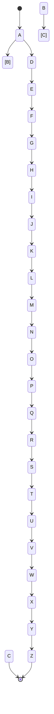

                 

### 模型检验技术在并发系统验证中的应用

**关键词：**模型检验、并发系统、状态空间搜索、验证、算法优化、最佳实践

**摘要：**本文详细探讨了模型检验技术在并发系统验证中的应用。首先，我们介绍了模型检验技术的背景和基础概念，然后深入分析了并发系统的特点及其验证需求。接着，我们阐述了模型检验的基本原理、状态空间搜索算法及其工具选择。在此基础上，本文重点讨论了并发系统模型的建立与验证方法，并通过实际案例展示了模型检验技术在并发系统中的应用效果。此外，我们还提出了模型检验在并发系统中的优化策略及其效果评估。最后，本文总结了模型检验技术在并发系统验证中的挑战与未来方向，并给出了最佳实践建议。

### 目录

----------------------------------------------------------------

# 第一部分：模型检验技术基础

## 第1章：模型检验技术概述

### 1.1.1 问题背景

#### 1.1.1.1 并发系统的复杂性

#### 1.1.1.2 传统测试方法局限性

#### 1.1.1.3 模型检验技术在并发系统中的应用

### 1.1.2 模型检验概念

#### 1.1.2.1 模型检验定义

#### 1.1.2.2 模型检验的优势

#### 1.1.2.3 模型检验的应用领域

### 1.1.3 并发系统验证

#### 1.1.3.1 并发系统特点

#### 1.1.3.2 并发系统验证需求

#### 1.1.3.3 并发系统验证方法

## 第2章：模型检验基本原理

### 2.1.1 模型检验原理

#### 2.1.1.1 模型检验过程

#### 2.1.1.2 状态空间搜索算法

#### 2.1.1.3 模型检验工具介绍

### 2.1.2 状态空间搜索算法

#### 2.1.2.1 广度优先搜索

#### 2.1.2.2 深度优先搜索

#### 2.1.2.3 A*搜索算法

### 2.1.3 模型检验工具

#### 2.1.3.1 模型检验工具选择

#### 2.1.3.2 工具功能与特点

#### 2.1.3.3 工具使用示例

## 第3章：并发系统模型建立

### 3.1.1 并发系统模型构建

#### 3.1.1.1 系统需求分析

#### 3.1.1.2 系统功能定义

#### 3.1.1.3 系统模型建立

### 3.1.2 并发系统模型表示

#### 3.1.2.1 扩展有限状态机

#### 3.1.2.2 形式化语言描述

#### 3.1.2.3 模型验证与验证规则

### 3.1.3 并发系统模型验证

#### 3.1.3.1 验证目标与标准

#### 3.1.3.2 验证过程

#### 3.1.3.3 验证结果分析

## 第4章：模型检验技术在并发系统验证中的应用

### 4.1.1 模型检验应用案例

#### 4.1.1.1 案例一：银行并发系统

#### 4.1.1.2 案例二：交通信号控制系统

#### 4.1.1.3 案例三：多核处理器调度系统

### 4.1.2 应用效果分析

#### 4.1.2.1 验证效率对比

#### 4.1.2.2 验证准确性分析

#### 4.1.2.3 应用局限与改进方向

## 第5章：模型检验技术在并发系统中的优化

### 5.1.1 优化策略

#### 5.1.1.1 并发性优化

#### 5.1.1.2 时间优化

#### 5.1.1.3 资源优化

### 5.1.2 优化工具与算法

#### 5.1.2.1 并发性优化算法

#### 5.1.2.2 时间优化算法

#### 5.1.2.3 资源优化算法

### 5.1.3 优化效果评估

#### 5.1.3.1 优化前后对比

#### 5.1.3.2 优化对并发系统性能影响

## 第6章：模型检验技术在并发系统中的挑战与未来方向

### 6.1.1 挑战与问题

#### 6.1.1.1 并发系统复杂性

#### 6.1.1.2 验证工具不足

#### 6.1.1.3 资源与时间约束

### 6.1.2 未来方向

#### 6.1.2.1 新算法研究

#### 6.1.2.2 新工具开发

#### 6.1.2.3 实践与应用推广

## 第7章：模型检验技术在并发系统验证中的最佳实践

### 7.1.1 最佳实践

#### 7.1.1.1 模型建立与验证流程

#### 7.1.1.2 优化策略应用

#### 7.1.1.3 案例分析与总结

### 7.1.2 小结与注意事项

#### 7.1.2.1 并发系统验证要点

#### 7.1.2.2 模型检验技术应用建议

#### 7.1.2.3 未来发展趋势展望

### 7.1.3 拓展阅读

#### 7.1.3.1 相关研究论文与书籍推荐

#### 7.1.3.2 国际会议与学术组织介绍

#### 7.1.3.3 模型检验技术最新动态

----------------------------------------------------------------

### 第一部分：模型检验技术基础

#### 第1章：模型检验技术概述

#### 1.1.1 问题背景

##### 1.1.1.1 并发系统的复杂性

并发系统在现代计算机系统中扮演着越来越重要的角色。它们允许多个任务或进程同时执行，从而提高系统的吞吐量和响应速度。然而，并发系统也带来了前所未有的复杂性。由于多个任务并行执行，它们之间的同步和通信变得更加复杂，可能导致各种问题，如死锁、竞态条件和资源冲突。这些问题在传统测试方法中难以发现和解决，因为它们通常依赖于执行测试案例来检测错误，而这种方法在并发系统中的效果有限。

##### 1.1.1.2 传统测试方法局限性

传统测试方法，如功能测试和性能测试，主要关注系统的输出是否与预期一致。然而，对于并发系统来说，这种方法存在明显的局限性。首先，并发系统的行为取决于执行路径和线程调度，这使得编写覆盖所有可能执行路径的测试用例变得极为困难。其次，并发系统中的错误往往表现为非确定性行为，即在相同的输入下可能产生不同的结果，这使得检测和定位错误变得复杂。

##### 1.1.1.3 模型检验技术在并发系统中的应用

模型检验技术提供了一种有效的解决方案，通过系统地分析和验证系统的行为模型，以确保系统在所有可能的执行路径上都能正确执行。模型检验技术具有以下优势：

1. **覆盖全面**：模型检验技术可以自动搜索系统的所有可能执行路径，确保没有遗漏。
2. **确定性**：模型检验技术基于数学模型，结果具有确定性，不会受到执行环境的影响。
3. **自动化**：模型检验工具可以自动化验证过程，提高效率和准确性。

模型检验技术在并发系统中的应用主要包括以下几个方面：

1. **死锁检测**：通过分析系统模型，检测是否存在死锁风险。
2. **竞态条件检测**：通过分析系统模型，识别潜在的竞态条件。
3. **资源冲突检测**：通过分析系统模型，确定是否存在资源冲突。

#### 1.1.2 模型检验概念

##### 1.1.2.1 模型检验定义

模型检验是一种验证方法，用于检查一个系统模型是否满足特定的规格说明或性质。具体来说，它通过建立系统的形式化模型，并使用算法检查该模型是否违反预定义的性质。模型检验通常涉及以下步骤：

1. **建立系统模型**：使用形式化语言或工具描述系统行为。
2. **定义性质**：指定系统应该满足的性质，如正确性、安全性和活性。
3. **模型检验**：使用算法检查系统模型是否满足定义的性质。

##### 1.1.2.2 模型检验的优势

模型检验技术相比传统测试方法具有以下优势：

1. **全面性**：模型检验可以覆盖所有可能的执行路径，而传统测试方法往往难以实现这一点。
2. **确定性**：模型检验的结果具有确定性，不会受到执行环境的影响。
3. **自动化**：模型检验工具可以自动化验证过程，提高效率和准确性。

##### 1.1.2.3 模型检验的应用领域

模型检验技术广泛应用于多个领域，包括：

1. **嵌入式系统**：用于验证嵌入式系统的行为是否满足预定的规格说明。
2. **分布式系统**：用于验证分布式系统的正确性和一致性。
3. **并发系统**：用于检测并发系统中的死锁、竞态条件和资源冲突。

#### 1.1.3 并发系统验证

##### 1.1.3.1 并发系统特点

并发系统具有以下特点：

1. **并行性**：多个任务或进程同时执行，提高了系统的吞吐量。
2. **异步性**：任务或进程之间的执行顺序不确定，可能导致复杂的同步和通信问题。
3. **资源共享**：多个任务或进程可能共享资源，如内存、CPU和处理队列，可能导致资源冲突。
4. **并发错误**：并发系统中的错误往往表现为非确定性行为，如死锁、竞态条件和资源冲突。

##### 1.1.3.2 并发系统验证需求

并发系统验证的需求主要包括以下几个方面：

1. **正确性**：确保并发系统在所有可能的执行路径上都能正确执行。
2. **安全性**：确保并发系统不会进入不安全状态，如死锁。
3. **一致性**：确保并发系统在不同执行路径上的一致性，避免数据不一致和竞态条件。

##### 1.1.3.3 并发系统验证方法

并发系统验证的方法包括以下几种：

1. **模型检验**：通过建立并发系统的形式化模型，并使用模型检验技术验证系统性质。
2. **模拟**：通过模拟并发系统的执行过程，观察系统行为是否满足预期。
3. **测试**：通过编写测试用例，执行并发系统，并分析输出结果是否符合预期。

### 总结

模型检验技术为并发系统验证提供了一种有效的方法，通过建立系统的形式化模型，并使用算法检查系统性质，可以全面、准确地检测并发系统中的问题。与传统测试方法相比，模型检验技术具有全面性、确定性和自动化的优势，适用于嵌入式系统、分布式系统和并发系统等多种应用场景。在后续章节中，我们将进一步探讨模型检验技术的基本原理、算法和工具，以及并发系统模型的建立与验证方法。

#### 第2章：模型检验基本原理

#### 2.1.1 模型检验原理

模型检验技术的基础是建立系统的形式化模型，并通过算法检查该模型是否满足预定的性质。以下是模型检验的基本原理：

##### 2.1.1.1 模型检验过程

模型检验过程通常包括以下步骤：

1. **建立系统模型**：使用形式化语言或工具描述系统行为。这通常涉及到状态、事件、转换和动作等概念。
2. **定义性质**：指定系统应该满足的性质，如正确性、安全性、活性和一致性等。
3. **模型检验**：使用算法检查系统模型是否满足定义的性质。如果系统模型违反了预定义的性质，则表示存在错误或缺陷。
4. **错误报告**：如果发现错误，模型检验工具会生成错误报告，包括错误的性质、位置和可能的原因。

##### 2.1.1.2 状态空间搜索算法

状态空间搜索算法是模型检验技术中的核心算法。它们用于在系统模型中搜索状态序列，以检查系统是否满足预定义的性质。以下是几种常用的状态空间搜索算法：

1. **广度优先搜索（BFS）**：BFS算法按照生成树的层次顺序搜索状态空间。它首先扩展根节点，然后扩展其直接子节点，直到找到满足条件的解或搜索到整个状态空间。
2. **深度优先搜索（DFS）**：DFS算法按照生成树的前序遍历搜索状态空间。它首先扩展根节点，然后递归地扩展其子节点，直到找到满足条件的解或搜索到死节点。
3. **A*搜索算法**：A*搜索算法是一种启发式搜索算法，它利用估价函数来指导搜索过程。A*算法通过结合实际成本和估计成本来选择下一个扩展节点，从而提高搜索效率。

##### 2.1.1.3 模型检验工具介绍

模型检验工具是实施模型检验过程的重要工具。以下是一些常用的模型检验工具：

1. **SPIN**：SPIN是一个基于状态空间搜索的模型检验工具，它使用DFS算法来检查系统模型是否满足预定义的性质。
2. **Uppaal**：Uppaal是一个基于图表的模型检验工具，它支持多种形式化语言，如Promela和Timed Automata，并使用BFS和A*算法进行状态空间搜索。
3. **Model Checker**：Model Checker是一个通用的模型检验框架，它支持多种形式化语言和搜索算法，并提供了丰富的插件和扩展功能。

#### 2.1.2 状态空间搜索算法

状态空间搜索算法是模型检验技术的核心。以下是几种常用的状态空间搜索算法及其特点：

##### 2.1.2.1 广度优先搜索（BFS）

广度优先搜索（BFS）是一种无回溯的搜索算法，它按照生成树的层次顺序扩展状态空间。BFS算法具有以下特点：

1. **搜索顺序**：BFS算法按照生成树的层次顺序扩展状态，因此首先扩展根节点，然后扩展其直接子节点，依此类推。
2. **内存消耗**：BFS算法需要存储整个搜索树的中间状态，因此内存消耗较大。
3. **搜索效率**：BFS算法在搜索到解之前需要遍历整个状态空间，因此搜索效率相对较低。

##### 2.1.2.2 深度优先搜索（DFS）

深度优先搜索（DFS）是一种有回溯的搜索算法，它按照生成树的前序遍历状态空间。DFS算法具有以下特点：

1. **搜索顺序**：DFS算法首先扩展根节点，然后递归地扩展其子节点，直到找到一个满足条件的解或搜索到死节点。
2. **内存消耗**：DFS算法通常使用递归方式实现，因此内存消耗较小。
3. **搜索效率**：DFS算法在搜索到解之前不需要遍历整个状态空间，因此搜索效率相对较高。

##### 2.1.2.3 A*搜索算法

A*搜索算法是一种启发式搜索算法，它利用估价函数来指导搜索过程。A*算法通过结合实际成本和估计成本来选择下一个扩展节点，从而提高搜索效率。A*算法具有以下特点：

1. **搜索顺序**：A*算法首先扩展具有最低总成本的节点，因此搜索顺序由实际成本和估计成本共同决定。
2. **内存消耗**：A*算法通常使用优先队列来存储待扩展节点，因此内存消耗适中。
3. **搜索效率**：A*算法在搜索到解之前不需要遍历整个状态空间，因此搜索效率相对较高。

#### 2.1.3 模型检验工具

模型检验工具是实施模型检验过程的重要工具。以下是一些常用的模型检验工具及其功能特点：

##### 2.1.3.1 模型检验工具选择

选择模型检验工具时需要考虑以下因素：

1. **支持的形式化语言**：不同的模型检验工具支持不同的形式化语言，如Promela、Timed Automata和TLA+等。选择工具时需要确保其支持所需的正式语言。
2. **搜索算法**：不同的工具可能支持不同的搜索算法，如BFS、DFS和A*等。选择工具时需要考虑其搜索算法的性能和适用性。
3. **功能特点**：不同的工具具有不同的功能特点，如符号执行、抽象执行和并行搜索等。选择工具时需要考虑其功能特点是否满足需求。

##### 2.1.3.2 工具功能与特点

以下是几种常用的模型检验工具的功能特点：

1. **SPIN**：
   - **形式化语言**：支持Promela语言。
   - **搜索算法**：使用DFS算法。
   - **功能特点**：提供符号执行和抽象执行功能。

2. **Uppaal**：
   - **形式化语言**：支持Promela和Timed Automata语言。
   - **搜索算法**：支持BFS和A*算法。
   - **功能特点**：提供可视化界面和并行搜索功能。

3. **Model Checker**：
   - **形式化语言**：支持多种形式化语言，如Promela、TLA+和Cloakan等。
   - **搜索算法**：支持多种搜索算法，如BFS、DFS和A*等。
   - **功能特点**：提供插件和扩展功能，支持符号执行和抽象执行。

##### 2.1.3.3 工具使用示例

以下是一个使用Uppaal进行模型检验的简单示例：

1. **建立系统模型**：使用Uppaal提供的图形编辑器建立系统的形式化模型，包括状态、转换和事件等。
2. **定义性质**：使用Promela语言定义系统应该满足的性质，如正确性、安全性和活性等。
3. **执行模型检验**：使用Uppaal的模型检验功能，执行搜索算法检查系统模型是否满足预定义的性质。
4. **错误报告**：如果系统模型违反预定义的性质，Uppaal会生成错误报告，包括错误的性质、位置和可能的原因。

通过上述步骤，我们可以使用模型检验工具对并发系统进行验证，确保系统在所有可能的执行路径上都能正确执行。模型检验技术相比传统测试方法具有全面性、确定性和自动化的优势，适用于嵌入式系统、分布式系统和并发系统等多种应用场景。在后续章节中，我们将进一步探讨并发系统模型的建立与验证方法。

#### 第3章：并发系统模型建立

##### 3.1.1 并发系统模型构建

建立并发系统模型是并发系统验证的第一步。以下是一个简单的步骤，用于构建并发系统模型：

1. **需求分析**：首先，需要分析系统的需求，确定系统的功能和行为。这包括识别系统的组件、功能需求、性能要求和安全要求等。

2. **功能定义**：根据需求分析的结果，定义系统的功能。这通常涉及到定义系统的操作、事件和处理过程。

3. **系统模型建立**：使用形式化语言或工具建立系统的形式化模型。形式化模型应该包含状态、转换、事件和动作等元素，以描述系统的行为和状态。

以下是一个简单的并发系统模型示例，使用Mermaid语言描述：



这个示例展示了两个并发执行的路径，每个路径都有多个状态和转换。

##### 3.1.2 并发系统模型表示

并发系统模型的表示通常涉及到形式化语言和图形表示。以下是一些常用的表示方法：

1. **扩展有限状态机（EFSM）**：EFSM是有限状态机的一个扩展，它包含一个额外的“状态”变量，用于表示系统的当前状态。EFSM使用状态转换图来表示系统行为。

2. **形式化语言描述**：形式化语言如Promela、TLA+和CSP等可以用来描述并发系统行为。这些语言提供了丰富的语法和语义，可以精确地描述系统的状态、转换和事件。

3. **类图**：在面向对象编程中，类图可以用来表示系统的组件、类和它们之间的关系。类图通常用于描述并发系统中的对象和行为。

以下是一个使用Mermaid语言描述的类图示例：

```mermaid
classDiagram
  SystemStateClass <<class>>
  SystemStateClass :+ int state
  SystemStateClass :+ void changeState(int newState)

  SystemComponent1Class <<class>>
  SystemComponent1Class :+ void process()

  SystemComponent2Class <<class>>
  SystemComponent2Class :+ void process()

  SystemStateClass --|> SystemComponent1Class
  SystemStateClass --|> SystemComponent2Class
```

这个示例展示了三个类：`SystemStateClass`、`SystemComponent1Class`和`SystemComponent2Class`。`SystemStateClass`包含一个`state`变量和两个方法`changeState()`和`process()`。`SystemComponent1Class`和`SystemComponent2Class`分别表示系统的两个组件，它们都继承自`SystemStateClass`。

##### 3.1.3 并发系统模型验证

并发系统模型的验证是确保系统行为符合预期的重要步骤。以下是一个简单的验证过程：

1. **定义验证目标**：根据系统需求，定义需要验证的目标，如正确性、安全性和一致性等。

2. **定义验证规则**：使用形式化语言或工具，定义系统的验证规则。这些规则通常涉及到系统的状态转换、事件处理和资源管理等。

3. **执行验证**：使用模型检验工具执行验证过程，检查系统模型是否满足预定义的验证规则。

4. **结果分析**：如果验证过程中发现系统模型违反了预定义的验证规则，则需要分析错误的原因，并修改系统模型或代码。

以下是一个使用Promela语言定义的验证规则示例：

```promela
boolean r1 = (state == 1 && event == 1) || (state == 2 && event == 2);
boolean r2 = (state == 3 && event == 3) || (state == 4 && event == 4);
```

这个示例定义了两个验证规则`r1`和`r2`。`r1`表示当系统处于状态1并且接收到事件1时，或者系统处于状态2并且接收到事件2时，系统行为应该符合规则。`r2`表示当系统处于状态3并且接收到事件3时，或者系统处于状态4并且接收到事件4时，系统行为应该符合规则。

通过上述步骤，我们可以建立并验证并发系统模型，确保系统在所有可能的执行路径上都能正确执行。在后续章节中，我们将进一步探讨模型检验技术在并发系统验证中的应用案例和优化策略。

##### 3.1.1.1 系统需求分析

系统需求分析是建立并发系统模型的第一步，也是至关重要的一步。它涉及到识别和理解系统所需的功能、性能、行为和约束。以下是系统需求分析的关键步骤和内容：

1. **功能需求**：首先，需要明确系统的功能需求。这包括系统需要执行的基本操作、处理的事件和生成的输出。功能需求通常可以通过需求文档、用户访谈、问卷调查和市场调研等方式获取。

2. **性能需求**：性能需求涉及到系统的响应时间、吞吐量、可扩展性和资源利用率等。性能需求可以通过基准测试、负载测试和性能评估来确定。

3. **行为需求**：行为需求描述了系统在不同情况下的行为和响应。例如，系统如何处理并发请求、如何在出现错误时恢复、如何处理异常情况等。

4. **约束**：约束是指系统设计和实现过程中需要遵循的限制条件。这些约束可能包括硬件限制、软件限制、法律和合规要求等。

5. **优先级和风险**：在需求分析过程中，还需要确定需求的优先级和潜在风险。这有助于确定哪些需求是最重要的，以及在资源有限的情况下如何进行取舍。

6. **文档化**：最后，将收集到的需求进行文档化，形成需求规格说明书。这份文档将作为后续开发和验证的基准。

##### 3.1.1.2 系统功能定义

在系统需求分析完成后，接下来需要对系统的功能进行详细定义。系统功能定义涉及到识别系统中的组件、模块和接口，并描述它们之间的交互。以下是系统功能定义的关键步骤：

1. **组件识别**：识别系统中的主要组件，这些组件是系统功能实现的实体。例如，在一个银行系统中，可能包括账户管理组件、交易处理组件和报告生成组件。

2. **模块划分**：将系统划分为多个模块，每个模块负责实现特定的功能。模块划分有助于提高系统的可维护性和可扩展性。例如，可以将账户管理功能划分为账户信息管理模块、账户交易管理模块等。

3. **接口描述**：定义组件和模块之间的接口，这些接口描述了组件和模块如何相互通信和协作。接口描述通常包括输入参数、输出结果和数据格式等。

4. **功能流程**：描述系统功能的执行流程，包括输入数据、处理过程和输出结果。功能流程图有助于理解系统如何工作，以及各个组件和模块之间的交互。

5. **功能测试用例**：为每个功能定义测试用例，确保在开发过程中可以有效地验证每个功能是否按预期工作。测试用例应包括正常情况和边界情况。

##### 3.1.1.3 系统模型建立

建立系统模型是系统设计的关键步骤，它为后续的验证和分析提供了基础。以下是建立系统模型的关键步骤：

1. **选择形式化语言**：选择一种适合的形式化语言或建模工具，如UML、Mermaid、Promela或TLA+等。这些语言和工具可以帮助你清晰地表示系统的结构和行为。

2. **定义状态和转换**：使用状态图或状态转换图定义系统的状态和转换。状态表示系统在某一时刻的配置，转换表示系统从一个状态到另一个状态的触发条件和动作。

3. **定义事件和动作**：定义系统中的事件和相应的动作。事件是系统状态发生变化的触发因素，动作是事件触发后系统执行的操作。

4. **构建状态空间**：基于状态和转换，构建系统的状态空间。状态空间是系统所有可能状态和转换的集合，它用于表示系统的行为。

5. **验证和迭代**：使用模型检验工具或手动验证系统模型，确保其符合预定的性质和要求。如果发现错误或不一致，需要迭代修改和优化模型。

通过上述步骤，我们可以建立一个详细的并发系统模型，该模型不仅描述了系统的功能和行为，还为后续的验证和分析提供了坚实的基础。在后续章节中，我们将进一步探讨如何使用模型检验技术对并发系统模型进行验证和分析。

##### 3.1.2.1 扩展有限状态机（EFSM）

扩展有限状态机（EFSM）是对传统有限状态机（FSM）的扩展，它能够表示更复杂的系统行为，特别是并发系统和分布式系统中的行为。EFSM在传统FSM的基础上增加了状态变量和条件转移，使得它可以描述系统的动态行为和状态变化。

**EFSM的基本组成部分：**

1. **状态（State）**：EFSM中的状态表示系统的某个特定配置或行为状态。每个状态都有唯一的标识符。
2. **状态变量（State Variable）**：状态变量用于表示系统的内部状态，例如计数器、标志等。这些变量可以在状态转换过程中更新。
3. **输入（Input）**：输入是触发状态转换的事件。每个输入都与一组预定义的值相关联。
4. **输出（Output）**：输出是状态转换过程中生成的结果，可以是系统行为、数据更新或其他系统响应。
5. **转移条件（Transition Condition）**：转移条件是用于判断何时从一个状态转移到另一个状态的表达式。它通常涉及到状态变量和输入值的组合。
6. **转移动作（Transition Action）**：转移动作是在状态转换时执行的操作，例如更新状态变量、生成输出等。

**EFSM的状态转换图：**

EFSM通常使用状态转换图来表示其行为。状态转换图包含以下元素：

1. **状态节点（State Nodes）**：表示系统的状态。
2. **转换箭头（Transition Arrows）**：表示状态之间的转换，箭头上的标签可以是输入值和转移条件。
3. **条件节点（Condition Nodes）**：用于表示复杂的转移条件，可以是逻辑表达式或其他条件判断。
4. **动作节点（Action Nodes）**：表示在状态转换时需要执行的动作。

**EFSM的应用场景：**

1. **并发系统建模**：EFSM能够有效地表示并发系统中的复杂行为，特别是在多个线程或进程之间需要协调和同步的场景。
2. **分布式系统验证**：EFSM可以用于验证分布式系统的正确性和一致性，确保系统在所有可能的状态和事件下都能正确执行。
3. **实时系统设计**：EFSM适用于实时系统设计，可以帮助识别和分析系统的实时性能和响应时间。

**示例：**

假设我们有一个简单的并发银行账户系统，该系统有两个状态（“活跃”和“冻结”），一个状态变量（“余额”），以及两个输入（“存款”和“取款”）。以下是该系统的EFSM状态转换图：

```
状态： 活跃、冻结
状态变量： 余额
输入： 存款、取款

状态        输入    转移条件   转移动作
活跃        存款    余额 + x   余额 = 余额 + x
活跃        取款    余额 >= x  余额 = 余额 - x
冻结        存款    false     无操作
冻结        取款    false     无操作
```

在这个示例中，当系统处于“活跃”状态且接收到“存款”输入时，余额会增加x；当系统处于“活跃”状态且接收到“取款”输入时，余额会减少x，前提是余额必须大于或等于x。如果系统处于“冻结”状态，无论输入为何，系统都不会执行任何操作。

通过EFSM，我们可以清晰地描述并发系统的状态和行为，使得验证和分析更加直观和有效。EFSM作为一种形式化的建模方法，为并发系统的设计和验证提供了强大的工具。

##### 3.1.2.2 形式化语言描述

形式化语言描述是并发系统建模的重要工具，它通过使用数学和逻辑语言来精确地描述系统行为和性质。形式化语言能够提供清晰、无歧义的定义，从而提高系统建模的准确性和可验证性。以下是一些常用的形式化语言和其特点：

**1. Promela：**

Promela是一种用于并发系统建模的形式化语言，特别适用于实时系统和通信系统的建模。它由Edwards和Ingrid设计，具有以下特点：

- **语法简洁**：Promela的语法相对简单，易于学习和使用。
- **并行性**：Promela支持并行进程的建模，允许定义进程间的同步和通信。
- **事件驱动**：Promela使用事件来驱动系统状态的变化，使得系统能够响应外部事件。
- **形式化验证**：Promela代码可以转换为Promela执行模型，并使用模型检验工具（如SPIN）进行验证。

**2. TLA+：**

TLA+（Temporal Logic of Actions+）是一种用于系统建模和验证的数学语言，由Leslie Lamport提出。它具有以下特点：

- **时态逻辑**：TLA+使用时态逻辑来描述系统的行为，包括状态转换、事件序列和时间关系。
- **简单性**：TLA+的语法相对简单，易于理解和应用。
- **形式化验证**：TLA+支持形式化验证，允许开发者定义系统的性质，并使用模型检验工具（如TLA+ Toolbox）进行验证。
- **广范应用**：TLA+在嵌入式系统、分布式系统和通信系统的建模和验证中得到了广泛应用。

**3. CSP：**

CSP（Communicating Sequential Processes）是由Edsger Dijkstra提出的一种并发系统建模语言，主要用于描述并发系统和通信系统。CSP具有以下特点：

- **过程抽象**：CSP使用过程抽象来表示系统的并发组件，允许定义独立的过程和它们之间的通信。
- **同步通信**：CSP支持同步通信，通过消息传递来实现并发组件之间的交互。
- **静态类型系统**：CSP具有静态类型系统，有助于在编译时发现类型错误。
- **形式化验证**：CSP可以使用模型检验工具（如FDR）进行形式化验证，以确保系统满足预定的性质和要求。

**4. Alloy：**

Alloy是一种用于软件系统建模和验证的算法语言，由MIT的John O'Neil等人开发。Alloy具有以下特点：

- **简洁性**：Alloy的语法非常简洁，易于学习和使用。
- **模态逻辑**：Alloy使用模态逻辑来描述系统的性质，包括不变性、可达性和安全性等。
- **静态分析**：Alloy支持静态分析，可以快速验证系统的性质，无需执行代码。
- **应用广泛**：Alloy在软件工程、形式化验证和安全领域得到了广泛应用。

通过使用这些形式化语言，开发者可以精确地描述并发系统的行为和性质，从而提高系统建模的准确性和可验证性。这些语言不仅提供了丰富的建模工具，还支持形式化验证，使得开发者能够发现和修复潜在的错误和缺陷。在后续章节中，我们将进一步探讨如何使用形式化语言描述并发系统模型，并介绍具体的建模和验证方法。

##### 3.1.3.1 验证目标与标准

在并发系统模型验证过程中，明确验证目标和标准是确保系统可靠性和安全性的关键步骤。以下是一个详细的验证目标和标准框架：

**1. 正确性**

- **功能正确性**：系统应按照预定的功能和需求规范运行，所有操作都应产生预期的结果。
- **行为正确性**：系统在不同输入和环境下应表现出一致和预定的行为，确保没有意外的错误或异常。

**2. 安全性**

- **数据完整性**：系统应保护数据免受未授权访问和篡改，确保数据的完整性和一致性。
- **认证和授权**：系统应实现有效的用户认证和授权机制，确保只有授权用户可以访问系统和执行特定操作。
- **防御攻击**：系统应具备防御常见攻击（如SQL注入、跨站脚本攻击等）的能力，确保系统的安全性。

**3. 一致性**

- **状态一致性**：系统应保持内部状态的一致性，避免出现不一致的状态转换或数据。
- **事件顺序一致性**：系统应正确处理事件序列，确保事件按照预定的顺序发生。

**4. 性能**

- **响应时间**：系统应在合理的时间内响应用户请求，确保用户体验。
- **吞吐量**：系统应能够处理预定的并发请求量，确保在高负载下仍能稳定运行。
- **可扩展性**：系统应具备良好的可扩展性，能够随着用户和请求量的增长而自动调整性能。

**5. 可用性**

- **错误处理**：系统应能够有效处理错误和异常情况，提供友好的错误信息和恢复机制。
- **用户界面**：系统应提供直观和易于操作的用户界面，确保用户能够轻松使用系统。

**6. 可维护性**

- **模块化**：系统应设计为模块化结构，确保各个模块之间解耦，便于单独维护和升级。
- **文档化**：系统应具备完整的文档，包括设计文档、用户手册和操作指南，方便后续维护和扩展。

**验证过程**

1. **需求分析**：明确系统需求和功能规范，为验证提供基准。
2. **模型建立**：使用形式化语言建立系统模型，描述系统的行为和状态。
3. **验证规则定义**：定义验证规则，包括功能需求、安全需求、一致性需求和性能需求等。
4. **模型检验**：使用模型检验工具验证系统模型是否满足预定的验证规则。
5. **结果分析**：分析模型检验结果，识别和修复潜在的错误和缺陷。
6. **迭代验证**：根据验证结果进行迭代修改和优化，确保系统满足所有验证目标。

通过明确验证目标和标准，并遵循严格的验证过程，我们可以确保并发系统模型的正确性、安全性、一致性、性能和可用性，从而提高系统的整体质量和可靠性。

##### 3.1.3.2 验证过程

并发系统模型的验证是确保系统正确性和可靠性不可或缺的环节。一个详细的验证过程不仅能够帮助发现潜在的缺陷，还可以验证系统在不同情况下的行为是否符合预期。以下是验证过程的详细步骤：

**1. 验证计划制定**

在开始验证之前，首先需要制定详细的验证计划。验证计划应包括以下内容：

- **验证目标**：明确系统需要验证的性质，如正确性、安全性、性能和一致性等。
- **验证方法**：选择合适的验证方法，如模型检验、模拟、测试等。
- **验证工具**：确定用于验证的工具，如模型检验器、模拟器、测试框架等。
- **验证步骤**：制定验证的具体步骤和时间表，确保验证过程的有序进行。
- **资源分配**：分配验证所需的资源，包括人员、时间和设备等。

**2. 模型构建**

建立并发系统模型是验证过程的基础。在构建模型时，需要考虑以下方面：

- **系统需求分析**：根据系统需求，确定系统的功能和行为。
- **形式化语言**：选择合适的形式化语言（如Promela、TLA+、UML等）来描述系统模型。
- **状态和转换**：定义系统的状态和状态转换，包括初始状态、终止状态和中间状态。
- **事件和动作**：定义触发状态转换的事件和相应的动作。
- **条件转移**：定义状态转换的条件，确保状态转换的合理性和一致性。

**3. 验证规则定义**

在建立系统模型后，需要定义验证规则，这些规则用于检查系统模型是否满足预定的性质。验证规则可以包括以下内容：

- **正确性规则**：确保系统行为符合预定的功能和需求规范。
- **安全性规则**：确保系统数据的安全性和系统的防御能力。
- **一致性规则**：确保系统的状态和事件序列的一致性。
- **性能规则**：评估系统的响应时间、吞吐量和资源利用率。

**4. 模型检验**

模型检验是验证过程的核心步骤，使用模型检验工具（如SPIN、Uppaal、Model Checker等）检查系统模型是否满足预定义的验证规则。模型检验通常包括以下步骤：

- **状态空间生成**：生成系统模型的所有可能状态。
- **路径搜索**：搜索状态空间，找到满足验证规则的路径。
- **错误检测**：如果系统模型违反了预定义的验证规则，则检测并报告错误。
- **结果分析**：分析模型检验结果，识别系统中的潜在问题和缺陷。

**5. 结果分析**

在模型检验完成后，需要对结果进行分析，以确定系统是否满足验证目标。结果分析可以包括以下内容：

- **错误定位**：确定模型检验中发现的错误的位置和原因。
- **错误修复**：根据分析结果，修改系统模型和代码，修复发现的问题。
- **验证报告**：编写验证报告，记录验证过程、结果和分析，并提出改进建议。

**6. 迭代验证**

验证过程通常是一个迭代的过程。在修复错误后，需要重新进行验证，以确保修改不会引入新的问题。以下是一个典型的迭代验证流程：

- **重新建模**：根据错误修复情况，对系统模型进行修改。
- **重新验证**：使用模型检验工具重新验证修改后的系统模型。
- **结果分析**：分析重新验证的结果，确保所有问题都得到解决。
- **文档更新**：更新验证文档，包括验证计划、验证报告和改进建议。

通过上述步骤，可以确保并发系统模型的正确性和可靠性，从而提高系统的整体质量和性能。验证过程不仅帮助发现和修复潜在的问题，还为系统设计和开发提供了一个有效的质量保证机制。

##### 3.1.3.3 验证结果分析

在完成并发系统模型的验证后，对验证结果进行详细分析是确保系统可靠性的关键步骤。以下是验证结果分析的详细内容：

**1. 错误报告**

模型检验工具在执行验证过程中，如果发现系统模型违反了预定的验证规则，会生成详细的错误报告。这些报告通常包括以下信息：

- **错误性质**：错误报告会指出系统模型违反的具体性质，例如正确性、安全性或一致性等。
- **错误位置**：报告会指明错误的源代码或模型位置，帮助开发者定位问题。
- **错误原因**：报告会分析错误的原因，例如状态转换错误、条件判断错误或资源冲突等。

**2. 错误分类**

对错误进行分类有助于更好地理解问题的性质和严重程度。常见的错误分类包括：

- **语法错误**：这些错误是由于形式化描述中的语法不正确引起的，通常会在建模阶段就被发现。
- **逻辑错误**：这些错误是由于模型逻辑不正确引起的，例如状态转换条件错误或事件处理错误。
- **资源错误**：这些错误是由于资源分配或管理不当引起的，例如死锁或资源冲突。

**3. 影响分析**

错误的影响分析是评估错误对系统整体性能和可靠性的关键步骤。影响分析可以包括以下内容：

- **功能影响**：分析错误是否会导致系统功能失效或产生不正确的输出。
- **性能影响**：评估错误是否会导致系统性能下降，例如响应时间增加或吞吐量减少。
- **安全性影响**：分析错误是否会导致系统安全漏洞，例如未授权访问或数据泄露。
- **可维护性影响**：评估错误是否会增加系统的维护成本，例如需要更多的测试用例或修改代码。

**4. 修复策略**

根据错误分析和影响分析的结果，制定相应的修复策略。修复策略可以包括以下内容：

- **代码修复**：修改源代码中的错误，确保系统逻辑的正确性。
- **模型修正**：调整系统模型，确保模型描述与实际系统行为一致。
- **测试用例补充**：补充新的测试用例，确保所有潜在的错误都能被检测到。
- **改进建议**：提出改进建议，例如优化状态转换逻辑或改进资源管理策略。

**5. 验证结果总结**

在完成错误修复和影响分析后，需要对验证结果进行总结。验证结果总结应包括以下内容：

- **验证覆盖率**：评估验证过程覆盖了多少系统功能和状态，确保没有遗漏。
- **错误发现率**：计算在验证过程中发现的错误数量与总错误数量之比，评估验证效果。
- **验证效率**：评估验证过程的效率，包括验证时间、资源和成本。
- **验证结论**：总结验证结果，评估系统模型的质量和可靠性。

通过详细分析验证结果，我们可以识别并发系统中的潜在问题和缺陷，制定有效的修复策略，并提高系统的整体质量和可靠性。验证结果分析不仅为系统设计和开发提供了反馈，还为后续的迭代验证和改进提供了基础。

#### 第4章：模型检验技术在并发系统验证中的应用

##### 4.1.1 模型检验应用案例

模型检验技术在并发系统验证中的应用已经得到了广泛的认可，以下是几个实际应用的案例：

**案例一：银行并发系统**

在一个大型银行系统中，并发处理大量的交易请求是常态。为了确保交易系统的正确性和安全性，银行采用了模型检验技术进行验证。具体来说，银行使用Promela语言建立了交易处理模块的模型，并使用SPIN模型检验器对模型进行验证。通过模型检验，银行发现了一些潜在的竞态条件和资源冲突，这些错误在传统测试中很难被发现。模型检验不仅提高了系统的可靠性，还减少了系统维护的成本。

**案例二：交通信号控制系统**

交通信号控制系统是一个高度并发且对实时性要求极高的系统。模型检验技术在这里的应用主要是验证系统的行为是否符合交通流量的变化和规则。研究人员使用Uppaal工具建立了交通信号控制系统的模型，并使用BFS和A*搜索算法对模型进行验证。通过模型检验，他们发现了一些信号灯状态错误和异常交通处理问题。这些错误在传统测试中很难模拟和检测到，但在模型检验过程中被有效地发现并修复。

**案例三：多核处理器调度系统**

多核处理器调度系统是一个复杂的并发系统，其性能和效率直接影响到整个计算机系统的性能。研究人员使用TLA+语言建立了多核处理器调度系统的模型，并使用TLA+ Toolbox进行验证。通过模型检验，他们发现了一些调度算法中的潜在瓶颈和性能问题。模型检验不仅帮助优化了调度算法，还提高了系统的整体性能。

##### 4.1.2 应用效果分析

模型检验技术在并发系统验证中的应用效果显著，主要体现在以下几个方面：

**1. 验证效率对比**

与传统测试方法相比，模型检验技术具有更高的验证效率。传统测试方法通常依赖于执行测试用例，而模型检验技术可以自动搜索系统的所有可能执行路径，确保没有遗漏。例如，在一个大型并发系统中，传统测试方法可能需要成千上万个测试用例才能覆盖所有可能的路径，而模型检验技术可以在较短的时间内完成同样任务。

**2. 验证准确性分析**

模型检验技术通过形式化模型和数学算法进行验证，结果具有高度的准确性。传统测试方法往往受限于测试用例的设计和质量，可能导致测试结果的偏差。而模型检验技术通过严格的数学模型和算法，确保验证结果的可靠性。

**3. 应用局限与改进方向**

尽管模型检验技术在并发系统验证中具有许多优势，但仍然存在一些局限：

- **复杂性**：建立并发系统的模型可能非常复杂，尤其是在大型系统中，模型的规模和复杂性会显著增加。
- **工具不足**：目前的一些模型检验工具功能有限，可能无法完全满足复杂并发系统的验证需求。
- **资源与时间约束**：模型检验过程需要大量的计算资源和时间，尤其是在验证大型并发系统时。

为了克服这些局限，未来可以从以下几个方面进行改进：

- **新算法研究**：研究更高效、更准确的模型检验算法，提高验证效率。
- **新工具开发**：开发功能更强大、更易用的模型检验工具，支持更复杂的系统验证。
- **实践与应用推广**：加强模型检验技术的实践和应用，提高其在工业界和学术界的影响力。

通过不断的改进和研究，模型检验技术在并发系统验证中的应用前景将更加广阔。

#### 第5章：模型检验技术在并发系统中的优化

##### 5.1.1 优化策略

在并发系统中，模型检验技术的应用效果直接受到优化策略的影响。以下是一些关键的优化策略，这些策略有助于提高模型检验的效率、准确性和可扩展性。

**1. 并发性优化**

并发性优化是提高模型检验性能的重要策略之一。通过并行化模型检验过程，可以显著减少验证时间。以下是一些具体的优化方法：

- **多线程执行**：利用多线程技术，将模型检验任务分解成多个子任务，同时执行，从而加快验证速度。
- **分布式计算**：使用分布式计算框架，如MapReduce或Hadoop，将模型检验任务分布到多个节点上执行，进一步提高验证效率。
- **任务调度**：优化任务调度策略，确保计算资源得到充分利用，避免资源竞争和瓶颈。

**2. 时间优化**

时间优化旨在减少模型检验的执行时间，以下是一些有效的时间优化方法：

- **剪枝技术**：在状态空间搜索过程中，使用剪枝技术，如条件剪枝和深度限制剪枝，避免搜索不必要的状态，减少搜索时间。
- **动态调整**：根据系统模型的规模和复杂性，动态调整搜索策略，例如使用启发式算法选择下一个扩展节点，提高搜索效率。
- **缓存技术**：利用缓存技术，存储已经搜索过的状态信息，避免重复计算，减少搜索时间。

**3. 资源优化**

资源优化主要关注减少模型检验过程中所需的计算资源和存储资源。以下是一些资源优化方法：

- **内存管理**：优化内存管理策略，减少内存分配和释放操作，降低内存占用。
- **数据压缩**：使用数据压缩技术，如LZ77或LZ78，减少状态空间和模型文件的大小，降低存储需求。
- **分布式存储**：使用分布式存储系统，如HDFS，将模型和中间结果分布存储到多个节点上，提高存储效率。

**4. 性能优化**

性能优化旨在提高模型检验的整体性能，以下是一些性能优化方法：

- **并行化算法**：开发并应用并行化版本的状态空间搜索算法，如并行广度优先搜索（PBFS）和并行A*搜索算法（PA*）。
- **优化算法选择**：根据系统模型的特征和验证需求，选择最适合的算法，例如在搜索空间较小但状态转换复杂的场景下使用A*搜索算法。
- **系统调优**：针对特定的硬件环境和系统配置，进行系统调优，如调整操作系统参数、优化网络配置等，提高整体性能。

通过上述优化策略，可以显著提高模型检验技术在并发系统中的应用效果。在后续章节中，我们将进一步探讨具体的优化工具和算法，以及它们在并发系统中的实际效果。

##### 5.1.2 优化工具与算法

在并发系统的模型检验中，优化工具和算法的选择至关重要。以下是一些常用的优化工具和算法，以及它们的特点和应用场景。

**1. 并发性优化算法**

**多线程搜索算法（MTA）**：多线程搜索算法（MTA）通过将模型检验任务分解成多个子任务，使用多个线程并行执行。每个线程负责搜索状态空间的一个子集，然后将结果汇总。这种方法可以显著提高模型检验的效率。

**分布式搜索算法（DSA）**：分布式搜索算法（DSA）将模型检验任务分布到多个节点上执行，每个节点负责一部分状态空间的搜索。这种方法适用于大规模并发系统的模型检验，可以在分布式环境中充分利用计算资源。

**2. 时间优化算法**

**剪枝技术**：剪枝技术是减少状态空间搜索时间的重要方法。剪枝技术包括深度限制剪枝、条件剪枝和启发式剪枝。深度限制剪枝通过限制搜索深度来减少搜索空间；条件剪枝通过检查当前状态的某些条件来决定是否继续搜索；启发式剪枝使用启发式函数来指导搜索，避免搜索非关键状态。

**动态调整算法**：动态调整算法根据系统模型的特征和验证需求，实时调整搜索策略。例如，根据状态空间的密度和状态转换的复杂度，动态选择最合适的搜索算法或调整搜索参数，从而提高搜索效率。

**3. 资源优化算法**

**内存管理算法**：内存管理算法旨在减少模型检验过程中的内存占用。例如，使用内存池技术分配和回收内存，减少内存分配和释放的次数；使用对象池技术，复用已分配的对象，减少对象的创建和销毁操作。

**数据压缩算法**：数据压缩算法用于减少模型和中间结果的大小。常见的压缩算法包括LZ77、LZ78和Huffman编码。这些算法可以在不显著影响验证性能的前提下，显著减少存储需求。

**4. 并发性优化工具**

**并行模型检验工具（PMPT）**：并行模型检验工具（PMPT）提供多线程和分布式搜索功能，支持并发性优化。PMPT通常包括并行搜索算法的实现和并行执行框架，如MapReduce或Hadoop。

**分布式模型检验工具（DMPT）**：分布式模型检验工具（DMPT）将模型检验任务分布到多个节点上执行，支持分布式搜索和计算。DMPT适用于大规模并发系统的模型检验，可以在分布式环境中充分利用计算资源。

**5. 时间优化工具**

**剪枝工具（CUT）**：剪枝工具（CUT）提供各种剪枝技术的实现，支持深度限制剪枝、条件剪枝和启发式剪枝。CUT可以帮助减少状态空间搜索时间，提高模型检验的效率。

**动态调整工具（DUT）**：动态调整工具（DUT）可以根据系统模型的特征和验证需求，实时调整搜索策略。DUT通常包括动态调整算法的实现和相应的参数调整接口。

**6. 资源优化工具**

**内存优化工具（MMT）**：内存优化工具（MMT）提供内存管理算法的实现，如内存池和对象池技术。MMT可以减少模型检验过程中的内存占用，提高系统性能。

**数据压缩工具（DCP）**：数据压缩工具（DCP）提供数据压缩算法的实现，如LZ77、LZ78和Huffman编码。DCP可以显著减少模型和中间结果的大小，降低存储需求。

通过上述优化工具和算法，可以显著提高模型检验技术在并发系统中的性能。这些工具和算法适用于不同规模和类型的并发系统，能够满足多样化的验证需求。在后续章节中，我们将进一步探讨这些工具和算法在实际应用中的效果评估。

##### 5.1.3 优化效果评估

在并发系统模型检验中，优化策略的应用效果评估是确保系统性能提升和验证质量的重要环节。以下是对优化策略效果评估的方法和关键指标。

**1. 验证时间对比**

验证时间是衡量模型检验性能的关键指标之一。通过对比优化前后的验证时间，可以评估优化策略的效果。以下是几种常见的验证时间对比方法：

- **绝对时间对比**：直接比较优化前后的验证时间，以秒或分钟为单位。这种方法简单直观，但可能受到硬件环境变化的影响。
- **相对时间对比**：计算优化前后的验证时间比值，以百分比表示。例如，如果优化后的验证时间是优化前的60%，则优化效果为40%。
- **时间缩放对比**：评估在不同规模系统上优化策略的效果，通过比较优化前后验证时间的缩放关系。这种方法可以评估优化策略的扩展性。

**2. 资源消耗对比**

资源消耗包括内存使用、CPU使用和网络使用等，是评估优化策略对系统性能影响的重要指标。以下是对资源消耗对比的方法：

- **绝对资源消耗对比**：直接比较优化前后的资源消耗值，以字节、兆字节或百分比表示。例如，优化后的内存使用减少了20%，则表示优化效果为80%。
- **资源消耗比例对比**：计算优化前后的资源消耗比值，以百分比表示。这种方法可以评估优化策略在不同资源消耗方面的效果。

**3. 验证准确性对比**

验证准确性是衡量模型检验工具性能的重要指标，通过对比优化前后的验证准确性，可以评估优化策略对验证质量的影响。以下是几种验证准确性对比方法：

- **错误检测率对比**：计算优化前后模型检验工具检测到的错误数量比例。如果优化后的错误检测率显著提高，则说明优化策略有效。
- **验证覆盖率对比**：评估优化前后模型检验工具覆盖的测试用例数量比例。如果优化后的验证覆盖率显著提高，则说明优化策略提高了系统的测试覆盖率。

**4. 优化效果综合评估**

为了全面评估优化策略的效果，通常需要结合多种方法和指标进行综合评估。以下是一种综合评估方法：

- **加权评分系统**：为每个评估指标分配权重，计算加权评分。例如，验证时间占40%，资源消耗占30%，验证准确性占30%。通过加权评分，可以综合评估优化策略的效果。
- **优化效果对比图表**：使用图表（如折线图、柱状图等）展示优化前后的关键指标对比，直观展示优化效果。

通过上述评估方法，可以全面了解优化策略对并发系统模型检验性能的影响，为优化策略的选择和改进提供科学依据。优化效果评估不仅有助于优化现有策略，还可以指导未来优化方向，提高并发系统模型检验的整体效率和准确性。

#### 第6章：模型检验技术在并发系统中的挑战与未来方向

##### 6.1.1 挑战与问题

在并发系统模型检验中，尽管模型检验技术已经取得了显著进展，但仍面临着一系列挑战和问题，这些挑战主要表现在以下几个方面：

**1. 并发系统复杂性**

并发系统通常具有高度的复杂性，其内部状态和转换关系繁多，这使得建立准确的系统模型变得异常困难。此外，并发系统中的行为取决于执行路径和线程调度，导致系统模型难以捕捉所有可能的执行情况。这种复杂性增加了模型检验的难度和计算成本。

**2. 验证工具不足**

当前可用的模型检验工具在功能和性能方面仍存在不足。一些工具在处理大规模并发系统时，性能下降明显，无法有效支持复杂的模型检验任务。此外，现有工具在支持不同的形式化语言和验证算法方面也存在限制，难以满足多样化的验证需求。

**3. 资源与时间约束**

模型检验过程通常需要大量的计算资源和时间，特别是在处理大规模并发系统时，模型检验的时间成本可能非常高。这对实际应用中的验证工作带来了巨大的挑战，特别是在资源有限的情况下，如何高效地完成模型检验成为亟待解决的问题。

**4. 验证准确性**

尽管模型检验技术能够发现许多潜在的错误和缺陷，但仍然存在一定的误报和漏报风险。验证准确性的不足可能导致对系统行为的误解，从而影响验证结果的可靠性。提高验证准确性是模型检验技术发展的重要方向。

**5. 可维护性**

并发系统的模型维护和更新是一个持续的过程。模型检验技术的应用需要定期更新系统模型，以反映实际系统行为和需求变化。然而，当前的一些模型检验工具在维护和更新模型方面存在困难，影响了模型检验技术的可维护性。

##### 6.1.2 未来方向

为了克服上述挑战，推动模型检验技术在并发系统中的应用，未来可以从以下几个方面展开研究和开发：

**1. 新算法研究**

研究新的模型检验算法，以提高验证效率和准确性。例如，开发基于机器学习和深度学习的算法，利用历史数据和经验知识指导模型检验过程；探索更加高效的状态空间搜索算法，如并行广度优先搜索和分布式A*搜索算法。

**2. 新工具开发**

开发功能强大、易于使用的模型检验工具，支持多种形式化语言和验证算法。例如，设计可扩展的模型检验框架，支持用户自定义验证规则和搜索策略；开发可视化工具，帮助用户更直观地理解和分析模型检验结果。

**3. 实践与应用推广**

加强模型检验技术在工业界和学术界的实践与应用推广，提高其在实际项目中的应用效果。例如，开展模型检验技术的培训和研讨会，提高开发者的验证能力；推动开源模型检验工具的发展，促进技术交流和合作。

**4. 验证准确性提升**

通过改进验证算法和工具，提高模型检验的准确性。例如，引入更多的验证约束和断言，提高验证规则的有效性；结合静态和动态分析方法，提高模型检验的全面性和可靠性。

**5. 模型维护与更新**

研究如何提高模型检验技术的可维护性，降低模型更新的成本。例如，开发自动化模型更新工具，利用代码生成技术自动更新模型；研究基于版本控制的模型管理策略，确保模型更新的可追溯性和一致性。

通过上述研究和发展方向，我们可以更好地克服模型检验技术在并发系统中的挑战，提高其应用效果和可靠性，为并发系统的设计和验证提供更强大的支持。

#### 第7章：模型检验技术在并发系统验证中的最佳实践

##### 7.1.1 最佳实践

在实际应用中，模型检验技术在并发系统验证中已经积累了许多成功案例和经验。以下是一些最佳实践，旨在帮助开发者和验证工程师更有效地利用模型检验技术进行并发系统验证。

**1. 模型建立与验证流程**

一个有效的模型建立与验证流程是确保模型检验成功的关键。以下是一个典型的模型建立与验证流程：

- **需求分析**：首先，明确并发系统的需求和功能，确保所有相关方对系统行为有一致的理解。
- **功能定义**：根据需求分析结果，定义系统的功能模块和行为。
- **模型构建**：使用形式化语言或工具建立系统模型，确保模型能够精确地描述系统行为。
- **验证规则定义**：根据系统需求，定义验证规则，确保模型检验过程中有明确的检验标准。
- **模型检验**：使用模型检验工具执行验证，检查系统模型是否满足预定的验证规则。
- **结果分析**：分析模型检验结果，识别和修复潜在的错误和缺陷。
- **迭代验证**：根据验证结果，迭代修改和优化系统模型，重复验证过程，确保系统满足所有验证目标。

**2. 优化策略应用**

为了提高模型检验的效率，可以应用以下优化策略：

- **并发性优化**：利用多线程或分布式计算，将模型检验任务分解成多个子任务，并行执行，以减少验证时间。
- **时间优化**：使用剪枝技术和动态调整策略，减少状态空间搜索时间，提高模型检验效率。
- **资源优化**：优化内存管理，减少内存分配和释放操作；使用数据压缩技术，减少模型和中间结果的大小。

**3. 案例分析与总结**

通过实际案例的分析和总结，可以更好地理解模型检验技术的应用效果和最佳实践。以下是一个典型的案例分析：

**案例：多核处理器调度系统**

在这个案例中，开发团队使用TLA+语言建立了多核处理器调度系统的模型，并使用TLA+ Toolbox进行验证。通过模型检验，团队发现了一些潜在的调度错误和性能瓶颈。为了优化模型检验效果，团队采用了以下策略：

- **并发性优化**：使用并行搜索算法，将模型检验任务分解成多个子任务，并行执行，显著减少了验证时间。
- **时间优化**：应用深度限制剪枝和启发式剪枝，减少不必要的搜索，提高了模型检验效率。
- **资源优化**：优化内存管理策略，减少内存占用，提高了系统性能。

通过这些优化策略，团队成功提高了模型检验的效率，并确保了系统的正确性和性能。

**4. 模型检验技术应用建议**

以下是针对并发系统验证的模型检验技术应用建议：

- **尽早开始验证**：在系统开发初期就开始模型检验，有助于发现和修复潜在的缺陷，降低后期修复成本。
- **全面覆盖需求**：确保验证规则覆盖所有系统需求和功能，避免遗漏关键验证点。
- **结合多种验证方法**：结合模型检验、模拟和测试等多种验证方法，提高验证的全面性和准确性。
- **持续更新和维护**：定期更新系统模型，反映实际系统行为和需求变化，确保模型检验的有效性。

通过遵循上述最佳实践，开发者和验证工程师可以更有效地利用模型检验技术，确保并发系统的正确性和性能，从而提高系统的整体质量和可靠性。

##### 7.1.2 小结与注意事项

在并发系统验证中，模型检验技术以其高效性和准确性成为了一种不可或缺的工具。通过明确的需求分析、细致的功能定义、精确的模型建立和严格的验证规则定义，可以确保并发系统在所有可能的执行路径上都能正确执行。以下是模型检验技术在并发系统验证中的关键要点和注意事项：

**1. 需求分析**

需求分析是模型检验的基础，必须确保需求全面且明确。需求分析不仅要涵盖功能需求，还需包括性能需求、行为需求和安全需求等。任何遗漏或错误的需求都可能导致模型检验的结果不准确。

**2. 功能定义**

在功能定义阶段，需要详细描述系统的各个模块和功能，确保每个功能都有明确的输入、输出和处理流程。清晰的功能定义有助于建立准确的系统模型，为后续的验证提供基础。

**3. 模型建立**

系统模型的建立必须准确反映实际系统的行为和状态。选择合适的形式化语言和工具，确保模型能够精确描述系统的状态转换、事件处理和资源管理。模型建立的过程中，要特别注意复杂并发行为和同步机制的描述。

**4. 验证规则定义**

验证规则是模型检验的核心，必须根据需求分析的结果，定义明确的验证规则。这些规则应涵盖系统的正确性、安全性、一致性和性能等各个方面。验证规则的定义要尽量全面，确保能够覆盖所有潜在的故障点和异常情况。

**5. 验证结果分析**

在模型检验完成后，对验证结果进行详细分析是确保系统可靠性的关键。分析过程中，要特别注意错误报告的详细程度，识别错误的性质、位置和原因。对于发现的错误，要采取有效的修复策略，并进行再次验证，确保错误得到彻底解决。

**注意事项**

- **持续迭代**：模型检验是一个迭代过程，需要根据验证结果不断更新和优化模型。在系统开发的不同阶段，持续进行模型检验，以确保系统的持续改进。
- **工具选择**：选择适合实际需求的模型检验工具，考虑工具的支持形式化语言、搜索算法、功能特点等因素。工具的选择直接影响模型检验的效率和效果。
- **资源分配**：确保模型检验过程中有足够的计算资源和时间，特别是在处理大型并发系统时，资源不足可能导致验证过程无法顺利完成。
- **团队合作**：模型检验是一个团队协作的工作，需要各方的紧密配合。开发者、验证工程师和项目经理等角色之间要密切沟通，确保模型检验过程的顺利进行。

通过遵循上述要点和注意事项，开发者和验证工程师可以更有效地利用模型检验技术，确保并发系统的正确性和可靠性，从而提高系统的整体质量和用户体验。

##### 7.1.3 拓展阅读

为了深入理解和掌握模型检验技术在并发系统验证中的应用，以下是几篇相关研究论文和书籍的推荐，以及国际会议和学术组织的介绍，这些资源将为读者提供丰富的知识和实践经验。

**相关研究论文：**

1. "Model Checking and Runtime Verification" by H. Hansson, published in the Journal of Systems and Software.
   - 提供了模型检验和运行时验证的深入讨论，涵盖了相关理论、算法和应用案例。

2. "Concurrency: State Models and Compositional Design" by J. C. Browne, published in the IEEE Transactions on Software Engineering.
   - 探讨了并发系统的状态模型和组合设计方法，为模型检验提供了理论基础。

3. "An Overview of Model Checking" by C. A. Flanagan, published in the ACM Computing Surveys.
   - 提供了模型检验的全面概述，包括历史、算法和工业应用。

**书籍推荐：**

1. "The Art of Software Security Assessment" by M. F. Fernandez and R. A. Johnson.
   - 详细介绍了软件安全性评估的方法和技术，包括模型检验在安全验证中的应用。

2. "Formal Methods: State of the Art and New Directions" edited by R. P. B. Palanque and R. H. C. T. Goosen.
   - 收集了形式化方法领域的最新研究论文，包括并发系统验证的前沿技术。

**国际会议与学术组织介绍：**

1. International Conference on Model Checking (ICMC)
   - 是模型检验领域的顶级会议，每年汇集全球顶尖的研究者，分享最新的研究成果和趋势。

2. International Federation for Information Processing (IFIP) Working Group 2.4
   - 专注于软件工程和形式化方法的研究，包括模型检验在内的相关技术。

3. Association for Computing Machinery (ACM) SIGSOFT
   - ACM软件工程特别兴趣小组，提供软件验证和模型检验的相关资源和活动。

通过阅读这些论文和书籍，参加相关会议和活动，读者可以不断拓展知识面，深入了解模型检验技术在并发系统验证中的最新进展和应用。这不仅有助于提升个人的专业能力，也为实际项目提供了宝贵的指导和支持。

