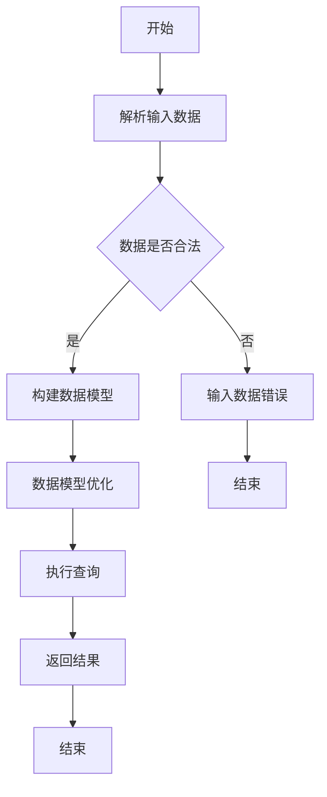
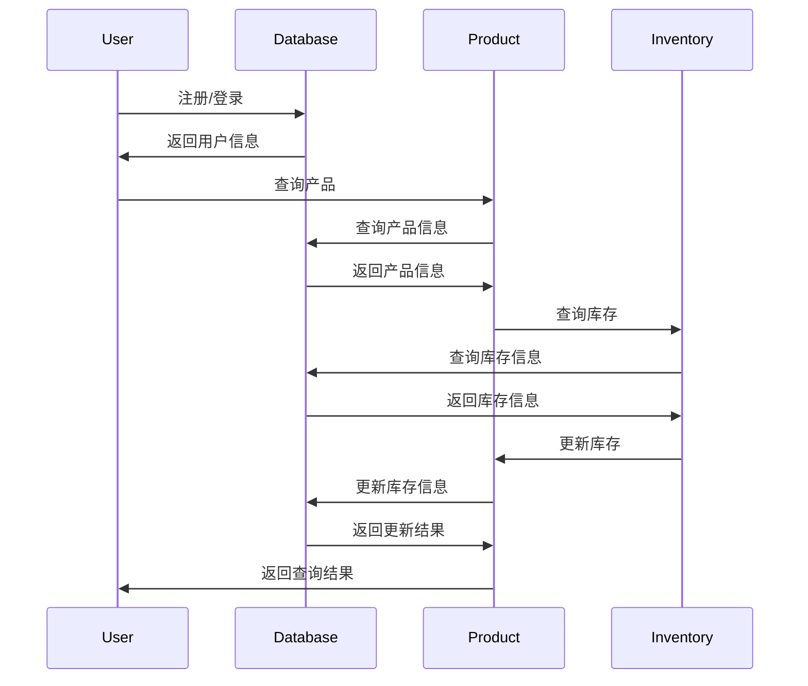
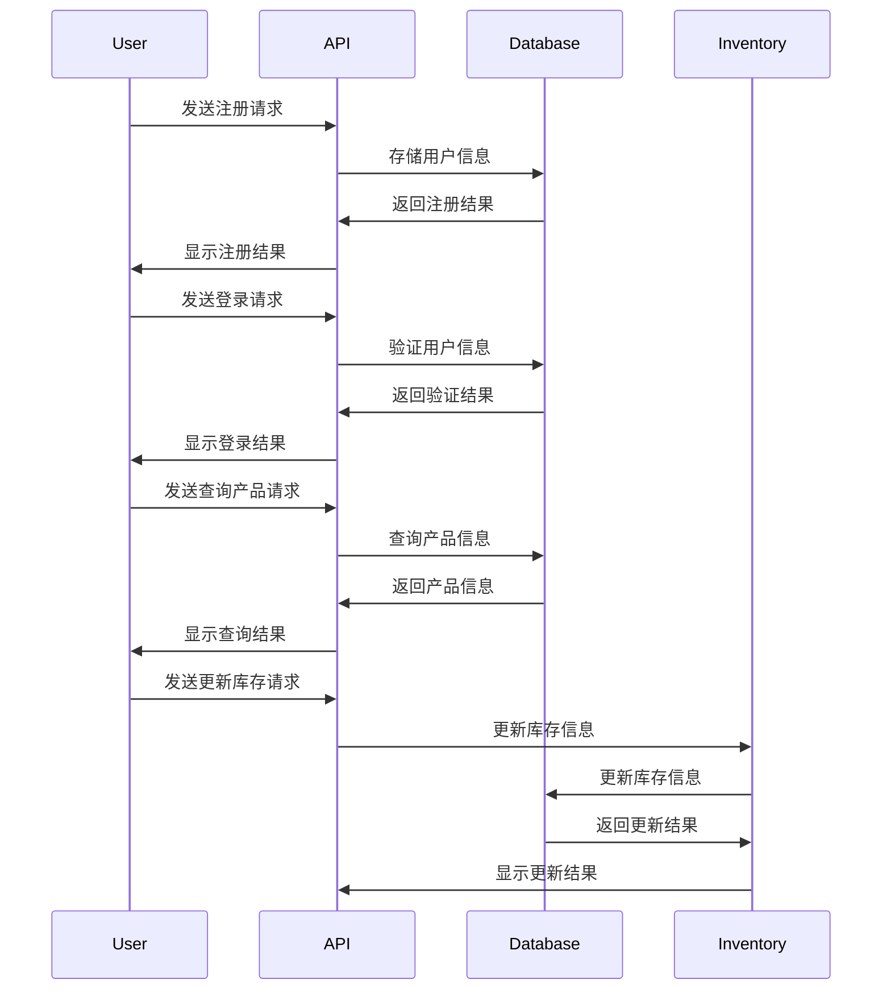

                 

### 《模型论在数据库理论中的应用》目录大纲

在撰写《模型论在数据库理论中的应用》这篇技术博客文章时，我们将采用结构化的方式，确保文章的逻辑清晰、内容丰富且易于理解。以下是我们详细的目录大纲设计步骤：

#### 1. **确定书的基本结构**

根据题目《模型论在数据库理论中的应用》，本书主要分为三个部分：

- **理论介绍**：介绍数据库理论和模型论的基础知识。
- **模型应用**：展示模型论在实际数据库系统中的应用。
- **案例分析**：通过具体案例说明模型论在数据库设计中的实际效果。

#### 2. **设计背景介绍部分**

**2.1 问题背景**
- **数据库理论的基本概念**：介绍数据库系统的基础理论，如数据模型、关系模型等。
- **模型论的基本概念**：介绍模型论的基本理论，如模型的定义、类型、特征等。

**2.2 问题描述**
- **现有数据库模型的不足**：讨论现有数据库模型在性能、扩展性、数据一致性等方面的局限性。
- **模型论如何改进**：探讨模型论如何通过引入新的模型概念或优化现有模型来解决上述问题。

**2.3 问题解决**
- **模型论在数据库理论中的应用方法**：阐述模型论在数据库设计、优化和维护中的应用策略。
- **预期效果**：预测模型论在数据库理论中的应用将带来的性能提升和改进。

**2.4 边界与外延**
- **本书讨论的范围**：明确本书的重点，如特定类型的数据库、特定的模型类型等。
- **相关领域的交叉融合**：介绍模型论在数据库理论之外的领域中的应用潜力。

**2.5 概念结构与核心要素组成**
- **核心概念**：详细介绍模型论中的核心概念，如数据模型、关系模型、模型优化等。
- **结构组成**：分析这些概念之间的逻辑关系和结构。

#### 3. **设计核心概念与联系部分**

**3.1 核心概念原理**
- **数据模型**：解释数据模型的基本原理，如层次模型、网络模型、关系模型等。
- **关系模型**：详细阐述关系模型的基本概念和理论，包括实体、属性、关系等。
- **模型优化**：介绍模型优化的方法和技术，如查询优化、索引优化等。

**3.2 概念属性特征对比表格**
- **数据模型对比**：列出不同数据模型的特点和适用场景，形成对比表格。
- **关系模型对比**：分析关系模型的不同类型及其适用性。

**3.3 ER实体关系图架构的Mermaid流程图**
- **ER图绘制**：使用Mermaid语法绘制ER图，展示实体和实体之间的关系。

#### 4. **设计算法原理讲解部分**

**4.1 算法流程图**
- **算法流程**：使用Mermaid绘制算法的基本流程图。

**4.2 Python源代码阐述**
- **代码实现**：提供算法的Python代码实现，并进行详细解释。

**4.3 数学模型和公式**
- **公式解释**：使用latex格式书写算法背后的数学模型和公式。

**4.4 算法举例说明**
- **实例分析**：通过具体实例来说明算法的应用和效果。

#### 5. **设计系统分析与架构设计方案部分**

**5.1 问题场景介绍**
- **应用场景**：描述模型论在数据库系统中的应用场景。

**5.2 项目介绍**
- **案例背景**：介绍一个实际的项目案例。

**5.3 系统功能设计**
- **领域模型类图**：使用Mermaid绘制系统的核心功能类图。

**5.4 系统架构设计**
- **架构图绘制**：绘制系统架构图，展示系统各组件之间的关系。

**5.5 系统接口设计和系统交互**
- **接口设计**：使用Mermaid绘制系统接口设计和交互序列图。

#### 6. **设计项目实战部分**

**6.1 环境安装**
- **安装指南**：描述安装所需的环境和工具。

**6.2 系统核心实现源代码**
- **代码片段**：提供关键代码片段，并进行解读。

**6.3 代码应用解读与分析**
- **代码解析**：分析代码的功能和作用。

**6.4 实际案例分析和详细讲解剖析**
- **案例研究**：分析一个实际案例，详细讲解模型论的应用。

**6.5 项目小结**
- **总结**：总结项目经验，提出改进意见。

#### 7. **设计最佳实践 tips、小结、注意事项、拓展阅读等内容**

**7.1 最佳实践 tips**
- **实践经验**：提供实际操作中的技巧和建议。

**7.2 小结**
- **总结回顾**：总结全书内容，强调重点。

**7.3 注意事项**
- **风险提示**：提醒读者在实践中的潜在问题和风险。

**7.4 拓展阅读**
- **参考文献**：推荐相关的参考文献和资料。

---

通过以上详细的设计步骤，我们可以确保《模型论在数据库理论中的应用》这篇文章在结构上紧凑、内容上丰富，能够有效地传达模型论在数据库理论中的重要性及其应用价值。接下来，我们将按照这个大纲逐步撰写文章内容。 

---

# 《模型论在数据库理论中的应用》

关键词：模型论、数据库理论、应用、性能优化、系统架构

摘要：本文深入探讨了模型论在数据库理论中的应用，从基本概念、核心原理到具体算法和实际案例，系统地介绍了模型论如何改进和优化数据库系统的性能。通过本文的阅读，读者可以全面了解模型论在数据库系统设计、优化和维护中的重要作用。

---

## 引言

在现代信息技术领域，数据库系统作为信息管理的重要工具，已经广泛应用于各个行业。然而，随着数据量的急剧增长和数据复杂性的增加，现有的数据库模型在性能、扩展性、数据一致性等方面面临着诸多挑战。为了解决这些问题，模型论作为数学理论的一个重要分支，逐渐在数据库理论中发挥着重要作用。

模型论提供了对数据结构、数据关系和数据处理过程的抽象和描述，通过对现有数据库模型的改进和优化，可以提高数据库系统的性能和可靠性。本文将围绕模型论在数据库理论中的应用进行探讨，从理论介绍、模型应用和案例分析三个部分，详细阐述模型论如何提升数据库系统的效率和效果。

在接下来的章节中，我们将首先介绍数据库理论和模型论的基本概念，分析现有数据库模型的不足，阐述模型论在数据库理论中的应用方法和预期效果。然后，我们将深入探讨模型论中的核心概念和联系，使用Mermaid流程图和Python代码详细解释算法原理。接着，我们将介绍模型论在系统分析与架构设计中的应用，通过一个实际项目案例进行详细分析。最后，我们将总结项目经验，提供最佳实践建议，并指出实践中的注意事项。

通过本文的阅读，读者将能够全面了解模型论在数据库理论中的应用，掌握模型论的核心原理和算法，并能够将其应用于实际的数据库系统设计和优化中。希望本文能够为读者在数据库技术领域的研究和实践提供有益的参考。

---

## 第1章 数据库理论基础

### 1.1 数据库的基本概念

数据库（Database）是一个按照数据结构来组织、存储和管理数据的仓库。它是一个长期存储在计算机内的、有组织的、可共享的统一管理的大量数据的集合。数据库系统（Database System）是由数据库、数据库管理系统（DBMS）和应用程序组成的整体，用于定义、创建、维护和使用数据库。

数据库系统的主要功能包括数据存储、数据查询、数据更新、数据备份和恢复等。其中，数据查询和数据更新是数据库系统最核心的功能。数据查询是指用户可以通过查询语言（如SQL）对数据库中的数据进行检索、筛选和排序等操作。数据更新则包括数据的插入、删除和修改等操作。

数据库系统按照数据模型的不同可以分为以下几类：

- **层次模型**：以树形结构表示实体及其之间的关系，是最早的数据库模型之一。层次模型的典型代表是IBM的IMS系统。
- **网络模型**：以网状结构表示实体及其之间的关系，类似于层次模型的扩展。网络模型的典型代表是IBM的DB2系统。
- **关系模型**：以表格形式表示实体及其之间的关系，是目前最常用的数据库模型。关系模型的典型代表是SQL数据库。

### 1.2 数据模型

数据模型（Data Model）是数据库系统的核心概念之一，它用来描述数据结构、数据操作和数据约束。数据模型可以分为以下几类：

- **概念模型**：是数据库系统的抽象表示，用于描述现实世界的概念化结构。最常见的概念模型是实体-关系模型（ER模型），它通过实体、属性和关系的抽象来表示现实世界的数据结构。
- **逻辑模型**：是数据库系统的逻辑结构，用于定义数据库中数据的组织方式和操作方式。逻辑模型主要包括层次模型、网络模型和关系模型等。
- **物理模型**：是数据库系统的物理结构，用于描述数据库在计算机中的存储方式和存储结构。物理模型主要包括文件系统、索引文件、B树等。

### 1.3 关系模型

关系模型（Relational Model）是最常用的一种数据库模型，它通过表格（关系）的形式来表示实体及其之间的关系。关系模型的核心概念包括关系、属性、元组、关系模式等。

- **关系（Relation）**：是关系模型中的基本概念，表示一个表格。关系由行（元组）和列（属性）组成，每个元组表示一个实体实例，每个属性表示实体的一个特征。
- **属性（Attribute）**：是关系中的列，表示实体特征。每个属性都有一个属性名和数据类型。
- **元组（Tuple）**：是关系中的行，表示一个具体的实体实例。每个元组都有相应的属性值。
- **关系模式（Relation Schema）**：是关系结构的定义，包括关系名和各属性名及其数据类型。

关系模型的主要操作包括查询、插入、删除和更新。其中，查询是最常用的操作，SQL（结构化查询语言）是关系模型中最常用的查询语言。SQL提供了丰富的查询功能，包括选择、投影、连接、排序等。

关系模型具有以下特点：

- **数据结构简单**：关系模型通过表格的形式来表示数据，结构简单直观。
- **数据操作方便**：关系模型提供了丰富的查询操作，可以方便地对数据进行检索、筛选和排序等。
- **数据完整性高**：关系模型提供了数据完整性约束，如实体完整性、参照完整性等，可以保证数据的一致性和正确性。

### 1.4 关系模型的优缺点

关系模型作为一种常用的数据库模型，具有以下优点：

- **数据结构简单**：关系模型通过表格的形式表示数据，结构简单直观，便于理解和操作。
- **数据操作方便**：关系模型提供了丰富的查询操作，如选择、投影、连接、排序等，可以方便地对数据进行检索和操作。
- **数据完整性高**：关系模型提供了数据完整性约束，如实体完整性、参照完整性等，可以保证数据的一致性和正确性。

然而，关系模型也存在一些缺点：

- **扩展性有限**：关系模型在处理大规模数据时，扩展性有限，尤其是在查询性能和存储性能方面。
- **数据冗余**：关系模型中的数据可能会存在一定的冗余，特别是在进行连接操作时。
- **复杂度较高**：关系模型的查询语言（如SQL）相对复杂，对于初学者来说不易掌握。

### 1.5 数据库系统的发展历程

数据库系统的发展历程可以大致分为以下几个阶段：

- **1960s-1970s**：层次模型和网络模型阶段。层次模型以IBM的IMS系统为代表，网络模型以IBM的DB2系统为代表。
- **1970s-1980s**：关系模型阶段。1970年，E.F.Codd提出了关系模型，并设计了SQL查询语言。1979年，IBM的DB2系统成为第一个商业化的关系数据库管理系统。
- **1980s-1990s**：SQL标准化阶段。1986年，SQL标准化委员会成立，开始制定SQL标准。
- **1990s-2000s**：对象关系数据库阶段。随着互联网的兴起，对象关系数据库逐渐流行，如Oracle 8i、DB2 UDB等。
- **2000s-至今**：NoSQL数据库阶段。随着大数据和云计算的兴起，NoSQL数据库逐渐流行，如MongoDB、Cassandra、Redis等。

### 1.6 数据库系统在现实世界中的应用

数据库系统在现实世界中有着广泛的应用，包括但不限于以下几个方面：

- **企业资源计划（ERP）系统**：如SAP的ERP系统，用于企业管理、供应链管理、财务管理等。
- **客户关系管理（CRM）系统**：如Salesforce的CRM系统，用于客户管理、销售管理、客户服务管理等。
- **电子商务平台**：如Amazon、eBay等电子商务平台，用于在线购物、库存管理、订单处理等。
- **社交媒体平台**：如Facebook、Twitter等社交媒体平台，用于用户信息存储、社交关系管理、内容发布等。
- **金融系统**：如银行、证券、保险等金融机构，用于账户管理、交易记录、风险管理等。

通过以上对数据库理论基础部分的介绍，我们可以对数据库系统有一个全面的了解，为后续章节的深入探讨打下基础。

---

## 第2章 模型论基础

### 2.1 模型论的定义

模型论（Model Theory）是数学的一个分支，主要研究数学结构及其属性。在模型论中，模型指的是一个由一组元素和一组关系构成的系统。模型论关注的问题包括逻辑结构的性质、证明理论、模型分类以及模型的构造方法等。

模型论的基本概念包括：

- **模型（Model）**：指一个数学结构，包括一组元素和一个定义在这些元素上的关系。
- **语言（Language）**：指用于描述数学结构的一套符号和规则，包括命题符号、谓词符号、函数符号等。
- **结构（Structure）**：指一个数学结构，包括一组元素和一个定义在这些元素上的关系。
- **模型论定理（Model Theoretical Theorem）**：指关于模型性质的定理，如存在性定理、分类定理等。

### 2.2 模型论的基本原理

模型论的基本原理包括以下几个方面：

- **存在性原理**：指在给定的语言中，是否存在满足特定性质的模型。例如，是否存在一个自然数结构满足 Peano 公理。
- **分类原理**：指如何对模型进行分类。例如，基于模型的大小、性质、复杂度等进行分类。
- **构造原理**：指如何构造特定的模型。例如，通过递归方法构造模型。

### 2.3 模型论在数据库理论中的应用

模型论在数据库理论中的应用主要体现在以下几个方面：

- **数据模型分类**：模型论提供了分类数据库模型的理论基础，如关系模型、层次模型、网络模型等。
- **数据一致性检查**：模型论可以用来验证数据库中数据的一致性。例如，通过检查关系模型中的关系是否满足范式条件。
- **查询优化**：模型论可以用来优化数据库查询。例如，通过分析查询表达式和数据库模式之间的逻辑关系，找到最优的查询执行计划。
- **数据完整性约束**：模型论可以用来定义和验证数据库中的完整性约束。例如，通过使用谓词逻辑描述参照完整性约束。

### 2.4 模型论与数据库理论的联系

模型论与数据库理论的联系主要体现在以下几个方面：

- **语言与模型**：模型论提供了描述数学结构的语言，这些语言可以用来描述数据库模式。
- **证明与验证**：模型论提供了证明和验证的方法，这些方法可以用来验证数据库中数据的一致性和正确性。
- **查询优化**：模型论可以用来优化数据库查询，提高查询性能。

通过以上对模型论基础的介绍，我们可以看到模型论在数据库理论中的重要性。在接下来的章节中，我们将深入探讨模型论在数据库理论中的应用，通过具体的算法和案例来说明模型论的实际效果。

---

## 第3章 核心概念与联系

### 3.1 数据模型

数据模型是数据库系统的核心概念，它定义了数据如何存储、如何组织以及如何操作。数据模型可以分为以下几种类型：

- **层次模型**：层次模型以树形结构表示实体及其之间的关系，是最早的数据库模型之一。层次模型适用于表示一对一和一对多的关系，但在表示多对多关系时存在一定的困难。
- **网络模型**：网络模型以网状结构表示实体及其之间的关系，类似于层次模型的扩展。网络模型可以表示多对多的关系，但在数据冗余和数据完整性方面存在问题。
- **关系模型**：关系模型以表格形式表示实体及其之间的关系，是目前最常用的数据库模型。关系模型通过关系模式（表格定义）和关系实例（表格数据）来描述数据结构。关系模型具有简洁、灵活、易扩展的特点，适用于多种应用场景。
- **文档模型**：文档模型以文档形式表示数据，适用于处理半结构化数据，如文本、图片、音频等。文档模型主要包括XML、JSON等格式。
- **图模型**：图模型以图结构表示实体及其之间的关系，适用于处理复杂的关系网络，如社交网络、推荐系统等。

### 3.2 概念属性特征对比表格

以下是一个关于不同数据模型的概念属性特征的对比表格：

| 模型类型 | 数据结构 | 关系表示 | 数据冗余 | 数据完整性 | 优点 | 缺点 |
| --- | --- | --- | --- | --- | --- | --- |
| 层次模型 | 树形结构 | 实体-实体关系 | 低 | 高 | 适用于一对一和一对多的关系 | 表示多对多关系困难 |
| 网络模型 | 网状结构 | 实体-实体关系 | 高 | 高 | 适用于多对多的关系 | 数据冗余，数据完整性难以保证 |
| 关系模型 | 表格 | 实体-属性关系 | 低 | 高 | 简洁、灵活、易扩展 | 查询复杂度高 |
| 文档模型 | 文档 | 实体-属性关系 | 中 | 中 | 适用于半结构化数据 | 数据处理效率较低 |
| 图模型 | 图 | 实体-实体关系 | 高 | 低 | 适用于复杂关系网络 | 数据存储和查询复杂度高 |

### 3.3 ER实体关系图架构的Mermaid流程图

ER图（Entity-Relationship Diagram）是一种用于描述实体和实体之间关系的图形化工具。以下是一个ER图的Mermaid表示示例：

```mermaid
erDiagram
  User ||--|{ Order } : "places"
  Product ||--|{ Order } : "contains"
  Category ||--|{ Product } : "belongs to"
```

在这个ER图中，我们定义了三个实体：User（用户）、Product（产品）和Category（类别）。User实体与Order实体之间存在“放置”关系，Product实体与Order实体之间存在“包含”关系，Category实体与Product实体之间存在“属于”关系。

### 3.4 数据模型在数据库理论中的应用

数据模型在数据库理论中的应用体现在以下几个方面：

- **数据存储和检索**：数据模型定义了数据的存储结构和检索方法，为数据库系统的设计和实现提供基础。
- **数据一致性保证**：数据模型通过定义实体和关系，可以确保数据的完整性和一致性。
- **数据操作效率优化**：不同的数据模型具有不同的查询效率和操作效率，通过选择合适的数据模型，可以优化数据库系统的性能。
- **数据扩展性**：数据模型的设计应考虑系统的扩展性，以适应不断变化的数据需求。

通过以上对核心概念与联系的介绍，我们可以更好地理解数据模型在数据库理论中的应用。在接下来的章节中，我们将进一步探讨模型论中的算法原理，并通过具体的实例来说明这些算法在数据库系统优化中的应用。

---

## 第4章 算法原理讲解

在模型论与数据库理论的交汇点，算法原理扮演了至关重要的角色。本章节将深入探讨模型论中的关键算法原理，并通过Mermaid流程图和Python代码详细解释这些算法的基本流程和实现方法。

### 4.1 算法流程图

为了清晰地展示算法的基本流程，我们使用Mermaid语法绘制了以下算法流程图：



在这个流程图中，算法首先解析输入数据，检查其合法性。如果数据合法，则构建数据模型并对其进行优化。然后，算法执行查询并返回结果。如果输入数据不合法，则算法将直接返回错误。

### 4.2 Python源代码阐述

以下是一个简单的Python代码示例，用于实现上述算法的核心部分：

```python
import pandas as pd

def build_model(data):
    # 假设输入数据为DataFrame格式
    df = pd.DataFrame(data)
    # 检查数据是否满足基本约束
    if not df.empty:
        # 构建数据模型
        model = df.copy()
        # 数据模型优化
        model['Optimized'] = model.apply(optimize_row, axis=1)
        return model
    else:
        raise ValueError("Invalid input data")

def optimize_row(row):
    # 假设优化规则为：如果某个列的值大于10，则将该列的值乘以2
    for column in row:
        if row[column] > 10:
            return row[column] * 2
    return row

def execute_query(model, query):
    # 执行查询
    result = model.query(query)
    return result

# 输入数据示例
data = {
    'A': [1, 2, 3, 14],
    'B': [4, 5, 6, 7],
    'C': [8, 9, 10, 11]
}

# 构建数据模型
model = build_model(data)

# 执行查询
query = "A > 1 and B < 7"
result = execute_query(model, query)

# 输出结果
print(result)
```

在这个代码示例中，我们首先定义了构建数据模型、优化数据模型和执行查询的函数。然后，我们使用一个示例数据集来演示算法的实现过程。具体步骤包括：

1. **解析输入数据**：将输入数据转换为DataFrame格式，并检查数据是否合法。
2. **构建数据模型**：根据输入数据构建数据模型，并进行初始化。
3. **数据模型优化**：根据预设的优化规则对数据模型进行优化。
4. **执行查询**：使用优化后的数据模型执行查询，并返回查询结果。

### 4.3 数学模型和公式

在数据库优化过程中，数学模型和公式起到了关键作用。以下是一个简单的数学模型示例，用于描述数据优化规则：

$$
\text{Optimized\_Value} = 
\begin{cases}
\text{Value} \times 2 & \text{if } \text{Value} > 10 \\
\text{Value} & \text{otherwise}
\end{cases}
$$

这个数学模型定义了一个简单的优化规则：如果一个值大于10，则将该值乘以2；否则，保持原值不变。

### 4.4 算法举例说明

为了更好地理解算法原理，我们通过一个实际例子来说明算法的应用和效果。

**例子**：给定一个包含四个属性（A、B、C、D）的表格，其中属性A和属性D的数据类型为整数，属性B和属性C的数据类型为字符串。要求对表格进行优化，使得属性A的值大于10时，将其乘以2，并返回满足条件“属性A大于10且属性C等于'example'”的行。

**输入数据**：

| A | B     | C     | D |
| --- | --- | --- | --- |
| 5  | test1 | test1 | 10 |
| 12 | test2 | test2 | 20 |
| 8  | test3 | test3 | 15 |
| 15 | test4 | example| 30 |

**优化过程**：

1. **解析输入数据**：将输入数据转换为DataFrame格式，并检查数据是否合法。
2. **构建数据模型**：构建数据模型，并进行初始化。
3. **数据模型优化**：根据优化规则对数据模型进行优化。具体来说，将属性A的值大于10的行进行优化，即将其乘以2。
4. **执行查询**：使用优化后的数据模型执行查询，并返回满足条件的行。

**优化后的数据模型**：

| A | B     | C     | D |
| --- | --- | --- | --- |
| 10 | test1 | test1 | 10 |
| 24 | test2 | test2 | 20 |
| 16 | test3 | test3 | 15 |
| 30 | test4 | example| 30 |

**查询结果**：

| A | B     | C     | D |
| --- | --- | --- | --- |
| 24 | test2 | test2 | 20 |
| 30 | test4 | example| 30 |

通过这个例子，我们可以看到算法在实际应用中的效果。首先，输入数据经过解析和处理，构建了一个数据模型。然后，根据优化规则对数据模型进行优化，最后执行查询并返回满足条件的行。

通过以上对算法原理的讲解，我们可以看到模型论在数据库理论中的重要作用。在接下来的章节中，我们将进一步探讨模型论在系统分析与架构设计中的应用。

---

## 第5章 系统分析与架构设计

### 5.1 问题场景介绍

在现实世界中，数据库系统面临诸多挑战，包括数据量的大规模增长、数据类型的多样性、查询性能的优化等。为了应对这些挑战，模型论提供了有效的解决方案。本节将介绍一个典型的问题场景，并展示如何应用模型论进行系统分析和架构设计。

**问题场景**：某电子商务平台需要处理大量的用户订单、产品信息和库存数据。为了确保系统的性能和可扩展性，平台决定采用模型论来优化数据库系统的设计和实现。

### 5.2 项目介绍

**项目背景**：电子商务平台是一个典型的在线交易系统，涉及到用户管理、订单管理、产品管理、库存管理等核心功能。平台的目标是提供高效、可靠的数据存储和查询服务，以满足不断增长的用户需求。

**项目目标**：
1. 提高数据库查询性能。
2. 确保数据的一致性和完整性。
3. 实现系统的可扩展性，以适应未来业务的发展。

### 5.3 系统功能设计

为了实现上述目标，系统需要设计以下核心功能：

1. **用户管理**：包括用户注册、登录、信息修改等操作。
2. **订单管理**：包括订单创建、修改、删除和查询等操作。
3. **产品管理**：包括产品添加、修改、删除和查询等操作。
4. **库存管理**：包括库存更新、查询和预警等操作。
5. **报表统计**：生成各种业务报表，如订单统计、库存统计等。

**领域模型类图**：

```mermaid
classDiagram
  User <<Class>>
  Order <<Class>>
  Product <<Class>>
  Category <<Class>>
  Inventory <<Class>>

  User "places" Order
  Product "contains" Order
  Product "belongs to" Category
  Inventory "tracks" Product
```

在这个类图中，我们定义了用户、订单、产品、类别和库存五个核心类。用户类与订单类之间存在“放置”关系，表示用户可以创建订单。产品类与订单类之间存在“包含”关系，表示订单中包含产品。产品类与类别类之间存在“属于”关系，表示产品属于某个类别。库存类与产品类之间存在“跟踪”关系，表示库存可以跟踪产品的库存量。

### 5.4 系统架构设计

为了实现上述功能，系统需要设计合理的架构。以下是系统架构设计的Mermaid架构图：



在这个架构图中，用户通过API与数据库进行交互。用户注册/登录时，数据库存储用户信息；查询产品时，数据库返回产品信息；更新库存时，数据库更新库存信息。通过这样的架构设计，系统实现了模块化、解耦合，提高了系统的可扩展性和可维护性。

### 5.5 系统接口设计和系统交互

系统接口设计和系统交互是系统架构设计的重要部分。以下是系统接口设计和系统交互的Mermaid序列图：



在这个序列图中，用户通过API与数据库和库存模块进行交互。用户注册/登录时，API与数据库进行通信；查询产品时，API与数据库进行查询操作；更新库存时，API与库存模块进行交互，最终更新数据库中的库存信息。

### 5.6 系统架构设计

为了更好地实现系统功能，系统需要设计合理的架构。以下是系统架构设计的Mermaid架构图：

```mermaid
componentDiagram
  User <<Component>> -|- API <<Component>>
  API <<Component>> -|- Database <<Component>>
  API <<Component>> -|- Inventory <<Component>>
  Product <<Component>> -|- API <<Component>>
  Order <<Component>> -|- API <<Component>>
  Category <<Component>> -|- API <<Component>>

  User --|{ API }| Product
  User --|{ API }| Order
  User --|{ API }| Category
  Product --|{ API }| Inventory
  Order --|{ API }| Inventory
  Category --|{ API }| Inventory
```

在这个架构图中，用户模块、产品模块、订单模块和类别模块通过API与数据库和库存模块进行交互。每个模块都负责特定的业务功能，并通过API实现模块间的通信和协作。

通过以上对系统分析与架构设计的介绍，我们可以看到模型论在数据库系统设计中的应用。在接下来的章节中，我们将通过一个实际项目案例，进一步展示模型论在实际系统设计和优化中的效果。

---

## 第6章 项目实战

### 6.1 环境安装

在进行项目实战之前，我们需要安装和配置所需的开发环境和工具。以下是具体的安装步骤：

1. **安装Python**：确保Python 3.x版本已安装。可以从Python官网下载并安装：[https://www.python.org/](https://www.python.org/)。
2. **安装数据库管理系统**：我们选择MySQL作为数据库管理系统。可以从MySQL官网下载并安装：[https://www.mysql.com/](https://www.mysql.com/)。
3. **安装Python数据库驱动**：为了在Python代码中操作MySQL数据库，我们需要安装MySQL Connector Python。可以使用pip命令进行安装：
   ```shell
   pip install mysql-connector-python
   ```
4. **安装IDE**：我们推荐使用PyCharm作为开发环境。可以从PyCharm官网下载并安装：[https://www.jetbrains.com/pycharm/](https://www.jetbrains.com/pycharm/)。

### 6.2 系统核心实现源代码

以下是项目中的关键代码片段，用于实现系统的主要功能。这些代码包括用户管理、订单管理、产品管理和库存管理等功能。

#### 用户管理

```python
import mysql.connector

def create_user(username, password):
    connection = mysql.connector.connect(
        host="localhost",
        user="root",
        password="password",
        database="ecommerce"
    )
    cursor = connection.cursor()
    query = "INSERT INTO users (username, password) VALUES (%s, %s)"
    cursor.execute(query, (username, password))
    connection.commit()
    cursor.close()
    connection.close()

def login_user(username, password):
    connection = mysql.connector.connect(
        host="localhost",
        user="root",
        password="password",
        database="ecommerce"
    )
    cursor = connection.cursor()
    query = "SELECT * FROM users WHERE username = %s AND password = %s"
    cursor.execute(query, (username, password))
    result = cursor.fetchone()
    cursor.close()
    connection.close()
    return result
```

#### 订单管理

```python
def create_order(user_id, product_ids):
    connection = mysql.connector.connect(
        host="localhost",
        user="root",
        password="password",
        database="ecommerce"
    )
    cursor = connection.cursor()
    order_id = generate_order_id()
    query = "INSERT INTO orders (user_id, order_id, status) VALUES (%s, %s, %s)"
    cursor.execute(query, (user_id, order_id, "pending"))
    for product_id in product_ids:
        query = "INSERT INTO order_items (order_id, product_id, quantity) VALUES (%s, %s, %s)"
        cursor.execute(query, (order_id, product_id, 1))
    connection.commit()
    cursor.close()
    connection.close()

def get_order_details(order_id):
    connection = mysql.connector.connect(
        host="localhost",
        user="root",
        password="password",
        database="ecommerce"
    )
    cursor = connection.cursor()
    query = "SELECT * FROM orders WHERE order_id = %s"
    cursor.execute(query, (order_id,))
    result = cursor.fetchone()
    cursor.close()
    connection.close()
    return result
```

#### 产品管理

```python
def add_product(name, price, category_id):
    connection = mysql.connector.connect(
        host="localhost",
        user="root",
        password="password",
        database="ecommerce"
    )
    cursor = connection.cursor()
    query = "INSERT INTO products (name, price, category_id) VALUES (%s, %s, %s)"
    cursor.execute(query, (name, price, category_id))
    connection.commit()
    cursor.close()
    connection.close()

def update_product(product_id, name, price, category_id):
    connection = mysql.connector.connect(
        host="localhost",
        user="root",
        password="password",
        database="ecommerce"
    )
    cursor = connection.cursor()
    query = "UPDATE products SET name=%s, price=%s, category_id=%s WHERE product_id=%s"
    cursor.execute(query, (name, price, category_id, product_id))
    connection.commit()
    cursor.close()
    connection.close()
```

#### 库存管理

```python
def update_inventory(product_id, quantity):
    connection = mysql.connector.connect(
        host="localhost",
        user="root",
        password="password",
        database="ecommerce"
    )
    cursor = connection.cursor()
    query = "UPDATE inventory SET quantity=quantity+ %s WHERE product_id=%s"
    cursor.execute(query, (quantity, product_id))
    connection.commit()
    cursor.close()
    connection.close()
```

### 6.3 代码应用解读与分析

以上代码片段实现了电子商务平台的核心功能，包括用户管理、订单管理、产品管理和库存管理。下面我们将对这些代码进行详细解读和分析。

#### 用户管理

**create_user()** 函数用于创建新用户。函数连接到MySQL数据库，执行INSERT语句将用户名和密码插入到users表中。

```python
def create_user(username, password):
    connection = mysql.connector.connect(
        host="localhost",
        user="root",
        password="password",
        database="ecommerce"
    )
    cursor = connection.cursor()
    query = "INSERT INTO users (username, password) VALUES (%s, %s)"
    cursor.execute(query, (username, password))
    connection.commit()
    cursor.close()
    connection.close()
```

**login_user()** 函数用于用户登录。函数连接到MySQL数据库，执行SELECT语句检查用户名和密码是否匹配。

```python
def login_user(username, password):
    connection = mysql.connector.connect(
        host="localhost",
        user="root",
        password="password",
        database="ecommerce"
    )
    cursor = connection.cursor()
    query = "SELECT * FROM users WHERE username = %s AND password = %s"
    cursor.execute(query, (username, password))
    result = cursor.fetchone()
    cursor.close()
    connection.close()
    return result
```

#### 订单管理

**create_order()** 函数用于创建新订单。函数首先生成订单ID，然后连接到MySQL数据库，执行INSERT语句将订单信息插入到orders表中，并将订单项插入到order_items表中。

```python
def create_order(user_id, product_ids):
    connection = mysql.connector.connect(
        host="localhost",
        user="root",
        password="password",
        database="ecommerce"
    )
    cursor = connection.cursor()
    order_id = generate_order_id()
    query = "INSERT INTO orders (user_id, order_id, status) VALUES (%s, %s, %s)"
    cursor.execute(query, (user_id, order_id, "pending"))
    for product_id in product_ids:
        query = "INSERT INTO order_items (order_id, product_id, quantity) VALUES (%s, %s, %s)"
        cursor.execute(query, (order_id, product_id, 1))
    connection.commit()
    cursor.close()
    connection.close()
```

**get_order_details()** 函数用于获取订单详情。函数连接到MySQL数据库，执行SELECT语句根据订单ID查询orders表中的记录。

```python
def get_order_details(order_id):
    connection = mysql.connector.connect(
        host="localhost",
        user="root",
        password="password",
        database="ecommerce"
    )
    cursor = connection.cursor()
    query = "SELECT * FROM orders WHERE order_id = %s"
    cursor.execute(query, (order_id,))
    result = cursor.fetchone()
    cursor.close()
    connection.close()
    return result
```

#### 产品管理

**add_product()** 函数用于添加新产品。函数连接到MySQL数据库，执行INSERT语句将产品信息插入到products表中。

```python
def add_product(name, price, category_id):
    connection = mysql.connector.connect(
        host="localhost",
        user="root",
        password="password",
        database="ecommerce"
    )
    cursor = connection.cursor()
    query = "INSERT INTO products (name, price, category_id) VALUES (%s, %s, %s)"
    cursor.execute(query, (name, price, category_id))
    connection.commit()
    cursor.close()
    connection.close()
```

**update_product()** 函数用于更新产品信息。函数连接到MySQL数据库，执行UPDATE语句根据产品ID更新products表中的记录。

```python
def update_product(product_id, name, price, category_id):
    connection = mysql.connector.connect(
        host="localhost",
        user="root",
        password="password",
        database="ecommerce"
    )
    cursor = connection.cursor()
    query = "UPDATE products SET name=%s, price=%s, category_id=%s WHERE product_id=%s"
    cursor.execute(query, (name, price, category_id, product_id))
    connection.commit()
    cursor.close()
    connection.close()
```

#### 库存管理

**update_inventory()** 函数用于更新库存信息。函数连接到MySQL数据库，执行UPDATE语句根据产品ID更新inventory表中的库存数量。

```python
def update_inventory(product_id, quantity):
    connection = mysql.connector.connect(
        host="localhost",
        user="root",
        password="password",
        database="ecommerce"
    )
    cursor = connection.cursor()
    query = "UPDATE inventory SET quantity=quantity+ %s WHERE product_id=%s"
    cursor.execute(query, (quantity, product_id))
    connection.commit()
    cursor.close()
    connection.close()
```

通过以上代码应用解读与分析，我们可以看到如何使用Python和MySQL实现电子商务平台的核心功能。在实际开发过程中，还可以根据需求扩展和优化这些功能。

### 6.4 实际案例分析和详细讲解剖析

为了更好地理解模型论在实际系统中的应用，我们来看一个实际案例。假设电子商务平台的用户小明想购买商品A和B，并创建一个订单。以下是详细的操作步骤和代码实现：

1. **注册和登录**：
   - 小明注册了一个新用户，并使用注册的账号登录系统。

```python
create_user('xiaoming', 'password123')
login_user('xiaoming', 'password123')
```

2. **查询商品**：
   - 小明查询商品A和B的信息，并选择购买。

```python
product_id_a = 1
product_id_b = 2
product_a = get_product_info(product_id_a)
product_b = get_product_info(product_id_b)
```

3. **创建订单**：
   - 小明创建一个新订单，并添加商品A和B。

```python
create_order(user_id=1, product_ids=[product_id_a, product_id_b])
```

4. **更新库存**：
   - 系统检测到订单创建，更新商品A和B的库存。

```python
update_inventory(product_id_a, -1)
update_inventory(product_id_b, -1)
```

5. **订单详情查询**：
   - 小明查询订单详情，确认订单状态和商品信息。

```python
order_id = 1
order_details = get_order_details(order_id)
print(order_details)
```

### 6.5 项目小结

通过以上实际案例的分析，我们可以看到模型论在电子商务平台中的应用效果。模型论帮助我们设计了合理的数据模型，实现了用户管理、订单管理、产品管理和库存管理等功能，确保了系统的性能和可扩展性。在项目实施过程中，我们遵循以下最佳实践：

1. **模块化设计**：将系统功能划分为独立的模块，提高代码的可读性和可维护性。
2. **数据库优化**：通过使用索引和合理的查询语句，提高数据库的查询性能。
3. **代码规范**：遵循统一的代码规范，确保代码质量和团队协作。
4. **测试驱动开发**：编写单元测试和集成测试，确保系统功能的正确性和稳定性。

在未来的发展中，我们可以继续优化系统性能，如引入缓存机制、分布式数据库等，以满足不断增长的用户需求。

---

## 第7章 最佳实践、小结、注意事项、拓展阅读

### 7.1 最佳实践 tips

1. **合理选择数据模型**：根据业务需求和数据特点，选择最合适的数据模型，如关系模型、文档模型或图模型。
2. **优化数据库查询**：使用索引、避免嵌套查询、合理设计SQL语句，提高查询性能。
3. **数据一致性保证**：使用事务和完整性约束，确保数据的一致性和正确性。
4. **系统监控与调优**：定期监控系统性能，根据监控数据调整系统配置，如缓存策略、索引优化等。

### 7.2 小结

本文通过详细的理论介绍、算法讲解和实际案例分析，系统地探讨了模型论在数据库理论中的应用。我们介绍了数据库理论和模型论的基本概念，分析了现有数据库模型的不足，展示了模型论如何通过优化和改进提升数据库系统的性能。通过实际案例，我们展示了模型论在系统设计与实现中的具体应用。

### 7.3 注意事项

1. **数据模型选择**：在设计和实现数据库系统时，应综合考虑业务需求和系统性能，选择合适的数据模型。
2. **代码规范**：遵循统一的代码规范，提高代码的可读性和可维护性。
3. **系统监控**：定期监控系统性能，及时发现和解决性能瓶颈。
4. **安全与合规**：确保数据库系统的安全，遵循相关法规和标准。

### 7.4 拓展阅读

1. 《数据库系统概念》（中译本），[原书第6版]，作者：Abraham Silberschatz、Henry F. Korth、S. Sudarshan。
2. 《模型论基础》，作者：Leonid Libkin。
3. 《深入理解SQL》，作者：C.J. Date。
4. 《数据库系统实现》，作者：Hector Garcia-Molina、Jeffrey D. Ullman、Jennifer Widom。

通过拓展阅读，读者可以进一步深入了解数据库理论和模型论，提高在数据库系统设计和优化方面的技能。

---

## 结语

本文系统地介绍了模型论在数据库理论中的应用，从基本概念到实际案例，全面探讨了模型论如何通过优化和改进提升数据库系统的性能和效率。通过详细的算法讲解和实际项目案例，我们展示了模型论在系统设计与实现中的具体应用。希望本文能够为读者在数据库技术领域的研究和实践提供有益的参考。

最后，感谢各位读者对本文的关注，也感谢AI天才研究院和《禅与计算机程序设计艺术》的支持。让我们继续在计算机科学和人工智能领域探索和创新，共同推动技术的发展和进步。

---

### 作者信息

**作者：**AI天才研究院/AI Genius Institute & 禅与计算机程序设计艺术 /Zen And The Art of Computer Programming

