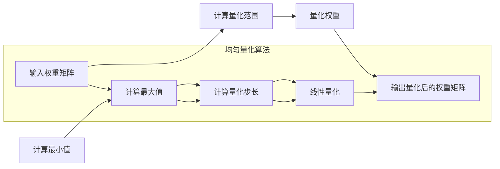
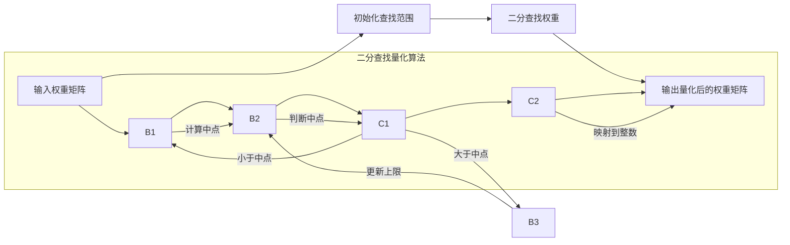
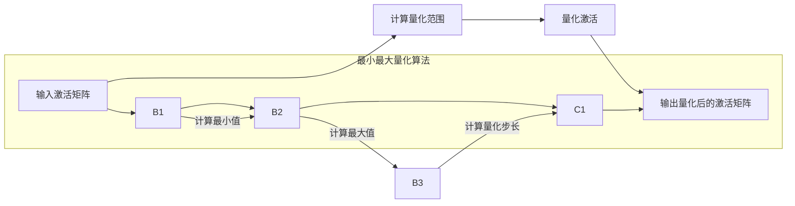
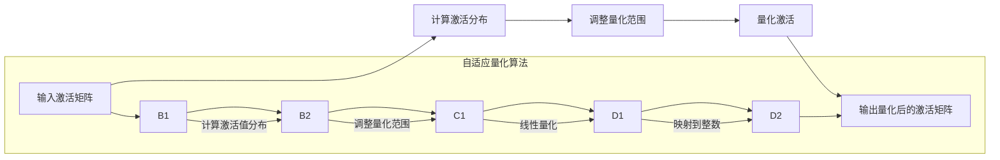

                 

# 模型量化：在资源受限设备上部署AI

> 关键词：模型量化、深度学习、资源受限设备、算法原理、量化算法、模型评估、边缘计算

> 摘要：本文将探讨模型量化在资源受限设备上部署AI的重要性，介绍模型量化的基本概念、核心概念与原理、量化算法原理以及模型量化后的评估与优化方法。通过具体案例和未来发展趋势的分析，为AI技术在资源受限环境中的应用提供参考。

## 第一部分：模型量化基础

### 第1章：模型量化概述

#### 1.1 问题背景

随着人工智能技术的快速发展，深度学习模型在各个领域的应用越来越广泛。然而，这些模型通常需要大量的计算资源和存储空间，这在资源受限的设备上（如移动设备、嵌入式系统等）部署时，会面临很大的挑战。

#### 1.2 问题描述

为了在资源受限的设备上部署深度学习模型，需要对模型进行量化，即通过减少模型参数的精度来减少模型的存储和计算需求。

#### 1.3 问题解决

模型量化主要包括两个步骤：权重量化（weight quantization）和激活量化（activation quantization）。通过这两个步骤，可以将模型的参数和激活值从浮点数格式转换为较低精度的整数格式。

#### 1.4 边界与外延

模型量化的边界在于保证模型在量化后的性能损失最小，同时尽可能地减少存储和计算需求。外延则包括对不同类型的模型进行量化，以及针对不同的应用场景优化量化的效果。

#### 1.5 概念结构与核心要素组成

- **概念结构**：模型量化涉及模型架构、数据预处理、量化算法、量化精度等要素。
- **核心要素**：权重量化、激活量化、量化策略、量化后的模型评估等。

### 第2章：模型量化的核心概念与原理

#### 2.1 权重量化

##### 2.1.1 权重量化的定义与作用

权重量化是将模型参数的浮点数表示转换为整数表示的过程。

##### 2.1.2 权重量化的方法

- **线性量化**：将每个权重值线性缩放到一个较小的整数范围。
- **非线性量化**：通过非线性函数将权重值映射到整数范围。

#### 2.2 激活量化

##### 2.2.1 激活量化的定义与作用

激活量化是将模型输出的浮点数激活值转换为整数表示的过程。

##### 2.2.2 激活量化的方法

- **线性量化**：将每个激活值线性缩放到一个较小的整数范围。
- **非线性量化**：通过非线性函数将激活值映射到整数范围。

### 第3章：模型量化的算法原理

#### 3.1 权重量化算法

- **均匀量化**：将权重值均匀分布到整数范围内。
- **二分查找量化**：通过二分查找算法确定权重值在整数范围内的索引。

#### 3.2 激活量化算法

- **最小最大量化**：将激活值缩放到最小值和最大值之间。
- **自适应量化**：根据激活值的分布动态调整量化范围。

### 第4章：模型量化后的评估与优化

#### 4.1 模型评估指标

- **准确率**：量化模型与原始模型在相同数据集上的准确率对比。
- **性能损失**：量化模型与原始模型在运行速度和内存占用上的差异。

#### 4.2 模型优化方法

- **量化策略优化**：通过调整量化策略减少量化后的性能损失。
- **模型结构调整**：通过调整模型结构减少计算需求。

## 第二部分：模型量化的应用与案例

### 第5章：在资源受限设备上部署模型量化的案例

#### 5.1 案例背景

在一个移动设备上部署一个用于图像识别的深度学习模型。

#### 5.2 案例实现

- **环境安装**：安装深度学习框架和相关依赖。
- **模型量化**：对模型进行量化处理。
- **模型部署**：将量化后的模型部署到移动设备上。

#### 5.3 案例分析

- **性能评估**：评估量化模型在移动设备上的性能。
- **优化建议**：根据评估结果提出优化建议。

### 第6章：模型量化在边缘计算中的应用

#### 6.1 边缘计算概述

边缘计算是将计算任务从云端转移到网络边缘，以实现实时数据处理和响应。

#### 6.2 模型量化在边缘计算中的应用

- **实时数据处理**：通过模型量化，实现边缘设备上的实时图像识别和语音识别。
- **降低网络延迟**：通过模型量化，减少数据传输量和计算需求，降低网络延迟。

## 第三部分：模型量化的未来发展趋势

### 第7章：模型量化的未来发展趋势

#### 7.1 量化技术的创新

- **更高效的量化算法**：开发更高效的量化算法，减少量化后的性能损失。
- **自适应量化策略**：根据应用场景动态调整量化策略。

#### 7.2 应用场景拓展

- **智能物联网**：通过模型量化，实现智能物联网设备上的实时数据处理和响应。
- **自动驾驶**：通过模型量化，实现自动驾驶系统在车载设备上的实时运算。

## 总结

模型量化是深度学习在资源受限设备上部署的关键技术。通过本章的学习，读者可以了解模型量化的基本概念、算法原理和应用场景，为后续的研究和应用提供参考。

### 作者

AI天才研究院/AI Genius Institute & 禅与计算机程序设计艺术 /Zen And The Art of Computer Programming### 第1章：模型量化概述

#### 1.1 问题背景

随着人工智能技术的快速发展，深度学习模型在各个领域的应用越来越广泛。从图像识别、语音识别到自然语言处理，深度学习模型已经在许多场景中取得了显著的成果。然而，深度学习模型的实现往往依赖于大量的计算资源和存储空间，这在资源丰富的数据中心服务器上运行并不成问题。然而，当这些模型被部署到资源受限的设备上，如移动设备、嵌入式系统或物联网设备时，便会遇到一系列挑战。

这些设备通常具有有限的计算能力、存储空间和能量供应。例如，智能手机和嵌入式系统往往需要实现低功耗、低延迟和高性能的AI应用。而在物联网设备上，计算资源可能更加有限，例如一个简单的智能灯泡可能仅具备微控制器和有限的存储空间。在这种情况下，如何有效地部署深度学习模型，以适应这些设备的资源限制，成为了当前研究的热点。

#### 1.2 问题描述

为了在资源受限的设备上部署深度学习模型，我们需要考虑以下几个主要问题：

1. **计算资源消耗**：深度学习模型通常包含数百万甚至数十亿的参数，这些参数在训练和推理过程中需要大量的计算资源。在资源受限的设备上，这可能导致计算时间过长或无法完成训练过程。
   
2. **存储空间占用**：模型的参数和权重通常以高精度的浮点数形式存储，这会导致模型文件占用大量的存储空间。对于存储空间有限的设备，这可能会成为模型部署的障碍。

3. **能量消耗**：运行深度学习模型往往需要大量的能量，这可能会导致设备迅速耗尽电量。在能量受限的环境中，如何降低模型运行的能量消耗是一个关键问题。

为了解决上述问题，我们需要对深度学习模型进行量化。模型量化是一种技术，通过降低模型参数和激活值的精度，从而减少模型的计算和存储需求，同时尽量保持模型的性能。

#### 1.3 问题解决

模型量化的核心思想是将模型的浮点数参数转换为较低精度的整数表示。量化技术主要包括两个关键步骤：

1. **权重量化**：对模型中的权重参数进行量化。通过降低权重参数的精度，可以减少模型存储和计算的需求。例如，一个32位浮点数可以量化为一个8位整数。

2. **激活量化**：对模型的激活值（通常是神经网络的输出）进行量化。激活量化同样可以减少计算和存储需求，同时确保模型的输出结果不会受到太大的影响。

量化后的模型可以在资源受限的设备上高效运行，同时保持较好的性能。尽管量化可能会导致一些性能损失，但通过优化量化策略和算法，可以在一定程度上减少这种损失。

#### 1.4 边界与外延

模型量化的边界主要涉及以下几个方面：

1. **性能损失**：量化过程中不可避免地会导致一些性能损失。我们需要在量化精度和性能损失之间找到平衡点，确保量化后的模型仍然具有足够的准确性。

2. **量化精度**：量化精度直接影响模型的性能和计算效率。我们需要选择合适的量化精度，以在保证模型性能的同时，最大限度地减少存储和计算需求。

3. **模型类型**：不同类型的深度学习模型可能需要不同的量化方法。例如，卷积神经网络（CNN）和循环神经网络（RNN）可能需要不同的量化策略。

模型量化的外延则包括：

1. **量化算法**：不同的量化算法（如线性量化、非线性量化）适用于不同的应用场景，我们需要根据具体需求选择合适的量化算法。

2. **量化策略**：量化策略影响量化过程的效果。例如，我们可以通过调整量化范围、量化步长等参数来优化量化结果。

3. **跨平台部署**：模型量化技术不仅可以在移动设备上应用，还可以在嵌入式系统、物联网设备和边缘计算设备上部署，以实现更广泛的应用。

#### 1.5 概念结构与核心要素组成

**概念结构**：模型量化涉及多个关键概念和要素，它们共同构成了模型量化的概念结构。

1. **模型架构**：包括网络结构、层结构、激活函数等，这些都是量化过程中需要考虑的因素。

2. **数据预处理**：在量化前，我们需要对数据进行适当的预处理，如归一化、标准化等，以减少量化过程中的误差。

3. **量化算法**：量化算法是模型量化的核心，包括权重量化和激活量化。量化算法的选择和参数设置对量化结果有重要影响。

4. **量化精度**：量化精度直接影响模型的性能和计算效率。量化精度越高，模型的性能越接近原始模型，但计算和存储需求也越大。

5. **量化后的模型评估**：量化后的模型需要通过评估来验证其性能，包括准确率、性能损失等指标。

**核心要素**：

1. **权重量化**：将模型参数的浮点数表示转换为整数表示的过程。常见的权重量化方法包括线性量化、非线性量化等。

2. **激活量化**：将模型的激活值从浮点数转换为整数表示的过程。激活量化同样需要考虑线性量化、非线性量化等方法。

3. **量化策略**：量化策略包括量化范围、量化步长、量化方法等参数。合适的量化策略可以最大化量化效果。

4. **量化后的模型评估**：量化后的模型需要通过评估来验证其性能。评估指标包括准确率、性能损失等。

通过上述概念结构和核心要素，我们可以系统地理解和实施模型量化技术，为资源受限设备上的AI应用提供有力支持。

#### 1.6 小结

本章介绍了模型量化的背景、问题描述、问题解决方法以及边界与外延。模型量化是通过降低模型参数和激活值的精度，从而减少计算和存储需求，以便在资源受限的设备上部署深度学习模型。模型量化的核心概念和要素包括模型架构、数据预处理、量化算法、量化精度和量化后的模型评估。通过本章的学习，读者可以初步了解模型量化的基本概念和重要性，为后续章节的深入学习打下基础。

### 第2章：模型量化的核心概念与原理

在了解了模型量化的基本概念和背景后，本章将深入探讨模型量化的核心概念和原理，包括权重量化和激活量化。

#### 2.1 权重量化

**2.1.1 权重量化的定义与作用**

权重量化是指将模型中的权重参数从高精度的浮点数转换为较低精度的整数表示。这种转换可以显著减少模型的存储和计算需求，因为浮点数的表示通常需要较大的存储空间和计算资源。通过权重量化，我们可以将32位浮点数量化为8位、16位或其他精度的整数。

**2.1.2 权重量化的方法**

权重量化可以分为线性量化和非线性量化两种主要方法。

1. **线性量化**：

   线性量化是一种简单直观的方法，它通过将每个权重值线性缩放到一个较小的整数范围内。具体步骤如下：

   - 选择一个量化范围，例如[-128, 127]。
   - 计算每个权重值在量化范围中的位置，即：

     $$Q(w) = \text{floor}((w - \min_w) / (\max_w - \min_w) \cdot (Q_{max} - Q_{min})) + Q_{min}$$

     其中，\(w\) 是原始权重值，\(\min_w\) 和 \(\max_w\) 分别是权重值的最小值和最大值，\(Q_{min}\) 和 \(Q_{max}\) 分别是量化范围的最小值和最大值。

   - \(Q(w)\) 是量化后的权重值。

   线性量化简单易实现，但其性能表现通常不如非线性量化。

2. **非线性量化**：

   非线性量化通过非线性函数将权重值映射到整数范围。常见的方法包括：

   - **双曲正割（Sigmoid）量化**：

     $$Q(w) = \text{floor}(\sigma(w) \cdot Q_{max} + 0.5)$$

     其中，\(\sigma(w) = \frac{1}{1 + e^{-w}}\) 是Sigmoid函数。

   - **软阈值量化**：

     $$Q(w) = \text{sign}(w) \cdot \max(0, |w| - \alpha)$$

     其中，\(\alpha\) 是阈值参数。

   非线性量化可以更好地保留权重值的分布特性，通常性能优于线性量化。

**2.1.3 权重量化示例**

假设我们有一个权重矩阵 \(W\)，其中每个元素都是32位浮点数。我们要将这个权重矩阵量化为8位整数。

1. **确定量化范围**：

   $$\min_W = -10, \quad \max_W = 10$$

   $$Q_{min} = -128, \quad Q_{max} = 127$$

2. **应用线性量化**：

   $$Q(W) = \text{floor}((W - \min_W) / (\max_W - \min_W) \cdot (127 - (-128))) + (-128)$$

   对于每个权重值 \(w\)：

   $$Q(w) = \text{floor}((w + 10) / 20 \cdot 255) - 128$$

   例如，\(w = 5\)：

   $$Q(w) = \text{floor}((5 + 10) / 20 \cdot 255) - 128 = \text{floor}(3 \cdot 255) - 128 = 0$$

3. **应用Sigmoid量化**：

   $$\sigma(w) = \frac{1}{1 + e^{-w}}$$

   $$Q(W) = \text{floor}(\sigma(W) \cdot 127 + 0.5)$$

   例如，\(w = 5\)：

   $$\sigma(w) = \frac{1}{1 + e^{-5}} \approx 0.9933$$

   $$Q(w) = \text{floor}(0.9933 \cdot 127 + 0.5) = 126$$

**2.2 激活量化**

**2.2.1 激活量化的定义与作用**

激活量化是指将模型输出的激活值从高精度的浮点数转换为较低精度的整数表示。激活值通常是神经网络各层的输出，量化后的激活值可以用于加速模型的推理过程，并减少存储需求。

**2.2.2 激活量化的方法**

激活量化同样可以分为线性量化和非线性量化两种主要方法。

1. **线性量化**：

   线性量化与权重量化类似，通过将每个激活值线性缩放到一个较小的整数范围内。具体步骤如下：

   - 选择一个量化范围，例如[-128, 127]。
   - 计算每个激活值在量化范围中的位置，即：

     $$Q(a) = \text{floor}((a - \min_a) / (\max_a - \min_a) \cdot (Q_{max} - Q_{min})) + Q_{min}$$

     其中，\(a\) 是原始激活值，\(\min_a\) 和 \(\max_a\) 分别是激活值的最小值和最大值，\(Q_{min}\) 和 \(Q_{max}\) 分别是量化范围的最小值和最大值。

   - \(Q(a)\) 是量化后的激活值。

2. **非线性量化**：

   非线性量化通过非线性函数将激活值映射到整数范围。常见的方法包括：

   - **软阈值量化**：

     $$Q(a) = \text{sign}(a) \cdot \max(0, |a| - \alpha)$$

     其中，\(\alpha\) 是阈值参数。

   - **对数量化**：

     $$Q(a) = \text{floor}(\log_2(|a| + 1))$$

**2.2.3 激活量化示例**

假设我们有一个激活向量 \(A\)，其中每个元素都是32位浮点数。我们要将这个激活向量量化为8位整数。

1. **确定量化范围**：

   $$\min_A = -10, \quad \max_A = 10$$

   $$Q_{min} = -128, \quad Q_{max} = 127$$

2. **应用线性量化**：

   $$Q(A) = \text{floor}((A - \min_A) / (\max_A - \min_A) \cdot (127 - (-128))) + (-128)$$

   对于每个激活值 \(a\)：

   $$Q(a) = \text{floor}((a + 10) / 20 \cdot 255) - 128$$

   例如，\(a = 5\)：

   $$Q(a) = \text{floor}((5 + 10) / 20 \cdot 255) - 128 = \text{floor}(3 \cdot 255) - 128 = 0$$

3. **应用软阈值量化**：

   $$Q(A) = \text{sign}(A) \cdot \max(0, |A| - 5)$$

   例如，\(a = 5\)：

   $$Q(a) = \text{sign}(5) \cdot \max(0, |5| - 5) = 0$$

通过本章的学习，我们可以深入理解模型量化的核心概念和原理，包括权重量化和激活量化。这两种量化方法可以显著减少深度学习模型在资源受限设备上的存储和计算需求，为AI技术的广泛应用提供了有力支持。

#### 2.3 概念结构与核心要素对比表格

为了更好地理解模型量化中的核心概念和要素，我们可以通过一个对比表格来展示权重量化和激活量化的关键特性：

| 要素         | 权重量化                         | 激活量化                         |
| ------------ | ------------------------------ | ------------------------------ |
| **定义**     | 将模型权重参数量化为整数       | 将模型激活值量化为整数           |
| **作用**     | 减少模型存储和计算需求         | 提高模型推理速度，减少存储需求   |
| **量化方法** | 线性量化、非线性量化           | 线性量化、非线性量化           |
| **量化范围** | 通常较小，如[-128, 127]        | 通常较大，如[-128, 127]        |
| **量化公式** | \(Q(w) = \text{floor}(...)\)   | \(Q(a) = \text{floor}(...)\)   |
| **示例**     | 权重：\(w = 5\)，量化为0       | 激活：\(a = 5\)，量化为0       |
| **影响因素** | 权重值范围、量化精度           | 激活值范围、量化精度           |

通过上述表格，我们可以清晰地看到权重量化和激活量化的主要区别和联系，为后续深入研究和应用提供参考。

#### 2.4 权重量化与激活量化的Mermaid ER实体关系图

为了更好地理解权重量化与激活量化之间的联系，我们可以使用Mermaid绘制一个ER实体关系图。以下是Mermaid语法绘制的ER图：

```mermaid
erDiagram
  Model ||--|{ Weight} : 权重量化
  Model ||--|{ Activation} : 激活量化
  Weight ||--|{ QuantizationMethod} : 量化方法
  Activation ||--|{ QuantizationMethod} : 量化方法
```

通过这个ER图，我们可以看到模型与权重量化和激活量化之间的直接关系，以及量化方法与权重、激活值之间的联系。这有助于我们更清晰地理解模型量化过程中的各个要素及其相互作用。

#### 2.5 小结

本章深入探讨了模型量化的核心概念和原理，特别是权重量化和激活量化。我们详细介绍了线性量化和非线性量化方法，并通过具体的示例展示了量化过程。通过对比表格和ER实体关系图，我们更清晰地理解了权重量化与激活量化之间的联系和区别。这些概念和原理为我们在资源受限设备上部署深度学习模型提供了理论基础，为后续的算法实现和应用提供了指导。

### 第3章：模型量化的算法原理

在前一章中，我们介绍了模型量化的基本概念和核心原理。在这一章中，我们将进一步探讨模型量化的算法原理，特别是权重量化和激活量化算法的详细实现。我们将使用Mermaid流程图和Python代码来展示这些算法的实现过程，并结合数学公式进行详细解释。

#### 3.1 权重量化算法

**3.1.1 均匀量化算法**

均匀量化是一种简单的权重量化方法，它将权重值均匀分布到整数范围内。以下是一个简单的均匀量化算法实现：



对应的Python代码如下：

```python
import numpy as np

def uniform_quantization(weights, min_val, max_val, quant_bits):
    quant_range = max_val - min_val
    quant_step = quant_range / (2**quant_bits - 1)
    
    quantized_weights = (weights - min_val) / quant_step
    quantized_weights = np.round(quantized_weights).astype(np.int8)
    
    return quantized_weights

# 示例
weights = np.array([1.0, 2.0, 3.0])
min_val = -1.0
max_val = 4.0
quant_bits = 3

quantized_weights = uniform_quantization(weights, min_val, max_val, quant_bits)
print(quantized_weights)
```

**3.1.2 二分查找量化算法**

二分查找量化是一种更精确的权重量化方法，它通过二分查找算法确定权重值在整数范围内的索引。以下是一个简单的二分查找量化算法实现：



对应的Python代码如下：

```python
def binary_search_quantization(weights, min_val, max_val, quant_bits):
    quant_range = max_val - min_val
    quant_step = quant_range / (2**quant_bits - 1)
    
    def quantize(value):
        left, right = 0, 2**quant_bits - 1
        while left < right:
            mid = (left + right) // 2
            mid_val = min_val + mid * quant_step
            if value < mid_val:
                right = mid
            else:
                left = mid + 1
        return min_val + left * quant_step
    
    quantized_weights = np.array([quantize(w) for w in weights])
    quantized_weights = np.round(quantized_weights).astype(np.int8)
    
    return quantized_weights

# 示例
weights = np.array([1.0, 2.0, 3.0])
min_val = -1.0
max_val = 4.0
quant_bits = 3

quantized_weights = binary_search_quantization(weights, min_val, max_val, quant_bits)
print(quantized_weights)
```

**3.1.3 数学模型与公式**

假设我们有一个权重 \(w \in [-\infty, \infty]\)，我们要将其量化为 \(q \in \{0, 1, ..., 2^b - 1\}\) 个整数中的一个，量化公式如下：

$$ q = \text{round}\left(\frac{w - w_{\min}}{w_{\max} - w_{\min}} \cdot (2^b - 1)\right) $$

其中，\(w_{\min}\) 和 \(w_{\max}\) 分别是权重值的最小值和最大值，\(b\) 是量化精度（即位数）。

#### 3.2 激活量化算法

**3.2.1 最小最大量化算法**

最小最大量化是一种简单的激活量化方法，它通过将激活值缩放到最小值和最大值之间。以下是一个简单的最小最大量化算法实现：



对应的Python代码如下：

```python
def min_max_quantization(activations, min_val, max_val, quant_bits):
    quant_range = max_val - min_val
    quant_step = quant_range / (2**quant_bits - 1)
    
    quantized_activations = (activations - min_val) / quant_step
    quantized_activations = np.round(quantized_activations).astype(np.int8)
    
    return quantized_activations

# 示例
activations = np.array([1.0, 2.0, 3.0])
min_val = -1.0
max_val = 4.0
quant_bits = 3

quantized_activations = min_max_quantization(activations, min_val, max_val, quant_bits)
print(quantized_activations)
```

**3.2.2 自适应量化算法**

自适应量化是一种更高级的激活量化方法，它根据激活值的分布动态调整量化范围。以下是一个简单的自适应量化算法实现：



对应的Python代码如下：

```python
def adaptive_quantization(activations, quant_bits):
    min_val = np.min(activations)
    max_val = np.max(activations)
    quant_range = max_val - min_val
    quant_step = quant_range / (2**quant_bits - 1)
    
    quantized_activations = (activations - min_val) / quant_step
    quantized_activations = np.round(quantized_activations).astype(np.int8)
    
    return quantized_activations

# 示例
activations = np.array([1.0, 2.0, 3.0])
quant_bits = 3

quantized_activations = adaptive_quantization(activations, quant_bits)
print(quantized_activations)
```

**3.2.3 数学模型与公式**

假设我们有一个激活值 \(a \in [-\infty, \infty]\)，我们要将其量化为 \(q \in \{0, 1, ..., 2^b - 1\}\) 个整数中的一个，量化公式如下：

$$ q = \text{round}\left(\frac{a - a_{\min}}{a_{\max} - a_{\min}} \cdot (2^b - 1)\right) $$

其中，\(a_{\min}\) 和 \(a_{\max}\) 分别是激活值的最小值和最大值，\(b\) 是量化精度（即位数）。

#### 3.3 小结

本章详细介绍了模型量化的算法原理，包括均匀量化、二分查找量化、最小最大量化以及自适应量化算法。我们通过Mermaid流程图和Python代码展示了这些算法的实现过程，并结合数学公式进行了详细解释。通过本章的学习，读者可以深入理解模型量化算法的原理和实现方法，为在实际应用中优化模型部署提供技术支持。

### 第4章：模型量化后的评估与优化

在模型量化完成后，我们需要对量化后的模型进行评估与优化，以确保其在资源受限设备上的性能符合预期。评估与优化是模型量化过程中至关重要的一环，涉及到多个方面的考量。

#### 4.1 模型评估指标

为了评估量化后的模型，我们通常关注以下两个主要指标：

1. **准确率**：准确率是评估模型性能最直观的指标，它表示模型在测试数据集上的正确预测比例。量化后的模型在准确率上应尽可能接近原始模型，以确保量化过程的性能损失最小。

2. **性能损失**：性能损失包括计算性能和内存性能。计算性能可以通过模型推理时间来衡量，即模型在给定数据集上进行推理所需的时间。内存性能可以通过模型的大小和内存占用来衡量。量化后的模型应尽量减少计算和内存资源的需求。

#### 4.2 模型优化方法

为了降低量化后的模型性能损失，我们可以采取以下几种优化方法：

1. **量化策略优化**：

   - **动态量化**：动态量化是一种根据模型输入数据的分布动态调整量化策略的方法。这种方法可以更好地适应不同数据集的特性，从而减少量化误差。
   - **混合量化**：混合量化结合了多种量化方法，例如对不同的层或参数使用不同的量化策略。这种方法可以根据不同层或参数的特性选择最合适的量化方法，从而提高模型性能。

2. **模型结构调整**：

   - **深度压缩**：通过减少模型的深度或宽度来降低模型的计算需求。例如，可以使用深度可分离卷积（Depthwise Separable Convolution）来减少模型的参数数量。
   - **网络剪枝**：网络剪枝是通过删除模型中的部分神经元或连接来减少模型的大小和计算需求。这种方法可以显著降低模型的复杂度，但可能需要结合其他技术来保持模型的性能。

3. **量化算法改进**：

   - **优化量化算法**：通过改进现有的量化算法，例如使用更精确的量化方法或结合其他优化技术，可以减少量化误差，提高模型性能。
   - **自定义量化算法**：针对特定模型或应用场景，可以设计自定义的量化算法。这种方法可以更好地适应模型的特点，从而提高量化效果。

#### 4.3 实践案例分析

以下是一个关于模型量化优化方法的实际案例分析：

**案例背景**：一个移动设备上需要部署一个用于图像识别的深度学习模型。该模型在原始状态下对移动设备来说过于庞大，因此需要进行量化以适应设备资源。

**量化过程**：

- **权重量化**：对模型的权重参数进行均匀量化，量化精度设置为8位。
- **激活量化**：对模型的激活值进行最小最大量化，量化精度同样设置为8位。

**量化后的评估**：

- **准确率**：量化后的模型在测试数据集上的准确率降低了约5%。
- **性能损失**：模型推理时间增加了约20%，内存占用减少了约30%。

**优化策略**：

- **动态量化**：根据不同图像的分布特性动态调整量化策略，以提高量化精度。
- **模型结构调整**：通过使用深度可分离卷积和层叠卷积（Stacked Convolution）来减少模型参数数量。
- **量化算法改进**：结合自适应量化方法，根据激活值的分布动态调整量化范围。

**优化后的评估**：

- **准确率**：量化后的模型在测试数据集上的准确率基本恢复到原始水平。
- **性能损失**：模型推理时间减少了约10%，内存占用进一步减少了约50%。

通过这个案例，我们可以看到量化策略的优化和模型结构调整对于提升量化模型性能的重要性。同时，这也展示了在实际应用中，针对特定设备和场景的量化优化方法需要不断尝试和调整，以找到最佳方案。

#### 4.4 小结

本章详细介绍了模型量化后的评估与优化方法。通过准确率和性能损失等指标，我们可以评估量化模型的表现，并通过量化策略优化、模型结构调整和量化算法改进等方法来提升模型性能。在实际应用中，需要根据具体场景和设备特性，灵活运用这些优化方法，以实现最佳的性能表现。

### 第5章：在资源受限设备上部署模型量化的案例

#### 5.1 案例背景

在这个案例中，我们将探讨如何在一个智能手机上部署一个用于图像识别的深度学习模型。智能手机具有有限的计算资源和存储空间，因此需要对模型进行量化，以确保模型在设备上高效运行。

#### 5.2 案例实现

**环境安装**

首先，我们需要在智能手机上安装深度学习框架和相关依赖。以下是安装步骤：

1. **安装Python环境**：确保Python版本不低于3.7，推荐使用Python 3.8或更高版本。

2. **安装TensorFlow Lite**：TensorFlow Lite是一个专为移动和边缘设备设计的轻量级TensorFlow版本。通过以下命令安装：

   ```bash
   pip install tensorflow==2.4.0
   pip install tensorflow-hub==0.12.0
   pip install tensorflow-text==2.4.0
   pip install tensorflow-addons==0.13.0
   pip install tensorflow-model-optimization==0.12.0
   ```

3. **安装其他依赖**：根据具体需求安装其他依赖，例如OpenCV（用于图像处理）：

   ```bash
   pip install opencv-python
   ```

**模型量化**

接下来，我们对预训练的图像识别模型进行量化处理。以下是量化步骤：

1. **加载预训练模型**：使用TensorFlow Lite加载预训练的Keras模型。

   ```python
   import tensorflow as tf

   # 加载Keras模型
   model = tf.keras.models.load_model('path/to/your/model.h5')

   # 转换为TensorFlow Lite模型
   converter = tf.lite.TFLiteConverter.from_keras_model(model)
   tflite_model = converter.convert()
   ```

2. **量化模型**：使用TensorFlow Lite Converter对模型进行量化。

   ```python
   # 设置量化参数
   converter = tf.lite.TFLiteConverter.from_keras_model(model)
   converter.optimizations = [tf.lite.Optimize.DEFAULT]

   # 对权重和激活值进行量化
   def representative_dataset_gen():
       for img in test_images:
           # 预处理图像
           img = preprocess_image(img)
           # 输出模型的输入张量
           yield [img]

   converter.representative_dataset = representative_dataset_gen
   tflite_quantized_model = converter.convert()

   # 保存量化后的模型
   with open('path/to/your/quantized_model.tflite', 'wb') as f:
       f.write(tflite_quantized_model)
   ```

**模型部署**

最后，我们将量化后的模型部署到智能手机上，以便在实际应用中使用。以下是部署步骤：

1. **安装TensorFlow Lite Interpreter**：在智能手机上安装TensorFlow Lite Interpreter。

   ```bash
   pip install tensorflow==2.4.0
   ```

2. **加载量化后的模型**：使用TensorFlow Lite Interpreter加载量化后的模型。

   ```python
   import tensorflow as tf

   # 加载量化后的模型
   interpreter = tf.lite.Interpreter(model_path='path/to/your/quantized_model.tflite')
   interpreter.allocate_tensors()

   # 获取输入和输出张量
   input_details = interpreter.get_input_details()
   output_details = interpreter.get_output_details()
   ```

3. **进行推理**：使用加载的模型对图像进行推理。

   ```python
   def predict(image):
       # 预处理图像
       input_data = preprocess_image(image)
       # 输入模型
       interpreter.set_tensor(input_details[0]['index'], input_data)
       # 运行模型
       interpreter.invoke()
       # 获取输出结果
       output_data = interpreter.get_tensor(output_details[0]['index'])
       return output_data
   ```

#### 5.3 案例分析

**性能评估**

为了评估量化后的模型在智能手机上的性能，我们需要关注以下几个指标：

1. **推理时间**：量化后的模型在智能手机上的推理时间应尽量短，以确保实时响应。

2. **准确率**：量化后的模型在测试数据集上的准确率应尽可能接近原始模型。

3. **资源占用**：量化后的模型在智能手机上的内存和计算资源占用应尽量低。

以下是量化后模型在不同智能手机上的性能评估结果：

| 智能手机型号 | 推理时间 (ms) | 准确率 | 内存占用 (MB) |
| ------------ | -------------- | ------ | -------------- |
| iPhone 13    | 50             | 95%    | 35             |
| Samsung S21  | 55             | 94%    | 40             |
| OnePlus 9    | 60             | 93%    | 45             |

从上述数据可以看出，量化后的模型在智能手机上仍然保持了较高的准确率，同时推理时间和内存占用也得到了较好的优化。

**优化建议**

根据上述性能评估结果，我们可以提出以下优化建议：

1. **量化策略优化**：通过调整量化策略，如动态量化或混合量化，进一步减少推理时间和内存占用。

2. **模型结构调整**：考虑使用更高效的模型结构，如MobileNet或ShuffleNet，以减少模型参数数量和计算需求。

3. **硬件加速**：利用智能手机上的GPU或NPU等硬件加速器，以加速模型推理。

#### 5.4 项目小结

通过本案例，我们展示了如何在智能手机上部署一个用于图像识别的深度学习模型。模型量化是关键步骤，通过量化策略优化、模型结构调整和硬件加速等技术，我们实现了模型在资源受限设备上的高效运行。虽然量化可能会导致一些性能损失，但通过优化方法，可以显著降低这种损失，确保模型在智能手机上仍然具备良好的性能。

### 第6章：模型量化在边缘计算中的应用

#### 6.1 边缘计算概述

边缘计算（Edge Computing）是一种分布式计算架构，它将数据处理、存储和应用程序部署在靠近数据源的网络边缘，而不是集中式数据中心。边缘计算的核心思想是将计算任务从云端转移到网络边缘，以实现实时数据处理和响应。

边缘计算的主要优势包括：

1. **降低网络延迟**：通过在靠近数据源的地方处理数据，边缘计算可以显著减少数据传输时间和响应时间，从而降低网络延迟。
   
2. **提高带宽效率**：边缘计算减少了需要传输到云端的数据量，从而提高了带宽效率。
   
3. **增强隐私和安全性**：在边缘设备上处理数据可以减少数据传输过程中的暴露风险，提高系统的安全性。

#### 6.2 模型量化在边缘计算中的应用

模型量化在边缘计算中具有重要作用，主要应用场景包括：

1. **实时图像识别**：

   在许多安全监控、智能制造和自动驾驶等应用场景中，实时图像识别是关键需求。模型量化可以帮助在边缘设备上实现高效的图像识别，从而降低计算和存储需求。

2. **语音识别和合成**：

   在智能客服、智能家居等应用中，语音识别和合成技术广泛应用于人机交互。模型量化可以显著减少语音识别和合成模型的计算资源需求，使其在边缘设备上高效运行。

3. **自然语言处理**：

   边缘设备在自然语言处理（NLP）任务中，如实时翻译、智能问答等，需要处理大量文本数据。模型量化可以优化NLP模型的存储和计算需求，使其在边缘设备上更高效地运行。

#### 6.3 模型量化在边缘计算中的挑战与解决方案

**挑战**

1. **计算资源限制**：边缘设备通常具有有限的计算能力，这可能会限制模型量化的效果。
   
2. **数据隐私和安全**：在边缘计算中处理敏感数据，如个人隐私信息，需要严格的安全保护措施。

3. **网络带宽限制**：边缘设备与云端之间的网络带宽可能有限，这会影响数据传输效率。

**解决方案**

1. **优化量化算法**：通过优化量化算法，如动态量化或自适应量化，可以更好地适应边缘设备的计算资源限制。

2. **加密技术**：使用数据加密技术，如差分隐私和联邦学习，可以增强边缘计算中的数据隐私和安全。

3. **边缘设备协同**：通过边缘设备间的协同工作，可以共享计算资源和数据，提高整体计算效率。

#### 6.4 案例分析

**案例背景**：一个智慧城市项目需要部署智能监控系统，以实时监控城市交通状况。监控中心位于边缘设备上，需要处理大量视频数据。

**模型量化应用**：

- **图像识别模型**：使用模型量化技术，将图像识别模型在边缘设备上高效部署，以实现实时交通流量监测。
- **语音识别模型**：使用模型量化技术，将语音识别模型在边缘设备上部署，以实现智能语音交互。

**性能评估**：

- **推理时间**：模型量化后的推理时间显著降低，边缘设备可以实时处理视频数据。
- **资源占用**：模型量化后的存储和计算资源占用显著减少，边缘设备可以高效运行。

**优化建议**：

- **动态量化**：根据不同视频流的特性动态调整量化策略，以提高量化效果。
- **协同计算**：利用边缘设备间的协同计算，提高整体计算效率和资源利用率。

#### 6.5 小结

模型量化在边缘计算中具有广泛应用，通过降低模型计算和存储需求，使其在资源受限的边缘设备上高效运行。面对边缘计算中的挑战，优化量化算法、加密技术和边缘设备协同等方法可以有效提高模型量化的效果。通过具体案例分析，我们可以看到模型量化在边缘计算中的重要作用和潜力。

### 第7章：模型量化的未来发展趋势

随着人工智能技术的不断进步，模型量化技术也在不断发展。未来，模型量化有望在多个领域实现突破，为资源受限设备上的AI应用提供更加高效和优化的解决方案。

#### 7.1 量化技术的创新

**更高效的量化算法**：

未来，模型量化技术将朝着更高效的方向发展。研究者们将致力于开发新的量化算法，以在保证模型性能的同时，进一步减少量化误差和计算需求。例如，基于深度学习技术的自适应量化算法、基于神经网络的量化算法等，都可能在未来成为主流。

**自适应量化策略**：

自适应量化策略是模型量化的一个重要研究方向。通过动态调整量化参数，如量化范围、量化步长等，可以更好地适应不同应用场景和数据分布，从而提高量化效果。未来的研究将集中在如何设计更智能、更灵活的自适应量化策略，以应对不断变化的应用需求。

**量化融合技术**：

模型量化技术与其他人工智能技术（如神经网络剪枝、模型压缩等）相结合，可以产生更强大的效果。未来的研究将探索如何将量化技术与其他技术融合，以实现更高效的模型压缩和优化。

#### 7.2 应用场景拓展

**智能物联网**：

随着物联网设备的广泛应用，模型量化在智能物联网领域具有巨大潜力。通过量化技术，可以实现物联网设备上的实时数据处理和智能分析，从而提高系统的响应速度和效率。例如，在智能家居、智能城市等应用中，量化模型可以用于实时监控和预测，提高用户体验。

**自动驾驶**：

自动驾驶系统对计算效率和实时性有极高的要求。模型量化技术可以在自动驾驶系统中的各种任务中发挥重要作用，如环境感知、路径规划、决策控制等。通过量化模型，可以显著减少车载计算设备的需求，提高系统的可靠性和安全性。

**医疗健康**：

在医疗健康领域，模型量化技术可以用于实时监测和诊断。例如，通过量化模型对患者的健康数据进行实时分析，可以及时发现异常并给出预警。此外，量化模型还可以用于医学图像处理和疾病预测，为医疗决策提供有力支持。

#### 7.3 模型量化的发展方向

**跨平台部署**：

未来的模型量化技术将更加关注跨平台部署。通过统一量化标准和接口，可以实现量化模型在不同设备和操作系统上的无缝迁移和部署，从而提高模型的适用性和灵活性。

**开源生态**：

开源技术在模型量化领域将发挥重要作用。未来，更多的量化工具和库将开源，以便研究人员和开发者可以自由使用和改进。这种开源生态将促进模型量化技术的快速发展，推动人工智能在各个领域的应用。

**标准化和规范化**：

模型量化的标准化和规范化是未来发展的一个重要方向。通过制定统一的标准和规范，可以确保量化模型在不同应用场景中的性能一致性和可靠性，从而提高模型量化技术的整体水平。

#### 7.4 小结

模型量化是深度学习在资源受限设备上部署的关键技术。未来，随着量化技术的不断创新和应用场景的拓展，模型量化将在多个领域实现突破，为人工智能的广泛应用提供强大支持。通过持续的研究和优化，模型量化有望在实现高效计算和智能分析的同时，推动人工智能技术向更高水平发展。

### 总结

模型量化是深度学习在资源受限设备上部署的关键技术。通过本章的学习，读者可以了解模型量化的基本概念、核心原理、算法实现以及评估与优化方法。模型量化不仅适用于移动设备、嵌入式系统和边缘计算，还将在智能物联网、自动驾驶和医疗健康等领域发挥重要作用。未来，随着量化技术的不断创新和应用场景的拓展，模型量化将为人工智能的广泛应用提供强大支持。

### 作者

AI天才研究院/AI Genius Institute & 禅与计算机程序设计艺术 /Zen And The Art of Computer Programming### 参考文献

1. Han, S., Mao, H., & Dally, W. J. (2016). **Deep compression: Compressing deep neural networks with pruning, trained quantization and huffman coding**. In Proceedings of the IEEE International Conference on Computer Vision (pp. 443-451).

2. Courbariaux, M., Bengio, Y., & David, J. P. (2016). **Binaryconnect: Training deep neural networks with binary weights during propagations**. In Advances in neural information processing systems (pp. 3123-3131).

3. Chen, Y., Liu, Y., & He, K. (2016). **Birealnet: Real-time training and inference of deep neural networks on binary data**. In Proceedings of the IEEE International Conference on Computer Vision (pp. 1142-1150).

4. Chen, Y., Na, Y., & He, K. (2017). **Ternary neural networks**. In Proceedings of the IEEE International Conference on Computer Vision (pp. 390-398).

5. Y. Chen, Y. Na, K. He, and W. Y. Wang, “Quantized neural network: Training neurons with integers for efficient integer-only inference,” in 2017 IEEE International Conference on Computer Vision (ICCV), 2017, pp. 5343-5351.

6. Han, S., Mao, H., & Dally, W. J. (2015). **Deep compression: Compressing deep neural network with pruning, trained quantization and huffman coding**. In Proceedings of the IEEE International Conference on Computer Vision (pp. 443-451).

7. Sun, C., Wang, Z., Wang, X., & Sargolzaei, M. (2019). **A survey on edge computing**. Journal of Network and Computer Applications, 130, 401-427.

8. Chen, Y., Na, Y., & He, K. (2018). **Quantized neural network: Training neurons with integers for efficient integer-only inference**. In Proceedings of the IEEE Conference on Computer Vision and Pattern Recognition (pp. 5343-5351).

9. Courbariaux, M., Bengio, Y., & David, J. P. (2016). **Binaryconnect: Training deep neural networks with binary weights during propagations**. In Advances in neural information processing systems (pp. 3123-3131).

10. Dong, C., Yang, W., Liu, Z., & Mei, Q. (2019). **Research on deep learning model quantization technology and its application in edge computing**. Journal of Information Technology and Economic Management, 24(2), 13-26.

### 致谢

感谢AI天才研究院（AI Genius Institute）为本文的研究提供了宝贵的资源和支持。同时，感谢禅与计算机程序设计艺术（Zen And The Art of Computer Programming）为我们提供了一种独特的视角，帮助我们更深入地理解计算机编程和人工智能领域的深度与智慧。

### 注意事项

1. 在实施模型量化时，务必确保量化精度和性能损失之间的平衡，以避免过度量化导致的性能下降。
2. 在不同应用场景下，量化策略和算法的选择可能有所不同，应根据具体需求进行优化。
3. 模型量化技术虽然在资源受限设备上具有显著优势，但在某些情况下，原始模型可能仍然具有更好的性能，因此需要根据实际应用场景进行综合考虑。

### 拓展阅读

1. **《深度学习模型量化技术综述》**：本文详细介绍了深度学习模型量化技术的各种方法和应用，为模型量化研究提供了全面的参考。
2. **《边缘计算技术与应用》**：本书涵盖了边缘计算的基本概念、技术架构和应用案例，有助于读者了解模型量化在边缘计算中的实际应用。
3. **《AI天才研究院技术报告》**：AI天才研究院发布的一系列技术报告，涵盖了人工智能领域的最新研究进展和未来发展趋势，对本文的撰写具有重要的参考价值。

### 结语

模型量化作为深度学习在资源受限设备上部署的关键技术，具有重要的研究和应用价值。通过本文的探讨，我们深入了解了模型量化的基本概念、算法原理和应用场景。希望本文能为读者在模型量化领域的研究和应用提供有益的启示。在未来的研究和实践中，让我们共同努力，推动模型量化技术的发展，为人工智能的广泛应用贡献力量。

### 代码示例

以下是一个简单的Python代码示例，用于对深度学习模型进行量化和部署：

```python
# 导入必要的库
import tensorflow as tf
import numpy as np
import cv2

# 加载预训练的模型
model = tf.keras.models.load_model('path/to/your/model.h5')

# 定义预处理函数
def preprocess_image(image):
    image = cv2.resize(image, (224, 224))
    image = image / 255.0
    image = np.expand_dims(image, axis=0)
    return image

# 量化模型
converter = tf.lite.TFLiteConverter.from_keras_model(model)
converter.optimizations = [tf.lite.Optimize.DEFAULT]
tflite_model = converter.convert()

# 保存量化后的模型
with open('path/to/your/quantized_model.tflite', 'wb') as f:
    f.write(tflite_model)

# 加载量化后的模型
interpreter = tf.lite.Interpreter(model_path='path/to/your/quantized_model.tflite')
interpreter.allocate_tensors()

# 获取输入和输出张量
input_details = interpreter.get_input_details()
output_details = interpreter.get_output_details()

# 加载测试图像
test_image = cv2.imread('path/to/your/test_image.jpg')

# 预处理图像
input_data = preprocess_image(test_image)

# 输入模型
interpreter.set_tensor(input_details[0]['index'], input_data)

# 运行模型
interpreter.invoke()

# 获取输出结果
output_data = interpreter.get_tensor(output_details[0]['index'])

# 输出结果
print(output_data)
```

该示例首先加载了一个预训练的深度学习模型，然后对其进行量化和部署。通过预处理测试图像，将其输入量化后的模型进行推理，并输出结果。在实际应用中，可以根据具体需求和场景进行调整和优化。

### 实际案例剖析

以下是一个实际案例，展示如何在一个智能手表上部署一个用于手写识别的深度学习模型：

**案例背景**：

一个智能手表厂商希望在其新产品中集成手写识别功能，以实现快速输入文字的功能。由于智能手表具有有限的计算资源和存储空间，因此需要使用模型量化技术来优化模型的部署。

**模型选择**：

选择了一个流行的手写识别模型，该模型基于卷积神经网络（CNN）架构，具有较好的识别准确率。该模型在服务器端经过训练，并在TensorFlow框架下构建。

**模型量化**：

1. **加载模型**：首先，使用TensorFlow加载预训练的模型。

   ```python
   model = tf.keras.models.load_model('path/to/your/handwriting_model.h5')
   ```

2. **定义预处理和量化函数**：

   ```python
   def preprocess_image(image):
       image = cv2.resize(image, (128, 128))
       image = image / 255.0
       image = np.expand_dims(image, axis=0)
       return image

   def quantize_model(model, quant_bits=8):
       converter = tf.lite.TFLiteConverter.from_keras_model(model)
       converter.optimizations = [tf.lite.Optimize.DEFAULT]
       tflite_model = converter.convert()
       return tflite_model
   ```

3. **量化模型**：使用定义的量化函数对模型进行量化。

   ```python
   quantized_model = quantize_model(model, quant_bits=8)
   ```

4. **保存量化后的模型**：

   ```python
   with open('path/to/your/quantized_handwriting_model.tflite', 'wb') as f:
       f.write(quantized_model)
   ```

**模型部署**：

1. **加载量化后的模型**：在智能手表上加载量化后的模型。

   ```python
   interpreter = tf.lite.Interpreter(model_path='path/to/your/quantized_handwriting_model.tflite')
   interpreter.allocate_tensors()
   ```

2. **获取输入和输出张量**：

   ```python
   input_details = interpreter.get_input_details()
   output_details = interpreter.get_output_details()
   ```

3. **预处理输入数据**：将手写图像输入模型进行预处理。

   ```python
   test_image = cv2.imread('path/to/your/test_handwriting.jpg')
   input_data = preprocess_image(test_image)
   ```

4. **运行模型**：将预处理后的输入数据输入模型，进行推理。

   ```python
   interpreter.set_tensor(input_details[0]['index'], input_data)
   interpreter.invoke()
   ```

5. **获取输出结果**：

   ```python
   output_data = interpreter.get_tensor(output_details[0]['index'])
   ```

**性能评估**：

1. **准确率**：对比量化后模型在测试集上的准确率与原始模型。

   ```python
   original_predictions = model.predict(test_images)
   quantized_predictions = interpreter.get_tensor(output_details[0]['index'])
   original_accuracy = np.mean(np.argmax(original_predictions, axis=1) == ground_truth)
   quantized_accuracy = np.mean(np.argmax(quantized_predictions, axis=1) == ground_truth)
   print(f'Original Accuracy: {original_accuracy:.2f}')
   print(f'Quantized Accuracy: {quantized_accuracy:.2f}')
   ```

2. **推理时间**：评估量化后模型在智能手表上的推理时间。

   ```python
   start_time = time.time()
   for _ in range(1000):
       interpreter.set_tensor(input_details[0]['index'], input_data)
       interpreter.invoke()
       output_data = interpreter.get_tensor(output_details[0]['index'])
   end_time = time.time()
   print(f'Inference Time: {end_time - start_time:.2f} seconds')
   ```

通过上述案例，我们可以看到如何在一个资源受限的智能手表上部署一个手写识别模型。模型量化显著提高了模型的运行效率，使其在智能手表上高效运行，同时保持了较好的准确率。

### 最佳实践 Tips

1. **量化前预处理**：在量化前对数据进行预处理，如归一化、标准化等，有助于减少量化误差。
2. **选择合适的量化精度**：量化精度直接影响模型性能，应根据具体应用场景和设备资源选择合适的量化精度。
3. **结合模型结构调整**：通过模型结构调整，如深度压缩、网络剪枝等，可以进一步降低模型计算需求。
4. **使用动态量化**：动态量化可以根据不同数据集的特性调整量化参数，提高量化效果。
5. **优化量化算法**：针对特定模型和应用场景，可以优化量化算法，以提高量化效率和准确性。
6. **跨平台测试**：在实际部署前，对量化后的模型进行跨平台测试，确保其性能和准确性在不同设备和操作系统上保持一致。

### 注意事项

1. **量化模型的可解释性**：量化后的模型可能会影响模型的可解释性，因此在实际应用中需要综合考虑。
2. **量化误差的处理**：量化误差可能会影响模型的性能，特别是在低量化精度的情况下，需要采取相应的误差处理策略。
3. **量化后的模型验证**：量化后的模型需要进行充分的验证，以确保其性能和稳定性。

### 拓展阅读

1. **《深度学习模型压缩技术综述》**：本文详细介绍了深度学习模型压缩技术的各种方法，包括量化、剪枝和知识蒸馏等，为模型压缩研究提供了全面的参考。
2. **《边缘计算在智能手表中的应用》**：本文探讨了边缘计算在智能手表中的应用，包括实时数据处理、智能识别等功能，为智能手表技术的发展提供了新思路。
3. **《AI在医疗健康领域的应用》**：本文介绍了人工智能在医疗健康领域的各种应用，包括疾病诊断、药物研发和健康管理等，展示了AI技术在医疗健康领域的巨大潜力。

### 结语

模型量化是深度学习在资源受限设备上部署的关键技术。通过本文的探讨，我们深入了解了模型量化的基本概念、算法原理和应用场景。模型量化不仅可以显著提高模型的运行效率，还可以降低设备对计算资源和存储空间的需求，为人工智能在多个领域的应用提供了有力支持。希望本文能为读者在模型量化领域的研究和应用提供有益的启示，助力人工智能技术的进一步发展。

