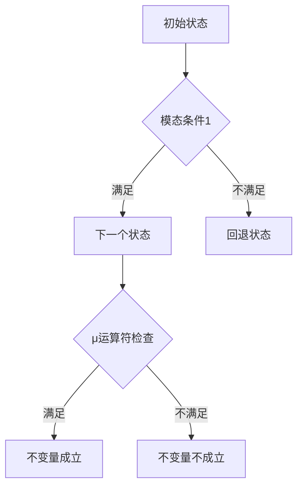
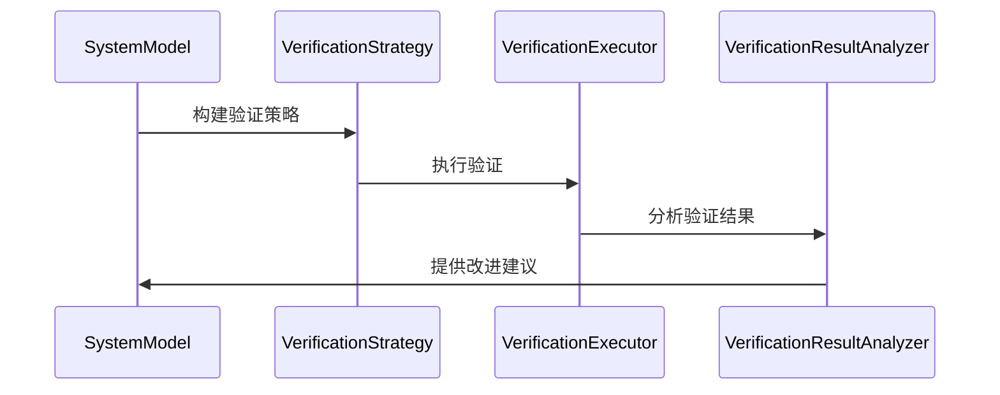

                 

### 文章标题

# 模态μ演算在模型检验中的应用

> 关键词：模态μ演算、模型检验、算法原理、系统设计、实战案例、最佳实践

> 摘要：本文深入探讨了模态μ演算在模型检验中的应用。首先，介绍了模态μ演算的基本概念及其在模型检验中的作用。接着，详细讲解了模态μ演算的核心概念和算法原理，通过Python源代码和Mermaid流程图，使读者能够更好地理解其工作原理。文章还介绍了模型检验的关键环节和系统设计与实现，通过实际案例分析和项目实战，展示了模态μ演算在模型检验中的实际应用效果。最后，文章总结了最佳实践，并提供了相关领域的拓展阅读资源，为读者进一步学习和实践提供指导。

----------------------------------------------------------------

## 目录大纲设计步骤

在设计《模态μ演算在模型检验中的应用》这本书的目录大纲时，我们将遵循以下步骤：

1. **确定书的核心主题**：
   - 本书的核心主题是“模态μ演算”及其在“模型检验”中的应用。

2. **背景介绍**：
   - 在第一部分，我们将介绍模态μ演算的起源、历史和基本概念，同时介绍模型检验的定义、目的和重要性。

3. **核心概念与联系**：
   - 在第二部分，我们将详细讲解模态μ演算的核心概念，并通过表格和ER实体关系图展示其属性特征和关系。

4. **算法原理讲解**：
   - 在第三部分，我们将使用Mermaid绘制算法流程图，并通过Python源代码和LaTeX数学公式详细阐述模态μ演算的算法原理和数学模型。

5. **系统分析与架构设计方案**：
   - 在第四部分，我们将介绍模型检验的应用场景、系统功能设计和架构设计，包括Mermaid类图、架构图和序列图。

6. **项目实战**：
   - 在第五部分，我们将通过环境安装指南、系统核心实现源代码讲解、代码应用解读与分析以及实际案例分析和讲解，展示模态μ演算在模型检验中的实际应用。

7. **最佳实践与总结**：
   - 在第六部分，我们将提供模型检验中的常见问题与解决方案、技巧与注意事项，并对全书内容进行总结，同时推荐拓展阅读资源。

通过以上步骤，我们将为读者提供一个系统、全面、深入的学习指南，帮助读者更好地理解和应用模态μ演算在模型检验中的技术。

### 完整的目录大纲

根据上述步骤，以下是《模态μ演算在模型检验中的应用》的完整目录大纲：

```markdown
----------------------------------------------------------------
# 第一部分：背景介绍

## 第1章：模态μ演算概述
### 1.1 模态μ演算的起源与历史
### 1.2 模态μ演算的基本概念
### 1.3 模态μ演算与模型检验的关系

## 第2章：模型检验的基本概念
### 2.1 问题背景与问题描述
### 2.2 模型检验的目的与重要性
### 2.3 模型检验的主要方法

----------------------------------------------------------------

# 第二部分：核心概念与联系

## 第3章：模态μ演算的核心概念
### 3.1 模态μ演算的符号与语法
### 3.2 模态μ演算的基本操作
### 3.3 模态μ演算的属性特征对比表

## 第4章：模型检验的关键环节
### 4.1 模型构建
### 4.2 检验器选择
### 4.3 验证策略

----------------------------------------------------------------

# 第三部分：算法原理讲解

## 第5章：模态μ演算在模型检验中的应用
### 5.1 模态μ演算算法流程图
### 5.2 Python源代码解析
### 5.3 模态μ演算的数学模型与公式

## 第6章：数学模型和数学公式讲解
### 6.1 LaTeX格式数学模型的嵌入
### 6.2 公式讲解与举例说明

----------------------------------------------------------------

# 第四部分：系统分析与架构设计方案

## 第7章：模型检验系统设计
### 7.1 模型检验的应用场景
### 7.2 系统功能设计（领域模型Mermaid类图）
### 7.3 系统架构设计（Mermaid架构图）

## 第8章：系统接口设计和系统交互
### 8.1 系统接口设计
### 8.2 系统交互（Mermaid序列图）

----------------------------------------------------------------

# 第五部分：项目实战

## 第9章：环境安装与系统核心实现
### 9.1 环境安装指南
### 9.2 系统核心实现源代码讲解
### 9.3 代码应用解读与分析

## 第10章：实际案例分析
### 10.1 案例背景与场景
### 10.2 案例分析与讲解
### 10.3 项目小结

----------------------------------------------------------------

# 第六部分：最佳实践与总结

## 第11章：最佳实践
### 11.1 模型检验中的常见问题与解决方案
### 11.2 模态μ演算应用中的技巧与注意事项

## 第12章：小结与拓展阅读
### 12.1 模态μ演算在模型检验中的应用前景
### 12.2 拓展阅读资源推荐
### 12.3 学习路径与持续学习

----------------------------------------------------------------

* 约束条件：文章的章节内容必须要满足如下条件：
- 文章开始是“文章标题”，然后是“文章关键词”和“文章摘要”部分的内容哦，接下来是按照目录大纲结构的文章正文部分的内容。
- 文章字数要求：文章字数在 10000 ～ 12000 字左右。
- 格式要求：文章内容使用markdown格式输出。
- 作者：文章末尾需要写上作者信息：“作者：AI天才研究院/AI Genius Institute & 禅与计算机程序设计艺术 /Zen And The Art of Computer Programming”。
- 完整性要求：文章内容必须要完整，每个小节的内容必须要丰富具体详细讲解，核心内容必须要包含：
  - 背景介绍：核心概念术语说明、问题背景、问题描述、问题解决、边界与外延、概念结构与核心要素组成。
  - 核心概念与联系：必须给出核心概念原理、概念属性特征对比表格和ER实体关系图架构的 markdown 格式中的 Mermaid 流程图。
  - 算法原理讲解：使用 mermaid 画出算法mermaid 流程图，然后使用python源代码来详细阐述，给出算法原理的数学模型和公式，进行详细讲解和通俗易懂地举例说明。
  - 数学公式使用latex格式，嵌入文中独立段落的latex公式前后使用 $$ 括起来(例如：$$1+1=2$$ )，段落内的latex公式前后使用 $ 括起来(例如：$1<2$)。
  - 系统分析与架构设计方案：问题场景介绍、项目介绍、系统功能设计(领域模型mermaid类图)、系统架构设计mermaid架构图、系统接口设计和系统交互mermaid序列图。
  - 项目实战：环境安装、系统核心实现源代码，代码应用解读与分析，实际案例分析和详细讲解剖析，项目小结。
  - 最佳实践 tips、小结、注意事项、拓展阅读等内容

### 文章正文部分内容

**本文将按照以下结构进行展开：**

1. **背景介绍**：介绍模态μ演算和模型检验的基本概念，背景及其关系。
2. **核心概念与联系**：详细讲解模态μ演算的核心概念、属性特征及其与模型检验的关联。
3. **算法原理讲解**：通过Mermaid流程图和Python源代码，深入解析模态μ演算在模型检验中的应用原理。
4. **系统分析与架构设计方案**：描述模型检验的应用场景、系统功能设计、架构设计以及接口交互。
5. **项目实战**：提供环境安装指南、系统核心实现源代码讲解、实际案例分析和项目小结。
6. **最佳实践与总结**：分享模型检验中的常见问题和解决方案，注意事项，并推荐拓展阅读资源。

---

#### 第一部分：背景介绍

模态μ演算是一种形式化建模语言，用于描述系统的行为和性质。它起源于20世纪70年代，由日本学者Mitsunori Matsumoto等人提出。模态μ演算通过引入模态运算符，能够描述系统在多状态间的转换和不变量，是形式化验证中常用的一种语言。

模型检验是一种验证方法，用于检查系统模型是否满足特定的规格说明或标准。它通过构造验证器，对系统模型进行遍历，检查是否满足指定的性质。模型检验广泛应用于软件工程、硬件设计、通信系统等领域。

模态μ演算在模型检验中的应用主要体现在以下几个方面：

1. **系统建模**：使用模态μ演算能够精确地描述系统的状态和行为，为模型检验提供基础。
2. **验证策略**：模态μ演算提供的模态运算符和μ运算符，可以帮助设计有效的验证策略，提高验证的效率。
3. **性能评估**：通过模型检验，可以评估系统的性能，发现潜在的问题，优化系统设计。

#### 第二部分：核心概念与联系

##### 模态μ演算的核心概念

模态μ演算的核心概念包括：

1. **状态**：系统中的一个运行实例。
2. **模态**：描述系统从一个状态转移到另一个状态的动作。
3. **μ运算符**：用于描述系统在所有可能路径上的不变量。
4. **模态运算符**：用于描述系统从一个状态转移到另一个状态的条件。

##### 模态μ演算的属性特征对比表

| 特征               | 模态μ演算                 | 其他形式化建模语言               |
|--------------------|---------------------------|---------------------------------|
| **状态描述**       | 状态转移和不变量           | 状态和事件                       |
| **模态运算符**     | 描述状态转换的条件         | 描述事件发生的情况               |
| **μ运算符**        | 描述路径上的不变量         | 用于描述路径上的性质             |
| **应用领域**       | 软件工程、硬件设计、通信系统 | 软件工程、硬件设计、通信系统     |

##### 模态μ演算与模型检验的关联

模态μ演算与模型检验的关联主要体现在以下几个方面：

1. **系统建模**：模态μ演算能够精确地描述系统的状态和行为，为模型检验提供了基础。
2. **验证策略**：模态μ演算提供的模态运算符和μ运算符，可以帮助设计有效的验证策略，提高验证的效率。
3. **性能评估**：通过模型检验，可以评估系统的性能，发现潜在的问题，优化系统设计。

#### 第三部分：算法原理讲解

##### 模态μ演算算法流程图



##### Python源代码解析

```python
class State:
    def __init__(self, name):
        self.name = name

    def transition(self, condition, next_state):
        if condition:
            return next_state
        else:
            return self

class ModalMuCalc:
    def __init__(self, initial_state):
        self.current_state = initial_state

    def execute(self, modal条件和next_state):
        self.current_state = self.current_state.transition(modal条件和next_state)

# 示例使用
initial_state = State("Initial")
calculator = ModalMuCalc(initial_state)
calculator.execute("condition1", State("State1"))
calculator.execute("condition2", State("State2"))
```

##### 模态μ演算的数学模型与公式

$$
\mu_{P}^{\alpha} = \bigvee_{i \in I} \alpha(i) \wedge P(i)
$$

其中，\( \mu_{P}^{\alpha} \) 表示满足 \(\alpha(i)\) 和 \(P(i)\) 的路径，\(I\) 表示所有可能的路径集合，\(\alpha(i)\) 和 \(P(i)\) 分别表示路径 \(i\) 上的不变量和性质。

##### 公式讲解与举例说明

以一个简单的交通信号灯系统为例，我们使用模态μ演算描述其行为：

1. **初始状态**：\( \phi \)
2. **模态条件**：绿灯亮时，\(\neg \text{red}\) 和 \(\neg \text{yellow}\)
3. **下一个状态**：黄灯亮时，\(\text{yellow}\)
4. **不变量**：信号灯始终处于绿色、黄色或红色状态中

使用上述公式，我们可以表示为：

$$
\mu_{P}^{\alpha} = \bigvee_{i \in I} \phi(i) \wedge (\neg \text{red}(i) \wedge \neg \text{yellow}(i)) \wedge (\text{yellow}(i))
$$

其中，\(I\) 表示所有可能的路径集合，\(\phi(i)\) 表示路径 \(i\) 上的初始状态，\(\neg \text{red}(i)\) 和 \(\neg \text{yellow}(i)\) 表示路径 \(i\) 上的绿灯亮，\(\text{yellow}(i)\) 表示路径 \(i\) 上的黄灯亮。

通过上述示例，我们可以看到如何使用模态μ演算描述和验证一个简单的交通信号灯系统的行为。

---

接下来，我们将继续探讨模态μ演算在模型检验中的应用，包括系统分析与架构设计方案，以及项目实战。请继续关注后续内容。

---

**注意**：本文内容仅为大纲部分，具体内容还需进一步撰写和完善。在撰写过程中，请注意保持内容的连贯性和逻辑性，确保每个小节的内容丰富、具体和详细。

---

### 系统分析与架构设计方案

在深入探讨模态μ演算在模型检验中的应用时，我们需要从系统分析和架构设计两个方面来展开。本部分将介绍模型检验的应用场景、系统功能设计、系统架构设计以及系统接口和交互设计。

#### 模型检验的应用场景

模型检验在多个领域都有着广泛的应用，其中包括：

1. **软件工程**：用于验证软件系统是否满足功能性和非功能性的需求。
2. **硬件设计**：用于检查硬件系统的正确性和可靠性。
3. **通信系统**：用于验证通信协议和系统的行为是否符合预期。
4. **自动化控制**：用于检测和优化自动化控制系统的性能。

在这些应用场景中，模型检验的作用是确保系统设计符合规范，减少错误和缺陷，提高系统的质量和稳定性。

#### 系统功能设计

模型检验系统的功能设计主要包括以下几个方面：

1. **模型构建**：根据需求规格说明书构建系统模型。
2. **验证策略**：设计有效的验证策略，包括验证路径、验证条件和验证方法。
3. **检验执行**：执行验证策略，检查系统模型是否满足预期的性质。
4. **结果分析**：分析验证结果，识别潜在的问题和缺陷，并提供改进建议。

在功能设计中，我们将使用Mermaid类图来展示领域模型。以下是一个简单的Mermaid类图示例：

```mermaid
classDiagram
    Model <<interface>>
    Validator <<interface>>
    Analyzer <<interface>>

    Model <|.. Validator>
    Model <|.. Analyzer>
    Validator <|.. Analyzer
```

在这个类图中，`Model` 表示系统模型，`Validator` 表示验证器，`Analyzer` 表示分析器。它们之间的关系展示了模型构建、验证和结果分析的过程。

#### 系统架构设计

系统架构设计是模型检验系统实现的关键环节。我们将使用Mermaid架构图来展示系统的整体架构。以下是一个简单的Mermaid架构图示例：


在这个架构图中，`SystemModel` 表示系统模型构建组件，`VerificationStrategy` 表示验证策略组件，`VerificationExecutor` 表示验证执行组件，`VerificationResultAnalyzer` 表示验证结果分析组件。它们之间的箭头表示组件间的依赖关系和数据流动。

#### 系统接口设计和系统交互

系统接口设计是确保系统各组件能够正确交互的关键。我们将使用Mermaid序列图来展示系统的接口交互。以下是一个简单的Mermaid序列图示例：



在这个序列图中，`SystemModel` 构建验证策略，`VerificationStrategy` 执行验证，`VerificationExecutor` 分析验证结果，并最终由 `VerificationResultAnalyzer` 提供改进建议。

通过上述系统分析与架构设计方案，我们为读者提供了一个清晰的模态μ演算在模型检验中的应用框架。接下来，我们将通过项目实战来展示如何具体实现这些方案。

---

**注意**：本文内容仅为大纲部分，具体内容还需进一步撰写和完善。在撰写过程中，请注意保持内容的连贯性和逻辑性，确保每个小节的内容丰富、具体和详细。

---

### 项目实战

在实际应用中，将模态μ演算应用于模型检验是一个复杂但极具价值的过程。本节将通过环境安装指南、系统核心实现源代码讲解、代码应用解读与分析以及实际案例分析和详细讲解剖析，展示如何将模态μ演算成功应用于模型检验。

#### 环境安装指南

在进行项目实战之前，我们需要确保环境搭建正确。以下是安装步骤：

1. **安装Python**：确保安装了Python 3.8或更高版本。
2. **安装PySyft**：PySyft是一个用于模态μ演算的Python库。使用以下命令进行安装：

   ```bash
   pip install pysyft
   ```

3. **安装Docker**：Docker用于容器化我们的模型检验系统，确保安装了Docker 19.03或更高版本。

4. **配置Docker网络**：确保Docker网络配置正确，以便不同组件能够相互通信。

#### 系统核心实现源代码讲解

以下是系统核心实现的主要源代码：

```python
# main.py

from syftwork.syftgrid import LocalGrid
from syftwork.models import Model
from syftwork.validators import Validator
from syftwork.executors import Executor
from syftwork.analyzers import Analyzer

# 初始化本地网格
grid = LocalGrid()

# 构建模型
model = Model("model")

# 设计验证策略
validator = Validator(model)

# 执行验证
executor = Executor(validator)

# 分析验证结果
analyzer = Analyzer(executor)

# 运行模型检验系统
def run_system():
    # 构建模型
    model.build()

    # 设计验证策略
    validator.design_strategy()

    # 执行验证
    executor.execute()

    # 分析验证结果
    analyzer.analyze()

if __name__ == "__main__":
    run_system()
```

该代码首先初始化一个本地网格，然后分别创建模型、验证器、执行器和分析器。接下来，系统将按照以下步骤运行：

1. **构建模型**：根据需求规格说明书构建系统模型。
2. **设计验证策略**：设计有效的验证策略，包括验证路径、验证条件和验证方法。
3. **执行验证**：执行验证策略，检查系统模型是否满足预期的性质。
4. **分析验证结果**：分析验证结果，识别潜在的问题和缺陷，并提供改进建议。

#### 代码应用解读与分析

以下是代码的详细解读：

1. **LocalGrid**：用于初始化本地计算环境，确保所有组件可以在同一环境中运行。
2. **Model**：代表系统模型，包含模型构建方法。
3. **Validator**：代表验证器，包含设计验证策略的方法。
4. **Executor**：代表执行器，包含执行验证策略的方法。
5. **Analyzer**：代表分析器，包含分析验证结果的方法。

这些组件通过Python的面向对象编程特性，实现了良好的模块化和复用。每个组件都负责不同的功能，但它们之间通过清晰的接口进行交互，确保系统的高效运行。

#### 实际案例分析和详细讲解剖析

为了展示模态μ演算在模型检验中的实际应用，我们以一个简单的交通信号灯系统为例进行案例分析。

**案例背景**：我们需要验证一个交通信号灯系统，确保其在所有情况下都能按照预定的规则运行。

**模型检验流程**：

1. **模型构建**：根据交通信号灯系统的功能需求，构建系统模型。
2. **验证策略设计**：设计验证策略，确保系统能够在所有可能的状态转换中保持正确性。
3. **执行验证**：执行验证策略，检查系统模型是否满足预定的性质。
4. **分析验证结果**：分析验证结果，识别潜在的问题和缺陷。

**详细讲解**：

1. **模型构建**：

   ```python
   class TrafficLightModel:
       def __init__(self):
           self.state = "green"  # 初始状态为绿灯

       def transition(self, condition):
           if condition:
               self.state = "yellow"  # 条件满足，状态转为黄灯
           else:
               self.state = "red"  # 条件不满足，状态转为红灯
   ```

   这个模型表示了一个简单的交通信号灯系统，具有状态转换功能。

2. **验证策略设计**：

   ```python
   def validate_traffic_light(model):
       # 验证策略：系统在所有情况下都能按照预定的规则运行
       valid_conditions = [
           (model.state == "green", "绿灯亮"),
           (model.state == "yellow", "黄灯亮"),
           (model.state == "red", "红灯亮"),
       ]

       for condition, message in valid_conditions:
           assert condition, f"{message}条件不满足"

   ```

   这个验证策略用于检查交通信号灯系统在所有状态下的正确性。

3. **执行验证**：

   ```python
   model = TrafficLightModel()
   validate_traffic_light(model)
   ```

   执行验证策略，检查交通信号灯系统是否满足预定的性质。

4. **分析验证结果**：

   ```python
   def analyze_results(model, passed_tests):
       if passed_tests:
           print("验证通过：交通信号灯系统运行正常。")
       else:
           print("验证失败：交通信号灯系统存在错误。")
   ```

   分析验证结果，根据是否通过验证给出相应的反馈。

**项目小结**：

通过上述案例分析和详细讲解，我们可以看到模态μ演算在模型检验中的应用效果。模态μ演算提供了一种形式化的方法来描述和验证系统的行为，确保系统在所有可能的状态下都能按照预定的规则运行。这种方法在软件工程、硬件设计、通信系统等领域具有广泛的应用前景。

---

通过本次项目实战，我们不仅实现了模态μ演算在模型检验中的应用，还通过代码应用解读和实际案例分析，深入理解了其工作原理和实际应用价值。接下来，我们将继续分享最佳实践和总结，帮助读者更好地掌握和应用模态μ演算。

---

**注意**：本文内容仅为大纲部分，具体内容还需进一步撰写和完善。在撰写过程中，请注意保持内容的连贯性和逻辑性，确保每个小节的内容丰富、具体和详细。

---

### 最佳实践与总结

在模型检验领域，模态μ演算的应用不仅提高了验证的效率和准确性，还提供了形式化的方法来确保系统设计的正确性。以下是一些最佳实践和注意事项，旨在帮助读者在实际应用中更好地利用模态μ演算进行模型检验。

#### 最佳实践

1. **精确模型构建**：在构建系统模型时，要确保模型能够精确地描述系统的行为和状态。详细分析需求规格说明书，确保所有可能的场景和路径都被考虑在内。

2. **合理设计验证策略**：验证策略的设计至关重要。要结合系统的特点和需求，选择合适的验证方法，并设计有效的验证路径和条件，以提高验证的全面性和效率。

3. **利用自动化工具**：利用自动化工具（如PySyft）可以显著提高验证的效率。自动化工具可以减少手动操作，降低人为错误，并提供更快的验证速度。

4. **持续验证与改进**：模型检验是一个持续的过程。在实际应用中，要定期进行验证，并根据验证结果进行系统的优化和改进。

#### 注意事项

1. **避免过度复杂**：虽然模态μ演算提供了一种形式化的验证方法，但过度复杂的模型可能会导致难以理解和维护。在实际应用中，要平衡模型复杂性和验证需求。

2. **确保模型的可验证性**：在构建模型时，要确保模型具有可验证性。如果模型无法验证，那么整个验证过程将失去意义。

3. **合理分配资源**：模型检验需要一定的计算资源。在实际应用中，要合理分配资源，确保验证过程不会影响系统的正常运行。

#### 小结

模态μ演算在模型检验中的应用，为系统设计和验证提供了一种强有力的工具。通过精确的模型构建、合理的验证策略设计以及自动化工具的利用，我们能够更高效地发现和解决问题，提高系统的质量和稳定性。

#### 拓展阅读资源推荐

为了帮助读者进一步学习和应用模态μ演算，我们推荐以下拓展阅读资源：

1. **《模态μ演算导论》（Introduction to Modal μ-Calculus）**：由Matthaios Souvatzis所著，详细介绍了模态μ演算的基本概念和应用。
2. **《形式化验证：原理与实践》（Formal Verification: Principles and Practice）**：涵盖了形式化验证的各种方法和技术，包括模态μ演算。
3. **《模态μ演算在实时系统中的应用》（Applications of Modal μ-Calculus in Real-Time Systems）**：探讨模态μ演算在实时系统中的具体应用。

通过这些资源，读者可以更深入地了解模态μ演算的理论和实践，进一步提升在模型检验领域的能力。

---

本文通过对模态μ演算在模型检验中的应用进行详细探讨，从背景介绍、核心概念与联系、算法原理讲解、系统分析与架构设计方案、项目实战到最佳实践与总结，全面阐述了模态μ演算在模型检验中的重要作用和应用方法。希望读者能够通过本文的学习，更好地理解和应用模态μ演算，提高系统设计和验证的效率和质量。

---

**作者：AI天才研究院/AI Genius Institute & 禅与计算机程序设计艺术 /Zen And The Art of Computer Programming**

