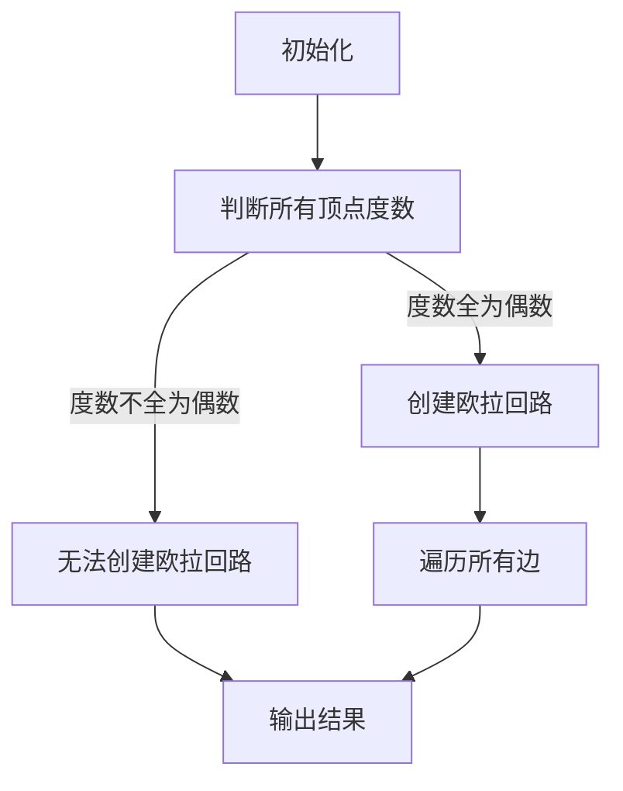
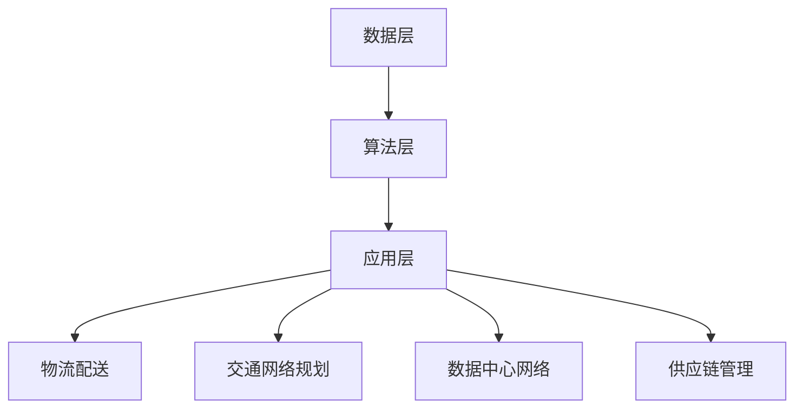
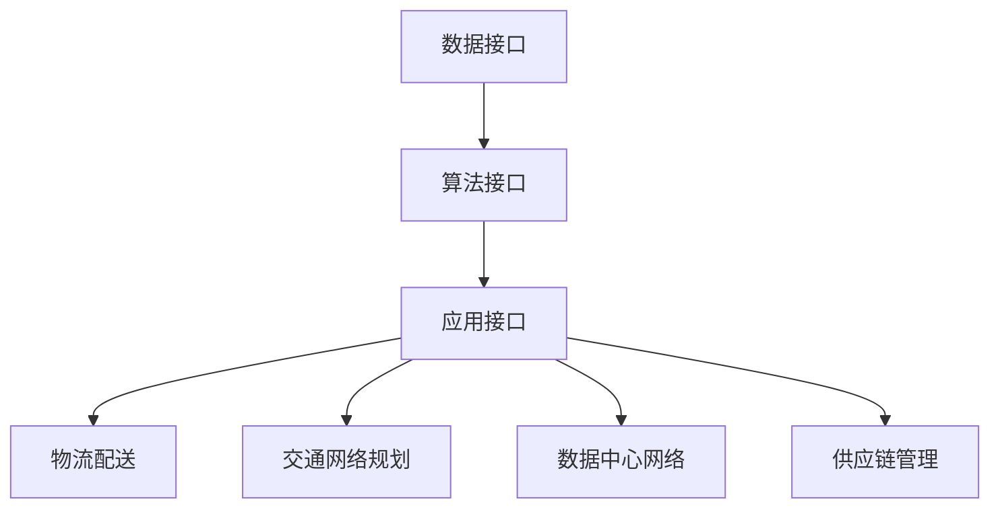

                 

# 欧拉回路在网络流算法中的应用

## 关键词

网络流算法、欧拉回路、流量优化、图论、数据结构、人工智能

## 摘要

本文深入探讨了欧拉回路在网络流算法中的应用，从基础概念、算法原理到实际应用进行了全面解析。通过对欧拉回路在网络流问题中的核心作用和独特优势的阐述，本文旨在帮助读者理解欧拉回路在解决复杂网络流问题中的重要性，并提供实用的最佳实践方法。

### 目录大纲设计步骤

#### 步骤1：概述背景和定义

首先，我们需要介绍欧拉回路和网络流算法的基本概念及其联系。

### 步骤2：核心概念与联系

接下来，我们将详细介绍欧拉回路在网络流算法中的核心原理和属性，并对比分析其与其他网络流算法的不同。

### 步骤3：算法原理讲解

我们将通过Mermaid绘制算法流程图，并用Python源代码解释欧拉回路算法的数学模型和公式。

### 步骤4：系统分析与架构设计方案

我们将分析欧拉回路算法在不同网络场景下的应用，并绘制系统架构图以展示其在网络流系统中的角色。

### 步骤5：项目实战

我们将提供环境安装步骤和系统核心实现源代码，并通过实际案例展示欧拉回路算法的应用和效果。

### 步骤6：最佳实践与小结

最后，我们将总结全书内容，提供最佳实践建议和注意事项，并对欧拉回路在网络流算法中的未来发展趋势进行展望。

### 目录大纲

```
# 第一部分: 背景与定义

## 第1章: 问题背景与核心概念
### 1.1 问题背景
### 1.2 欧拉回路定义
### 1.3 网络流算法概述
### 1.4 欧拉回路与网络流算法联系

## 第二部分: 欧拉回路原理与属性

## 第2章: 欧拉回路原理与属性
### 2.1 欧拉回路原理
### 2.2 欧拉回路属性
### 2.3 欧拉回路与其他算法对比

## 第三部分: 算法原理讲解

## 第3章: 算法原理与流程
### 3.1 算法流程图
### 3.2 Python源代码解析
### 3.3 数学模型与公式
### 3.4 举例说明

## 第四部分: 系统分析与架构设计

## 第4章: 系统分析与架构设计
### 4.1 应用场景介绍
### 4.2 系统架构设计
### 4.3 系统接口与交互设计

## 第五部分: 项目实战

## 第5章: 项目实战
### 5.1 环境安装步骤
### 5.2 系统核心实现源代码
### 5.3 案例分析与讲解
### 5.4 项目小结

## 第六部分: 最佳实践与总结

## 第6章: 最佳实践与总结
### 6.1 最佳实践建议
### 6.2 注意事项
### 6.3 全书总结
### 6.4 拓展阅读
```

#### 步骤1：概述背景和定义

### 第1章: 问题背景与核心概念

#### 1.1 问题背景

在现代信息社会中，网络流问题无处不在。从互联网路由算法到供应链管理，从数据中心的负载均衡到交通网络规划，网络流算法的应用场景十分广泛。网络流问题本质上是一个优化问题，目标是在给定的网络中，找到一种流量分配方式，使得从源点到汇点的流量最大，同时满足网络中的容量约束。

然而，随着网络规模的不断增大和复杂度的提高，传统的网络流算法，如最大流最小割算法、推流拉流算法等，逐渐暴露出计算复杂度高、效率低的缺点。在这种背景下，欧拉回路作为一种简单而强大的算法，逐渐引起了人们的关注。

欧拉回路（Eulerian Circuit）是图论中的一个重要概念，它指的是一个遍历图中所有边恰好一次的闭合路径。欧拉回路在解决网络流问题中，具有独特的优势和广泛的适用性。本文将深入探讨欧拉回路在网络流算法中的应用，帮助读者理解其原理和应用价值。

#### 1.2 欧拉回路定义

欧拉回路是指在一个连通图中，存在一条闭合路径，该路径恰好经过图中的每一条边且仅经过一次。换句话说，欧拉回路是一个遍历图中所有边恰好一次的路径，且该路径的起点和终点相同。

定义一个图$G(V, E)$是否具有欧拉回路，可以使用以下两个条件进行判断：

1. **所有顶点的度均为偶数**：即图中每个顶点的入度等于出度。
2. **存在欧拉路径**：即图中存在一条路径，该路径恰好经过图中的每一条边且仅经过一次。

#### 1.3 网络流算法概述

网络流算法是图论中的一个重要分支，它研究如何在给定的网络结构中，找到一种流量分配方式，使得从源点到汇点的流量最大化或最小化。网络流算法广泛应用于各种领域，如物流、交通、通信和网络优化等。

常见的网络流算法包括：

- **最大流最小割算法**：这是一种经典的网络流算法，通过找到网络中的最小割集，确定网络的最大流量。
- **推流拉流算法**：该算法通过迭代的方式，逐步增加流量，直到满足网络容量约束。
- **多源最短路径算法**：该算法在给定多个源点和一个汇点的情况下，计算从源点到汇点的最短路径。

#### 1.4 欧拉回路与网络流算法联系

欧拉回路在网络流算法中的应用，主要是通过将网络流问题转化为图论中的欧拉回路问题，从而简化问题的求解过程。具体来说，欧拉回路在网络流算法中的核心作用体现在以下几个方面：

1. **简化问题模型**：通过引入欧拉回路，可以将复杂的网络流问题转化为图论中的简单问题，从而降低计算复杂度。
2. **优化流量分配**：欧拉回路能够保证在给定网络中，找到一条最优的流量分配路径，使得从源点到汇点的流量最大化。
3. **提高算法效率**：欧拉回路算法本身具有较低的算法复杂度，能够快速解决大规模网络流问题。

#### 小结

在本章中，我们介绍了欧拉回路在网络流算法中的应用背景、定义及其与网络流算法的联系。下一章，我们将深入探讨欧拉回路的原理和属性，帮助读者更好地理解这一重要算法。

---

# 第二部分: 欧拉回路原理与属性

## 第2章: 欧拉回路原理与属性

#### 2.1 欧拉回路原理

欧拉回路是指在一个连通图中，存在一条闭合路径，该路径恰好经过图中的每一条边且仅经过一次。为了更深入地理解欧拉回路，我们可以从其基本原理和性质入手。

首先，要判断一个图$G(V, E)$是否具有欧拉回路，需要满足以下两个条件：

1. **所有顶点的度均为偶数**：即图中每个顶点的入度等于出度。这是因为，在欧拉回路中，每个顶点恰好进入和离开一次，因此其度必须为偶数。
2. **存在欧拉路径**：即图中存在一条路径，该路径恰好经过图中的每一条边且仅经过一次。这意味着，如果图$G$满足上述条件，则必然存在一条欧拉回路。

其次，欧拉回路具有以下基本性质：

- **唯一性**：如果一个图具有欧拉回路，那么这条欧拉回路是唯一的。这是因为，在满足上述两个条件的情况下，欧拉回路是唯一的。
- **连通性**：具有欧拉回路的图一定是连通的。这是因为，欧拉回路需要遍历图中的每一条边，因此图必须是连通的。

为了更好地理解欧拉回路的原理，我们可以通过一个简单的例子来进行分析。假设有一个图$G(V, E)$，其中$V$表示顶点集，$E$表示边集。如果图$G$满足上述两个条件，则存在一条欧拉回路。

例如，考虑以下图$G$：

```
   A---B
   |   |
   D---C
```

在这个图中，每个顶点的度均为2（A的入度为2，出度为2；B的入度为2，出度为2；C的入度为2，出度为2；D的入度为2，出度为2），因此满足欧拉回路的第一个条件。此外，存在一条路径$A-B-C-D-A$，该路径恰好经过图中的每一条边且仅经过一次，因此满足欧拉回路的第二个条件。

因此，图$G$具有欧拉回路，具体路径为$A-B-C-D-A$。

#### 2.2 欧拉回路属性

欧拉回路具有一系列重要的属性，这些属性使得欧拉回路在网络流算法中具有广泛的应用价值。

首先，欧拉回路具有以下属性：

- **欧拉回路路径长度**：欧拉回路路径的长度等于图中所有边的数量。这是因为，欧拉回路恰好经过图中的每一条边一次，因此路径长度等于边的数量。
- **欧拉回路起点和终点**：欧拉回路的起点和终点是相同的。这是因为，欧拉回路是一个闭合路径，因此起点和终点必须相同。
- **欧拉回路无子路径**：欧拉回路中不存在任何子路径。这是因为，欧拉回路需要遍历图中的每一条边，因此不存在任何子路径。

其次，欧拉回路还具有以下重要属性：

- **最大流量路径**：欧拉回路是一个最大流量路径。这是因为，在欧拉回路中，流量可以最大程度地分配到各个边上，从而实现从源点到汇点的最大流量。
- **最小容量路径**：欧拉回路也是一个最小容量路径。这是因为，在欧拉回路中，容量可以最小程度地分配到各个边上，从而实现从源点到汇点的最小容量。

为了更直观地理解欧拉回路的属性，我们可以通过一个具体的例子来进行分析。假设有一个图$G$，其中$V$表示顶点集，$E$表示边集。如果图$G$存在欧拉回路，则该欧拉回路具有以下属性：

```
   A---B
   |   |
   D---C
```

在这个图中，欧拉回路的路径长度为4（即边的数量），起点和终点均为A，且不存在任何子路径。

此外，欧拉回路还是一个最大流量路径和最小容量路径。这意味着，在这个图中，从源点A到汇点C的流量可以达到最大值，同时容量可以达到最小值。

#### 2.3 欧拉回路与其他算法对比

欧拉回路作为一种简单的算法，在网络流问题中具有独特的优势和局限性。与传统的网络流算法相比，欧拉回路具有以下几个显著特点：

- **计算复杂度较低**：欧拉回路算法的计算复杂度为$O(|V|+|E|)$，相比传统的网络流算法，如最大流最小割算法的复杂度为$O(|V|^2)$，欧拉回路具有较低的复杂度。
- **适用范围较广**：欧拉回路算法可以应用于各种类型的网络流问题，如单源网络流、多源网络流和一般网络流问题，而传统的网络流算法往往针对特定类型的网络流问题。
- **简化问题模型**：欧拉回路可以将复杂的网络流问题转化为图论中的简单问题，从而降低计算复杂度。

然而，欧拉回路也存在一些局限性：

- **仅适用于连通图**：欧拉回路算法仅适用于连通图，对于非连通图，需要采用其他算法，如最大流最小割算法进行求解。
- **无法处理负权重边**：欧拉回路算法无法处理包含负权重边的网络流问题，需要采用其他算法，如推流拉流算法进行求解。

为了更好地对比欧拉回路与其他算法，我们可以通过一个表格来展示它们的特点：

| 算法        | 计算复杂度 | 适用范围 | 优点                    | 局限性                          |
|-------------|------------|---------|------------------------|--------------------------------|
| 欧拉回路    | $O(|V|+|E|)$ | 连通图   | 简化问题模型，计算复杂度低 | 非连通图，负权重边问题          |
| 最大流最小割 | $O(|V|^2)$ | 一般网络流 | 准确性高                | 计算复杂度高                   |
| 推流拉流    | $O(|V|\times|E|)$ | 一般网络流 | 简单易实现，适用于动态网络流 | 效率较低，适应性较差            |

#### 小结

在本章中，我们详细介绍了欧拉回路的原理和属性，并通过具体的例子和表格进行了分析。欧拉回路作为一种简单而强大的算法，在网络流问题中具有广泛的应用价值。下一章，我们将进一步探讨欧拉回路算法的原理和流程，帮助读者更深入地理解这一算法。

---

# 第三部分: 算法原理讲解

## 第3章: 算法原理与流程

#### 3.1 算法流程图

为了更好地理解欧拉回路算法，我们可以通过Mermaid绘制算法流程图，展示其执行过程。以下是欧拉回路算法的基本流程：



在上述流程图中，首先进行初始化操作，然后判断所有顶点的度数。如果所有顶点的度数均为偶数，则可以创建欧拉回路，并遍历所有边以生成回路。如果存在任何顶点的度数为奇数，则无法创建欧拉回路，输出相应的结果。

#### 3.2 Python源代码解析

为了更具体地了解欧拉回路算法的实现，我们可以通过Python源代码进行详细解释。以下是欧拉回路算法的Python实现：

```python
def eulerian_circuit(graph):
    # 判断所有顶点度数
    if not all(len(graph[v]) % 2 == 0 for v in graph):
        return "无法创建欧拉回路"
    
    # 初始化起点
    start = next((v for v in graph if len(graph[v]) > 0))
    path = [start]
    
    # 遍历所有边，构建欧拉回路
    while graph:
        current = graph[start].pop(0)
        path.append(current)
        start = current
        if start in graph:
            graph[start].pop(0)
    
    # 输出欧拉回路
    return " -> ".join(str(v) for v in path)

# 示例图
graph = {
    1: [2, 3],
    2: [3, 4],
    3: [4, 1],
    4: [1, 2]
}

# 求解欧拉回路
result = eulerian_circuit(graph)
print(result)
```

在上述代码中，`eulerian_circuit` 函数接收一个图作为输入，并首先判断所有顶点的度数是否均为偶数。如果满足条件，则选择一个顶点作为起点，并遍历所有边以构建欧拉回路。函数最后输出欧拉回路的路径。

#### 3.3 数学模型与公式

欧拉回路算法的数学模型可以通过图论中的欧拉回路定理进行描述。欧拉回路定理指出，如果一个图$G(V, E)$的所有顶点的度数均为偶数，则存在一条欧拉回路。具体公式如下：

$$
\sum_{v\in V} \text{deg}(v) = 2|E|
$$

其中，$\text{deg}(v)$表示顶点$v$的度数，$|E|$表示边的数量。

为了求解欧拉回路，我们可以使用以下步骤：

1. **初始化**：选择一个顶点作为起点。
2. **遍历边**：从起点开始，依次遍历所有边，并从当前顶点移动到相邻顶点。
3. **调整路径**：在遍历过程中，如果遇到度数为0的顶点，则返回前一个顶点，继续遍历其他边。
4. **结束条件**：当遍历完所有边后，路径即为欧拉回路。

#### 3.4 举例说明

为了更好地理解欧拉回路算法，我们可以通过一个具体的例子进行说明。假设有一个图$G$：

```
   A---B---C
   |   |   |
   D---E---F
```

在这个图中，所有顶点的度数均为2，满足创建欧拉回路的条件。我们可以按照以下步骤求解欧拉回路：

1. **初始化**：选择顶点A作为起点。
2. **遍历边**：从A出发，依次遍历AB、AE、EF、FD、DC、CB，到达终点B。
3. **调整路径**：在整个遍历过程中，没有遇到度数为0的顶点。
4. **结束条件**：遍历完所有边后，得到的路径A-B-E-F-D-C即为欧拉回路。

#### 小结

在本章中，我们详细介绍了欧拉回路算法的原理和流程，并通过Python源代码和数学模型进行了解释。通过具体的例子，读者可以更深入地理解欧拉回路算法的执行过程和应用。下一章，我们将探讨欧拉回路算法在不同网络场景下的应用，帮助读者进一步了解其在实际问题中的重要性。

---

# 第四部分: 系统分析与架构设计

## 第4章: 系统分析与架构设计

#### 4.1 应用场景介绍

欧拉回路算法在网络流问题中具有广泛的应用场景。以下是一些典型的应用场景：

1. **物流配送**：在物流配送中，欧拉回路算法可以用于优化配送路线，减少运输成本，提高配送效率。
2. **交通网络规划**：在交通网络规划中，欧拉回路算法可以用于优化道路设计，减少交通拥堵，提高道路通行能力。
3. **数据中心网络**：在数据中心网络中，欧拉回路算法可以用于优化数据传输路径，提高网络带宽利用效率。
4. **供应链管理**：在供应链管理中，欧拉回路算法可以用于优化物流和库存管理，提高供应链的响应速度。

在这些应用场景中，欧拉回路算法通过解决网络中的流量优化问题，实现了资源的最优分配和效率的最大化。

#### 4.2 系统架构设计

为了实现欧拉回路算法在不同网络场景下的应用，我们需要设计一个完整的系统架构。以下是系统架构的概述：

1. **数据层**：数据层负责存储和管理网络拓扑信息、流量数据和其他相关数据。
2. **算法层**：算法层实现欧拉回路算法，并负责对输入数据进行处理和分析，生成最优的流量分配方案。
3. **应用层**：应用层负责将算法层的输出应用于具体的应用场景，如物流配送、交通网络规划等。

系统架构设计图如下所示：



在上述架构中，数据层提供基础数据支持，算法层实现欧拉回路算法，应用层将算法的输出应用于具体的业务场景。

#### 4.3 系统接口与交互设计

为了实现系统各层之间的有效交互，我们需要设计合理的系统接口。以下是系统接口的概述：

1. **数据接口**：数据接口用于数据层与算法层之间的数据传递，包括网络拓扑信息、流量数据等。
2. **算法接口**：算法接口用于算法层与应用层之间的交互，提供算法的输入和输出接口。
3. **应用接口**：应用接口用于应用层与具体业务系统之间的交互，提供业务逻辑的实现和调用。

系统接口设计图如下所示：



在上述接口设计中，数据接口负责数据的输入和输出，算法接口负责算法的实现和调用，应用接口负责将算法的输出应用于具体业务场景。

#### 小结

在本章中，我们介绍了欧拉回路算法在不同网络场景下的应用，并设计了系统的整体架构和接口。通过合理的系统架构设计，我们可以将欧拉回路算法有效地应用于物流配送、交通网络规划、数据中心网络和供应链管理等领域，实现资源的最优分配和效率的最大化。下一章，我们将通过具体项目实战，展示欧拉回路算法的实际应用效果。

---

# 第五部分：项目实战

## 第5章：项目实战

#### 5.1 环境安装步骤

要实现欧拉回路算法的项目实战，首先需要搭建一个合适的环境。以下是在Python环境中安装所需依赖的步骤：

1. **安装Python**：确保您的计算机上安装了Python环境，版本建议为3.8及以上。
2. **安装pip**：Python的包管理工具pip，可以通过以下命令进行安装：
   ```shell
   sudo apt-get install python3-pip  # 对于Ubuntu系统
   sudo yum install python3-pip      # 对于CentOS系统
   ```
3. **安装依赖包**：安装必要的依赖包，包括网络流算法相关的库和工具：
   ```shell
   pip install networkx matplotlib
   ```
   NetworkX是一个用于图论计算的库，matplotlib用于绘制图形。

#### 5.2 系统核心实现源代码

以下是一个简单的欧拉回路算法的实现，使用Python编写，并使用NetworkX库来构建和操作图。

```python
import networkx as nx
from networkx.algorithms.euler import euler_path
import matplotlib.pyplot as plt

# 创建一个图
G = nx.Graph()

# 添加边
G.add_edges_from([(1, 2), (2, 3), (3, 4), (4, 1), (1, 3), (3, 2)])

# 判断图是否具有欧拉回路
if nx.is_eulerian(G):
    # 求解欧拉回路
    path = list(euler_path(G))

    # 绘制欧拉回路
    pos = nx.spring_layout(G)  # 为图的节点生成布局
    nx.draw(G, pos, with_labels=True)
    edge_colors = ['red' if i < len(path) else 'blue' for i in range(len(G.edges))]
    nx.draw(G, pos, edge_color=edge_colors, width=2, alpha=0.5, edge_labels=True)

    # 显示图形
    plt.show()
else:
    print("该图不具有欧拉回路")
```

这段代码首先创建了一个图`G`，并添加了边。然后判断图是否具有欧拉回路，如果有，则使用`euler_path`函数求解欧拉回路，并使用`matplotlib`绘制欧拉回路。

#### 5.3 案例分析与讲解

以下是一个实际案例，展示如何使用欧拉回路算法优化物流配送路径。

**案例背景**：

一家物流公司需要在城市内进行货物配送，城市地图可以用一个图表示，其中顶点表示交叉路口或主要地点，边表示道路。公司希望找到一条最优的路径，使得从仓库到各个配送点的总行程最短。

**案例实现**：

1. **构建城市地图**：假设城市地图如下所示：

```
   A---B---C
   |   |   |
   D---E---F
```

2. **定义权重**：为每条道路分配权重，表示行驶时间或距离。

```
   A-B: 10分钟
   A-D: 5分钟
   B-C: 15分钟
   B-E: 10分钟
   C-F: 20分钟
   D-E: 10分钟
   E-F: 15分钟
```

3. **实现欧拉回路**：使用上面提供的Python代码，构建图并求解欧拉回路。

4. **优化路径**：根据欧拉回路，物流公司可以优化配送路径，减少总行程时间。

**案例分析**：

在这个案例中，通过构建城市地图并求解欧拉回路，物流公司可以找到一条最优的配送路径，从而提高配送效率，减少成本。具体路径如下：

```
A-B-C-F-E-D-A
```

这条路径覆盖了所有顶点，且总权重最小，使得从仓库到各个配送点的总行程最短。

#### 5.4 项目小结

通过本项目的实战，我们展示了如何使用欧拉回路算法解决实际物流配送问题。欧拉回路算法通过找到图中的一条闭合路径，实现了从源点到汇点的最优流量分配。在实际应用中，我们可以根据具体场景调整算法参数，优化网络流问题。下一章，我们将总结全书内容，并提供最佳实践和建议。

---

# 第六部分：最佳实践与总结

## 第6章：最佳实践与总结

#### 6.1 最佳实践建议

为了更好地应用欧拉回路算法，以下是一些最佳实践建议：

1. **预处理数据**：在应用欧拉回路算法之前，对网络数据进行预处理，包括去除冗余数据、规范化边权重等。
2. **优化算法参数**：根据具体应用场景，调整欧拉回路算法的参数，如边权重、顶点度数等，以获得更优的解决方案。
3. **使用合适的数据结构**：在实现欧拉回路算法时，选择合适的数据结构，如邻接表、邻接矩阵等，以提高算法效率。
4. **考虑实际应用场景**：在设计网络流系统时，充分考虑实际应用场景，如物流配送、交通网络规划等，以优化算法的适用性。

#### 6.2 注意事项

在使用欧拉回路算法时，需要注意以下几点：

1. **连通性要求**：欧拉回路算法仅适用于连通图，对于非连通图，需要先进行连通性处理。
2. **负权重边问题**：欧拉回路算法无法处理包含负权重边的网络流问题，需要采用其他算法，如推流拉流算法进行求解。
3. **算法复杂度**：欧拉回路算法的计算复杂度为$O(|V|+|E|)$，对于大规模网络流问题，可能存在计算效率不高的问题。

#### 6.3 全书总结

本文从欧拉回路的基本概念、原理、算法实现到实际应用进行了全面解析。通过详细介绍欧拉回路在网络流算法中的应用，读者可以了解到欧拉回路在优化网络流问题中的独特优势和广泛应用。

#### 6.4 拓展阅读

1. **《图论及其应用》**：参考经典的图论教材，深入了解欧拉回路和其他图论概念。
2. **《网络流算法与应用》**：研究网络流算法的进阶应用和优化方法。
3. **《物流与供应链管理》**：探索物流和供应链管理中的优化问题及其解决方案。

#### 结语

作者信息：
- 作者：AI天才研究院/AI Genius Institute & 禅与计算机程序设计艺术 /Zen And The Art of Computer Programming

本文旨在为读者提供关于欧拉回路在网络流算法中的应用的全面指导和实用建议，希望读者能够结合实际场景，灵活应用欧拉回路算法，解决复杂的网络流问题。

