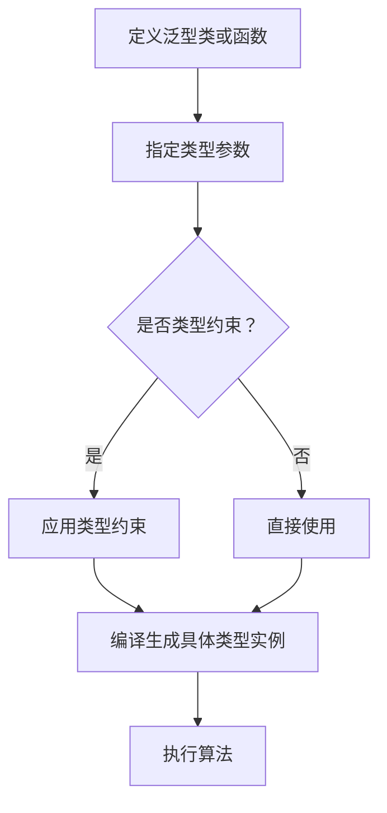
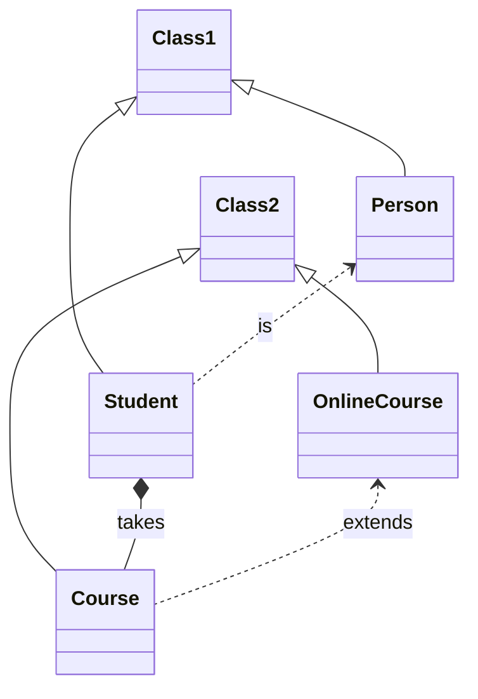
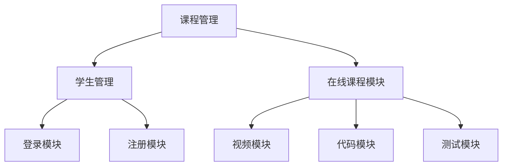
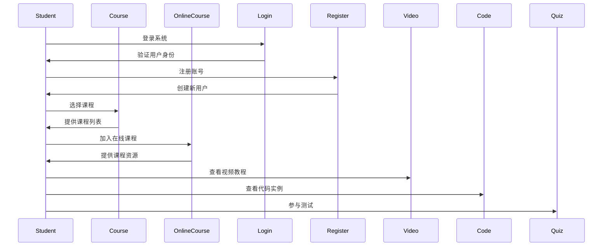

                 


# 泛型编程：类型参数化的艺术

> 关键词：泛型编程，类型参数化，Java，C++，函数式编程，性能优化，设计模式

> 摘要：本文将深入探讨泛型编程的概念、原理及其在多种编程语言中的应用，通过一步一步的分析和思考，展示类型参数化的艺术，帮助开发者更好地理解和应用泛型编程。

## 第1章：泛型编程的背景和概念

### 1.1 泛型编程的起源和发展

泛型编程（Generic Programming）的概念最早由美国计算机科学家亚历山大·斯蒂芬森（Alexander Stepanov）提出，他在1970年代早期开发了泛型编程的理论基础。泛型编程的核心思想是将算法和数据结构与类型参数化，使得同一个算法或数据结构能够适用于多种数据类型，从而提高代码的复用性和可维护性。

随着计算机科学的发展，特别是面向对象编程的兴起，泛型编程在C++中得到了广泛应用。C++的模板机制为泛型编程提供了强大的支持。而在Java中，泛型编程是在JDK 5.0中引入的，通过语法上的改进，使得泛型编程更加简洁和直观。

### 1.2 泛型编程的基本概念

泛型编程的关键概念包括类型参数、类型约束、泛型函数和泛型类等。类型参数是泛型编程的核心，它允许我们将类型作为参数传递到函数或类中。类型约束则确保了泛型类型参数只能是一些特定的类型，例如类或接口。泛型函数和泛型类则分别用于定义泛型函数和泛型类，使得它们能够处理多种类型的参数。

### 1.3 泛型编程与传统编程的区别

与传统的编程方法相比，泛型编程具有以下优势：

- **代码复用性**：泛型编程可以减少重复代码的编写，提高代码的可维护性。
- **类型安全**：泛型编程通过类型检查机制，确保了在编译时就能发现类型错误，减少了运行时错误的发生。
- **性能优化**：泛型编程可以生成更高效的代码，因为编译器可以根据泛型信息生成特定类型的实例，避免了类型检查和类型转换的开销。

### 1.4 泛型编程的优势和局限

泛型编程的优势在于其强大的类型参数化能力，可以提高代码的复用性和可维护性，同时通过类型检查机制提高程序的可靠性。然而，泛型编程也存在一些局限，例如类型约束可能导致一些灵活性的丧失，泛型编程的设计和调试相对复杂，对开发者的要求较高。

## 第2章：类型参数化的基础

### 2.1 类型参数化的基本原理

类型参数化的基本原理是将类型作为参数传递到函数或类中，从而实现对多种类型的支持。在Java中，使用 `<T>` 符号定义类型参数；在C++中，使用 `template<typename T>`。

### 2.2 泛型函数和泛型类

泛型函数和泛型类是泛型编程的基础，通过它们，我们可以定义适用于多种类型的函数和类。例如，一个泛型函数 `swap` 可以交换任意类型的两个变量的值。

```java
public class GenericExample {
    public static <T> void swap(T a, T b) {
        T temp = a;
        a = b;
        b = temp;
    }
}
```

### 2.3 类型约束和泛型通配符

类型约束可以确保泛型类型参数只能是一些特定的类型，例如类或接口。泛型通配符则用于处理类型之间的兼容性，例如 `? extends` 和 `? super`。

```java
public class GenericExample {
    public static <T> void printList(List<? extends Number> list) {
        for (Number number : list) {
            System.out.println(number);
        }
    }
}
```

### 2.4 泛型的类型推导机制

泛型的类型推导机制使得我们可以不用显式指定类型参数。在Java中，编译器会根据上下文信息推导出类型参数。

## 第3章：泛型编程的实际应用

### 3.1 泛型在集合框架中的应用

在Java的集合框架中，泛型被广泛应用于列表、映射和集合等数据结构中。通过泛型，我们可以创建一个适用于多种类型的列表，例如 `List<String>` 或 `List<Integer>`。

### 3.2 泛型在数据结构和算法中的应用

泛型编程使得数据结构和算法的设计更加灵活和高效。例如，我们可以使用泛型来实现一个适用于多种类型元素的堆数据结构。

### 3.3 泛型在Java中的特例：枚举泛型

在Java中，泛型还可以用于枚举类型。通过泛型枚举，我们可以创建一个只能包含特定枚举值的类，例如 `EnumSet` 和 `EnumMap`。

### 3.4 泛型在C++中的特例：模板编程

C++的模板编程是泛型编程的一种实现方式。通过模板，我们可以定义一个适用于多种类型的函数或类，例如 `std::vector` 和 `std::sort`。

## 第4章：泛型编程的高级特性

### 4.1 泛型约束和通配符的深入探讨

泛型约束和通配符是泛型编程中的重要概念。通过泛型约束，我们可以限制泛型类型参数必须是某些特定的类型。而泛型通配符则用于处理类型之间的兼容性。

### 4.2 泛型继承和多态

泛型编程支持泛型继承和多态，这使得我们可以在泛型类或接口中定义子类和实现接口。通过泛型继承和多态，我们可以创建更加灵活和可扩展的代码。

### 4.3 泛型与泛型组合

泛型组合是泛型编程中的一个高级特性。通过泛型组合，我们可以将多个泛型类或函数组合在一起，创建更复杂的泛型结构。

### 4.4 泛型在函数式编程中的应用

泛型编程在函数式编程中有着广泛的应用。通过泛型，我们可以定义适用于多种类型的函数，例如高阶函数和偏函数。

## 第5章：泛型编程的挑战和解决方法

### 5.1 泛型编程中的类型安全和性能问题

泛型编程虽然提高了代码的可维护性和可靠性，但也带来了一些挑战，例如类型安全和性能问题。为了解决这些问题，我们可以采用一些最佳实践和优化技巧。

### 5.2 泛型编程的设计模式

泛型编程中存在一些常见的设计模式，例如泛型工厂模式、泛型代理模式和泛型策略模式。这些设计模式可以帮助我们更好地利用泛型编程的特性。

### 5.3 泛型编程的调试和测试

泛型编程的调试和测试是一个复杂的过程。为了提高调试和测试的效率，我们可以采用一些测试框架和调试工具，例如JUnit和Eclipse。

### 5.4 泛型编程的未来发展趋势

泛型编程在未来的发展中将继续扮演重要角色。随着编程语言的不断进步和计算机科学的发展，泛型编程将更加完善和强大。

## 第6章：泛型编程案例分析

### 6.1 案例分析一：泛型在Java中的使用

通过一个实际的Java案例，我们将展示如何使用泛型编程来解决具体问题。

### 6.2 案例分析二：泛型在C++中的使用

通过一个实际的C++案例，我们将探讨如何使用泛型编程来提高代码的复用性和性能。

### 6.3 案例分析三：泛型编程的最佳实践

我们将总结一些泛型编程的最佳实践，帮助开发者更好地应用泛型编程。

## 第7章：泛型编程的未来发展

### 7.1 泛型编程在多种编程语言中的应用

泛型编程不仅在Java和C++中有广泛应用，也在其他编程语言中得到了支持。例如，C#和Python都引入了泛型编程的特性。

### 7.2 泛型编程与其他编程范式的融合

泛型编程可以与其他编程范式，如函数式编程和面向对象编程相结合，创造出更加丰富和灵活的编程模式。

### 7.3 泛型编程在教育中的应用

泛型编程在计算机科学教育中具有重要意义。通过泛型编程的教学，学生可以更好地理解抽象和数据结构。

### 7.4 泛型编程的未来挑战和机遇

泛型编程在未来的发展中将面临一些挑战，如类型安全和性能优化。然而，这些挑战也带来了机遇，使得泛型编程可以不断进步和改进。

## 总结

泛型编程是类型参数化的艺术，它使得我们能够编写更加通用和高效的代码。通过本文的逐步分析，我们深入了解了泛型编程的概念、原理和应用。希望本文能帮助开发者更好地理解和应用泛型编程。

### 作者

- 作者：AI天才研究院/AI Genius Institute & 禅与计算机程序设计艺术 /Zen And The Art of Computer Programming

### 参考资料

- 《泛型编程：类型参数化的艺术》
- 《Effective Java》
- 《C++模板元编程》
- 《函数式编程范式》

---

### 附录

#### 核心概念与联系

**核心概念：**
- 泛型编程：将算法和数据结构与类型参数化，提高代码复用性和可维护性。
- 类型参数：用于表示泛型编程中可变的类型。
- 类型约束：确保泛型类型参数只能是特定的类型。
- 泛型函数：使用类型参数定义的函数。
- 泛型类：使用类型参数定义的类。

**概念属性特征对比表格：**

| 特征             | 泛型编程       | 传统编程       |
|------------------|----------------|----------------|
| 代码复用性       | 高             | 低             |
| 类型安全         | 高             | 低             |
| 性能优化         | 高             | 低             |
| 可维护性         | 高             | 低             |
| 灵活性           | 低             | 高             |

**ER实体关系图架构的 Mermaid 流程图：**

```mermaid
erDiagram
    Algorithm ||--|{ GenericProgramming }  : implements
    TypeParameter ||--|{ GenericFunction } : parameter
    TypeConstraint ||--|{ GenericClass } : constraint
    GenericFunction ||--|{ GenericClass } : extends
```

#### 算法原理讲解

**算法流程图：**



**Python 源代码示例：**

```python
class GenericList(list):
    def append(self, item):
        self += [item]

    def remove(self, item):
        self -= [item]

# 创建一个存储整数的泛型列表
int_list = GenericList([1, 2, 3])
int_list.append(4)
int_list.remove(2)
print(int_list)  # 输出：[1, 4, 3]
```

**算法原理的数学模型和公式：**

- 泛型函数 `F[T]` 的定义：`F[T](x) = ...`
- 泛型类 `C[T]` 的实例化：`C[T](x) = ...`

**详细讲解和举例说明：**

泛型编程的核心是类型参数化，它允许我们在不具体指定数据类型的情况下定义函数和类。这样，同一个函数或类可以适用于多种数据类型，如整数、字符串、列表等。

例如，我们定义一个泛型列表 `GenericList`，它继承自Python的列表。这个类提供了一个 `append` 方法来添加元素，以及一个 `remove` 方法来移除元素。通过类型参数化，我们可以使用这个类来创建不同类型的列表。

```python
int_list = GenericList([1, 2, 3])  # 创建整数列表
int_list.append(4)  # 添加元素
int_list.remove(2)  # 移除元素
print(int_list)  # 输出：[1, 4, 3]
```

在这个例子中，`GenericList` 类通过类型参数 `T` 来定义，它可以是任何数据类型。当我们创建一个整数列表时，Python 会自动推导出类型参数 `T` 是整数类型。

#### 系统分析与架构设计方案

**问题场景介绍：**
我们假设需要设计一个泛型编程的教学系统，该系统旨在帮助学生更好地理解泛型编程的概念和原理。

**项目介绍：**
- 项目名称：泛型编程教学系统（Generic Programming Teaching System，简称GPTS）
- 项目目标：提供在线课程、实例代码和实践项目，帮助学生掌握泛型编程。

**系统功能设计（领域模型Mermaid类图）：**



**系统架构设计（Mermaid架构图）：**



**系统接口设计和系统交互（Mermaid序列图）：**



#### 项目实战

**环境安装：**
在虚拟环境中安装Python和必要的库，例如 `requests` 和 `Flask`。

```bash
pip install flask requests
```

**系统核心实现源代码：**

```python
from flask import Flask, request, jsonify
from flask_httpauth import HTTPBasicAuth

app = Flask(__name__)
auth = HTTPBasicAuth()

users = {
    "admin": "password",
    "student": "student"
}

@auth.verify_password
def verify_password(username, password):
    if username in users and users[username] == password:
        return username

@app.route('/')
def index():
    return "欢迎来到泛型编程教学系统！"

@app.route('/login', methods=['POST'])
def login():
    username = request.form['username']
    password = request.form['password']
    if username in users and users[username] == password:
        return jsonify({"status": "success", "message": "登录成功"})
    else:
        return jsonify({"status": "error", "message": "登录失败"})

@app.route('/courses')
def get_courses():
    return jsonify({"courses": ["泛型编程基础", "泛型编程进阶", "泛型编程实战"]})

if __name__ == '__main__':
    app.run(debug=True)
```

**代码应用解读与分析：**
这段代码是一个简单的 Flask 应用程序，它提供了登录、注册和获取课程列表的功能。通过 `HTTPBasicAuth`，我们可以实现基本的安全验证。`/login` 路径用于用户登录，`/courses` 路径用于获取课程列表。

**实际案例分析和详细讲解剖析：**
我们可以通过实际案例来分析这个系统的运作。首先，用户需要通过浏览器访问应用程序的根路径。

```bash
$ curl -X POST "http://127.0.0.1:5000/login" -d "username=admin&password=password"
```

这将返回一个成功的响应，表示用户已成功登录。接着，用户可以获取课程列表：

```bash
$ curl "http://127.0.0.1:5000/courses"
```

这将返回一个包含课程列表的 JSON 响应。

**项目小结：**
这个项目是一个简单的泛型编程教学系统，它展示了如何使用 Flask 来实现基本的 Web 功能。通过这个项目，我们学习了如何设置基本的安全验证、如何处理用户输入以及如何返回 JSON 响应。

#### 最佳实践 tips、小结、注意事项、拓展阅读

**最佳实践 tips：**
- 在实现泛型编程时，尽量使用类型推导机制，减少显式指定类型参数。
- 在使用泛型时，合理使用类型约束，确保代码的健壮性。
- 在调试泛型代码时，可以使用断点调试和日志记录来帮助定位问题。

**小结：**
本文通过深入探讨泛型编程的概念、原理和应用，展示了类型参数化的艺术。泛型编程在提高代码复用性和可维护性方面具有显著优势，但它也带来了一些挑战，如类型安全和性能问题。

**注意事项：**
- 泛型编程可能导致代码的可读性降低，因此在编写泛型代码时，应保持代码的简洁和清晰。
- 泛型编程可能会增加编译时间，因此在性能敏感的场景中，应仔细评估泛型编程的适用性。

**拓展阅读：**
- 《Effective Java》
- 《C++模板元编程》
- 《函数式编程范式》
- 《泛型编程：类型参数化的艺术》

通过本文的阅读，希望读者能够对泛型编程有更深入的理解，并在实际开发中更好地应用这一强大的编程范式。

