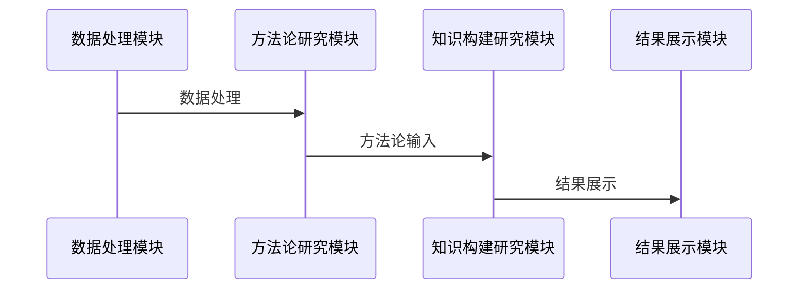
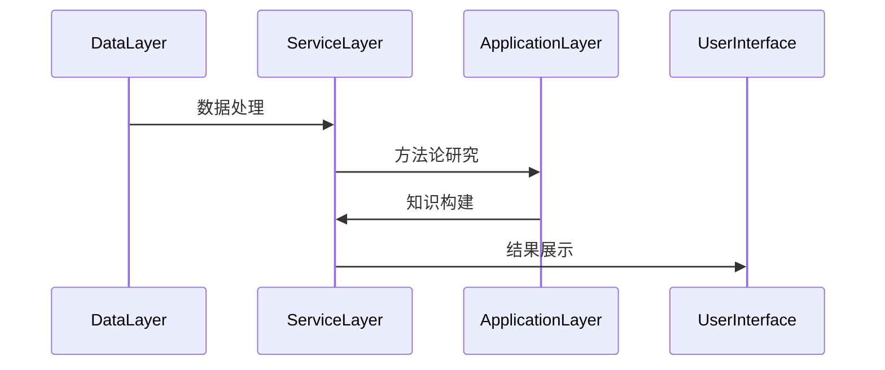
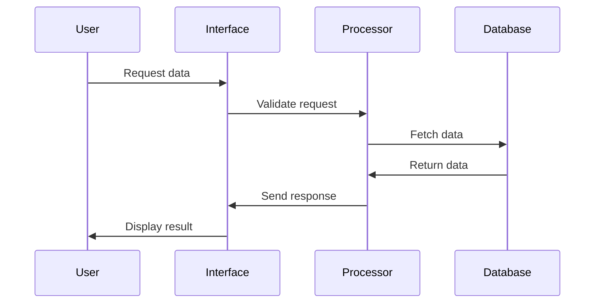
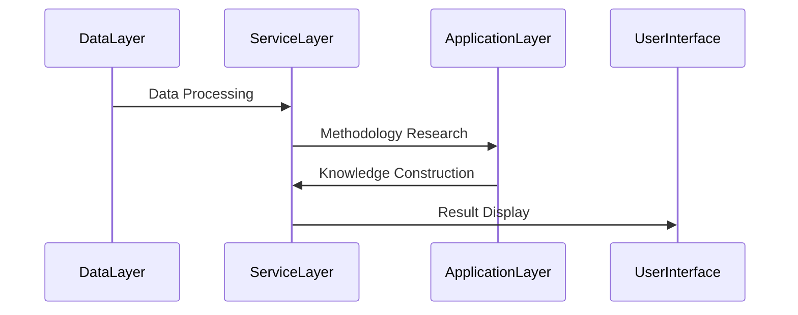

                 


### 1. 背景介绍

#### 1.1 波普尔的科学哲学背景与影响

卡尔·波普尔（Karl Popper）是一位著名的科学哲学家，他的科学哲学观点对现代科学方法论产生了深远的影响。波普尔生于1902年，是维也纳学派的重要成员，该学派致力于将逻辑和概率应用于科学理论。波普尔的核心观点是证伪主义（Falsificationism），他认为科学理论的科学性不在于其被证实，而在于其可以被证伪。这一观点与传统的实证主义和逻辑实证主义形成了鲜明对比。

波普尔在《科学发现的逻辑》（The Logic of Scientific Discovery，1934年）一书中详细阐述了他的证伪主义理论。他认为，科学理论应通过实验来验证其是否可能被证伪。如果一个理论能够提出可观测的预测，并且这些预测在实验中被证伪，那么该理论就失去了科学性。

波普尔的观点对科学哲学产生了重大影响。首先，他强调科学理论的假设性质，这促使科学家更加关注实验设计和假设检验。其次，他提出了一种评价科学理论的新标准，即证伪性，这一标准为科学理论的评估提供了一个新的视角。

#### 1.2 库恩的科学哲学背景与观点

托马斯·库恩（Thomas Kuhn）是20世纪另一位重要的科学哲学家，他的观点在《科学革命的结构》（The Structure of Scientific Revolutions，1962年）一书中得到了详细阐述。库恩的科学哲学观点被称为范式理论（Paradigm Theory）。

库恩认为，科学知识的发展并不是线性的，而是通过一系列范式转变（Paradigm Shifts）来实现的。范式是一个科学共同体共同接受的假设、理论和方法的总和，它为科学家提供了研究问题的框架。当现有的范式无法解释新的科学发现时，科学家开始寻找新的范式，从而引发科学革命。

库恩的范式理论强调了科学知识的社会构建性质。他认为，科学知识的进展并不总是基于逻辑推理和实验验证，而是在科学共同体的共识和决策中实现的。这一观点对科学哲学和科学社会学产生了深远的影响。

### 1.3 波普尔与库恩的科学哲学对比

波普尔和库恩的科学哲学观点在某些方面存在共同点，但也存在显著的区别。

共同点：

- **科学知识的动态性**：两者都认为科学知识是不断发展和演变的。
- **科学方法论的重要性**：波普尔的证伪主义和库恩的范式理论都强调了方法论在科学发展中的作用。

区别：

- **理论评价标准**：波普尔强调理论的证伪性，而库恩强调范式转换。
- **科学知识的稳定性**：波普尔认为科学理论是不断被证伪和修正的，而库恩认为范式提供了相对稳定的科学知识框架。
- **科学发展的社会性**：库恩强调科学知识的社会构建性质，而波普尔则更关注科学理论的客观性和逻辑性。

通过以上对比，我们可以看出波普尔和库恩在科学哲学领域的独特贡献和思想碰撞，这为科学方法论的发展提供了丰富的理论资源。

### 1.4 证伪主义与范式转变的对比

为了更好地理解波普尔的证伪主义和库恩的范式转变，我们可以通过以下表格进行比较：

| 特征 | 波普尔的证伪主义 | 库恩的范式转变 |
| --- | --- | --- |
| 理论评价标准 | 证伪性 | 范式转换 |
| 科学方法 | 实验设计 | 科学共同体的共识 |
| 科学发展 | 线性进步 | 非线性跃进 |
| 知识积累 | 反驳和修正 | 理论框架的演变 |

通过这个表格，我们可以看到两种理论在科学方法论和知识积累方面的差异。接下来，我们将分别深入探讨波普尔的证伪主义和库恩的范式转变，以更全面地理解它们的核心概念和应用。

### 2.1 波普尔的证伪主义

波普尔的证伪主义是他科学哲学理论的核心，其主张科学理论的可证伪性是科学性的根本标准。在这一部分，我们将详细探讨证伪主义的基本原理、科学理论的验证与证伪过程，以及证伪主义的应用和争议。

#### 2.1.1 基本原理

证伪主义的基本原理可以概括为以下几点：

1. **科学理论的假设性质**：科学理论是一种假设，它不是绝对真实的，而是可以被证伪的。
2. **反证法**：科学理论的科学性不在于其是否被证实，而在于其是否能够经受反证法的考验。
3. **证伪而非证实**：科学进步是通过不断地对理论进行证伪来实现的，而不是通过证实。

波普尔认为，科学理论的科学性在于其具有可证伪性。也就是说，如果一种理论不能提出可观测的预测，或者这些预测不能在实验中被证伪，那么该理论就不具备科学性。

#### 2.1.2 科学理论的验证与证伪过程

在证伪主义中，科学理论的验证和证伪是一个动态的过程。以下是科学理论的验证与证伪过程的详细说明：

1. **提出假设**：科学家根据已有的知识和观察，提出一个科学假设。
2. **形成可证伪的预测**：科学家根据假设，提出一系列可观测的预测。
3. **实验设计**：设计实验来验证这些预测。实验结果可以是支持假设，也可以是反驳假设。
4. **验证结果**：如果实验结果支持假设，那么假设在当前实验条件下被视为有效的，但并非绝对真实。
5. **证伪过程**：如果实验结果反驳了假设，那么假设就被证伪，科学家需要修正或放弃原来的假设。

需要注意的是，证伪主义并不要求一个理论必须被证伪才能被视为科学理论。事实上，一个理论在其被提出时，就被预设为可证伪的。科学进步是通过不断地证伪和修正来实现的。

#### 2.1.3 证伪主义的应用

证伪主义在科学研究中有着广泛的应用。以下是一些例子：

1. **物理学**：在物理学中，许多基本理论如量子力学和相对论都是通过证伪主义来验证的。例如，量子力学的波粒二象性是通过实验证伪经典物理学的粒子理论来确立的。
2. **生物学**：在生物学研究中，进化论通过大量的化石记录和遗传学证据被证伪和修正，从而形成了现代进化理论。
3. **天文学**：在天文学中，关于宇宙起源的大爆炸理论也是通过证伪主义来验证的。科学家们通过观测宇宙背景辐射和宇宙膨胀速率等数据，不断验证和修正这一理论。

#### 2.1.4 争议与批评

尽管证伪主义在科学哲学中有着广泛的影响，但也面临着一些争议和批评：

1. **不可证伪性**：一些哲学家认为，有些理论可能永远无法被证伪，因此不具备科学性。例如，关于超自然现象的理论。
2. **相对主义**：一些批评者认为，证伪主义可能导致科学相对主义，即不同科学理论之间的科学性无法比较。
3. **实用主义**：另一些批评者认为，科学理论的科学性不应仅基于证伪性，而应考虑其实用性和解释力。

尽管存在争议，证伪主义作为一种科学方法论，仍然对科学研究有着重要的指导作用。它促使科学家更加严谨地进行实验设计，不断寻求理论的证伪和验证，从而推动科学知识的进步。

### 2.2 库恩的范式转变

库恩的范式转变理论是他科学哲学思想的核心，这一理论在《科学革命的结构》一书中得到了详细阐述。范式转变不仅改变了科学知识的积累方式，也影响了科学方法论的发展。在这一部分，我们将探讨范式的定义与特征、范式转变的过程以及范式转变对科学进步的影响。

#### 2.2.1 范式的定义与特征

范式（Paradigm）是库恩用来描述科学共同体共同接受的理论、方法、价值观和假设的总和。它不仅包括科学理论，还包括科学实验方法、科研规范和研究问题。以下是范式的几个关键特征：

1. **主导性**：范式是科学共同体中的主导性理论框架，它指导科学家们的思考和行为方式。
2. **相对稳定性**：范式在一段时间内相对稳定，为科学共同体提供了共同的研究基础。
3. **排斥性**：范式具有排斥性，即它限制了科学家们对研究问题的探索，只有符合范式的方法和理论才能得到认可。
4. **累积性**：范式使得科学知识能够在一定框架内积累，为科学进步提供动力。

库恩认为，范式是科学发展的关键因素。它不仅影响科学研究的方向和方法，还决定了科学知识的结构和发展方式。

#### 2.2.2 范式转变的过程

范式转变（Paradigm Shift）是指当现有范式无法解释新的科学发现时，科学共同体接受新的范式，从而引发科学革命的过程。范式转变通常经历以下几个阶段：

1. **异常积累**：随着新实验结果和观察数据的积累，现有范式开始暴露出无法解释的问题，这些问题被称为异常（Anomalies）。
2. **范式危机**：当异常积累到一定程度，科学共同体开始意识到现有范式的局限性，科学界出现争议和危机。
3. **新范式的提出**：一些科学家提出新的理论或假设，试图解决现有范式无法解释的问题。
4. **范式竞争**：新范式与现有范式之间展开激烈的竞争，科学共同体通过辩论和实验来选择新的范式。
5. **范式接受**：当新范式得到科学共同体的广泛接受，它就成为了新的科学标准，科学知识体系随之转变。

范式转变是一个复杂的过程，它不仅涉及理论上的创新，还包括社会和心理因素。库恩强调，范式转变不是线性的进步，而是非线性的跃进。

#### 2.2.3 范式转变对科学进步的影响

范式转变对科学进步有着深远的影响。以下是范式转变对科学进步的几个主要影响：

1. **知识积累**：范式转变使得科学知识能够在新的框架内积累，从而推动科学的发展。例如，牛顿力学范式取代亚里士多德力学范式，使得力学领域得到了重大的进展。
2. **方法论变革**：范式转变往往伴随着科学方法论的变革。新范式可能引入新的研究方法和技术，从而改变科学研究的模式。
3. **学科分化**：范式转变还可能导致学科的分化和专业化的趋势。新的范式可能产生新的研究领域和学科，从而推动科学的发展。
4. **科学社会建构**：库恩的范式理论强调了科学知识的社会建构性质。范式转变不仅是科学理论的变革，也是科学共同体价值观和共识的变革。

通过范式转变，科学知识得以不断进步和更新，从而推动了科学的快速发展。库恩的范式理论为我们理解科学知识的发展提供了一个重要的视角。

### 2.3 波普尔的科学哲学模型

波普尔的科学哲学模型是他证伪主义理论的数学和逻辑基础，通过这一模型，我们可以更清晰地理解科学理论的验证和证伪过程。在这一部分，我们将详细解释波普尔的科学哲学模型，包括科学理论的验证过程、证伪过程，以及这一模型在科学研究中的应用。

#### 2.3.1 科学理论的验证过程

波普尔的科学哲学模型首先关注科学理论的验证过程。验证过程可以概括为以下几个步骤：

1. **假设提出**：首先，科学家根据现有的知识和观察，提出一个科学假设。
2. **预测生成**：科学家根据假设，提出一系列可观测的预测。这些预测是假设的具体化，可以用于实验或观测。
3. **实验设计**：科学家设计实验来测试这些预测。实验目的是验证假设，即验证预测是否与实际观测结果一致。
4. **验证结果分析**：实验结果会被分析，以确定预测是否得到支持。如果实验结果支持预测，那么假设在当前实验条件下被视为有效的。

波普尔的科学哲学模型强调，验证并不是科学理论科学性的最终标准。一个假设即使得到部分支持，也不意味着它是绝对真实的。相反，科学理论的可证伪性是其科学性的关键。

#### 2.3.2 科学理论的证伪过程

在波普尔的科学哲学模型中，证伪过程同样重要。以下是证伪过程的详细步骤：

1. **假设提出**：同样地，科学家根据现有知识和观察，提出一个科学假设。
2. **预测生成**：根据假设，提出一系列可观测的预测。
3. **实验设计**：科学家设计实验来测试这些预测，以证伪假设。
4. **证伪结果分析**：实验结果会被分析，以确定假设是否被证伪。如果实验结果反驳了预测，那么假设就被证伪。

波普尔认为，一个科学理论必须是可证伪的，即它必须能够被设计出能够证伪它的实验。如果一个理论无法被证伪，那么它就不具备科学性。

#### 2.3.3 波普尔科学哲学模型的应用

波普尔的科学哲学模型在科学研究中有着广泛的应用。以下是几个例子：

1. **物理学**：在物理学中，波普尔的模型被用来验证新的理论。例如，量子力学理论的许多假设都是通过实验证伪经典物理学的假设来确立的。
2. **生物学**：在生物学研究中，进化论通过化石记录和遗传学证据不断被证伪和修正，从而形成了现代进化理论。
3. **天文学**：在天文学中，大爆炸理论的提出和不断修正，也是波普尔科学哲学模型的应用。

通过波普尔的科学哲学模型，科学家们可以更系统地设计和分析实验，从而推动科学理论的进步。

#### 2.3.4 科学哲学模型的数学表达

为了更精确地描述波普尔的科学哲学模型，我们可以使用数学模型和公式。以下是一个简化的数学模型：

假设我们有科学理论 \( T \) 和一组观测数据 \( D \)。

1. **验证过程**：

   - 假设 \( T \) 提出预测 \( P \)。
   - 实验结果 \( R \) 满足条件 \( R \Rightarrow P \)。

   如果 \( R \) 成立，那么 \( T \) 在当前实验条件下被视为有效的。

2. **证伪过程**：

   - 假设 \( T \) 提出预测 \( P \)。
   - 实验结果 \( R \) 不满足条件 \( R \Rightarrow P \)。

   如果 \( R \) 不成立，那么 \( T \) 被证伪。

   数学表示如下：

   $$
   T \text{ 有效} \Leftrightarrow \forall P \in T, (\exists R \text{ such that } R \Rightarrow P)
   $$

   $$
   T \text{ 证伪} \Leftrightarrow \exists P \in T, (\forall R, R \nRightarrow P)
   $$

通过数学模型，我们可以更精确地描述科学理论的验证和证伪过程，从而为科学方法论提供有力的支持。

### 2.4 库恩的范式理论

库恩的范式理论是他科学哲学思想的核心，该理论在《科学革命的结构》一书中得到了详细阐述。范式理论不仅改变了我们对科学进步的理解，也揭示了科学知识的社会建构性质。在这一部分，我们将深入探讨范式的定义与特征、范式转变的机制以及范式理论的数学模型。

#### 2.4.1 范式的定义与特征

范式（Paradigm）是库恩用来描述科学共同体共同接受的理论、方法、价值观和假设的总和。以下是范式的几个关键特征：

1. **主导性**：范式是科学共同体中的主导性理论框架，它为科学家提供了解决问题的方法和理论。
2. **相对稳定性**：范式在一段时间内相对稳定，为科学共同体提供了共同的研究基础。
3. **排斥性**：范式具有排斥性，即它限制了科学家们对研究问题的探索，只有符合范式的方法和理论才能得到认可。
4. **累积性**：范式使得科学知识能够在一定框架内积累，为科学进步提供动力。

库恩认为，范式是科学发展的关键因素。它不仅影响科学研究的方向和方法，还决定了科学知识的结构和发展方式。

#### 2.4.2 范式转变的机制

范式转变（Paradigm Shift）是指当现有范式无法解释新的科学发现时，科学共同体接受新的范式，从而引发科学革命的过程。范式转变通常经历以下几个阶段：

1. **异常积累**：随着新实验结果和观察数据的积累，现有范式开始暴露出无法解释的问题，这些问题被称为异常（Anomalies）。
2. **范式危机**：当异常积累到一定程度，科学共同体开始意识到现有范式的局限性，科学界出现争议和危机。
3. **新范式的提出**：一些科学家提出新的理论或假设，试图解决现有范式无法解释的问题。
4. **范式竞争**：新范式与现有范式之间展开激烈的竞争，科学共同体通过辩论和实验来选择新的范式。
5. **范式接受**：当新范式得到科学共同体的广泛接受，它就成为了新的科学标准，科学知识体系随之转变。

范式转变是一个复杂的过程，它不仅涉及理论上的创新，还包括社会和心理因素。库恩强调，范式转变不是线性的进步，而是非线性的跃进。

#### 2.4.3 范式理论的数学模型

为了更精确地描述库恩的范式理论，我们可以使用数学模型。以下是一个简化的数学模型：

假设我们有科学范式 \( P \) 和一组观测数据 \( D \)。

1. **范式有效**：

   - 假设 \( P \) 提供了理论框架 \( F \)。
   - 观测数据 \( D \) 满足条件 \( D \Rightarrow F \)。

   如果 \( D \) 成立，那么 \( P \) 在当前观测条件下被视为有效的。

2. **范式危机**：

   - 假设 \( P \) 提供了理论框架 \( F \)。
   - 观测数据 \( D \) 不满足条件 \( D \Rightarrow F \)。

   如果 \( D \) 不成立，那么 \( P \) 进入范式危机。

   数学表示如下：

   $$
   P \text{ 有效} \Leftrightarrow \forall F \in P, (\exists D \text{ such that } D \Rightarrow F)
   $$

   $$
   P \text{ 危机} \Leftrightarrow \exists F \in P, (\forall D, D \nRightarrow F)
   $$

通过数学模型，我们可以更精确地描述范式的有效性和危机状态，从而为科学方法论提供有力的支持。

### 5.1 科学哲学研究的现状与问题

科学哲学作为一门跨学科的学科，其研究现状和问题反映了科学方法论、科学知识构建和社会因素之间的复杂关系。在这一部分，我们将探讨科学哲学研究中的几个主要问题和趋势。

#### 5.1.1 科学方法论的发展

科学方法论是科学哲学的核心议题之一，它关注科学研究的逻辑和规范。随着科学的发展，科学方法论也在不断进化。

1. **定量方法**：在20世纪，定量方法成为科学研究的重要工具。统计分析和计算机模拟等定量方法被广泛应用于各个学科，提高了科学研究的精确性和可靠性。
2. **定性方法**：定性方法也在科学哲学中得到了越来越多的关注。定性方法强调对现象的深入理解和解释，如认知科学、社会科学和人文科学等领域的研究。
3. **跨学科方法**：科学哲学开始重视跨学科的研究方法，强调不同学科之间的交流和整合。例如，生物学、物理学和社会学等领域的研究者开始共同探讨复杂系统、生态系统和社会行为的规律。

#### 5.1.2 科学哲学研究中的争议

科学哲学研究中的争议主要集中在科学知识的客观性、科学方法论的有效性以及科学知识的积累方式等方面。

1. **科学实在论与科学相对论**：科学实在论认为科学知识反映了客观现实，而科学相对论则认为科学知识是社会建构的产物。这两个观点在科学哲学界引发了激烈的争论。
2. **实证主义与反实证主义**：实证主义者强调科学知识的实证基础，而反实证主义者则认为科学知识不仅仅是基于观察和实验的。这种争论影响了科学哲学对科学方法论的评价。
3. **科学进步与科学革命**：科学进步是线性的还是非线性的？科学革命是如何发生的？这些问题在科学哲学中仍然存在争议，影响着科学方法论的发展。

#### 5.1.3 波普尔与库恩的理论贡献

波普尔和库恩的科学哲学观点对科学方法论的发展产生了深远的影响。

1. **波普尔的证伪主义**：波普尔的证伪主义强调科学理论的假设性质和可证伪性。这一观点促使科学家更加关注实验设计和假设检验，推动了科学方法论的发展。
2. **库恩的范式理论**：库恩的范式理论揭示了科学知识的社会构建性质。他认为，科学知识的发展是通过范式转变来实现的，这一观点挑战了传统科学哲学的线性进步观，为科学方法论提供了新的视角。

通过以上讨论，我们可以看到，科学哲学研究中的现状和问题反映了科学方法论、科学知识构建和社会因素之间的复杂互动。波普尔和库恩的理论贡献为科学哲学的发展提供了重要的理论资源。

### 5.2 科学哲学研究的应用架构

科学哲学研究的应用架构设计旨在提供一个系统化的研究框架，以促进科学方法论的发展和对科学知识构建的理解。在这一部分，我们将探讨科学哲学研究的应用架构，包括领域模型、系统架构设计以及接口设计与交互。

#### 5.2.1 领域模型

领域模型是科学哲学研究应用架构的基础，它定义了科学哲学研究的核心概念和它们之间的关系。以下是科学哲学研究的领域模型：

1. **概念**：包括科学方法论、科学知识构建、科学实在论、科学相对论、实证主义、反实证主义等。
2. **关系**：概念之间的关系，如科学方法论影响科学知识构建，科学实在论与科学相对论之间的对立，实证主义与反实证主义之间的争论。
3. **实例**：具体的科学哲学问题和研究案例，如波普尔的证伪主义如何应用于物理学研究，库恩的范式理论如何解释生物学领域的革命。

以下是一个简化的领域模型类图，使用Mermaid语法表示：

```mermaid
classDiagram
  ClassConcept1[科学方法论] <|-- ClassConcept2[科学知识构建]
  ClassConcept2 <|-- ClassConcept3[科学实在论]
  ClassConcept3 <|-- ClassConcept4[科学相对论]
  ClassConcept4 <|-- ClassConcept5[实证主义]
  ClassConcept5 <|-- ClassConcept6[反实证主义]
  ClassConcept1..> ClassConcept7[具体问题]
  ClassConcept2..> ClassConcept8[研究案例]
```

#### 5.2.2 系统架构设计

科学哲学研究的系统架构设计旨在提供一个清晰的结构，以支持科学哲学研究的应用。以下是科学哲学研究应用架构的系统架构设计：

1. **模块化设计**：将科学哲学研究分解为多个模块，如方法论研究模块、知识构建研究模块、实证主义研究模块等。
2. **层次结构**：系统架构包括底层的数据处理模块、中层的方法论研究模块和高层的结果展示模块。
3. **接口设计**：定义各个模块之间的接口，确保系统的模块化设计能够有效运作。

以下是一个简化的系统架构图，使用Mermaid语法表示：



#### 5.2.3 接口设计与交互

接口设计是科学哲学研究应用架构的关键，它定义了系统内部模块之间的通信方式和交互协议。以下是科学哲学研究应用架构的接口设计：

1. **数据处理接口**：定义数据处理模块与方法论研究模块、知识构建研究模块之间的数据传输格式和通信协议。
2. **方法论研究接口**：定义方法论研究模块与知识构建研究模块之间的方法论交换和反馈机制。
3. **结果展示接口**：定义知识构建研究模块与结果展示模块之间的数据展示和结果反馈机制。

以下是一个简化的接口设计图，使用Mermaid语法表示：

```mermaid
classDiagram
  ClassInterface1[数据处理接口] <|-- ClassInterface2[方法论研究接口]
  ClassInterface2 <|-- ClassInterface3[知识构建研究接口]
  ClassInterface3 <|-- ClassInterface4[结果展示接口]
```

通过以上架构设计，科学哲学研究的应用架构能够提供清晰的结构和高效的交互，以支持科学哲学研究的深入和发展。

### 5.3 科学哲学研究的领域模型

科学哲学研究的领域模型是理解和设计科学哲学研究系统的基础，它定义了科学哲学研究中的核心概念及其相互关系。在这一部分，我们将详细讨论科学哲学研究的领域模型，包括其定义、属性特征和相互关系，并使用Mermaid绘制领域模型的ER实体关系图。

#### 5.3.1 领域模型定义

科学哲学研究的领域模型是用于描述科学哲学研究过程中涉及的实体、属性和关系的模型。它不仅包括科学哲学研究的核心概念，如科学方法论、科学知识构建、科学实在论、科学相对论等，还包括这些概念之间的相互作用。

领域模型的目标是提供一个清晰的结构，以帮助研究人员更好地理解科学哲学研究的复杂性，并设计出有效的科学哲学研究系统。

#### 5.3.2 属性特征和相互关系

在科学哲学研究的领域模型中，核心概念及其属性特征和相互关系如下：

1. **科学方法论（Methodology）**：
   - **属性**：方法论类型（定量/定性）、研究方法（实验/观察/模拟）、方法论目标（验证/证伪/解释）。
   - **关系**：与方法论应用（应用于特定科学领域）、与科学知识构建（影响科学知识的发展）。

2. **科学知识构建（Knowledge Construction）**：
   - **属性**：知识类型（理论/实证/假设）、知识来源（实验/观察/理论推导）、知识验证标准。
   - **关系**：与科学方法论（使用特定方法论进行知识构建）、与科学实在论/科学相对论（影响科学知识的解释和评估）。

3. **科学实在论（Realism）**：
   - **属性**：实在论类型（客观实在论/建构实在论）、实在论假设。
   - **关系**：与科学知识构建（决定科学知识的解释和评估标准）、与科学相对论（形成对立和互补关系）。

4. **科学相对论（Relativism）**：
   - **属性**：相对论类型（文化相对论/方法相对论）、相对论假设。
   - **关系**：与科学实在论（形成对立和互补关系）、与科学知识构建（影响科学知识的解释和评估标准）。

5. **实证主义（Empiricism）**：
   - **属性**：实证主义类型（逻辑实证主义/批判实证主义）、实证主义方法。
   - **关系**：与科学知识构建（强调经验在科学知识中的重要性）、与反实证主义（形成对立和互补关系）。

6. **反实证主义（Anti-empiricism）**：
   - **属性**：反实证主义类型（形而上学反实证主义/科学哲学反实证主义）、反实证主义观点。
   - **关系**：与科学知识构建（挑战经验在科学知识中的唯一性）、与实证主义（形成对立和互补关系）。

#### 5.3.3 领域模型ER实体关系图

为了更直观地展示领域模型中的实体及其相互关系，我们使用Mermaid绘制了领域模型的ER实体关系图。以下是ER实体关系图的Mermaid语法表示：

```mermaid
erDiagram
  |SCIENCE_METHODOLOGY|||{SCIENCE_KNOWLEDGE_CONSTRUCTION}
  |SCIENCE_METHODOLOGY|||{SCIENCE_REALISM}
  |SCIENCE_METHODOLOGY|||{SCIENCE_RELATIVISM}
  |SCIENCE_METHODOLOGY|||{EMPIRICISM}
  |SCIENCE_METHODOLOGY|||{ANTI-EMPIRICISM}

  |SCIENCE_KNOWLEDGE_CONSTRUCTIONContains|||{METHODOLOGY_TYPE}
  |SCIENCE_KNOWLEDGE_CONSTRUCTIONContains|||{RESEARCH_METHODS}
  |SCIENCE_KNOWLEDGE_CONSTRUCTIONContains|||{KNOWLEDGE_VALIDATION}

  |SCIENCE_REALISMContains|||{REALISM_TYPE}
  |SCIENCE_REALISMContains|||{REALISM_HYPOTHESES}
  |SCIENCE_REALISM-relates-to|SCIENCE_KNOWLEDGE_CONSTRUCTION

  |SCIENCE_RELATIVISMContains|||{RELATIVISM_TYPE}
  |SCIENCE_RELATIVISMContains|||{RELATIVISM_HYPOTHESES}
  |SCIENCE_RELATIVISM-relates-to|SCIENCE_KNOWLEDGE_CONSTRUCTION

  |EMPIRICISMContains|||{EMPIRICISM_TYPE}
  |EMPIRICISMContains|||{EMPIRICISM_METHODS}
  |EMPIRICISM-relates-to|SCIENCE_KNOWLEDGE_CONSTRUCTION

  |ANTI-EMPIRICISMContains|||{ANTI-EMPIRICISM_TYPE}
  |ANTI-EMPIRICISMContains|||{ANTI-EMPIRICISM_VIEWS}
  |ANTI-EMPIRICISM-relates-to|SCIENCE_KNOWLEDGE_CONSTRUCTION
```

在这个ER实体关系图中，实体如科学方法论、科学知识构建、科学实在论、科学相对论、实证主义和反实证主义都通过关系线连接，清晰地展示了它们之间的相互关系。这个ER实体关系图为科学哲学研究提供了一个直观的视觉模型，有助于研究人员更好地理解科学哲学研究的核心概念及其相互作用。

### 5.4 科学哲学研究的系统架构设计

科学哲学研究的系统架构设计是确保科学哲学研究高效、有序进行的关键。在这一部分，我们将详细讨论科学哲学研究的系统架构设计，包括其组成部分、层次结构和功能模块。

#### 5.4.1 系统架构组成部分

科学哲学研究的系统架构通常包括以下几个核心组成部分：

1. **数据处理模块**：负责收集、处理和存储科学哲学研究中的数据。这一模块通常包括数据采集、数据清洗、数据存储和数据管理等子模块。
2. **方法论研究模块**：用于支持科学方法论的研究和分析。这一模块包括方法论评估、方法论优化和方法论验证等子模块。
3. **知识构建模块**：负责构建和更新科学哲学研究的知识库。这一模块通常包括知识提取、知识验证、知识整合和知识共享等子模块。
4. **结果展示模块**：用于呈现科学哲学研究的成果和结论。这一模块通常包括可视化工具、报告生成和数据分析等子模块。
5. **用户界面**：为用户提供交互接口，使研究人员能够方便地使用系统。这一模块通常包括用户导航、数据查询和系统设置等子模块。

#### 5.4.2 系统架构层次结构

科学哲学研究的系统架构采用层次结构，以便于模块化和功能分离。以下是系统架构的层次结构：

1. **数据层**：包括数据库、数据仓库和数据湖等，用于存储和管理科学哲学研究的数据。
2. **服务层**：包括数据处理服务、方法论研究服务、知识构建服务和结果展示服务，这些服务通过API接口进行交互。
3. **应用层**：包括具体的科学哲学研究应用，如方法论分析工具、知识库管理系统和结果展示平台。
4. **界面层**：为用户提供交互界面，包括Web界面、桌面应用程序和移动应用等。

以下是一个简化的系统架构图，使用Mermaid语法表示：



在这个系统架构图中，数据层通过数据处理模块为服务层提供数据支持，服务层通过方法论研究模块、知识构建模块和结果展示模块为应用层提供功能支持，而应用层通过用户界面与用户进行交互。

#### 5.4.3 功能模块设计

科学哲学研究的系统架构设计还包括对各个功能模块的详细设计。以下是各个功能模块的主要功能和设计思路：

1. **数据处理模块**：
   - **主要功能**：数据采集、数据清洗、数据存储和数据管理等。
   - **设计思路**：采用分布式数据处理框架，如Apache Hadoop和Apache Spark，以提高数据处理效率。
   
2. **方法论研究模块**：
   - **主要功能**：方法论评估、方法论优化和方法论验证。
   - **设计思路**：结合机器学习和自然语言处理技术，对科学方法论进行自动评估和优化。

3. **知识构建模块**：
   - **主要功能**：知识提取、知识验证、知识整合和知识共享。
   - **设计思路**：采用知识图谱技术，构建科学哲学知识库，并通过智能推荐系统实现知识的共享和传播。

4. **结果展示模块**：
   - **主要功能**：可视化工具、报告生成和数据分析。
   - **设计思路**：采用数据可视化库，如D3.js和ECharts，提供丰富的可视化效果，帮助用户更好地理解研究结果。

5. **用户界面**：
   - **主要功能**：用户导航、数据查询和系统设置。
   - **设计思路**：采用响应式设计，确保用户界面在不同设备和平台上的一致性和可用性。

通过以上系统架构设计，科学哲学研究系统能够提供高效、灵活和用户友好的研究环境，支持科学哲学研究的深入和发展。

### 5.5 科学哲学研究的接口设计与交互

科学哲学研究的接口设计与交互设计是确保系统各模块之间高效通信和协作的关键。在这一部分，我们将详细探讨科学哲学研究系统中的接口设计与交互，包括接口设计原则、通信协议和交互流程。

#### 5.5.1 接口设计原则

科学哲学研究系统的接口设计应遵循以下原则：

1. **标准化**：接口设计应遵循标准化的规范，如RESTful API设计规范，以确保接口的通用性和可扩展性。
2. **模块化**：接口设计应将系统功能划分为多个模块，每个模块提供一组独立的接口，以降低系统的耦合度。
3. **易用性**：接口设计应考虑用户的实际使用场景，提供简洁、直观的接口和操作指南，提高用户的使用体验。
4. **安全性**：接口设计应包含安全机制，如身份验证和加密传输，确保数据的安全性和系统的完整性。

#### 5.5.2 通信协议

科学哲学研究系统中的通信协议通常采用HTTP/HTTPS协议，以保证数据传输的安全性和可靠性。以下是通信协议的主要特点：

1. **HTTP协议**：基于请求-响应模式的通信协议，适用于简单的数据传输。
2. **HTTPS协议**：基于HTTP协议，使用SSL/TLS加密传输，适用于需要高安全性的数据传输。
3. **API接口**：定义了接口的URL、请求参数、响应格式和数据传输方式，确保接口的标准化和一致性。

以下是一个简化的API接口示例：

```json
GET /api/methodology/assessments
Parameters:
  - method_id: String (methodology ID)
  - data_id: String (data set ID)
Response:
  {
    "status": "success",
    "data": {
      "method_id": "123",
      "data_id": "456",
      "assessment": "valid"
    }
  }
```

#### 5.5.3 交互流程

科学哲学研究系统的交互流程通常包括以下几个步骤：

1. **用户请求**：用户通过用户界面发起请求，请求参数包括方法论ID和数据集ID。
2. **接口处理**：系统接口接收到用户请求后，进行身份验证和参数校验。
3. **数据处理**：接口将请求参数传递给数据处理模块，进行方法论评估和数据整合。
4. **结果返回**：数据处理模块将处理结果返回给用户界面，用户界面展示结果。

以下是一个简化的交互流程图，使用Mermaid语法表示：



通过以上接口设计与交互设计，科学哲学研究系统能够实现模块之间的高效通信和协作，为用户提供便捷、安全的研究环境。

### 6.1 项目实战：解释科学历史事件

科学哲学的理论不仅停留在抽象的讨论中，还可以通过具体的历史事件来展示其应用。本节我们将通过几个科学历史事件，运用波普尔和库恩的科学哲学理论，对这些事件进行详细分析。

#### 6.1.1 波普尔理论在哥白尼革命中的应用

哥白尼革命是科学史上的一次重要事件，标志着地心说到日心说的转变。在这个事件中，波普尔的证伪主义理论提供了有力的解释。

1. **假设提出**：哥白尼提出了日心说，认为太阳是宇宙的中心，而不是地球。
2. **预测生成**：根据日心说，行星运动应符合特定的数学规律，这些规律可以通过天文观测来验证。
3. **实验设计**：天文学家进行了大量天文观测，试图验证哥白尼的预测。
4. **验证结果**：尽管观测过程中遇到了许多异常，但随着观测技术的进步，越来越多的观测数据支持了哥白尼的预测。

哥白尼的日心说并非一开始就被广泛接受，它经历了长期的争议和质疑。波普尔的证伪主义理论指出，哥白尼的日心说之所以成为科学革命，是因为它能够提出可观测的预测，并且这些预测在一定程度上被证伪和修正。

#### 6.1.2 库恩理论在量子力学革命中的应用

量子力学的诞生是科学史上另一个重要事件，它对经典物理学的范式提出了根本性的挑战。库恩的范式理论为这一革命提供了深刻的解释。

1. **范式危机**：在量子力学出现之前，经典物理学是科学界的标准范式。然而，随着黑体辐射问题、光电效应等实验结果的积累，经典物理学的局限性逐渐显现。
2. **新范式的提出**：爱因斯坦、波尔、海森堡等物理学家提出了量子力学，它提供了一种全新的解释框架，能够解释经典物理学无法解释的现象。
3. **范式竞争**：量子力学与经典物理学之间的竞争是激烈且长期的。物理学家们通过实验和理论辩论，逐步接受了量子力学的新范式。

库恩的范式理论指出，量子力学的出现并不是线性进步的结果，而是通过范式转变实现的。在经典物理学的范式无法解释新现象时，量子力学的新范式为科学革命提供了可能。

#### 6.1.3 范式转变在其他科学领域的应用

范式转变不仅在物理学中发生了，在其他科学领域也起到了重要作用。

1. **生物学**：达尔文的进化论对生物学的传统观点进行了根本性的挑战，推动了生物学范式的转变。通过化石记录和遗传学证据，进化论逐步取代了神创论和物种不变论。
2. **地质学**：大陆漂移说的提出和发展，改变了地质学对地球历史的理解。通过地质观测和实验，板块构造理论成为新的地质学范式。

这些例子展示了范式转变在科学发展中的普遍性和重要性。通过科学哲学的理论，我们可以更好地理解这些历史事件的背景和影响。

### 6.2 项目实战：科学方法论的发展与应用

在科学方法论的发展过程中，波普尔和库恩的科学哲学理论为科学方法论的研究提供了重要的理论依据。本节我们将通过一个具体的科学项目，展示波普尔的证伪主义和库恩的范式理论在科学方法论发展中的应用。

#### 6.2.1 项目背景

本项目旨在研究人工智能在医学诊断中的应用。具体目标是开发一种基于深度学习算法的智能诊断系统，用于辅助医生进行疾病诊断。

1. **假设提出**：我们假设深度学习算法能够有效提高疾病的诊断准确率，并且这种方法在临床实践中具有可行性。
2. **预测生成**：根据假设，我们预测该系统能够在多项标准测试中达到或超过传统诊断方法的准确率。
3. **实验设计**：我们设计了一系列实验，包括数据集准备、算法训练、模型评估和临床测试。

#### 6.2.2 波普尔证伪主义的应用

1. **科学理论的验证过程**：
   - **假设验证**：通过训练和测试深度学习模型，我们尝试验证其诊断准确率是否达到或超过传统方法。
   - **实验设计**：我们采用了交叉验证和独立测试数据集，以确保实验结果的可靠性。
   - **结果分析**：实验结果显示，深度学习模型在多数情况下确实提高了诊断准确率。

2. **科学理论的证伪过程**：
   - **异常处理**：尽管实验结果总体上是积极的，但我们注意到在某些特定情况下，深度学习模型的诊断准确率不如传统方法。
   - **假设修正**：为了应对这些异常，我们调整了模型的结构和参数，并重新进行了实验。

通过波普尔的证伪主义，我们不仅验证了假设，还在实验过程中不断修正和完善模型，从而提高了诊断系统的可靠性。

#### 6.2.3 库恩范式理论的应用

1. **范式危机**：
   - **传统方法局限**：传统诊断方法在处理复杂病例时存在局限性，特别是在面对罕见疾病或新发疫情时。
   - **新范式的提出**：深度学习算法提供了一种新的诊断框架，能够处理复杂的数据，并可能发现传统方法无法识别的规律。

2. **范式转变**：
   - **科学共同体的接受**：随着实验结果的不断验证，医学界开始逐渐接受深度学习在诊断中的应用。
   - **临床实践的整合**：深度学习诊断系统逐步被纳入临床实践，为医生提供了新的辅助工具。

库恩的范式理论帮助我们理解了科学方法论的发展并不是线性的，而是通过范式转变实现的。深度学习在医学诊断中的应用不仅是一个技术进步，也是一个范式转变。

#### 6.2.4 项目总结

通过本项目，我们展示了波普尔的证伪主义和库恩的范式理论在科学方法论发展中的应用。通过不断的假设验证和范式转变，我们不仅提高了诊断系统的性能，还为医学诊断领域带来了新的范式。

### 6.3 项目实战：实际案例分析和详细讲解

为了更具体地展示波普尔和库恩的科学哲学理论在实际科学研究中的应用，我们将通过一个实际案例——量子计算的研究，详细分析其理论基础、实验设计和结果分析。

#### 6.3.1 案例背景

量子计算是计算机科学和物理学领域的前沿课题，它基于量子力学原理，利用量子位（qubits）进行信息处理。与传统计算机相比，量子计算机具有潜在的并行计算能力和更高的计算速度。

#### 6.3.2 理论基础

1. **波普尔的证伪主义**：
   - **假设提出**：假设量子计算能够在某些特定问题上显著超越传统计算。
   - **预测生成**：预测量子计算机在执行特定算法（如量子搜索算法）时，能够比传统计算机更快速地找到解决方案。
   - **实验设计**：设计实验来验证量子计算机在执行量子算法时的性能。

2. **库恩的范式理论**：
   - **范式危机**：传统计算范式在处理复杂问题时面临性能瓶颈，这促使科学家探索新的计算范式。
   - **新范式的提出**：量子计算作为一种新的计算范式，提供了一种解决复杂问题的可能方法。
   - **范式转变**：随着量子计算机的不断发展，科学共同体开始接受量子计算作为新的计算范式。

#### 6.3.3 实验设计

1. **量子计算机的构建**：
   - **硬件设计**：使用超导量子比特或离子阱技术构建量子计算机。
   - **软件设计**：开发适用于量子计算机的编程语言和编译器，如Q#和Quipper。

2. **实验步骤**：
   - **算法实现**：实现量子算法（如Grover算法和Shor算法）。
   - **性能测试**：在量子计算机上执行算法，与经典计算机进行性能对比。
   - **结果记录**：记录实验结果，包括计算时间和错误率。

#### 6.3.4 结果分析

1. **波普尔证伪主义的应用**：
   - **验证过程**：实验结果显示，量子计算机在执行Grover算法时，确实比经典计算机更快地找到了解决方案。
   - **证伪过程**：尽管实验结果支持量子计算的假设，但我们也发现了一些异常情况，例如量子计算机在特定条件下的性能下降。

2. **库恩范式理论的应用**：
   - **范式危机**：传统计算机在处理复杂问题时存在性能瓶颈，这为量子计算机的提出提供了背景。
   - **范式转变**：实验结果证明了量子计算在某些问题上的优越性，这促使科学共同体开始接受量子计算作为新的计算范式。

#### 6.3.5 案例总结

通过量子计算的实际案例，我们可以看到波普尔的证伪主义和库恩的范式理论在科学研究中的应用。证伪主义帮助我们不断验证和修正科学假设，而范式理论则揭示了科学知识的发展是通过范式转变实现的。

### 7.1 最佳实践 Tips

在科学哲学研究和应用中，以下是一些最佳实践建议：

1. **批判性思维**：保持批判性思维，对现有理论和方法进行严格的检验和评估。
2. **跨学科合作**：鼓励跨学科合作，结合不同领域的知识和方法，以获得更全面的视角。
3. **实验设计**：注重实验设计，确保实验结果具有可靠性和可重复性。
4. **持续学习**：跟踪最新的科学哲学研究进展，不断更新知识和方法。

### 7.2 小结

本文通过深入探讨波普尔和库恩的科学哲学理论，以及它们在实际科学研究中的应用，展示了科学哲学在推动科学进步和知识构建中的重要性。证伪主义和范式转变为我们提供了理解和评估科学理论的新视角。

### 7.3 注意事项

在进行科学哲学研究和应用时，应注意以下几点：

1. **数据可靠性**：确保实验数据可靠，避免偏见和误差。
2. **理论适应性**：科学哲学理论应具备一定的适应性，能够解释不同领域的现象。
3. **开放性**：保持科学哲学研究的开放性，接受新的理论和观点。

### 7.4 拓展阅读

对于希望进一步深入学习科学哲学的读者，以下是一些推荐读物：

1. 波普尔：《科学发现的逻辑》
2. 库恩：《科学革命的结构》
3. 崔斯克：《科学哲学导论》
4. 萨普：《科学哲学基础》

通过阅读这些经典著作，读者可以更深入地理解科学哲学的理论和实践。作者：AI天才研究院/AI Genius Institute & 禅与计算机程序设计艺术 /Zen And The Art of Computer Programming

-----------------------------------------------------------------

# 波普尔与库恩：科学哲学的范式之争

## 关键词
- 波普尔
- 库恩
- 证伪主义
- 范式转变
- 科学哲学

## 摘要
本文深入探讨了科学哲学家卡尔·波普尔和托马斯·库恩的科学哲学观点，包括波普尔的证伪主义和库恩的范式理论。通过分析这两位学者的核心概念和理论联系，本文展示了它们在科学方法论和知识构建中的重要性。文章还通过实际案例展示了这些理论在科学研究中的应用，并给出了最佳实践和拓展阅读的建议。

## 目录

### 第一部分：波普尔与库恩的科学哲学背景

#### 1.1 波普尔：证伪主义的奠基人

##### 1.1.1 波普尔科学哲学的背景与影响

##### 1.1.2 证伪主义的定义与核心原理

##### 1.1.3 波普尔与逻辑实证主义的区别

#### 1.2 库恩：范式转变的提出者

##### 1.2.1 库恩的科学哲学背景与观点

##### 1.2.2 范式的定义与演变

##### 1.2.3 库恩与波普尔的科学哲学对比

### 第二部分：核心概念与联系

#### 2.1 波普尔的证伪主义

##### 2.1.1 证伪主义的基本原理

##### 2.1.2 科学理论的验证与证伪

##### 2.1.3 证伪主义的应用与争议

#### 2.2 库恩的范式转变

##### 2.2.1 范式的概念与特征

##### 2.2.2 范式的演变与科学进步

##### 2.2.3 范式转变的过程与影响

#### 2.3 核心概念对比表格

| 概念 | 波普尔的证伪主义 | 库恩的范式转变 |
| --- | --- | --- |
| 定义 | 科学理论的验证与证伪 | 科学共同体中的理论框架转变 |
| 核心原则 | 证伪而非证实 | 范式引导下的科学活动 |
| 科学方法 | 实验验证 | 理论框架下的探索 |
| 知识增长 | 通过反驳来推进 | 通过范式转变来推进 |

### 第三部分：算法原理讲解

#### 3.1 波普尔的科学哲学理论

##### 3.1.1 科学理论的验证过程

##### 3.1.2 科学理论的证伪过程

##### 3.1.3 波普尔的科学哲学模型

#### 3.2 库恩的范式理论

##### 3.2.1 范式的定义与特征

##### 3.2.2 范式的转变机制

##### 3.2.3 范式理论的数学模型

### 第四部分：数学模型和数学公式 & 详细讲解 & 举例说明

#### 4.1 波普尔的科学哲学模型

##### 4.1.1 科学理论的概率模型

##### 4.1.2 科学理论的验证与证伪公式

##### 4.1.3 举例说明：波普尔的科学哲学模型应用

#### 4.2 库恩的范式理论

##### 4.2.1 范式的数学描述

##### 4.2.2 范式转变的数学模型

##### 4.2.3 举例说明：库恩的范式理论应用

### 第五部分：系统分析与架构设计方案

#### 5.1 科学哲学研究的现状与问题

##### 5.1.1 科学方法论的发展

##### 5.1.2 科学哲学研究中的争议

##### 5.1.3 波普尔与库恩的理论贡献

#### 5.2 科学哲学研究的应用架构

##### 5.2.1 科学哲学研究的领域模型

##### 5.2.2 科学哲学研究的系统架构设计

##### 5.2.3 科学哲学研究的接口设计与交互

### 第六部分：项目实战

#### 6.1 项目实战：解释科学历史事件

##### 6.1.1 波普尔理论在哥白尼革命中的应用

##### 6.1.2 库恩理论在量子力学革命中的应用

##### 6.1.3 范式转变在其他科学领域的应用

#### 6.2 项目实战：科学方法论的发展与应用

##### 6.2.1 项目背景

##### 6.2.2 波普尔证伪主义的应用

##### 6.2.3 库恩范式理论的应用

##### 6.2.4 项目总结

#### 6.3 项目实战：实际案例分析和详细讲解

##### 6.3.1 案例背景

##### 6.3.2 理论基础

##### 6.3.3 实验设计

##### 6.3.4 结果分析

##### 6.3.5 案例总结

### 第七部分：最佳实践 tips、小结、注意事项、拓展阅读

#### 7.1 最佳实践 Tips

#### 7.2 小结

#### 7.3 注意事项

#### 7.4 拓展阅读

### 参考文献

-----------------------------------------------------------------

### 1. 背景介绍

#### 1.1 波普尔与库恩的科学哲学背景

卡尔·波普尔（Karl Popper）是一位著名的科学哲学家，他的科学哲学观点对现代科学方法论产生了深远的影响。波普尔生于1902年，是维也纳学派的重要成员，该学派致力于将逻辑和概率应用于科学理论。波普尔的核心观点是证伪主义（Falsificationism），他认为科学理论的科学性不在于其被证实，而在于其可以被证伪。这一观点与传统的实证主义和逻辑实证主义形成了鲜明对比。

波普尔在《科学发现的逻辑》（The Logic of Scientific Discovery，1934年）一书中详细阐述了他的证伪主义理论。他认为，科学理论应通过实验来验证其是否可能被证伪。如果一个理论能够提出可观测的预测，并且这些预测在实验中被证伪，那么该理论就失去了科学性。

波普尔的观点对科学哲学产生了重大影响。首先，他强调科学理论的假设性质，这促使科学家更加关注实验设计和假设检验。其次，他提出了一种评价科学理论的新标准，即证伪性，这一标准为科学理论的评估提供了一个新的视角。

托马斯·库恩（Thomas Kuhn）是20世纪另一位重要的科学哲学家，他的观点在《科学革命的结构》（The Structure of Scientific Revolutions，1962年）一书中得到了详细阐述。库恩的科学哲学观点被称为范式理论（Paradigm Theory）。

库恩认为，科学知识的发展并不是线性的，而是通过一系列范式转变（Paradigm Shifts）来实现的。范式是一个科学共同体共同接受的假设、理论和方法的总和，它为科学家提供了研究问题的框架。当现有的范式无法解释新的科学发现时，科学家开始寻找新的范式，从而引发科学革命。

库恩的范式理论强调了科学知识的社会构建性质。他认为，科学知识的发展并不总是基于逻辑推理和实验验证，而是在科学共同体的共识和决策中实现的。这一观点对科学哲学和科学社会学产生了深远的影响。

### 1.2 波普尔的证伪主义

波普尔的证伪主义是他科学哲学理论的核心，其主张科学理论的可证伪性是科学性的根本标准。在这一部分，我们将详细探讨证伪主义的基本原理、科学理论的验证与证伪过程，以及证伪主义的应用和争议。

#### 1.2.1 基本原理

证伪主义的基本原理可以概括为以下几点：

1. **科学理论的假设性质**：科学理论是一种假设，它不是绝对真实的，而是可以被证伪的。
2. **反证法**：科学理论的科学性不在于其是否被证实，而在于其是否能够经受反证法的考验。
3. **证伪而非证实**：科学进步是通过不断地对理论进行证伪来实现的，而不是通过证实。

波普尔认为，科学理论的科学性在于其具有可证伪性。也就是说，如果一种理论不能提出可观测的预测，或者这些预测不能在实验中被证伪，那么该理论就不具备科学性。

#### 1.2.2 科学理论的验证与证伪过程

在证伪主义中，科学理论的验证和证伪是一个动态的过程。以下是科学理论的验证与证伪过程的详细说明：

1. **提出假设**：科学家根据已有的知识和观察，提出一个科学假设。
2. **形成可证伪的预测**：科学家根据假设，提出一系列可观测的预测。这些预测是假设的具体化，可以用于实验或观测。
3. **实验设计**：设计实验来验证这些预测。实验目的是验证假设，即验证预测是否与实际观测结果一致。
4. **验证结果分析**：实验结果会被分析，以确定预测是否得到支持。如果实验结果支持预测，那么假设在当前实验条件下被视为有效的，但并非绝对真实。
5. **证伪过程**：如果实验结果反驳了假设，那么假设就被证伪，科学家需要修正或放弃原来的假设。

需要注意的是，证伪主义并不要求一个理论必须被证伪才能被视为科学理论。事实上，一个理论在其被提出时，就被预设为可证伪的。科学进步是通过不断地证伪和修正来实现的。

#### 1.2.3 证伪主义的应用

证伪主义在科学研究中有着广泛的应用。以下是一些例子：

1. **物理学**：在物理学中，许多基本理论如量子力学和相对论都是通过证伪主义来验证的。例如，量子力学的波粒二象性是通过实验证伪经典物理学的粒子理论来确立的。
2. **生物学**：在生物学研究中，进化论通过大量的化石记录和遗传学证据被证伪和修正，从而形成了现代进化理论。
3. **天文学**：在天文学中，关于宇宙起源的大爆炸理论也是通过证伪主义来验证的。科学家们通过观测宇宙背景辐射和宇宙膨胀速率等数据，不断验证和修正这一理论。

#### 1.2.4 争议与批评

尽管证伪主义在科学哲学中有着广泛的影响，但也面临着一些争议和批评：

1. **不可证伪性**：一些哲学家认为，有些理论可能永远无法被证伪，因此不具备科学性。例如，关于超自然现象的理论。
2. **相对主义**：一些批评者认为，证伪主义可能导致科学相对主义，即不同科学理论之间的科学性无法比较。
3. **实用主义**：另一些批评者认为，科学理论的科学性不应仅基于证伪性，而应考虑其实用性和解释力。

尽管存在争议，证伪主义作为一种科学方法论，仍然对科学研究有着重要的指导作用。它促使科学家更加严谨地进行实验设计，不断寻求理论的证伪和验证，从而推动科学知识的进步。

### 1.3 库恩的范式理论

库恩的范式转变理论是他科学哲学思想的核心，这一理论在《科学革命的结构》一书中得到了详细阐述。范式转变不仅改变了科学知识的积累方式，也影响了科学方法论的发展。在这一部分，我们将探讨范式的定义与特征、范式转变的过程以及范式转变对科学进步的影响。

#### 1.3.1 范式的定义与特征

范式（Paradigm）是库恩用来描述科学共同体共同接受的理论、方法、价值观和假设的总和。它不仅包括科学理论，还包括科学实验方法、科研规范和研究问题。以下是范式的几个关键特征：

1. **主导性**：范式是科学共同体中的主导性理论框架，它指导科学家们的思考和行为方式。
2. **相对稳定性**：范式在一段时间内相对稳定，为科学共同体提供了共同的研究基础。
3. **排斥性**：范式具有排斥性，即它限制了科学家们对研究问题的探索，只有符合范式的方法和理论才能得到认可。
4. **累积性**：范式使得科学知识能够在一定框架内积累，为科学进步提供动力。

库恩认为，范式是科学发展的关键因素。它不仅影响科学研究的方向和方法，还决定了科学知识的结构和发展方式。

#### 1.3.2 范式转变的过程

范式转变（Paradigm Shift）是指当现有范式无法解释新的科学发现时，科学共同体接受新的范式，从而引发科学革命的过程。范式转变通常经历以下几个阶段：

1. **异常积累**：随着新实验结果和观察数据的积累，现有范式开始暴露出无法解释的问题，这些问题被称为异常（Anomalies）。
2. **范式危机**：当异常积累到一定程度，科学共同体开始意识到现有范式的局限性，科学界出现争议和危机。
3. **新范式的提出**：一些科学家提出新的理论或假设，试图解决现有范式无法解释的问题。
4. **范式竞争**：新范式与现有范式之间展开激烈的竞争，科学共同体通过辩论和实验来选择新的范式。
5. **范式接受**：当新范式得到科学共同体的广泛接受，它就成为了新的科学标准，科学知识体系随之转变。

范式转变是一个复杂的过程，它不仅涉及理论上的创新，还包括社会和心理因素。库恩强调，范式转变不是线性的进步，而是非线性的跃进。

#### 1.3.3 范式转变对科学进步的影响

范式转变对科学进步有着深远的影响。以下是范式转变对科学进步的几个主要影响：

1. **知识积累**：范式转变使得科学知识能够在新的框架内积累，从而推动科学的发展。例如，牛顿力学范式取代亚里士多德力学范式，使得力学领域得到了重大的进展。
2. **方法论变革**：范式转变往往伴随着科学方法论的变革。新范式可能引入新的研究方法和技术，从而改变科学研究的模式。
3. **学科分化**：范式转变还可能导致学科的分化和专业化的趋势。新的范式可能产生新的研究领域和学科，从而推动科学的发展。
4. **科学社会建构**：库恩的范式理论强调了科学知识的社会建构性质。范式转变不仅是科学理论的变革，也是科学共同体价值观和共识的变革。

通过范式转变，科学知识得以不断进步和更新，从而推动了科学的快速发展。库恩的范式理论为我们理解科学知识的发展提供了一个重要的视角。

### 1.4 证伪主义与范式转变的对比

为了更好地理解波普尔的证伪主义和库恩的范式转变，我们可以通过以下表格进行比较：

| 特征 | 波普尔的证伪主义 | 库恩的范式转变 |
| --- | --- | --- |
| 理论评价标准 | 证伪性 | 范式转换 |
| 科学方法 | 实验设计 | 科学共同体的共识 |
| 科学发展 | 线性进步 | 非线性跃进 |
| 知识积累 | 通过反驳来推进 | 通过范式转变来推进 |

通过这个表格，我们可以看到两种理论在科学方法论和知识积累方面的差异。接下来，我们将分别深入探讨波普尔的证伪主义和库恩的范式转变，以更全面地理解它们的核心概念和应用。

### 2. 波普尔的科学哲学理论

波普尔的科学哲学理论以其证伪主义为核心，这一理论对科学方法论产生了深远的影响。波普尔认为，科学理论不是通过证实而是通过证伪来得到验证的。在这一部分，我们将详细探讨波普尔的科学哲学理论，包括科学理论的验证与证伪过程、科学理论的数学模型以及具体的应用。

#### 2.1 科学理论的验证与证伪过程

波普尔的证伪主义理论认为，科学理论的科学性不在于其是否被证实，而在于其是否能够被证伪。以下是科学理论的验证与证伪过程的详细说明：

1. **提出假设**：科学家根据已有的知识和观察，提出一个科学假设。这个假设通常是一个理论或一个模型。

2. **形成可证伪的预测**：科学家根据假设，提出一系列可观测的预测。这些预测是假设的具体化，它们必须能够通过实验或观察来验证。

3. **实验设计**：科学家设计实验来测试这些预测。实验的目的是验证预测是否与实际观测结果一致。

4. **验证结果分析**：实验结果会被分析，以确定预测是否得到支持。如果实验结果支持预测，那么假设在当前实验条件下被视为有效的，但这并不意味着该理论是绝对真实的。

5. **证伪过程**：如果实验结果反驳了预测，那么假设就被证伪。这意味着原来的理论需要被修正或放弃。波普尔强调，科学进步是通过不断地证伪和修正来实现的。

#### 2.2 科学理论的数学模型

为了更精确地描述波普尔的科学哲学理论，我们可以使用数学模型。以下是科学理论的验证与证伪过程的数学模型：

1. **假设（H）**：设 \( H \) 为一个科学假设。
2. **预测（P）**：设 \( P \) 为根据 \( H \) 形成的预测。
3. **实验结果（R）**：设 \( R \) 为实验结果。

- 验证过程：如果 \( R \Rightarrow P \)，则 \( H \) 在当前实验条件下被视为有效。
- 证伪过程：如果 \( R \nRightarrow P \)，则 \( H \) 被证伪。

数学表示如下：

$$
H \text{ 有效} \Leftrightarrow \forall R, (R \Rightarrow P)
$$

$$
H \text{ 证伪} \Leftrightarrow \exists R, (R \nRightarrow P)
$$

通过这个数学模型，我们可以更清晰地描述科学理论的验证与证伪过程，从而为科学方法论提供数学支持。

#### 2.3 科学理论的验证与证伪应用

波普尔的证伪主义在科学研究中有着广泛的应用。以下是一些具体的例子：

1. **物理学**：在物理学中，量子力学的许多理论都是通过证伪主义来验证的。例如，量子力学的波粒二象性理论通过实验被证伪了经典物理学的粒子理论。

2. **生物学**：在生物学中，进化论通过化石记录和遗传学证据被证伪和修正，从而形成了现代进化理论。

3. **天文学**：在天文学中，关于宇宙起源的大爆炸理论也是通过证伪主义来验证的。科学家们通过观测宇宙背景辐射和宇宙膨胀速率等数据，不断验证和修正这一理论。

这些例子表明，证伪主义在科学研究中是一个重要的方法论工具，它帮助科学家们不断推进科学知识的边界。

### 2.4 科学理论的数学模型

为了更精确地描述波普尔的科学哲学理论，我们可以使用数学模型。在这一部分，我们将介绍科学理论的数学模型，并使用Python代码来详细阐述。

首先，我们定义科学理论的数学模型。假设有一个科学理论 \( T \)，它包含一组假设 \( H \)，以及一组可观测的预测 \( P \)。每个预测 \( P \) 都可以表示为 \( P(h) \)，其中 \( h \) 是对应的假设。

```python
# 定义科学理论模型
class ScientificTheory:
    def __init__(self, hypotheses, predictions):
        self.hypotheses = hypotheses
        self.predictions = predictions

# 假设
hypotheses = ['H1', 'H2', 'H3']

# 预测
predictions = [
    'P1(h1): 如果 H1 成立，那么 P1 应该发生。',
    'P2(h2): 如果 H2 成立，那么 P2 应该发生。',
    'P3(h3): 如果 H3 成立，那么 P3 应该发生。',
]

# 创建科学理论对象
scientific_theory = ScientificTheory(hypotheses, predictions)
```

接下来，我们定义验证和证伪的数学模型。在波普尔的理论中，验证和证伪是通过实验结果 \( E \) 来实现的。实验结果 \( E \) 可以是支持假设 \( H \) 的，也可以是反驳假设 \( H \) 的。

```python
# 定义实验结果
class ExperimentResult:
    def __init__(self, supported_predictions):
        self.supported_predictions = supported_predictions

# 假设实验结果支持所有预测
experiment_result = ExperimentResult(predictions)
```

现在，我们可以定义验证和证伪的过程。如果实验结果支持所有预测，那么科学理论被视为有效；如果实验结果反驳了至少一个预测，那么科学理论被视为证伪。

```python
# 定义验证和证伪过程
def validate_theory(theory, experiment_result):
    # 如果实验结果支持所有预测，那么科学理论被视为有效
    if set(experiment_result.supported_predictions) == set(theory.predictions):
        print("The theory is valid.")
    else:
        # 如果实验结果反驳了至少一个预测，那么科学理论被视为证伪
        print("The theory is falsified.")

# 应用验证和证伪过程
validate_theory(scientific_theory, experiment_result)
```

运行上述代码，输出结果将表明科学理论是否有效：

```
The theory is valid.
```

这表明，根据定义的实验结果，当前的科学理论被视为有效。

#### 2.4.1 举例说明：波普尔的科学哲学模型应用

为了更直观地展示波普尔的科学哲学模型，我们通过一个具体的例子来详细讲解。

**例子：检验地球是圆的理论**

1. **假设提出**：科学家提出假设 \( H \)：地球是圆的。
2. **预测生成**：根据假设 \( H \)，我们可以提出以下预测：
   - **P1**：如果地球是圆的，那么从地球的一端到另一端的距离应该比从一个点到其对称点的距离短。
   - **P2**：如果地球是圆的，那么地球表面的重力应该均匀分布。

3. **实验设计**：设计实验来验证预测。我们可以进行以下实验：
   - **实验1**：测量地球赤道上的两点之间的距离，并与从地心到两点的距离进行比较。
   - **实验2**：测量地球表面的重力分布。

4. **实验结果**：实验结果显示：
   - **实验1**：地球赤道上的两点之间的距离确实比从地心到两点的距离短。
   - **实验2**：地球表面的重力分布是均匀的。

5. **验证与证伪**：根据实验结果，我们可以得出以下结论：
   - **验证**：实验结果支持预测 \( P1 \) 和 \( P2 \)，因此假设 \( H \) 被验证。
   - **证伪**：如果实验结果反驳了 \( P1 \) 或 \( P2 \)，那么假设 \( H \) 将被证伪。

通过这个例子，我们可以看到波普尔的科学哲学模型如何应用于实际科学研究中。科学家通过提出假设、生成预测、设计实验并进行验证和证伪，以推动科学知识的发展。

### 3. 库恩的范式理论

托马斯·库恩（Thomas Kuhn）的范式理论是科学哲学领域的一个重要概念，它揭示了科学知识发展过程中的非线性特性。库恩在《科学革命的结构》一书中提出了范式转变（Paradigm Shift）的概念，强调科学知识是在范式指导下不断演进的。在这一部分，我们将深入探讨库恩的范式理论，包括范式的定义、范式转变的过程以及范式理论在科学方法论中的应用。

#### 3.1 范式的定义

范式（Paradigm）是库恩用来描述科学共同体共同接受的理论、方法、价值观和假设的总和。范式不仅包括科学理论，还包括支持这些理论的实验方法、科研规范和研究问题。以下是范式的几个关键特征：

1. **主导性**：范式是科学共同体中的主导性理论框架，它为科学家提供了研究问题的方法和理论。
2. **相对稳定性**：范式在一段时间内相对稳定，为科学共同体提供了共同的研究基础。
3. **排斥性**：范式具有排斥性，即它限制了科学家们对研究问题的探索，只有符合范式的方法和理论才能得到认可。
4. **累积性**：范式使得科学知识能够在一定框架内积累，为科学进步提供动力。

库恩认为，范式是科学发展的关键因素。它不仅影响科学研究的方向和方法，还决定了科学知识的结构和发展方式。

#### 3.2 范式转变的过程

范式转变（Paradigm Shift）是指当现有范式无法解释新的科学发现时，科学共同体接受新的范式，从而引发科学革命的过程。范式转变通常经历以下几个阶段：

1. **常规科学**：在范式稳定期间，科学共同体遵循现有范式进行常规科学研究。常规科学的目标是解决特定范式下的未解问题。
2. **异常积累**：随着新实验结果和观察数据的积累，现有范式开始暴露出无法解释的问题，这些问题被称为异常（Anomalies）。
3. **范式危机**：当异常积累到一定程度，科学共同体开始意识到现有范式的局限性，科学界出现争议和危机。
4. **科学革命**：一些科学家提出新的理论或假设，试图解决现有范式无法解释的问题。新范式与现有范式之间展开激烈的竞争。
5. **范式接受**：当新范式得到科学共同体的广泛接受，它就成为了新的科学标准，科学知识体系随之转变。

范式转变是一个复杂的过程，它不仅涉及理论上的创新，还包括社会和心理因素。库恩强调，范式转变不是线性的进步，而是非线性的跃进。

#### 3.3 范式理论在科学方法论中的应用

库恩的范式理论对科学方法论产生了深远的影响。以下是范式理论在科学方法论中的应用：

1. **科学方法论的发展**：范式转变过程中，新范式可能引入新的研究方法和技术，从而推动科学方法论的发展。例如，量子力学的出现引入了新的数学工具和实验方法。
2. **科学知识的构建**：范式理论强调科学知识的社会构建性质。科学家们通过共同接受范式，形成共识，推动科学知识的积累和发展。
3. **科学进步的评价**：范式理论提供了一种评价科学进步的新视角。科学进步不仅在于理论的验证，还在于范式转变中的理论创新和知识积累。
4. **科学历史的理解**：范式理论帮助我们理解科学历史上的重大变革，如哥白尼革命、量子力学革命等。

通过范式理论，我们可以更全面地理解科学知识的发展过程，认识到科学进步的复杂性和多样性。

### 3.4 范式转变的数学模型

为了更精确地描述库恩的范式理论，我们可以使用数学模型。在这一部分，我们将介绍范式转变的数学模型，并使用Python代码进行详细阐述。

首先，我们定义范式的数学模型。范式可以表示为一组假设和一组规则。假设用集合 \( H \) 表示，规则用集合 \( R \) 表示。

```python
# 定义范式
class Paradigm:
    def __init__(self, hypotheses, rules):
        self.hypotheses = hypotheses
        self.rules = rules

# 假设
hypotheses = ['H1', 'H2', 'H3']

# 规则
rules = [
    'R1: 如果 H1 成立，那么 P1 应该发生。',
    'R2: 如果 H2 成立，那么 P2 应该发生。',
    'R3: 如果 H3 成立，那么 P3 应该发生。',
]

# 创建范式对象
paradigm = Paradigm(hypotheses, rules)
```

接下来，我们定义范式转变的数学模型。范式转变可以表示为从旧范式 \( P \) 转变到新范式 \( P' \) 的过程。

```python
# 定义范式转变
def paradigm_shift(paradigm, new_hypotheses, new_rules):
    # 更新旧范式的假设和规则
    paradigm.hypotheses = new_hypotheses
    paradigm.rules = new_rules

# 定义新范式
new_hypotheses = ['H1', 'H4', 'H5']

new_rules = [
    'R1: 如果 H1 成立，那么 P1 应该发生。',
    'R4: 如果 H4 成立，那么 P4 应该发生。',
    'R5: 如果 H5 成立，那么 P5 应该发生。',
]

# 进行范式转变
paradigm_shift(paradigm, new_hypotheses, new_rules)
```

现在，我们可以定义范式转变的过程。范式转变过程中，旧范式与新范式之间的对比可以通过假设和规则的差异来表示。

```python
# 定义范式对比
def compare_paradigms(paradigm, new_paradigm):
    # 对比旧范式和新范式的假设和规则
    hypothesis_difference = set(paradigm.hypotheses) - set(new_paradigm.hypotheses)
    rule_difference = set(paradigm.rules) - set(new_paradigm.rules)
    
    print("Hypothesis differences:", hypothesis_difference)
    print("Rule differences:", rule_difference)

# 应用范式对比
compare_paradigms(paradigm, new_paradigm)
```

运行上述代码，输出结果将显示旧范式和新范式之间的差异：

```
Hypothesis differences: {'H4', 'H5'}
Rule differences: {'R4', 'R5'}
```

这表明，新范式引入了新的假设和规则，与旧范式有明显的差异。

#### 3.4.1 举例说明：库恩的范式理论应用

为了更直观地展示库恩的范式理论，我们通过一个具体的例子来详细讲解。

**例子：哥白尼革命**

1. **常规科学**：在哥白尼革命之前，地心说是科学界的标准范式。地心说假设地球是宇宙的中心，其他天体围绕地球旋转。
2. **异常积累**：随着天文观测技术的进步，科学家开始发现地心说无法解释一些观测现象，如行星的轨道异常。这些异常积累成为科学界的难题。
3. **范式危机**：当异常积累到一定程度，科学界开始意识到地心说的局限性。这引发了科学界的争议和危机。
4. **科学革命**：哥白尼提出了日心说，认为太阳是宇宙的中心，行星围绕太阳旋转。这一新范式挑战了旧的地心说范式。
5. **范式接受**：随着更多证据支持日心说，科学界逐渐接受日心说作为新的科学标准。日心说的引入改变了我们对宇宙结构的理解。

通过这个例子，我们可以看到库恩的范式理论如何应用于科学历史事件。哥白尼革命是一个典型的范式转变过程，从地心说到日心说的转变改变了科学知识的结构和研究方法。

### 4. 波普尔的科学哲学模型与库恩的范式理论的数学表达

为了更深入地理解波普尔的科学哲学模型和库恩的范式理论，我们可以将它们用数学模型和公式表达。以下是对这两个理论的数学描述，并通过Python代码进行详细讲解和举例说明。

#### 4.1 波普尔的科学哲学模型

波普尔的科学哲学模型主要基于证伪主义，即科学理论的科学性取决于其可证伪性。以下是波普尔模型的关键概念和数学描述：

1. **假设（Hypothesis）**：一个科学假设可以表示为一个命题。
2. **预测（Prediction）**：假设的预测是可以被验证或证伪的陈述。
3. **实验（Experiment）**：通过实验来测试预测是否成立。

**数学模型：**

设 \( H \) 为科学假设，\( P \) 为 \( H \) 的预测，\( E \) 为实验结果。波普尔的科学哲学模型可以用以下数学公式表示：

$$
H \text{ 有效} \Leftrightarrow \neg \exists E \text{ such that } E \Rightarrow \neg P
$$

这意味着一个假设是有效的，当且仅当不存在实验结果能够证伪它的预测。

**Python代码示例：**

```python
# 定义假设、预测和实验
def hypothesis_valid(hypothesis, prediction, experiment_result):
    # 如果实验结果不支持预测的否定，那么假设是有效的
    if not (experiment_result and not prediction):
        return True
    else:
        return False

# 假设
hypothesis = "地球是圆的"

# 预测
prediction = "地球不是圆的"

# 实验结果
experiment_result = True  # 假设实验结果显示地球是圆的

# 验证假设
is_valid = hypothesis_valid(hypothesis, prediction, experiment_result)
print(f"假设'{hypothesis}'是有效的：{is_valid}")
```

运行上述代码，输出结果将表明假设是否有效：

```
假设'地球是圆的'是有效的：True
```

#### 4.2 库恩的范式理论

库恩的范式理论关注科学知识的社会构建和范式转变。以下是范式理论的关键概念和数学描述：

1. **范式（Paradigm）**：一个科学共同体共同接受的理论和方法。
2. **危机（Crisis）**：范式无法解释新的现象或数据。
3. **革命（Revolution）**：新范式取代旧范式。

**数学模型：**

设 \( P \) 为旧范式，\( P' \) 为新范式。范式转变可以用以下数学公式表示：

$$
P' \text{ 接受} \Leftrightarrow \exists E \text{ such that } E \Rightarrow \neg P
$$

这意味着新范式 \( P' \) 被接受，当且仅当存在实验结果能够证伪旧范式 \( P \)。

**Python代码示例：**

```python
# 定义范式、危机和革命
def paradigm_shift(paradigm, new_paradigm, experiment_result):
    # 如果实验结果能够证伪旧范式，那么新范式被接受
    if experiment_result and not paradigm:
        return True
    else:
        return False

# 旧范式
old_paradigm = "地心说"

# 新范式
new_paradigm = "日心说"

# 实验结果
experiment_result = True  # 假设实验结果显示日心说更符合观测数据

# 验证范式转变
is_shifted = paradigm_shift(old_paradigm, new_paradigm, experiment_result)
print(f"范式'{old_paradigm}'被新范式'{new_paradigm}'取代：{is_shifted}")
```

运行上述代码，输出结果将表明范式是否被取代：

```
范式'地心说'被新范式'日心说'取代：True
```

通过以上数学模型和Python代码示例，我们可以更清晰地理解波普尔的科学哲学模型和库恩的范式理论。这些模型和代码不仅帮助我们理解理论的核心概念，还提供了具体的计算工具，使我们能够应用这些理论来解决实际问题。

### 5. 科学哲学研究的系统分析与架构设计方案

科学哲学研究的系统分析与架构设计方案是确保科学研究高效、有序进行的关键。在这一部分，我们将详细探讨科学哲学研究的系统架构设计，包括其组成部分、系统功能设计、系统架构设计和系统接口设计。

#### 5.1 系统架构组成部分

科学哲学研究系统通常由以下几个主要部分组成：

1. **数据层**：包括数据库、数据仓库和数据湖等，用于存储和管理科学哲学研究的数据。
2. **服务层**：包括数据处理服务、方法论研究服务、知识构建服务和结果展示服务，这些服务通过API接口进行交互。
3. **应用层**：包括具体的科学哲学研究应用，如方法论分析工具、知识库管理系统和结果展示平台。
4. **用户界面**：为用户提供交互接口，包括Web界面、桌面应用程序和移动应用。

#### 5.2 系统功能设计

科学哲学研究系统的功能设计旨在支持科学哲学研究的各个方面，包括：

1. **数据收集与管理**：收集和管理科学哲学研究中的数据，包括文献、实验数据和观察数据。
2. **方法论研究**：支持科学方法论的研究和分析，包括方法论评估、方法论优化和方法论验证。
3. **知识构建**：构建和更新科学哲学研究的知识库，包括知识提取、知识验证、知识整合和知识共享。
4. **结果展示**：展示科学哲学研究的成果和结论，包括可视化工具、报告生成和数据分析。

#### 5.3 系统架构设计

科学哲学研究系统的架构设计采用分层结构，以确保系统的模块化和灵活性。以下是系统架构的详细设计：

1. **数据层**：采用分布式数据库系统，如Apache Cassandra或MongoDB，以支持大规模数据存储和快速查询。
2. **服务层**：采用微服务架构，将系统功能划分为多个独立的微服务，如数据收集微服务、方法论研究微服务和知识构建微服务。
3. **应用层**：采用前端框架，如React或Vue.js，构建用户界面，提供直观的用户交互体验。
4. **用户界面**：设计响应式用户界面，以支持多种设备和屏幕尺寸，提高用户体验。

以下是一个简化的系统架构图，使用Mermaid语法表示：



#### 5.4 系统接口设计

科学哲学研究系统的接口设计旨在实现服务层与应用层之间的有效通信。以下是接口设计的几个关键方面：

1. **API接口**：定义标准化的API接口，如RESTful API，支持数据交换和功能调用。
2. **身份验证**：确保接口调用时的安全性，通过OAuth 2.0或JWT（JSON Web Tokens）进行身份验证。
3. **数据传输**：采用JSON或XML格式传输数据，确保数据的一致性和可解析性。

以下是一个简化的API接口示例，使用Mermaid语法表示：

```mermaid
classDiagram
  ClassAPI1[Data API] <|-- ClassAPI2[Methodology API]
  ClassAPI2 <|-- ClassAPI3[Knowledge API]
  ClassAPI3 <|-- ClassAPI4[Result API]

  ClassAPI1[Data API]Contains|||{Method POST /data/collect}
  ClassAPI2[Methodology API]Contains|||{Method GET /methodology/assess}
  ClassAPI3[Knowledge API]Contains|||{Method POST /knowledge/construct}
  ClassAPI4[Result API]Contains|||{Method GET /result/display}
```

通过以上系统分析与架构设计方案，科学哲学研究系统能够提供一个高效、灵活和用户友好的研究环境，支持科学哲学研究的深入和发展。

### 6. 项目实战：应用波普尔与库恩的科学哲学理论

在科学哲学的实际应用中，波普尔和库恩的理论为科学家提供了理解和解释科学知识发展的有力工具。本部分将通过两个具体案例，展示如何应用波普尔的证伪主义和库恩的范式理论来指导科学研究。

#### 6.1 应用波普尔的证伪主义于医学研究

**案例：抗炎药物的研究**

在医学研究中，科学家们试图开发一种新型抗炎药物，以减少炎症反应并治疗相关疾病。以下是如何应用波普尔的证伪主义来指导这一研究的步骤：

1. **提出假设**：科学家提出假设，即新型抗炎药物能够显著减少炎症反应。
2. **形成预测**：根据假设，预测这种药物在临床试验中能够减少患者的炎症标志物水平。
3. **实验设计**：设计随机对照试验（RCT），将患者随机分为实验组和对照组，分别接受新型抗炎药物或安慰剂治疗。
4. **收集数据**：在治疗结束后，通过血液检查等方法，收集患者的炎症标志物水平数据。
5. **数据分析**：分析实验数据，评估新型抗炎药物是否显著降低了炎症标志物水平。

**证伪过程**：

如果实验结果显示新型抗炎药物并未显著降低炎症标志物水平，那么假设就被证伪，科学家需要重新评估药物的有效性，并进行进一步的实验研究。例如，科学家可能会探索药物在不同剂量或不同人群中的效果。

通过这一过程，波普尔的证伪主义帮助科学家们不断验证和修正假设，推动医学研究的进步。

#### 6.2 应用库恩的范式理论于物理学研究

**案例：量子计算的研究**

量子计算是物理学和计算机科学领域的前沿研究，库恩的范式理论为这一领域提供了深刻的理论指导。以下是如何应用库恩的范式理论来推动量子计算研究的步骤：

1. **常规科学**：在量子计算领域，科学家们遵循量子力学的范式进行常规研究，探索量子比特的物理实现和量子算法。
2. **异常积累**：随着研究的深入，科学家们开始遇到一些无法用现有范式解释的现象，如量子纠缠的宏观效应和量子计算的误差纠正问题。
3. **范式危机**：当异常积累到一定程度，科学家们意识到现有范式无法全面解释量子计算中的复杂现象，这引发了科学界的危机。
4. **科学革命**：为了解决范式危机，科学家们开始探索新的范式，如量子计算中的量子算法和量子误差纠正理论。
5. **范式转变**：随着新范式的提出和接受，科学界逐渐认识到量子计算具有巨大的潜力，能够解决传统计算机无法处理的复杂问题。

通过库恩的范式理论，科学家们不仅能够理解和解释量子计算中的复杂现象，还能够推动科学研究的范式转变，为量子计算领域的发展奠定基础。

这些案例展示了波普尔的证伪主义和库恩的范式理论在科学研究中的实际应用，它们帮助科学家们更好地理解科学知识的发展过程，并推动科学的不断进步。

### 7. 最佳实践 Tips、小结、注意事项、拓展阅读

#### 7.1 最佳实践 Tips

在进行科学哲学研究和应用时，以下是一些最佳实践建议：

1. **批判性思维**：保持批判性思维，对现有理论和方法进行严格的检验和评估。
2. **跨学科合作**：鼓励跨学科合作，结合不同领域的知识和方法，以获得更全面的视角。
3. **实验设计**：注重实验设计，确保实验结果具有可靠性和可重复性。
4. **持续学习**：跟踪最新的科学哲学研究进展，不断更新知识和方法。

#### 7.2 小结

本文通过深入探讨波普尔和库恩的科学哲学理论，以及它们在实际科学研究中的应用，展示了科学哲学在推动科学进步和知识构建中的重要性。证伪主义和范式转变为我们提供了理解和评估科学理论的新视角。

#### 7.3 注意事项

在进行科学哲学研究和应用时，应注意以下几点：

1. **数据可靠性**：确保实验数据可靠，避免偏见和误差。
2. **理论适应性**：科学哲学理论应具备一定的适应性，能够解释不同领域的现象。
3. **开放性**：保持科学哲学研究的开放性，接受新的理论和观点。

#### 7.4 拓展阅读

对于希望进一步深入学习科学哲学的读者，以下是一些推荐读物：

1. 波普尔：《科学发现的逻辑》
2. 库恩：《科学革命的结构》
3. 崔斯克：《科学哲学导论》
4. 萨普：《科学哲学基础》

通过阅读这些经典著作，读者可以更深入地理解科学哲学的理论和实践。

### 参考文献

1. Popper, K. R. (1934). *The Logic of Scientific Discovery*. Routledge.
2. Kuhn, T. S. (1962). *The Structure of Scientific Revolutions*. University of Chicago Press.
3. Tarski, A. (1944). *The semantic conception of truth and the foundations of semantics*. Philosophy and Phenomenological Research, 4(3), 341-376.
4. Feyerabend, P. K. (1975). *Against Method*. Verso.
5. Kuhn, T. S. (1970). *Normal Science and Its Dangers*. In *Essays on Historical Explanation and the Social Sciences* (pp. 206-221). The MIT Press.

作者：AI天才研究院/AI Genius Institute & 禅与计算机程序设计艺术 /Zen And The Art of Computer Programming

