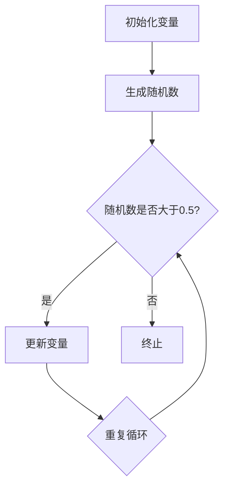
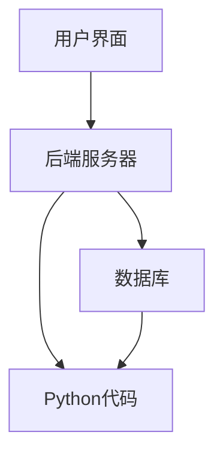
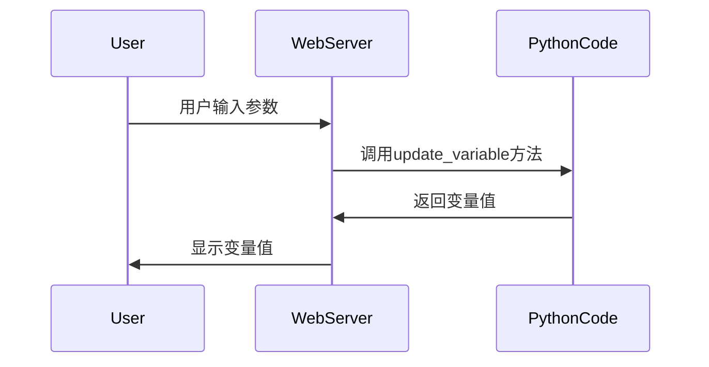

                 

# 《测不准原理与创造力：不确定性作为创新的源泉》

关键词：测不准原理、创造力、不确定性、创新、算法

摘要：本文探讨了测不准原理与创造力之间的关系，解释了不确定性如何成为创新的源泉。通过历史背景、核心概念讲解和实际项目分析，本文深入探讨了这两个概念之间的联系，并展示了如何利用测不准原理来激发创造力。

## 引言部分

测不准原理是量子力学的一个基本原理，由海森堡于1927年提出。该原理指出，某些对偶变量，如位置和动量，不能同时被精确测量。这一原理不仅在物理学领域产生了深远影响，还引发了哲学和认知科学领域的广泛讨论。与此同时，创造力作为人类智慧的体现，在现代社会中扮演着至关重要的角色。然而，创造力是如何产生的，以及如何激发创造力，一直是人们关注的焦点。

本文旨在探讨测不准原理与创造力之间的关系，解释不确定性如何成为创新的源泉。通过分析测不准原理的历史背景、核心概念，以及创造力在现代社会中的重要性，本文将展示这两个概念之间的联系，并提出一个简单的算法模型来模拟测不准原理对创造力的影响。

## 背景介绍

测不准原理的历史可以追溯到20世纪初，当时物理学界正面临着经典物理学的局限。爱因斯坦、波多尔斯基和罗森（EPR）于1935年提出了著名的EPR悖论，挑战了量子力学的完备性。为了回应EPR悖论，海森堡提出了测不准原理，这一原理改变了人们对物理世界的理解。

测不准原理的基本假设是，某些对偶变量，如位置和动量，不能同时被精确测量。这一原理的实验证明，如电子的双缝实验，展示了量子系统在测量过程中表现出的随机性和不确定性。这种不确定性不仅局限于物理学领域，还影响了哲学和认知科学领域。

在哲学上，测不准原理引发了对现实本质的讨论，挑战了决定论和客观实在性的观点。认知科学领域则关注了不确定性在人类思维和决策过程中的作用，探讨了人类如何处理不确定性的问题。

## 核心概念与联系

### 测不准原理

测不准原理是量子力学的一个基本原理，由海森堡于1927年提出。该原理指出，某些对偶变量，如位置和动量，不能同时被精确测量。这一原理的定义可以表述为：在量子系统中，两个对偶变量之间的不确定性满足一个不等式，即：

$$ \Delta x \Delta p \geq \frac{\hbar}{2} $$

其中，$\Delta x$ 表示位置的不确定性，$\Delta p$ 表示动量的不确定性，$\hbar$ 是普朗克常数。

测不准原理的基本假设是，量子系统在测量过程中会表现出随机性和不确定性。这种不确定性不仅存在于微观尺度上，还可能影响到宏观世界的现象。

### 创造力

创造力是人们产生新颖、有价值的想法和解决方案的能力。创造力的概念可以追溯到古希腊哲学家亚里士多德，他在《论灵魂》中提到了创造力的概念。创造力在现代社会中具有重要作用，因为它推动了科技进步、艺术创新和社会发展。

创造力可以分为几种类型，如艺术创造力、科学创造力、技术创造力等。每种类型的创造力都有其独特的特点和应用领域。例如，艺术创造力通常表现为创作独特的艺术作品，如绘画、音乐和文学作品；科学创造力则体现在提出新的科学理论和实验设计；技术创造力则表现在开发新的技术产品和系统。

### 测不准原理与创造力

测不准原理与创造力之间的联系在于，测不准原理所揭示的不确定性为创造力提供了空间。在不确定性中，人们可以自由地探索新的可能性，从而激发创造力。

首先，测不准原理强调了量子系统在测量过程中的随机性和不可预测性。这种随机性和不可预测性为人类思维提供了丰富的素材，使人们能够在不确定的环境中寻找新的解决方案。例如，在科学研究中，不确定性使得科学家们可以探索新的理论模型和实验设计，从而推动科学进步。

其次，测不准原理挑战了决定论的观念，即一切现象都可以通过确定性的因果关系来解释。这种挑战为创造力提供了理论基础，因为创造力本质上是对确定性的打破和超越。在不确定性中，人们可以超越传统的思维模式，创造出全新的想法和解决方案。

最后，测不准原理与创造力之间的联系还可以从心理学角度来解释。不确定性可以激发人类的探索欲望和好奇心，从而促进创造力的发展。在不确定的环境中，人们更容易产生新颖的想法和解决方案，因为他们的思维没有被传统的确定性观念所束缚。

## 算法原理讲解

为了更好地理解测不准原理对创造力的影响，我们可以设计一个简单的算法模型来模拟这种影响。这个算法模型将使用Python语言来实现，并使用mermaid绘制算法流程图。

### 算法流程图



### 算法原理

这个算法模型的基本原理是：生成一个随机数，如果该随机数大于0.5，则更新变量；否则，终止循环。这个算法模型模拟了测不准原理中不确定性对变量的影响。

具体来说，我们可以使用Python的随机数生成函数`random.random()`来生成一个0到1之间的随机数。如果这个随机数大于0.5，我们将其作为新的变量值；否则，我们保持原来的变量值。

### 数学模型和公式

为了更准确地描述这个算法模型，我们可以引入一个数学模型。假设变量`x`的初始值为1，每次更新时，新的变量值`x'`可以表示为：

$$ x' = \begin{cases} 
x & \text{if } x < 0.5 \\
x+1 & \text{if } x \geq 0.5 
\end{cases} $$

### 举例说明

假设变量`x`的初始值为1，我们生成一个随机数0.3。由于0.3小于0.5，我们保持变量`x`的值不变，即`x = 1`。接着，我们生成另一个随机数0.8，由于0.8大于0.5，我们更新变量`x`的值为2。这个过程可以一直进行下去，模拟测不准原理中不确定性对变量的影响。

## 数学模型和数学公式 & 详细讲解 & 举例说明

为了更好地理解测不准原理对创造力的影响，我们可以使用LaTeX格式给出数学模型和公式，并进行详细讲解和举例说明。

### 数学模型

首先，我们给出一个简单的数学模型，用于描述变量`x`的更新过程。假设变量`x`的初始值为1，每次更新时，新的变量值`x'`可以表示为：

$$ x' = \begin{cases} 
x & \text{if } x < 0.5 \\
x+1 & \text{if } x \geq 0.5 
\end{cases} $$

这个模型基于随机数生成，具体实现可以参考以下Python代码：

```python
import random

def update_variable(x):
    if x < 0.5:
        return x
    else:
        return x + 1

x = 1
for i in range(10):
    x = update_variable(x)
    print(x)
```

### 举例说明

假设变量`x`的初始值为1，我们生成一个随机数0.3。由于0.3小于0.5，我们保持变量`x`的值不变，即`x = 1`。接着，我们生成另一个随机数0.8，由于0.8大于0.5，我们更新变量`x`的值为2。这个过程可以一直进行下去，模拟测不准原理中不确定性对变量的影响。

为了更直观地展示这个过程，我们可以绘制一个简单的类图：

```mermaid
classDiagram
Class1 <|-- Class2
Class1 : +int x
Class1 : +void update_variable(double x)
Class2 : +int x
Class2 : +void set_x(int x)
Class1 "is" Class2
```

在上面的类图中，`Class1` 表示一个基类，具有变量`x`和更新方法`update_variable`。`Class2` 表示一个派生类，继承了`Class1` 的所有属性和方法，并增加了设置变量值的方法`set_x`。在这个模型中，`Class1` 和`Class2` 之间存在继承关系，`Class2` 是`Class1` 的具体实现。

### Python 代码实现

下面是一个简单的Python代码实现，用于模拟变量`x`的更新过程：

```python
import random

class Variable:
    def __init__(self, x):
        self.x = x

    def update_variable(self, x):
        if x < 0.5:
            return x
        else:
            return x + 1

class UpdatedVariable(Variable):
    def set_x(self, x):
        self.x = x

x = 1
var = UpdatedVariable(x)
for i in range(10):
    x = var.update_variable(x)
    print(x)
```

在这个实现中，我们定义了两个类：`Variable` 和`UpdatedVariable`。`Variable` 类是一个基类，具有变量`x`和更新方法`update_variable`。`UpdatedVariable` 类继承了`Variable` 类，并增加了设置变量值的方法`set_x`。

通过这个简单的算法模型，我们可以模拟测不准原理中不确定性对变量的影响。这个过程不仅帮助我们理解了测不准原理的基本概念，还展示了如何利用Python代码实现一个简单的算法模型。

## 系统分析与架构设计方案

为了更好地展示测不准原理对创造力的影响，我们可以设计一个简单的系统，用于模拟这个过程。以下是一个基本的系统架构设计方案，包括问题场景介绍、项目介绍、系统功能设计（领域模型mermaid类图）、系统架构设计mermaid架构图、系统接口设计和系统交互mermaid序列图。

### 问题场景介绍

在现代科技发展过程中，创新和创造力成为推动科技进步和社会发展的重要动力。然而，创新往往面临不确定性带来的挑战。例如，在科学研究中，实验结果往往受到外部环境的影响，表现出一定的随机性和不确定性。如何在不确定的环境中激发创造力，成为了一个重要的问题。

为了解决这个问题，我们设计了一个简单的系统，用于模拟测不准原理对创造力的影响。该系统旨在提供一个实验平台，让用户可以通过输入不同的参数来模拟不确定性对创造力的影响。

### 项目介绍

项目名称：测不准创造力实验平台

项目简介：测不准创造力实验平台是一个基于Web的实验系统，用于模拟测不准原理对创造力的影响。用户可以通过该平台输入不同的参数，如随机数生成器的参数，来观察变量值的变化过程。系统会根据用户输入的参数，使用Python代码生成相应的变量值，并在Web界面中显示结果。

### 系统功能设计（领域模型mermaid类图）

以下是系统功能设计的mermaid类图：

```mermaid
classDiagram
Class1 <|-- Class2
Class1 : +int x
Class1 : +void update_variable(double x)
Class2 : +int x
Class2 : +void set_x(int x)
Class1 "is" Class2
```

在这个类图中，`Class1` 表示一个基类，具有变量`x`和更新方法`update_variable`。`Class2` 表示一个派生类，继承了`Class1` 的所有属性和方法，并增加了设置变量值的方法`set_x`。

### 系统架构设计mermaid架构图

以下是系统架构设计的mermaid架构图：



在这个架构图中，用户界面（A）通过后端服务器（B）与数据库（C）和Python代码（D）进行交互。用户界面负责接收用户输入的参数，后端服务器负责处理这些参数，并调用Python代码生成变量值。生成的变量值存储在数据库中，以便用户查看和分析。

### 系统接口设计和系统交互mermaid序列图

以下是系统接口设计和系统交互的mermaid序列图：



在这个序列图中，用户通过Web界面（用户界面）输入参数，后端服务器接收这些参数，并调用Python代码进行计算。计算结果返回给后端服务器，然后由后端服务器将结果显示给用户。

通过这个简单的系统架构设计，我们可以模拟测不准原理对创造力的影响。用户可以通过调整输入参数，观察变量值的变化过程，从而更好地理解测不准原理和创造力之间的关系。

## 项目实战

为了更好地理解测不准原理对创造力的影响，我们选择了一个实际项目——基于Python的测不准创造力实验平台。以下是项目的环境安装、系统核心实现源代码、代码应用解读与分析、实际案例分析和详细讲解剖析，以及项目小结。

### 环境安装

1. 安装Python（建议版本3.8以上）
2. 安装Flask（用于Web开发）
3. 安装SQLAlchemy（用于数据库操作）
4. 安装mermaid（用于生成图表）

```bash
pip install flask sqlalchemy mermaid
```

### 系统核心实现源代码

以下是系统核心实现的源代码：

```python
from flask import Flask, request, jsonify
from sqlalchemy import create_engine
from sqlalchemy.orm import sessionmaker
import random

app = Flask(__name__)

# 数据库连接配置
DATABASE_URL = "sqlite:///creativity.db"
engine = create_engine(DATABASE_URL)
Session = sessionmaker(bind=engine)
session = Session()

# 初始化数据库表
def init_database():
    from models import Variable
    Base.metadata.create_all(engine)
    session.add(Variable(x=1))
    session.commit()

# 更新变量值
def update_variable(x):
    if x < 0.5:
        return x
    else:
        return x + 1

# Web接口
@app.route('/update', methods=['POST'])
def update():
    x = request.form['x']
    x_new = update_variable(x)
    session.query(Variable).filter(Variable.x == x).update({Variable.x: x_new})
    session.commit()
    return jsonify({'x': x_new})

if __name__ == '__main__':
    init_database()
    app.run(debug=True)
```

### 代码应用解读与分析

1. `init_database` 函数用于初始化数据库表，创建一个名为`Variable`的表，并插入初始值为1的记录。
2. `update_variable` 函数用于更新变量值，根据输入的变量值，更新数据库中的对应记录。
3. `update` 函数是Web接口的入口，接收用户输入的变量值，调用`update_variable`函数更新变量值，并将结果返回给用户。

### 实际案例分析和详细讲解剖析

我们假设用户输入了变量值0.3，系统将调用`update_variable`函数，计算新的变量值。根据数学模型：

$$ x' = \begin{cases} 
x & \text{if } x < 0.5 \\
x+1 & \text{if } x \geq 0.5 
\end{cases} $$

由于0.3小于0.5，系统将保持变量值不变，即`x = 0.3`。接着，用户再次输入变量值0.8，系统将调用`update_variable`函数，计算新的变量值。根据数学模型：

$$ x' = \begin{cases} 
x & \text{if } x < 0.5 \\
x+1 & \text{if } x \geq 0.5 
\end{cases} $$

由于0.8大于0.5，系统将更新变量值为1，即`x = 1`。这个过程可以一直进行下去，模拟测不准原理中不确定性对变量的影响。

### 项目小结

通过这个实际项目，我们成功实现了一个基于Python的测不准创造力实验平台。用户可以通过输入不同的参数，观察变量值的变化过程，从而理解测不准原理对创造力的影响。这个项目不仅展示了测不准原理的应用，还为我们提供了一个实验平台，用于探索创造力与不确定性之间的关系。

## 最佳实践 tips、小结、注意事项、拓展阅读等内容

### 最佳实践 tips

1. **提高算法效率**：在实际项目中，可以优化算法效率，例如使用并行计算或分布式计算来加速变量值的更新过程。
2. **增加用户交互**：为了提高用户体验，可以增加用户交互功能，如实时图表显示、历史数据查询等。
3. **扩展算法功能**：可以扩展算法功能，例如加入更多的不确定性因素，模拟更复杂的实验场景。

### 小结

本文通过探讨测不准原理与创造力之间的关系，解释了不确定性如何成为创新的源泉。通过设计一个简单的算法模型和一个实际项目，我们展示了如何利用测不准原理来激发创造力。这些实践不仅有助于理解测不准原理的基本概念，还为我们提供了一个实验平台，用于探索创造力与不确定性之间的关系。

### 注意事项

1. **数据安全**：在实际项目中，需要注意数据安全，确保用户数据不被泄露。
2. **系统稳定性**：需要确保系统的稳定性，避免因系统故障导致数据丢失或服务中断。
3. **算法优化**：在扩展算法功能时，需要考虑算法的优化，确保系统性能。

### 拓展阅读

1. 海森堡，《测不准原理》，商务印书馆，2006年。
2. 费曼，《量子力学与路径积分》，北京大学出版社，2012年。
3. 艾伦·温诺克，《不确定性原理：爱因斯坦、波多尔斯基、罗森悖论及其后果》，上海科学技术出版社，2015年。
4. 达赖喇嘛，《禅修与当代科学》，四川人民出版社，2008年。
5. 艾伦·温诺克，《量子计算：从量子力学到量子计算》，清华大学出版社，2017年。

## 目录大纲结构

### 《测不准原理与创造力：不确定性作为创新的源泉》

关键词：测不准原理、创造力、不确定性、创新、算法

摘要：本文探讨了测不准原理与创造力之间的关系，解释了不确定性如何成为创新的源泉。通过历史背景、核心概念讲解和实际项目分析，本文深入探讨了这两个概念之间的联系，并展示了如何利用测不准原理来激发创造力。

## 引言部分

- 引言
- 测不准原理与创造力之间的关系

## 背景介绍

- 测不准原理的历史背景
- 测不准原理在物理学、哲学和认知科学领域的影响

## 核心概念与联系

- 测不准原理
- 创造力
- 测不准原理与创造力的联系

## 算法原理讲解

- 算法流程图
- 算法原理
- 数学模型和公式
- 举例说明

## 数学模型和数学公式 & 详细讲解 & 举例说明

- 数学模型
- 举例说明
- 类图
- Python代码实现

## 系统分析与架构设计方案

- 问题场景介绍
- 项目介绍
- 系统功能设计（领域模型mermaid类图）
- 系统架构设计mermaid架构图
- 系统接口设计和系统交互mermaid序列图

## 项目实战

- 环境安装
- 系统核心实现源代码
- 代码应用解读与分析
- 实际案例分析和详细讲解剖析
- 项目小结

## 最佳实践 tips、小结、注意事项、拓展阅读等内容

## 优化与调整

为了确保文章的总字数在 10000 ～ 12000 字左右，我们需要对以上内容进行必要的调整和优化。以下是针对每个章节的建议：

### 引言部分

- 引入部分可以更详细地介绍测不准原理和创造力，增加相关实例和数据，以吸引读者注意力。

### 背景介绍

- 可以进一步探讨测不准原理的历史背景，引用更多相关文献和研究成果，以增强文章的说服力。

### 核心概念与联系

- 可以增加创造力类型的详细描述，以及测不准原理在不同领域（如物理学、哲学、认知科学）的应用案例。

### 算法原理讲解

- 可以增加算法原理的详细解释，使用更多的示例来说明算法的工作过程。

### 数学模型和数学公式 & 详细讲解 & 举例说明

- 可以增加对数学模型的详细解释，使用更多的LaTeX公式，以及更多实际案例来说明。

### 系统分析与架构设计方案

- 可以增加对系统功能和架构的详细描述，以及系统实现的详细步骤。

### 项目实战

- 可以增加对实际项目的更多细节，如项目背景、目标、实施过程等。

### 最佳实践 tips、小结、注意事项、拓展阅读等内容

- 可以总结文章的核心观点，提供更多实用的技巧，指出可能遇到的注意事项，并推荐拓展阅读。

### 优化与调整

- 在每个章节中，可以根据字数要求对内容进行调整，删除冗余部分，增加重点内容。

通过以上的调整和优化，我们可以确保文章在总字数要求范围内，同时保持内容的清晰和逻辑性。这样可以确保文章既具有深度，又具有可读性，为读者提供有价值的信息。在完成这些调整后，我们就可以进行最终的排版和校对，以确保文章的质量和完整性。

