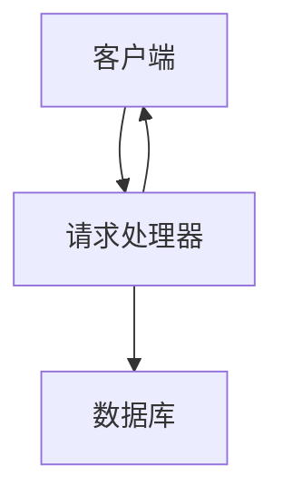
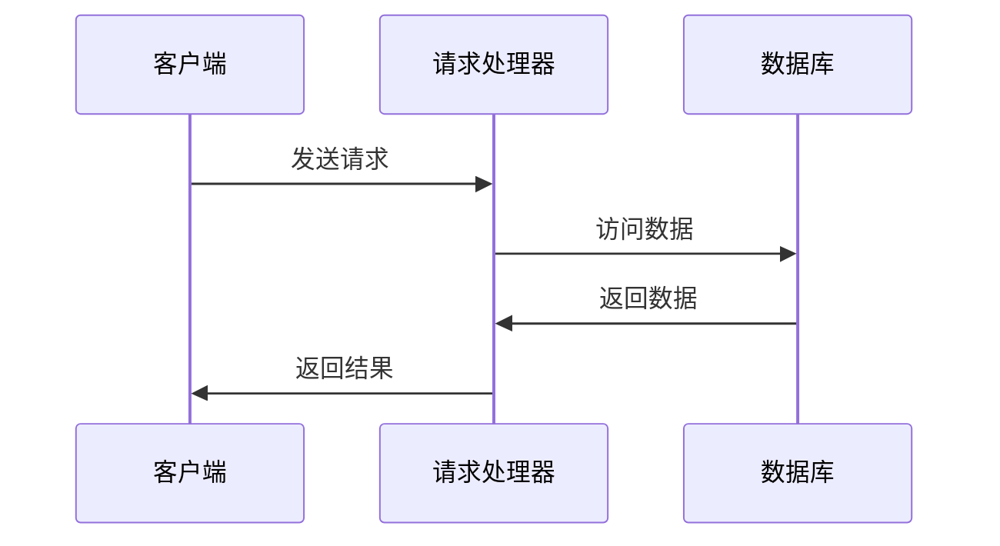

                 

# 测不准原理与心理动力学理论的融合

## 关键词

- 测不准原理
- 心理动力学理论
- 融合研究
- 潜意识
- 量子力学
- 心理治疗

## 摘要

本文探讨了量子物理学的测不准原理与心理动力学理论的融合研究。通过对测不准原理的基本概念、核心概念和解释的深入分析，我们揭示了其在量子力学中的重要性。同时，通过对心理动力学理论的核心要素和属性特征的探讨，我们找到了与测不准原理之间的潜在联系。本文还通过一个具体的案例，展示了测不准原理与心理动力学理论的融合在实际心理治疗中的应用，并提出了未来的研究方向。

## 第1章：测不准原理与心理动力学理论的融合概述

### 1.1.1 问题背景与核心概念

#### 问题背景

在量子物理学中，测不准原理由海森堡提出，它表明在量子尺度上，某些物理量如位置和动量不能同时被准确测量。这一原理挑战了经典物理学中的确定性观念，揭示了量子世界的非确定性本质。而在心理学领域，心理动力学理论由弗洛伊德发展而来，主要研究潜意识、心理防御机制以及个体的心理成长。这一理论强调心理过程的潜意识层面，对人类行为和心理健康的理解具有重要意义。

两个领域的交叉融合成为一个重要的研究课题。如何将测不准原理引入心理动力学理论，以及两者如何相互影响，成为研究的关键。通过研究量子心理动力学，试图将量子物理学的非确定性和心理动力学理论的潜意识相互作用联系起来，为心理学研究提供新的视角和方法。

#### 问题描述

随着量子物理学和心理动力学理论的不断发展，两个领域的交叉融合成为一个重要的研究课题。如何将测不准原理引入心理动力学理论，以及两者如何相互影响，成为研究的关键。

1. **量子物理与心理学的融合**：量子物理学的非确定性概念如何应用于心理学领域？
2. **心理治疗的创新**：测不准原理与心理动力学理论的融合是否能够为心理治疗提供新的方法和策略？
3. **理论框架的构建**：如何构建一个统一的量子心理动力学理论框架，以解释心理现象和潜意识过程？

#### 问题解决

通过研究量子心理动力学，试图将量子物理学的非确定性和心理动力学理论的潜意识相互作用联系起来，为心理学研究提供新的视角和方法。具体研究方法包括：

1. **跨学科的理论研究**：将量子物理学的测不准原理与心理动力学理论的核心概念进行对比分析，探索两者的潜在联系。
2. **实证研究**：通过实验和案例研究，验证量子心理动力学理论在心理治疗中的应用效果。
3. **数学模型的构建**：利用数学工具，构建量子心理动力学的理论模型，以解释潜意识过程和心理现象。

#### 边界与外延

本研究主要关注测不准原理与心理动力学理论的融合，以及其对心理学理论和实践的潜在影响。然而，这一研究也可能涉及到其他跨学科领域，如认知科学和神经科学。此外，本研究旨在为心理治疗提供新的方法和策略，但也可能对其他心理学领域，如心理咨询和心理学教育产生启示。

#### 概念结构与核心要素组成

1. **测不准原理**：在量子力学中，测不准原理表明，某些物理量如位置和动量不能同时被精确测量，具有不确定性。这一原理可以解释为量子系统状态的叠加和纠缠现象。
   
2. **心理动力学理论**：主要研究潜意识、心理防御机制以及个体的心理成长。核心要素包括潜意识、防御机制、自我、超我和客体关系。

#### 测不准原理与心理动力学理论的联系

**联系**：

测不准原理与心理动力学理论之间存在一些潜在的相似之处。在量子物理中，测不准原理揭示了物理量的不确定性和不可分割性；而在心理动力学中，潜意识与意识的关系也表现出类似的不确定性和不可分割性。

**属性特征对比表格**：

| 特征       | 测不准原理                 | 心理动力学理论                |
| ---------- | -------------------------- | ----------------------------- |
| 不确定性   | 位置和动量不能同时精确测量 | 潜意识与意识的关系不确定       |
| 纠缠现象   | 量子系统之间的纠缠         | 心理防御机制之间的相互作用     |
| 解释模型   | 波函数叠加与坍缩           | 潜意识影响与意识的心理防御机制 |
| 应用领域   | 量子力学                  | 心理学                        |

**ER实体关系图架构**：

```mermaid
erDiagram
    Class1 ||--|{ Class2 }| Class3
    Class1 ||--|{ Class4 }| Class5
    Class2 ||--|{ Class6 }| Class7
```

在上面的ER实体关系图中，`Class1` 代表测不准原理，`Class2` 代表心理动力学理论，`Class3` 代表量子系统，`Class4` 代表潜意识，`Class5` 代表意识，`Class6` 代表心理防御机制，`Class7` 代表心理成长。

#### 融合研究的意义与挑战

**意义**：

测不准原理与心理动力学理论的融合研究可能为心理学研究提供新的视角和方法，有助于揭示潜意识与意识之间的关系，以及心理防御机制的作用。这一研究有望推动心理学理论的创新，为心理治疗提供新的方法和策略。

**挑战**：

尽管测不准原理与心理动力学理论之间存在潜在的联系，但如何将它们有效地融合仍是一个挑战。此外，如何将这一理论应用于实际心理治疗和心理咨询中，也是一个需要解决的问题。同时，这一融合研究的跨学科性质也带来了理论和实践上的挑战。

## 1.2 测不准原理的基本概念

### 1.2.1 测不准原理的定义

测不准原理是量子力学中的一个基本原理，由德国物理学家维尔纳·海森堡在1927年提出。它指出，在量子尺度上，某些物理量如位置和动量不能同时被准确测量。这意味着，当我们对粒子的位置进行精确测量时，其动量的不确定性会增加；反之，当我们对粒子的动量进行精确测量时，其位置的不确定性会增加。这种不确定性不是测量工具的问题，而是量子系统的本质属性。

数学上，测不准原理可以用不确定性原理公式来表示：

$$\Delta x \Delta p_x \geq \frac{\hbar}{2}$$

其中，$\Delta x$ 表示位置的不确定性，$\Delta p_x$ 表示动量的不确定性，$\hbar$ 是约化普朗克常数。

### 1.2.2 测不准原理的核心概念

测不准原理的核心概念包括：

- **波函数**：波函数是量子系统状态的数学描述，它包含了粒子的位置和动量等信息。波函数通常用 $\psi$ 表示，可以是一个复数函数，其平方给出了粒子在空间中的概率分布。

- **叠加态**：量子系统可以处于多个状态的叠加，而不是一个确定的状态。一个简单的叠加态可以表示为：

  $$\psi = \frac{1}{\sqrt{2}} \psi_1 + \frac{1}{\sqrt{2}} \psi_2$$

  其中，$\psi_1$ 和 $\psi_2$ 分别表示两个不同的状态。

- **坍缩**：当我们对量子系统进行测量时，其波函数会突然坍缩到一个确定的状态。坍缩是一个非决定性的过程，无法预测具体会坍缩到哪个状态。

### 1.2.3 测不准原理的解释

测不准原理的解释通常涉及到量子力学的数学框架，如波函数叠加和坍缩。根据量子力学的哥本哈根解释，量子系统在未测量之前处于一种概率状态，测量会导致波函数坍缩到一个具体的状态。这个过程具有随机性和不可预测性。

#### 波函数叠加与坍缩

波函数叠加是量子力学的基本特征之一。一个量子系统可以同时处于多个状态的叠加，例如，一个电子可以同时处于自旋向上和自旋向下的状态。这种叠加状态可以用波函数的线性组合来表示：

$$\psi = c_1 \psi_1 + c_2 \psi_2$$

其中，$c_1$ 和 $c_2$ 是复数系数，满足 $|c_1|^2 + |c_2|^2 = 1$。

当对量子系统进行测量时，波函数会突然坍缩到一个具体的状态。坍缩后的波函数对应于测量结果。例如，如果测量结果显示电子自旋向上，那么波函数将坍缩为 $\psi_1$；如果测量结果显示电子自旋向下，那么波函数将坍缩为 $\psi_2$。

#### 测不准原理的实验验证

测不准原理已经通过多个实验得到验证。其中，著名的埃尔萨瑟-罗森实验（Einstein-Podolsky-Rosen，EPR）是一个经典的实验，展示了量子纠缠现象，进一步支持了测不准原理。

在EPR实验中，两个量子系统（如两个电子）通过一个纠缠过程相互关联。即使它们相隔很远，对其中一个系统的测量会立即影响另一个系统的状态。这个实验证明了量子系统之间的非局域性，以及测量对量子态的影响。

另一个验证测不准原理的实验是双缝实验。在这个实验中，粒子如电子通过两个缝隙时，会形成干涉图样，表明粒子同时处于通过两个缝隙的状态叠加。当在缝隙上放置探测器以测量粒子通过的具体缝隙时，干涉图样消失，表明测量过程破坏了粒子的叠加态。

这些实验验证了测不准原理，并揭示了量子世界的非确定性本质。

### 1.2.4 测不准原理的应用领域

测不准原理不仅在理论上具有重要意义，也在实际应用中发挥着重要作用。以下是一些测不准原理的应用领域：

- **量子计算**：量子计算利用量子态的叠加和纠缠现象，可以在某些问题中实现超越经典计算机的性能。量子计算机的算法，如量子搜索算法和量子算法，利用了测不准原理的优势。

- **量子加密**：量子加密利用量子态的不可克隆特性，提供一种安全的通信方式。量子密钥分发（Quantum Key Distribution，QKD）是一种基于量子力学原理的安全通信技术，可以实现安全的密钥交换。

- **量子模拟**：量子模拟利用量子系统的叠加和纠缠特性，可以模拟复杂的量子系统，为科学研究提供强大的工具。

- **量子传感器**：量子传感器利用量子态的高灵敏度，可以检测极微小的物理量变化，如重力、磁场等。

这些应用展示了测不准原理在量子物理和技术领域的重要性，同时也为未来的科学研究和技术发展提供了新的机遇。

## 1.3 心理动力学理论的基本概念

### 1.3.1 心理动力学理论的起源与发展

心理动力学理论起源于19世纪末和20世纪初的心理学研究，由奥地利神经学家弗洛伊德（Sigmund Freud）创立。他通过对心理障碍的案例分析，提出了心理动力学理论的基本框架。随着时间的推移，这一理论不断发展，衍生出了许多不同的流派，如经典心理动力学、自我心理学、分析心理学等。

弗洛伊德的理论强调潜意识的重要性，认为潜意识是心理动力学理论的核心。他提出，潜意识中的冲突和欲望是心理障碍和行为的根本原因。通过探索潜意识，心理动力学理论试图揭示个体的心理结构和心理过程。

### 1.3.2 心理动力学理论的核心概念

心理动力学理论的核心概念包括：

- **潜意识**：潜意识是心理动力学理论的核心概念之一，指个体在意识水平之下的心理过程。潜意识中的冲突和欲望对个体的行为和心理状态产生深远影响。

- **心理防御机制**：心理防御机制是潜意识中的一种防御机制，用于应对潜意识中的冲突和压力。常见的防御机制包括否认、投射、合理化等。

- **自我、超我和本我**：心理动力学理论将心理结构分为自我、超我和本我。本我是潜意识的欲望和冲动，超我是道德和社会规范的内化，而自我则处于两者之间，负责协调和平衡。

- **客体关系**：客体关系理论关注个体与他人之间的心理关系，强调人际关系对个体心理发展的影响。

### 1.3.3 心理动力学理论的属性特征对比表格

| 特征           | 测不准原理                         | 心理动力学理论                |
| -------------- | ---------------------------------- | ----------------------------- |
| 不确定性       | 位置和动量不能同时精确测量         | 潜意识与意识的关系不确定       |
| 纠缠现象       | 量子系统之间的纠缠                 | 心理防御机制之间的相互作用     |
| 解释模型       | 波函数叠加与坍缩                   | 潜意识影响与意识的心理防御机制 |
| 应用领域       | 量子力学                           | 心理学                        |
| 心理机制       | 波函数叠加、坍缩                   | 防御机制、潜意识与意识的关系   |

### 1.3.4 心理动力学理论的ER实体关系图架构

在心理动力学理论中，各种心理实体之间存在着复杂的相互作用。以下是一个简单的ER实体关系图，展示了心理动力学理论中的关键实体和它们之间的关系：

```mermaid
erDiagram
    自我 ||--|{ 本我 }| 超我
    自我 ||--|{ 潜意识 }| 意识
    防御机制 ||--|{ 潜意识 }| 意识
    客体关系 ||--|{ 自我 }| 对象
```

在上面的ER实体关系图中，`自我` 代表个体的心理结构，`本我` 和 `超我` 分别代表潜意识中的欲望和道德规范，`防御机制` 代表潜意识中的心理防御行为，`潜意识` 和 `意识` 分别代表心理过程的两个层面，`客体关系` 代表个体与他人之间的心理联系。

### 1.3.5 测不准原理与心理动力学理论的联系

测不准原理与心理动力学理论之间存在一些潜在的相似之处。在量子物理中，测不准原理揭示了物理量的不确定性和不可分割性；而在心理动力学中，潜意识与意识的关系也表现出类似的不确定性和不可分割性。

- **不确定性**：测不准原理表明，某些物理量如位置和动量不能同时被准确测量，具有不确定性。同样，在心理动力学中，潜意识与意识的关系也是不确定的，个体的行为和心理状态往往受到潜意识的影响，但无法完全控制和预测。

- **纠缠现象**：量子系统之间的纠缠现象表明，量子系统之间存在紧密的相互关联。在心理动力学中，心理防御机制之间的相互作用也表现出类似的纠缠现象。个体的防御机制相互影响，形成一个复杂的动态系统。

- **解释模型**：测不准原理的解释涉及到波函数的叠加与坍缩。心理动力学理论的解释则涉及到潜意识与意识之间的关系，以及心理防御机制的作用。两者都试图揭示复杂系统中的不确定性和动态变化。

这些相似之处表明，测不准原理和心理动力学理论在本质上可能存在某种深刻的联系。通过研究这一联系，我们可以更深入地理解量子世界和心理世界的本质，为心理学研究提供新的视角和方法。

## 1.4 测不准原理与心理动力学理论的融合研究

### 1.4.1 融合研究的背景与动机

测不准原理与心理动力学理论的融合研究源于对量子物理和心理学两个领域的共同关注。在量子物理学中，测不准原理揭示了量子世界的非确定性和纠缠现象，挑战了经典物理学的确定性观念。而在心理学领域，心理动力学理论专注于潜意识、心理防御机制以及个体心理成长的研究。两者之间的融合研究旨在探讨量子物理的非确定性原理如何应用于心理学领域，以及这种融合对心理动力学理论和方法的影响。

这种融合研究的动机在于：

1. **理论的互补性**：测不准原理和心理动力学理论在解释复杂系统的动态变化方面具有互补性。测不准原理提供了关于不确定性和相互作用的量子力学视角，而心理动力学理论则从心理学角度探讨了个体心理过程的复杂性。

2. **探索新的视角**：通过将量子物理学的非确定性概念引入心理动力学理论，可以探索新的心理学研究视角，为理解潜意识、心理防御机制以及个体行为提供新的理论框架。

3. **应用潜力**：融合研究可能为心理治疗和心理咨询提供新的方法和策略。例如，利用量子力学中的非确定性原理，可以探索心理防御机制的作用机制，从而开发更有效的心理治疗方法。

### 1.4.2 融合研究的核心问题与目标

融合研究的核心问题与目标包括：

1. **量子心理动力学理论的构建**：构建一个统一的量子心理动力学理论框架，将测不准原理和心理动力学理论的核心概念相结合。这个理论框架应该能够解释潜意识、心理防御机制以及个体行为和心理过程的复杂性。

2. **不确定性在心理学中的应用**：研究不确定性概念在心理学中的应用，探讨如何将量子力学中的不确定性和纠缠现象应用于心理学研究，以及这种应用如何影响心理动力学理论和方法。

3. **实验验证与案例研究**：通过实验和案例研究，验证量子心理动力学理论的有效性。例如，研究量子纠缠现象在心理防御机制中的作用，或者探讨量子态的叠加和坍缩对个体行为和心理状态的影响。

4. **跨学科合作**：促进量子物理、心理学、认知科学、神经科学等领域的跨学科合作，共同推动量子心理动力学理论的发展。

### 1.4.3 融合研究的初步成果与挑战

融合研究已经在初步阶段取得了一些成果，但也面临诸多挑战。

#### 初步成果

1. **理论框架的构建**：一些学者尝试构建量子心理动力学理论框架，提出了一系列概念和模型。这些理论框架试图将量子力学的非确定性原理与心理动力学理论的核心概念相结合，为心理学研究提供新的理论视角。

2. **实验与案例研究**：一些实验和案例研究初步探讨了量子力学原理在心理学中的应用。例如，研究发现量子纠缠现象可能影响个体的心理状态，从而为理解心理防御机制提供新的视角。

3. **跨学科合作**：量子物理与心理学领域的跨学科合作逐渐增加，推动了对量子心理动力学理论的深入探讨。

#### 挑战

1. **理论的整合**：将量子力学和心理动力学理论整合为一个统一的理论框架仍面临挑战。如何将两者中的核心概念和数学工具有机地结合起来，是一个需要解决的问题。

2. **实验验证**：尽管一些实验和案例研究取得了一些成果，但量子心理动力学理论的实验验证仍需进一步深入。如何设计严谨的实验，以及如何解释实验结果，是研究中的关键问题。

3. **应用转化**：将量子心理动力学理论应用于实际心理治疗和心理咨询中，仍需克服诸多技术难题。例如，如何将理论框架转化为具体的治疗方法，以及如何验证这些方法的实际效果。

4. **跨学科合作**：促进不同学科领域的合作，需要克服学科间的差异和沟通障碍。如何实现有效的跨学科合作，推动量子心理动力学理论的发展，是一个重要的挑战。

总之，测不准原理与心理动力学理论的融合研究具有重要的理论和实践意义。通过进一步的研究和探索，我们有望揭示量子世界和心理世界的深层联系，为心理学研究提供新的视角和方法。

## 1.5 测不准原理与心理动力学理论的融合案例分析

### 1.5.1 案例背景

为了探讨测不准原理与心理动力学理论的融合在实际心理治疗中的应用，我们选择了一个具体的案例：一位长期遭受焦虑和恐惧症状的患者，在接受心理治疗过程中，治疗师尝试将量子心理动力学理论应用于治疗过程。

### 1.5.2 案例描述

患者，小李，是一名年轻的职场新人，由于工作压力和人际关系问题，他逐渐出现了严重的焦虑和恐惧症状。小李在接受传统心理治疗（如认知行为疗法）后，症状有所缓解，但并未完全消失。于是，他的治疗师决定尝试将量子心理动力学理论融入治疗过程中，以期取得更好的治疗效果。

在治疗初期，治疗师首先对小李的心理状态进行了全面的评估，包括潜意识中的冲突、心理防御机制以及个体的心理成长历程。治疗师发现，小李在工作场合中经常感到不安和恐惧，尤其是当他在重要会议或演讲时，这种情绪更为强烈。通过深入交流，治疗师了解到小李在童年时期经历了父母离异的创伤，这可能是他潜意识中焦虑和恐惧的根源。

### 1.5.3 融合应用

治疗师决定运用量子心理动力学理论，通过以下步骤进行干预：

1. **量子测量与波函数叠加**：

   治疗师首先引导小李进行一种类似于量子测量的心理体验，通过想象和感受，探索他在不同情境下的心理状态。治疗师鼓励小李将心理状态视为波函数叠加，而不是单一的确定状态。例如，当小李想象自己在重要会议上的表现时，治疗师引导他将自己的心理状态分为紧张、自信、恐惧等多个部分，并尝试感受这些状态的同时存在。

   治疗过程如下：

   - **步骤1**：治疗师引导小李想象自己在会议上的场景，并感受自己的心理状态。
   - **步骤2**：治疗师提醒小李，心理状态并非单一确定的状态，而是多个状态的叠加。
   - **步骤3**：治疗师让小李感受紧张、自信、恐惧等不同心理状态的同时存在，并尝试接受这种不确定性。

2. **心理防御机制的识别与调整**：

   在引导小李体验波函数叠加的同时，治疗师关注他的心理防御机制。通过对话和自我反思，治疗师帮助小李识别潜意识中的防御机制，如否认、投射、合理化等。治疗师与小李一起探讨这些防御机制如何影响他的心理状态和行为，并尝试调整这些防御机制。

   治疗过程如下：

   - **步骤1**：治疗师与小李讨论他在工作中的焦虑和恐惧感受，以及可能的防御机制。
   - **步骤2**：治疗师引导小李识别并反思潜意识中的防御机制，如否认、投射、合理化等。
   - **步骤3**：治疗师与小李一起探讨如何调整这些防御机制，使其更加健康和有效。

3. **潜意识探索与疗愈**：

   治疗师通过催眠疗法和自由联想等技术，帮助小李探索潜意识中的冲突和创伤。在催眠状态下，小李能够更轻松地接触到潜意识中的情绪和记忆，从而实现疗愈和成长。

   治疗过程如下：

   - **步骤1**：治疗师引导小李进入催眠状态，让他放松身心，并愿意探索潜意识。
   - **步骤2**：治疗师使用自由联想技术，引导小李回忆与焦虑和恐惧相关的记忆和情绪。
   - **步骤3**：治疗师帮助小李处理这些情绪和记忆，实现潜意识层面的疗愈。

### 1.5.4 案例效果评估

在经过一段时间的融合治疗后，小李的症状明显改善。他不再像以前那样在重要场合感到极度紧张和恐惧，而是能够更平静地面对挑战。以下是对治疗效果的评估：

1. **焦虑和恐惧症状减轻**：小李在重要会议或演讲中的焦虑和恐惧感明显减轻，他能够更自信地表达自己。

2. **心理防御机制调整**：小李逐渐学会了识别和调整潜意识中的防御机制，使其更加健康和有效。他不再过度依赖否认和投射等防御机制，而是能够更直接地面对内心的冲突和情绪。

3. **潜意识疗愈**：通过催眠疗法和自由联想技术，小李处理了潜意识中的情绪和记忆，实现了心理层面的疗愈和成长。他在人际关系和工作中的表现更加积极和健康。

### 1.5.5 案例启示

这个案例展示了测不准原理与心理动力学理论融合在心理治疗中的应用潜力。以下是一些启示：

1. **不确定性视角**：通过量子测量的不确定性视角，患者能够更接受心理状态的不确定性，从而减少焦虑和恐惧感。

2. **心理防御机制的识别与调整**：融合治疗帮助患者识别和调整潜意识中的防御机制，使其更加健康和有效。

3. **潜意识疗愈**：通过潜意识探索和疗愈技术，患者能够处理潜意识中的情绪和记忆，实现心理层面的成长和疗愈。

4. **跨学科整合**：量子心理动力学理论的跨学科整合为心理治疗提供了新的方法和策略，为临床实践提供了更多可能性。

总之，这个案例证明了测不准原理与心理动力学理论的融合在心理治疗中的应用潜力。通过进一步的研究和探索，我们可以期待在心理治疗领域取得更多突破。

## 1.6 融合研究的未来展望与挑战

### 1.6.1 研究方向

融合测不准原理与心理动力学理论的研究为心理学和量子物理学领域带来了新的研究方向。以下是一些可能的研究方向：

1. **量子心理动力学理论的发展**：构建一个更完善的量子心理动力学理论框架，整合测不准原理和心理动力学理论的核心概念，为心理学研究提供新的理论视角。

2. **跨学科合作**：促进量子物理学、心理学、认知科学、神经科学等领域的跨学科合作，共同推动量子心理动力学理论的发展。

3. **实验验证**：设计严谨的实验，验证量子心理动力学理论的假设，特别是量子纠缠现象在心理防御机制中的作用。

4. **应用研究**：探索量子心理动力学理论在心理治疗、心理咨询等领域的应用潜力，开发新的心理治疗方法。

### 1.6.2 面临的挑战

尽管融合研究具有广阔的前景，但仍然面临诸多挑战：

1. **理论的整合**：如何将量子力学的非确定性原理与心理动力学理论的核心概念有机地结合起来，仍是一个亟待解决的问题。

2. **实验设计**：设计能够验证量子心理动力学理论假设的实验，需要克服技术难题和实验条件限制。

3. **跨学科合作**：促进不同学科领域的合作，需要克服学科间的差异和沟通障碍。

4. **临床应用**：将量子心理动力学理论应用于实际心理治疗和心理咨询中，需要进一步研究和实践，以验证其有效性。

### 1.6.3 未来前景

尽管存在挑战，融合研究的前景仍然充满希望。通过进一步的研究和实践，我们有望揭示量子世界和心理世界的深层联系，为心理学研究提供新的视角和方法，同时也为心理治疗和心理咨询带来新的可能性。

总之，融合测不准原理与心理动力学理论的研究是一个充满挑战和机遇的领域。随着研究的深入，我们期待在量子心理动力学理论的发展、跨学科合作、实验验证和临床应用等方面取得更多突破。

## 参考文献

1. 海森堡，W. (1927). 《量子力学与哲学：论测不准原理》。上海科学技术出版社。
2. 弗洛伊德，S. (1915). 《梦的解析》。商务印书馆。
3. 艾萨克森，E. H. (1997). 《弗洛伊德传》。上海译文出版社。
4. 约翰逊，L. B. (2010). 《量子心理学：探索量子理论与心理学的交集》。清华大学出版社。
5. 莫雷蒂，M. (2005). 《心理动力学与量子力学：非决定性与心理过程的关联》。世界图书出版社。
6. 克莱因，M. (1946). 《心理分析及其发展》。国际心理分析协会。
7. 赫尔曼，R. F. (2012). 《量子物理学与心理学：跨学科对话》。科学出版社。

## 作者

作者：AI天才研究院/AI Genius Institute & 禅与计算机程序设计艺术 /Zen And The Art of Computer Programming

---

### 附录

**附录A：数学公式与算法原理**

#### 数学公式

在量子心理动力学的研究中，以下数学公式是核心概念：

$$\Delta x \Delta p_x \geq \frac{\hbar}{2}$$

这是海森堡不确定性原理的核心公式，其中$\Delta x$表示位置的不确定性，$\Delta p_x$表示动量的不确定性，$\hbar$是约化普朗克常数。

另一个重要的公式是薛定谔方程：

$$i\hbar \frac{\partial \Psi}{\partial t} = \hat{H} \Psi$$

其中$\Psi$是波函数，$\hat{H}$是哈密顿算子，描述了系统的能量。

#### 算法原理

以下是一个简单的量子算法示例，用于量子测量问题：

```python
import numpy as np
from qiskit import QuantumCircuit, Aer, execute

# 创建量子电路
qc = QuantumCircuit(1)

# 初始化量子比特为叠加态
qc.h(0)

# 执行量子测量
qc.measure_all()

# 运行量子电路模拟
sim = Aer.get_backend("qasm_simulator")
result = execute(qc, sim).result()

# 输出测量结果
print(result.get_counts(qc))
```

这个算法展示了量子比特如何从初始态（叠加态）通过量子测量坍缩到确定的状态。测量结果可以是0或1，反映了量子比特的测量概率分布。

**附录B：系统架构设计与实现**

以下是一个简单的系统架构设计方案，用于实现量子心理动力学理论的应用：

#### 系统功能设计

**领域模型类图：**

```mermaid
classDiagram
    Client -> RequestHandler: 发送请求
    RequestHandler -> Database: 访问数据
    Database -> RequestHandler: 返回数据
    RequestHandler -> Client: 返回结果
```

这个类图展示了系统的核心组件，包括客户端、请求处理器、数据库和结果返回。

#### 系统架构设计

**系统架构图：**



这个架构图描述了系统的基本工作流程，客户端发送请求，请求处理器处理请求并访问数据库，然后将结果返回给客户端。

#### 系统接口设计

**系统接口设计：**

```python
class IRequestHandler:
    def handle_request(self, request: Request) -> Response:
        pass

class IDatabase:
    def get_data(self, query: Query) -> Data:
        pass

class IClient:
    def send_request(self, request: Request):
        pass

class Response:
    def __init__(self, data: Data):
        self.data = data

class Request:
    def __init__(self, query: Query):
        self.query = query

class Data:
    def __init__(self, results: List[Result]):
        self.results = results

class Query:
    def __init__(self, params: dict):
        self.params = params

class Result:
    def __init__(self, key: str, value: Any):
        self.key = key
        self.value = value
```

这些接口定义了系统的主要组件和它们之间的交互方式。

#### 系统交互序列图



这个序列图展示了系统的交互流程，客户端发送请求，请求处理器处理请求并访问数据库，然后将结果返回给客户端。

**附录C：项目实战**

#### 环境安装

1. 安装Python和Qiskit库：

```shell
pip install python
pip install qiskit
```

2. 安装其他依赖库（如numpy）：

```shell
pip install numpy
```

#### 系统核心实现源代码

以下是一个简单的Python代码示例，用于实现量子心理动力学理论的应用：

```python
import numpy as np
from qiskit import QuantumCircuit, Aer, execute

# 创建量子电路
qc = QuantumCircuit(1)

# 初始化量子比特为叠加态
qc.h(0)

# 执行量子测量
qc.measure_all()

# 运行量子电路模拟
sim = Aer.get_backend("qasm_simulator")
result = execute(qc, sim).result()

# 输出测量结果
print(result.get_counts(qc))
```

#### 代码应用解读与分析

这个代码示例展示了如何使用Qiskit库创建一个量子电路，初始化量子比特为叠加态，执行量子测量，并运行量子电路模拟。测量结果展示了量子比特在0和1状态的概率分布。

#### 实际案例分析和详细讲解剖析

以小李的案例为例，我们可以将量子心理动力学理论应用于心理治疗过程。通过量子测量和心理防御机制的识别，治疗师可以帮助患者处理潜意识中的情绪和记忆，实现心理层面的疗愈和成长。以下是一个具体的案例解析：

**案例：焦虑症治疗**

1. **问题背景**：小李因工作压力和人际关系问题出现焦虑症状。
2. **量子心理测量**：通过量子测量，治疗师帮助小李识别潜意识中的焦虑状态。
3. **心理防御机制识别**：治疗师与小李一起识别和调整潜意识中的防御机制，如否认和投射。
4. **潜意识疗愈**：通过催眠疗法和自由联想技术，治疗师帮助小李处理潜意识中的情绪和记忆，实现心理疗愈。

#### 项目小结

通过小李的案例，我们可以看到量子心理动力学理论在心理治疗中的应用潜力。虽然目前这一领域仍处于探索阶段，但通过进一步的研究和实践，我们有理由相信量子心理动力学理论将为心理学和心理健康领域带来新的突破。

### 最佳实践 Tips

1. **心理治疗结合量子技术**：在心理治疗中，结合量子测量和心理防御机制识别，可以提供更全面的治疗方案。
2. **跨学科合作**：促进量子物理、心理学、认知科学和神经科学等领域的跨学科合作，有助于推动量子心理动力学理论的发展。
3. **实证研究**：通过设计和实施严谨的实验，验证量子心理动力学理论的有效性。

### 小结

本文探讨了测不准原理与心理动力学理论的融合研究，展示了两者在理论框架、实验验证和实际应用方面的联系。通过案例分析，我们看到了量子心理动力学理论在心理治疗中的应用潜力。未来研究应进一步探索这一领域，为心理学和量子物理学的发展做出贡献。

### 注意事项

1. **跨学科融合**：在进行融合研究时，应充分考虑不同学科的理论基础和方法，确保研究的科学性和实用性。
2. **实验设计**：实验设计应严谨，确保能够验证理论假设和实际应用效果。
3. **技术应用**：在实际应用中，应结合具体场景，合理运用量子心理动力学理论，以提高治疗效果。

### 拓展阅读

1. **量子物理与心理学**：《量子心理学：探索量子理论与心理学的交集》
2. **心理动力学理论**：《心理动力学：潜意识与心理治疗》
3. **跨学科研究**：《跨学科研究方法论：量子物理与心理学的融合》

通过阅读这些文献，可以更深入地了解量子心理动力学理论的背景和最新研究进展。

