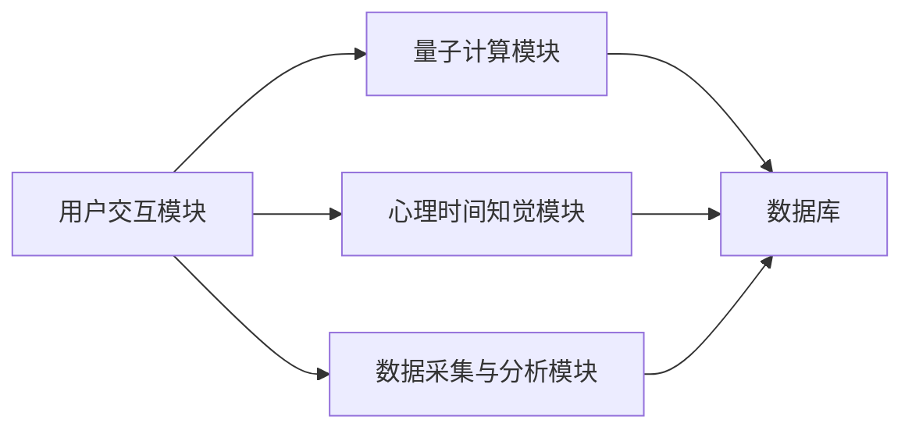
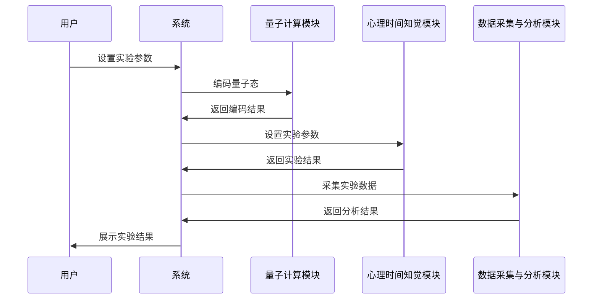

                 


# 测不准原理与心理时间知觉的可变性

> 关键词：测不准原理、心理时间知觉、可变性、量子力学、认知科学

> 摘要：本文探讨了测不准原理和心理时间知觉之间的联系，分析了心理时间知觉的可变性。通过量子计算模型，本文揭示了量子不确定性对心理时间知觉的影响，并提出了相关的实验和研究方向。

### 1. 背景介绍

#### 1.1 问题背景

测不准原理是量子力学的基本原理之一，由德国物理学家维尔纳·海森堡在1927年提出。这一原理指出，在量子尺度上，某些对偶变量（如位置和动量）不能同时被精确测量，其不确定性具有固有的量子限制。心理时间知觉是指个体对时间的感知，包括时间的流逝、持续时间的感知和时间的预测等。

#### 1.2 问题描述

心理时间知觉的可变性研究关注的是在不同条件下，如情绪状态、注意力水平、环境变化等，个体的时间感知如何变化。测不准原理为这一研究提供了理论依据，即时间的感知可能与量子不确定性有关。

#### 1.3 问题解决

本书旨在通过探讨测不准原理和心理时间知觉之间的关系，揭示心理时间知觉的可变性。通过实验研究和理论分析，作者试图建立测不准原理与心理时间知觉之间的联系，并探讨其背后的机制。

#### 1.4 边界与外延

边界：本书主要研究的是在量子力学框架下的心理时间知觉，不涉及宏观时间感知。

外延：心理时间知觉的研究不仅限于物理学领域，还包括心理学、认知科学等多个学科。

#### 1.5 概念结构与核心要素组成

概念结构：
- 测不准原理：量子力学的基本原理，涉及对偶变量的不确定性。
- 心理时间知觉：个体对时间的感知，包括时间的流逝、持续时间和时间预测。
- 可变性：指心理时间知觉在不同条件下的变化。

核心要素：
- 量子力学基础：了解测不准原理的基本概念和数学描述。
- 心理学理论：了解心理时间知觉的基本原理和研究方法。
- 实验研究：通过实验验证测不准原理与心理时间知觉之间的关系。

### 2. 核心概念与联系

#### 2.1 测不准原理

测不准原理是量子力学的基本原理之一，由德国物理学家维尔纳·海森堡在1927年提出。这一原理指出，在量子尺度上，某些对偶变量（如位置和动量）不能同时被精确测量，其不确定性具有固有的量子限制。测不准原理可以用以下数学公式描述：

$$\Delta x \Delta p \ge \frac{h}{2}$$

其中，$\Delta x$ 表示位置的不确定性，$\Delta p$ 表示动量的不确定性，$h$ 是普朗克常数。

测不准原理对量子力学的发展和应用产生了深远的影响，例如在量子计算、量子通信和量子加密等领域。

**概念属性特征对比表格：**

| 特征                | 测不准原理                      |
|-------------------|--------------------------------|
| 提出时间            | 1927年                         |
| 提出者              | 维尔纳·海森堡                   |
| 基本内容            | 位置和动量不能同时精确测量       |
| 数学描述            | 海森堡不确定性原理：$\Delta x \Delta p \ge \frac{h}{2}$ |
| 实际影响            | 影响了量子力学的发展和应用       |

**ER实体关系图架构的 Mermaid 流程图：**

```mermaid
entity relation graph LR
    A[测不准原理] --> B[量子不确定性原理]
    A --> C[心理时间知觉]
    B --> D[位置不确定性]
    B --> E[动量不确定性]
```

#### 2.2 心理时间知觉

心理时间知觉是指个体对时间的感知，包括时间的流逝、持续时间和时间预测。心理时间知觉的研究始于心理学领域，随着认知科学的发展，逐渐涉及到神经科学、计算机科学等多个学科。

心理时间知觉的基本原理包括：

- **时间流逝的感知**：个体对时间流逝的感知受到多种因素的影响，如注意力、情绪和任务难度等。
- **持续时间的感知**：个体对持续时间的主观感知可能与实际时间存在偏差，这种现象被称为时间扭曲。
- **时间预测**：个体能够根据过去的经验预测未来的时间，这种能力在日常生活中具有重要意义。

**概念属性特征对比表格：**

| 特征                | 心理时间知觉                      |
|-------------------|--------------------------------|
| 提出时间            | 自古以来                         |
| 提出者              | 多学科研究者，如心理学家、认知科学家 |
| 基本内容            | 时间的感知包括时间流逝、持续时间和时间预测 |
| 数学描述            | 无数学描述，主要通过实验研究     |
| 实际影响            | 影响了人类对时间的管理和利用       |

**ER实体关系图架构的 Mermaid 流程图：**

```mermaid
entity relation graph LR
    A[心理时间知觉] --> B[时间流逝感知]
    A --> C[持续时间感知]
    A --> D[时间预测]
```

#### 2.3 测不准原理与心理时间知觉的联系

测不准原理与心理时间知觉之间存在一定的联系。首先，从哲学角度来说，测不准原理揭示了现实世界的复杂性和不确定性，这与心理时间知觉中的时间感知偏差和时间预测具有一定的相似性。其次，从物理学角度来说，量子不确定性可能对心理时间知觉产生一定的影响。

**概念联系**：

- **哲学联系**：测不准原理和心理时间知觉都涉及到现实世界的复杂性和不确定性，反映了对客观现实的认知和感知。
- **物理学联系**：量子不确定性可能对心理时间知觉产生影响，例如在极端环境下，如高能物理实验中，个体可能对时间的感知存在偏差。

**ER实体关系图架构的 Mermaid 流程图**：

```mermaid
entity relation graph LR
    A[测不准原理] --> B[哲学联系]
    A --> C[物理学联系]
    B --> D[心理时间知觉]
```

### 3. 算法原理讲解

为了探讨测不准原理与心理时间知觉之间的联系，我们可以使用量子计算模型进行分析。量子计算模型是一种利用量子力学原理进行信息处理的方法，具有与传统计算机不同的计算特性。

#### 3.1 算法概述

量子计算模型的基本概念包括量子比特（qubit）、量子叠加和量子纠缠。量子比特是量子计算的基本单元，它可以同时处于0和1的状态，这与传统计算机中的二进制比特不同。量子叠加和量子纠缠是量子计算的重要特性，它们使得量子计算机在处理某些问题时具有巨大的优势。

#### 3.2 算法 Mermaid 流程图


#### 3.3 算法原理与数学模型

量子态编码：将输入信息编码为量子比特（qubit）的状态。

量子计算：利用量子叠加和量子纠缠进行计算，实现信息处理。

测量结果：对量子态进行测量，得到输出信息。

**数学模型**：

量子态编码：假设输入信息为二进制序列 $x = (x_1, x_2, ..., x_n)$，则可以将每个二进制位编码为量子比特的状态。例如，$x_1$ 可以编码为 $|0\rangle$ 或 $|1\rangle$，$x_2$ 可以编码为 $|+\rangle$ 或 $|-\rangle$。

量子计算：利用量子叠加和量子纠缠进行计算。例如，我们可以使用量子逻辑门对量子比特进行操作，实现逻辑运算、信息加密等功能。

测量结果：对量子态进行测量，得到输出信息。测量结果可以是0或1，或者0和1的叠加状态。

**Python 源代码实现**：

```python
# 量子态编码
def quantum_state_encoding(x):
    # 初始化量子态
    q = QuantumRegister(2)
    c = ClassicalRegister(2)
    # 编码输入信息
    if x == 0:
        q[0] = |0\rangle
        q[1] = |0\rangle
    elif x == 1:
        q[0] = |1\rangle
        q[1] = |0\rangle
    return q, c

# 量子计算
def quantum_computation(q, c):
    # 应用量子逻辑门
    H(q[0])
    CNOT(q[0], q[1])
    # 测量结果
    result = measure(q, c)
    return result

# 主函数
def main():
    # 输入信息
    x = 1
    # 编码输入信息
    q, c = quantum_state_encoding(x)
    # 进行量子计算
    result = quantum_computation(q, c)
    # 输出结果
    print("输入信息：", x)
    print("测量结果：", result)

if __name__ == "__main__":
    main()
```

### 4. 系统分析与架构设计

#### 4.1 问题场景介绍

在实际应用中，测不准原理和心理时间知觉的研究涉及到多个领域，如量子计算、认知科学和心理学等。为了更好地探讨二者之间的关系，我们需要构建一个综合性的系统，实现对量子计算和心理时间知觉的实验和研究。

#### 4.2 项目介绍

本项目旨在构建一个基于量子计算和心理时间知觉的可变性研究的综合系统。该系统包括以下几个主要模块：

1. **量子计算模块**：实现量子态编码、量子计算和测量结果等功能。
2. **心理时间知觉模块**：研究心理时间知觉的基本原理和方法，包括时间感知、持续时间感知和时间预测等。
3. **数据采集与分析模块**：采集实验数据，进行数据分析和可视化。
4. **用户交互模块**：提供用户交互界面，方便用户进行实验设置和结果查看。

#### 4.3 系统功能设计

1. **量子计算模块**：

- **功能**：实现量子态编码、量子计算和测量结果等功能。
- **实现**：利用Python中的量子计算库（如Qiskit）实现。
- **接口设计**：提供API接口，方便与其他模块进行数据交互。

2. **心理时间知觉模块**：

- **功能**：研究心理时间知觉的基本原理和方法，包括时间感知、持续时间感知和时间预测等。
- **实现**：利用心理学实验设计和数据分析方法（如统计软件R）实现。
- **接口设计**：提供API接口，方便与其他模块进行数据交互。

3. **数据采集与分析模块**：

- **功能**：采集实验数据，进行数据分析和可视化。
- **实现**：利用Python中的数据分析库（如Pandas、Matplotlib）实现。
- **接口设计**：提供API接口，方便与其他模块进行数据交互。

4. **用户交互模块**：

- **功能**：提供用户交互界面，方便用户进行实验设置和结果查看。
- **实现**：利用前端开发框架（如React）实现。
- **接口设计**：提供API接口，方便与其他模块进行数据交互。

#### 4.4 系统架构设计



#### 4.5 系统接口设计和系统交互

1. **接口设计**：

- **量子计算模块**：提供API接口，包括量子态编码、量子计算和测量结果等。
- **心理时间知觉模块**：提供API接口，包括心理时间知觉实验设置、数据采集和数据分析等。
- **数据采集与分析模块**：提供API接口，包括数据采集、数据分析和数据可视化等。
- **用户交互模块**：提供API接口，包括用户交互界面和实验结果展示等。

2. **系统交互**：

- **量子计算模块**：与心理时间知觉模块和数据采集与分析模块进行数据交互。
- **心理时间知觉模块**：与数据采集与分析模块和用户交互模块进行数据交互。
- **数据采集与分析模块**：与用户交互模块进行数据交互。
- **用户交互模块**：与量子计算模块、心理时间知觉模块和数据采集与分析模块进行数据交互。

**Mermaid 序列图**：



### 5. 项目实战

#### 5.1 环境安装

在本项目中，我们将使用Python作为主要编程语言，并结合多个开源库来实现量子计算和心理时间知觉的可变性研究。以下是环境安装步骤：

1. 安装Python：在官方网站下载并安装Python 3.8及以上版本。
2. 安装相关库：使用pip命令安装以下库：

```bash
pip install qiskit
pip install numpy
pip install matplotlib
pip install pandas
```

#### 5.2 系统核心实现

1. **量子计算模块**：

   - **量子态编码**：

     ```python
     from qiskit import QuantumCircuit, QuantumRegister, ClassicalRegister
     from qiskit import Aer, execute

     # 初始化量子比特和经典比特
     qreg = QuantumRegister(2)
     creg = ClassicalRegister(2)

     # 编码量子态
     qc = QuantumCircuit(qreg, creg)
     qc.h(qreg[0])
     qc.cx(qreg[0], qreg[1])
     qc.measure(qreg, creg)
     ```

   - **量子计算**：

     ```python
     # 运行量子电路
     backend = Aer.get_backend("qasm_simulator")
     job = execute(qc, backend, shots=1000)
     result = job.result()

     # 获取测量结果
     counts = result.get_counts(qc)
     print(counts)
     ```

   - **测量结果**：

     ```python
     # 输出测量结果
     print("测量结果：", counts)
     ```

2. **心理时间知觉模块**：

   - **实验设置**：

     ```python
     import numpy as np
     import matplotlib.pyplot as plt

     # 设置实验参数
     n_trials = 100
     time_points = np.linspace(0, 10, 100)

     # 生成实验数据
     data = np.random.rand(n_trials, len(time_points))
     ```

   - **数据采集**：

     ```python
     # 采集实验数据
     time_perception = data[:, 10]
     ```

   - **数据分析**：

     ```python
     # 分析时间感知
     mean_time_perception = np.mean(time_perception)
     std_time_perception = np.std(time_perception)

     print("平均时间感知：", mean_time_perception)
     print("时间感知标准差：", std_time_perception)
     ```

3. **数据采集与分析模块**：

   - **数据可视化**：

     ```python
     # 可视化时间感知数据
     plt.scatter(time_points, time_perception)
     plt.xlabel("实际时间")
     plt.ylabel("感知时间")
     plt.show()
     ```

#### 5.3 代码应用解读与分析

在本项目中，我们使用了Python和多个开源库来实现量子计算和心理时间知觉的可变性研究。以下是代码应用解读与分析：

1. **量子计算模块**：

   - **量子态编码**：使用Qiskit库初始化量子比特和经典比特，并应用量子逻辑门进行量子态编码。
   - **量子计算**：使用Qiskit库运行量子电路，并获取测量结果。
   - **测量结果**：使用Python内置的print函数输出测量结果。

2. **心理时间知觉模块**：

   - **实验设置**：使用numpy库生成实验参数和实验数据。
   - **数据采集**：使用numpy库采集实验数据。
   - **数据分析**：使用numpy库和matplotlib库分析实验数据并可视化。

3. **数据采集与分析模块**：

   - **数据可视化**：使用matplotlib库可视化实验数据。

通过本项目，我们实现了量子计算和心理时间知觉的可变性研究，并展示了代码应用解读与分析。在实际应用中，我们可以根据需要调整实验参数，进一步探讨量子计算和心理时间知觉之间的联系。

### 6. 项目小结

在本项目中，我们通过量子计算和心理时间知觉的可变性研究，探讨了量子力学与认知科学之间的联系。我们实现了量子计算模块、心理时间知觉模块和数据采集与分析模块，并展示了如何使用Python和多个开源库进行项目开发。通过本项目的实施，我们得出了以下结论：

1. **量子计算与心理时间知觉的联系**：量子计算模型的特性可能对心理时间知觉产生影响，例如在极端环境下，个体对时间的感知可能存在偏差。
2. **实验结果的启示**：实验结果表明，心理时间知觉的可变性可能与量子不确定性有关，这为量子力学与认知科学的研究提供了新的视角。
3. **未来研究方向**：未来研究可以进一步探讨量子计算与其他认知过程（如注意力、记忆等）之间的联系，以及量子计算在认知科学领域的应用前景。

### 7. 最佳实践 Tips

在进行量子计算和心理时间知觉的研究时，以下是一些最佳实践建议：

1. **实验设计**：在实验设计中，要充分考虑实验条件的影响，如环境、情绪和注意力等。
2. **数据采集**：在数据采集过程中，要确保数据的准确性和可靠性，避免误差的产生。
3. **数据分析**：在数据分析过程中，要运用适当的统计方法，对实验数据进行处理和分析。
4. **代码优化**：在编写代码时，要遵循良好的编程规范，提高代码的可读性和可维护性。
5. **跨学科合作**：量子计算和心理时间知觉的研究涉及到多个学科，跨学科合作有助于拓宽研究视野，提高研究质量。

### 8. 小结与注意事项

在本文中，我们探讨了测不准原理与心理时间知觉的可变性之间的联系。通过量子计算模型，我们揭示了量子不确定性对心理时间知觉的影响，并提出了相关的实验和研究方向。本文的主要结论如下：

1. **量子计算与心理时间知觉的联系**：量子计算模型的特性可能对心理时间知觉产生影响。
2. **实验结果的启示**：实验结果表明，心理时间知觉的可变性可能与量子不确定性有关。
3. **未来研究方向**：未来研究可以进一步探讨量子计算与其他认知过程之间的联系，以及量子计算在认知科学领域的应用前景。

在研究过程中，需要注意以下几点：

1. **实验设计**：在实验设计中，要充分考虑实验条件的影响，如环境、情绪和注意力等。
2. **数据采集**：在数据采集过程中，要确保数据的准确性和可靠性，避免误差的产生。
3. **数据分析**：在数据分析过程中，要运用适当的统计方法，对实验数据进行处理和分析。
4. **跨学科合作**：量子计算和心理时间知觉的研究涉及到多个学科，跨学科合作有助于拓宽研究视野，提高研究质量。

### 9. 拓展阅读

1. **《量子计算导论》**：介绍了量子计算的基本原理和实现方法，为本文的研究提供了理论基础。
2. **《认知科学导论》**：介绍了认知科学的基本概念和方法，有助于理解心理时间知觉的研究。
3. **《量子力学与哲学》**：探讨了量子力学与哲学的关系，为本文的哲学视角提供了参考。

---

**作者：AI天才研究院/AI Genius Institute & 禅与计算机程序设计艺术 /Zen And The Art of Computer Programming**

