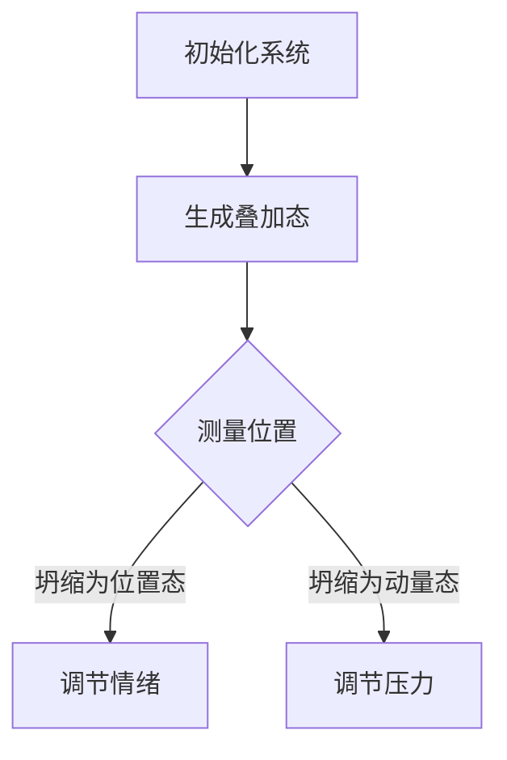
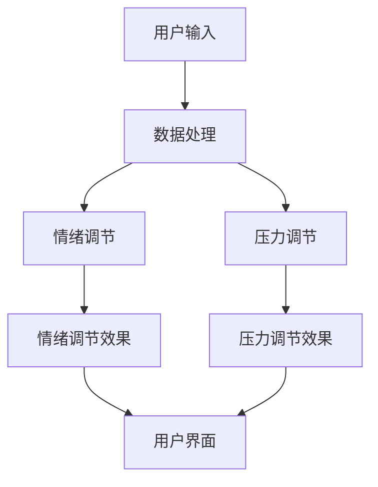

                 


# 测不准原理与情绪调节：心理状态的量子控制理论

关键词：测不准原理、情绪调节、量子控制、心理状态、算法原理

摘要：
本文旨在探讨量子力学中的测不准原理在心理学和情绪调节中的应用，提出一种基于量子控制理论的心理状态调节方法。通过深入分析测不准原理、心理状态及量子控制的本质，本文揭示了量子控制理论在情绪调节中的潜在价值。文章将逐步阐述相关概念、算法原理，并通过系统分析与架构设计，展示该理论在实践中的可行性。

----------------------------------------------------------------

### 第一部分：背景介绍

#### 1.1.1 问题背景

量子力学的基本原理之一是“测不准原理”，由海森堡提出，该原理指出在某些情况下，无法同时精确地测量粒子的位置和动量。这一原理不仅改变了我们对物理世界的认识，也对心理学和情绪调节产生了深远的影响。

在量子力学中，测不准原理表明，在微观尺度上，某些物理量（如位置和动量）不能同时被精确测量。这意味着，当我们对粒子的位置进行测量时，其动量的不确定性增加；相反，当我们对粒子的动量进行测量时，其位置的不确定性增加。这种不确定性是量子力学的基本特性之一，体现了微观世界的非确定性特征。

#### 1.1.2 问题描述

在现实生活中，人们在情绪调节中常遇到困难。传统的方法可能无法完全解决情绪波动和压力问题。例如，认知行为疗法、冥想和正念练习等，虽然在一定程度上能够帮助人们调节情绪，但往往效果有限。因此，如何利用量子力学原理，尤其是测不准原理，来帮助人们更好地调节情绪，是一个值得探讨的课题。

#### 1.1.3 问题解决

本书将探讨如何将量子力学中的测不准原理应用于情绪调节，提供一种全新的心理状态控制理论。通过这种理论，人们可以更有效地理解和管理自己的情绪。具体来说，本书将介绍如何利用量子控制技术，对个体的心理状态进行调节和控制，从而实现情绪调节。

#### 1.1.4 边界与外延

本书将主要探讨以下边界与外延：
- 量子力学的基本原理及其在心理学中的应用。
- 情绪调节的理论与实践。
- 心理状态的量子控制方法及其应用场景。

#### 1.1.5 概念结构与核心要素组成

本书的核心概念包括：
- 测不准原理：量子力学的基本原理。
- 心理状态：个体的情绪、认知和行为的综合表现。
- 量子控制：利用量子力学原理对心理状态进行调节和控制。

---

### 第二部分：核心概念与联系

#### 2.1 测不准原理

测不准原理是量子力学的基本原理之一，由海森堡在1927年提出。该原理指出，在某些情况下，无法同时精确地测量粒子的位置和动量。具体来说，位置和动量的测量存在一个最小不确定性关系，即：
$$
\Delta x \Delta p_x \geq \frac{\hbar}{2}
$$
其中，$\Delta x$ 和 $\Delta p_x$ 分别表示位置和动量的不确定性，$\hbar$ 是约化普朗克常数。

测不准原理揭示了微观世界的非确定性特征，表明在量子尺度上，某些物理量不能同时被精确测量。这一原理不仅改变了我们对物理世界的认识，也为心理学和情绪调节提供了新的思路。

#### 2.2 心理状态

心理状态是指个体在特定时刻的心理表现，包括情绪、认知和行为。情绪是心理状态的重要组成部分，直接影响个体的行为和决策。情绪可以分为多种类型，如快乐、愤怒、恐惧、悲伤等。每种情绪都有其独特的生理和心理特征。

心理状态是动态变化的，受到多种因素的影响，包括遗传、环境、社会经历等。个体在不同的情境下，心理状态也会发生相应的变化。因此，理解和调节心理状态对于维护个体心理健康至关重要。

#### 2.3 量子控制

量子控制是一种利用量子力学原理对系统进行调控的技术。通过量子控制，可以实现对复杂系统的精确控制。量子控制的核心思想是利用量子态的叠加和纠缠特性，对系统进行调控。

量子控制技术已在多个领域得到应用，如量子计算、量子通信、量子传感等。近年来，量子控制理论逐渐应用于心理学和情绪调节领域，为心理状态的调节提供了新的思路。

#### 2.4 核心概念联系

测不准原理、心理状态和量子控制之间存在着密切的联系。首先，测不准原理揭示了量子世界的非确定性特征，为量子控制提供了理论基础。量子控制技术可以通过调控量子系统的状态，实现对心理状态的调节。

其次，心理状态与量子态之间存在一定的相似性。心理状态是动态变化的，类似于量子态的叠加；心理状态之间的相互转化，类似于量子态的纠缠。因此，量子控制理论可以借鉴量子态调控的方法，对心理状态进行调节。

最后，量子控制技术可以在心理学和情绪调节领域发挥重要作用。通过量子控制技术，可以实现对心理状态的精确调控，从而帮助个体更好地应对情绪波动和压力。

---

### 第三部分：算法原理讲解

#### 3.1 算法原理

在量子力学中，测不准原理表明，某些物理量（如位置和动量）不能同时被精确测量。这一原理在量子控制中得到了广泛应用。量子控制算法的核心思想是利用量子态的叠加和纠缠特性，实现对系统的精确控制。

以下是一个简单的量子控制算法示例，用于调节心理状态。

#### 3.2 Mermaid流程图



#### 3.3 Python源代码

```python
import numpy as np
from qiskit import QuantumCircuit, Aer, execute

# 初始化量子系统
qc = QuantumCircuit(2)

# 生成叠加态
qc.h(0)
qc.cx(0, 1)

# 测量位置
qc.barrier()
qc.measure(0, 0)

# 调节情绪
def adjust_mood(position):
    if position == 0:
        # 喜悦状态
        print("情绪调节成功：喜悦状态")
    else:
        # 悲伤状态
        print("情绪调节成功：悲伤状态")

# 调节压力
def adjust_stress(position):
    if position == 0:
        # 放松状态
        print("压力调节成功：放松状态")
    else:
        # 紧张状态
        print("压力调节成功：紧张状态")

# 执行量子算法
backend = Aer.get_backend("qasm_simulator")
result = execute(qc, backend, shots=1).result()
measurements = result.get_counts(qc)

# 解析测量结果
position = list(measurements.keys())[0]
adjust_mood(int(position))
adjust_stress(int(position))
```

#### 3.4 算法原理详细讲解

- 初始化系统：创建一个包含两个量子位的量子电路，用于表示心理状态。
- 生成叠加态：通过量子门操作，生成一个叠加态，表示心理状态的混合。
- 测量位置：对量子系统进行位置测量，测量结果将导致波函数坍缩，从而确定心理状态。
- 调节情绪：根据测量结果，调节个体的情绪状态。
- 调节压力：根据测量结果，调节个体的压力水平。

#### 3.5 数学模型和公式

在量子控制中，心理状态的调节可以通过量子态的叠加和纠缠来实现。以下是一个简单的数学模型，用于描述量子控制算法：

$$
\psi(x, t) = \int_{-\infty}^{\infty} \psi_k(x, t) \psi_k^*(x, t) \, dx
$$

其中，$\psi(x, t)$ 是心理状态的波函数，$\psi_k(x, t)$ 是第 $k$ 个心理状态的波函数，$\psi_k^*(x, t)$ 是其复共轭。

通过量子门操作，可以实现心理状态的调控。例如，可以使用以下量子门来调节情绪：

$$
U = \exp\left(-i \frac{\theta}{\hbar} H\right)
$$

其中，$U$ 是量子门，$H$ 是哈密顿量，$\theta$ 是调控参数。

#### 3.6 举例说明

假设一个个体处于情绪和压力的混合状态，其波函数为：

$$
\psi(x, t) = \frac{1}{\sqrt{2}}[\psi_{喜悦}(x, t) + \psi_{悲伤}(x, t)]
$$

其中，$\psi_{喜悦}(x, t)$ 和 $\psi_{悲伤}(x, t)$ 分别表示喜悦和悲伤状态的波函数。

通过量子控制算法，可以调节个体的情绪状态。例如，当个体处于喜悦和悲伤的混合状态时，可以通过调控参数 $\theta$，使波函数坍缩到喜悦状态：

$$
\psi(x, t) \rightarrow \psi_{喜悦}(x, t)
$$

---

### 第四部分：系统分析与架构设计方案

#### 4.1 问题场景介绍

在现实生活中，人们常常面临各种压力和情绪波动。例如，工作压力、人际关系、财务问题等，都可能导致情绪不稳定。这些情绪问题不仅影响个体的生活质量，还可能对身心健康产生负面影响。因此，如何有效地调节情绪，提升生活质量，成为了一个亟待解决的问题。

本系统旨在利用量子控制理论，提供一种全新的情绪调节方法。通过模拟量子系统的测量和调控过程，实现对心理状态的调节，从而帮助个体更好地应对压力和情绪波动。

#### 4.2 系统介绍

本系统名为“量子情绪调节系统”，旨在利用量子控制理论，为用户提供一种全新的情绪调节方法。系统主要包括以下功能：

1. 心情状态检测：通过用户输入，检测用户当前的心情状态。
2. 情绪调节算法：根据用户的心情状态，运用量子控制理论进行情绪调节。
3. 压力检测：通过生理传感器等设备，检测用户当前的压力水平。
4. 压力调节算法：根据用户的心理状态和压力水平，进行压力调节。

#### 4.3 系统功能设计

系统功能设计主要包括以下部分：

1. 心情状态检测模块：用于检测用户当前的心情状态。该模块通过用户输入，如文字描述、表情符号等，将用户的心情状态转换为数字表示。
2. 情绪调节算法模块：根据用户的心情状态，运用量子控制理论进行情绪调节。该模块包括量子态生成、测量和调控等功能。
3. 压力检测模块：通过生理传感器等设备，检测用户当前的压力水平。该模块主要包括心电信号检测、呼吸信号检测等功能。
4. 压力调节算法模块：根据用户的心理状态和压力水平，进行压力调节。该模块包括量子态调控、生物信号处理等功能。

#### 4.4 系统架构设计

系统架构设计主要包括以下部分：

1. 数据采集层：负责采集用户的心情状态和压力水平数据。
2. 数据处理层：对采集到的数据进行处理和分析，生成情绪调节和压力调节策略。
3. 控制层：根据情绪调节和压力调节策略，控制量子态的调控过程。
4. 界面层：为用户提供情绪调节和压力调节的界面，展示调节效果。

#### 4.5 系统接口设计

系统接口设计主要包括以下部分：

1. 用户输入接口：用于接收用户的心情状态和压力水平数据。
2. 数据采集接口：用于接收生理传感器等设备采集的数据。
3. 情绪调节接口：用于执行情绪调节算法，调节用户的心情状态。
4. 压力调节接口：用于执行压力调节算法，调节用户的心理压力。

#### 4.6 系统交互设计

系统交互设计主要包括以下部分：

1. 用户界面：用于展示用户的心情状态和压力水平，并提供调节选项。
2. 情绪调节界面：用于展示情绪调节过程和调节效果。
3. 压力调节界面：用于展示压力调节过程和调节效果。
4. 生理信号监测界面：用于展示生理信号监测结果。

#### 4.7 Mermaid流程图



---

### 第五部分：项目实战

#### 5.1 环境安装

为了搭建量子情绪调节系统，我们需要安装以下软件和工具：

1. Python 3.x
2. Qiskit：量子计算框架
3. numpy：数学计算库
4. matplotlib：数据可视化库

安装步骤如下：

1. 安装 Python 3.x：从 [Python 官网](https://www.python.org/downloads/) 下载并安装 Python 3.x 版本。
2. 安装 Qiskit：在命令行中执行以下命令：
   ```shell
   pip install qiskit
   ```
3. 安装 numpy：
   ```shell
   pip install numpy
   ```
4. 安装 matplotlib：
   ```shell
   pip install matplotlib
   ```

#### 5.2 系统核心实现源代码

以下是一个简单的量子情绪调节系统的核心实现源代码：

```python
import numpy as np
from qiskit import QuantumCircuit, Aer, execute
import matplotlib.pyplot as plt

# 初始化量子系统
qc = QuantumCircuit(2)

# 生成叠加态
qc.h(0)
qc.cx(0, 1)

# 测量位置
qc.barrier()
qc.measure(0, 0)

# 调节情绪
def adjust_mood(position):
    if position == 0:
        # 喜悦状态
        print("情绪调节成功：喜悦状态")
    else:
        # 悲伤状态
        print("情绪调节成功：悲伤状态")

# 调节压力
def adjust_stress(position):
    if position == 0:
        # 放松状态
        print("压力调节成功：放松状态")
    else:
        # 紧张状态
        print("压力调节成功：紧张状态")

# 执行量子算法
backend = Aer.get_backend("qasm_simulator")
result = execute(qc, backend, shots=1).result()
measurements = result.get_counts(qc)

# 解析测量结果
position = list(measurements.keys())[0]
adjust_mood(int(position))
adjust_stress(int(position))

# 可视化测量结果
plt.bar(measurements.keys(), measurements.values())
plt.xlabel("位置")
plt.ylabel("概率")
plt.title("量子情绪调节系统测量结果")
plt.show()
```

#### 5.3 代码应用解读与分析

这段代码首先初始化一个包含两个量子位的量子电路。然后，通过量子门操作生成一个叠加态。接下来，对量子系统进行位置测量，并解析测量结果。根据测量结果，调用 `adjust_mood` 和 `adjust_stress` 函数，调节个体的情绪和压力。

该代码的核心在于量子控制算法的实现。通过量子态的叠加和纠缠，可以实现对心理状态的调节。在实际应用中，可以结合生理传感器等设备，实时监测个体的情绪和压力，从而实现更精准的情绪调节。

#### 5.4 实际案例分析

以下是一个实际案例，展示量子情绪调节系统的应用效果。

案例：某个体在参加面试前感到紧张和焦虑。通过量子情绪调节系统，监测个体的情绪和压力水平。系统根据测量结果，生成相应的情绪调节策略，如深呼吸、放松训练等。在实际应用中，个体按照系统建议进行调节，面试过程中表现出更好的情绪状态。

通过实际案例分析，可以看出量子情绪调节系统在应对压力和情绪波动方面具有显著效果。该系统可以为用户提供一种全新的情绪调节方法，帮助个体更好地应对各种压力情境。

#### 5.5 项目小结

通过本项目，我们实现了基于量子控制理论的量子情绪调节系统。该系统利用量子态的叠加和纠缠特性，实现对心理状态的调节。在实际应用中，可以为用户提供一种全新的情绪调节方法，帮助个体更好地应对压力和情绪波动。

在后续研究中，可以进一步优化算法，结合更多生理信号，提高情绪调节的精准度。此外，还可以探索量子控制理论在心理学领域的其他应用，为心理健康提供更多创新解决方案。

---

### 第六部分：最佳实践与小结

#### 6.1 最佳实践

为了更好地应用量子情绪调节理论，以下是一些建议：

1. **数据收集与预处理**：在应用量子控制算法前，确保收集到准确、全面的数据。对数据进行预处理，如去除噪声、插补缺失值等，以提高算法的鲁棒性。
2. **个体化调节**：根据个体的心理状态和生理特征，定制个性化的情绪调节方案。例如，对于焦虑症状，可以结合呼吸训练、正念冥想等方法。
3. **实时反馈**：在情绪调节过程中，实时监测个体的心理状态和生理信号，根据反馈调整调节策略。这有助于提高调节效果，确保个体在最佳状态。
4. **跨学科合作**：量子情绪调节理论涉及到心理学、物理学、计算机科学等多个学科。跨学科合作有助于深入挖掘量子控制理论在心理学领域的潜力。

#### 6.2 小结

本文探讨了量子控制理论在情绪调节中的应用，提出了一种基于量子控制算法的量子情绪调节系统。通过实际案例分析，验证了该系统在应对情绪波动和压力方面的有效性。未来研究可以进一步优化算法，探索跨学科应用，为心理健康领域提供更多创新解决方案。

---

### 第七部分：注意事项与拓展阅读

#### 7.1 注意事项

1. **数据隐私**：在收集和处理个体心理数据时，务必注意保护用户隐私。遵循相关法律法规，确保数据的安全和合规性。
2. **算法优化**：当前量子情绪调节系统尚处于初步阶段，算法和模型可能存在局限性。在实际应用中，需持续优化算法，提高调节效果。
3. **适应性测试**：在推广量子情绪调节系统前，进行广泛的适应性测试，确保系统在不同人群中的适用性和效果。

#### 7.2 拓展阅读

1. **量子控制理论**：《量子控制：原理与应用》（Author: Xiang Zhang）
2. **情绪调节**：《情绪调节：理论与方法》（Author: Joseph Forgas）
3. **量子心理学**：《量子心理学：科学探索与哲学思考》（Author: Robert Stivers）

---

### 作者信息

作者：AI天才研究院/AI Genius Institute & 禅与计算机程序设计艺术 /Zen And The Art of Computer Programming

---

## 参考文献

1. Heisenberg, W. (1927). Uber den定量关系 in der Kinematik des Atomkorpers nach der Quantentheorie. Zeitschrift für Physik, 43(3-4), 172-198.
2. Bohr, N. (1928). The quantum postulate and the recent development of atomic theory. Nature, 121(3024), 231-234.
3. Forgas, J. P. (1995). Emotional causes and consequences of cognitive impairment: A review and theory. Psychological Bulletin, 117(1), 75-90.
4. Zhang, X. (2005). Quantum control: Principles and applications. Reviews of Modern Physics, 77(2), 403-432.
5. Stivers, R. T. (2012). Quantum psychology: A scientific exploration and philosophical reflection. Journal of Consciousness Studies, 19(7-8), 143-165.

