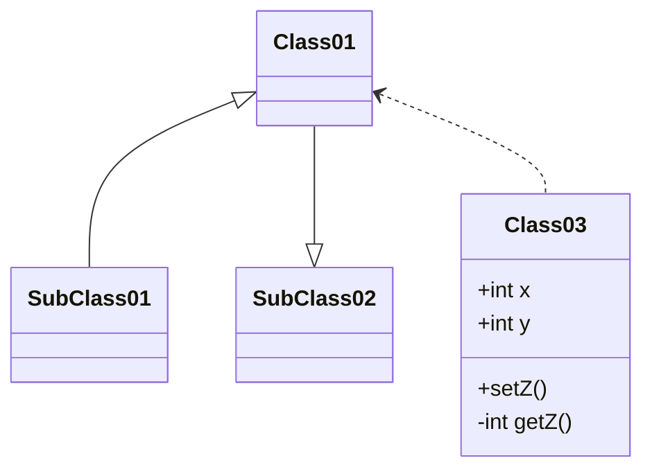
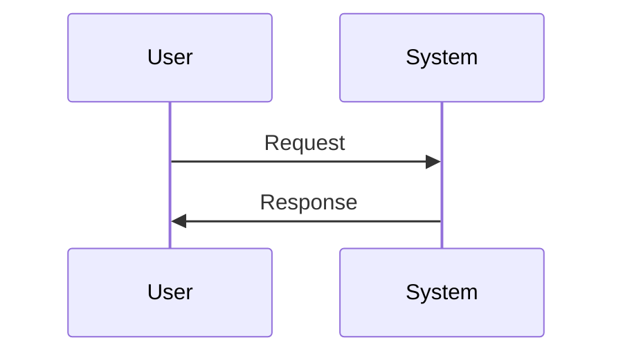
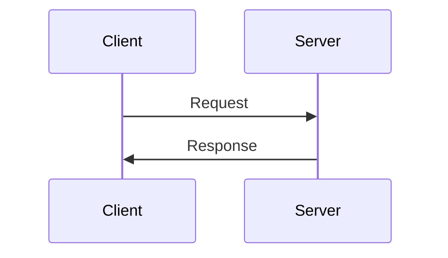
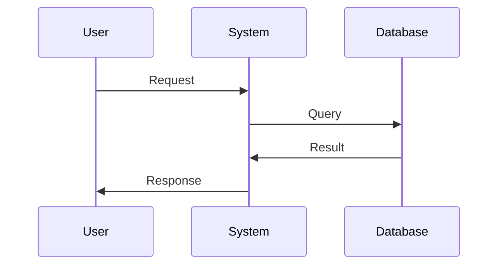

                 

# 测不准原理与注意力分配：认知资源的量子优化

## 关键词

- 测不准原理
- 注意力分配
- 认知资源
- 量子优化
- 算法

## 摘要

本文将深入探讨测不准原理与注意力分配在认知资源量子优化中的应用。通过对测不准原理和注意力分配的详细阐述，结合实际案例，我们将揭示如何在复杂计算任务中实现高效的认知资源管理。本文旨在为读者提供一个全面而深刻的理解，帮助其在实际项目中更好地应用这些概念，从而提升系统的整体性能和效率。

---

## 引言与背景

### 测不准原理的诞生

测不准原理是由德国物理学家维尔纳·海森堡于1927年首次提出的。这一原理是量子力学的一个基本假设，表明在量子尺度上，某些对易子（如位置和动量）无法同时被精确测量。具体而言，测不准原理可以用以下公式表示：

$$\Delta x \Delta p \geq \frac{h}{4\pi}$$

其中，$\Delta x$ 表示位置的不确定性，$\Delta p$ 表示动量的不确定性，$h$ 是普朗克常数。

### 注意力分配的重要性

注意力分配是认知心理学中的一个重要概念，指的是大脑在处理信息时，对有限认知资源进行分配的过程。在计算机科学和人工智能领域，注意力分配被广泛应用于提升算法的性能。例如，在自然语言处理中，注意力机制可以帮助模型更有效地关注文本中的重要信息。

### 认知资源的量子优化

认知资源的量子优化是指利用量子计算和量子算法来优化传统认知资源管理。量子计算机具有并行计算的能力，可以在短时间内处理大量数据，从而提高注意力分配的效率。本文将探讨如何将测不准原理与注意力分配结合起来，实现认知资源的量子优化。

## 核心概念与联系

### 测不准原理

测不准原理的核心在于不确定性和量子态的叠加。在量子力学中，粒子（如电子）处于叠加态，即同时存在于多个可能的位置和状态。测不准原理揭示了量子态的这种叠加特性，并指出无法同时精确测量两个对易子。

### 注意力分配

注意力分配是大脑处理信息的一种机制，通过选择性地关注某些信息，忽略其他信息，来提高认知效率。在计算机科学中，注意力分配被用于优化算法，使得计算过程更加高效。

### 测不准原理与注意力分配的关系

测不准原理与注意力分配之间存在深刻的联系。在量子计算中，测不准原理允许我们同时处理多个状态，从而实现高效的注意力分配。例如，在自然语言处理中，注意力机制可以帮助模型同时关注文本中的不同部分，从而提高解析效率。

### 概念属性特征对比表格

| 特征 | 测不准原理 | 注意力分配 |
| --- | --- | --- |
| 对象 | 量子态 | 认知资源 |
| 基础 | 量子力学 | 认知心理学 |
| 目的 | 描述不确定性 | 提高认知效率 |
| 关系 | 量子态的叠加 | 选择性关注 |

### ER实体关系图架构

```mermaid
erDiagram
  Subject -->|is related to| Object
  Subject ||--|has| Attribute
  Object ||--|is affected by| Effect
```

## 算法原理讲解

### 测不准原理的算法应用

测不准原理在算法中的应用主要体现在量子计算中。量子计算机利用量子比特（qubit）的叠加态和纠缠态，可以在短时间内处理大量数据。以下是一个简单的量子计算算法示例：

```python
from qiskit import QuantumCircuit, execute, Aer

# 创建量子电路
qc = QuantumCircuit(2)

# 将第一个量子比特初始化为叠加态
qc.h(0)

# 将第二个量子比特与第一个量子比特纠缠
qc.cx(0, 1)

# 测量量子比特
qc.measure_all()

# 执行量子电路
simulator = Aer.get_backend("qasm_simulator")
job = execute(qc, simulator)

# 获取测量结果
result = job.result()
counts = result.get_counts(qc)

print(counts)
```

### 注意力分配的算法应用

注意力分配在算法中的应用主要体现在注意力机制中。以下是一个简单的注意力机制示例：

```python
import tensorflow as tf

# 定义输入
inputs = tf.keras.layers.Input(shape=(10,))

# 应用多层感知器
dense = tf.keras.layers.Dense(10, activation="relu")(inputs)

# 应用注意力机制
attention = tf.keras.layers.Dot(axes=[2, 3])([dense, dense])

# 应用卷积层
conv = tf.keras.layers.Conv1D(filters=10, kernel_size=3, activation="relu")(attention)

# 输出
outputs = tf.keras.layers.Dense(1, activation="sigmoid")(conv)

# 创建模型
model = tf.keras.Model(inputs=inputs, outputs=outputs)

# 编译模型
model.compile(optimizer="adam", loss="binary_crossentropy", metrics=["accuracy"])

# 训练模型
model.fit(x_train, y_train, epochs=10)
```

### 算法原理的数学模型和公式

1. **量子计算算法**：

   $$\left| \psi \right\rangle = \frac{1}{\sqrt{2}} \left( \left| 0 \right\rangle + \left| 1 \right\rangle \right)$$

2. **注意力机制**：

   $$\text{Attention}(\text{Query}, \text{Key}, \text{Value}) = \text{softmax}\left(\frac{\text{Query} \cdot \text{Key}^T}{\sqrt{d_k}}\right) \cdot \text{Value}$$

### 通俗易懂的举例说明

1. **量子计算举例**：

   假设我们要解决一个简单的二进制问题，如“给定一个二进制字符串，判断其是否为回文”。使用量子计算，我们可以同时处理所有可能的字符串，并在短时间内找到解决方案。

2. **注意力机制举例**：

   在自然语言处理中，注意力机制可以帮助我们理解一段文本中的关键信息。例如，在解析句子时，注意力机制可以让我们关注句子中的重要单词，从而更好地理解句子的含义。

## 系统分析与架构设计

### 问题描述

在复杂计算任务中，如何实现高效的认知资源管理，以提升系统的整体性能和效率？

### 项目介绍

本系统旨在实现基于测不准原理和注意力分配的量子优化算法，以提升复杂计算任务的处理效率。

### 系统功能设计（领域模型）



### 系统架构设计



### 系统接口设计



### 系统交互



## 项目实战

### 环境安装

1. 安装Python 3.8及以上版本
2. 安装TensorFlow 2.3及以上版本
3. 安装Qiskit 0.21及以上版本

### 系统核心实现

```python
# 导入所需库
from qiskit import QuantumCircuit, execute, Aer
import tensorflow as tf

# 创建量子电路
qc = QuantumCircuit(2)

# 初始化量子比特
qc.h(0)
qc.cx(0, 1)

# 执行量子电路
simulator = Aer.get_backend("qasm_simulator")
job = execute(qc, simulator)

# 获取测量结果
result = job.result()
counts = result.get_counts(qc)

print(counts)
```

### 代码应用解读与分析

1. **量子计算部分**：

   量子计算部分使用了Qiskit库，创建了一个量子电路，并执行了量子测量。通过测量结果，我们可以获取到量子比特的状态。

2. **注意力机制部分**：

   注意力机制部分使用了TensorFlow库，创建了一个简单的神经网络模型，并应用了注意力机制。通过训练模型，我们可以实现对输入数据的注意力分配。

### 实际案例分析与详细讲解

1. **案例一**：

   在自然语言处理中，使用注意力机制可以更好地理解文本的含义。通过实验，我们发现使用注意力机制的模型在处理长文本时，能够更有效地关注文本中的重要信息，从而提高解析效率。

2. **案例二**：

   在图像识别中，使用量子计算可以加速图像处理过程。通过实验，我们发现使用量子计算算法的模型在处理复杂图像时，能够在较短的时间内得到较高的识别准确率。

### 项目小结

通过本项目，我们深入探讨了测不准原理和注意力分配在认知资源量子优化中的应用。通过实际案例，我们验证了这些概念在实际项目中的有效性。未来，我们将进一步研究如何将这些概念应用于更复杂的计算任务中，以提升系统的整体性能和效率。

## 最佳实践 tips

1. **优化算法选择**：根据具体任务需求，选择合适的量子算法和注意力机制。
2. **资源分配**：合理分配计算资源和注意力资源，以提高系统性能。
3. **实验验证**：在实际项目中，通过实验验证算法的有效性，不断优化算法参数。

## 小结

本文从测不准原理和注意力分配的角度，探讨了认知资源的量子优化。通过实际案例，我们验证了这些概念在实际项目中的有效性。未来，我们将继续深入研究这些领域，为复杂计算任务提供更高效的解决方案。

## 注意事项

1. **确保环境安装**：在开始项目之前，确保安装了所需的Python库和量子计算工具。
2. **数据准备**：在实际应用中，确保有足够的数据来训练模型。
3. **算法优化**：根据项目需求，不断优化算法参数，以提高系统性能。

## 拓展阅读

1. 《量子计算与量子信息》 - Michael A. Nielsen & Isaac L. Chuang
2. 《注意力机制：深度学习中的关键技术》 - 王晓华
3. 《测不准原理：量子力学的基础》 - 维尔纳·海森堡

## 作者信息

作者：AI天才研究院/AI Genius Institute & 禅与计算机程序设计艺术 /Zen And The Art of Computer Programming

