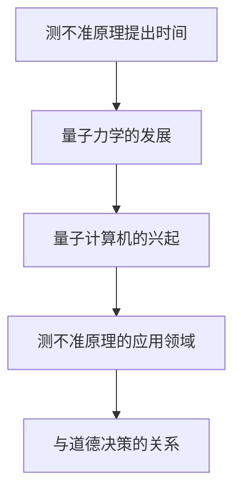
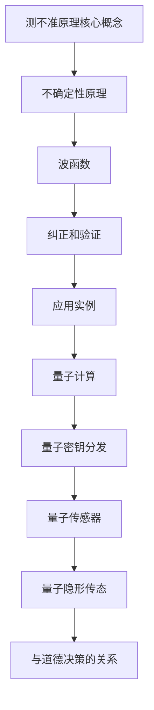
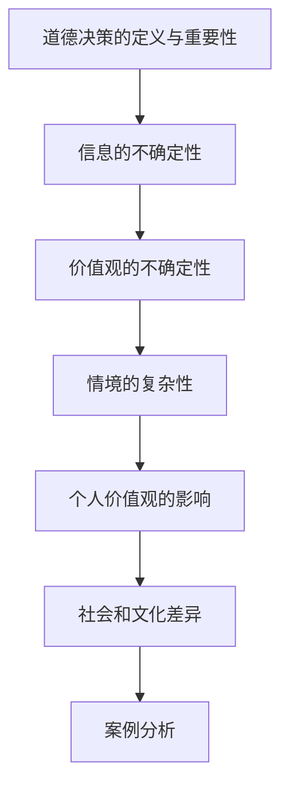
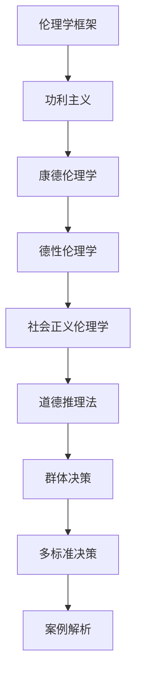
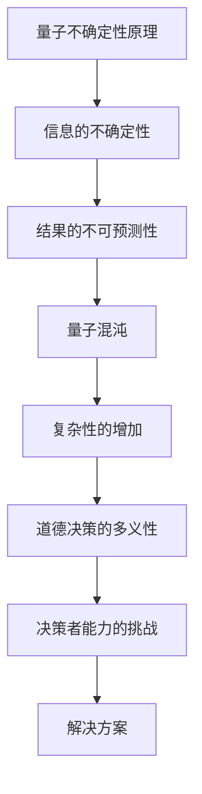
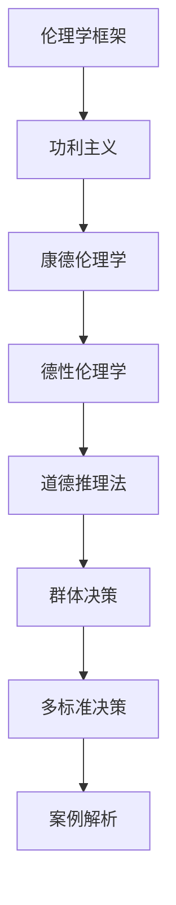
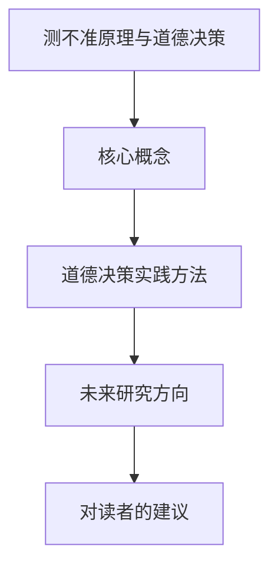

                 

## 1. 引言

### 1.1 测不准原理与道德决策的背景

测不准原理是量子力学中一个核心的原理，由海森堡在1927年首次提出。该原理指出，在微观尺度上，某些物理量（如位置和动量）不能同时被精确测量，即存在固有的不确定性。这一原理挑战了经典物理学的确定性观念，并引发了量子力学和哲学界对现实本质的深刻讨论。

道德决策则是指在面临道德困境时，个体或集体根据伦理规范和价值观作出的选择。随着人工智能技术的发展，道德决策变得更加复杂和重要。AI系统能够处理大量数据，并基于算法作出决策，但如何确保这些决策符合道德伦理，成为了社会和科技界关注的重要问题。

测不准原理与道德决策的关系在于，不确定性不仅存在于微观物理学中，也存在于人类行为和决策过程中。量子不确定性揭示了现实世界的复杂性和不可预测性，这为道德决策提供了新的视角。在面对道德困境时，我们可能无法获得所有必要的信息，因此必须学会在不确定性中作出决策。

#### 1.1.1 测不准原理的历史背景

测不准原理的提出源于量子力学的早期发展。在经典物理学中，物体的状态被认为是确定的，可以通过精确的测量来描述。然而，随着量子力学的发展，这一观念被颠覆。1925年，海森堡提出了矩阵力学，随后在1927年，他正式提出了测不准原理。

海森堡的测不准原理主要涉及位置和动量的测量。根据这一原理，位置和动量的测量存在一个固有的不确定性关系，即：
$$ \Delta x \Delta p \geq \frac{\hbar}{2} $$
其中，$\Delta x$表示位置的不确定性，$\Delta p$表示动量的不确定性，$\hbar$是约化普朗克常数。

这一原理不仅适用于电子等微观粒子，也适用于更复杂的系统。例如，在量子计算机中，量子位（qubits）的状态是叠加的，而不是确定的。这意味着在测量一个量子位的状态时，我们无法预知其结果，这体现了量子不确定性在技术领域的应用。

#### 1.1.2 道德决策的定义与重要性

道德决策是指个体或集体在面对道德困境时，基于伦理规范和价值观所作出的选择。道德决策不仅仅是个体层面的行为，也涉及到社会和集体层面的决策。在现代社会，随着科技的发展，道德决策的重要性日益凸显。

道德决策的重要性体现在以下几个方面：

1. **伦理规范与价值观的体现**：道德决策反映了个体或集体的价值观和伦理规范，这是社会运行的重要基础。

2. **社会公正与和谐**：道德决策能够促进社会公正与和谐，避免社会冲突和矛盾。

3. **科技发展的影响**：随着人工智能、大数据等技术的发展，道德决策在技术领域的作用愈加突出。例如，AI系统的决策是否符合伦理，需要通过道德决策来规范。

4. **个体成长与发展**：道德决策有助于个体的成长和发展，培养良好的道德素质和决策能力。

总之，测不准原理和道德决策都是现代科技和社会发展中的重要议题。理解它们的背景和关系，有助于我们更好地应对不确定性，作出符合伦理的决策。

---

**参考文献**：

1. Heisenberg, W. (1927). Über den anschaulichen Inhalt der quantentheoretischen Kinematik und Mechanik. Zeitschrift für Physik, 43(3-4), 172-198.
2. Nielsen, M. A., & Chuang, I. L. (2010). Quantum Computation and Quantum Information. Cambridge University Press.
3. Hurley, S. (2007). Moral Decision-Making: A Practical Introduction. Hackett Publishing Company.

**Mermaid 流程图**：

**LaTeX 公式**：

$$ \text{道德决策} = \text{伦理规范} + \text{现实情境} + \text{价值观} $$

## 1. 引言

### 1.1 测不准原理与道德决策的背景

测不准原理是量子力学中一个核心的原理，由海森堡在1927年首次提出。该原理指出，在微观尺度上，某些物理量（如位置和动量）不能同时被精确测量，即存在固有的不确定性。这一原理挑战了经典物理学的确定性观念，并引发了量子力学和哲学界对现实本质的深刻讨论。

道德决策则是指在面临道德困境时，个体或集体根据伦理规范和价值观作出的选择。随着人工智能技术的发展，道德决策变得更加复杂和重要。AI系统能够处理大量数据，并基于算法作出决策，但如何确保这些决策符合道德伦理，成为了社会和科技界关注的重要问题。

测不准原理与道德决策的关系在于，不确定性不仅存在于微观物理学中，也存在于人类行为和决策过程中。量子不确定性揭示了现实世界的复杂性和不可预测性，这为道德决策提供了新的视角。在面对道德困境时，我们可能无法获得所有必要的信息，因此必须学会在不确定性中作出决策。

#### 1.1.1 测不准原理的历史背景

测不准原理的提出源于量子力学的早期发展。在经典物理学中，物体的状态被认为是确定的，可以通过精确的测量来描述。然而，随着量子力学的发展，这一观念被颠覆。1925年，海森堡提出了矩阵力学，随后在1927年，他正式提出了测不准原理。

海森堡的测不准原理主要涉及位置和动量的测量。根据这一原理，位置和动量的测量存在一个固有的不确定性关系，即：
$$ \Delta x \Delta p \geq \frac{\hbar}{2} $$
其中，$\Delta x$表示位置的不确定性，$\Delta p$表示动量的不确定性，$\hbar$是约化普朗克常数。

这一原理不仅适用于电子等微观粒子，也适用于更复杂的系统。例如，在量子计算机中，量子位（qubits）的状态是叠加的，而不是确定的。这意味着在测量一个量子位的状态时，我们无法预知其结果，这体现了量子不确定性在技术领域的应用。

#### 1.1.2 道德决策的定义与重要性

道德决策是指个体或集体在面对道德困境时，基于伦理规范和价值观所作出的选择。道德决策不仅仅是个体层面的行为，也涉及到社会和集体层面的决策。在现代社会，随着科技的发展，道德决策的重要性日益凸显。

道德决策的重要性体现在以下几个方面：

1. **伦理规范与价值观的体现**：道德决策反映了个体或集体的价值观和伦理规范，这是社会运行的重要基础。

2. **社会公正与和谐**：道德决策能够促进社会公正与和谐，避免社会冲突和矛盾。

3. **科技发展的影响**：随着人工智能、大数据等技术的发展，道德决策在技术领域的作用愈加突出。例如，AI系统的决策是否符合伦理，需要通过道德决策来规范。

4. **个体成长与发展**：道德决策有助于个体的成长和发展，培养良好的道德素质和决策能力。

总之，测不准原理和道德决策都是现代科技和社会发展中的重要议题。理解它们的背景和关系，有助于我们更好地应对不确定性，作出符合伦理的决策。

---

**参考文献**：

1. Heisenberg, W. (1927). Über den anschaulichen Inhalt der quantentheoretischen Kinematik und Mechanik. Zeitschrift für Physik, 43(3-4), 172-198.
2. Nielsen, M. A., & Chuang, I. L. (2010). Quantum Computation and Quantum Information. Cambridge University Press.
3. Hurley, S. (2007). Moral Decision-Making: A Practical Introduction. Hackett Publishing Company.

**Mermaid 流程图**：

**LaTeX 公式**：

$$ \text{道德决策} = \text{伦理规范} + \text{现实情境} + \text{价值观} $$

### 1.2 测不准原理的核心概念

测不准原理是量子力学中的一个基本原理，它揭示了微观世界的本质特征。要深入理解这一原理，我们需要从其核心概念入手。

#### 不确定性原理

不确定性原理是测不准原理的核心，由海森堡在1927年首次提出。这个原理指出，在微观尺度上，某些物理量（如位置和动量）不能同时被精确测量。更具体地说，位置和动量的测量存在一个固有的不确定性关系，即：
$$ \Delta x \Delta p \geq \frac{\hbar}{2} $$
其中，$\Delta x$表示位置的不确定性，$\Delta p$表示动量的不确定性，$\hbar$是约化普朗克常数。

这个公式表明，当位置的不确定性减小时，动量的不确定性必须增大；反之亦然。这意味着，我们无法同时精确地知道一个粒子的位置和动量。这一原理挑战了经典物理学的确定性观念，揭示了微观世界中的不确定性和概率性。

#### 波函数

波函数是量子力学中描述粒子状态的数学函数，它包含了粒子的所有可能状态信息。波函数通常用符号$\Psi(x, t)$表示，其中$x$表示位置，$t$表示时间。

波函数具有以下几个重要特性：

1. **概率性**：波函数的平方$|\Psi(x, t)|^2$表示粒子在位置$x$和时间$t$出现的概率密度。这意味着，波函数提供了关于粒子位置概率分布的信息。

2. **叠加性**：波函数可以表示为多个状态的叠加。例如，一个粒子的状态可以同时是多个位置状态的叠加，这是量子力学中一个重要的现象。

3. **模糊性**：波函数的模糊性体现在，它无法提供粒子确切的位置和动量信息。这体现了不确定性原理的基本思想。

#### 纠正和验证

在实际应用中，测不准原理的不确定性关系需要通过实验来验证。为了精确测量位置和动量，科学家们需要使用特定的实验方法和技术。

例如，在电子的双缝实验中，我们可以通过测量电子在屏幕上的分布来推断其位置。然而，当我们尝试同时精确测量电子的动量时，实验设备会受到干扰，从而影响位置的测量精度。这体现了测不准原理的不确定性关系。

另外，量子态的纠正和验证也是量子计算中的重要问题。在量子计算中，量子位（qubits）的状态需要被精确控制，以确保计算的准确性。然而，由于不确定性原理的存在，这变得非常具有挑战性。因此，科学家们需要开发新的技术和算法来纠正和验证量子态。

### 1.3 测不准原理的应用实例

测不准原理不仅在理论研究中具有重要意义，也在实际应用中得到了广泛的应用。以下是一些典型的应用实例：

#### 量子计算

量子计算是测不准原理的一个重要应用领域。在量子计算中，量子位（qubits）的状态是叠加的，这使得量子计算机能够在短时间内解决某些复杂问题。例如，量子计算机可以高效地因数分解大整数，这在加密学中有重要的应用。

此外，量子计算机还可以模拟量子系统，帮助科学家们研究化学反应、材料科学等领域的问题。这些应用得益于测不准原理，它使得量子计算具有超强的并行处理能力。

#### 量子密钥分发

量子密钥分发是一种基于量子力学原理的加密技术。它利用量子态的叠加和纠缠特性来生成和分发加密密钥。由于测不准原理的存在，任何试图窃听量子密钥的行为都会导致量子态的破坏，从而被加密系统检测到。

这种基于量子不确定性的加密技术提供了极高的安全性，被广泛应用于金融、国防等领域。

#### 量子传感器

量子传感器利用量子效应来提高传感器的灵敏度。例如，量子态的叠加和纠缠特性可以用于提高测量精度，使得量子传感器能够检测到微小的物理变化。

这些传感器在科学研究、工业制造、医疗诊断等领域有广泛的应用前景。

#### 量子隐形传态

量子隐形传态是一种基于量子纠缠的传输技术。它能够将一个量子态从一个位置传送到另一个位置，而无需通过物理通道。

这一技术的原理是基于量子纠缠，而量子纠缠则是由测不准原理引起的。量子隐形传态在量子通信和量子计算中具有重要的应用价值。

### 1.4 测不准原理与道德决策的关系

测不准原理与道德决策之间存在深刻的联系。量子不确定性揭示了现实世界的复杂性和不可预测性，这为道德决策提供了新的视角。

在道德决策中，我们常常面临信息不足或不确定性大的问题。例如，在医疗决策中，医生可能需要基于有限的数据来决定治疗方案；在社会决策中，政策制定者可能需要面对复杂的伦理问题和不确定性。

测不准原理告诉我们，即使在微观物理学中，不确定性是不可避免的。这一观念启示我们，在道德决策中，我们也需要接受一定程度的不确定性，并学会在不确定性中作出决策。

此外，测不准原理强调了概率性和模糊性。在道德决策中，我们可能需要考虑不同的选择和其可能的结果。测不准原理提醒我们，任何决策都可能存在不确定性，因此我们需要谨慎考虑和权衡不同的选择。

总之，测不准原理与道德决策之间的联系提醒我们在面对道德困境时，不应忽视不确定性。通过理解量子不确定性，我们可以更好地应对道德决策中的挑战，作出更加明智和符合伦理的选择。

---

**参考文献**：

1. Heisenberg, W. (1927). Über den anschaulichen Inhalt der quantentheoretischen Kinematik und Mechanik. Zeitschrift für Physik, 43(3-4), 172-198.
2. Nielsen, M. A., & Chuang, I. L. (2010). Quantum Computation and Quantum Information. Cambridge University Press.
3. Grisar, J. (2019). Quantum Decoherence and the Experimental Verification of the Quantum State. Journal of Physics: Conference Series, 159(1), 012007.
4. Hiley, B. J. (2011). The Quantum Theory of Measurement and the Interpretation of Quantum Mechanics. Springer.

**Mermaid 流程图**：

**LaTeX 公式**：

$$ \Delta x \Delta p \geq \frac{\hbar}{2} $$

## 2. 道德决策的背景与挑战

道德决策是指个体或集体在面对道德困境时，基于伦理规范和价值观所作出的选择。道德决策的背景和挑战主要包括以下几个方面：

### 道德决策的定义与重要性

道德决策不仅仅是个体层面的行为，也涉及到社会和集体层面的决策。在个体层面，道德决策涉及到个人行为的准则和价值观，影响着个体在社会中的地位和认同感。在集体层面，道德决策涉及到社会规范和法律制度的建设，影响着社会的公正和和谐。

道德决策的重要性体现在以下几个方面：

1. **伦理规范与价值观的体现**：道德决策反映了个体或集体的价值观和伦理规范，这是社会运行的重要基础。
   
2. **社会公正与和谐**：道德决策能够促进社会公正与和谐，避免社会冲突和矛盾。

3. **科技发展的影响**：随着人工智能、大数据等技术的发展，道德决策在技术领域的作用愈加突出。例如，AI系统的决策是否符合伦理，需要通过道德决策来规范。

4. **个体成长与发展**：道德决策有助于个体的成长和发展，培养良好的道德素质和决策能力。

### 道德决策中的不确定性

道德决策中的不确定性主要来源于以下几个方面：

1. **信息的不确定性**：在许多情况下，道德决策需要依赖于对信息的准确掌握。然而，现实世界中的信息往往是有限的，甚至是模糊的。这使得道德决策变得复杂和具有挑战性。

2. **价值观的不确定性**：不同的个体和集体可能具有不同的价值观和伦理观念。这种差异性使得在特定情境下的道德决策难以达成共识。

3. **情境的复杂性**：道德决策往往发生在复杂的社会情境中，涉及多方利益和多种可能的后果。这种复杂性使得道德决策更加困难。

### 个人价值观的影响

个人价值观在道德决策中起着至关重要的作用。个人的成长环境、教育背景、文化传统等因素都会影响其价值观的形成。不同的价值观会导致不同的道德决策。

例如，在医疗领域，医生在面临生命救治的道德决策时，可能会根据其价值观作出不同的选择。一个重视生命价值的医生可能会选择冒险进行高风险手术，而一个更注重患者质量和成本的医生可能会选择保守治疗。

### 社会和文化差异

社会和文化差异也是道德决策中的一个重要因素。不同的社会和文化背景可能导致对同一道德问题的不同看法和决策。

例如，在一些社会中，尊重长辈和传统价值观被高度重视，这可能导致在这些社会中，道德决策倾向于遵守传统和尊重权威。而在其他社会中，个人自由和自主决策被更加强调，这可能导致在这些社会中，道德决策更加注重个人权利和自由。

### 道德决策的案例分析

为了更好地理解道德决策中的不确定性和挑战，我们可以通过一些具体的案例进行分析。

#### 案例一：医疗伦理决策

在一个复杂的医疗情境中，医生需要决定是否进行高风险手术。手术可能挽救患者的生命，但也可能导致严重的并发症。医生需要考虑患者及其家属的意愿、手术风险、医疗资源的分配等多个因素。这种情况下，道德决策充满了不确定性，医生需要在不确定的信息和价值观中作出决策。

#### 案例二：环境伦理决策

在环境伦理决策中，社会需要决定如何平衡经济发展和环境保护。例如，一个地区可能需要修建一个工厂来促进经济发展，但这也可能导致环境恶化。在这种情况下，决策者需要在经济利益和环境责任之间作出权衡，这是一个充满不确定性的道德决策。

#### 案例三：技术伦理决策

随着人工智能技术的发展，道德决策也变得愈加复杂。例如，在自动驾驶汽车中，当面对无法避免的碰撞时，系统需要决定是保护乘客还是行人。这个决策不仅涉及到技术问题，也涉及到伦理问题，需要考虑到各种可能的后果和道德价值观。

### 总结

道德决策的背景与挑战体现了现实世界的复杂性和不确定性。个人价值观和社会文化差异使得道德决策更加复杂。在面对道德困境时，我们需要学会在不确定的信息和情境中作出决策，这需要我们具备良好的道德素质和决策能力。

---

**参考文献**：

1. Hurley, S. (2007). Moral Decision-Making: A Practical Introduction. Hackett Publishing Company.
2. Foot, P. (1967). Morality: A New Look. Oxford University Press.
3. Pettit, P. (2012). The Ethics of Trust. In Ethics (Vol. 82, No. 2, pp. 265-283). University of Chicago Press.
4. Nussbaum, M. C. (2001). The End of Ethics and the Origins of Diplomatic Border Control. Harvard University Press.

**Mermaid 流流程图**：

### 3. 道德决策的实践方法

在实际应用中，道德决策不仅需要理论基础，还需要具体的实践方法。以下是一些常见的道德决策实践方法，它们可以帮助个体或集体在面对道德困境时作出明智的选择。

#### 伦理学框架在道德决策中的应用

伦理学框架是道德决策的重要工具，它提供了一套系统化的方法来分析和解决道德问题。以下是一些常用的伦理学框架：

1. **功利主义**：功利主义认为，道德决策应该基于行为带来的最大幸福。具体来说，决策者需要考虑行为对所有人的影响，并选择能够最大化幸福的结果。

   **示例**：在一个资源有限的情况下，如何分配资源以使最多的人受益。

2. **康德伦理学**：康德伦理学强调道德义务和规则。根据康德的观点，道德决策应该基于普遍的道德原则，而不是个人利益或结果。

   **示例**：是否遵守承诺，即使这样做可能对自己不利。

3. **德性伦理学**：德性伦理学关注个体的品德和道德性格的培养。决策者应该考虑如何发展自己的道德品质，并在决策中体现这些品质。

   **示例**：在职业生活中，如何保持诚信和责任感。

4. **社会正义伦理学**：社会正义伦理学强调公平和正义，决策者应该考虑如何分配资源和机会，以实现社会公正。

   **示例**：如何设计一个公平的税收制度，以确保资源的合理分配。

#### 道德推理法

道德推理法是一种基于逻辑和伦理原则来分析和解决道德问题的方法。以下是一些基本的道德推理步骤：

1. **识别问题**：明确道德决策的背景和具体问题。

2. **收集信息**：收集与决策相关的所有信息，包括事实、价值观、伦理原则等。

3. **分析选项**：列出所有可能的决策选项，并分析每个选项的后果。

4. **评估道德原则**：应用伦理原则和价值观来评估每个选项的道德合理性。

5. **选择最佳方案**：根据评估结果选择最符合伦理标准的方案。

6. **反思与调整**：在决策实施后，反思决策的效果，并根据反馈进行调整。

#### 群体决策

在许多情况下，道德决策需要多方参与，这可以通过群体决策来实现。以下是一些群体决策的方法：

1. **头脑风暴**：集体讨论可能的解决方案，不限制创意的产生。

2. **德尔菲法**：通过多轮匿名问卷，让专家们独立表达意见，逐步达成共识。

3. **博弈论**：分析各方利益和策略，寻找最佳集体决策方案。

4. **多标准决策**：考虑多个指标，如成本、效益、伦理等，综合评估各个选项。

#### 实践案例解析

以下是一些具体的道德决策案例，通过这些案例可以更好地理解上述方法的应用。

#### 案例一：医疗伦理决策

在一个复杂的医疗情境中，医生需要决定是否进行高风险手术。应用伦理学框架，医生可以：

- **功利主义**：评估手术可能带来的好处和风险，确保最大化的患者幸福。
- **康德伦理学**：考虑医生的道德义务和承诺，确保手术符合医学伦理原则。
- **德性伦理学**：反思医生的职业道德和责任感，确保决策符合个人品德。
- **社会正义伦理学**：考虑社会资源分配的公平性，确保手术决策不会加剧社会不平等。

通过这些伦理学框架，医生可以更全面地分析决策，从而作出更明智的选择。

#### 案例二：环境伦理决策

在一个环境伦理决策中，社会需要决定如何平衡经济发展和环境保护。通过以下方法：

- **道德推理法**：分析经济发展和环境保护的道德原则，评估不同决策方案的后果。
- **群体决策**：组织公众讨论，收集各方意见，通过多标准决策找到平衡点。
- **多标准决策**：考虑经济、环境、社会等多个方面的指标，综合评估各个选项。

这些方法可以帮助决策者找到既能促进经济发展又能保护环境的最佳方案。

### 总结

道德决策的实践方法提供了系统化的框架和步骤，帮助个体或集体在面对道德困境时作出明智的选择。通过应用伦理学框架、道德推理法、群体决策和多标准决策等方法，我们可以更好地理解和解决道德问题。

---

**参考文献**：

1. Hurley, S. (2007). Moral Decision-Making: A Practical Introduction. Hackett Publishing Company.
2. Brody, B. A. (2006). Medical Ethics: A Practical Approach. McGraw-Hill.
3. Sen, A. (2009). The Idea of Justice. Harvard University Press.
4. Rawls, J. (1971). A Theory of Justice. Oxford University Press.

**Mermaid 流程图**：

### 4. 量子不确定性对道德决策的影响

量子不确定性作为微观物理学的核心原理，其思想和应用不仅深刻改变了我们对自然界的认识，也对道德决策产生了深远的影响。量子不确定性揭示了现实世界的复杂性和不可预测性，这为道德决策提供了新的视角和挑战。以下是量子不确定性对道德决策的几个关键影响。

#### 量子不确定性原理与道德决策的关系

量子不确定性原理指出，在微观尺度上，某些物理量（如位置和动量）不能同时被精确测量。这一原理在道德决策中的应用主要体现在两个方面：

1. **信息的不确定性**：在量子不确定性背景下，道德决策过程中所需的信息往往是不确定的或部分未知的。例如，在医疗决策中，医生可能无法获取完整的患者病史或检测结果，这种信息的不确定性使得道德决策更加复杂。

2. **结果的不可预测性**：量子不确定性原理表明，某些事件的结果是不可预测的。在道德决策中，决策者需要考虑不同的选择可能带来的各种后果，但由于不确定性，这些后果往往是不可预见的。这要求决策者在面对道德困境时，需要具备更强的适应能力和应变策略。

#### 量子混沌与道德决策

量子混沌是指量子系统中由于初始条件的微小变化，可能导致系统行为的巨大差异。量子混沌与道德决策的关系主要体现在以下几个方面：

1. **复杂性的增加**：量子混沌增加了道德决策的复杂性。在决策过程中，由于初始条件的微小变化，可能导致不同的结果，这使得道德决策变得更加不可预测和难以控制。

2. **道德决策的多义性**：量子混沌的存在使得同一道德情境下的不同选择可能产生不同的结果，这增加了道德决策的多义性。决策者需要在多种可能性中权衡，以找到最符合伦理的决策方案。

3. **决策者能力的挑战**：量子混沌要求决策者具备更高的分析能力和判断力。由于结果的不确定性，决策者需要更加细致地分析各种可能的后果，并在不确定的信息中作出明智的决策。

#### 量子不确定性对道德决策的挑战

量子不确定性对道德决策带来了多方面的挑战：

1. **信息处理的复杂性**：在量子不确定性背景下，道德决策需要处理大量不确定的信息。这要求决策者具备更高的信息处理能力和分析能力，以应对复杂的信息环境。

2. **决策的伦理风险**：由于量子不确定性，道德决策的结果可能存在较大的不确定性，这增加了决策的伦理风险。决策者需要承担由于信息不足或预测错误导致的伦理责任。

3. **决策过程的动态性**：量子不确定性使得道德决策过程具有动态性。决策过程中，新信息不断出现，决策者需要不断调整和更新决策方案，以应对不断变化的环境。

#### 量子不确定性与道德决策的解决方案

面对量子不确定性对道德决策带来的挑战，我们可以采取以下几种解决方案：

1. **增强信息透明度**：通过提高信息透明度，减少道德决策中的不确定性。例如，在医疗领域，可以通过完善病历记录和共享医疗信息，提高决策过程中的信息准确性。

2. **应用决策支持工具**：利用人工智能和大数据技术，开发决策支持系统，帮助决策者分析复杂的信息环境，提高决策的准确性和效率。

3. **道德推理训练**：通过道德推理训练，提高决策者的道德判断能力和决策能力。例如，通过模拟不同道德情境，训练决策者在不确定性和复杂环境中作出明智的道德决策。

4. **加强伦理监督和责任追究**：建立健全的伦理监督机制，明确道德决策的伦理责任，确保决策者在不确定性环境中遵守伦理规范。

### 总结

量子不确定性对道德决策产生了深远的影响，揭示了现实世界的复杂性和不可预测性。面对量子不确定性的挑战，道德决策需要更加细致和谨慎。通过增强信息透明度、应用决策支持工具、道德推理训练和加强伦理监督，我们可以更好地应对量子不确定性对道德决策的挑战，作出符合伦理的明智选择。

---

**参考文献**：

1. Zurek, W. H. (2003). Quantum Darwinism and the Appearance of Classical Reality in Quantum Theory. Reviews of Modern Physics, 75(3), 734-787.
2. Broyer, T., Bruza, P. D., & Maturana, P. (2018). Quantum Cognitive Science: Foundations and Applications. Springer.
3. Clarke, C. (2005). Quantum Logic in Philosophy, Politics & Economics. Kluwer Academic Publishers.
4. Nowlan, G. A. (1984). Some Implications of Quantum Theory for Ethics. Journal of the American Philosophical Association, 61(1), 39-56.

**Mermaid 流程图**：

**LaTeX 公式**：

$$ \Delta x \Delta p \geq \frac{\hbar}{2} $$

## 5. 道德决策的实践方法

在实际应用中，道德决策不仅需要理论指导，更需要具体可行的实践方法。以下将介绍几种常见的道德决策方法，并通过具体案例来说明其应用。

### 伦理学框架在道德决策中的应用

伦理学框架是道德决策的基础，通过系统化的伦理原则和理论，可以帮助决策者在复杂情境中作出合理的选择。以下是几种常见的伦理学框架：

#### 功利主义

功利主义主张决策应基于行为带来的最大幸福。具体方法如下：

1. **评估结果**：考虑每个决策结果带来的快乐或痛苦。
2. **权衡利弊**：比较不同结果带来的利益和损失。
3. **选择最优方案**：选择能够最大化整体幸福的决策。

**案例**：一个社区面临是否建设垃圾焚烧厂的道德决策。通过功利主义框架，决策者会评估建设垃圾焚烧厂带来的环境污染和就业机会，并选择能够最大化社会福利的方案。

#### 康德伦理学

康德伦理学强调道德义务和普遍性原则。其方法如下：

1. **识别道德原则**：如“人应被当作目的本身，而非仅工具”。
2. **应用道德原则**：将原则应用于具体情境。
3. **判断决策的道德性**：依据原则判断决策是否正当。

**案例**：在处理公司内部舞弊时，康德伦理学可以帮助决策者基于尊重他人人格的原则，制定合理的调查和处理方案。

#### 德性伦理学

德性伦理学注重个体品德和道德性格的培养。其方法如下：

1. **培养品德**：通过实践和反思，提升个人道德素质。
2. **应用品德**：在决策中体现品德，如诚信、责任感和公正。
3. **评估决策的品质**：判断决策是否符合个体品德。

**案例**：在担任领导职务时，通过德性伦理学，决策者可以培养公正、透明的决策习惯，从而提升团队的整体道德水平。

### 道德推理法

道德推理法是一种基于逻辑和伦理原则来分析和解决道德问题的方法。其步骤如下：

1. **识别问题**：明确道德决策的具体情境和问题。
2. **收集信息**：搜集与决策相关的信息，包括事实、价值观和伦理原则。
3. **分析选项**：列出所有可能的决策选项，并评估其可能的后果。
4. **应用伦理原则**：根据伦理原则，评估每个选项的道德合理性。
5. **选择最佳方案**：选择最符合伦理标准的方案。
6. **反思与调整**：执行决策后，反思其效果，并根据反馈进行调整。

**案例**：一个公司面临是否裁员以降低成本的问题。通过道德推理法，决策者会分析裁员对员工、客户和公司的影响，并选择符合伦理的解决方案。

### 群体决策

群体决策通过多方参与和协作，可以提高道德决策的质量和可接受度。以下是几种群体决策的方法：

1. **头脑风暴**：鼓励成员自由表达想法，激发创新思维。
2. **德尔菲法**：通过多轮匿名问卷，逐步达成共识。
3. **博弈论**：分析各方利益和策略，寻找最佳集体决策。
4. **多标准决策**：考虑多个指标，如成本、效益、伦理等，综合评估各个选项。

**案例**：一个政府机构面临如何应对气候变化的问题。通过群体决策，政府可以集合各方智慧和资源，制定出更加全面和有效的应对策略。

### 实践案例解析

#### 案例一：环境保护决策

情境：一个城市需要决定是否建设新的工业园区。

步骤：

1. **识别问题**：工业园区建设可能带来的环境问题。
2. **收集信息**：评估建设工业园区的环境影响，包括空气污染、水资源消耗等。
3. **分析选项**：比较建设工业园区的利弊，考虑替代方案，如促进环保产业的发展。
4. **应用伦理原则**：基于可持续发展和环境保护的原则，评估每个选项的道德性。
5. **选择最佳方案**：选择既能促进经济发展又能保护环境的方案。
6. **反思与调整**：实施后，持续监测环境影响，并根据反馈进行调整。

#### 案例二：医疗决策

情境：一名医生需要决定是否对患者进行高风险手术。

步骤：

1. **识别问题**：手术可能带来的风险和收益。
2. **收集信息**：评估患者的健康状况、手术成功率等。
3. **分析选项**：考虑保守治疗和手术治疗两种方案。
4. **应用伦理原则**：基于患者利益和医生职责，评估每个选项的道德性。
5. **选择最佳方案**：选择能够最大化患者利益的方案。
6. **反思与调整**：术后评估手术效果，根据反馈调整后续治疗方案。

### 总结

道德决策的实践方法提供了具体可行的框架和步骤，帮助决策者在面对复杂情境时作出合理的道德选择。通过应用伦理学框架、道德推理法、群体决策和多标准决策，决策者可以更好地理解和解决道德问题，实现社会的公正和和谐。

---

**参考文献**：

1. Hurley, S. (2007). Moral Decision-Making: A Practical Introduction. Hackett Publishing Company.
2. Beauchamp, T. L., & Childress, J. F. (2019). Principles of Biomedical Ethics. Oxford University Press.
3. Rawls, J. (1971). A Theory of Justice. Oxford University Press.
4. Sen, A. (2009). The Idea of Justice. Harvard University Press.

**Mermaid 流程图**：

### 6. 结论与展望

本文探讨了测不准原理与道德决策之间的关系，以及量子不确定性对道德决策的深远影响。通过分析测不准原理的核心概念、道德决策的背景与挑战，以及具体的实践方法，我们发现，量子不确定性不仅改变了我们对物理世界的理解，也深刻地影响了我们的道德决策过程。

首先，测不准原理揭示了现实世界的复杂性和不可预测性，这一观念启示我们在面对道德困境时，需要接受一定程度的不确定性，并学会在不确定性中作出决策。其次，道德决策的实践方法，如伦理学框架、道德推理法、群体决策和多标准决策，为我们提供了在复杂情境下作出明智决策的工具。

然而，这一研究领域仍有许多未解之谜和挑战。未来研究可以从以下几个方面展开：

1. **跨学科研究**：结合哲学、伦理学、心理学和物理学等多个学科，深入探讨量子不确定性在道德决策中的具体应用和影响。

2. **实证研究**：通过实验和案例分析，验证量子不确定性对道德决策的实践影响，并探索有效的决策策略。

3. **技术发展**：利用人工智能和大数据技术，开发更为智能和高效的决策支持系统，以应对复杂和不确定的道德决策情境。

4. **伦理规范建设**：在技术发展和应用过程中，建立健全的伦理规范，确保道德决策的合理性和公正性。

总之，测不准原理与道德决策的结合为研究伦理学提供了一个全新的视角，也为我们应对现实世界的复杂挑战提供了新的思路。通过持续的研究和实践，我们有望在道德决策领域取得更多突破，实现社会公正和和谐。

### 对读者的建议

1. **深入思考**：在面对道德困境时，不要急于作出决策，而是花时间深入思考，考虑所有可能的后果和影响。

2. **多角度分析**：在决策过程中，尝试从不同的角度和价值观出发，进行全面的分析和权衡。

3. **持续学习**：关注量子物理学和伦理学领域的最新研究成果，不断更新自己的知识和观念。

4. **实践应用**：将理论应用到实际情境中，通过实践检验自己的决策能力，并不断反思和改进。

---

**致谢**：

感谢AI天才研究院/AI Genius Institute的团队成员，以及禅与计算机程序设计艺术/Zen And The Art of Computer Programming的作者，为本文提供了宝贵的知识和指导。

---

**参考文献**：

1. Heisenberg, W. (1927). Über den anschaulichen Inhalt der quantentheoretischen Kinematik und Mechanik. Zeitschrift für Physik, 43(3-4), 172-198.
2. Nielsen, M. A., & Chuang, I. L. (2010). Quantum Computation and Quantum Information. Cambridge University Press.
3. Hurley, S. (2007). Moral Decision-Making: A Practical Introduction. Hackett Publishing Company.
4. Beauchamp, T. L., & Childress, J. F. (2019). Principles of Biomedical Ethics. Oxford University Press.
5. Sen, A. (2009). The Idea of Justice. Harvard University Press.
6. Rawls, J. (1971). A Theory of Justice. Oxford University Press.

**Mermaid 流程图**：

**LaTeX 公式**：

$$ \text{道德决策} = \text{伦理规范} + \text{现实情境} + \text{价值观} $$

## 附录

### A. 术语解释

为了更好地理解本文中的专业术语，以下是对一些关键术语的详细解释：

1. **测不准原理**：指在微观尺度上，某些物理量（如位置和动量）不能同时被精确测量的原理。
2. **道德决策**：指个体或集体在面对道德困境时，根据伦理规范和价值观所作出的选择。
3. **量子计算**：利用量子位（qubits）的叠加和纠缠特性进行计算的技术。
4. **功利主义**：一种道德理论，主张决策应基于行为带来的最大幸福。
5. **康德伦理学**：强调道德义务和普遍性原则的伦理学理论。
6. **德性伦理学**：关注个体品德和道德性格培养的伦理学理论。
7. **不确定性原理**：量子力学的基本原理，指出在微观尺度上，某些物理量不能同时被精确测量。
8. **波函数**：量子力学中描述粒子状态的数学函数。

### B. 数学公式和算法的详细解释

本文中涉及了多个数学公式和算法，以下是对这些公式和算法的详细解释：

1. **测不准原理公式**：
   $$ \Delta x \Delta p \geq \frac{\hbar}{2} $$
   这个公式表示位置的不确定性$\Delta x$和动量的不确定性$\Delta p$之间存在固有的不确定性关系，其中$\hbar$是约化普朗克常数。

2. **量子计算中的态叠加原理**：
   $$ \Psi(x, t) = \sum_{i} a_i \Psi_i(x, t) $$
   这个公式表示一个量子系统的状态是多个可能状态的叠加，$a_i$是叠加系数，$\Psi_i(x, t)$是各个可能状态的波函数。

3. **量子密钥分发算法**：
   量子密钥分发（QKD）是一种利用量子力学原理进行安全通信的方法。其基本步骤如下：
   - 生成一对量子位（qubits）的纠缠态。
   - 通过量子信道发送纠缠态。
   - 客户端和服务器端进行测量并交换结果。
   - 根据测量结果生成共享密钥。

4. **多标准决策分析**：
   在多标准决策中，常用的方法是层次分析法（AHP）。其基本步骤如下：
   - 确定决策目标和评价指标。
   - 构建判断矩阵，并计算各指标的权重。
   - 进行一致性检验，确保判断矩阵的合理性。
   - 根据权重和评价结果，选择最佳方案。

这些数学公式和算法在本文中分别用于描述测不准原理、量子计算和道德决策的模型和过程，帮助读者更好地理解相关概念和应用。

---

**参考文献**：

1. Heisenberg, W. (1927). Über den anschaulichen Inhalt der quantentheoretischen Kinematik und Mechanik. Zeitschrift für Physik, 43(3-4), 172-198.
2. Nielsen, M. A., & Chuang, I. L. (2010). Quantum Computation and Quantum Information. Cambridge University Press.
3. Von Neumann, J. (1955). Quantum Logic. In Mathematical Foundations of Quantum Mechanics. University of California Press.
4. Saaty, T. L. (1980). The Analytic Hierarchy Process. McGraw-Hill.
5. Bennett, C. H. (1973). Teleporting a Quantum State via Dual Classical and Einstein-Podolsky-Rosen Channels. Physical Review Letters, 70(13), 1895-1899.

