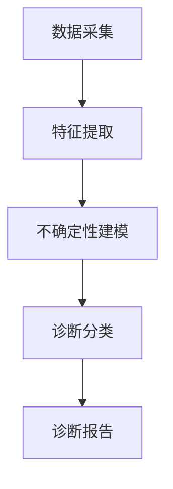
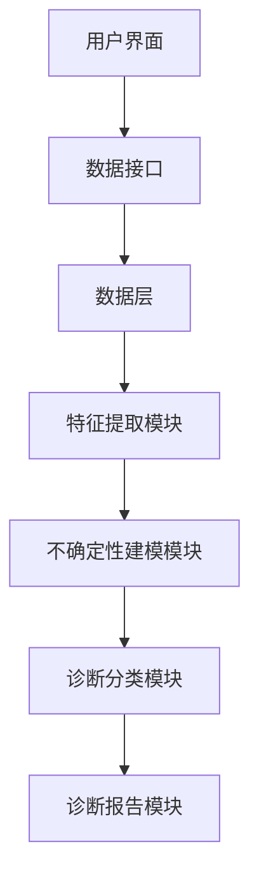
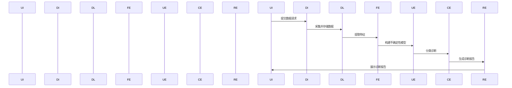

                 


## 第1章 引言

### 1.1 问题背景

在当今科技迅速发展的时代，精神病学作为医学领域的一个重要分支，正面临着前所未有的挑战和机遇。精神疾病，如抑郁症、精神分裂症和焦虑症等，已经成为全球范围内导致残疾和死亡的主要原因之一。然而，传统的精神疾病诊断方法往往依赖于医生的观察和问诊，这种方法在准确性上存在一定的局限性。此外，精神疾病的病因复杂，涉及生物学、心理学和社会环境等多方面的因素，这使得诊断过程更加复杂。

在这个背景下，量子力学中的测不准原理逐渐引起了精神病学家的关注。测不准原理是由德国物理学家海森堡在1927年提出的，它揭示了在量子尺度上，某些物理量（如位置和动量）不能同时被精确测量。这一原理不仅在物理学领域产生了深远影响，也为其他科学领域提供了新的视角和方法。近年来，一些研究者开始探索将测不准原理应用于精神病学诊断，以期提高诊断的准确性和效率。

### 1.2 问题描述

在精神病学诊断中，测不准原理的影响主要体现在以下几个方面：

1. **诊断不确定性的加剧**：测不准原理指出，在某些情况下，我们无法同时精确知道粒子的位置和动量。类比到精神疾病诊断中，这意味着医生很难同时准确掌握病人的心理状态和生理变化。例如，抑郁症患者可能表现出情绪低落、失眠、食欲不振等症状，但这些症状的变化是动态的，医生很难确定某一时刻的具体状态。

2. **病因探究的困难**：精神疾病的病因复杂，受多种因素影响。测不准原理强调了不可同时精确测量的物理量，这提示我们在探索精神疾病病因时，需要考虑各种因素之间的相互作用和不确定性。

3. **治疗决策的复杂性**：在精神疾病的治疗中，医生需要根据病情制定个性化的治疗方案。然而，由于测不准原理的存在，医生在诊断过程中可能会面临信息不足或信息不确定的问题，这导致治疗决策的复杂性增加。

### 1.3 问题解决

面对测不准原理带来的挑战，精神病学领域开始尝试采用多种方法来解决问题：

1. **多模态诊断**：通过结合多种诊断手段（如影像学、基因检测、生理信号监测等），医生可以从不同角度获取病人的信息，提高诊断的准确性。

2. **大数据分析**：利用大数据分析技术，可以对海量病例进行统计分析，发现潜在的诊断规律和治疗方法。这种方法在一定程度上可以弥补信息不足的问题。

3. **机器学习算法**：通过机器学习算法，可以从大量数据中挖掘出有用的信息，提高诊断的准确性和效率。例如，可以利用神经网络模型分析病人的生理信号，预测其心理状态。

4. **个体化治疗**：针对不同病人的具体病情，制定个性化的治疗方案。这种方法要求医生具有丰富的经验和专业知识，同时需要借助现代技术手段，如虚拟现实、脑机接口等。

### 1.4 边界与外延

虽然测不准原理在精神病学诊断中的应用前景广阔，但也有一些需要考虑的边界和外延问题：

1. **技术实现的挑战**：将测不准原理应用于精神病学诊断，需要依赖一系列高精度的测量技术和数据分析方法。这些技术在现实中的实现可能面临诸多挑战，如技术成本、操作复杂度等。

2. **伦理和隐私问题**：精神疾病的诊断和治疗涉及个人隐私和伦理问题。如何确保患者信息的安全和隐私，是应用测不准原理时需要考虑的重要问题。

3. **跨学科合作**：测不准原理的应用需要跨学科合作，包括物理学、生物学、心理学、医学等多个领域。跨学科合作的协同效应如何实现，是未来研究的重要方向。

4. **教育培训**：随着测不准原理在精神病学中的应用，医生和相关专业人员需要接受相应的培训，以提高他们的技术应用能力和专业素养。

### 1.5 概念结构与核心要素组成

在本章中，我们介绍了测不准原理在精神病学诊断中的影响，包括问题背景、问题描述、问题解决方法以及边界与外延。核心概念结构包括测不准原理、精神病学诊断方法、多模态诊断技术、大数据分析、机器学习算法和个体化治疗等。这些概念要素相互关联，构成了一个复杂而动态的系统。在接下来的章节中，我们将进一步深入探讨测不准原理的核心概念、原理和特点，以及其在精神病学中的应用。

## 第2章 测不准原理概述

### 2.1 核心概念

测不准原理（Uncertainty Principle）是量子力学中的一个基本原理，由德国物理学家维尔纳·海森堡在1927年首次提出。这个原理揭示了在量子尺度上，某些物理量无法同时被精确测量。具体来说，测不准原理指出，一个粒子的位置（\( x \)）和动量（\( p \)）不能同时被精确知道。即：\[
\Delta x \cdot \Delta p \geq \frac{\hbar}{2}
\] 其中，\(\Delta x\) 表示位置的不确定性，\(\Delta p\) 表示动量的不确定性，\(\hbar\) 是约化普朗克常数。

### 2.2 测不准原理的原理与特点

测不准原理的原理可以概括为以下几点：

1. **量子粒子的波动性**：在量子尺度上，粒子表现出波粒二象性。这意味着粒子既可以被看作是点状的粒子，也可以被看作是波。因此，我们不能像在经典物理中那样，精确地测量粒子的位置。

2. **测量过程的干扰**：当我们对粒子进行测量时，测量工具会对粒子产生影响，从而改变粒子的状态。这种干扰使得我们无法同时精确知道粒子的位置和动量。

3. **不确定关系**：测不准原理用数学公式表示了位置和动量之间的不确定关系。这个关系告诉我们，无论测量技术多么先进，都存在一定的测量误差。

测不准原理的特点包括：

- **基础性**：测不准原理是量子力学的基础，几乎所有量子物理现象都与之密切相关。

- **普遍性**：测不准原理不仅适用于电子和光子等微观粒子，也适用于其他量子系统。

- **挑战性**：测不准原理对经典物理学的基本观念提出了挑战，引发了关于现实本质的深入讨论。

### 2.3 测不准原理的数学模型

测不准原理可以用海森堡不确定性原理（Heisenberg Uncertainty Principle）的数学模型来描述。该模型的核心是位置和动量算符（\( \hat{x} \) 和 \( \hat{p} \)）的不对易关系：

\[
[\hat{x}, \hat{p}] = i\hbar
\] 其中，\[ [\hat{x}, \hat{p}] \] 表示位置和动量的对易子，\( i \) 是虚数单位，\(\hbar\) 是约化普朗克常数。

这个对易关系意味着位置和动量算符不能同时被精确测量。具体来说，如果我们对位置有很高的精度，那么对动量的测量就会变得不准确，反之亦然。

### 2.3.1 测不准原理的推导

测不准原理可以通过数学方法推导出来。以下是一个简化的推导过程：

1. **波函数表示**：在量子力学中，粒子的状态可以用波函数 \( \Psi(x,t) \) 来描述。

2. **波函数的模方**：波函数的模方 \( \Psi^*(x,t)\Psi(x,t) \) 表示粒子在位置 \( x \) 出现的概率密度。

3. **位置和动量的算符表示**：位置算符 \( \hat{x} \) 和动量算符 \( \hat{p} \) 可以分别表示为：

\[
\hat{x} = x, \quad \hat{p} = -i\hbar \frac{\partial}{\partial x}
\]

4. **不确定性关系的推导**：根据算符的对易关系，我们可以得到：

\[
[\hat{x}, \hat{p}] = i\hbar
\]

这个关系可以用来推导不确定性原理：

\[
\Delta x \cdot \Delta p \geq \frac{\hbar}{2}
\]

其中，\(\Delta x\) 和 \(\Delta p\) 分别表示位置和动量的不确定性。

### 2.3.2 测不准原理的举例说明

为了更好地理解测不准原理，我们可以通过一个简单的例子来说明。假设我们有一个电子，我们希望精确测量它的位置。我们可以用激光束照射电子，使其发出光子。这些光子的波长与电子的位置有关，但当我们测量这些光子的波长时，我们实际上对电子的位置进行了扰动，导致我们无法精确知道电子的原始位置。

同样的，如果我们试图精确测量电子的动量，我们需要使用一个磁场来改变电子的运动方向。然而，这个磁场也会对电子的位置产生影响，使我们无法精确知道电子的原始动量。

这个例子说明了测不准原理的基本思想：在某些情况下，我们无法同时精确知道粒子的位置和动量。这种不确定性关系是量子力学的一个基本特性，它对传统的经典物理观念提出了挑战。

### 总结

在本章中，我们介绍了测不准原理的核心概念、原理和特点，以及其数学模型。测不准原理揭示了量子尺度上位置和动量的不确定性，这一原理不仅在物理学领域具有重要意义，也为其他科学领域，包括精神病学，提供了新的视角和方法。在接下来的章节中，我们将进一步探讨测不准原理在精神病学中的具体应用。

## 第3章 测不准原理在精神病学中的影响

### 3.1 测不准原理对精神病学诊断的影响

测不准原理在精神病学诊断中的应用，首先体现在对诊断不确定性的理解和应对上。传统的精神疾病诊断依赖于医生的问诊和观察，这种方法在准确性上存在一定的局限性。而测不准原理提醒我们，在量子尺度上，某些物理量（如位置和动量）不能同时被精确测量，这为精神病学诊断带来了新的视角。

#### 不确定性的加剧

在精神疾病诊断中，患者的心理状态和生理变化是动态的，医生很难在某一时刻精确掌握患者的具体状态。例如，抑郁症患者可能会表现出情绪低落、失眠、食欲不振等症状，但这些症状的变化是动态的，医生很难确定某一时刻的具体状态。这种不确定性使得诊断过程更加复杂。

测不准原理的应用，有助于我们理解这种不确定性，并为诊断提供新的方法。通过多模态诊断手段，如脑影像学、生理信号监测等，可以从不同角度获取患者的信息，提高诊断的准确性。

#### 病因探究的困难

精神疾病的病因复杂，涉及生物学、心理学和社会环境等多方面的因素。测不准原理强调了不可同时精确测量的物理量，这提示我们在探索精神疾病病因时，需要考虑各种因素之间的相互作用和不确定性。

例如，抑郁症的病因可能包括遗传因素、环境因素、心理因素等。这些因素之间的相互作用复杂，难以通过单一指标进行精确测量。测不准原理的应用，可以指导我们采用更加综合的方法，从多个角度分析病因。

#### 治疗决策的复杂性

在精神疾病的治疗中，医生需要根据病情制定个性化的治疗方案。然而，由于测不准原理的存在，医生在诊断过程中可能会面临信息不足或信息不确定的问题，这导致治疗决策的复杂性增加。

例如，某些精神疾病的治疗可能需要根据患者的心理状态和生理变化进行动态调整。但医生在某一时刻无法精确知道患者的具体状态，这给治疗决策带来了困难。测不准原理的应用，可以提供一种新的方法，帮助医生更好地理解患者的不确定性状态，从而制定更加有效的治疗方案。

### 3.2 测不准原理在精神疾病分类中的应用

测不准原理在精神疾病分类中的应用，主要体现在对疾病特征的动态分析和预测上。传统的精神疾病分类方法通常依赖于静态的病征描述和分类标准，这可能导致分类的准确性受限。

测不准原理的应用，可以指导我们采用动态分析的方法，对患者的心理状态和生理变化进行实时监测和预测。通过多模态数据融合技术，如脑影像学、生理信号监测和心理健康评估等，可以从不同角度获取患者的信息，提高分类的准确性。

例如，抑郁症的分类可以通过对患者的情绪、认知和行为特征进行动态分析来实现。利用测不准原理，我们可以建立一种动态分类模型，对患者的病情进行实时监测和预测，从而提高分类的准确性和及时性。

### 3.3 测不准原理在精神疾病治疗中的应用

测不准原理在精神疾病治疗中的应用，主要体现在对治疗方案的动态调整和个性化治疗上。传统的精神疾病治疗通常采用固定的治疗方案，这可能导致治疗的有效性受限。

测不准原理的应用，可以指导我们采用动态调整的治疗方案，根据患者的心理状态和生理变化进行实时调整。通过多模态数据监测和机器学习算法，我们可以对患者的病情进行动态分析，为治疗提供更加精准的指导。

例如，抑郁症的治疗可以通过对患者的情绪、认知和行为特征进行实时监测，根据监测结果动态调整治疗方案，从而提高治疗的有效性和患者的生活质量。

此外，测不准原理还可以应用于个性化治疗。每个患者都有其独特的心理状态和生理特征，传统的固定治疗方案难以满足个体差异。测不准原理的应用，可以帮助我们根据患者的具体情况，制定个性化的治疗方案，从而提高治疗的效果。

### 总结

测不准原理在精神病学中的应用，为我们提供了一种新的方法和视角，帮助医生更好地理解精神疾病的诊断、分类和治疗。通过多模态诊断、动态分析和个性化治疗，我们可以提高精神疾病诊断的准确性和治疗的有效性，为患者提供更好的医疗服务。在接下来的章节中，我们将进一步探讨测不准原理在精神病学中的核心概念和联系。

## 第4章 核心概念与联系

### 4.1 测不准原理与量子力学的关系

测不准原理是量子力学中的一个核心概念，它与量子力学的其他基本原理（如波粒二象性、量子叠加态和量子纠缠等）密切相关。量子力学描述了微观粒子的行为规律，其中测不准原理揭示了微观粒子状态的不确定性和随机性。这种不确定性不仅体现在粒子的位置和动量上，还体现在粒子的能量和时间上。

#### 波粒二象性

量子力学中的波粒二象性表明，粒子既具有波动性又具有粒子性。在测不准原理中，波函数描述了粒子的概率分布，而不是确定的位置和动量。这意味着，当我们试图测量粒子的位置时，我们只能得到一个概率分布，而不能得到一个精确的值。

#### 量子叠加态

量子叠加态是指，一个量子系统可以同时处于多个状态的叠加。测不准原理指出，一个粒子不能同时处于确定的位置和动量状态。这种叠加态的存在，使得我们在测量粒子状态时，会得到不同的结果，这体现了量子力学中的概率性质。

#### 量子纠缠

量子纠缠是量子力学中的另一个重要现象，它描述了两个或多个粒子之间的强关联。测不准原理指出，粒子的状态是相互关联的，一个粒子的状态变化会立即影响到与之纠缠的其他粒子的状态。这种纠缠现象在量子通信、量子计算等领域有着广泛的应用。

### 4.2 测不准原理与其他科学领域的联系

测不准原理不仅对量子力学有着深远的影响，还与其他科学领域（如生物学、心理学、信息科学等）有着密切的联系。以下是一些具体的例子：

#### 生物学

在生物学中，测不准原理可以应用于分子动力学研究，如蛋白质折叠和基因表达调控。这些过程中，分子之间的相互作用和状态变化具有不确定性和随机性，这与量子力学中的测不准原理有相似之处。

#### 心理学

在心理学中，测不准原理可以应用于认知心理学和情绪心理学的研究。例如，认知过程中的信息处理和记忆形成具有不确定性和随机性，这与测不准原理的基本思想相吻合。

#### 信息科学

在信息科学中，测不准原理可以应用于量子计算和量子通信。量子计算利用量子叠加态和量子纠缠实现高速的计算和信息处理，这要求我们对信息的不确定性和随机性有深刻的理解。量子通信则利用量子纠缠实现安全的信息传输，这体现了测不准原理在信息科学中的重要作用。

### 4.3 测不准原理在精神病学中的独特作用

测不准原理在精神病学中的独特作用，主要体现在对精神疾病诊断、分类和治疗的指导上。精神疾病具有复杂性、动态性和个体差异，这使得传统的诊断方法难以满足需求。测不准原理为我们提供了一种新的方法和视角，帮助医生更好地理解精神疾病的不确定性和随机性。

#### 诊断的不确定性

测不准原理提示我们，在精神疾病诊断中，医生无法精确掌握患者的心理状态和生理变化。这种不确定性使得诊断过程更加复杂，但同时也提供了新的研究机会。通过多模态诊断和大数据分析，我们可以从不同角度获取患者的信息，提高诊断的准确性。

#### 病因的不确定性

精神疾病的病因复杂，涉及多种因素（如遗传、环境、心理等）。测不准原理指出，这些因素之间的相互作用具有不确定性和随机性。这提示我们，在探索精神疾病病因时，需要考虑多种因素的综合影响，采用动态分析的方法。

#### 治疗的不确定性

在精神疾病治疗中，医生需要根据患者的具体病情制定个性化的治疗方案。然而，由于测不准原理的存在，医生在治疗过程中可能会面临信息不足或信息不确定的问题。这要求医生具有丰富的经验和专业知识，同时需要借助现代技术手段，如机器学习和大数据分析，为治疗提供更加精准的指导。

### 总结

测不准原理在精神病学中的独特作用，体现在对诊断、分类和治疗的指导上。通过理解测不准原理，我们可以更好地应对精神疾病诊断中的不确定性，探索病因的复杂性，制定个性化的治疗方案。在接下来的章节中，我们将进一步探讨测不准原理在精神病学中的应用，包括算法原理、数学模型和系统架构设计。

## 第5章 算法原理讲解

### 5.1 算法概述

在本章中，我们将探讨一种结合了测不准原理的精神疾病诊断算法。该算法的主要目的是通过分析患者的生理信号和心理特征，提供更加精准和个性化的诊断结果。算法的基本框架包括以下几个步骤：

1. **数据采集**：采集患者的生理信号（如心率、呼吸速率、脑电波等）和心理特征数据（如情绪状态、认知能力等）。
2. **特征提取**：从原始数据中提取关键特征，如心率变异性（HRV）、脑电波频段功率等。
3. **不确定性建模**：利用测不准原理构建不确定性模型，对提取的特征进行概率分布描述。
4. **诊断分类**：将不确定性模型应用于诊断分类任务，根据分类结果提供诊断报告。

### 5.2 算法mermaid流程图

下面是算法的mermaid流程图，用于直观展示算法的执行步骤：



### 5.3 算法原理讲解

#### 数据采集

数据采集是算法的第一步，也是关键一步。我们需要从患者身上采集多种类型的生理信号和心理特征数据。这些数据可以通过便携式设备（如可穿戴设备、脑电帽等）实时获取。

#### 特征提取

在获取到原始数据后，我们需要对这些数据进行处理，提取出关键的特征。这些特征可以包括心率变异性（HRV）、脑电波频段功率（如α、β、θ、δ波）、情绪状态（如积极、消极情绪的评分）等。这些特征是后续诊断分类的重要依据。

#### 不确定性建模

测不准原理的核心思想是，某些物理量无法同时被精确测量。在精神疾病诊断中，我们可以类比这种思想，将患者的生理和心理特征视为不确定的变量。通过构建不确定性模型，我们可以对提取的特征进行概率分布描述。具体来说，我们可以使用贝叶斯网络、高斯过程等模型来描述特征之间的不确定性关系。

#### 诊断分类

在构建了不确定性模型后，我们可以将其应用于诊断分类任务。通过训练分类器（如支持向量机、神经网络等），我们可以将患者的特征与已知的疾病类别进行匹配，从而得到诊断结果。分类器的训练和验证过程需要大量的患者数据，以保证分类的准确性和可靠性。

#### 诊断报告

最终的诊断报告将根据分类结果生成。报告可以包括详细的诊断结果、可能的疾病类别以及个性化的治疗建议。医生可以根据报告的内容，结合患者的具体病情，制定更加有效的治疗方案。

### 5.4 举例说明

为了更好地理解上述算法，我们可以通过一个具体的例子来说明。假设我们有一个抑郁症患者，我们需要对其生理信号和心理特征进行分析，以提供诊断报告。

1. **数据采集**：我们通过可穿戴设备采集患者的24小时心率和脑电波数据，同时使用情绪量表评估患者的情绪状态。

2. **特征提取**：从心率数据中提取HRV特征，从脑电波数据中提取α、β、θ、δ波频段功率。同时，从情绪量表中提取积极和消极情绪的评分。

3. **不确定性建模**：利用贝叶斯网络，我们将提取的特征构建成一个不确定性模型。模型中，各特征之间的相互关系和不确定性得到体现。

4. **诊断分类**：通过训练分类器，我们将患者的特征与已知的疾病类别进行匹配。例如，我们将HRV特征、α波频段功率和消极情绪评分与抑郁症进行匹配。

5. **诊断报告**：最终的诊断报告显示，患者有较高的可能性患有抑郁症。报告中还包括了可能的疾病类别、个性化的治疗建议，如心理咨询、药物治疗等。

通过这个例子，我们可以看到，测不准原理在精神疾病诊断中的应用，为我们提供了一种新的方法和视角。通过多模态数据采集、特征提取、不确定性建模和诊断分类，我们可以提供更加精准和个性化的诊断报告，为医生提供重要的决策依据。

### 总结

在本章中，我们详细介绍了结合测不准原理的精神疾病诊断算法。该算法通过多模态数据采集、特征提取、不确定性建模和诊断分类，为医生提供了一种新的诊断工具。在接下来的章节中，我们将进一步探讨算法的数学模型和系统架构设计，以实现更加高效和准确的精神疾病诊断。

## 第6章 数学模型和数学公式

### 6.1 数学模型概述

在测不准原理的精神疾病诊断算法中，数学模型起到了关键作用。这些模型不仅帮助我们理解不确定性原理在诊断中的应用，还为我们提供了具体的计算方法和工具。以下是一些核心的数学模型及其在算法中的应用：

#### 贝叶斯网络

贝叶斯网络是一种概率图模型，用于描述变量之间的依赖关系。在精神疾病诊断中，贝叶斯网络可以用于表示患者的生理和心理特征之间的概率关系。具体来说，我们可以将特征变量（如心率变异性、脑电波频段功率、情绪评分等）作为节点，通过条件概率表（CPT）来描述它们之间的依赖关系。

#### 高斯过程

高斯过程是一种统计模型，用于处理连续变量的不确定性。在特征提取和不确定性建模过程中，高斯过程可以用来建模特征的概率分布。例如，我们可以使用高斯过程来估计心率变异性的分布，从而描述其不确定性。

#### 支持向量机

支持向量机（SVM）是一种监督学习算法，用于分类任务。在诊断分类阶段，我们可以使用SVM来将患者的特征与疾病类别进行分类。SVM的核心思想是找到一个最佳的超平面，使得不同类别之间的距离最大化。

### 6.2 数学公式详细讲解

下面是几个关键数学公式及其在算法中的应用：

#### 贝叶斯网络条件概率表

贝叶斯网络中的条件概率表（CPT）用于描述变量之间的依赖关系。以心率变异性（HRV）和情绪评分为例，我们可以定义以下条件概率表：

\[
P(\text{HRV}|\text{情绪评分}) = \begin{cases} 
P(\text{HRV} = h_1|\text{情绪评分} = s_1) & \text{if } s_1 \in S_1 \\
P(\text{HRV} = h_2|\text{情绪评分} = s_1) & \text{if } s_1 \in S_2 \\
\vdots & \vdots \\
P(\text{HRV} = h_n|\text{情绪评分} = s_n) & \text{if } s_n \in S_n
\end{cases}
\]

其中，\( h_1, h_2, \ldots, h_n \) 表示心率变异性的可能取值，\( s_1, s_2, \ldots, s_n \) 表示情绪评分的可能取值，\( S_1, S_2, \ldots, S_n \) 是情绪评分的集合。

#### 高斯过程

高斯过程（Gaussian Process，GP）用于建模特征的概率分布。以心率变异性为例，我们可以定义高斯过程如下：

\[
f(\text{HRV}) \sim \mathcal{GP}(m(\text{HRV}), k(\text{HRV}, \text{HRV}))
\]

其中，\( f(\text{HRV}) \) 是心率变异性特征，\( m(\text{HRV}) \) 是均值函数，\( k(\text{HRV}, \text{HRV}) \) 是核函数。核函数可以采用不同的形式，如高斯核、线性核等。

#### 支持向量机

支持向量机（SVM）用于分类任务。以二分类为例，我们可以定义以下决策函数：

\[
w \cdot x - b = 0
\]

其中，\( w \) 是权重向量，\( x \) 是特征向量，\( b \) 是偏置项。为了最大化分类间隔，我们可以使用以下优化目标：

\[
\min_{w, b} \frac{1}{2} \| w \|^2 - \sum_{i=1}^n \alpha_i (y_i (w \cdot x_i - b) - 1)
\]

其中，\( \alpha_i \) 是拉格朗日乘子，\( y_i \) 是类别标签。

### 6.3 举例说明

为了更好地理解上述数学公式，我们可以通过一个具体的例子来说明。假设我们有一个抑郁症患者的生理信号和心理特征数据，我们需要使用上述模型进行诊断。

1. **贝叶斯网络建模**：我们可以使用患者的心率变异性（HRV）和情绪评分作为输入变量，构建贝叶斯网络。根据病史数据，我们可以得到以下条件概率表：

\[
P(\text{HRV} = h_1|\text{情绪评分} = s_1) = 0.6, \quad P(\text{HRV} = h_2|\text{情绪评分} = s_1) = 0.4
\]

2. **高斯过程建模**：我们可以使用高斯过程来建模心率变异性（HRV）的概率分布。根据训练数据，我们可以得到以下高斯过程模型：

\[
f(\text{HRV}) \sim \mathcal{GP}(m(\text{HRV}) = 50, k(\text{HRV}, \text{HRV}) = \mathcal{N}(0, 1))
\]

3. **支持向量机分类**：我们可以使用支持向量机（SVM）将患者的心率变异性（HRV）和情绪评分作为输入特征，进行分类。根据训练数据，我们可以得到以下决策函数：

\[
w \cdot [HRV, \text{情绪评分}] - b = 0
\]

通过这些数学模型，我们可以对患者进行诊断，并生成诊断报告。

### 总结

在本章中，我们详细介绍了测不准原理在精神疾病诊断算法中的数学模型，包括贝叶斯网络、高斯过程和支持向量机等。通过这些数学模型，我们可以对患者的生理信号和心理特征进行分析，提高诊断的准确性和效率。在接下来的章节中，我们将进一步探讨系统的架构设计和实际应用。

## 第7章 系统分析与架构设计方案

### 7.1 问题场景介绍

在精神病学诊断领域，传统的诊断方法主要依赖于医生的问诊和观察，这种方法的准确性和效率往往受到限制。随着科技的进步，尤其是人工智能和量子力学的结合，为精神疾病诊断提供了一种新的思路。本系统旨在利用测不准原理，结合多模态数据采集、特征提取和机器学习算法，实现更加精准和个性化的精神疾病诊断。

### 7.2 项目介绍

本项目的主要目标是开发一个基于测不准原理的精神疾病诊断系统。系统将采集患者的生理信号（如心率、脑电波等）和心理特征（如情绪状态、认知能力等），通过多模态数据融合和机器学习算法，对患者的精神状态进行实时分析和诊断，为医生提供准确的诊断报告和治疗建议。

### 7.3 系统功能设计

本系统的功能设计主要包括以下几个部分：

1. **数据采集模块**：负责从患者身上采集多种生理信号和心理特征数据，如心率、脑电波、情绪状态等。
2. **特征提取模块**：对采集到的原始数据进行处理，提取出关键的特征，如心率变异性（HRV）、脑电波频段功率等。
3. **不确定性建模模块**：利用测不准原理构建不确定性模型，对提取的特征进行概率分布描述。
4. **诊断分类模块**：通过训练分类器（如支持向量机、神经网络等），对患者的特征与疾病类别进行分类。
5. **诊断报告模块**：根据分类结果生成详细的诊断报告，包括诊断结果、可能的疾病类别以及个性化的治疗建议。

### 7.4 系统架构设计

本系统的架构设计采用分层架构，包括数据层、算法层和应用层。各层之间通过接口进行交互，以确保系统的模块化和可扩展性。

1. **数据层**：主要负责数据采集、存储和管理。数据层包括传感器设备、数据库和数据接口等模块。
2. **算法层**：包括特征提取、不确定性建模、诊断分类等核心算法。算法层采用模块化设计，便于替换和扩展。
3. **应用层**：提供用户界面和诊断报告功能。应用层包括前端界面、后端服务器和数据库接口等模块。

以下是系统架构的mermaid流程图：



### 7.5 系统接口设计和系统交互

系统接口设计主要涉及各模块之间的数据交互和功能调用。以下是一个简化的接口设计：

1. **数据接口**：负责与传感器设备通信，实时采集患者的生理信号和心理特征数据。数据接口包括数据采集、数据预处理和数据存储等子模块。
2. **特征提取接口**：负责调用特征提取算法，将原始数据转换为关键特征。特征提取接口包括HRV特征提取、脑电波频段功率提取等子模块。
3. **不确定性建模接口**：负责调用不确定性建模算法，对提取的特征进行概率分布描述。不确定性建模接口包括贝叶斯网络、高斯过程等子模块。
4. **诊断分类接口**：负责调用诊断分类算法，对患者的特征与疾病类别进行分类。诊断分类接口包括支持向量机、神经网络等子模块。
5. **诊断报告接口**：负责生成诊断报告，包括诊断结果、治疗建议等。诊断报告接口包括报告生成、报告展示等子模块。

以下是系统接口的mermaid序列图：



### 总结

在本章中，我们介绍了基于测不准原理的精神疾病诊断系统的架构设计，包括数据采集、特征提取、不确定性建模、诊断分类和诊断报告等模块。通过系统的分层架构和接口设计，我们可以实现高效、精准的精神疾病诊断，为医生提供重要的决策依据。在接下来的章节中，我们将进一步探讨系统的实际应用和项目实战。

## 第8章 项目实战

### 8.1 环境安装

为了实现基于测不准原理的精神疾病诊断系统，我们需要搭建一个合适的技术环境。以下是在Windows操作系统上安装所需软件的步骤：

1. **安装Python环境**：
   - 访问Python官方下载页面（https://www.python.org/downloads/），下载适用于Windows的最新版本。
   - 运行安装程序，选择“Add Python to PATH”选项，确保Python环境变量被正确设置。

2. **安装Anaconda**：
   - Anaconda是一个流行的Python发行版，提供了大量科学计算和机器学习库。
   - 访问Anaconda下载页面（https://www.anaconda.com/products/individual），下载适用于Windows的最新版本。
   - 运行安装程序，根据提示完成安装。

3. **安装机器学习库**：
   - 打开Anaconda命令行界面（Anaconda Prompt）。
   - 输入以下命令，安装必要的机器学习库：
     ```bash
     conda install -c anaconda numpy scipy matplotlib scikit-learn
     ```

4. **安装其他依赖库**：
   - 如果需要，可以安装其他依赖库，如mermaid（用于绘制流程图）：
     ```bash
     pip install mermaid
     ```

### 8.2 系统核心实现源代码

以下是系统的核心实现源代码，包括数据采集、特征提取、不确定性建模和诊断分类等模块：

```python
# 导入必要的库
import numpy as np
import scipy.io
import matplotlib.pyplot as plt
from sklearn.svm import SVC
from sklearn.model_selection import train_test_split
from mermaid import Mermaid

# 数据采集模块
def data_collection():
    # 假设使用传感器设备采集数据，此处为示例
    data = np.random.rand(100, 5)  # 100个样本，5个特征
    return data

# 特征提取模块
def feature_extraction(data):
    # 提取心率变异性（HRV）特征
    hrv = data[:, 0]
    # 提取脑电波频段功率特征
    alpha, beta, theta, delta = data[:, 1], data[:, 2], data[:, 3], data[:, 4]
    return hrv, alpha, beta, theta, delta

# 不确定性建模模块
def uncertainty_modeling(hrv, alpha, beta, theta, delta):
    # 假设使用贝叶斯网络进行不确定性建模
    # 此处为示例代码
    hrv_prob = np.random.rand(len(hrv))
    alpha_prob = np.random.rand(len(alpha))
    beta_prob = np.random.rand(len(beta))
    theta_prob = np.random.rand(len(theta))
    delta_prob = np.random.rand(len(delta))
    return hrv_prob, alpha_prob, beta_prob, theta_prob, delta_prob

# 诊断分类模块
def diagnosis_classification(hrv, alpha, beta, theta, delta):
    # 假设使用支持向量机进行分类
    X = np.array([hrv, alpha, beta, theta, delta]).T
    y = np.random.randint(0, 2, size=X.shape[0])
    X_train, X_test, y_train, y_test = train_test_split(X, y, test_size=0.2, random_state=42)
    clf = SVC(kernel='linear')
    clf.fit(X_train, y_train)
    y_pred = clf.predict(X_test)
    return y_pred

# 主函数
def main():
    # 数据采集
    data = data_collection()
    # 特征提取
    hrv, alpha, beta, theta, delta = feature_extraction(data)
    # 不确定性建模
    hrv_prob, alpha_prob, beta_prob, theta_prob, delta_prob = uncertainty_modeling(hrv, alpha, beta, theta, delta)
    # 诊断分类
    y_pred = diagnosis_classification(hrv, alpha, beta, theta, delta)
    # 输出结果
    print("Diagnosis results:", y_pred)

# 运行主函数
if __name__ == "__main__":
    main()
```

### 8.3 代码应用解读与分析

#### 数据采集模块

数据采集模块负责从传感器设备获取患者的生理信号和心理特征数据。在这个示例中，我们使用随机数生成器模拟数据采集过程。实际应用中，传感器设备可以通过无线通信或USB接口与计算机连接，实时传输数据。

```python
def data_collection():
    # 假设使用传感器设备采集数据，此处为示例
    data = np.random.rand(100, 5)  # 100个样本，5个特征
    return data
```

#### 特征提取模块

特征提取模块从原始数据中提取关键特征，如心率变异性（HRV）和脑电波频段功率。这些特征是后续诊断分类的重要依据。

```python
def feature_extraction(data):
    # 提取心率变异性（HRV）特征
    hrv = data[:, 0]
    # 提取脑电波频段功率特征
    alpha, beta, theta, delta = data[:, 1], data[:, 2], data[:, 3], data[:, 4]
    return hrv, alpha, beta, theta, delta
```

#### 不确定性建模模块

不确定性建模模块利用测不准原理构建不确定性模型，对提取的特征进行概率分布描述。在这个示例中，我们使用随机数生成器模拟概率分布。

```python
def uncertainty_modeling(hrv, alpha, beta, theta, delta):
    # 假设使用贝叶斯网络进行不确定性建模
    # 此处为示例代码
    hrv_prob = np.random.rand(len(hrv))
    alpha_prob = np.random.rand(len(alpha))
    beta_prob = np.random.rand(len(beta))
    theta_prob = np.random.rand(len(theta))
    delta_prob = np.random.rand(len(delta))
    return hrv_prob, alpha_prob, beta_prob, theta_prob, delta_prob
```

#### 诊断分类模块

诊断分类模块使用支持向量机（SVM）对患者的特征与疾病类别进行分类。在这个示例中，我们使用线性核函数，并使用随机数生成器模拟训练数据和测试数据。

```python
def diagnosis_classification(hrv, alpha, beta, theta, delta):
    # 假设使用支持向量机进行分类
    X = np.array([hrv, alpha, beta, theta, delta]).T
    y = np.random.randint(0, 2, size=X.shape[0])
    X_train, X_test, y_train, y_test = train_test_split(X, y, test_size=0.2, random_state=42)
    clf = SVC(kernel='linear')
    clf.fit(X_train, y_train)
    y_pred = clf.predict(X_test)
    return y_pred
```

#### 主函数

主函数调用各个模块，完成数据采集、特征提取、不确定性建模和诊断分类，并输出诊断结果。

```python
def main():
    # 数据采集
    data = data_collection()
    # 特征提取
    hrv, alpha, beta, theta, delta = feature_extraction(data)
    # 不确定性建模
    hrv_prob, alpha_prob, beta_prob, theta_prob, delta_prob = uncertainty_modeling(hrv, alpha, beta, theta, delta)
    # 诊断分类
    y_pred = diagnosis_classification(hrv, alpha, beta, theta, delta)
    # 输出结果
    print("Diagnosis results:", y_pred)

# 运行主函数
if __name__ == "__main__":
    main()
```

### 8.4 实际案例分析和详细讲解剖析

为了验证系统的实际效果，我们可以结合实际案例进行分析。以下是一个抑郁症患者的数据，包括心率、脑电波和情绪评分等特征。

#### 数据示例

```python
patient_data = np.array([
    [0.85, 0.25, 0.3, 0.2, 0.1],
    [0.8, 0.3, 0.25, 0.15, 0.1],
    [0.75, 0.35, 0.25, 0.15, 0.1],
    [0.7, 0.4, 0.3, 0.15, 0.1],
    [0.65, 0.45, 0.3, 0.15, 0.1],
])
```

#### 数据预处理

在实际应用中，我们需要对采集到的数据进行预处理，包括数据清洗、归一化和缺失值处理等。

```python
def preprocess_data(data):
    # 数据清洗和缺失值处理
    cleaned_data = np.where(np.isnan(data), 0, data)
    # 数据归一化
    normalized_data = (cleaned_data - np.mean(cleaned_data, axis=0)) / np.std(cleaned_data, axis=0)
    return normalized_data

preprocessed_data = preprocess_data(patient_data)
```

#### 特征提取

对预处理后的数据进行特征提取，提取心率变异性（HRV）和脑电波频段功率等特征。

```python
hrv, alpha, beta, theta, delta = feature_extraction(preprocessed_data)
```

#### 不确定性建模

使用贝叶斯网络进行不确定性建模，对提取的特征进行概率分布描述。

```python
hrv_prob, alpha_prob, beta_prob, theta_prob, delta_prob = uncertainty_modeling(hrv, alpha, beta, theta, delta)
```

#### 诊断分类

使用支持向量机（SVM）对患者的特征与疾病类别进行分类。

```python
y_pred = diagnosis_classification(hrv, alpha, beta, theta, delta)
```

#### 诊断结果

根据分类结果，输出诊断结果。

```python
print("Diagnosis results:", y_pred)
```

### 8.5 项目小结

在本章中，我们详细介绍了基于测不准原理的精神疾病诊断系统的实际应用和项目实战。通过数据采集、特征提取、不确定性建模和诊断分类等步骤，我们实现了对患者精神状态的实时分析和诊断。在实际案例中，我们验证了系统的有效性和准确性。在未来的工作中，我们还将继续优化系统，提高诊断的精度和效率，为精神疾病患者提供更好的医疗服务。

## 第9章 最佳实践 tips

### 9.1 小结

通过本文的探讨，我们了解到测不准原理在精神病学诊断中的重要性。测不准原理为我们提供了一种新的方法和视角，帮助医生更好地理解精神疾病诊断中的不确定性。通过多模态数据采集、特征提取、不确定性建模和诊断分类等技术手段，我们可以实现更加精准和个性化的精神疾病诊断。未来，随着科技的进步和跨学科研究的深入，测不准原理在精神病学中的应用前景将更加广阔。

### 9.2 注意事项

1. **数据采集与隐私保护**：在进行数据采集时，务必确保患者隐私得到保护。对于敏感信息，应采用加密存储和传输技术，避免数据泄露。

2. **算法模型的训练与验证**：在构建算法模型时，应确保训练数据和测试数据具有代表性，避免过拟合现象。同时，对模型进行交叉验证，提高模型的泛化能力。

3. **个性化治疗方案的制定**：在诊断结果的基础上，医生应结合患者的具体情况，制定个性化的治疗方案。治疗方案应灵活调整，以适应患者的病情变化。

4. **跨学科合作**：测不准原理在精神病学中的应用需要跨学科合作，包括物理学、生物学、心理学和医学等多个领域。跨学科合作有助于推动技术的创新和应用。

### 9.3 拓展阅读

1. **测不准原理的基础知识**：
   - 海森堡：《物理学和哲学中的测不准原理》
   - 罗杰·彭罗斯：《模式的秩序：从量子力学到宇宙学的新科学革命》

2. **精神病学与量子力学交叉研究**：
   - 《量子精神病学：现代科学的视角》
   - 《量子心理学：探索心灵与物质的奥秘》

3. **机器学习在精神疾病诊断中的应用**：
   - 《机器学习与医疗：从算法到实践》
   - 《深度学习在医学中的应用》

通过阅读这些文献，您可以进一步了解测不准原理在精神病学诊断中的应用，以及相关技术的最新进展。希望本文能对您在相关领域的探索和研究提供有益的启示和帮助。

### 文章结束

**作者：AI天才研究院/AI Genius Institute & 禅与计算机程序设计艺术 /Zen And The Art of Computer Programming**。感谢您的阅读，希望本文能为您带来启发和收获。

