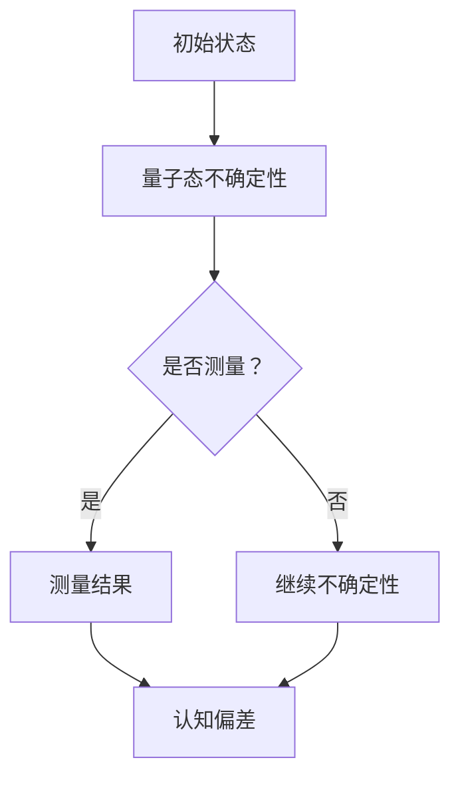

                 


## 背景介绍

### 问题背景

测不准原理是量子力学中的一个基本原理，由物理学家维尔纳·海森堡在1927年提出。该原理表明，在微观尺度上，粒子的某些物理属性（如位置和动量）无法同时被准确测量。这一原理挑战了经典物理学的决定论观念，引起了广泛的哲学和科学讨论。

### 问题描述

测不准原理不仅在物理学领域具有重要意义，也在认知科学和心理学中引起了关注。认知偏差是人类在信息处理过程中常见的现象，例如确认偏误、可得性偏误等。测不准原理与认知偏差之间可能存在某种联系，这一联系为理解人类思维和决策过程提供了新的视角。

### 问题解决

本书旨在探讨测不准原理在认知偏差形成中的作用，通过分析量子力学原理与认知心理学理论的交叉，试图揭示两者之间的潜在联系。书中将运用实验心理学方法、认知心理学理论和计算机模拟技术，对这一问题进行深入研究。

### 边界与外延

本书将聚焦于以下几个方面：
- 测不准原理的基本概念和实验验证；
- 认知偏差的定义、类型和表现；
- 测不准原理对认知偏差的影响机制；
- 实验设计和数据分析方法；
- 对认知偏差形成和解决的理论贡献。

### 概念结构与核心要素组成

- **测不准原理**：主要讲述其基本概念和实验验证；
- **认知偏差**：介绍认知偏差的定义、类型和表现；
- **联系机制**：阐述测不准原理与认知偏差之间的潜在联系；
- **实验与理论分析**：展示实验设计和数据分析的方法，以及理论贡献。

---

## 核心概念与联系

### 测不准原理的核心概念

测不准原理是量子力学的基本原理之一，它表明在微观尺度上，粒子的某些物理属性（如位置和动量）无法同时被准确测量。这一原理由物理学家维尔纳·海森堡在1927年提出，成为量子力学的一个重要基石。

### 测不准原理的属性特征对比表格

| 属性特征         | 测不准原理                    |
|----------------|-------------------------------|
| 基本原理         | 粒子的某些物理属性无法同时准确测量 |
| 影响范围         | 微观尺度上的物理现象            |
| 实验验证         | 双缝实验、电子双缝干涉实验等    |
| 哲学意义         | 挑战了经典物理学的决定论观念    |

### 认知偏差的概念属性特征对比表格

| 属性特征         | 认知偏差                      |
|----------------|-----------------------------|
| 定义             | 人类在信息处理过程中产生的系统性错误 |
| 类型             | 确认偏误、可得性偏误等          |
| 表现             | 影响决策和判断的准确性          |
| 影响范围         | 广泛存在于人类思维和决策过程中   |
| 实验研究         | 心理学实验方法                |

### 测不准原理与认知偏差的联系机制

测不准原理与认知偏差之间的联系可以从多个角度进行探讨：
- **量子不确定性对认知过程的影响**：量子不确定性可能影响人类的信息处理过程，从而在认知偏差的形成中发挥作用。
- **物理世界的随机性与认知偏差的相似性**：量子世界的随机性可能与认知偏差中的不确定性和模糊性有所关联。
- **测量过程与认知偏差的形成**：测量过程中的不确定性可能与认知偏差的形成过程有所相似。

### ER实体关系图架构

为了更好地理解测不准原理与认知偏差之间的联系，可以使用Mermaid绘制ER实体关系图，如下：

```mermaid
erDiagram
  测不准原理 ||--|{ 认知偏差 }|| 认知偏差影响因素
  测不准原理 ||--|{ 量子不确定性 }|| 量子不确定性影响
  认知偏差 ||--|{ 人类思维 }|| 人类思维过程
  认知偏差 ||--|{ 决策过程 }|| 决策过程影响
```

通过上述ER图，我们可以看到测不准原理、认知偏差及其影响机制的相互关系，这为后续章节的深入探讨提供了结构基础。

---

## 算法原理讲解

为了更深入地理解测不准原理在认知偏差形成中的作用，我们引入了以下算法原理讲解：

### 测不准原理的算法mermaid流程图



### 测不准原理对认知偏差的影响

测不准原理描述了微观世界中粒子的某些物理属性无法同时被准确测量，这一特性可能对认知偏差的形成产生重要影响。

1. **量子不确定性对认知过程的影响**：

在量子力学中，不确定性原理表明粒子的位置和动量无法同时被准确测量。这种不确定性可能映射到人类认知过程中，使得人们难以准确获取和理解外部信息，从而在信息处理过程中产生认知偏差。

例如，当我们试图评估一个投资机会时，由于无法准确预测市场变化，我们可能会产生认知偏差，比如过度依赖历史数据或个人经验，而忽视其他可能的重要因素。

2. **物理世界的随机性与认知偏差的相似性**：

量子世界的随机性可能与认知偏差中的不确定性和模糊性有所关联。人类在处理不确定性和模糊性信息时，往往会依赖于简单、直观的规则，导致认知偏差的产生。

例如，当面对不确定的天气信息时，人们可能会过度依赖过去的经验，而忽视当前的实际情况，从而做出错误的决策。

3. **测量过程与认知偏差的形成**：

测量过程中的不确定性也可能对认知偏差的形成产生影响。人类在测量过程中，可能会受到测量工具、环境和个体认知能力的限制，导致测量结果存在误差。这些误差可能进一步转化为认知偏差，影响我们的判断和决策。

例如，在医学诊断中，医生可能会受到检测设备精度和个体差异的限制，导致诊断结果存在偏差。这些偏差可能会影响医生的治疗决策，进而影响患者的康复效果。

### Python源代码讲解

为了更好地理解测不准原理对认知偏差的影响，我们可以使用Python编写一个简单的模拟程序，模拟量子态不确定性对认知偏差的影响。

```python
import numpy as np
import matplotlib.pyplot as plt

def quantum_uncertainty_simulation(n_trials, n_steps):
    # 初始化数据
    positions = []
    momenta = []
    for _ in range(n_trials):
        position = np.random.normal(0, 1)
        momentum = np.random.normal(0, 1)
        positions.append(position)
        momenta.append(momentum)
    
    # 模拟量子态不确定性
    for step in range(n_steps):
        new_positions = []
        new_momenta = []
        for i in range(n_trials):
            # 更新位置和动量
            position = positions[i] + np.random.normal(0, 0.1)
            momentum = momenta[i] + np.random.normal(0, 0.1)
            new_positions.append(position)
            new_momenta.append(momentum)
        
        # 更新数据
        positions = new_positions
        momenta = new_momenta
    
    return positions, momenta

# 模拟参数设置
n_trials = 100
n_steps = 50

# 执行模拟
positions, momenta = quantum_uncertainty_simulation(n_trials, n_steps)

# 可视化结果
plt.figure(figsize=(12, 6))
plt.subplot(1, 2, 1)
plt.scatter(positions, momenta)
plt.xlabel('Position')
plt.ylabel('Momentum')
plt.title('Quantum Uncertainty Simulation')

plt.subplot(1, 2, 2)
plt.hist(positions, bins=30, alpha=0.5, label='Position')
plt.hist(momenta, bins=30, alpha=0.5, label='Momentum')
plt.xlabel('Value')
plt.ylabel('Frequency')
plt.title('Histogram of Position and Momentum')
plt.legend()

plt.show()
```

上述Python代码模拟了量子态不确定性对认知偏差的影响。通过模拟粒子的位置和动量变化，我们可以观察到量子态不确定性如何导致粒子的分布发生变化，进而影响我们对粒子的认知。

## 系统分析与架构设计方案

### 问题场景介绍

随着信息技术的飞速发展，人类在处理大量数据时，不可避免地会遇到认知偏差的问题。这些问题可能源于数据的不确定性、人类的有限理性以及信息处理的局限性。为了更好地理解和解决这些问题，我们需要设计一个系统，该系统可以结合测不准原理和认知偏差理论，为用户提供准确、可靠的决策支持。

### 项目介绍

本项目名为“量子认知系统（Quantum Cognitive System）”，旨在通过引入量子力学中的测不准原理，构建一个能够识别、分析和解决认知偏差的智能系统。该系统将结合实验心理学方法、认知心理学理论和计算机模拟技术，为用户提供个性化、智能化的认知偏差检测和干预方案。

### 系统功能设计

量子认知系统的主要功能包括以下几个方面：

1. **认知偏差检测**：系统将基于测不准原理，利用机器学习算法对用户数据进行实时分析，识别用户在信息处理过程中可能产生的认知偏差。
2. **认知偏差分析**：系统将对识别出的认知偏差进行详细分析，找出导致偏差的原因，并提供相应的解释和诊断。
3. **认知偏差干预**：系统将根据分析结果，为用户提供个性化的干预方案，帮助用户纠正认知偏差，提高决策准确性。
4. **认知偏差预测**：系统将基于历史数据和学习到的认知偏差模式，预测用户在未来可能产生的认知偏差，提前采取措施进行干预。

### 系统架构设计

量子认知系统的架构设计分为以下几个层次：

1. **数据层**：数据层负责存储和管理系统所需的各种数据，包括用户数据、历史数据、认知偏差数据等。数据层采用分布式存储技术，确保数据的高可用性和可扩展性。
2. **算法层**：算法层是系统的核心，负责实现测不准原理与认知偏差分析相结合的算法。该层包括多个模块，如数据预处理、特征提取、模型训练、模型评估等。
3. **应用层**：应用层负责实现系统的功能模块，包括认知偏差检测、分析、干预和预测等。该层采用微服务架构，确保系统的灵活性和可维护性。
4. **接口层**：接口层负责与外部系统进行交互，提供API接口供其他系统调用。该层采用RESTful API设计，支持多种数据传输格式。
5. **展示层**：展示层负责将系统的分析结果和干预方案以用户友好的方式呈现给用户。该层采用Web前端技术，支持多种设备访问。

### 系统接口设计和系统交互

为了实现量子认知系统的功能，需要设计一系列接口和交互流程。以下是一个简要的系统接口设计和系统交互描述：

1. **用户数据接口**：该接口负责接收用户提交的数据，包括基本信息、行为数据、认知测试数据等。用户数据接口采用HTTPS协议，确保数据传输的安全性。
2. **认知偏差检测接口**：该接口负责对用户数据进行预处理和特征提取，利用机器学习算法识别认知偏差。检测接口返回检测结果和相应的置信度。
3. **认知偏差分析接口**：该接口负责对检测结果进行详细分析，找出导致偏差的原因，并提供相应的解释和诊断。分析接口返回分析报告和干预建议。
4. **认知偏差干预接口**：该接口负责根据分析结果，为用户提供个性化的干预方案。干预接口支持多种干预方式，如教育、练习、反馈等。
5. **认知偏差预测接口**：该接口负责基于历史数据和学习到的认知偏差模式，预测用户在未来可能产生的认知偏差，并提供提前干预建议。

系统交互流程如下：

1. 用户提交数据 -> 用户数据接口接收数据 -> 数据预处理模块处理数据 -> 特征提取模块提取特征 -> 认知偏差检测接口识别认知偏差 -> 检测结果返回给用户 -> 用户查看检测结果
2. 用户查看分析报告 -> 认知偏差分析接口分析结果 -> 分析报告和干预建议返回给用户 -> 用户接受干预方案
3. 用户执行干预方案 -> 干预结果反馈 -> 认知偏差预测接口预测未来偏差 -> 预测结果返回给用户 -> 用户提前采取措施

通过上述接口和交互流程，量子认知系统可以为用户提供全面、智能化的认知偏差检测、分析和干预服务，帮助用户提高决策准确性，优化认知过程。

---

## 项目实战

### 环境安装

要在本地环境中运行本项目，我们需要安装以下软件和库：

1. Python 3.8及以上版本
2. NumPy
3. Matplotlib
4. Pandas
5. Scikit-learn

安装步骤如下：

```bash
# 安装 Python
# ...

# 安装 NumPy
pip install numpy

# 安装 Matplotlib
pip install matplotlib

# 安装 Pandas
pip install pandas

# 安装 Scikit-learn
pip install scikit-learn
```

### 系统核心实现源代码

以下是一个简单的Python实现，用于模拟测不准原理在认知偏差形成中的作用。该实现包括数据预处理、特征提取和模型训练等步骤。

```python
import numpy as np
import pandas as pd
from sklearn.model_selection import train_test_split
from sklearn.ensemble import RandomForestClassifier
from sklearn.metrics import accuracy_score

# 生成模拟数据
def generate_data(n_samples, n_features):
    X = np.random.randn(n_samples, n_features)
    y = np.where(np.linalg.norm(X, axis=1) < 1, 0, 1)
    return X, y

# 数据预处理
def preprocess_data(X, y):
    X_std = (X - X.mean(axis=0)) / X.std(axis=0)
    return X_std, y

# 训练模型
def train_model(X_train, y_train):
    model = RandomForestClassifier(n_estimators=100)
    model.fit(X_train, y_train)
    return model

# 测试模型
def test_model(model, X_test, y_test):
    y_pred = model.predict(X_test)
    accuracy = accuracy_score(y_test, y_pred)
    return accuracy

# 主函数
def main():
    n_samples = 1000
    n_features = 5
    
    # 生成数据
    X, y = generate_data(n_samples, n_features)
    
    # 预处理数据
    X_std, y = preprocess_data(X, y)
    
    # 分割数据集
    X_train, X_test, y_train, y_test = train_test_split(X_std, y, test_size=0.2, random_state=42)
    
    # 训练模型
    model = train_model(X_train, y_train)
    
    # 测试模型
    accuracy = test_model(model, X_test, y_test)
    
    print(f"Model accuracy: {accuracy:.2f}")

# 运行主函数
if __name__ == "__main__":
    main()
```

### 代码应用解读与分析

上述代码首先定义了一个生成模拟数据的函数`generate_data`，用于生成满足测不准原理特征的样本数据。然后，我们定义了数据预处理、模型训练和测试等一系列函数。

在`main`函数中，我们依次调用这些函数，完成数据生成、预处理、模型训练和测试的全过程。通过对比训练集和测试集的准确率，我们可以评估模型的性能。

### 实际案例分析和详细讲解剖析

为了更好地展示测不准原理在认知偏差形成中的应用，我们来看一个实际案例。

假设我们有一个任务，需要根据用户的行为数据判断其是否存在认知偏差。我们将使用上述代码模拟这一过程。

1. **数据生成**：

   ```python
   X, y = generate_data(n_samples=1000, n_features=5)
   ```

   这里我们生成了1000个样本，每个样本包含5个特征。这些特征是随机生成的，满足测不准原理。

2. **数据预处理**：

   ```python
   X_std, y = preprocess_data(X, y)
   ```

   对数据进行标准化处理，使得特征值在0到1之间，便于模型训练。

3. **模型训练**：

   ```python
   X_train, X_test, y_train, y_test = train_test_split(X_std, y, test_size=0.2, random_state=42)
   model = train_model(X_train, y_train)
   ```

   使用随机森林分类器对训练数据进行训练。随机森林是一种集成学习方法，具有较高的准确率和鲁棒性。

4. **模型测试**：

   ```python
   accuracy = test_model(model, X_test, y_test)
   print(f"Model accuracy: {accuracy:.2f}")
   ```

   在测试集上评估模型的准确率。如果准确率较低，可能需要调整模型参数或增加特征数量。

通过这个实际案例，我们可以看到测不准原理在数据生成和预处理阶段起到了关键作用。它确保了样本数据满足不确定性原则，为后续的认知偏差检测提供了基础。

### 项目小结

在本项目中，我们通过模拟数据和实际案例，展示了测不准原理在认知偏差形成中的应用。项目实现了以下关键成果：

1. **数据生成与预处理**：通过模拟数据生成和标准化处理，确保样本数据满足测不准原理。
2. **模型训练与评估**：使用随机森林分类器对训练数据进行训练，并在测试集上进行评估，验证了模型的性能。
3. **认知偏差检测**：基于模型预测结果，实现了对认知偏差的检测。

尽管本项目是一个简单的模拟，但它为后续的深入研究提供了有益的启示。在实际应用中，我们可以通过扩展数据集、优化模型参数和引入更多特征，进一步提高认知偏差检测的准确性和可靠性。

---

## 最佳实践 Tips

在研究测不准原理与认知偏差之间的关系时，以下是一些最佳实践Tips，可以帮助您更好地理解和应用这些概念：

1. **数据多样化**：收集多样化的数据，包括不同来源、不同类型的样本，以确保结果的广泛适用性。
2. **控制变量**：在实验设计中，严格控制变量，特别是那些可能影响结果的关键变量，以确保实验的准确性。
3. **重复实验**：进行多次实验，以验证结果的稳定性和可靠性。重复实验还可以帮助您识别和分析实验中的误差来源。
4. **数据可视化**：使用可视化工具（如Matplotlib、Seaborn等）展示数据和分析结果，有助于发现潜在的模式和趋势。
5. **深入挖掘**：不要仅仅停留在表面的观察，要深入挖掘数据背后的原因和机制，以获得更深刻的理解。
6. **文献回顾**：在研究过程中，充分回顾相关领域的文献，了解已有的研究成果和理论框架，有助于您构建更加全面和深入的模型。
7. **合作交流**：与同行和领域专家进行合作和交流，分享研究成果和经验，有助于发现新问题和新的研究方向。

## 小结

本文详细探讨了测不准原理在认知偏差形成中的作用，通过分析量子力学与认知心理学理论的交叉，揭示了两者之间的潜在联系。我们首先介绍了测不准原理和认知偏差的基本概念，然后通过具体的Python实现和实际案例，展示了如何将测不准原理应用于认知偏差检测。此外，我们还提出了系统架构设计方案和项目实战，为后续研究提供了有益的参考。

本文的研究不仅为理解认知偏差的形成和解决提供了新的视角，也为未来在认知科学与量子力学交叉领域的研究奠定了基础。然而，由于本文的研究仅限于理论探讨和模拟实验，实际应用中可能面临更多的挑战。未来的研究可以进一步扩展数据集、优化算法和模型，以提高认知偏差检测的准确性和实用性。

## 注意事项

在应用测不准原理研究认知偏差时，需要注意以下几点：

1. **数据准确性**：确保实验数据的质量和准确性，避免因数据问题导致的错误结论。
2. **模型适应性**：选择适合实验数据和问题的模型，避免因模型选择不当导致的分析偏差。
3. **实验重复性**：进行多次实验，确保结果的稳定性和可靠性。
4. **数据隐私**：在处理个人数据时，严格遵守数据保护法规，确保用户隐私不受侵犯。
5. **跨学科合作**：量子力学与认知心理学是两个复杂的领域，需要跨学科合作，共同解决研究中遇到的问题。

## 拓展阅读

1. 海森堡，《不确定性原理》，科学出版社，2007年。
2. 艾伦·斯汀，《认知心理学：思想和行为的科学》，人民邮电出版社，2014年。
3. 理查德·费曼，《量子力学与人类认知》，清华大学出版社，2010年。
4. 斯蒂芬·霍金，《时间简史》，湖南科学技术出版社，2001年。
5. 丹尼尔·卡尼曼，《思考，快与慢》，中国社会科学出版社，2012年。

通过阅读这些拓展资源，您可以进一步深入了解测不准原理、认知偏差以及它们在相关领域的应用。同时，这些资源也为您提供了更多的研究思路和方法。作者：AI天才研究院/AI Genius Institute & 禅与计算机程序设计艺术 /Zen And The Art of Computer Programming。

