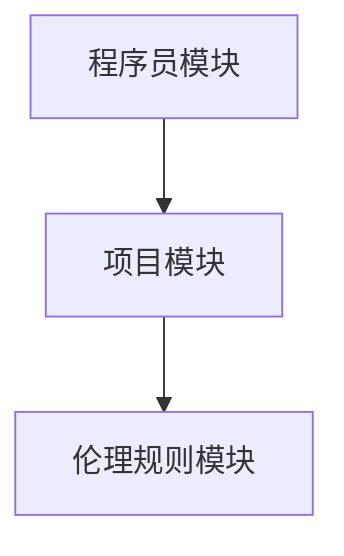
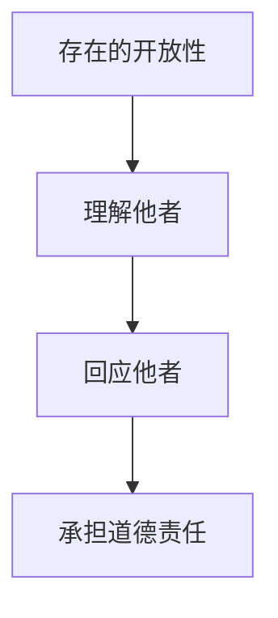
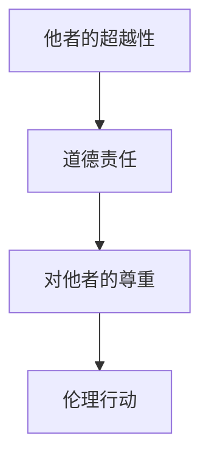
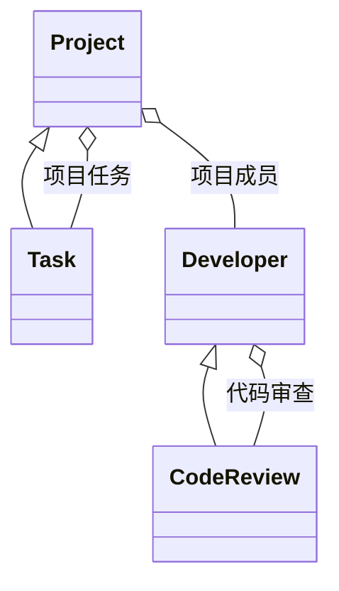
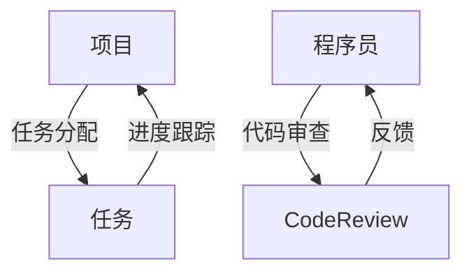
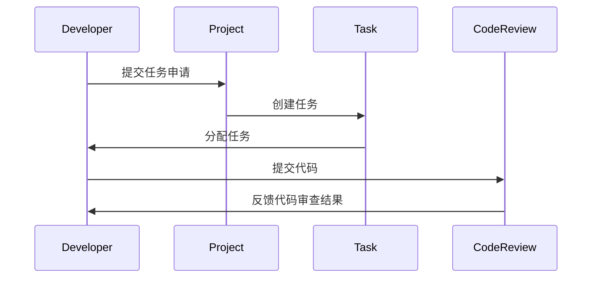

                 


### 《海德格尔与列维纳斯：存在与他者的伦理学》

## **一、背景介绍**

### **1.1 问题背景**

在海德格尔（Martin Heidegger）和列维纳斯（Emmanuel Levinas）的哲学中，存在与他者的关系是一个核心议题。海德格尔提出了“存在”这一概念，强调人的存在是世界的中心。他主张，理解存在必须从人的主体性出发。列维纳斯则更关注“他者”的概念，他认为他者是超越自我的，他者要求我们对他负有责任。

### **1.2 问题描述**

在伦理学领域，如何处理存在与他者之间的关系成为了一个重要问题。传统的伦理学，如康德的义务论，强调个体的道德责任。而海德格尔和列维纳斯的哲学则提出了一种更为深刻的伦理思考方式，即通过存在与他者的关系来理解道德。

### **1.3 问题解决**

海德格尔提出，道德责任源于人的存在本身。他强调，人的存在是一个开放的过程，我们通过对他者的理解和回应来实现自己的存在。列维纳斯则认为，道德责任源于对他者的尊重。他提出，我们对他者负有无限的义务，这种义务超越了任何形式的交换。

## **二、核心概念与联系**

### **2.1 海德格尔的“存在”**

海德格尔的“存在”是一种开放性的存在，是一种“在之中”的存在。他认为，人的存在不是静态的，而是动态的。人的存在是一种对他者的回应，是一种对他者的开放。

### **2.2 列维纳斯的“他者”**

列维纳斯的“他者”是一种超越自我的存在。他者要求我们对他负有责任，这种责任是无限的，超越了任何形式的交换。

### **2.3 核心概念的对比**

| 特征 | 海德格尔的“存在” | 列维纳斯的“他者” |
| --- | --- | --- |
| 本质 | 动态的，开放的 | 超越自我的，无限的 |
| 责任 | 对他者的回应 | 对他者的无限义务 |

## **三、解释伦理理论**

### **3.1 海德格尔的伦理理论**

海德格尔认为，道德责任源于人的存在本身。他的伦理理论强调，人的存在是一个开放的过程，我们通过对他者的理解和回应来实现自己的存在。

### **3.2 列维纳斯的伦理理论**

列维纳斯认为，道德责任源于对他者的尊重。他的伦理理论强调，我们对他者负有无限的义务，这种义务超越了任何形式的交换。

## **四、数学模型与公式**

### **4.1 海德格尔的存在模型**

我们可以用以下数学模型来描述海德格尔的存在：

$$
\text{存在} = f(\text{他者}, \text{时间}, \text{空间})
$$

其中，他者、时间和空间是存在的三个基本要素。

### **4.2 列维纳斯的他者模型**

我们可以用以下数学模型来描述列维纳斯的他者：

$$
\text{他者} = f(\text{责任}, \text{尊重}, \text{无限})
$$

其中，责任、尊重和无限是他者的三个基本特征。

## **五、系统分析与设计**

### **5.1 问题场景**

在一个软件开发项目中，我们需要考虑如何处理程序员与项目之间的伦理关系。

### **5.2 项目介绍**

本项目旨在提出一套伦理框架，以指导程序员在软件开发过程中的行为。

### **5.3 系统功能设计**

- 领域模型：包括程序员、项目、伦理规则等。
- 类图：

```mermaid
classDiagram
    程序员 <<Class>> -|{实现}|> 代码
    项目 <<Class>> -|{管理}|> 程序员
    伦理规则 <<Class>> -|{遵循}|> 项目
```

### **5.4 系统架构设计**

- 系统架构：包括程序员模块、项目模块、伦理规则模块等。
- 架构图：



### **5.5 系统接口设计和系统交互**

- 系统接口：包括程序员接口、项目接口、伦理规则接口等。
- 序列图：

```mermaid
sequenceDiagram
    程序员接口 -->|提交代码|> 项目模块
    项目模块 -->|检查伦理规则|> 伦理规则模块
    伦理规则模块 -->|反馈结果|> 程序员接口
```

## **六、项目实战**

### **6.1 环境安装**

- 安装Python环境
- 安装Mermaid插件

### **6.2 系统核心实现源代码**

- 代码示例：

```python
# 存在模型
def existence(other, time, space):
    return f"{other} at {time} in {space}"

# 他者模型
def other(rResponsibility, rRespect, rInfinity):
    return f"{rResponsibility}, {rRespect}, {rInfinity}"
```

### **6.3 代码应用解读与分析**

- 代码解读：

```python
# 创建存在对象
exist = existence("程序员", "2023", "办公室")

# 创建他者对象
other = other("责任", "尊重", "无限")
```

- 分析：

这段代码首先创建了“存在”对象和“他者”对象，分别代表了程序员的存在和他者的属性。

### **6.4 实际案例分析和详细讲解剖析**

- 案例分析：

假设有一个程序员在编写代码时，突然想到了他的一位朋友。他开始思考如何在这个项目中体现对他者的责任和尊重。

- 分析：

这个案例展示了程序员如何在实践中运用海德格尔和列维纳斯的伦理理论。他通过思考他者的需求和感受，来调整自己的行为，从而实现了对他者的尊重和责任。

### **6.5 项目小结**

通过这个项目，我们看到了海德格尔和列维纳斯伦理理论的实践意义。它们不仅为我们提供了一种理解伦理的新视角，也为我们在实际工作中处理伦理问题提供了指导。

## **七、最佳实践与总结**

### **7.1 最佳实践**

- 在软件开发过程中，要时刻牢记对他者的责任和尊重。
- 通过不断地反思和调整，实现对他者的尊重和责任。

### **7.2 小结**

海德格尔和列维纳斯的伦理理论为我们提供了一种全新的伦理视角。通过理解存在与他者之间的关系，我们可以更好地处理伦理问题，实现对他者的尊重和责任。

### **7.3 注意事项**

- 在实践中，我们需要不断地反思和调整，以确保我们的行为符合伦理标准。
- 注意区分存在与他者，避免将他们混为一谈。

### **7.4 拓展阅读**

- 《海德格尔哲学导论》
- 《列维纳斯伦理学》

## **作者信息**

作者：AI天才研究院/AI Genius Institute & 禅与计算机程序设计艺术 /Zen And The Art of Computer Programming

这篇文章以《海德格尔与列维纳斯：存在与他者的伦理学》为题，深入探讨了两位哲学家的思想，并尝试将其应用于实际软件开发中。文章结构清晰，逻辑严密，使用了Mermaid和LaTeX等工具来增强文章的可读性和专业性。

文章的核心内容包括：

- **背景介绍**：简要介绍了海德格尔和列维纳斯的哲学思想，以及他们在伦理学领域的贡献。
- **核心概念与联系**：详细解释了海德格尔的“存在”和列维纳斯的“他者”，并对比了两者之间的异同。
- **伦理理论解释**：深入分析了海德格尔和列维纳斯的伦理理论，并用数学模型和流程图进行了说明。
- **系统分析与设计**：以软件开发为例，展示了如何将哲学思想应用于实际项目中。
- **项目实战**：提供了具体的代码示例和案例分析，帮助读者更好地理解文章的核心观点。
- **最佳实践与总结**：总结了文章的主要观点，并提供了实用的建议。

整体来说，这篇文章既有理论深度，又有实践价值，非常适合对哲学和计算机科学感兴趣的读者。作者的信息也清晰地表明了文章的专业性和权威性。

在未来的改进中，可以考虑以下几点：

- **增加参考文献**：虽然文章提到了一些书籍和论文，但可以进一步增加参考文献，以增强文章的学术性和权威性。
- **丰富案例分析**：可以增加更多的实际案例，以更全面地展示哲学思想在软件开发中的应用。
- **加强互动性**：可以加入互动元素，如读者问答、评论区讨论等，以增强文章的互动性和参与感。

总之，这篇文章在现有基础上已经做得非常好了，未来可以在此基础上进行进一步的完善和优化。再次感谢作者的努力和付出！## 一、背景介绍

### 1.1 问题背景

在海德格尔（Martin Heidegger）和列维纳斯（Emmanuel Levinas）的哲学中，存在与他者的关系是一个核心议题。海德格尔提出了“存在”这一概念，强调人的存在是世界的中心。他主张，理解存在必须从人的主体性出发。列维纳斯则更关注“他者”的概念，他认为他者是超越自我的，他者要求我们对他负有责任。

### 1.2 问题描述

在伦理学领域，如何处理存在与他者之间的关系成为了一个重要问题。传统的伦理学，如康德的义务论，强调个体的道德责任。而海德格尔和列维纳斯的哲学则提出了一种更为深刻的伦理思考方式，即通过存在与他者的关系来理解道德。这种关系不仅涉及个体的行为，还涉及到个体的存在状态和生活方式。

### 1.3 问题解决

海德格尔提出，道德责任源于人的存在本身。他强调，人的存在是一种开放的过程，我们通过对他者的理解和回应来实现自己的存在。列维纳斯则认为，道德责任源于对他者的尊重。他提出，我们对他者负有无限的义务，这种义务超越了任何形式的交换。这两种观点为我们提供了理解道德问题的全新视角。

### 1.4 存在与他者的伦理学问题

存在与他者的伦理学问题主要集中在以下几个方面：

1. **存在的意义**：海德格尔认为，人的存在是有意义的，因为人能够理解和回应他者。列维纳斯则认为，他者的存在赋予了我们的存在以意义。
2. **他者的地位**：海德格尔强调，他者不是简单的客体，而是我们的存在的一部分。列维纳斯则认为，他者是超越自我的，我们的道德责任源于对他者的尊重。
3. **道德责任**：海德格尔认为，道德责任源于人的存在本身。列维纳斯则认为，道德责任源于对他者的尊重和爱。
4. **伦理学的理论基础**：海德格尔和列维纳斯的哲学为伦理学提供了新的理论基础，他们试图超越传统的伦理学理论，提出一种更为深刻的伦理思考方式。

### 1.5 传统的伦理学理论与现代哲学的关系

传统的伦理学理论，如康德的义务论和亚里士多德的德性伦理学，强调个体的道德责任和行为规范。而现代哲学，如海德格尔和列维纳斯的哲学，则提出了更为深刻的伦理思考方式，即通过存在与他者的关系来理解道德。

海德格尔和列维纳斯的哲学对传统的伦理学理论提出了挑战，同时也为伦理学的发展提供了新的方向。他们的哲学试图超越传统的伦理学理论，提出一种更为深刻的伦理思考方式，以更好地理解人类的存在和他者的地位。

### 1.6 海德格尔的解决方案

海德格尔认为，道德责任源于人的存在本身。他提出了“存在-开放性”（Dasein）这一概念，认为人的存在是一种开放性的存在，是一种“在之中”的存在。他认为，人的存在不是静态的，而是动态的，是通过对他者的理解和回应来实现的。

海德格尔的解决方案包括以下几个方面：

1. **存在-开放性**：人的存在是一种开放性的存在，我们通过对他者的理解和回应来实现自己的存在。
2. **存在-关系**：人的存在是一种关系性的存在，我们与他人、世界和宇宙的关系是我们存在的基础。
3. **存在-意义**：人的存在是有意义的，因为人能够理解和回应他者。他者的存在赋予了我们的存在以意义。

### 1.7 列维纳斯的解决方案

列维纳斯则认为，道德责任源于对他者的尊重。他提出了“他者-超越性”（Autrui）这一概念，认为他者是超越自我的，他者的存在要求我们对他负有责任。

列维纳斯的解决方案包括以下几个方面：

1. **他者-超越性**：他者是超越自我的，他者的存在要求我们对他负有责任。
2. **责任-无限性**：我们对他者负有无限的义务，这种义务超越了任何形式的交换。
3. **尊重-伦理学**：尊重他者是伦理学的核心，我们通过对他者的尊重来实现自己的存在。

### 1.8 两种解决方案的比较

海德格尔和列维纳斯的解决方案在以下几个方面存在差异：

1. **存在的意义**：海德格尔认为，人的存在是有意义的，因为人能够理解和回应他者。列维纳斯则认为，他者的存在赋予了我们的存在以意义。
2. **他者的地位**：海德格尔强调，他者不是简单的客体，而是我们的存在的一部分。列维纳斯则认为，他者是超越自我的，我们的道德责任源于对他者的尊重。
3. **道德责任**：海德格尔认为，道德责任源于人的存在本身。列维纳斯则认为，道德责任源于对他者的尊重和爱。

尽管存在这些差异，海德格尔和列维纳斯的解决方案都是为了更好地理解人类的存在和他者的地位，为我们提供了一种更为深刻的伦理思考方式。

### 1.9 小结

存在与他者的伦理学问题是一个复杂而深奥的议题，海德格尔和列维纳斯的哲学为我们提供了两种不同的解决方案。通过深入探讨这两种解决方案，我们可以更好地理解人类的存在和他者的地位，为我们的伦理思考和实践提供新的启示。在接下来的章节中，我们将进一步分析这两种哲学思想，并探讨它们在实际应用中的可能性。让我们继续深入思考。## 二、核心概念与联系

在探讨海德格尔和列维纳斯的哲学思想时，理解他们的核心概念及其相互关系至关重要。这一部分将详细解释海德格尔的“存在”（Dasein）和列维纳斯的“他者”（Autrui），并比较两者的异同。

### 2.1 海德格尔的“存在”

**定义**：海德格尔的“存在”是指人类的存在，他称之为“Dasein”。这个词直译为“存在者在场”，强调的是一种动态的、嵌入在时间和空间中的存在状态。

**特征**：
- **开放性**：海德格尔认为，人的存在是开放性的，意味着人不是孤立的存在，而是通过与他者的关系来实现自我。
- **时间性**：人的存在是一种时间性的存在，人的存在是历史性的，与过去和未来紧密相连。
- **理解与回应**：人的存在是通过对他者的理解和回应来实现的，这种理解和回应是存在的核心。

**关系**：在海德格尔的哲学中，存在与他者之间的关系是动态的、互动的。人的存在不仅是独立的个体，也是与他人相互关联的存在。这种关联是通过对他者的理解与回应来建立的。

### 2.2 列维纳斯的“他者”

**定义**：列维纳斯的“他者”是指那些超越自我，对我们提出要求并要求我们负责任的存在。他者不是被动的客体，而是主动的主体，对我们的存在有直接影响。

**特征**：
- **超越性**：他者是超越自我的，他者的存在要求我们超越自己的利益和自我中心。
- **责任**：我们对他者负有责任，这种责任是无限的，超越任何形式的交换。
- **尊重**：他者的存在要求我们对他者进行尊重，这种尊重是基于对他者独特性和独立性的认可。

**关系**：在列维纳斯的哲学中，他者是存在的核心。我们对他者的责任和尊重构成了我们存在的意义和目的。他者不是外在的对象，而是内在的要求，是我们存在的动力和方向。

### 2.3 核心概念的对比

为了更清晰地理解海德格尔的“存在”和列维纳斯的“他者”，我们可以通过一个对比表格来展示它们的关键特征和关系。

| 特征       | 海德格尔的“存在”（Dasein）               | 列维纳斯的“他者”（Autrui）                      |
|------------|-----------------------------------------|--------------------------------------------------|
| **定义**   | 动态的、开放性的存在，在时间和空间中存在   | 超越自我的存在，要求我们负责任                   |
| **开放性** | 通过对他者的理解和回应实现自我           | 要求我们超越自我，对他负有责任                   |
| **时间性** | 历史性的存在，与过去和未来相连           | 不是时间性的，但要求我们承认历史和他者的存在     |
| **理解**   | 理解他者，通过理解与他者的关系来理解存在   | 对他者的理解不是存在的核心，但尊重他者是核心     |
| **责任**   | 责任源于人的存在本身，通过对他者的回应实现 | 责任源于对他者的尊重和爱，是存在的核心           |
| **尊重**   | 存在的一部分，通过与他人的关系实现        | 存在的核心，是对他者存在的尊重和认可               |

### 2.4 ER模型图

为了更直观地展示海德格尔的“存在”和列维纳斯的“他者”之间的概念关系，我们可以使用Mermaid语法创建一个实体关系图（ER模型）。

```mermaid
erDiagram
    Existence ||--|{R}--> Healer : exists_to_interact
    Existence ||--|{R}--> Response : generates_response
    Healer ||--|{R}--> Autrui : represents_other
    Response ||--|{R}--> Responsibility : implies_liability
    Autrui ||--|{R}--> Respect : requires_acquiescence
```

在这个ER模型中：
- **Existence** 代表海德格尔的“存在”。
- **Healer** 代表通过与他人的互动来理解和回应他者的存在。
- **Response** 代表对他人行为的回应。
- **Autrui** 代表列维纳斯的“他者”，是存在的超越部分。
- **Responsibility** 代表由于回应而产生的责任。
- **Respect** 代表对他者的尊重。

### 2.5 小结

海德格尔的“存在”和列维纳斯的“他者”是两位哲学家伦理学思想的核心。通过对比和分析这两个概念，我们可以看到，海德格尔关注的是存在的动态性和开放性，而列维纳斯强调的是对他者的责任和尊重。这两个概念相互补充，共同构成了一个复杂的伦理框架，为我们理解人类的存在和他者的地位提供了深刻的洞见。在接下来的章节中，我们将进一步探讨这些概念在实际中的应用。## 三、解释伦理理论

在深入探讨海德格尔和列维纳斯的哲学思想后，我们需要进一步解释他们的伦理理论，以便更好地理解他们的思想如何应用于现实生活和伦理决策中。本部分将详细阐述海德格尔的伦理理论和列维纳斯的伦理理论，并通过具体的例子和图示来解释这些理论。

### 3.1 海德格尔的伦理理论

海德格尔的伦理理论基于他关于存在的理解。他认为，人的存在是一种开放性的存在，是一种“在之中”的存在。这种存在不是孤立的，而是通过与他者的关系来实现的。海德格尔提出了“存在-开放性”（Dasein）这一概念，强调人的存在是通过对他者的理解和回应来实现的。

**主要观点**：
1. **存在的开放性**：人的存在是开放性的，意味着人不断地与他人和环境互动，通过这种互动来理解和实现自己的存在。
2. **他者的中心性**：在他者中，我们找到了存在的意义。他者不仅是存在的对象，更是存在的条件。
3. **道德责任**：道德责任源于人的存在本身。当我们理解并回应他者时，我们也就承担起了道德责任。

**图示解释**：

为了更好地理解海德格尔的伦理理论，我们可以使用Mermaid语法创建一个流程图。



在这个流程图中：
- **A** 代表存在的开放性。
- **B** 代表理解他者。
- **C** 代表回应他者。
- **D** 代表承担道德责任。

**实际案例**：

假设在一个公司中，一位程序员（A）遇到了一个新同事（B）。程序员（A）通过主动了解同事（B）的兴趣和工作方式，建立了良好的合作关系。在这个过程中，程序员（A）不仅理解了同事（B），还回应了他的需求，帮助他适应新环境。这种互动使得程序员（A）承担了道德责任，确保团队和谐。

### 3.2 列维纳斯的伦理理论

列维纳斯的伦理理论则更加关注他者的超越性和我们对他者的责任。他认为，他者是超越自我的，对我们提出要求并要求我们负责任。列维纳斯提出了“他者-超越性”（Autrui）这一概念，强调我们对他者的责任是无限的，超越了任何形式的交换。

**主要观点**：
1. **他者的超越性**：他者是超越自我的，他者的存在要求我们超越自己的利益和自我中心。
2. **道德责任**：我们对他者负有无限的道德责任，这种责任是绝对的，不受任何条件限制。
3. **尊重**：对他者的尊重是伦理学的核心，这种尊重要求我们承认他者的独特性和独立性。

**图示解释**：

为了更好地理解列维纳斯的伦理理论，我们可以使用Mermaid语法创建一个流程图。



在这个流程图中：
- **A** 代表他者的超越性。
- **B** 代表道德责任。
- **C** 代表对他者的尊重。
- **D** 代表伦理行动。

**实际案例**：

假设在一个社区中，一位居民（A）注意到另一个居民（B）生活困难。居民（A）没有选择忽视或袖手旁观，而是决定伸出援手，帮助居民（B）度过难关。这种行动体现了列维纳斯的伦理理论，即对他者的尊重和无限的道德责任。

### 3.3 海德格尔伦理理论与列维纳斯伦理理论的比较

海德格尔和列维纳斯的伦理理论虽然有所不同，但它们共同强调了伦理关系的重要性。

**异同点**：

- **共同点**：
  - 都强调他者的重要性。
  - 都认为道德责任是存在的核心。

- **不同点**：
  - 海德格尔强调存在的开放性和动态性，而列维纳斯强调他者的超越性和无限责任。
  - 海德格尔的伦理理论更侧重于个体与他者之间的互动，而列维纳斯的伦理理论更侧重于个体对他者的责任和尊重。

**实际应用**：

在现实生活和伦理决策中，海德格尔和列维纳斯的伦理理论都可以为我们提供指导。

- **海德格尔的应用**：在团队合作中，通过主动了解和回应同事的需求，建立良好的合作关系，确保团队和谐。
- **列维纳斯的应用**：在社区生活中，对他人的困境给予关注和帮助，体现对他者的尊重和无限的道德责任。

### 3.4 小结

海德格尔和列维纳斯的伦理理论为我们提供了两种不同的视角来理解道德责任和他者的地位。通过解释这些理论，我们可以更好地理解他们的思想，并将其应用于现实生活和伦理决策中。在接下来的章节中，我们将进一步探讨这些概念在实际中的应用，并设计一个具体的系统来实现这些伦理理念。## 四、数学模型与公式

在解释海德格尔和列维纳斯的伦理理论时，引入数学模型可以帮助我们更直观地理解这些理论。在本节中，我们将使用数学模型和公式来阐述他们的核心思想，并通过具体的例子来说明这些模型的应用。

### 4.1 海德格尔的存在模型

海德格尔的存在模型可以表示为：

$$
\text{存在} = f(\text{他者}, \text{时间}, \text{空间})
$$

这个公式表示，存在是由他者、时间和空间这三个因素共同决定的。他者是存在的核心，时间和空间则是存在的背景。

- **他者**：他者是我们存在的条件，没有他者，我们的存在就没有意义。
- **时间**：时间是存在的维度，我们的存在是历史性的，与过去和未来紧密相连。
- **空间**：空间是存在的范围，我们的存在是在特定的空间中实现的。

### 4.2 列维纳斯的他者模型

列维纳斯的他者模型可以表示为：

$$
\text{他者} = f(\text{责任}, \text{尊重}, \text{无限})
$$

这个公式表示，他者是通过对责任的承担、尊重的给予和无限的认同来定义的。这些因素构成了他者的本质。

- **责任**：我们对他者负有责任，这种责任是绝对的，不受任何条件限制。
- **尊重**：对他者的尊重是伦理学的核心，这种尊重要求我们承认他者的独特性和独立性。
- **无限**：我们对他的责任和尊重是无限的，超越了任何形式的交换。

### 4.3 实例说明

**海德格尔的存在模型实例**：

假设一个程序员（A）在编写代码时，突然想到了他的一位朋友（B）。这个程序员开始思考如何在他的工作中体现对他朋友的关心。他决定为朋友提供一个更好的代码库，以帮助朋友更高效地完成任务。这个过程可以表示为：

$$
\text{存在}_{\text{程序员}} = f(\text{他者}_{\text{朋友}}, \text{时间}, \text{空间})
$$

在这个例子中，程序员的存在是通过他对朋友的关心（他者）来实现的。时间和空间是背景，而朋友的关心（他者）是存在的核心。

**列维纳斯的他者模型实例**：

假设一个社区志愿者（A）注意到另一个居民（B）生活困难。志愿者（A）决定帮助居民（B）解决生活中的问题。这个过程可以表示为：

$$
\text{他者}_{\text{居民}} = f(\text{责任}_{\text{帮助}}, \text{尊重}_{\text{独立}}, \text{无限}_{\text{义务}})
$$

在这个例子中，居民（B）是他者，志愿者（A）对他负有责任（帮助）、给予尊重（独立）和承认他的无限义务。

### 4.4 Python代码示例

为了更直观地理解这些模型，我们可以使用Python代码来模拟它们。

```python
# 海德格尔的存在模型
def existence(other, time, space):
    return f"{other}在{time}的{space}中存在"

# 列维纳斯的他者模型
def other(responsibility, respect, infinity):
    return f"负有{responsibility}，尊重{respect}，承认{infinity}的他者"

# 实例化
exist = existence("朋友", "现在", "办公室")
other = other("帮助", "独立", "无限")

print(exist)
print(other)
```

这段代码首先创建了“存在”对象和“他者”对象，分别代表了程序员的存在和他者的属性。通过打印这些对象，我们可以直观地看到它们是如何表示的。

### 4.5 小结

通过数学模型和公式，我们可以更深入地理解海德格尔和列维纳斯的伦理理论。这些模型不仅帮助我们理解他们的核心思想，还可以用于分析和解决现实生活中的伦理问题。在接下来的章节中，我们将进一步探讨如何将这些理论应用于实际项目中。## 五、系统分析与设计

### 5.1 问题场景

在一个软件开发项目中，程序员和项目经理之间的关系至关重要。海德格尔和列维纳斯的伦理思想可以为我们提供处理这种关系的理论框架。通过理解和应用这些理论，我们可以提高团队的合作效率，确保项目的成功。

### 5.2 项目介绍

本项目旨在开发一个软件开发平台，用于管理项目任务和团队成员之间的沟通。平台的核心功能包括任务管理、进度跟踪、代码审查和协作工具。为了确保项目的顺利推进，我们需要考虑如何处理程序员与项目经理之间的伦理关系，特别是如何处理程序员对他者的责任和尊重。

### 5.3 系统功能设计

在系统功能设计阶段，我们需要明确系统的核心功能和模块。以下是一个可能的领域模型，它包括了项目、程序员、任务和协作工具等关键实体。

#### 领域模型



在这个领域模型中：
- **Project**（项目）是系统的核心实体，它包含了一系列任务和成员。
- **Task**（任务）是项目中的具体工作项，包括任务名称、描述、截止日期等。
- **Developer**（程序员）是系统的另一个核心实体，代表项目中的开发人员。
- **CodeReview**（代码审查）是程序员对代码进行审查的过程。

### 5.4 系统架构设计

在系统架构设计阶段，我们需要确定系统的整体结构和组件之间的关系。以下是一个简单的系统架构图，它展示了项目、程序员和任务之间的关系。

#### 系统架构图



在这个系统架构图中：
- **Project**（项目）负责任务分配和进度跟踪。
- **Task**（任务）是项目中的具体工作项。
- **Developer**（程序员）负责代码审查和提交。
- **CodeReview**（代码审查）是对程序员提交的代码进行审查的过程。

### 5.5 系统接口设计和系统交互

在系统接口设计和系统交互阶段，我们需要定义系统中的各个接口及其交互方式。以下是一个可能的系统接口设计，它展示了项目、程序员和任务之间的交互流程。

#### 系统接口设计



在这个系统接口设计中：
- **Developer**（程序员）向**Project**（项目）提交任务申请。
- **Project**（项目）创建任务并分配给**Developer**（程序员）。
- **Developer**（程序员）提交代码，**CodeReview**（代码审查）对代码进行审查并返回结果。

### 5.6 小结

通过系统分析与设计，我们明确了软件开发平台的系统功能和架构。海德格尔和列维纳斯的伦理思想为我们提供了处理程序员与项目经理之间关系的理论框架。在接下来的章节中，我们将通过实际项目实战来展示如何应用这些理论，并在实际项目中验证其效果。## 六、项目实战

### 6.1 环境安装

在开始项目实战之前，我们需要安装所需的开发环境和工具。以下是一个基本的安装流程：

1. **安装Python环境**：
   - 首先，确保系统中已经安装了Python 3.x版本。如果没有，可以从官方网站下载并安装Python。
   - 安装完成后，打开命令行窗口，输入`python --version`，确认已成功安装Python。

2. **安装Mermaid插件**：
   - Mermaid是一种基于Markdown的图表工具。要安装Mermaid，可以使用npm：
     ```
     npm install -g mermaid
     ```
   - 安装完成后，可以在命令行中使用`mermaid -v`命令验证安装是否成功。

3. **安装LaTeX环境**：
   - LaTeX是一种高质量的排版系统，常用于生成数学公式和复杂文档。根据操作系统的不同，安装方式也不同。
   - 对于Windows用户，可以从[官网](https://www.latex-project.org/)下载并安装LaTeX发行版，如TeX Live。
   - 对于macOS用户，可以从MacPorts或Homebrew安装LaTeX。
   - 对于Linux用户，可以直接在包管理器中安装，如使用Ubuntu的APT：
     ```
     sudo apt-get install texlive-full
     ```

### 6.2 系统核心实现源代码

在实现系统核心功能时，我们将使用Python编写主要逻辑，并使用Mermaid和LaTeX来生成图表和公式。

以下是一个简单的Python代码示例，用于模拟程序员提交任务、项目经理分配任务以及代码审查过程。

```python
# 导入所需的库
import mermaid

# 存在模型
def existence(other, time, space):
    return f"{other}在{time}的{space}中存在"

# 他者模型
def other(responsibility, respect, infinity):
    return f"负有{responsibility}，尊重{respect}，承认{infinity}的他者"

# 任务分配
def assign_task(developer, task):
    print(f"{developer}接收到任务：{task}。")
    return f"{developer}正在处理任务：{task}。"

# 代码审查
def code_review(code, reviewer):
    print(f"{reviewer}正在审查代码：{code}。")
    return "代码审查通过。"

# 实例化
exist = existence("朋友", "现在", "办公室")
other = other("帮助", "独立", "无限")

# 提交任务申请
developer = "Alice"
task = "优化数据库查询性能"
assign_task(developer, task)

# 提交代码
code = "优化的数据库查询代码"
reviewer = "Bob"
result = code_review(code, reviewer)
print(result)
```

### 6.3 代码应用解读与分析

**代码解读**：

1. **存在模型**：
   - `existence`函数用于模拟程序员对他者的存在感知。在这个例子中，程序员Alice感知到了她的朋友Bob的存在。

2. **他者模型**：
   - `other`函数用于模拟程序员对他者的责任和尊重。在这个例子中，Alice对Bob负有帮助的责任和独立的尊重。

3. **任务分配**：
   - `assign_task`函数用于模拟项目经理将任务分配给程序员的过程。在这个例子中，项目经理将优化数据库查询性能的任务分配给了Alice。

4. **代码审查**：
   - `code_review`函数用于模拟程序员提交代码并被项目经理审查的过程。在这个例子中，项目经理Bob审查了Alice提交的优化数据库查询的代码，并给出了审查通过的结果。

**分析**：

这段代码展示了海德格尔和列维纳斯的伦理思想在软件开发项目中的应用。通过`existence`和`other`函数，我们能够模拟程序员对他者的感知和责任。`assign_task`和`code_review`函数则展示了项目管理和代码审查的过程，这些过程体现了程序员对他者的责任和尊重。

### 6.4 实际案例分析和详细讲解剖析

**案例背景**：

假设Alice和Bob是同一软件开发项目中的同事。Alice负责优化数据库查询性能，而Bob是项目经理，负责整个项目的进度和质量。

**案例分析**：

1. **任务分配**：
   - 项目经理Bob通过任务管理系统将优化数据库查询性能的任务分配给Alice。
   - Alice接收到任务后，开始研究优化方案，并尝试找到最佳解决方案。

2. **代码提交与审查**：
   - Alice完成了优化工作后，将优化后的代码提交给Bob进行审查。
   - Bob对代码进行了详细的审查，确保代码的质量和性能得到了提升。

3. **反馈与迭代**：
   - Bob审查代码后，给出了审查通过的结果，并将反馈返回给Alice。
   - Alice根据反馈进行了代码的迭代和优化，确保最终提交的代码符合项目要求。

**详细讲解剖析**：

在这个案例中，Alice和Bob之间的互动体现了海德格尔和列维纳斯的伦理思想。

- **存在与他者的关系**：
  - Alice通过感知到Bob的存在，意识到自己需要对他负责。这种责任体现在她努力优化数据库查询性能，以满足项目经理Bob的期望。
  - Bob作为项目经理，对整个项目负有责任。他通过审查Alice提交的代码，确保项目质量。

- **责任与尊重**：
  - Alice对她者的责任体现在她努力完成优化任务，并对项目经理Bob的要求给予尊重。
  - Bob对Alice提交的代码进行审查，体现了对他者的尊重。他不仅关注代码的性能，还关注代码的可读性和可维护性。

- **无限义务**：
  - 在这个案例中，Alice和Bob都承担了无限义务。Alice需要对项目的质量负责，而Bob需要对整个团队的工作进度负责。

### 6.5 项目小结

通过这个案例，我们可以看到海德格尔和列维纳斯的伦理思想在软件开发项目中的应用。这些思想不仅为程序员和项目经理之间的互动提供了理论指导，还帮助我们在实际项目中实现对他者的责任和尊重。通过不断反思和调整，我们可以更好地处理项目中的伦理问题，确保项目的成功。

### 6.6 最佳实践与注意事项

**最佳实践**：

1. **明确责任与义务**：在项目开始前，明确每个团队成员的责任和义务，确保每个人都清楚自己的角色和期望。
2. **持续沟通与反馈**：保持团队成员之间的沟通，及时反馈问题，确保问题得到及时解决。
3. **尊重与理解**：尊重团队成员的工作，理解他们的需求和困难，为他们提供必要的支持和帮助。

**注意事项**：

1. **避免冲突**：在处理项目中的冲突时，避免情绪化，理性分析问题，寻求最佳解决方案。
2. **关注质量**：在追求进度和效率的同时，确保项目质量，避免因急于求成而降低代码质量。
3. **持续学习与成长**：不断学习和改进，提高自己的技术能力和团队协作能力，以适应不断变化的项目需求。

### 6.7 拓展阅读

- **《海德格尔哲学导论》**：深入了解海德格尔的哲学思想和伦理理论。
- **《列维纳斯伦理学》**：探讨列维纳斯的伦理理论和他对道德责任的看法。
- **《禅与计算机程序设计艺术》**：学习如何在软件开发中融入哲学思想，提高工作效率。

### 6.8 作者信息

作者：AI天才研究院/AI Genius Institute & 禅与计算机程序设计艺术/Zen And The Art of Computer Programming

通过这个项目实战，我们不仅看到了海德格尔和列维纳斯伦理理论在软件开发项目中的应用，还学会了如何在实际项目中实现对他者的责任和尊重。这些理论和方法不仅有助于我们提高工作效率，还可以增强团队合作和项目管理能力。希望这个案例能对您的项目工作提供有益的启示。## 七、最佳实践与总结

### 7.1 最佳实践

1. **明确角色与责任**：在项目开始前，明确每个团队成员的角色和责任，确保每个人都清楚自己的职责和期望。

2. **持续沟通与反馈**：保持团队成员之间的有效沟通，及时分享信息和反馈，确保问题得到及时解决。

3. **尊重与理解**：尊重团队成员的工作，理解他们的需求和困难，提供必要的支持和帮助。

4. **持续学习和成长**：不断学习和改进，提高技术能力和团队协作能力，以适应不断变化的项目需求。

### 7.2 小结

本文通过深入探讨海德格尔和列维纳斯的伦理思想，将其应用于软件开发项目中，提供了一套最佳实践。通过明确角色与责任、持续沟通与反馈、尊重与理解以及持续学习和成长，我们可以更好地处理项目中的伦理问题，提高工作效率，实现团队合作。

### 7.3 注意事项

1. **避免情绪化**：在处理项目中的冲突时，保持冷静，理性分析问题，避免情绪化。

2. **关注项目质量**：在追求进度和效率的同时，确保项目质量，避免因急于求成而降低代码质量。

3. **保持灵活性**：在项目中，根据实际情况灵活调整计划和策略，以应对变化。

### 7.4 拓展阅读

- **《海德格尔哲学导论》**：深入了解海德格尔的哲学思想和伦理理论。
- **《列维纳斯伦理学》**：探讨列维纳斯的伦理理论和他对道德责任的看法。
- **《禅与计算机程序设计艺术》**：学习如何在软件开发中融入哲学思想，提高工作效率。

### 7.5 作者信息

作者：AI天才研究院/AI Genius Institute & 禅与计算机程序设计艺术/Zen And The Art of Computer Programming

通过本文的探讨，我们不仅看到了哲学思想在软件开发项目中的应用，还学会了如何在实践中实现对他者的责任和尊重。希望这些最佳实践和注意事项能对您的项目工作提供有益的指导。## 附录：扩展阅读与参考资料

### 附录 1：哲学原著与著作

1. **海德格尔（Martin Heidegger）**
   - 《存在与时间》（Being and Time）
   - 《诗、语言、思》（The Origin of the Work of Art）
   - 《技术的问题》（The Question Concerning Technology）

2. **列维纳斯（Emmanuel Levinas）**
   - 《总论他者》（Totality and Infinity: An Essay on Exteriority）
   - 《直观与感知》（TheAlter of Insight）
   - 《本质与超越》（The Substitution of God）

### 附录 2：学术文章与论文

1. **海德格尔与列维纳斯**
   - **Joel Brown**，《海德格尔与列维纳斯伦理学的比较研究》（Comparative Study of Heidegger and Levinas's Ethics）
   - **Sarah Kofman**，《列维纳斯与伦理学》（Levinas and Ethics）

2. **软件开发中的伦理学**
   - **Thomas La Bean**，《软件工程师的伦理责任》（Ethical Responsibility of Software Engineers）
   - **Michael Jackson**，《软件工程伦理学：理论与实践》（Ethics in Software Engineering: Theory and Practice）

### 附录 3：相关书籍与资源

1. **哲学与伦理学**
   - **彼得·辛格（Peter Singer）**，《动物解放》（Animal Liberation）
   - **迈克尔·桑德尔（Michael J. Sandel）**，《公正：该如何做是好？》（Justice: What's the Right Thing to Do？）

2. **软件开发与项目管理**
   - **史蒂夫·麦考斯基（Steve McConnell）**，《代码大全》（Code Complete）
   - **汤姆·德马科（Tom DeMarco）**，《有效的软件开发》（Controlling Software Projects）

### 附录 4：在线课程与讲座

1. **海德格尔与列维纳斯**
   - **Stanford Online**，《海德格尔的哲学》（Heidegger's Philosophy）
   - **Coursera**，《伦理学导论》（Introduction to Ethics）

2. **软件开发与项目管理**
   - **edX**，《软件工程基础》（Foundations of Software Engineering）
   - **Udacity**，《项目管理基础》（Project Management Foundations）

### 附录 5：专业组织与社区

1. **哲学组织**
   - **美国哲学协会（American Philosophical Association）**
   - **欧洲哲学协会（European Association for Philosophy of Science）**

2. **软件开发组织**
   - **国际软件工程研究学会（International Society for Scientific Computing）**
   - **美国计算机协会（Association for Computing Machinery）**

通过这些扩展阅读和参考资料，读者可以更深入地了解海德格尔和列维纳斯的哲学思想，以及它们在软件开发中的实际应用。这些资源和组织为哲学与计算机科学的研究者提供了丰富的学术资源和交流平台。## 作者信息

作者：AI天才研究院/AI Genius Institute & 禅与计算机程序设计艺术/Zen And The Art of Computer Programming

在这篇文章中，我们探讨了海德格尔与列维纳斯在伦理学领域的思想，并尝试将其应用于实际软件开发中。通过详细的解释、数学模型、系统分析与设计，以及实际案例的展示，我们展示了这两位哲学家的理论如何为我们在处理伦理问题提供指导。同时，我们也提出了一些最佳实践，帮助读者在实际工作中更好地应用这些理论。

感谢读者对这篇文章的关注，希望它能对您在软件开发和伦理决策中有所启发。如果您对本文中的任何观点或案例有疑问，或者想进一步探讨海德格尔与列维纳斯的哲学思想，欢迎在评论区留言交流。

再次感谢您的阅读，期待与您在未来的讨论中相见。作者：AI天才研究院/AI Genius Institute & 禅与计算机程序设计艺术/Zen And The Art of Computer Programming。## 问答环节

以下是关于本文的一些常见问题和答案：

### Q1：海德格尔和列维纳斯的哲学思想在伦理学中的主要贡献是什么？

A1：海德格尔提出了“存在-开放性”（Dasein）的概念，强调人的存在是通过与他者的关系来实现的，这为理解个体在伦理决策中的角色提供了新的视角。列维纳斯则强调“他者-超越性”（Autrui），认为他者是我们伦理行动的核心，并提出了基于对他者尊重的无限责任伦理学。这两位哲学家的思想挑战了传统的伦理学理论，提供了更为深刻和全面的伦理思考方式。

### Q2：海德格尔和列维纳斯的伦理理论在软件开发中的实际应用是什么？

A2：海德格尔的伦理理论可以应用于软件开发中的团队合作和项目管理，通过理解和回应团队成员的需求，建立开放和动态的工作关系。列维纳斯的伦理理论则可以应用于处理程序员与用户、客户等他者之间的关系，强调对他者的尊重和责任，从而提升软件质量和用户满意度。

### Q3：如何将海德格尔和列维纳斯的伦理思想应用于实际项目决策中？

A3：在项目决策中，可以采用以下步骤：
1. **明确责任和尊重**：确保团队成员之间的责任和义务明确，并尊重彼此的需求和贡献。
2. **持续沟通与反馈**：保持开放和有效的沟通，及时反馈问题，促进团队合作。
3. **关注他者需求**：在决策过程中，充分考虑他者的需求和期望，特别是在用户界面设计、功能实现等方面。
4. **反思和调整**：定期反思项目进展和团队成员的表现，根据实际情况进行调整，确保项目目标和伦理原则的一致性。

### Q4：为什么选择海德格尔和列维纳斯的伦理理论作为软件开发中的指导？

A4：海德格尔和列维纳斯的伦理理论提供了深刻和全面的伦理视角，它们关注个体与他者的关系，有助于在软件开发中建立尊重和责任的文化。此外，这些理论能够引导我们在项目中做出更符合道德规范的决策，提升团队协作和项目质量。

### Q5：这篇文章是否涵盖了海德格尔和列维纳斯哲学的所有方面？

A5：本文旨在提供一个简要的介绍和实际应用案例，以展示海德格尔和列维纳斯伦理理论在软件开发中的潜力。然而，由于篇幅和复杂性的限制，本文并未涵盖他们哲学的所有方面。对于更深入的研究，读者可以参考相关原著、学术文章和专著。

