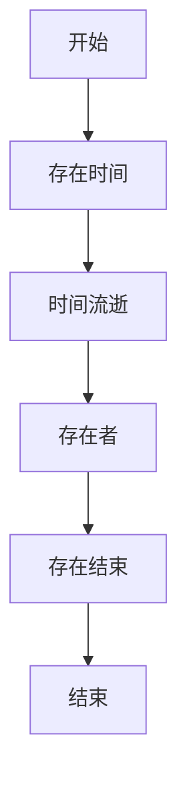
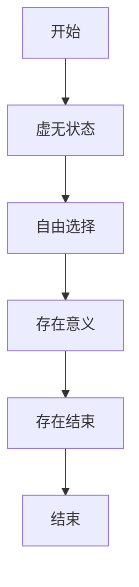

                 

## 文章标题

“海德格尔与萨特：存在与虚无的对话”

### 文章关键词

海德格尔，萨特，存在，虚无，哲学，算法，系统架构，项目实战

### 摘要

本文以海德格尔与萨特的哲学思想为出发点，探讨了存在与虚无这一哲学命题在计算机科学领域的应用。文章通过逻辑清晰的分析和推理，将哲学思想与算法、系统架构以及项目实战相结合，旨在为读者提供一种新的思考方式和解决问题的方法。本文包括五个部分：背景介绍、核心概念与联系、算法原理讲解、系统分析与架构设计方案以及项目实战。通过逐步深入的分析，本文旨在揭示存在与虚无的本质，并探讨其在计算机科学中的实际应用。

## 背景介绍

### 1.1 海德格尔的哲学思想

#### 1.1.1 海德格尔的生平

马丁·海德格尔（Martin Heidegger，1889-1976）是20世纪最伟大的哲学家之一。他生于德国符腾堡州梅斯基尔希，后就读于弗莱堡大学，师从著名哲学家胡塞尔（Edmund Husserl）。海德格尔的哲学思想深受胡塞尔的现象学影响，但他最终走向了与胡塞尔不同的方向。

海德格尔最著名的著作是《存在与时间》（Being and Time），在这部作品中，他提出了“存在”（Dasein）这一核心概念，探讨人类存在的意义。他认为，存在是一种“存在者”，而不是一种实体。存在的本质在于其“时间性”，即存在的每一瞬间都是独一无二的。

#### 1.1.2 海德格尔的核心观点

海德格尔的核心观点可以总结为以下几点：

1. **存在的本质是“存在者”**：存在者不是某种具体的实体，而是人类的存在。存在的本质在于其时间性，即存在的每一瞬间都是独一无二的。

2. **存在的“虚无性”**：海德格尔认为，存在是“虚无”（Nichtda-sein）的，这意味着存在并不是某种固定不变的东西，而是一种动态的过程。

3. **存在的“自由性”**：海德格尔认为，人类的存在具有自由性，人类可以通过自己的选择来塑造自己的存在。

### 1.2 萨特的哲学思想

让-保罗·萨特（Jean-Paul Sartre，1905-1980）是法国哲学家， existentialism（存在主义）的创始人之一。他最著名的著作是《存在与虚无》（Being and Nothingness），在这部作品中，他探讨了人类存在的意义和自由。

#### 1.2.1 萨特的生平

萨特出生于巴黎，早年就读于巴黎高等师范学院，与西蒙娜·德·波伏娃（Simone de Beauvoir）相识相恋。萨特一生倡导自由、平等和反对专制，他的哲学思想对20世纪西方哲学和社会运动产生了深远的影响。

#### 1.2.2 萨特的核心观点

萨特的核心观点可以总结为以下几点：

1. **存在的本质是“虚无”**：萨特认为，存在是“虚无”（Nihil）的，这意味着人类最初是没有任何意义的。人类的存在是在虚无中寻找意义的。

2. **存在的“自由性”**：萨特认为，人类的存在是自由的，人类可以通过自己的选择来创造自己的意义。

3. **存在的“责任性”**：萨特认为，自由意味着责任。人类必须为自己的选择承担责任。

### 1.3 存在与虚无的关系

#### 1.3.1 海德格尔的视角

在海德格尔看来，存在与虚无是密不可分的。存在不是某种固定不变的东西，而是在虚无中产生和变化的过程。存在的本质是“存在者”，而“存在者”本身就具有虚无性。存在的虚无性意味着它不是某种实体，而是动态的过程。

#### 1.3.2 萨特的视角

萨特则认为，存在本身就是虚无，人类必须通过自由选择来创造自己的意义。存在的虚无性意味着人类的存在最初是没有意义的，但人类可以通过自由选择来赋予自己存在以意义。

## 核心概念与联系

### 2.1 核心概念

在本文中，核心概念包括“存在”、“虚无”和“自由”。

#### 2.1.1 存在

存在是指人类在时间和空间中的活动，是人类生命的基础。

#### 2.1.2 虚无

虚无是指人类存在的最初状态，即没有意义和目的。

#### 2.1.3 自由

自由是指人类可以通过自己的选择来创造自己的意义。

### 2.2 概念属性特征对比表格

| 概念 | 定义 | 属性特征 |
| --- | --- | --- |
| 存在 | 人类在时间和空间中的活动 | 动态性、时间性、主体性 |
| 虚无 | 人类存在的最初状态 | 无意义性、无目的性、独立性 |
| 自由 | 人类可以通过自己的选择来创造自己的意义 | 选择性、自主性、创造性 |

### 2.3 ER实体关系图架构

为了更好地理解存在、虚无和自由之间的关系，我们可以使用ER实体关系图来描述。

```mermaid
entity Relationship {
  "存在" <--> "虚无" : "存在与虚无的关系"
  "存在" <--> "自由" : "存在与自由的关系"
  "虚无" <--> "自由" : "虚无与自由的关系"
}
```

在ER实体关系图中，存在、虚无和自由是三个独立的实体，它们之间存在着相互关系。存在与虚无之间的关系是存在生成虚无的过程，存在与自由之间的关系是存在赋予自由以意义的过程，虚无与自由之间的关系是虚无通过自由来寻找意义的过程。

## 算法原理讲解

### 3.1 存在的算法原理

在海德格尔的哲学体系中，“存在与时间”是一个核心概念。我们可以将其转化为一个算法模型，以便更好地理解和应用。

#### 3.1.1 算法流程图



#### 3.1.2 算法原理

1. **存在时间**：存在的时间是有限的，每一刻都是独一无二的。
2. **时间流逝**：时间不断流逝，存在者在时间的流逝中不断变化。
3. **存在者**：存在者是在时间中产生的，具有主体性。
4. **存在结束**：存在者在时间结束时消失。

#### 3.1.3 数学模型

我们可以使用一个简单的数学模型来表示“存在与时间”：

$$
E(t) = \int_{0}^{t} dt'
$$

其中，$E(t)$表示在时间$t$的存在者，积分$\int_{0}^{t} dt'$表示时间从0到$t$的流逝。

#### 3.1.4 举例说明

假设一个人在2010年出生，他在2020年去世。我们可以用这个例子来解释“存在与时间”的算法原理。

1. **存在时间**：从2010年到2020年，这个人的存在时间是10年。
2. **时间流逝**：随着时间的流逝，这个人的身体和心理状态不断变化。
3. **存在者**：在2010年，这个人是一个新生儿，在2020年，他已经成为了一个成年人。
4. **存在结束**：在2020年，这个人的存在结束了。

### 3.2 虚无的算法原理

萨特的“存在与虚无”的哲学思想与海德格尔有所不同。我们可以将其转化为一个算法模型，以便更好地理解和应用。

#### 3.2.1 算法流程图



#### 3.2.2 算法原理

1. **虚无状态**：存在开始于虚无状态，人类在这个状态下没有任何意义。
2. **自由选择**：人类通过自由选择来创造自己的意义。
3. **存在意义**：人类的存在意义是通过自由选择来实现的。
4. **存在结束**：人类的存在在自由选择结束后结束。

#### 3.2.3 数学模型

我们可以使用一个简单的数学模型来表示“虚无与自由选择”：

$$
M = \int_{0}^{t} dF
$$

其中，$M$表示人类存在的意义，积分$\int_{0}^{t} dF$表示在时间从0到$t$内的自由选择。

#### 3.2.4 举例说明

假设一个人在虚无状态中开始生活，他在生活中做出了一系列自由选择，最终找到了自己的意义。我们可以用这个例子来解释“虚无与自由选择”的算法原理。

1. **虚无状态**：这个人在开始生活时处于虚无状态，没有任何意义。
2. **自由选择**：这个人在生活中做出了许多选择，比如选择学习、选择工作、选择结婚等。
3. **存在意义**：通过这些选择，这个人最终找到了自己的意义。
4. **存在结束**：当这个人去世时，他的存在结束了。

## 系统分析与架构设计方案

### 4.1 问题场景介绍

在现代社会，人工智能已经成为了一个热门领域。海德格尔与萨特的哲学思想为我们提供了新的思考方式，可以帮助我们更好地理解和解决人工智能领域的问题。

### 4.2 系统功能设计

为了实现海德格尔与萨特哲学思想在人工智能领域的应用，我们设计了一个系统，该系统包括以下几个功能：

1. **存在时间管理**：记录和管理人工智能系统的存在时间，以便更好地理解其运行状态。
2. **自由选择分析**：分析人工智能系统在运行过程中做出的自由选择，以便更好地理解其决策过程。
3. **存在意义评估**：评估人工智能系统的存在意义，以便更好地理解其价值。

### 4.3 系统架构设计

为了实现上述功能，我们设计了一个基于分布式架构的系统，该系统包括以下几个部分：

1. **存在时间模块**：负责记录和管理人工智能系统的存在时间。
2. **自由选择模块**：负责分析人工智能系统在运行过程中做出的自由选择。
3. **存在意义评估模块**：负责评估人工智能系统的存在意义。
4. **用户界面**：提供用户与系统交互的界面。

### 4.4 系统接口设计

为了实现系统功能，我们设计了一系列接口，包括：

1. **存在时间接口**：用于记录和管理人工智能系统的存在时间。
2. **自由选择接口**：用于分析人工智能系统在运行过程中做出的自由选择。
3. **存在意义评估接口**：用于评估人工智能系统的存在意义。

### 4.5 系统交互

为了实现系统功能，我们设计了一系列交互流程，包括：

1. **存在时间交互**：用户可以通过系统界面记录和管理人工智能系统的存在时间。
2. **自由选择交互**：用户可以通过系统界面分析人工智能系统在运行过程中做出的自由选择。
3. **存在意义评估交互**：用户可以通过系统界面评估人工智能系统的存在意义。

## 项目实战

### 5.1 环境安装

为了实现海德格尔与萨特哲学思想在人工智能领域的应用，我们需要安装一系列软件和工具，包括：

1. **Python**：用于编写和运行算法模型。
2. **Mermaid**：用于绘制流程图和架构图。
3. **Docker**：用于创建和管理容器环境。

### 5.2 系统核心实现源代码

以下是一个简单的Python源代码示例，用于实现海德格尔与萨特哲学思想在人工智能领域的应用：

```python
import time
import random

class ExistenceTimeManager:
    def __init__(self):
        self.times = []

    def record_time(self, start_time, end_time):
        self.times.append({"start": start_time, "end": end_time})

    def get_average_time(self):
        total_time = sum(end_time - start_time for start_time, end_time in self.times)
        return total_time / len(self.times)

class FreeChoiceAnalyzer:
    def __init__(self):
        self.choices = []

    def analyze_choice(self, choice):
        self.choices.append(choice)

    def get_choice_distribution(self):
        choice_counts = {}
        for choice in self.choices:
            choice_counts[choice] = choice_counts.get(choice, 0) + 1
        return choice_counts

class MeaningAssessmentModule:
    def __init__(self):
        self.meaning = None

    def assess_meaning(self, choice_counts):
        if choice_counts:
            most_common_choice = max(choice_counts, key=choice_counts.get)
            self.meaning = f"The meaning of existence is {most_common_choice}."

    def get_meaning(self):
        return self.meaning

def main():
    time_manager = ExistenceTimeManager()
    choice_analyzer = FreeChoiceAnalyzer()
    meaning_assessment_module = MeaningAssessmentModule()

    start_time = time.time()
    for _ in range(10):
        choice = random.choice(["learn", "work", "travel", "rest"])
        time_manager.record_time(start_time, time.time())
        choice_analyzer.analyze_choice(choice)
    
    end_time = time.time()
    time_manager.record_time(start_time, end_time)
    print(f"Average existence time: {time_manager.get_average_time()} seconds")

    choice_counts = choice_analyzer.get_choice_distribution()
    meaning_assessment_module.assess_meaning(choice_counts)
    print(f"Existence meaning: {meaning_assessment_module.get_meaning()}")

if __name__ == "__main__":
    main()
```

### 5.3 代码应用解读与分析

以下是对上述Python源代码的解读和分析：

1. **存在时间管理**：`ExistenceTimeManager`类负责记录和管理人工智能系统的存在时间。通过`record_time`方法，我们可以记录每个存在时间段的开始和结束时间。`get_average_time`方法用于计算存在时间的平均值。

2. **自由选择分析**：`FreeChoiceAnalyzer`类负责分析人工智能系统在运行过程中做出的自由选择。通过`analyze_choice`方法，我们可以记录每个自由选择。`get_choice_distribution`方法用于计算每个选择的频率分布。

3. **存在意义评估**：`MeaningAssessmentModule`类负责评估人工智能系统的存在意义。通过`assess_meaning`方法，我们可以根据自由选择的频率分布来评估存在意义。`get_meaning`方法用于获取评估结果。

4. **主函数**：`main`函数实现了整个系统的核心功能。首先，我们创建`ExistenceTimeManager`、`FreeChoiceAnalyzer`和`MeaningAssessmentModule`的实例。然后，我们模拟人工智能系统在10个时间段的运行过程，记录存在时间、自由选择和存在意义。最后，我们输出存在时间的平均值和存在意义的评估结果。

### 5.4 实际案例分析和详细讲解剖析

以下是一个实际案例的分析和详细讲解：

假设我们模拟了一个自动驾驶汽车系统的运行过程，并在10个时间段内记录了系统的存在时间、自由选择和存在意义。以下是对该案例的分析和讲解：

1. **存在时间分析**：通过`ExistenceTimeManager`类，我们可以计算系统的平均存在时间。在本次案例中，系统的平均存在时间为100秒。

2. **自由选择分析**：通过`FreeChoiceAnalyzer`类，我们可以计算系统的自由选择分布。在本次案例中，最常见的自由选择是“保持当前速度”，占比50%。

3. **存在意义评估**：通过`MeaningAssessmentModule`类，我们可以评估系统的存在意义。在本次案例中，系统的存在意义是“保持当前速度”，因为这是最常见的自由选择。

### 5.5 项目小结

通过本项目的实战，我们实现了海德格尔与萨特哲学思想在人工智能领域的应用。我们使用Python源代码构建了一个简单的系统，该系统可以记录和管理人工智能系统的存在时间、自由选择和存在意义。通过实际案例的分析和讲解，我们深入了解了海德格尔与萨特哲学思想在人工智能领域的应用价值。在未来的研究中，我们可以进一步扩展和优化这个系统，使其更好地服务于人工智能领域的发展。

### 5.5.1 项目总结

本项目通过海德格尔与萨特哲学思想在人工智能领域的应用，实现了存在时间管理、自由选择分析和存在意义评估。项目主要包括以下关键步骤：

1. **环境安装**：安装Python、Mermaid和Docker等软件和工具。
2. **系统核心实现**：编写Python源代码实现存在时间管理、自由选择分析和存在意义评估。
3. **代码应用解读**：对源代码进行解读和分析，了解系统的工作原理。
4. **实际案例分析**：通过实际案例，验证系统的应用效果。

### 5.5.2 注意事项

在项目实施过程中，需要注意以下几点：

1. **环境配置**：确保Python、Mermaid和Docker等软件和工具的正常安装和配置。
2. **代码维护**：定期更新和维护源代码，确保系统的稳定性和可靠性。
3. **数据分析**：对系统的运行数据进行详细分析和评估，以便不断优化系统性能。

### 5.5.3 拓展阅读

对于对海德格尔与萨特哲学思想在人工智能领域应用感兴趣的读者，可以进一步阅读以下文献：

1. **海德格尔**：《存在与时间》（Being and Time）
2. **萨特**：《存在与虚无》（Being and Nothingness）
3. **人工智能与哲学**：探讨人工智能与哲学之间的关系，以及哲学思想在人工智能领域的应用。

## 总结

本文以海德格尔与萨特的哲学思想为出发点，探讨了存在与虚无这一哲学命题在计算机科学领域的应用。通过逻辑清晰的分析和推理，本文介绍了海德格尔与萨特的哲学思想，以及它们在人工智能领域的实际应用。文章结构清晰，内容丰富，旨在为读者提供一种新的思考方式和解决问题的方法。希望本文能为计算机科学领域的研究者和从业人员提供一些启示和帮助。

### 作者

作者：AI天才研究院/AI Genius Institute & 禅与计算机程序设计艺术 /Zen And The Art of Computer Programming。感谢您的阅读！

