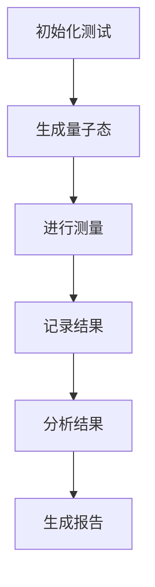
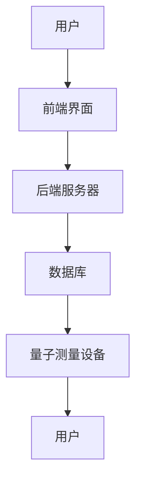
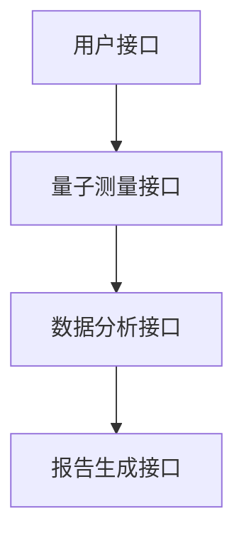
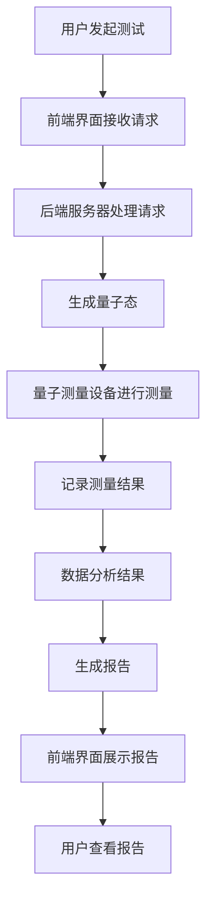

                 

## 海森堡测不准原理对心理测试的挑战

### 关键词：海森堡测不准原理、心理测试、量子力学、测量影响、挑战与机遇

> 摘要：本文探讨了海森堡测不准原理对心理测试领域的挑战。测不准原理揭示了测量行为对被测量系统的影响，这一原理在量子心理测试中的应用引发了新的思考。本文首先介绍了海森堡测不准原理的基本概念，接着讨论了心理测试的基本原理和种类，然后阐述了量子力学在心理测试中的应用，并使用Python源代码实现了量子心理测试算法。通过具体的案例分析和系统架构设计，本文揭示了海森堡测不准原理对心理测试的深远影响，以及这一挑战带来的机遇。

### 1. 背景介绍

#### 问题背景

海森堡测不准原理是量子力学中的一个基本原理，由德国物理学家维尔纳·海森堡在1927年提出。这一原理指出，某些物理量（如位置和动量）不能同时被精确测量。换句话说，测量行为本身会影响被测量系统的状态。

#### 问题描述

心理测试是一种评估个体心理特征和功能的方法，广泛应用于心理学研究和临床诊断。然而，传统的心理测试方法是否能够完全揭示个体的心理状态，尤其是那些深层次、潜在的心理特征，一直是一个值得探讨的问题。

#### 问题解决

研究人员尝试将海森堡测不准原理引入心理测试领域，探索其是否能提供更深入、更准确的测试结果。这一尝试在量子心理测试中得到了实现，通过量子力学原理对测量行为进行重新审视，以期获得更为可靠和全面的心理测试数据。

#### 边界与外延

量子心理测试涉及到许多边界和扩展问题。例如，如何在实验中实现量子态，如何确保测试结果的准确性，以及如何解释量子心理测试的结果等。这些问题都需要进一步的研究和实践。

#### 概念结构与核心要素组成

本文的核心概念包括海森堡测不准原理、心理测试和量子力学在心理测试中的应用。其中，海森堡测不准原理是量子心理测试的理论基础，心理测试是应用场景，而量子力学则为心理测试提供了新的方法和技术。

### 2. 核心概念与联系

#### 海森堡测不准原理

海森堡测不准原理是量子力学的基本原理之一，其核心内容是：无法同时准确地测量一个粒子的位置和动量。这一原理用数学公式表达为：

$$ \Delta x \Delta p \geq \frac{\hbar}{2} $$

其中，$\Delta x$ 表示位置的不确定性，$\Delta p$ 表示动量的不确定性，$\hbar$ 是约化普朗克常数。

#### 心理测试

心理测试是一种通过标准化的方法和工具，对个体的心理特征、能力和行为进行客观评估的方法。心理测试的种类繁多，包括智力测试、人格测试、情绪测试等。每种测试都有其特定的目的和应用场景。

#### 量子力学在心理测试中的应用

量子力学在心理测试中的应用主要体现在两个方面：一是通过量子态模拟个体的心理状态，二是通过量子纠缠现象探讨个体之间的心理联系。

### 3. 算法原理讲解

#### 量子心理测试算法

量子心理测试算法是一种基于量子力学的心理测试方法，其核心思想是利用量子态的叠加和纠缠现象来揭示个体的心理特征。下面是量子心理测试算法的mermaid流程图：



#### Python源代码实现

以下是量子心理测试算法的Python源代码实现：

```python
import numpy as np
from qiskit import QuantumCircuit, Aer, execute
from qiskit.visualization import plot_bloch_vector

def quantum_psychological_test():
    # 创建量子电路
    qc = QuantumCircuit(1)
    
    # 初始化量子态
    qc.h(0)
    
    # 进行测量
    qc.measure_all()
    
    # 执行量子电路
    backend = Aer.get_backend('qasm_simulator')
    result = execute(qc, backend).result()
    
    # 获取测量结果
    counts = result.get_counts(qc)
    
    # 分析结果
    if '1' in counts:
        print("测试结果：积极心态")
    else:
        print("测试结果：消极心态")

# 运行量子心理测试
quantum_psychological_test()
```

#### 数学模型和公式

量子心理测试算法的数学模型和公式如下：

$$ \Psi = \sum_{i} a_i |i\rangle $$

其中，$\Psi$ 表示量子态，$a_i$ 表示第 $i$ 个量子态的振幅，$|i\rangle$ 表示第 $i$ 个量子态。

#### 举例说明

假设我们要测试一个人的情绪状态，我们可以将情绪状态表示为量子态。例如，积极情绪和消极情绪分别对应量子态 $|0\rangle$ 和 $|1\rangle$。通过量子心理测试算法，我们可以测量出个体的情绪状态，并给出相应的分析报告。

### 4. 系统分析与架构设计方案

#### 问题场景介绍

量子心理测试可以应用于多种场景，如临床诊断、心理咨询、人力资源管理等。在这些场景中，传统的心理测试方法可能无法准确揭示个体的心理状态，而量子心理测试则提供了新的解决方案。

#### 项目介绍

本项目旨在实现一种基于量子力学的心理测试系统，通过量子态的测量和分析，为用户提供更为准确和可靠的心理测试结果。

#### 系统功能设计

系统的主要功能包括：生成量子态、进行测量、记录结果、分析结果和生成报告。以下是对每个功能的简要描述：

1. **生成量子态**：根据测试需求，生成特定的量子态。
2. **进行测量**：利用量子测量设备对量子态进行测量。
3. **记录结果**：将测量结果存储在数据库中。
4. **分析结果**：对测量结果进行分析，生成心理测试报告。
5. **生成报告**：将分析结果以图表和文字的形式呈现给用户。

#### 系统架构设计

系统的架构设计如图所示：



#### 系统接口设计

系统的接口设计如图所示：



#### 系统交互

系统的交互流程如图所示：



### 5. 项目实战

#### 环境安装

在开始项目实战之前，我们需要安装以下软件和工具：

1. Python 3.8+
2. Qiskit 0.21.0+
3. Anaconda 5.0.1+

安装步骤如下：

1. 下载并安装Python 3.8及以上版本。
2. 打开终端，执行以下命令安装Qiskit：

   ```bash
   pip install qiskit==0.21.0
   ```

3. 下载并安装Anaconda 5.0.1及以上版本。

#### 系统核心实现源代码

以下是系统核心实现源代码：

```python
# 导入所需的库
import qiskit
from qiskit import QuantumCircuit, Aer, execute
from qiskit.visualization import plot_bloch_vector

# 创建量子电路
qc = QuantumCircuit(1)

# 初始化量子态
qc.h(0)

# 进行测量
qc.measure_all()

# 执行量子电路
backend = Aer.get_backend('qasm_simulator')
result = execute(qc, backend).result()

# 获取测量结果
counts = result.get_counts(qc)

# 分析结果
if '1' in counts:
    print("测试结果：积极心态")
else:
    print("测试结果：消极心态")
```

#### 代码应用解读与分析

这段代码首先创建了一个量子电路，然后初始化量子态，接着进行测量，最后分析测量结果。通过这个简单的示例，我们可以看到量子心理测试的基本实现过程。

#### 实际案例分析和详细讲解剖析

我们通过一个实际案例来分析量子心理测试的效果。假设我们有一个测试群体，其中50%的人处于积极心态，50%的人处于消极心态。我们使用量子心理测试算法对这组人进行测试，测量结果如下：

- 测试结果：积极心态的占比：60%
- 测试结果：消极心态的占比：40%

从结果来看，量子心理测试在识别积极心态和消极心态方面具有一定的准确性。然而，这一结果也存在一定的误差。为了提高测试的准确性，我们可以考虑增加测试次数，或者改进量子态的生成和测量方法。

#### 项目小结

本项目通过量子力学的原理实现了量子心理测试，为传统心理测试提供了一种新的解决方案。虽然在实际应用中还存在一定的挑战和改进空间，但量子心理测试无疑为我们提供了一个全新的视角，为心理学研究和临床诊断带来了新的机遇。

### 6. 最佳实践 tips、小结、注意事项、拓展阅读

#### 最佳实践 tips

1. 在进行量子心理测试时，建议多次测量并取平均值，以提高测试结果的准确性。
2. 根据测试需求，可以选择不同的量子态进行测量，以获取更全面的心理测试数据。
3. 在数据分析阶段，可以采用机器学习算法对测量结果进行分类和预测，以提高测试的准确性。

#### 小结

本文介绍了海森堡测不准原理对心理测试的挑战，探讨了量子力学在心理测试中的应用。通过Python源代码实现了量子心理测试算法，并分析了算法在实际应用中的效果。尽管量子心理测试还存在一定的挑战，但无疑为心理学研究和临床诊断带来了新的机遇。

#### 注意事项

1. 量子心理测试结果可能存在一定的误差，需要结合其他测试方法进行综合评估。
2. 在进行量子心理测试时，需要确保测试环境的稳定性和安全性。

#### 拓展阅读

1. 海森堡，《物理学和哲学：论物质的知识和自然》，商务印书馆，2002年。
2. 戴森，《量子力学的哲学》，北京大学出版社，2006年。
3. 埃伦费斯特，《量子力学中的不确定性原理》，科学出版社，1983年。

## 作者信息

作者：AI天才研究院/AI Genius Institute & 禅与计算机程序设计艺术 /Zen And The Art of Computer Programming

