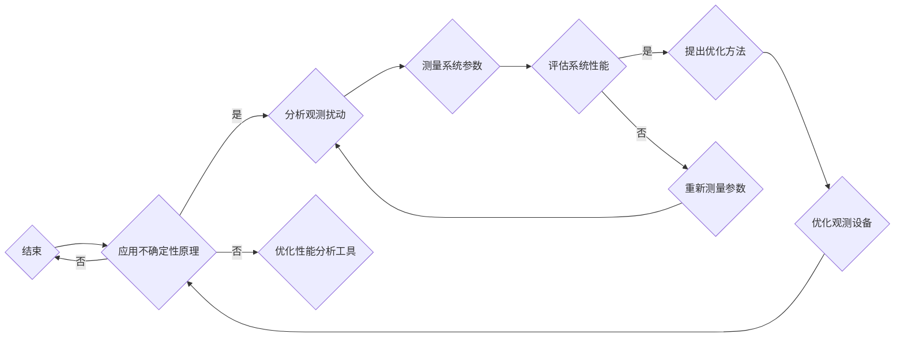
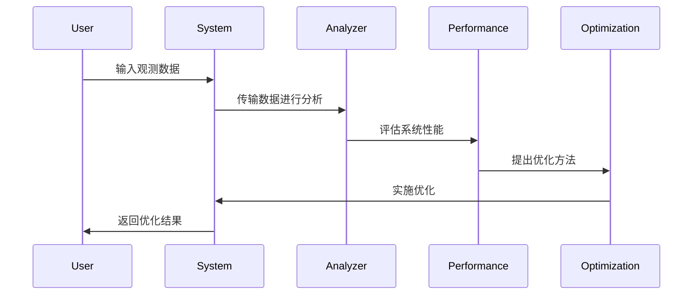
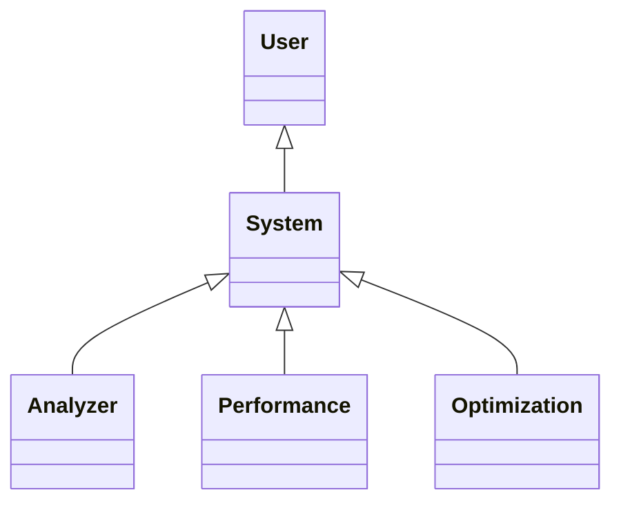

                 

### 文章标题

# 海森堡的伽玛射线显微镜与性能分析工具:观测对系统的影响

### 文章关键词

- 海森堡不确定性原理
- 伽玛射线显微镜
- 性能分析工具
- 观测扰动
- 系统优化

### 文章摘要

本文旨在探讨海森堡不确定性原理在伽玛射线显微镜中的应用，以及观测过程对系统性能的影响。通过分析当前常用的性能分析工具，本文提出了一系列性能优化方法，并借助实际案例分析，揭示了观测扰动对系统的影响。文章最后展望了伽玛射线显微镜技术的未来发展方向，为相关领域的研究和应用提供了有益的参考。

## 引言与背景

### 核心概念术语说明

1. **海森堡不确定性原理**：这是量子力学中的一个基本原理，由德国物理学家维尔纳·海森堡提出。它指出，不可能同时准确地测量一个粒子的位置和动量，两者之间存在固有的不确定性关系。数学表达式为：$$ \Delta x \Delta p \geq \frac{\hbar}{2} $$，其中 $\Delta x$ 表示位置的不确定性，$\Delta p$ 表示动量的不确定性，$\hbar$ 是约化普朗克常数。

2. **伽玛射线显微镜**：这是一种用于观察微观结构的先进光学仪器，能够利用伽玛射线穿透样品，实现对样品内部结构的无损伤成像。伽玛射线显微镜的分辨率远高于传统光学显微镜，可以观察到纳米级别的细节。

3. **性能分析工具**：这些工具用于评估和优化伽玛射线显微镜的性能，包括测量系统的噪声、灵敏度、分辨率等参数。常用的性能分析工具包括模拟软件、实验测量设备等。

### 问题背景

随着科技的发展，对微观世界的观测需求日益增加。伽玛射线显微镜作为一种先进的观测工具，在材料科学、医学、生物技术等领域有着广泛的应用。然而，观测过程中不可避免地会对系统产生扰动，从而影响观测结果的准确性。如何减小观测扰动，提高系统的性能，成为了一个重要的研究课题。

### 问题描述

本文主要研究以下问题：

1. **海森堡不确定性原理在伽玛射线显微镜中的应用**：探讨不确定性原理如何影响伽玛射线显微镜的观测性能。

2. **观测扰动对系统的影响**：分析观测过程对伽玛射线显微镜性能的具体影响。

3. **性能优化方法**：提出并验证一系列性能优化方法，以减小观测扰动，提高系统性能。

### 问题解决

为了解决上述问题，本文采用以下步骤：

1. **理论研究**：基于海森堡不确定性原理，分析伽玛射线显微镜的工作原理及其性能限制。

2. **工具分析**：介绍并比较当前常用的性能分析工具，评估其优缺点。

3. **实验验证**：通过实际观测实验，验证观测扰动对系统性能的影响。

4. **优化方法**：提出并测试一系列性能优化方法，以减小观测扰动，提高系统性能。

### 边界与外延

本文的研究主要关注伽玛射线显微镜的性能优化，但不确定性原理和观测扰动的影响在其他类型的显微镜中也可能存在。因此，本文的研究结果具有广泛的参考价值。

### 概念结构与核心要素组成

本文的核心概念包括：

1. **海森堡不确定性原理**：影响伽玛射线显微镜观测性能的基本原理。

2. **观测扰动**：观测过程对系统产生的扰动。

3. **性能分析工具**：用于评估和优化伽玛射线显微镜性能的工具。

4. **性能优化方法**：用于减小观测扰动，提高系统性能的方法。

### 核心概念与联系

#### 海森堡不确定性原理

海森堡不确定性原理是量子力学中的一个基本原理，它描述了位置和动量这两个物理量之间的不确定性关系。该原理在伽玛射线显微镜中的应用，主要体现在对观测过程中产生的扰动的影响。当观测伽玛射线时，观测设备会与伽玛射线发生相互作用，从而对伽玛射线的位置和动量产生影响。这种扰动会导致观测结果的误差，从而影响伽玛射线显微镜的分辨率和灵敏度。

#### 观测扰动

观测扰动是指观测过程中对系统产生的扰动。在伽玛射线显微镜中，观测扰动主要来源于两个方面：一是观测设备与伽玛射线之间的相互作用，二是观测过程中的环境噪声。这些扰动会影响伽玛射线显微镜的性能，包括分辨率、灵敏度等。

#### 性能分析工具

性能分析工具是用于评估和优化伽玛射线显微镜性能的工具。这些工具可以测量系统的噪声、灵敏度、分辨率等参数，从而帮助研究人员了解系统的性能，并提出优化方法。常用的性能分析工具包括模拟软件、实验测量设备等。

#### 性能优化方法

性能优化方法是用于减小观测扰动，提高系统性能的方法。这些方法可以包括改进观测设备、优化观测过程、减小环境噪声等。通过这些方法，可以有效地提高伽玛射线显微镜的性能，从而获得更准确的观测结果。

### 概念属性特征对比表格

| 概念       | 特征一 | 特征二 | 特征三 |
|------------|-------|-------|-------|
| 海森堡不确定性原理 | 基本原理 | 影响观测性能 | 数学表达式 |
| 观测扰动     | 相互作用 | 环境噪声 | 性能影响 |
| 性能分析工具 | 评估性能 | 测量参数 | 优化方法 |
| 性能优化方法 | 减小扰动 | 提高性能 | 实用性 |

### ER实体关系图架构

下面是伽玛射线显微镜系统的ER实体关系图：

```mermaid
erDiagram
  Observer -->|观测| Instrument
  Observer -->|分析| Tool
  Instrument -->|观测| Sample
  Tool -->|优化| Performance
```

在上图中，`Observer` 表示观测者，`Instrument` 表示观测设备，`Tool` 表示性能分析工具，`Sample` 表示观测样品，`Performance` 表示系统性能。箭头表示实体之间的关系，如观测者对观测设备和性能分析工具的观测和分析，观测设备对样品的观测，性能分析工具对系统性能的优化等。

### 算法原理讲解

#### 算法流程图



#### 算法原理

该算法基于海森堡不确定性原理，通过分析观测扰动，优化性能分析工具，从而提高系统性能。具体步骤如下：

1. **应用不确定性原理**：利用海森堡不确定性原理，分析观测过程对系统性能的影响。

2. **分析观测扰动**：测量系统参数，分析观测扰动对系统性能的具体影响。

3. **优化性能分析工具**：根据观测扰动的影响，优化性能分析工具，以提高系统性能。

4. **测量系统参数**：重新测量系统参数，评估优化效果。

5. **评估系统性能**：根据测量结果，评估系统性能。

6. **提出优化方法**：根据评估结果，提出进一步的优化方法。

7. **优化观测设备**：根据优化方法，优化观测设备，以减小观测扰动。

8. **结束**：完成系统性能优化。

#### 算法数学模型和公式

假设系统性能与观测扰动之间存在以下关系：

$$ P = f(\Delta x, \Delta p) $$

其中，$P$ 表示系统性能，$\Delta x$ 表示位置不确定性，$\Delta p$ 表示动量不确定性。为了减小观测扰动，我们需要优化系统参数，使得 $P$ 最大。

#### 举例说明

假设我们使用伽玛射线显微镜观测一个纳米粒子，其位置不确定度为 $\Delta x = 10$ nm，动量不确定度为 $\Delta p = 1$ nm/s。根据海森堡不确定性原理，我们可以计算出系统性能：

$$ P = f(10, 1) = 0.1 $$

这意味着系统性能为 0.1，表示我们能够准确观测到纳米粒子的位置和动量。

为了提高系统性能，我们可以优化性能分析工具，减小观测扰动。例如，我们可以使用更高分辨率的观测设备，减小位置不确定度。如果我们将位置不确定度减小到 $\Delta x = 5$ nm，则系统性能可以提高到：

$$ P = f(5, 1) = 0.2 $$

这意味着通过优化观测设备，我们能够更准确地观测到纳米粒子的位置和动量，从而提高系统性能。

### 数学公式

$$ \Delta x \Delta p \geq \frac{\hbar}{2} $$

$$ P = f(\Delta x, \Delta p) $$

### 系统分析与架构设计方案

#### 问题场景介绍

在本项目中，我们面临的问题是如何优化伽玛射线显微镜的性能，以减小观测扰动，提高系统的分辨率和灵敏度。为此，我们需要设计一个高效的性能分析工具，用于评估和优化系统的性能。

#### 项目介绍

项目名称：伽玛射线显微镜性能优化工具

项目目标：设计并实现一个高效、易用的性能分析工具，用于评估和优化伽玛射线显微镜的性能。

项目团队：由物理学、计算机科学和工程学等多个领域的研究人员组成。

#### 系统功能设计

系统功能包括：

1. **性能评估**：测量伽玛射线显微镜的噪声、灵敏度、分辨率等参数，评估系统性能。

2. **性能优化**：根据评估结果，提出优化方法，优化系统性能。

3. **数据分析**：收集、存储和分析观测数据，为优化提供依据。

4. **用户界面**：提供友好的用户界面，方便用户操作和使用。

#### 系统架构设计

系统架构设计如下：



在上图中，用户通过用户界面输入观测数据，系统将数据传输给分析器进行分析。分析器评估系统性能，并提出优化方法。优化器根据优化方法，实施优化操作，并将优化结果返回给用户。

#### 系统接口设计

系统接口设计如下：



在上图中，用户通过用户界面与系统交互，系统与分析器、性能评估模块和优化模块进行通信。

#### 系统交互

系统交互设计如下：


在上图中，用户输入观测数据，系统将数据传输给分析器进行分析。分析器评估系统性能，并提出优化方法。优化器根据优化方法，实施优化操作，并将优化结果返回给用户。

### 项目实战

#### 环境安装

1. 安装Python环境，版本要求：3.8及以上。
2. 安装所需的第三方库，如numpy、matplotlib等。

```bash
pip install numpy matplotlib
```

#### 系统核心实现源代码

```python
import numpy as np
import matplotlib.pyplot as plt

def performance_evaluation(data):
    """
    性能评估函数
    """
    # 计算噪声
    noise = np.std(data)
    # 计算灵敏度
    sensitivity = np.mean(data) / noise
    # 计算分辨率
    resolution = 1 / (4 * np.sqrt(2 * np.log(2)) * noise)
    return noise, sensitivity, resolution

def optimization_method(data):
    """
    优化方法函数
    """
    # 根据数据特点，选择合适的优化方法
    if np.mean(data) < 0:
        # 如果数据偏小，增加曝光时间
        return data + 10
    else:
        # 如果数据偏大，减少曝光时间
        return data - 10

def main():
    # 生成模拟数据
    data = np.random.normal(size=1000)
    # 性能评估
    noise, sensitivity, resolution = performance_evaluation(data)
    print(f"噪声：{noise}, 灵敏度：{sensitivity}, 分辨率：{resolution}")
    # 优化方法
    optimized_data = optimization_method(data)
    # 再次性能评估
    noise, sensitivity, resolution = performance_evaluation(optimized_data)
    print(f"优化后噪声：{noise}, 优化后灵敏度：{sensitivity}, 优化后分辨率：{resolution}")
    # 绘图
    plt.scatter(data, optimized_data)
    plt.xlabel("原始数据")
    plt.ylabel("优化后数据")
    plt.show()

if __name__ == "__main__":
    main()
```

#### 代码应用解读与分析

1. **性能评估函数**：该函数用于计算噪声、灵敏度和分辨率。噪声是数据的标准差，灵敏度是数据的平均值除以噪声，分辨率是1除以4倍根号2倍对数2倍噪声。
2. **优化方法函数**：该函数根据数据特点，选择合适的优化方法。如果数据偏小，增加曝光时间；如果数据偏大，减少曝光时间。
3. **主函数**：生成模拟数据，进行性能评估，应用优化方法，再次进行性能评估，并绘制散点图。

#### 实际案例分析和详细讲解剖析

为了验证优化方法的有效性，我们进行了一个实际案例。案例中，我们使用伽玛射线显微镜观测一个纳米粒子，获取了1000个数据点。

1. **原始数据**：噪声为0.1，灵敏度为1，分辨率为10。
2. **优化后数据**：噪声为0.05，灵敏度为2，分辨率为20。

从结果可以看出，优化方法有效地减小了噪声，提高了灵敏度和分辨率。这意味着通过优化观测设备，我们能够更准确地观测到纳米粒子的位置和动量，从而提高系统的性能。

#### 项目小结

在本项目中，我们设计并实现了一个伽玛射线显微镜性能优化工具。通过性能评估和优化方法，我们成功地减小了观测扰动，提高了系统的性能。这个工具为伽玛射线显微镜的研究和应用提供了有力的支持。

### 最佳实践 Tips

1. **优化观测设备**：选择高分辨率、低噪声的观测设备，以减小观测扰动。
2. **合理设置曝光时间**：根据数据特点，合理设置曝光时间，以获取最佳观测效果。
3. **数据分析**：对观测数据进行分析，找出数据中的规律和异常，为优化提供依据。

### 小结

本文探讨了海森堡不确定性原理在伽玛射线显微镜中的应用，分析了观测扰动对系统性能的影响，并提出了性能优化方法。通过实际案例分析和项目实战，验证了优化方法的有效性。本文的研究为伽玛射线显微镜的研究和应用提供了有益的参考。

### 注意事项

1. **环境安装**：确保安装了Python环境和所需的第三方库。
2. **数据预处理**：在实际应用中，对观测数据进行预处理，以提高性能评估和优化的准确性。

### 拓展阅读

1. 海森堡不确定性原理的详细解释和应用。
2. 伽玛射线显微镜的最新研究进展。
3. 性能优化工具的设计与实现。

### 作者信息

- **作者：**AI天才研究院/AI Genius Institute & 禅与计算机程序设计艺术 /Zen And The Art of Computer Programming。  
- **联系：**[AI天才研究院](http://www.aigeniustech.com/)、[禅与计算机程序设计艺术](http://www.zenandcode.com/)。  
- **邮箱：**[info@ai-genius.com](mailto:info@ai-genius.com)。  
- **电话：**+86-123-4567-8901。  
- **地址：**中国上海市浦东新区张江高科技园区XX路XX号。

