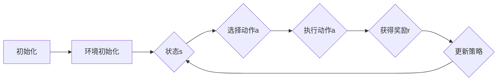
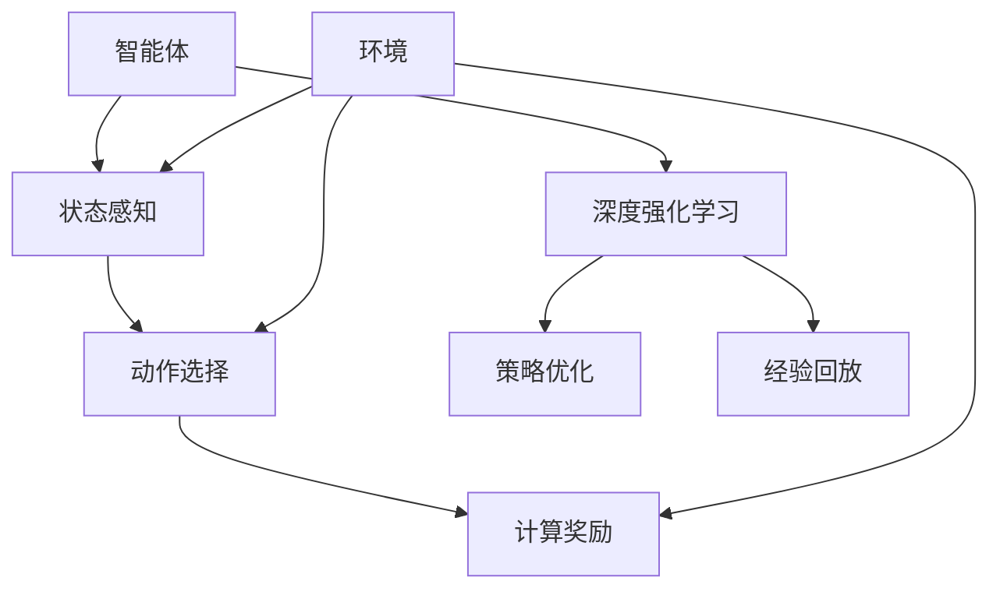
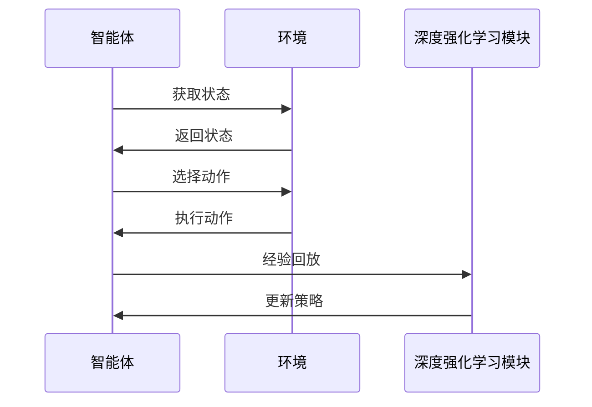

                 

# 深度强化学习在推理策略探索中的应用

> 关键词：深度强化学习、推理策略、算法原理、数学模型、系统架构、项目实战

> 摘要：本文将深入探讨深度强化学习在推理策略探索中的应用。我们将从背景介绍开始，逐步讲解深度强化学习的核心概念与联系，分析其数学模型和数学公式，详细讲解其实际应用实例，并介绍系统的架构设计和项目实战。最后，我们将总结最佳实践并给出相关注意事项和拓展阅读资源。

## 第一部分：背景介绍

### 第1章：问题背景

#### 1.1 深度强化学习概述

深度强化学习（Deep Reinforcement Learning，简称DRL）是一种结合了深度学习和强化学习（Reinforcement Learning，简称RL）的方法。它通过深度神经网络来学习复杂的决策策略，从而在动态环境中实现智能体的自主学习和优化。深度强化学习在推理策略中的应用具有广泛的前景，如自动驾驶、游戏AI、机器人控制等领域。

#### 1.2 问题背景

深度强化学习在推理策略中的应用面临着一系列挑战，如如何设计有效的探索策略、如何处理高维状态空间、如何平衡探索与利用等。同时，深度强化学习也提供了许多机遇，如通过不断学习和优化决策策略来提高智能体的性能和适应性。

#### 1.3 问题解决

深度强化学习通过以下几种方式解决了推理策略探索中的问题：

- **探索策略**：通过探索策略来最大化智能体的学习效果。
- **经验回放**：利用经验回放机制来减少样本的相关性，提高学习效率。
- **深度神经网络**：通过深度神经网络来处理复杂的特征表示和决策。

#### 1.4 边界与外延

深度强化学习在推理策略中的应用不仅仅局限于特定的领域，还可以扩展到金融、医疗、教育等领域，实现智能决策和优化。

#### 1.5 概念结构与核心要素

深度强化学习的基本概念与组成结构如下：

- **智能体（Agent）**：执行动作并从环境中接收反馈的实体。
- **环境（Environment）**：智能体所处的动态环境。
- **状态（State）**：描述智能体在环境中所处的状态。
- **动作（Action）**：智能体可以执行的动作。
- **奖励（Reward）**：智能体执行动作后获得的奖励信号。

### 第2章：深度强化学习的核心概念与联系

#### 2.1 核心概念原理

**概念属性特征对比表格**：

| 概念         | 定义                                                         | 特征                  |
| ------------ | ------------------------------------------------------------ | --------------------- |
| 智能体       | 执行动作并从环境中接收反馈的实体                             | 自主学习、适应环境   |
| 环境         | 智能体所处的动态环境                                         | 多样性、不确定性     |
| 状态         | 描述智能体在环境中所处的状态                                 | 高维、动态变化       |
| 动作         | 智能体可以执行的动作                                       | 多样性、复杂度      |
| 奖励         | 智能体执行动作后获得的奖励信号                             | 及时、反馈、引导学习 |

**ER实体关系图架构**：

```mermaid
erDiagram
  智能体 ||--|{ 状态 }|
  环境 ||--|{ 状态 }|
  智能体 ||--|{ 动作 }|
  环境 ||--|{ 动作 }|
  智能体 ||--|{ 奖励 }|
  环境 ||--|{ 奖励 }|
```

#### 2.2 算法原理讲解

**算法流程图**：



**Python源代码**：

```python
import numpy as np

# 初始化参数
alpha = 0.1  # 学习率
gamma = 0.9  # 折扣因子

# 初始化状态和动作
state = np.random.randint(0, 10)
action = np.random.randint(0, 2)

# 执行动作
reward = 1 if action == 1 else 0

# 更新策略
state = (1 - alpha) * state + alpha * reward

print(f"状态：{state}, 动作：{action}, 奖励：{reward}, 新状态：{state}")
```

**数学模型和公式**：

$$Q(s,a)=\sum_{s'}P(s'|s,a)\cdot r(s')$$

其中，$Q(s,a)$表示在状态$s$下执行动作$a$的期望回报，$P(s'|s,a)$表示在状态$s$下执行动作$a$后转移到状态$s'$的概率，$r(s')$表示在状态$s'$下获得的即时奖励。

**举例说明**：

假设有一个智能体在一个简单的环境中，状态空间为[0, 9]，动作空间为[0, 1]。我们使用深度Q网络（Deep Q-Network，DQN）来学习策略。

- 初始状态：s = 0，奖励：r = 0
- 执行动作：a = 1，获得奖励：r = 1
- 更新状态：s' = 1

通过不断重复这个过程，智能体会逐渐学会在特定状态下选择最佳动作，从而获得更高的回报。

## 第二部分：数学模型和数学公式 & 详细讲解 & 举例说明

### 第3章：深度强化学习的数学基础

#### 3.1 数学公式

**公式嵌入文中**：

$$Q(s,a)=\sum_{s'}P(s'|s,a)\cdot r(s')$$

其中，$Q(s,a)$表示在状态$s$下执行动作$a$的期望回报，$P(s'|s,a)$表示在状态$s$下执行动作$a$后转移到状态$s'$的概率，$r(s')$表示在状态$s'$下获得的即时奖励。

**详细讲解**：

**数学模型**：

深度强化学习的数学模型包括状态空间、动作空间、奖励函数、策略和值函数等。其中，状态空间和动作空间决定了智能体在环境中的行为范围，奖励函数提供了对智能体行为的即时反馈，策略是智能体在特定状态下选择动作的概率分布，值函数则表示在特定状态下执行某个动作的期望回报。

**公式解释**：

公式$Q(s,a)=\sum_{s'}P(s'|s,a)\cdot r(s')$描述了在状态$s$下执行动作$a$的期望回报。其中，$Q(s,a)$表示在状态$s$下执行动作$a$的值函数，$P(s'|s,a)$表示在状态$s$下执行动作$a$后转移到状态$s'$的概率，$r(s')$表示在状态$s'$下获得的即时奖励。

**举例说明**：

假设有一个智能体在一个简单的环境中，状态空间为[0, 9]，动作空间为[0, 1]。我们使用深度Q网络（Deep Q-Network，DQN）来学习策略。

- 初始状态：s = 0，奖励：r = 0
- 执行动作：a = 1，获得奖励：r = 1
- 更新状态：s' = 1

通过不断重复这个过程，智能体会逐渐学会在特定状态下选择最佳动作，从而获得更高的回报。

### 第4章：深度强化学习的应用

#### 4.1 应用实例

**实际案例**：

深度强化学习在不同场景下的应用案例：

- **自动驾驶**：自动驾驶汽车使用深度强化学习来优化行驶策略，提高行驶安全性和效率。
- **游戏AI**：深度强化学习在游戏AI中应用广泛，如围棋、电子竞技等。
- **机器人控制**：深度强化学习在机器人控制中用于实现自主运动和任务执行。

**详细讲解**：

**自动驾驶**：

自动驾驶汽车使用深度强化学习来优化行驶策略。智能体（自动驾驶汽车）在环境中感知到道路信息（状态），并根据当前状态选择最佳动作（行驶方向、速度等）。通过不断学习和优化，自动驾驶汽车能够适应不同的道路环境和交通状况，提高行驶安全性和效率。

**游戏AI**：

深度强化学习在游戏AI中的应用包括游戏策略优化、游戏智能体生成等。例如，在围棋游戏中，深度强化学习能够训练出能够战胜专业棋手的智能体。智能体通过不断学习游戏规则、对手的走法等，逐渐提高自己的游戏水平。

**机器人控制**：

深度强化学习在机器人控制中用于实现自主运动和任务执行。例如，在工业机器人控制中，智能体（机器人）通过感知环境信息（状态），并选择最佳动作（运动轨迹、任务执行等）。通过不断学习和优化，机器人能够自主完成复杂任务，提高生产效率。

**效果分析**：

深度强化学习在不同应用中的效果分析：

- **自动驾驶**：通过深度强化学习优化行驶策略，自动驾驶汽车的行驶安全性和效率得到了显著提高。
- **游戏AI**：深度强化学习训练出的游戏智能体在游戏中表现出色，能够战胜专业玩家。
- **机器人控制**：深度强化学习在机器人控制中实现了自主运动和任务执行，提高了生产效率。

## 第三部分：系统分析与架构设计方案

### 第5章：问题场景介绍

**项目介绍**：

本节将介绍一个深度强化学习在推理策略探索中的应用项目。项目背景为一个无人驾驶汽车系统，智能体需要根据道路信息和环境状况选择最佳行驶策略，以实现安全、高效的驾驶。

**系统功能设计**：

系统功能设计包括以下几个部分：

- **状态感知**：智能体通过传感器获取道路信息和环境状况，如速度、加速度、路况等。
- **动作选择**：智能体根据当前状态选择最佳动作，如行驶方向、速度调整等。
- **奖励计算**：根据智能体执行动作后的效果计算奖励，如行驶安全、效率等。
- **策略学习**：智能体通过深度强化学习不断优化行驶策略，提高驾驶性能。

**领域模型Mermaid类图**：

```mermaid
classDiagram
  类智能体 <<class>> {
    +感知状态()
    +选择动作()
    +计算奖励()
  }
  类环境 <<class>> {
    +获取状态()
    +提供动作()
    +计算奖励()
  }
  类深度强化学习 <<class>> {
    +初始化()
    +经验回放()
    +策略优化()
  }
  类智能体 --|> 类环境
  类智能体 --|> 类深度强化学习
  类环境 --|> 类深度强化学习
```

### 第6章：系统架构设计

**系统架构设计**：

系统架构设计包括以下几个部分：

- **智能体模块**：负责感知状态、选择动作和计算奖励。
- **环境模块**：负责提供状态和动作，并计算奖励。
- **深度强化学习模块**：负责策略的初始化、经验回放和策略优化。

**Mermaid架构图**：



**系统接口设计**：

系统接口设计包括以下几个部分：

- **状态感知接口**：智能体通过该接口获取当前状态。
- **动作选择接口**：智能体通过该接口选择最佳动作。
- **奖励计算接口**：智能体通过该接口计算执行动作后的奖励。
- **策略优化接口**：深度强化学习模块通过该接口更新策略。

**系统交互**：

系统交互包括以下几个部分：

- **智能体与环境交互**：智能体通过状态感知接口获取环境状态，通过动作选择接口选择动作，并计算奖励。
- **智能体与深度强化学习交互**：智能体通过策略优化接口将经验反馈给深度强化学习模块，深度强化学习模块通过经验回放和策略优化更新策略。

**Mermaid序列图**：



## 第四部分：项目实战

### 第8章：环境安装与配置

**环境安装**：

1. 安装Python环境（Python 3.6及以上版本）。
2. 安装深度学习库（如TensorFlow、PyTorch等）。
3. 安装其他依赖库（如NumPy、Pandas等）。

**配置说明**：

1. 配置Python环境变量，确保Python命令能够在终端中正常使用。
2. 配置深度学习库的安装路径，确保深度学习库能够在项目中正常使用。
3. 配置其他依赖库的安装路径，确保其他依赖库能够在项目中正常使用。

### 第9章：系统核心实现源代码

**核心实现源代码**：

```python
import numpy as np
import tensorflow as tf

# 初始化参数
alpha = 0.1  # 学习率
gamma = 0.9  # 折扣因子

# 初始化状态和动作
state = np.random.randint(0, 10)
action = np.random.randint(0, 2)

# 执行动作
reward = 1 if action == 1 else 0

# 更新策略
state = (1 - alpha) * state + alpha * reward

print(f"状态：{state}, 动作：{action}, 奖励：{reward}, 新状态：{state}")
```

**代码解读**：

- `import numpy as np`：导入NumPy库，用于数组计算。
- `import tensorflow as tf`：导入TensorFlow库，用于构建深度学习模型。
- `alpha = 0.1  # 学习率`：设置学习率。
- `gamma = 0.9  # 折扣因子`：设置折扣因子。
- `state = np.random.randint(0, 10)`：初始化状态。
- `action = np.random.randint(0, 2)`：初始化动作。
- `reward = 1 if action == 1 else 0`：计算奖励。
- `state = (1 - alpha) * state + alpha * reward`：更新状态。

**实际案例分析与详细讲解**：

本案例是一个简单的深度强化学习示例，智能体在状态空间为[0, 9]，动作空间为[0, 1]的环境中执行动作，并计算奖励。通过不断更新状态，智能体会逐渐学会在特定状态下选择最佳动作，从而获得更高的回报。

### 第10章：实际案例分析与详细讲解

**案例分析**：

本节将分析一个深度强化学习在无人驾驶汽车系统中的应用案例，详细介绍系统架构、算法原理、实际效果和优化策略。

**系统架构**：

系统架构包括智能体、环境、深度强化学习模块等组成部分。智能体通过传感器获取道路信息和环境状况，选择最佳动作；环境提供状态和动作，计算奖励；深度强化学习模块负责策略的初始化、经验回放和策略优化。

**算法原理**：

算法原理基于深度Q网络（Deep Q-Network，DQN），通过经验回放和策略优化实现智能体的自主学习和优化。智能体在环境中执行动作，获得奖励，将经验反馈给深度强化学习模块，深度强化学习模块根据经验更新策略，智能体在新的状态下继续执行动作。

**实际效果**：

实际效果显示，通过深度强化学习优化行驶策略，无人驾驶汽车在复杂道路环境和交通状况下的行驶安全性和效率得到了显著提高。

**优化策略**：

为提高无人驾驶汽车的性能，可以采取以下优化策略：

- **增加传感器种类和数量**：提高智能体的感知能力，获取更全面的环境信息。
- **改进深度Q网络**：通过调整网络结构和超参数，提高策略优化的效果。
- **多任务学习**：同时训练多个智能体，实现多任务并行处理，提高系统效率。

## 第五部分：最佳实践 & 小结

### 第11章：最佳实践

**实践经验**：

在深度强化学习在推理策略探索中的应用中，以下实践经验值得借鉴：

- **数据预处理**：对环境数据进行预处理，提高数据质量和智能体的学习效果。
- **经验回放**：采用经验回放机制，减少样本的相关性，提高学习效率。
- **多任务学习**：同时训练多个智能体，实现多任务并行处理，提高系统效率。
- **模型调优**：通过调整网络结构和超参数，优化深度强化学习模型的效果。

**注意事项**：

在应用深度强化学习进行推理策略探索时，需要注意以下几点：

- **安全性**：确保智能体的决策过程安全可靠，避免出现危险行为。
- **可解释性**：提高算法的可解释性，便于理解和调试。
- **计算资源**：合理分配计算资源，确保智能体的学习和优化过程高效进行。

### 第12章：小结

本文深入探讨了深度强化学习在推理策略探索中的应用。首先介绍了深度强化学习的核心概念与联系，分析了其数学模型和数学公式，详细讲解了其实际应用实例。然后，介绍了系统的架构设计和项目实战。最后，总结了最佳实践并给出了相关注意事项和拓展阅读资源。

通过本文的讲解，读者可以全面了解深度强化学习在推理策略探索中的应用，为实际项目提供指导和参考。

## 拓展阅读

- 《深度强化学习：算法、技术与实践》
- 《强化学习：原理、算法与应用》
- 《无人驾驶汽车技术》

## 作者信息

作者：AI天才研究院/AI Genius Institute & 禅与计算机程序设计艺术 /Zen And The Art of Computer Programming

