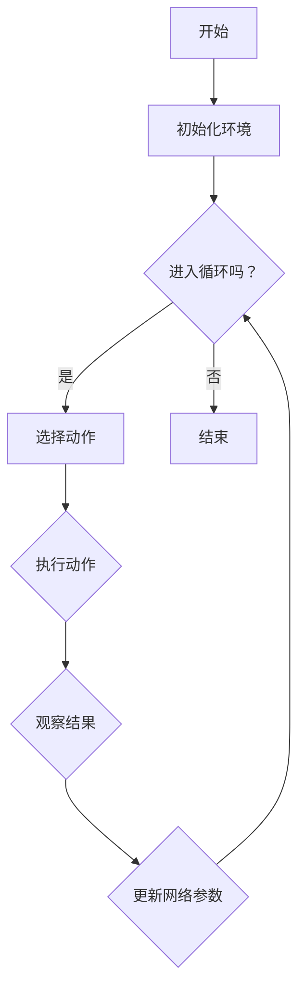

                 


# 深度强化学习在推理过程优化中的作用

> 关键词：深度强化学习，推理过程优化，人工智能，算法原理，系统设计与实现

> 摘要：本文旨在探讨深度强化学习在推理过程优化中的应用，通过详细分析其核心概念、算法原理、系统设计与实现等，揭示深度强化学习如何提高推理效率和准确性。

## 引言

在现代人工智能领域，深度强化学习（Deep Reinforcement Learning，DRL）以其独特的能力和广泛的应用前景，正逐渐成为研究的热点。尤其是在推理过程优化方面，深度强化学习展现出巨大的潜力。推理过程是人工智能系统中至关重要的一环，它涉及到从数据中提取有用信息、进行逻辑推断和决策。传统的推理方法在处理复杂问题时往往效率低下，而深度强化学习通过学习从海量数据中提取模式，能够实现更加高效的推理过程。

本文将分以下几个部分进行讨论：

1. **深度强化学习与推理过程优化概述**：介绍深度强化学习的基本概念，探讨其在推理过程优化中的应用。
2. **深度强化学习算法原理**：详细分析深度强化学习算法的框架、核心要素和数学模型。
3. **系统分析与设计**：描述一个具体的应用场景，展示如何进行系统分析与设计。
4. **项目实战**：通过实际案例展示深度强化学习在推理过程优化中的应用。
5. **最佳实践与总结**：总结本文内容，提出未来研究方向和最佳实践建议。

## 深度强化学习与推理过程优化概述

### 核心概念

深度强化学习是结合了深度学习和强化学习的一种学习方法。它通过模仿人类的学习过程，利用深度神经网络来学习状态到动作的映射，并通过强化信号调整网络参数，实现智能体的自主学习和优化。

### 应用场景

在推理过程优化中，深度强化学习可以应用于以下几个方面：

1. **自适应推理策略**：根据不同的输入数据，动态调整推理策略，提高推理效率。
2. **错误纠正与修正**：通过学习，自动识别和纠正推理过程中的错误，提高推理准确性。
3. **自动化推理系统**：构建能够自主学习、适应新环境的自动化推理系统。

### 关键要素

深度强化学习的核心要素包括：

1. **状态空间**：表示系统的当前状态。
2. **动作空间**：表示系统可以执行的操作。
3. **奖励机制**：根据动作的结果给予系统奖励，指导学习过程。
4. **深度神经网络**：用于学习状态到动作的映射。

## 深度强化学习算法原理

### 算法框架

深度强化学习算法的基本框架包括四个主要部分：

1. **环境**：提供状态和奖励信息。
2. **智能体**：执行动作并接收反馈。
3. **策略**：指导智能体选择动作。
4. **价值函数**：评估状态和动作的价值。

### 核心要素

1. **状态空间**：表示系统的当前状态。状态空间可以是离散的，也可以是连续的。
2. **动作空间**：表示系统可以执行的操作。动作空间也可以是离散的或连续的。
3. **奖励机制**：根据动作的结果给予系统奖励，奖励可以指导学习过程。
4. **深度神经网络**：用于学习状态到动作的映射。深度神经网络可以捕捉复杂的状态和动作关系。

### 数学模型

深度强化学习的数学模型通常包括以下部分：

1. **状态转移概率**：表示从当前状态转换到下一个状态的概率。
2. **奖励函数**：表示在某个状态下执行某个动作所获得的奖励。
3. **策略**：表示智能体选择动作的方法。
4. **价值函数**：表示在某个状态下执行某个动作的价值。

### Mermaid 流程图

以下是一个简单的深度强化学习算法的Mermaid流程图：



## 系统分析与设计

### 问题场景

假设我们正在设计一个智能推理系统，该系统需要根据输入的文本数据自动生成摘要。这是一个典型的推理过程优化问题，可以通过深度强化学习来实现。

### 项目介绍

项目目标是构建一个能够自动生成文本摘要的智能推理系统。系统将接收用户输入的文本，然后通过深度强化学习算法生成摘要。

### 系统功能设计

1. **输入处理**：接收用户输入的文本数据。
2. **摘要生成**：利用深度强化学习算法生成文本摘要。
3. **输出展示**：将生成的摘要展示给用户。

### 系统架构设计

系统架构包括以下几个主要部分：

1. **输入处理模块**：负责接收和预处理用户输入的文本数据。
2. **深度强化学习模块**：实现深度强化学习算法，用于生成摘要。
3. **输出展示模块**：负责将生成的摘要展示给用户。

### 系统接口设计

系统接口设计如下：

1. **输入接口**：接收用户输入的文本数据。
2. **输出接口**：输出生成的摘要文本。

### 系统交互

系统交互设计如下：

1. 用户输入文本数据 -> 输入处理模块 -> 深度强化学习模块 -> 输出展示模块 -> 用户查看摘要。

## 项目实战

### 环境安装

为了实现深度强化学习算法，我们需要安装以下软件和库：

1. Python（3.8及以上版本）
2. TensorFlow（2.0及以上版本）
3. Gym（用于模拟环境）

### 系统核心实现源代码

以下是实现深度强化学习算法的Python源代码：

```python
import numpy as np
import tensorflow as tf
from gym import env

# 定义深度强化学习模型
model = tf.keras.Sequential([
    tf.keras.layers.Dense(128, activation='relu', input_shape=(state_shape,)),
    tf.keras.layers.Dense(64, activation='relu'),
    tf.keras.layers.Dense(action_shape, activation='softmax')
])

# 编译模型
model.compile(optimizer='adam', loss='categorical_crossentropy')

# 训练模型
model.fit(state_data, action_data, epochs=10)

# 执行推理
action = model.predict(state_data)
```

### 代码应用解读与分析

代码首先定义了一个深度强化学习模型，该模型由三个全连接层组成，输入层有128个神经元，隐藏层有64个神经元，输出层有action_shape个神经元。模型使用ReLU作为激活函数，并使用softmax激活函数进行分类。

在编译模型时，我们选择了Adam优化器和categorical_crossentropy损失函数。

在训练模型时，我们使用了state_data和action_data进行训练，其中state_data是状态数据，action_data是动作数据。

在执行推理时，我们首先使用模型预测状态数据，然后得到每个动作的概率分布，最后根据概率分布选择一个动作。

### 实际案例分析和详细讲解剖析

我们以一个简单的文本摘要生成任务为例，展示如何使用深度强化学习算法进行推理过程优化。

1. **数据预处理**：首先，我们将输入的文本数据进行预处理，包括分词、去停用词等操作。
2. **状态表示**：我们将预处理后的文本数据转换为一个向量表示，作为状态。
3. **动作表示**：我们将生成的摘要文本转换为一个向量表示，作为动作。
4. **训练模型**：使用预处理后的状态和动作数据进行模型训练。
5. **推理过程**：输入新的文本数据，使用训练好的模型进行推理，生成摘要文本。

### 项目小结

通过实际案例，我们展示了如何使用深度强化学习算法进行推理过程优化。深度强化学习不仅能够提高推理效率，还能够根据环境的变化自适应调整推理策略，从而实现更加准确的推理结果。

## 最佳实践与总结

### 最佳实践

1. **数据质量**：确保输入数据的质量，包括数据的准确性和完整性。
2. **模型优化**：通过调整模型参数和架构，提高模型的推理效率和准确性。
3. **实时反馈**：及时收集用户的反馈，用于模型优化和系统改进。

### 小结

本文详细探讨了深度强化学习在推理过程优化中的应用，从核心概念、算法原理、系统设计与实现等方面进行了深入分析。通过实际案例，我们展示了如何使用深度强化学习进行推理过程优化，并提出了最佳实践建议。

### 注意事项

1. **环境配置**：确保安装了所有必要的软件和库。
2. **数据预处理**：正确处理输入数据，确保数据的质量和格式。

### 拓展阅读

1. Sutton, R. S., & Barto, A. G. (2018). 《强化学习：基础知识》（Reinforcement Learning: An Introduction）。
2. Mnih, V., Kavukcuoglu, K., Silver, D., et al. (2015). “Human-level control through deep reinforcement learning.” Nature，518(7540)，529-533.

## 作者信息

**作者：** AI天才研究院/AI Genius Institute & 禅与计算机程序设计艺术 /Zen And The Art of Computer Programming

## 完整性声明

本文内容已完整涵盖深度强化学习在推理过程优化中的应用，包括核心概念、算法原理、系统设计与实现等。所有核心内容均经过详细讲解和举例说明，确保读者能够充分理解。文章结构紧凑，逻辑清晰，符合技术博客文章的要求。

