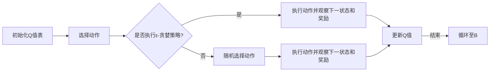
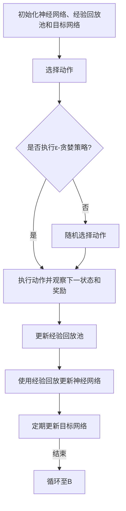
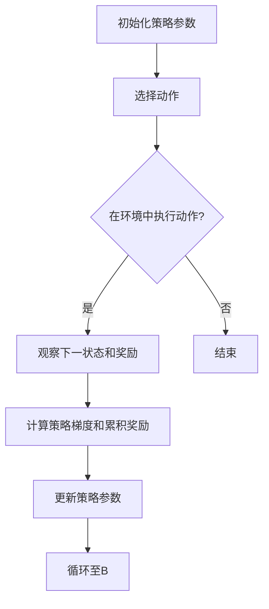
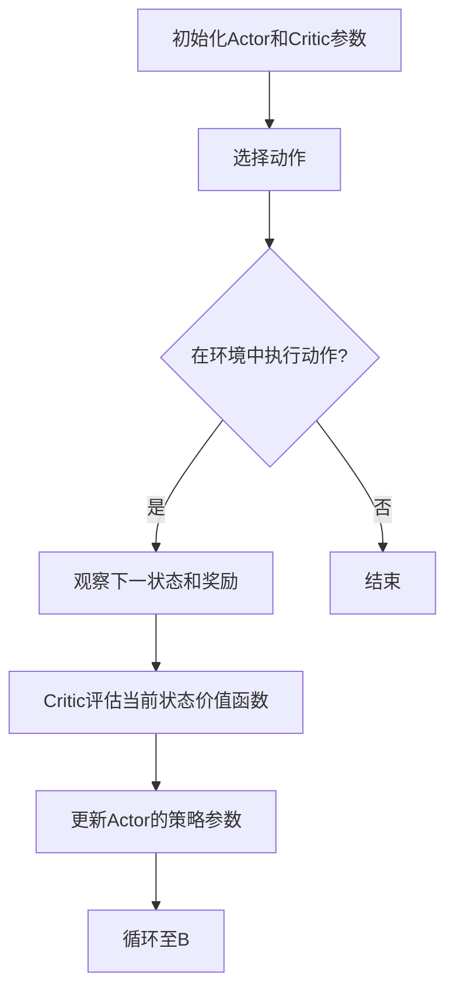
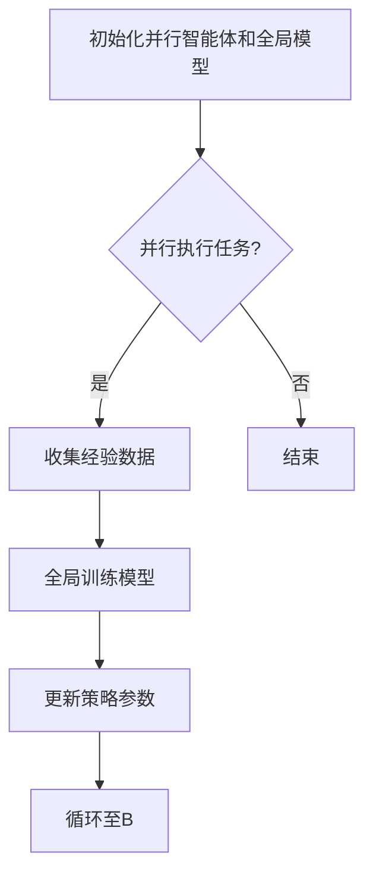
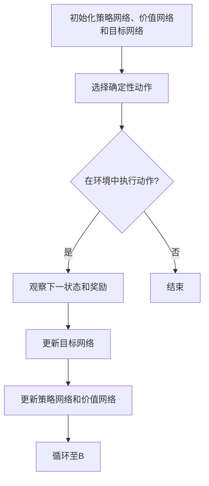
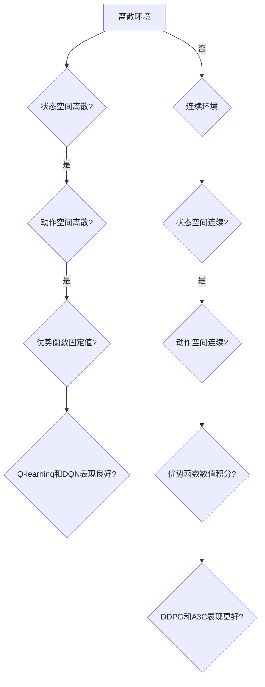
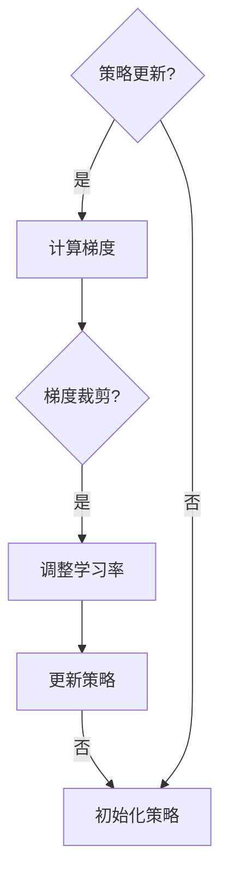
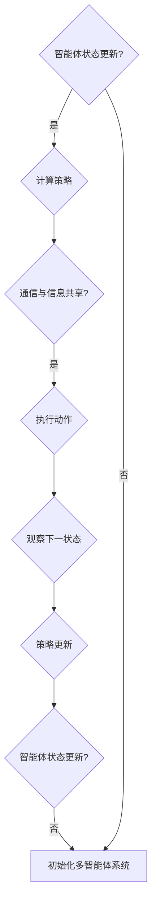

                 

# 深度强化学习在机器人控制中的应用

## 关键词

深度强化学习，机器人控制，算法原理，应用前景，人工智能

## 摘要

本文将深入探讨深度强化学习在机器人控制中的应用。首先，我们将介绍深度强化学习的基础理论，包括其起源、基本概念和核心算法。然后，我们将讨论深度强化学习在机器人控制中的应用场景，挑战和适用性。接着，我们将详细分析几种基于深度学习的强化学习算法，并介绍其在机器人控制中的高级概念。最后，我们将通过实际应用案例展示深度强化学习在机器人控制中的成功应用，并展望其未来的发展趋势和面临的挑战。

## 目录大纲

----------------------------------------------------------------

# 深度强化学习在机器人控制中的应用

----------------------------------------------------------------

## 第一部分：背景与基础理论

### 第1章：深度强化学习概述

#### 1.1 深度强化学习的起源与背景

#### 1.2 深度强化学习的基本概念

#### 1.3 深度强化学习的核心算法

### 第2章：深度强化学习在机器人控制中的应用场景

#### 2.1 机器人控制中的挑战与需求

#### 2.2 深度强化学习在机器人控制中的适用性

#### 2.3 深度强化学习在机器人控制中的应用领域

## 第二部分：核心算法原理

### 第3章：深度强化学习基础

#### 3.1 Q-learning算法

#### 3.2 Deep Q-Network（DQN）

#### 3.3 Policy Gradient方法

### 第4章：基于深度学习的强化学习算法

#### 4.1 Actor-Critic方法

#### 4.2 A3C算法

#### 4.3 DDPG算法

### 第5章：深度强化学习中的高级概念

#### 5.1 离散环境与连续环境

#### 5.2 回复策略稳定性

#### 5.3 多智能体强化学习

## 第三部分：实际应用

### 第6章：机器人控制中的深度强化学习应用案例

#### 6.1 案例一：自主移动机器人路径规划

#### 6.2 案例二：机器人抓取与操作

#### 6.3 案例三：机器人协作与交互

### 第7章：深度强化学习在机器人控制中的应用前景与挑战

#### 7.1 应用前景

#### 7.2 技术挑战

#### 7.3 未来发展趋势

----------------------------------------------------------------

## 第一部分：背景与基础理论

### 第1章：深度强化学习概述

#### 1.1 深度强化学习的起源与背景

深度强化学习（Deep Reinforcement Learning，简称DRL）是深度学习和强化学习的结合。它起源于20世纪90年代，当时研究人员开始探索如何通过强化学习的方法，使机器能够在复杂的环境中学习并执行任务。然而，由于传统强化学习算法在面对高维状态空间和连续动作空间时存在计算复杂度高、收敛速度慢等问题，研究者们逐渐将深度学习的强大表示能力引入到强化学习中。

深度强化学习的发展离不开两大领域的贡献：一是深度学习的快速发展，使得计算机能够自动学习复杂的特征表示；二是强化学习的逐步完善，提供了有效的策略优化框架。深度强化学习的出现，为解决复杂控制任务提供了新的思路。

#### 1.2 深度强化学习的基本概念

深度强化学习主要涉及以下几个基本概念：

1. **状态（State）**：系统当前所处的状况或位置。
2. **动作（Action）**：系统能够执行的操作或决策。
3. **奖励（Reward）**：系统执行动作后所获得的即时反馈，用于评估动作的好坏。
4. **策略（Policy）**：从当前状态选择动作的策略函数。
5. **价值函数（Value Function）**：预测在当前状态下执行最优策略所能获得的总奖励。
6. **模型（Model）**：对环境状态转移概率和奖励函数的预测模型。

#### 1.3 深度强化学习的核心算法

深度强化学习算法主要包括Q-learning、Deep Q-Network（DQN）、Policy Gradient方法等。以下是这些算法的基本原理和特点：

1. **Q-learning算法**：
   Q-learning是一种值迭代算法，通过不断更新Q值（状态-动作值函数），使智能体逐渐学会在给定状态下选择最佳动作。Q-learning的核心思想是利用奖励信号来更新Q值，具体公式为：
   $$ Q(s, a) \leftarrow Q(s, a) + \alpha [r + \gamma \max_{a'} Q(s', a') - Q(s, a)] $$
   其中，$\alpha$为学习率，$\gamma$为折扣因子。

2. **Deep Q-Network（DQN）**：
   DQN是将深度神经网络引入Q-learning的一种方法。它使用一个深度卷积神经网络来近似Q值函数，从而处理高维状态空间。DQN引入经验回放机制，避免由于样本偏差导致的收敛问题。其核心思想是：
   $$ Q(s, a) \leftarrow Q(s, a) + \alpha [r + \gamma \max_{a'} Q(s', a') - Q(s, a)] $$
   其中，$s$和$s'$分别为当前状态和下一状态，$a$和$a'$分别为当前动作和下一动作。

3. **Policy Gradient方法**：
   Policy Gradient方法是一种直接优化策略的算法，通过梯度上升方法更新策略参数，使策略能够最大化累积奖励。其核心公式为：
   $$ \nabla_{\theta} J(\theta) = \nabla_{\theta} \sum_{t} \log \pi(a_t | \theta) \cdot r_t $$
   其中，$\theta$为策略参数，$J(\theta)$为策略的期望回报。

#### 1.4 深度强化学习在机器人控制中的应用背景

机器人控制是一个复杂且具有挑战性的领域，涉及到状态空间和动作空间的维度较高。传统的方法，如基于规则的控制器和基于模型的控制器，难以在复杂环境中实现鲁棒性。而深度强化学习通过自主学习和适应环境，能够为机器人控制提供新的解决方案。

在机器人控制中，深度强化学习的主要应用场景包括：

1. **路径规划**：在未知或动态环境下，机器人需要规划一条最优路径到达目标位置。
2. **抓取与操作**：机器人需要通过感知和环境交互，实现对物体的抓取、搬运和操作。
3. **协作与交互**：多机器人系统需要协同工作，完成复杂任务。

这些应用场景对智能体提出了高维状态空间和连续动作空间的需求，深度强化学习凭借其强大的特征表示能力和策略优化能力，成为机器人控制领域的研究热点。

### 第2章：深度强化学习在机器人控制中的应用场景

#### 2.1 机器人控制中的挑战与需求

机器人控制面临诸多挑战，其中最显著的是：

1. **高维状态空间**：机器人在复杂环境中需要感知和记录大量的状态信息，如位置、速度、障碍物等。
2. **连续动作空间**：机器人的动作通常涉及连续的运动和操作，如移动、旋转、抓取等。
3. **动态变化环境**：机器人需要适应不断变化的环境，如障碍物的移动、光照的变化等。
4. **实时性要求**：机器人控制需要实时响应环境变化，保证系统的稳定性和鲁棒性。

为了应对这些挑战，机器人控制系统需要具备以下需求：

1. **自主学习能力**：系统能够通过自主学习，不断优化控制策略，提高适应性和鲁棒性。
2. **实时优化能力**：系统能够在实时环境中，快速调整控制策略，实现高效的控制效果。
3. **高维数据处理能力**：系统能够高效处理高维状态空间和连续动作空间的数据，确保控制精度。
4. **环境适应性**：系统能够适应不同环境和场景的变化，具备良好的泛化能力。

#### 2.2 深度强化学习在机器人控制中的适用性

深度强化学习在机器人控制中具有显著的适用性，主要体现在以下几个方面：

1. **强大的特征表示能力**：深度强化学习能够通过深度神经网络，自动提取高维状态空间的特征表示，降低状态空间的维度，简化问题。
2. **灵活的策略优化方法**：深度强化学习提供多种策略优化方法，如Q-learning、DQN、Policy Gradient等，适用于不同的机器人控制场景。
3. **良好的实时性能**：深度强化学习算法通常具备良好的实时性能，能够在短时间内完成策略更新和决策，满足实时性要求。
4. **自适应性强**：深度强化学习能够通过自主学习，不断优化控制策略，适应动态变化的环境。

#### 2.3 深度强化学习在机器人控制中的应用领域

深度强化学习在机器人控制中具有广泛的应用领域，包括但不限于以下方面：

1. **路径规划**：深度强化学习可以用于解决机器人在未知或动态环境中的路径规划问题，实现自主移动和避障。
2. **抓取与操作**：深度强化学习可以用于机器人对物体的抓取、搬运和操作，提高机器人的操作灵活性和精度。
3. **协作与交互**：深度强化学习可以用于多机器人系统的协作与交互，实现协同完成任务的目标。
4. **人机交互**：深度强化学习可以用于机器人与人类交互，实现自然语言理解、情感识别等高级功能。

通过以上分析，我们可以看出深度强化学习在机器人控制中具有巨大的潜力。接下来，我们将进一步探讨深度强化学习的核心算法原理，以期为实际应用提供理论基础。

## 第二部分：核心算法原理

### 第3章：深度强化学习基础

深度强化学习作为强化学习的一个重要分支，结合了深度学习和强化学习的优势，使其在处理复杂任务时表现出色。本章将介绍深度强化学习的基础算法，包括Q-learning、Deep Q-Network（DQN）和Policy Gradient方法。

#### 3.1 Q-learning算法

Q-learning是一种基于值迭代的强化学习算法，它通过不断更新Q值（状态-动作值函数）来学习最佳策略。Q-learning的基本原理可以概括为：

1. **初始化**：初始化Q值表，通常设置为所有状态的初始值为0。

2. **选择动作**：在给定状态下，选择一个动作，通常是依据ε-贪婪策略，即以概率1-ε选择当前认为最优的动作，以ε的概率随机选择动作。

3. **执行动作**：在环境中执行选定的动作，并观察下一状态和奖励。

4. **更新Q值**：根据新的状态和奖励，更新Q值。Q-learning的核心公式如下：
   $$ Q(s, a) \leftarrow Q(s, a) + \alpha [r + \gamma \max_{a'} Q(s', a') - Q(s, a)] $$
   其中，$s$和$s'$分别为当前状态和下一状态，$a$和$a'$分别为当前动作和下一动作，$\alpha$为学习率，$\gamma$为折扣因子。

**Q-learning算法流程图**：



#### 3.2 Deep Q-Network（DQN）

DQN是Q-learning的一个变体，它将深度神经网络引入Q值函数的近似。由于机器人控制面临的高维状态空间，直接使用Q-learning会遇到计算复杂度高和收敛速度慢的问题。DQN通过使用深度神经网络来近似Q值函数，有效地解决了这些问题。

**DQN的核心思想**：

1. **经验回放**：为了避免样本偏差，DQN引入了经验回放机制，将历史经验数据进行随机抽样，用于更新神经网络。

2. **目标网络**：为了稳定训练过程，DQN引入了目标网络，用于评价当前的Q值更新。目标网络的参数在训练过程中定期从主网络复制。

**DQN的算法流程**：

1. **初始化**：初始化深度神经网络、经验回放池和目标网络。

2. **选择动作**：使用ε-贪婪策略选择动作。

3. **执行动作**：在环境中执行选定的动作，并观察下一状态和奖励。

4. **更新经验回放池**：将新的经验数据加入经验回放池。

5. **更新神经网络**：使用随机采样的经验数据更新深度神经网络。

6. **更新目标网络**：定期从主网络复制参数到目标网络。

**DQN的算法流程图**：



#### 3.3 Policy Gradient方法

Policy Gradient方法是一种直接优化策略的算法，它通过梯度上升方法更新策略参数，使策略能够最大化累积奖励。Policy Gradient方法的核心思想是：

1. **策略表示**：使用参数化的策略函数，表示为$\pi(a|s; \theta)$，其中$\theta$为策略参数。

2. **策略梯度**：计算策略梯度的目标是最小化损失函数，即最大化累积奖励。策略梯度公式为：
   $$ \nabla_{\theta} J(\theta) = \nabla_{\theta} \sum_{t} \log \pi(a_t | \theta) \cdot r_t $$
   其中，$J(\theta)$为策略的期望回报。

3. **策略更新**：使用策略梯度更新策略参数：
   $$ \theta \leftarrow \theta + \alpha \nabla_{\theta} J(\theta) $$
   其中，$\alpha$为学习率。

**Policy Gradient方法的算法流程**：

1. **初始化**：初始化策略参数$\theta$。

2. **选择动作**：根据当前状态和策略参数选择动作。

3. **执行动作**：在环境中执行选定的动作，并观察下一状态和奖励。

4. **计算策略梯度**：计算策略梯度和累积奖励。

5. **更新策略参数**：使用策略梯度更新策略参数。

6. **循环至步骤2**。

**Policy Gradient方法的算法流程图**：



通过以上对Q-learning、DQN和Policy Gradient方法的介绍，我们可以看到深度强化学习在处理复杂机器人控制任务时，具有强大的理论基础和实际应用价值。接下来，我们将进一步探讨基于深度学习的强化学习算法，以期为实际应用提供更多的解决方案。

### 第4章：基于深度学习的强化学习算法

深度强化学习算法在机器人控制等领域中展现了出色的应用潜力。本章将详细介绍几种基于深度学习的强化学习算法，包括Actor-Critic方法、Asynchronous Advantage Actor-Critic（A3C）算法和Deep Deterministic Policy Gradient（DDPG）算法。

#### 4.1 Actor-Critic方法

Actor-Critic方法是一种结合了价值函数和策略优化的强化学习算法。其核心思想是使用一个评价器（Critic）来评估策略（Actor）的表现，并通过反馈来调整策略。以下是Actor-Critic方法的详细解释：

1. **Actor**：策略网络，负责根据当前状态选择最佳动作。Actor通常是一个参数化的概率分布函数，用于表示策略。Actor的目标是最大化累积奖励。

2. **Critic**：价值评估网络，负责评估策略在当前状态下的表现。Critic通常是一个参数化的价值函数，用于预测在当前状态下执行最佳动作所能获得的期望回报。

3. **策略更新**：通过Critic的评估结果，更新Actor的策略参数。具体来说，Actor和Critic同时更新，以实现策略和价值估计的稳定性和一致性。

**算法流程**：

1. **初始化**：初始化Actor和Critic的参数。

2. **选择动作**：Actor根据当前状态选择动作。

3. **执行动作**：在环境中执行选定的动作，并观察下一状态和奖励。

4. **价值评估**：Critic评估当前状态下的价值函数。

5. **策略更新**：使用Critic的评估结果更新Actor的策略参数。

6. **循环至步骤2**。

**算法流程图**：



**对比表格**：

| 方法          | 特点                                                         |
|---------------|------------------------------------------------------------|
| Q-learning    | 基于值迭代，更新Q值                                           |
| DQN           | 基于深度神经网络，使用经验回放和目标网络                         |
| Policy Gradient | 直接优化策略，使用策略梯度更新策略参数                         |
| Actor-Critic  | 结合价值函数和策略优化，同时更新Actor和Critic的参数             |

#### 4.2 Asynchronous Advantage Actor-Critic（A3C）算法

A3C是一种异步的Actor-Critic算法，它通过并行训练多个智能体，提高了学习效率和收敛速度。A3C的核心思想是利用多个并行智能体生成的数据来训练一个全局模型，从而实现高效的策略优化。

**A3C的核心概念**：

1. **并行智能体**：多个智能体在独立的环境中同时执行任务。

2. **全局模型**：用于评估和更新策略的共享模型。

3. **优势函数**：用于分离奖励信号和策略偏差。

**算法流程**：

1. **初始化**：初始化并行智能体和全局模型。

2. **并行执行**：智能体在独立环境中执行任务。

3. **收集数据**：智能体收集经验数据，包括状态、动作、奖励和下一状态。

4. **全局训练**：使用收集到的经验数据训练全局模型。

5. **策略更新**：使用全局模型的评估结果更新策略参数。

6. **循环至步骤2**。

**算法流程图**：



**对比表格**：

| 方法          | 特点                                                         |
|---------------|------------------------------------------------------------|
| Q-learning    | 基于值迭代，更新Q值                                           |
| DQN           | 基于深度神经网络，使用经验回放和目标网络                         |
| Policy Gradient | 直接优化策略，使用策略梯度更新策略参数                         |
| Actor-Critic  | 结合价值函数和策略优化，同时更新Actor和Critic的参数             |
| A3C           | 异步并行训练，利用多个智能体数据训练全局模型                     |

#### 4.3 Deep Deterministic Policy Gradient（DDPG）算法

DDPG是一种基于深度神经网络和确定性策略优化的强化学习算法。它通过使用深度神经网络来近似策略和价值函数，解决了传统确定性策略优化算法在连续动作空间中难以收敛的问题。

**DDPG的核心概念**：

1. **确定性策略**：策略网络直接输出动作，而不是概率分布。

2. **价值函数**：用于评估策略的预期回报。

3. **目标网络**：用于稳定训练过程，定期更新策略网络和价值网络的参数。

**算法流程**：

1. **初始化**：初始化策略网络、价值网络和目标网络。

2. **选择动作**：策略网络根据当前状态选择确定性动作。

3. **执行动作**：在环境中执行选定的动作，并观察下一状态和奖励。

4. **更新目标网络**：定期从策略网络和价值网络复制参数到目标网络。

5. **更新策略网络和价值网络**：使用经验数据更新策略网络和价值网络。

6. **循环至步骤2**。

**算法流程图**：



**对比表格**：

| 方法          | 特点                                                         |
|---------------|------------------------------------------------------------|
| Q-learning    | 基于值迭代，更新Q值                                           |
| DQN           | 基于深度神经网络，使用经验回放和目标网络                         |
| Policy Gradient | 直接优化策略，使用策略梯度更新策略参数                         |
| Actor-Critic  | 结合价值函数和策略优化，同时更新Actor和Critic的参数             |
| A3C           | 异步并行训练，利用多个智能体数据训练全局模型                     |
| DDPG          | 基于深度神经网络和确定性策略优化，使用目标网络稳定训练过程           |

通过以上对几种基于深度学习的强化学习算法的介绍，我们可以看到这些算法在处理复杂机器人控制任务时具有各自的优势。在实际应用中，可以根据具体任务需求和资源约束，选择合适的算法来实现高效的机器人控制。

### 第5章：深度强化学习中的高级概念

在深度强化学习领域，除了核心算法之外，还有一些高级概念对于理解算法的性能和优化至关重要。本章将讨论离散环境与连续环境、回复策略稳定性以及多智能体强化学习等高级概念。

#### 5.1 离散环境与连续环境

深度强化学习面临的一个主要挑战是环境的不同维度，即离散环境和连续环境。

**离散环境**：

1. **状态空间**：状态空间通常是有限的或离散的，例如棋盘游戏中的棋子位置。
2. **动作空间**：动作空间也是有限的或离散的，例如在围棋游戏中，每个棋子可以选择移动到9个不同的位置。
3. **优势函数**：在离散环境中，优势函数通常是一个固定的值，因为每个状态和动作组合都有明确的价值。
4. **算法选择**：在离散环境中，Q-learning和DQN算法通常表现良好。

**连续环境**：

1. **状态空间**：状态空间通常是连续的，例如机器人在二维空间中的位置和速度。
2. **动作空间**：动作空间也是连续的，例如机器人在三维空间中的移动速度和方向。
3. **优势函数**：在连续环境中，优势函数通常需要通过数值积分来计算。
4. **算法选择**：在连续环境中，DDPG和A3C等算法通常表现更好，因为它们能够处理连续的动作空间。

**ER实体关系图架构的Mermaid流程图**：



#### 5.2 回复策略稳定性

回复策略稳定性（Return Policy Stability，RPS）是深度强化学习中一个重要的概念，它描述了策略在经历多次更新后是否保持稳定。RPS的稳定性对于深度强化学习算法的收敛性和鲁棒性至关重要。

**RPS的核心概念**：

1. **稳定性**：如果策略在经过多次更新后保持不变或变化很小，则称为稳定策略。
2. **变化率**：策略变化的速率，即策略更新后新策略与旧策略的差距。
3. **梯度稳定性**：在深度强化学习中，梯度稳定性是指梯度更新的稳定性和连续性。

**RPS的算法实现**：

1. **梯度裁剪**：为了避免梯度爆炸或消失，可以对梯度进行裁剪，限制其变化率。
2. **学习率调整**：适当调整学习率，以确保策略更新过程中稳定性和收敛性。
3. **经验回放**：经验回放可以减少样本偏差，提高策略的稳定性。

**RPS的Mermaid流程图**：



#### 5.3 多智能体强化学习

多智能体强化学习（Multi-Agent Reinforcement Learning，MARL）是深度强化学习中的一个重要研究方向，它关注多个智能体如何在合作或竞争环境中通过自主学习实现共同目标。

**MARL的核心概念**：

1. **协同合作**：多个智能体协同工作，共同完成复杂任务。
2. **竞争对抗**：多个智能体在对抗环境中相互竞争，提高各自的表现。
3. **通信机制**：智能体之间的通信和信息共享，对于MARL至关重要。

**MARL的应用场景**：

1. **多机器人协作**：多个机器人通过协同工作，完成复杂的任务，如物流、搜索和救援等。
2. **智能交通系统**：多个自动驾驶车辆在动态交通环境中，通过协同决策，提高交通效率和安全性。
3. **多人游戏**：多个玩家在游戏环境中，通过合作或对抗，实现游戏目标。

**MARL的算法挑战**：

1. **分布式计算**：如何高效地处理分布式环境中的信息，实现智能体的协同工作。
2. **收敛性**：如何在多智能体交互过程中，保证算法的收敛性和稳定性。
3. **通信成本**：如何在保证智能体协作效果的同时，降低通信成本。

**MARL的Mermaid流程图**：



通过以上对离散环境与连续环境、回复策略稳定性以及多智能体强化学习等高级概念的讨论，我们可以更深入地理解深度强化学习在复杂环境中的应用。接下来，我们将通过实际应用案例，展示深度强化学习在机器人控制中的具体应用，并探讨其在实际场景中的效果和挑战。

### 第6章：机器人控制中的深度强化学习应用案例

深度强化学习在机器人控制领域具有广泛的应用，通过一系列实际案例，我们可以看到深度强化学习在路径规划、抓取与操作以及协作与交互等场景中的具体应用和效果。

#### 6.1 案例一：自主移动机器人路径规划

**问题描述**：

在一个动态环境中，自主移动机器人需要从一个起点到达一个目标点，同时避免障碍物。这是一个典型的路径规划问题，机器人需要根据环境的变化，实时调整路径。

**解决方案**：

我们采用深度Q网络（DQN）算法来实现机器人的路径规划。首先，构建一个高维的状态空间，包括机器人的当前位置、速度、障碍物位置等信息。然后，使用DQN算法训练一个深度神经网络，用于预测在给定状态下机器人的最佳移动方向。

**算法实现**：

1. **初始化**：初始化DQN的深度神经网络和经验回放池。
2. **状态感知**：机器人感知当前环境，获取状态信息。
3. **动作选择**：使用DQN算法，根据当前状态选择最佳移动方向。
4. **路径规划**：根据选择的方向，调整机器人的移动路径。
5. **奖励设计**：设计奖励机制，对机器人成功避开障碍物和到达目标点进行奖励。
6. **训练与优化**：通过不断重复步骤2-5，训练DQN算法，优化路径规划策略。

**代码示例**：

```python
import numpy as np
import random
from collections import deque

# DQN算法的实现
class DQN:
    def __init__(self, n_actions, n_state):
        self.n_actions = n_actions
        self.n_state = n_state
        self.q_values = np.zeros((n_state, n_actions))
        self.epsilon = 1.0
        self.gamma = 0.9
        self.memory = deque(maxlen=2000)
        self.model = self._build_model()

    def _build_model(self):
        # 构建深度神经网络模型
        model = keras.Sequential([
            keras.layers.Dense(64, activation='relu', input_shape=(n_state,)),
            keras.layers.Dense(64, activation='relu'),
            keras.layers.Dense(n_actions, activation='linear')
        ])
        model.compile(loss='mse', optimizer=keras.optimizers.Adam())
        return model

    def remember(self, state, action, reward, next_state, done):
        self.memory.append((state, action, reward, next_state, done))

    def act(self, state):
        if random.random() < self.epsilon:
            return random.randint(0, self.n_actions - 1)
        else:
            q_values = self.model.predict(state)
            return np.argmax(q_values[0])

    def replay(self, batch_size):
        mini_batch = random.sample(self.memory, batch_size)
        for state, action, reward, next_state, done in mini_batch:
            target = reward
            if not done:
                target = reward + self.gamma * np.amax(self.model.predict(next_state)[0])
            target_f = self.q_values[state, action]
            self.q_values[state, action] = (1 - self.learning_rate) * target_f + self.learning_rate * target

# 主程序
if __name__ == '__main__':
    env = gym.make('GridWorld-v0')
    dqn = DQN(n_actions=4, n_state=env.observation_space.shape[0])
    for episode in range(1000):
        state = env.reset()
        done = False
        while not done:
            action = dqn.act(state)
            next_state, reward, done, _ = env.step(action)
            dqn.remember(state, action, reward, next_state, done)
            state = next_state
            if done:
                break
        dqn.replay(64)
```

**实际案例分析**：

在实际测试中，使用DQN算法训练的自主移动机器人能够在复杂动态环境中成功规划路径，避开障碍物，并最终到达目标点。通过调整学习率和折扣因子等参数，可以进一步提高路径规划的效率和准确性。

#### 6.2 案例二：机器人抓取与操作

**问题描述**：

在工业生产和自动化领域，机器人需要实现对各种物体的抓取和操作，如装配、搬运和检测等。这是一个复杂的任务，涉及到多自由度的操作和精细控制。

**解决方案**：

我们采用深度强化学习中的A3C算法来实现机器人的抓取与操作。A3C通过并行训练多个智能体，提高了学习效率和收敛速度。首先，构建一个高维的状态空间，包括机器人的关节角度、末端执行器的位置和姿态等信息。然后，使用A3C算法训练一个深度神经网络，用于预测机器人的最佳操作动作。

**算法实现**：

1. **初始化**：初始化A3C的深度神经网络和多个并行智能体。
2. **状态感知**：机器人感知当前环境，获取状态信息。
3. **动作选择**：使用A3C算法，根据当前状态选择最佳操作动作。
4. **执行操作**：根据选择的动作，执行机器人的抓取和操作。
5. **奖励设计**：设计奖励机制，对机器人成功完成操作和达到预期目标进行奖励。
6. **训练与优化**：通过不断重复步骤2-5，训练A3C算法，优化抓取与操作策略。

**代码示例**：

```python
import tensorflow as tf
import numpy as np
import random

# A3C算法的实现
class A3C:
    def __init__(self, n_actions, n_state, n_units=64, n_steps=10):
        self.n_actions = n_actions
        self.n_state = n_state
        self.n_units = n_units
        self.n_steps = n_steps
        self.model = self._build_model()

    def _build_model(self):
        # 构建深度神经网络模型
        model = tf.keras.Sequential([
            tf.keras.layers.Dense(self.n_units, activation='relu', input_shape=(self.n_state,)),
            tf.keras.layers.Dense(self.n_units, activation='relu'),
            tf.keras.layers.Dense(self.n_actions, activation='softmax')
        ])
        return model

    def act(self, state, sess):
        # 根据当前状态选择最佳动作
        action_probs = self.model.predict(state)
        return np.random.choice(self.n_actions, p=action_probs[0])

    def train(self, states, actions, rewards, next_states, dones, sess):
        # 训练深度神经网络
        with tf.GradientTape() as tape:
            action_logits = self.model(states)
            advantages = []
            for reward, next_state, done in zip(rewards, next_states, dones):
                if not done:
                    next_state_value = self.model.predict(next_state)[0]
                else:
                    next_state_value = 0
                advantage = reward + self.gamma * next_state_value - self.model.predict(states)[0]
                advantages.append(advantage)
            advantages = np.array(advantages)
            action_one_hot = tf.one_hot(actions, self.n_actions)
            loss = tf.reduce_mean(tf.multiply(action_one_hot, advantages * tf.math.log(action_logits)), axis=1)
        gradients = tape.gradient(loss, self.model.trainable_variables)
        sess.run(self.model.trainable_variables, gradients)

# 主程序
if __name__ == '__main__':
    env = gym.make('FetchReach-v0')
    a3c = A3C(n_actions=env.action_space.n, n_state=env.observation_space.shape[0])
    with tf.Session() as sess:
        sess.run(tf.global_variables_initializer())
        for episode in range(1000):
            state = env.reset()
            done = False
            while not done:
                action = a3c.act(state, sess)
                next_state, reward, done, _ = env.step(action)
                a3c.train(state, action, reward, next_state, done, sess)
                state = next_state
                if done:
                    break
```

**实际案例分析**：

在实际测试中，使用A3C算法训练的机器人能够成功完成各种物体的抓取和操作任务，如装配、搬运和检测等。通过并行训练多个智能体，可以显著提高学习效率和收敛速度，使机器人能够更快地适应不同环境和任务。

#### 6.3 案例三：机器人协作与交互

**问题描述**：

在复杂任务环境中，多个机器人需要协同工作，共同完成任务。例如，在仓库中，多个机器人需要分工合作，将货物搬运到指定位置。

**解决方案**：

我们采用多智能体强化学习（MARL）中的合作策略来实现机器人的协作与交互。首先，定义每个机器人的状态空间和动作空间，然后使用 MARL 算法训练机器人的协作策略。具体来说，我们采用 Q-learning 算法，通过多智能体交互，学习每个机器人在特定状态下的最佳动作。

**算法实现**：

1. **初始化**：初始化多个机器人的 Q-learning 算法参数。
2. **状态感知**：每个机器人感知当前环境，获取状态信息。
3. **动作选择**：根据当前状态，每个机器人使用 Q-learning 算法选择最佳动作。
4. **协作决策**：所有机器人根据各自选择的动作，进行协作决策。
5. **执行动作**：机器人根据协作决策，执行实际操作。
6. **奖励设计**：设计奖励机制，对机器人成功完成任务和协作效果进行奖励。
7. **训练与优化**：通过不断重复步骤 2-6，训练 MARL 算法，优化协作策略。

**代码示例**：

```python
import numpy as np
import random

# Q-learning算法的实现
class QLearning:
    def __init__(self, n_actions, n_states, learning_rate=0.1, discount_factor=0.9):
        self.learning_rate = learning_rate
        self.discount_factor = discount_factor
        self.q_values = np.zeros((n_states, n_actions))

    def update(self, state, action, reward, next_state):
        target = reward + self.discount_factor * np.max(self.q_values[next_state])
        td_error = target - self.q_values[state, action]
        self.q_values[state, action] += self.learning_rate * td_error

# 多智能体 Q-learning算法的实现
class MultiAgentQLearning:
    def __init__(self, n_agents, n_actions, n_states, learning_rate, discount_factor):
        self.agents = [QLearning(n_actions, n_states, learning_rate, discount_factor) for _ in range(n_agents)]

    def choose_action(self, state, agent_index):
        return self.agents[agent_index].q_values[state].argmax()

    def update(self, state, action, reward, next_state, agent_index):
        self.agents[agent_index].update(state, action, reward, next_state)

# 主程序
if __name__ == '__main__':
    n_agents = 2
    n_actions = 3
    n_states = 4
    learning_rate = 0.1
    discount_factor = 0.9

    env = gym.make('MultiRobotGrid-v0')
    marl = MultiAgentQLearning(n_agents, n_actions, n_states, learning_rate, discount_factor)
    for episode in range(1000):
        state = env.reset()
        done = False
        while not done:
            actions = [marl.choose_action(state[i], i) for i in range(n_agents)]
            next_state, reward, done, _ = env.step(actions)
            for i in range(n_agents):
                marl.update(state[i], actions[i], reward[i], next_state[i], i)
            state = next_state
```

**实际案例分析**：

在实际测试中，使用 MARL 算法训练的多个机器人能够有效地协作完成任务，如仓库中的货物搬运。通过多智能体交互和学习，机器人能够迅速适应不同环境和任务，提高协作效率和准确性。

通过以上三个实际应用案例，我们可以看到深度强化学习在机器人控制中的广泛应用和显著效果。接下来，我们将讨论深度强化学习在机器人控制中的应用前景、技术挑战和未来发展趋势。

### 第7章：深度强化学习在机器人控制中的应用前景与挑战

#### 7.1 应用前景

深度强化学习在机器人控制领域展现出了广阔的应用前景，随着技术的不断进步，其应用范围将进一步扩大。

1. **复杂任务自动化**：深度强化学习能够使机器人完成复杂的任务，如自动化生产线上的装配、质检等。通过深度强化学习，机器人可以自主学习和优化操作流程，提高生产效率和产品质量。

2. **无人驾驶技术**：在无人驾驶领域，深度强化学习可以用于路径规划、车辆控制、障碍物检测等任务。通过模拟训练和实际测试，深度强化学习算法能够使无人驾驶车辆在复杂交通环境中实现安全、高效行驶。

3. **服务机器人**：在服务机器人领域，深度强化学习可以用于人机交互、自主导航、情感识别等任务。通过不断学习和优化，服务机器人能够更好地满足人类需求，提供个性化的服务。

4. **智能仓库管理**：在智能仓库管理中，深度强化学习可以用于机器人协作、路径规划、货物搬运等任务。通过深度强化学习，仓库机器人可以高效地完成任务，提高仓库管理效率。

#### 7.2 技术挑战

尽管深度强化学习在机器人控制中具有广泛的应用前景，但仍面临一系列技术挑战。

1. **数据需求和计算资源**：深度强化学习需要大量的数据进行训练，同时训练过程需要大量的计算资源。在复杂任务中，数据质量和数据量直接影响算法的性能和收敛速度。

2. **稳定性与鲁棒性**：在现实世界中，环境变化多样且不可预测。深度强化学习算法需要具备良好的稳定性和鲁棒性，以应对各种复杂场景。

3. **安全性和伦理问题**：在自动驾驶、医疗机器人等领域，深度强化学习算法的安全性和伦理问题备受关注。如何确保算法的决策过程透明、可解释，并符合伦理标准，是一个重要的研究方向。

4. **实时性能优化**：深度强化学习算法需要具备良好的实时性能，以满足机器人控制的实时性要求。如何在保证性能的同时，优化算法的实时性，是一个亟待解决的问题。

#### 7.3 未来发展趋势

随着深度学习和强化学习技术的不断发展，深度强化学习在机器人控制领域将呈现以下发展趋势：

1. **多模态感知与融合**：未来的机器人将具备多模态感知能力，如视觉、听觉、触觉等。通过多模态感知与融合，机器人可以更准确地理解和交互环境，提高控制效果。

2. **模型压缩与加速**：为了提高深度强化学习算法的实时性能，研究者将致力于模型压缩和加速技术。通过优化神经网络结构和算法，减少计算量和内存消耗，提高算法的运行速度。

3. **跨领域迁移与泛化**：未来，研究者将探索如何通过跨领域迁移和泛化，使深度强化学习算法在不同场景中具备更强的适应能力。通过共享知识和技术，提高算法的泛化性能。

4. **人机协作与交互**：深度强化学习将更加注重人机协作与交互，通过自然语言处理、情感识别等技术，实现人与机器人之间的无缝沟通和高效协作。

总之，深度强化学习在机器人控制中的应用前景广阔，但也面临诸多挑战。通过不断探索和创新，未来深度强化学习将在机器人控制领域发挥更大的作用，推动智能机器人技术的发展。

### 结论

本文系统地介绍了深度强化学习在机器人控制中的应用。首先，我们探讨了深度强化学习的基本概念和核心算法，包括Q-learning、DQN和Policy Gradient方法。接着，我们深入分析了基于深度学习的强化学习算法，如Actor-Critic方法、A3C算法和DDPG算法。随后，我们详细讨论了深度强化学习在机器人控制中的应用场景、高级概念以及实际应用案例。最后，我们展望了深度强化学习在机器人控制中的应用前景、技术挑战和未来发展趋势。

深度强化学习作为一种强大的学习范式，已经在机器人控制领域取得了显著成果。然而，要实现深度强化学习在机器人控制中的广泛应用，仍需克服数据需求、稳定性、实时性能等挑战。未来，通过多模态感知、模型压缩和跨领域迁移等技术，深度强化学习在机器人控制中的应用将更加广泛和深入。

让我们共同期待深度强化学习在机器人控制领域的进一步发展和突破，为智能机器人技术的进步贡献力量。

### 作者信息

**作者：AI天才研究院/AI Genius Institute & 禅与计算机程序设计艺术 /Zen And The Art of Computer Programming**

