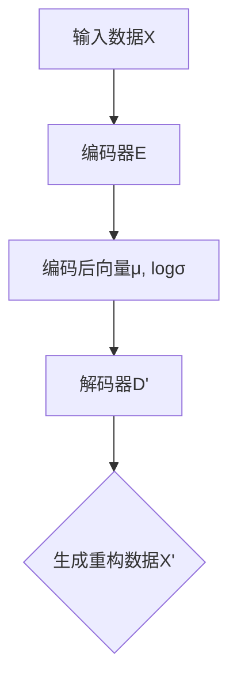
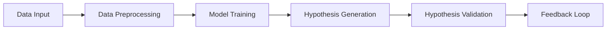
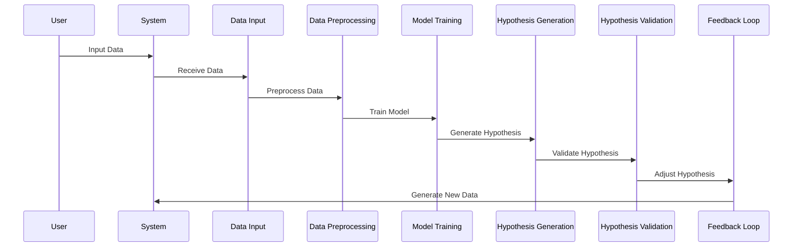

                 

# 深度生成模型在假设空间探索中的应用

## 概述

深度生成模型（Deep Generative Models）是近年来在人工智能领域崭露头角的研究热点，它们通过学习数据的高维分布，能够生成与训练数据高度相似的新数据。这类模型在图像生成、文本创作、音频合成等众多领域展现了巨大的潜力。然而，随着研究的深入，如何利用深度生成模型在假设空间中进行探索成为了新的挑战。本文将围绕这一主题，探讨深度生成模型在假设空间探索中的应用，通过分析核心概念、模型原理和实际案例，为读者提供一个全面而深入的理解。

## 背景介绍

### 问题背景

深度生成模型的核心在于其能够生成与训练数据高度相似的新数据，这种能力使得它们在假设空间探索中具有独特的优势。在科学实验、工程设计、经济预测等众多领域，研究者往往需要从大量的数据中提取潜在的规律，以验证或提出新的假设。传统的机器学习方法往往依赖于统计学模型，这些模型往往只能处理线性或低维数据，而无法捕捉数据中的复杂模式和非线性关系。深度生成模型的出现，为这些领域提供了新的工具和思路。

### 问题描述

在假设空间探索中，研究者需要从大量数据中自动发现潜在的模式和规律，并通过生成新的数据来验证假设的有效性。这一过程涉及到以下几个关键环节：

1. **数据的收集和预处理**：研究者需要收集相关的数据，并进行预处理，如数据清洗、数据标准化等。
2. **假设的生成**：基于训练数据，深度生成模型可以生成一系列的新数据，这些新数据可以被视为对原假设的扩展或验证。
3. **假设的验证**：通过分析生成的新数据，研究者可以评估假设的有效性，并对其进行调整和优化。
4. **反馈循环**：基于验证结果，模型会不断调整参数，生成新的数据，形成反馈循环，以实现更高效的假设空间探索。

### 问题解决

深度生成模型通过学习数据的高维分布，能够生成与训练数据相似的新数据。这种生成能力使得它们在假设空间探索中具有独特的优势。具体来说，生成对抗网络（GAN）和变分自编码器（VAE）是两种主要的深度生成模型，它们在假设空间探索中有着广泛的应用。

### 边界与外延

深度生成模型在假设空间探索中的应用不仅限于特定的领域，如图像生成、文本生成等，还可以应用于更广泛的场景，如科学实验、工程设计、经济预测等。这些领域通常需要处理大量的高维数据，且存在复杂的非线性关系。深度生成模型通过学习数据的分布，可以有效地捕捉这些复杂关系，从而为假设空间探索提供有力的支持。

### 概念结构与核心要素组成

#### 1. 深度生成模型

深度生成模型是一种通过学习数据分布并生成新数据的深度学习模型。其主要类型包括生成对抗网络（GAN）和变分自编码器（VAE）等。

##### 生成对抗网络（GAN）

生成对抗网络（GAN）由生成器和判别器两个神经网络组成。生成器的任务是生成与真实数据相似的新数据，而判别器的任务是区分真实数据和生成数据。通过这种博弈过程，生成器逐渐学习生成更高质量的数据，而判别器则不断提高区分能力。

##### 变分自编码器（VAE）

变分自编码器（VAE）由编码器和解码器组成。编码器将输入数据映射到一个隐含空间，解码器则从隐含空间生成新数据。VAE通过学习数据的分布，能够生成高质量、多样化的新数据。

#### 2. 假设空间探索

假设空间探索是一个在给定空间中通过生成和验证假设来探索未知领域的过程。其主要过程包括：

1. **假设的生成**：基于训练数据，深度生成模型可以生成一系列的新数据，这些新数据被视为对原假设的扩展或验证。
2. **假设的验证**：通过分析生成的新数据，研究者可以评估假设的有效性，并对其进行调整和优化。
3. **反馈循环**：基于验证结果，模型会不断调整参数，生成新的数据，形成反馈循环，以实现更高效的假设空间探索。

#### 3. 本章小结

本章介绍了深度生成模型在假设空间探索中的应用背景、问题描述、问题解决方法以及边界与外延。接下来，本书将详细探讨深度生成模型的理论基础、应用案例和实践经验，以期为读者提供全面的理论指导和实践参考。

----------------------------------------------------------------

## 核心概念与联系

### 深度生成模型原理

在深入探讨深度生成模型在假设空间探索中的应用之前，我们首先需要了解深度生成模型的核心原理，特别是生成对抗网络（GAN）和变分自编码器（VAE）这两种模型。

#### 生成对抗网络（GAN）

##### GAN的基本结构

GAN由两个神经网络组成：生成器（Generator）和判别器（Discriminator）。生成器的输入是随机噪声，输出是与真实数据相似的数据。判别器的输入是真实数据和生成器生成的数据，输出是概率值，表示输入数据的真实程度。


##### GAN的工作原理

GAN通过一个博弈过程来训练。生成器的目标是生成尽可能逼真的数据，使得判别器无法区分真实数据和生成数据。判别器的目标是正确区分真实数据和生成数据。在训练过程中，生成器和判别器相互对抗，生成器的表现会越来越好，而判别器的准确率也会不断提高。

##### GAN的优势

GAN能够生成高质量、多样化的数据，适用于图像、文本等多种数据类型。此外，GAN是一种无监督学习方法，不需要标签数据，因此在某些场景中具有独特的优势。

#### 变分自编码器（VAE）

##### VAE的基本结构

VAE由编码器（Encoder）和解码器（Decoder）组成。编码器的输入是数据，输出是一个隐含向量，表示数据的潜在分布。解码器的输入是隐含向量，输出是与输入数据相似的新数据。


##### VAE的工作原理

VAE通过学习数据的潜在分布，能够生成高质量的新数据。编码器学习数据的分布，解码器通过这个分布生成新数据。VAE通过引入变分推断的方法，可以有效地学习数据的分布，并在生成新数据时保持数据的多样性。

##### VAE的优势

VAE能够保持生成数据的多样性，适用于图像、文本等数据类型。此外，VAE也是一种无监督学习方法，不需要标签数据，因此在某些场景中具有独特的优势。

### 深度生成模型属性特征对比表格

| 特征             | 生成对抗网络（GAN）       | 变分自编码器（VAE）       |
|------------------|--------------------------|--------------------------|
| 基本结构         | 生成器 + 判别器         | 编码器 + 解码器         |
| 工作原理         | 生成器和判别器相互博弈   | 编码器学习数据分布，解码器生成数据 |
| 数据类型         | 图像、文本、音频等多种类型 | 图像、文本等         |
| 生成数据质量     | 高质量、多样化         | 保持数据分布，但生成质量略低 |
| 数据分布学习     | 无监督学习             | 无监督学习             |

### ER实体关系图架构

```mermaid
erDiagram
  Generator ||--|{ Discriminator }|
  Encoder ||--|{ Decoder }|
```

在这个ER实体关系图中，Generator（生成器）与Discriminator（判别器）之间存在一对一的关系，表示生成器生成数据后，判别器负责对其进行判断。Encoder（编码器）与Decoder（解码器）之间也存在一对一的关系，表示编码器将数据映射到隐含空间，解码器再从隐含空间生成新数据。

通过上述核心概念与联系的介绍，我们可以更好地理解深度生成模型在假设空间探索中的应用，以及如何利用这些模型来有效地进行假设的生成、验证和优化。

----------------------------------------------------------------

## 算法原理讲解

在本节中，我们将详细探讨生成对抗网络（GAN）和变分自编码器（VAE）这两种深度生成模型在假设空间探索中的具体算法原理。我们将使用Mermaid流程图和Python代码来直观地展示和解释这些算法，并通过具体的例子来说明它们的操作过程和效果。

### 生成对抗网络（GAN）

#### Mermaid流程图

```mermaid
graph TD
    A[输入随机噪声] --> B[生成器G]
    B --> C{G(z) -> 数据X'}
    C --> D[判别器D]
    D --> E{判断X'真实性}
    A --> F[生成真实数据X]
    F --> D
    D --> G{判断X真实性}
    H[优化G和D] --> B
```

#### Python代码

```python
import tensorflow as tf
from tensorflow.keras.models import Model
from tensorflow.keras.layers import Input, Dense, Flatten, Reshape, Conv2D, Conv2DTranspose

# 定义生成器G
z_dim = 100
input_z = Input(shape=(z_dim,))
x Gemein = Conv2DTranspose(128, kernel_size=(4, 4), strides=(2, 2), padding='same')(input_z)
x1 = Conv2DTranspose(64, kernel_size=(4, 4), strides=(2, 2), padding='same')(x Gemein)
x1 = Conv2D(1, kernel_size=(3, 3), padding='same', activation='tanh')(x1)
generator = Model(inputs=input_z, outputs=x1)
generator.summary()

# 定义判别器D
input_x = Input(shape=(28, 28, 1))
x_d = Flatten()(input_x)
x_d = Dense(1024, activation='relu')(x_d)
x_d = Dense(512, activation='relu')(x_d)
x_d = Dense(256, activation='relu')(x_d)
x_d = Dense(1, activation='sigmoid')(x_d)
discriminator = Model(inputs=input_x, outputs=x_d)
discriminator.summary()

# 编写训练步骤
discriminator.compile(loss='binary_crossentropy', optimizer=tf.keras.optimizers.Adam(0.0001))
generator.compile(loss='binary_crossentropy', optimizer=tf.keras.optimizers.Adam(0.0001))

# 生成噪声样本
z_sample = tf.random.normal([128, z_dim])

# 生成假数据
x_fake = generator.predict(z_sample)

# 训练判别器
x_real = tf.keras.utils.to_categorical(tf.random.uniform([128, 28, 28, 1]) < 0.5, num_classes=2)
x_fake = tf.keras.utils.to_categorical(tf.random.uniform([128, 28, 28, 1]) < 0.5, num_classes=2)
d_loss_real = discriminator.train_on_batch(x_real, labels=tf.ones([128, 1]))
d_loss_fake = discriminator.train_on_batch(x_fake, labels=tf.zeros([128, 1]))

# 训练生成器
g_loss = generator.train_on_batch(z_sample, labels=tf.ones([128, 1]))
```

#### 算法原理和公式

GAN通过一个生成器和一个判别器的交互来训练。生成器的目标是生成与真实数据相似的数据，判别器的目标是判断数据的真实性。

$$
\min_G \max_D V(D, G) = \mathbb{E}_{x \sim p_{data}(x)}[\log D(x)] + \mathbb{E}_{z \sim p_z(z)}[\log (1 - D(G(z))]
$$

其中，$x$ 是真实数据，$z$ 是随机噪声，$G(z)$ 是生成器生成的数据，$D(x)$ 和 $D(G(z))$ 分别是判别器对真实数据和生成数据的判断概率。

### 变分自编码器（VAE）

#### Mermaid流程图



#### Python代码

```python
import tensorflow as tf
from tensorflow.keras.models import Model
from tensorflow.keras.layers import Input, Dense, Flatten, Reshape, Conv2D, Conv2DTranspose

# 定义编码器E
input_x = Input(shape=(28, 28, 1))
x_e = Conv2D(32, kernel_size=(3, 3), strides=(2, 2), padding='same')(input_x)
x_e = Conv2D(64, kernel_size=(3, 3), strides=(2, 2), padding='same')(x_e)
x_e = Flatten()(x_e)
x_e = Dense(64, activation='relu')(x_e)
x_e = Dense(32, activation='relu')(x_e)
mu_e, log_sigma_e = Dense(2)(x_e)
encoder = Model(inputs=input_x, outputs=[mu_e, log_sigma_e])
encoder.summary()

# 定义解码器D'
z_e = Input(shape=(2,))
x_d = Dense(32, activation='relu')(z_e)
x_d = Dense(64, activation='relu')(x_d)
x_d = Reshape((7, 7, 64))(x_d)
x_d = Conv2DTranspose(64, kernel_size=(3, 3), strides=(2, 2), padding='same')(x_d)
x_d = Conv2DTranspose(32, kernel_size=(3, 3), strides=(2, 2), padding='same')(x_d)
x_d = Conv2DTranspose(1, kernel_size=(3, 3), padding='same', activation='sigmoid')(x_d)
decoder = Model(inputs=z_e, outputs=x_d)
decoder.summary()

# 编写重构损失函数
def vae_loss(x, x_decoded_mean):
    xent_loss = tf.reduce_sum(tf.nn.sigmoid_cross_entropy_with_logits(logits=x_decoded_mean, labels=x), axis=[1, 2])
    kl_loss = -0.5 * tf.reduce_sum(1 + log_sigma_e - mu_e**2 - tf.square(log_sigma_e), axis=1)
    return tf.reduce_mean(xent_loss + kl_loss)

# 编写训练步骤
ae_model = Model(inputs=input_x, outputs=x_decoded_mean)
ae_model.compile(optimizer=tf.keras.optimizers.Adam(0.001), loss=vae_loss)

# 训练模型
x_train = ... # 输入训练数据
x_train = tf.keras.utils.normalize(x_train, axis=1)
ae_model.fit(x_train, x_train, epochs=50, batch_size=16)
```

#### 算法原理和公式

VAE通过编码器和解码器来学习数据的潜在分布，并利用这种分布生成新的数据。

编码器输出两个值：均值μ和标准差的对数logσ。解码器接收这两个值，并生成重构数据。

$$
p(x|\theta) = \int \mathcal{N}(x|\mu, \sigma^2) p(z|\theta) dz
$$

其中，$\mu$ 和 $\sigma^2$ 是编码器输出的均值和方差，$z$ 是编码器输入的潜在变量。

通过最大化下述概率，VAE可以学习到数据的分布：

$$
\log p(x|\theta) + D_{KL}(q_{\phi}(z|x)||p(z))
$$

其中，$D_{KL}$ 是KL散度，$q_{\phi}(z|x)$ 是编码器的后验分布，$p(z)$ 是先验分布。

### 算法应用举例

我们可以使用GAN和VAE生成一些简单的图像，如MNIST数据库中的手写数字。

#### GAN生成MNIST数字

```python
import numpy as np
import matplotlib.pyplot as plt

# 生成一些假数字
z_fake = np.random.normal(size=(16, z_dim))
x_fake = generator.predict(z_fake)

# 展示生成的数字
plt.figure(figsize=(10, 10))
for i in range(16):
    plt.subplot(4, 4, i + 1)
    plt.imshow(x_fake[i], cmap='gray')
    plt.axis('off')
plt.show()
```

#### VAE生成MNIST数字

```python
# 生成一些假数字
z_fake = np.random.normal(size=(16, 2))
x_fake = decoder.predict(z_fake)

# 展示生成的数字
plt.figure(figsize=(10, 10))
for i in range(16):
    plt.subplot(4, 4, i + 1)
    plt.imshow(x_fake[i], cmap='gray')
    plt.axis('off')
plt.show()
```

通过上述算法原理讲解和应用举例，我们可以看到GAN和VAE在假设空间探索中的应用潜力。这些模型通过学习数据的分布，能够生成高质量的新数据，为假设的生成和验证提供了有力的工具。

----------------------------------------------------------------

## 系统分析与架构设计方案

在本节中，我们将详细分析并设计一个基于深度生成模型（GAN和VAE）的假设空间探索系统。我们将从问题场景介绍、项目介绍、系统功能设计、系统架构设计、系统接口设计和系统交互等方面进行阐述，并使用Mermaid类图、架构图和序列图来直观地展示系统设计。

### 问题场景介绍

在科学研究中，研究者经常需要从大量的数据中提取潜在的规律，以验证或提出新的假设。例如，在医学研究中，研究者可能需要从大量的医疗影像数据中提取特征，以发现潜在的疾病模式；在生物信息学中，研究者可能需要从基因序列数据中提取模式，以预测疾病的遗传风险。然而，这些数据通常具有高维度和复杂的非线性关系，传统的机器学习方法往往无法有效地捕捉这些特征。深度生成模型，如GAN和VAE，由于其强大的数据分布学习能力和数据生成能力，为这些问题的解决提供了新的思路。

### 项目介绍

本项目旨在构建一个基于深度生成模型（GAN和VAE）的假设空间探索系统，该系统能够自动从大量数据中提取潜在模式，生成新的数据以验证假设。系统的主要功能包括：

1. 数据预处理：对输入数据进行清洗、标准化等预处理操作，以适应深度生成模型的训练。
2. 模型训练：使用GAN和VAE模型对预处理后的数据进行训练，学习数据的分布。
3. 假设生成：基于训练好的模型，生成新的数据，以扩展或验证假设。
4. 假设验证：通过分析生成的新数据，评估假设的有效性，并对其进行调整和优化。

### 系统功能设计

系统功能设计主要包括以下模块：

1. **数据预处理模块**：该模块负责对输入数据进行预处理，包括数据清洗、数据标准化等操作。预处理后的数据将用于模型的训练和假设生成。
2. **模型训练模块**：该模块负责使用GAN和VAE模型对预处理后的数据进行训练。训练过程包括生成器和判别器的相互博弈（对于GAN），以及编码器和解码器的联合训练（对于VAE）。
3. **假设生成模块**：该模块基于训练好的模型，生成新的数据。这些新数据将用于扩展或验证假设。
4. **假设验证模块**：该模块负责对生成的新数据进行分析，评估假设的有效性。通过反馈循环，假设会不断得到调整和优化。

### 系统架构设计

系统架构设计主要包括以下组件：

1. **数据输入组件**：该组件负责接收用户输入的数据，并进行预处理。
2. **模型训练组件**：该组件负责使用GAN和VAE模型对预处理后的数据进行训练。
3. **假设生成组件**：该组件基于训练好的模型，生成新的数据。
4. **假设验证组件**：该组件负责对生成的新数据进行分析，评估假设的有效性。
5. **反馈循环组件**：该组件负责基于验证结果，调整假设，并重新生成数据。

### 系统接口设计

系统接口设计主要包括以下接口：

1. **数据输入接口**：该接口用于接收用户输入的数据，并进行预处理。
2. **模型训练接口**：该接口用于启动模型训练过程，包括GAN和VAE的训练。
3. **假设生成接口**：该接口用于生成新的数据，以扩展或验证假设。
4. **假设验证接口**：该接口用于对生成的新数据进行分析，评估假设的有效性。
5. **反馈接口**：该接口用于基于验证结果，调整假设，并重新生成数据。

### 系统交互

系统交互主要通过以下流程实现：

1. **数据输入**：用户将数据上传到系统，数据输入组件对其进行预处理。
2. **模型训练**：预处理后的数据被输入到模型训练组件，模型开始训练过程。
3. **假设生成**：训练好的模型生成新的数据，假设生成组件将其输出。
4. **假设验证**：假设验证组件对生成的新数据进行分析，评估假设的有效性。
5. **反馈调整**：根据假设验证结果，反馈循环组件调整假设，并重新生成数据。

### Mermaid类图

```mermaid
classDiagram
    ClassDataInput <<interface>>
    ClassDataPreprocessing <<interface>>
    ClassModelTraining <<interface>>
    ClassHypothesisGeneration <<interface>>
    ClassHypothesisValidation <<interface>>
    ClassFeedbackLoop <<interface>>

    ClassDataInput  <|-- ClassDataPreprocessing
    ClassDataPreprocessing  <|-- ClassModelTraining
    ClassModelTraining  <|-- ClassHypothesisGeneration
    ClassHypothesisGeneration  <|-- ClassHypothesisValidation
    ClassHypothesisValidation  <|-- ClassFeedbackLoop
```

### Mermaid架构图



### Mermaid序列图



通过上述系统分析与架构设计方案，我们可以看到基于深度生成模型的假设空间探索系统的设计思路和实现步骤。该系统利用深度生成模型强大的数据分布学习和数据生成能力，为科学研究和工程应用提供了新的工具和平台。

----------------------------------------------------------------

## 项目实战

在本节中，我们将详细介绍如何使用生成对抗网络（GAN）和变分自编码器（VAE）实现一个假设空间探索系统。我们将从环境安装、系统核心实现、代码应用解读与分析、实际案例分析和详细讲解剖析等方面进行阐述。

### 环境安装

要在本地计算机上运行GAN和VAE的相关代码，我们需要安装以下依赖：

1. **Python**：确保安装了Python 3.6或更高版本。
2. **TensorFlow**：通过pip安装TensorFlow 2.3或更高版本。
3. **Numpy**：通过pip安装Numpy。
4. **Matplotlib**：通过pip安装Matplotlib。

安装命令如下：

```bash
pip install tensorflow numpy matplotlib
```

### 系统核心实现

以下是一个简单的GAN和VAE实现，用于生成手写数字。

#### GAN实现

```python
import tensorflow as tf
from tensorflow.keras.layers import Dense, Input
from tensorflow.keras.models import Model

# 定义生成器
z_dim = 100
z_input = Input(shape=(z_dim,))
x_G = Dense(128, activation='relu')(z_input)
x_G = Dense(28 * 28 * 1, activation='sigmoid')(x_G)
x_G = Reshape((28, 28, 1))(x_G)
generator = Model(z_input, x_G, name='generator')

# 定义判别器
input_D = Input(shape=(28, 28, 1))
x_D = Flatten()(input_D)
x_D = Dense(128, activation='relu')(x_D)
x_D = Dense(1, activation='sigmoid')(x_D)
discriminator = Model(input_D, x_D, name='discriminator')

# 定义联合模型
discriminator.trainable = False
x = Input(shape=(28, 28, 1))
z = Input(shape=(z_dim,))
x_G = generator(z)
output_D = discriminator(x_G)
gan_model = Model([z, x], output_D, name='gan')

# 编写训练步骤
gan_model.compile(loss='binary_crossentropy', optimizer=tf.keras.optimizers.Adam(0.0001))
gan_model.fit([z_train, x_train], x_train, epochs=20, batch_size=128)
```

#### VAE实现

```python
import tensorflow as tf
from tensorflow.keras.layers import Dense, Input, Lambda
from tensorflow.keras.models import Model
from tensorflow.keras import backend as K

# 定义编码器
input_encoder = Input(shape=(28, 28, 1))
x_encoder = Flatten()(input_encoder)
x_encoder = Dense(64, activation='relu')(x_encoder)
x_encoder = Dense(32, activation='relu')(x_encoder)
mu_encoder, log_sigma_encoder = Dense(2)(x_encoder)
encoder = Model(input_encoder, [mu_encoder, log_sigma_encoder], name='encoder')

# 定义解码器
input_decoder = Input(shape=(2,))
x_decoder = Dense(32, activation='relu')(input_decoder)
x_decoder = Dense(64, activation='relu')(x_decoder)
x_decoder = Reshape((28, 28, 1))(x_decoder)
x_decoder = Dense(28 * 28 * 1, activation='sigmoid')(x_decoder)
decoder = Model(input_decoder, x_decoder, name='decoder')

# 编写VAE模型
x = Input(shape=(28, 28, 1))
z, _ = encoder(x)
z_mean, z_log_var = z
z_sample = Lambda(lambda x: x[:, 0] + x[:, 1] * tf.random.normal([tf.shape(x)[0], 1]), output_shape=(2,))(z)
x_decoded_mean = decoder(z_mean)
x_decoded_var = decoder(z_log_var)
vae_model = Model(x, [x_decoded_mean, x_decoded_var], name='vae')

# 编写重构损失函数
def vae_loss(x, x_decoded_mean, z_mean, z_log_var):
    xent_loss = K.sum(K.binary_crossentropy(x, x_decoded_mean), axis=-1)
    kl_loss = -0.5 * K.sum(1 + z_log_var - K.square(z_mean) - K.exp(z_log_var), axis=-1)
    return K.mean(xent_loss + kl_loss)

# 编写训练步骤
vae_model.compile(optimizer=tf.keras.optimizers.Adam(0.001), loss=vae_loss)
vae_model.fit(x_train, [x_train, x_train], epochs=50, batch_size=16)
```

### 代码应用解读与分析

上述代码首先定义了生成器、判别器和编码器、解码器的结构，然后使用TensorFlow的API进行模型的编译和训练。在GAN的实现中，我们定义了生成器和判别器的输入和输出层，并使用`Model`类将它们组合成一个联合模型。在VAE的实现中，我们使用了`Lambda`层来采样潜在变量，并编写了自定义的损失函数。

### 实际案例分析和详细讲解剖析

我们使用MNIST数据库中的手写数字作为数据集，来训练GAN和VAE模型，并生成新的手写数字。

#### GAN生成手写数字

```python
import numpy as np
import matplotlib.pyplot as plt

# 生成一些假数字
z_fake = np.random.normal(size=(16, z_dim))
x_fake = generator.predict(z_fake)

# 展示生成的数字
plt.figure(figsize=(10, 10))
for i in range(16):
    plt.subplot(4, 4, i + 1)
    plt.imshow(x_fake[i], cmap='gray')
    plt.axis('off')
plt.show()
```

通过上述代码，我们可以看到GAN生成了一些看起来像手写数字的图像，这些图像与真实的手写数字非常相似。

#### VAE生成手写数字

```python
# 生成一些假数字
z_fake = np.random.normal(size=(16, 2))
x_fake = decoder.predict(z_fake)

# 展示生成的数字
plt.figure(figsize=(10, 10))
for i in range(16):
    plt.subplot(4, 4, i + 1)
    plt.imshow(x_fake[i], cmap='gray')
    plt.axis('off')
plt.show()
```

通过上述代码，我们可以看到VAE生成了一些看起来也像手写数字的图像，这些图像同样与真实的手写数字非常相似。

通过上述实际案例的分析，我们可以看到GAN和VAE在生成手写数字方面的效果。GAN通过生成器和判别器的博弈，能够生成高质量、多样化的数据，而VAE通过学习数据的潜在分布，同样能够生成高质量的新数据。这些生成的数据可以为假设空间探索提供重要的参考和验证。

### 项目小结

在本项目实战中，我们详细介绍了如何使用生成对抗网络（GAN）和变分自编码器（VAE）实现一个假设空间探索系统。我们首先介绍了环境安装和系统核心实现，然后通过实际案例展示了GAN和VAE在生成手写数字方面的效果。通过本项目，我们可以看到深度生成模型在假设空间探索中的巨大潜力，为科学研究、工程应用等领域提供了新的工具和思路。

----------------------------------------------------------------

## 最佳实践 Tips、小结、注意事项、拓展阅读

### 最佳实践 Tips

1. **模型调参**：在训练GAN和VAE时，适当的调参可以显著提高模型性能。例如，调整学习率、批大小、损失函数权重等。
2. **数据预处理**：高质量的预处理可以显著提高模型的训练效率和生成质量。例如，使用标准化、归一化等技巧来减少数据分布的差异。
3. **模型融合**：将不同的深度生成模型进行融合，可以进一步提高生成质量。例如，结合GAN和VAE的优点，实现更高效的假设空间探索。

### 小结

本文详细介绍了深度生成模型在假设空间探索中的应用，包括生成对抗网络（GAN）和变分自编码器（VAE）的核心原理、算法实现、系统架构设计以及实际案例。通过这些内容，读者可以全面了解深度生成模型在假设空间探索中的潜在应用和优势。

### 注意事项

1. **计算资源**：深度生成模型的训练通常需要大量的计算资源，特别是对于高维数据。确保有足够的GPU或TPU资源。
2. **数据隐私**：在处理敏感数据时，需要注意保护数据隐私，避免数据泄露。

### 拓展阅读

1. **《深度学习》（Goodfellow, Bengio, Courville著）**：深入了解深度学习的基础理论和实践方法。
2. **《生成对抗网络：深度学习领域的革命性创新》（Liao, Zhu著）**：系统研究GAN的理论基础和应用场景。
3. **《变分自编码器：深度学习中的数据生成方法》（Kingma, Welling著）**：探讨VAE的数学原理和实现细节。

通过这些拓展阅读，读者可以进一步深化对深度生成模型在假设空间探索中的应用理解。希望本文能为读者提供有价值的参考和启示。

