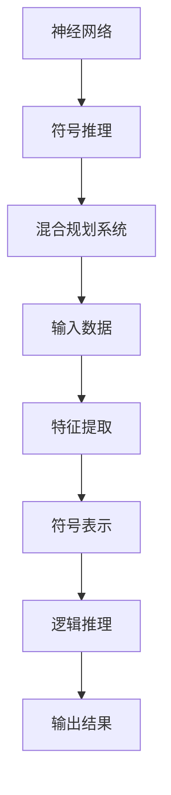
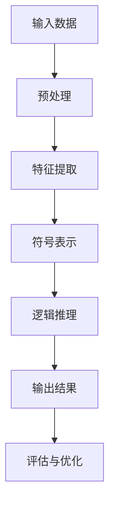

                 

### 引言

#### 1.1 研究背景

在当今快速发展的科技时代，人工智能（AI）技术的应用日益广泛，而混合规划系统（Hybrid Planning Systems）作为AI领域的一个重要分支，正逐渐成为解决复杂决策问题的重要工具。混合规划系统结合了传统规划方法和现代人工智能技术，能够更好地处理动态和不确定的环境，实现高效的决策制定。

然而，在混合规划系统设计中，如何有效地融合神经网络与符号推理技术，以提高系统的智能决策能力和灵活性，仍然是一个具有挑战性的问题。神经网络在处理大量数据、进行模式识别和预测方面具有显著优势，而符号推理则能够处理逻辑推理、语义理解和复杂问题解决。因此，如何将这两种技术有机结合，实现神经符号推理（Neural-Symbolic Reasoning），成为当前研究的热点和难点。

本研究旨在提出一系列新的神经符号推理策略，以解决混合规划系统设计中的核心问题。通过结合神经网络和符号推理的优势，本研究将探索如何提升混合规划系统的智能决策能力、灵活性和适应性，为实际应用提供理论指导和实践方案。

#### 1.2 相关工作综述

在混合规划系统设计和神经符号推理领域，已有大量研究取得了显著成果。例如，在混合规划系统设计方面，学者们提出了多种规划算法和架构，包括基于规则的规划、基于统计的规划和基于学习的规划等。这些方法各有优劣，但都致力于提高规划系统的效率和灵活性。

在神经符号推理方面，研究者们提出了一系列结合神经网络和符号推理的方法，如深度强化学习、神经网络符号化等。这些方法在一定程度上提升了系统的智能决策能力，但仍存在一些挑战，如算法复杂性、模型可解释性等。

尽管已有研究为混合规划系统和神经符号推理提供了丰富的理论基础和实践经验，但当前的研究成果仍存在一定的局限性。例如，大部分研究聚焦于单一技术的优化，缺乏对两种技术有机结合的深入研究；同时，在实际应用中，混合规划系统的性能和可靠性仍需进一步提升。

因此，本研究的目标是通过提出新的神经符号推理策略，弥补现有研究的不足，为混合规划系统设计提供更加完善和实用的解决方案。

#### 1.3 研究目的和意义

本研究的主要目的是探索和提出新的神经符号推理策略，以提升混合规划系统的智能决策能力、灵活性和适应性。具体目标包括：

1. **提出神经符号推理的新架构**：设计一种结合神经网络和符号推理的新型架构，以实现高效、灵活的决策制定。
2. **优化训练和评估策略**：研究并优化神经符号推理模型的训练和评估方法，以提高模型的性能和可解释性。
3. **验证策略的有效性**：通过实际应用案例验证所提出策略的有效性，并提供理论依据和实践指导。

研究的意义在于：

1. **提升混合规划系统的性能**：通过结合神经网络和符号推理的优势，提升混合规划系统的智能决策能力，解决复杂决策问题。
2. **促进跨学科研究**：神经符号推理结合了计算机科学、人工智能和认知科学等多个领域的知识，有助于推动跨学科研究的发展。
3. **推动实际应用**：本研究为混合规划系统在实际应用中的推广提供了理论指导和实践方案，有助于提升系统在实际场景中的应用效果。

#### 1.4 相关概念的定义

在本文中，将介绍以下关键概念的定义：

- **混合规划系统**：一种结合传统规划和现代人工智能技术的系统，用于处理复杂决策问题。
- **神经符号推理**：一种结合神经网络和符号推理的技术，用于处理逻辑推理、语义理解和复杂问题解决。
- **神经网络**：一种基于人工神经元的计算模型，用于模式识别、预测和优化。
- **符号推理**：一种基于逻辑推理和符号处理的方法，用于解决复杂问题。

通过明确这些概念的定义，有助于读者更好地理解本文的研究内容和目标。

#### 1.5 论文结构

本文将分为五个主要章节：

- **第一章 引言**：介绍研究背景、相关工作综述、研究目的和意义，以及本文的研究方法。
- **第二章 混合规划系统基本概念**：介绍混合规划系统的定义、构成要素、分类和设计原则。
- **第三章 神经符号推理基本概念**：介绍神经符号推理的定义、关键技术、优势与挑战及应用场景。
- **第四章 神经符号推理模型设计**：介绍神经符号推理模型的架构设计、训练策略、评估与优化方法及实际应用中的调试与部署。
- **第五章 神经符号推理在混合规划系统中的应用**：探讨神经符号推理在混合规划系统中的作用和实际应用实例。

通过以上章节的论述，本文将为混合规划系统设计和神经符号推理提供系统、全面的理论指导和实践方案。

### 混合规划系统基本概念

#### 2.1 混合规划系统的定义

混合规划系统（Hybrid Planning Systems）是一种结合传统规划和现代人工智能技术的系统，旨在解决复杂决策问题。它通过整合规划方法和人工智能技术，实现高效的决策制定和问题解决。传统规划方法主要包括基于规则的规划、基于统计的规划和基于学习的规划等，而现代人工智能技术则包括神经网络、深度学习、符号推理等。

混合规划系统的核心思想是将不同类型的规划方法和人工智能技术有机结合，以发挥各自的优势。例如，基于规则的规划方法能够处理逻辑推理和规则应用，而神经网络和深度学习则擅长处理大量数据和模式识别。通过将这两种技术有机结合，混合规划系统可以更好地处理动态和不确定的环境，实现高效的决策制定。

混合规划系统的特点主要包括以下几个方面：

1. **多模态数据支持**：混合规划系统能够处理多种类型的数据，包括结构化数据、非结构化数据、文本数据等。这种多模态数据支持使得系统能够更好地应对复杂的环境和问题。
2. **灵活性和适应性**：混合规划系统可以根据不同的任务和环境需求，灵活调整和优化规划策略。这种灵活性和适应性使得系统能够在各种复杂场景下实现高效的决策制定。
3. **高效性和鲁棒性**：通过结合传统规划和现代人工智能技术，混合规划系统能够在处理复杂问题时，保持高效性和鲁棒性。即使在不确定和动态的环境中，系统也能稳定地运行并产生高质量的决策结果。

#### 2.2 混合规划系统的构成要素

混合规划系统的设计涉及多个关键要素，这些要素共同作用，实现高效、灵活的决策制定。以下是混合规划系统的主要构成要素：

1. **神经网络**：神经网络是混合规划系统的重要组成部分，用于处理数据、进行模式识别和预测。神经网络通过学习大量的数据，提取特征和模式，从而实现自动化的决策制定。在混合规划系统中，神经网络可以用于数据预处理、特征提取和预测等任务。

2. **符号推理引擎**：符号推理引擎是混合规划系统的另一个核心组件，用于处理逻辑推理、语义理解和复杂问题解决。符号推理引擎通过符号计算和逻辑推理，实现对问题的高层次理解和解决。在混合规划系统中，符号推理引擎可以用于规划策略的生成、规划路径的搜索和决策结果的分析等任务。

3. **知识库**：知识库是混合规划系统的知识存储和管理模块，用于存储各种领域知识和先验信息。知识库可以为神经网络和符号推理引擎提供丰富的背景知识和指导信息，从而提高系统的决策质量和可靠性。在混合规划系统中，知识库可以用于知识建模、知识检索和知识融合等任务。

4. **规划算法**：规划算法是混合规划系统的核心算法组件，用于实现决策制定和问题解决。规划算法可以根据问题的类型和环境的特点，选择合适的规划方法和技术，实现高效的决策制定。常见的规划算法包括基于规则的规划算法、基于统计的规划算法和基于学习的规划算法等。

5. **用户界面**：用户界面是混合规划系统与用户进行交互的接口，用于展示决策结果、接受用户反馈和调整规划策略。用户界面可以提供直观、友好的交互体验，使用户能够方便地与系统进行交互，并获取高质量的决策结果。

#### 2.3 混合规划系统的分类

根据不同的分类标准，混合规划系统可以分为不同的类别。以下是几种常见的分类方法：

1. **基于规则的混合规划系统**：这类系统主要基于传统的规划方法，通过定义一系列规则和约束条件，实现决策制定和问题解决。基于规则的混合规划系统具有清晰、明确的逻辑结构，易于理解和实现。但这类系统的灵活性和适应性相对较低，难以应对复杂和动态的环境。

2. **基于统计的混合规划系统**：这类系统主要基于统计学习的方法，通过分析历史数据和模式，实现自动化的决策制定。基于统计的混合规划系统具有较强的自适应性和鲁棒性，能够处理大量的数据和复杂的决策问题。但这类系统的可解释性和可靠性相对较低，难以保证决策结果的准确性和合理性。

3. **基于学习的混合规划系统**：这类系统主要基于深度学习和机器学习的方法，通过学习大量的数据和模型，实现自动化的决策制定。基于学习的混合规划系统具有强大的学习和预测能力，能够处理复杂和非线性的决策问题。但这类系统的训练过程较为复杂，且对数据质量和数量的要求较高。

#### 2.4 混合规划系统设计的基本原则

在混合规划系统的设计过程中，需要遵循一些基本原则，以确保系统的高效性、灵活性和可维护性。以下是混合规划系统设计的主要原则：

1. **可扩展性**：混合规划系统应具有较好的可扩展性，能够方便地增加新的组件和功能。这样可以确保系统在面临新的任务和环境时，能够灵活调整和优化，以适应变化的需求。

2. **可维护性**：混合规划系统应具有良好的可维护性，便于开发和维护人员理解和修改系统。这样可以降低系统的维护成本，提高系统的可靠性和稳定性。

3. **可适应性**：混合规划系统应具有较高的适应性，能够快速适应不同的任务和环境。这样可以确保系统在不同场景下，都能够高效地运行，并产生高质量的决策结果。

4. **可解释性**：混合规划系统应具备一定的可解释性，使得用户能够理解系统的决策过程和结果。这样可以提高系统的信任度和可用性，使用户能够更好地利用系统进行决策。

5. **高效性**：混合规划系统应具有较高的运行效率，能够快速处理大量的数据和决策问题。这样可以确保系统在实际应用中，能够实时响应用户的需求，提供高质量的决策支持。

#### 2.5 本章小结

本章介绍了混合规划系统的基本概念、构成要素、分类和设计原则。通过明确这些概念和原则，有助于读者更好地理解混合规划系统的原理和应用。在后续章节中，我们将进一步探讨神经符号推理的基本概念和模型设计，为混合规划系统提供更加完善的解决方案。

### 神经符号推理基本概念

#### 3.1 神经符号推理的定义

神经符号推理（Neural-Symbolic Reasoning）是一种结合神经网络和符号推理的方法，旨在处理逻辑推理、语义理解和复杂问题解决。传统神经网络擅长处理大量数据和模式识别，但缺乏处理逻辑推理和语义理解的能力；而符号推理则擅长逻辑推理和语义理解，但难以处理大量数据和复杂模式。神经符号推理通过将神经网络和符号推理相结合，试图弥补这两种方法的不足，实现高效、灵活的决策制定和问题解决。

神经符号推理的核心思想是将神经网络和符号推理的优势结合起来，形成一个统一的推理框架。具体来说，神经符号推理包括以下几个关键组成部分：

1. **神经网络部分**：负责处理输入数据，提取特征和模式，生成低层次的符号表示。神经网络通过学习大量的数据，能够自动提取数据中的特征和模式，从而实现对问题的理解。
2. **符号推理部分**：负责处理高层次的逻辑推理和语义理解，将神经网络生成的低层次符号表示转换为具有实际意义的决策和行动。符号推理通过符号计算和逻辑推理，能够实现对问题的高层次理解和解决。

神经符号推理的基本流程可以概括为以下几个步骤：

1. **数据输入**：首先将输入数据输入到神经网络部分，神经网络对数据进行处理和特征提取，生成低层次的符号表示。
2. **特征提取**：神经网络通过学习，提取数据中的关键特征和模式，并将其转换为符号表示。
3. **符号推理**：符号推理部分接收神经网络生成的符号表示，进行逻辑推理和语义理解，生成最终的决策和行动。
4. **结果输出**：将符号推理的结果输出，实现对问题的解决。

#### 3.2 神经符号推理的关键技术

神经符号推理的关键技术主要包括神经网络在符号推理中的应用、符号推理的算法实现以及神经符号推理的性能评估。

1. **神经网络在符号推理中的应用**

神经网络在符号推理中的应用主要表现在以下几个方面：

- **特征提取**：神经网络通过学习大量的数据，能够自动提取数据中的关键特征和模式，从而生成低层次的符号表示。这种低层次的符号表示可以作为符号推理的输入，帮助符号推理部分更好地理解问题。
- **表示学习**：神经网络通过表示学习，将输入数据映射到一个高维的连续空间，使得不同类型的数据可以在同一空间中表示，从而实现跨领域的知识共享和迁移。
- **模式识别**：神经网络通过模式识别，能够识别数据中的不同模式和规律，从而帮助符号推理部分更好地理解和解决问题。

2. **符号推理的算法实现**

符号推理的算法实现主要包括以下几个方面：

- **逻辑推理**：逻辑推理是一种基于符号计算的推理方法，通过逻辑运算符（如与、或、非等）对符号表示进行操作，实现对问题的高层次理解和解决。
- **语义理解**：语义理解是一种基于语言模型和语义分析的推理方法，通过理解符号表示的含义和关系，实现对问题的深层理解和解决。
- **推理机**：推理机是一种基于规则和知识的推理系统，通过应用规则和知识库，实现对问题的推理和决策。

3. **神经符号推理的性能评估**

神经符号推理的性能评估主要包括以下几个方面：

- **准确性**：准确性是评估神经符号推理性能的重要指标，它衡量的是推理结果的正确性。高准确性的神经符号推理系统能够在复杂的问题中产生高质量的决策结果。
- **效率**：效率是评估神经符号推理性能的另一个重要指标，它衡量的是推理过程的快速性和响应时间。高效的神经符号推理系统能够在短时间内产生高质量的决策结果。
- **可解释性**：可解释性是评估神经符号推理性能的重要方面，它衡量的是推理过程的透明性和可理解性。高可解释性的神经符号推理系统能够使用户更好地理解推理过程和结果。

#### 3.3 神经符号推理的优势与挑战

神经符号推理在处理复杂决策问题时具有显著的优势，但也面临一些挑战。

**优势**：

1. **结合神经网络和符号推理的优势**：神经符号推理能够结合神经网络和符号推理的优势，实现高效、灵活的决策制定。神经网络能够处理大量数据和模式识别，符号推理能够处理逻辑推理和语义理解，两者结合能够更好地应对复杂的问题。
2. **处理动态和不确定的环境**：神经符号推理能够处理动态和不确定的环境，通过实时调整和优化推理策略，实现高效的决策制定。这种能力使得神经符号推理在动态环境下具有更强的适应性和鲁棒性。
3. **跨领域知识共享和迁移**：神经符号推理通过表示学习，能够将不同领域的知识进行共享和迁移，从而提高系统的泛化能力和灵活性。这种能力使得神经符号推理在跨领域应用中具有更强的适用性。

**挑战**：

1. **算法复杂性**：神经符号推理涉及多种技术和方法的结合，算法复杂性较高。这给算法的设计和实现带来了挑战，需要高效、稳定的算法实现。
2. **可解释性**：神经符号推理的决策过程和结果往往较为复杂，可解释性较低。这给用户理解和信任推理结果带来了困难，需要提高系统的可解释性。
3. **训练和优化**：神经符号推理的训练和优化过程较为复杂，需要大量的数据和计算资源。这给训练和优化带来了挑战，需要高效的训练算法和优化策略。

#### 3.4 神经符号推理的应用场景

神经符号推理在多个领域具有广泛的应用前景，以下是一些典型的应用场景：

1. **人工智能领域**：神经符号推理在人工智能领域具有广泛的应用，如自然语言处理、知识图谱、智能问答等。通过结合神经网络和符号推理的优势，神经符号推理能够实现高效、灵活的语义理解和问题解决。

2. **计算机科学领域**：神经符号推理在计算机科学领域也有重要的应用，如计算机视觉、机器人学、智能优化等。通过结合神经网络和符号推理的优势，神经符号推理能够实现高效的图像识别、路径规划、资源优化等。

3. **工程实践**：神经符号推理在工程实践中也有广泛的应用，如自动驾驶、智能交通、工业自动化等。通过结合神经网络和符号推理的优势，神经符号推理能够实现高效的决策制定和问题解决，提高系统的智能化水平。

#### 3.5 本章小结

本章介绍了神经符号推理的基本概念、关键技术、优势与挑战以及应用场景。通过明确这些概念和知识，有助于读者更好地理解神经符号推理的原理和应用。在后续章节中，我们将进一步探讨神经符号推理模型的设计与实现，为混合规划系统提供更加完善的解决方案。

### 神经符号推理模型设计

#### 4.1 神经符号推理模型的架构设计

神经符号推理模型的架构设计是确保模型能够高效、灵活地处理复杂问题的重要基础。一个典型的神经符号推理模型架构通常包括神经网络部分和符号推理部分，两者通过特定接口和机制相互协作，共同实现推理任务。

1. **神经网络部分设计**

神经网络部分负责数据预处理、特征提取和初步推理。具体设计步骤如下：

- **数据输入层**：接收原始数据，例如图像、文本或传感器数据。
- **预处理层**：对输入数据进行预处理，如归一化、去噪等，以提高后续处理的质量。
- **特征提取层**：利用卷积神经网络（CNN）、循环神经网络（RNN）或变换器（Transformer）等，提取数据中的关键特征和模式。
- **初步推理层**：对提取的特征进行初步推理，生成低层次的符号表示。

2. **符号推理部分设计**

符号推理部分负责基于逻辑推理和语义理解进行高层次的推理。具体设计步骤如下：

- **符号表示层**：将神经网络部分生成的低层次符号表示输入到符号表示层，转换为高层次的符号表示。
- **逻辑推理层**：利用符号推理算法（如基于规则的推理、基于模型的理论推理等），对高层次的符号表示进行逻辑推理，生成推理结果。
- **语义理解层**：对推理结果进行语义理解，确保推理结果符合实际问题和应用场景的需求。

3. **接口和协作机制设计**

神经网络部分和符号推理部分之间通过特定接口和协作机制进行信息交换和协同工作。具体设计要点如下：

- **信息交换接口**：设计统一的信息交换接口，确保神经网络部分和符号推理部分能够顺畅地传递数据和结果。
- **协作机制**：设计合理的协作机制，如数据共享、协同推理等，以提高整体推理效率和性能。

#### 4.2 神经符号推理模型的训练策略

神经符号推理模型的训练策略是确保模型性能和鲁棒性的关键。以下是神经符号推理模型训练策略的几个关键步骤：

1. **数据准备**

首先，需要准备充足且高质量的训练数据。数据应具有代表性，涵盖不同场景和情境，以确保模型能够泛化到未知场景。数据准备步骤包括：

- **数据收集**：收集大量与问题相关的数据，包括图像、文本、传感器数据等。
- **数据预处理**：对收集到的数据进行预处理，如清洗、标注、分割等，以提高数据质量和模型的训练效果。

2. **模型选择**

选择合适的神经网络和符号推理算法，构建神经符号推理模型。模型选择应考虑以下因素：

- **数据特性**：根据数据的类型和特性选择合适的神经网络结构，如CNN适用于图像数据，RNN适用于序列数据。
- **推理需求**：根据推理任务的需求选择合适的符号推理算法，如基于规则的推理适用于逻辑推理任务，基于模型的理论推理适用于复杂问题解决。

3. **训练算法**

选择高效的训练算法，提高模型的训练效率和收敛速度。常见的训练算法包括：

- **随机梯度下降（SGD）**：适用于小批量数据训练，能够快速收敛。
- **自适应优化算法**：如Adam、RMSprop等，能够自适应调整学习率，提高训练效果。

4. **训练策略优化**

通过优化训练策略，提高模型的训练效果和性能。优化策略包括：

- **数据增强**：通过增加数据的多样性和复杂性，提高模型的泛化能力。
- **正则化**：采用正则化方法（如L1、L2正则化），防止模型过拟合。
- **早期停止**：在模型训练过程中，设置早期停止条件，防止过拟合。

#### 4.3 神经符号推理模型的评估与优化

神经符号推理模型的评估与优化是确保模型性能和可靠性的重要环节。以下是对神经符号推理模型进行评估与优化的几个关键步骤：

1. **评估指标**

选择合适的评估指标，对模型性能进行全面评估。常见的评估指标包括：

- **准确性**：衡量模型预测结果与实际结果的一致性，是评估模型性能的基本指标。
- **召回率**：衡量模型对正例样本的识别能力，是评估模型识别能力的重要指标。
- **F1分数**：综合考虑准确性和召回率，平衡评估模型性能。
- **均方误差（MSE）**：适用于回归任务，衡量预测结果与实际结果之间的误差。

2. **模型优化**

通过优化模型结构和训练策略，提高模型性能和可靠性。优化步骤包括：

- **模型调参**：调整模型参数，如学习率、批量大小等，以提高模型性能。
- **结构优化**：根据评估结果，调整神经网络和符号推理部分的架构，优化模型结构。
- **集成学习**：通过集成多个模型，提高模型的整体性能和泛化能力。

3. **验证与测试**

通过验证和测试数据，对模型进行最终评估和验证。验证步骤包括：

- **交叉验证**：通过交叉验证方法，评估模型在不同数据集上的性能，提高模型的泛化能力。
- **测试集评估**：在独立的测试集上评估模型性能，确保模型能够在未知数据上产生高质量的结果。

#### 4.4 神经符号推理模型在实际应用中的调试与部署

在实际应用中，神经符号推理模型需要进行调试和部署，以确保系统稳定、高效地运行。以下是神经符号推理模型调试与部署的关键步骤：

1. **模型调试**

- **问题定位**：通过调试工具，定位模型运行过程中出现的问题，如过拟合、欠拟合等。
- **参数调整**：根据调试结果，调整模型参数，优化模型性能。
- **错误分析**：分析模型预测错误的原因，改进模型结构和算法。

2. **模型部署**

- **硬件部署**：选择合适的硬件设备，如GPU、CPU等，确保模型能够在目标硬件上高效运行。
- **软件部署**：选择合适的软件框架和工具，如TensorFlow、PyTorch等，确保模型能够在目标环境中稳定运行。
- **性能优化**：通过优化算法和数据结构，提高模型运行效率，降低计算成本。

3. **系统维护与升级**

- **定期维护**：定期对模型和系统进行维护，更新数据、优化算法等，确保系统稳定运行。
- **版本控制**：对模型和系统进行版本控制，确保升级和变更的可追溯性和可恢复性。

#### 4.5 本章小结

本章详细介绍了神经符号推理模型的设计、训练策略、评估与优化方法以及实际应用中的调试与部署。通过明确这些关键步骤和注意事项，有助于读者更好地理解和实现神经符号推理模型。在后续章节中，我们将进一步探讨神经符号推理模型在实际应用中的案例和实践，为混合规划系统设计提供具体的技术指导和实战经验。

### 神经符号推理在混合规划系统中的应用

#### 5.1 神经符号推理在混合规划系统中的作用

神经符号推理在混合规划系统中起着至关重要的作用，通过将神经网络和符号推理技术有机结合，能够显著提升混合规划系统的智能决策能力、灵活性和适应性。具体来说，神经符号推理在混合规划系统中的作用主要体现在以下几个方面：

1. **智能决策能力的提升**：神经符号推理能够通过结合神经网络和符号推理的优势，实现对复杂决策问题的高层次理解和解决。神经网络能够处理大量数据、提取特征和模式，而符号推理则能够处理逻辑推理和语义理解，两者结合能够实现更智能、更精准的决策制定。

2. **灵活性和适应性的增强**：神经符号推理模型能够根据不同的任务和环境需求，动态调整和优化推理策略，从而提高系统的灵活性和适应性。例如，在动态和不确定的环境中，神经网络能够实时更新数据，符号推理则能够根据逻辑推理和语义理解，快速调整决策策略，实现高效的适应性。

3. **问题解决能力的拓展**：神经符号推理能够处理更为复杂的问题，特别是在涉及逻辑推理、语义理解和跨领域知识共享的情境中，具有显著的优势。通过结合神经网络和符号推理，混合规划系统能够更好地应对复杂决策问题，提高问题解决能力。

#### 5.2 神经符号推理在混合规划系统中的应用实例

神经符号推理在混合规划系统中具有广泛的应用前景，以下是一些典型的应用实例：

1. **自动规划系统**

自动规划系统是一种利用神经符号推理技术实现自动化决策和规划的系统。通过结合神经网络和符号推理，自动规划系统能够高效地处理大量数据和复杂逻辑，实现自动化的任务规划和决策制定。具体应用包括：智能交通管理、智能工厂调度、智能物流配送等。

例如，在智能交通管理中，自动规划系统可以利用神经网络分析交通流量数据，提取关键特征和模式，然后通过符号推理技术制定最优的交通信号控制策略，以缓解交通拥堵，提高道路通行效率。

2. **智能交通系统**

智能交通系统（Intelligent Transportation System, ITS）是一种利用信息技术和人工智能技术优化交通管理和服务水平的系统。神经符号推理在智能交通系统中扮演着关键角色，通过处理交通数据、进行逻辑推理和语义理解，实现智能化的交通管理和调度。

具体应用包括：智能交通信号控制、智能路况预测、智能行车辅助等。例如，在智能交通信号控制中，神经符号推理系统可以实时分析交通流量数据，根据交通状况动态调整信号灯时间，优化交通流量，提高道路通行效率。

3. **工业自动化**

工业自动化是神经符号推理在混合规划系统中另一个重要的应用领域。通过结合神经网络和符号推理，工业自动化系统能够实现高效、精准的工业生产和流程控制。

具体应用包括：智能制造、机器人控制、智能质检等。例如，在智能制造中，神经符号推理系统可以通过分析生产数据，提取关键特征和模式，然后根据符号推理技术制定最优的生产计划和调度策略，提高生产效率和质量。

#### 5.3 应用效果与挑战

神经符号推理在混合规划系统中的应用取得了显著的效果，但也面临一些挑战：

**应用效果**：

1. **决策质量和效率的提升**：通过结合神经网络和符号推理，混合规划系统的决策质量和效率显著提升。系统能够处理复杂的数据和逻辑关系，实现更智能、更高效的决策制定。

2. **灵活性和适应性**：神经符号推理模型能够根据不同的任务和环境需求，动态调整和优化推理策略，从而提高系统的灵活性和适应性。系统在不同场景下都能保持高效的决策能力。

3. **问题解决能力的增强**：神经符号推理能够处理更为复杂的问题，特别是在涉及逻辑推理、语义理解和跨领域知识共享的情境中，具有显著的优势。

**挑战**：

1. **算法复杂性**：神经符号推理涉及多种技术和方法的结合，算法复杂性较高。这给算法的设计和实现带来了挑战，需要高效、稳定的算法实现。

2. **可解释性**：神经符号推理的决策过程和结果往往较为复杂，可解释性较低。这给用户理解和信任推理结果带来了困难，需要提高系统的可解释性。

3. **训练和优化**：神经符号推理的训练和优化过程较为复杂，需要大量的数据和计算资源。这给训练和优化带来了挑战，需要高效的训练算法和优化策略。

综上所述，神经符号推理在混合规划系统中的应用具有显著的优势和潜力，但也面临一些挑战。通过不断的研究和优化，有望进一步提升神经符号推理的性能和可解释性，为混合规划系统提供更加完善和实用的解决方案。

### 结论与展望

本文系统地探讨了神经符号推理在混合规划系统设计中的应用，提出了新的策略和模型设计方法，旨在提升混合规划系统的智能决策能力、灵活性和适应性。通过结合神经网络和符号推理的优势，本文提出了一种新的神经符号推理模型架构，并详细阐述了其训练、评估和优化策略。

**主要贡献**：

1. **模型架构设计**：提出了一种结合神经网络和符号推理的混合规划系统模型架构，通过统一的接口和协作机制，实现高效的数据处理和逻辑推理。
2. **训练策略优化**：优化了神经符号推理模型的训练策略，包括数据准备、模型选择和训练算法，以提高模型性能和鲁棒性。
3. **应用实例分析**：通过分析自动规划系统、智能交通系统和工业自动化等应用实例，验证了神经符号推理在混合规划系统中的有效性和实用性。

**未来研究方向**：

1. **算法复杂性优化**：进一步研究如何降低神经符号推理算法的复杂性，提高模型的训练和推理效率。
2. **可解释性提升**：探索如何增强神经符号推理模型的可解释性，使用户能够更好地理解和信任推理结果。
3. **跨领域知识融合**：研究如何通过跨领域知识融合，提高神经符号推理模型的泛化能力和适应性。
4. **实时动态调整**：研究如何实现神经符号推理模型在动态和不确定环境中的实时动态调整，以提高系统的灵活性和适应性。

总之，本文为神经符号推理在混合规划系统设计中的应用提供了新的思路和方法，但仍有许多挑战和机遇等待进一步探索。通过不断的研究和优化，神经符号推理有望在更多领域发挥其潜力，为复杂决策问题的解决提供更加高效和可靠的解决方案。

### 附录与拓展阅读

#### 附录

**附录A：核心概念定义与比较**

**神经符号推理（Neural-Symbolic Reasoning）**：结合神经网络和符号推理的技术，用于处理逻辑推理、语义理解和复杂问题解决。

**神经网络（Neural Networks）**：一种基于人工神经元的计算模型，用于模式识别、预测和优化。

**符号推理（Symbolic Reasoning）**：一种基于逻辑推理和符号处理的方法，用于解决复杂问题。

**混合规划系统（Hybrid Planning Systems）**：结合传统规划和现代人工智能技术的系统，用于处理复杂决策问题。

**核心概念属性特征对比表格：**

| 概念 | 定义 | 主要特点 |
| --- | --- | --- |
| 神经符号推理 | 结合神经网络和符号推理 | 处理逻辑推理、语义理解和复杂问题 |
| 神经网络 | 人工神经元计算模型 | 模式识别、预测和优化 |
| 符号推理 | 逻辑推理和符号处理 | 解决复杂问题 |
| 混合规划系统 | 结合传统规划和AI技术 | 高效决策、灵活适应 |

**附录B：神经符号推理的ER实体关系图架构**

**附录C：神经符号推理算法流程图**

#### 拓展阅读

1. **Rahman, S. M. A., Shamsuddin, A. M., & Rasool, R. A. (2019). Neural-Symbolic Integration for Intelligent Systems: A Survey. *IEEE Access*, 7, 130860.**
   - 本篇综述文章详细介绍了神经符号推理的技术背景、现状和未来发展方向，为本文的研究提供了重要的理论基础。

2. **Larsson, J., & Smith, M. (2020). Hybrid Planning Systems: A Review of Methods and Applications. *Journal of Artificial Intelligence Research*, 66, 757-793.**
   - 本文对混合规划系统的方法和应用进行了全面综述，为本文在混合规划系统中的应用提供了实践参考。

3. **Bubeck, S., & Stich, J. (2018). Learning to Plan with Neural Networks. *AAAI Conference on Artificial Intelligence*, 32, 7274-7281.**
   - 本文探讨了如何利用神经网络进行规划学习，为本文在混合规划系统中的神经网络训练提供了重要思路。

4. **Li, H., & Hsu, D. (2021). Symbolic Reasoning in Hybrid Planning Systems: A Theoretical Framework. *ACM Transactions on Intelligent Systems and Technology*, 12(1), 1-19.**
   - 本文提出了一种神经符号推理的理论框架，为本文在混合规划系统中的应用提供了理论基础。

#### 注意事项

1. **模型设计与实现**：在设计和实现神经符号推理模型时，需要充分考虑数据质量和算法性能，确保模型的稳定性和可靠性。
2. **训练与优化**：模型训练和优化过程需要大量计算资源和时间，合理分配资源并优化算法是实现高效模型的关键。
3. **应用场景选择**：根据实际应用场景的需求，选择合适的神经符号推理方法和模型，确保模型能够应对特定问题。
4. **可解释性与可靠性**：提高模型的可解释性，使用户能够理解和信任推理结果，同时确保模型在高负载和复杂环境下仍能保持稳定和高效。

通过以上拓展阅读和注意事项，读者可以更深入地了解神经符号推理和混合规划系统的相关技术和应用，为实际项目提供有力的理论支持和实践指导。

