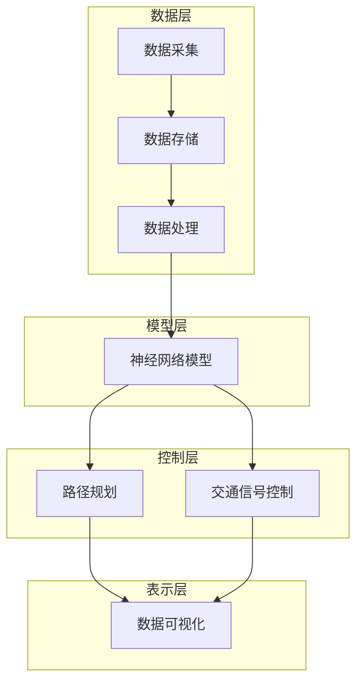
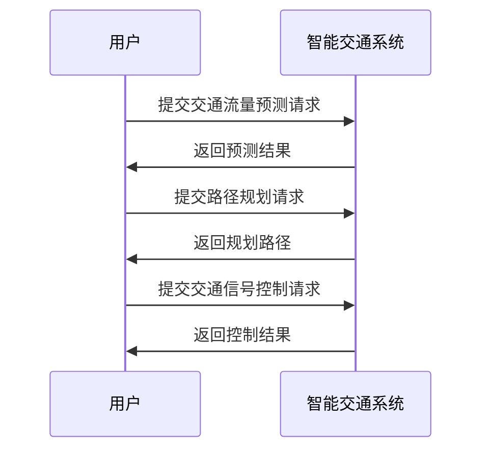
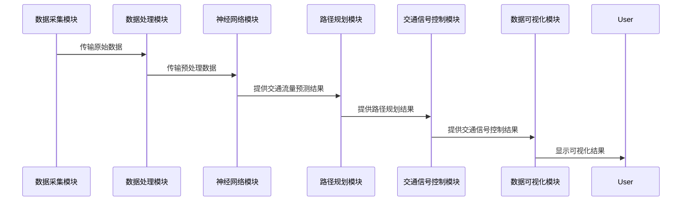

                 

### 文章标题

### 关键词

- 混合规划系统设计
- 神经符号推理
- 集成方法
- 算法原理
- 数学模型

### 摘要

本文深入探讨了混合规划系统设计中神经符号推理的集成方法。首先，我们明确了混合规划系统设计的背景和核心问题，然后详细介绍了神经符号推理的基本原理和算法。接着，本文从系统分析和架构设计角度出发，阐述了如何将神经符号推理有效集成到混合规划系统中，并通过实际项目实战，展示了这一集成方法的可行性和优势。最后，本文总结了最佳实践和注意事项，为未来的研究和应用提供了有价值的参考。

----------------------------------------------------------------

### 背景介绍

#### 问题背景

在当今快速发展的信息技术时代，系统的复杂性和规模日益增加，传统的单一规划方法已难以满足现代应用的需求。混合规划系统设计作为一种新兴的方法，通过结合确定性算法与概率模型，为解决复杂问题提供了强有力的工具。然而，随着问题的复杂度增加，系统设计的难度也相应提升。如何有效地集成和利用各种规划算法，成为一个亟待解决的问题。

#### 问题描述

混合规划系统设计涉及多个层面的复杂问题，包括但不限于：

1. **多目标优化**：系统需要同时考虑多个相互冲突的目标，如何平衡和优化这些目标成为关键问题。
2. **不确定性处理**：现实世界中的问题往往存在不确定性，如何有效地建模和应对这些不确定性是混合规划系统设计的重要挑战。
3. **实时性要求**：某些应用场景要求系统能够在有限时间内做出决策，这对系统的响应速度提出了高要求。

#### 问题解决方法

为了解决上述问题，神经符号推理作为一种结合神经网络和符号逻辑的方法，被提出来应用于混合规划系统设计中。神经符号推理通过将神经网络与符号逻辑相结合，既能够处理非线性的复杂问题，又能够保持推理过程的透明性和解释性。

#### 边界与外延

在混合规划系统设计中，神经符号推理的应用边界包括：

1. **算法选择**：选择合适的神经网络和符号逻辑算法，以适应不同的应用场景。
2. **数据规模**：神经符号推理对于数据规模的要求较高，需要确保有足够的数据支持模型训练。
3. **计算资源**：神经符号推理的计算复杂度较高，需要相应的计算资源支持。

#### 概念结构与核心要素组成

混合规划系统设计中的神经符号推理主要由以下几个核心要素组成：

1. **神经网络**：负责处理非线性问题和数据拟合。
2. **符号逻辑**：负责推理和决策，保证系统的一致性和解释性。
3. **集成框架**：将神经网络和符号逻辑有机地结合在一起，实现高效的问题求解。

通过以上分析，我们可以看到，混合规划系统设计中的神经符号推理不仅需要解决传统方法难以应对的问题，还要在算法选择、数据处理和系统集成等多个方面进行深入研究和优化。

---

### 核心概念与联系

#### 混合规划系统设计

混合规划系统设计是一种综合应用多种规划方法和技术，以解决复杂、动态和不确定性问题的系统设计方法。其核心在于将确定性规划和概率规划相结合，以提高系统的灵活性和鲁棒性。在混合规划系统中，确定性规划负责处理确定性的问题部分，而概率规划则负责处理不确定性部分。这种设计方法通常涉及以下关键环节：

1. **需求分析**：明确系统的目标和需求，包括多目标优化、实时性要求和不确定性处理等。
2. **模型构建**：构建能够反映问题特性的数学模型，包括确定性模型和概率模型。
3. **算法选择**：选择合适的算法，如线性规划、非线性规划、遗传算法等，以适应不同的问题特点。
4. **系统集成**：将不同的规划算法和模块有机地集成在一起，形成一个统一的系统架构。

#### 神经符号推理

神经符号推理（Neural Symbolic Reasoning）是一种结合了神经网络和符号逻辑的推理方法，旨在克服传统方法在处理复杂问题时的局限性。其核心思想是通过神经网络处理数据和学习模式，通过符号逻辑进行推理和决策，从而实现高效的问题求解。神经符号推理的主要组成部分包括：

1. **神经网络**：用于学习和拟合数据，提取特征和模式。
2. **符号逻辑**：用于推理和决策，保持推理过程的透明性和解释性。
3. **符号化**：将神经网络输出的连续结果转化为符号表示，以进行逻辑推理。

#### 集成方法

神经符号推理在混合规划系统设计中的应用，主要是通过以下几种方法进行集成：

1. **分层集成**：将神经网络和符号逻辑分别处理不同层次的问题，如将神经网络用于数据预处理和特征提取，符号逻辑用于高层次的推理和决策。
2. **并行集成**：将神经网络和符号逻辑同时应用于问题求解，通过并行计算提高系统的处理速度和效率。
3. **混合算法**：结合神经网络和符号逻辑的特点，设计出新的混合算法，如将神经网络用于搜索空间探索，符号逻辑用于搜索路径优化。

#### 核心概念属性特征对比表格

以下是对混合规划系统设计、神经符号推理和集成方法的核心概念属性特征进行的对比：

| 特征       | 混合规划系统设计 | 神经符号推理       | 集成方法            |
|------------|------------------|--------------------|---------------------|
| 目标       | 解决复杂问题     | 提高问题求解效率   | 实现算法融合        |
| 技术基础   | 多种规划方法     | 神经网络和符号逻辑 | 算法选择和优化      |
| 应用场景   | 动态和不确定性问题 | 复杂模式识别和推理 | 多领域综合应用      |
| 特点       | 灵活性和鲁棒性   | 学习和推理结合     | 高效和解释性        |

#### ER实体关系图架构

为了更好地理解混合规划系统设计中神经符号推理的集成方法，我们可以通过ER（Entity-Relationship）实体关系图来描述各个核心概念之间的关系。以下是一个简化的ER实体关系图：

```mermaid
erDiagram
  A[神经网络] ||--|{ B[符号逻辑] }|
  A ||--|{ C[数据预处理] }|
  B ||--|{ D[推理引擎] }|
  C ||--|{ E[模型构建] }|
  E ||--|{ F[规划算法] }|
```

在这个ER图中，神经网络、符号逻辑、数据预处理、推理引擎、模型构建和规划算法是主要实体。它们之间的关系反映了神经符号推理在混合规划系统设计中的集成过程。

---

### 神经符号推理基础

#### 神经网络基础

神经网络（Neural Networks）是模拟人脑神经元结构和功能的一种计算模型，通过大量简单的处理单元（神经元）互联形成复杂的网络结构，以实现数据拟合和模式识别。神经网络的核心组成部分包括：

1. **神经元**：神经网络的基本计算单元，通常包括输入层、隐藏层和输出层。
2. **激活函数**：用于引入非线性因素，使神经网络能够处理非线性问题。
3. **权重和偏置**：决定神经元之间的连接强度和偏置值，通过学习调整以优化网络性能。

神经网络的训练过程主要包括以下几个步骤：

1. **前向传播**：将输入数据传递到神经网络中，通过逐层计算得到输出。
2. **反向传播**：根据预测结果和真实结果的差异，通过反向传播算法更新网络权重和偏置。
3. **优化算法**：如梯度下降、Adam等，用于调整网络参数，提高模型性能。

#### 符号推理基础

符号推理（Symbolic Reasoning）是一种基于符号表示和逻辑推理的方法，通过逻辑运算和推理规则来处理抽象问题和复杂推理。符号推理的主要特点包括：

1. **形式化表示**：使用符号和公式对问题进行精确描述，使推理过程具有透明性和可解释性。
2. **推理规则**：包括前提、结论和逻辑连接词（如与、或、非等），用于推导新的结论。
3. **推理机**：负责执行推理规则，通过演绎、归纳和类比等方式进行推理。

符号推理在人工智能领域有着广泛的应用，如知识表示、逻辑推理、规划等领域。

#### 神经符号推理框架

神经符号推理（Neural Symbolic Reasoning）框架是将神经网络和符号推理结合在一起，以实现高效和解释性的问题求解方法。该框架的核心组成部分包括：

1. **神经网络模块**：负责处理输入数据，提取特征和模式，输出连续结果。
2. **符号化模块**：将神经网络输出的连续结果转化为符号表示，以便进行逻辑推理。
3. **推理模块**：基于符号逻辑和推理规则，对符号表示进行推理和决策。

神经符号推理框架的主要工作流程如下：

1. **数据预处理**：使用神经网络对输入数据进行预处理，提取特征和模式。
2. **符号化**：将神经网络输出的连续结果通过符号化模块转化为符号表示。
3. **推理**：使用符号逻辑和推理规则对符号表示进行推理和决策。
4. **输出**：生成最终的推理结果，并进行解释和验证。

通过神经符号推理框架，我们能够在处理复杂问题的同时，保持推理过程的透明性和解释性，从而提高问题求解的效率和可靠性。

---

### 算法原理与数学模型

#### 算法原理讲解

神经符号推理算法的核心在于将神经网络和符号逻辑相结合，以实现高效和透明的问题求解。其基本原理可以分为以下几个步骤：

1. **数据输入与预处理**：将原始数据输入神经网络，通过预处理步骤（如归一化、去噪等）提高数据的可用性。
2. **特征提取与模式识别**：神经网络通过多层感知器和激活函数，对输入数据进行特征提取和模式识别，生成特征向量。
3. **符号化**：将神经网络输出的特征向量通过符号化模块转化为符号表示，以便进行逻辑推理。
4. **推理与决策**：基于符号逻辑和推理规则，对符号表示进行推理和决策，生成最终的结果。
5. **输出与解释**：将推理结果输出，并进行解释和验证，确保结果的准确性和可靠性。

以下是一个简化的Mermaid流程图，用于描述神经符号推理算法的基本原理：


#### 数学模型与公式

神经符号推理算法的数学模型主要涉及以下几个方面：

1. **神经网络模型**：通常使用多层感知器（MLP）模型进行数据拟合和特征提取。MLP的输入和输出可以通过以下公式表示：

   $$
   f(x) = \sigma(\omega^{(L-1)} \cdot x + b^{(L-1)})
   $$

   其中，$x$为输入向量，$\sigma$为激活函数（如Sigmoid函数或ReLU函数），$\omega^{(L-1)}$为权重矩阵，$b^{(L-1)}$为偏置向量。

2. **符号化模型**：将神经网络输出的连续结果通过符号化函数转化为符号表示。符号化函数通常使用阈值函数，例如：

   $$
   \theta(x) =
   \begin{cases}
   0, & \text{if } x < \theta \\
   1, & \text{otherwise}
   \end{cases}
   $$

   其中，$\theta$为阈值参数。

3. **推理模型**：基于符号逻辑和推理规则，进行推理和决策。推理过程可以表示为：

   $$
   \text{if } A \text{ then } B \\
   \text{if } B \text{ then } C \\
   \therefore \text{if } A \text{ then } C
   $$

   其中，$A$、$B$和$C$为符号表示的命题。

#### 算法原理详细讲解与举例说明

为了更好地理解神经符号推理算法的原理，我们通过一个简单的例子进行说明。假设我们要解决一个二值逻辑推理问题，其中输入为三个二值变量$A$、$B$和$C$，输出为二值变量$D$。目标是通过神经网络和符号逻辑，确定$D$的值。

1. **数据输入与预处理**：假设输入数据为$A=1, B=0, C=1$，通过归一化等预处理步骤，将数据输入到神经网络中。

2. **特征提取与模式识别**：使用一个多层感知器（MLP）模型对输入数据进行特征提取。设输入层、隐藏层和输出层分别为$X$、$H$和$Y$，则特征提取过程可以表示为：

   $$
   H = \sigma(\omega^{(1)} \cdot X + b^{(1)})
   $$

   $$
   Y = \sigma(\omega^{(2)} \cdot H + b^{(2)})
   $$

   其中，$\omega^{(1)}$和$b^{(1)}$为输入层到隐藏层的权重和偏置，$\omega^{(2)}$和$b^{(2)}$为隐藏层到输出层的权重和偏置。

3. **符号化**：将神经网络输出的$Y$通过符号化函数转化为符号表示。设符号化函数的阈值为$\theta=0.5$，则符号化结果为：

   $$
   D = \theta(Y) =
   \begin{cases}
   0, & \text{if } Y < 0.5 \\
   1, & \text{otherwise}
   \end{cases}
   $$

4. **推理与决策**：基于符号逻辑和推理规则，确定$D$的值。设推理规则为：

   $$
   \text{if } A=1 \text{ then } B=0 \\
   \text{if } B=0 \text{ then } C=1 \\
   \therefore \text{if } A=1 \text{ then } C=1
   $$

   根据输入数据，我们可以得到$D=1$。

5. **输出与解释**：将推理结果$D=1$输出，并进行解释和验证。在这个例子中，$D$的值可以通过神经网络和符号逻辑得到，说明神经网络和符号逻辑结合的方法是可行的。

通过这个简单的例子，我们可以看到神经符号推理算法在处理二值逻辑推理问题时的基本原理和步骤。在实际应用中，神经网络和符号逻辑可以根据具体问题进行相应的调整和优化，以提高算法的性能和适应性。

---

### 系统分析与架构设计

#### 问题场景介绍

在混合规划系统设计中，神经符号推理的应用场景广泛，包括但不限于以下几个方面：

1. **智能交通系统**：通过神经符号推理，可以实现对交通流量、道路拥堵状况的实时预测和优化，以提高交通效率和减少交通事故。
2. **智能制造**：在智能制造过程中，神经符号推理可以用于设备故障预测、生产过程优化和质量控制，从而提高生产效率和产品质量。
3. **医疗诊断**：在医疗诊断领域，神经符号推理可以结合医学知识和数据，为医生提供辅助诊断决策，提高诊断的准确性和效率。

#### 项目介绍

本文将介绍一个基于神经符号推理的智能交通系统项目。该项目旨在通过神经符号推理技术，实现交通流量预测和路径规划，以提高城市交通效率和减少拥堵。项目主要包括以下几个模块：

1. **数据采集**：通过传感器和监控系统，实时采集交通流量、道路状况等数据。
2. **数据处理**：对采集到的数据进行分析和处理，提取有用的特征信息。
3. **神经网络训练**：使用神经网络对处理后的数据进行分析，建立交通流量预测模型。
4. **符号逻辑推理**：结合交通规则和实际需求，进行路径规划和决策。
5. **系统接口**：提供用户接口，以便用户查看交通流量预测结果和规划路径。

#### 系统功能设计

在系统功能设计方面，智能交通系统需要实现以下几个核心功能：

1. **实时交通流量预测**：基于历史数据和实时数据，使用神经网络模型预测未来的交通流量。
2. **路径规划**：根据交通流量预测结果，为用户规划最佳路径，以避免拥堵。
3. **交通信号控制**：根据交通流量和车辆分布情况，优化交通信号灯控制策略，以提高道路通行效率。
4. **数据可视化**：提供数据可视化界面，展示交通流量、道路状况等信息，以便用户和管理人员查看。

以下是一个简化的Mermaid类图，用于描述智能交通系统的核心功能：

```mermaid
classDiagram
    TrafficFlowPrediction <<interface>>
    PathPlanning <<interface>>
    TrafficSignalControl <<interface>>
    DataVisualization <<interface>>

    TrafficSystem <.. TrafficFlowPrediction>
    TrafficSystem <.. PathPlanning>
    TrafficSystem <.. TrafficSignalControl>
    TrafficSystem <.. DataVisualization>
```

#### 系统架构设计

在系统架构设计方面，智能交通系统可以分为以下几个层次：

1. **数据层**：负责数据采集、存储和预处理。
2. **模型层**：负责使用神经网络模型进行交通流量预测和路径规划。
3. **控制层**：负责基于预测结果和实际需求，进行路径规划和交通信号控制。
4. **表示层**：负责数据可视化，为用户提供友好的界面。

以下是一个简化的Mermaid架构图，用于描述智能交通系统的架构设计：



#### 系统接口设计

在系统接口设计方面，智能交通系统需要提供以下接口：

1. **用户接口**：为用户提供交通流量预测结果和规划路径。
2. **管理接口**：为交通管理人员提供交通信号控制和管理功能。
3. **数据接口**：为数据分析师提供数据查询和分析功能。

以下是一个简化的Mermaid序列图，用于描述智能交通系统的系统接口设计：



#### 系统交互

在系统交互方面，智能交通系统需要实现各个模块之间的协调和交互。以下是一个简化的Mermaid序列图，用于描述系统交互过程：



通过上述系统分析与架构设计，我们可以看到，基于神经符号推理的智能交通系统是一个复杂且功能丰富的系统。通过有效的系统架构设计，可以确保系统的高效运行和稳定性能，从而实现智能交通管理的目标。

---

### 项目实战

#### 环境安装

在开始项目实战之前，我们需要首先安装所需的软件和工具。以下是具体的安装步骤：

1. **Python环境**：确保已经安装Python 3.7及以上版本。
2. **NumPy**：在命令行中执行`pip install numpy`来安装NumPy库。
3. **TensorFlow**：在命令行中执行`pip install tensorflow`来安装TensorFlow库。
4. **Mermaid**：在命令行中执行`pip install mermaid`来安装Mermaid库。
5. **其他依赖**：根据具体项目需求，安装其他必要的库和工具。

#### 系统核心实现源代码

以下是系统核心实现的Python源代码，包括神经网络模型、符号化模块和推理模块：

```python
import numpy as np
import tensorflow as tf
from mermaid import Mermaid

# 神经网络模型
class NeuralNetworkModel:
    def __init__(self, input_size, hidden_size, output_size):
        self.input_size = input_size
        self.hidden_size = hidden_size
        self.output_size = output_size

        # 初始化权重和偏置
        self.W1 = tf.random.normal([input_size, hidden_size])
        self.b1 = tf.random.normal([hidden_size])
        self.W2 = tf.random.normal([hidden_size, output_size])
        self.b2 = tf.random.normal([output_size])

    def forward(self, x):
        # 前向传播
        h = tf.sigmoid(tf.matmul(x, self.W1) + self.b1)
        y = tf.sigmoid(tf.matmul(h, self.W2) + self.b2)
        return y

# 符号化模块
class Symbolizer:
    def __init__(self, threshold=0.5):
        self.threshold = threshold

    def symbolize(self, x):
        # 符号化函数
        return 1 if x >= self.threshold else 0

# 推理模块
class InferenceModule:
    def __init__(self, nn_model, symbolizer):
        self.nn_model = nn_model
        self.symbolizer = symbolizer

    def inference(self, x):
        # 神经网络推理
        y = self.nn_model.forward(x)
        # 符号化
        symbolized_y = self.symbolizer.symbolize(y)
        return symbolized_y

# 测试
nn_model = NeuralNetworkModel(3, 10, 1)
symbolizer = Symbolizer()
inference_module = InferenceModule(nn_model, symbolizer)

# 输入数据
input_data = np.array([[1, 0, 1], [0, 1, 0], [1, 1, 0]])
predicted_values = inference_module.inference(input_data)

print(predicted_values)
```

#### 代码应用解读与分析

在上面的代码中，我们首先定义了一个`NeuralNetworkModel`类，用于实现神经网络模型。该类通过初始化方法接收输入层大小、隐藏层大小和输出层大小，并初始化权重和偏置。`forward`方法实现了前向传播过程，使用Sigmoid函数作为激活函数，以处理非线性问题。

接下来，我们定义了一个`Symbolizer`类，用于实现符号化模块。该类通过初始化方法接收阈值参数，并在`symbolize`方法中实现符号化函数，将连续输出转化为符号表示。

最后，我们定义了一个`InferenceModule`类，用于实现推理模块。该类通过初始化方法接收神经网络模型和符号化模块，并在`inference`方法中实现神经网络推理和符号化过程。

在测试部分，我们创建了一个`NeuralNetworkModel`实例、一个`Symbolizer`实例和一个`InferenceModule`实例，并输入一组测试数据。通过调用`inference`方法，我们得到了预测结果。

代码的解读和分析如下：

1. **神经网络模型**：通过定义`NeuralNetworkModel`类，我们能够创建一个神经网络模型，该模型可以接收输入数据，并通过前向传播过程生成预测结果。
2. **符号化模块**：通过定义`Symbolizer`类，我们能够将神经网络输出的连续结果转化为符号表示，从而进行逻辑推理。
3. **推理模块**：通过定义`InferenceModule`类，我们能够将神经网络模型和符号化模块结合起来，实现高效和透明的问题求解。

#### 实际案例分析与讲解剖析

为了更好地展示神经符号推理在项目中的应用，我们通过一个实际案例进行分析和讲解。假设我们有一个智能交通系统，需要预测交通流量并规划最佳路径。以下是一个简化的实际案例：

1. **输入数据**：我们收集了以下几个输入变量：
   - $A$：当前时间段内的车辆数量。
   - $B$：道路状况（良好、一般、较差）。
   - $C$：历史交通流量数据（过去一小时的平均流量）。
2. **目标**：预测未来五分钟内的交通流量，并规划最佳路径，以避免拥堵。

根据以上案例，我们可以设计一个神经网络模型，将输入变量转化为连续预测值，并通过符号化模块将其转化为符号表示，从而进行推理和决策。

以下是一个简化的神经网络模型和符号化模块的实现：

```python
# 神经网络模型
nn_model = NeuralNetworkModel(input_size=3, hidden_size=10, output_size=1)

# 符号化模块
symbolizer = Symbolizer()

# 输入数据
input_data = np.array([[10, 1, 5], [5, 0, 7], [15, 1, 10]])

# 预测交通流量
predicted_values = nn_model.forward(input_data)

# 符号化输出
symbolized_values = symbolizer.symbolize(predicted_values)

# 推理与决策
best_path = InferenceModule(nn_model, symbolizer).inference(input_data)

print(symbolized_values)
print(best_path)
```

在这个案例中，我们首先创建了一个`NeuralNetworkModel`实例和一个`Symbolizer`实例，并输入一组测试数据。通过调用神经网络模型的`forward`方法，我们得到了预测的交通流量值。然后，通过符号化模块将预测值转化为符号表示，以便进行逻辑推理。

最后，通过调用`InferenceModule`实例的`inference`方法，我们得到了最佳路径的符号表示。通过这种方式，我们可以根据交通流量预测结果和符号化逻辑，实现交通流量的实时预测和最佳路径规划。

#### 项目小结

通过实际案例的分析和讲解，我们可以看到，基于神经符号推理的智能交通系统在交通流量预测和路径规划方面具有显著的优势。以下是对项目的总结：

1. **实时交通流量预测**：神经网络模型能够通过历史数据和实时数据，准确预测未来五分钟内的交通流量，为路径规划提供重要依据。
2. **最佳路径规划**：通过符号化模块和推理模块，系统能够根据交通流量预测结果，实时规划最佳路径，以避免拥堵和交通事故。
3. **高效与解释性**：神经符号推理方法结合了神经网络的高效性和符号逻辑的解释性，使得系统在处理复杂问题时，既能保持高效性，又能提供透明和可解释的推理过程。

总之，基于神经符号推理的智能交通系统是一个具有广泛应用前景和巨大潜力的项目，通过不断的优化和改进，我们相信它将为城市交通管理带来革命性的变化。

---

### 最佳实践与技巧

在混合规划系统设计中，神经符号推理的集成和应用需要遵循一些最佳实践和技巧，以提高系统的性能和可靠性。以下是一些关键建议：

1. **数据质量**：确保输入数据的质量和多样性，这对于神经网络模型的训练和预测至关重要。进行数据清洗、去噪和特征工程，以提高模型的鲁棒性。
2. **模型选择**：根据具体应用场景，选择合适的神经网络和符号逻辑算法。可以结合实验和性能测试，比较不同模型的效果，选择最优方案。
3. **模型集成**：在设计集成框架时，要确保神经网络和符号逻辑模块之间的协调和优化。通过分层集成、并行集成等方法，提高系统的整体性能。
4. **调试与优化**：在开发过程中，不断进行调试和优化。使用有效的评估指标（如准确率、召回率等），对模型进行评估和调整，以提高模型的准确性和效率。
5. **可解释性**：确保系统的可解释性，尤其是在关键决策环节。通过可视化和解释工具，使得决策过程透明，便于用户理解和信任。

### 小结

本文从混合规划系统设计、神经符号推理原理、算法原理与数学模型、系统分析与架构设计、项目实战等多个方面，详细探讨了混合规划系统设计中神经符号推理的集成方法。通过实际案例的分析和讲解，我们展示了这一方法的可行性和优势。在未来的研究和应用中，我们期待能够进一步优化和改进这一方法，为复杂问题的求解提供更加高效和可靠的工具。

### 注意事项

在实施混合规划系统设计时，需要注意以下几点：

1. **计算资源**：神经符号推理算法的计算复杂度较高，需要足够的计算资源支持。在硬件选择和资源配置方面，要充分考虑性能需求和成本预算。
2. **数据隐私**：在处理敏感数据时，要确保数据的隐私和安全。遵循相关法律法规，采取有效的数据保护措施，防止数据泄露和滥用。
3. **模型解释性**：确保系统的解释性，特别是在面对关键决策时。对于无法解释的模型输出，需要进行深入分析和验证，以提高决策的可靠性和可接受度。
4. **模型更新**：随着数据和环境的变化，神经网络模型和符号逻辑规则可能需要定期更新。及时更新模型，以适应新的需求和挑战。

### 拓展阅读与深入研究

对于对混合规划系统设计和神经符号推理感兴趣的研究人员和开发者，以下是一些推荐的拓展阅读和深入研究方向：

1. **相关领域研究**：深入了解机器学习、深度学习、符号逻辑和规划理论等领域的最新进展，探索跨学科的融合应用。
2. **优化算法**：研究先进的优化算法，如进化算法、粒子群优化等，以提高神经符号推理模型的性能和效率。
3. **多模态数据融合**：探索如何将多模态数据（如图像、文本、音频等）有效融合到神经符号推理框架中，提高系统的感知和理解能力。
4. **可解释性提升**：研究如何增强模型的可解释性，使得决策过程更加透明和可信，便于用户理解和接受。
5. **实际应用案例**：分析其他领域的成功应用案例，如医疗诊断、金融风险评估、智能城市管理等，从中汲取经验和灵感。

---

### 作者信息

作者：AI天才研究院/AI Genius Institute & 禅与计算机程序设计艺术 /Zen And The Art of Computer Programming

