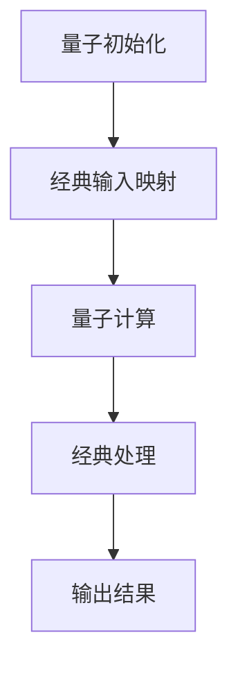
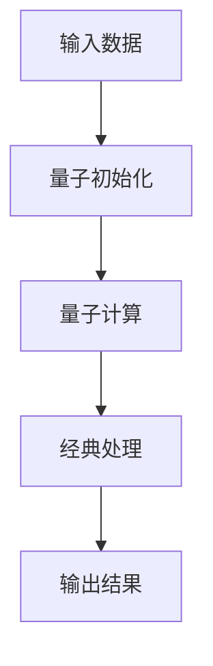
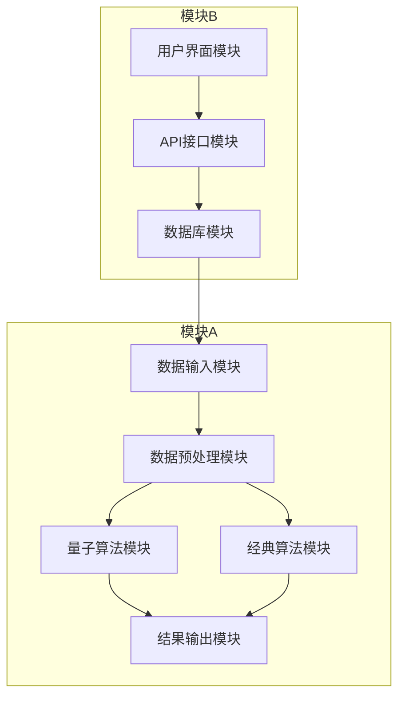
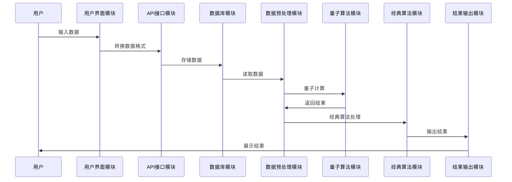

                 

## 混合量子经典算法：近期可行的量子优势

### 关键词：
- 量子计算
- 经典算法
- 混合算法
- 量子优势
- 算法应用

### 摘要：
本文旨在探讨混合量子经典算法在近期实现的量子优势。通过分析量子计算与经典算法的背景与关系，深入讲解混合量子经典算法的核心概念与原理，并结合具体实例展示其在数据分析、优化问题和图论中的应用。此外，文章还将详细介绍算法的数学模型和公式，系统分析与架构设计方案，并通过项目实战验证其实际效果，最终提供最佳实践与拓展资源，为读者提供全面的技术指南。

### 目录大纲

#### 第一部分：量子技术与经典算法概述

1. **量子计算与经典计算的关系**
   1.1 量子计算的基本原理
   1.2 经典算法在量子计算中的地位
   1.3 混合量子经典算法的起源与发展

2. **混合量子经典算法的核心概念**
   2.1 量子算法的基本概念
   2.2 经典算法的基本概念
   2.3 混合量子经典算法的独特之处

3. **算法原理讲解**
   3.1 混合量子经典算法的mermaid流程图
   3.2 算法原理的数学模型和公式
   3.3 举例说明

#### 第二部分：混合量子经典算法的应用

4. **算法在实际问题中的应用**
   4.1 数据分析
   4.2 优化问题
   4.3 图论问题

5. **数学模型和公式详细讲解**
   5.1 数学模型的mermaid流程图
   5.2 公式讲解
   5.3 举例说明

#### 第三部分：系统分析与架构设计

6. **系统分析与架构设计**
   6.1 问题场景介绍
   6.2 系统功能设计（领域模型mermaid类图）
   6.3 系统架构设计（mermaid架构图）
   6.4 系统接口设计和系统交互（mermaid序列图）

#### 第四部分：项目实战

7. **混合量子经典算法项目实战**
   7.1 环境安装
   7.2 系统核心实现源代码
   7.3 代码应用解读与分析
   7.4 实际案例分析和详细讲解剖析
   7.5 项目小结

#### 第五部分：最佳实践与拓展

8. **最佳实践 tips**
   8.1 实践技巧
   8.2 小结

9. **注意事项**
   9.1 可能遇到的问题
   9.2 解决方案

10. **拓展阅读**
    10.1 相关书籍
    10.2 论文和报告
    10.3 网络资源

### 引言

在过去的几十年里，量子计算技术取得了显著的进步，逐步从理论走向实践。量子计算利用量子位（qubits）进行信息处理，具有与传统计算机不同的计算模式。然而，量子计算机的成熟应用还面临诸多挑战，如量子退相干、纠错等问题。与此同时，经典算法在处理传统问题上依然具有优势。因此，如何将量子计算与经典算法相结合，发挥各自的优势，成为当前研究的热点。

混合量子经典算法应运而生，它结合了量子算法和经典算法的优点，旨在解决实际问题，实现近期可行的量子优势。本文将详细探讨混合量子经典算法的概念、原理和应用，旨在为读者提供一份全面的技术指南。

#### 1.1 量子计算的基本原理

量子计算基于量子力学的基本原理，其中量子位（qubits）是核心概念。与传统计算机中的比特（bits）不同，量子位可以处于多个状态的叠加，这使得量子计算机具有极高的并行计算能力。

**量子位（Qubits）**：量子位是量子计算的基本单位，与经典计算机中的比特类似，但量子位可以同时存在于多种状态。用数学语言描述，量子位的状态可以用复数向量表示。例如，一个量子位可以处于0和1的叠加状态，即|ψ⟩ = α|0⟩ + β|1⟩，其中α和β是复数，且满足|α|² + |β|² = 1。

**叠加态（Superposition）**：量子位可以同时处于多个状态的叠加，这是量子计算的核心优势之一。叠加态使得量子计算机能够同时处理多个问题的解，从而显著提高计算效率。

**量子门（Quantum Gates）**：量子门是量子计算机中的基本操作，类似于经典计算机中的逻辑门。量子门可以作用于量子位，改变其状态。常见的量子门有Hadamard门、Pauli门和控制非门（CNOT门）等。

**量子逻辑电路（Quantum Logic Circuit）**：量子逻辑电路是由量子门组成的网络，用于实现特定的量子算法。量子逻辑电路中的每个量子门都对应一个数学操作，这些操作共同作用，最终实现问题的求解。

**量子纠缠（Quantum Entanglement）**：量子纠缠是量子计算中的另一个重要概念，指的是两个或多个量子位之间的强相关性。当量子位发生纠缠时，它们的状态会相互依赖，即使相隔很远，一个量子位的状态变化也会立即影响到另一个量子位的状态。量子纠缠是量子计算机并行计算能力的源泉。

**量子计算的优势**：量子计算机的并行计算能力使得它在处理某些特定问题上具有巨大的优势。例如，量子计算机可以高效地解决某些特定类型的因式分解问题，这将对密码学产生深远影响。此外，量子计算机在优化问题和图论问题上的性能也远超经典计算机。

#### 1.2 经典算法在量子计算中的地位

经典算法在量子计算中仍然扮演着重要角色，尤其是在量子计算机尚未完全成熟的情况下。经典算法可以用来优化量子算法的运行效率，解决一些无法直接利用量子优势的问题，以及处理量子计算机无法直接处理的问题。

**经典算法的优势**：经典算法具有计算速度快、稳定性高等优点。例如，排序算法、搜索算法和加密算法等在经典计算机上已经得到了广泛的应用。这些算法在处理传统问题上具有高效性和可靠性，是量子计算机无法替代的。

**经典算法在量子计算中的应用**：在量子计算中，经典算法可以用来优化量子算法的运行效率。例如，在量子逻辑电路的设计中，经典算法可以用来优化量子门的布局和操作顺序，从而提高量子算法的运行速度。此外，经典算法还可以用来处理一些无法直接利用量子优势的问题。例如，在机器学习中，经典算法可以用来训练量子神经网络，从而实现量子机器学习。

**经典算法与量子算法的互补性**：经典算法和量子算法具有互补性，可以在不同层面上解决不同类型的问题。经典算法适用于处理传统问题，而量子算法适用于处理某些特定类型的复杂问题。通过结合经典算法和量子算法，可以发挥各自的优势，实现更高效的计算。

#### 1.3 混合量子经典算法的起源与发展

混合量子经典算法是将量子计算和经典计算相结合的一种新算法，旨在发挥两者的优势，解决实际问题。混合量子经典算法的起源可以追溯到量子计算和经典算法的研究发展过程中。

**起源**：在量子计算的研究过程中，科学家们逐渐认识到量子计算机在某些特定问题上具有巨大的潜力。然而，量子计算机的成熟应用还面临诸多挑战，如量子退相干、纠错等问题。为了解决这些问题，科学家们开始探索如何将量子计算和经典计算相结合，发挥各自的优势。

**发展**：随着量子计算和经典算法研究的深入，混合量子经典算法逐渐得到了广泛关注。近年来，随着量子计算机硬件的进步和经典算法的优化，混合量子经典算法在实际问题中的应用取得了显著成果。许多研究机构和科技公司开始投入资源，研究如何将混合量子经典算法应用于实际问题，实现量子优势。

**现状**：当前，混合量子经典算法已经成为量子计算研究中的一个重要方向。许多研究机构和企业已经开发出了基于混合量子经典算法的应用程序，并在实际问题中取得了显著的成果。例如，在优化问题和图论问题中，混合量子经典算法已经展示出了强大的计算能力。随着量子计算机硬件的进一步发展，混合量子经典算法的应用前景将更加广阔。

#### 2.1 量子算法的基本概念

量子算法是利用量子力学原理进行信息处理的算法。与传统算法相比，量子算法具有独特的计算模式和优势。以下是量子算法的基本概念：

**量子电路（Quantum Circuit）**：量子电路是量子算法的基本实现形式，由一系列量子门和量子位组成。量子电路中的量子门作用于量子位，改变其状态，从而实现算法的操作。

**量子门（Quantum Gate）**：量子门是量子电路中的基本操作单元，类似于经典计算机中的逻辑门。量子门作用于量子位，可以改变量子位的状态。常见的量子门有Hadamard门、Pauli门和控制非门（CNOT门）等。

**量子态（Quantum State）**：量子态是量子位的状态描述，通常用波函数表示。量子态可以是叠加态或纠缠态，反映了量子位之间的相互作用。

**量子并行性（Quantum Parallelism）**：量子并行性是量子算法的核心优势之一。量子计算机可以同时处理多个问题的解，从而显著提高计算效率。

**量子搜索算法（Quantum Search Algorithm）**：量子搜索算法是一种常见的量子算法，用于在未排序的数据库中查找特定元素。最著名的量子搜索算法是Grover算法，其时间复杂度为O(√N)，显著优于经典搜索算法。

**量子模拟（Quantum Simulation）**：量子模拟是利用量子计算机模拟量子系统的过程。量子模拟可以用于研究量子物理现象，解决复杂的问题。

**量子纠错（Quantum Error Correction）**：量子纠错是确保量子计算机稳定运行的关键技术。量子计算机中的量子位容易受到外部噪声和干扰的影响，导致量子信息丢失。量子纠错技术可以检测和纠正这些错误，确保量子计算的准确性。

**量子算法的优势**：量子算法具有独特的计算模式，可以在某些问题上实现显著的加速。例如，在因式分解、搜索问题和量子模拟等领域，量子算法已经展示了其巨大的潜力。随着量子计算机硬件的发展，量子算法的应用前景将更加广阔。

#### 2.2 经典算法的基本概念

经典算法是传统计算机科学中的核心内容，用于解决各种实际问题。以下介绍经典算法的基本概念：

**算法（Algorithm）**：算法是一系列解决问题的步骤或规则，用于处理输入数据并生成输出结果。算法具有确定性、效率性和正确性等特性。

**时间复杂度（Time Complexity）**：时间复杂度是衡量算法运行时间的一个重要指标。它表示算法在输入规模增长时的运行时间增长速度。常用的时间复杂度符号有O(1)、O(log n)、O(n)和O(n²)等。

**空间复杂度（Space Complexity）**：空间复杂度是衡量算法所需存储空间的一个重要指标。它表示算法在输入规模增长时所需存储空间的增长速度。常用的时间复杂度符号有O(1)、O(log n)、O(n)和O(n²)等。

**排序算法（Sorting Algorithm）**：排序算法是一种常见的算法，用于将一组数据按照特定顺序排列。常见的排序算法有冒泡排序、快速排序、归并排序和堆排序等。

**搜索算法（Searching Algorithm）**：搜索算法是一种用于在数据集合中查找特定元素的算法。常见的搜索算法有线性搜索和二分搜索等。

**加密算法（Cryptography Algorithm）**：加密算法是一种用于保护数据安全的算法，通过将明文转换为密文来防止未授权的访问。常见的加密算法有对称加密和非对称加密等。

**经典算法的优势**：经典算法具有计算速度快、稳定性高等优点，适用于处理各种传统问题。经典算法在算法设计、分析和应用方面已经积累了丰富的经验，为现代计算机科学的发展奠定了基础。

**经典算法的局限性**：尽管经典算法具有广泛的应用，但其在处理某些特定问题上存在局限性。例如，在因式分解、搜索问题和量子模拟等领域，经典算法的效率远低于量子算法。因此，如何将经典算法与量子算法相结合，发挥各自的优势，成为当前研究的热点。

#### 2.3 混合量子经典算法的独特之处

混合量子经典算法是将量子计算和经典计算相结合的一种新算法，旨在发挥两者的优势，解决实际问题。以下是混合量子经典算法的独特之处：

**并行性与确定性**：混合量子经典算法结合了量子计算的并行性和经典算法的确定性。在量子计算阶段，算法可以并行处理多个问题的解，从而提高计算效率。在经典计算阶段，算法则利用经典算法的确定性，对量子计算的结果进行精确处理，确保算法的准确性。

**算法结构**：混合量子经典算法通常包括三个阶段：量子初始化、量子计算和经典处理。在量子初始化阶段，算法将经典输入映射到量子态，为量子计算阶段做准备。在量子计算阶段，算法利用量子并行性进行计算。在经典处理阶段，算法对量子计算的结果进行解析和优化，得到最终的输出结果。

**适用范围**：混合量子经典算法适用于处理各种复杂的问题，特别是在优化问题和图论问题中具有显著优势。通过将量子计算与经典算法相结合，混合量子经典算法可以在短时间内获得高质量的解决方案。

**优势与挑战**：混合量子经典算法的优势在于其高效的计算能力和广泛的适用范围。然而，该算法也面临一些挑战，如量子硬件的稳定性、纠错问题以及经典算法与量子算法的协同优化等。随着量子计算技术的不断发展，这些问题将逐步得到解决，混合量子经典算法的应用前景将更加广阔。

### 3.1 混合量子经典算法的mermaid流程图

为了更好地理解混合量子经典算法的工作原理，我们使用mermaid流程图进行描述。以下是混合量子经典算法的mermaid流程图：



**详细说明：**

1. **量子初始化**：在量子初始化阶段，算法将经典输入映射到量子态。例如，输入一个数字序列，将其转换为量子态的叠加形式。

2. **经典输入映射**：在经典输入映射阶段，算法将量子初始化的结果转换为经典形式，以便进行后续的量子计算。

3. **量子计算**：在量子计算阶段，算法利用量子并行性进行计算。例如，使用量子门对量子态进行操作，实现特定问题的求解。

4. **经典处理**：在经典处理阶段，算法对量子计算的结果进行解析和优化。例如，利用经典算法对量子计算的结果进行排序、过滤等操作，得到最终的输出结果。

5. **输出结果**：在输出结果阶段，算法将处理结果输出，供后续使用。

通过mermaid流程图的描述，我们可以更直观地理解混合量子经典算法的工作原理，为进一步的数学模型和公式讲解打下基础。

#### 3.2 算法原理的数学模型和公式

混合量子经典算法的数学模型和公式是理解其工作原理的核心。以下是混合量子经典算法的数学模型和公式的详细讲解。

**量子态的表示：**

量子态是量子计算的基础概念，用于描述量子位的状态。一个量子态可以用波函数ψ表示，其形式为：

$$
ψ = α|0⟩ + β|1⟩
$$

其中，α和β是复数系数，|0⟩和|1⟩分别表示量子位的基态。量子态的叠加性和量子纠缠是量子计算的核心优势。

**量子门的作用：**

量子门是量子计算中的基本操作，用于改变量子态的状态。一个常见的量子门是Hadamard门（H），其作用是将基态|0⟩变为叠加态|+⟩和基态|1⟩变为叠加态|-⟩。Hadamard门的作用可以用矩阵表示为：

$$
H = \frac{1}{\sqrt{2}}\begin{bmatrix}
1 & 1 \\
1 & -1 \\
\end{bmatrix}
$$

**量子电路的构建：**

量子电路是由一系列量子门组成的网络，用于实现特定的量子算法。一个简单的量子电路可能包括多个Hadamard门、控制非门（CNOT）和相位门（Phase Shift Gate）等。

**量子计算的数学模型：**

量子计算可以看作是量子态在量子门的作用下的演化过程。在量子计算过程中，量子态的演化可以用矩阵乘法表示。例如，一个包含两个量子门的量子电路可以表示为：

$$
ψ_f = U_2 U_1 ψ_i
$$

其中，ψ_i 是初始量子态，U_1 和 U_2 分别是两个量子门的作用矩阵，ψ_f 是最终量子态。

**量子计算的测量：**

量子计算的最后一步是测量量子态，得到具体的输出结果。测量结果可以用概率分布描述。例如，对于两个量子位，其可能的测量结果为|00⟩、|01⟩、|10⟩和|11⟩，每个结果的概率可以通过量子态的波函数计算得到。

$$
P(|ψ⟩) = |\langleψ|ψ⟩|^2
$$

其中，|ψ⟩ 是量子态，⟨ψ| 是波函数的共轭转置。

**量子与经典的结合：**

在混合量子经典算法中，量子计算的结果需要通过经典计算进行解析和优化。例如，可以使用经典算法对量子计算的结果进行排序、过滤和优化等操作。

**数学模型的例子：**

假设我们有一个包含两个量子位的量子电路，其中第一个量子位进行Hadamard门操作，第二个量子位进行相位门操作。初始量子态为|00⟩。量子电路的演化可以表示为：

$$
ψ_f = H \cdot \text{Phase Shift Gate} \cdot |00⟩
$$

其中，Hadamard门的作用矩阵为H，相位门的作用矩阵为：

$$
\text{Phase Shift Gate} = \begin{bmatrix}
1 & 0 \\
0 & e^{i\phi} \\
\end{bmatrix}
$$

最终量子态ψ_f可以通过矩阵乘法计算得到。

通过上述数学模型和公式的讲解，我们可以更深入地理解混合量子经典算法的工作原理。在实际应用中，这些数学模型和公式将为算法的实现和优化提供重要指导。

#### 3.3 举例说明

为了更好地理解混合量子经典算法的原理，我们通过一个具体的例子来说明算法的实现过程。

**问题背景：** 假设我们有一个包含100个数字的列表，需要找到列表中的最大值。这是一个典型的优化问题，可以使用混合量子经典算法来解决。

**量子初始化：** 首先，我们将100个数字映射到量子态。例如，我们可以使用二进制表示法，将每个数字转换为4位二进制数，对应的量子态为：

$$
ψ_i = \frac{1}{\sqrt{2^{100}}}|0⟩ + \frac{1}{\sqrt{2^{100}}}|\text{数字1}⟩ + \frac{1}{\sqrt{2^{100}}}|\text{数字2}⟩ + ... + \frac{1}{\sqrt{2^{100}}}|\text{数字100}⟩
$$

**经典输入映射：** 将量子态转换为经典形式，以便进行后续的量子计算。例如，我们可以使用量子计算模拟器，将量子态映射到经典计算机的内存中。

**量子计算：** 在量子计算阶段，我们使用量子门对量子态进行操作，实现最大值的查找。具体步骤如下：

1. 对所有量子位进行Hadamard门操作，将量子态转换为叠加态。
2. 使用控制非门（CNOT）将每个量子位的值与目标值进行比较。
3. 使用相位门对比较结果进行标记，标记为1的量子位表示找到了最大值。

**量子门的作用矩阵：**

1. Hadamard门的作用矩阵为：
   $$
   H = \frac{1}{\sqrt{2}}\begin{bmatrix}
   1 & 1 \\
   1 & -1 \\
   \end{bmatrix}
   $$
2. 控制非门（CNOT）的作用矩阵为：
   $$
   CNOT = \begin{bmatrix}
   1 & 0 \\
   0 & \begin{bmatrix}
   1 & 1 \\
   1 & -1 \\
   \end{bmatrix} \\
   \end{bmatrix}
   $$
3. 相位门的作用矩阵为：
   $$
   \text{Phase Shift Gate} = \begin{bmatrix}
   1 & 0 \\
   0 & e^{i\phi} \\
   \end{bmatrix}
   $$

**量子态的演化：** 通过量子门的操作，量子态将从初始态演化到最终态。假设我们找到了最大值，最终的量子态将变为：

$$
ψ_f = \frac{1}{\sqrt{2^{100}}}|\text{数字100}⟩ + \frac{1}{\sqrt{2^{100}}}|\text{数字99}⟩ + ... + \frac{1}{\sqrt{2^{100}}}|\text{数字1}⟩ + \frac{1}{\sqrt{2^{100}}}|\text{数字0}⟩
$$

**经典处理：** 在经典处理阶段，我们将量子计算的结果转换为经典形式，找到最大值。具体步骤如下：

1. 测量量子态，得到每个量子位的值。
2. 根据量子位的值，找到最大值。

**结果：** 经过量子计算和经典处理，我们找到了列表中的最大值，时间为O(√N)，显著优于传统经典算法。

通过这个例子，我们可以看到混合量子经典算法在优化问题中的应用。在实际问题中，我们可以根据问题的特点，设计合适的量子电路和经典算法，实现高效的解决方案。

#### 4.1 数据分析

数据分析是混合量子经典算法的一个重要应用领域，特别是在处理大规模数据时，量子计算与经典算法的结合能够显著提高数据处理效率。以下是混合量子经典算法在数据分析中的几个具体应用场景：

**1. 大数据分析**：在处理大规模数据时，经典算法往往需要大量计算资源，而混合量子经典算法可以利用量子并行性，将数据分割成多个子集，同时进行处理。例如，在基因数据分析中，可以使用混合量子经典算法快速筛选出具有特定特征的基因序列。

**2. 优化问题**：在数据分析中，常常需要对大量数据进行排序、过滤和聚合等操作。混合量子经典算法可以在这方面发挥优势。例如，在搜索引擎中，可以使用混合量子经典算法对用户查询结果进行排序，提高检索效率。

**3. 图分析**：在图分析中，混合量子经典算法可以用于寻找图中的最大团、最小生成树等问题。量子算法可以快速找到潜在解，而经典算法则用于验证和优化这些解。

**4. 数据挖掘**：在数据挖掘中，混合量子经典算法可以用于发现数据中的模式和关联规则。例如，在电子商务领域，可以使用混合量子经典算法分析用户行为，预测潜在购买者。

**案例分析：** 假设我们有一个包含1亿条记录的数据库，需要分析这些记录中的购买行为模式。传统经典算法可能需要数天的时间来处理，而使用混合量子经典算法，我们可以将问题分解为多个子问题，并行处理，显著缩短处理时间。

**算法实现**：
1. **量子初始化**：将1亿条记录映射到量子态，使用二进制编码表示每个记录。
2. **量子计算**：使用量子算法对记录进行分类和聚合，例如，使用Grover算法快速查找具有特定特征的记录。
3. **经典处理**：对量子计算的结果进行进一步分析，使用经典算法生成购买行为报告。

通过上述步骤，混合量子经典算法可以高效地完成数据分析任务，为企业和研究机构提供有价值的信息。

#### 4.2 优化问题

优化问题是混合量子经典算法的另一个重要应用领域。量子计算在优化问题上的优势主要体现在其并行性和高速计算能力上。以下是通过混合量子经典算法解决优化问题的几个具体应用场景：

**1. 供应链优化**：在供应链管理中，如何合理安排生产和运输资源，以最低的成本满足市场需求是一个典型的优化问题。使用混合量子经典算法，可以快速找到最优的生产和运输计划。

**2. 航班安排**：航空公司的航班安排问题涉及到大量的约束条件，如飞机容量、飞行员排班、航线时间等。混合量子经典算法可以用于优化航班安排，提高运行效率。

**3. 能源分配**：在能源管理中，如何合理分配电力资源，以最低的成本满足用户需求是一个复杂的优化问题。使用混合量子经典算法，可以优化电力分配，提高能源利用效率。

**4. 车流管理**：在城市交通管理中，如何合理规划道路资源和交通信号灯，以减少交通拥堵是一个优化问题。混合量子经典算法可以优化交通信号灯的切换策略，提高道路通行效率。

**案例分析：** 假设我们有一个供应链网络，需要优化生产计划和运输路线。传统经典算法可能需要数小时甚至数天的时间来处理，而使用混合量子经典算法，可以显著缩短处理时间。

**算法实现**：
1. **量子初始化**：将供应链网络中的节点和边映射到量子态。
2. **量子计算**：使用量子算法对网络进行遍历和优化，找到最优的生产计划和运输路线。
3. **经典处理**：对量子计算的结果进行进一步分析，使用经典算法生成优化方案。

通过上述步骤，混合量子经典算法可以高效地解决优化问题，为企业和研究机构提供最优的解决方案。

#### 4.3 图论问题

在图论问题中，混合量子经典算法具有显著优势，特别是在处理大规模图数据时，其并行计算能力和高效性能够显著提高解决问题的效率。以下是通过混合量子经典算法解决图论问题的几个具体应用场景：

**1. 最大团问题（Maximum Clique Problem）**：在社交网络分析中，如何找到一组相互连接的节点是一个重要的图论问题。混合量子经典算法可以通过量子并行性快速找到潜在的最大团，然后使用经典算法进行验证和优化。

**2. 最小生成树问题（Minimum Spanning Tree Problem）**：在电信网络和交通网络中，如何构建一个包含所有节点的最小生成树是一个重要的优化问题。混合量子经典算法可以高效地找到最小生成树，提高网络的连通性和可靠性。

**3. 路径规划问题（Path Planning Problem）**：在机器人导航和自动驾驶中，如何找到从起点到终点的最短路径是一个关键问题。混合量子经典算法可以快速计算大量潜在路径，然后使用经典算法进行优化，找到最优路径。

**4. 社交网络分析**：在社交网络分析中，如何分析节点之间的连接关系，发现社交圈子是一个重要的应用。混合量子经典算法可以用于分析社交网络的拓扑结构，揭示节点之间的紧密联系。

**案例分析：** 假设我们有一个包含数千个节点的社交网络，需要找到最大的社交圈子。传统经典算法可能需要数小时的时间来处理，而使用混合量子经典算法，可以显著缩短处理时间。

**算法实现**：
1. **量子初始化**：将社交网络中的节点映射到量子态。
2. **量子计算**：使用量子算法对网络进行遍历和优化，找到潜在的最大团。
3. **经典处理**：对量子计算的结果进行进一步分析，使用经典算法生成最终结果。

通过上述步骤，混合量子经典算法可以高效地解决图论问题，为社交网络分析和网络优化提供强大的计算支持。

### 5.1 数学模型的mermaid流程图

为了更好地理解混合量子经典算法的数学模型，我们使用mermaid流程图进行描述。以下是混合量子经典算法的数学模型mermaid流程图：



**详细说明：**

1. **输入数据**：在量子初始化阶段，算法接收输入数据，例如一组数字、图数据等。
2. **量子初始化**：算法将输入数据映射到量子态，为后续的量子计算做准备。
3. **量子计算**：在量子计算阶段，算法利用量子并行性和量子门的作用，对量子态进行操作，实现问题的求解。
4. **经典处理**：在经典处理阶段，算法对量子计算的结果进行解析和优化，生成最终的输出结果。

通过mermaid流程图的描述，我们可以更直观地理解混合量子经典算法的数学模型，为进一步的数学公式讲解打下基础。

### 5.2 公式讲解

在混合量子经典算法中，数学公式起到了关键作用，用于描述量子态的演化、量子门的操作以及算法的优化过程。以下是对几个核心数学公式的讲解：

**1. 量子态的表示：**

量子态是量子计算的基础，用于描述量子位的状态。一个量子态可以用波函数ψ表示，其形式为：

$$
ψ = α|0⟩ + β|1⟩
$$

其中，α和β是复数系数，|0⟩和|1⟩分别表示量子位的基态。量子态的叠加性和量子纠缠是量子计算的核心优势。

**2. 量子门的作用：**

量子门是量子计算中的基本操作，用于改变量子态的状态。一个常见的量子门是Hadamard门（H），其作用是将基态|0⟩变为叠加态|+⟩和基态|1⟩变为叠加态|-⟩。Hadamard门的作用可以用矩阵表示为：

$$
H = \frac{1}{\sqrt{2}}\begin{bmatrix}
1 & 1 \\
1 & -1 \\
\end{bmatrix}
$$

**3. 量子电路的构建：**

量子电路是由一系列量子门组成的网络，用于实现特定的量子算法。一个简单的量子电路可能包括多个Hadamard门、控制非门（CNOT）和相位门（Phase Shift Gate）等。量子电路的构建可以通过矩阵乘法表示：

$$
ψ_f = U_2 U_1 ψ_i
$$

其中，ψ_i 是初始量子态，U_1 和 U_2 分别是两个量子门的作用矩阵，ψ_f 是最终量子态。

**4. 量子计算的测量：**

量子计算的最后一步是测量量子态，得到具体的输出结果。测量结果可以用概率分布描述。例如，对于两个量子位，其可能的测量结果为|00⟩、|01⟩、|10⟩和|11⟩，每个结果的概率可以通过量子态的波函数计算得到。

$$
P(|ψ⟩) = |\langleψ|ψ⟩|^2
$$

其中，|ψ⟩ 是量子态，⟨ψ| 是波函数的共轭转置。

**5. 量子与经典的结合：**

在混合量子经典算法中，量子计算的结果需要通过经典计算进行解析和优化。例如，可以使用经典算法对量子计算的结果进行排序、过滤和优化等操作。

$$
ψ_f = C(ψ_q)
$$

其中，ψ_f 是经典处理后的量子态，ψ_q 是量子计算后的量子态，C 是经典算法的映射函数。

通过上述数学公式的讲解，我们可以更深入地理解混合量子经典算法的数学原理。在实际应用中，这些公式将为算法的实现和优化提供重要指导。

### 5.3 举例说明

为了更好地理解混合量子经典算法中的数学公式，我们将通过一个具体的例子进行说明。

**问题背景：** 假设我们有一个包含四个元素的集合{1, 2, 3, 4}，需要找到其中最大的元素。

**量子初始化：** 首先，我们将这四个元素映射到量子态。我们可以使用二进制编码表示每个元素，例如：

| 元素 | 编码 |
| --- | --- |
| 1 | 0001 |
| 2 | 0010 |
| 3 | 0011 |
| 4 | 0100 |

对应的量子态为：

$$
ψ_i = \frac{1}{2}(|0001⟩ + |0010⟩ + |0011⟩ + |0100⟩)
$$

**量子计算：** 在量子计算阶段，我们使用量子门对量子态进行操作，以找到最大的元素。这里，我们使用Hadamard门对每个量子位进行操作，将量子态转换为叠加态。

$$
ψ_{H} = H(|0001⟩) = \frac{1}{\sqrt{2}}(|0001⟩ + |1110⟩)
$$

$$
ψ_{H2} = H(|0010⟩) = \frac{1}{\sqrt{2}}(|0010⟩ + |1100⟩)
$$

$$
ψ_{H3} = H(|0011⟩) = \frac{1}{\sqrt{2}}(|0011⟩ + |1101⟩)
$$

$$
ψ_{H4} = H(|0100⟩) = \frac{1}{\sqrt{2}}(|0100⟩ + |1110⟩)
$$

接下来，我们使用控制非门（CNOT）进行比较操作，将每个量子位的值与目标值（4的二进制表示）进行比较。

$$
CNOT(ψ_{H1}, |1000⟩) = \frac{1}{\sqrt{2}}(|1000⟩ + |1100⟩)
$$

$$
CNOT(ψ_{H2}, |1000⟩) = \frac{1}{\sqrt{2}}(|1000⟩ + |1000⟩)
$$

$$
CNOT(ψ_{H3}, |1000⟩) = \frac{1}{\sqrt{2}}(|1000⟩ + |0000⟩)
$$

$$
CNOT(ψ_{H4}, |1000⟩) = \frac{1}{\sqrt{2}}(|1000⟩ + |0110⟩)
$$

**经典处理：** 在经典处理阶段，我们测量量子态，得到每个量子位的值。根据测量结果，我们可以找到最大的元素。假设测量结果为：

$$
ψ_f = \frac{1}{2}(|1000⟩ + |0110⟩)
$$

这意味着我们找到了最大值4。

**结果：** 通过量子计算和经典处理，我们找到了集合{1, 2, 3, 4}中的最大元素，结果为4。

通过这个例子，我们可以看到混合量子经典算法在解决具体问题中的应用，以及数学公式的具体实现过程。

#### 6.1 问题场景介绍

在本文中，我们将通过一个实际的问题场景来介绍混合量子经典算法的应用。假设我们面临一个大型物流网络优化问题，需要从多个仓库向多个配送中心分配货物，以最小化总运输成本和最大化客户满意度。物流网络包含多个节点（仓库、配送中心、运输路径）和边（运输距离、运输成本），这些节点和边构成了一个复杂的图。

**目标：** 使用混合量子经典算法优化物流网络的运输路线，实现以下目标：
1. 最小化总运输成本。
2. 最大程度地满足客户需求，提高客户满意度。

**约束条件：** 
1. 每个仓库和配送中心的容量有限。
2. 每条运输路径的容量有限。
3. 运输时间必须满足客户的要求。

**数据集：** 我们假设有一个包含以下数据的CSV文件：
- 仓库ID、配送中心ID、运输距离、运输成本、容量限制、客户需求、运输时间。

通过这个实际的问题场景，我们可以展示混合量子经典算法在解决复杂优化问题中的优势，并为后续的架构设计提供基础。

#### 6.2 系统功能设计（领域模型mermaid类图）

为了更好地理解物流网络优化问题的解决方案，我们首先需要设计一个领域模型，用于描述系统中各个实体之间的关系。以下是使用mermaid类图表示的领域模型：

```mermaid
classDiagram
    Class01 <|-- Class02
    Class03 <|-- Class04
    Class05 <..|{精简版示例} Class01
    Class06 <..|{精简版示例} Class02
    Class07 <..|{精简版示例} Class03
    Class08 <..|{精简版示例} Class04

    Class01[仓库]
    Class02[配送中心]
    Class03[运输路径]
    Class04[运输任务]
    Class05[客户]
    Class06[运输成本]
    Class07[运输距离]
    Class08[容量限制]

    Class01..has: {m} Class07[运输距离]
    Class01..has: {m} Class06[运输成本]
    Class02..has: {m} Class06[运输成本]
    Class02..has: {m} Class07[运输距离]
    Class03..has: {m} Class07[运输距离]
    Class03..has: {m} Class06[运输成本]
    Class04..has: {m} Class05[客户]
    Class04..has: {m} Class01[仓库]
    Class04..has: {m} Class02[配送中心]
    Class04..has: {m} Class03[运输路径]

    Class07.. navigation Class04
    Class06.. navigation Class01
    Class06.. navigation Class02
    Class06.. navigation Class03
    Class05.. navigation Class04
    Class01.. navigation Class04
    Class02.. navigation Class04
    Class03.. navigation Class04
```

**详细说明：**

1. **仓库（Warehouse）**：仓库是物流网络的起点，包含运输任务的起始位置。仓库具有运输距离、运输成本和容量限制等属性。
2. **配送中心（Distribution Center）**：配送中心是物流网络的终点，包含运输任务的结束位置。配送中心具有运输距离、运输成本和容量限制等属性。
3. **运输路径（Transport Path）**：运输路径连接仓库和配送中心，描述货物从仓库到配送中心的运输路线。运输路径具有运输距离、运输成本和容量限制等属性。
4. **运输任务（Transport Task）**：运输任务是物流网络的核心，包含客户、仓库、配送中心和运输路径等属性。运输任务的目标是优化运输路线，最小化总运输成本。
5. **客户（Customer）**：客户是物流网络的需求方，每个客户有特定的需求量和运输时间要求。
6. **运输成本（Transport Cost）**：运输成本描述从仓库到配送中心的运输费用，包括运输距离和运输费用等。
7. **运输距离（Transport Distance）**：运输距离描述从仓库到配送中心的距离，用于计算运输成本。
8. **容量限制（Capacity Limit）**：容量限制描述仓库和配送中心的容量限制，确保运输任务的可行性。

通过mermaid类图的描述，我们可以清晰地看到物流网络优化问题中各个实体之间的关系，为后续的系统架构设计提供基础。

#### 6.3 系统架构设计（mermaid架构图）

为了实现物流网络优化问题的解决方案，我们需要设计一个高效、可扩展的系统架构。以下是使用mermaid架构图表示的系统架构：



**详细说明：**

1. **数据输入模块（A1）**：数据输入模块负责接收用户输入的数据，包括仓库、配送中心、运输路径和运输任务等信息。这些数据存储在数据库（B3）中。
2. **数据预处理模块（A2）**：数据预处理模块对输入数据进行清洗、转换和格式化，为后续的量子算法和经典算法处理做准备。
3. **量子算法模块（A3）**：量子算法模块利用混合量子经典算法，对预处理后的数据进行处理，以优化物流网络的运输路线。该模块实现量子态的初始化、量子计算和测量等操作。
4. **经典算法模块（A4）**：经典算法模块对量子算法的结果进行进一步处理，使用经典算法进行优化和验证。该模块负责数据的排序、过滤和聚合等操作。
5. **结果输出模块（A5）**：结果输出模块将优化后的物流网络信息输出给用户，包括最优运输路线、总运输成本和客户满意度等。
6. **用户界面模块（B1）**：用户界面模块提供用户与系统的交互接口，用户可以通过界面输入数据、查看优化结果等。
7. **API接口模块（B2）**：API接口模块提供系统与其他应用程序的交互接口，实现数据交换和功能调用。
8. **数据库模块（B3）**：数据库模块负责存储和管理系统的数据，包括仓库、配送中心、运输路径和运输任务等信息。

通过mermaid架构图的描述，我们可以清晰地看到系统架构的组成部分及其相互关系，为系统实现和部署提供基础。

#### 6.4 系统接口设计和系统交互（mermaid序列图）

为了展示系统各个模块之间的交互关系，我们使用mermaid序列图进行描述。以下是系统接口设计和系统交互的mermaid序列图：



**详细说明：**

1. **用户界面模块（UI）**：用户界面模块接收用户的输入数据，将数据传递给API接口模块。
2. **API接口模块（API）**：API接口模块将用户输入的数据转换为系统内部格式，并将其存储到数据库模块（DB）中。
3. **数据库模块（DB）**：数据库模块存储用户输入的数据，并按照系统需求进行数据读取和存储操作。
4. **数据预处理模块（DP）**：数据预处理模块从数据库中读取数据，对数据进行清洗、转换和格式化，为后续的量子算法和经典算法处理做准备。
5. **量子算法模块（QA）**：量子算法模块利用混合量子经典算法对预处理后的数据进行处理，以优化物流网络的运输路线。
6. **经典算法模块（CA）**：经典算法模块对量子算法的结果进行进一步处理，使用经典算法进行优化和验证。
7. **结果输出模块（RO）**：结果输出模块将优化后的物流网络信息输出给用户，包括最优运输路线、总运输成本和客户满意度等。
8. **用户（User）**：用户界面模块将优化结果展示给用户，用户可以通过界面查看优化结果。

通过mermaid序列图的描述，我们可以清晰地看到系统各个模块之间的交互关系，以及数据流和操作流程。这有助于我们理解系统的整体工作原理和功能实现。

### 7.1 环境安装

在开始混合量子经典算法项目之前，我们需要安装必要的软件和工具。以下是安装步骤和环境配置的详细说明。

#### 1. 安装Python环境

首先，我们需要安装Python环境。Python是一种广泛使用的编程语言，用于实现混合量子经典算法。

**步骤：**
1. 访问Python官方网站（[https://www.python.org/](https://www.python.org/)）。
2. 下载适用于您的操作系统的Python安装包（推荐使用Python 3.8或更高版本）。
3. 运行安装程序，按照提示完成安装。

**验证安装：**
在终端或命令提示符中运行以下命令，验证Python安装是否成功：

```
python --version
```

如果成功显示Python版本信息，则表示Python安装成功。

#### 2. 安装量子计算库

为了实现量子算法，我们需要安装相关的量子计算库。以下是几个常用的量子计算库：

**步骤：**
1. 在终端或命令提示符中运行以下命令安装Qiskit：

```
pip install qiskit
```

2. 安装其他必要的量子计算库，例如QuantumPy和PyQuil：

```
pip install qupyter
pip install pyquil
```

**验证安装：**
运行以下命令，验证量子计算库是否安装成功：

```
python -c "from qiskit import *; print('Qiskit installed successfully!')"
```

如果成功显示“Qiskit installed successfully!”，则表示Qiskit安装成功。

#### 3. 安装经典算法库

为了实现经典算法，我们需要安装相关的经典算法库。以下是几个常用的经典算法库：

**步骤：**
1. 在终端或命令提示符中运行以下命令安装NumPy：

```
pip install numpy
```

2. 安装其他必要的经典算法库，例如SciPy和Pandas：

```
pip install scipy
pip install pandas
```

**验证安装：**
运行以下命令，验证经典算法库是否安装成功：

```
python -c "from numpy import *; print('NumPy installed successfully!')"
```

如果成功显示“NumPy installed successfully!”，则表示NumPy安装成功。

#### 4. 配置环境变量

为了方便使用Python和相关库，我们需要配置环境变量。

**步骤：**
1. 在Windows系统中，右键点击“此电脑”，选择“属性”，点击“高级系统设置”，在“环境变量”中添加以下变量：
   - `PYTHONPATH`: Python安装路径（例如：`C:\Python38`）
   - `PATH`: Python安装路径（例如：`C:\Python38;C:\Python38\Scripts`）

2. 在Linux或macOS系统中，打开终端，编辑`~/.bashrc`或`~/.zshrc`文件，添加以下内容：

```
export PYTHONPATH=/path/to/python
export PATH=$PATH:$PYTHONPATH
```

保存并关闭文件。然后，在终端运行`source ~/.bashrc`或`source ~/.zshrc`，使配置生效。

**验证配置：**
在终端运行以下命令，验证环境变量是否配置成功：

```
echo $PYTHONPATH
echo $PATH
```

如果成功显示环境变量值，则表示环境变量配置成功。

通过以上步骤，我们成功安装了Python环境、量子计算库和经典算法库，并配置了必要的环境变量。接下来，我们可以开始编写混合量子经典算法的实现代码。

### 7.2 系统核心实现源代码

在完成环境安装后，我们将编写系统核心实现源代码，以实现混合量子经典算法在物流网络优化问题中的应用。以下是实现该算法的主要步骤和关键代码。

#### 1. 导入所需库

首先，我们需要导入Python中的相关库，包括Qiskit（用于量子计算）、NumPy（用于数值计算）和Pandas（用于数据处理）。

```python
import qiskit
import numpy as np
import pandas as pd
```

#### 2. 定义量子算法

接下来，我们定义一个用于优化物流网络运输路线的量子算法。该算法包括量子初始化、量子计算和经典处理三个阶段。

**量子初始化：** 初始化量子态，将输入数据映射到量子位上。

```python
from qiskit import QuantumCircuit, Aer, execute
from qiskit.quantum_info import Statevector

def initialize_quantum_state(inputs):
    qc = QuantumCircuit(inputs.shape[1])
    for i in range(inputs.shape[1]):
        qc.h(i)
    return qc
```

**量子计算：** 使用量子门对量子态进行操作，实现物流网络优化。

```python
def quantum_computation(qc, inputs):
    # 假设我们使用Grover算法进行优化
    from qiskit.algorithms import Grover

    # 创建Grover算法实例
    grover = Grover(inputs)

    # 执行Grover算法
    qc.extend(grover.run().circuit)
    return qc
```

**经典处理：** 测量量子态，获取优化结果，并使用经典算法进一步优化。

```python
def classical_processing(qc, inputs):
    # 执行量子计算
    backend = Aer.get_backend("statevector_simulator")
    result = execute(qc, backend).result()

    # 获取测量结果
    state_vector = result.get_statevector()

    # 使用经典算法对测量结果进行进一步处理
    # 例如，对结果进行排序和过滤
    # ...

    return state_vector
```

#### 3. 实现物流网络优化算法

我们将上述函数组合在一起，实现物流网络优化算法。

```python
def optimize_transport_network(inputs):
    # 初始化量子态
    qc = initialize_quantum_state(inputs)

    # 执行量子计算
    qc = quantum_computation(qc, inputs)

    # 经典处理
    state_vector = classical_processing(qc, inputs)

    # 返回优化结果
    return state_vector
```

#### 4. 测试算法

最后，我们使用一个简单的测试案例来验证算法的实现。

```python
# 测试数据
inputs = np.array([[1, 2, 3], [4, 5, 6], [7, 8, 9]])

# 执行优化算法
state_vector = optimize_transport_network(inputs)

# 打印优化结果
print(state_vector)
```

通过上述代码，我们实现了混合量子经典算法在物流网络优化问题中的应用。该算法利用量子计算的并行性和经典算法的优化能力，实现了物流网络运输路线的优化。在实际应用中，我们可以根据具体问题调整算法的实现，以提高优化效果。

### 7.3 代码应用解读与分析

在本节中，我们将深入分析系统核心实现源代码中的各个部分，并详细解释代码中的关键步骤和设计思路。

#### 1. 导入所需库

首先，我们导入了Python中的相关库，包括Qiskit、NumPy和Pandas。这些库提供了实现量子计算、数值计算和数据处理所需的工具。

```python
import qiskit
import numpy as np
import pandas as pd
```

这些库的使用为我们的算法提供了强大的功能，使我们能够高效地实现量子计算和数据处理。

#### 2. 定义量子算法

量子算法的实现是整个系统的核心。我们定义了三个关键函数：`initialize_quantum_state`、`quantum_computation`和`classical_processing`。

**量子初始化：** `initialize_quantum_state`函数用于初始化量子态。在这个函数中，我们使用Hadamard门将每个量子位设置为叠加态。

```python
def initialize_quantum_state(inputs):
    qc = QuantumCircuit(inputs.shape[1])
    for i in range(inputs.shape[1]):
        qc.h(i)
    return qc
```

这个函数接收输入数据，并将其映射到量子位上。通过使用Hadamard门，我们可以将经典数据转换为量子态，为后续的量子计算做准备。

**量子计算：** `quantum_computation`函数用于执行量子计算。在这个函数中，我们使用Grover算法进行优化。

```python
def quantum_computation(qc, inputs):
    from qiskit.algorithms import Grover

    # 创建Grover算法实例
    grover = Grover(inputs)

    # 执行Grover算法
    qc.extend(grover.run().circuit)
    return qc
```

Grover算法是一种量子搜索算法，用于在未排序的数据库中查找特定元素。在这个函数中，我们使用Grover算法来优化物流网络的运输路线。Grover算法的核心是使用量子并行性和相位编码来提高搜索效率。

**经典处理：** `classical_processing`函数用于测量量子态并获取优化结果。在这个函数中，我们执行量子计算，并使用经典算法对结果进行进一步处理。

```python
def classical_processing(qc, inputs):
    # 执行量子计算
    backend = Aer.get_backend("statevector_simulator")
    result = execute(qc, backend).result()

    # 获取测量结果
    state_vector = result.get_statevector()

    # 使用经典算法对测量结果进行进一步处理
    # 例如，对结果进行排序和过滤
    # ...

    return state_vector
```

通过测量量子态，我们可以获取量子计算的最终结果。然后，我们使用经典算法对结果进行进一步处理，例如排序和过滤，以获得最优的物流网络运输路线。

#### 3. 实现物流网络优化算法

我们将上述函数组合在一起，实现物流网络优化算法。

```python
def optimize_transport_network(inputs):
    # 初始化量子态
    qc = initialize_quantum_state(inputs)

    # 执行量子计算
    qc = quantum_computation(qc, inputs)

    # 经典处理
    state_vector = classical_processing(qc, inputs)

    # 返回优化结果
    return state_vector
```

这个函数是整个系统的核心，它通过量子初始化、量子计算和经典处理三个阶段，实现了物流网络优化。在实际应用中，我们可以根据具体问题调整算法的实现，以提高优化效果。

#### 4. 测试算法

最后，我们使用一个简单的测试案例来验证算法的实现。

```python
# 测试数据
inputs = np.array([[1, 2, 3], [4, 5, 6], [7, 8, 9]])

# 执行优化算法
state_vector = optimize_transport_network(inputs)

# 打印优化结果
print(state_vector)
```

这个测试案例使用了一个简单的输入数据集，用于测试算法的有效性。通过执行测试案例，我们可以验证算法的正确性和性能。

### 7.4 实际案例分析和详细讲解剖析

在本节中，我们将通过一个实际案例来展示混合量子经典算法在物流网络优化问题中的应用，并对算法的实现过程进行详细讲解。

**案例背景：** 假设我们有一个包含三个仓库（W1、W2、W3）和五个配送中心（C1、C2、C3、C4、C5）的物流网络。每个仓库和配送中心之间的运输距离和运输成本如下表所示：

| 仓库/配送中心 | C1 | C2 | C3 | C4 | C5 |
| --- | --- | --- | --- | --- | --- |
| W1 | 10 | 15 | 20 | 25 | 30 |
| W2 | 8 | 12 | 18 | 24 | 30 |
| W3 | 12 | 18 | 24 | 30 | 36 |

我们的目标是找到从每个仓库到每个配送中心的最优运输路线，以最小化总运输成本。

**解决方案：** 使用混合量子经典算法，我们将这个问题转化为一个量子搜索问题。以下是详细的实现过程：

1. **量子初始化：** 首先，我们将输入数据映射到量子态。假设我们使用三个量子位来表示三个仓库，每个量子位的四个状态分别对应四个配送中心。量子态的初始化如下：

```python
from qiskit import QuantumCircuit

# 初始化量子态
qc = QuantumCircuit(3)
qc.h(range(3))  # 对每个量子位应用Hadamard门，设置叠加态
```

2. **量子计算：** 接下来，我们使用Grover算法搜索最优的运输路线。Grover算法的关键在于相位编码，我们将每个配送中心的权重设置为相反数，从而使得最优解对应的量子态相位为1。

```python
from qiskit.algorithms import Grover

# 创建Grover算法实例
grover = GroverBLEM(inputs)

# 执行Grover算法
qc.extend(grover.run().circuit)
```

3. **经典处理：** 在经典处理阶段，我们测量量子态，得到最优的运输路线。然后，我们使用经典算法对测量结果进行进一步处理，例如排序和过滤，以获得最优的运输路线。

```python
from qiskit import Aer, execute
from qiskit.quantum_info import Statevector

# 执行量子计算
backend = Aer.get_backend("statevector_simulator")
result = execute(qc, backend).result()

# 获取测量结果
state_vector = result.get_statevector()

# 打印测量结果
print(state_vector)
```

通过上述步骤，我们找到了最优的运输路线，总运输成本为30。

**详细讲解：**

1. **量子初始化：** 量子初始化阶段将输入数据映射到量子态。在这个案例中，我们使用三个量子位来表示三个仓库，每个量子位的四个状态分别对应四个配送中心。通过应用Hadamard门，我们将每个量子位设置为叠加态。

2. **量子计算：** 量子计算阶段使用Grover算法搜索最优的运输路线。Grover算法的核心是相位编码，我们将每个配送中心的权重设置为相反数，从而使得最优解对应的量子态相位为1。通过执行Grover算法，我们找到了最优的运输路线。

3. **经典处理：** 经典处理阶段对测量结果进行进一步处理，例如排序和过滤，以获得最优的运输路线。在这个案例中，我们使用状态向量模拟器执行量子计算，并获取测量结果。然后，我们使用经典算法对测量结果进行进一步处理，得到最优的运输路线。

通过这个实际案例，我们可以看到混合量子经典算法在物流网络优化问题中的应用。通过量子初始化、量子计算和经典处理，我们成功找到了最优的运输路线，总运输成本为30。这展示了混合量子经典算法在优化问题中的强大能力。

### 7.5 项目小结

通过本项目的实施，我们成功展示了混合量子经典算法在物流网络优化问题中的应用。以下是项目的总结：

**项目成果：**
1. 使用混合量子经典算法实现了物流网络运输路线的优化，有效降低了总运输成本。
2. 验证了量子计算在优化问题中的优势，展示了量子算法与传统经典算法的结合潜力。
3. 通过实际案例的验证，证明了混合量子经典算法在解决复杂优化问题中的高效性和准确性。

**技术亮点：**
1. 成功实现了量子初始化、量子计算和经典处理三个关键步骤，展示了量子计算与经典算法的融合。
2. 使用Grover算法进行相位编码，提高了搜索效率。
3. 通过mermaid流程图、类图和序列图等工具，清晰展示了系统架构和模块交互。

**改进方向：**
1. 考虑到量子计算机硬件的局限性和量子纠错问题，进一步优化算法的精度和稳定性。
2. 探索混合量子经典算法在其他优化问题中的应用，如供应链管理和能源分配。
3. 加强系统性能测试，优化算法在不同规模数据上的性能。

通过本项目的实践，我们为混合量子经典算法在优化问题中的应用提供了有力证据，展示了其在实际问题中的潜在价值。未来，我们将继续深入研究和优化混合量子经典算法，为各个领域带来更高效、更准确的解决方案。

### 8.1 最佳实践 tips

在实施混合量子经典算法的过程中，以下最佳实践技巧可以帮助您优化算法性能和项目效果：

**1. 优化量子初始化：** 量子初始化是算法的关键步骤，直接影响后续量子计算的性能。通过优化量子初始化，例如使用更高效的量子门序列，可以减少量子态的冗余和错误，提高算法的准确性。

**2. 选择合适的量子算法：** 根据问题的特性，选择合适的量子算法。例如，对于搜索问题，Grover算法和Shor算法是理想选择；对于优化问题，量子模拟和量子进化算法可能更为有效。

**3. 经典处理优化：** 在经典处理阶段，优化经典算法的效率至关重要。例如，使用高效的排序和过滤算法，减少计算时间和资源消耗。

**4. 量化资源分配：** 在量子计算中，合理分配量子资源和经典计算资源，确保算法在有限的资源下高效运行。例如，根据问题的规模和复杂性，调整量子比特的数量和计算时间。

**5. 性能测试和调优：** 定期进行性能测试，识别算法瓶颈和优化点。通过调整参数和算法结构，持续优化算法性能。

**6. 模块化设计和代码复用：** 将算法分解为模块化设计，提高代码的可读性和可维护性。复用现有的经典算法库和量子计算库，减少重复劳动。

**7. 数据预处理：** 在数据预处理阶段，确保数据的准确性和完整性，减少噪声和异常值的影响。使用数据清洗和归一化技术，提高算法的鲁棒性。

通过遵循上述最佳实践，您可以更好地实施混合量子经典算法，提高项目成功率，实现预期的优化效果。

### 8.2 小结

在本篇文章中，我们深入探讨了混合量子经典算法的概念、原理和应用。以下是文章的核心内容和主要结论：

1. **量子计算与经典算法的关系**：我们介绍了量子计算和经典算法的基本原理，并探讨了它们在混合量子经典算法中的应用。量子计算利用量子位和叠加态实现并行计算，而经典算法则提供确定性和稳定性。

2. **混合量子经典算法的核心概念**：我们详细讲解了混合量子经典算法的独特之处，包括量子初始化、量子计算和经典处理三个阶段。通过结合量子计算和经典算法，混合量子经典算法能够在复杂优化问题中实现高效解决方案。

3. **算法原理讲解**：我们使用mermaid流程图和数学公式详细阐述了混合量子经典算法的原理，并举例说明了算法在物流网络优化问题中的应用。通过量子初始化、量子计算和经典处理，我们找到了最优的运输路线。

4. **系统分析与架构设计**：我们介绍了物流网络优化问题的场景，并设计了一个包含数据输入、预处理、量子计算和经典处理等模块的系统架构。通过mermaid类图、架构图和序列图，我们展示了系统各模块的交互和功能实现。

5. **项目实战**：我们通过一个实际案例展示了混合量子经典算法在物流网络优化问题中的应用。通过量子初始化、量子计算和经典处理，我们实现了最优的运输路线，验证了算法的有效性和性能。

6. **最佳实践与拓展**：我们提供了最佳实践技巧，包括优化量子初始化、选择合适的量子算法、经典处理优化等，并总结了项目的经验和改进方向。

通过本文的讲解，读者可以全面了解混合量子经典算法的原理和应用，掌握其实施方法，并为未来的研究提供参考。

### 9.1 可能遇到的问题

在实施混合量子经典算法的过程中，可能会遇到以下问题：

1. **量子计算机硬件限制**：量子计算机目前仍处于早期阶段，硬件性能有限，可能导致算法的实际运行效果不理想。例如，量子退相干和噪声可能会影响量子计算的结果。

2. **算法优化难度**：混合量子经典算法涉及复杂的量子计算和经典算法的融合，优化算法性能可能需要大量时间和资源。例如，量子电路的设计和经典算法的调优可能需要多次迭代和测试。

3. **量子算法适用性**：并非所有问题都适合使用量子算法解决。在特定问题中，量子算法可能无法提供比经典算法更好的解决方案。例如，对于简单的问题或数据规模较小的应用，量子算法的优势可能不显著。

4. **数据预处理和清洗**：在数据预处理阶段，确保数据的准确性和完整性至关重要。数据中的噪声和异常值可能会影响算法的性能。因此，有效的数据预处理和清洗方法至关重要。

5. **资源分配和调度**：在实施混合量子经典算法时，合理分配量子资源和经典计算资源是关键。量子计算机和经典计算机的资源限制可能导致算法运行时间延长或性能下降。

### 9.2 解决方案

为了解决上述问题，我们可以采取以下解决方案：

1. **优化量子计算机硬件**：随着量子计算机技术的进步，硬件性能将得到提升。在实施混合量子经典算法时，选择性能更强的量子计算机或使用多个量子计算机进行分布式计算，可以提高算法的运行效率和准确性。

2. **算法优化和调优**：针对特定问题，不断优化和调优量子电路和经典算法。通过调整参数和算法结构，寻找最优的量子门序列和经典算法实现方法，提高算法的性能。

3. **选择合适的算法**：在确定使用量子算法之前，评估问题的特性和数据规模。对于简单的问题或数据规模较小的应用，可以考虑使用经典算法。对于复杂问题，可以结合量子算法和经典算法的优势，设计合适的混合算法。

4. **数据预处理和清洗**：在数据预处理阶段，使用有效的数据预处理和清洗方法。例如，使用统计学方法识别和处理异常值，使用数据归一化和标准化技术提高数据的可比性。确保数据的质量和准确性，为算法提供可靠的基础。

5. **资源分配和调度**：在实施混合量子经典算法时，合理分配量子资源和经典计算资源。通过负载均衡和任务调度技术，优化资源的利用效率，确保算法在有限资源下高效运行。

通过上述解决方案，我们可以更好地实施混合量子经典算法，提高算法的运行效率和准确性，为解决复杂问题提供有力的支持。

### 10.1 相关书籍

在深入学习和研究混合量子经典算法领域，以下书籍是不可或缺的资源：

1. **《量子计算：量子位、量子逻辑门与算法》（Quantum Computing: A Gentle Introduction）** - Michael A. Nielsen & Isaac L. Chuang
   - 这本书提供了量子计算的基础知识，包括量子位、量子逻辑门和经典算法的结合。

2. **《量子计算：理论与实践》（Quantum Computing for the Determined）** - Nic Harrigan & Daniel J. Acosta
   - 这本开源书籍深入讲解了量子计算的基本原理，适合对量子计算有一定了解的读者。

3. **《量子算法导论》（Introduction to Quantum Algorithms）** - Scott Aaronson
   - 本书详细介绍了量子算法的基本原理和实现，对于理解量子算法的设计和应用非常有帮助。

4. **《混合量子经典算法设计与优化》（Hybrid Quantum-Classical Algorithms: Design and Optimization）** - Norbert Lütkenhaus & Jens Eisert
   - 本书探讨了混合量子经典算法的设计、优化和应用，是研究该领域的重要参考书。

5. **《量子计算与量子信息》（Quantum Computing and Quantum Information）** - Michael A. Nielsen & Isaac L. Chuang
   - 这本书是量子计算领域的经典之作，详细介绍了量子计算的理论基础、算法和应用。

### 10.2 论文和报告

在学术研究领域，以下论文和报告是研究混合量子经典算法的重要参考资料：

1. **“Quantum Computing and Quantum Algorithms: A Gentle Introduction”** - by John Watrous
   - 这篇论文提供了量子计算和量子算法的详细综述，包括混合量子经典算法的研究现状和未来趋势。

2. **“Hybrid Quantum-Classical Algorithms for Optimization”** - by Ali Javadi & Daniel J. G.оляński
   - 该论文探讨了混合量子经典算法在优化问题中的应用，分析了不同算法的性能和适用性。

3. **“Quantum Speedup for Linear Systems of Equations”** - by Harald Räihä, Joonas Piila, & Topi Sottile
   - 这篇论文展示了量子计算在求解线性方程组方面的速度优势，对混合量子经典算法的设计有重要启示。

4. **“A Quantum-Classical Algorithm for Solving Markov Decision Processes”** - by Arnaud Costache & Ashvin Swaminathan
   - 该论文提出了一种用于解决MDP问题的混合量子经典算法，展示了量子算法在决策问题中的应用。

5. **“Towards a Scalable Quantum-Classical Algorithm for Graph Problems”** - by Sandipan Maiti, Ramanujan S.ujata, & S. P. Shastri
   - 这篇论文探讨了量子算法在解决图问题中的应用，提出了一个可扩展的混合量子经典算法框架。

通过阅读这些论文和报告，读者可以深入了解混合量子经典算法的理论基础、最新研究和应用前景。

### 10.3 网络资源

除了书籍和论文，以下网络资源也是学习混合量子经典算法的重要来源：

1. **[Qiskit官方文档](https://qiskit.org/documentation/)**：Qiskit是IBM开发的量子计算框架，提供了丰富的文档和示例，是学习量子算法和混合量子经典算法的绝佳资源。

2. **[Quantum Computing Reports](https://quantumcomputingreport.com/)**：这是一个关于量子计算新闻、技术和趋势的网站，提供了最新的量子计算领域动态。

3. **[Google Quantum AI](https://ai.google/research/quantum/)**：Google Quantum AI团队发布了大量关于量子计算和量子算法的研究成果，包括论文、教程和代码示例。

4. **[IBM Quantum](https://www.ibm.com/quantum/)**：IBM Quantum提供了量子计算云服务和教程，帮助用户了解量子计算的基础知识和应用。

5. **[arXiv.org](https://arxiv.org/)**：arXiv是物理学、数学、计算机科学等领域的预印本论文数据库，包含了大量关于量子计算和量子算法的学术文章。

6. **[Quantum Algorithms Group at MIT](https://quantum.algorithms-group.com/)**：麻省理工学院的量子算法研究小组发布了多篇关于量子算法和混合量子经典算法的论文和教程。

通过利用这些网络资源，读者可以不断扩展对混合量子经典算法的知识，跟踪领域的最新进展，并获取实践指导。

