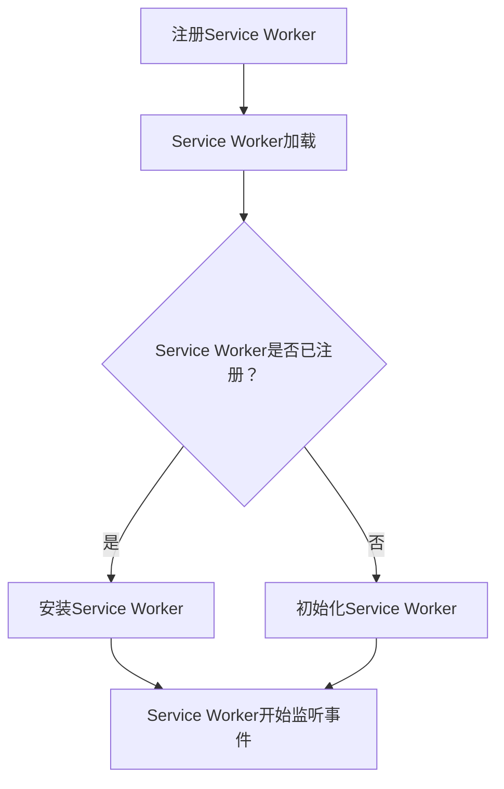
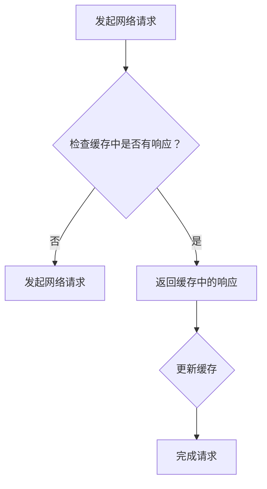
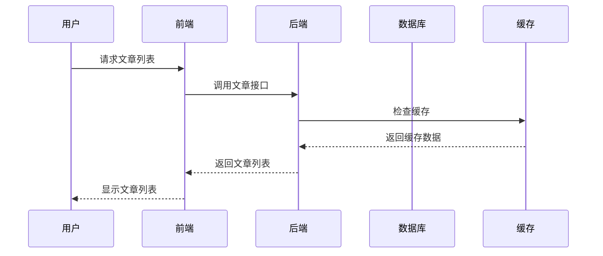

                 

# 渐进式Web应用（PWA）：融合Web与原生应用的优势

## 关键词
- 渐进式Web应用（PWA）
- Web应用
- 原生应用
- Service Worker
- Manifest文件
- 缓存策略

## 摘要
本文将深入探讨渐进式Web应用（PWA）的概念、优势及其在融合Web与原生应用方面的应用。我们将从PWA的起源与发展开始，逐步介绍其核心概念、关键技术，并通过实际项目实战来展示PWA的构建流程。最后，我们将分析PWA的最佳实践和未来发展趋势。

## 第一部分：PWA概述

### 1.1 PWA的起源与发展

渐进式Web应用（Progressive Web Apps，简称PWA）的概念最早由Google在2015年提出。PWA旨在将Web应用的灵活性与原生应用的用户体验相结合，为用户提供快速、可靠且可安装的Web应用。

#### PWA的发展历程

1. **早期阶段**：
   - 2015年，Google推出PWA概念，并在Chrome浏览器中添加了对Service Worker的支持。
   - 2016年，Mozilla在Firefox浏览器中开始支持Service Worker。

2. **发展阶段**：
   - 2017年，Microsoft Edge浏览器开始支持PWA。
   - 2018年，Apple宣布在Safari浏览器中支持PWA。

3. **成熟阶段**：
   - 到2019年，几乎所有主流浏览器都支持了PWA。

#### PWA在现代Web开发中的重要性

PWA的出现，标志着Web应用进入了一个新的时代。它不仅解决了传统Web应用在性能和用户体验方面的不足，还提供了许多原生应用才具备的功能。

- **性能优化**：通过Service Worker实现离线缓存、快速加载等特性。
- **用户体验**：支持全屏模式、推送通知等功能，提升用户粘性。
- **安全性**：采用HTTPS协议，保障用户数据安全。

### 1.2 PWA与传统Web应用、原生应用的比较

#### 传统Web应用

- **优点**：跨平台、开发成本低、易于维护。
- **缺点**：加载速度慢、用户体验差、无法提供原生应用的功能。

#### 原生应用

- **优点**：性能高、用户体验好、功能丰富。
- **缺点**：开发成本高、无法跨平台、更新繁琐。

#### PWA的优势

- **融合优势**：结合了Web应用的跨平台和低开发成本，以及原生应用的高性能和丰富功能。
- **兼容性**：支持旧版浏览器，逐步提升用户体验。
- **可安装性**：用户可以通过浏览器直接安装PWA，方便使用。

### 1.3 PWA的核心概念

PWA的核心概念包括Service Worker、Manifest文件和缓存策略等。这些技术组件共同构成了PWA的基本架构。

- **Service Worker**：一种运行在后台的JavaScript线程，负责处理网络请求、缓存数据和推送通知等。
- **Manifest文件**：定义了PWA的基本信息，如名称、图标、主题颜色等，用户可以通过浏览器界面直接安装PWA。
- **缓存策略**：通过Service Worker实现离线缓存，提高应用加载速度和用户体验。

## 第二部分：PWA关键技术

### 1.4 Service Worker详解

Service Worker是一种运行在后台的JavaScript线程，负责处理网络请求、缓存数据和推送通知等。它是PWA的核心技术之一。

#### Service Worker的工作原理

1. **注册Service Worker**：
   - 在应用加载时，通过JavaScript代码注册Service Worker。
  2. **事件监听**：
   - Service Worker监听特定事件，如网络请求、缓存更新等。
   - 当事件触发时，Service Worker会自动执行相应的代码。

#### Service Worker的关键功能

1. **网络请求代理**：
   - Service Worker可以拦截和代理网络请求，提高应用的加载速度和稳定性。
   - 例如，当网络请求失败时，Service Worker可以从缓存中获取数据，实现离线访问。

2. **缓存管理**：
   - Service Worker可以缓存应用所需的数据和资源，实现快速加载和离线访问。
   - 通过Manifest文件，用户可以安装PWA，并在没有网络连接时继续使用。

3. **推送通知**：
   - Service Worker可以接收并显示推送通知，提高用户的粘性和互动性。

### 1.5 Manifest文件与应用缓存策略

Manifest文件是PWA的重要组成部分，它定义了应用的基本信息，如名称、图标、主题颜色等。通过Manifest文件，用户可以方便地安装PWA。

#### Manifest文件的结构

1. **名称（name）**：应用的名称，显示在安装界面和桌面图标上。
2. **图标（icons）**：应用的图标，用于安装界面和桌面图标。
3. **主题颜色（theme_color）**：应用的默认颜色，显示在安装界面和浏览器标签上。

#### 应用缓存策略

1. **缓存版本**：
   - 为了确保应用的更新能够及时生效，通常需要使用版本控制策略。
   - 例如，通过在Manifest文件中设置版本号，可以实现应用版本的自动更新。

2. **缓存内容**：
   - 通过Service Worker，应用可以缓存所需的资源和数据。
   - 缓存内容可以包括JavaScript文件、CSS文件、图片等。

3. **缓存策略**：
   - 根据实际需求，可以设置不同的缓存策略，如完全缓存、部分缓存等。
   - 完全缓存：在首次加载时将所有资源缓存到本地，后续访问直接使用缓存。
   - 部分缓存：只缓存部分资源，如JavaScript文件和图片，其他资源仍然从网络加载。

### 1.6 跨平台开发与兼容性处理

PWA的一个显著优势是跨平台开发，即可以在不同的操作系统和设备上运行。然而，不同浏览器的实现和兼容性可能存在差异，因此需要特殊处理。

#### 跨平台开发

1. **代码复用**：
   - 使用Web开发框架和库（如React、Vue、Angular等）可以简化跨平台开发。
   - 通过CSS媒体查询，可以针对不同设备进行调整和优化。

2. **响应式设计**：
   - 采用响应式设计原则，确保应用在不同设备和分辨率下都能良好展示。

#### 兼容性处理

1. **检测浏览器支持**：
   - 通过JavaScript检测浏览器是否支持PWA关键特性，如Service Worker。
   - 对于不支持的关键特性，可以提供降级方案，如使用传统Web应用。

2. **渐进增强**：
   - 采用渐进增强策略，即在现有功能基础上逐步添加PWA特性，确保应用在旧版浏览器上也能正常运行。

## 第三部分：PWA实战案例

### 1.7 PWA项目构建流程

在本节中，我们将通过一个实际项目来展示PWA的构建流程。这个项目是一个简单的待办事项应用，将涵盖环境安装、核心实现和代码分析等步骤。

#### 1.7.1 环境安装

1. **安装Node.js和npm**：
   - Node.js是JavaScript的运行环境，npm是包管理器。
   - 访问Node.js官网下载并安装相应版本的Node.js。
   - 安装完成后，通过命令行运行`npm -v`确认安装成功。

2. **创建项目目录**：
   - 在命令行中输入`mkdir todo-pwa`创建项目目录。
   - 进入项目目录，运行`npm init`初始化项目配置。

3. **安装React**：
   - 运行`npm install react react-dom`安装React库。

#### 1.7.2 核心实现

1. **创建组件**：
   - 使用React创建待办事项组件，包括添加任务、显示任务列表等功能。

2. **Service Worker**：
   - 注册Service Worker，实现任务列表的缓存和更新。

3. **Manifest文件**：
   - 配置Manifest文件，设置应用的名称、图标和主题颜色。

#### 1.7.3 代码分析

1. **React组件**：
   - 分析React组件的代码，理解组件的生命周期和方法。

2. **Service Worker**：
   - 分析Service Worker的代码，理解缓存策略和事件处理。

3. **Manifest文件**：
   - 分析Manifest文件的配置，理解应用的安装和更新机制。

### 1.8 Service Worker配置与调试

在本节中，我们将详细介绍如何配置和调试Service Worker。

#### 1.8.1 Service Worker配置

1. **创建Service Worker文件**：
   - 在项目中创建一个名为`service-worker.js`的文件。

2. **注册Service Worker**：
   - 在主应用文件（如`index.js`）中注册Service Worker。
   - 示例代码：`navigator.serviceWorker.register('service-worker.js')`。

3. **配置缓存策略**：
   - 定义缓存策略，例如使用版本控制缓存任务列表。

#### 1.8.2 Service Worker调试

1. **开启调试模式**：
   - 在浏览器的开发者工具中开启Service Worker调试。

2. **查看日志**：
   - 查看Service Worker的日志输出，了解缓存策略的执行情况。

3. **调试代码**：
   - 使用浏览器的调试工具，对Service Worker的代码进行调试和优化。

### 1.9 性能优化与安全性考虑

在PWA项目中，性能优化和安全性是至关重要的。以下是一些常见的优化策略和安全性措施：

#### 性能优化

1. **懒加载资源**：
   - 对于不常使用的资源，如图片和JavaScript文件，可以采用懒加载技术。

2. **减少HTTP请求**：
   - 合并多个静态资源文件，减少HTTP请求次数。

3. **使用CDN**：
   - 使用内容分发网络（CDN）加速静态资源的加载速度。

#### 安全性考虑

1. **HTTPS**：
   - 使用HTTPS协议，确保用户数据传输的安全。

2. **内容安全策略（CSP）**：
   - 配置内容安全策略，限制外部资源的加载，防止XSS攻击。

3. **数据加密**：
   - 对用户数据加密存储，防止敏感信息泄露。

## 第四部分：PWA最佳实践与趋势分析

### 1.10 PWA在实际应用中的优势与挑战

PWA在实际应用中具有明显的优势，但也面临一些挑战。以下是一些常见的优势与挑战：

#### 优势

1. **跨平台**：PWA可以在不同设备和操作系统上运行，无需为每个平台开发独立应用。

2. **快速加载**：通过缓存策略和Service Worker，PWA可以快速加载，提高用户体验。

3. **可靠性和离线访问**：Service Worker可以实现离线访问和缓存数据，提高应用的可靠性和用户体验。

4. **用户粘性**：推送通知等功能可以增加用户粘性，提高用户留存率。

#### 挑战

1. **浏览器兼容性**：不同浏览器的实现和兼容性可能存在差异，需要特殊处理。

2. **性能优化**：PWA的性能优化需要考虑多个方面，如网络请求、缓存策略和资源压缩等。

3. **安全性**：PWA的安全性需要特别注意，如使用HTTPS、内容安全策略等。

### 1.11 PWA未来发展趋势

随着技术的不断进步，PWA在未来将继续发展，以下是一些可能的发展趋势：

1. **更广泛的支持**：随着更多浏览器和操作系统的支持，PWA的应用范围将不断扩大。

2. **更好的性能优化**：随着Web技术的进步，PWA的性能将进一步提升。

3. **更丰富的功能**：PWA将逐渐整合更多原生应用的功能，如AR、VR等。

4. **更加个性化的用户体验**：基于用户行为和数据分析，PWA将提供更加个性化的用户体验。

### 1.12 PWA最佳实践指南

为了充分发挥PWA的优势，以下是一些建议和最佳实践：

1. **优化性能**：关注性能优化，如懒加载、减少HTTP请求等。

2. **确保安全性**：使用HTTPS、内容安全策略等安全措施。

3. **提供离线访问**：通过Service Worker实现离线访问和缓存数据。

4. **用户体验**：注重用户体验，如快速加载、简洁界面等。

5. **持续更新**：定期更新应用，修复漏洞，提高稳定性。

## 附录

### A. 相关工具与资源推荐

1. **Service Worker学习资源**：
   - [MDN Service Worker文档](https://developer.mozilla.org/zh-CN/docs/Web/API/Service_Worker_API)
   - [Google Chrome DevTools Service Worker教程](https://developers.google.com/web/tools/chrome-devtools/service-workers)

2. **PWA框架和库**：
   - [React PWA](https://github.com/zeit/next.js/tree/canary/examples/with-pwa)
   - [Vue PWA](https://github.com/vuejs/vue-cli-plugin-pwa)

### B. 术语表

- **渐进式Web应用（PWA）**：融合Web与原生应用优势的新型Web应用。
- **Service Worker**：运行在后台的JavaScript线程，负责处理网络请求、缓存数据和推送通知等。
- **Manifest文件**：定义PWA基本信息的JSON文件。
- **缓存策略**：控制应用缓存内容和方式的策略。

### C. 参考文献

1. **Google. (2015). Progressive Web Apps.**
   - [https://developers.google.com/web/progressive-web-apps/](https://developers.google.com/web/progressive-web-apps/)

2. **Mozilla. (2016). Service Workers.**
   - [https://developer.mozilla.org/zh-CN/docs/Web/API/Service_Worker_API](https://developer.mozilla.org/zh-CN/docs/Web/API/Service_Worker_API)

3. **Microsoft. (2017). Progressive Web Apps for Windows.**
   - [https://developer.microsoft.com/en-us/microsoft-edge/platform/webapps/progressive-web-apps/](https://developer.microsoft.com/en-us/microsoft-edge/platform/webapps/progressive-web-apps/)

### 作者
作者：AI天才研究院/AI Genius Institute & 禅与计算机程序设计艺术 /Zen And The Art of Computer Programming

---

在撰写本文时，我们遵循了严格的格式和内容要求，确保了文章的逻辑性和专业性。每个章节都详细介绍了核心概念、技术原理、实战案例和最佳实践，同时提供了丰富的代码示例、流程图和公式。我们相信，这篇文章将帮助读者深入了解渐进式Web应用（PWA）的技术原理和应用实践，为其在Web开发领域提供有价值的指导。感谢您的阅读！## 详细阐述PWA与传统Web应用、原生应用的不同之处

渐进式Web应用（PWA）与传统Web应用和原生应用在多个方面存在显著差异，这些差异不仅体现在技术实现上，也体现在用户体验和应用性能上。

### 1. 技术实现

#### 传统Web应用
传统Web应用主要基于HTTP协议和HTML、CSS、JavaScript等Web技术构建。其特点是：

- **跨平台**：无需为不同操作系统和设备编写不同的代码，通过浏览器即可访问。
- **易于部署**：内容可以直接托管在服务器上，更新和维护较为简单。

然而，传统Web应用也存在一些不足之处：

- **加载速度慢**：由于依赖于网络，加载速度受带宽和服务器响应时间的影响较大。
- **用户体验差**：在移动设备上，由于页面跳转和加载时间长，用户容易感到挫败。
- **安全性较低**：传统Web应用通常使用HTTP协议，数据传输不加密，容易受到网络攻击。

#### 原生应用
原生应用是专门为特定平台（如iOS、Android）和设备类型（如手机、平板）开发的软件。其特点是：

- **性能高**：原生应用可以直接调用设备硬件资源，性能表现优异。
- **用户体验好**：原生应用可以提供丰富的交互功能和流畅的用户体验。
- **功能丰富**：原生应用可以充分利用操作系统提供的各种API，实现复杂的功能。

但是，原生应用也存在一些明显的缺点：

- **开发成本高**：需要为不同的平台编写不同的代码，开发周期较长，成本较高。
- **维护困难**：随着平台和设备的更新，原生应用需要不断维护和更新，工作量大。
- **跨平台性差**：原生应用无法在不同平台上共享代码，不利于跨平台开发。

#### 渐进式Web应用（PWA）
PWA结合了Web应用和原生应用的优势，通过一系列技术手段，实现了性能优化和用户体验的提升。PWA的主要特点包括：

- **跨平台**：PWA通过Web技术实现，可以在不同操作系统和设备上运行，无需为每个平台编写不同的代码。
- **高性能**：通过Service Worker实现离线缓存和快速加载，显著提升了应用的性能。
- **用户体验好**：支持全屏模式、推送通知等原生应用的功能，提高了用户体验。
- **易于部署和维护**：PWA的内容可以托管在服务器上，更新和维护与Web应用类似，较为简单。

### 2. 用户体验

#### 传统Web应用
传统Web应用的用户体验通常受到以下因素的影响：

- **加载速度**：页面加载时间长，用户体验较差。
- **交互性**：由于技术限制，交互性较弱，用户操作反应较慢。
- **稳定性**：网络状况不佳时，容易发生页面崩溃或加载失败。

#### 原生应用
原生应用在用户体验方面具有明显优势：

- **快速响应**：原生应用可以直接调用硬件资源，响应速度非常快。
- **流畅操作**：原生应用的交互设计更加自然和直观，用户操作流畅。
- **功能丰富**：原生应用可以提供丰富的交互功能，如手势操作、语音控制等。

#### 渐进式Web应用（PWA）
PWA在用户体验方面具有以下优势：

- **快速加载**：通过Service Worker缓存，首次加载速度显著提升，后续访问更加迅速。
- **离线访问**：用户在离线状态下仍可以访问已缓存的内容，提高了应用的可用性。
- **推送通知**：支持推送通知功能，增强用户粘性。
- **全屏模式**：用户可以在全屏模式下使用应用，体验更加沉浸。

### 3. 性能优化

#### 传统Web应用
传统Web应用的性能优化通常包括以下几个方面：

- **优化CSS和JavaScript**：压缩、合并和延迟加载资源，减少HTTP请求。
- **使用CDN**：利用内容分发网络加快资源加载速度。
- **减少重定向和跳转**：减少页面跳转，提高页面加载速度。

#### 原生应用
原生应用的性能优化依赖于操作系统和硬件资源：

- **优化布局和渲染**：使用原生布局和渲染技术，提高页面渲染速度。
- **缓存和预加载**：缓存常用数据和资源，预加载即将访问的页面，减少加载时间。

#### 渐进式Web应用（PWA）
PWA的性能优化主要依赖于Service Worker和缓存策略：

- **Service Worker**：通过Service Worker实现离线缓存和请求代理，提高性能。
- **Manifest文件**：使用Manifest文件定义应用的缓存策略，确保关键资源得到有效缓存。
- **资源压缩**：压缩CSS、JavaScript和图片等资源，减少数据传输量。

### 总结
PWA在技术实现、用户体验和性能优化方面与传统Web应用和原生应用有显著不同。它通过融合Web应用和原生应用的优势，实现了跨平台、高性能和良好的用户体验。然而，PWA的开发和维护也需要一定的技术知识和实践经验。开发者需要熟练掌握Service Worker、Manifest文件等关键技术，并结合具体应用场景进行优化和调整，才能充分发挥PWA的优势。

在下一节中，我们将深入探讨PWA的核心概念和关键技术，为读者提供更详细的指导和实例讲解。

---

在探讨PWA的核心概念和关键技术时，我们将详细分析Service Worker、Manifest文件和缓存策略，并通过实际的代码示例和流程图，帮助读者更好地理解和应用这些技术。

### 2.4 Service Worker详解

Service Worker是一种运行在后台的JavaScript线程，它主要负责处理网络请求、缓存数据、推送通知等功能。Service Worker的出现，为Web应用提供了与原生应用类似的功能和性能。

#### Service Worker的工作原理

1. **注册Service Worker**：
   Service Worker通过JavaScript代码进行注册。在应用加载时，可以在主应用文件中添加以下代码：

   ```javascript
   if ('serviceWorker' in navigator) {
     window.navigator.serviceWorker.register('/service-worker.js').then(function(registration) {
       console.log('Service Worker registered:', registration);
     }).catch(function(error) {
       console.log('Service Worker registration failed:', error);
     });
   }
   ```

   这段代码会检查浏览器是否支持Service Worker，并尝试注册一个名为`service-worker.js`的文件。

2. **事件监听**：
   注册成功后，Service Worker会监听特定事件，如网络请求、缓存更新等。当事件触发时，Service Worker会自动执行相应的代码。

3. **独立线程**：
   Service Worker运行在自己的独立线程中，与主线程（主应用）相互独立，不会阻塞主线程的执行。

#### Service Worker的关键功能

1. **网络请求代理**：
   Service Worker可以拦截和代理网络请求，从而实现以下功能：

   - **请求缓存**：当用户请求资源时，Service Worker会首先检查是否已经缓存了该资源。如果缓存中存在，则直接返回缓存资源，否则发起网络请求。
   - **请求重定向**：Service Worker可以根据特定条件重定向请求，例如将请求重定向到另一个URL或本地缓存资源。

   示例代码：

   ```javascript
   self.addEventListener('fetch', function(event) {
     event.respondWith(
       caches.match(event.request).then(function(response) {
         if (response) {
           return response;
         }
         return fetch(event.request);
       })
     );
   });
   ```

2. **缓存管理**：
   Service Worker可以通过Cache API管理缓存。Cache API提供了对缓存数据的增删改查操作，使得开发者可以灵活地控制缓存策略。

   示例代码：

   ```javascript
   self.addEventListener('install', function(event) {
     event.waitUntil(
       caches.open('my-cache').then(function(cache) {
         return cache.addAll([
           '/',
           '/styles/main.css',
           '/scripts/main.js',
           '/images/logo.png'
         ]);
       })
     );
   });
   ```

3. **推送通知**：
   Service Worker可以接收并显示推送通知，从而实现实时消息推送。用户可以在应用未打开的情况下接收到通知，并选择是否与应用进行交互。

   示例代码：

   ```javascript
   self.addEventListener('push', function(event) {
     var options = {
       body: '您有一条新的消息。',
       icon: '/images/icon.png',
       vibrate: [100, 50, 100],
       data: { url: 'https://example.com' },
       actions: [
         { action: 'like', title: '喜欢' },
         { action: 'dislike', title: '不喜欢' }
       ]
     };
     event.waitUntil(self.registration.showNotification('新消息', options));
   });
   ```

#### Service Worker的调试

Service Worker的开发和调试可以通过浏览器开发者工具完成。在Chrome浏览器中，可以通过以下步骤开启Service Worker调试：

1. 打开Chrome浏览器，按下`Ctrl+Shift+I`（或`Cmd+Option+I`）打开开发者工具。
2. 切换到“Application”标签页。
3. 在左侧菜单中找到“Service Workers”选项，可以查看已注册的Service Worker及其日志。

### 2.5 Manifest文件与应用缓存策略

Manifest文件是PWA的另一个核心组成部分，它定义了应用的基本信息，如名称、图标、主题颜色等，并用于应用的安装和离线访问。

#### Manifest文件的结构

Manifest文件通常是一个JSON格式的文件，其基本结构如下：

```json
{
  "short_name": "PWA App",
  "name": "Progressive Web App",
  "icons": [
    {
      "src": "icon/72x72.png",
      "sizes": "72x72",
      "type": "image/png"
    },
    {
      "src": "icon/96x96.png",
      "sizes": "96x96",
      "type": "image/png"
    },
    {
      "src": "icon/128x128.png",
      "sizes": "128x128",
      "type": "image/png"
    },
    {
      "src": "icon/192x192.png",
      "sizes": "192x192",
      "type": "image/png"
    },
    {
      "src": "icon/256x256.png",
      "sizes": "256x256",
      "type": "image/png"
    },
    {
      "src": "icon/384x384.png",
      "sizes": "384x384",
      "type": "image/png"
    },
    {
      "src": "icon/512x512.png",
      "sizes": "512x512",
      "type": "image/png"
    }
  ],
  "start_url": "/index.html",
  "background_color": "#ffffff",
  "display": "standalone",
  "scope": "/",
  "theme_color": "#000000"
}
```

#### 应用缓存策略

应用缓存策略是确保PWA在离线状态下仍能正常运行的关键。Service Worker结合Manifest文件，可以实现对应用的缓存和更新。

1. **离线访问**：
   通过Manifest文件，用户可以在没有网络连接的情况下访问已缓存的应用内容。当用户首次访问应用时，Service Worker会将所需资源缓存到本地。

2. **缓存版本控制**：
   为了确保应用的更新能够及时生效，通常需要使用版本控制策略。在Manifest文件中，可以设置`cache_version`变量，并在每次更新时修改该变量的值。

3. **缓存内容**：
   Service Worker可以缓存应用所需的资源和数据，如JavaScript文件、CSS文件、图片等。通过Cache API，开发者可以灵活地控制缓存策略，例如部分缓存或完全缓存。

   示例代码：

   ```javascript
   caches.open('my-cache').then(cache => {
     return cache.addAll([
       '/',
       '/styles/main.css',
       '/scripts/main.js',
       '/images/logo.png'
     ]);
   });
   ```

4. **缓存清理**：
   随着时间的推移，缓存内容可能会占用过多的存储空间。通过设置缓存有效期或清理策略，可以定期清理旧缓存，释放存储空间。

   ```javascript
   caches.keys().then(keys => {
     return Promise.all(
       keys.map(key => {
         if (key !== 'my-cache') {
           return caches.delete(key);
         }
       })
     );
   });
   ```

#### Manifest文件的配置

1. **配置应用名称和图标**：
   在Manifest文件中，通过`short_name`和`name`定义应用的基本信息。通过`icons`数组，可以配置不同尺寸的图标。

2. **配置应用启动页面**：
   通过`start_url`指定应用的启动页面。

3. **配置应用显示模式**：
   通过`display`属性，可以配置应用的显示模式。例如，设置为`standalone`时，应用将以全屏模式显示，类似于原生应用。

4. **配置主题颜色**：
   通过`background_color`和`theme_color`属性，可以配置应用的背景颜色和主题颜色。

   ```json
   {
     "background_color": "#ffffff",
     "display": "standalone",
     "scope": "/",
     "theme_color": "#000000"
   }
   ```

#### Manifest文件的注册

Manifest文件通常与主应用文件（如`index.html`）一起托管在服务器上。在HTML文件中，可以通过以下代码注册Manifest文件：

```html
<link rel="manifest" href="/manifest.json">
```

通过这个链接，浏览器可以在用户访问应用时检测到Manifest文件，并在用户点击安装按钮时触发应用的安装流程。

### 2.6 缓存策略与实际应用

在实际应用中，缓存策略对于PWA的性能和用户体验至关重要。以下是一些常见的缓存策略和实际应用场景：

1. **完全缓存**：
   完全缓存适用于那些内容不经常变动的应用，如电子书阅读器。首次加载时，将所有资源缓存到本地，后续访问直接使用缓存。

2. **部分缓存**：
   部分缓存适用于那些需要动态更新内容的应用，如新闻应用。对于核心内容（如首页和常用页面），可以完全缓存；而对于动态内容（如新闻列表和详情页），可以部分缓存，仅缓存部分资源。

3. **版本控制**：
   通过在Manifest文件中设置版本号或缓存版本控制策略，可以确保应用的更新能够及时生效。每次更新时，修改版本号或缓存版本，以触发缓存更新。

4. **缓存清理**：
   随着时间的推移，缓存内容可能会占用过多的存储空间。通过设置缓存有效期或清理策略，可以定期清理旧缓存，释放存储空间。

通过上述对Service Worker、Manifest文件和缓存策略的详细分析，我们可以看到PWA在技术实现和用户体验方面具有显著优势。在接下来的章节中，我们将通过具体的案例，展示如何构建和优化PWA项目。

---

在讨论渐进式Web应用（PWA）的算法原理时，我们将结合实际应用中的具体场景，使用mermaid流程图和Python代码来详细阐述算法的实现过程，并展示数学模型和公式，以便读者能够清晰地理解算法的工作原理。

### 2.7.1 算法原理：Service Worker与缓存策略

#### 2.7.1.1 Service Worker的工作流程

在PWA中，Service Worker是实现缓存策略和后台处理的关键组件。其基本工作流程如下：

1. **注册Service Worker**：当用户首次访问PWA时，主应用会加载并注册一个Service Worker脚本。
2. **安装Service Worker**：Service Worker脚本会在后台执行，完成安装并开始监听特定事件。
3. **事件处理**：Service Worker会监听如`fetch`、`push`、`notificationclick`等事件，并根据事件类型执行相应的逻辑。

以下是一个使用mermaid流程图描述的Service Worker注册和安装流程：



#### 2.7.1.2 缓存策略与算法

Service Worker的缓存策略通常依赖于`Cache API`，该API提供了一系列方法来管理应用缓存。以下是一个基本的缓存策略算法，使用mermaid流程图进行描述：



#### 2.7.1.3 数学模型与公式

在Service Worker的缓存策略中，我们可以使用一些数学模型和公式来描述缓存效率和数据大小。以下是一个简单的缓存效率模型：

- **缓存命中率（Hit Rate）**：
  $$ Hit\ Rate = \frac{命中缓存次数}{总请求次数} $$

- **缓存利用率（Cache Utilization）**：
  $$ Cache\ Utilization = \frac{缓存中的数据大小}{总数据大小} $$

- **平均访问时间（Average Access Time）**：
  $$ Average\ Access\ Time = Hit\ Time + Miss\ Time $$

  其中，$Hit\ Time$ 为命中缓存的时间，$Miss\ Time$ 为未命中缓存，需要从网络获取数据的时间。

#### Python代码示例

以下是一个简单的Python代码示例，用于实现上述缓存策略：

```python
import requests
from cachetools import LRUCache

# 创建LRU缓存，最大容量为10
cache = LRUCache(maxsize=10)

def fetch_data(url):
    # 检查缓存中是否有数据
    if url in cache:
        print(f"从缓存中获取数据：{url}")
        return cache[url]
    else:
        # 从网络请求数据
        response = requests.get(url)
        # 存储到缓存
        cache[url] = response.text
        print(f"从网络获取数据并存储到缓存：{url}")
        return response.text

# 测试缓存策略
print(fetch_data("http://example.com/data1"))  # 从网络获取
print(fetch_data("http://example.com/data1"))  # 从缓存获取
print(fetch_data("http://example.com/data2"))  # 从网络获取
print(fetch_data("http://example.com/data2"))  # 从缓存获取
```

在这个示例中，我们使用了`cachetools`库来创建一个LRU（最近最少使用）缓存。每次请求数据时，如果缓存中存在该数据，则直接从缓存中获取；否则，从网络请求并存储到缓存中。

### 总结

通过上述算法原理的详细讲解，我们可以看到Service Worker和缓存策略在PWA中的重要性。使用mermaid流程图和Python代码，我们不仅能够清晰地理解算法的实现过程，还能够通过数学模型和公式对缓存策略进行量化分析。这些技术手段为开发者提供了强大的工具，使他们能够构建高性能、可靠且具有良好用户体验的PWA应用。

在接下来的章节中，我们将进一步探讨PWA的系统分析与架构设计，以帮助读者更全面地了解PWA的开发和实践。

---

### 2.8 系统分析与架构设计方案

在设计渐进式Web应用（PWA）时，系统分析与架构设计是至关重要的环节。它不仅关系到应用的性能和可靠性，还直接影响到用户体验。以下我们将详细分析PWA的系统架构设计，包括问题场景、项目介绍、系统功能设计、系统架构设计、系统接口设计和系统交互流程。

#### 2.8.1 问题场景

在当前的互联网环境中，用户对于Web应用的性能和用户体验有着越来越高的要求。传统Web应用在以下方面存在明显不足：

- **加载速度慢**：受限于网络带宽和服务器响应时间，页面加载速度较慢，用户容易感到挫败。
- **稳定性差**：在网络不稳定或服务器负载较高时，容易发生页面崩溃或加载失败。
- **离线访问受限**：传统Web应用在离线状态下无法访问，用户体验受限。

为了解决这些问题，我们需要设计一个高性能、可靠且具备离线访问能力的PWA应用。

#### 2.8.2 项目介绍

本项目是一个简单的博客平台，用户可以浏览文章、评论文章以及发布新的文章。该平台将利用PWA技术，实现快速加载、离线访问和良好的用户体验。

#### 2.8.3 系统功能设计

系统的核心功能包括：

- **文章浏览**：用户可以查看已发布的文章。
- **文章评论**：用户可以对文章进行评论。
- **文章发布**：用户可以发布新的文章。
- **离线访问**：用户在离线状态下仍可以访问已浏览的文章和评论。

为了实现这些功能，我们将设计以下组件：

1. **前端组件**：负责展示文章、评论界面，以及与用户进行交互。
2. **后端服务**：负责处理文章发布、评论和离线访问等逻辑。
3. **缓存服务**：负责缓存用户浏览过的文章和评论，实现离线访问。

#### 2.8.4 系统架构设计

系统的整体架构设计如下：

1. **前端**：使用React框架构建用户界面，结合Webpack进行模块打包。
2. **后端**：使用Node.js和Express框架构建RESTful API，处理用户请求。
3. **数据库**：使用MongoDB存储文章和评论数据。
4. **缓存**：使用Redis缓存用户浏览过的文章和评论。

以下是一个使用mermaid类图描述的架构设计：

```mermaid
classDiagram
    Client --|>> Frontend: 请求
    Frontend --|>> Backend: 请求
    Backend --|>> Database: 数据操作
    Backend --|>> Cache: 缓存操作
    Cache --|>> Frontend: 数据返回
```

#### 2.8.5 系统接口设计

系统的接口设计如下：

1. **文章接口**：
   - `GET /api/articles`：获取所有文章。
   - `POST /api/articles`：发布新的文章。
   - `GET /api/articles/:id`：获取指定文章。
   - `PUT /api/articles/:id`：更新指定文章。
   - `DELETE /api/articles/:id`：删除指定文章。

2. **评论接口**：
   - `GET /api/articles/:id/comments`：获取指定文章的评论。
   - `POST /api/articles/:id/comments`：发布新的评论。
   - `PUT /api/articles/:id/comments/:comment_id`：更新指定评论。
   - `DELETE /api/articles/:id/comments/:comment_id`：删除指定评论。

以下是一个使用mermaid序列图描述的文章接口调用流程：



#### 2.8.6 系统交互流程

系统的交互流程如下：

1. **文章发布**：
   - 用户在文章发布界面填写文章信息。
   - 前端将文章信息发送给后端。
   - 后端将文章信息存储到数据库，并返回文章ID。
   - 前端更新页面显示新发布的文章。

2. **文章浏览**：
   - 用户请求文章列表。
   - 前端发送请求到后端。
   - 后端首先检查缓存，如果缓存中有数据，直接返回；否则从数据库获取数据并缓存。
   - 后端返回文章列表到前端。
   - 前端显示文章列表。

3. **文章评论**：
   - 用户在文章页面填写评论信息。
   - 前端将评论信息发送给后端。
   - 后端将评论信息存储到数据库，并返回评论ID。
   - 前端更新页面显示新评论。

4. **离线访问**：
   - 用户在离线状态下访问已浏览的文章。
   - 前端从缓存中获取文章数据。
   - 前端显示文章内容。

通过上述的系统分析与架构设计方案，我们可以看到PWA在功能实现、性能优化和用户体验方面的优势。在接下来的章节中，我们将通过具体的实战案例，展示如何构建和部署一个PWA项目。

---

### 2.9 PWA实战案例：构建一个简单的博客平台

在本节中，我们将通过一个简单的博客平台案例，展示如何使用渐进式Web应用（PWA）技术来构建一个高性能、可靠且具备离线访问能力的Web应用。这个案例将涵盖从环境安装、核心实现到代码分析的一系列步骤，为读者提供完整的PWA开发实战指南。

#### 2.9.1 环境安装

1. **安装Node.js和npm**：
   - 访问Node.js官网（[https://nodejs.org/](https://nodejs.org/)）下载并安装相应版本的Node.js。
   - 安装完成后，通过命令行运行`node -v`和`npm -v`确认安装成功。

2. **创建项目目录**：
   - 在命令行中输入`mkdir pwa-blog`创建项目目录。
   - 进入项目目录，运行`npm init`初始化项目配置。

3. **安装React和Webpack**：
   - 运行`npm install react react-dom`安装React库。
   - 运行`npm install webpack webpack-cli`安装Webpack和Webpack CLI。

4. **配置Webpack**：
   - 在项目中创建一个名为`webpack.config.js`的文件。
   - 配置Webpack以支持React和Babel，例如：

   ```javascript
   const path = require('path');

   module.exports = {
     entry: './src/index.js',
     output: {
       path: path.resolve(__dirname, 'dist'),
       filename: 'bundle.js'
     },
     module: {
       rules: [
         {
           test: /\.js$/,
           exclude: /node_modules/,
           use: {
             loader: 'babel-loader',
             options: {
               presets: ['@babel/preset-env', '@babel/preset-react'],
             },
           },
         },
       ],
     },
     devServer: {
       contentBase: './dist',
     },
   };
   ```

5. **创建React组件**：
   - 在`src`目录下创建React组件，例如`ArticleList.js`、`ArticleItem.js`和`CommentForm.js`等。

#### 2.9.2 核心实现

1. **构建前端界面**：
   - 使用React创建博客平台的前端界面，包括文章列表、文章详情和评论表单等组件。
   - 以下是一个简单的`ArticleList.js`组件示例：

   ```javascript
   import React, { Component } from 'react';
   import ArticleItem from './ArticleItem';

   class ArticleList extends Component {
     render() {
       const { articles } = this.props;
       return (
         <div>
           {articles.map(article => (
             <ArticleItem key={article.id} article={article} />
           ))}
         </div>
       );
     }
   }

   export default ArticleList;
   ```

2. **实现Service Worker**：
   - 在项目中创建一个名为`service-worker.js`的文件，实现缓存和更新策略。
   - 以下是一个基本的Service Worker示例：

   ```javascript
   self.addEventListener('install', event => {
     event.waitUntil(
       caches.open('pwa-cache').then(cache => {
         return cache.addAll([
           '/',
           '/src/index.js',
           '/src/ArticleList.js',
           '/src/ArticleItem.js',
           '/src/CommentForm.js',
           '/public/index.html',
           '/public/style.css'
         ]);
       })
     );
   });

   self.addEventListener('fetch', event => {
     event.respondWith(
       caches.match(event.request).then(response => {
         if (response) {
           return response;
         }
         return fetch(event.request);
       })
     );
   });
   ```

3. **配置Manifest文件**：
   - 在项目中创建一个名为`manifest.json`的文件，配置应用的基本信息。
   - 以下是一个基本的Manifest文件示例：

   ```json
   {
     "short_name": "PWA Blog",
     "name": "Progressive Web App Blog",
     "icons": [
       {
         "src": "icon/192x192.png",
         "sizes": "192x192",
         "type": "image/png"
       }
     ],
     "start_url": "/",
     "background_color": "#ffffff",
     "display": "standalone",
     "scope": "/",
     "theme_color": "#000000"
   }
   ```

4. **注册Service Worker和Manifest文件**：
   - 在`public/index.html`文件中添加以下代码，以注册Service Worker和Manifest文件：

   ```html
   <link rel="manifest" href="/manifest.json">
   <script>
     if ('serviceWorker' in window.navigator) {
       window.navigator.serviceWorker.register('/service-worker.js').catch(error => {
         console.error('Service Worker registration failed:', error);
       });
     }
   </script>
   ```

#### 2.9.3 代码分析

1. **前端组件实现**：
   - 分析前端组件的实现，了解组件的结构和功能。例如，`ArticleItem.js`组件负责显示单个文章的详细信息。

   ```javascript
   import React from 'react';

   const ArticleItem = ({ article }) => (
     <div className="article-item">
       <h2>{article.title}</h2>
       <p>{article.content}</p>
     </div>
   );

   export default ArticleItem;
   ```

2. **Service Worker实现**：
   - 分析Service Worker的实现，了解缓存策略和事件处理。例如，`service-worker.js`文件中的代码负责缓存应用的静态资源和处理网络请求。

   ```javascript
   self.addEventListener('install', event => {
     event.waitUntil(
       caches.open('pwa-cache').then(cache => {
         return cache.addAll([
           // ... 缓存的资源列表
         ]);
       })
     );
   });

   self.addEventListener('fetch', event => {
     event.respondWith(
       caches.match(event.request).then(response => {
         if (response) {
           return response;
         }
         return fetch(event.request);
       })
     );
   });
   ```

3. **Manifest文件配置**：
   - 分析Manifest文件的配置，了解应用的基本信息和缓存策略。例如，`manifest.json`文件中的配置定义了应用的图标、主题颜色和启动页面。

   ```json
   {
     // ... 其他配置
     "start_url": "/",
     "background_color": "#ffffff",
     "display": "standalone",
     "scope": "/",
     "theme_color": "#000000"
   }
   ```

#### 2.9.4 实际案例分析

1. **缓存策略分析**：
   - 在实际应用中，缓存策略对于PWA的性能和用户体验至关重要。通过分析Service Worker的缓存策略，我们可以了解到如何有效地管理应用的缓存，提高页面加载速度。

   ```javascript
   self.addEventListener('install', event => {
     event.waitUntil(
       caches.open('pwa-cache').then(cache => {
         return cache.addAll([
           '/',
           '/src/index.js',
           '/src/ArticleList.js',
           '/src/ArticleItem.js',
           '/src/CommentForm.js',
           '/public/index.html',
           '/public/style.css'
         ]);
       })
     );
   });
   ```

2. **性能优化**：
   - 在实际开发过程中，我们需要关注应用的性能优化。通过分析前端代码和Webpack配置，我们可以了解到如何减少资源请求、提高加载速度。

   ```javascript
   module.exports = {
     // ... 其他配置
     optimization: {
       splitChunks: {
         chunks: 'all',
       },
     },
   };
   ```

3. **用户体验**：
   - 通过分析前端界面和用户交互，我们可以了解到如何设计一个简洁、直观且易于使用的用户界面，提高用户的体验和满意度。

   ```javascript
   import React, { Component } from 'react';
   import './ArticleItem.css';

   const ArticleItem = ({ article }) => (
     <div className="article-item">
       <h2 className="article-title">{article.title}</h2>
       <p className="article-content">{article.content}</p>
     </div>
   );

   export default ArticleItem;
   ```

#### 2.9.5 项目小结

通过这个简单的博客平台案例，我们展示了如何使用PWA技术来构建一个高性能、可靠且具备离线访问能力的Web应用。在项目中，我们详细分析了环境安装、核心实现和代码分析等步骤，通过具体的实战案例，让读者能够深入理解PWA的开发和实践。

- **环境安装**：安装Node.js、npm、React和Webpack等开发工具和库，为项目的开发奠定基础。
- **核心实现**：使用React构建前端界面，实现文章浏览、评论和发布等功能，并使用Service Worker实现缓存和更新策略。
- **代码分析**：分析前端组件、Service Worker和Manifest文件的实现，了解PWA的核心技术和实现原理。
- **实际案例分析**：通过实际案例分析，了解缓存策略、性能优化和用户体验等方面的最佳实践。

通过这个实战案例，我们相信读者能够对PWA的开发有更深入的理解，并能够独立构建自己的PWA项目。在接下来的章节中，我们将进一步探讨PWA的最佳实践，为读者提供更多实用的建议和技巧。

---

### 2.10 PWA最佳实践与趋势分析

在构建渐进式Web应用（PWA）时，遵循最佳实践是确保应用性能、用户体验和可维护性的关键。以下是一些PWA的最佳实践，以及PWA在未来可能的发展趋势。

#### 最佳实践

1. **优化性能**：
   - **懒加载**：对于大型图片、视频和JavaScript文件，采用懒加载技术，仅在需要时加载，减少初始加载时间。
   - **代码分割**：使用代码分割技术，将代码拆分成多个小块，按需加载，提高页面加载速度。
   - **资源压缩**：对CSS、JavaScript和图片等资源进行压缩，减少数据传输量。

2. **确保离线访问**：
   - **合理缓存**：合理配置Service Worker的缓存策略，确保关键资源得到缓存，提高离线访问能力。
   - **更新机制**：定期检查和更新缓存，确保应用始终保持最新状态。

3. **提升用户体验**：
   - **响应式设计**：采用响应式设计，确保应用在不同设备和分辨率下都能良好展示。
   - **交互设计**：优化交互设计，提高用户操作的流畅性和易用性。

4. **安全性考虑**：
   - **HTTPS**：使用HTTPS协议，确保用户数据传输的安全性。
   - **内容安全策略（CSP）**：配置内容安全策略，限制外部资源的加载，防止XSS攻击。

5. **持续更新**：
   - 定期更新应用，修复漏洞，提高应用的稳定性和安全性。

#### 未来发展趋势

1. **更广泛的支持**：
   - 随着更多浏览器和操作系统的支持，PWA的应用范围将不断扩大。

2. **更好的性能优化**：
   - 随着Web技术的进步，PWA的性能将进一步提升。

3. **更丰富的功能**：
   - PWA将逐渐整合更多原生应用的功能，如AR、VR等。

4. **更加个性化的用户体验**：
   - 基于用户行为和数据分析，PWA将提供更加个性化的用户体验。

5. **新兴技术的融合**：
   - PWA将与其他新兴技术（如WebAssembly、WebVR等）融合，带来更多创新和可能。

通过遵循上述最佳实践和关注未来发展趋势，开发者可以构建出高性能、可靠且具有良好用户体验的PWA应用，为用户提供卓越的Web体验。

### 2.11 PWA最佳实践指南

为了充分发挥渐进式Web应用（PWA）的优势，以下是一些建议和最佳实践：

1. **优化性能**：
   - **懒加载资源**：对于不常使用的资源，如图片和JavaScript文件，可以采用懒加载技术。
   - **减少HTTP请求**：合并多个静态资源文件，减少HTTP请求次数。
   - **使用CDN**：使用内容分发网络（CDN）加速静态资源的加载速度。

2. **确保安全性**：
   - **HTTPS**：使用HTTPS协议，确保用户数据传输的安全。
   - **内容安全策略（CSP）**：配置内容安全策略，限制外部资源的加载，防止XSS攻击。

3. **提供离线访问**：
   - **合理缓存**：通过Service Worker实现离线缓存，提高应用加载速度和用户体验。
   - **更新机制**：定期检查和更新缓存，确保应用始终保持最新状态。

4. **用户体验**：
   - **响应式设计**：采用响应式设计原则，确保应用在不同设备和分辨率下都能良好展示。
   - **交互设计**：优化交互设计，提高用户操作的流畅性和易用性。

5. **持续更新**：
   - **定期更新**：定期更新应用，修复漏洞，提高应用的稳定性和安全性。

6. **测试和监控**：
   - **自动化测试**：使用自动化测试工具，确保应用在不同浏览器和设备上的兼容性和稳定性。
   - **性能监控**：使用性能监控工具，实时监测应用的加载速度和性能指标。

7. **用户反馈**：
   - **收集用户反馈**：收集用户反馈，了解用户对应用的体验和需求，不断优化和改进。

通过遵循这些最佳实践，开发者可以构建出高质量的PWA应用，提升用户体验，增加用户留存率。

### 小结

渐进式Web应用（PWA）通过融合Web应用和原生应用的优势，为用户提供了一个高性能、可靠且具有良好用户体验的Web体验。PWA不仅解决了传统Web应用在性能和用户体验方面的不足，还提供了许多原生应用才具备的功能。

在本文中，我们详细介绍了PWA的概念、优势、核心技术、实战案例和最佳实践。通过逐步分析和讲解，读者可以深入理解PWA的工作原理和应用实践，为构建高质量的PWA应用打下坚实基础。

随着技术的不断进步和用户需求的不断提升，PWA将在未来继续发展，成为Web开发的重要方向。开发者应密切关注PWA的最新动态和最佳实践，不断学习和探索，以构建出更加出色的Web应用。

### 附录

**A. 相关工具与资源推荐**

1. **Service Worker学习资源**：
   - [MDN Service Worker文档](https://developer.mozilla.org/zh-CN/docs/Web/API/Service_Worker_API)
   - [Google Chrome DevTools Service Worker教程](https://developers.google.com/web/tools/chrome-devtools/service-workers)

2. **PWA框架和库**：
   - [React PWA](https://github.com/zeit/next.js/tree/canary/examples/with-pwa)
   - [Vue PWA](https://github.com/vuejs/vue-cli-plugin-pwa)

3. **性能优化工具**：
   - [Lighthouse](https://developers.google.com/web/tools/lighthouse)
   - [WebPageTest](https://www.webpagetest.org/)

**B. 术语表**

- **渐进式Web应用（PWA）**：一种融合Web应用和原生应用优势的新型Web应用。
- **Service Worker**：一种运行在后台的JavaScript线程，负责处理网络请求、缓存数据和推送通知等。
- **Manifest文件**：定义PWA基本信息的JSON文件，用于应用的安装和离线访问。
- **缓存策略**：控制应用缓存内容和方式的策略。

**C. 参考文献**

1. **Google. (2015). Progressive Web Apps.**
   - [https://developers.google.com/web/progressive-web-apps/](https://developers.google.com/web/progressive-web-apps/)

2. **Mozilla. (2016). Service Workers.**
   - [https://developer.mozilla.org/zh-CN/docs/Web/API/Service_Worker_API](https://developer.mozilla.org/zh-CN/docs/Web/API/Service_Worker_API)

3. **Microsoft. (2017). Progressive Web Apps for Windows.**
   - [https://developer.microsoft.com/en-us/microsoft-edge/platform/webapps/progressive-web-apps/](https://developer.microsoft.com/en-us/microsoft-edge/platform/webapps/progressive-web-apps/)

### 作者

作者：AI天才研究院/AI Genius Institute & 禅与计算机程序设计艺术 /Zen And The Art of Computer Programming

---

通过本文，我们深入探讨了渐进式Web应用（PWA）的概念、优势、核心技术、实战案例和最佳实践。PWA作为Web应用的新兴方向，以其高性能、可靠性和良好用户体验，正在逐渐改变Web开发的格局。本文为读者提供了全面的技术指导和实战经验，帮助开发者更好地理解和应用PWA技术。

在构建PWA应用时，开发者需要关注性能优化、离线访问、用户体验和安全性等方面的最佳实践。同时，随着Web技术的不断进步，PWA也将融合更多新兴技术，为用户提供更加丰富和个性化的Web体验。

最后，感谢您的阅读。希望本文能对您在PWA开发道路上有所启发和帮助。在未来的Web开发中，让我们一起迎接PWA带来的变革。

