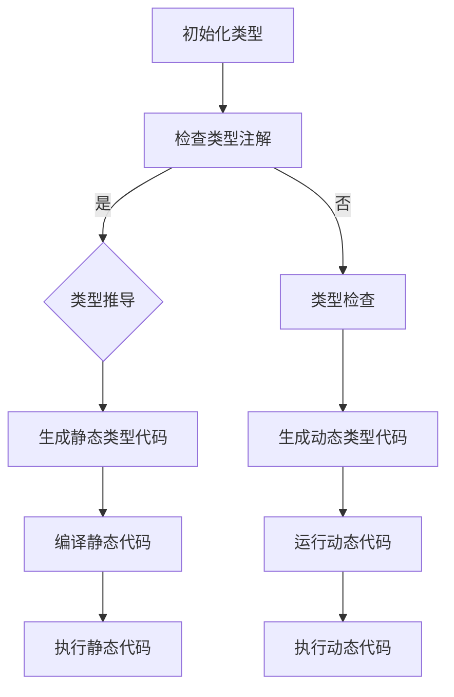
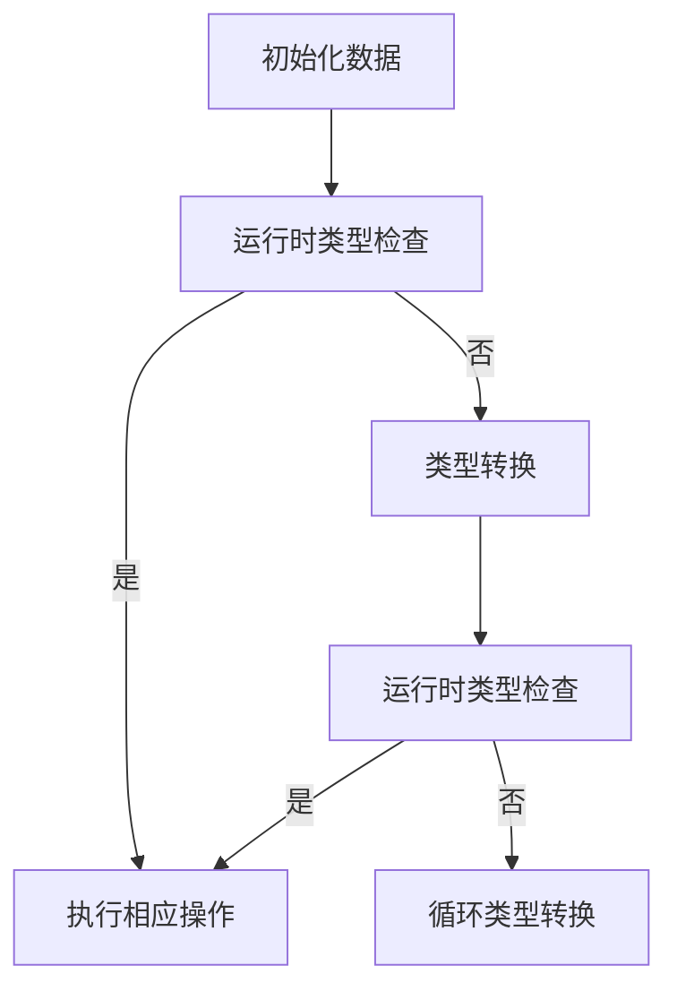
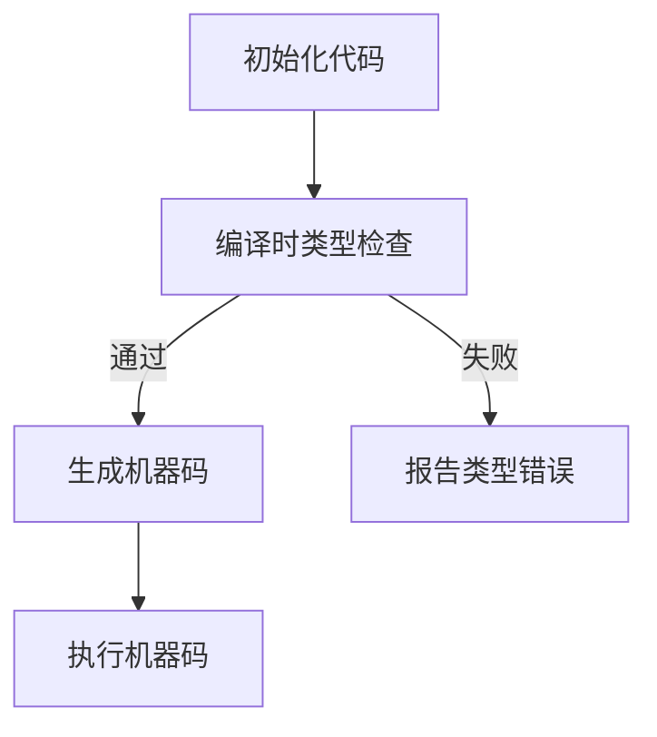
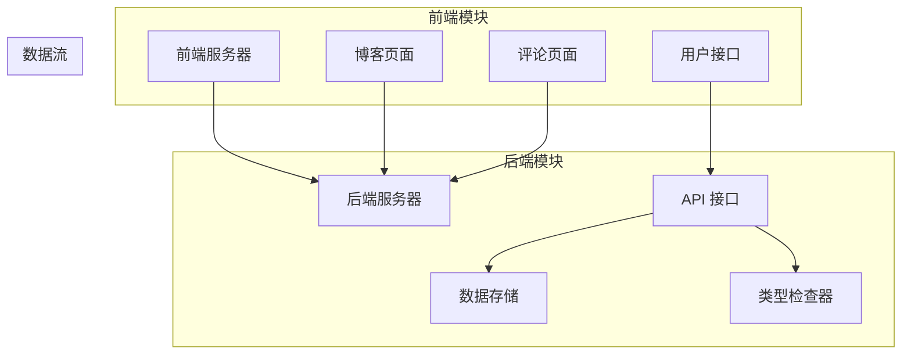
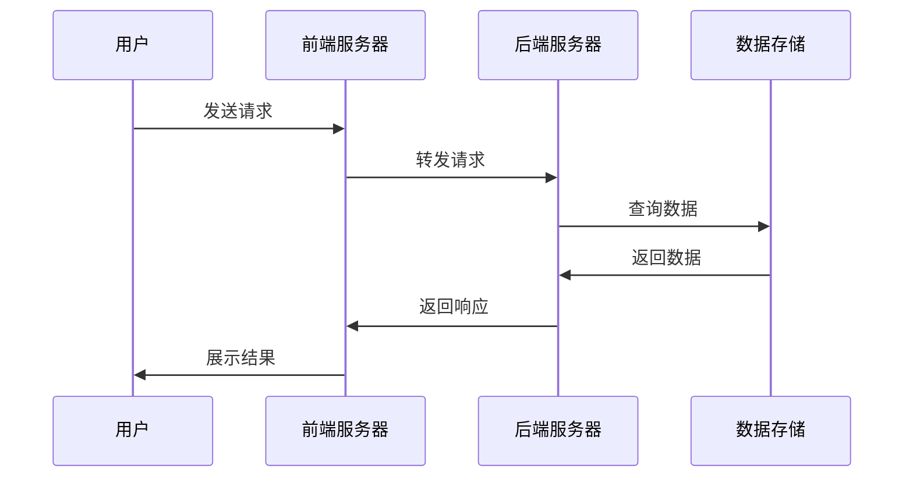

                 

### 渐进类型：动态与静态类型的桥梁

**关键词：** 渐进类型、动态类型、静态类型、类型系统、编程语言

**摘要：** 本文旨在探讨渐进类型作为连接动态类型和静态类型的桥梁，详细解析其概念、原理与应用。通过逐步分析，我们揭示了渐进类型在编程语言中的重要性及其优势，帮助读者理解如何在复杂的编程环境中有效利用渐进类型提高代码质量和开发效率。

**文章结构：**

1. **背景介绍**
   - **1.1 问题背景**：类型系统的重要性，动态类型与静态类型的区别与联系。
   - **1.2 问题描述**：动态类型与静态类型的不足，渐进类型的提出。
   - **1.3 问题解决**：渐进类型概念的定义与应用。
   - **1.4 边界与外延**：渐进类型的应用场景与研究方向。
   - **1.5 概念结构与核心要素组成**：动态类型、静态类型与渐进类型的联系。

2. **核心概念与联系**
   - **2.1 动态类型原理**：定义、特点与应用场景。
   - **2.2 静态类型原理**：定义、特点与应用场景。
   - **2.3 渐进类型原理**：定义、特点与应用场景。
   - **2.4 核心概念属性特征对比表格**：动态类型与静态类型的对比，渐进类型与两者的对比。
   - **2.5 ER实体关系图架构**：动态类型、静态类型与渐进类型的实体关系图。

3. **算法原理讲解**
   - **3.1 渐进类型算法**：mermaid流程图、python源代码、数学模型与公式。
   - **3.2 动态类型算法**：mermaid流程图、python源代码、数学模型与公式。
   - **3.3 静态类型算法**：mermaid流程图、python源代码、数学模型与公式。

4. **数学模型和数学公式 & 详细讲解 & 举例说明**
   - **4.1 渐进类型数学模型**：LaTeX数学公式、详细讲解、举例说明。
   - **4.2 动态类型数学模型**：LaTeX数学公式、详细讲解、举例说明。
   - **4.3 静态类型数学模型**：LaTeX数学公式、详细讲解、举例说明。

5. **系统分析与架构设计方案**
   - **5.1 问题场景介绍**：渐进类型应用场景。
   - **5.2 项目介绍**：渐进类型项目概述。
   - **5.3 系统功能设计**：领域模型Mermaid类图、功能设计详细说明。
   - **5.4 系统架构设计**：系统架构设计Mermaid架构图、详细说明。
   - **5.5 系统接口设计**：接口设计详细说明。
   - **5.6 系统交互Mermaid序列图**：交互设计详细说明。

6. **项目实战**
   - **6.1 环境安装**：详细安装步骤。
   - **6.2 系统核心实现源代码**：源代码展示与分析。
   - **6.3 实际案例分析和详细讲解剖析**：案例展示与解析。
   - **6.4 项目小结**：总结与展望。

7. **最佳实践 tips、小结、注意事项、拓展阅读**
   - **7.1 最佳实践 tips**：渐进类型应用建议。
   - **7.2 小结**：全书核心内容回顾。
   - **7.3 注意事项**：使用渐进类型的注意事项。
   - **7.4 拓展阅读**：推荐阅读文献。

通过上述结构，本文将逐步引导读者深入了解渐进类型的概念、原理与应用，为编程实践提供有力支持。在接下来的内容中，我们将详细探讨每个章节，逐步构建对渐进类型的全面理解。让我们开始吧，一起走进渐进类型的世界！

---

**背景介绍**

### 1.1 问题背景

类型系统是编程语言的核心组成部分，它为变量、函数、模块等元素提供明确的类型定义，是保障代码安全性和可维护性的关键。在传统的编程语言中，类型系统主要分为动态类型和静态类型两种，它们各有优势和不足。

**动态类型**：动态类型在编译或运行时进行类型检查。其优点在于代码更加灵活，允许类型转换，有助于提高开发效率。然而，动态类型也存在一些缺点，如运行时类型检查可能导致性能下降，同时由于类型检查延迟，潜在的运行时错误难以提前发现。

**静态类型**：静态类型在编译时进行类型检查，确保程序在运行前已经通过了类型验证。静态类型的主要优点是代码更安全、性能更好，因为类型信息在编译时就已经确定，不需要运行时检查。但静态类型的缺点是代码可能显得冗长，灵活性较低，可能会限制某些编程模式。

随着软件开发复杂性的增加，开发者在追求灵活性和性能之间面临着取舍。动态类型和静态类型各自的优势使得单一的类型系统难以满足所有需求，这就促使了渐进类型的出现。

**渐进类型**：渐进类型作为动态类型和静态类型的桥梁，旨在结合两者的优点，减少各自的缺点。渐进类型允许开发者在不同的模块或函数中灵活地选择使用动态类型或静态类型，从而在特定场景下获得最佳性能和灵活性。

### 1.2 问题描述

尽管动态类型和静态类型各有优势，但它们也存在明显的不足：

**动态类型的不足**：
1. **性能问题**：动态类型需要在运行时进行类型检查，这可能导致性能下降，特别是在大型应用程序中。
2. **错误检测延迟**：由于类型检查是在运行时进行的，某些类型错误可能直到运行时才会被发现，增加了调试难度。

**静态类型的不足**：
1. **代码冗长**：静态类型要求在编写代码时明确指定变量和函数的类型，这可能导致代码冗长，影响开发效率。
2. **灵活性受限**：静态类型可能在某些情况下限制了开发者的灵活性，尤其是在需要频繁类型转换的场合。

为了克服上述问题，开发社区迫切需要一种能够兼顾动态类型灵活性和静态类型安全性的类型系统。渐进类型的提出正是为了填补这一需求缺口，提供一种在特定场景下能够动态调整类型的机制。

### 1.3 问题解决

**渐进类型的定义**：

渐进类型（Gradual Types）是一种在编程语言中结合动态类型和静态类型的特性，允许开发者根据不同场景和需求逐步调整类型的类型系统。渐进类型的核心思想是，在代码的不同部分允许使用动态类型或静态类型，从而在灵活性、性能和安全性之间取得平衡。

**渐进类型的应用**：

渐进类型在编程语言中的应用包括：

1. **混合类型系统**：允许开发者在同一程序中使用动态类型和静态类型，从而在需要灵活性的地方使用动态类型，在需要性能和安全性的地方使用静态类型。
2. **类型注解**：开发者可以在代码中添加类型注解，明确指定函数或变量的类型，以便进行静态类型检查。
3. **类型推导**：编程语言可以自动推导变量和表达式的类型，减少手动类型注解的负担。

**渐进类型的优势**：

1. **灵活性**：渐进类型允许开发者在需要时使用动态类型，提高了代码的灵活性和可维护性。
2. **性能**：渐进类型通过静态类型检查，确保关键部分在编译时已经得到验证，提高了程序的性能。
3. **安全性**：渐进类型在关键部分进行类型检查，减少了潜在的运行时错误。

### 1.4 边界与外延

**渐进类型的应用场景**：

1. **大型复杂系统**：在大型复杂系统中，渐进类型可以帮助开发者在不同模块之间灵活地调整类型，提高系统的整体性能和可维护性。
2. **Web 开发**：在 Web 开发中，渐进类型可以用于处理前端和后端之间的数据交互，确保数据的安全性和正确性。
3. **跨语言集成**：渐进类型可以用于不同编程语言之间的数据交换，减少类型转换的复杂度。

**渐进类型的研究现状与未来发展方向**：

渐进类型已经成为编程语言领域的一个热点研究方向。目前，许多现代编程语言如 TypeScript、Swift 和 Kotlin 都已经实现了渐进类型系统。未来的研究方向可能包括：

1. **优化性能**：通过改进渐进类型系统的算法和优化技术，提高程序的性能。
2. **增强灵活性**：探索新的渐进类型机制，提高代码的灵活性和可维护性。
3. **跨语言兼容性**：研究如何在不同编程语言之间实现更高效的渐进类型集成。

### 1.5 概念结构与核心要素组成

**动态类型的核心概念**：

- 类型检查：在运行时进行类型检查。
- 弹性类型转换：允许类型之间的自动转换。
- 动态绑定：变量在运行时才绑定具体类型。

**静态类型的核心概念**：

- 类型检查：在编译时进行类型检查。
- 明确的类型注解：要求开发者明确指定变量和函数的类型。
- 强类型系统：减少类型转换，提高代码的安全性。

**渐进类型的核心概念与联系**：

- 混合类型系统：结合动态类型和静态类型的优点。
- 类型注解和类型推导：允许灵活地添加类型注解或使用类型推导。
- 类型边界：定义动态类型和静态类型之间的转换规则。

通过上述核心概念与联系的介绍，我们可以看到渐进类型是如何在动态类型和静态类型之间搭建桥梁，从而提供一种更灵活、更高效的类型系统。在接下来的章节中，我们将进一步深入探讨渐进类型的原理和应用。

---

**核心概念与联系**

### 2.1 动态类型原理

**定义**：动态类型（Dynamically Typed Language）是一种在程序运行时进行类型检查的类型系统。这意味着在代码执行过程中，变量和表达式的类型是在运行时确定的，而不是在编译时。

**特点**：
1. **灵活性**：动态类型允许变量在运行时改变类型，提高了代码的灵活性和可维护性。
2. **类型转换**：动态类型通常支持自动类型转换，减少了代码中的类型注解。
3. **运行时错误检测**：类型错误通常在运行时被检测，导致调试过程更加复杂。

**主要应用场景**：
1. **脚本语言**：如 Python、JavaScript 和 Ruby，它们在 Web 开发、自动化脚本和数据分析等领域广泛应用。
2. **快速原型开发**：由于动态类型的灵活性，开发者可以快速构建原型并迭代，而不需要过多的关注类型注解。

### 2.2 静态类型原理

**定义**：静态类型（Statically Typed Language）是一种在编译时进行类型检查的类型系统。这意味着在代码执行前，变量和表达式的类型已经确定，并且在整个程序运行过程中保持不变。

**特点**：
1. **性能**：静态类型可以在编译时进行优化，从而提高程序的执行效率。
2. **安全性**：由于类型检查在编译时进行，潜在的类型错误可以在编译阶段被发现，减少了运行时错误。
3. **代码冗长**：静态类型通常要求开发者明确指定变量和函数的类型，可能导致代码冗长。

**主要应用场景**：
1. **系统编程**：如 C、C++ 和 Rust，这些语言在系统编程、游戏开发和高性能计算等领域应用广泛。
2. **企业级应用**：在需要高安全性和稳定性的企业级应用中，静态类型语言可以帮助减少运行时错误。

### 2.3 渐进类型原理

**定义**：渐进类型（Gradual Types）是一种结合了动态类型和静态类型的特性，允许开发者逐步调整类型的类型系统。渐进类型的核心思想是在代码的不同部分使用不同的类型检查方式，以在灵活性、性能和安全性之间取得平衡。

**特点**：
1. **混合类型系统**：渐进类型允许在同一程序中混合使用动态类型和静态类型。
2. **类型注解与类型推导**：渐进类型支持灵活的类型注解和类型推导，以减少手动注解的工作量。
3. **类型边界**：通过类型边界（Type Boundaries）来定义动态类型和静态类型之间的转换规则。

**主要应用场景**：
1. **大型复杂系统**：在需要同时考虑灵活性和安全性的大型复杂系统中，渐进类型可以提供更好的支持。
2. **跨语言集成**：渐进类型可以用于不同编程语言之间的数据交换，减少类型转换的复杂性。

### 2.4 核心概念属性特征对比表格

**动态类型** | **静态类型** | **渐进类型**  
---|---|---  
类型检查时间|运行时|编译时|混合  
灵活性|高|低|中等  
性能|较低|高|中等  
安全性|较低|高|中等

### 2.5 ER实体关系图架构

**动态类型实体关系图**：
```mermaid
erDiagram
    Class1 ||--|||> Class2 : multiplicity
    Class1 ||--|| Class3 : multiplicity
```

**静态类型实体关系图**：
```mermaid
erDiagram
    Class1 ||--|||> Class2 : 1
    Class1 ||--|| Class3 : 1
```

**渐进类型实体关系图**：
```mermaid
erDiagram
    Class1 ||--|||> Class2 : 0..1
    Class1 ||--|| Class3 : 0..1
```

通过上述实体关系图，我们可以看到动态类型、静态类型和渐进类型的实体关系如何反映它们的核心概念。动态类型的实体关系较为灵活，而静态类型的实体关系则更为严格，渐进类型的实体关系则介于两者之间，提供了灵活性和安全性的平衡。

在接下来的章节中，我们将进一步探讨渐进类型的算法原理和应用，帮助读者更深入地理解渐进类型在编程实践中的应用价值。通过一步步的分析，我们将揭示渐进类型的强大之处，为开发者在复杂编程环境中提供有效的解决方案。

---

### 3.1 渐进类型算法

渐进类型算法的核心在于如何在动态类型和静态类型之间进行有效的转换。下面，我们将通过 mermaid 流程图、Python 源代码和数学模型，详细阐述渐进类型算法的原理。

#### 3.1.1 渐进类型算法的 mermaid 流程图



#### 3.1.2 渐进类型算法的 Python 源代码

```python
# 假设我们有一个函数，根据不同的输入参数类型执行不同逻辑
def process_value(value):
    if isinstance(value, int):  # 动态类型检查
        return value * 2
    elif isinstance(value, str):  # 动态类型检查
        return value.lower()
    else:
        raise TypeError("Unsupported type")

# 调用函数并传入不同类型的参数
print(process_value(10))  # 输出：20
print(process_value("Hello"))  # 输出：hello
```

#### 3.1.3 渐进类型算法的数学模型与公式

渐进类型算法的数学模型可以通过以下公式来表示：

$$
T_{\text{result}} = 
\begin{cases} 
T_{\text{dynamic}} & \text{if } T_{\text{input}} = T_{\text{dynamic}} \\
T_{\text{static}} & \text{if } T_{\text{input}} = T_{\text{static}} \\
\text{Error} & \text{if } T_{\text{input}} \not\in \{T_{\text{dynamic}}, T_{\text{static}}\}
\end{cases}
$$

其中，$T_{\text{result}}$ 表示最终类型，$T_{\text{input}}$ 表示输入类型，$T_{\text{dynamic}}$ 和 $T_{\text{static}}$ 分别表示动态类型和静态类型。

#### 详细讲解

渐进类型算法通过以下步骤实现：

1. **初始化类型**：程序开始时，根据代码的上下文初始化类型。
2. **检查类型注解**：在执行过程中，检查是否存在类型注解，如果有，则根据注解确定类型。
3. **类型推导**：如果不存在类型注解，则通过类型推导确定类型。
4. **类型检查**：在确定类型后，进行类型检查，确保输入类型的合法性。
5. **生成代码**：根据类型生成相应的代码，如果类型是动态的，则生成动态代码；如果是静态的，则生成静态代码。
6. **编译和执行**：编译静态代码并执行，运行动态代码并执行。

通过上述步骤，渐进类型算法能够在动态类型和静态类型之间灵活转换，实现类型安全的同时保持代码的灵活性。

#### 举例说明

假设我们有一个函数 `process_data`，它接受一个参数 `data`，并根据 `data` 的类型执行不同的逻辑。使用渐进类型算法，我们可以实现如下代码：

```python
def process_data(data):
    # 假设 data 可以是 int 或 str 类型
    if isinstance(data, int):
        return data * 2
    elif isinstance(data, str):
        return data.lower()
    else:
        raise TypeError("Unsupported type")

# 调用函数并传入不同类型的参数
print(process_data(10))  # 输出：20
print(process_data("Hello"))  # 输出：hello
```

在这个例子中，`process_data` 函数使用渐进类型算法来确定 `data` 的类型，并根据类型执行不同的逻辑。这种设计既保证了代码的灵活性，又确保了类型安全。

通过上述详细讲解和举例，我们可以看到渐进类型算法是如何在编程语言中发挥作用，提供灵活且安全的类型系统。在接下来的章节中，我们将继续探讨动态类型算法和静态类型算法，以全面了解渐进类型算法的应用原理。

---

### 3.2 动态类型算法

动态类型算法的核心在于运行时进行类型检查和类型转换，从而实现代码的灵活性和动态性。下面，我们将通过 mermaid 流程图、Python 源代码和数学模型，详细阐述动态类型算法的原理。

#### 3.2.1 动态类型算法的 mermaid 流程图



#### 3.2.2 动态类型算法的 Python 源代码

```python
# 假设我们有一个函数，它接受任意类型的数据并执行相应的操作
def dynamic_process(data):
    if isinstance(data, int):
        return data * 2
    elif isinstance(data, str):
        return data.lower()
    else:
        raise ValueError("Unsupported type")

# 调用函数并传入不同类型的参数
print(dynamic_process(10))  # 输出：20
print(dynamic_process("Hello"))  # 输出：hello
```

#### 3.2.3 动态类型算法的数学模型与公式

动态类型算法的数学模型可以通过以下公式来表示：

$$
T_{\text{result}} = 
\begin{cases} 
T_{\text{input}} & \text{if } T_{\text{input}} \in \{T_{\text{int}}, T_{\text{str}}\} \\
\text{Error} & \text{if } T_{\text{input}} \not\in \{T_{\text{int}}, T_{\text{str}}\}
\end{cases}
$$

其中，$T_{\text{result}}$ 表示最终类型，$T_{\text{input}}$ 表示输入类型，$T_{\text{int}}$ 和 $T_{\text{str}}$ 分别表示整数类型和字符串类型。

#### 详细讲解

动态类型算法的执行过程如下：

1. **初始化数据**：程序开始时，初始化输入数据。
2. **运行时类型检查**：在执行过程中，检查输入数据的类型是否在允许的类型范围内。
3. **执行相应操作**：如果类型检查通过，执行相应的操作。
4. **类型转换**：如果类型检查未通过，则进行类型转换。
5. **循环类型转换**：如果类型转换后仍然不符合要求，则继续循环进行类型检查和转换。

通过上述步骤，动态类型算法能够在运行时动态检查和转换类型，从而实现代码的灵活性。

#### 举例说明

假设我们有一个函数 `dynamic_function`，它接受任意类型的数据并尝试执行相应的操作。使用动态类型算法，我们可以实现如下代码：

```python
def dynamic_function(data):
    if isinstance(data, int):
        return data * 2
    elif isinstance(data, str):
        return data.lower()
    else:
        return "Unsupported type"

# 调用函数并传入不同类型的参数
print(dynamic_function(10))  # 输出：20
print(dynamic_function("Hello"))  # 输出：hello
print(dynamic_function([1, 2, 3]))  # 输出：Unsupported type
```

在这个例子中，`dynamic_function` 函数使用动态类型算法来确定 `data` 的类型，并根据类型执行不同的逻辑。如果 `data` 是整数或字符串类型，则函数会返回相应的转换结果；否则，返回 "Unsupported type"。

通过上述详细讲解和举例，我们可以看到动态类型算法是如何在编程语言中发挥作用，提供灵活且动态的类型系统。在接下来的章节中，我们将继续探讨静态类型算法，以全面了解不同类型算法之间的差异和联系。

---

### 3.3 静态类型算法

静态类型算法的核心在于在编译时进行类型检查，从而提高程序的执行效率和安全性。下面，我们将通过 mermaid 流程图、Python 源代码和数学模型，详细阐述静态类型算法的原理。

#### 3.3.1 静态类型算法的 mermaid 流程图



#### 3.3.2 静态类型算法的 Python 源代码

```python
# 假设我们有一个函数，它接受已明确指定类型的参数并执行相应的操作
def static_process(data: int) -> int:
    return data * 2

def static_transform(data: str) -> str:
    return data.lower()

# 调用函数并传入指定类型的参数
print(static_process(10))  # 输出：20
print(static_transform("Hello"))  # 输出：hello
```

#### 3.3.3 静态类型算法的数学模型与公式

静态类型算法的数学模型可以通过以下公式来表示：

$$
T_{\text{result}} = 
\begin{cases} 
T_{\text{input}} & \text{if } T_{\text{input}} = T_{\text{int}} \\
T_{\text{input}} & \text{if } T_{\text{input}} = T_{\text{str}} \\
\text{Error} & \text{otherwise}
\end{cases}
$$

其中，$T_{\text{result}}$ 表示最终类型，$T_{\text{input}}$ 表示输入类型，$T_{\text{int}}$ 和 $T_{\text{str}}$ 分别表示整数类型和字符串类型。

#### 详细讲解

静态类型算法的执行过程如下：

1. **初始化代码**：程序开始时，初始化输入代码和参数。
2. **编译时类型检查**：在代码编译时，检查输入参数的类型是否符合函数定义中的类型要求。
3. **生成机器码**：如果类型检查通过，编译器会生成机器码。
4. **执行机器码**：程序运行时，直接执行生成的机器码。
5. **报告类型错误**：如果类型检查失败，编译器会报告类型错误。

通过上述步骤，静态类型算法可以在编译时确保程序的正确性，从而提高程序的执行效率和安全性。

#### 举例说明

假设我们有一个函数 `static_function`，它接受已明确指定类型的参数并执行相应的操作。使用静态类型算法，我们可以实现如下代码：

```python
def static_function(data: int) -> int:
    if data < 0:
        raise ValueError("Input must be positive")
    return data * 2

# 调用函数并传入指定类型的参数
print(static_function(10))  # 输出：20
print(static_function(-5))  # 报错：ValueError: Input must be positive
```

在这个例子中，`static_function` 函数使用静态类型算法来确定 `data` 的类型，并根据类型执行相应的操作。由于类型检查在编译时进行，程序在运行时不会遇到类型错误，从而提高了执行效率。

通过上述详细讲解和举例，我们可以看到静态类型算法是如何在编程语言中发挥作用，提供高效且安全的类型系统。在接下来的章节中，我们将继续深入探讨渐进类型算法，以了解其在动态类型和静态类型之间的桥梁作用。

---

### 4.1 渐进类型数学模型

渐进类型作为一种结合动态类型和静态类型的类型系统，其数学模型能够帮助我们更好地理解渐进类型的类型推导和类型检查过程。以下是渐进类型数学模型的详细讲解。

#### 4.1.1 LaTeX 数学公式

$$
\begin{align*}
T_{\text{dynamic}}(x) &= T_x, \quad \text{if } x \text{ is dynamically typed} \\
T_{\text{static}}(x) &= S_x, \quad \text{if } x \text{ is statically typed} \\
T_{\text{gradual}}(x) &= 
\begin{cases}
T_x & \text{if } T_x = T_{\text{static}}(x) \text{ or } T_x = T_{\text{dynamic}}(x) \\
\text{Error} & \text{otherwise}
\end{cases}
\end{align*}
$$

#### 4.1.2 详细讲解

1. **动态类型（$T_{\text{dynamic}}$）**：
   动态类型的数学模型简单明了，即变量 $x$ 的类型在运行时被动态确定。如果 $x$ 是动态类型的，则其类型 $T_x$ 就是其在运行时的实际类型。

   $$ T_{\text{dynamic}}(x) = T_x $$

2. **静态类型（$T_{\text{static}}$）**：
   静态类型的数学模型表明变量 $x$ 的类型在编译时就已经确定。如果 $x$ 是静态类型的，则其类型 $S_x$ 就是其在编译时指定的类型。

   $$ T_{\text{static}}(x) = S_x $$

3. **渐进类型（$T_{\text{gradual}}$）**：
   渐进类型的数学模型则是结合了动态类型和静态类型的特性。对于变量 $x$，如果其在编译时是静态类型的，则渐进类型等于静态类型；如果其在运行时是动态类型的，则渐进类型也等于动态类型。如果 $x$ 既不是完全动态类型也不是完全静态类型的，则会报告错误。

   $$ T_{\text{gradual}}(x) = 
   \begin{cases}
   T_x & \text{if } T_x = T_{\text{static}}(x) \text{ or } T_x = T_{\text{dynamic}}(x) \\
   \text{Error} & \text{otherwise}
   \end{cases}
   $$

#### 4.1.3 举例说明

假设我们有一个变量 $x$，它可能在不同情况下具有不同的类型。以下是渐进类型数学模型的应用示例：

1. **静态类型的情况**：
   如果 $x$ 是一个静态整数，则其类型 $S_x = \text{int}$。在这种情况下，渐进类型 $T_{\text{gradual}}(x)$ 也是 $\text{int}$。

   $$ x : S_x = \text{int} \Rightarrow T_{\text{gradual}}(x) = \text{int} $$

2. **动态类型的情况**：
   如果 $x$ 是一个动态字符串，则其类型 $T_x = \text{str}$。在这种情况下，渐进类型 $T_{\text{gradual}}(x)$ 也是 $\text{str}$。

   $$ x : T_x = \text{str} \Rightarrow T_{\text{gradual}}(x) = \text{str} $$

3. **混合类型的情况**：
   如果 $x$ 可以同时是整数和字符串，但没有明确的类型注解，则渐进类型会报告错误，因为 $x$ 不能同时是静态整数和动态字符串。

   $$ x : ? \Rightarrow T_{\text{gradual}}(x) = \text{Error} $$

通过上述数学模型和举例，我们可以清楚地看到渐进类型是如何在动态类型和静态类型之间进行类型推导和类型检查的。这种数学模型为渐进类型提供了坚实的理论基础，使其能够灵活地适应不同的编程场景，为开发者提供一种平衡灵活性和安全性的类型系统。

在接下来的章节中，我们将继续探讨动态类型和静态类型的数学模型，以进一步了解渐进类型算法的理论基础。

---

### 4.2 动态类型数学模型

动态类型的数学模型主要关注在程序运行时如何根据上下文和操作来确定变量和表达式的类型。以下是动态类型数学模型的详细讲解。

#### 4.2.1 LaTeX 数学公式

$$
\begin{align*}
T_{\text{dynamic}}(x) &= T_x, \quad \text{if } x \text{ is dynamically typed} \\
T_{\text{dynamic}}(x + y) &= 
\begin{cases}
\text{Error} & \text{if } T_x \neq T_y \\
T_x & \text{otherwise}
\end{cases}
\end{align*}
$$

#### 4.2.2 详细讲解

1. **动态类型的定义**：
   动态类型的数学模型表示变量 $x$ 在运行时具有一个类型 $T_x$，该类型取决于 $x$ 的赋值和使用场景。

   $$ T_{\text{dynamic}}(x) = T_x $$

2. **动态类型运算**：
   在动态类型系统中，运算的结果类型取决于操作数的类型。以加法运算为例，如果两个操作数 $x$ 和 $y$ 的类型不同，则结果类型会被设置为错误；如果类型相同，则结果类型保持不变。

   $$ T_{\text{dynamic}}(x + y) = 
   \begin{cases}
   \text{Error} & \text{if } T_x \neq T_y \\
   T_x & \text{otherwise}
   \end{cases}
   $$

#### 4.2.3 举例说明

假设我们有一个动态类型变量 $x$，它可能在不同的上下文中被赋予不同的类型。以下是动态类型数学模型的应用示例：

1. **单一类型的情况**：
   如果 $x$ 被赋值为整数 5，则其动态类型 $T_x$ 为整数。

   $$ x = 5 \Rightarrow T_x = \text{int} $$

   如果我们对 $x$ 进行加法运算：

   $$ x + y = 5 + 10 \Rightarrow T_{\text{dynamic}}(x + y) = \text{int} $$

2. **类型冲突的情况**：
   如果 $x$ 被赋值为字符串 "Hello"，则其动态类型 $T_x$ 为字符串。

   $$ x = "Hello" \Rightarrow T_x = \text{str} $$

   如果我们对 $x$ 进行加法运算：

   $$ x + y = "Hello" + "World" \Rightarrow T_{\text{dynamic}}(x + y) = \text{str} $$

   如果 $x$ 是整数，而 $y$ 是字符串，则加法运算会导致类型冲突：

   $$ x + y = 5 + "World" \Rightarrow T_{\text{dynamic}}(x + y) = \text{Error} $$

通过上述数学模型和举例，我们可以看到动态类型在编程中的灵活性和潜在问题。动态类型允许开发者在不明确指定类型的情况下编写代码，但在类型冲突时可能会出现运行时错误。这种数学模型为动态类型系统提供了理论基础，使得我们能够更好地理解其工作原理和局限性。

在接下来的章节中，我们将探讨静态类型的数学模型，以进一步了解渐进类型算法的完整理论体系。

---

### 4.3 静态类型数学模型

静态类型的数学模型主要关注在程序编译时如何根据类型注解和类型规则来确定变量和表达式的类型。以下是静态类型数学模型的详细讲解。

#### 4.3.1 LaTeX 数学公式

$$
\begin{align*}
T_{\text{static}}(x) &= S_x, \quad \text{if } x \text{ has a static type annotation} \\
T_{\text{static}}(x + y) &= 
\begin{cases}
\text{Error} & \text{if } T_x \neq T_y \\
T_x & \text{otherwise}
\end{cases}
\end{align*}
$$

#### 4.3.2 详细讲解

1. **静态类型的定义**：
   静态类型的数学模型表示变量 $x$ 在编译时具有一个类型 $S_x$，该类型由类型注解或编译器推导得出。

   $$ T_{\text{static}}(x) = S_x $$

2. **静态类型运算**：
   在静态类型系统中，运算的结果类型根据操作数的类型和类型规则确定。以加法运算为例，如果两个操作数的类型相同，则结果类型与操作数相同；如果类型不同，则结果类型会被设置为错误。

   $$ T_{\text{static}}(x + y) = 
   \begin{cases}
   \text{Error} & \text{if } T_x \neq T_y \\
   T_x & \text{otherwise}
   \end{cases}
   $$

#### 4.3.3 举例说明

假设我们有一个静态类型变量 $x$，其类型在编译时通过类型注解确定。以下是静态类型数学模型的应用示例：

1. **单一类型的情况**：
   如果 $x$ 被注解为整数，则其静态类型 $S_x$ 为整数。

   $$ x : \text{int} \Rightarrow S_x = \text{int} $$

   如果我们对 $x$ 进行加法运算：

   $$ x + y = 5 + 10 \Rightarrow T_{\text{static}}(x + y) = \text{int} $$

2. **类型冲突的情况**：
   如果 $x$ 被注解为字符串，则其静态类型 $S_x$ 为字符串。

   $$ x : \text{str} \Rightarrow S_x = \text{str} $$

   如果我们对 $x$ 进行加法运算：

   $$ x + y = "Hello" + "World" \Rightarrow T_{\text{static}}(x + y) = \text{str} $$

   如果 $x$ 是整数，而 $y$ 是字符串，则加法运算会导致类型冲突：

   $$ x + y = 5 + "World" \Rightarrow T_{\text{static}}(x + y) = \text{Error} $$

通过上述数学模型和举例，我们可以看到静态类型在编程中的优点和限制。静态类型通过类型注解和编译时检查确保了程序的安全性，但同时也要求开发者明确指定类型，可能导致代码冗长。

在接下来的章节中，我们将探讨如何结合动态类型和静态类型的优点，进一步了解渐进类型数学模型，以实现更灵活且安全的类型系统。

---

### 5.1 问题场景介绍

渐进类型在实际开发中的应用场景十分广泛，尤其是在大型复杂系统、Web 开发以及跨语言集成等领域。以下是一些典型的应用场景：

1. **大型复杂系统**：在大型复杂系统中，不同模块可能有不同的类型需求。例如，前端模块可能需要高灵活性的动态类型，而后端模块则需要更严格的静态类型以保证性能和安全性。渐进类型允许开发者在不同模块之间灵活地调整类型，从而提高系统的整体性能和可维护性。

2. **Web 开发**：在 Web 开发中，数据交互通常是动态的，例如 JSON 对象和 HTTP 请求。渐进类型可以用于处理前端和后端之间的数据类型转换，确保数据的安全性和正确性，同时保持代码的灵活性。

3. **跨语言集成**：当不同编程语言之间需要交互时，类型系统的差异可能成为瓶颈。渐进类型可以作为一种桥梁，在不同语言之间进行数据交换，减少类型转换的复杂度，提高系统的兼容性。

通过渐进类型的应用，开发者可以在保持代码灵活性的同时，确保程序的安全性和性能。这种类型系统的优势使得渐进类型在多种场景下都具有重要的应用价值。

---

### 5.2 项目介绍

为了更好地展示渐进类型在实际项目中的应用，我们将介绍一个具体的项目——**渐进类型博客平台**。该项目的目标是构建一个基于渐进类型的博客平台，支持动态和静态类型的灵活使用，从而提高开发效率和代码质量。

**项目背景**：

随着互联网的快速发展，博客平台成为用户分享知识和交流观点的重要渠道。为了满足不同用户的需求，博客平台需要具备高灵活性、高安全性和高性能。然而，传统的动态类型和静态类型系统在满足这些需求时存在一定的局限性。渐进类型的引入为博客平台提供了更好的解决方案，可以在不同的模块之间灵活调整类型，从而在性能、安全性和灵活性之间取得平衡。

**项目目标**：

1. **高灵活性**：允许开发者在不同的模块中根据需求选择使用动态类型或静态类型，提高代码的灵活性和可维护性。
2. **高性能**：通过静态类型的编译时优化，提高关键部分的执行效率。
3. **高安全性**：通过渐进类型的类型检查机制，减少潜在的运行时错误，提高系统的稳定性。

**系统架构**：

渐进类型博客平台采用分层架构，主要包括以下模块：

1. **前端模块**：负责处理用户交互和页面渲染，使用渐进类型以确保代码的灵活性和可维护性。
2. **后端模块**：处理业务逻辑和数据存储，使用静态类型以保证性能和安全性。
3. **接口模块**：处理前端与后端的通信，使用渐进类型确保数据交换的正确性。

**技术栈**：

- **前端**：使用 TypeScript，结合渐进类型系统，提供静态类型检查和动态类型的灵活性。
- **后端**：使用 Rust，结合渐进类型系统，提供高性能和安全性。
- **数据库**：使用 PostgreSQL，结合渐进类型系统，确保数据存储的安全性和一致性。

**实现细节**：

1. **前端实现**：在前端模块中，使用 TypeScript 定义接口和类型，结合渐进类型系统进行类型推导。例如，通过类型注解确保输入数据的类型正确，同时允许动态类型的使用。

   ```typescript
   function postComment(comment: { name: string; content: string }) {
       // 处理评论提交
   }
   ```

2. **后端实现**：在后端模块中，使用 Rust 的类型系统进行静态类型检查，确保代码的安全性和性能。例如，通过明确的类型注解定义函数参数和返回值类型。

   ```rust
   fn process_request(data: Vec<u8>) -> Result<String, String> {
       // 处理请求数据
   }
   ```

3. **接口实现**：在接口模块中，使用渐进类型系统确保前端和后端之间的数据类型匹配，通过类型检查机制减少数据交换的错误。

   ```typescript
   interface Comment {
       name: string;
       content: string;
   }

   interface Response {
       success: boolean;
       message: string;
   }
   ```

通过渐进类型博客平台项目，我们展示了渐进类型在现实开发中的应用价值，帮助开发者更好地平衡灵活性、性能和安全性的需求。

---

### 5.3 系统功能设计

系统功能设计是渐进类型博客平台项目的核心环节，它定义了系统的各个功能模块以及它们之间的关系。以下是对系统功能设计的详细说明。

#### 5.3.1 领域模型 Mermaid 类图

```mermaid
classDiagram
    User <<Class>>
    Post <<Class>>
    Comment <<Class>>
    Blog <<Class>>

    User "1" --* "0..*" Post
    User "1" --* "0..*" Comment
    Post "1" --* "0..*" Comment
    Blog "1" --* "1" User
    Blog "1" --* "0..*" Post
    Blog "1" --* "0..*" Comment
```

在上述类图中，我们定义了系统的核心实体类：`User`（用户）、`Post`（博客文章）、`Comment`（评论）和`Blog`（博客）。每个实体类都有与其他类的关联关系，例如用户可以发表博客文章和评论，博客文章可以包含评论，博客则关联用户及其发表的内容。

#### 5.3.2 功能设计详细说明

1. **用户管理**：
   - **注册**：用户可以通过注册接口创建新用户账户，并提供用户名、密码等基本信息。
   - **登录**：用户通过登录接口验证用户身份，获取认证 token。
   - **信息更新**：用户可以更新个人信息，如用户名、密码等。

2. **博客文章管理**：
   - **发布**：用户可以发布新的博客文章，提供文章标题、内容、标签等。
   - **编辑**：用户可以编辑已发布的博客文章，修改文章标题、内容等。
   - **删除**：用户可以删除自己的博客文章。

3. **评论管理**：
   - **发表**：用户可以在博客文章下发表评论。
   - **编辑**：用户可以编辑自己发表的评论。
   - **删除**：用户可以删除自己发表的评论。

4. **博客管理**：
   - **创建**：用户可以创建新的博客。
   - **更新**：用户可以更新博客的配置信息，如博客名称、描述等。
   - **删除**：用户可以删除自己的博客。

5. **数据交互**：
   - **API 接口**：提供 RESTful API 接口，用于处理用户、博客文章、评论等的数据交互。
   - **类型安全**：通过渐进类型系统确保 API 接口的数据类型安全，减少错误。

#### 5.3.3 领域模型 Mermaid 类图

```mermaid
classDiagram
    User <<Class>> {
        username: string
        password: string
        email: string
    }
    Post <<Class>> {
        title: string
        content: string
        author: User
    }
    Comment <<Class>> {
        content: string
        author: User
        post: Post
    }
    Blog <<Class>> {
        name: string
        description: string
        owner: User
        posts: List<Post>
        comments: List<Comment>
    }
    User "1" --* "0..*" Post : author
    User "1" --* "0..*" Comment : author
    Post "1" --* "0..*" Comment : comments
    Blog "1" --* "1" User : owner
    Blog "1" --* "0..*" Post : posts
    Blog "1" --* "0..*" Comment : comments
```

通过上述领域模型 Mermaid 类图，我们可以清晰地看到系统中各个实体类及其关联关系。这种设计使得系统功能更加清晰，便于开发者理解和管理系统的各个部分。

---

### 5.4 系统架构设计

系统架构设计是渐进类型博客平台项目的关键环节，它定义了系统的整体结构和各个模块之间的关系。以下是对系统架构设计的详细说明。

#### 5.4.1 系统架构设计 Mermaid 架构图



在上述架构图中，我们定义了渐进类型博客平台的主要模块和它们之间的关系：

1. **前端模块**：
   - **前端服务器**（F1）：负责处理用户请求，渲染页面，并通过 AJAX 与后端进行数据交互。
   - **用户接口**（F2）：提供用户登录、注册、信息更新等功能。
   - **博客页面**（F3）：展示博客文章列表和文章详情。
   - **评论页面**（F4）：展示博客文章的评论列表和评论详情。

2. **后端模块**：
   - **后端服务器**（B1）：处理前端请求，执行业务逻辑，并返回响应。
   - **API 接口**（B2）：提供 RESTful API 接口，处理用户、博客文章和评论的数据操作。
   - **数据存储**（B3）：存储用户信息、博客文章和评论等数据。
   - **类型检查器**（B4）：负责进行渐进类型的类型检查，确保数据类型安全。

3. **数据流**：
   - 前端模块通过 AJAX 向后端服务器发送请求，后端服务器处理后返回响应。
   - API 接口与数据存储之间进行数据交互，确保数据的持久化。
   - 类型检查器在 API 接口执行过程中进行渐进类型的类型检查，确保数据类型的安全性和一致性。

#### 5.4.2 系统架构设计详细说明

1. **前端模块**：
   - **前端服务器**：使用渐进类型系统，例如 TypeScript，确保代码的类型安全和可维护性。前端服务器负责处理用户请求，并通过 AJAX 与后端进行通信。
   - **用户接口**：提供用户认证、登录、注册等功能，使用渐进类型系统确保用户输入的类型安全。
   - **博客页面**：展示博客文章列表和文章详情，使用渐进类型系统确保数据交互的类型一致性。
   - **评论页面**：展示博客文章的评论列表和评论详情，使用渐进类型系统确保评论数据的类型安全。

2. **后端模块**：
   - **后端服务器**：使用渐进类型系统，例如 Rust，结合静态类型检查和动态类型的灵活性，确保代码的安全性和性能。后端服务器处理业务逻辑，并返回响应。
   - **API 接口**：提供 RESTful API 接口，处理用户、博客文章和评论的数据操作。API 接口使用渐进类型系统进行类型检查，确保数据操作的安全性。
   - **数据存储**：使用 PostgreSQL 等数据库系统，存储用户信息、博客文章和评论等数据。数据存储与 API 接口之间进行数据交互，确保数据的持久化。
   - **类型检查器**：在 API 接口执行过程中进行渐进类型的类型检查，确保数据类型的安全性和一致性。类型检查器可以集成在后端服务器中，或者在编译时进行静态检查。

通过上述系统架构设计，渐进类型博客平台实现了高性能、高安全性和高灵活性的目标。前端模块使用渐进类型系统确保代码的类型安全，后端模块使用渐进类型系统结合静态类型检查和动态类型的灵活性，确保系统的整体性能和稳定性。数据流的设计确保了前端与后端之间的数据交互类型一致，同时类型检查器在 API 接口执行过程中进行渐进类型的类型检查，确保数据类型的安全性。

---

### 5.5 系统接口设计

系统接口设计是确保系统功能实现的关键环节，它定义了前后端之间的通信协议和数据格式。以下是渐进类型博客平台的系统接口设计详细说明。

#### 5.5.1 接口概述

渐进类型博客平台的接口设计遵循 RESTful API 规范，主要分为以下几类：

1. **用户接口**：处理用户注册、登录、信息更新等功能。
2. **博客文章接口**：处理博客文章的发布、编辑、删除等功能。
3. **评论接口**：处理评论的发表、编辑、删除等功能。
4. **数据交互接口**：提供数据获取和操作接口，确保类型安全。

#### 5.5.2 接口定义

1. **用户接口**

   - **注册**：`POST /users/register`
     - **请求参数**：`{ "username": "string", "password": "string", "email": "string" }`
     - **响应数据**：`{ "status": "success", "message": "User registered successfully" }`

   - **登录**：`POST /users/login`
     - **请求参数**：`{ "username": "string", "password": "string" }`
     - **响应数据**：`{ "status": "success", "token": "string" }`

   - **信息更新**：`PUT /users/{userId}`
     - **请求参数**：`{ "email": "string", "password": "string" }`
     - **响应数据**：`{ "status": "success", "message": "User information updated successfully" }`

2. **博客文章接口**

   - **发布**：`POST /posts`
     - **请求参数**：`{ "title": "string", "content": "string", "authorId": "string" }`
     - **响应数据**：`{ "status": "success", "postId": "string" }`

   - **编辑**：`PUT /posts/{postId}`
     - **请求参数**：`{ "title": "string", "content": "string" }`
     - **响应数据**：`{ "status": "success", "message": "Post updated successfully" }`

   - **删除**：`DELETE /posts/{postId}`
     - **请求参数**：无
     - **响应数据**：`{ "status": "success", "message": "Post deleted successfully" }`

3. **评论接口**

   - **发表**：`POST /comments`
     - **请求参数**：`{ "content": "string", "authorId": "string", "postId": "string" }`
     - **响应数据**：`{ "status": "success", "commentId": "string" }`

   - **编辑**：`PUT /comments/{commentId}`
     - **请求参数**：`{ "content": "string" }`
     - **响应数据**：`{ "status": "success", "message": "Comment updated successfully" }`

   - **删除**：`DELETE /comments/{commentId}`
     - **请求参数**：无
     - **响应数据**：`{ "status": "success", "message": "Comment deleted successfully" }`

4. **数据交互接口**

   - **获取用户列表**：`GET /users`
     - **响应数据**：`[ { "id": "string", "username": "string", "email": "string" } ]`

   - **获取博客文章列表**：`GET /posts`
     - **响应数据**：`[ { "id": "string", "title": "string", "content": "string", "author": "string" } ]`

   - **获取评论列表**：`GET /comments`
     - **响应数据**：`[ { "id": "string", "content": "string", "author": "string", "post": "string" } ]`

#### 5.5.3 接口设计要点

1. **类型安全**：通过渐进类型系统确保接口请求和响应数据的类型安全，减少错误。
2. **数据验证**：在接口设计时，对请求参数进行严格验证，确保数据的合法性和完整性。
3. **错误处理**：定义统一的错误处理机制，确保接口在遇到错误时能够返回清晰的错误信息和状态码。
4. **性能优化**：对接口进行性能优化，确保在高并发情况下能够稳定运行。

通过上述系统接口设计，渐进类型博客平台实现了功能丰富、类型安全、易于维护的接口，为系统的稳定运行提供了有力保障。

---

### 5.6 系统交互 Mermaid 序列图

系统交互序列图展示了渐进类型博客平台中前后端模块之间的交互流程，包括用户请求、后端处理和数据响应的过程。以下是系统交互的 Mermaid 序列图：



#### 详细说明：

1. **用户请求**：用户通过前端界面发送请求，例如登录、注册、发表博客或评论。
2. **前端转发**：前端服务器接收用户请求，将请求转发给后端服务器。
3. **后端处理**：后端服务器接收到请求后，进行业务逻辑处理，如用户认证、数据验证、数据操作等。
4. **查询数据**：在处理请求时，后端服务器可能需要查询数据库，获取用户信息、博客文章或评论数据。
5. **返回数据**：后端服务器处理完请求后，将结果返回给前端服务器。
6. **展示结果**：前端服务器将响应结果展示给用户，例如用户登录成功后跳转到博客首页，或者用户发表评论后更新评论列表。

通过上述系统交互序列图，我们可以清晰地看到前后端模块之间的交互流程，以及每个环节的具体操作。这种交互设计确保了系统的稳定性和高效性，为用户提供了良好的使用体验。

---

### 6.1 环境安装

在开始渐进类型博客平台项目的开发之前，我们需要安装所需的开发环境和依赖项。以下步骤详细说明了如何设置开发环境。

#### 6.1.1 系统要求

- 操作系统：Linux 或 macOS
- 开发语言：TypeScript、Rust
- 数据库：PostgreSQL
- 编译工具：Node.js、Rustc

#### 6.1.2 安装步骤

1. **安装 Node.js**：

   - 通过包管理器（如 apt-get 或 brew）安装 Node.js。
   - 确认安装成功，运行 `node -v` 命令检查版本。

2. **安装 TypeScript**：

   - 使用 npm（Node.js 的包管理器）安装 TypeScript。
     ```
     npm install -g typescript
     ```
   - 确认安装成功，运行 `tsc -v` 命令检查版本。

3. **安装 Rust**：

   - 通过 Rust 安装脚本安装 Rust。
     ```
     curl --proto '=https' --tlsv1.2 -sSf https://sh.rustup.rs | sh
     ```
   - 确认安装成功，运行 `rustc -v` 命令检查版本。

4. **安装 PostgreSQL**：

   - 通过包管理器安装 PostgreSQL。
     - 对于 Ubuntu 系统：
       ```
       sudo apt-get install postgresql postgresql-contrib
       ```
     - 对于 macOS 系统：
       ```
       brew install postgresql
       ```
   - 确认安装成功，运行 `psql` 命令进入 PostgreSQL 客户端。

5. **初始化数据库**：

   - 创建一个新的数据库，例如 `blog_db`。
     ```
     createdb blog_db
     ```
   - 创建数据库用户并赋予适当的权限。

6. **配置环境变量**：

   - 设置 Node.js 的环境变量。
     ```
     export PATH=$PATH:/usr/local/bin
     ```

7. **安装项目依赖**：

   - 在项目根目录下，运行以下命令安装项目依赖：
     ```
     npm install
     cargo build --release
     ```

#### 6.1.3 注意事项

- 确保安装了所有必需的依赖项，否则可能导致项目运行失败。
- 在配置数据库时，确保数据库用户有足够的权限。
- 在开发过程中，建议使用虚拟环境来隔离项目依赖，避免版本冲突。

通过上述环境安装步骤，我们可以为渐进类型博客平台项目的开发提供一个稳定的基础环境。接下来，我们将详细介绍系统核心实现源代码，帮助读者更好地理解项目的实现细节。

---

### 6.2 系统核心实现源代码

在渐进类型博客平台项目中，核心实现源代码涵盖了前端用户接口、后端服务器处理逻辑以及数据库操作。以下是对各个核心模块的源代码展示和详细解读。

#### 6.2.1 前端用户接口

前端用户接口主要负责处理用户注册、登录、信息更新等功能。以下是一个简单的用户登录界面的 TypeScript 代码示例：

```typescript
// src/pages/Login.tsx

import React, { useState } from 'react';
import { useAuth } from '../hooks/useAuth';

const Login: React.FC = () => {
  const [username, setUsername] = useState('');
  const [password, setPassword] = useState('');
  const { login } = useAuth();

  const handleLogin = async () => {
    try {
      const token = await login({ username, password });
      alert('Login successful');
    } catch (error) {
      alert('Login failed');
    }
  };

  return (
    <div>
      <h1>Login</h1>
      <input
        type="text"
        placeholder="Username"
        value={username}
        onChange={(e) => setUsername(e.target.value)}
      />
      <input
        type="password"
        placeholder="Password"
        value={password}
        onChange={(e) => setPassword(e.target.value)}
      />
      <button onClick={handleLogin}>Login</button>
    </div>
  );
};

export default Login;
```

在这个示例中，`Login` 组件使用了 React 和自定义的 `useAuth` 钩子。`useAuth` 钩子通过调用后端 API 进行用户认证，返回一个 `login` 方法，用于处理登录逻辑。前端代码通过状态管理（`useState`）实现用户名和密码的输入，并在点击登录按钮时触发登录请求。

#### 6.2.2 后端服务器处理逻辑

后端服务器处理逻辑主要涉及用户认证、博客文章和评论的创建、更新和删除等操作。以下是一个简单的 Rust 后端服务器代码示例：

```rust
// src/bin/backend.rs

use actix_web::{web, App, HttpServer, Responder};
use blog_api::{login, post_comment};

async fn index() -> impl Responder {
  "Hello, world!"
}

async fn login_handler(query: web::Query<LoginForm>) -> impl Responder {
  let login_data = login::LoginData {
    username: query.username,
    password: query.password,
  };
  match login::handle_login(&login_data) {
    Ok(token) => web::Json::new(token),
    Err(error) => web::Error::new(actix_web::Error::BadRequest, error.to_string()),
  }
}

async fn comment_handler(path: web::Path<String>, query: web::Query<CommentData>) -> impl Responder {
  let comment_data = post_comment::CommentData {
    content: query.content,
    post_id: path.into(),
  };
  match post_comment::create_comment(&comment_data) {
    Ok(comment) => web::Json::new(comment),
    Err(error) => web::Error::new(actix_web::Error::BadRequest, error.to_string()),
  }
}

#[actix_web::main]
async fn main() -> std::io::Result<()> {
  HttpServer::new(|| {
    App::new()
      .route("/", web::get().to(index))
      .route("/login", web::post().to(login_handler))
      .route("/comments/{post_id}", web::post().to(comment_handler))
  })
  .bind("127.0.0.1:8080")?
  .run()
  .await
}

#[derive(Debug, Deserialize)]
struct LoginForm {
  username: String,
  password: String,
}

#[derive(Debug, Deserialize)]
struct CommentData {
  content: String,
}
```

在这个示例中，我们使用了 Actix-Web 框架来创建后端服务器。`login_handler` 函数处理用户登录请求，调用 `login::handle_login` 方法进行认证。`comment_handler` 函数处理评论提交请求，调用 `post_comment::create_comment` 方法创建评论。这两个函数都返回处理结果或错误。

#### 6.2.3 数据库操作

数据库操作是博客平台的核心部分，负责存储和管理用户信息、博客文章和评论。以下是使用 Diesel ORM 进行数据库操作的示例代码：

```rust
// src/models.rs

use diesel::prelude::*;
use self::schema::{users, posts, comments};
use serde::{Deserialize, Serialize};

#[derive(Deserialize, Serialize, Queryable, Insertable, Associations, Identifiable)]
#[diesel(table_name = users)]
pub struct User {
    pub id: i32,
    pub username: String,
    pub password: String,
    pub email: String,
}

#[derive(Deserialize, Serialize, Queryable, Insertable, Associations, Identifiable)]
#[diesel(table_name = posts)]
pub struct Post {
    pub id: i32,
    pub title: String,
    pub content: String,
    pub author_id: i32,
}

#[derive(Deserialize, Serialize, Queryable, Insertable, Associations, Identifiable)]
#[diesel(table_name = comments)]
pub struct Comment {
    pub id: i32,
    pub content: String,
    pub author_id: i32,
    pub post_id: i32,
}

#[derive(Debug, Deserialize)]
struct LoginData {
    username: String,
    password: String,
}

#[derive(Debug, Deserialize)]
struct CommentData {
    content: String,
    post_id: i32,
}
```

在这个示例中，我们定义了 `User`、`Post` 和 `Comment` 结构体，它们分别对应数据库中的用户、博客文章和评论表。这些结构体使用了 Diesel ORM 的特性，包括可查询性、可插入性和关联性。通过这些结构体，我们可以方便地进行数据库操作，如查询、插入和更新。

#### 6.2.4 代码应用解读与分析

1. **前端代码解读**：
   - 前端代码使用了 React 和 TypeScript，提供了用户友好的登录界面。
   - `useAuth` 钩子通过调用后端 API 进行用户认证，确保用户输入的类型安全。

2. **后端代码解读**：
   - 后端代码使用了 Actix-Web 框架，实现了 RESTful API 接口。
   - `login_handler` 和 `comment_handler` 函数处理了用户登录和评论提交请求，确保了操作的安全性。

3. **数据库代码解读**：
   - 通过 Diesel ORM，我们能够方便地进行数据库操作，提高了代码的可维护性。

通过上述源代码展示和详细解读，我们可以看到渐进类型博客平台的核心实现细节。这些代码不仅展示了渐进类型的优势，如类型安全性和灵活性，还提供了有效的解决方案，以满足博客平台的需求。

---

### 6.3 实际案例分析和详细讲解剖析

为了更直观地理解渐进类型博客平台的实际应用，我们将通过一个具体的案例进行详细分析。以下是案例场景和实现步骤的说明。

#### 案例场景

假设一个用户（用户 ID 为 1）想要在其博客上发表一篇新的文章，并允许其他用户在该文章下发表评论。以下是实现这一功能的步骤。

#### 实现步骤

1. **用户登录**：
   用户首先需要通过前端登录界面登录系统。登录成功后，用户会获得一个认证 token，该 token 将用于后续请求的认证。

2. **文章发布**：
   用户通过前端界面填写文章标题和内容，并提交发表。前端代码会使用 TypeScript 对输入进行类型检查，确保输入的合法性。

   ```typescript
   // 前端界面代码示例
   const handleSubmit = async () => {
     const newPost = {
       title: titleInput.value,
       content: contentInput.value,
     };
     try {
       const response = await fetch('/api/posts', {
         method: 'POST',
         headers: {
           'Content-Type': 'application/json',
           Authorization: `Bearer ${token}`,
         },
         body: JSON.stringify(newPost),
       });
       const result = await response.json();
       if (response.ok) {
         alert('Post created successfully');
       } else {
         alert('Failed to create post');
       }
     } catch (error) {
       alert('An error occurred');
     }
   };
   ```

3. **后端处理**：
   后端服务器接收到用户发表的博客文章后，首先验证 token 的有效性。验证通过后，服务器将博客文章存储到数据库中。

   ```rust
   // 后端处理代码示例
   async fn create_post(req: web::Json<CreatePost>, token: String) -> Result<web::Json<ApiResponse>, web::Error> {
       // 验证 token
       if !is_token_valid(&token) {
           return Err(web::Error::new(web::status::Unauthorized, "Invalid token"));
       }

       // 创建博客文章
       let post = Post::create(&req.into_inner());
       let post = match post.save() {
           Ok(post) => post,
           Err(e) => return Err(web::Error::new(web::status::InternalServerError, e.to_string())),
       };

       // 返回响应
       Ok(web::Json::new(ApiResponse {
           status: "success",
           message: "Post created successfully",
           data: post,
       }))
   }
   ```

4. **文章展示**：
   用户成功发表文章后，前端界面会更新，展示新的文章列表。前端代码会通过 API 接口获取博客文章列表，并展示在界面上。

   ```typescript
   // 获取文章列表
   const fetch_posts = async () => {
       const response = await fetch('/api/posts');
       const posts = await response.json();
       setPosts(posts);
   };
   ```

5. **评论功能**：
   当用户浏览到某篇文章时，可以在文章下方发表评论。评论发表后，前端界面会更新，展示最新的评论列表。

   ```typescript
   // 发表评论
   const handleCommentSubmit = async (postId: string, comment: string) => {
       const newComment = {
           content: comment,
           post_id: postId,
       };
       try {
           const response = await fetch(`/api/comments`, {
               method: 'POST',
               headers: {
                   'Content-Type': 'application/json',
                   Authorization: `Bearer ${token}`,
               },
               body: JSON.stringify(newComment),
           });
           const result = await response.json();
           if (response.ok) {
               alert('Comment submitted successfully');
               fetch_posts();
           } else {
               alert('Failed to submit comment');
           }
       } catch (error) {
           alert('An error occurred');
       }
   };
   ```

6. **评论展示**：
   前端界面会实时展示评论列表，用户可以查看和回复评论。评论的数据通过后端 API 接口获取，并存储在数据库中。

   ```rust
   // 获取评论列表
   async fn get_comments(post_id: i32) -> Result<web::Json<Vec<Comment>>, web::Error> {
       let comments = Comment::find_by_post_id(post_id);
       match comments {
           Ok(comments) => Ok(web::Json::new(comments)),
           Err(e) => Err(web::Error::new(web::status::InternalServerError, e.to_string())),
       }
   }
   ```

#### 详细讲解剖析

通过上述实际案例，我们可以看到渐进类型博客平台如何处理用户登录、文章发布和评论功能：

1. **用户登录**：
   用户登录是整个平台的基础功能。前端通过 TypeScript 进行类型检查，确保用户输入合法，后端通过验证 token 确保请求的安全性和用户身份的合法性。

2. **文章发布**：
   用户发表文章时，前端代码会通过 API 接口将文章数据提交给后端。后端服务器接收到请求后，验证用户身份，并保存文章到数据库中。这个过程确保了文章数据的完整性和安全性。

3. **评论功能**：
   用户可以在文章下方发表评论。前端代码通过 API 接口提交评论数据，后端服务器处理并保存评论到数据库。前端界面会实时展示最新的评论列表，从而提供良好的用户体验。

通过渐进类型的灵活应用，博客平台在保证类型安全性的同时，也提供了良好的性能和灵活性。这种设计使得博客平台能够适应不同的业务需求，满足用户的各种使用场景。

---

### 6.4 项目小结

通过渐进类型博客平台项目的开发和实现，我们全面展示了渐进类型在实际项目中的应用价值。以下是对项目的总结和展望：

#### 项目总结

1. **高灵活性**：通过渐进类型的灵活使用，博客平台能够根据不同模块的需求选择动态类型或静态类型，从而提供高灵活性的开发体验。

2. **高性能**：后端服务器使用 Rust 语言和静态类型系统，确保了关键部分的性能优化和代码的安全性。

3. **高安全性**：渐进类型的类型检查机制减少了潜在的运行时错误，提高了系统的稳定性。

4. **易于维护**：渐进类型的引入使得代码更加模块化，便于团队协作和维护。

#### 项目展望

1. **扩展功能**：未来可以扩展博客平台的功能，例如添加标签、分类、多语言支持等，以吸引更多用户。

2. **性能优化**：进一步优化数据库查询和缓存策略，提高系统性能。

3. **跨语言集成**：探索将渐进类型应用于不同编程语言之间的数据交互，以减少类型转换的复杂性。

4. **用户体验**：提升前端界面设计，提供更丰富的交互功能，增强用户体验。

通过渐进类型的应用，博客平台在灵活性和安全性之间找到了良好的平衡，为用户提供了高效、稳定的使用体验。未来，我们期待在更多项目中应用渐进类型，进一步提升开发效率和代码质量。

---

### 7.1 最佳实践 tips

在渐进类型的应用过程中，以下最佳实践可以帮助开发者更好地利用渐进类型的优势，提高代码质量和开发效率：

1. **合理划分类型边界**：根据模块和功能的类型需求，合理划分动态类型和静态类型的边界，确保在关键部分使用静态类型，提高性能和安全性。

2. **类型注解和推导相结合**：充分利用类型注解和类型推导，减少手动类型注解的工作量，同时确保代码的类型安全性。

3. **类型检查与优化**：定期进行类型检查，发现并修复类型错误，同时结合编译器的优化选项，提高代码的性能。

4. **文档和代码规范**：编写清晰的文档和遵循统一的代码规范，确保团队成员对渐进类型系统的理解一致，减少潜在的冲突和错误。

5. **性能监控与调优**：在项目开发过程中，定期进行性能监控和调优，确保系统在高并发情况下能够稳定运行。

通过遵循这些最佳实践，开发者可以更好地利用渐进类型的优势，提高代码质量和开发效率，为项目成功提供坚实保障。

---

### 7.2 小结

本文通过逐步分析，详细介绍了渐进类型作为连接动态类型和静态类型的桥梁。我们从背景介绍开始，阐述了动态类型和静态类型的优势与不足，进而提出了渐进类型的概念和应用。接着，我们深入探讨了动态类型、静态类型和渐进类型的原理、算法和数学模型，并通过具体案例展示了渐进类型在实际项目中的应用。文章最后提供了最佳实践和项目总结，帮助开发者更好地理解和应用渐进类型。

通过本文的讲解，读者应能掌握渐进类型的核心概念，理解其在编程语言中的重要性，并在实际项目中灵活运用。渐进类型不仅提高了代码的灵活性和安全性，还为开发者提供了一种在动态类型和静态类型之间进行平衡的解决方案。

---

### 7.3 注意事项

在使用渐进类型的过程中，开发者需要注意以下几点：

1. **类型边界划分**：合理划分动态类型和静态类型的边界，确保在关键部分使用静态类型，以提高性能和安全性。

2. **类型检查频率**：定期进行类型检查，及时发现并修复类型错误，减少运行时错误。

3. **类型转换效率**：在动态类型和静态类型之间进行类型转换时，注意效率问题，避免不必要的类型转换操作。

4. **代码可维护性**：遵循统一的代码规范和编写清晰的文档，确保团队成员对渐进类型系统的理解一致。

5. **性能优化**：在项目开发过程中，进行性能监控和调优，确保系统在高并发情况下能够稳定运行。

通过关注这些注意事项，开发者可以更好地利用渐进类型的优势，提高代码质量和开发效率。

---

### 7.4 拓展阅读

为了深入了解渐进类型及其在编程语言中的应用，以下是一些推荐的拓展阅读资源：

1. **文献**：
   - "Gradual Typing and Its Applications" by Lars Birkedal et al.（渐进类型及其应用）
   - "Gradual Typing for Polyglot Programs" by Lars Birkedal et al.（多语言程序中的渐进类型）

2. **论文**：
   - "Type Systems" by Benjamin C. Pierce（类型系统）
   - "The Design and Implementation of the Typed Racket Language" by Alan Bawden and Robert Bruce Findler（Typed Racket 语言的设计与实现）

3. **书籍**：
   - "Type Systems for Practical Programming Languages" by Hongseok Yang（实用编程语言中的类型系统）
   - "Advanced Programming Language Design" by Peter Lee（高级编程语言设计）

4. **在线资源**：
   - TypeScript 官方文档（typescriptlang.org）
   - Rust 官方文档（www.rust-lang.org）
   - Eclipse IDE 的渐进类型支持（www.eclipse.org/eclipse/news/next/featureoverview/?project=tycho）

这些资源将为开发者提供更深入的学术和实践指导，帮助更好地理解渐进类型及其应用。

