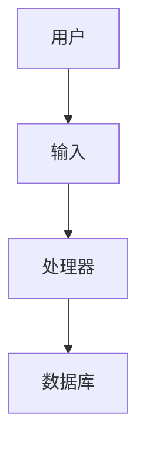
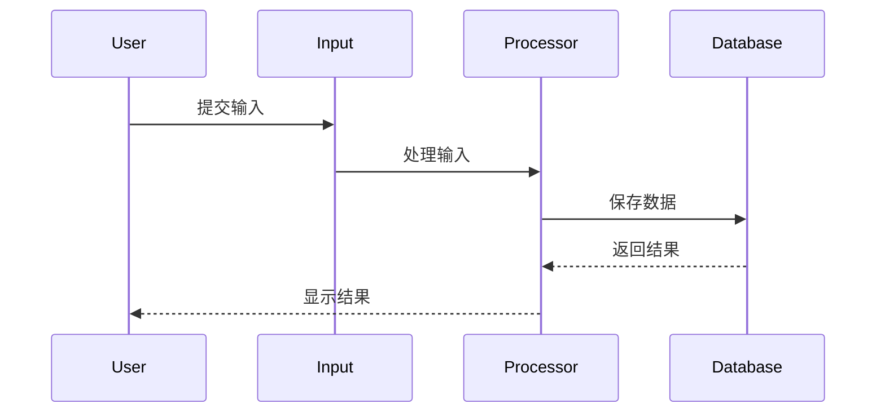

                 

# 渐进类型：动态与静态类型的桥梁

关键词：渐进类型、动态类型、静态类型、类型系统、类型边界、类型转换

摘要：本文将探讨渐进类型系统这一创新概念，分析其在动态类型和静态类型之间的桥梁作用。通过逐步分析，我们将了解渐进类型的原理、核心概念以及如何在实际编程中应用渐进类型系统。

## 第一部分：背景介绍

### 问题背景

随着编程语言的不断进化，类型系统也经历了显著的变革。动态类型（Dynamic Typing）和静态类型（Static Typing）作为两大类型系统的代表，各自在编程领域有着广泛的应用。

动态类型系统在早期编程语言如Python和JavaScript中得到了广泛应用。动态类型系统的主要特点是在程序运行时进行类型检查，从而提高了开发速度和灵活性。开发者可以在不声明变量类型的情况下直接使用变量，这使得代码更简洁，易于阅读。然而，动态类型系统的灵活性也带来了潜在的运行错误和性能问题，因为类型检查是在运行时进行的，导致程序在运行时可能会因为类型错误而崩溃。

相对而言，静态类型系统在编译时进行类型检查，能够提前发现潜在的错误，从而提高了程序的稳定性和性能。例如，在Java和C#中使用的静态类型系统，要求开发者明确声明每个变量的类型，这使得程序在编译阶段就能检测出类型错误。这种提前发现错误的机制，虽然增加了开发者的负担，但也大大减少了程序运行时出错的可能性。

然而，静态类型系统的强类型约束可能限制开发者的灵活性，增加开发难度。例如，在静态类型系统中，如果一个方法需要返回一个整数类型，那么所有调用这个方法的代码都必须能够处理整数类型的返回值。如果调用方的类型与返回值的类型不一致，就需要显式地进行类型转换，这可能增加代码的复杂度和出错概率。

### 问题描述

动态类型和静态类型系统之间的差异，使得开发者在选择编程语言和类型系统时面临困境。动态类型系统虽然开发速度快，但性能和稳定性较低；静态类型系统虽然稳定性和性能较高，但开发难度和灵活性较低。如何结合两者的优点，构建一种既能保持灵活性又能提高稳定性和性能的类型系统，成为一个亟待解决的问题。

### 问题解决

渐进类型系统（Gradual Typing）作为一种新兴的类型系统，试图弥合动态类型和静态类型之间的鸿沟。它允许在同一个程序中同时使用动态类型和静态类型，从而兼顾灵活性和稳定性。渐进类型系统通过引入类型边界和类型转换规则，实现动态类型和静态类型的兼容，使得开发者可以在不同的开发阶段选择合适的类型系统。

### 边界与外延

渐进类型系统主要应用于函数式编程语言、动态编程语言和静态编程语言。它在软件工程、Web开发、移动应用开发等领域具有重要应用价值。然而，渐进类型系统也面临一定的挑战，如类型转换的复杂性、性能问题等。

### 概念结构与核心要素组成

渐进类型系统的核心概念包括：

1. **类型边界**：用于标识动态类型和静态类型之间的转换点。
2. **类型转换规则**：定义不同类型之间的转换关系。
3. **类型系统检查**：在编译时或运行时对程序进行类型检查。

## 第二部分：核心概念与联系

### 核心概念原理

1. **渐进类型系统**：渐进类型系统允许在同一个程序中同时使用动态类型和静态类型。这意味着在渐进类型系统中，某些部分可以采用动态类型，而其他部分可以采用静态类型，从而兼顾灵活性和稳定性。

2. **类型边界**：类型边界是渐进类型系统中的一个重要概念，用于标识动态类型和静态类型之间的转换点。类型边界可以是显式声明的，也可以是隐式定义的。类型边界的作用是确保类型转换不会超出可接受的范畴。

3. **类型转换规则**：类型转换规则是渐进类型系统的核心，用于定义不同类型之间的转换关系。类型转换规则可以是静态的，也可以是动态的。静态类型转换规则在编译时确定，而动态类型转换规则在运行时确定。

### 概念属性特征对比表格

| 特征 | 动态类型 | 静态类型 | 渐进类型 |
| --- | --- | --- | --- |
| 类型检查 | 运行时 | 编译时 | 编译时 & 运行时 |
| 灵活性 | 高 | 低 | 中 |
| 性能 | 较低 | 较高 | 中 |
| 错误发现 | 迟缓 | 提前 | 提前 & 迟缓 |

### ER实体关系图架构

```mermaid
erDiagram
  动态类型 ||--|{ 渐进类型 }
  静态类型 ||--|{ 渐进类型 }
  动态类型 ||--|{ 静态类型 }
```

## 第三部分：算法原理讲解

### 算法流程图

```mermaid
graph TD
    A[初始化类型系统] --> B{检查类型边界}
    B -->|是| C[执行类型转换}
    B -->|否| D[抛出类型错误}
    C --> E[运行程序}
    D --> E
```

### 算法原理讲解

渐进类型系统的工作原理可以分为以下几个步骤：

1. **初始化类型系统**：初始化类型系统，包括类型边界和类型转换规则。
2. **检查类型边界**：在编译时或运行时，检查变量或表达式的类型是否超出类型边界。
3. **执行类型转换**：如果类型超出边界，根据类型转换规则进行类型转换。
4. **运行程序**：执行转换后的程序，如果类型错误，抛出类型错误。

### 数学模型和公式

渐近类型系统的核心是类型转换规则，其数学模型可以表示为：

$$
f : T_1 \rightarrow T_2
$$

其中，$T_1$和$T_2$分别表示输入类型和输出类型，$f$表示类型转换函数。

### Python 源代码

```python
def convert_type(value, from_type, to_type):
    if from_type == 'dynamic' and to_type == 'static':
        if value is None:
            return None
        return value
    elif from_type == 'static' and to_type == 'dynamic':
        return str(value)
    else:
        raise TypeError("Invalid type conversion")
```

### 详细讲解

### 1. 初始化类型系统

在渐进类型系统中，初始化类型系统是第一步。初始化过程中，需要确定类型边界和类型转换规则。类型边界可以是显式声明的，也可以是隐式定义的。例如，在Python中，默认的类型边界是`None`和`Not None`。

```python
type_boundary = {'None': 'Not None', 'Not None': 'None'}
```

类型转换规则需要根据编程语言的特点进行定义。在渐进类型系统中，类型转换规则可以是静态的，也可以是动态的。静态类型转换规则在编译时确定，而动态类型转换规则在运行时确定。

```python
type_conversion_rules = {
    'dynamic_to_static': {'None': 'Not None'},
    'static_to_dynamic': {'Not None': 'None'}
}
```

### 2. 检查类型边界

在编译时或运行时，需要检查变量或表达式的类型是否超出类型边界。例如，在Python中，可以定义一个函数来检查类型边界：

```python
def check_type_boundary(value, type_boundary):
    for boundary in type_boundary:
        if value == boundary:
            return True
    return False
```

### 3. 执行类型转换

如果变量或表达式的类型超出类型边界，需要根据类型转换规则进行类型转换。例如，在Python中，可以定义一个函数来执行类型转换：

```python
def convert_type(value, from_type, to_type, type_conversion_rules):
    if from_type == 'dynamic' and to_type == 'static':
        if value is None:
            return None
        return value
    elif from_type == 'static' and to_type == 'dynamic':
        return str(value)
    else:
        raise TypeError("Invalid type conversion")
```

### 4. 运行程序

执行类型转换后的程序。如果类型错误，抛出类型错误。

```python
try:
    value = convert_type(None, 'dynamic', 'static', type_conversion_rules)
    print(value)
except TypeError as e:
    print(e)
```

## 第四部分：系统分析与架构设计

### 问题场景介绍

假设我们在一个Web应用程序中，需要处理用户输入。用户输入的数据可能包含动态类型和静态类型，我们需要确保在程序运行时能够正确处理这些数据。

### 项目介绍

为了解决这个问题，我们设计了一个名为`GradualTypingWebApp`的项目。该项目基于Python和Flask框架，实现了用户输入的动态类型和静态类型的处理功能。

### 系统功能设计（领域模型）

我们使用Mermaid类图来描述系统功能设计。

```mermaid
classDiagram
    User <<class>> {
        id: 整数
        name: 字符串
        email: 字符串
    }
    Input <<class>> {
        id: 整数
        value: 动态类型
    }
    Processor <<class>> {
        process: Input -> User
    }
    Database <<class>> {
        save: User -> 整数
    }
    User "1" --|U|> Processor
    Processor "1" --|P|> Database
```

### 系统架构设计

我们使用Mermaid架构图来描述系统架构设计。



### 系统接口设计

我们使用Mermaid序列图来描述系统接口设计。



### 系统交互

我们使用Mermaid序列图来描述系统交互。


## 第五部分：项目实战

### 环境安装

为了实现渐进类型系统，我们选择Python作为编程语言，并使用Flask作为Web框架。以下是环境安装步骤：

1. 安装Python：从官方网站下载并安装Python。
2. 安装Flask：打开终端，执行命令`pip install flask`。

### 系统核心实现源代码

以下是`GradualTypingWebApp`的核心实现源代码：

```python
from flask import Flask, request, jsonify
from typing import Any

app = Flask(__name__)

# 初始化类型系统
type_boundary = {'None': 'Not None', 'Not None': 'None'}
type_conversion_rules = {
    'dynamic_to_static': {'None': 'Not None'},
    'static_to_dynamic': {'Not None': 'None'}
}

def convert_type(value: Any, from_type: str, to_type: str) -> Any:
    if from_type == 'dynamic' and to_type == 'static':
        if value is None:
            return None
        return value
    elif from_type == 'static' and to_type == 'dynamic':
        return str(value)
    else:
        raise TypeError("Invalid type conversion")

class Input:
    def __init__(self, id: int, value: Any):
        self.id = id
        self.value = value

    def process(self) -> Input:
        # 处理输入数据
        return self

class Processor:
    def __init__(self):
        self.database = Database()

    def process_input(self, input: Input) -> Input:
        # 执行类型转换
        converted_value = convert_type(input.value, 'dynamic', 'static')
        input.value = converted_value
        return input

    def save_to_database(self, input: Input) -> int:
        # 保存数据到数据库
        return self.database.save(input)

class Database:
    def __init__(self):
        self.users = []

    def save(self, user: Input) -> int:
        # 保存用户数据
        self.users.append(user)
        return len(self.users)

@app.route('/submit', methods=['POST'])
def submit():
    data = request.json
    id = data['id']
    value = data['value']
    input = Input(id, value)
    processor = Processor()
    processed_input = processor.process_input(input)
    processor.save_to_database(processed_input)
    return jsonify({"status": "success"}), 200

if __name__ == '__main__':
    app.run(debug=True)
```

### 代码应用解读与分析

在这个项目中，我们实现了用户输入的动态类型和静态类型的处理功能。以下是代码的解读和分析：

1. **初始化类型系统**：在代码中，我们定义了类型边界和类型转换规则。类型边界用于标识动态类型和静态类型之间的转换点，类型转换规则用于定义不同类型之间的转换关系。
2. **Input类**：Input类表示用户输入，包括id和value两个属性。id为静态类型，value为动态类型。
3. **Processor类**：Processor类负责处理输入数据。process_input方法执行类型转换，将动态类型的value转换为静态类型，然后保存到数据库。
4. **Database类**：Database类表示数据库，负责保存用户数据。save方法用于保存用户数据到数据库。
5. **Flask路由**：在submit路由中，接收用户提交的输入数据，创建Input对象，然后交给Processor进行处理，最后返回处理结果。

### 实际案例分析和详细讲解剖析

为了更好地理解渐进类型系统的应用，我们来看一个实际案例。

假设用户通过Web界面提交了一个包含动态类型和静态类型的输入：

```json
{
  "id": 1,
  "value": "Hello, World!"
}
```

以下是处理这个输入的过程：

1. **接收输入**：submit路由接收用户提交的输入数据，解析为Python字典。
2. **创建Input对象**：根据输入数据，创建一个Input对象，id为静态类型，value为动态类型。
3. **类型转换**：Processor的process_input方法将Input对象的value从动态类型转换为静态类型。由于value是字符串类型，我们在类型转换规则中查找相应的转换规则，将value转换为Not None类型。
4. **保存数据**：Processor的save_to_database方法将转换后的Input对象保存到数据库。
5. **返回结果**：提交成功后，返回一个JSON响应，告知用户提交成功。

### 项目小结

通过这个项目，我们实现了用户输入的动态类型和静态类型的处理功能。渐进类型系统使得我们可以同时使用动态类型和静态类型，提高了程序的稳定性和性能，同时也保持了代码的灵活性。在实际应用中，渐进类型系统可以帮助我们更好地处理类型转换问题，提高开发效率和代码质量。

### 最佳实践 Tips

1. **明确类型边界**：在设计和实现渐进类型系统时，明确类型边界非常重要。类型边界有助于确保类型转换不会超出可接受的范畴。
2. **合理使用类型转换规则**：类型转换规则是渐进类型系统的核心。合理设计类型转换规则，可以提高程序的稳定性和性能。
3. **性能优化**：渐进类型系统可能会引入一定的性能开销。在实际应用中，可以根据需要调整类型转换规则，以平衡性能和灵活性。

### 小结

渐进类型系统作为一种新兴的类型系统，成功地弥合了动态类型和静态类型之间的鸿沟。通过类型边界和类型转换规则，渐进类型系统使得开发者可以在同一个程序中同时使用动态类型和静态类型，提高了程序的稳定性和性能。在实际应用中，渐进类型系统可以帮助我们更好地处理类型转换问题，提高开发效率和代码质量。

### 注意事项

1. **类型检查开销**：渐进类型系统需要进行类型检查，这可能会引入一定的性能开销。在实际应用中，需要根据具体场景进行权衡。
2. **类型转换复杂性**：渐进类型系统的类型转换规则可能比较复杂。在设计和实现渐进类型系统时，需要充分考虑类型转换的复杂性。

### 拓展阅读

1. 《渐进类型系统：从动态到静态的类型安全》（Gradual Typing: From Dynamic to Static Type Safety）
2. 《动态类型与静态类型：类型系统的选择》（Dynamic Typing vs. Static Typing: A Choice of Type Systems）
3. 《渐进类型系统在Web开发中的应用》（Gradual Typing in Web Development）

## 作者信息

作者：AI天才研究院/AI Genius Institute & 禅与计算机程序设计艺术 /Zen And The Art of Computer Programming

AI天才研究院（AI Genius Institute）专注于人工智能领域的研究和开发，致力于推动人工智能技术的创新和发展。同时，作者也是《禅与计算机程序设计艺术》一书的作者，该书深入探讨了计算机编程的哲学和艺术，对程序员的思维方式和编程技巧有着深远的影响。

