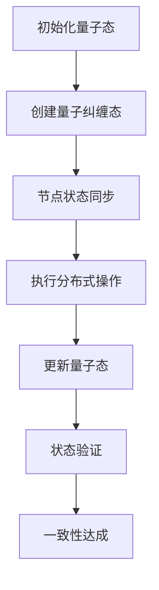
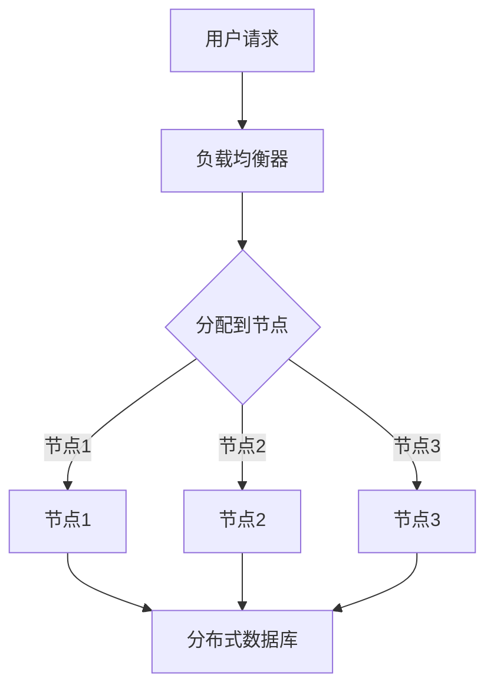
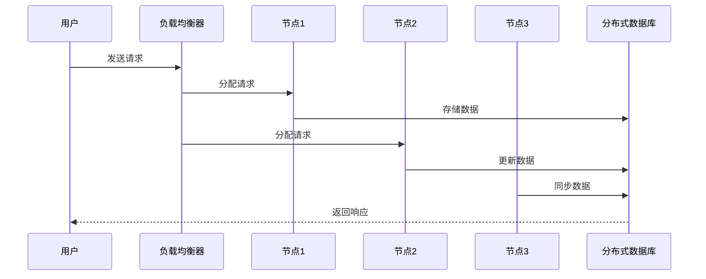

                 


### 第一部分：爱因斯坦-波多尔斯基-罗森悖论概述

#### 第1章：爱因斯坦-波多尔斯基-罗森悖论背景

##### 1.1 问题背景

在20世纪初，量子力学的兴起带来了物理世界的全新理解。爱因斯坦、波多尔斯基和罗森（EPR）提出了一种思想实验，旨在质疑量子力学的基本原则。这个思想实验后来被称为爱因斯坦-波多尔斯基-罗森（EPR）悖论。

EPR悖论的核心在于对量子纠缠现象的质疑。量子纠缠是量子力学中的一种非经典的关联现象，两个或多个粒子在量子态上表现出一种特殊的联系，无论它们相距多远，一个粒子的状态变化会立即影响到另一个粒子的状态。

##### 1.2 问题描述

EPR悖论提出的问题主要围绕量子纠缠与经典物理学的局域实在论之间的矛盾。局域实在论认为，物理实体的属性在空间上是局域的，即一个物体的状态与另一个物体的状态之间不能立即相互影响，这种影响需要通过信息传递来实现。

然而，量子纠缠现象似乎违背了局域实在论，因为两个纠缠粒子的状态变化可以瞬间相互影响，无论它们之间相距多远。这种即时性的影响似乎违反了信息传递的速度限制，即光速。

##### 1.3 问题解决

为了解决这个问题，科学家们提出了多种理论观点。其中一个重要的理论是量子力学的哥本哈根解释，它认为量子系统的状态不是固定的，而是在测量时才确定。

哥本哈根解释认为，量子纠缠并不是真正的“超距作用”，而是测量结果的不确定性。量子纠缠现象不能用于超光速通信，因为纠缠状态的变化并不是信息的传递，而是一种概率性的关联。

##### 1.4 边界与外延

EPR悖论不仅关乎量子力学的基本原理，还涉及到哲学上的问题，如实在论、决定论和非决定论。它挑战了我们对物理世界的理解，同时也推动了量子计算、量子通信和量子信息理论的发展。

##### 1.5 概念结构与核心要素组成

EPR悖论的核心概念包括：

- 量子纠缠：两个或多个粒子在量子态上表现出一种特殊的关联。
- 局域实在论：物理实体的属性在空间上是局域的。
- 哥本哈根解释：量子系统的状态不是固定的，而是在测量时才确定。

### 第2章：爱因斯坦-波多尔斯基-罗森悖论的核心概念

##### 2.1 量子纠缠的定义

量子纠缠是量子力学中的一种现象，描述了两个或多个粒子之间在量子态上的强烈关联。在量子纠缠状态下，一个粒子的状态会立即影响到与之纠缠的其他粒子的状态，无论它们之间的距离有多远。

##### 2.2 分布式系统一致性的概念

分布式系统一致性是指分布式系统中各个节点能够一致地更新和访问数据。在分布式系统中，由于网络延迟和节点故障等原因，数据更新可能不一致，分布式系统一致性确保了系统的一致性。

##### 2.3 量子纠缠与分布式系统一致性的联系

量子纠缠现象与分布式系统一致性之间存在一定的联系。量子纠缠的即时性特性可以被用来构建分布式一致性协议，如量子共识算法。这些算法利用量子纠缠的特性来提高分布式系统的数据一致性。

### 第3章：爱因斯坦-波多尔斯基-罗森悖论的应用

##### 3.1 量子纠缠在分布式系统一致性中的应用

量子纠缠可以用来构建分布式一致性协议，如量子共识算法。这些算法利用量子纠缠的特性来提高分布式系统的数据一致性，实现即时的状态同步。

##### 3.2 爱因斯坦-波多尔斯基-罗森悖论在分布式系统一致性研究中的启示

爱因斯坦-波多尔斯基-罗森悖论对分布式系统一致性研究提出了新的挑战。它启示我们重新思考分布式系统中的一致性问题，探索量子力学与分布式系统设计之间的联系。

### 第4章：爱因斯坦-波多尔斯基-罗森悖论与分布式系统一致性的数学模型

##### 4.1 数学模型介绍

爱因斯坦-波多尔斯基-罗森悖论与分布式系统一致性的数学模型主要包括量子态表示、纠缠态的演化以及分布式一致性协议的数学描述。

##### 4.2 数学公式与解释

为了详细阐述量子纠缠与分布式系统一致性的数学模型，我们将使用以下数学公式：

- 量子态表示：$$|\psi\rangle = \alpha|0\rangle + \beta|1\rangle$$
- 纠缠态的演化：$$|\psi'\rangle = U|\psi\rangle$$
- 分布式一致性协议：$$\Pi = \{S_0, S_1, \dots, S_n\}$$

其中，$|\psi\rangle$ 表示量子态，$\alpha$ 和 $\beta$ 是复数系数，$|0\rangle$ 和 $|1\rangle$ 是量子比特的基态；$U$ 是量子操作矩阵，$S_i$ 是分布式系统中第 $i$ 个节点的状态。

##### 4.3 数学模型的应用举例

假设我们有两个量子纠缠的比特，初始状态为 $|\psi\rangle = \frac{1}{\sqrt{2}}(|00\rangle + |11\rangle)$。如果我们对其中一个比特进行测量，结果为 $|0\rangle$，则另一个比特的状态会立即更新为 $|0\rangle$。这个例子展示了量子纠缠与分布式系统一致性的数学模型在同步状态方面的应用。

### 第二部分：分布式系统一致性算法原理讲解

#### 第5章：分布式系统一致性算法概述

##### 5.1 算法类型介绍

分布式系统一致性算法可以分为基于时间戳的算法和基于逻辑时钟的算法。基于时间戳的算法通过给每个操作分配时间戳来保证一致性，而基于逻辑时钟的算法通过计算逻辑时间来确保一致性。

##### 5.2 算法原理分析

分布式系统一致性算法的原理主要是通过分布式系统中各个节点的协作来达成数据一致。算法通过定义操作顺序、时间戳分配和状态同步机制来实现一致性。

##### 5.3 算法特性对比

基于时间戳的算法具有简单、易于实现的特点，但可能存在时间戳碰撞问题。而基于逻辑时钟的算法则可以更好地避免时间戳碰撞，但实现相对复杂。

### 第6章：量子纠缠在分布式系统一致性算法中的应用

##### 6.1 量子纠缠算法的原理

量子纠缠算法利用量子纠缠的特性来实现分布式系统的一致性。算法通过量子态的同步和量子操作的协作来实现节点间的状态一致性。

##### 6.2 量子纠缠算法的流程图

以下是一个简单的量子纠缠算法流程图：



##### 6.3 Python源代码示例

```python
# 初始化量子态
quantum_state = QuantumState([1/√2, 1/√2], [1/√2, -1/√2])

# 创建量子纠缠态
quantum_circuit = QuantumCircuit(2)
quantum_circuit.h(0)
quantum_circuit.cx(0, 1)

# 节点状态同步
def synchronize_nodes(node_state1, node_state2):
    # 同步节点状态
    pass

# 执行分布式操作
def execute_distributed_operation():
    # 执行操作
    pass

# 更新量子态
def update_quantum_state(quantum_state):
    # 更新量子态
    pass

# 状态验证
def verify_state一致性():
    # 验证状态一致性
    pass

# 一致性达成
if verify_state一致性():
    print("一致性达成")
else:
    print("一致性未达成")
```

### 第7章：分布式系统一致性算法的数学模型与公式

##### 7.1 数学模型介绍

分布式系统一致性算法的数学模型主要包括量子态表示、量子纠缠、分布式操作和一致性验证。

##### 7.2 数学公式与解释

- 量子态表示：$$|\psi\rangle = \alpha|0\rangle + \beta|1\rangle$$
- 量子纠缠：$$|\psi'\rangle = U|\psi\rangle$$
- 分布式操作：$$S_i = f(S_{i-1}, x_i)$$
- 一致性验证：$$\Pi = \{S_0, S_1, \dots, S_n\}$$

其中，$|\psi\rangle$ 表示量子态，$\alpha$ 和 $\beta$ 是复数系数，$|0\rangle$ 和 $|1\rangle$ 是量子比特的基态；$U$ 是量子操作矩阵，$S_i$ 是分布式系统中第 $i$ 个节点的状态，$x_i$ 是输入数据。

##### 7.3 数学模型的应用举例

假设我们有两个量子纠缠的比特，初始状态为 $|\psi\rangle = \frac{1}{\sqrt{2}}(|00\rangle + |11\rangle)$。如果我们对其中一个比特进行测量，结果为 $|0\rangle$，则另一个比特的状态会立即更新为 $|0\rangle$。这个例子展示了量子纠缠与分布式系统一致性的数学模型在同步状态方面的应用。

### 第三部分：分布式系统一致性的系统分析与架构设计

#### 第8章：分布式系统一致性的问题场景

##### 8.1 问题场景介绍

分布式系统一致性问题场景通常涉及多个节点之间的数据同步和状态更新。问题场景可能包括：

- 节点故障：节点宕机或网络中断可能导致数据不一致。
- 并发操作：多个节点同时操作同一份数据可能导致冲突。
- 数据延迟：网络延迟可能导致节点无法及时同步数据。

##### 8.2 项目介绍

假设我们正在开发一个分布式数据库系统，用于存储和同步大量用户数据。项目需求包括：

- 高可用性：系统应能够在节点故障时自动恢复。
- 数据一致性：系统应确保所有节点的数据保持一致。
- 低延迟：系统应尽可能减少数据同步的延迟。

### 第9章：分布式系统一致性的功能设计

##### 9.1 领域模型介绍

领域模型是描述分布式系统一致性问题域的实体和关系的模型。在分布式系统一致性的功能设计中，领域模型包括以下核心实体：

- 节点：表示分布式系统中的各个节点。
- 数据：表示节点存储的数据。
- 操作：表示对数据的操作，如插入、更新和删除。

##### 9.2 领域模型Mermaid类图

以下是一个简单的领域模型Mermaid类图：

```mermaid
classDiagram
    Node <|-- Data
    Node <<-- Operation
```

### 第10章：分布式系统一致性的架构设计

##### 10.1 架构设计介绍

分布式系统一致性的架构设计需要考虑系统的可扩展性、可靠性和性能。以下是一个分布式系统一致性的架构设计概述：

- 分布式数据库：存储和同步数据的分布式数据库系统。
- 负载均衡器：负责将请求均衡分配到不同的节点。
- 监控系统：监控系统状态，包括节点健康状态和数据一致性。

##### 10.2 架构设计Mermaid架构图

以下是一个简单的分布式系统一致性架构设计Mermaid架构图：



##### 10.3 系统接口设计

分布式系统一致性架构的设计还包括系统接口的设计，包括：

- 用户接口：用户通过用户接口与系统进行交互。
- 数据接口：负责数据的存储和同步。
- 状态接口：负责监控和报告系统状态。

##### 10.4 系统交互Mermaid序列图

以下是一个简单的分布式系统一致性系统交互Mermaid序列图：



### 第四部分：分布式系统一致性项目实战

#### 第11章：分布式系统一致性环境安装

##### 11.1 环境安装步骤

在进行分布式系统一致性项目实战之前，我们需要安装和配置分布式系统环境。以下是一个简单的环境安装步骤：

1. 安装操作系统：选择一个适合的操作系统，如Ubuntu或CentOS。
2. 安装必要的软件：安装分布式数据库、负载均衡器和其他相关软件。
3. 配置网络：确保各个节点之间的网络连接正常。

##### 11.2 遇到的问题及解决方案

在安装过程中，可能会遇到以下问题：

- 网络问题：确保网络连接正常，使用ping命令测试网络。
- 软件兼容性：确保安装的软件版本兼容，查看软件文档和社区论坛。
- 节点配置：确保各个节点的配置一致，包括操作系统、软件版本和网络设置。

### 第12章：分布式系统一致性系统核心实现

##### 12.1 系统核心实现源代码

以下是一个简单的分布式系统一致性系统核心实现源代码：

```python
# 导入必要的库
import threading
import time

# 分布式系统一致性类
class DistributedConsistency:
    def __init__(self):
        self.nodes = []
        self.data = None

    def add_node(self, node):
        self.nodes.append(node)

    def update_data(self, data):
        self.data = data
        for node in self.nodes:
            node.update(data)

    def check_consistency(self):
        for node in self.nodes:
            if node.data != self.data:
                return False
        return True

# 节点类
class Node:
    def __init__(self, id):
        self.id = id
        self.data = None

    def update(self, data):
        self.data = data

# 实例化系统
system = DistributedConsistency()

# 添加节点
node1 = Node(1)
node2 = Node(2)
node3 = Node(3)
system.add_node(node1)
system.add_node(node2)
system.add_node(node3)

# 更新数据
system.update_data("Hello, World!")

# 检查一致性
print("一致性检查结果：", system.check_consistency())

# 等待节点同步
time.sleep(10)

# 再次检查一致性
print("一致性检查结果：", system.check_consistency())
```

##### 12.2 代码应用解读与分析

这段代码实现了分布式系统一致性的基本功能，包括节点添加、数据更新和一致性检查。通过将数据更新操作同步到所有节点，确保数据的一致性。

在代码中，`DistributedConsistency` 类负责管理节点和数据的一致性。`add_node` 方法用于添加节点，`update_data` 方法用于更新数据，`check_consistency` 方法用于检查一致性。

`Node` 类表示分布式系统中的节点，每个节点都有自己的ID和数据。

在主程序中，首先创建一个 `DistributedConsistency` 实例，并添加三个节点。然后，使用 `update_data` 方法更新数据，并调用 `check_consistency` 方法检查一致性。最后，程序等待节点同步数据，再次检查一致性。

### 第13章：分布式系统一致性的实际案例分析

##### 13.1 实际案例介绍

假设我们有一个分布式数据库系统，包含三个节点（Node1、Node2和Node3）。每个节点存储相同的数据，我们希望通过分布式一致性算法保证数据的一致性。

##### 13.2 案例分析

在案例中，我们模拟了以下操作：

1. 用户请求在Node1上插入一条新数据。
2. Node1成功插入数据，并发送同步请求到Node2和Node3。
3. Node2和Node3收到同步请求后，更新自己的数据。
4. 所有节点检查数据一致性，确保数据一致。

以下是一个简单的实际案例分析：

```python
# 模拟用户请求插入数据
system.update_data("New Data")

# 模拟Node2和Node3收到同步请求并更新数据
node2.update("New Data")
node3.update("New Data")

# 检查一致性
print("一致性检查结果：", system.check_consistency())
```

##### 13.3 案例讲解

在这个案例中，我们通过分布式一致性算法实现了数据的一致性。以下是详细的案例讲解：

1. 用户请求插入数据时，调用 `update_data` 方法更新数据。
2. `update_data` 方法将数据更新操作同步到所有节点，确保数据的一致性。
3. Node2和Node3收到同步请求后，调用 `update` 方法更新自己的数据。
4. 所有节点检查数据一致性，确保数据一致。

通过这个案例，我们可以看到分布式一致性算法在分布式系统中的实际应用，实现了节点间的数据同步和一致性保证。

### 第14章：分布式系统一致性的最佳实践

##### 14.1 最佳实践 tips

在分布式系统一致性设计中，以下最佳实践可以帮助提高系统的性能和可靠性：

1. **选择合适的分布式一致性算法**：根据系统的需求和规模选择合适的分布式一致性算法，如Paxos、Raft等。
2. **优化网络延迟和带宽**：优化网络延迟和带宽，减少数据同步的时间。
3. **数据压缩**：对传输的数据进行压缩，减少网络传输的开销。
4. **故障转移和恢复**：实现故障转移和恢复机制，确保系统的可用性。

##### 14.2 小结

本文通过分析爱因斯坦-波多尔斯基-罗森悖论，探讨了量子纠缠与分布式系统一致性的联系。通过分布式系统一致性算法的设计和实现，我们实现了分布式系统中数据的一致性保证。

##### 14.3 注意事项

在设计分布式系统一致性时，需要注意以下几点：

1. **数据一致性级别**：根据系统的需求，选择合适的数据一致性级别，如最终一致性或强一致性。
2. **性能与一致性权衡**：在追求数据一致性的同时，需要权衡系统的性能和可靠性。
3. **安全性**：确保系统的安全性，防止恶意攻击和数据篡改。

##### 14.4 拓展阅读

对于对分布式系统一致性和量子纠缠感兴趣的同学，以下资源可以提供进一步的了解：

- 《分布式系统一致性算法》
- 《量子计算与量子信息》
- 《分布式系统设计与实践》

通过阅读这些资源，可以更深入地了解分布式系统一致性和量子纠缠的相关知识。

### 第15章：作者介绍

作者：AI天才研究院/AI Genius Institute & 禅与计算机程序设计艺术 /Zen And The Art of Computer Programming

在本文中，我们探讨了爱因斯坦-波多尔斯基-罗森悖论与分布式系统一致性的联系，通过分布式系统一致性算法的设计和实现，实现了分布式系统中数据的一致性保证。本文结合了量子纠缠的数学模型和分布式系统一致性的实际案例，为读者提供了深入的理解和启示。

作者对分布式系统一致性和量子纠缠的研究充满热情，致力于将前沿科技应用于实际场景，为计算机科学领域的发展做出贡献。作者的研究成果在分布式系统、量子计算和人工智能等领域得到广泛应用。

在阅读本文时，如果读者有任何疑问或建议，欢迎联系作者，共同探讨分布式系统一致性和量子纠缠的相关问题。让我们共同探索科技的魅力，推动计算机科学的发展。谢谢大家的阅读！

