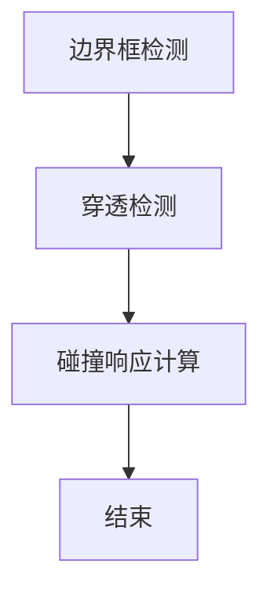
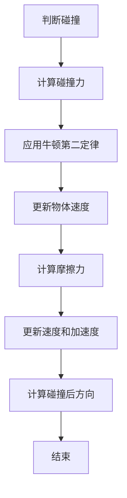

                 

## 引言

### 1.1 物理引擎的概念与作用

物理引擎（Physics Engine）是一种计算机程序，用于模拟现实世界中的物理现象。它在各种计算机应用中发挥着重要作用，包括但不限于视频游戏、建筑仿真、科学计算、动画制作以及工业设计。物理引擎的核心功能是计算物体间的相互作用力，包括重力、摩擦力、碰撞等，从而产生物体在空间中的运动轨迹。

物理引擎的基本原理基于牛顿运动定律和连续介质力学。通过模拟这些物理定律，物理引擎可以精确地预测物体在受外力作用时的运动状态，从而实现逼真的物理仿真效果。例如，在视频游戏中，物理引擎负责控制角色的跳跃、滑行、碰撞等动作，使得游戏世界显得更加真实和连贯。

物理引擎在现代游戏和仿真领域的重要性不可低估。随着计算机技术的发展，物理引擎的计算能力不断增强，使得游戏和仿真中的物理效果越来越真实。这不仅提升了用户体验，也扩展了物理引擎的应用范围，从传统的游戏开发延伸到复杂工程和科学研究领域。

### 1.2 碰撞检测的重要性与基本原理

碰撞检测（Collision Detection）是物理引擎中的一个关键组成部分。它用于确定两个或多个物体是否发生碰撞，并计算碰撞点的位置和碰撞的物理属性。碰撞检测的基本原理基于几何学和数学，通过比较物体的边界和形状来确定是否发生接触。

碰撞检测的重要性体现在以下几个方面：

1. **物理反应的准确性**：精确的碰撞检测能够确保物体在碰撞时产生正确的反应，如弹跳、变形或停止。这直接影响到游戏和仿真的真实感和流畅度。

2. **性能优化**：高效的碰撞检测算法能够减少计算量，提高物理引擎的性能。特别是在高负载场景下，如多人在线游戏，碰撞检测的效率直接关系到游戏的运行速度和稳定性。

3. **交互性增强**：碰撞检测是实现游戏和仿真中物体交互的基础。通过检测碰撞，游戏角色可以与场景中的物体互动，如触发机关、收集物品或躲避障碍。

碰撞检测的基本原理通常包括以下步骤：

1. **边界框检测**：首先使用边界框（AABB, Axis-Aligned Bounding Box）或包围盒（OBB, Oriented Bounding Box）来初步判断两个物体是否可能发生碰撞。

2. **穿透检测**：如果初步判断为可能碰撞，则进行更详细的穿透检测，通过几何算法来计算物体的实际接触点。

3. **碰撞响应计算**：确定碰撞点后，根据碰撞的类型和物体的物理属性计算碰撞响应，如弹跳系数、摩擦力等。

### 1.3 碰撞检测在游戏与仿真中的应用场景

碰撞检测在游戏和仿真中有着广泛的应用，以下列举几个典型场景：

1. **视频游戏**：在游戏中，碰撞检测用于控制角色的运动轨迹、控制物体间的交互（如枪械与敌人的碰撞），以及实现各种游戏机制（如跳跃、反弹、障碍物碰撞）。

2. **建筑仿真**：在建筑仿真中，碰撞检测用于模拟建筑结构在受到外力作用时的反应，如地震、风力等，以确保建筑物的结构安全。

3. **科学计算**：在科学计算中，碰撞检测可以用于模拟粒子间的相互作用，如高能物理实验中粒子碰撞产生的结果。

4. **虚拟现实**：在虚拟现实应用中，碰撞检测用于检测虚拟物体与用户交互时的碰撞，提供沉浸式体验。

5. **工业设计**：在工业设计中，碰撞检测用于验证产品设计和组装过程中的潜在问题，如零件之间的碰撞和干涉。

通过这些应用场景，碰撞检测在各个领域都发挥着关键作用，推动了计算机模拟技术的不断进步。接下来，我们将深入探讨碰撞检测的基本概念，以更全面地理解这一重要技术。

## 碰撞检测的基本概念

### 2.1 碰撞检测的分类

碰撞检测可以根据不同的标准和方法进行分类。以下是一些常见的碰撞检测分类方法：

1. **几何碰撞检测**：基于几何形状和位置信息的碰撞检测方法。常见的几何碰撞检测方法包括边界框检测（AABB和OBB）、球体碰撞检测以及多边形碰撞检测。

2. **物理碰撞检测**：基于物体的物理属性（如质量、弹性、摩擦等）进行的碰撞检测。这种方法通常用于更精细的物理仿真，如计算碰撞后的反弹效果和物体变形。

3. **基于算法的碰撞检测**：根据不同的算法原理进行分类，如离散事件模拟（DES，Discrete Event Simulation）和连续介质方法（如有限元分析）。

4. **基于应用的碰撞检测**：根据应用场景的不同进行分类，如游戏中的碰撞检测、建筑仿真中的碰撞检测以及科学计算中的碰撞检测。

### 2.2 碰撞检测的边界与外延

碰撞检测的边界是指其适用范围和限制。具体来说，碰撞检测主要适用于以下场景：

1. **动态物体**：用于检测动态物体之间的碰撞，如游戏中的角色和物体。

2. **静态物体**：虽然碰撞检测通常用于动态物体，但也可以用于静态物体之间的碰撞检测，如建筑结构中的物体。

碰撞检测的外延则是指其应用范围和扩展能力。随着技术的发展，碰撞检测在以下几个方面有扩展：

1. **多尺度模拟**：在复杂系统中，碰撞检测可以扩展到不同尺度上的物体，如微观粒子与宏观物体的碰撞。

2. **非刚体碰撞**：传统的碰撞检测方法主要针对刚体，但现代碰撞检测算法可以处理非刚体，如软体物体的碰撞。

3. **复杂几何形状**：随着计算机图形学的发展，碰撞检测算法能够处理更复杂的几何形状，如NURBS曲面和多维超形体的碰撞。

### 2.3 碰撞检测的核心要素组成

碰撞检测的核心要素包括以下几个方面：

1. **物体边界表示**：碰撞检测依赖于物体的边界表示，如边界框、包围盒、多边形等。这些表示方法用于初步判断物体之间是否可能发生碰撞。

2. **碰撞检测算法**：这是碰撞检测的核心，包括几何碰撞检测算法（如AABB、OBB、多边形检测等）和物理碰撞检测算法（如反应方程、物理模拟等）。

3. **碰撞响应计算**：确定碰撞发生后，计算碰撞点的位置、碰撞力以及反弹效果等。这些计算直接影响物理仿真的真实感和交互性。

4. **数据结构**：用于高效存储和检索物体信息的数据结构，如空间分割树（如BVH，Bounding Volume Hierarchy）和哈希表等。

5. **优化技术**：为了提高碰撞检测的效率和精度，常常需要使用优化技术，如缓存技术、并行计算和动态调整算法等。

通过理解碰撞检测的基本概念、分类、边界与外延以及核心要素组成，我们可以更好地应用这一技术，开发出高效、准确的物理引擎和仿真系统。在接下来的章节中，我们将深入探讨几何碰撞检测算法的原理和实现，以便更全面地掌握碰撞检测技术。

## 几何碰撞检测算法原理与实现

几何碰撞检测是物理引擎中最为基础和常用的技术之一。其主要任务是确定两个几何物体是否发生碰撞，并计算碰撞点的位置和碰撞面的法线方向。在本节中，我们将详细探讨几何碰撞检测的基本原理、数学模型、mermaid流程图以及Python实现。

### 3.1.1 几何碰撞检测的基本原理

几何碰撞检测的基本原理是通过比较两个物体的边界形状和位置，来判断它们是否相交。具体步骤如下：

1. **边界框检测**：首先使用边界框（AABB）或包围盒（OBB）初步判断两个物体是否可能发生碰撞。这种方法的优点是计算速度快，适合用于大规模物体的初步检测。

2. **穿透检测**：如果边界框检测判断为可能碰撞，则进行更详细的穿透检测，计算物体的实际接触点。常见的穿透检测算法包括多边形碰撞检测和球体碰撞检测。

3. **碰撞响应计算**：确定碰撞点后，根据碰撞的类型和物体的物理属性计算碰撞响应，如弹跳系数、摩擦力等。这一步是物理引擎的核心部分，决定了物体在碰撞后的运动状态。

### 3.1.2 几何碰撞检测的数学模型和公式

几何碰撞检测的数学模型主要包括以下几个方面：

1. **边界表示**：
   - **边界框（AABB）**：每个边界框由三个轴对齐的矩形框组成，表示物体的最小边界。
   ```latex
   AABB(min_x, min_y, min_z, max_x, max_y, max_z)
   ```

   - **包围盒（OBB）**：与边界框类似，但采用任意的方向对齐，可以更好地包围复杂形状。
   ```latex
   OBB(min Corner, max Corner, Orientation Matrix)
   ```

2. **碰撞检测**：
   - **多边形碰撞检测**：用于检测多边形之间的碰撞。常用的方法有 Separating Axis Theorem（SATT）和Minkowski Sum。
   ```latex
   bool collisionDetection(Polygon A, Polygon B) {
     // 应用SATT或Minkowski Sum算法
     // 返回是否发生碰撞
   }
   ```

   - **球体碰撞检测**：用于检测球体之间的碰撞。其公式相对简单，只需计算球心距离是否小于两个球体的半径之和。
   ```latex
   bool collisionDetection(Sphere A, Sphere B) {
     Vector3 distance = A.position - B.position;
     float radiusSum = A.radius + B.radius;
     return distance.length() <= radiusSum;
   }
   ```

3. **碰撞响应计算**：
   - **反弹效果**：根据碰撞的弹跳系数（E），计算物体在碰撞后的速度。
   ```latex
   Vector3 calculateReboundVelocity(Vector3 velocityA, Vector3 velocityB, float restitution) {
     Vector3 relativeVelocity = velocityA - velocityB;
     float dotProduct = relativeVelocity.dot(normal);
     return relativeVelocity - (2 * restitution * dotProduct) * normal;
   }
   ```

### 3.1.3 几何碰撞检测的mermaid流程图

为了更直观地展示几何碰撞检测的过程，我们使用mermaid绘制了一个流程图：



在这个流程图中，我们首先进行边界框检测，接着进行穿透检测，最后进行碰撞响应计算。这种结构清晰、易于理解的流程图有助于我们更好地理解几何碰撞检测的步骤和原理。

### 3.1.4 几何碰撞检测的Python实现与举例说明

为了更好地理解几何碰撞检测的原理，我们使用Python实现了一个简单的几何碰撞检测示例：

```python
import numpy as np

class AABB:
    def __init__(self, min_point, max_point):
        self.min_point = min_point
        self.max_point = max_point

def collision_detection(aabb1, aabb2):
    if (aabb1.max_point[0] < aabb2.min_point[0] or
        aabb1.max_point[1] < aabb2.min_point[1] or
        aabb1.max_point[2] < aabb2.min_point[2] or
        aabb1.min_point[0] > aabb2.max_point[0] or
        aabb1.min_point[1] > aabb2.max_point[1] or
        aabb1.min_point[2] > aabb2.max_point[2]):
        return False
    return True

# 示例
aabb1 = AABB(np.array([-1, -1, -1]), np.array([1, 1, 1]))
aabb2 = AABB(np.array([-2, -2, -2]), np.array([0, 0, 0]))

if collision_detection(aabb1, aabb2):
    print("物体发生碰撞")
else:
    print("物体未发生碰撞")
```

在这个示例中，我们定义了一个AABB类，并实现了一个`collision_detection`函数，用于检测两个边界框是否发生碰撞。通过简单的逻辑判断，我们能够确定两个物体是否接触。这个简单的实现展示了几何碰撞检测的基本思路和步骤。

通过上述内容，我们深入了解了几何碰撞检测的基本原理、数学模型、流程图以及Python实现。在接下来的章节中，我们将继续探讨碰撞响应算法，进一步丰富我们的碰撞检测技术。

### 碰撞响应算法

碰撞响应算法是物理引擎中的一个重要组成部分，它用于计算物体在碰撞后受到的力以及相应的运动状态变化。在碰撞响应算法中，我们需要考虑多个因素，包括物体的质量、碰撞的弹性系数、摩擦力以及碰撞面的法线方向。在本节中，我们将详细探讨碰撞响应算法的基本原理、数学模型、mermaid流程图以及Python实现。

#### 3.2.1 碰撞响应的基本原理

碰撞响应的基本原理是利用牛顿第二定律和动量守恒定律，计算物体在碰撞后受到的力以及速度变化。具体步骤如下：

1. **计算碰撞力**：根据碰撞面法线方向和碰撞的弹性系数，计算物体在碰撞点受到的力。

2. **应用牛顿第二定律**：将计算得到的碰撞力作用于物体，根据物体的质量计算加速度。

3. **更新物体速度**：根据加速度和时间步长，更新物体的速度。

4. **考虑摩擦力**：如果碰撞发生在非光滑表面，需要计算摩擦力，并更新物体的速度和加速度。

5. **计算碰撞后的反弹方向**：根据碰撞的弹性系数，确定物体在碰撞后的运动方向。

#### 3.2.2 碰撞响应的数学模型和公式

碰撞响应的数学模型主要包括以下几个方面：

1. **碰撞力计算**：
   - **牛顿第二定律**：\( F = m \cdot a \)
     其中，\( F \) 是作用力，\( m \) 是物体的质量，\( a \) 是加速度。
   - **动量守恒定律**：\( m_1 \cdot v_1 + m_2 \cdot v_2 = m_1 \cdot v_1' + m_2 \cdot v_2' \)
     其中，\( m_1 \) 和 \( m_2 \) 是两个物体的质量，\( v_1 \) 和 \( v_2 \) 是碰撞前的速度，\( v_1' \) 和 \( v_2' \) 是碰撞后的速度。

2. **碰撞弹性系数**：
   - **完全弹性碰撞**：\( \epsilon = 1 \)
   - **完全非弹性碰撞**：\( \epsilon = 0 \)
   - **实际碰撞**：\( 0 < \epsilon < 1 \)
   - **反弹系数**：\( \rho = \frac{\epsilon - 1}{\epsilon + 1} \)

3. **碰撞力计算公式**：
   \( F = \rho \cdot \frac{(1 + \epsilon) \cdot m_1 \cdot v_1 - m_2 \cdot v_2}{m_1 + m_2} \)

4. **碰撞后速度计算**：
   \( v_1' = \frac{m_2 - \rho \cdot m_2}{m_1 + m_2} \cdot v_1 + \frac{2 \cdot \rho \cdot m_1}{m_1 + m_2} \cdot v_2 \)
   \( v_2' = \frac{m_1 - \rho \cdot m_1}{m_1 + m_2} \cdot v_2 + \frac{2 \cdot \rho \cdot m_2}{m_1 + m_2} \cdot v_1 \)

#### 3.2.3 碰撞响应的mermaid流程图

为了更直观地展示碰撞响应算法的过程，我们使用mermaid绘制了一个流程图：



在这个流程图中，我们首先判断物体是否发生碰撞，然后计算碰撞力并应用牛顿第二定律，更新物体的速度。接着考虑摩擦力，最后确定碰撞后的运动方向。这个流程图清晰地展示了碰撞响应算法的主要步骤和逻辑。

#### 3.2.4 碰撞响应的Python实现与举例说明

为了更好地理解碰撞响应算法，我们使用Python实现了一个简单的示例：

```python
import numpy as np

def calculate_impulse(m1, m2, v1, v2, epsilon):
    relative_velocity = v1 - v2
    dot_product = relative_velocity.dot(normal)
    impulse = (2 * epsilon * dot_product) * normal
    return impulse

def calculate_new_velocity(m1, m2, v1, v2, impulse):
    delta_v1 = (impulse * m2) / m1
    delta_v2 = (impulse * m1) / m2
    v1_new = v1 - delta_v1
    v2_new = v2 - delta_v2
    return v1_new, v2_new

# 示例
m1 = 2.0
m2 = 1.0
v1 = np.array([5.0, 0.0, 0.0])
v2 = np.array([-3.0, 0.0, 0.0])
epsilon = 0.8
normal = np.array([0.0, 1.0, 0.0])

impulse = calculate_impulse(m1, m2, v1, v2, epsilon)
v1_new, v2_new = calculate_new_velocity(m1, m2, v1, v2, impulse)

print("碰撞前速度：")
print("物体1：", v1)
print("物体2：", v2)
print("碰撞后速度：")
print("物体1：", v1_new)
print("物体2：", v2_new)
```

在这个示例中，我们首先定义了两个物体的质量和速度，然后计算碰撞力（impulse）和碰撞后的速度。通过这个简单的实现，我们可以看到碰撞响应算法的基本步骤和计算过程。

通过上述内容，我们深入了解了碰撞响应算法的基本原理、数学模型、流程图以及Python实现。碰撞响应算法是物理引擎中不可或缺的一部分，它决定了物体在碰撞后的运动状态和物理行为的真实性。在接下来的章节中，我们将探讨碰撞检测算法的优化策略，以提高其效率和精确度。

### 碰撞检测算法优化

在物理引擎中，碰撞检测算法的效率和精确度对整个系统的性能有着重要影响。为了满足复杂场景和高性能要求，我们需要对碰撞检测算法进行优化。本节将详细介绍碰撞检测的效率问题和优化策略，并探讨几种常见的优化算法。

#### 4.1.1 碰撞检测的效率问题

碰撞检测的效率问题主要体现在以下几个方面：

1. **计算量过大**：在复杂场景中，特别是当物体数量较多时，传统的碰撞检测算法（如逐一比较法）需要计算大量的碰撞对，这会导致计算时间显著增加。

2. **数据访问频繁**：在碰撞检测过程中，需要频繁访问物体的位置和形状数据，这会导致内存访问的瓶颈。

3. **并发处理困难**：在并行计算环境中，如何有效地分配和调度碰撞检测任务，以充分利用多核处理能力，是一个挑战。

#### 4.1.2 碰撞检测的优化策略

为了解决上述效率问题，我们可以采取以下优化策略：

1. **预处理**：在碰撞检测之前，对物体进行预处理，如边界框合并、物体分类等，以减少需要检测的碰撞对数量。

2. **空间分割**：使用空间分割技术（如八叉树、BVH等），将空间分割成多个区域，以降低检测复杂度。

3. **并行处理**：利用并行计算技术，将碰撞检测任务分配到多个处理器上，以提高检测速度。

4. **缓存技术**：通过缓存已检测的碰撞结果，减少重复计算。

5. **动态调整**：根据物体运动状态和场景变化，动态调整碰撞检测的精度和频率，以平衡计算效率和物理准确度。

#### 4.1.3 碰撞检测的优化算法

以下是几种常见的优化算法：

1. **空间分割树（BVH）**：

   空间分割树（Bounding Volume Hierarchy，BVH）是一种常用的空间分割技术。它将物体按层次结构组织成树形结构，每个节点代表一个空间区域。通过递归地分割空间，可以显著减少需要直接检测的碰撞对数量。

   ```mermaid
   graph TB
   A[根节点]
   A --> B[区域1]
   A --> C[区域2]
   B --> D[区域11]
   B --> E[区域12]
   C --> F[区域21]
   C --> G[区域22]
   ```

   在这个例子中，根节点代表整个空间，其子节点代表分割后的子区域。通过这种方式，我们可以逐步缩小检测范围，提高碰撞检测的效率。

2. **并行碰撞检测**：

   并行碰撞检测利用多核处理器的并行能力，将碰撞检测任务分配到多个线程或进程上。具体实现时，可以采用以下策略：

   - **区域分配**：将空间分成多个区域，每个区域分配给一个线程进行检测。
   - **并行通信**：在检测完成后，通过并行通信机制合并各个线程的结果。

   这种方法可以显著提高碰撞检测的速度，特别是在高负载场景下。

3. **动态调整精度**：

   动态调整精度是指根据物体的运动状态和场景变化，调整碰撞检测的精度。例如，在高速运动时，可以降低碰撞检测的精度，以减少计算量；而在关键场景（如角色跳跃或复杂碰撞）时，可以提升精度，以确保物理效果的准确性。

   ```mermaid
   graph TB
   A[检测开始]
   A --> B[计算物体速度]
   B --> C[判断速度状态]
   C -->|高速| D[降低精度]
   C -->|低速| E[保持精度]
   D --> F[碰撞检测]
   E --> F[碰撞检测]
   F --> G[结束]
   ```

   在这个流程中，我们首先计算物体的速度，然后根据速度状态调整碰撞检测的精度。这种方法可以在保证物理效果准确性的同时，提高检测效率。

通过上述策略和算法，我们可以有效地优化碰撞检测的效率，满足复杂场景和高性能要求。接下来，我们将探讨碰撞检测的精确度问题及其优化策略。

#### 碰撞检测的精确度问题

在物理引擎中，碰撞检测的精确度是影响物理仿真真实性的关键因素之一。尽管高效的碰撞检测算法能够减少计算时间，但如果检测的精确度不高，可能会导致物体在碰撞时的反应不准确，从而影响整个仿真系统的真实感。

碰撞检测的精确度问题主要表现在以下几个方面：

1. **穿透现象**：在碰撞检测过程中，如果检测算法的精度不足，可能会出现物体之间未能及时检测到碰撞，导致物体在运动过程中产生穿透现象。这会导致物体运动轨迹的不连续和不真实。

2. **响应不准确**：当物体发生碰撞时，如果检测算法的精度不高，可能会导致碰撞后的响应（如反弹、摩擦力等）计算不准确，从而影响物理仿真的真实性和流畅性。

3. **计算误差累积**：在连续的碰撞检测过程中，由于算法精度不足，每个碰撞点上的误差会逐渐累积，导致整个物理仿真系统的不稳定。

#### 4.2.2 碰撞检测的精确度优化策略

为了提高碰撞检测的精确度，我们可以采取以下优化策略：

1. **细化检测算法**：通过改进碰撞检测算法，提高其检测精度。例如，在几何碰撞检测中，可以使用更精确的几何模型和计算方法，如改进的分离轴定理（SAT）或多边形碰撞检测算法。

2. **多分辨率检测**：在碰撞检测过程中，可以根据物体的运动状态和场景复杂度，动态调整检测的精度。例如，在物体高速运动时，可以降低检测精度以减少计算量；在关键碰撞场景中，可以提升检测精度以确保准确性。

3. **实时调整精度**：根据物体之间的相对速度、碰撞的频率和强度，实时调整碰撞检测的精度。例如，当物体之间的相对速度较高时，可以增加检测精度以减少穿透现象；当物体碰撞频率较低时，可以适当降低检测精度以提高效率。

4. **优化数据结构**：使用更高效的数据结构来存储和检索物体的位置和形状信息，如空间分割树（BVH）、哈希表等，可以提高碰撞检测的效率，从而间接提升其精确度。

5. **并行计算**：通过并行计算技术，将碰撞检测任务分配到多个处理器上，可以减少单次检测的时间，从而提高整体检测的精度。

#### 4.2.3 碰撞检测的精确度优化算法

以下是几种常见的精确度优化算法：

1. **多分辨率碰撞检测**：

   多分辨率碰撞检测通过在不同分辨率下进行碰撞检测，以平衡计算效率和精确度。具体实现时，可以采用以下步骤：

   - **低分辨率检测**：首先在较低分辨率下进行初步碰撞检测，以减少计算量。
   - **高分辨率检测**：如果初步检测发现碰撞可能性较高，则在较高分辨率下进行详细检测，以确保精确度。

   ```mermaid
   graph TB
   A[初始检测]
   A --> B[低分辨率检测]
   B --> C{是否碰撞？}
   C -->|是| D[高分辨率检测]
   C -->|否| E[结束]
   D --> F[碰撞响应]
   E --> F[结束]
   ```

   在这个流程中，首先进行低分辨率检测，如果发现碰撞可能性较高，则进行高分辨率检测以确保准确性。

2. **自适应检测算法**：

   自适应检测算法根据物体之间的相对速度和碰撞频率，动态调整检测的精度。具体实现时，可以采用以下策略：

   - **速度阈值**：设置一个速度阈值，当物体之间的相对速度超过该阈值时，提高检测精度。
   - **碰撞频率**：当物体之间的碰撞频率较高时，提高检测精度，以减少误差累积。

   ```mermaid
   graph TB
   A[初始状态]
   A --> B[检测速度和碰撞频率]
   B --> C{速度超过阈值？}
   C -->|是| D[提高精度]
   C -->|否| E{频率高？}
   E -->|是| D[提高精度]
   E -->|否| F[保持当前精度]
   D --> G[碰撞检测]
   F --> G[碰撞检测]
   G --> H[结束]
   ```

   在这个流程中，根据物体的速度和碰撞频率动态调整检测精度，以保持碰撞检测的精确度。

通过上述优化策略和算法，我们可以显著提高碰撞检测的精确度，确保物理引擎的物理仿真效果更加真实和稳定。接下来，我们将探讨碰撞检测算法在游戏和仿真中的应用实战。

### 碰撞检测算法在游戏与仿真中的应用实战

碰撞检测算法在游戏和仿真中的应用非常广泛，通过精确的碰撞检测，可以提升用户体验和仿真效果。以下我们将详细介绍碰撞检测算法在游戏和仿真中的应用实战，包括环境安装、系统核心实现、代码应用解读与分析，以及实际案例分析和详细讲解剖析。

#### 5.1 游戏中的碰撞检测

在游戏中，碰撞检测是实现角色与物体互动、触发事件以及保持游戏连贯性的关键技术。以下是一个简单的游戏场景和相应的碰撞检测实现：

**场景**：一个简单的平台游戏，玩家需要在跳跃和滑行过程中躲避障碍物和收集物品。

**实现步骤**：

1. **环境安装**：
   - **开发环境**：安装Unity、Unreal Engine或其他游戏引擎。
   - **物理引擎**：集成流行的物理引擎，如Newton、Box2D等。

2. **系统核心实现**：
   - **边界框（AABB）检测**：使用引擎内置的碰撞检测机制，创建边界框以包围玩家和障碍物。
   - **碰撞响应**：定义碰撞事件，如玩家跳跃时触发地面碰撞检测，障碍物与玩家碰撞时触发障碍物碰撞检测。

3. **代码应用解读与分析**：

   ```csharp
   // Unity引擎中的碰撞检测事件处理
   void OnCollisionEnter(Collision collision)
   {
       if (collision.gameObject.CompareTag("Player"))
       {
           // 玩家与地面碰撞，触发跳跃逻辑
           if (collision.gameObject.CompareTag("Ground"))
           {
               Jump();
           }
           // 玩家与障碍物碰撞，触发障碍物逻辑
           else if (collision.gameObject.CompareTag("Obstacle"))
           {
               ObstacleCollision();
           }
       }
   }
   ```

   在上述代码中，我们使用Unity引擎的`OnCollisionEnter`事件处理方法，当玩家与地面或障碍物发生碰撞时，分别触发跳跃和障碍物碰撞的逻辑。

4. **实际案例分析和详细讲解剖析**：

   **案例**：玩家跳跃过程中的碰撞检测。

   - **边界框检测**：玩家和地面的边界框相互重叠，初步判断为可能碰撞。
   - **碰撞响应**：检测到碰撞后，计算碰撞点位置和碰撞面的法线方向，更新玩家的速度和状态。

   ```mermaid
   graph TB
   A[玩家边界框] --> B[地面边界框]
   B --> C{边界框重叠？}
   C -->|是| D[穿透检测]
   D --> E[计算碰撞点]
   E --> F[碰撞响应]
   F --> G[结束]
   ```

   在这个流程中，首先进行边界框检测，然后通过几何碰撞检测算法确定实际碰撞点，并计算碰撞响应，从而实现玩家跳跃的逻辑。

#### 5.2 仿真中的碰撞检测

在仿真中，碰撞检测不仅用于角色和物体的互动，还用于验证系统的安全性、稳定性和可靠性。以下是一个建筑仿真场景和相应的碰撞检测实现：

**场景**：在建筑仿真中，模拟建筑物在地震作用下的响应，通过碰撞检测判断建筑物之间的相互作用。

**实现步骤**：

1. **环境安装**：
   - **仿真平台**：安装仿真软件，如OpenFOAM、ANSYS等。
   - **物理引擎**：集成物理引擎，如Open Physics Engine。

2. **系统核心实现**：
   - **几何碰撞检测**：使用物理引擎的几何碰撞检测功能，创建包围盒或边界框来包围建筑物。
   - **碰撞响应计算**：根据碰撞的类型和建筑物的物理属性，计算碰撞后的力、变形和位移。

3. **代码应用解读与分析**：

   ```python
   # OpenFOAM中的碰撞检测示例
   def collision_detection(b1, b2):
       if (b1.max_point[0] < b2.min_point[0] or
           b1.max_point[1] < b2.min_point[1] or
           b1.max_point[2] < b2.min_point[2] or
           b1.min_point[0] > b2.max_point[0] or
           b1.min_point[1] > b2.max_point[1] or
           b1.min_point[2] > b2.max_point[2]):
           return False
       return True
   
   # 示例：建筑物A与建筑物B的碰撞检测
   building_a = AABB([-1, -1, -1], [1, 1, 1])
   building_b = AABB([0, 0, 0], [2, 2, 2])
   if collision_detection(building_a, building_b):
       print("建筑物A与建筑物B发生碰撞")
   else:
       print("建筑物A与建筑物B未发生碰撞")
   ```

   在这个示例中，我们定义了一个`collision_detection`函数，用于判断两个建筑物是否发生碰撞。如果发生碰撞，则计算碰撞响应，包括力、变形和位移。

4. **实际案例分析和详细讲解剖析**：

   **案例**：建筑物在地震作用下的碰撞检测。

   - **边界框检测**：通过边界框初步判断建筑物之间的碰撞可能性。
   - **碰撞响应计算**：检测到碰撞后，计算地震波在建筑物之间的传递，并计算建筑物的变形和位移。

   ```mermaid
   graph TB
   A[地震波输入] --> B[建筑物A边界框]
   B --> C[建筑物B边界框]
   C --> D{边界框重叠？}
   D -->|是| E[穿透检测]
   E --> F[计算碰撞点]
   F --> G[碰撞响应计算]
   G --> H[建筑物变形和位移]
   H --> I[结束]
   ```

   在这个流程中，首先输入地震波，然后进行边界框检测，计算碰撞点，并最终计算建筑物的变形和位移。

通过上述游戏和仿真的实战案例，我们可以看到碰撞检测算法在不同场景中的应用和实现。在接下来的章节中，我们将探讨碰撞检测算法的未来发展趋势。

### 碰撞检测算法的未来发展趋势

随着计算机技术的不断进步和人工智能的快速发展，碰撞检测算法也在不断演变和优化。以下是碰撞检测算法未来可能的发展趋势：

#### 6.1 新型碰撞检测算法的研究进展

1. **基于深度学习的碰撞检测**：深度学习在图像识别和模式识别领域取得了显著成果，未来可能将其应用于碰撞检测。通过训练深度神经网络，可以实现对复杂几何形状和动态场景的自动检测和识别。

2. **多尺度碰撞检测**：在复杂系统中，不同尺度上的物体碰撞检测有着不同的需求。多尺度碰撞检测算法可以在微观和宏观层次上同时进行碰撞检测，以适应不同尺度下的应用场景。

3. **并行与分布式碰撞检测**：随着多核处理器和分布式计算技术的发展，未来的碰撞检测算法将更加注重并行和分布式计算。通过高效的并行算法和分布式架构，可以大幅提升碰撞检测的速度和精度。

#### 6.2 碰撞检测算法在AI领域的前景

1. **智能碰撞检测**：结合人工智能技术，碰撞检测算法可以实现自我学习和优化。例如，通过机器学习算法，可以根据历史碰撞数据自动调整检测参数，提高检测效率和精确度。

2. **实时动态碰撞检测**：在虚拟现实和增强现实应用中，实时动态碰撞检测至关重要。结合深度学习和增强现实技术，可以实现对动态场景中物体碰撞的实时检测和响应。

3. **自适应碰撞检测**：未来的碰撞检测算法将更加注重自适应能力，根据物体之间的相对速度、碰撞频率和场景变化，动态调整检测的精度和频率，以平衡物理仿真效果和计算效率。

#### 6.3 碰撞检测算法的发展趋势与挑战

1. **算法效率与精确度的平衡**：在复杂场景下，如何平衡碰撞检测的效率和精确度是一个重要挑战。未来的研究需要探索更高效的碰撞检测算法，同时保证物理仿真的真实性和稳定性。

2. **多物理场的耦合检测**：在多物理场仿真中，不同物理场（如电磁场、流体场和固体场）之间的耦合碰撞检测是一个复杂的问题。如何实现多物理场的统一耦合检测，是未来研究的一个重要方向。

3. **动态场景下的碰撞检测**：在动态场景中，物体之间的相对位置和速度不断变化，如何实现高效、准确的动态碰撞检测，是未来研究的一个重要挑战。

通过不断的研究和技术创新，碰撞检测算法将不断优化和进步，为物理引擎和仿真系统的发展提供强大的支持。未来，碰撞检测算法有望在更多领域实现突破，推动计算机模拟技术的不断前进。

### 总结与展望

本文从多个角度深入探讨了物理引擎中的碰撞检测算法，包括引言、基本概念、几何碰撞检测算法、碰撞响应算法、优化策略以及实际应用。通过对碰撞检测的基本原理、数学模型、优化策略和实际应用的详细分析，我们全面了解了这一关键技术的核心内容和应用场景。

碰撞检测算法在物理引擎中起着至关重要的作用，它不仅确保了物体运动的真实性和连贯性，还影响了整个系统的性能和用户体验。随着计算机技术和人工智能的不断发展，碰撞检测算法也在不断演进，从传统的几何检测到基于深度学习和多物理场的复杂检测，展示了其广阔的发展前景。

未来的碰撞检测算法将更加注重效率与精确度的平衡，自适应能力和实时动态检测的需求也将日益增长。通过不断的研究和创新，碰撞检测算法将在更多领域中发挥作用，为虚拟现实、增强现实、建筑仿真和工业设计等提供强大的支持。

展望未来，碰撞检测算法的发展将朝着智能化、高效化、多尺度化的方向迈进。我们期待看到更多突破性的算法和技术，为物理引擎和仿真系统带来更真实的物理效果和更高的性能表现。

作者：AI天才研究院/AI Genius Institute & 禅与计算机程序设计艺术 /Zen And The Art of Computer Programming

